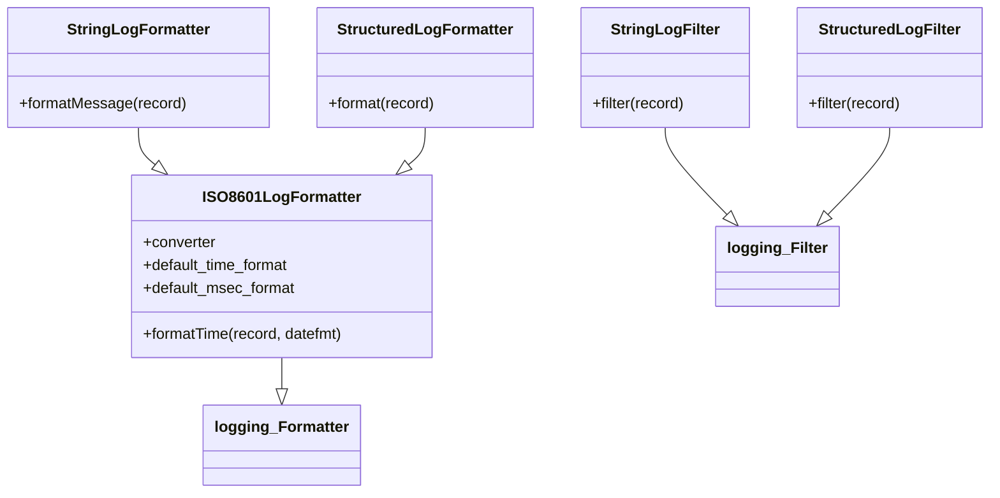

# Diagram: application_service/container_tracking_app_service/common/log.py


> Auto-generated by Obscura crawlers

## Diagram 1



### SVG

<svg id="container" width="1032.3203125" xmlns="http://www.w3.org/2000/svg" class="classDiagram" height="518" viewBox="0 0 1032.3203125 518" role="graphics-document document" aria-roledescription="class"><style>#container{font-family:"trebuchet ms",verdana,arial,sans-serif;font-size:16px;fill:#333;}@keyframes edge-animation-frame{from{stroke-dashoffset:0;}}@keyframes dash{to{stroke-dashoffset:0;}}#container .edge-animation-slow{stroke-dasharray:9,5!important;stroke-dashoffset:900;animation:dash 50s linear infinite;stroke-linecap:round;}#container .edge-animation-fast{stroke-dasharray:9,5!important;stroke-dashoffset:900;animation:dash 20s linear infinite;stroke-linecap:round;}#container .error-icon{fill:#552222;}#container .error-text{fill:#552222;stroke:#552222;}#container .edge-thickness-normal{stroke-width:1px;}#container .edge-thickness-thick{stroke-width:3.5px;}#container .edge-pattern-solid{stroke-dasharray:0;}#container .edge-thickness-invisible{stroke-width:0;fill:none;}#container .edge-pattern-dashed{stroke-dasharray:3;}#container .edge-pattern-dotted{stroke-dasharray:2;}#container .marker{fill:#333333;stroke:#333333;}#container .marker.cross{stroke:#333333;}#container svg{font-family:"trebuchet ms",verdana,arial,sans-serif;font-size:16px;}#container p{margin:0;}#container g.classGroup text{fill:#9370DB;stroke:none;font-family:"trebuchet ms",verdana,arial,sans-serif;font-size:10px;}#container g.classGroup text .title{font-weight:bolder;}#container .nodeLabel,#container .edgeLabel{color:#131300;}#container .edgeLabel .label rect{fill:#ECECFF;}#container .label text{fill:#131300;}#container .labelBkg{background:#ECECFF;}#container .edgeLabel .label span{background:#ECECFF;}#container .classTitle{font-weight:bolder;}#container .node rect,#container .node circle,#container .node ellipse,#container .node polygon,#container .node path{fill:#ECECFF;stroke:#9370DB;stroke-width:1px;}#container .divider{stroke:#9370DB;stroke-width:1;}#container g.clickable{cursor:pointer;}#container g.classGroup rect{fill:#ECECFF;stroke:#9370DB;}#container g.classGroup line{stroke:#9370DB;stroke-width:1;}#container .classLabel .box{stroke:none;stroke-width:0;fill:#ECECFF;opacity:0.5;}#container .classLabel .label{fill:#9370DB;font-size:10px;}#container .relation{stroke:#333333;stroke-width:1;fill:none;}#container .dashed-line{stroke-dasharray:3;}#container .dotted-line{stroke-dasharray:1 2;}#container #compositionStart,#container .composition{fill:#333333!important;stroke:#333333!important;stroke-width:1;}#container #compositionEnd,#container .composition{fill:#333333!important;stroke:#333333!important;stroke-width:1;}#container #dependencyStart,#container .dependency{fill:#333333!important;stroke:#333333!important;stroke-width:1;}#container #dependencyStart,#container .dependency{fill:#333333!important;stroke:#333333!important;stroke-width:1;}#container #extensionStart,#container .extension{fill:transparent!important;stroke:#333333!important;stroke-width:1;}#container #extensionEnd,#container .extension{fill:transparent!important;stroke:#333333!important;stroke-width:1;}#container #aggregationStart,#container .aggregation{fill:transparent!important;stroke:#333333!important;stroke-width:1;}#container #aggregationEnd,#container .aggregation{fill:transparent!important;stroke:#333333!important;stroke-width:1;}#container #lollipopStart,#container .lollipop{fill:#ECECFF!important;stroke:#333333!important;stroke-width:1;}#container #lollipopEnd,#container .lollipop{fill:#ECECFF!important;stroke:#333333!important;stroke-width:1;}#container .edgeTerminals{font-size:11px;line-height:initial;}#container .classTitleText{text-anchor:middle;font-size:18px;fill:#333;}#container .label-icon{display:inline-block;height:1em;overflow:visible;vertical-align:-0.125em;}#container .node .label-icon path{fill:currentColor;stroke:revert;stroke-width:revert;}#container :root{--mermaid-font-family:"trebuchet ms",verdana,arial,sans-serif;}</style><g><defs><marker id="container_class-aggregationStart" class="marker aggregation class" refX="18" refY="7" markerWidth="190" markerHeight="240" orient="auto"><path d="M 18,7 L9,13 L1,7 L9,1 Z"></path></marker></defs><defs><marker id="container_class-aggregationEnd" class="marker aggregation class" refX="1" refY="7" markerWidth="20" markerHeight="28" orient="auto"><path d="M 18,7 L9,13 L1,7 L9,1 Z"></path></marker></defs><defs><marker id="container_class-extensionStart" class="marker extension class" refX="18" refY="7" markerWidth="190" markerHeight="240" orient="auto"><path d="M 1,7 L18,13 V 1 Z"></path></marker></defs><defs><marker id="container_class-extensionEnd" class="marker extension class" refX="1" refY="7" markerWidth="20" markerHeight="28" orient="auto"><path d="M 1,1 V 13 L18,7 Z"></path></marker></defs><defs><marker id="container_class-compositionStart" class="marker composition class" refX="18" refY="7" markerWidth="190" markerHeight="240" orient="auto"><path d="M 18,7 L9,13 L1,7 L9,1 Z"></path></marker></defs><defs><marker id="container_class-compositionEnd" class="marker composition class" refX="1" refY="7" markerWidth="20" markerHeight="28" orient="auto"><path d="M 18,7 L9,13 L1,7 L9,1 Z"></path></marker></defs><defs><marker id="container_class-dependencyStart" class="marker dependency class" refX="6" refY="7" markerWidth="190" markerHeight="240" orient="auto"><path d="M 5,7 L9,13 L1,7 L9,1 Z"></path></marker></defs><defs><marker id="container_class-dependencyEnd" class="marker dependency class" refX="13" refY="7" markerWidth="20" markerHeight="28" orient="auto"><path d="M 18,7 L9,13 L14,7 L9,1 Z"></path></marker></defs><defs><marker id="container_class-lollipopStart" class="marker lollipop class" refX="13" refY="7" markerWidth="190" markerHeight="240" orient="auto"><circle stroke="black" fill="transparent" cx="7" cy="7" r="6"></circle></marker></defs><defs><marker id="container_class-lollipopEnd" class="marker lollipop class" refX="1" refY="7" markerWidth="190" markerHeight="240" orient="auto"><circle stroke="black" fill="transparent" cx="7" cy="7" r="6"></circle></marker></defs><g class="root"><g class="clusters"></g><g class="edgePaths"><path d="M291.904,376L291.904,380.167C291.904,384.333,291.904,392.667,291.904,398.125C291.904,403.583,291.904,406.167,291.904,407.458L291.904,408.75" id="id_ISO8601LogFormatter_logging_Formatter_1" class="edge-thickness-normal edge-pattern-solid relation" style=";;;" data-edge="true" data-et="edge" data-id="id_ISO8601LogFormatter_logging_Formatter_1" data-points="W3sieCI6MjkxLjkwNDI5Njg3NSwieSI6Mzc2fSx7IngiOjI5MS45MDQyOTY4NzUsInkiOjQwMX0seyJ4IjoyOTEuOTA0Mjk2ODc1LCJ5Ijo0MjZ9XQ==" marker-end="url(#container_class-extensionEnd)"></path><path d="M142.969,134L142.969,138.167C142.969,142.333,142.969,150.667,145.866,157.187C148.763,163.708,154.558,168.415,157.455,170.769L160.352,173.123" id="id_StringLogFormatter_ISO8601LogFormatter_2" class="edge-thickness-normal edge-pattern-solid relation" style=";;;" data-edge="true" data-et="edge" data-id="id_StringLogFormatter_ISO8601LogFormatter_2" data-points="W3sieCI6MTQyLjk2ODc1LCJ5IjoxMzR9LHsieCI6MTQyLjk2ODc1LCJ5IjoxNTl9LHsieCI6MTczLjc0MDU1NzIwNTU3ODUsInkiOjE4NH1d" marker-end="url(#container_class-extensionEnd)"></path><path d="M440.84,134L440.84,138.167C440.84,142.333,440.84,150.667,437.943,157.187C435.045,163.708,429.251,168.415,426.354,170.769L423.456,173.123" id="id_StructuredLogFormatter_ISO8601LogFormatter_3" class="edge-thickness-normal edge-pattern-solid relation" style=";;;" data-edge="true" data-et="edge" data-id="id_StructuredLogFormatter_ISO8601LogFormatter_3" data-points="W3sieCI6NDQwLjgzOTg0Mzc1LCJ5IjoxMzR9LHsieCI6NDQwLjgzOTg0Mzc1LCJ5IjoxNTl9LHsieCI6NDEwLjA2ODAzNjU0NDQyMTUsInkiOjE4NH1d" marker-end="url(#container_class-extensionEnd)"></path><path d="M692.145,134L692.145,138.167C692.145,142.333,692.145,150.667,702.942,165.939C713.739,181.211,735.334,203.421,746.131,214.527L756.929,225.632" id="id_StringLogFilter_logging_Filter_4" class="edge-thickness-normal edge-pattern-solid relation" style=";;;" data-edge="true" data-et="edge" data-id="id_StringLogFilter_logging_Filter_4" data-points="W3sieCI6NjkyLjE0NDUzMTI1LCJ5IjoxMzR9LHsieCI6NjkyLjE0NDUzMTI1LCJ5IjoxNTl9LHsieCI6NzY4Ljk1Mzc3MDY2MTE1NywieSI6MjM4fV0=" marker-end="url(#container_class-extensionEnd)"></path><path d="M927.434,134L927.434,138.167C927.434,142.333,927.434,150.667,916.636,165.939C905.839,181.211,884.244,203.421,873.447,214.527L862.649,225.632" id="id_StructuredLogFilter_logging_Filter_5" class="edge-thickness-normal edge-pattern-solid relation" style=";;;" data-edge="true" data-et="edge" data-id="id_StructuredLogFilter_logging_Filter_5" data-points="W3sieCI6OTI3LjQzMzU5Mzc1LCJ5IjoxMzR9LHsieCI6OTI3LjQzMzU5Mzc1LCJ5IjoxNTl9LHsieCI6ODUwLjYyNDM1NDMzODg0MywieSI6MjM4fV0=" marker-end="url(#container_class-extensionEnd)"></path></g><g class="edgeLabels"><g class="edgeLabel"><g class="label" data-id="id_ISO8601LogFormatter_logging_Formatter_1" transform="translate(0, 0)"><foreignObject width="0" height="0"><div xmlns="http://www.w3.org/1999/xhtml" class="labelBkg" style="display: table-cell; white-space: nowrap; line-height: 1.5; max-width: 200px; text-align: center;"><span class="edgeLabel"></span></div></foreignObject></g></g><g class="edgeLabel"><g class="label" data-id="id_StringLogFormatter_ISO8601LogFormatter_2" transform="translate(0, 0)"><foreignObject width="0" height="0"><div xmlns="http://www.w3.org/1999/xhtml" class="labelBkg" style="display: table-cell; white-space: nowrap; line-height: 1.5; max-width: 200px; text-align: center;"><span class="edgeLabel"></span></div></foreignObject></g></g><g class="edgeLabel"><g class="label" data-id="id_StructuredLogFormatter_ISO8601LogFormatter_3" transform="translate(0, 0)"><foreignObject width="0" height="0"><div xmlns="http://www.w3.org/1999/xhtml" class="labelBkg" style="display: table-cell; white-space: nowrap; line-height: 1.5; max-width: 200px; text-align: center;"><span class="edgeLabel"></span></div></foreignObject></g></g><g class="edgeLabel"><g class="label" data-id="id_StringLogFilter_logging_Filter_4" transform="translate(0, 0)"><foreignObject width="0" height="0"><div xmlns="http://www.w3.org/1999/xhtml" class="labelBkg" style="display: table-cell; white-space: nowrap; line-height: 1.5; max-width: 200px; text-align: center;"><span class="edgeLabel"></span></div></foreignObject></g></g><g class="edgeLabel"><g class="label" data-id="id_StructuredLogFilter_logging_Filter_5" transform="translate(0, 0)"><foreignObject width="0" height="0"><div xmlns="http://www.w3.org/1999/xhtml" class="labelBkg" style="display: table-cell; white-space: nowrap; line-height: 1.5; max-width: 200px; text-align: center;"><span class="edgeLabel"></span></div></foreignObject></g></g></g><g class="nodes"><g class="node default" id="classId-ISO8601LogFormatter-0" transform="translate(291.904296875, 280)"><g class="basic label-container"><path d="M-158.5859375 -96 L158.5859375 -96 L158.5859375 96 L-158.5859375 96" stroke="none" stroke-width="0" fill="#ECECFF" style=""></path><path d="M-158.5859375 -96 C-42.17361042291073 -96, 74.23871665417855 -96, 158.5859375 -96 M-158.5859375 -96 C-60.027273749295645 -96, 38.53139000140871 -96, 158.5859375 -96 M158.5859375 -96 C158.5859375 -21.055809834130415, 158.5859375 53.88838033173917, 158.5859375 96 M158.5859375 -96 C158.5859375 -32.13704328069197, 158.5859375 31.72591343861606, 158.5859375 96 M158.5859375 96 C60.80682703920844 96, -36.972283421583114 96, -158.5859375 96 M158.5859375 96 C76.97872455496119 96, -4.628488390077621 96, -158.5859375 96 M-158.5859375 96 C-158.5859375 53.65150019494184, -158.5859375 11.303000389883678, -158.5859375 -96 M-158.5859375 96 C-158.5859375 31.92078744512591, -158.5859375 -32.15842510974818, -158.5859375 -96" stroke="#9370DB" stroke-width="1.3" fill="none" stroke-dasharray="0 0" style=""></path></g><g class="annotation-group text" transform="translate(0, -72)"></g><g class="label-group text" transform="translate(-79.109375, -72)"><g class="label" style="font-weight: bolder" transform="translate(0,-12)"><foreignObject width="158.21875" height="24"><div xmlns="http://www.w3.org/1999/xhtml" style="display: table-cell; white-space: nowrap; line-height: 1.5; max-width: 205px; text-align: center;"><span class="nodeLabel markdown-node-label" style=""><p>ISO8601LogFormatter</p></span></div></foreignObject></g></g><g class="members-group text" transform="translate(-146.5859375, -24)"><g class="label" style="" transform="translate(0,-12)"><foreignObject width="77.0625" height="24"><div xmlns="http://www.w3.org/1999/xhtml" style="display: table-cell; white-space: nowrap; line-height: 1.5; max-width: 135px; text-align: center;"><span class="nodeLabel markdown-node-label" style=""><p>+converter</p></span></div></foreignObject></g><g class="label" style="" transform="translate(0,12)"><foreignObject width="157.078125" height="24"><div xmlns="http://www.w3.org/1999/xhtml" style="display: table-cell; white-space: nowrap; line-height: 1.5; max-width: 215px; text-align: center;"><span class="nodeLabel markdown-node-label" style=""><p>+default_time_format</p></span></div></foreignObject></g><g class="label" style="" transform="translate(0,36)"><foreignObject width="162.546875" height="24"><div xmlns="http://www.w3.org/1999/xhtml" style="display: table-cell; white-space: nowrap; line-height: 1.5; max-width: 220px; text-align: center;"><span class="nodeLabel markdown-node-label" style=""><p>+default_msec_format</p></span></div></foreignObject></g></g><g class="methods-group text" transform="translate(-146.5859375, 72)"><g class="label" style="" transform="translate(0,-12)"><foreignObject width="214.0625" height="24"><div xmlns="http://www.w3.org/1999/xhtml" style="display: table-cell; white-space: nowrap; line-height: 1.5; max-width: 271px; text-align: center;"><span class="nodeLabel markdown-node-label" style=""><p>+formatTime(record, datefmt)</p></span></div></foreignObject></g></g><g class="divider" style=""><path d="M-158.5859375 -48 C-33.22674690689453 -48, 92.13244368621093 -48, 158.5859375 -48 M-158.5859375 -48 C-90.21392686099497 -48, -21.841916221989948 -48, 158.5859375 -48" stroke="#9370DB" stroke-width="1.3" fill="none" stroke-dasharray="0 0" style=""></path></g><g class="divider" style=""><path d="M-158.5859375 48 C-75.89600383297163 48, 6.7939298340567404 48, 158.5859375 48 M-158.5859375 48 C-67.18754289372106 48, 24.210851712557883 48, 158.5859375 48" stroke="#9370DB" stroke-width="1.3" fill="none" stroke-dasharray="0 0" style=""></path></g></g><g class="node default" id="classId-StringLogFormatter-1" transform="translate(142.96875, 71)"><g class="basic label-container"><path d="M-134.96875 -63 L134.96875 -63 L134.96875 63 L-134.96875 63" stroke="none" stroke-width="0" fill="#ECECFF" style=""></path><path d="M-134.96875 -63 C-35.79561309999144 -63, 63.377523800017116 -63, 134.96875 -63 M-134.96875 -63 C-37.52455933122994 -63, 59.919631337540125 -63, 134.96875 -63 M134.96875 -63 C134.96875 -18.100816784533947, 134.96875 26.798366430932106, 134.96875 63 M134.96875 -63 C134.96875 -35.55330627445451, 134.96875 -8.106612548909027, 134.96875 63 M134.96875 63 C33.420858801444496 63, -68.12703239711101 63, -134.96875 63 M134.96875 63 C41.30306840838314 63, -52.36261318323372 63, -134.96875 63 M-134.96875 63 C-134.96875 28.655242367414893, -134.96875 -5.689515265170215, -134.96875 -63 M-134.96875 63 C-134.96875 33.74390820849695, -134.96875 4.487816416993901, -134.96875 -63" stroke="#9370DB" stroke-width="1.3" fill="none" stroke-dasharray="0 0" style=""></path></g><g class="annotation-group text" transform="translate(0, -39)"></g><g class="label-group text" transform="translate(-71.4375, -39)"><g class="label" style="font-weight: bolder" transform="translate(0,-12)"><foreignObject width="142.875" height="24"><div xmlns="http://www.w3.org/1999/xhtml" style="display: table-cell; white-space: nowrap; line-height: 1.5; max-width: 190px; text-align: center;"><span class="nodeLabel markdown-node-label" style=""><p>StringLogFormatter</p></span></div></foreignObject></g></g><g class="members-group text" transform="translate(-122.96875, 9)"></g><g class="methods-group text" transform="translate(-122.96875, 39)"><g class="label" style="" transform="translate(0,-12)"><foreignObject width="174.5" height="24"><div xmlns="http://www.w3.org/1999/xhtml" style="display: table-cell; white-space: nowrap; line-height: 1.5; max-width: 232px; text-align: center;"><span class="nodeLabel markdown-node-label" style=""><p>+formatMessage(record)</p></span></div></foreignObject></g></g><g class="divider" style=""><path d="M-134.96875 -15 C-28.182111419577993 -15, 78.60452716084401 -15, 134.96875 -15 M-134.96875 -15 C-78.727825777878 -15, -22.486901555755992 -15, 134.96875 -15" stroke="#9370DB" stroke-width="1.3" fill="none" stroke-dasharray="0 0" style=""></path></g><g class="divider" style=""><path d="M-134.96875 9 C-37.50729983306047 9, 59.954150333879056 9, 134.96875 9 M-134.96875 9 C-72.74990439195537 9, -10.531058783910723 9, 134.96875 9" stroke="#9370DB" stroke-width="1.3" fill="none" stroke-dasharray="0 0" style=""></path></g></g><g class="node default" id="classId-StructuredLogFormatter-2" transform="translate(440.83984375, 71)"><g class="basic label-container"><path d="M-112.90234375 -63 L112.90234375 -63 L112.90234375 63 L-112.90234375 63" stroke="none" stroke-width="0" fill="#ECECFF" style=""></path><path d="M-112.90234375 -63 C-27.020981253805644 -63, 58.86038124238871 -63, 112.90234375 -63 M-112.90234375 -63 C-23.956040664124018 -63, 64.99026242175196 -63, 112.90234375 -63 M112.90234375 -63 C112.90234375 -14.150016282401452, 112.90234375 34.699967435197095, 112.90234375 63 M112.90234375 -63 C112.90234375 -36.05265955494637, 112.90234375 -9.10531910989274, 112.90234375 63 M112.90234375 63 C53.913111518151204 63, -5.076120713697591 63, -112.90234375 63 M112.90234375 63 C32.98638336494923 63, -46.92957702010153 63, -112.90234375 63 M-112.90234375 63 C-112.90234375 19.388635540541443, -112.90234375 -24.222728918917113, -112.90234375 -63 M-112.90234375 63 C-112.90234375 29.831957280057146, -112.90234375 -3.336085439885707, -112.90234375 -63" stroke="#9370DB" stroke-width="1.3" fill="none" stroke-dasharray="0 0" style=""></path></g><g class="annotation-group text" transform="translate(0, -39)"></g><g class="label-group text" transform="translate(-88.4140625, -39)"><g class="label" style="font-weight: bolder" transform="translate(0,-12)"><foreignObject width="176.828125" height="24"><div xmlns="http://www.w3.org/1999/xhtml" style="display: table-cell; white-space: nowrap; line-height: 1.5; max-width: 224px; text-align: center;"><span class="nodeLabel markdown-node-label" style=""><p>StructuredLogFormatter</p></span></div></foreignObject></g></g><g class="members-group text" transform="translate(-100.90234375, 9)"></g><g class="methods-group text" transform="translate(-100.90234375, 39)"><g class="label" style="" transform="translate(0,-12)"><foreignObject width="113.390625" height="24"><div xmlns="http://www.w3.org/1999/xhtml" style="display: table-cell; white-space: nowrap; line-height: 1.5; max-width: 171px; text-align: center;"><span class="nodeLabel markdown-node-label" style=""><p>+format(record)</p></span></div></foreignObject></g></g><g class="divider" style=""><path d="M-112.90234375 -15 C-49.597589296175016 -15, 13.707165157649968 -15, 112.90234375 -15 M-112.90234375 -15 C-48.49857613147877 -15, 15.905191487042458 -15, 112.90234375 -15" stroke="#9370DB" stroke-width="1.3" fill="none" stroke-dasharray="0 0" style=""></path></g><g class="divider" style=""><path d="M-112.90234375 9 C-64.38367174697194 9, -15.864999743943883 9, 112.90234375 9 M-112.90234375 9 C-62.74271896587442 9, -12.583094181748834 9, 112.90234375 9" stroke="#9370DB" stroke-width="1.3" fill="none" stroke-dasharray="0 0" style=""></path></g></g><g class="node default" id="classId-StringLogFilter-3" transform="translate(692.14453125, 71)"><g class="basic label-container"><path d="M-88.40234375 -63 L88.40234375 -63 L88.40234375 63 L-88.40234375 63" stroke="none" stroke-width="0" fill="#ECECFF" style=""></path><path d="M-88.40234375 -63 C-35.99973390486552 -63, 16.402875940268956 -63, 88.40234375 -63 M-88.40234375 -63 C-50.79971732907898 -63, -13.19709090815796 -63, 88.40234375 -63 M88.40234375 -63 C88.40234375 -37.23568005487997, 88.40234375 -11.471360109759942, 88.40234375 63 M88.40234375 -63 C88.40234375 -34.45133862415129, 88.40234375 -5.902677248302581, 88.40234375 63 M88.40234375 63 C42.79945423593264 63, -2.803435278134714 63, -88.40234375 63 M88.40234375 63 C18.769180582211646 63, -50.86398258557671 63, -88.40234375 63 M-88.40234375 63 C-88.40234375 37.429136988275545, -88.40234375 11.85827397655109, -88.40234375 -63 M-88.40234375 63 C-88.40234375 19.901603532404934, -88.40234375 -23.196792935190132, -88.40234375 -63" stroke="#9370DB" stroke-width="1.3" fill="none" stroke-dasharray="0 0" style=""></path></g><g class="annotation-group text" transform="translate(0, -39)"></g><g class="label-group text" transform="translate(-54.0078125, -39)"><g class="label" style="font-weight: bolder" transform="translate(0,-12)"><foreignObject width="108.015625" height="24"><div xmlns="http://www.w3.org/1999/xhtml" style="display: table-cell; white-space: nowrap; line-height: 1.5; max-width: 156px; text-align: center;"><span class="nodeLabel markdown-node-label" style=""><p>StringLogFilter</p></span></div></foreignObject></g></g><g class="members-group text" transform="translate(-76.40234375, 9)"></g><g class="methods-group text" transform="translate(-76.40234375, 39)"><g class="label" style="" transform="translate(0,-12)"><foreignObject width="98.796875" height="24"><div xmlns="http://www.w3.org/1999/xhtml" style="display: table-cell; white-space: nowrap; line-height: 1.5; max-width: 156px; text-align: center;"><span class="nodeLabel markdown-node-label" style=""><p>+filter(record)</p></span></div></foreignObject></g></g><g class="divider" style=""><path d="M-88.40234375 -15 C-33.28604171221139 -15, 21.830260325577214 -15, 88.40234375 -15 M-88.40234375 -15 C-25.61650771019395 -15, 37.1693283296121 -15, 88.40234375 -15" stroke="#9370DB" stroke-width="1.3" fill="none" stroke-dasharray="0 0" style=""></path></g><g class="divider" style=""><path d="M-88.40234375 9 C-49.94781707514529 9, -11.493290400290576 9, 88.40234375 9 M-88.40234375 9 C-30.40209490150054 9, 27.59815394699892 9, 88.40234375 9" stroke="#9370DB" stroke-width="1.3" fill="none" stroke-dasharray="0 0" style=""></path></g></g><g class="node default" id="classId-StructuredLogFilter-4" transform="translate(927.43359375, 71)"><g class="basic label-container"><path d="M-96.88671875 -63 L96.88671875 -63 L96.88671875 63 L-96.88671875 63" stroke="none" stroke-width="0" fill="#ECECFF" style=""></path><path d="M-96.88671875 -63 C-52.70266025978736 -63, -8.518601769574715 -63, 96.88671875 -63 M-96.88671875 -63 C-43.959309140830655 -63, 8.96810046833869 -63, 96.88671875 -63 M96.88671875 -63 C96.88671875 -20.613146167353534, 96.88671875 21.773707665292932, 96.88671875 63 M96.88671875 -63 C96.88671875 -24.065923962885975, 96.88671875 14.86815207422805, 96.88671875 63 M96.88671875 63 C29.018226112528808 63, -38.850266524942384 63, -96.88671875 63 M96.88671875 63 C52.456015345422735 63, 8.02531194084547 63, -96.88671875 63 M-96.88671875 63 C-96.88671875 31.20546356059153, -96.88671875 -0.5890728788169426, -96.88671875 -63 M-96.88671875 63 C-96.88671875 14.122595384984159, -96.88671875 -34.75480923003168, -96.88671875 -63" stroke="#9370DB" stroke-width="1.3" fill="none" stroke-dasharray="0 0" style=""></path></g><g class="annotation-group text" transform="translate(0, -39)"></g><g class="label-group text" transform="translate(-70.9765625, -39)"><g class="label" style="font-weight: bolder" transform="translate(0,-12)"><foreignObject width="141.953125" height="24"><div xmlns="http://www.w3.org/1999/xhtml" style="display: table-cell; white-space: nowrap; line-height: 1.5; max-width: 190px; text-align: center;"><span class="nodeLabel markdown-node-label" style=""><p>StructuredLogFilter</p></span></div></foreignObject></g></g><g class="members-group text" transform="translate(-84.88671875, 9)"></g><g class="methods-group text" transform="translate(-84.88671875, 39)"><g class="label" style="" transform="translate(0,-12)"><foreignObject width="98.796875" height="24"><div xmlns="http://www.w3.org/1999/xhtml" style="display: table-cell; white-space: nowrap; line-height: 1.5; max-width: 156px; text-align: center;"><span class="nodeLabel markdown-node-label" style=""><p>+filter(record)</p></span></div></foreignObject></g></g><g class="divider" style=""><path d="M-96.88671875 -15 C-48.74130509697174 -15, -0.5958914439434864 -15, 96.88671875 -15 M-96.88671875 -15 C-24.782059123043737 -15, 47.322600503912525 -15, 96.88671875 -15" stroke="#9370DB" stroke-width="1.3" fill="none" stroke-dasharray="0 0" style=""></path></g><g class="divider" style=""><path d="M-96.88671875 9 C-34.78887493374258 9, 27.308968882514833 9, 96.88671875 9 M-96.88671875 9 C-50.64924146777191 9, -4.4117641855438166 9, 96.88671875 9" stroke="#9370DB" stroke-width="1.3" fill="none" stroke-dasharray="0 0" style=""></path></g></g><g class="node default" id="classId-logging_Formatter-5" transform="translate(291.904296875, 468)"><g class="basic label-container"><path d="M-79.625 -42 L79.625 -42 L79.625 42 L-79.625 42" stroke="none" stroke-width="0" fill="#ECECFF" style=""></path><path d="M-79.625 -42 C-27.5761612748364 -42, 24.472677450327197 -42, 79.625 -42 M-79.625 -42 C-25.747329085298816 -42, 28.13034182940237 -42, 79.625 -42 M79.625 -42 C79.625 -9.137575980081287, 79.625 23.724848039837426, 79.625 42 M79.625 -42 C79.625 -21.265765384004663, 79.625 -0.5315307680093255, 79.625 42 M79.625 42 C16.196579231261722 42, -47.231841537476555 42, -79.625 42 M79.625 42 C44.0035325772985 42, 8.382065154597 42, -79.625 42 M-79.625 42 C-79.625 14.053525715575155, -79.625 -13.89294856884969, -79.625 -42 M-79.625 42 C-79.625 20.938989381044, -79.625 -0.12202123791200137, -79.625 -42" stroke="#9370DB" stroke-width="1.3" fill="none" stroke-dasharray="0 0" style=""></path></g><g class="annotation-group text" transform="translate(0, -18)"></g><g class="label-group text" transform="translate(-67.625, -18)"><g class="label" style="font-weight: bolder" transform="translate(0,-12)"><foreignObject width="135.25" height="24"><div xmlns="http://www.w3.org/1999/xhtml" style="display: table-cell; white-space: nowrap; line-height: 1.5; max-width: 183px; text-align: center;"><span class="nodeLabel markdown-node-label" style=""><p>logging_Formatter</p></span></div></foreignObject></g></g><g class="members-group text" transform="translate(-67.625, 30)"></g><g class="methods-group text" transform="translate(-67.625, 60)"></g><g class="divider" style=""><path d="M-79.625 6 C-23.143211065670727 6, 33.33857786865855 6, 79.625 6 M-79.625 6 C-26.636965210124046 6, 26.351069579751908 6, 79.625 6" stroke="#9370DB" stroke-width="1.3" fill="none" stroke-dasharray="0 0" style=""></path></g><g class="divider" style=""><path d="M-79.625 24 C-31.37584787340308 24, 16.873304253193837 24, 79.625 24 M-79.625 24 C-30.784196473746952 24, 18.056607052506095 24, 79.625 24" stroke="#9370DB" stroke-width="1.3" fill="none" stroke-dasharray="0 0" style=""></path></g></g><g class="node default" id="classId-logging_Filter-6" transform="translate(809.7890625, 280)"><g class="basic label-container"><path d="M-62.1953125 -42 L62.1953125 -42 L62.1953125 42 L-62.1953125 42" stroke="none" stroke-width="0" fill="#ECECFF" style=""></path><path d="M-62.1953125 -42 C-29.931507458969847 -42, 2.3322975820603062 -42, 62.1953125 -42 M-62.1953125 -42 C-15.190929458615017 -42, 31.813453582769966 -42, 62.1953125 -42 M62.1953125 -42 C62.1953125 -18.31540392339294, 62.1953125 5.369192153214122, 62.1953125 42 M62.1953125 -42 C62.1953125 -24.32358203651807, 62.1953125 -6.647164073036137, 62.1953125 42 M62.1953125 42 C36.89354555871101 42, 11.591778617422023 42, -62.1953125 42 M62.1953125 42 C26.084123995441423 42, -10.027064509117153 42, -62.1953125 42 M-62.1953125 42 C-62.1953125 21.270554878255567, -62.1953125 0.5411097565111334, -62.1953125 -42 M-62.1953125 42 C-62.1953125 23.732893040649113, -62.1953125 5.465786081298226, -62.1953125 -42" stroke="#9370DB" stroke-width="1.3" fill="none" stroke-dasharray="0 0" style=""></path></g><g class="annotation-group text" transform="translate(0, -18)"></g><g class="label-group text" transform="translate(-50.1953125, -18)"><g class="label" style="font-weight: bolder" transform="translate(0,-12)"><foreignObject width="100.390625" height="24"><div xmlns="http://www.w3.org/1999/xhtml" style="display: table-cell; white-space: nowrap; line-height: 1.5; max-width: 149px; text-align: center;"><span class="nodeLabel markdown-node-label" style=""><p>logging_Filter</p></span></div></foreignObject></g></g><g class="members-group text" transform="translate(-50.1953125, 30)"></g><g class="methods-group text" transform="translate(-50.1953125, 60)"></g><g class="divider" style=""><path d="M-62.1953125 6 C-25.214902415157255 6, 11.76550766968549 6, 62.1953125 6 M-62.1953125 6 C-27.682887185089854 6, 6.829538129820293 6, 62.1953125 6" stroke="#9370DB" stroke-width="1.3" fill="none" stroke-dasharray="0 0" style=""></path></g><g class="divider" style=""><path d="M-62.1953125 24 C-32.382637821467455 24, -2.569963142934917 24, 62.1953125 24 M-62.1953125 24 C-28.06197286571185 24, 6.071366768576297 24, 62.1953125 24" stroke="#9370DB" stroke-width="1.3" fill="none" stroke-dasharray="0 0" style=""></path></g></g></g></g></g></svg>

## Diagram 2

```mermaid
flowchart TD
    Start([Start])
    EventCall((Lambda/Event or direct call))
    CheckEnabled{is_logging_enabled(context)?}
    Decorator[config_logging decorator -> conf(event, context)]
    ConfigureFunction[configure_logging(log_level, log_format, request_id)]
    RemoveHandlers[/Remove existing root logger handlers/]
    DetermineLevel{LOG_LEVEL env var set?}
    SetLevel[/Set root logger level (get_log_level or default)/]
    CreateStructured[/Create StructuredLogFormatter and StructuredLogFilter/]
    CreateString[/Create StringLogFormatter and StringLogFilter/]
    AddHandlers[/Add handlers to root logger/]
    CallFunc[Invoke wrapped function / return func(event, context)]
    SkipSetup([Logging disabled -> Skip setup])
    End([End])

    Start --> EventCall
    EventCall --> CheckEnabled
    CheckEnabled -- Yes --> Decorator
    Decorator --> RemoveHandlers
    RemoveHandlers --> DetermineLevel
    DetermineLevel --> SetLevel
    SetLevel --> CreateStructured
    CreateStructured --> CreateString
    CreateString --> AddHandlers
    AddHandlers --> CallFunc
    CheckEnabled -- No --> SkipSetup
    SkipSetup --> CallFunc
    CallFunc --> End
```

> SVG rendering failed for this diagram.
