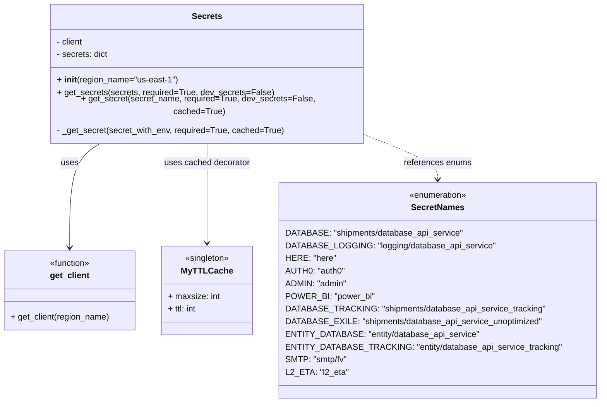

# Diagram: application_service/container_tracking_app_service/common/secrets/__init__.py


> Auto-generated by Obscura crawlers

## Diagram 1



### SVG

<svg id="container" width="1112.6796875" xmlns="http://www.w3.org/2000/svg" class="classDiagram" height="738" viewBox="0 0 1112.6796875 738" role="graphics-document document" aria-roledescription="class"><style>#container{font-family:"trebuchet ms",verdana,arial,sans-serif;font-size:16px;fill:#333;}@keyframes edge-animation-frame{from{stroke-dashoffset:0;}}@keyframes dash{to{stroke-dashoffset:0;}}#container .edge-animation-slow{stroke-dasharray:9,5!important;stroke-dashoffset:900;animation:dash 50s linear infinite;stroke-linecap:round;}#container .edge-animation-fast{stroke-dasharray:9,5!important;stroke-dashoffset:900;animation:dash 20s linear infinite;stroke-linecap:round;}#container .error-icon{fill:#552222;}#container .error-text{fill:#552222;stroke:#552222;}#container .edge-thickness-normal{stroke-width:1px;}#container .edge-thickness-thick{stroke-width:3.5px;}#container .edge-pattern-solid{stroke-dasharray:0;}#container .edge-thickness-invisible{stroke-width:0;fill:none;}#container .edge-pattern-dashed{stroke-dasharray:3;}#container .edge-pattern-dotted{stroke-dasharray:2;}#container .marker{fill:#333333;stroke:#333333;}#container .marker.cross{stroke:#333333;}#container svg{font-family:"trebuchet ms",verdana,arial,sans-serif;font-size:16px;}#container p{margin:0;}#container g.classGroup text{fill:#9370DB;stroke:none;font-family:"trebuchet ms",verdana,arial,sans-serif;font-size:10px;}#container g.classGroup text .title{font-weight:bolder;}#container .nodeLabel,#container .edgeLabel{color:#131300;}#container .edgeLabel .label rect{fill:#ECECFF;}#container .label text{fill:#131300;}#container .labelBkg{background:#ECECFF;}#container .edgeLabel .label span{background:#ECECFF;}#container .classTitle{font-weight:bolder;}#container .node rect,#container .node circle,#container .node ellipse,#container .node polygon,#container .node path{fill:#ECECFF;stroke:#9370DB;stroke-width:1px;}#container .divider{stroke:#9370DB;stroke-width:1;}#container g.clickable{cursor:pointer;}#container g.classGroup rect{fill:#ECECFF;stroke:#9370DB;}#container g.classGroup line{stroke:#9370DB;stroke-width:1;}#container .classLabel .box{stroke:none;stroke-width:0;fill:#ECECFF;opacity:0.5;}#container .classLabel .label{fill:#9370DB;font-size:10px;}#container .relation{stroke:#333333;stroke-width:1;fill:none;}#container .dashed-line{stroke-dasharray:3;}#container .dotted-line{stroke-dasharray:1 2;}#container #compositionStart,#container .composition{fill:#333333!important;stroke:#333333!important;stroke-width:1;}#container #compositionEnd,#container .composition{fill:#333333!important;stroke:#333333!important;stroke-width:1;}#container #dependencyStart,#container .dependency{fill:#333333!important;stroke:#333333!important;stroke-width:1;}#container #dependencyStart,#container .dependency{fill:#333333!important;stroke:#333333!important;stroke-width:1;}#container #extensionStart,#container .extension{fill:transparent!important;stroke:#333333!important;stroke-width:1;}#container #extensionEnd,#container .extension{fill:transparent!important;stroke:#333333!important;stroke-width:1;}#container #aggregationStart,#container .aggregation{fill:transparent!important;stroke:#333333!important;stroke-width:1;}#container #aggregationEnd,#container .aggregation{fill:transparent!important;stroke:#333333!important;stroke-width:1;}#container #lollipopStart,#container .lollipop{fill:#ECECFF!important;stroke:#333333!important;stroke-width:1;}#container #lollipopEnd,#container .lollipop{fill:#ECECFF!important;stroke:#333333!important;stroke-width:1;}#container .edgeTerminals{font-size:11px;line-height:initial;}#container .classTitleText{text-anchor:middle;font-size:18px;fill:#333;}#container .label-icon{display:inline-block;height:1em;overflow:visible;vertical-align:-0.125em;}#container .node .label-icon path{fill:currentColor;stroke:revert;stroke-width:revert;}#container :root{--mermaid-font-family:"trebuchet ms",verdana,arial,sans-serif;}</style><g><defs><marker id="container_class-aggregationStart" class="marker aggregation class" refX="18" refY="7" markerWidth="190" markerHeight="240" orient="auto"><path d="M 18,7 L9,13 L1,7 L9,1 Z"></path></marker></defs><defs><marker id="container_class-aggregationEnd" class="marker aggregation class" refX="1" refY="7" markerWidth="20" markerHeight="28" orient="auto"><path d="M 18,7 L9,13 L1,7 L9,1 Z"></path></marker></defs><defs><marker id="container_class-extensionStart" class="marker extension class" refX="18" refY="7" markerWidth="190" markerHeight="240" orient="auto"><path d="M 1,7 L18,13 V 1 Z"></path></marker></defs><defs><marker id="container_class-extensionEnd" class="marker extension class" refX="1" refY="7" markerWidth="20" markerHeight="28" orient="auto"><path d="M 1,1 V 13 L18,7 Z"></path></marker></defs><defs><marker id="container_class-compositionStart" class="marker composition class" refX="18" refY="7" markerWidth="190" markerHeight="240" orient="auto"><path d="M 18,7 L9,13 L1,7 L9,1 Z"></path></marker></defs><defs><marker id="container_class-compositionEnd" class="marker composition class" refX="1" refY="7" markerWidth="20" markerHeight="28" orient="auto"><path d="M 18,7 L9,13 L1,7 L9,1 Z"></path></marker></defs><defs><marker id="container_class-dependencyStart" class="marker dependency class" refX="6" refY="7" markerWidth="190" markerHeight="240" orient="auto"><path d="M 5,7 L9,13 L1,7 L9,1 Z"></path></marker></defs><defs><marker id="container_class-dependencyEnd" class="marker dependency class" refX="13" refY="7" markerWidth="20" markerHeight="28" orient="auto"><path d="M 18,7 L9,13 L14,7 L9,1 Z"></path></marker></defs><defs><marker id="container_class-lollipopStart" class="marker lollipop class" refX="13" refY="7" markerWidth="190" markerHeight="240" orient="auto"><circle stroke="black" fill="transparent" cx="7" cy="7" r="6"></circle></marker></defs><defs><marker id="container_class-lollipopEnd" class="marker lollipop class" refX="1" refY="7" markerWidth="190" markerHeight="240" orient="auto"><circle stroke="black" fill="transparent" cx="7" cy="7" r="6"></circle></marker></defs><g class="root"><g class="clusters"></g><g class="edgePaths"><path d="M195.176,248L184.994,254.167C174.812,260.333,154.449,272.667,144.268,305.5C134.086,338.333,134.086,391.667,134.086,418.333L134.086,445" id="id_Secrets_get_client_1" class="edge-thickness-normal edge-pattern-solid relation" style=";;;" data-edge="true" data-et="edge" data-id="id_Secrets_get_client_1" data-points="W3sieCI6MTk1LjE3NTcwNjYwODI4MDI1LCJ5IjoyNDh9LHsieCI6MTM0LjA4NTkzNzUsInkiOjI4NX0seyJ4IjoxMzQuMDg1OTM3NSwieSI6NDUxfV0=" marker-end="url(#container_class-dependencyEnd)"></path><path d="M393.305,248L393.305,254.167C393.305,260.333,393.305,272.667,393.305,304C393.305,335.333,393.305,385.667,393.305,410.833L393.305,436" id="id_Secrets_MyTTLCache_2" class="edge-thickness-normal edge-pattern-solid relation" style=";;;" data-edge="true" data-et="edge" data-id="id_Secrets_MyTTLCache_2" data-points="W3sieCI6MzkzLjMwNDY4NzUsInkiOjI0OH0seyJ4IjozOTMuMzA0Njg3NSwieSI6Mjg1fSx7IngiOjM5My4zMDQ2ODc1LCJ5Ijo0NDJ9XQ==" marker-end="url(#container_class-dependencyEnd)"></path><path d="M687.48,237.379L708.827,245.316C730.173,253.252,772.866,269.126,794.212,282.23C815.559,295.333,815.559,305.667,815.559,310.833L815.559,316" id="id_Secrets_SecretNames_3" class="edge-thickness-normal edge-pattern-dashed relation" style=";;;" data-edge="true" data-et="edge" data-id="id_Secrets_SecretNames_3" data-points="W3sieCI6Njg3LjQ4MDQ2ODc1LCJ5IjoyMzcuMzc4NzMzOTE0OTA5NzZ9LHsieCI6ODE1LjU1ODU5Mzc1LCJ5IjoyODV9LHsieCI6ODE1LjU1ODU5Mzc1LCJ5IjozMjJ9XQ==" marker-end="url(#container_class-dependencyEnd)"></path></g><g class="edgeLabels"><g class="edgeLabel" transform="translate(134.0859375, 285)"><g class="label" data-id="id_Secrets_get_client_1" transform="translate(-16.4921875, -12)"><foreignObject width="32.984375" height="24"><div xmlns="http://www.w3.org/1999/xhtml" class="labelBkg" style="display: table-cell; white-space: nowrap; line-height: 1.5; max-width: 200px; text-align: center;"><span class="edgeLabel"><p>uses</p></span></div></foreignObject></g></g><g class="edgeLabel" transform="translate(393.3046875, 285)"><g class="label" data-id="id_Secrets_MyTTLCache_2" transform="translate(-81.6484375, -12)"><foreignObject width="163.296875" height="24"><div xmlns="http://www.w3.org/1999/xhtml" class="labelBkg" style="display: table-cell; white-space: nowrap; line-height: 1.5; max-width: 200px; text-align: center;"><span class="edgeLabel"><p>uses cached decorator</p></span></div></foreignObject></g></g><g class="edgeLabel" transform="translate(815.55859375, 285)"><g class="label" data-id="id_Secrets_SecretNames_3" transform="translate(-64.2421875, -12)"><foreignObject width="128.484375" height="24"><div xmlns="http://www.w3.org/1999/xhtml" class="labelBkg" style="display: table-cell; white-space: nowrap; line-height: 1.5; max-width: 200px; text-align: center;"><span class="edgeLabel"><p>references enums</p></span></div></foreignObject></g></g></g><g class="nodes"><g class="node default" id="classId-SecretNames-0" transform="translate(815.55859375, 526)"><g class="basic label-container"><path d="M-289.12109375 -204 L289.12109375 -204 L289.12109375 204 L-289.12109375 204" stroke="none" stroke-width="0" fill="#ECECFF" style=""></path><path d="M-289.12109375 -204 C-151.046855039661 -204, -12.972616329322022 -204, 289.12109375 -204 M-289.12109375 -204 C-150.9901488377361 -204, -12.859203925472173 -204, 289.12109375 -204 M289.12109375 -204 C289.12109375 -94.93733727364544, 289.12109375 14.12532545270912, 289.12109375 204 M289.12109375 -204 C289.12109375 -100.11877800652478, 289.12109375 3.7624439869504442, 289.12109375 204 M289.12109375 204 C126.6415410911913 204, -35.8380115676174 204, -289.12109375 204 M289.12109375 204 C162.1171833746286 204, 35.11327299925722 204, -289.12109375 204 M-289.12109375 204 C-289.12109375 71.04429688307499, -289.12109375 -61.911406233850016, -289.12109375 -204 M-289.12109375 204 C-289.12109375 104.42113854179506, -289.12109375 4.842277083590119, -289.12109375 -204" stroke="#9370DB" stroke-width="1.3" fill="none" stroke-dasharray="0 0" style=""></path></g><g class="annotation-group text" transform="translate(-55.5546875, -180)"><g class="label" style="" transform="translate(0,-12)"><foreignObject width="111.109375" height="24"><div xmlns="http://www.w3.org/1999/xhtml" style="display: table-cell; white-space: nowrap; line-height: 1.5; max-width: 161px; text-align: center;"><span class="nodeLabel markdown-node-label" style=""><p>«enumeration»</p></span></div></foreignObject></g></g><g class="label-group text" transform="translate(-48.03125, -156)"><g class="label" style="font-weight: bolder" transform="translate(0,-12)"><foreignObject width="96.0625" height="24"><div xmlns="http://www.w3.org/1999/xhtml" style="display: table-cell; white-space: nowrap; line-height: 1.5; max-width: 145px; text-align: center;"><span class="nodeLabel markdown-node-label" style=""><p>SecretNames</p></span></div></foreignObject></g></g><g class="members-group text" transform="translate(-277.12109375, -108)"><g class="label" style="" transform="translate(0,-12)"><foreignObject width="331.46875" height="24"><div xmlns="http://www.w3.org/1999/xhtml" style="display: table-cell; white-space: nowrap; line-height: 1.5; max-width: 381px; text-align: center;"><span class="nodeLabel markdown-node-label" style=""><p>DATABASE: "shipments/database_api_service"</p></span></div></foreignObject></g><g class="label" style="" transform="translate(0,12)"><foreignObject width="381.078125" height="24"><div xmlns="http://www.w3.org/1999/xhtml" style="display: table-cell; white-space: nowrap; line-height: 1.5; max-width: 431px; text-align: center;"><span class="nodeLabel markdown-node-label" style=""><p>DATABASE_LOGGING: "logging/database_api_service"</p></span></div></foreignObject></g><g class="label" style="" transform="translate(0,36)"><foreignObject width="90.890625" height="24"><div xmlns="http://www.w3.org/1999/xhtml" style="display: table-cell; white-space: nowrap; line-height: 1.5; max-width: 141px; text-align: center;"><span class="nodeLabel markdown-node-label" style=""><p>HERE: "here"</p></span></div></foreignObject></g><g class="label" style="" transform="translate(0,60)"><foreignObject width="110.234375" height="24"><div xmlns="http://www.w3.org/1999/xhtml" style="display: table-cell; white-space: nowrap; line-height: 1.5; max-width: 160px; text-align: center;"><span class="nodeLabel markdown-node-label" style=""><p>AUTH0: "auth0"</p></span></div></foreignObject></g><g class="label" style="" transform="translate(0,84)"><foreignObject width="113.78125" height="24"><div xmlns="http://www.w3.org/1999/xhtml" style="display: table-cell; white-space: nowrap; line-height: 1.5; max-width: 164px; text-align: center;"><span class="nodeLabel markdown-node-label" style=""><p>ADMIN: "admin"</p></span></div></foreignObject></g><g class="label" style="" transform="translate(0,108)"><foreignObject width="161.71875" height="24"><div xmlns="http://www.w3.org/1999/xhtml" style="display: table-cell; white-space: nowrap; line-height: 1.5; max-width: 212px; text-align: center;"><span class="nodeLabel markdown-node-label" style=""><p>POWER_BI: "power_bi"</p></span></div></foreignObject></g><g class="label" style="" transform="translate(0,132)"><foreignObject width="476.0625" height="24"><div xmlns="http://www.w3.org/1999/xhtml" style="display: table-cell; white-space: nowrap; line-height: 1.5; max-width: 526px; text-align: center;"><span class="nodeLabel markdown-node-label" style=""><p>DATABASE_TRACKING: "shipments/database_api_service_tracking"</p></span></div></foreignObject></g><g class="label" style="" transform="translate(0,156)"><foreignObject width="477.28125" height="24"><div xmlns="http://www.w3.org/1999/xhtml" style="display: table-cell; white-space: nowrap; line-height: 1.5; max-width: 527px; text-align: center;"><span class="nodeLabel markdown-node-label" style=""><p>DATABASE_EXILE: "shipments/database_api_service_unoptimized"</p></span></div></foreignObject></g><g class="label" style="" transform="translate(0,180)"><foreignObject width="354.09375" height="24"><div xmlns="http://www.w3.org/1999/xhtml" style="display: table-cell; white-space: nowrap; line-height: 1.5; max-width: 404px; text-align: center;"><span class="nodeLabel markdown-node-label" style=""><p>ENTITY_DATABASE: "entity/database_api_service"</p></span></div></foreignObject></g><g class="label" style="" transform="translate(0,204)"><foreignObject width="498.6875" height="24"><div xmlns="http://www.w3.org/1999/xhtml" style="display: table-cell; white-space: nowrap; line-height: 1.5; max-width: 549px; text-align: center;"><span class="nodeLabel markdown-node-label" style=""><p>ENTITY_DATABASE_TRACKING: "entity/database_api_service_tracking"</p></span></div></foreignObject></g><g class="label" style="" transform="translate(0,228)"><foreignObject width="116.5" height="24"><div xmlns="http://www.w3.org/1999/xhtml" style="display: table-cell; white-space: nowrap; line-height: 1.5; max-width: 167px; text-align: center;"><span class="nodeLabel markdown-node-label" style=""><p>SMTP: "smtp/fv"</p></span></div></foreignObject></g><g class="label" style="" transform="translate(0,252)"><foreignObject width="113.625" height="24"><div xmlns="http://www.w3.org/1999/xhtml" style="display: table-cell; white-space: nowrap; line-height: 1.5; max-width: 164px; text-align: center;"><span class="nodeLabel markdown-node-label" style=""><p>L2_ETA: "l2_eta"</p></span></div></foreignObject></g></g><g class="methods-group text" transform="translate(-277.12109375, 204)"></g><g class="divider" style=""><path d="M-289.12109375 -132 C-114.98982888742808 -132, 59.14143597514385 -132, 289.12109375 -132 M-289.12109375 -132 C-170.85907849968845 -132, -52.59706324937687 -132, 289.12109375 -132" stroke="#9370DB" stroke-width="1.3" fill="none" stroke-dasharray="0 0" style=""></path></g><g class="divider" style=""><path d="M-289.12109375 180 C-87.46369632586001 180, 114.19370109827997 180, 289.12109375 180 M-289.12109375 180 C-131.52282072713027 180, 26.075452295739467 180, 289.12109375 180" stroke="#9370DB" stroke-width="1.3" fill="none" stroke-dasharray="0 0" style=""></path></g></g><g class="node default" id="classId-MyTTLCache-1" transform="translate(393.3046875, 526)"><g class="basic label-container"><path d="M-83.1328125 -84 L83.1328125 -84 L83.1328125 84 L-83.1328125 84" stroke="none" stroke-width="0" fill="#ECECFF" style=""></path><path d="M-83.1328125 -84 C-23.79585264221801 -84, 35.54110721556398 -84, 83.1328125 -84 M-83.1328125 -84 C-40.194726046093514 -84, 2.743360407812972 -84, 83.1328125 -84 M83.1328125 -84 C83.1328125 -43.855355515873924, 83.1328125 -3.7107110317478487, 83.1328125 84 M83.1328125 -84 C83.1328125 -44.87727867930503, 83.1328125 -5.754557358610057, 83.1328125 84 M83.1328125 84 C36.39100813682298 84, -10.350796226354035 84, -83.1328125 84 M83.1328125 84 C45.307310177724865 84, 7.4818078554497305 84, -83.1328125 84 M-83.1328125 84 C-83.1328125 19.35118544149465, -83.1328125 -45.2976291170107, -83.1328125 -84 M-83.1328125 84 C-83.1328125 31.15099564785109, -83.1328125 -21.69800870429782, -83.1328125 -84" stroke="#9370DB" stroke-width="1.3" fill="none" stroke-dasharray="0 0" style=""></path></g><g class="annotation-group text" transform="translate(-42.765625, -60)"><g class="label" style="" transform="translate(0,-12)"><foreignObject width="85.53125" height="24"><div xmlns="http://www.w3.org/1999/xhtml" style="display: table-cell; white-space: nowrap; line-height: 1.5; max-width: 136px; text-align: center;"><span class="nodeLabel markdown-node-label" style=""><p>«singleton»</p></span></div></foreignObject></g></g><g class="label-group text" transform="translate(-44.609375, -36)"><g class="label" style="font-weight: bolder" transform="translate(0,-12)"><foreignObject width="89.21875" height="24"><div xmlns="http://www.w3.org/1999/xhtml" style="display: table-cell; white-space: nowrap; line-height: 1.5; max-width: 137px; text-align: center;"><span class="nodeLabel markdown-node-label" style=""><p>MyTTLCache</p></span></div></foreignObject></g></g><g class="members-group text" transform="translate(-71.1328125, 12)"><g class="label" style="" transform="translate(0,-12)"><foreignObject width="97.65625" height="24"><div xmlns="http://www.w3.org/1999/xhtml" style="display: table-cell; white-space: nowrap; line-height: 1.5; max-width: 155px; text-align: center;"><span class="nodeLabel markdown-node-label" style=""><p>+ maxsize: int</p></span></div></foreignObject></g><g class="label" style="" transform="translate(0,12)"><foreignObject width="56.21875" height="24"><div xmlns="http://www.w3.org/1999/xhtml" style="display: table-cell; white-space: nowrap; line-height: 1.5; max-width: 114px; text-align: center;"><span class="nodeLabel markdown-node-label" style=""><p>+ ttl: int</p></span></div></foreignObject></g></g><g class="methods-group text" transform="translate(-71.1328125, 84)"></g><g class="divider" style=""><path d="M-83.1328125 -12 C-16.8587329509608 -12, 49.4153465980784 -12, 83.1328125 -12 M-83.1328125 -12 C-40.50827985890292 -12, 2.1162527821941666 -12, 83.1328125 -12" stroke="#9370DB" stroke-width="1.3" fill="none" stroke-dasharray="0 0" style=""></path></g><g class="divider" style=""><path d="M-83.1328125 60 C-27.462559750189477 60, 28.207692999621045 60, 83.1328125 60 M-83.1328125 60 C-19.712945814377207 60, 43.706920871245586 60, 83.1328125 60" stroke="#9370DB" stroke-width="1.3" fill="none" stroke-dasharray="0 0" style=""></path></g></g><g class="node default" id="classId-get_client-2" transform="translate(134.0859375, 526)"><g class="basic label-container"><path d="M-126.0859375 -75 L126.0859375 -75 L126.0859375 75 L-126.0859375 75" stroke="none" stroke-width="0" fill="#ECECFF" style=""></path><path d="M-126.0859375 -75 C-55.91765484268264 -75, 14.250627814634726 -75, 126.0859375 -75 M-126.0859375 -75 C-35.83718404743388 -75, 54.41156940513224 -75, 126.0859375 -75 M126.0859375 -75 C126.0859375 -17.02819759886785, 126.0859375 40.9436048022643, 126.0859375 75 M126.0859375 -75 C126.0859375 -23.290155589336123, 126.0859375 28.419688821327753, 126.0859375 75 M126.0859375 75 C71.4814533152049 75, 16.87696913040982 75, -126.0859375 75 M126.0859375 75 C54.67927426649207 75, -16.727388967015855 75, -126.0859375 75 M-126.0859375 75 C-126.0859375 44.33938861843918, -126.0859375 13.67877723687836, -126.0859375 -75 M-126.0859375 75 C-126.0859375 15.822722267564544, -126.0859375 -43.35455546487091, -126.0859375 -75" stroke="#9370DB" stroke-width="1.3" fill="none" stroke-dasharray="0 0" style=""></path></g><g class="annotation-group text" transform="translate(-39.484375, -51)"><g class="label" style="" transform="translate(0,-12)"><foreignObject width="78.96875" height="24"><div xmlns="http://www.w3.org/1999/xhtml" style="display: table-cell; white-space: nowrap; line-height: 1.5; max-width: 129px; text-align: center;"><span class="nodeLabel markdown-node-label" style=""><p>«function»</p></span></div></foreignObject></g></g><g class="label-group text" transform="translate(-36.3203125, -27)"><g class="label" style="font-weight: bolder" transform="translate(0,-12)"><foreignObject width="72.640625" height="24"><div xmlns="http://www.w3.org/1999/xhtml" style="display: table-cell; white-space: nowrap; line-height: 1.5; max-width: 122px; text-align: center;"><span class="nodeLabel markdown-node-label" style=""><p>get_client</p></span></div></foreignObject></g></g><g class="members-group text" transform="translate(-114.0859375, 21)"></g><g class="methods-group text" transform="translate(-114.0859375, 51)"><g class="label" style="" transform="translate(0,-12)"><foreignObject width="188.6875" height="24"><div xmlns="http://www.w3.org/1999/xhtml" style="display: table-cell; white-space: nowrap; line-height: 1.5; max-width: 246px; text-align: center;"><span class="nodeLabel markdown-node-label" style=""><p>+ get_client(region_name)</p></span></div></foreignObject></g></g><g class="divider" style=""><path d="M-126.0859375 -3 C-57.62367348910392 -3, 10.838590521792156 -3, 126.0859375 -3 M-126.0859375 -3 C-58.474065074810454 -3, 9.137807350379092 -3, 126.0859375 -3" stroke="#9370DB" stroke-width="1.3" fill="none" stroke-dasharray="0 0" style=""></path></g><g class="divider" style=""><path d="M-126.0859375 21 C-72.99037053115265 21, -19.894803562305313 21, 126.0859375 21 M-126.0859375 21 C-49.18599619970192 21, 27.713945100596163 21, 126.0859375 21" stroke="#9370DB" stroke-width="1.3" fill="none" stroke-dasharray="0 0" style=""></path></g></g><g class="node default" id="classId-Secrets-3" transform="translate(393.3046875, 128)"><g class="basic label-container"><path d="M-294.17578125 -120 L294.17578125 -120 L294.17578125 120 L-294.17578125 120" stroke="none" stroke-width="0" fill="#ECECFF" style=""></path><path d="M-294.17578125 -120 C-159.86050752078074 -120, -25.545233791561486 -120, 294.17578125 -120 M-294.17578125 -120 C-64.21898412405568 -120, 165.73781300188864 -120, 294.17578125 -120 M294.17578125 -120 C294.17578125 -53.14901052074221, 294.17578125 13.701978958515582, 294.17578125 120 M294.17578125 -120 C294.17578125 -39.8179513456883, 294.17578125 40.3640973086234, 294.17578125 120 M294.17578125 120 C89.14750705942731 120, -115.88076713114538 120, -294.17578125 120 M294.17578125 120 C88.28591743132051 120, -117.60394638735897 120, -294.17578125 120 M-294.17578125 120 C-294.17578125 29.86885515492078, -294.17578125 -60.26228969015844, -294.17578125 -120 M-294.17578125 120 C-294.17578125 56.609298785197694, -294.17578125 -6.781402429604611, -294.17578125 -120" stroke="#9370DB" stroke-width="1.3" fill="none" stroke-dasharray="0 0" style=""></path></g><g class="annotation-group text" transform="translate(0, -96)"></g><g class="label-group text" transform="translate(-27.1640625, -96)"><g class="label" style="font-weight: bolder" transform="translate(0,-12)"><foreignObject width="54.328125" height="24"><div xmlns="http://www.w3.org/1999/xhtml" style="display: table-cell; white-space: nowrap; line-height: 1.5; max-width: 103px; text-align: center;"><span class="nodeLabel markdown-node-label" style=""><p>Secrets</p></span></div></foreignObject></g></g><g class="members-group text" transform="translate(-282.17578125, -48)"><g class="label" style="" transform="translate(0,-12)"><foreignObject width="51.421875" height="24"><div xmlns="http://www.w3.org/1999/xhtml" style="display: table-cell; white-space: nowrap; line-height: 1.5; max-width: 109px; text-align: center;"><span class="nodeLabel markdown-node-label" style=""><p>- client</p></span></div></foreignObject></g><g class="label" style="" transform="translate(0,12)"><foreignObject width="97.78125" height="24"><div xmlns="http://www.w3.org/1999/xhtml" style="display: table-cell; white-space: nowrap; line-height: 1.5; max-width: 155px; text-align: center;"><span class="nodeLabel markdown-node-label" style=""><p>- secrets: dict</p></span></div></foreignObject></g></g><g class="methods-group text" transform="translate(-282.17578125, 24)"><g class="label" style="" transform="translate(0,-12)"><foreignObject width="227.65625" height="24"><div xmlns="http://www.w3.org/1999/xhtml" style="display: table-cell; white-space: nowrap; line-height: 1.5; max-width: 318px; text-align: center;"><span class="nodeLabel markdown-node-label" style=""><p>+ <strong>init</strong>(region_name="us-east-1")</p></span></div></foreignObject></g><g class="label" style="" transform="translate(0,12)"><foreignObject width="404.046875" height="24"><div xmlns="http://www.w3.org/1999/xhtml" style="display: table-cell; white-space: nowrap; line-height: 1.5; max-width: 461px; text-align: center;"><span class="nodeLabel markdown-node-label" style=""><p>+ get_secrets(secrets, required=True, dev_secrets=False)</p></span></div></foreignObject></g><g class="label" style="" transform="translate(0,36)"><foreignObject width="537.1875" height="24"><div xmlns="http://www.w3.org/1999/xhtml" style="display: table-cell; white-space: nowrap; line-height: 1.5; max-width: 595px; text-align: center;"><span class="nodeLabel markdown-node-label" style=""><p>+ get_secret(secret_name, required=True, dev_secrets=False, cached=True)</p></span></div></foreignObject></g><g class="label" style="" transform="translate(0,60)"><foreignObject width="430.125" height="24"><div xmlns="http://www.w3.org/1999/xhtml" style="display: table-cell; white-space: nowrap; line-height: 1.5; max-width: 487px; text-align: center;"><span class="nodeLabel markdown-node-label" style=""><p>- _get_secret(secret_with_env, required=True, cached=True)</p></span></div></foreignObject></g></g><g class="divider" style=""><path d="M-294.17578125 -72 C-158.64841708877773 -72, -23.121052927555468 -72, 294.17578125 -72 M-294.17578125 -72 C-69.68185616285729 -72, 154.81206892428543 -72, 294.17578125 -72" stroke="#9370DB" stroke-width="1.3" fill="none" stroke-dasharray="0 0" style=""></path></g><g class="divider" style=""><path d="M-294.17578125 0 C-161.56365964567888 0, -28.951538041357765 0, 294.17578125 0 M-294.17578125 0 C-144.1307543286621 0, 5.914272592675786 0, 294.17578125 0" stroke="#9370DB" stroke-width="1.3" fill="none" stroke-dasharray="0 0" style=""></path></g></g></g></g></g></svg>

## Diagram 2

```mermaid
sequenceDiagram
participant Caller
participant Secrets
participant Cache as "CACHE (MyTTLCache)"
participant Client as "AWS SecretsManager Client"
Caller->>Secrets: get_secret(secret_name, required=True, dev_secrets=False, cached=True)
Secrets->>Secrets: if secret_name in self.secrets -> return cached secret
Secrets->>Secrets: stage = os.environ.get("AWS_STAGE"); stage = dev_to_staging(stage, SPECIFIED_ENV)
Secrets->>Secrets: secret_with_env = f"{stage}/{secret_name}"
Secrets->>Cache: envkey(secret_with_env, cached=True) -> compute cache key
Secrets->>Secrets: call _get_secret(secret_with_env) (cached via CACHE, key=envkey)
Secrets->>Client: get_secret_value(SecretId=secret_with_env)
Client-->>Secrets: get_secret_value_response
alt get_secret_value_response contains "SecretString"
Secrets->>Secrets: secret = dotdict(json.loads(SecretString))
Secrets->>Secrets: self.secrets[secret_name] = secret
Secrets-->>Caller: return secret
else error or no SecretString
alt ResourceNotFoundException or ClientError and required=True
Secrets-->>Caller: raise exception (logged)
else not required
Secrets-->>Caller: return None (logged warning)
end
end
```

> SVG rendering failed for this diagram.
