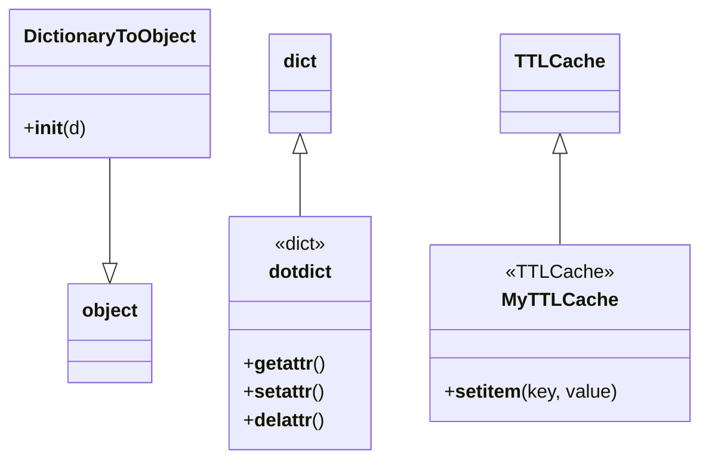

# Diagram: application_service/container_tracking_app_service/common/utilities/__init__.py


> Auto-generated by Obscura crawlers

## Diagram 1



### SVG

<svg id="container" width="579.34765625" xmlns="http://www.w3.org/2000/svg" class="classDiagram" height="390" viewBox="0 0 579.34765625 390" role="graphics-document document" aria-roledescription="class"><style>#container{font-family:"trebuchet ms",verdana,arial,sans-serif;font-size:16px;fill:#333;}@keyframes edge-animation-frame{from{stroke-dashoffset:0;}}@keyframes dash{to{stroke-dashoffset:0;}}#container .edge-animation-slow{stroke-dasharray:9,5!important;stroke-dashoffset:900;animation:dash 50s linear infinite;stroke-linecap:round;}#container .edge-animation-fast{stroke-dasharray:9,5!important;stroke-dashoffset:900;animation:dash 20s linear infinite;stroke-linecap:round;}#container .error-icon{fill:#552222;}#container .error-text{fill:#552222;stroke:#552222;}#container .edge-thickness-normal{stroke-width:1px;}#container .edge-thickness-thick{stroke-width:3.5px;}#container .edge-pattern-solid{stroke-dasharray:0;}#container .edge-thickness-invisible{stroke-width:0;fill:none;}#container .edge-pattern-dashed{stroke-dasharray:3;}#container .edge-pattern-dotted{stroke-dasharray:2;}#container .marker{fill:#333333;stroke:#333333;}#container .marker.cross{stroke:#333333;}#container svg{font-family:"trebuchet ms",verdana,arial,sans-serif;font-size:16px;}#container p{margin:0;}#container g.classGroup text{fill:#9370DB;stroke:none;font-family:"trebuchet ms",verdana,arial,sans-serif;font-size:10px;}#container g.classGroup text .title{font-weight:bolder;}#container .nodeLabel,#container .edgeLabel{color:#131300;}#container .edgeLabel .label rect{fill:#ECECFF;}#container .label text{fill:#131300;}#container .labelBkg{background:#ECECFF;}#container .edgeLabel .label span{background:#ECECFF;}#container .classTitle{font-weight:bolder;}#container .node rect,#container .node circle,#container .node ellipse,#container .node polygon,#container .node path{fill:#ECECFF;stroke:#9370DB;stroke-width:1px;}#container .divider{stroke:#9370DB;stroke-width:1;}#container g.clickable{cursor:pointer;}#container g.classGroup rect{fill:#ECECFF;stroke:#9370DB;}#container g.classGroup line{stroke:#9370DB;stroke-width:1;}#container .classLabel .box{stroke:none;stroke-width:0;fill:#ECECFF;opacity:0.5;}#container .classLabel .label{fill:#9370DB;font-size:10px;}#container .relation{stroke:#333333;stroke-width:1;fill:none;}#container .dashed-line{stroke-dasharray:3;}#container .dotted-line{stroke-dasharray:1 2;}#container #compositionStart,#container .composition{fill:#333333!important;stroke:#333333!important;stroke-width:1;}#container #compositionEnd,#container .composition{fill:#333333!important;stroke:#333333!important;stroke-width:1;}#container #dependencyStart,#container .dependency{fill:#333333!important;stroke:#333333!important;stroke-width:1;}#container #dependencyStart,#container .dependency{fill:#333333!important;stroke:#333333!important;stroke-width:1;}#container #extensionStart,#container .extension{fill:transparent!important;stroke:#333333!important;stroke-width:1;}#container #extensionEnd,#container .extension{fill:transparent!important;stroke:#333333!important;stroke-width:1;}#container #aggregationStart,#container .aggregation{fill:transparent!important;stroke:#333333!important;stroke-width:1;}#container #aggregationEnd,#container .aggregation{fill:transparent!important;stroke:#333333!important;stroke-width:1;}#container #lollipopStart,#container .lollipop{fill:#ECECFF!important;stroke:#333333!important;stroke-width:1;}#container #lollipopEnd,#container .lollipop{fill:#ECECFF!important;stroke:#333333!important;stroke-width:1;}#container .edgeTerminals{font-size:11px;line-height:initial;}#container .classTitleText{text-anchor:middle;font-size:18px;fill:#333;}#container .label-icon{display:inline-block;height:1em;overflow:visible;vertical-align:-0.125em;}#container .node .label-icon path{fill:currentColor;stroke:revert;stroke-width:revert;}#container :root{--mermaid-font-family:"trebuchet ms",verdana,arial,sans-serif;}</style><g><defs><marker id="container_class-aggregationStart" class="marker aggregation class" refX="18" refY="7" markerWidth="190" markerHeight="240" orient="auto"><path d="M 18,7 L9,13 L1,7 L9,1 Z"></path></marker></defs><defs><marker id="container_class-aggregationEnd" class="marker aggregation class" refX="1" refY="7" markerWidth="20" markerHeight="28" orient="auto"><path d="M 18,7 L9,13 L1,7 L9,1 Z"></path></marker></defs><defs><marker id="container_class-extensionStart" class="marker extension class" refX="18" refY="7" markerWidth="190" markerHeight="240" orient="auto"><path d="M 1,7 L18,13 V 1 Z"></path></marker></defs><defs><marker id="container_class-extensionEnd" class="marker extension class" refX="1" refY="7" markerWidth="20" markerHeight="28" orient="auto"><path d="M 1,1 V 13 L18,7 Z"></path></marker></defs><defs><marker id="container_class-compositionStart" class="marker composition class" refX="18" refY="7" markerWidth="190" markerHeight="240" orient="auto"><path d="M 18,7 L9,13 L1,7 L9,1 Z"></path></marker></defs><defs><marker id="container_class-compositionEnd" class="marker composition class" refX="1" refY="7" markerWidth="20" markerHeight="28" orient="auto"><path d="M 18,7 L9,13 L1,7 L9,1 Z"></path></marker></defs><defs><marker id="container_class-dependencyStart" class="marker dependency class" refX="6" refY="7" markerWidth="190" markerHeight="240" orient="auto"><path d="M 5,7 L9,13 L1,7 L9,1 Z"></path></marker></defs><defs><marker id="container_class-dependencyEnd" class="marker dependency class" refX="13" refY="7" markerWidth="20" markerHeight="28" orient="auto"><path d="M 18,7 L9,13 L14,7 L9,1 Z"></path></marker></defs><defs><marker id="container_class-lollipopStart" class="marker lollipop class" refX="13" refY="7" markerWidth="190" markerHeight="240" orient="auto"><circle stroke="black" fill="transparent" cx="7" cy="7" r="6"></circle></marker></defs><defs><marker id="container_class-lollipopEnd" class="marker lollipop class" refX="1" refY="7" markerWidth="190" markerHeight="240" orient="auto"><circle stroke="black" fill="transparent" cx="7" cy="7" r="6"></circle></marker></defs><g class="root"><g class="clusters"></g><g class="edgePaths"><path d="M248.195,130.25L248.195,135.042C248.195,139.833,248.195,149.417,248.195,158.375C248.195,167.333,248.195,175.667,248.195,179.833L248.195,184" id="id_dict_dotdict_1" class="edge-thickness-normal edge-pattern-solid relation" style=";;;" data-edge="true" data-et="edge" data-id="id_dict_dotdict_1" data-points="W3sieCI6MjQ4LjE5NTMxMjUsInkiOjExM30seyJ4IjoyNDguMTk1MzEyNSwieSI6MTU5fSx7IngiOjI0OC4xOTUzMTI1LCJ5IjoxODR9XQ==" marker-start="url(#container_class-extensionStart)"></path><path d="M464.668,130.25L464.668,135.042C464.668,139.833,464.668,149.417,464.668,162.375C464.668,175.333,464.668,191.667,464.668,199.833L464.668,208" id="id_TTLCache_MyTTLCache_2" class="edge-thickness-normal edge-pattern-solid relation" style=";;;" data-edge="true" data-et="edge" data-id="id_TTLCache_MyTTLCache_2" data-points="W3sieCI6NDY0LjY2Nzk2ODc1LCJ5IjoxMTN9LHsieCI6NDY0LjY2Nzk2ODc1LCJ5IjoxNTl9LHsieCI6NDY0LjY2Nzk2ODc1LCJ5IjoyMDh9XQ==" marker-start="url(#container_class-extensionStart)"></path><path d="M90.109,134L90.109,138.167C90.109,142.333,90.109,150.667,90.109,165.625C90.109,180.583,90.109,202.167,90.109,212.958L90.109,223.75" id="id_DictionaryToObject_object_3" class="edge-thickness-normal edge-pattern-solid relation" style=";;;" data-edge="true" data-et="edge" data-id="id_DictionaryToObject_object_3" data-points="W3sieCI6OTAuMTA5Mzc1LCJ5IjoxMzR9LHsieCI6OTAuMTA5Mzc1LCJ5IjoxNTl9LHsieCI6OTAuMTA5Mzc1LCJ5IjoyNDF9XQ==" marker-end="url(#container_class-extensionEnd)"></path></g><g class="edgeLabels"><g class="edgeLabel"><g class="label" data-id="id_dict_dotdict_1" transform="translate(0, 0)"><foreignObject width="0" height="0"><div xmlns="http://www.w3.org/1999/xhtml" class="labelBkg" style="display: table-cell; white-space: nowrap; line-height: 1.5; max-width: 200px; text-align: center;"><span class="edgeLabel"></span></div></foreignObject></g></g><g class="edgeLabel"><g class="label" data-id="id_TTLCache_MyTTLCache_2" transform="translate(0, 0)"><foreignObject width="0" height="0"><div xmlns="http://www.w3.org/1999/xhtml" class="labelBkg" style="display: table-cell; white-space: nowrap; line-height: 1.5; max-width: 200px; text-align: center;"><span class="edgeLabel"></span></div></foreignObject></g></g><g class="edgeLabel"><g class="label" data-id="id_DictionaryToObject_object_3" transform="translate(0, 0)"><foreignObject width="0" height="0"><div xmlns="http://www.w3.org/1999/xhtml" class="labelBkg" style="display: table-cell; white-space: nowrap; line-height: 1.5; max-width: 200px; text-align: center;"><span class="edgeLabel"></span></div></foreignObject></g></g></g><g class="nodes"><g class="node default" id="classId-dotdict-0" transform="translate(248.1953125, 283)"><g class="basic label-container"><path d="M-59.79296875 -99 L59.79296875 -99 L59.79296875 99 L-59.79296875 99" stroke="none" stroke-width="0" fill="#ECECFF" style=""></path><path d="M-59.79296875 -99 C-25.936354526373606 -99, 7.9202596972527886 -99, 59.79296875 -99 M-59.79296875 -99 C-22.983528660745947 -99, 13.825911428508107 -99, 59.79296875 -99 M59.79296875 -99 C59.79296875 -27.49228044306831, 59.79296875 44.01543911386338, 59.79296875 99 M59.79296875 -99 C59.79296875 -24.003880222086877, 59.79296875 50.992239555826245, 59.79296875 99 M59.79296875 99 C35.54193228374868 99, 11.29089581749735 99, -59.79296875 99 M59.79296875 99 C28.269389067853947 99, -3.2541906142921064 99, -59.79296875 99 M-59.79296875 99 C-59.79296875 37.93629658208964, -59.79296875 -23.12740683582072, -59.79296875 -99 M-59.79296875 99 C-59.79296875 48.84963200349546, -59.79296875 -1.3007359930090843, -59.79296875 -99" stroke="#9370DB" stroke-width="1.3" fill="none" stroke-dasharray="0 0" style=""></path></g><g class="annotation-group text" transform="translate(-22.7265625, -75)"><g class="label" style="" transform="translate(0,-12)"><foreignObject width="45.453125" height="24"><div xmlns="http://www.w3.org/1999/xhtml" style="display: table-cell; white-space: nowrap; line-height: 1.5; max-width: 95px; text-align: center;"><span class="nodeLabel markdown-node-label" style=""><p>«dict»</p></span></div></foreignObject></g></g><g class="label-group text" transform="translate(-26.3984375, -51)"><g class="label" style="font-weight: bolder" transform="translate(0,-12)"><foreignObject width="52.796875" height="24"><div xmlns="http://www.w3.org/1999/xhtml" style="display: table-cell; white-space: nowrap; line-height: 1.5; max-width: 102px; text-align: center;"><span class="nodeLabel markdown-node-label" style=""><p>dotdict</p></span></div></foreignObject></g></g><g class="members-group text" transform="translate(-47.79296875, -3)"></g><g class="methods-group text" transform="translate(-47.79296875, 27)"><g class="label" style="" transform="translate(0,-12)"><foreignObject width="69.1875" height="24"><div xmlns="http://www.w3.org/1999/xhtml" style="display: table-cell; white-space: nowrap; line-height: 1.5; max-width: 155px; text-align: center;"><span class="nodeLabel markdown-node-label" style=""><p>+<strong>getattr</strong>()</p></span></div></foreignObject></g><g class="label" style="" transform="translate(0,12)"><foreignObject width="68.453125" height="24"><div xmlns="http://www.w3.org/1999/xhtml" style="display: table-cell; white-space: nowrap; line-height: 1.5; max-width: 154px; text-align: center;"><span class="nodeLabel markdown-node-label" style=""><p>+<strong>setattr</strong>()</p></span></div></foreignObject></g><g class="label" style="" transform="translate(0,36)"><foreignObject width="69" height="24"><div xmlns="http://www.w3.org/1999/xhtml" style="display: table-cell; white-space: nowrap; line-height: 1.5; max-width: 155px; text-align: center;"><span class="nodeLabel markdown-node-label" style=""><p>+<strong>delattr</strong>()</p></span></div></foreignObject></g></g><g class="divider" style=""><path d="M-59.79296875 -27 C-13.9657906566135 -27, 31.861387436773 -27, 59.79296875 -27 M-59.79296875 -27 C-29.615232187676646 -27, 0.5625043746467071 -27, 59.79296875 -27" stroke="#9370DB" stroke-width="1.3" fill="none" stroke-dasharray="0 0" style=""></path></g><g class="divider" style=""><path d="M-59.79296875 -3 C-35.8075467237899 -3, -11.822124697579788 -3, 59.79296875 -3 M-59.79296875 -3 C-30.602167901037394 -3, -1.4113670520747874 -3, 59.79296875 -3" stroke="#9370DB" stroke-width="1.3" fill="none" stroke-dasharray="0 0" style=""></path></g></g><g class="node default" id="classId-DictionaryToObject-1" transform="translate(90.109375, 71)"><g class="basic label-container"><path d="M-82.109375 -63 L82.109375 -63 L82.109375 63 L-82.109375 63" stroke="none" stroke-width="0" fill="#ECECFF" style=""></path><path d="M-82.109375 -63 C-39.12452466257514 -63, 3.860325674849719 -63, 82.109375 -63 M-82.109375 -63 C-24.327619522476212 -63, 33.454135955047576 -63, 82.109375 -63 M82.109375 -63 C82.109375 -31.080955414744754, 82.109375 0.8380891705104929, 82.109375 63 M82.109375 -63 C82.109375 -18.070486178506137, 82.109375 26.859027642987726, 82.109375 63 M82.109375 63 C39.434282799888734 63, -3.240809400222531 63, -82.109375 63 M82.109375 63 C34.70539326678376 63, -12.698588466432483 63, -82.109375 63 M-82.109375 63 C-82.109375 26.406310781637885, -82.109375 -10.18737843672423, -82.109375 -63 M-82.109375 63 C-82.109375 33.13626952882002, -82.109375 3.272539057640053, -82.109375 -63" stroke="#9370DB" stroke-width="1.3" fill="none" stroke-dasharray="0 0" style=""></path></g><g class="annotation-group text" transform="translate(0, -39)"></g><g class="label-group text" transform="translate(-70.109375, -39)"><g class="label" style="font-weight: bolder" transform="translate(0,-12)"><foreignObject width="140.21875" height="24"><div xmlns="http://www.w3.org/1999/xhtml" style="display: table-cell; white-space: nowrap; line-height: 1.5; max-width: 188px; text-align: center;"><span class="nodeLabel markdown-node-label" style=""><p>DictionaryToObject</p></span></div></foreignObject></g></g><g class="members-group text" transform="translate(-70.109375, 9)"></g><g class="methods-group text" transform="translate(-70.109375, 39)"><g class="label" style="" transform="translate(0,-12)"><foreignObject width="52.359375" height="24"><div xmlns="http://www.w3.org/1999/xhtml" style="display: table-cell; white-space: nowrap; line-height: 1.5; max-width: 141px; text-align: center;"><span class="nodeLabel markdown-node-label" style=""><p>+<strong>init</strong>(d)</p></span></div></foreignObject></g></g><g class="divider" style=""><path d="M-82.109375 -15 C-32.00208778948523 -15, 18.10519942102954 -15, 82.109375 -15 M-82.109375 -15 C-16.526925613498676 -15, 49.05552377300265 -15, 82.109375 -15" stroke="#9370DB" stroke-width="1.3" fill="none" stroke-dasharray="0 0" style=""></path></g><g class="divider" style=""><path d="M-82.109375 9 C-22.2353007019261 9, 37.6387735961478 9, 82.109375 9 M-82.109375 9 C-22.542135595899083 9, 37.025103808201834 9, 82.109375 9" stroke="#9370DB" stroke-width="1.3" fill="none" stroke-dasharray="0 0" style=""></path></g></g><g class="node default" id="classId-MyTTLCache-2" transform="translate(464.66796875, 283)"><g class="basic label-container"><path d="M-106.6796875 -75 L106.6796875 -75 L106.6796875 75 L-106.6796875 75" stroke="none" stroke-width="0" fill="#ECECFF" style=""></path><path d="M-106.6796875 -75 C-47.21930167341252 -75, 12.241084153174967 -75, 106.6796875 -75 M-106.6796875 -75 C-22.90771048335145 -75, 60.8642665332971 -75, 106.6796875 -75 M106.6796875 -75 C106.6796875 -22.992439995187816, 106.6796875 29.01512000962437, 106.6796875 75 M106.6796875 -75 C106.6796875 -35.76425155780177, 106.6796875 3.4714968843964584, 106.6796875 75 M106.6796875 75 C26.200136895266922 75, -54.279413709466155 75, -106.6796875 75 M106.6796875 75 C62.29316220112733 75, 17.90663690225466 75, -106.6796875 75 M-106.6796875 75 C-106.6796875 39.66394591654696, -106.6796875 4.327891833093915, -106.6796875 -75 M-106.6796875 75 C-106.6796875 19.69528792889828, -106.6796875 -35.60942414220344, -106.6796875 -75" stroke="#9370DB" stroke-width="1.3" fill="none" stroke-dasharray="0 0" style=""></path></g><g class="annotation-group text" transform="translate(-42.328125, -51)"><g class="label" style="" transform="translate(0,-12)"><foreignObject width="84.65625" height="24"><div xmlns="http://www.w3.org/1999/xhtml" style="display: table-cell; white-space: nowrap; line-height: 1.5; max-width: 135px; text-align: center;"><span class="nodeLabel markdown-node-label" style=""><p>«TTLCache»</p></span></div></foreignObject></g></g><g class="label-group text" transform="translate(-44.609375, -27)"><g class="label" style="font-weight: bolder" transform="translate(0,-12)"><foreignObject width="89.21875" height="24"><div xmlns="http://www.w3.org/1999/xhtml" style="display: table-cell; white-space: nowrap; line-height: 1.5; max-width: 137px; text-align: center;"><span class="nodeLabel markdown-node-label" style=""><p>MyTTLCache</p></span></div></foreignObject></g></g><g class="members-group text" transform="translate(-94.6796875, 21)"></g><g class="methods-group text" transform="translate(-94.6796875, 51)"><g class="label" style="" transform="translate(0,-12)"><foreignObject width="144.75" height="24"><div xmlns="http://www.w3.org/1999/xhtml" style="display: table-cell; white-space: nowrap; line-height: 1.5; max-width: 233px; text-align: center;"><span class="nodeLabel markdown-node-label" style=""><p>+<strong>setitem</strong>(key, value)</p></span></div></foreignObject></g></g><g class="divider" style=""><path d="M-106.6796875 -3 C-50.03886090133595 -3, 6.601965697328097 -3, 106.6796875 -3 M-106.6796875 -3 C-24.195514489815267 -3, 58.28865852036947 -3, 106.6796875 -3" stroke="#9370DB" stroke-width="1.3" fill="none" stroke-dasharray="0 0" style=""></path></g><g class="divider" style=""><path d="M-106.6796875 21 C-48.93069095700404 21, 8.818305585991922 21, 106.6796875 21 M-106.6796875 21 C-53.9686320423548 21, -1.2575765847095965 21, 106.6796875 21" stroke="#9370DB" stroke-width="1.3" fill="none" stroke-dasharray="0 0" style=""></path></g></g><g class="node default" id="classId-dict-3" transform="translate(248.1953125, 71)"><g class="basic label-container"><path d="M-25.9765625 -42 L25.9765625 -42 L25.9765625 42 L-25.9765625 42" stroke="none" stroke-width="0" fill="#ECECFF" style=""></path><path d="M-25.9765625 -42 C-7.975077354978705 -42, 10.02640779004259 -42, 25.9765625 -42 M-25.9765625 -42 C-10.25943836403835 -42, 5.457685771923298 -42, 25.9765625 -42 M25.9765625 -42 C25.9765625 -12.657436588086401, 25.9765625 16.685126823827197, 25.9765625 42 M25.9765625 -42 C25.9765625 -19.470465168560647, 25.9765625 3.0590696628787057, 25.9765625 42 M25.9765625 42 C14.6939501136355 42, 3.4113377272710004 42, -25.9765625 42 M25.9765625 42 C13.592522778794807 42, 1.2084830575896142 42, -25.9765625 42 M-25.9765625 42 C-25.9765625 12.563536991196614, -25.9765625 -16.872926017606773, -25.9765625 -42 M-25.9765625 42 C-25.9765625 15.052746111598719, -25.9765625 -11.894507776802563, -25.9765625 -42" stroke="#9370DB" stroke-width="1.3" fill="none" stroke-dasharray="0 0" style=""></path></g><g class="annotation-group text" transform="translate(0, -18)"></g><g class="label-group text" transform="translate(-13.9765625, -18)"><g class="label" style="font-weight: bolder" transform="translate(0,-12)"><foreignObject width="27.953125" height="24"><div xmlns="http://www.w3.org/1999/xhtml" style="display: table-cell; white-space: nowrap; line-height: 1.5; max-width: 78px; text-align: center;"><span class="nodeLabel markdown-node-label" style=""><p>dict</p></span></div></foreignObject></g></g><g class="members-group text" transform="translate(-13.9765625, 30)"></g><g class="methods-group text" transform="translate(-13.9765625, 60)"></g><g class="divider" style=""><path d="M-25.9765625 6 C-6.570043652498235 6, 12.83647519500353 6, 25.9765625 6 M-25.9765625 6 C-11.17932755081066 6, 3.61790739837868 6, 25.9765625 6" stroke="#9370DB" stroke-width="1.3" fill="none" stroke-dasharray="0 0" style=""></path></g><g class="divider" style=""><path d="M-25.9765625 24 C-12.630511541167714 24, 0.7155394176645729 24, 25.9765625 24 M-25.9765625 24 C-14.549346820174733 24, -3.1221311403494667 24, 25.9765625 24" stroke="#9370DB" stroke-width="1.3" fill="none" stroke-dasharray="0 0" style=""></path></g></g><g class="node default" id="classId-TTLCache-4" transform="translate(464.66796875, 71)"><g class="basic label-container"><path d="M-46.1796875 -42 L46.1796875 -42 L46.1796875 42 L-46.1796875 42" stroke="none" stroke-width="0" fill="#ECECFF" style=""></path><path d="M-46.1796875 -42 C-20.80207628039471 -42, 4.575534939210577 -42, 46.1796875 -42 M-46.1796875 -42 C-11.667000651385571 -42, 22.845686197228858 -42, 46.1796875 -42 M46.1796875 -42 C46.1796875 -22.357565687547257, 46.1796875 -2.715131375094515, 46.1796875 42 M46.1796875 -42 C46.1796875 -12.09329356317415, 46.1796875 17.8134128736517, 46.1796875 42 M46.1796875 42 C13.891933072002608 42, -18.395821355994784 42, -46.1796875 42 M46.1796875 42 C10.591518575549586 42, -24.99665034890083 42, -46.1796875 42 M-46.1796875 42 C-46.1796875 10.156426818342375, -46.1796875 -21.68714636331525, -46.1796875 -42 M-46.1796875 42 C-46.1796875 10.739535040667938, -46.1796875 -20.520929918664123, -46.1796875 -42" stroke="#9370DB" stroke-width="1.3" fill="none" stroke-dasharray="0 0" style=""></path></g><g class="annotation-group text" transform="translate(0, -18)"></g><g class="label-group text" transform="translate(-34.1796875, -18)"><g class="label" style="font-weight: bolder" transform="translate(0,-12)"><foreignObject width="68.359375" height="24"><div xmlns="http://www.w3.org/1999/xhtml" style="display: table-cell; white-space: nowrap; line-height: 1.5; max-width: 117px; text-align: center;"><span class="nodeLabel markdown-node-label" style=""><p>TTLCache</p></span></div></foreignObject></g></g><g class="members-group text" transform="translate(-34.1796875, 30)"></g><g class="methods-group text" transform="translate(-34.1796875, 60)"></g><g class="divider" style=""><path d="M-46.1796875 6 C-19.187740473460934 6, 7.8042065530781315 6, 46.1796875 6 M-46.1796875 6 C-13.8441297998708 6, 18.4914279002584 6, 46.1796875 6" stroke="#9370DB" stroke-width="1.3" fill="none" stroke-dasharray="0 0" style=""></path></g><g class="divider" style=""><path d="M-46.1796875 24 C-16.209413183714886 24, 13.760861132570227 24, 46.1796875 24 M-46.1796875 24 C-12.46095712725134 24, 21.25777324549732 24, 46.1796875 24" stroke="#9370DB" stroke-width="1.3" fill="none" stroke-dasharray="0 0" style=""></path></g></g><g class="node default" id="classId-object-5" transform="translate(90.109375, 283)"><g class="basic label-container"><path d="M-35.0390625 -42 L35.0390625 -42 L35.0390625 42 L-35.0390625 42" stroke="none" stroke-width="0" fill="#ECECFF" style=""></path><path d="M-35.0390625 -42 C-18.506213815758347 -42, -1.9733651315166938 -42, 35.0390625 -42 M-35.0390625 -42 C-10.172294148526376 -42, 14.694474202947248 -42, 35.0390625 -42 M35.0390625 -42 C35.0390625 -20.694972137442967, 35.0390625 0.6100557251140657, 35.0390625 42 M35.0390625 -42 C35.0390625 -11.848724384305292, 35.0390625 18.302551231389415, 35.0390625 42 M35.0390625 42 C14.31843931974636 42, -6.402183860507279 42, -35.0390625 42 M35.0390625 42 C7.350790458574409 42, -20.337481582851183 42, -35.0390625 42 M-35.0390625 42 C-35.0390625 15.209449416086851, -35.0390625 -11.581101167826297, -35.0390625 -42 M-35.0390625 42 C-35.0390625 9.992898253739597, -35.0390625 -22.014203492520807, -35.0390625 -42" stroke="#9370DB" stroke-width="1.3" fill="none" stroke-dasharray="0 0" style=""></path></g><g class="annotation-group text" transform="translate(0, -18)"></g><g class="label-group text" transform="translate(-23.0390625, -18)"><g class="label" style="font-weight: bolder" transform="translate(0,-12)"><foreignObject width="46.078125" height="24"><div xmlns="http://www.w3.org/1999/xhtml" style="display: table-cell; white-space: nowrap; line-height: 1.5; max-width: 96px; text-align: center;"><span class="nodeLabel markdown-node-label" style=""><p>object</p></span></div></foreignObject></g></g><g class="members-group text" transform="translate(-23.0390625, 30)"></g><g class="methods-group text" transform="translate(-23.0390625, 60)"></g><g class="divider" style=""><path d="M-35.0390625 6 C-7.714603468035147 6, 19.609855563929706 6, 35.0390625 6 M-35.0390625 6 C-8.098795320957105 6, 18.84147185808579 6, 35.0390625 6" stroke="#9370DB" stroke-width="1.3" fill="none" stroke-dasharray="0 0" style=""></path></g><g class="divider" style=""><path d="M-35.0390625 24 C-19.43486190576838 24, -3.830661311536762 24, 35.0390625 24 M-35.0390625 24 C-7.414102860704347 24, 20.210856778591307 24, 35.0390625 24" stroke="#9370DB" stroke-width="1.3" fill="none" stroke-dasharray="0 0" style=""></path></g></g></g></g></g></svg>

## Diagram 2

```mermaid
flowchart TD
  subgraph Validate_Location_Update
    A1[validate_location_update(latitude, longitude)] --> A2{call validate_lat_long}
    A2 -- Exception --> A3[return False, "Invalid value for latitude,longitude (latitude,longitude)"]
    A2 -- No Exception --> A4[return result from validate_lat_long]
  end

  subgraph Validate_Lat_Long
    V1[validate_lat_long(latitude, longitude)] --> V2[attempt float(latitude), float(longitude)]
    V2 --> V3{casting succeeded?}
    V3 -- no --> V_err1[return False, "Bad value for lat or long"]
    V3 -- yes --> V4{latitude in [-90.0, 90.0]?}
    V4 -- no --> V5[return False, f"Invalid value for lat {latitude}"]
    V4 -- yes --> V6{longitude in [-180.0, 180.0]?}
    V6 -- no --> V7[return False, f"Invalid value for longitude ({longitude})"]
    V6 -- yes --> V8{latitude and longitude non-zero?}
    V8 -- yes --> V9[return True, ""]
    V8 -- no --> V10[return False, f"Invalid value for latitude,longitude ({latitude},{longitude})"]
  end

  A2 --> V1

  subgraph Timestamp_To_Datetime
    T1[timestamp_to_datetime(timestamp, to_utc)] --> T2[determine isdst and tz mappings]
    T2 --> T3[replace abbreviations and "Z" adjustments in timestamp string]
    T3 --> T4[remove colon from timezone offset if present]
    T4 --> T5[try parsing with patterns list in order]
    T5 --> T6{parsed into dt?}
    T6 -- no --> T7[raise BadRequestError("Invalid timestamp format: {timestamp}")]
    T6 -- yes --> T8[if no tzinfo set UTC; if to_utc then astimezone UTC]
    T8 --> T9[return datetime object dt]
  end
```

> SVG rendering failed for this diagram.
