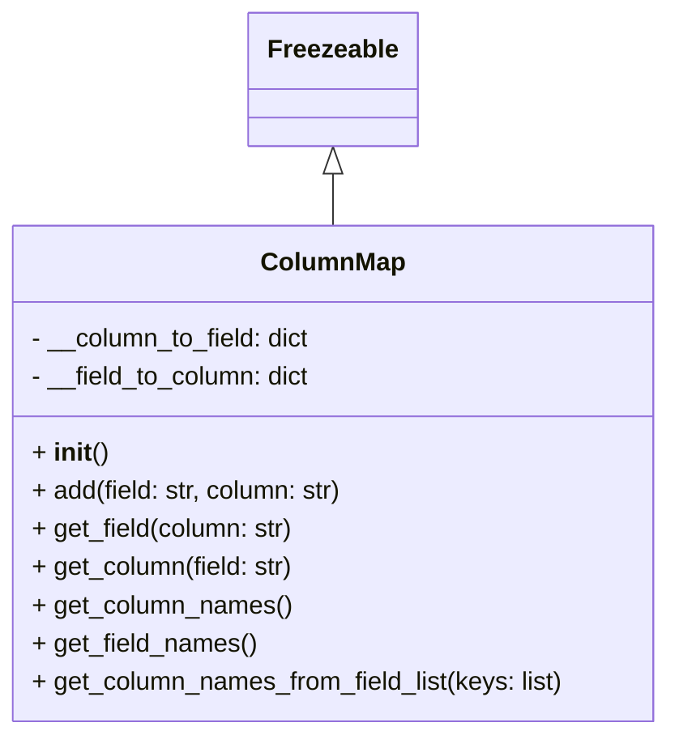

# Diagram: application_service/container_tracking_app_service/core/ColumnMap.py

> Auto-generated by Obscura crawlers

## Mermaid

### SVG

<svg id="container" width="421.078125" xmlns="http://www.w3.org/2000/svg" class="classDiagram" height="462" viewBox="0 0 421.078125 462" role="graphics-document document" aria-roledescription="class"><g><defs><marker id="container_class-aggregationStart" class="marker aggregation class" refX="18" refY="7" markerWidth="190" markerHeight="240" orient="auto"><path d="M 18,7 L9,13 L1,7 L9,1 Z"></path></marker></defs><defs><marker id="container_class-aggregationEnd" class="marker aggregation class" refX="1" refY="7" markerWidth="20" markerHeight="28" orient="auto"><path d="M 18,7 L9,13 L1,7 L9,1 Z"></path></marker></defs><defs><marker id="container_class-extensionStart" class="marker extension class" refX="18" refY="7" markerWidth="190" markerHeight="240" orient="auto"><path d="M 1,7 L18,13 V 1 Z"></path></marker></defs><defs><marker id="container_class-extensionEnd" class="marker extension class" refX="1" refY="7" markerWidth="20" markerHeight="28" orient="auto"><path d="M 1,1 V 13 L18,7 Z"></path></marker></defs><defs><marker id="container_class-compositionStart" class="marker composition class" refX="18" refY="7" markerWidth="190" markerHeight="240" orient="auto"><path d="M 18,7 L9,13 L1,7 L9,1 Z"></path></marker></defs><defs><marker id="container_class-compositionEnd" class="marker composition class" refX="1" refY="7" markerWidth="20" markerHeight="28" orient="auto"><path d="M 18,7 L9,13 L1,7 L9,1 Z"></path></marker></defs><defs><marker id="container_class-dependencyStart" class="marker dependency class" refX="6" refY="7" markerWidth="190" markerHeight="240" orient="auto"><path d="M 5,7 L9,13 L1,7 L9,1 Z"></path></marker></defs><defs><marker id="container_class-dependencyEnd" class="marker dependency class" refX="13" refY="7" markerWidth="20" markerHeight="28" orient="auto"><path d="M 18,7 L9,13 L14,7 L9,1 Z"></path></marker></defs><defs><marker id="container_class-lollipopStart" class="marker lollipop class" refX="13" refY="7" markerWidth="190" markerHeight="240" orient="auto"><circle stroke="black" fill="transparent" cx="7" cy="7" r="6"></circle></marker></defs><defs><marker id="container_class-lollipopEnd" class="marker lollipop class" refX="1" refY="7" markerWidth="190" markerHeight="240" orient="auto"><circle stroke="black" fill="transparent" cx="7" cy="7" r="6"></circle></marker></defs><g class="root"><g class="clusters"></g><g class="edgePaths"><path d="M210.539,109.25L210.539,110.542C210.539,111.833,210.539,114.417,210.539,119.875C210.539,125.333,210.539,133.667,210.539,137.833L210.539,142" id="id_Freezeable_ColumnMap_1" class="edge-thickness-normal edge-pattern-solid relation" style=";;;" data-edge="true" data-et="edge" data-id="id_Freezeable_ColumnMap_1" data-points="W3sieCI6MjEwLjUzOTA2MjUsInkiOjkyfSx7IngiOjIxMC41MzkwNjI1LCJ5IjoxMTd9LHsieCI6MjEwLjUzOTA2MjUsInkiOjE0Mn1d" marker-start="url(#container_class-extensionStart)"></path></g><g class="edgeLabels"><g class="edgeLabel"><g class="label" data-id="id_Freezeable_ColumnMap_1" transform="translate(0, 0)"><foreignObject width="0" height="0">

</foreignObject></g></g></g><g class="nodes"><g class="node default" id="classId-Freezeable-0" transform="translate(210.5390625, 50)"><g class="basic label-container"><path d="M-51.1953125 -42 L51.1953125 -42 L51.1953125 42 L-51.1953125 42" stroke="none" stroke-width="0" fill="#ECECFF" style=""></path><path d="M-51.1953125 -42 C-30.176987815456346 -42, -9.158663130912693 -42, 51.1953125 -42 M-51.1953125 -42 C-26.077457299019517 -42, -0.959602098039035 -42, 51.1953125 -42 M51.1953125 -42 C51.1953125 -14.412247813924246, 51.1953125 13.175504372151508, 51.1953125 42 M51.1953125 -42 C51.1953125 -16.053360793418655, 51.1953125 9.89327841316269, 51.1953125 42 M51.1953125 42 C22.071152626052704 42, -7.053007247894591 42, -51.1953125 42 M51.1953125 42 C21.682684535851138 42, -7.8299434282977245 42, -51.1953125 42 M-51.1953125 42 C-51.1953125 10.665393802127479, -51.1953125 -20.669212395745042, -51.1953125 -42 M-51.1953125 42 C-51.1953125 11.495499280321916, -51.1953125 -19.00900143935617, -51.1953125 -42" stroke="#9370DB" stroke-width="1.3" fill="none" stroke-dasharray="0 0" style=""></path></g><g class="annotation-group text" transform="translate(0, -18)"></g><g class="label-group text" transform="translate(-39.1953125, -18)"><g class="label" style="font-weight: bolder" transform="translate(0,-12)"><foreignObject width="78.390625" height="24">

Freezeable

</foreignObject></g></g><g class="members-group text" transform="translate(-39.1953125, 30)"></g><g class="methods-group text" transform="translate(-39.1953125, 60)"></g><g class="divider" style=""><path d="M-51.1953125 6 C-11.727313164159277 6, 27.740686171681446 6, 51.1953125 6 M-51.1953125 6 C-23.784308710472164 6, 3.626695079055672 6, 51.1953125 6" stroke="#9370DB" stroke-width="1.3" fill="none" stroke-dasharray="0 0" style=""></path></g><g class="divider" style=""><path d="M-51.1953125 24 C-30.527826904873052 24, -9.860341309746104 24, 51.1953125 24 M-51.1953125 24 C-11.13179357677135 24, 28.9317253464573 24, 51.1953125 24" stroke="#9370DB" stroke-width="1.3" fill="none" stroke-dasharray="0 0" style=""></path></g></g><g class="node default" id="classId-ColumnMap-1" transform="translate(210.5390625, 298)"><g class="basic label-container"><path d="M-202.5390625 -156 L202.5390625 -156 L202.5390625 156 L-202.5390625 156" stroke="none" stroke-width="0" fill="#ECECFF" style=""></path><path d="M-202.5390625 -156 C-111.5965180596881 -156, -20.65397361937619 -156, 202.5390625 -156 M-202.5390625 -156 C-116.14174838189055 -156, -29.744434263781102 -156, 202.5390625 -156 M202.5390625 -156 C202.5390625 -80.18549528705925, 202.5390625 -4.370990574118508, 202.5390625 156 M202.5390625 -156 C202.5390625 -42.35944587465197, 202.5390625 71.28110825069606, 202.5390625 156 M202.5390625 156 C41.459388645387975 156, -119.62028520922405 156, -202.5390625 156 M202.5390625 156 C43.213470188620306 156, -116.11212212275939 156, -202.5390625 156 M-202.5390625 156 C-202.5390625 88.06090498172271, -202.5390625 20.12180996344543, -202.5390625 -156 M-202.5390625 156 C-202.5390625 58.81367528990995, -202.5390625 -38.372649420180096, -202.5390625 -156" stroke="#9370DB" stroke-width="1.3" fill="none" stroke-dasharray="0 0" style=""></path></g><g class="annotation-group text" transform="translate(0, -132)"></g><g class="label-group text" transform="translate(-42.890625, -132)"><g class="label" style="font-weight: bolder" transform="translate(0,-12)"><foreignObject width="85.78125" height="24">

ColumnMap

</foreignObject></g></g><g class="members-group text" transform="translate(-190.5390625, -84)"><g class="label" style="" transform="translate(0,-12)"><foreignObject width="178.859375" height="24">

- __column_to_field: dict

</foreignObject></g><g class="label" style="" transform="translate(0,12)"><foreignObject width="178.859375" height="24">

- __field_to_column: dict

</foreignObject></g></g><g class="methods-group text" transform="translate(-190.5390625, -12)"><g class="label" style="" transform="translate(0,-12)"><foreignObject width="47.046875" height="24">

+ <strong>init</strong>()

</foreignObject></g><g class="label" style="" transform="translate(0,12)"><foreignObject width="198.109375" height="24">

+ add(field: str, column: str)

</foreignObject></g><g class="label" style="" transform="translate(0,36)"><foreignObject width="166.515625" height="24">

+ get_field(column: str)

</foreignObject></g><g class="label" style="" transform="translate(0,60)"><foreignObject width="166.515625" height="24">

+ get_column(field: str)

</foreignObject></g><g class="label" style="" transform="translate(0,84)"><foreignObject width="163.21875" height="24">

+ get_column_names()

</foreignObject></g><g class="label" style="" transform="translate(0,108)"><foreignObject width="141.5625" height="24">

+ get_field_names()

</foreignObject></g><g class="label" style="" transform="translate(0,132)"><foreignObject width="338.1875" height="24">

+ get_column_names_from_field_list(keys: list)

</foreignObject></g></g><g class="divider" style=""><path d="M-202.5390625 -108 C-64.137690060659 -108, 74.263682378682 -108, 202.5390625 -108 M-202.5390625 -108 C-77.47669364313715 -108, 47.58567521372569 -108, 202.5390625 -108" stroke="#9370DB" stroke-width="1.3" fill="none" stroke-dasharray="0 0" style=""></path></g><g class="divider" style=""><path d="M-202.5390625 -36 C-82.42219958767843 -36, 37.69466332464313 -36, 202.5390625 -36 M-202.5390625 -36 C-57.35804343821033 -36, 87.82297562357934 -36, 202.5390625 -36" stroke="#9370DB" stroke-width="1.3" fill="none" stroke-dasharray="0 0" style=""></path></g></g></g></g></g></svg>
