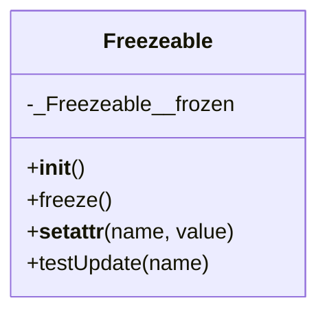

# Diagram: application_service/container_tracking_app_service/core/Freezeable.py

> Auto-generated by Obscura crawlers

## Mermaid

### SVG

<svg id="container" width="234.9609375" xmlns="http://www.w3.org/2000/svg" class="classDiagram" height="232" viewBox="0 0 234.9609375 232" role="graphics-document document" aria-roledescription="class"><g><defs><marker id="container_class-aggregationStart" class="marker aggregation class" refX="18" refY="7" markerWidth="190" markerHeight="240" orient="auto"><path d="M 18,7 L9,13 L1,7 L9,1 Z"></path></marker></defs><defs><marker id="container_class-aggregationEnd" class="marker aggregation class" refX="1" refY="7" markerWidth="20" markerHeight="28" orient="auto"><path d="M 18,7 L9,13 L1,7 L9,1 Z"></path></marker></defs><defs><marker id="container_class-extensionStart" class="marker extension class" refX="18" refY="7" markerWidth="190" markerHeight="240" orient="auto"><path d="M 1,7 L18,13 V 1 Z"></path></marker></defs><defs><marker id="container_class-extensionEnd" class="marker extension class" refX="1" refY="7" markerWidth="20" markerHeight="28" orient="auto"><path d="M 1,1 V 13 L18,7 Z"></path></marker></defs><defs><marker id="container_class-compositionStart" class="marker composition class" refX="18" refY="7" markerWidth="190" markerHeight="240" orient="auto"><path d="M 18,7 L9,13 L1,7 L9,1 Z"></path></marker></defs><defs><marker id="container_class-compositionEnd" class="marker composition class" refX="1" refY="7" markerWidth="20" markerHeight="28" orient="auto"><path d="M 18,7 L9,13 L1,7 L9,1 Z"></path></marker></defs><defs><marker id="container_class-dependencyStart" class="marker dependency class" refX="6" refY="7" markerWidth="190" markerHeight="240" orient="auto"><path d="M 5,7 L9,13 L1,7 L9,1 Z"></path></marker></defs><defs><marker id="container_class-dependencyEnd" class="marker dependency class" refX="13" refY="7" markerWidth="20" markerHeight="28" orient="auto"><path d="M 18,7 L9,13 L14,7 L9,1 Z"></path></marker></defs><defs><marker id="container_class-lollipopStart" class="marker lollipop class" refX="13" refY="7" markerWidth="190" markerHeight="240" orient="auto"><circle stroke="black" fill="transparent" cx="7" cy="7" r="6"></circle></marker></defs><defs><marker id="container_class-lollipopEnd" class="marker lollipop class" refX="1" refY="7" markerWidth="190" markerHeight="240" orient="auto"><circle stroke="black" fill="transparent" cx="7" cy="7" r="6"></circle></marker></defs><g class="root"><g class="clusters"></g><g class="edgePaths"></g><g class="edgeLabels"></g><g class="nodes"><g class="node default" id="classId-Freezeable-0" transform="translate(117.48046875, 116)"><g class="basic label-container"><path d="M-109.48046875 -108 L109.48046875 -108 L109.48046875 108 L-109.48046875 108" stroke="none" stroke-width="0" fill="#ECECFF" style=""></path><path d="M-109.48046875 -108 C-27.58423585150655 -108, 54.3119970469869 -108, 109.48046875 -108 M-109.48046875 -108 C-53.45515076062453 -108, 2.5701672287509467 -108, 109.48046875 -108 M109.48046875 -108 C109.48046875 -53.287092502643965, 109.48046875 1.42581499471207, 109.48046875 108 M109.48046875 -108 C109.48046875 -58.801017634312004, 109.48046875 -9.602035268624007, 109.48046875 108 M109.48046875 108 C49.3917894782141 108, -10.696889793571799 108, -109.48046875 108 M109.48046875 108 C42.200910541693844 108, -25.078647666612312 108, -109.48046875 108 M-109.48046875 108 C-109.48046875 36.677232704726634, -109.48046875 -34.64553459054673, -109.48046875 -108 M-109.48046875 108 C-109.48046875 60.522029035066026, -109.48046875 13.044058070132053, -109.48046875 -108" stroke="#9370DB" stroke-width="1.3" fill="none" stroke-dasharray="0 0" style=""></path></g><g class="annotation-group text" transform="translate(0, -84)"></g><g class="label-group text" transform="translate(-39.1953125, -84)"><g class="label" style="font-weight: bolder" transform="translate(0,-12)"><foreignObject width="78.390625" height="24">

Freezeable

</foreignObject></g></g><g class="members-group text" transform="translate(-97.48046875, -36)"><g class="label" style="" transform="translate(0,-12)"><foreignObject width="151.890625" height="24">

-_Freezeable__frozen

</foreignObject></g></g><g class="methods-group text" transform="translate(-97.48046875, 12)"><g class="label" style="" transform="translate(0,-12)"><foreignObject width="42.796875" height="24">

+<strong>init</strong>()

</foreignObject></g><g class="label" style="" transform="translate(0,12)"><foreignObject width="62.109375" height="24">

+freeze()

</foreignObject></g><g class="label" style="" transform="translate(0,36)"><foreignObject width="155.765625" height="24">

+<strong>setattr</strong>(name, value)

</foreignObject></g><g class="label" style="" transform="translate(0,60)"><foreignObject width="138.921875" height="24">

+testUpdate(name)

</foreignObject></g></g><g class="divider" style=""><path d="M-109.48046875 -60 C-54.395569734202994 -60, 0.6893292815940129 -60, 109.48046875 -60 M-109.48046875 -60 C-36.07281748330398 -60, 37.33483378339204 -60, 109.48046875 -60" stroke="#9370DB" stroke-width="1.3" fill="none" stroke-dasharray="0 0" style=""></path></g><g class="divider" style=""><path d="M-109.48046875 -12 C-57.229877815428964 -12, -4.979286880857927 -12, 109.48046875 -12 M-109.48046875 -12 C-39.54811642994416 -12, 30.384235890111682 -12, 109.48046875 -12" stroke="#9370DB" stroke-width="1.3" fill="none" stroke-dasharray="0 0" style=""></path></g></g></g></g></g></svg>
