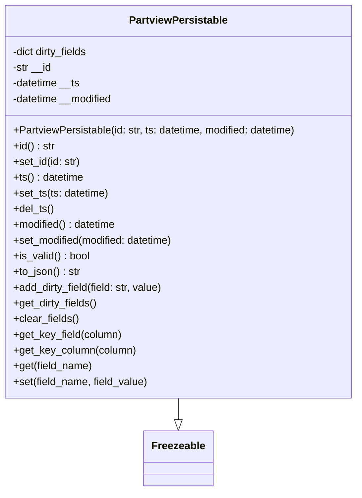

# Diagram: application_service/container_tracking_app_service/core/PartviewPersistable.py

> Auto-generated by Obscura crawlers

## Mermaid

### SVG

<svg id="container" width="553.6640625" xmlns="http://www.w3.org/2000/svg" class="classDiagram" height="750" viewBox="0 0 553.6640625 750" role="graphics-document document" aria-roledescription="class"><g><defs><marker id="container_class-aggregationStart" class="marker aggregation class" refX="18" refY="7" markerWidth="190" markerHeight="240" orient="auto"><path d="M 18,7 L9,13 L1,7 L9,1 Z"></path></marker></defs><defs><marker id="container_class-aggregationEnd" class="marker aggregation class" refX="1" refY="7" markerWidth="20" markerHeight="28" orient="auto"><path d="M 18,7 L9,13 L1,7 L9,1 Z"></path></marker></defs><defs><marker id="container_class-extensionStart" class="marker extension class" refX="18" refY="7" markerWidth="190" markerHeight="240" orient="auto"><path d="M 1,7 L18,13 V 1 Z"></path></marker></defs><defs><marker id="container_class-extensionEnd" class="marker extension class" refX="1" refY="7" markerWidth="20" markerHeight="28" orient="auto"><path d="M 1,1 V 13 L18,7 Z"></path></marker></defs><defs><marker id="container_class-compositionStart" class="marker composition class" refX="18" refY="7" markerWidth="190" markerHeight="240" orient="auto"><path d="M 18,7 L9,13 L1,7 L9,1 Z"></path></marker></defs><defs><marker id="container_class-compositionEnd" class="marker composition class" refX="1" refY="7" markerWidth="20" markerHeight="28" orient="auto"><path d="M 18,7 L9,13 L1,7 L9,1 Z"></path></marker></defs><defs><marker id="container_class-dependencyStart" class="marker dependency class" refX="6" refY="7" markerWidth="190" markerHeight="240" orient="auto"><path d="M 5,7 L9,13 L1,7 L9,1 Z"></path></marker></defs><defs><marker id="container_class-dependencyEnd" class="marker dependency class" refX="13" refY="7" markerWidth="20" markerHeight="28" orient="auto"><path d="M 18,7 L9,13 L14,7 L9,1 Z"></path></marker></defs><defs><marker id="container_class-lollipopStart" class="marker lollipop class" refX="13" refY="7" markerWidth="190" markerHeight="240" orient="auto"><circle stroke="black" fill="transparent" cx="7" cy="7" r="6"></circle></marker></defs><defs><marker id="container_class-lollipopEnd" class="marker lollipop class" refX="1" refY="7" markerWidth="190" markerHeight="240" orient="auto"><circle stroke="black" fill="transparent" cx="7" cy="7" r="6"></circle></marker></defs><g class="root"><g class="clusters"></g><g class="edgePaths"><path d="M276.832,608L276.832,612.167C276.832,616.333,276.832,624.667,276.832,630.125C276.832,635.583,276.832,638.167,276.832,639.458L276.832,640.75" id="id_PartviewPersistable_Freezeable_1" class="edge-thickness-normal edge-pattern-solid relation" style=";;;" data-edge="true" data-et="edge" data-id="id_PartviewPersistable_Freezeable_1" data-points="W3sieCI6Mjc2LjgzMjAzMTI1LCJ5Ijo2MDh9LHsieCI6Mjc2LjgzMjAzMTI1LCJ5Ijo2MzN9LHsieCI6Mjc2LjgzMjAzMTI1LCJ5Ijo2NTh9XQ==" marker-end="url(#container_class-extensionEnd)"></path></g><g class="edgeLabels"><g class="edgeLabel"><g class="label" data-id="id_PartviewPersistable_Freezeable_1" transform="translate(0, 0)"><foreignObject width="0" height="0">

</foreignObject></g></g></g><g class="nodes"><g class="node default" id="classId-Freezeable-0" transform="translate(276.83203125, 700)"><g class="basic label-container"><path d="M-51.1953125 -42 L51.1953125 -42 L51.1953125 42 L-51.1953125 42" stroke="none" stroke-width="0" fill="#ECECFF" style=""></path><path d="M-51.1953125 -42 C-14.164504507671282 -42, 22.866303484657436 -42, 51.1953125 -42 M-51.1953125 -42 C-26.31567413281599 -42, -1.4360357656319778 -42, 51.1953125 -42 M51.1953125 -42 C51.1953125 -22.041016788672323, 51.1953125 -2.082033577344646, 51.1953125 42 M51.1953125 -42 C51.1953125 -17.85398178538201, 51.1953125 6.292036429235978, 51.1953125 42 M51.1953125 42 C25.204249362456274 42, -0.7868137750874524 42, -51.1953125 42 M51.1953125 42 C16.74448786817903 42, -17.706336763641943 42, -51.1953125 42 M-51.1953125 42 C-51.1953125 10.18868222785482, -51.1953125 -21.62263554429036, -51.1953125 -42 M-51.1953125 42 C-51.1953125 21.895968083836383, -51.1953125 1.791936167672766, -51.1953125 -42" stroke="#9370DB" stroke-width="1.3" fill="none" stroke-dasharray="0 0" style=""></path></g><g class="annotation-group text" transform="translate(0, -18)"></g><g class="label-group text" transform="translate(-39.1953125, -18)"><g class="label" style="font-weight: bolder" transform="translate(0,-12)"><foreignObject width="78.390625" height="24">

Freezeable

</foreignObject></g></g><g class="members-group text" transform="translate(-39.1953125, 30)"></g><g class="methods-group text" transform="translate(-39.1953125, 60)"></g><g class="divider" style=""><path d="M-51.1953125 6 C-16.633066571926605 6, 17.92917935614679 6, 51.1953125 6 M-51.1953125 6 C-18.801656668176875 6, 13.59199916364625 6, 51.1953125 6" stroke="#9370DB" stroke-width="1.3" fill="none" stroke-dasharray="0 0" style=""></path></g><g class="divider" style=""><path d="M-51.1953125 24 C-26.28654795375579 24, -1.3777834075115791 24, 51.1953125 24 M-51.1953125 24 C-26.512128522977797 24, -1.8289445459555935 24, 51.1953125 24" stroke="#9370DB" stroke-width="1.3" fill="none" stroke-dasharray="0 0" style=""></path></g></g><g class="node default" id="classId-PartviewPersistable-1" transform="translate(276.83203125, 308)"><g class="basic label-container"><path d="M-268.83203125 -300 L268.83203125 -300 L268.83203125 300 L-268.83203125 300" stroke="none" stroke-width="0" fill="#ECECFF" style=""></path><path d="M-268.83203125 -300 C-103.24264695046637 -300, 62.34673734906727 -300, 268.83203125 -300 M-268.83203125 -300 C-63.833879101630714 -300, 141.16427304673857 -300, 268.83203125 -300 M268.83203125 -300 C268.83203125 -167.16222570418776, 268.83203125 -34.32445140837552, 268.83203125 300 M268.83203125 -300 C268.83203125 -62.89246988301153, 268.83203125 174.21506023397694, 268.83203125 300 M268.83203125 300 C143.53458059629284 300, 18.237129942585682 300, -268.83203125 300 M268.83203125 300 C115.3460628753761 300, -38.13990549924779 300, -268.83203125 300 M-268.83203125 300 C-268.83203125 149.76810463080648, -268.83203125 -0.463790738387047, -268.83203125 -300 M-268.83203125 300 C-268.83203125 94.27570691624692, -268.83203125 -111.44858616750616, -268.83203125 -300" stroke="#9370DB" stroke-width="1.3" fill="none" stroke-dasharray="0 0" style=""></path></g><g class="annotation-group text" transform="translate(0, -276)"></g><g class="label-group text" transform="translate(-72.7734375, -276)"><g class="label" style="font-weight: bolder" transform="translate(0,-12)"><foreignObject width="145.546875" height="24">

PartviewPersistable

</foreignObject></g></g><g class="members-group text" transform="translate(-256.83203125, -228)"><g class="label" style="" transform="translate(0,-12)"><foreignObject width="119.109375" height="24">

-dict dirty_fields

</foreignObject></g><g class="label" style="" transform="translate(0,12)"><foreignObject width="60.6875" height="24">

-str __id

</foreignObject></g><g class="label" style="" transform="translate(0,36)"><foreignObject width="105.359375" height="24">

-datetime __ts

</foreignObject></g><g class="label" style="" transform="translate(0,60)"><foreignObject width="157.046875" height="24">

-datetime __modified

</foreignObject></g></g><g class="methods-group text" transform="translate(-256.83203125, -108)"><g class="label" style="" transform="translate(0,-12)"><foreignObject width="440.890625" height="24">

+PartviewPersistable(id: str, ts: datetime, modified: datetime)

</foreignObject></g><g class="label" style="" transform="translate(0,12)"><foreignObject width="64.1875" height="24">

+id() : str

</foreignObject></g><g class="label" style="" transform="translate(0,36)"><foreignObject width="104.3125" height="24">

+set_id(id: str)

</foreignObject></g><g class="label" style="" transform="translate(0,60)"><foreignObject width="109.09375" height="24">

+ts() : datetime

</foreignObject></g><g class="label" style="" transform="translate(0,84)"><foreignObject width="148.15625" height="24">

+set_ts(ts: datetime)

</foreignObject></g><g class="label" style="" transform="translate(0,108)"><foreignObject width="62.578125" height="24">

+del_ts()

</foreignObject></g><g class="label" style="" transform="translate(0,132)"><foreignObject width="160.546875" height="24">

+modified() : datetime

</foreignObject></g><g class="label" style="" transform="translate(0,156)"><foreignObject width="251.21875" height="24">

+set_modified(modified: datetime)

</foreignObject></g><g class="label" style="" transform="translate(0,180)"><foreignObject width="117.984375" height="24">

+is_valid() : bool

</foreignObject></g><g class="label" style="" transform="translate(0,204)"><foreignObject width="104.15625" height="24">

+to_json() : str

</foreignObject></g><g class="label" style="" transform="translate(0,228)"><foreignObject width="232.6875" height="24">

+add_dirty_field(field: str, value)

</foreignObject></g><g class="label" style="" transform="translate(0,252)"><foreignObject width="129.828125" height="24">

+get_dirty_fields()

</foreignObject></g><g class="label" style="" transform="translate(0,276)"><foreignObject width="100.34375" height="24">

+clear_fields()

</foreignObject></g><g class="label" style="" transform="translate(0,300)"><foreignObject width="167.1875" height="24">

+get_key_field(column)

</foreignObject></g><g class="label" style="" transform="translate(0,324)"><foreignObject width="188.859375" height="24">

+get_key_column(column)

</foreignObject></g><g class="label" style="" transform="translate(0,348)"><foreignObject width="121.84375" height="24">

+get(field_name)

</foreignObject></g><g class="label" style="" transform="translate(0,372)"><foreignObject width="208" height="24">

+set(field_name, field_value)

</foreignObject></g></g><g class="divider" style=""><path d="M-268.83203125 -252 C-155.1287473774344 -252, -41.42546350486879 -252, 268.83203125 -252 M-268.83203125 -252 C-108.66323522237121 -252, 51.50556080525757 -252, 268.83203125 -252" stroke="#9370DB" stroke-width="1.3" fill="none" stroke-dasharray="0 0" style=""></path></g><g class="divider" style=""><path d="M-268.83203125 -132 C-133.1438764469275 -132, 2.544278356145014 -132, 268.83203125 -132 M-268.83203125 -132 C-79.34929200773107 -132, 110.13344723453787 -132, 268.83203125 -132" stroke="#9370DB" stroke-width="1.3" fill="none" stroke-dasharray="0 0" style=""></path></g></g></g></g></g></svg>
