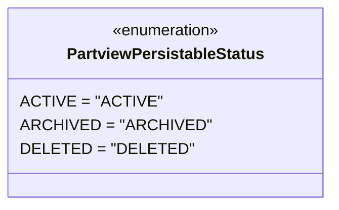

# Diagram: application_service/container_tracking_app_service/core/PartviewPersistableStatus.py

> Auto-generated by Obscura crawlers

## Mermaid

### SVG

<svg id="container" width="307.078125" xmlns="http://www.w3.org/2000/svg" class="classDiagram" height="208" viewBox="0 0 307.078125 208" role="graphics-document document" aria-roledescription="class"><g><defs><marker id="container_class-aggregationStart" class="marker aggregation class" refX="18" refY="7" markerWidth="190" markerHeight="240" orient="auto"><path d="M 18,7 L9,13 L1,7 L9,1 Z"></path></marker></defs><defs><marker id="container_class-aggregationEnd" class="marker aggregation class" refX="1" refY="7" markerWidth="20" markerHeight="28" orient="auto"><path d="M 18,7 L9,13 L1,7 L9,1 Z"></path></marker></defs><defs><marker id="container_class-extensionStart" class="marker extension class" refX="18" refY="7" markerWidth="190" markerHeight="240" orient="auto"><path d="M 1,7 L18,13 V 1 Z"></path></marker></defs><defs><marker id="container_class-extensionEnd" class="marker extension class" refX="1" refY="7" markerWidth="20" markerHeight="28" orient="auto"><path d="M 1,1 V 13 L18,7 Z"></path></marker></defs><defs><marker id="container_class-compositionStart" class="marker composition class" refX="18" refY="7" markerWidth="190" markerHeight="240" orient="auto"><path d="M 18,7 L9,13 L1,7 L9,1 Z"></path></marker></defs><defs><marker id="container_class-compositionEnd" class="marker composition class" refX="1" refY="7" markerWidth="20" markerHeight="28" orient="auto"><path d="M 18,7 L9,13 L1,7 L9,1 Z"></path></marker></defs><defs><marker id="container_class-dependencyStart" class="marker dependency class" refX="6" refY="7" markerWidth="190" markerHeight="240" orient="auto"><path d="M 5,7 L9,13 L1,7 L9,1 Z"></path></marker></defs><defs><marker id="container_class-dependencyEnd" class="marker dependency class" refX="13" refY="7" markerWidth="20" markerHeight="28" orient="auto"><path d="M 18,7 L9,13 L14,7 L9,1 Z"></path></marker></defs><defs><marker id="container_class-lollipopStart" class="marker lollipop class" refX="13" refY="7" markerWidth="190" markerHeight="240" orient="auto"><circle stroke="black" fill="transparent" cx="7" cy="7" r="6"></circle></marker></defs><defs><marker id="container_class-lollipopEnd" class="marker lollipop class" refX="1" refY="7" markerWidth="190" markerHeight="240" orient="auto"><circle stroke="black" fill="transparent" cx="7" cy="7" r="6"></circle></marker></defs><g class="root"><g class="clusters"></g><g class="edgePaths"></g><g class="edgeLabels"></g><g class="nodes"><g class="node default" id="classId-PartviewPersistableStatus-0" transform="translate(153.5390625, 104)"><g class="basic label-container"><path d="M-145.5390625 -96 L145.5390625 -96 L145.5390625 96 L-145.5390625 96" stroke="none" stroke-width="0" fill="#ECECFF" style=""></path><path d="M-145.5390625 -96 C-73.05170776296013 -96, -0.5643530259202691 -96, 145.5390625 -96 M-145.5390625 -96 C-77.58902642277535 -96, -9.638990345550695 -96, 145.5390625 -96 M145.5390625 -96 C145.5390625 -41.75841059118291, 145.5390625 12.483178817634183, 145.5390625 96 M145.5390625 -96 C145.5390625 -27.715125288198607, 145.5390625 40.56974942360279, 145.5390625 96 M145.5390625 96 C39.685061135743254 96, -66.16894022851349 96, -145.5390625 96 M145.5390625 96 C72.08573855342281 96, -1.3675853931543713 96, -145.5390625 96 M-145.5390625 96 C-145.5390625 46.70112003083632, -145.5390625 -2.597759938327357, -145.5390625 -96 M-145.5390625 96 C-145.5390625 48.752009266154055, -145.5390625 1.504018532308109, -145.5390625 -96" stroke="#9370DB" stroke-width="1.3" fill="none" stroke-dasharray="0 0" style=""></path></g><g class="annotation-group text" transform="translate(-55.5546875, -72)"><g class="label" style="" transform="translate(0,-12)"><foreignObject width="111.109375" height="24">

«enumeration»

</foreignObject></g></g><g class="label-group text" transform="translate(-96.25, -48)"><g class="label" style="font-weight: bolder" transform="translate(0,-12)"><foreignObject width="192.5" height="24">

PartviewPersistableStatus

</foreignObject></g></g><g class="members-group text" transform="translate(-133.5390625, 0)"><g class="label" style="" transform="translate(0,-12)"><foreignObject width="125.28125" height="24">

ACTIVE = "ACTIVE"

</foreignObject></g><g class="label" style="" transform="translate(0,12)"><foreignObject width="170.828125" height="24">

ARCHIVED = "ARCHIVED"

</foreignObject></g><g class="label" style="" transform="translate(0,36)"><foreignObject width="154.3125" height="24">

DELETED = "DELETED"

</foreignObject></g></g><g class="methods-group text" transform="translate(-133.5390625, 96)"></g><g class="divider" style=""><path d="M-145.5390625 -24 C-79.59677524571404 -24, -13.654487991428084 -24, 145.5390625 -24 M-145.5390625 -24 C-76.80275807233414 -24, -8.066453644668286 -24, 145.5390625 -24" stroke="#9370DB" stroke-width="1.3" fill="none" stroke-dasharray="0 0" style=""></path></g><g class="divider" style=""><path d="M-145.5390625 72 C-48.760101877127056 72, 48.01885874574589 72, 145.5390625 72 M-145.5390625 72 C-33.93448419057775 72, 77.6700941188445 72, 145.5390625 72" stroke="#9370DB" stroke-width="1.3" fill="none" stroke-dasharray="0 0" style=""></path></g></g></g></g></g></svg>
