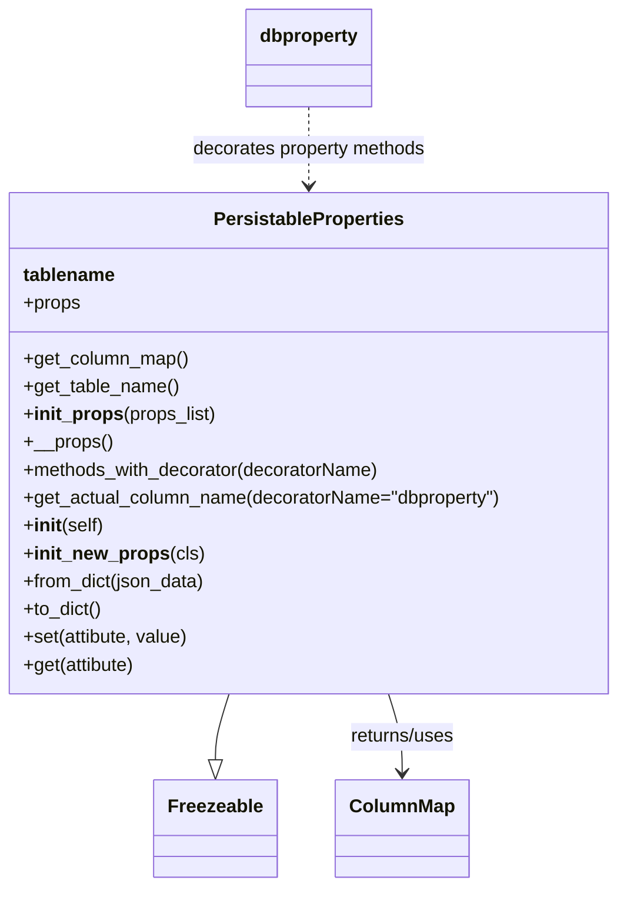

# Diagram: application_service/container_tracking_app_service/core/PersistableProperties.py

> Auto-generated by Obscura crawlers

## Mermaid

### SVG

<svg id="container" width="538.0625" xmlns="http://www.w3.org/2000/svg" class="classDiagram" height="788" viewBox="0 0 538.0625 788" role="graphics-document document" aria-roledescription="class"><g><defs><marker id="container_class-aggregationStart" class="marker aggregation class" refX="18" refY="7" markerWidth="190" markerHeight="240" orient="auto"><path d="M 18,7 L9,13 L1,7 L9,1 Z"></path></marker></defs><defs><marker id="container_class-aggregationEnd" class="marker aggregation class" refX="1" refY="7" markerWidth="20" markerHeight="28" orient="auto"><path d="M 18,7 L9,13 L1,7 L9,1 Z"></path></marker></defs><defs><marker id="container_class-extensionStart" class="marker extension class" refX="18" refY="7" markerWidth="190" markerHeight="240" orient="auto"><path d="M 1,7 L18,13 V 1 Z"></path></marker></defs><defs><marker id="container_class-extensionEnd" class="marker extension class" refX="1" refY="7" markerWidth="20" markerHeight="28" orient="auto"><path d="M 1,1 V 13 L18,7 Z"></path></marker></defs><defs><marker id="container_class-compositionStart" class="marker composition class" refX="18" refY="7" markerWidth="190" markerHeight="240" orient="auto"><path d="M 18,7 L9,13 L1,7 L9,1 Z"></path></marker></defs><defs><marker id="container_class-compositionEnd" class="marker composition class" refX="1" refY="7" markerWidth="20" markerHeight="28" orient="auto"><path d="M 18,7 L9,13 L1,7 L9,1 Z"></path></marker></defs><defs><marker id="container_class-dependencyStart" class="marker dependency class" refX="6" refY="7" markerWidth="190" markerHeight="240" orient="auto"><path d="M 5,7 L9,13 L1,7 L9,1 Z"></path></marker></defs><defs><marker id="container_class-dependencyEnd" class="marker dependency class" refX="13" refY="7" markerWidth="20" markerHeight="28" orient="auto"><path d="M 18,7 L9,13 L14,7 L9,1 Z"></path></marker></defs><defs><marker id="container_class-lollipopStart" class="marker lollipop class" refX="13" refY="7" markerWidth="190" markerHeight="240" orient="auto"><circle stroke="black" fill="transparent" cx="7" cy="7" r="6"></circle></marker></defs><defs><marker id="container_class-lollipopEnd" class="marker lollipop class" refX="1" refY="7" markerWidth="190" markerHeight="240" orient="auto"><circle stroke="black" fill="transparent" cx="7" cy="7" r="6"></circle></marker></defs><g class="root"><g class="clusters"></g><g class="edgePaths"><path d="M202.402,622L200.499,628.167C198.597,634.333,194.793,646.667,192.891,656.125C190.988,665.583,190.988,672.167,190.988,675.458L190.988,678.75" id="id_PersistableProperties_Freezeable_1" class="edge-thickness-normal edge-pattern-solid relation" style=";;;" data-edge="true" data-et="edge" data-id="id_PersistableProperties_Freezeable_1" data-points="W3sieCI6MjAyLjQwMTY3OTg0MTg5NzI1LCJ5Ijo2MjJ9LHsieCI6MTkwLjk4ODI4MTI1LCJ5Ijo2NTl9LHsieCI6MTkwLjk4ODI4MTI1LCJ5Ijo2OTZ9XQ==" marker-end="url(#container_class-extensionEnd)"></path><path d="M335.661,622L337.563,628.167C339.465,634.333,343.27,646.667,345.172,658C347.074,669.333,347.074,679.667,347.074,684.833L347.074,690" id="id_PersistableProperties_ColumnMap_2" class="edge-thickness-normal edge-pattern-solid relation" style=";;;" data-edge="true" data-et="edge" data-id="id_PersistableProperties_ColumnMap_2" data-points="W3sieCI6MzM1LjY2MDgyMDE1ODEwMjc1LCJ5Ijo2MjJ9LHsieCI6MzQ3LjA3NDIxODc1LCJ5Ijo2NTl9LHsieCI6MzQ3LjA3NDIxODc1LCJ5Ijo2OTZ9XQ==" marker-end="url(#container_class-dependencyEnd)"></path><path d="M269.031,92L269.031,100.167C269.031,108.333,269.031,124.667,269.031,140C269.031,155.333,269.031,169.667,269.031,176.833L269.031,184" id="id_dbproperty_PersistableProperties_3" class="edge-thickness-normal edge-pattern-dashed relation" style=";;;" data-edge="true" data-et="edge" data-id="id_dbproperty_PersistableProperties_3" data-points="W3sieCI6MjY5LjAzMTI1LCJ5Ijo5Mn0seyJ4IjoyNjkuMDMxMjUsInkiOjE0MX0seyJ4IjoyNjkuMDMxMjUsInkiOjE5MH1d" marker-end="url(#container_class-dependencyEnd)"></path></g><g class="edgeLabels"><g class="edgeLabel"><g class="label" data-id="id_PersistableProperties_Freezeable_1" transform="translate(0, 0)"><foreignObject width="0" height="0">

</foreignObject></g></g><g class="edgeLabel" transform="translate(347.07421875, 659)"><g class="label" data-id="id_PersistableProperties_ColumnMap_2" transform="translate(-46.6796875, -12)"><foreignObject width="93.359375" height="24">

returns/uses

</foreignObject></g></g><g class="edgeLabel" transform="translate(269.03125, 141)"><g class="label" data-id="id_dbproperty_PersistableProperties_3" transform="translate(-100, -24)"><foreignObject width="200" height="48">

decorates property methods

</foreignObject></g></g></g><g class="nodes"><g class="node default" id="classId-Freezeable-0" transform="translate(190.98828125, 738)"><g class="basic label-container"><path d="M-51.1953125 -42 L51.1953125 -42 L51.1953125 42 L-51.1953125 42" stroke="none" stroke-width="0" fill="#ECECFF" style=""></path><path d="M-51.1953125 -42 C-26.87691360717903 -42, -2.5585147143580613 -42, 51.1953125 -42 M-51.1953125 -42 C-19.749529969883493 -42, 11.696252560233013 -42, 51.1953125 -42 M51.1953125 -42 C51.1953125 -15.33898301875973, 51.1953125 11.322033962480539, 51.1953125 42 M51.1953125 -42 C51.1953125 -17.118867357781212, 51.1953125 7.762265284437575, 51.1953125 42 M51.1953125 42 C11.789196318943631 42, -27.616919862112738 42, -51.1953125 42 M51.1953125 42 C20.89635624259392 42, -9.402600014812158 42, -51.1953125 42 M-51.1953125 42 C-51.1953125 24.831539231843962, -51.1953125 7.663078463687924, -51.1953125 -42 M-51.1953125 42 C-51.1953125 22.93671968681095, -51.1953125 3.873439373621899, -51.1953125 -42" stroke="#9370DB" stroke-width="1.3" fill="none" stroke-dasharray="0 0" style=""></path></g><g class="annotation-group text" transform="translate(0, -18)"></g><g class="label-group text" transform="translate(-39.1953125, -18)"><g class="label" style="font-weight: bolder" transform="translate(0,-12)"><foreignObject width="78.390625" height="24">

Freezeable

</foreignObject></g></g><g class="members-group text" transform="translate(-39.1953125, 30)"></g><g class="methods-group text" transform="translate(-39.1953125, 60)"></g><g class="divider" style=""><path d="M-51.1953125 6 C-14.427483950507415 6, 22.34034459898517 6, 51.1953125 6 M-51.1953125 6 C-16.38501888211296 6, 18.42527473577408 6, 51.1953125 6" stroke="#9370DB" stroke-width="1.3" fill="none" stroke-dasharray="0 0" style=""></path></g><g class="divider" style=""><path d="M-51.1953125 24 C-12.193700822507246 24, 26.807910854985508 24, 51.1953125 24 M-51.1953125 24 C-17.91087669793415 24, 15.3735591041317 24, 51.1953125 24" stroke="#9370DB" stroke-width="1.3" fill="none" stroke-dasharray="0 0" style=""></path></g></g><g class="node default" id="classId-ColumnMap-1" transform="translate(347.07421875, 738)"><g class="basic label-container"><path d="M-54.890625 -42 L54.890625 -42 L54.890625 42 L-54.890625 42" stroke="none" stroke-width="0" fill="#ECECFF" style=""></path><path d="M-54.890625 -42 C-18.739258450277028 -42, 17.412108099445945 -42, 54.890625 -42 M-54.890625 -42 C-24.925625812091386 -42, 5.039373375817227 -42, 54.890625 -42 M54.890625 -42 C54.890625 -15.487761777399594, 54.890625 11.024476445200811, 54.890625 42 M54.890625 -42 C54.890625 -11.482452026614173, 54.890625 19.035095946771655, 54.890625 42 M54.890625 42 C15.07365154055148 42, -24.74332191889704 42, -54.890625 42 M54.890625 42 C23.909858591758017 42, -7.070907816483967 42, -54.890625 42 M-54.890625 42 C-54.890625 16.273912423044898, -54.890625 -9.452175153910204, -54.890625 -42 M-54.890625 42 C-54.890625 13.37070269856454, -54.890625 -15.258594602870922, -54.890625 -42" stroke="#9370DB" stroke-width="1.3" fill="none" stroke-dasharray="0 0" style=""></path></g><g class="annotation-group text" transform="translate(0, -18)"></g><g class="label-group text" transform="translate(-42.890625, -18)"><g class="label" style="font-weight: bolder" transform="translate(0,-12)"><foreignObject width="85.78125" height="24">

ColumnMap

</foreignObject></g></g><g class="members-group text" transform="translate(-42.890625, 30)"></g><g class="methods-group text" transform="translate(-42.890625, 60)"></g><g class="divider" style=""><path d="M-54.890625 6 C-11.812228251794593 6, 31.266168496410813 6, 54.890625 6 M-54.890625 6 C-11.573128381720657 6, 31.744368236558685 6, 54.890625 6" stroke="#9370DB" stroke-width="1.3" fill="none" stroke-dasharray="0 0" style=""></path></g><g class="divider" style=""><path d="M-54.890625 24 C-24.11571284364557 24, 6.659199312708857 24, 54.890625 24 M-54.890625 24 C-25.152671978706994 24, 4.585281042586011 24, 54.890625 24" stroke="#9370DB" stroke-width="1.3" fill="none" stroke-dasharray="0 0" style=""></path></g></g><g class="node default" id="classId-dbproperty-2" transform="translate(269.03125, 50)"><g class="basic label-container"><path d="M-53.5859375 -42 L53.5859375 -42 L53.5859375 42 L-53.5859375 42" stroke="none" stroke-width="0" fill="#ECECFF" style=""></path><path d="M-53.5859375 -42 C-30.87392565522743 -42, -8.161913810454863 -42, 53.5859375 -42 M-53.5859375 -42 C-25.587610175660437 -42, 2.410717148679126 -42, 53.5859375 -42 M53.5859375 -42 C53.5859375 -21.166819302046214, 53.5859375 -0.3336386040924282, 53.5859375 42 M53.5859375 -42 C53.5859375 -16.51042345551504, 53.5859375 8.979153088969923, 53.5859375 42 M53.5859375 42 C18.798589523547946 42, -15.988758452904108 42, -53.5859375 42 M53.5859375 42 C31.91094581775361 42, 10.235954135507221 42, -53.5859375 42 M-53.5859375 42 C-53.5859375 20.953210963415838, -53.5859375 -0.09357807316832378, -53.5859375 -42 M-53.5859375 42 C-53.5859375 12.555462141268507, -53.5859375 -16.889075717462987, -53.5859375 -42" stroke="#9370DB" stroke-width="1.3" fill="none" stroke-dasharray="0 0" style=""></path></g><g class="annotation-group text" transform="translate(0, -18)"></g><g class="label-group text" transform="translate(-41.5859375, -18)"><g class="label" style="font-weight: bolder" transform="translate(0,-12)"><foreignObject width="83.171875" height="24">

dbproperty

</foreignObject></g></g><g class="members-group text" transform="translate(-41.5859375, 30)"></g><g class="methods-group text" transform="translate(-41.5859375, 60)"></g><g class="divider" style=""><path d="M-53.5859375 6 C-27.952450570080362 6, -2.3189636401607245 6, 53.5859375 6 M-53.5859375 6 C-20.27451809559694 6, 13.036901308806122 6, 53.5859375 6" stroke="#9370DB" stroke-width="1.3" fill="none" stroke-dasharray="0 0" style=""></path></g><g class="divider" style=""><path d="M-53.5859375 24 C-17.85134073438315 24, 17.8832560312337 24, 53.5859375 24 M-53.5859375 24 C-30.189392479942263 24, -6.792847459884527 24, 53.5859375 24" stroke="#9370DB" stroke-width="1.3" fill="none" stroke-dasharray="0 0" style=""></path></g></g><g class="node default" id="classId-PersistableProperties-3" transform="translate(269.03125, 406)"><g class="basic label-container"><path d="M-261.03125 -216 L261.03125 -216 L261.03125 216 L-261.03125 216" stroke="none" stroke-width="0" fill="#ECECFF" style=""></path><path d="M-261.03125 -216 C-62.06827328576284 -216, 136.89470342847432 -216, 261.03125 -216 M-261.03125 -216 C-58.553542264607984 -216, 143.92416547078403 -216, 261.03125 -216 M261.03125 -216 C261.03125 -43.66448523242153, 261.03125 128.67102953515695, 261.03125 216 M261.03125 -216 C261.03125 -126.69289972433558, 261.03125 -37.38579944867115, 261.03125 216 M261.03125 216 C125.16886635404708 216, -10.693517291905835 216, -261.03125 216 M261.03125 216 C147.13293201459996 216, 33.23461402919992 216, -261.03125 216 M-261.03125 216 C-261.03125 49.499846165961486, -261.03125 -117.00030766807703, -261.03125 -216 M-261.03125 216 C-261.03125 96.23161798148045, -261.03125 -23.53676403703909, -261.03125 -216" stroke="#9370DB" stroke-width="1.3" fill="none" stroke-dasharray="0 0" style=""></path></g><g class="annotation-group text" transform="translate(0, -192)"></g><g class="label-group text" transform="translate(-79.28125, -192)"><g class="label" style="font-weight: bolder" transform="translate(0,-12)"><foreignObject width="158.5625" height="24">

PersistableProperties

</foreignObject></g></g><g class="members-group text" transform="translate(-249.03125, -144)"><g class="label" style="" transform="translate(0,-12)"><foreignObject width="78.171875" height="24">

<strong>tablename</strong>

</foreignObject></g><g class="label" style="" transform="translate(0,12)"><foreignObject width="49.515625" height="24">

+props

</foreignObject></g></g><g class="methods-group text" transform="translate(-249.03125, -72)"><g class="label" style="" transform="translate(0,-12)"><foreignObject width="142.921875" height="24">

+get_column_map()

</foreignObject></g><g class="label" style="" transform="translate(0,12)"><foreignObject width="134.625" height="24">

+get_table_name()

</foreignObject></g><g class="label" style="" transform="translate(0,36)"><foreignObject width="165.046875" height="24">

+<strong>init_props</strong>(props_list)

</foreignObject></g><g class="label" style="" transform="translate(0,60)"><foreignObject width="75.078125" height="24">

+__props()

</foreignObject></g><g class="label" style="" transform="translate(0,84)"><foreignObject width="311.875" height="24">

+methods_with_decorator(decoratorName)

</foreignObject></g><g class="label" style="" transform="translate(0,108)"><foreignObject width="418.78125" height="24">

+get_actual_column_name(decoratorName="dbproperty")

</foreignObject></g><g class="label" style="" transform="translate(0,132)"><foreignObject width="70.3125" height="24">

+<strong>init</strong>(self)

</foreignObject></g><g class="label" style="" transform="translate(0,156)"><foreignObject width="151.09375" height="24">

+<strong>init_new_props</strong>(cls)

</foreignObject></g><g class="label" style="" transform="translate(0,180)"><foreignObject width="159.625" height="24">

+from_dict(json_data)

</foreignObject></g><g class="label" style="" transform="translate(0,204)"><foreignObject width="68.34375" height="24">

+to_dict()

</foreignObject></g><g class="label" style="" transform="translate(0,228)"><foreignObject width="144.96875" height="24">

+set(attibute, value)

</foreignObject></g><g class="label" style="" transform="translate(0,252)"><foreignObject width="98.765625" height="24">

+get(attibute)

</foreignObject></g></g><g class="divider" style=""><path d="M-261.03125 -168 C-117.63729337217919 -168, 25.756663255641627 -168, 261.03125 -168 M-261.03125 -168 C-92.0017182153122 -168, 77.02781356937561 -168, 261.03125 -168" stroke="#9370DB" stroke-width="1.3" fill="none" stroke-dasharray="0 0" style=""></path></g><g class="divider" style=""><path d="M-261.03125 -96 C-113.44711684402765 -96, 34.137016311944706 -96, 261.03125 -96 M-261.03125 -96 C-128.89663697262444 -96, 3.2379760547511296 -96, 261.03125 -96" stroke="#9370DB" stroke-width="1.3" fill="none" stroke-dasharray="0 0" style=""></path></g></g></g></g></g></svg>
