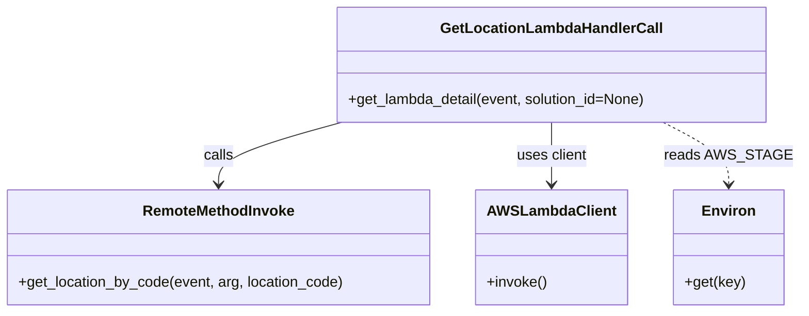

# Diagram: application_service/container_tracking_app_service/core/business/GetLocationLambdaHandlerCall.py


> Auto-generated by Obscura crawlers

## Diagram 1



### SVG

<svg id="container" width="856.5390625" xmlns="http://www.w3.org/2000/svg" class="classDiagram" height="342" viewBox="0 0 856.5390625 342" role="graphics-document document" aria-roledescription="class"><style>#container{font-family:"trebuchet ms",verdana,arial,sans-serif;font-size:16px;fill:#333;}@keyframes edge-animation-frame{from{stroke-dashoffset:0;}}@keyframes dash{to{stroke-dashoffset:0;}}#container .edge-animation-slow{stroke-dasharray:9,5!important;stroke-dashoffset:900;animation:dash 50s linear infinite;stroke-linecap:round;}#container .edge-animation-fast{stroke-dasharray:9,5!important;stroke-dashoffset:900;animation:dash 20s linear infinite;stroke-linecap:round;}#container .error-icon{fill:#552222;}#container .error-text{fill:#552222;stroke:#552222;}#container .edge-thickness-normal{stroke-width:1px;}#container .edge-thickness-thick{stroke-width:3.5px;}#container .edge-pattern-solid{stroke-dasharray:0;}#container .edge-thickness-invisible{stroke-width:0;fill:none;}#container .edge-pattern-dashed{stroke-dasharray:3;}#container .edge-pattern-dotted{stroke-dasharray:2;}#container .marker{fill:#333333;stroke:#333333;}#container .marker.cross{stroke:#333333;}#container svg{font-family:"trebuchet ms",verdana,arial,sans-serif;font-size:16px;}#container p{margin:0;}#container g.classGroup text{fill:#9370DB;stroke:none;font-family:"trebuchet ms",verdana,arial,sans-serif;font-size:10px;}#container g.classGroup text .title{font-weight:bolder;}#container .nodeLabel,#container .edgeLabel{color:#131300;}#container .edgeLabel .label rect{fill:#ECECFF;}#container .label text{fill:#131300;}#container .labelBkg{background:#ECECFF;}#container .edgeLabel .label span{background:#ECECFF;}#container .classTitle{font-weight:bolder;}#container .node rect,#container .node circle,#container .node ellipse,#container .node polygon,#container .node path{fill:#ECECFF;stroke:#9370DB;stroke-width:1px;}#container .divider{stroke:#9370DB;stroke-width:1;}#container g.clickable{cursor:pointer;}#container g.classGroup rect{fill:#ECECFF;stroke:#9370DB;}#container g.classGroup line{stroke:#9370DB;stroke-width:1;}#container .classLabel .box{stroke:none;stroke-width:0;fill:#ECECFF;opacity:0.5;}#container .classLabel .label{fill:#9370DB;font-size:10px;}#container .relation{stroke:#333333;stroke-width:1;fill:none;}#container .dashed-line{stroke-dasharray:3;}#container .dotted-line{stroke-dasharray:1 2;}#container #compositionStart,#container .composition{fill:#333333!important;stroke:#333333!important;stroke-width:1;}#container #compositionEnd,#container .composition{fill:#333333!important;stroke:#333333!important;stroke-width:1;}#container #dependencyStart,#container .dependency{fill:#333333!important;stroke:#333333!important;stroke-width:1;}#container #dependencyStart,#container .dependency{fill:#333333!important;stroke:#333333!important;stroke-width:1;}#container #extensionStart,#container .extension{fill:transparent!important;stroke:#333333!important;stroke-width:1;}#container #extensionEnd,#container .extension{fill:transparent!important;stroke:#333333!important;stroke-width:1;}#container #aggregationStart,#container .aggregation{fill:transparent!important;stroke:#333333!important;stroke-width:1;}#container #aggregationEnd,#container .aggregation{fill:transparent!important;stroke:#333333!important;stroke-width:1;}#container #lollipopStart,#container .lollipop{fill:#ECECFF!important;stroke:#333333!important;stroke-width:1;}#container #lollipopEnd,#container .lollipop{fill:#ECECFF!important;stroke:#333333!important;stroke-width:1;}#container .edgeTerminals{font-size:11px;line-height:initial;}#container .classTitleText{text-anchor:middle;font-size:18px;fill:#333;}#container .label-icon{display:inline-block;height:1em;overflow:visible;vertical-align:-0.125em;}#container .node .label-icon path{fill:currentColor;stroke:revert;stroke-width:revert;}#container :root{--mermaid-font-family:"trebuchet ms",verdana,arial,sans-serif;}</style><g><defs><marker id="container_class-aggregationStart" class="marker aggregation class" refX="18" refY="7" markerWidth="190" markerHeight="240" orient="auto"><path d="M 18,7 L9,13 L1,7 L9,1 Z"></path></marker></defs><defs><marker id="container_class-aggregationEnd" class="marker aggregation class" refX="1" refY="7" markerWidth="20" markerHeight="28" orient="auto"><path d="M 18,7 L9,13 L1,7 L9,1 Z"></path></marker></defs><defs><marker id="container_class-extensionStart" class="marker extension class" refX="18" refY="7" markerWidth="190" markerHeight="240" orient="auto"><path d="M 1,7 L18,13 V 1 Z"></path></marker></defs><defs><marker id="container_class-extensionEnd" class="marker extension class" refX="1" refY="7" markerWidth="20" markerHeight="28" orient="auto"><path d="M 1,1 V 13 L18,7 Z"></path></marker></defs><defs><marker id="container_class-compositionStart" class="marker composition class" refX="18" refY="7" markerWidth="190" markerHeight="240" orient="auto"><path d="M 18,7 L9,13 L1,7 L9,1 Z"></path></marker></defs><defs><marker id="container_class-compositionEnd" class="marker composition class" refX="1" refY="7" markerWidth="20" markerHeight="28" orient="auto"><path d="M 18,7 L9,13 L1,7 L9,1 Z"></path></marker></defs><defs><marker id="container_class-dependencyStart" class="marker dependency class" refX="6" refY="7" markerWidth="190" markerHeight="240" orient="auto"><path d="M 5,7 L9,13 L1,7 L9,1 Z"></path></marker></defs><defs><marker id="container_class-dependencyEnd" class="marker dependency class" refX="13" refY="7" markerWidth="20" markerHeight="28" orient="auto"><path d="M 18,7 L9,13 L14,7 L9,1 Z"></path></marker></defs><defs><marker id="container_class-lollipopStart" class="marker lollipop class" refX="13" refY="7" markerWidth="190" markerHeight="240" orient="auto"><circle stroke="black" fill="transparent" cx="7" cy="7" r="6"></circle></marker></defs><defs><marker id="container_class-lollipopEnd" class="marker lollipop class" refX="1" refY="7" markerWidth="190" markerHeight="240" orient="auto"><circle stroke="black" fill="transparent" cx="7" cy="7" r="6"></circle></marker></defs><g class="root"><g class="clusters"></g><g class="edgePaths"><path d="M372.133,134L349.963,140.167C327.793,146.333,283.453,158.667,261.283,170C239.113,181.333,239.113,191.667,239.113,196.833L239.113,202" id="id_GetLocationLambdaHandlerCall_RemoteMethodInvoke_1" class="edge-thickness-normal edge-pattern-solid relation" style=";;;" data-edge="true" data-et="edge" data-id="id_GetLocationLambdaHandlerCall_RemoteMethodInvoke_1" data-points="W3sieCI6MzcyLjEzMjYxNzE4NzUsInkiOjEzNH0seyJ4IjoyMzkuMTEzMjgxMjUsInkiOjE3MX0seyJ4IjoyMzkuMTEzMjgxMjUsInkiOjIwOH1d" marker-end="url(#container_class-dependencyEnd)"></path><path d="M598.625,134L598.625,140.167C598.625,146.333,598.625,158.667,598.625,170C598.625,181.333,598.625,191.667,598.625,196.833L598.625,202" id="id_GetLocationLambdaHandlerCall_AWSLambdaClient_2" class="edge-thickness-normal edge-pattern-solid relation" style=";;;" data-edge="true" data-et="edge" data-id="id_GetLocationLambdaHandlerCall_AWSLambdaClient_2" data-points="W3sieCI6NTk4LjYyNSwieSI6MTM0fSx7IngiOjU5OC42MjUsInkiOjE3MX0seyJ4Ijo1OTguNjI1LCJ5IjoyMDh9XQ==" marker-end="url(#container_class-dependencyEnd)"></path><path d="M716.312,134L727.832,140.167C739.351,146.333,762.39,158.667,773.91,170C785.43,181.333,785.43,191.667,785.43,196.833L785.43,202" id="id_GetLocationLambdaHandlerCall_Environ_3" class="edge-thickness-normal edge-pattern-dashed relation" style=";;;" data-edge="true" data-et="edge" data-id="id_GetLocationLambdaHandlerCall_Environ_3" data-points="W3sieCI6NzE2LjMxMTk1MzEyNSwieSI6MTM0fSx7IngiOjc4NS40Mjk2ODc1LCJ5IjoxNzF9LHsieCI6Nzg1LjQyOTY4NzUsInkiOjIwOH1d" marker-end="url(#container_class-dependencyEnd)"></path></g><g class="edgeLabels"><g class="edgeLabel" transform="translate(239.11328125, 171)"><g class="label" data-id="id_GetLocationLambdaHandlerCall_RemoteMethodInvoke_1" transform="translate(-16.4453125, -12)"><foreignObject width="32.890625" height="24"><div xmlns="http://www.w3.org/1999/xhtml" class="labelBkg" style="display: table-cell; white-space: nowrap; line-height: 1.5; max-width: 200px; text-align: center;"><span class="edgeLabel"><p>calls</p></span></div></foreignObject></g></g><g class="edgeLabel" transform="translate(598.625, 171)"><g class="label" data-id="id_GetLocationLambdaHandlerCall_AWSLambdaClient_2" transform="translate(-38.96875, -12)"><foreignObject width="77.9375" height="24"><div xmlns="http://www.w3.org/1999/xhtml" class="labelBkg" style="display: table-cell; white-space: nowrap; line-height: 1.5; max-width: 200px; text-align: center;"><span class="edgeLabel"><p>uses client</p></span></div></foreignObject></g></g><g class="edgeLabel" transform="translate(785.4296875, 171)"><g class="label" data-id="id_GetLocationLambdaHandlerCall_Environ_3" transform="translate(-63.109375, -12)"><foreignObject width="126.21875" height="24"><div xmlns="http://www.w3.org/1999/xhtml" class="labelBkg" style="display: table-cell; white-space: nowrap; line-height: 1.5; max-width: 200px; text-align: center;"><span class="edgeLabel"><p>reads AWS_STAGE</p></span></div></foreignObject></g></g></g><g class="nodes"><g class="node default" id="classId-GetLocationLambdaHandlerCall-0" transform="translate(598.625, 71)"><g class="basic label-container"><path d="M-235.30859375 -63 L235.30859375 -63 L235.30859375 63 L-235.30859375 63" stroke="none" stroke-width="0" fill="#ECECFF" style=""></path><path d="M-235.30859375 -63 C-115.76224810559923 -63, 3.7840975388015465 -63, 235.30859375 -63 M-235.30859375 -63 C-89.49653873739533 -63, 56.31551627520935 -63, 235.30859375 -63 M235.30859375 -63 C235.30859375 -24.106693714708904, 235.30859375 14.786612570582193, 235.30859375 63 M235.30859375 -63 C235.30859375 -35.439356824368886, 235.30859375 -7.878713648737765, 235.30859375 63 M235.30859375 63 C132.0478719272736 63, 28.78715010454718 63, -235.30859375 63 M235.30859375 63 C139.7294411322103 63, 44.150288514420566 63, -235.30859375 63 M-235.30859375 63 C-235.30859375 17.937485177880504, -235.30859375 -27.125029644238992, -235.30859375 -63 M-235.30859375 63 C-235.30859375 19.994420121752206, -235.30859375 -23.011159756495587, -235.30859375 -63" stroke="#9370DB" stroke-width="1.3" fill="none" stroke-dasharray="0 0" style=""></path></g><g class="annotation-group text" transform="translate(0, -39)"></g><g class="label-group text" transform="translate(-115.8046875, -39)"><g class="label" style="font-weight: bolder" transform="translate(0,-12)"><foreignObject width="231.609375" height="24"><div xmlns="http://www.w3.org/1999/xhtml" style="display: table-cell; white-space: nowrap; line-height: 1.5; max-width: 280px; text-align: center;"><span class="nodeLabel markdown-node-label" style=""><p>GetLocationLambdaHandlerCall</p></span></div></foreignObject></g></g><g class="members-group text" transform="translate(-223.30859375, 9)"></g><g class="methods-group text" transform="translate(-223.30859375, 39)"><g class="label" style="" transform="translate(0,-12)"><foreignObject width="330.8125" height="24"><div xmlns="http://www.w3.org/1999/xhtml" style="display: table-cell; white-space: nowrap; line-height: 1.5; max-width: 388px; text-align: center;"><span class="nodeLabel markdown-node-label" style=""><p>+get_lambda_detail(event, solution_id=None)</p></span></div></foreignObject></g></g><g class="divider" style=""><path d="M-235.30859375 -15 C-57.33622482179453 -15, 120.63614410641094 -15, 235.30859375 -15 M-235.30859375 -15 C-139.7678082507765 -15, -44.227022751552994 -15, 235.30859375 -15" stroke="#9370DB" stroke-width="1.3" fill="none" stroke-dasharray="0 0" style=""></path></g><g class="divider" style=""><path d="M-235.30859375 9 C-47.63899037483847 9, 140.03061300032306 9, 235.30859375 9 M-235.30859375 9 C-57.514617468774844 9, 120.27935881245031 9, 235.30859375 9" stroke="#9370DB" stroke-width="1.3" fill="none" stroke-dasharray="0 0" style=""></path></g></g><g class="node default" id="classId-RemoteMethodInvoke-1" transform="translate(239.11328125, 271)"><g class="basic label-container"><path d="M-231.11328125 -63 L231.11328125 -63 L231.11328125 63 L-231.11328125 63" stroke="none" stroke-width="0" fill="#ECECFF" style=""></path><path d="M-231.11328125 -63 C-101.99033041369256 -63, 27.132620422614877 -63, 231.11328125 -63 M-231.11328125 -63 C-121.41946197293174 -63, -11.725642695863485 -63, 231.11328125 -63 M231.11328125 -63 C231.11328125 -14.900166532342581, 231.11328125 33.19966693531484, 231.11328125 63 M231.11328125 -63 C231.11328125 -31.78725684080445, 231.11328125 -0.5745136816088987, 231.11328125 63 M231.11328125 63 C81.98954104068815 63, -67.1341991686237 63, -231.11328125 63 M231.11328125 63 C95.8938183978373 63, -39.32564445432541 63, -231.11328125 63 M-231.11328125 63 C-231.11328125 28.41028856348472, -231.11328125 -6.1794228730305605, -231.11328125 -63 M-231.11328125 63 C-231.11328125 24.726370945097045, -231.11328125 -13.54725810980591, -231.11328125 -63" stroke="#9370DB" stroke-width="1.3" fill="none" stroke-dasharray="0 0" style=""></path></g><g class="annotation-group text" transform="translate(0, -39)"></g><g class="label-group text" transform="translate(-80.2578125, -39)"><g class="label" style="font-weight: bolder" transform="translate(0,-12)"><foreignObject width="160.515625" height="24"><div xmlns="http://www.w3.org/1999/xhtml" style="display: table-cell; white-space: nowrap; line-height: 1.5; max-width: 209px; text-align: center;"><span class="nodeLabel markdown-node-label" style=""><p>RemoteMethodInvoke</p></span></div></foreignObject></g></g><g class="members-group text" transform="translate(-219.11328125, 9)"></g><g class="methods-group text" transform="translate(-219.11328125, 39)"><g class="label" style="" transform="translate(0,-12)"><foreignObject width="357.96875" height="24"><div xmlns="http://www.w3.org/1999/xhtml" style="display: table-cell; white-space: nowrap; line-height: 1.5; max-width: 415px; text-align: center;"><span class="nodeLabel markdown-node-label" style=""><p>+get_location_by_code(event, arg, location_code)</p></span></div></foreignObject></g></g><g class="divider" style=""><path d="M-231.11328125 -15 C-111.69916825084178 -15, 7.714944748316441 -15, 231.11328125 -15 M-231.11328125 -15 C-133.25390297127134 -15, -35.39452469254269 -15, 231.11328125 -15" stroke="#9370DB" stroke-width="1.3" fill="none" stroke-dasharray="0 0" style=""></path></g><g class="divider" style=""><path d="M-231.11328125 9 C-73.6045862680026 9, 83.90410871399479 9, 231.11328125 9 M-231.11328125 9 C-125.4232838101571 9, -19.733286370314204 9, 231.11328125 9" stroke="#9370DB" stroke-width="1.3" fill="none" stroke-dasharray="0 0" style=""></path></g></g><g class="node default" id="classId-AWSLambdaClient-2" transform="translate(598.625, 271)"><g class="basic label-container"><path d="M-78.3984375 -63 L78.3984375 -63 L78.3984375 63 L-78.3984375 63" stroke="none" stroke-width="0" fill="#ECECFF" style=""></path><path d="M-78.3984375 -63 C-44.26404104473507 -63, -10.129644589470146 -63, 78.3984375 -63 M-78.3984375 -63 C-43.70396146228967 -63, -9.009485424579339 -63, 78.3984375 -63 M78.3984375 -63 C78.3984375 -24.33709150274305, 78.3984375 14.3258169945139, 78.3984375 63 M78.3984375 -63 C78.3984375 -19.421424088365598, 78.3984375 24.157151823268805, 78.3984375 63 M78.3984375 63 C44.00001887652299 63, 9.601600253045973 63, -78.3984375 63 M78.3984375 63 C29.50944274815749 63, -19.37955200368502 63, -78.3984375 63 M-78.3984375 63 C-78.3984375 20.466981903581896, -78.3984375 -22.066036192836208, -78.3984375 -63 M-78.3984375 63 C-78.3984375 13.472278350790894, -78.3984375 -36.05544329841821, -78.3984375 -63" stroke="#9370DB" stroke-width="1.3" fill="none" stroke-dasharray="0 0" style=""></path></g><g class="annotation-group text" transform="translate(0, -39)"></g><g class="label-group text" transform="translate(-66.3984375, -39)"><g class="label" style="font-weight: bolder" transform="translate(0,-12)"><foreignObject width="132.796875" height="24"><div xmlns="http://www.w3.org/1999/xhtml" style="display: table-cell; white-space: nowrap; line-height: 1.5; max-width: 181px; text-align: center;"><span class="nodeLabel markdown-node-label" style=""><p>AWSLambdaClient</p></span></div></foreignObject></g></g><g class="members-group text" transform="translate(-66.3984375, 9)"></g><g class="methods-group text" transform="translate(-66.3984375, 39)"><g class="label" style="" transform="translate(0,-12)"><foreignObject width="66.0625" height="24"><div xmlns="http://www.w3.org/1999/xhtml" style="display: table-cell; white-space: nowrap; line-height: 1.5; max-width: 123px; text-align: center;"><span class="nodeLabel markdown-node-label" style=""><p>+invoke()</p></span></div></foreignObject></g></g><g class="divider" style=""><path d="M-78.3984375 -15 C-44.013644468484536 -15, -9.628851436969072 -15, 78.3984375 -15 M-78.3984375 -15 C-44.671019810144145 -15, -10.94360212028829 -15, 78.3984375 -15" stroke="#9370DB" stroke-width="1.3" fill="none" stroke-dasharray="0 0" style=""></path></g><g class="divider" style=""><path d="M-78.3984375 9 C-40.80681786464552 9, -3.2151982292910333 9, 78.3984375 9 M-78.3984375 9 C-24.605066265563188 9, 29.188304968873624 9, 78.3984375 9" stroke="#9370DB" stroke-width="1.3" fill="none" stroke-dasharray="0 0" style=""></path></g></g><g class="node default" id="classId-Environ-3" transform="translate(785.4296875, 271)"><g class="basic label-container"><path d="M-58.40625 -63 L58.40625 -63 L58.40625 63 L-58.40625 63" stroke="none" stroke-width="0" fill="#ECECFF" style=""></path><path d="M-58.40625 -63 C-16.071447640080756 -63, 26.26335471983849 -63, 58.40625 -63 M-58.40625 -63 C-31.750180263220727 -63, -5.094110526441455 -63, 58.40625 -63 M58.40625 -63 C58.40625 -22.9938315045042, 58.40625 17.0123369909916, 58.40625 63 M58.40625 -63 C58.40625 -30.52247061240658, 58.40625 1.955058775186842, 58.40625 63 M58.40625 63 C15.172162530047594 63, -28.061924939904813 63, -58.40625 63 M58.40625 63 C32.06406922435035 63, 5.721888448700689 63, -58.40625 63 M-58.40625 63 C-58.40625 22.244165845973157, -58.40625 -18.511668308053686, -58.40625 -63 M-58.40625 63 C-58.40625 16.09587521356459, -58.40625 -30.80824957287082, -58.40625 -63" stroke="#9370DB" stroke-width="1.3" fill="none" stroke-dasharray="0 0" style=""></path></g><g class="annotation-group text" transform="translate(0, -39)"></g><g class="label-group text" transform="translate(-27.3125, -39)"><g class="label" style="font-weight: bolder" transform="translate(0,-12)"><foreignObject width="54.625" height="24"><div xmlns="http://www.w3.org/1999/xhtml" style="display: table-cell; white-space: nowrap; line-height: 1.5; max-width: 104px; text-align: center;"><span class="nodeLabel markdown-node-label" style=""><p>Environ</p></span></div></foreignObject></g></g><g class="members-group text" transform="translate(-46.40625, 9)"></g><g class="methods-group text" transform="translate(-46.40625, 39)"><g class="label" style="" transform="translate(0,-12)"><foreignObject width="65.5" height="24"><div xmlns="http://www.w3.org/1999/xhtml" style="display: table-cell; white-space: nowrap; line-height: 1.5; max-width: 123px; text-align: center;"><span class="nodeLabel markdown-node-label" style=""><p>+get(key)</p></span></div></foreignObject></g></g><g class="divider" style=""><path d="M-58.40625 -15 C-12.08759976563465 -15, 34.2310504687307 -15, 58.40625 -15 M-58.40625 -15 C-16.592487849235354 -15, 25.22127430152929 -15, 58.40625 -15" stroke="#9370DB" stroke-width="1.3" fill="none" stroke-dasharray="0 0" style=""></path></g><g class="divider" style=""><path d="M-58.40625 9 C-26.15960355399428 9, 6.087042892011439 9, 58.40625 9 M-58.40625 9 C-29.187630734600855 9, 0.03098853079828956 9, 58.40625 9" stroke="#9370DB" stroke-width="1.3" fill="none" stroke-dasharray="0 0" style=""></path></g></g></g></g></g></svg>

## Diagram 2

```mermaid
flowchart TD
    Start([Start]) --> Extract[Extract alternateLocationCode from event.body]
    Extract --> CallRemote[Call RemoteMethodInvoke.get_location_by_code]
    CallRemote --> Decision{Location found?}
    Decision -- Yes --> Build[Build data_dict with locationId, locationCode, name, solution_id, headers]
    Build --> ReturnData([Return data_dict])
    Decision -- No --> ReturnEmpty([Return 200 with headers and body '[]'])
    ReturnData --> End([End])
    ReturnEmpty --> End
```

> SVG rendering failed for this diagram.
