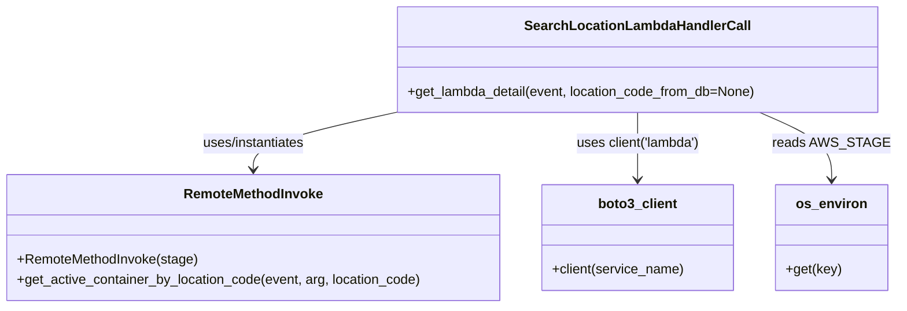
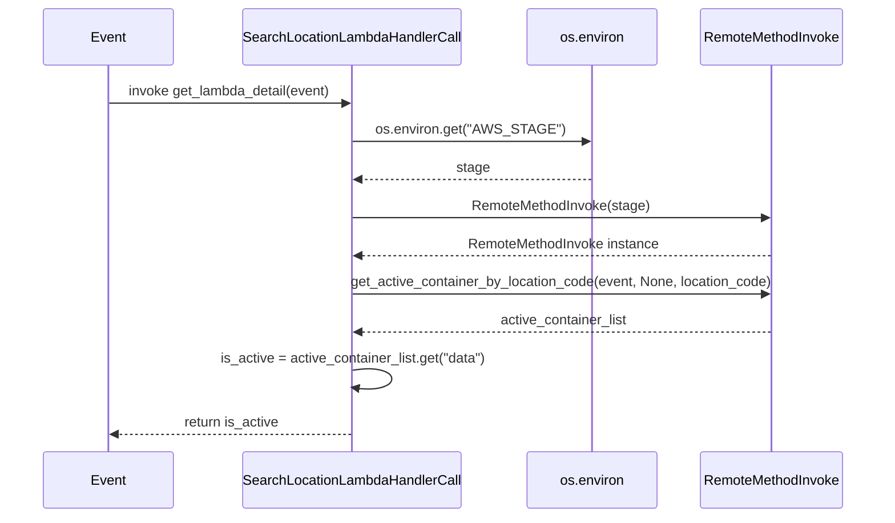

# Diagram: application_service/container_tracking_app_service/core/business/SearchLocationLambdaHandlerCall.py

> Auto-generated by Obscura crawlers

## Diagram 1

### SVG

<svg id="container" width="1062.3671875" xmlns="http://www.w3.org/2000/svg" class="classDiagram" height="366" viewBox="0 0 1062.3671875 366" role="graphics-document document" aria-roledescription="class"><g><defs><marker id="container_class-aggregationStart" class="marker aggregation class" refX="18" refY="7" markerWidth="190" markerHeight="240" orient="auto"><path d="M 18,7 L9,13 L1,7 L9,1 Z"></path></marker></defs><defs><marker id="container_class-aggregationEnd" class="marker aggregation class" refX="1" refY="7" markerWidth="20" markerHeight="28" orient="auto"><path d="M 18,7 L9,13 L1,7 L9,1 Z"></path></marker></defs><defs><marker id="container_class-extensionStart" class="marker extension class" refX="18" refY="7" markerWidth="190" markerHeight="240" orient="auto"><path d="M 1,7 L18,13 V 1 Z"></path></marker></defs><defs><marker id="container_class-extensionEnd" class="marker extension class" refX="1" refY="7" markerWidth="20" markerHeight="28" orient="auto"><path d="M 1,1 V 13 L18,7 Z"></path></marker></defs><defs><marker id="container_class-compositionStart" class="marker composition class" refX="18" refY="7" markerWidth="190" markerHeight="240" orient="auto"><path d="M 18,7 L9,13 L1,7 L9,1 Z"></path></marker></defs><defs><marker id="container_class-compositionEnd" class="marker composition class" refX="1" refY="7" markerWidth="20" markerHeight="28" orient="auto"><path d="M 18,7 L9,13 L1,7 L9,1 Z"></path></marker></defs><defs><marker id="container_class-dependencyStart" class="marker dependency class" refX="6" refY="7" markerWidth="190" markerHeight="240" orient="auto"><path d="M 5,7 L9,13 L1,7 L9,1 Z"></path></marker></defs><defs><marker id="container_class-dependencyEnd" class="marker dependency class" refX="13" refY="7" markerWidth="20" markerHeight="28" orient="auto"><path d="M 18,7 L9,13 L14,7 L9,1 Z"></path></marker></defs><defs><marker id="container_class-lollipopStart" class="marker lollipop class" refX="13" refY="7" markerWidth="190" markerHeight="240" orient="auto"><circle stroke="black" fill="transparent" cx="7" cy="7" r="6"></circle></marker></defs><defs><marker id="container_class-lollipopEnd" class="marker lollipop class" refX="1" refY="7" markerWidth="190" markerHeight="240" orient="auto"><circle stroke="black" fill="transparent" cx="7" cy="7" r="6"></circle></marker></defs><g class="root"><g class="clusters"></g><g class="edgePaths"><path d="M475.242,133.321L446.452,139.601C417.663,145.881,360.083,158.44,331.294,169.887C302.504,181.333,302.504,191.667,302.504,196.833L302.504,202" id="id_SearchLocationLambdaHandlerCall_RemoteMethodInvoke_1" class="edge-thickness-normal edge-pattern-solid relation" style=";;;" data-edge="true" data-et="edge" data-id="id_SearchLocationLambdaHandlerCall_RemoteMethodInvoke_1" data-points="W3sieCI6NDc1LjI0MjE4NzUsInkiOjEzMy4zMjA4NTM0Mjc4NTU3fSx7IngiOjMwMi41MDM5MDYyNSwieSI6MTcxfSx7IngiOjMwMi41MDM5MDYyNSwieSI6MjA4fV0=" marker-end="url(#container_class-dependencyEnd)"></path><path d="M760.949,134L760.949,140.167C760.949,146.333,760.949,158.667,760.949,172C760.949,185.333,760.949,199.667,760.949,206.833L760.949,214" id="id_SearchLocationLambdaHandlerCall_boto3_client_2" class="edge-thickness-normal edge-pattern-solid relation" style=";;;" data-edge="true" data-et="edge" data-id="id_SearchLocationLambdaHandlerCall_boto3_client_2" data-points="W3sieCI6NzYwLjk0OTIxODc1LCJ5IjoxMzR9LHsieCI6NzYwLjk0OTIxODc1LCJ5IjoxNzF9LHsieCI6NzYwLjk0OTIxODc1LCJ5IjoyMjB9XQ==" marker-end="url(#container_class-dependencyEnd)"></path><path d="M905.017,134L919.119,140.167C933.221,146.333,961.425,158.667,975.527,172C989.629,185.333,989.629,199.667,989.629,206.833L989.629,214" id="id_SearchLocationLambdaHandlerCall_os_environ_3" class="edge-thickness-normal edge-pattern-solid relation" style=";;;" data-edge="true" data-et="edge" data-id="id_SearchLocationLambdaHandlerCall_os_environ_3" data-points="W3sieCI6OTA1LjAxNzQyMTg3NSwieSI6MTM0fSx7IngiOjk4OS42Mjg5MDYyNSwieSI6MTcxfSx7IngiOjk4OS42Mjg5MDYyNSwieSI6MjIwfV0=" marker-end="url(#container_class-dependencyEnd)"></path></g><g class="edgeLabels"><g class="edgeLabel" transform="translate(302.50390625, 171)"><g class="label" data-id="id_SearchLocationLambdaHandlerCall_RemoteMethodInvoke_1" transform="translate(-63.5625, -12)"><foreignObject width="127.125" height="24">

uses/instantiates

</foreignObject></g></g><g class="edgeLabel" transform="translate(760.94921875, 171)"><g class="label" data-id="id_SearchLocationLambdaHandlerCall_boto3_client_2" transform="translate(-74.9765625, -12)"><foreignObject width="149.953125" height="24">

uses client('lambda')

</foreignObject></g></g><g class="edgeLabel" transform="translate(989.62890625, 171)"><g class="label" data-id="id_SearchLocationLambdaHandlerCall_os_environ_3" transform="translate(-63.109375, -12)"><foreignObject width="126.21875" height="24">

reads AWS_STAGE

</foreignObject></g></g></g><g class="nodes"><g class="node default" id="classId-SearchLocationLambdaHandlerCall-0" transform="translate(760.94921875, 71)"><g class="basic label-container"><path d="M-285.70703125 -63 L285.70703125 -63 L285.70703125 63 L-285.70703125 63" stroke="none" stroke-width="0" fill="#ECECFF" style=""></path><path d="M-285.70703125 -63 C-152.92908210257272 -63, -20.151132955145442 -63, 285.70703125 -63 M-285.70703125 -63 C-84.49024403603465 -63, 116.7265431779307 -63, 285.70703125 -63 M285.70703125 -63 C285.70703125 -28.607665338197073, 285.70703125 5.784669323605854, 285.70703125 63 M285.70703125 -63 C285.70703125 -31.836446028808822, 285.70703125 -0.6728920576176449, 285.70703125 63 M285.70703125 63 C125.1903224948849 63, -35.32638626023021 63, -285.70703125 63 M285.70703125 63 C118.38591941017825 63, -48.93519242964351 63, -285.70703125 63 M-285.70703125 63 C-285.70703125 34.0257029849498, -285.70703125 5.051405969899598, -285.70703125 -63 M-285.70703125 63 C-285.70703125 24.383886036696858, -285.70703125 -14.232227926606285, -285.70703125 -63" stroke="#9370DB" stroke-width="1.3" fill="none" stroke-dasharray="0 0" style=""></path></g><g class="annotation-group text" transform="translate(0, -39)"></g><g class="label-group text" transform="translate(-127.8515625, -39)"><g class="label" style="font-weight: bolder" transform="translate(0,-12)"><foreignObject width="255.703125" height="24">

SearchLocationLambdaHandlerCall

</foreignObject></g></g><g class="members-group text" transform="translate(-273.70703125, 9)"></g><g class="methods-group text" transform="translate(-273.70703125, 39)"><g class="label" style="" transform="translate(0,-12)"><foreignObject width="419.5625" height="24">

+get_lambda_detail(event, location_code_from_db=None)

</foreignObject></g></g><g class="divider" style=""><path d="M-285.70703125 -15 C-100.52977391308892 -15, 84.64748342382217 -15, 285.70703125 -15 M-285.70703125 -15 C-98.66092057929114 -15, 88.38519009141771 -15, 285.70703125 -15" stroke="#9370DB" stroke-width="1.3" fill="none" stroke-dasharray="0 0" style=""></path></g><g class="divider" style=""><path d="M-285.70703125 9 C-166.3701773175975 9, -47.03332338519502 9, 285.70703125 9 M-285.70703125 9 C-96.95100390116278 9, 91.80502344767444 9, 285.70703125 9" stroke="#9370DB" stroke-width="1.3" fill="none" stroke-dasharray="0 0" style=""></path></g></g><g class="node default" id="classId-RemoteMethodInvoke-1" transform="translate(302.50390625, 283)"><g class="basic label-container"><path d="M-294.50390625 -75 L294.50390625 -75 L294.50390625 75 L-294.50390625 75" stroke="none" stroke-width="0" fill="#ECECFF" style=""></path><path d="M-294.50390625 -75 C-118.69738865271873 -75, 57.10912894456254 -75, 294.50390625 -75 M-294.50390625 -75 C-167.00759968116074 -75, -39.51129311232151 -75, 294.50390625 -75 M294.50390625 -75 C294.50390625 -32.92783606305156, 294.50390625 9.144327873896884, 294.50390625 75 M294.50390625 -75 C294.50390625 -39.96839547699118, 294.50390625 -4.936790953982353, 294.50390625 75 M294.50390625 75 C75.6220306646616 75, -143.2598449206768 75, -294.50390625 75 M294.50390625 75 C75.15805998007781 75, -144.18778628984438 75, -294.50390625 75 M-294.50390625 75 C-294.50390625 22.132089975526434, -294.50390625 -30.735820048947133, -294.50390625 -75 M-294.50390625 75 C-294.50390625 20.056744759622468, -294.50390625 -34.886510480755064, -294.50390625 -75" stroke="#9370DB" stroke-width="1.3" fill="none" stroke-dasharray="0 0" style=""></path></g><g class="annotation-group text" transform="translate(0, -51)"></g><g class="label-group text" transform="translate(-80.2578125, -51)"><g class="label" style="font-weight: bolder" transform="translate(0,-12)"><foreignObject width="160.515625" height="24">

RemoteMethodInvoke

</foreignObject></g></g><g class="members-group text" transform="translate(-282.50390625, -3)"></g><g class="methods-group text" transform="translate(-282.50390625, 27)"><g class="label" style="" transform="translate(0,-12)"><foreignObject width="215.4375" height="24">

+RemoteMethodInvoke(stage)

</foreignObject></g><g class="label" style="" transform="translate(0,12)"><foreignObject width="484.75" height="24">

+get_active_container_by_location_code(event, arg, location_code)

</foreignObject></g></g><g class="divider" style=""><path d="M-294.50390625 -27 C-115.6835673574509 -27, 63.136771535098205 -27, 294.50390625 -27 M-294.50390625 -27 C-173.1675987558139 -27, -51.831291261627825 -27, 294.50390625 -27" stroke="#9370DB" stroke-width="1.3" fill="none" stroke-dasharray="0 0" style=""></path></g><g class="divider" style=""><path d="M-294.50390625 -3 C-161.7214100718989 -3, -28.938913893797803 -3, 294.50390625 -3 M-294.50390625 -3 C-120.14884269160055 -3, 54.2062208667989 -3, 294.50390625 -3" stroke="#9370DB" stroke-width="1.3" fill="none" stroke-dasharray="0 0" style=""></path></g></g><g class="node default" id="classId-boto3_client-2" transform="translate(760.94921875, 283)"><g class="basic label-container"><path d="M-113.94140625 -63 L113.94140625 -63 L113.94140625 63 L-113.94140625 63" stroke="none" stroke-width="0" fill="#ECECFF" style=""></path><path d="M-113.94140625 -63 C-50.43872006516024 -63, 13.06396611967952 -63, 113.94140625 -63 M-113.94140625 -63 C-54.152217929968835 -63, 5.636970390062331 -63, 113.94140625 -63 M113.94140625 -63 C113.94140625 -34.41974372637619, 113.94140625 -5.83948745275238, 113.94140625 63 M113.94140625 -63 C113.94140625 -32.01551397741491, 113.94140625 -1.031027954829817, 113.94140625 63 M113.94140625 63 C54.67863821626271 63, -4.584129817474576 63, -113.94140625 63 M113.94140625 63 C41.67568154656641 63, -30.590043156867182 63, -113.94140625 63 M-113.94140625 63 C-113.94140625 28.160152353333913, -113.94140625 -6.679695293332173, -113.94140625 -63 M-113.94140625 63 C-113.94140625 21.199234227655182, -113.94140625 -20.601531544689635, -113.94140625 -63" stroke="#9370DB" stroke-width="1.3" fill="none" stroke-dasharray="0 0" style=""></path></g><g class="annotation-group text" transform="translate(0, -39)"></g><g class="label-group text" transform="translate(-45.4921875, -39)"><g class="label" style="font-weight: bolder" transform="translate(0,-12)"><foreignObject width="90.984375" height="24">

boto3_client

</foreignObject></g></g><g class="members-group text" transform="translate(-101.94140625, 9)"></g><g class="methods-group text" transform="translate(-101.94140625, 39)"><g class="label" style="" transform="translate(0,-12)"><foreignObject width="158.390625" height="24">

+client(service_name)

</foreignObject></g></g><g class="divider" style=""><path d="M-113.94140625 -15 C-56.43515694541673 -15, 1.071092359166542 -15, 113.94140625 -15 M-113.94140625 -15 C-37.552736995193015 -15, 38.83593225961397 -15, 113.94140625 -15" stroke="#9370DB" stroke-width="1.3" fill="none" stroke-dasharray="0 0" style=""></path></g><g class="divider" style=""><path d="M-113.94140625 9 C-60.216379144734994 9, -6.491352039469987 9, 113.94140625 9 M-113.94140625 9 C-27.170042307393487 9, 59.601321635213026 9, 113.94140625 9" stroke="#9370DB" stroke-width="1.3" fill="none" stroke-dasharray="0 0" style=""></path></g></g><g class="node default" id="classId-os_environ-3" transform="translate(989.62890625, 283)"><g class="basic label-container"><path d="M-64.73828125 -63 L64.73828125 -63 L64.73828125 63 L-64.73828125 63" stroke="none" stroke-width="0" fill="#ECECFF" style=""></path><path d="M-64.73828125 -63 C-19.754367331457892 -63, 25.229546587084215 -63, 64.73828125 -63 M-64.73828125 -63 C-13.223290345466992 -63, 38.291700559066015 -63, 64.73828125 -63 M64.73828125 -63 C64.73828125 -19.900191607167528, 64.73828125 23.199616785664944, 64.73828125 63 M64.73828125 -63 C64.73828125 -31.903610749107337, 64.73828125 -0.8072214982146733, 64.73828125 63 M64.73828125 63 C19.912276532980727 63, -24.913728184038547 63, -64.73828125 63 M64.73828125 63 C29.486504358518154 63, -5.765272532963692 63, -64.73828125 63 M-64.73828125 63 C-64.73828125 20.74029910108151, -64.73828125 -21.519401797836977, -64.73828125 -63 M-64.73828125 63 C-64.73828125 26.672622052920552, -64.73828125 -9.654755894158896, -64.73828125 -63" stroke="#9370DB" stroke-width="1.3" fill="none" stroke-dasharray="0 0" style=""></path></g><g class="annotation-group text" transform="translate(0, -39)"></g><g class="label-group text" transform="translate(-39.9765625, -39)"><g class="label" style="font-weight: bolder" transform="translate(0,-12)"><foreignObject width="79.953125" height="24">

os_environ

</foreignObject></g></g><g class="members-group text" transform="translate(-52.73828125, 9)"></g><g class="methods-group text" transform="translate(-52.73828125, 39)"><g class="label" style="" transform="translate(0,-12)"><foreignObject width="65.5" height="24">

+get(key)

</foreignObject></g></g><g class="divider" style=""><path d="M-64.73828125 -15 C-19.672686158208982 -15, 25.392908933582035 -15, 64.73828125 -15 M-64.73828125 -15 C-36.70199162810731 -15, -8.665702006214609 -15, 64.73828125 -15" stroke="#9370DB" stroke-width="1.3" fill="none" stroke-dasharray="0 0" style=""></path></g><g class="divider" style=""><path d="M-64.73828125 9 C-28.022453936107908 9, 8.693373377784184 9, 64.73828125 9 M-64.73828125 9 C-14.67673873169462 9, 35.38480378661076 9, 64.73828125 9" stroke="#9370DB" stroke-width="1.3" fill="none" stroke-dasharray="0 0" style=""></path></g></g></g></g></g></svg>

## Diagram 2

### SVG

<svg id="container" width="1063" xmlns="http://www.w3.org/2000/svg" height="633" viewBox="-50 -10 1063 633" role="graphics-document document" aria-roledescription="sequence"><g><rect x="784" y="547" fill="#eaeaea" stroke="#666" width="179" height="65" name="RMI" rx="3" ry="3" class="actor actor-bottom"></rect><text x="873.5" y="579.5" dominant-baseline="central" alignment-baseline="central" class="actor actor-box" style="text-anchor: middle; font-size: 16px; font-weight: 400;"><tspan x="873.5" dy="0">RemoteMethodInvoke</tspan></text></g><g><rect x="584" y="547" fill="#eaeaea" stroke="#666" width="150" height="65" name="Env" rx="3" ry="3" class="actor actor-bottom"></rect><text x="659" y="579.5" dominant-baseline="central" alignment-baseline="central" class="actor actor-box" style="text-anchor: middle; font-size: 16px; font-weight: 400;"><tspan x="659" dy="0">os.environ</tspan></text></g><g><rect x="246" y="547" fill="#eaeaea" stroke="#666" width="274" height="65" name="Handler" rx="3" ry="3" class="actor actor-bottom"></rect><text x="383" y="579.5" dominant-baseline="central" alignment-baseline="central" class="actor actor-box" style="text-anchor: middle; font-size: 16px; font-weight: 400;"><tspan x="383" dy="0">SearchLocationLambdaHandlerCall</tspan></text></g><g><rect x="0" y="547" fill="#eaeaea" stroke="#666" width="150" height="65" name="ClientEvent" rx="3" ry="3" class="actor actor-bottom"></rect><text x="75" y="579.5" dominant-baseline="central" alignment-baseline="central" class="actor actor-box" style="text-anchor: middle; font-size: 16px; font-weight: 400;"><tspan x="75" dy="0">Event</tspan></text></g><g><line id="actor3" x1="873.5" y1="65" x2="873.5" y2="547" class="actor-line 200" stroke-width="0.5px" stroke="#999" name="RMI"></line><g id="root-3"><rect x="784" y="0" fill="#eaeaea" stroke="#666" width="179" height="65" name="RMI" rx="3" ry="3" class="actor actor-top"></rect><text x="873.5" y="32.5" dominant-baseline="central" alignment-baseline="central" class="actor actor-box" style="text-anchor: middle; font-size: 16px; font-weight: 400;"><tspan x="873.5" dy="0">RemoteMethodInvoke</tspan></text></g></g><g><line id="actor2" x1="659" y1="65" x2="659" y2="547" class="actor-line 200" stroke-width="0.5px" stroke="#999" name="Env"></line><g id="root-2"><rect x="584" y="0" fill="#eaeaea" stroke="#666" width="150" height="65" name="Env" rx="3" ry="3" class="actor actor-top"></rect><text x="659" y="32.5" dominant-baseline="central" alignment-baseline="central" class="actor actor-box" style="text-anchor: middle; font-size: 16px; font-weight: 400;"><tspan x="659" dy="0">os.environ</tspan></text></g></g><g><line id="actor1" x1="383" y1="65" x2="383" y2="547" class="actor-line 200" stroke-width="0.5px" stroke="#999" name="Handler"></line><g id="root-1"><rect x="246" y="0" fill="#eaeaea" stroke="#666" width="274" height="65" name="Handler" rx="3" ry="3" class="actor actor-top"></rect><text x="383" y="32.5" dominant-baseline="central" alignment-baseline="central" class="actor actor-box" style="text-anchor: middle; font-size: 16px; font-weight: 400;"><tspan x="383" dy="0">SearchLocationLambdaHandlerCall</tspan></text></g></g><g><line id="actor0" x1="75" y1="65" x2="75" y2="547" class="actor-line 200" stroke-width="0.5px" stroke="#999" name="ClientEvent"></line><g id="root-0"><rect x="0" y="0" fill="#eaeaea" stroke="#666" width="150" height="65" name="ClientEvent" rx="3" ry="3" class="actor actor-top"></rect><text x="75" y="32.5" dominant-baseline="central" alignment-baseline="central" class="actor actor-box" style="text-anchor: middle; font-size: 16px; font-weight: 400;"><tspan x="75" dy="0">Event</tspan></text></g></g><g></g><defs><symbol id="computer" width="24" height="24"><path transform="scale(.5)" d="M2 2v13h20v-13h-20zm18 11h-16v-9h16v9zm-10.228 6l.466-1h3.524l.467 1h-4.457zm14.228 3h-24l2-6h2.104l-1.33 4h18.45l-1.297-4h2.073l2 6zm-5-10h-14v-7h14v7z"></path></symbol></defs><defs><symbol id="database" fill-rule="evenodd" clip-rule="evenodd"><path transform="scale(.5)" d="M12.258.001l.256.004.255.005.253.008.251.01.249.012.247.015.246.016.242.019.241.02.239.023.236.024.233.027.231.028.229.031.225.032.223.034.22.036.217.038.214.04.211.041.208.043.205.045.201.046.198.048.194.05.191.051.187.053.183.054.18.056.175.057.172.059.168.06.163.061.16.063.155.064.15.066.074.033.073.033.071.034.07.034.069.035.068.035.067.035.066.035.064.036.064.036.062.036.06.036.06.037.058.037.058.037.055.038.055.038.053.038.052.038.051.039.05.039.048.039.047.039.045.04.044.04.043.04.041.04.04.041.039.041.037.041.036.041.034.041.033.042.032.042.03.042.029.042.027.042.026.043.024.043.023.043.021.043.02.043.018.044.017.043.015.044.013.044.012.044.011.045.009.044.007.045.006.045.004.045.002.045.001.045v17l-.001.045-.002.045-.004.045-.006.045-.007.045-.009.044-.011.045-.012.044-.013.044-.015.044-.017.043-.018.044-.02.043-.021.043-.023.043-.024.043-.026.043-.027.042-.029.042-.03.042-.032.042-.033.042-.034.041-.036.041-.037.041-.039.041-.04.041-.041.04-.043.04-.044.04-.045.04-.047.039-.048.039-.05.039-.051.039-.052.038-.053.038-.055.038-.055.038-.058.037-.058.037-.06.037-.06.036-.062.036-.064.036-.064.036-.066.035-.067.035-.068.035-.069.035-.07.034-.071.034-.073.033-.074.033-.15.066-.155.064-.16.063-.163.061-.168.06-.172.059-.175.057-.18.056-.183.054-.187.053-.191.051-.194.05-.198.048-.201.046-.205.045-.208.043-.211.041-.214.04-.217.038-.22.036-.223.034-.225.032-.229.031-.231.028-.233.027-.236.024-.239.023-.241.02-.242.019-.246.016-.247.015-.249.012-.251.01-.253.008-.255.005-.256.004-.258.001-.258-.001-.256-.004-.255-.005-.253-.008-.251-.01-.249-.012-.247-.015-.245-.016-.243-.019-.241-.02-.238-.023-.236-.024-.234-.027-.231-.028-.228-.031-.226-.032-.223-.034-.22-.036-.217-.038-.214-.04-.211-.041-.208-.043-.204-.045-.201-.046-.198-.048-.195-.05-.19-.051-.187-.053-.184-.054-.179-.056-.176-.057-.172-.059-.167-.06-.164-.061-.159-.063-.155-.064-.151-.066-.074-.033-.072-.033-.072-.034-.07-.034-.069-.035-.068-.035-.067-.035-.066-.035-.064-.036-.063-.036-.062-.036-.061-.036-.06-.037-.058-.037-.057-.037-.056-.038-.055-.038-.053-.038-.052-.038-.051-.039-.049-.039-.049-.039-.046-.039-.046-.04-.044-.04-.043-.04-.041-.04-.04-.041-.039-.041-.037-.041-.036-.041-.034-.041-.033-.042-.032-.042-.03-.042-.029-.042-.027-.042-.026-.043-.024-.043-.023-.043-.021-.043-.02-.043-.018-.044-.017-.043-.015-.044-.013-.044-.012-.044-.011-.045-.009-.044-.007-.045-.006-.045-.004-.045-.002-.045-.001-.045v-17l.001-.045.002-.045.004-.045.006-.045.007-.045.009-.044.011-.045.012-.044.013-.044.015-.044.017-.043.018-.044.02-.043.021-.043.023-.043.024-.043.026-.043.027-.042.029-.042.03-.042.032-.042.033-.042.034-.041.036-.041.037-.041.039-.041.04-.041.041-.04.043-.04.044-.04.046-.04.046-.039.049-.039.049-.039.051-.039.052-.038.053-.038.055-.038.056-.038.057-.037.058-.037.06-.037.061-.036.062-.036.063-.036.064-.036.066-.035.067-.035.068-.035.069-.035.07-.034.072-.034.072-.033.074-.033.151-.066.155-.064.159-.063.164-.061.167-.06.172-.059.176-.057.179-.056.184-.054.187-.053.19-.051.195-.05.198-.048.201-.046.204-.045.208-.043.211-.041.214-.04.217-.038.22-.036.223-.034.226-.032.228-.031.231-.028.234-.027.236-.024.238-.023.241-.02.243-.019.245-.016.247-.015.249-.012.251-.01.253-.008.255-.005.256-.004.258-.001.258.001zm-9.258 20.499v.01l.001.021.003.021.004.022.005.021.006.022.007.022.009.023.01.022.011.023.012.023.013.023.015.023.016.024.017.023.018.024.019.024.021.024.022.025.023.024.024.025.052.049.056.05.061.051.066.051.07.051.075.051.079.052.084.052.088.052.092.052.097.052.102.051.105.052.11.052.114.051.119.051.123.051.127.05.131.05.135.05.139.048.144.049.147.047.152.047.155.047.16.045.163.045.167.043.171.043.176.041.178.041.183.039.187.039.19.037.194.035.197.035.202.033.204.031.209.03.212.029.216.027.219.025.222.024.226.021.23.02.233.018.236.016.24.015.243.012.246.01.249.008.253.005.256.004.259.001.26-.001.257-.004.254-.005.25-.008.247-.011.244-.012.241-.014.237-.016.233-.018.231-.021.226-.021.224-.024.22-.026.216-.027.212-.028.21-.031.205-.031.202-.034.198-.034.194-.036.191-.037.187-.039.183-.04.179-.04.175-.042.172-.043.168-.044.163-.045.16-.046.155-.046.152-.047.148-.048.143-.049.139-.049.136-.05.131-.05.126-.05.123-.051.118-.052.114-.051.11-.052.106-.052.101-.052.096-.052.092-.052.088-.053.083-.051.079-.052.074-.052.07-.051.065-.051.06-.051.056-.05.051-.05.023-.024.023-.025.021-.024.02-.024.019-.024.018-.024.017-.024.015-.023.014-.024.013-.023.012-.023.01-.023.01-.022.008-.022.006-.022.006-.022.004-.022.004-.021.001-.021.001-.021v-4.127l-.077.055-.08.053-.083.054-.085.053-.087.052-.09.052-.093.051-.095.05-.097.05-.1.049-.102.049-.105.048-.106.047-.109.047-.111.046-.114.045-.115.045-.118.044-.12.043-.122.042-.124.042-.126.041-.128.04-.13.04-.132.038-.134.038-.135.037-.138.037-.139.035-.142.035-.143.034-.144.033-.147.032-.148.031-.15.03-.151.03-.153.029-.154.027-.156.027-.158.026-.159.025-.161.024-.162.023-.163.022-.165.021-.166.02-.167.019-.169.018-.169.017-.171.016-.173.015-.173.014-.175.013-.175.012-.177.011-.178.01-.179.008-.179.008-.181.006-.182.005-.182.004-.184.003-.184.002h-.37l-.184-.002-.184-.003-.182-.004-.182-.005-.181-.006-.179-.008-.179-.008-.178-.01-.176-.011-.176-.012-.175-.013-.173-.014-.172-.015-.171-.016-.17-.017-.169-.018-.167-.019-.166-.02-.165-.021-.163-.022-.162-.023-.161-.024-.159-.025-.157-.026-.156-.027-.155-.027-.153-.029-.151-.03-.15-.03-.148-.031-.146-.032-.145-.033-.143-.034-.141-.035-.14-.035-.137-.037-.136-.037-.134-.038-.132-.038-.13-.04-.128-.04-.126-.041-.124-.042-.122-.042-.12-.044-.117-.043-.116-.045-.113-.045-.112-.046-.109-.047-.106-.047-.105-.048-.102-.049-.1-.049-.097-.05-.095-.05-.093-.052-.09-.051-.087-.052-.085-.053-.083-.054-.08-.054-.077-.054v4.127zm0-5.654v.011l.001.021.003.021.004.021.005.022.006.022.007.022.009.022.01.022.011.023.012.023.013.023.015.024.016.023.017.024.018.024.019.024.021.024.022.024.023.025.024.024.052.05.056.05.061.05.066.051.07.051.075.052.079.051.084.052.088.052.092.052.097.052.102.052.105.052.11.051.114.051.119.052.123.05.127.051.131.05.135.049.139.049.144.048.147.048.152.047.155.046.16.045.163.045.167.044.171.042.176.042.178.04.183.04.187.038.19.037.194.036.197.034.202.033.204.032.209.03.212.028.216.027.219.025.222.024.226.022.23.02.233.018.236.016.24.014.243.012.246.01.249.008.253.006.256.003.259.001.26-.001.257-.003.254-.006.25-.008.247-.01.244-.012.241-.015.237-.016.233-.018.231-.02.226-.022.224-.024.22-.025.216-.027.212-.029.21-.03.205-.032.202-.033.198-.035.194-.036.191-.037.187-.039.183-.039.179-.041.175-.042.172-.043.168-.044.163-.045.16-.045.155-.047.152-.047.148-.048.143-.048.139-.05.136-.049.131-.05.126-.051.123-.051.118-.051.114-.052.11-.052.106-.052.101-.052.096-.052.092-.052.088-.052.083-.052.079-.052.074-.051.07-.052.065-.051.06-.05.056-.051.051-.049.023-.025.023-.024.021-.025.02-.024.019-.024.018-.024.017-.024.015-.023.014-.023.013-.024.012-.022.01-.023.01-.023.008-.022.006-.022.006-.022.004-.021.004-.022.001-.021.001-.021v-4.139l-.077.054-.08.054-.083.054-.085.052-.087.053-.09.051-.093.051-.095.051-.097.05-.1.049-.102.049-.105.048-.106.047-.109.047-.111.046-.114.045-.115.044-.118.044-.12.044-.122.042-.124.042-.126.041-.128.04-.13.039-.132.039-.134.038-.135.037-.138.036-.139.036-.142.035-.143.033-.144.033-.147.033-.148.031-.15.03-.151.03-.153.028-.154.028-.156.027-.158.026-.159.025-.161.024-.162.023-.163.022-.165.021-.166.02-.167.019-.169.018-.169.017-.171.016-.173.015-.173.014-.175.013-.175.012-.177.011-.178.009-.179.009-.179.007-.181.007-.182.005-.182.004-.184.003-.184.002h-.37l-.184-.002-.184-.003-.182-.004-.182-.005-.181-.007-.179-.007-.179-.009-.178-.009-.176-.011-.176-.012-.175-.013-.173-.014-.172-.015-.171-.016-.17-.017-.169-.018-.167-.019-.166-.02-.165-.021-.163-.022-.162-.023-.161-.024-.159-.025-.157-.026-.156-.027-.155-.028-.153-.028-.151-.03-.15-.03-.148-.031-.146-.033-.145-.033-.143-.033-.141-.035-.14-.036-.137-.036-.136-.037-.134-.038-.132-.039-.13-.039-.128-.04-.126-.041-.124-.042-.122-.043-.12-.043-.117-.044-.116-.044-.113-.046-.112-.046-.109-.046-.106-.047-.105-.048-.102-.049-.1-.049-.097-.05-.095-.051-.093-.051-.09-.051-.087-.053-.085-.052-.083-.054-.08-.054-.077-.054v4.139zm0-5.666v.011l.001.02.003.022.004.021.005.022.006.021.007.022.009.023.01.022.011.023.012.023.013.023.015.023.016.024.017.024.018.023.019.024.021.025.022.024.023.024.024.025.052.05.056.05.061.05.066.051.07.051.075.052.079.051.084.052.088.052.092.052.097.052.102.052.105.051.11.052.114.051.119.051.123.051.127.05.131.05.135.05.139.049.144.048.147.048.152.047.155.046.16.045.163.045.167.043.171.043.176.042.178.04.183.04.187.038.19.037.194.036.197.034.202.033.204.032.209.03.212.028.216.027.219.025.222.024.226.021.23.02.233.018.236.017.24.014.243.012.246.01.249.008.253.006.256.003.259.001.26-.001.257-.003.254-.006.25-.008.247-.01.244-.013.241-.014.237-.016.233-.018.231-.02.226-.022.224-.024.22-.025.216-.027.212-.029.21-.03.205-.032.202-.033.198-.035.194-.036.191-.037.187-.039.183-.039.179-.041.175-.042.172-.043.168-.044.163-.045.16-.045.155-.047.152-.047.148-.048.143-.049.139-.049.136-.049.131-.051.126-.05.123-.051.118-.052.114-.051.11-.052.106-.052.101-.052.096-.052.092-.052.088-.052.083-.052.079-.052.074-.052.07-.051.065-.051.06-.051.056-.05.051-.049.023-.025.023-.025.021-.024.02-.024.019-.024.018-.024.017-.024.015-.023.014-.024.013-.023.012-.023.01-.022.01-.023.008-.022.006-.022.006-.022.004-.022.004-.021.001-.021.001-.021v-4.153l-.077.054-.08.054-.083.053-.085.053-.087.053-.09.051-.093.051-.095.051-.097.05-.1.049-.102.048-.105.048-.106.048-.109.046-.111.046-.114.046-.115.044-.118.044-.12.043-.122.043-.124.042-.126.041-.128.04-.13.039-.132.039-.134.038-.135.037-.138.036-.139.036-.142.034-.143.034-.144.033-.147.032-.148.032-.15.03-.151.03-.153.028-.154.028-.156.027-.158.026-.159.024-.161.024-.162.023-.163.023-.165.021-.166.02-.167.019-.169.018-.169.017-.171.016-.173.015-.173.014-.175.013-.175.012-.177.01-.178.01-.179.009-.179.007-.181.006-.182.006-.182.004-.184.003-.184.001-.185.001-.185-.001-.184-.001-.184-.003-.182-.004-.182-.006-.181-.006-.179-.007-.179-.009-.178-.01-.176-.01-.176-.012-.175-.013-.173-.014-.172-.015-.171-.016-.17-.017-.169-.018-.167-.019-.166-.02-.165-.021-.163-.023-.162-.023-.161-.024-.159-.024-.157-.026-.156-.027-.155-.028-.153-.028-.151-.03-.15-.03-.148-.032-.146-.032-.145-.033-.143-.034-.141-.034-.14-.036-.137-.036-.136-.037-.134-.038-.132-.039-.13-.039-.128-.041-.126-.041-.124-.041-.122-.043-.12-.043-.117-.044-.116-.044-.113-.046-.112-.046-.109-.046-.106-.048-.105-.048-.102-.048-.1-.05-.097-.049-.095-.051-.093-.051-.09-.052-.087-.052-.085-.053-.083-.053-.08-.054-.077-.054v4.153zm8.74-8.179l-.257.004-.254.005-.25.008-.247.011-.244.012-.241.014-.237.016-.233.018-.231.021-.226.022-.224.023-.22.026-.216.027-.212.028-.21.031-.205.032-.202.033-.198.034-.194.036-.191.038-.187.038-.183.04-.179.041-.175.042-.172.043-.168.043-.163.045-.16.046-.155.046-.152.048-.148.048-.143.048-.139.049-.136.05-.131.05-.126.051-.123.051-.118.051-.114.052-.11.052-.106.052-.101.052-.096.052-.092.052-.088.052-.083.052-.079.052-.074.051-.07.052-.065.051-.06.05-.056.05-.051.05-.023.025-.023.024-.021.024-.02.025-.019.024-.018.024-.017.023-.015.024-.014.023-.013.023-.012.023-.01.023-.01.022-.008.022-.006.023-.006.021-.004.022-.004.021-.001.021-.001.021.001.021.001.021.004.021.004.022.006.021.006.023.008.022.01.022.01.023.012.023.013.023.014.023.015.024.017.023.018.024.019.024.02.025.021.024.023.024.023.025.051.05.056.05.06.05.065.051.07.052.074.051.079.052.083.052.088.052.092.052.096.052.101.052.106.052.11.052.114.052.118.051.123.051.126.051.131.05.136.05.139.049.143.048.148.048.152.048.155.046.16.046.163.045.168.043.172.043.175.042.179.041.183.04.187.038.191.038.194.036.198.034.202.033.205.032.21.031.212.028.216.027.22.026.224.023.226.022.231.021.233.018.237.016.241.014.244.012.247.011.25.008.254.005.257.004.26.001.26-.001.257-.004.254-.005.25-.008.247-.011.244-.012.241-.014.237-.016.233-.018.231-.021.226-.022.224-.023.22-.026.216-.027.212-.028.21-.031.205-.032.202-.033.198-.034.194-.036.191-.038.187-.038.183-.04.179-.041.175-.042.172-.043.168-.043.163-.045.16-.046.155-.046.152-.048.148-.048.143-.048.139-.049.136-.05.131-.05.126-.051.123-.051.118-.051.114-.052.11-.052.106-.052.101-.052.096-.052.092-.052.088-.052.083-.052.079-.052.074-.051.07-.052.065-.051.06-.05.056-.05.051-.05.023-.025.023-.024.021-.024.02-.025.019-.024.018-.024.017-.023.015-.024.014-.023.013-.023.012-.023.01-.023.01-.022.008-.022.006-.023.006-.021.004-.022.004-.021.001-.021.001-.021-.001-.021-.001-.021-.004-.021-.004-.022-.006-.021-.006-.023-.008-.022-.01-.022-.01-.023-.012-.023-.013-.023-.014-.023-.015-.024-.017-.023-.018-.024-.019-.024-.02-.025-.021-.024-.023-.024-.023-.025-.051-.05-.056-.05-.06-.05-.065-.051-.07-.052-.074-.051-.079-.052-.083-.052-.088-.052-.092-.052-.096-.052-.101-.052-.106-.052-.11-.052-.114-.052-.118-.051-.123-.051-.126-.051-.131-.05-.136-.05-.139-.049-.143-.048-.148-.048-.152-.048-.155-.046-.16-.046-.163-.045-.168-.043-.172-.043-.175-.042-.179-.041-.183-.04-.187-.038-.191-.038-.194-.036-.198-.034-.202-.033-.205-.032-.21-.031-.212-.028-.216-.027-.22-.026-.224-.023-.226-.022-.231-.021-.233-.018-.237-.016-.241-.014-.244-.012-.247-.011-.25-.008-.254-.005-.257-.004-.26-.001-.26.001z"></path></symbol></defs><defs><symbol id="clock" width="24" height="24"><path transform="scale(.5)" d="M12 2c5.514 0 10 4.486 10 10s-4.486 10-10 10-10-4.486-10-10 4.486-10 10-10zm0-2c-6.627 0-12 5.373-12 12s5.373 12 12 12 12-5.373 12-12-5.373-12-12-12zm5.848 12.459c.202.038.202.333.001.372-1.907.361-6.045 1.111-6.547 1.111-.719 0-1.301-.582-1.301-1.301 0-.512.77-5.447 1.125-7.445.034-.192.312-.181.343.014l.985 6.238 5.394 1.011z"></path></symbol></defs><defs><marker id="arrowhead" refX="7.9" refY="5" markerUnits="userSpaceOnUse" markerWidth="12" markerHeight="12" orient="auto-start-reverse"><path d="M -1 0 L 10 5 L 0 10 z"></path></marker></defs><defs><marker id="crosshead" markerWidth="15" markerHeight="8" orient="auto" refX="4" refY="4.5"><path fill="none" stroke="#000000" stroke-width="1pt" d="M 1,2 L 6,7 M 6,2 L 1,7" style="stroke-dasharray: 0, 0;"></path></marker></defs><defs><marker id="filled-head" refX="15.5" refY="7" markerWidth="20" markerHeight="28" orient="auto"><path d="M 18,7 L9,13 L14,7 L9,1 Z"></path></marker></defs><defs><marker id="sequencenumber" refX="15" refY="15" markerWidth="60" markerHeight="40" orient="auto"><circle cx="15" cy="15" r="6"></circle></marker></defs><text x="228" y="80" text-anchor="middle" dominant-baseline="middle" alignment-baseline="middle" class="messageText" dy="1em" style="font-size: 16px; font-weight: 400;">invoke get_lambda_detail(event)</text><line x1="76" y1="113" x2="379" y2="113" class="messageLine0" stroke-width="2" stroke="none" marker-end="url(#arrowhead)" style="fill: none;"></line><text x="520" y="128" text-anchor="middle" dominant-baseline="middle" alignment-baseline="middle" class="messageText" dy="1em" style="font-size: 16px; font-weight: 400;">os.environ.get("AWS_STAGE")</text><line x1="384" y1="161" x2="655" y2="161" class="messageLine0" stroke-width="2" stroke="none" marker-end="url(#arrowhead)" style="fill: none;"></line><text x="523" y="176" text-anchor="middle" dominant-baseline="middle" alignment-baseline="middle" class="messageText" dy="1em" style="font-size: 16px; font-weight: 400;">stage</text><line x1="658" y1="209" x2="387" y2="209" class="messageLine1" stroke-width="2" stroke="none" marker-end="url(#arrowhead)" style="stroke-dasharray: 3, 3; fill: none;"></line><text x="627" y="224" text-anchor="middle" dominant-baseline="middle" alignment-baseline="middle" class="messageText" dy="1em" style="font-size: 16px; font-weight: 400;">RemoteMethodInvoke(stage)</text><line x1="384" y1="257" x2="869.5" y2="257" class="messageLine0" stroke-width="2" stroke="none" marker-end="url(#arrowhead)" style="fill: none;"></line><text x="630" y="272" text-anchor="middle" dominant-baseline="middle" alignment-baseline="middle" class="messageText" dy="1em" style="font-size: 16px; font-weight: 400;">RemoteMethodInvoke instance</text><line x1="872.5" y1="305" x2="387" y2="305" class="messageLine1" stroke-width="2" stroke="none" marker-end="url(#arrowhead)" style="stroke-dasharray: 3, 3; fill: none;"></line><text x="627" y="320" text-anchor="middle" dominant-baseline="middle" alignment-baseline="middle" class="messageText" dy="1em" style="font-size: 16px; font-weight: 400;">get_active_container_by_location_code(event, None, location_code)</text><line x1="384" y1="353" x2="869.5" y2="353" class="messageLine0" stroke-width="2" stroke="none" marker-end="url(#arrowhead)" style="fill: none;"></line><text x="630" y="368" text-anchor="middle" dominant-baseline="middle" alignment-baseline="middle" class="messageText" dy="1em" style="font-size: 16px; font-weight: 400;">active_container_list</text><line x1="872.5" y1="401" x2="387" y2="401" class="messageLine1" stroke-width="2" stroke="none" marker-end="url(#arrowhead)" style="stroke-dasharray: 3, 3; fill: none;"></line><text x="384" y="416" text-anchor="middle" dominant-baseline="middle" alignment-baseline="middle" class="messageText" dy="1em" style="font-size: 16px; font-weight: 400;">is_active = active_container_list.get("data")</text><path d="M 384,449 C 444,439 444,479 384,469" class="messageLine0" stroke-width="2" stroke="none" marker-end="url(#arrowhead)" style="fill: none;"></path><text x="231" y="494" text-anchor="middle" dominant-baseline="middle" alignment-baseline="middle" class="messageText" dy="1em" style="font-size: 16px; font-weight: 400;">return is_active</text><line x1="382" y1="527" x2="79" y2="527" class="messageLine1" stroke-width="2" stroke="none" marker-end="url(#arrowhead)" style="stroke-dasharray: 3, 3; fill: none;"></line></svg>
