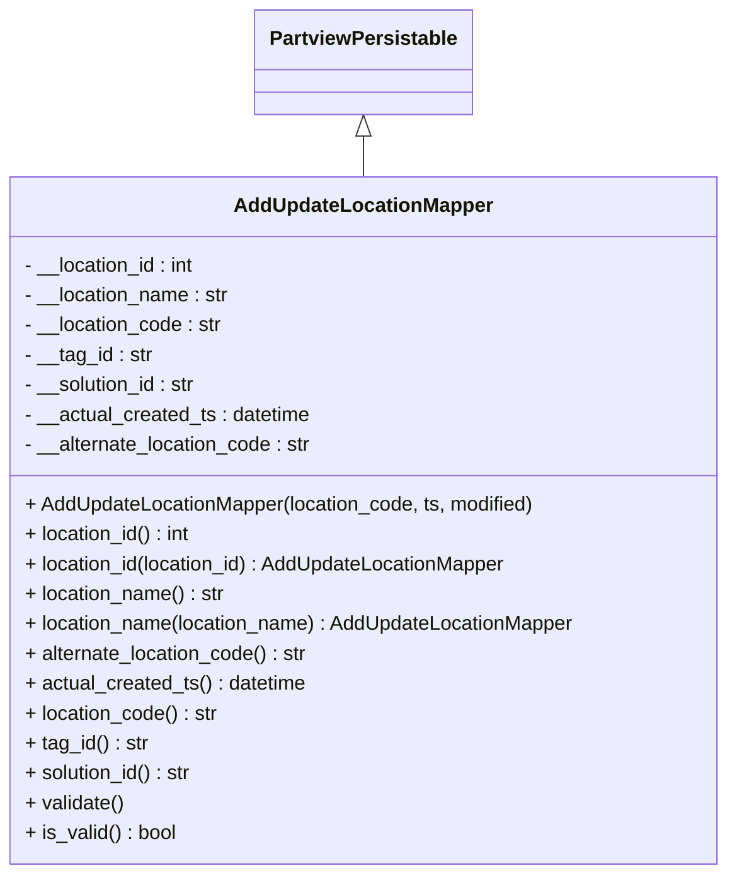

# Diagram: application_service/container_tracking_app_service/core/datamodel/AddUpdateLocationMapper.py


> Auto-generated by Obscura crawlers

## Diagram 1



### SVG

<svg id="container" width="589.03125" xmlns="http://www.w3.org/2000/svg" class="classDiagram" height="702" viewBox="0 0 589.03125 702" role="graphics-document document" aria-roledescription="class"><style>#container{font-family:"trebuchet ms",verdana,arial,sans-serif;font-size:16px;fill:#333;}@keyframes edge-animation-frame{from{stroke-dashoffset:0;}}@keyframes dash{to{stroke-dashoffset:0;}}#container .edge-animation-slow{stroke-dasharray:9,5!important;stroke-dashoffset:900;animation:dash 50s linear infinite;stroke-linecap:round;}#container .edge-animation-fast{stroke-dasharray:9,5!important;stroke-dashoffset:900;animation:dash 20s linear infinite;stroke-linecap:round;}#container .error-icon{fill:#552222;}#container .error-text{fill:#552222;stroke:#552222;}#container .edge-thickness-normal{stroke-width:1px;}#container .edge-thickness-thick{stroke-width:3.5px;}#container .edge-pattern-solid{stroke-dasharray:0;}#container .edge-thickness-invisible{stroke-width:0;fill:none;}#container .edge-pattern-dashed{stroke-dasharray:3;}#container .edge-pattern-dotted{stroke-dasharray:2;}#container .marker{fill:#333333;stroke:#333333;}#container .marker.cross{stroke:#333333;}#container svg{font-family:"trebuchet ms",verdana,arial,sans-serif;font-size:16px;}#container p{margin:0;}#container g.classGroup text{fill:#9370DB;stroke:none;font-family:"trebuchet ms",verdana,arial,sans-serif;font-size:10px;}#container g.classGroup text .title{font-weight:bolder;}#container .nodeLabel,#container .edgeLabel{color:#131300;}#container .edgeLabel .label rect{fill:#ECECFF;}#container .label text{fill:#131300;}#container .labelBkg{background:#ECECFF;}#container .edgeLabel .label span{background:#ECECFF;}#container .classTitle{font-weight:bolder;}#container .node rect,#container .node circle,#container .node ellipse,#container .node polygon,#container .node path{fill:#ECECFF;stroke:#9370DB;stroke-width:1px;}#container .divider{stroke:#9370DB;stroke-width:1;}#container g.clickable{cursor:pointer;}#container g.classGroup rect{fill:#ECECFF;stroke:#9370DB;}#container g.classGroup line{stroke:#9370DB;stroke-width:1;}#container .classLabel .box{stroke:none;stroke-width:0;fill:#ECECFF;opacity:0.5;}#container .classLabel .label{fill:#9370DB;font-size:10px;}#container .relation{stroke:#333333;stroke-width:1;fill:none;}#container .dashed-line{stroke-dasharray:3;}#container .dotted-line{stroke-dasharray:1 2;}#container #compositionStart,#container .composition{fill:#333333!important;stroke:#333333!important;stroke-width:1;}#container #compositionEnd,#container .composition{fill:#333333!important;stroke:#333333!important;stroke-width:1;}#container #dependencyStart,#container .dependency{fill:#333333!important;stroke:#333333!important;stroke-width:1;}#container #dependencyStart,#container .dependency{fill:#333333!important;stroke:#333333!important;stroke-width:1;}#container #extensionStart,#container .extension{fill:transparent!important;stroke:#333333!important;stroke-width:1;}#container #extensionEnd,#container .extension{fill:transparent!important;stroke:#333333!important;stroke-width:1;}#container #aggregationStart,#container .aggregation{fill:transparent!important;stroke:#333333!important;stroke-width:1;}#container #aggregationEnd,#container .aggregation{fill:transparent!important;stroke:#333333!important;stroke-width:1;}#container #lollipopStart,#container .lollipop{fill:#ECECFF!important;stroke:#333333!important;stroke-width:1;}#container #lollipopEnd,#container .lollipop{fill:#ECECFF!important;stroke:#333333!important;stroke-width:1;}#container .edgeTerminals{font-size:11px;line-height:initial;}#container .classTitleText{text-anchor:middle;font-size:18px;fill:#333;}#container .label-icon{display:inline-block;height:1em;overflow:visible;vertical-align:-0.125em;}#container .node .label-icon path{fill:currentColor;stroke:revert;stroke-width:revert;}#container :root{--mermaid-font-family:"trebuchet ms",verdana,arial,sans-serif;}</style><g><defs><marker id="container_class-aggregationStart" class="marker aggregation class" refX="18" refY="7" markerWidth="190" markerHeight="240" orient="auto"><path d="M 18,7 L9,13 L1,7 L9,1 Z"></path></marker></defs><defs><marker id="container_class-aggregationEnd" class="marker aggregation class" refX="1" refY="7" markerWidth="20" markerHeight="28" orient="auto"><path d="M 18,7 L9,13 L1,7 L9,1 Z"></path></marker></defs><defs><marker id="container_class-extensionStart" class="marker extension class" refX="18" refY="7" markerWidth="190" markerHeight="240" orient="auto"><path d="M 1,7 L18,13 V 1 Z"></path></marker></defs><defs><marker id="container_class-extensionEnd" class="marker extension class" refX="1" refY="7" markerWidth="20" markerHeight="28" orient="auto"><path d="M 1,1 V 13 L18,7 Z"></path></marker></defs><defs><marker id="container_class-compositionStart" class="marker composition class" refX="18" refY="7" markerWidth="190" markerHeight="240" orient="auto"><path d="M 18,7 L9,13 L1,7 L9,1 Z"></path></marker></defs><defs><marker id="container_class-compositionEnd" class="marker composition class" refX="1" refY="7" markerWidth="20" markerHeight="28" orient="auto"><path d="M 18,7 L9,13 L1,7 L9,1 Z"></path></marker></defs><defs><marker id="container_class-dependencyStart" class="marker dependency class" refX="6" refY="7" markerWidth="190" markerHeight="240" orient="auto"><path d="M 5,7 L9,13 L1,7 L9,1 Z"></path></marker></defs><defs><marker id="container_class-dependencyEnd" class="marker dependency class" refX="13" refY="7" markerWidth="20" markerHeight="28" orient="auto"><path d="M 18,7 L9,13 L14,7 L9,1 Z"></path></marker></defs><defs><marker id="container_class-lollipopStart" class="marker lollipop class" refX="13" refY="7" markerWidth="190" markerHeight="240" orient="auto"><circle stroke="black" fill="transparent" cx="7" cy="7" r="6"></circle></marker></defs><defs><marker id="container_class-lollipopEnd" class="marker lollipop class" refX="1" refY="7" markerWidth="190" markerHeight="240" orient="auto"><circle stroke="black" fill="transparent" cx="7" cy="7" r="6"></circle></marker></defs><g class="root"><g class="clusters"></g><g class="edgePaths"><path d="M294.516,109.25L294.516,110.542C294.516,111.833,294.516,114.417,294.516,119.875C294.516,125.333,294.516,133.667,294.516,137.833L294.516,142" id="id_PartviewPersistable_AddUpdateLocationMapper_1" class="edge-thickness-normal edge-pattern-solid relation" style=";;;" data-edge="true" data-et="edge" data-id="id_PartviewPersistable_AddUpdateLocationMapper_1" data-points="W3sieCI6Mjk0LjUxNTYyNSwieSI6OTJ9LHsieCI6Mjk0LjUxNTYyNSwieSI6MTE3fSx7IngiOjI5NC41MTU2MjUsInkiOjE0Mn1d" marker-start="url(#container_class-extensionStart)"></path></g><g class="edgeLabels"><g class="edgeLabel"><g class="label" data-id="id_PartviewPersistable_AddUpdateLocationMapper_1" transform="translate(0, 0)"><foreignObject width="0" height="0"><div xmlns="http://www.w3.org/1999/xhtml" class="labelBkg" style="display: table-cell; white-space: nowrap; line-height: 1.5; max-width: 200px; text-align: center;"><span class="edgeLabel"></span></div></foreignObject></g></g></g><g class="nodes"><g class="node default" id="classId-PartviewPersistable-0" transform="translate(294.515625, 50)"><g class="basic label-container"><path d="M-84.7734375 -42 L84.7734375 -42 L84.7734375 42 L-84.7734375 42" stroke="none" stroke-width="0" fill="#ECECFF" style=""></path><path d="M-84.7734375 -42 C-38.16531123258063 -42, 8.442815034838745 -42, 84.7734375 -42 M-84.7734375 -42 C-30.587838514614802 -42, 23.597760470770396 -42, 84.7734375 -42 M84.7734375 -42 C84.7734375 -17.531720445662963, 84.7734375 6.936559108674075, 84.7734375 42 M84.7734375 -42 C84.7734375 -13.869060373768491, 84.7734375 14.261879252463018, 84.7734375 42 M84.7734375 42 C41.12957761812554 42, -2.5142822637489246 42, -84.7734375 42 M84.7734375 42 C42.76055905885222 42, 0.7476806177044466 42, -84.7734375 42 M-84.7734375 42 C-84.7734375 24.111444717066945, -84.7734375 6.22288943413389, -84.7734375 -42 M-84.7734375 42 C-84.7734375 11.47795048730734, -84.7734375 -19.04409902538532, -84.7734375 -42" stroke="#9370DB" stroke-width="1.3" fill="none" stroke-dasharray="0 0" style=""></path></g><g class="annotation-group text" transform="translate(0, -18)"></g><g class="label-group text" transform="translate(-72.7734375, -18)"><g class="label" style="font-weight: bolder" transform="translate(0,-12)"><foreignObject width="145.546875" height="24"><div xmlns="http://www.w3.org/1999/xhtml" style="display: table-cell; white-space: nowrap; line-height: 1.5; max-width: 192px; text-align: center;"><span class="nodeLabel markdown-node-label" style=""><p>PartviewPersistable</p></span></div></foreignObject></g></g><g class="members-group text" transform="translate(-72.7734375, 30)"></g><g class="methods-group text" transform="translate(-72.7734375, 60)"></g><g class="divider" style=""><path d="M-84.7734375 6 C-50.59166867044098 6, -16.409899840881963 6, 84.7734375 6 M-84.7734375 6 C-35.6074986759227 6, 13.558440148154602 6, 84.7734375 6" stroke="#9370DB" stroke-width="1.3" fill="none" stroke-dasharray="0 0" style=""></path></g><g class="divider" style=""><path d="M-84.7734375 24 C-28.21893574728218 24, 28.335566005435638 24, 84.7734375 24 M-84.7734375 24 C-18.332694441778187 24, 48.108048616443625 24, 84.7734375 24" stroke="#9370DB" stroke-width="1.3" fill="none" stroke-dasharray="0 0" style=""></path></g></g><g class="node default" id="classId-AddUpdateLocationMapper-1" transform="translate(294.515625, 418)"><g class="basic label-container"><path d="M-286.515625 -276 L286.515625 -276 L286.515625 276 L-286.515625 276" stroke="none" stroke-width="0" fill="#ECECFF" style=""></path><path d="M-286.515625 -276 C-169.8586186564147 -276, -53.20161231282944 -276, 286.515625 -276 M-286.515625 -276 C-153.045363889179 -276, -19.575102778357973 -276, 286.515625 -276 M286.515625 -276 C286.515625 -89.36191024911878, 286.515625 97.27617950176244, 286.515625 276 M286.515625 -276 C286.515625 -165.38906988970876, 286.515625 -54.7781397794175, 286.515625 276 M286.515625 276 C130.0765283802444 276, -26.362568239511177 276, -286.515625 276 M286.515625 276 C141.4422731533672 276, -3.6310786932655787 276, -286.515625 276 M-286.515625 276 C-286.515625 106.5917672480997, -286.515625 -62.8164655038006, -286.515625 -276 M-286.515625 276 C-286.515625 60.08663312833011, -286.515625 -155.8267337433398, -286.515625 -276" stroke="#9370DB" stroke-width="1.3" fill="none" stroke-dasharray="0 0" style=""></path></g><g class="annotation-group text" transform="translate(0, -252)"></g><g class="label-group text" transform="translate(-100.046875, -252)"><g class="label" style="font-weight: bolder" transform="translate(0,-12)"><foreignObject width="200.09375" height="24"><div xmlns="http://www.w3.org/1999/xhtml" style="display: table-cell; white-space: nowrap; line-height: 1.5; max-width: 249px; text-align: center;"><span class="nodeLabel markdown-node-label" style=""><p>AddUpdateLocationMapper</p></span></div></foreignObject></g></g><g class="members-group text" transform="translate(-274.515625, -204)"><g class="label" style="" transform="translate(0,-12)"><foreignObject width="140.546875" height="24"><div xmlns="http://www.w3.org/1999/xhtml" style="display: table-cell; white-space: nowrap; line-height: 1.5; max-width: 198px; text-align: center;"><span class="nodeLabel markdown-node-label" style=""><p>- __location_id : int</p></span></div></foreignObject></g><g class="label" style="" transform="translate(0,12)"><foreignObject width="166.75" height="24"><div xmlns="http://www.w3.org/1999/xhtml" style="display: table-cell; white-space: nowrap; line-height: 1.5; max-width: 225px; text-align: center;"><span class="nodeLabel markdown-node-label" style=""><p>- __location_name : str</p></span></div></foreignObject></g><g class="label" style="" transform="translate(0,36)"><foreignObject width="160.875" height="24"><div xmlns="http://www.w3.org/1999/xhtml" style="display: table-cell; white-space: nowrap; line-height: 1.5; max-width: 219px; text-align: center;"><span class="nodeLabel markdown-node-label" style=""><p>- __location_code : str</p></span></div></foreignObject></g><g class="label" style="" transform="translate(0,60)"><foreignObject width="103.59375" height="24"><div xmlns="http://www.w3.org/1999/xhtml" style="display: table-cell; white-space: nowrap; line-height: 1.5; max-width: 162px; text-align: center;"><span class="nodeLabel markdown-node-label" style=""><p>- __tag_id : str</p></span></div></foreignObject></g><g class="label" style="" transform="translate(0,84)"><foreignObject width="141.140625" height="24"><div xmlns="http://www.w3.org/1999/xhtml" style="display: table-cell; white-space: nowrap; line-height: 1.5; max-width: 199px; text-align: center;"><span class="nodeLabel markdown-node-label" style=""><p>- __solution_id : str</p></span></div></foreignObject></g><g class="label" style="" transform="translate(0,108)"><foreignObject width="232.78125" height="24"><div xmlns="http://www.w3.org/1999/xhtml" style="display: table-cell; white-space: nowrap; line-height: 1.5; max-width: 290px; text-align: center;"><span class="nodeLabel markdown-node-label" style=""><p>- __actual_created_ts : datetime</p></span></div></foreignObject></g><g class="label" style="" transform="translate(0,132)"><foreignObject width="234.546875" height="24"><div xmlns="http://www.w3.org/1999/xhtml" style="display: table-cell; white-space: nowrap; line-height: 1.5; max-width: 293px; text-align: center;"><span class="nodeLabel markdown-node-label" style=""><p>- __alternate_location_code : str</p></span></div></foreignObject></g></g><g class="methods-group text" transform="translate(-274.515625, -12)"><g class="label" style="" transform="translate(0,-12)"><foreignObject width="416.6875" height="24"><div xmlns="http://www.w3.org/1999/xhtml" style="display: table-cell; white-space: nowrap; line-height: 1.5; max-width: 474px; text-align: center;"><span class="nodeLabel markdown-node-label" style=""><p>+ AddUpdateLocationMapper(location_code, ts, modified)</p></span></div></foreignObject></g><g class="label" style="" transform="translate(0,12)"><foreignObject width="136.140625" height="24"><div xmlns="http://www.w3.org/1999/xhtml" style="display: table-cell; white-space: nowrap; line-height: 1.5; max-width: 194px; text-align: center;"><span class="nodeLabel markdown-node-label" style=""><p>+ location_id() : int</p></span></div></foreignObject></g><g class="label" style="" transform="translate(0,36)"><foreignObject width="396.125" height="24"><div xmlns="http://www.w3.org/1999/xhtml" style="display: table-cell; white-space: nowrap; line-height: 1.5; max-width: 454px; text-align: center;"><span class="nodeLabel markdown-node-label" style=""><p>+ location_id(location_id) : AddUpdateLocationMapper</p></span></div></foreignObject></g><g class="label" style="" transform="translate(0,60)"><foreignObject width="162.328125" height="24"><div xmlns="http://www.w3.org/1999/xhtml" style="display: table-cell; white-space: nowrap; line-height: 1.5; max-width: 221px; text-align: center;"><span class="nodeLabel markdown-node-label" style=""><p>+ location_name() : str</p></span></div></foreignObject></g><g class="label" style="" transform="translate(0,84)"><foreignObject width="448.984375" height="24"><div xmlns="http://www.w3.org/1999/xhtml" style="display: table-cell; white-space: nowrap; line-height: 1.5; max-width: 507px; text-align: center;"><span class="nodeLabel markdown-node-label" style=""><p>+ location_name(location_name) : AddUpdateLocationMapper</p></span></div></foreignObject></g><g class="label" style="" transform="translate(0,108)"><foreignObject width="230.296875" height="24"><div xmlns="http://www.w3.org/1999/xhtml" style="display: table-cell; white-space: nowrap; line-height: 1.5; max-width: 288px; text-align: center;"><span class="nodeLabel markdown-node-label" style=""><p>+ alternate_location_code() : str</p></span></div></foreignObject></g><g class="label" style="" transform="translate(0,132)"><foreignObject width="228.515625" height="24"><div xmlns="http://www.w3.org/1999/xhtml" style="display: table-cell; white-space: nowrap; line-height: 1.5; max-width: 286px; text-align: center;"><span class="nodeLabel markdown-node-label" style=""><p>+ actual_created_ts() : datetime</p></span></div></foreignObject></g><g class="label" style="" transform="translate(0,156)"><foreignObject width="156.453125" height="24"><div xmlns="http://www.w3.org/1999/xhtml" style="display: table-cell; white-space: nowrap; line-height: 1.5; max-width: 215px; text-align: center;"><span class="nodeLabel markdown-node-label" style=""><p>+ location_code() : str</p></span></div></foreignObject></g><g class="label" style="" transform="translate(0,180)"><foreignObject width="99.34375" height="24"><div xmlns="http://www.w3.org/1999/xhtml" style="display: table-cell; white-space: nowrap; line-height: 1.5; max-width: 158px; text-align: center;"><span class="nodeLabel markdown-node-label" style=""><p>+ tag_id() : str</p></span></div></foreignObject></g><g class="label" style="" transform="translate(0,204)"><foreignObject width="136.5625" height="24"><div xmlns="http://www.w3.org/1999/xhtml" style="display: table-cell; white-space: nowrap; line-height: 1.5; max-width: 195px; text-align: center;"><span class="nodeLabel markdown-node-label" style=""><p>+ solution_id() : str</p></span></div></foreignObject></g><g class="label" style="" transform="translate(0,228)"><foreignObject width="80.484375" height="24"><div xmlns="http://www.w3.org/1999/xhtml" style="display: table-cell; white-space: nowrap; line-height: 1.5; max-width: 138px; text-align: center;"><span class="nodeLabel markdown-node-label" style=""><p>+ validate()</p></span></div></foreignObject></g><g class="label" style="" transform="translate(0,252)"><foreignObject width="122.234375" height="24"><div xmlns="http://www.w3.org/1999/xhtml" style="display: table-cell; white-space: nowrap; line-height: 1.5; max-width: 180px; text-align: center;"><span class="nodeLabel markdown-node-label" style=""><p>+ is_valid() : bool</p></span></div></foreignObject></g></g><g class="divider" style=""><path d="M-286.515625 -228 C-136.8483043023987 -228, 12.819016395202596 -228, 286.515625 -228 M-286.515625 -228 C-171.53262802044537 -228, -56.549631040890716 -228, 286.515625 -228" stroke="#9370DB" stroke-width="1.3" fill="none" stroke-dasharray="0 0" style=""></path></g><g class="divider" style=""><path d="M-286.515625 -36 C-139.24237795982964 -36, 8.030869080340722 -36, 286.515625 -36 M-286.515625 -36 C-95.87107591957675 -36, 94.77347316084649 -36, 286.515625 -36" stroke="#9370DB" stroke-width="1.3" fill="none" stroke-dasharray="0 0" style=""></path></g></g></g></g></g></svg>

## Diagram 2

```mermaid
flowchart LR
Start([Start]) --> SetterAction[Setter invoked (e.g., location_id, location_name, tag_id, ...)]
SetterAction --> TypeAssert[Assert value is correct type or None]
TypeAssert --> Changed{Value differs from existing?}
Changed -->|yes| AddDirty[Call add_dirty_field(field, value)]
Changed -->|no| SkipDirty[Skip add_dirty_field]
AddDirty --> ReturnSelf[/return self/]
SkipDirty --> ReturnSelf
ReturnSelf --> ValidateCall[validate() checks field types and invariants]
ValidateCall --> IsValid{is_valid() runtime checks}
IsValid -->|true| Valid[Return True]
IsValid -->|false| Invalid[Return False]
Valid --> End([End])
Invalid --> End
```

> SVG rendering failed for this diagram.
