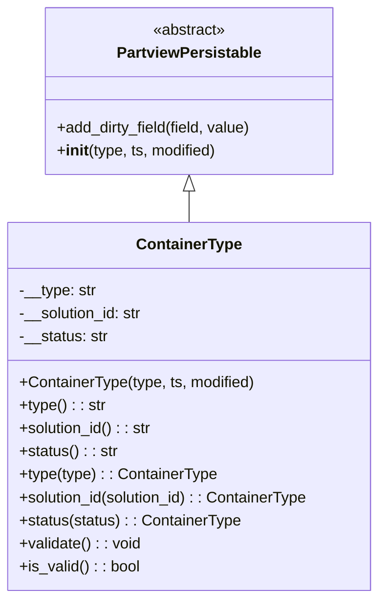

# Diagram: application_service/container_tracking_app_service/core/datamodel/ContainerType.py


> Auto-generated by Obscura crawlers

## Diagram 1



### SVG

<svg id="container" width="400.390625" xmlns="http://www.w3.org/2000/svg" class="classDiagram" height="624" viewBox="0 0 400.390625 624" role="graphics-document document" aria-roledescription="class"><style>#container{font-family:"trebuchet ms",verdana,arial,sans-serif;font-size:16px;fill:#333;}@keyframes edge-animation-frame{from{stroke-dashoffset:0;}}@keyframes dash{to{stroke-dashoffset:0;}}#container .edge-animation-slow{stroke-dasharray:9,5!important;stroke-dashoffset:900;animation:dash 50s linear infinite;stroke-linecap:round;}#container .edge-animation-fast{stroke-dasharray:9,5!important;stroke-dashoffset:900;animation:dash 20s linear infinite;stroke-linecap:round;}#container .error-icon{fill:#552222;}#container .error-text{fill:#552222;stroke:#552222;}#container .edge-thickness-normal{stroke-width:1px;}#container .edge-thickness-thick{stroke-width:3.5px;}#container .edge-pattern-solid{stroke-dasharray:0;}#container .edge-thickness-invisible{stroke-width:0;fill:none;}#container .edge-pattern-dashed{stroke-dasharray:3;}#container .edge-pattern-dotted{stroke-dasharray:2;}#container .marker{fill:#333333;stroke:#333333;}#container .marker.cross{stroke:#333333;}#container svg{font-family:"trebuchet ms",verdana,arial,sans-serif;font-size:16px;}#container p{margin:0;}#container g.classGroup text{fill:#9370DB;stroke:none;font-family:"trebuchet ms",verdana,arial,sans-serif;font-size:10px;}#container g.classGroup text .title{font-weight:bolder;}#container .nodeLabel,#container .edgeLabel{color:#131300;}#container .edgeLabel .label rect{fill:#ECECFF;}#container .label text{fill:#131300;}#container .labelBkg{background:#ECECFF;}#container .edgeLabel .label span{background:#ECECFF;}#container .classTitle{font-weight:bolder;}#container .node rect,#container .node circle,#container .node ellipse,#container .node polygon,#container .node path{fill:#ECECFF;stroke:#9370DB;stroke-width:1px;}#container .divider{stroke:#9370DB;stroke-width:1;}#container g.clickable{cursor:pointer;}#container g.classGroup rect{fill:#ECECFF;stroke:#9370DB;}#container g.classGroup line{stroke:#9370DB;stroke-width:1;}#container .classLabel .box{stroke:none;stroke-width:0;fill:#ECECFF;opacity:0.5;}#container .classLabel .label{fill:#9370DB;font-size:10px;}#container .relation{stroke:#333333;stroke-width:1;fill:none;}#container .dashed-line{stroke-dasharray:3;}#container .dotted-line{stroke-dasharray:1 2;}#container #compositionStart,#container .composition{fill:#333333!important;stroke:#333333!important;stroke-width:1;}#container #compositionEnd,#container .composition{fill:#333333!important;stroke:#333333!important;stroke-width:1;}#container #dependencyStart,#container .dependency{fill:#333333!important;stroke:#333333!important;stroke-width:1;}#container #dependencyStart,#container .dependency{fill:#333333!important;stroke:#333333!important;stroke-width:1;}#container #extensionStart,#container .extension{fill:transparent!important;stroke:#333333!important;stroke-width:1;}#container #extensionEnd,#container .extension{fill:transparent!important;stroke:#333333!important;stroke-width:1;}#container #aggregationStart,#container .aggregation{fill:transparent!important;stroke:#333333!important;stroke-width:1;}#container #aggregationEnd,#container .aggregation{fill:transparent!important;stroke:#333333!important;stroke-width:1;}#container #lollipopStart,#container .lollipop{fill:#ECECFF!important;stroke:#333333!important;stroke-width:1;}#container #lollipopEnd,#container .lollipop{fill:#ECECFF!important;stroke:#333333!important;stroke-width:1;}#container .edgeTerminals{font-size:11px;line-height:initial;}#container .classTitleText{text-anchor:middle;font-size:18px;fill:#333;}#container .label-icon{display:inline-block;height:1em;overflow:visible;vertical-align:-0.125em;}#container .node .label-icon path{fill:currentColor;stroke:revert;stroke-width:revert;}#container :root{--mermaid-font-family:"trebuchet ms",verdana,arial,sans-serif;}</style><g><defs><marker id="container_class-aggregationStart" class="marker aggregation class" refX="18" refY="7" markerWidth="190" markerHeight="240" orient="auto"><path d="M 18,7 L9,13 L1,7 L9,1 Z"></path></marker></defs><defs><marker id="container_class-aggregationEnd" class="marker aggregation class" refX="1" refY="7" markerWidth="20" markerHeight="28" orient="auto"><path d="M 18,7 L9,13 L1,7 L9,1 Z"></path></marker></defs><defs><marker id="container_class-extensionStart" class="marker extension class" refX="18" refY="7" markerWidth="190" markerHeight="240" orient="auto"><path d="M 1,7 L18,13 V 1 Z"></path></marker></defs><defs><marker id="container_class-extensionEnd" class="marker extension class" refX="1" refY="7" markerWidth="20" markerHeight="28" orient="auto"><path d="M 1,1 V 13 L18,7 Z"></path></marker></defs><defs><marker id="container_class-compositionStart" class="marker composition class" refX="18" refY="7" markerWidth="190" markerHeight="240" orient="auto"><path d="M 18,7 L9,13 L1,7 L9,1 Z"></path></marker></defs><defs><marker id="container_class-compositionEnd" class="marker composition class" refX="1" refY="7" markerWidth="20" markerHeight="28" orient="auto"><path d="M 18,7 L9,13 L1,7 L9,1 Z"></path></marker></defs><defs><marker id="container_class-dependencyStart" class="marker dependency class" refX="6" refY="7" markerWidth="190" markerHeight="240" orient="auto"><path d="M 5,7 L9,13 L1,7 L9,1 Z"></path></marker></defs><defs><marker id="container_class-dependencyEnd" class="marker dependency class" refX="13" refY="7" markerWidth="20" markerHeight="28" orient="auto"><path d="M 18,7 L9,13 L14,7 L9,1 Z"></path></marker></defs><defs><marker id="container_class-lollipopStart" class="marker lollipop class" refX="13" refY="7" markerWidth="190" markerHeight="240" orient="auto"><circle stroke="black" fill="transparent" cx="7" cy="7" r="6"></circle></marker></defs><defs><marker id="container_class-lollipopEnd" class="marker lollipop class" refX="1" refY="7" markerWidth="190" markerHeight="240" orient="auto"><circle stroke="black" fill="transparent" cx="7" cy="7" r="6"></circle></marker></defs><g class="root"><g class="clusters"></g><g class="edgePaths"><path d="M200.195,199.25L200.195,200.542C200.195,201.833,200.195,204.417,200.195,209.875C200.195,215.333,200.195,223.667,200.195,227.833L200.195,232" id="id_PartviewPersistable_ContainerType_1" class="edge-thickness-normal edge-pattern-solid relation" style=";;;" data-edge="true" data-et="edge" data-id="id_PartviewPersistable_ContainerType_1" data-points="W3sieCI6MjAwLjE5NTMxMjUsInkiOjE4Mn0seyJ4IjoyMDAuMTk1MzEyNSwieSI6MjA3fSx7IngiOjIwMC4xOTUzMTI1LCJ5IjoyMzJ9XQ==" marker-start="url(#container_class-extensionStart)"></path></g><g class="edgeLabels"><g class="edgeLabel"><g class="label" data-id="id_PartviewPersistable_ContainerType_1" transform="translate(0, 0)"><foreignObject width="0" height="0"><div xmlns="http://www.w3.org/1999/xhtml" class="labelBkg" style="display: table-cell; white-space: nowrap; line-height: 1.5; max-width: 200px; text-align: center;"><span class="edgeLabel"></span></div></foreignObject></g></g></g><g class="nodes"><g class="node default" id="classId-PartviewPersistable-0" transform="translate(200.1953125, 95)"><g class="basic label-container"><path d="M-151.61328125 -87 L151.61328125 -87 L151.61328125 87 L-151.61328125 87" stroke="none" stroke-width="0" fill="#ECECFF" style=""></path><path d="M-151.61328125 -87 C-55.26368849450459 -87, 41.085904260990816 -87, 151.61328125 -87 M-151.61328125 -87 C-73.0654457163504 -87, 5.482389817299207 -87, 151.61328125 -87 M151.61328125 -87 C151.61328125 -24.97623833549744, 151.61328125 37.04752332900512, 151.61328125 87 M151.61328125 -87 C151.61328125 -51.95373665129239, 151.61328125 -16.907473302584776, 151.61328125 87 M151.61328125 87 C70.6463502503028 87, -10.320580749394395 87, -151.61328125 87 M151.61328125 87 C48.25247469113401 87, -55.10833186773198 87, -151.61328125 87 M-151.61328125 87 C-151.61328125 18.132603741967174, -151.61328125 -50.73479251606565, -151.61328125 -87 M-151.61328125 87 C-151.61328125 27.216875739883356, -151.61328125 -32.56624852023329, -151.61328125 -87" stroke="#9370DB" stroke-width="1.3" fill="none" stroke-dasharray="0 0" style=""></path></g><g class="annotation-group text" transform="translate(-38.609375, -63)"><g class="label" style="" transform="translate(0,-12)"><foreignObject width="77.21875" height="24"><div xmlns="http://www.w3.org/1999/xhtml" style="display: table-cell; white-space: nowrap; line-height: 1.5; max-width: 127px; text-align: center;"><span class="nodeLabel markdown-node-label" style=""><p>«abstract»</p></span></div></foreignObject></g></g><g class="label-group text" transform="translate(-72.7734375, -39)"><g class="label" style="font-weight: bolder" transform="translate(0,-12)"><foreignObject width="145.546875" height="24"><div xmlns="http://www.w3.org/1999/xhtml" style="display: table-cell; white-space: nowrap; line-height: 1.5; max-width: 192px; text-align: center;"><span class="nodeLabel markdown-node-label" style=""><p>PartviewPersistable</p></span></div></foreignObject></g></g><g class="members-group text" transform="translate(-139.61328125, 9)"></g><g class="methods-group text" transform="translate(-139.61328125, 39)"><g class="label" style="" transform="translate(0,-12)"><foreignObject width="206.453125" height="24"><div xmlns="http://www.w3.org/1999/xhtml" style="display: table-cell; white-space: nowrap; line-height: 1.5; max-width: 264px; text-align: center;"><span class="nodeLabel markdown-node-label" style=""><p>+add_dirty_field(field, value)</p></span></div></foreignObject></g><g class="label" style="" transform="translate(0,12)"><foreignObject width="168.46875" height="24"><div xmlns="http://www.w3.org/1999/xhtml" style="display: table-cell; white-space: nowrap; line-height: 1.5; max-width: 257px; text-align: center;"><span class="nodeLabel markdown-node-label" style=""><p>+<strong>init</strong>(type, ts, modified)</p></span></div></foreignObject></g></g><g class="divider" style=""><path d="M-151.61328125 -15 C-63.81737351322174 -15, 23.978534223556522 -15, 151.61328125 -15 M-151.61328125 -15 C-45.610679451997115 -15, 60.39192234600577 -15, 151.61328125 -15" stroke="#9370DB" stroke-width="1.3" fill="none" stroke-dasharray="0 0" style=""></path></g><g class="divider" style=""><path d="M-151.61328125 9 C-54.90292778334526 9, 41.807425683309475 9, 151.61328125 9 M-151.61328125 9 C-57.55617524975088 9, 36.50093075049824 9, 151.61328125 9" stroke="#9370DB" stroke-width="1.3" fill="none" stroke-dasharray="0 0" style=""></path></g></g><g class="node default" id="classId-ContainerType-1" transform="translate(200.1953125, 424)"><g class="basic label-container"><path d="M-192.1953125 -192 L192.1953125 -192 L192.1953125 192 L-192.1953125 192" stroke="none" stroke-width="0" fill="#ECECFF" style=""></path><path d="M-192.1953125 -192 C-50.23061813212823 -192, 91.73407623574354 -192, 192.1953125 -192 M-192.1953125 -192 C-99.85536128570595 -192, -7.515410071411907 -192, 192.1953125 -192 M192.1953125 -192 C192.1953125 -98.28699870202932, 192.1953125 -4.573997404058645, 192.1953125 192 M192.1953125 -192 C192.1953125 -89.73950410909879, 192.1953125 12.520991781802422, 192.1953125 192 M192.1953125 192 C107.53764305640401 192, 22.879973612808016 192, -192.1953125 192 M192.1953125 192 C99.79203524163833 192, 7.388757983276662 192, -192.1953125 192 M-192.1953125 192 C-192.1953125 112.32758158407725, -192.1953125 32.6551631681545, -192.1953125 -192 M-192.1953125 192 C-192.1953125 65.19698987121475, -192.1953125 -61.60602025757049, -192.1953125 -192" stroke="#9370DB" stroke-width="1.3" fill="none" stroke-dasharray="0 0" style=""></path></g><g class="annotation-group text" transform="translate(0, -168)"></g><g class="label-group text" transform="translate(-52.9375, -168)"><g class="label" style="font-weight: bolder" transform="translate(0,-12)"><foreignObject width="105.875" height="24"><div xmlns="http://www.w3.org/1999/xhtml" style="display: table-cell; white-space: nowrap; line-height: 1.5; max-width: 154px; text-align: center;"><span class="nodeLabel markdown-node-label" style=""><p>ContainerType</p></span></div></foreignObject></g></g><g class="members-group text" transform="translate(-180.1953125, -120)"><g class="label" style="" transform="translate(0,-12)"><foreignObject width="80.625" height="24"><div xmlns="http://www.w3.org/1999/xhtml" style="display: table-cell; white-space: nowrap; line-height: 1.5; max-width: 139px; text-align: center;"><span class="nodeLabel markdown-node-label" style=""><p>-__type: str</p></span></div></foreignObject></g><g class="label" style="" transform="translate(0,12)"><foreignObject width="131.390625" height="24"><div xmlns="http://www.w3.org/1999/xhtml" style="display: table-cell; white-space: nowrap; line-height: 1.5; max-width: 190px; text-align: center;"><span class="nodeLabel markdown-node-label" style=""><p>-__solution_id: str</p></span></div></foreignObject></g><g class="label" style="" transform="translate(0,36)"><foreignObject width="93.5625" height="24"><div xmlns="http://www.w3.org/1999/xhtml" style="display: table-cell; white-space: nowrap; line-height: 1.5; max-width: 152px; text-align: center;"><span class="nodeLabel markdown-node-label" style=""><p>-__status: str</p></span></div></foreignObject></g></g><g class="methods-group text" transform="translate(-180.1953125, -24)"><g class="label" style="" transform="translate(0,-12)"><foreignObject width="248.265625" height="24"><div xmlns="http://www.w3.org/1999/xhtml" style="display: table-cell; white-space: nowrap; line-height: 1.5; max-width: 306px; text-align: center;"><span class="nodeLabel markdown-node-label" style=""><p>+ContainerType(type, ts, modified)</p></span></div></foreignObject></g><g class="label" style="" transform="translate(0,12)"><foreignObject width="89.890625" height="24"><div xmlns="http://www.w3.org/1999/xhtml" style="display: table-cell; white-space: nowrap; line-height: 1.5; max-width: 148px; text-align: center;"><span class="nodeLabel markdown-node-label" style=""><p>+type() : : str</p></span></div></foreignObject></g><g class="label" style="" transform="translate(0,36)"><foreignObject width="140.40625" height="24"><div xmlns="http://www.w3.org/1999/xhtml" style="display: table-cell; white-space: nowrap; line-height: 1.5; max-width: 199px; text-align: center;"><span class="nodeLabel markdown-node-label" style=""><p>+solution_id() : : str</p></span></div></foreignObject></g><g class="label" style="" transform="translate(0,60)"><foreignObject width="102.578125" height="24"><div xmlns="http://www.w3.org/1999/xhtml" style="display: table-cell; white-space: nowrap; line-height: 1.5; max-width: 161px; text-align: center;"><span class="nodeLabel markdown-node-label" style=""><p>+status() : : str</p></span></div></foreignObject></g><g class="label" style="" transform="translate(0,84)"><foreignObject width="206.5" height="24"><div xmlns="http://www.w3.org/1999/xhtml" style="display: table-cell; white-space: nowrap; line-height: 1.5; max-width: 264px; text-align: center;"><span class="nodeLabel markdown-node-label" style=""><p>+type(type) : : ContainerType</p></span></div></foreignObject></g><g class="label" style="" transform="translate(0,108)"><foreignObject width="307.453125" height="24"><div xmlns="http://www.w3.org/1999/xhtml" style="display: table-cell; white-space: nowrap; line-height: 1.5; max-width: 365px; text-align: center;"><span class="nodeLabel markdown-node-label" style=""><p>+solution_id(solution_id) : : ContainerType</p></span></div></foreignObject></g><g class="label" style="" transform="translate(0,132)"><foreignObject width="231.796875" height="24"><div xmlns="http://www.w3.org/1999/xhtml" style="display: table-cell; white-space: nowrap; line-height: 1.5; max-width: 289px; text-align: center;"><span class="nodeLabel markdown-node-label" style=""><p>+status(status) : : ContainerType</p></span></div></foreignObject></g><g class="label" style="" transform="translate(0,156)"><foreignObject width="127.71875" height="24"><div xmlns="http://www.w3.org/1999/xhtml" style="display: table-cell; white-space: nowrap; line-height: 1.5; max-width: 185px; text-align: center;"><span class="nodeLabel markdown-node-label" style=""><p>+validate() : : void</p></span></div></foreignObject></g><g class="label" style="" transform="translate(0,180)"><foreignObject width="126.078125" height="24"><div xmlns="http://www.w3.org/1999/xhtml" style="display: table-cell; white-space: nowrap; line-height: 1.5; max-width: 184px; text-align: center;"><span class="nodeLabel markdown-node-label" style=""><p>+is_valid() : : bool</p></span></div></foreignObject></g></g><g class="divider" style=""><path d="M-192.1953125 -144 C-49.43159736768456 -144, 93.33211776463088 -144, 192.1953125 -144 M-192.1953125 -144 C-94.5097343953214 -144, 3.1758437093571956 -144, 192.1953125 -144" stroke="#9370DB" stroke-width="1.3" fill="none" stroke-dasharray="0 0" style=""></path></g><g class="divider" style=""><path d="M-192.1953125 -48 C-70.69224467643238 -48, 50.81082314713524 -48, 192.1953125 -48 M-192.1953125 -48 C-114.11650710001486 -48, -36.037701700029714 -48, 192.1953125 -48" stroke="#9370DB" stroke-width="1.3" fill="none" stroke-dasharray="0 0" style=""></path></g></g></g></g></g></svg>

## Diagram 2

```mermaid
flowchart LR
A[Create ContainerType(type, ts, modified)] --> B{Initialize private fields}
B --> C[__type = None]
B --> D[__solution_id = None]
B --> E[__status = None]
A --> F[call super().__init__()]
C --> G[setter: type(value)]
D --> H[setter: solution_id(value)]
E --> I[setter: status(value)]
G --> G1[assert type is str or None]
G1 --> G2[if changed -> add_dirty_field("type")]
H --> H1[assert solution_id is str or None]
H1 --> H2[if changed -> add_dirty_field("solution_id")]
I --> I1[assert status is str or None]
I1 --> I2[if changed -> add_dirty_field("status")]
G2 --> V[validate()]
H2 --> V
I2 --> V
V --> W{is_valid?}
W -- valid --> X[return True]
W -- invalid --> Y[return False]
```

> SVG rendering failed for this diagram.
