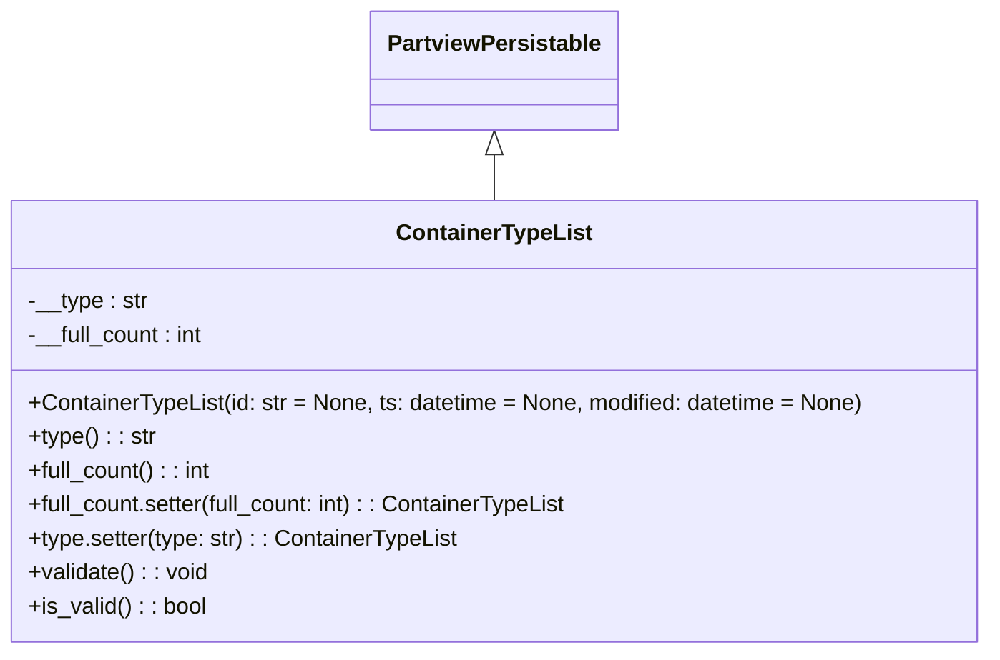

# Diagram: application_service/container_tracking_app_service/core/datamodel/ContainerTypeList.py

> Auto-generated by Obscura crawlers

## Mermaid

### SVG

<svg id="container" width="701.078125" xmlns="http://www.w3.org/2000/svg" class="classDiagram" height="462" viewBox="0 0 701.078125 462" role="graphics-document document" aria-roledescription="class"><g><defs><marker id="container_class-aggregationStart" class="marker aggregation class" refX="18" refY="7" markerWidth="190" markerHeight="240" orient="auto"><path d="M 18,7 L9,13 L1,7 L9,1 Z"></path></marker></defs><defs><marker id="container_class-aggregationEnd" class="marker aggregation class" refX="1" refY="7" markerWidth="20" markerHeight="28" orient="auto"><path d="M 18,7 L9,13 L1,7 L9,1 Z"></path></marker></defs><defs><marker id="container_class-extensionStart" class="marker extension class" refX="18" refY="7" markerWidth="190" markerHeight="240" orient="auto"><path d="M 1,7 L18,13 V 1 Z"></path></marker></defs><defs><marker id="container_class-extensionEnd" class="marker extension class" refX="1" refY="7" markerWidth="20" markerHeight="28" orient="auto"><path d="M 1,1 V 13 L18,7 Z"></path></marker></defs><defs><marker id="container_class-compositionStart" class="marker composition class" refX="18" refY="7" markerWidth="190" markerHeight="240" orient="auto"><path d="M 18,7 L9,13 L1,7 L9,1 Z"></path></marker></defs><defs><marker id="container_class-compositionEnd" class="marker composition class" refX="1" refY="7" markerWidth="20" markerHeight="28" orient="auto"><path d="M 18,7 L9,13 L1,7 L9,1 Z"></path></marker></defs><defs><marker id="container_class-dependencyStart" class="marker dependency class" refX="6" refY="7" markerWidth="190" markerHeight="240" orient="auto"><path d="M 5,7 L9,13 L1,7 L9,1 Z"></path></marker></defs><defs><marker id="container_class-dependencyEnd" class="marker dependency class" refX="13" refY="7" markerWidth="20" markerHeight="28" orient="auto"><path d="M 18,7 L9,13 L14,7 L9,1 Z"></path></marker></defs><defs><marker id="container_class-lollipopStart" class="marker lollipop class" refX="13" refY="7" markerWidth="190" markerHeight="240" orient="auto"><circle stroke="black" fill="transparent" cx="7" cy="7" r="6"></circle></marker></defs><defs><marker id="container_class-lollipopEnd" class="marker lollipop class" refX="1" refY="7" markerWidth="190" markerHeight="240" orient="auto"><circle stroke="black" fill="transparent" cx="7" cy="7" r="6"></circle></marker></defs><g class="root"><g class="clusters"></g><g class="edgePaths"><path d="M350.539,109.25L350.539,110.542C350.539,111.833,350.539,114.417,350.539,119.875C350.539,125.333,350.539,133.667,350.539,137.833L350.539,142" id="id_PartviewPersistable_ContainerTypeList_1" class="edge-thickness-normal edge-pattern-solid relation" style=";;;" data-edge="true" data-et="edge" data-id="id_PartviewPersistable_ContainerTypeList_1" data-points="W3sieCI6MzUwLjUzOTA2MjUsInkiOjkyfSx7IngiOjM1MC41MzkwNjI1LCJ5IjoxMTd9LHsieCI6MzUwLjUzOTA2MjUsInkiOjE0Mn1d" marker-start="url(#container_class-extensionStart)"></path></g><g class="edgeLabels"><g class="edgeLabel"><g class="label" data-id="id_PartviewPersistable_ContainerTypeList_1" transform="translate(0, 0)"><foreignObject width="0" height="0">

</foreignObject></g></g></g><g class="nodes"><g class="node default" id="classId-PartviewPersistable-0" transform="translate(350.5390625, 50)"><g class="basic label-container"><path d="M-84.7734375 -42 L84.7734375 -42 L84.7734375 42 L-84.7734375 42" stroke="none" stroke-width="0" fill="#ECECFF" style=""></path><path d="M-84.7734375 -42 C-28.27921566413206 -42, 28.21500617173588 -42, 84.7734375 -42 M-84.7734375 -42 C-19.763371257226183 -42, 45.246694985547634 -42, 84.7734375 -42 M84.7734375 -42 C84.7734375 -17.87814586101012, 84.7734375 6.2437082779797635, 84.7734375 42 M84.7734375 -42 C84.7734375 -16.895287014869965, 84.7734375 8.209425970260071, 84.7734375 42 M84.7734375 42 C35.83730011274702 42, -13.098837274505954 42, -84.7734375 42 M84.7734375 42 C20.1359960653524 42, -44.5014453692952 42, -84.7734375 42 M-84.7734375 42 C-84.7734375 20.982141566319566, -84.7734375 -0.03571686736086832, -84.7734375 -42 M-84.7734375 42 C-84.7734375 11.2351450956232, -84.7734375 -19.5297098087536, -84.7734375 -42" stroke="#9370DB" stroke-width="1.3" fill="none" stroke-dasharray="0 0" style=""></path></g><g class="annotation-group text" transform="translate(0, -18)"></g><g class="label-group text" transform="translate(-72.7734375, -18)"><g class="label" style="font-weight: bolder" transform="translate(0,-12)"><foreignObject width="145.546875" height="24">

PartviewPersistable

</foreignObject></g></g><g class="members-group text" transform="translate(-72.7734375, 30)"></g><g class="methods-group text" transform="translate(-72.7734375, 60)"></g><g class="divider" style=""><path d="M-84.7734375 6 C-25.342487354726472 6, 34.088462790547055 6, 84.7734375 6 M-84.7734375 6 C-30.721959518748704 6, 23.32951846250259 6, 84.7734375 6" stroke="#9370DB" stroke-width="1.3" fill="none" stroke-dasharray="0 0" style=""></path></g><g class="divider" style=""><path d="M-84.7734375 24 C-31.609451232016674 24, 21.55453503596665 24, 84.7734375 24 M-84.7734375 24 C-17.662566365313154 24, 49.44830476937369 24, 84.7734375 24" stroke="#9370DB" stroke-width="1.3" fill="none" stroke-dasharray="0 0" style=""></path></g></g><g class="node default" id="classId-ContainerTypeList-1" transform="translate(350.5390625, 298)"><g class="basic label-container"><path d="M-342.5390625 -156 L342.5390625 -156 L342.5390625 156 L-342.5390625 156" stroke="none" stroke-width="0" fill="#ECECFF" style=""></path><path d="M-342.5390625 -156 C-182.97701193279252 -156, -23.414961365585043 -156, 342.5390625 -156 M-342.5390625 -156 C-111.9072144905704 -156, 118.7246335188592 -156, 342.5390625 -156 M342.5390625 -156 C342.5390625 -72.3548145410508, 342.5390625 11.2903709178984, 342.5390625 156 M342.5390625 -156 C342.5390625 -81.6077790038515, 342.5390625 -7.2155580077030095, 342.5390625 156 M342.5390625 156 C175.0276813675508 156, 7.516300235101596 156, -342.5390625 156 M342.5390625 156 C113.26301513377348 156, -116.01303223245304 156, -342.5390625 156 M-342.5390625 156 C-342.5390625 86.85467556862214, -342.5390625 17.709351137244283, -342.5390625 -156 M-342.5390625 156 C-342.5390625 55.81343813861042, -342.5390625 -44.373123722779155, -342.5390625 -156" stroke="#9370DB" stroke-width="1.3" fill="none" stroke-dasharray="0 0" style=""></path></g><g class="annotation-group text" transform="translate(0, -132)"></g><g class="label-group text" transform="translate(-66.25, -132)"><g class="label" style="font-weight: bolder" transform="translate(0,-12)"><foreignObject width="132.5" height="24">

ContainerTypeList

</foreignObject></g></g><g class="members-group text" transform="translate(-330.5390625, -84)"><g class="label" style="" transform="translate(0,-12)"><foreignObject width="84.875" height="24">

-__type : str

</foreignObject></g><g class="label" style="" transform="translate(0,12)"><foreignObject width="126.5" height="24">

-__full_count : int

</foreignObject></g></g><g class="methods-group text" transform="translate(-330.5390625, -12)"><g class="label" style="" transform="translate(0,-12)"><foreignObject width="594.828125" height="24">

+ContainerTypeList(id: str = None, ts: datetime = None, modified: datetime = None)

</foreignObject></g><g class="label" style="" transform="translate(0,12)"><foreignObject width="89.890625" height="24">

+type() : : str

</foreignObject></g><g class="label" style="" transform="translate(0,36)"><foreignObject width="131.375" height="24">

+full_count() : : int

</foreignObject></g><g class="label" style="" transform="translate(0,60)"><foreignObject width="389.03125" height="24">

+full_count.setter(full_count: int) : : ContainerTypeList

</foreignObject></g><g class="label" style="" transform="translate(0,84)"><foreignObject width="305.875" height="24">

+type.setter(type: str) : : ContainerTypeList

</foreignObject></g><g class="label" style="" transform="translate(0,108)"><foreignObject width="127.71875" height="24">

+validate() : : void

</foreignObject></g><g class="label" style="" transform="translate(0,132)"><foreignObject width="126.078125" height="24">

+is_valid() : : bool

</foreignObject></g></g><g class="divider" style=""><path d="M-342.5390625 -108 C-150.27094115399169 -108, 41.99718019201663 -108, 342.5390625 -108 M-342.5390625 -108 C-194.15787684022965 -108, -45.776691180459295 -108, 342.5390625 -108" stroke="#9370DB" stroke-width="1.3" fill="none" stroke-dasharray="0 0" style=""></path></g><g class="divider" style=""><path d="M-342.5390625 -36 C-192.04996599639293 -36, -41.560869492785855 -36, 342.5390625 -36 M-342.5390625 -36 C-201.41700345278574 -36, -60.29494440557147 -36, 342.5390625 -36" stroke="#9370DB" stroke-width="1.3" fill="none" stroke-dasharray="0 0" style=""></path></g></g></g></g></g></svg>
