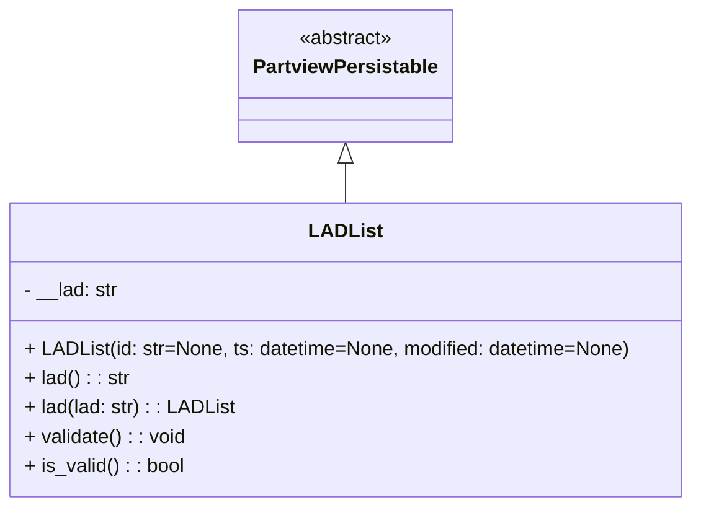

# Diagram: application_service/container_tracking_app_service/core/datamodel/LADList.py

> Auto-generated by Obscura crawlers

## Mermaid

### SVG

<svg id="container" width="564.1796875" xmlns="http://www.w3.org/2000/svg" class="classDiagram" height="414" viewBox="0 0 564.1796875 414" role="graphics-document document" aria-roledescription="class"><g><defs><marker id="container_class-aggregationStart" class="marker aggregation class" refX="18" refY="7" markerWidth="190" markerHeight="240" orient="auto"><path d="M 18,7 L9,13 L1,7 L9,1 Z"></path></marker></defs><defs><marker id="container_class-aggregationEnd" class="marker aggregation class" refX="1" refY="7" markerWidth="20" markerHeight="28" orient="auto"><path d="M 18,7 L9,13 L1,7 L9,1 Z"></path></marker></defs><defs><marker id="container_class-extensionStart" class="marker extension class" refX="18" refY="7" markerWidth="190" markerHeight="240" orient="auto"><path d="M 1,7 L18,13 V 1 Z"></path></marker></defs><defs><marker id="container_class-extensionEnd" class="marker extension class" refX="1" refY="7" markerWidth="20" markerHeight="28" orient="auto"><path d="M 1,1 V 13 L18,7 Z"></path></marker></defs><defs><marker id="container_class-compositionStart" class="marker composition class" refX="18" refY="7" markerWidth="190" markerHeight="240" orient="auto"><path d="M 18,7 L9,13 L1,7 L9,1 Z"></path></marker></defs><defs><marker id="container_class-compositionEnd" class="marker composition class" refX="1" refY="7" markerWidth="20" markerHeight="28" orient="auto"><path d="M 18,7 L9,13 L1,7 L9,1 Z"></path></marker></defs><defs><marker id="container_class-dependencyStart" class="marker dependency class" refX="6" refY="7" markerWidth="190" markerHeight="240" orient="auto"><path d="M 5,7 L9,13 L1,7 L9,1 Z"></path></marker></defs><defs><marker id="container_class-dependencyEnd" class="marker dependency class" refX="13" refY="7" markerWidth="20" markerHeight="28" orient="auto"><path d="M 18,7 L9,13 L14,7 L9,1 Z"></path></marker></defs><defs><marker id="container_class-lollipopStart" class="marker lollipop class" refX="13" refY="7" markerWidth="190" markerHeight="240" orient="auto"><circle stroke="black" fill="transparent" cx="7" cy="7" r="6"></circle></marker></defs><defs><marker id="container_class-lollipopEnd" class="marker lollipop class" refX="1" refY="7" markerWidth="190" markerHeight="240" orient="auto"><circle stroke="black" fill="transparent" cx="7" cy="7" r="6"></circle></marker></defs><g class="root"><g class="clusters"></g><g class="edgePaths"><path d="M282.09,133.25L282.09,134.542C282.09,135.833,282.09,138.417,282.09,143.875C282.09,149.333,282.09,157.667,282.09,161.833L282.09,166" id="id_PartviewPersistable_LADList_1" class="edge-thickness-normal edge-pattern-solid relation" style=";;;" data-edge="true" data-et="edge" data-id="id_PartviewPersistable_LADList_1" data-points="W3sieCI6MjgyLjA4OTg0Mzc1LCJ5IjoxMTZ9LHsieCI6MjgyLjA4OTg0Mzc1LCJ5IjoxNDF9LHsieCI6MjgyLjA4OTg0Mzc1LCJ5IjoxNjZ9XQ==" marker-start="url(#container_class-extensionStart)"></path></g><g class="edgeLabels"><g class="edgeLabel"><g class="label" data-id="id_PartviewPersistable_LADList_1" transform="translate(0, 0)"><foreignObject width="0" height="0">

</foreignObject></g></g></g><g class="nodes"><g class="node default" id="classId-PartviewPersistable-0" transform="translate(282.08984375, 62)"><g class="basic label-container"><path d="M-84.7734375 -54 L84.7734375 -54 L84.7734375 54 L-84.7734375 54" stroke="none" stroke-width="0" fill="#ECECFF" style=""></path><path d="M-84.7734375 -54 C-44.53197287801252 -54, -4.290508256025035 -54, 84.7734375 -54 M-84.7734375 -54 C-23.47090535259983 -54, 37.83162679480034 -54, 84.7734375 -54 M84.7734375 -54 C84.7734375 -27.73945356381641, 84.7734375 -1.478907127632823, 84.7734375 54 M84.7734375 -54 C84.7734375 -24.85552728200238, 84.7734375 4.288945435995238, 84.7734375 54 M84.7734375 54 C17.466090819820792 54, -49.841255860358416 54, -84.7734375 54 M84.7734375 54 C38.98664962735387 54, -6.80013824529226 54, -84.7734375 54 M-84.7734375 54 C-84.7734375 14.091918060870299, -84.7734375 -25.816163878259403, -84.7734375 -54 M-84.7734375 54 C-84.7734375 13.005870676274078, -84.7734375 -27.988258647451843, -84.7734375 -54" stroke="#9370DB" stroke-width="1.3" fill="none" stroke-dasharray="0 0" style=""></path></g><g class="annotation-group text" transform="translate(-38.609375, -30)"><g class="label" style="" transform="translate(0,-12)"><foreignObject width="77.21875" height="24">

«abstract»

</foreignObject></g></g><g class="label-group text" transform="translate(-72.7734375, -6)"><g class="label" style="font-weight: bolder" transform="translate(0,-12)"><foreignObject width="145.546875" height="24">

PartviewPersistable

</foreignObject></g></g><g class="members-group text" transform="translate(-72.7734375, 42)"></g><g class="methods-group text" transform="translate(-72.7734375, 72)"></g><g class="divider" style=""><path d="M-84.7734375 18 C-32.879983653192554 18, 19.013470193614893 18, 84.7734375 18 M-84.7734375 18 C-44.119824375057426 18, -3.4662112501148528 18, 84.7734375 18" stroke="#9370DB" stroke-width="1.3" fill="none" stroke-dasharray="0 0" style=""></path></g><g class="divider" style=""><path d="M-84.7734375 36 C-23.39223089546733 36, 37.98897570906534 36, 84.7734375 36 M-84.7734375 36 C-23.28873041702702 36, 38.19597666594596 36, 84.7734375 36" stroke="#9370DB" stroke-width="1.3" fill="none" stroke-dasharray="0 0" style=""></path></g></g><g class="node default" id="classId-LADList-1" transform="translate(282.08984375, 286)"><g class="basic label-container"><path d="M-274.08984375 -120 L274.08984375 -120 L274.08984375 120 L-274.08984375 120" stroke="none" stroke-width="0" fill="#ECECFF" style=""></path><path d="M-274.08984375 -120 C-162.81289941571038 -120, -51.535955081420724 -120, 274.08984375 -120 M-274.08984375 -120 C-93.74374896265391 -120, 86.60234582469218 -120, 274.08984375 -120 M274.08984375 -120 C274.08984375 -24.713161826648005, 274.08984375 70.57367634670399, 274.08984375 120 M274.08984375 -120 C274.08984375 -29.832866309964643, 274.08984375 60.33426738007071, 274.08984375 120 M274.08984375 120 C151.52815006815734 120, 28.96645638631466 120, -274.08984375 120 M274.08984375 120 C109.00074051763755 120, -56.088362714724894 120, -274.08984375 120 M-274.08984375 120 C-274.08984375 24.349912530121387, -274.08984375 -71.30017493975723, -274.08984375 -120 M-274.08984375 120 C-274.08984375 61.30006111069512, -274.08984375 2.6001222213902366, -274.08984375 -120" stroke="#9370DB" stroke-width="1.3" fill="none" stroke-dasharray="0 0" style=""></path></g><g class="annotation-group text" transform="translate(0, -96)"></g><g class="label-group text" transform="translate(-27.3515625, -96)"><g class="label" style="font-weight: bolder" transform="translate(0,-12)"><foreignObject width="54.703125" height="24">

LADList

</foreignObject></g></g><g class="members-group text" transform="translate(-262.08984375, -48)"><g class="label" style="" transform="translate(0,-12)"><foreignObject width="77.40625" height="24">

- __lad: str

</foreignObject></g></g><g class="methods-group text" transform="translate(-262.08984375, 0)"><g class="label" style="" transform="translate(0,-12)"><foreignObject width="496.828125" height="24">

+ LADList(id: str=None, ts: datetime=None, modified: datetime=None)

</foreignObject></g><g class="label" style="" transform="translate(0,12)"><foreignObject width="85.296875" height="24">

+ lad() : : str

</foreignObject></g><g class="label" style="" transform="translate(0,36)"><foreignObject width="169.4375" height="24">

+ lad(lad: str) : : LADList

</foreignObject></g><g class="label" style="" transform="translate(0,60)"><foreignObject width="132.125" height="24">

+ validate() : : void

</foreignObject></g><g class="label" style="" transform="translate(0,84)"><foreignObject width="130.3125" height="24">

+ is_valid() : : bool

</foreignObject></g></g><g class="divider" style=""><path d="M-274.08984375 -72 C-133.77725218913116 -72, 6.5353393717376775 -72, 274.08984375 -72 M-274.08984375 -72 C-93.92442516912666 -72, 86.24099341174667 -72, 274.08984375 -72" stroke="#9370DB" stroke-width="1.3" fill="none" stroke-dasharray="0 0" style=""></path></g><g class="divider" style=""><path d="M-274.08984375 -24 C-121.86908738568744 -24, 30.351668978625128 -24, 274.08984375 -24 M-274.08984375 -24 C-95.19119612010317 -24, 83.70745150979366 -24, 274.08984375 -24" stroke="#9370DB" stroke-width="1.3" fill="none" stroke-dasharray="0 0" style=""></path></g></g></g></g></g></svg>
