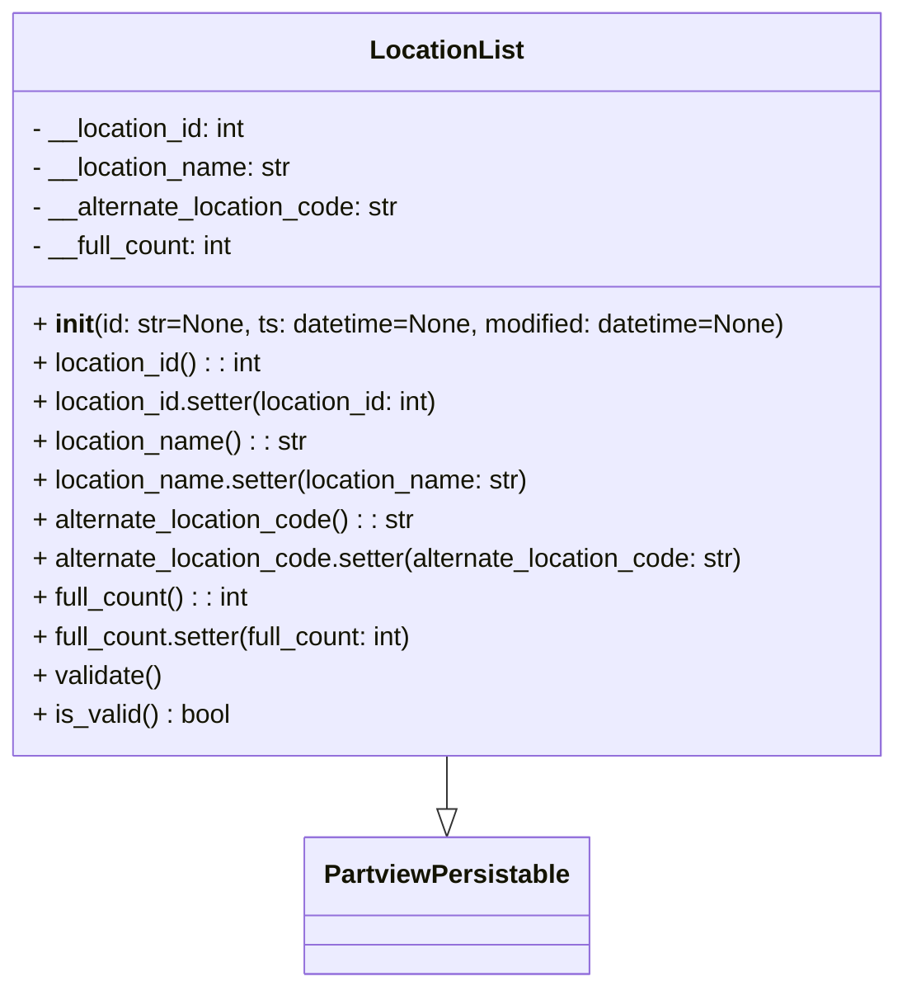

# Diagram: application_service/container_tracking_app_service/core/datamodel/LocationList.py


> Auto-generated by Obscura crawlers

## Diagram 1



### SVG

<svg id="container" width="552.765625" xmlns="http://www.w3.org/2000/svg" class="classDiagram" height="606" viewBox="0 0 552.765625 606" role="graphics-document document" aria-roledescription="class"><style>#container{font-family:"trebuchet ms",verdana,arial,sans-serif;font-size:16px;fill:#333;}@keyframes edge-animation-frame{from{stroke-dashoffset:0;}}@keyframes dash{to{stroke-dashoffset:0;}}#container .edge-animation-slow{stroke-dasharray:9,5!important;stroke-dashoffset:900;animation:dash 50s linear infinite;stroke-linecap:round;}#container .edge-animation-fast{stroke-dasharray:9,5!important;stroke-dashoffset:900;animation:dash 20s linear infinite;stroke-linecap:round;}#container .error-icon{fill:#552222;}#container .error-text{fill:#552222;stroke:#552222;}#container .edge-thickness-normal{stroke-width:1px;}#container .edge-thickness-thick{stroke-width:3.5px;}#container .edge-pattern-solid{stroke-dasharray:0;}#container .edge-thickness-invisible{stroke-width:0;fill:none;}#container .edge-pattern-dashed{stroke-dasharray:3;}#container .edge-pattern-dotted{stroke-dasharray:2;}#container .marker{fill:#333333;stroke:#333333;}#container .marker.cross{stroke:#333333;}#container svg{font-family:"trebuchet ms",verdana,arial,sans-serif;font-size:16px;}#container p{margin:0;}#container g.classGroup text{fill:#9370DB;stroke:none;font-family:"trebuchet ms",verdana,arial,sans-serif;font-size:10px;}#container g.classGroup text .title{font-weight:bolder;}#container .nodeLabel,#container .edgeLabel{color:#131300;}#container .edgeLabel .label rect{fill:#ECECFF;}#container .label text{fill:#131300;}#container .labelBkg{background:#ECECFF;}#container .edgeLabel .label span{background:#ECECFF;}#container .classTitle{font-weight:bolder;}#container .node rect,#container .node circle,#container .node ellipse,#container .node polygon,#container .node path{fill:#ECECFF;stroke:#9370DB;stroke-width:1px;}#container .divider{stroke:#9370DB;stroke-width:1;}#container g.clickable{cursor:pointer;}#container g.classGroup rect{fill:#ECECFF;stroke:#9370DB;}#container g.classGroup line{stroke:#9370DB;stroke-width:1;}#container .classLabel .box{stroke:none;stroke-width:0;fill:#ECECFF;opacity:0.5;}#container .classLabel .label{fill:#9370DB;font-size:10px;}#container .relation{stroke:#333333;stroke-width:1;fill:none;}#container .dashed-line{stroke-dasharray:3;}#container .dotted-line{stroke-dasharray:1 2;}#container #compositionStart,#container .composition{fill:#333333!important;stroke:#333333!important;stroke-width:1;}#container #compositionEnd,#container .composition{fill:#333333!important;stroke:#333333!important;stroke-width:1;}#container #dependencyStart,#container .dependency{fill:#333333!important;stroke:#333333!important;stroke-width:1;}#container #dependencyStart,#container .dependency{fill:#333333!important;stroke:#333333!important;stroke-width:1;}#container #extensionStart,#container .extension{fill:transparent!important;stroke:#333333!important;stroke-width:1;}#container #extensionEnd,#container .extension{fill:transparent!important;stroke:#333333!important;stroke-width:1;}#container #aggregationStart,#container .aggregation{fill:transparent!important;stroke:#333333!important;stroke-width:1;}#container #aggregationEnd,#container .aggregation{fill:transparent!important;stroke:#333333!important;stroke-width:1;}#container #lollipopStart,#container .lollipop{fill:#ECECFF!important;stroke:#333333!important;stroke-width:1;}#container #lollipopEnd,#container .lollipop{fill:#ECECFF!important;stroke:#333333!important;stroke-width:1;}#container .edgeTerminals{font-size:11px;line-height:initial;}#container .classTitleText{text-anchor:middle;font-size:18px;fill:#333;}#container .label-icon{display:inline-block;height:1em;overflow:visible;vertical-align:-0.125em;}#container .node .label-icon path{fill:currentColor;stroke:revert;stroke-width:revert;}#container :root{--mermaid-font-family:"trebuchet ms",verdana,arial,sans-serif;}</style><g><defs><marker id="container_class-aggregationStart" class="marker aggregation class" refX="18" refY="7" markerWidth="190" markerHeight="240" orient="auto"><path d="M 18,7 L9,13 L1,7 L9,1 Z"></path></marker></defs><defs><marker id="container_class-aggregationEnd" class="marker aggregation class" refX="1" refY="7" markerWidth="20" markerHeight="28" orient="auto"><path d="M 18,7 L9,13 L1,7 L9,1 Z"></path></marker></defs><defs><marker id="container_class-extensionStart" class="marker extension class" refX="18" refY="7" markerWidth="190" markerHeight="240" orient="auto"><path d="M 1,7 L18,13 V 1 Z"></path></marker></defs><defs><marker id="container_class-extensionEnd" class="marker extension class" refX="1" refY="7" markerWidth="20" markerHeight="28" orient="auto"><path d="M 1,1 V 13 L18,7 Z"></path></marker></defs><defs><marker id="container_class-compositionStart" class="marker composition class" refX="18" refY="7" markerWidth="190" markerHeight="240" orient="auto"><path d="M 18,7 L9,13 L1,7 L9,1 Z"></path></marker></defs><defs><marker id="container_class-compositionEnd" class="marker composition class" refX="1" refY="7" markerWidth="20" markerHeight="28" orient="auto"><path d="M 18,7 L9,13 L1,7 L9,1 Z"></path></marker></defs><defs><marker id="container_class-dependencyStart" class="marker dependency class" refX="6" refY="7" markerWidth="190" markerHeight="240" orient="auto"><path d="M 5,7 L9,13 L1,7 L9,1 Z"></path></marker></defs><defs><marker id="container_class-dependencyEnd" class="marker dependency class" refX="13" refY="7" markerWidth="20" markerHeight="28" orient="auto"><path d="M 18,7 L9,13 L14,7 L9,1 Z"></path></marker></defs><defs><marker id="container_class-lollipopStart" class="marker lollipop class" refX="13" refY="7" markerWidth="190" markerHeight="240" orient="auto"><circle stroke="black" fill="transparent" cx="7" cy="7" r="6"></circle></marker></defs><defs><marker id="container_class-lollipopEnd" class="marker lollipop class" refX="1" refY="7" markerWidth="190" markerHeight="240" orient="auto"><circle stroke="black" fill="transparent" cx="7" cy="7" r="6"></circle></marker></defs><g class="root"><g class="clusters"></g><g class="edgePaths"><path d="M276.383,464L276.383,468.167C276.383,472.333,276.383,480.667,276.383,486.125C276.383,491.583,276.383,494.167,276.383,495.458L276.383,496.75" id="id_LocationList_PartviewPersistable_1" class="edge-thickness-normal edge-pattern-solid relation" style=";;;" data-edge="true" data-et="edge" data-id="id_LocationList_PartviewPersistable_1" data-points="W3sieCI6Mjc2LjM4MjgxMjUsInkiOjQ2NH0seyJ4IjoyNzYuMzgyODEyNSwieSI6NDg5fSx7IngiOjI3Ni4zODI4MTI1LCJ5Ijo1MTR9XQ==" marker-end="url(#container_class-extensionEnd)"></path></g><g class="edgeLabels"><g class="edgeLabel"><g class="label" data-id="id_LocationList_PartviewPersistable_1" transform="translate(0, 0)"><foreignObject width="0" height="0"><div xmlns="http://www.w3.org/1999/xhtml" class="labelBkg" style="display: table-cell; white-space: nowrap; line-height: 1.5; max-width: 200px; text-align: center;"><span class="edgeLabel"></span></div></foreignObject></g></g></g><g class="nodes"><g class="node default" id="classId-PartviewPersistable-0" transform="translate(276.3828125, 556)"><g class="basic label-container"><path d="M-84.7734375 -42 L84.7734375 -42 L84.7734375 42 L-84.7734375 42" stroke="none" stroke-width="0" fill="#ECECFF" style=""></path><path d="M-84.7734375 -42 C-38.5686957794409 -42, 7.636045941118198 -42, 84.7734375 -42 M-84.7734375 -42 C-28.00654441089251 -42, 28.76034867821498 -42, 84.7734375 -42 M84.7734375 -42 C84.7734375 -12.010601556058827, 84.7734375 17.978796887882346, 84.7734375 42 M84.7734375 -42 C84.7734375 -18.816735612677604, 84.7734375 4.366528774644792, 84.7734375 42 M84.7734375 42 C29.829557536292356 42, -25.11432242741529 42, -84.7734375 42 M84.7734375 42 C47.36841267275146 42, 9.963387845502922 42, -84.7734375 42 M-84.7734375 42 C-84.7734375 22.594149680463918, -84.7734375 3.188299360927836, -84.7734375 -42 M-84.7734375 42 C-84.7734375 22.99933547320793, -84.7734375 3.9986709464158565, -84.7734375 -42" stroke="#9370DB" stroke-width="1.3" fill="none" stroke-dasharray="0 0" style=""></path></g><g class="annotation-group text" transform="translate(0, -18)"></g><g class="label-group text" transform="translate(-72.7734375, -18)"><g class="label" style="font-weight: bolder" transform="translate(0,-12)"><foreignObject width="145.546875" height="24"><div xmlns="http://www.w3.org/1999/xhtml" style="display: table-cell; white-space: nowrap; line-height: 1.5; max-width: 192px; text-align: center;"><span class="nodeLabel markdown-node-label" style=""><p>PartviewPersistable</p></span></div></foreignObject></g></g><g class="members-group text" transform="translate(-72.7734375, 30)"></g><g class="methods-group text" transform="translate(-72.7734375, 60)"></g><g class="divider" style=""><path d="M-84.7734375 6 C-42.58955433472625 6, -0.4056711694525035 6, 84.7734375 6 M-84.7734375 6 C-50.505070269909645 6, -16.23670303981929 6, 84.7734375 6" stroke="#9370DB" stroke-width="1.3" fill="none" stroke-dasharray="0 0" style=""></path></g><g class="divider" style=""><path d="M-84.7734375 24 C-20.837640831108146 24, 43.09815583778371 24, 84.7734375 24 M-84.7734375 24 C-45.08816487500371 24, -5.402892250007426 24, 84.7734375 24" stroke="#9370DB" stroke-width="1.3" fill="none" stroke-dasharray="0 0" style=""></path></g></g><g class="node default" id="classId-LocationList-1" transform="translate(276.3828125, 236)"><g class="basic label-container"><path d="M-268.3828125 -228 L268.3828125 -228 L268.3828125 228 L-268.3828125 228" stroke="none" stroke-width="0" fill="#ECECFF" style=""></path><path d="M-268.3828125 -228 C-53.96772375693672 -228, 160.44736498612656 -228, 268.3828125 -228 M-268.3828125 -228 C-96.53658216046736 -228, 75.30964817906528 -228, 268.3828125 -228 M268.3828125 -228 C268.3828125 -83.60939233043578, 268.3828125 60.78121533912844, 268.3828125 228 M268.3828125 -228 C268.3828125 -134.70118590631716, 268.3828125 -41.40237181263433, 268.3828125 228 M268.3828125 228 C156.7667487358489 228, 45.150684971697785 228, -268.3828125 228 M268.3828125 228 C108.80643879371772 228, -50.769934912564565 228, -268.3828125 228 M-268.3828125 228 C-268.3828125 48.728870465261025, -268.3828125 -130.54225906947795, -268.3828125 -228 M-268.3828125 228 C-268.3828125 94.85916933497057, -268.3828125 -38.28166133005885, -268.3828125 -228" stroke="#9370DB" stroke-width="1.3" fill="none" stroke-dasharray="0 0" style=""></path></g><g class="annotation-group text" transform="translate(0, -204)"></g><g class="label-group text" transform="translate(-44.65625, -204)"><g class="label" style="font-weight: bolder" transform="translate(0,-12)"><foreignObject width="89.3125" height="24"><div xmlns="http://www.w3.org/1999/xhtml" style="display: table-cell; white-space: nowrap; line-height: 1.5; max-width: 138px; text-align: center;"><span class="nodeLabel markdown-node-label" style=""><p>LocationList</p></span></div></foreignObject></g></g><g class="members-group text" transform="translate(-256.3828125, -156)"><g class="label" style="" transform="translate(0,-12)"><foreignObject width="136.3125" height="24"><div xmlns="http://www.w3.org/1999/xhtml" style="display: table-cell; white-space: nowrap; line-height: 1.5; max-width: 194px; text-align: center;"><span class="nodeLabel markdown-node-label" style=""><p>- __location_id: int</p></span></div></foreignObject></g><g class="label" style="" transform="translate(0,12)"><foreignObject width="162.5" height="24"><div xmlns="http://www.w3.org/1999/xhtml" style="display: table-cell; white-space: nowrap; line-height: 1.5; max-width: 221px; text-align: center;"><span class="nodeLabel markdown-node-label" style=""><p>- __location_name: str</p></span></div></foreignObject></g><g class="label" style="" transform="translate(0,36)"><foreignObject width="230.3125" height="24"><div xmlns="http://www.w3.org/1999/xhtml" style="display: table-cell; white-space: nowrap; line-height: 1.5; max-width: 288px; text-align: center;"><span class="nodeLabel markdown-node-label" style=""><p>- __alternate_location_code: str</p></span></div></foreignObject></g><g class="label" style="" transform="translate(0,60)"><foreignObject width="127.84375" height="24"><div xmlns="http://www.w3.org/1999/xhtml" style="display: table-cell; white-space: nowrap; line-height: 1.5; max-width: 185px; text-align: center;"><span class="nodeLabel markdown-node-label" style=""><p>- __full_count: int</p></span></div></foreignObject></g></g><g class="methods-group text" transform="translate(-256.3828125, -36)"><g class="label" style="" transform="translate(0,-12)"><foreignObject width="468.109375" height="24"><div xmlns="http://www.w3.org/1999/xhtml" style="display: table-cell; white-space: nowrap; line-height: 1.5; max-width: 558px; text-align: center;"><span class="nodeLabel markdown-node-label" style=""><p>+ <strong>init</strong>(id: str=None, ts: datetime=None, modified: datetime=None)</p></span></div></foreignObject></g><g class="label" style="" transform="translate(0,12)"><foreignObject width="144.21875" height="24"><div xmlns="http://www.w3.org/1999/xhtml" style="display: table-cell; white-space: nowrap; line-height: 1.5; max-width: 202px; text-align: center;"><span class="nodeLabel markdown-node-label" style=""><p>+ location_id() : : int</p></span></div></foreignObject></g><g class="label" style="" transform="translate(0,36)"><foreignObject width="259.75" height="24"><div xmlns="http://www.w3.org/1999/xhtml" style="display: table-cell; white-space: nowrap; line-height: 1.5; max-width: 317px; text-align: center;"><span class="nodeLabel markdown-node-label" style=""><p>+ location_id.setter(location_id: int)</p></span></div></foreignObject></g><g class="label" style="" transform="translate(0,60)"><foreignObject width="170.40625" height="24"><div xmlns="http://www.w3.org/1999/xhtml" style="display: table-cell; white-space: nowrap; line-height: 1.5; max-width: 229px; text-align: center;"><span class="nodeLabel markdown-node-label" style=""><p>+ location_name() : : str</p></span></div></foreignObject></g><g class="label" style="" transform="translate(0,84)"><foreignObject width="312.21875" height="24"><div xmlns="http://www.w3.org/1999/xhtml" style="display: table-cell; white-space: nowrap; line-height: 1.5; max-width: 370px; text-align: center;"><span class="nodeLabel markdown-node-label" style=""><p>+ location_name.setter(location_name: str)</p></span></div></foreignObject></g><g class="label" style="" transform="translate(0,108)"><foreignObject width="238.375" height="24"><div xmlns="http://www.w3.org/1999/xhtml" style="display: table-cell; white-space: nowrap; line-height: 1.5; max-width: 297px; text-align: center;"><span class="nodeLabel markdown-node-label" style=""><p>+ alternate_location_code() : : str</p></span></div></foreignObject></g><g class="label" style="" transform="translate(0,132)"><foreignObject width="448.15625" height="24"><div xmlns="http://www.w3.org/1999/xhtml" style="display: table-cell; white-space: nowrap; line-height: 1.5; max-width: 506px; text-align: center;"><span class="nodeLabel markdown-node-label" style=""><p>+ alternate_location_code.setter(alternate_location_code: str)</p></span></div></foreignObject></g><g class="label" style="" transform="translate(0,156)"><foreignObject width="135.84375" height="24"><div xmlns="http://www.w3.org/1999/xhtml" style="display: table-cell; white-space: nowrap; line-height: 1.5; max-width: 193px; text-align: center;"><span class="nodeLabel markdown-node-label" style=""><p>+ full_count() : : int</p></span></div></foreignObject></g><g class="label" style="" transform="translate(0,180)"><foreignObject width="243.140625" height="24"><div xmlns="http://www.w3.org/1999/xhtml" style="display: table-cell; white-space: nowrap; line-height: 1.5; max-width: 301px; text-align: center;"><span class="nodeLabel markdown-node-label" style=""><p>+ full_count.setter(full_count: int)</p></span></div></foreignObject></g><g class="label" style="" transform="translate(0,204)"><foreignObject width="80.484375" height="24"><div xmlns="http://www.w3.org/1999/xhtml" style="display: table-cell; white-space: nowrap; line-height: 1.5; max-width: 138px; text-align: center;"><span class="nodeLabel markdown-node-label" style=""><p>+ validate()</p></span></div></foreignObject></g><g class="label" style="" transform="translate(0,228)"><foreignObject width="122.234375" height="24"><div xmlns="http://www.w3.org/1999/xhtml" style="display: table-cell; white-space: nowrap; line-height: 1.5; max-width: 180px; text-align: center;"><span class="nodeLabel markdown-node-label" style=""><p>+ is_valid() : bool</p></span></div></foreignObject></g></g><g class="divider" style=""><path d="M-268.3828125 -180 C-119.18648080513995 -180, 30.0098508897201 -180, 268.3828125 -180 M-268.3828125 -180 C-71.94587720549828 -180, 124.49105808900345 -180, 268.3828125 -180" stroke="#9370DB" stroke-width="1.3" fill="none" stroke-dasharray="0 0" style=""></path></g><g class="divider" style=""><path d="M-268.3828125 -60 C-131.43822485663696 -60, 5.506362786726072 -60, 268.3828125 -60 M-268.3828125 -60 C-160.97789326804667 -60, -53.57297403609337 -60, 268.3828125 -60" stroke="#9370DB" stroke-width="1.3" fill="none" stroke-dasharray="0 0" style=""></path></g></g></g></g></g></svg>

## Diagram 2

```mermaid
flowchart TD
  FC_Set[call full_count.setter(value)] --> FC_CheckType{value is None or int?}
  FC_CheckType -- yes --> FC_CheckDiff{value != __full_count?}
  FC_CheckDiff -- yes --> FC_Assign[set __full_count = value]
  FC_CheckDiff -- no --> FC_Return[return self]
  FC_CheckType -- no --> FC_AssertErr1[raise AssertionError]

  ID_Set[call location_id.setter(value)] --> ID_CheckType{value is None or int?}
  ID_CheckType -- yes --> ID_CheckDiff{value != __location_id?}
  ID_CheckDiff -- yes --> ID_Assign[set __location_id = value]
  ID_CheckDiff -- no --> ID_Return[return self]
  ID_CheckType -- no --> ID_AssertErr[raise AssertionError]

  Name_Set[call location_name.setter(value)] --> Name_CheckType{value is None or str?}
  Name_CheckType -- yes --> Name_CheckDiff{value != __location_name?}
  Name_CheckDiff -- yes --> Name_Assign[set __location_name = value]
  Name_CheckDiff -- no --> Name_Return[return self]
  Name_CheckType -- no --> Name_AssertErr[raise AssertionError]

  Alt_Set[call alternate_location_code.setter(value)] --> Alt_CheckType{value is None or str?}
  Alt_CheckType -- yes --> Alt_CheckDiff{value != __alternate_location_code?}
  Alt_CheckDiff -- yes --> Alt_Assign[set __alternate_location_code = value]
  Alt_CheckDiff -- no --> Alt_Return[return self]
  Alt_CheckType -- no --> Alt_AssertErr[raise AssertionError]

  Validate[call validate()] --> V1{__location_id is None or int?}
  V1 -- yes --> V2{__location_name is None or str?}
  V2 -- yes --> V3{__alternate_location_code is None or str?}
  V3 -- yes --> V_OK[validation passes]
  V1 -- no --> V_Err[raise AssertionError]
  V2 -- no --> V_Err
  V3 -- no --> V_Err

  IsValid[call is_valid()] --> TryBlock[start try]
  TryBlock --> C1{isinstance(__location_id, int)?}
  C1 -- yes --> C2{isinstance(__alternate_location_code, str)?}
  C2 -- yes --> C3{isinstance(__location_name, str)?}
  C3 -- yes --> C4{isinstance(__full_count, str)?}
  C4 -- yes --> RetTrue[return True]
  C1 -- no --> ExceptFlow[except -> return False]
  C2 -- no --> ExceptFlow
  C3 -- no --> ExceptFlow
  C4 -- no --> ExceptFlow
  ExceptFlow --> RetFalse[return False]
```

> SVG rendering failed for this diagram.
