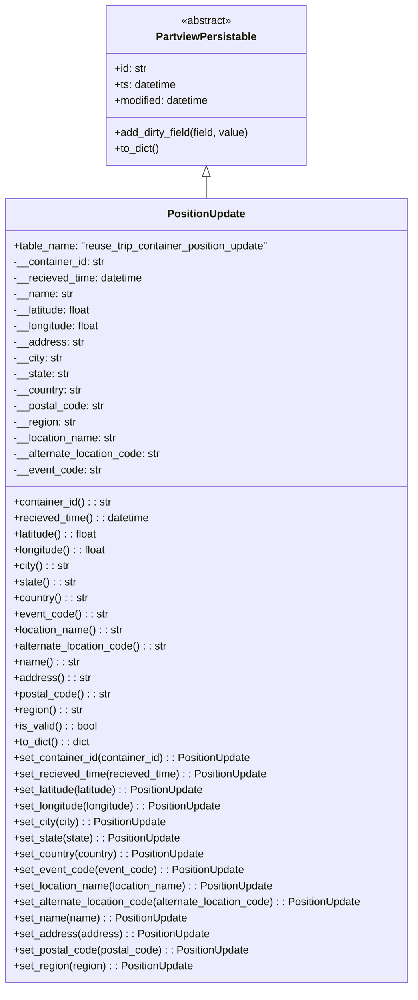

# Diagram: application_service/container_tracking_app_service/core/datamodel/PositionUpdate.py

> Auto-generated by Obscura crawlers

## Mermaid

### SVG

<svg id="container" width="628.921875" xmlns="http://www.w3.org/2000/svg" class="classDiagram" height="1482" viewBox="0 0 628.921875 1482" role="graphics-document document" aria-roledescription="class"><g><defs><marker id="container_class-aggregationStart" class="marker aggregation class" refX="18" refY="7" markerWidth="190" markerHeight="240" orient="auto"><path d="M 18,7 L9,13 L1,7 L9,1 Z"></path></marker></defs><defs><marker id="container_class-aggregationEnd" class="marker aggregation class" refX="1" refY="7" markerWidth="20" markerHeight="28" orient="auto"><path d="M 18,7 L9,13 L1,7 L9,1 Z"></path></marker></defs><defs><marker id="container_class-extensionStart" class="marker extension class" refX="18" refY="7" markerWidth="190" markerHeight="240" orient="auto"><path d="M 1,7 L18,13 V 1 Z"></path></marker></defs><defs><marker id="container_class-extensionEnd" class="marker extension class" refX="1" refY="7" markerWidth="20" markerHeight="28" orient="auto"><path d="M 1,1 V 13 L18,7 Z"></path></marker></defs><defs><marker id="container_class-compositionStart" class="marker composition class" refX="18" refY="7" markerWidth="190" markerHeight="240" orient="auto"><path d="M 18,7 L9,13 L1,7 L9,1 Z"></path></marker></defs><defs><marker id="container_class-compositionEnd" class="marker composition class" refX="1" refY="7" markerWidth="20" markerHeight="28" orient="auto"><path d="M 18,7 L9,13 L1,7 L9,1 Z"></path></marker></defs><defs><marker id="container_class-dependencyStart" class="marker dependency class" refX="6" refY="7" markerWidth="190" markerHeight="240" orient="auto"><path d="M 5,7 L9,13 L1,7 L9,1 Z"></path></marker></defs><defs><marker id="container_class-dependencyEnd" class="marker dependency class" refX="13" refY="7" markerWidth="20" markerHeight="28" orient="auto"><path d="M 18,7 L9,13 L14,7 L9,1 Z"></path></marker></defs><defs><marker id="container_class-lollipopStart" class="marker lollipop class" refX="13" refY="7" markerWidth="190" markerHeight="240" orient="auto"><circle stroke="black" fill="transparent" cx="7" cy="7" r="6"></circle></marker></defs><defs><marker id="container_class-lollipopEnd" class="marker lollipop class" refX="1" refY="7" markerWidth="190" markerHeight="240" orient="auto"><circle stroke="black" fill="transparent" cx="7" cy="7" r="6"></circle></marker></defs><g class="root"><g class="clusters"></g><g class="edgePaths"><path d="M314.461,265.25L314.461,266.542C314.461,267.833,314.461,270.417,314.461,275.875C314.461,281.333,314.461,289.667,314.461,293.833L314.461,298" id="id_PartviewPersistable_PositionUpdate_1" class="edge-thickness-normal edge-pattern-solid relation" style=";;;" data-edge="true" data-et="edge" data-id="id_PartviewPersistable_PositionUpdate_1" data-points="W3sieCI6MzE0LjQ2MDkzNzUsInkiOjI0OH0seyJ4IjozMTQuNDYwOTM3NSwieSI6MjczfSx7IngiOjMxNC40NjA5Mzc1LCJ5IjoyOTh9XQ==" marker-start="url(#container_class-extensionStart)"></path></g><g class="edgeLabels"><g class="edgeLabel"><g class="label" data-id="id_PartviewPersistable_PositionUpdate_1" transform="translate(0, 0)"><foreignObject width="0" height="0">

</foreignObject></g></g></g><g class="nodes"><g class="node default" id="classId-PartviewPersistable-0" transform="translate(314.4609375, 128)"><g class="basic label-container"><path d="M-151.61328125 -120 L151.61328125 -120 L151.61328125 120 L-151.61328125 120" stroke="none" stroke-width="0" fill="#ECECFF" style=""></path><path d="M-151.61328125 -120 C-55.529411920482616 -120, 40.55445740903477 -120, 151.61328125 -120 M-151.61328125 -120 C-38.74336039640825 -120, 74.1265604571835 -120, 151.61328125 -120 M151.61328125 -120 C151.61328125 -52.227300378653254, 151.61328125 15.545399242693492, 151.61328125 120 M151.61328125 -120 C151.61328125 -59.25014835877835, 151.61328125 1.4997032824433063, 151.61328125 120 M151.61328125 120 C79.75592240228798 120, 7.898563554575958 120, -151.61328125 120 M151.61328125 120 C42.15132826427944 120, -67.31062472144112 120, -151.61328125 120 M-151.61328125 120 C-151.61328125 62.785393150574144, -151.61328125 5.5707863011482885, -151.61328125 -120 M-151.61328125 120 C-151.61328125 27.902373803454083, -151.61328125 -64.19525239309183, -151.61328125 -120" stroke="#9370DB" stroke-width="1.3" fill="none" stroke-dasharray="0 0" style=""></path></g><g class="annotation-group text" transform="translate(-38.609375, -96)"><g class="label" style="" transform="translate(0,-12)"><foreignObject width="77.21875" height="24">

«abstract»

</foreignObject></g></g><g class="label-group text" transform="translate(-72.7734375, -72)"><g class="label" style="font-weight: bolder" transform="translate(0,-12)"><foreignObject width="145.546875" height="24">

PartviewPersistable

</foreignObject></g></g><g class="members-group text" transform="translate(-139.61328125, -24)"><g class="label" style="" transform="translate(0,-12)"><foreignObject width="49.578125" height="24">

+id: str

</foreignObject></g><g class="label" style="" transform="translate(0,12)"><foreignObject width="94.484375" height="24">

+ts: datetime

</foreignObject></g><g class="label" style="" transform="translate(0,36)"><foreignObject width="145.9375" height="24">

+modified: datetime

</foreignObject></g></g><g class="methods-group text" transform="translate(-139.61328125, 72)"><g class="label" style="" transform="translate(0,-12)"><foreignObject width="206.453125" height="24">

+add_dirty_field(field, value)

</foreignObject></g><g class="label" style="" transform="translate(0,12)"><foreignObject width="68.34375" height="24">

+to_dict()

</foreignObject></g></g><g class="divider" style=""><path d="M-151.61328125 -48 C-52.63215681967384 -48, 46.34896761065232 -48, 151.61328125 -48 M-151.61328125 -48 C-50.058536172963386 -48, 51.49620890407323 -48, 151.61328125 -48" stroke="#9370DB" stroke-width="1.3" fill="none" stroke-dasharray="0 0" style=""></path></g><g class="divider" style=""><path d="M-151.61328125 48 C-57.31362721782848 48, 36.986026814343035 48, 151.61328125 48 M-151.61328125 48 C-45.908579493147755 48, 59.79612226370449 48, 151.61328125 48" stroke="#9370DB" stroke-width="1.3" fill="none" stroke-dasharray="0 0" style=""></path></g></g><g class="node default" id="classId-PositionUpdate-1" transform="translate(314.4609375, 886)"><g class="basic label-container"><path d="M-306.4609375 -588 L306.4609375 -588 L306.4609375 588 L-306.4609375 588" stroke="none" stroke-width="0" fill="#ECECFF" style=""></path><path d="M-306.4609375 -588 C-117.50847168534258 -588, 71.44399412931483 -588, 306.4609375 -588 M-306.4609375 -588 C-102.38802347303007 -588, 101.68489055393985 -588, 306.4609375 -588 M306.4609375 -588 C306.4609375 -329.5052207363388, 306.4609375 -71.0104414726776, 306.4609375 588 M306.4609375 -588 C306.4609375 -191.24188777613819, 306.4609375 205.51622444772363, 306.4609375 588 M306.4609375 588 C73.89655802805683 588, -158.66782144388634 588, -306.4609375 588 M306.4609375 588 C98.63524934402366 588, -109.19043881195267 588, -306.4609375 588 M-306.4609375 588 C-306.4609375 118.36237935636501, -306.4609375 -351.27524128727, -306.4609375 -588 M-306.4609375 588 C-306.4609375 124.44846954314727, -306.4609375 -339.10306091370546, -306.4609375 -588" stroke="#9370DB" stroke-width="1.3" fill="none" stroke-dasharray="0 0" style=""></path></g><g class="annotation-group text" transform="translate(0, -564)"></g><g class="label-group text" transform="translate(-56.515625, -564)"><g class="label" style="font-weight: bolder" transform="translate(0,-12)"><foreignObject width="113.03125" height="24">

PositionUpdate

</foreignObject></g></g><g class="members-group text" transform="translate(-294.4609375, -516)"><g class="label" style="" transform="translate(0,-12)"><foreignObject width="390.984375" height="24">

+table_name: "reuse_trip_container_position_update"

</foreignObject></g><g class="label" style="" transform="translate(0,12)"><foreignObject width="139.15625" height="24">

-__container_id: str

</foreignObject></g><g class="label" style="" transform="translate(0,36)"><foreignObject width="197.03125" height="24">

-__recieved_time: datetime

</foreignObject></g><g class="label" style="" transform="translate(0,60)"><foreignObject width="89.671875" height="24">

-__name: str

</foreignObject></g><g class="label" style="" transform="translate(0,84)"><foreignObject width="119.609375" height="24">

-__latitude: float

</foreignObject></g><g class="label" style="" transform="translate(0,108)"><foreignObject width="132.171875" height="24">

-__longitude: float

</foreignObject></g><g class="label" style="" transform="translate(0,132)"><foreignObject width="105.875" height="24">

-__address: str

</foreignObject></g><g class="label" style="" transform="translate(0,156)"><foreignObject width="74.625" height="24">

-__city: str

</foreignObject></g><g class="label" style="" transform="translate(0,180)"><foreignObject width="85.25" height="24">

-__state: str

</foreignObject></g><g class="label" style="" transform="translate(0,204)"><foreignObject width="104.09375" height="24">

-__country: str

</foreignObject></g><g class="label" style="" transform="translate(0,228)"><foreignObject width="137.34375" height="24">

-__postal_code: str

</foreignObject></g><g class="label" style="" transform="translate(0,252)"><foreignObject width="95.125" height="24">

-__region: str

</foreignObject></g><g class="label" style="" transform="translate(0,276)"><foreignObject width="156.984375" height="24">

-__location_name: str

</foreignObject></g><g class="label" style="" transform="translate(0,300)"><foreignObject width="224.796875" height="24">

-__alternate_location_code: str

</foreignObject></g><g class="label" style="" transform="translate(0,324)"><foreignObject width="132.140625" height="24">

-__event_code: str

</foreignObject></g></g><g class="methods-group text" transform="translate(-294.4609375, -132)"><g class="label" style="" transform="translate(0,-12)"><foreignObject width="148.5" height="24">

+container_id() : : str

</foreignObject></g><g class="label" style="" transform="translate(0,12)"><foreignObject width="206.0625" height="24">

+recieved_time() : : datetime

</foreignObject></g><g class="label" style="" transform="translate(0,36)"><foreignObject width="128.796875" height="24">

+latitude() : : float

</foreignObject></g><g class="label" style="" transform="translate(0,60)"><foreignObject width="141.359375" height="24">

+longitude() : : float

</foreignObject></g><g class="label" style="" transform="translate(0,84)"><foreignObject width="83.90625" height="24">

+city() : : str

</foreignObject></g><g class="label" style="" transform="translate(0,108)"><foreignObject width="94.28125" height="24">

+state() : : str

</foreignObject></g><g class="label" style="" transform="translate(0,132)"><foreignObject width="113.375" height="24">

+country() : : str

</foreignObject></g><g class="label" style="" transform="translate(0,156)"><foreignObject width="141.484375" height="24">

+event_code() : : str

</foreignObject></g><g class="label" style="" transform="translate(0,180)"><foreignObject width="166.171875" height="24">

+location_name() : : str

</foreignObject></g><g class="label" style="" transform="translate(0,204)"><foreignObject width="233.890625" height="24">

+alternate_location_code() : : str

</foreignObject></g><g class="label" style="" transform="translate(0,228)"><foreignObject width="98.703125" height="24">

+name() : : str

</foreignObject></g><g class="label" style="" transform="translate(0,252)"><foreignObject width="114.984375" height="24">

+address() : : str

</foreignObject></g><g class="label" style="" transform="translate(0,276)"><foreignObject width="146.359375" height="24">

+postal_code() : : str

</foreignObject></g><g class="label" style="" transform="translate(0,300)"><foreignObject width="104.15625" height="24">

+region() : : str

</foreignObject></g><g class="label" style="" transform="translate(0,324)"><foreignObject width="126.078125" height="24">

+is_valid() : : bool

</foreignObject></g><g class="label" style="" transform="translate(0,348)"><foreignObject width="116.25" height="24">

+to_dict() : : dict

</foreignObject></g><g class="label" style="" transform="translate(0,372)"><foreignObject width="361.140625" height="24">

+set_container_id(container_id) : : PositionUpdate

</foreignObject></g><g class="label" style="" transform="translate(0,396)"><foreignObject width="384.921875" height="24">

+set_recieved_time(recieved_time) : : PositionUpdate

</foreignObject></g><g class="label" style="" transform="translate(0,420)"><foreignObject width="294.609375" height="24">

+set_latitude(latitude) : : PositionUpdate

</foreignObject></g><g class="label" style="" transform="translate(0,444)"><foreignObject width="319.734375" height="24">

+set_longitude(longitude) : : PositionUpdate

</foreignObject></g><g class="label" style="" transform="translate(0,468)"><foreignObject width="231.953125" height="24">

+set_city(city) : : PositionUpdate

</foreignObject></g><g class="label" style="" transform="translate(0,492)"><foreignObject width="253.015625" height="24">

+set_state(state) : : PositionUpdate

</foreignObject></g><g class="label" style="" transform="translate(0,516)"><foreignObject width="290.875" height="24">

+set_country(country) : : PositionUpdate

</foreignObject></g><g class="label" style="" transform="translate(0,540)"><foreignObject width="347.09375" height="24">

+set_event_code(event_code) : : PositionUpdate

</foreignObject></g><g class="label" style="" transform="translate(0,564)"><foreignObject width="396.625" height="24">

+set_location_name(location_name) : : PositionUpdate

</foreignObject></g><g class="label" style="" transform="translate(0,588)"><foreignObject width="532.40625" height="24">

+set_alternate_location_code(alternate_location_code) : : PositionUpdate

</foreignObject></g><g class="label" style="" transform="translate(0,612)"><foreignObject width="261.84375" height="24">

+set_name(name) : : PositionUpdate

</foreignObject></g><g class="label" style="" transform="translate(0,636)"><foreignObject width="294.578125" height="24">

+set_address(address) : : PositionUpdate

</foreignObject></g><g class="label" style="" transform="translate(0,660)"><foreignObject width="357.171875" height="24">

+set_postal_code(postal_code) : : PositionUpdate

</foreignObject></g><g class="label" style="" transform="translate(0,684)"><foreignObject width="272.765625" height="24">

+set_region(region) : : PositionUpdate

</foreignObject></g></g><g class="divider" style=""><path d="M-306.4609375 -540 C-135.06571090009763 -540, 36.329515699804745 -540, 306.4609375 -540 M-306.4609375 -540 C-149.53765636292766 -540, 7.385624774144674 -540, 306.4609375 -540" stroke="#9370DB" stroke-width="1.3" fill="none" stroke-dasharray="0 0" style=""></path></g><g class="divider" style=""><path d="M-306.4609375 -156 C-88.336789024643 -156, 129.787359450714 -156, 306.4609375 -156 M-306.4609375 -156 C-144.627411966941 -156, 17.206113566118006 -156, 306.4609375 -156" stroke="#9370DB" stroke-width="1.3" fill="none" stroke-dasharray="0 0" style=""></path></g></g></g></g></g></svg>
