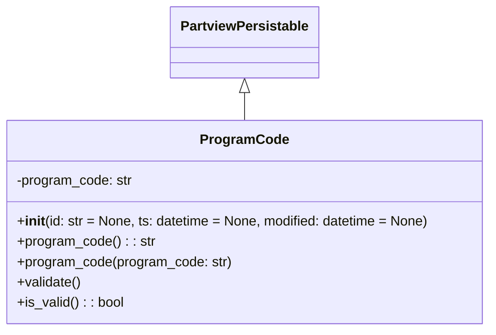

# Diagram: application_service/container_tracking_app_service/core/datamodel/ProgramCode.py

> Auto-generated by Obscura crawlers

## Mermaid

### SVG

<svg id="container" width="578.390625" xmlns="http://www.w3.org/2000/svg" class="classDiagram" height="390" viewBox="0 0 578.390625 390" role="graphics-document document" aria-roledescription="class"><g><defs><marker id="container_class-aggregationStart" class="marker aggregation class" refX="18" refY="7" markerWidth="190" markerHeight="240" orient="auto"><path d="M 18,7 L9,13 L1,7 L9,1 Z"></path></marker></defs><defs><marker id="container_class-aggregationEnd" class="marker aggregation class" refX="1" refY="7" markerWidth="20" markerHeight="28" orient="auto"><path d="M 18,7 L9,13 L1,7 L9,1 Z"></path></marker></defs><defs><marker id="container_class-extensionStart" class="marker extension class" refX="18" refY="7" markerWidth="190" markerHeight="240" orient="auto"><path d="M 1,7 L18,13 V 1 Z"></path></marker></defs><defs><marker id="container_class-extensionEnd" class="marker extension class" refX="1" refY="7" markerWidth="20" markerHeight="28" orient="auto"><path d="M 1,1 V 13 L18,7 Z"></path></marker></defs><defs><marker id="container_class-compositionStart" class="marker composition class" refX="18" refY="7" markerWidth="190" markerHeight="240" orient="auto"><path d="M 18,7 L9,13 L1,7 L9,1 Z"></path></marker></defs><defs><marker id="container_class-compositionEnd" class="marker composition class" refX="1" refY="7" markerWidth="20" markerHeight="28" orient="auto"><path d="M 18,7 L9,13 L1,7 L9,1 Z"></path></marker></defs><defs><marker id="container_class-dependencyStart" class="marker dependency class" refX="6" refY="7" markerWidth="190" markerHeight="240" orient="auto"><path d="M 5,7 L9,13 L1,7 L9,1 Z"></path></marker></defs><defs><marker id="container_class-dependencyEnd" class="marker dependency class" refX="13" refY="7" markerWidth="20" markerHeight="28" orient="auto"><path d="M 18,7 L9,13 L14,7 L9,1 Z"></path></marker></defs><defs><marker id="container_class-lollipopStart" class="marker lollipop class" refX="13" refY="7" markerWidth="190" markerHeight="240" orient="auto"><circle stroke="black" fill="transparent" cx="7" cy="7" r="6"></circle></marker></defs><defs><marker id="container_class-lollipopEnd" class="marker lollipop class" refX="1" refY="7" markerWidth="190" markerHeight="240" orient="auto"><circle stroke="black" fill="transparent" cx="7" cy="7" r="6"></circle></marker></defs><g class="root"><g class="clusters"></g><g class="edgePaths"><path d="M289.195,109.25L289.195,110.542C289.195,111.833,289.195,114.417,289.195,119.875C289.195,125.333,289.195,133.667,289.195,137.833L289.195,142" id="id_PartviewPersistable_ProgramCode_1" class="edge-thickness-normal edge-pattern-solid relation" style=";;;" data-edge="true" data-et="edge" data-id="id_PartviewPersistable_ProgramCode_1" data-points="W3sieCI6Mjg5LjE5NTMxMjUsInkiOjkyfSx7IngiOjI4OS4xOTUzMTI1LCJ5IjoxMTd9LHsieCI6Mjg5LjE5NTMxMjUsInkiOjE0Mn1d" marker-start="url(#container_class-extensionStart)"></path></g><g class="edgeLabels"><g class="edgeLabel"><g class="label" data-id="id_PartviewPersistable_ProgramCode_1" transform="translate(0, 0)"><foreignObject width="0" height="0">

</foreignObject></g></g></g><g class="nodes"><g class="node default" id="classId-PartviewPersistable-0" transform="translate(289.1953125, 50)"><g class="basic label-container"><path d="M-84.7734375 -42 L84.7734375 -42 L84.7734375 42 L-84.7734375 42" stroke="none" stroke-width="0" fill="#ECECFF" style=""></path><path d="M-84.7734375 -42 C-48.59323949864193 -42, -12.413041497283857 -42, 84.7734375 -42 M-84.7734375 -42 C-31.655716971775774 -42, 21.46200355644845 -42, 84.7734375 -42 M84.7734375 -42 C84.7734375 -23.321224112807055, 84.7734375 -4.64244822561411, 84.7734375 42 M84.7734375 -42 C84.7734375 -21.822115077227217, 84.7734375 -1.6442301544544335, 84.7734375 42 M84.7734375 42 C35.830453407514376 42, -13.112530684971247 42, -84.7734375 42 M84.7734375 42 C20.95069787783524 42, -42.87204174432952 42, -84.7734375 42 M-84.7734375 42 C-84.7734375 17.114452824877176, -84.7734375 -7.771094350245647, -84.7734375 -42 M-84.7734375 42 C-84.7734375 11.43939136014928, -84.7734375 -19.12121727970144, -84.7734375 -42" stroke="#9370DB" stroke-width="1.3" fill="none" stroke-dasharray="0 0" style=""></path></g><g class="annotation-group text" transform="translate(0, -18)"></g><g class="label-group text" transform="translate(-72.7734375, -18)"><g class="label" style="font-weight: bolder" transform="translate(0,-12)"><foreignObject width="145.546875" height="24">

PartviewPersistable

</foreignObject></g></g><g class="members-group text" transform="translate(-72.7734375, 30)"></g><g class="methods-group text" transform="translate(-72.7734375, 60)"></g><g class="divider" style=""><path d="M-84.7734375 6 C-27.146746861674032 6, 30.479943776651936 6, 84.7734375 6 M-84.7734375 6 C-27.03815329889204 6, 30.697130902215918 6, 84.7734375 6" stroke="#9370DB" stroke-width="1.3" fill="none" stroke-dasharray="0 0" style=""></path></g><g class="divider" style=""><path d="M-84.7734375 24 C-25.58849268999024 24, 33.59645212001952 24, 84.7734375 24 M-84.7734375 24 C-22.46097312317928 24, 39.85149125364144 24, 84.7734375 24" stroke="#9370DB" stroke-width="1.3" fill="none" stroke-dasharray="0 0" style=""></path></g></g><g class="node default" id="classId-ProgramCode-1" transform="translate(289.1953125, 262)"><g class="basic label-container"><path d="M-281.1953125 -120 L281.1953125 -120 L281.1953125 120 L-281.1953125 120" stroke="none" stroke-width="0" fill="#ECECFF" style=""></path><path d="M-281.1953125 -120 C-56.255459497174314 -120, 168.68439350565137 -120, 281.1953125 -120 M-281.1953125 -120 C-123.70962995762264 -120, 33.77605258475472 -120, 281.1953125 -120 M281.1953125 -120 C281.1953125 -70.93518711136002, 281.1953125 -21.870374222720045, 281.1953125 120 M281.1953125 -120 C281.1953125 -27.369524878532445, 281.1953125 65.26095024293511, 281.1953125 120 M281.1953125 120 C119.23580737231404 120, -42.723697755371916 120, -281.1953125 120 M281.1953125 120 C130.3497778760609 120, -20.495756747878204 120, -281.1953125 120 M-281.1953125 120 C-281.1953125 63.88958674921744, -281.1953125 7.779173498434886, -281.1953125 -120 M-281.1953125 120 C-281.1953125 69.89597604290466, -281.1953125 19.791952085809314, -281.1953125 -120" stroke="#9370DB" stroke-width="1.3" fill="none" stroke-dasharray="0 0" style=""></path></g><g class="annotation-group text" transform="translate(0, -96)"></g><g class="label-group text" transform="translate(-49.09375, -96)"><g class="label" style="font-weight: bolder" transform="translate(0,-12)"><foreignObject width="98.1875" height="24">

ProgramCode

</foreignObject></g></g><g class="members-group text" transform="translate(-269.1953125, -48)"><g class="label" style="" transform="translate(0,-12)"><foreignObject width="137.8125" height="24">

-program_code: str

</foreignObject></g></g><g class="methods-group text" transform="translate(-269.1953125, 0)"><g class="label" style="" transform="translate(0,-12)"><foreignObject width="489.296875" height="24">

+<strong>init</strong>(id: str = None, ts: datetime = None, modified: datetime = None)

</foreignObject></g><g class="label" style="" transform="translate(0,12)"><foreignObject width="162.046875" height="24">

+program_code() : : str

</foreignObject></g><g class="label" style="" transform="translate(0,36)"><foreignObject width="253.578125" height="24">

+program_code(program_code: str)

</foreignObject></g><g class="label" style="" transform="translate(0,60)"><foreignObject width="76.09375" height="24">

+validate()

</foreignObject></g><g class="label" style="" transform="translate(0,84)"><foreignObject width="126.078125" height="24">

+is_valid() : : bool

</foreignObject></g></g><g class="divider" style=""><path d="M-281.1953125 -72 C-98.53616195518003 -72, 84.12298858963993 -72, 281.1953125 -72 M-281.1953125 -72 C-61.669615460898655 -72, 157.8560815782027 -72, 281.1953125 -72" stroke="#9370DB" stroke-width="1.3" fill="none" stroke-dasharray="0 0" style=""></path></g><g class="divider" style=""><path d="M-281.1953125 -24 C-72.93589661112449 -24, 135.32351927775102 -24, 281.1953125 -24 M-281.1953125 -24 C-112.48705990740947 -24, 56.22119268518105 -24, 281.1953125 -24" stroke="#9370DB" stroke-width="1.3" fill="none" stroke-dasharray="0 0" style=""></path></g></g></g></g></g></svg>
