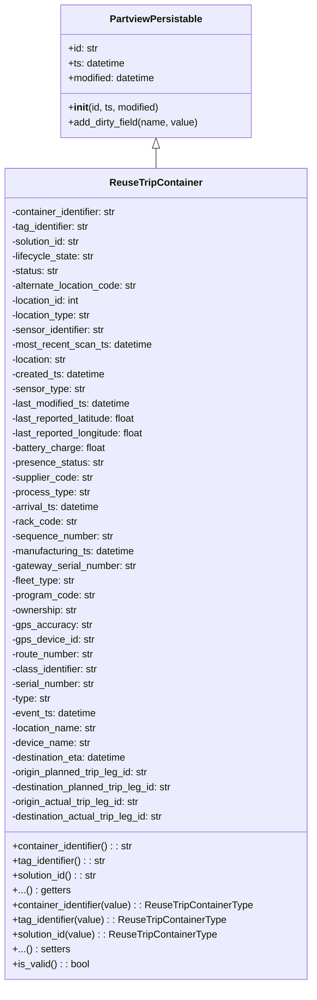

# Diagram: application_service/container_tracking_app_service/core/datamodel/ReuseTripContainer.py


> Auto-generated by Obscura crawlers

## Diagram 1



### SVG

<svg id="container" width="508.34375" xmlns="http://www.w3.org/2000/svg" class="classDiagram" height="1602" viewBox="0 0 508.34375 1602" role="graphics-document document" aria-roledescription="class"><style>#container{font-family:"trebuchet ms",verdana,arial,sans-serif;font-size:16px;fill:#333;}@keyframes edge-animation-frame{from{stroke-dashoffset:0;}}@keyframes dash{to{stroke-dashoffset:0;}}#container .edge-animation-slow{stroke-dasharray:9,5!important;stroke-dashoffset:900;animation:dash 50s linear infinite;stroke-linecap:round;}#container .edge-animation-fast{stroke-dasharray:9,5!important;stroke-dashoffset:900;animation:dash 20s linear infinite;stroke-linecap:round;}#container .error-icon{fill:#552222;}#container .error-text{fill:#552222;stroke:#552222;}#container .edge-thickness-normal{stroke-width:1px;}#container .edge-thickness-thick{stroke-width:3.5px;}#container .edge-pattern-solid{stroke-dasharray:0;}#container .edge-thickness-invisible{stroke-width:0;fill:none;}#container .edge-pattern-dashed{stroke-dasharray:3;}#container .edge-pattern-dotted{stroke-dasharray:2;}#container .marker{fill:#333333;stroke:#333333;}#container .marker.cross{stroke:#333333;}#container svg{font-family:"trebuchet ms",verdana,arial,sans-serif;font-size:16px;}#container p{margin:0;}#container g.classGroup text{fill:#9370DB;stroke:none;font-family:"trebuchet ms",verdana,arial,sans-serif;font-size:10px;}#container g.classGroup text .title{font-weight:bolder;}#container .nodeLabel,#container .edgeLabel{color:#131300;}#container .edgeLabel .label rect{fill:#ECECFF;}#container .label text{fill:#131300;}#container .labelBkg{background:#ECECFF;}#container .edgeLabel .label span{background:#ECECFF;}#container .classTitle{font-weight:bolder;}#container .node rect,#container .node circle,#container .node ellipse,#container .node polygon,#container .node path{fill:#ECECFF;stroke:#9370DB;stroke-width:1px;}#container .divider{stroke:#9370DB;stroke-width:1;}#container g.clickable{cursor:pointer;}#container g.classGroup rect{fill:#ECECFF;stroke:#9370DB;}#container g.classGroup line{stroke:#9370DB;stroke-width:1;}#container .classLabel .box{stroke:none;stroke-width:0;fill:#ECECFF;opacity:0.5;}#container .classLabel .label{fill:#9370DB;font-size:10px;}#container .relation{stroke:#333333;stroke-width:1;fill:none;}#container .dashed-line{stroke-dasharray:3;}#container .dotted-line{stroke-dasharray:1 2;}#container #compositionStart,#container .composition{fill:#333333!important;stroke:#333333!important;stroke-width:1;}#container #compositionEnd,#container .composition{fill:#333333!important;stroke:#333333!important;stroke-width:1;}#container #dependencyStart,#container .dependency{fill:#333333!important;stroke:#333333!important;stroke-width:1;}#container #dependencyStart,#container .dependency{fill:#333333!important;stroke:#333333!important;stroke-width:1;}#container #extensionStart,#container .extension{fill:transparent!important;stroke:#333333!important;stroke-width:1;}#container #extensionEnd,#container .extension{fill:transparent!important;stroke:#333333!important;stroke-width:1;}#container #aggregationStart,#container .aggregation{fill:transparent!important;stroke:#333333!important;stroke-width:1;}#container #aggregationEnd,#container .aggregation{fill:transparent!important;stroke:#333333!important;stroke-width:1;}#container #lollipopStart,#container .lollipop{fill:#ECECFF!important;stroke:#333333!important;stroke-width:1;}#container #lollipopEnd,#container .lollipop{fill:#ECECFF!important;stroke:#333333!important;stroke-width:1;}#container .edgeTerminals{font-size:11px;line-height:initial;}#container .classTitleText{text-anchor:middle;font-size:18px;fill:#333;}#container .label-icon{display:inline-block;height:1em;overflow:visible;vertical-align:-0.125em;}#container .node .label-icon path{fill:currentColor;stroke:revert;stroke-width:revert;}#container :root{--mermaid-font-family:"trebuchet ms",verdana,arial,sans-serif;}</style><g><defs><marker id="container_class-aggregationStart" class="marker aggregation class" refX="18" refY="7" markerWidth="190" markerHeight="240" orient="auto"><path d="M 18,7 L9,13 L1,7 L9,1 Z"></path></marker></defs><defs><marker id="container_class-aggregationEnd" class="marker aggregation class" refX="1" refY="7" markerWidth="20" markerHeight="28" orient="auto"><path d="M 18,7 L9,13 L1,7 L9,1 Z"></path></marker></defs><defs><marker id="container_class-extensionStart" class="marker extension class" refX="18" refY="7" markerWidth="190" markerHeight="240" orient="auto"><path d="M 1,7 L18,13 V 1 Z"></path></marker></defs><defs><marker id="container_class-extensionEnd" class="marker extension class" refX="1" refY="7" markerWidth="20" markerHeight="28" orient="auto"><path d="M 1,1 V 13 L18,7 Z"></path></marker></defs><defs><marker id="container_class-compositionStart" class="marker composition class" refX="18" refY="7" markerWidth="190" markerHeight="240" orient="auto"><path d="M 18,7 L9,13 L1,7 L9,1 Z"></path></marker></defs><defs><marker id="container_class-compositionEnd" class="marker composition class" refX="1" refY="7" markerWidth="20" markerHeight="28" orient="auto"><path d="M 18,7 L9,13 L1,7 L9,1 Z"></path></marker></defs><defs><marker id="container_class-dependencyStart" class="marker dependency class" refX="6" refY="7" markerWidth="190" markerHeight="240" orient="auto"><path d="M 5,7 L9,13 L1,7 L9,1 Z"></path></marker></defs><defs><marker id="container_class-dependencyEnd" class="marker dependency class" refX="13" refY="7" markerWidth="20" markerHeight="28" orient="auto"><path d="M 18,7 L9,13 L14,7 L9,1 Z"></path></marker></defs><defs><marker id="container_class-lollipopStart" class="marker lollipop class" refX="13" refY="7" markerWidth="190" markerHeight="240" orient="auto"><circle stroke="black" fill="transparent" cx="7" cy="7" r="6"></circle></marker></defs><defs><marker id="container_class-lollipopEnd" class="marker lollipop class" refX="1" refY="7" markerWidth="190" markerHeight="240" orient="auto"><circle stroke="black" fill="transparent" cx="7" cy="7" r="6"></circle></marker></defs><g class="root"><g class="clusters"></g><g class="edgePaths"><path d="M254.172,241.25L254.172,242.542C254.172,243.833,254.172,246.417,254.172,251.875C254.172,257.333,254.172,265.667,254.172,269.833L254.172,274" id="id_PartviewPersistable_ReuseTripContainer_1" class="edge-thickness-normal edge-pattern-solid relation" style=";;;" data-edge="true" data-et="edge" data-id="id_PartviewPersistable_ReuseTripContainer_1" data-points="W3sieCI6MjU0LjE3MTg3NSwieSI6MjI0fSx7IngiOjI1NC4xNzE4NzUsInkiOjI0OX0seyJ4IjoyNTQuMTcxODc1LCJ5IjoyNzR9XQ==" marker-start="url(#container_class-extensionStart)"></path></g><g class="edgeLabels"><g class="edgeLabel"><g class="label" data-id="id_PartviewPersistable_ReuseTripContainer_1" transform="translate(0, 0)"><foreignObject width="0" height="0"><div xmlns="http://www.w3.org/1999/xhtml" class="labelBkg" style="display: table-cell; white-space: nowrap; line-height: 1.5; max-width: 200px; text-align: center;"><span class="edgeLabel"></span></div></foreignObject></g></g></g><g class="nodes"><g class="node default" id="classId-PartviewPersistable-0" transform="translate(254.171875, 116)"><g class="basic label-container"><path d="M-155.74609375 -108 L155.74609375 -108 L155.74609375 108 L-155.74609375 108" stroke="none" stroke-width="0" fill="#ECECFF" style=""></path><path d="M-155.74609375 -108 C-47.220333390505445 -108, 61.30542696898911 -108, 155.74609375 -108 M-155.74609375 -108 C-54.463478541743115 -108, 46.81913666651377 -108, 155.74609375 -108 M155.74609375 -108 C155.74609375 -50.206721359273054, 155.74609375 7.586557281453892, 155.74609375 108 M155.74609375 -108 C155.74609375 -35.92606905376968, 155.74609375 36.14786189246064, 155.74609375 108 M155.74609375 108 C65.43157325295523 108, -24.882947244089536 108, -155.74609375 108 M155.74609375 108 C43.93359475943471 108, -67.87890423113058 108, -155.74609375 108 M-155.74609375 108 C-155.74609375 55.48918548899854, -155.74609375 2.9783709779970735, -155.74609375 -108 M-155.74609375 108 C-155.74609375 32.17018286218979, -155.74609375 -43.65963427562042, -155.74609375 -108" stroke="#9370DB" stroke-width="1.3" fill="none" stroke-dasharray="0 0" style=""></path></g><g class="annotation-group text" transform="translate(0, -84)"></g><g class="label-group text" transform="translate(-72.7734375, -84)"><g class="label" style="font-weight: bolder" transform="translate(0,-12)"><foreignObject width="145.546875" height="24"><div xmlns="http://www.w3.org/1999/xhtml" style="display: table-cell; white-space: nowrap; line-height: 1.5; max-width: 192px; text-align: center;"><span class="nodeLabel markdown-node-label" style=""><p>PartviewPersistable</p></span></div></foreignObject></g></g><g class="members-group text" transform="translate(-143.74609375, -36)"><g class="label" style="" transform="translate(0,-12)"><foreignObject width="49.578125" height="24"><div xmlns="http://www.w3.org/1999/xhtml" style="display: table-cell; white-space: nowrap; line-height: 1.5; max-width: 108px; text-align: center;"><span class="nodeLabel markdown-node-label" style=""><p>+id: str</p></span></div></foreignObject></g><g class="label" style="" transform="translate(0,12)"><foreignObject width="94.484375" height="24"><div xmlns="http://www.w3.org/1999/xhtml" style="display: table-cell; white-space: nowrap; line-height: 1.5; max-width: 152px; text-align: center;"><span class="nodeLabel markdown-node-label" style=""><p>+ts: datetime</p></span></div></foreignObject></g><g class="label" style="" transform="translate(0,36)"><foreignObject width="145.9375" height="24"><div xmlns="http://www.w3.org/1999/xhtml" style="display: table-cell; white-space: nowrap; line-height: 1.5; max-width: 203px; text-align: center;"><span class="nodeLabel markdown-node-label" style=""><p>+modified: datetime</p></span></div></foreignObject></g></g><g class="methods-group text" transform="translate(-143.74609375, 60)"><g class="label" style="" transform="translate(0,-12)"><foreignObject width="150.90625" height="24"><div xmlns="http://www.w3.org/1999/xhtml" style="display: table-cell; white-space: nowrap; line-height: 1.5; max-width: 240px; text-align: center;"><span class="nodeLabel markdown-node-label" style=""><p>+<strong>init</strong>(id, ts, modified)</p></span></div></foreignObject></g><g class="label" style="" transform="translate(0,12)"><foreignObject width="214.71875" height="24"><div xmlns="http://www.w3.org/1999/xhtml" style="display: table-cell; white-space: nowrap; line-height: 1.5; max-width: 272px; text-align: center;"><span class="nodeLabel markdown-node-label" style=""><p>+add_dirty_field(name, value)</p></span></div></foreignObject></g></g><g class="divider" style=""><path d="M-155.74609375 -60 C-48.44242293143928 -60, 58.861247887121436 -60, 155.74609375 -60 M-155.74609375 -60 C-91.90413648303647 -60, -28.062179216072934 -60, 155.74609375 -60" stroke="#9370DB" stroke-width="1.3" fill="none" stroke-dasharray="0 0" style=""></path></g><g class="divider" style=""><path d="M-155.74609375 36 C-81.51221121674945 36, -7.2783286834988985 36, 155.74609375 36 M-155.74609375 36 C-54.88973200070572 36, 45.96662974858856 36, 155.74609375 36" stroke="#9370DB" stroke-width="1.3" fill="none" stroke-dasharray="0 0" style=""></path></g></g><g class="node default" id="classId-ReuseTripContainer-1" transform="translate(254.171875, 934)"><g class="basic label-container"><path d="M-246.171875 -660 L246.171875 -660 L246.171875 660 L-246.171875 660" stroke="none" stroke-width="0" fill="#ECECFF" style=""></path><path d="M-246.171875 -660 C-53.3752389243582 -660, 139.4213971512836 -660, 246.171875 -660 M-246.171875 -660 C-66.58325896127445 -660, 113.0053570774511 -660, 246.171875 -660 M246.171875 -660 C246.171875 -327.14350628282943, 246.171875 5.71298743434113, 246.171875 660 M246.171875 -660 C246.171875 -344.2275655019017, 246.171875 -28.455131003803444, 246.171875 660 M246.171875 660 C135.49702273845276 660, 24.822170476905484 660, -246.171875 660 M246.171875 660 C61.042127415514045 660, -124.08762016897191 660, -246.171875 660 M-246.171875 660 C-246.171875 184.54070646418404, -246.171875 -290.9185870716319, -246.171875 -660 M-246.171875 660 C-246.171875 244.0137514653814, -246.171875 -171.9724970692372, -246.171875 -660" stroke="#9370DB" stroke-width="1.3" fill="none" stroke-dasharray="0 0" style=""></path></g><g class="annotation-group text" transform="translate(0, -636)"></g><g class="label-group text" transform="translate(-72.015625, -636)"><g class="label" style="font-weight: bolder" transform="translate(0,-12)"><foreignObject width="144.03125" height="24"><div xmlns="http://www.w3.org/1999/xhtml" style="display: table-cell; white-space: nowrap; line-height: 1.5; max-width: 193px; text-align: center;"><span class="nodeLabel markdown-node-label" style=""><p>ReuseTripContainer</p></span></div></foreignObject></g></g><g class="members-group text" transform="translate(-234.171875, -588)"><g class="label" style="" transform="translate(0,-12)"><foreignObject width="176.921875" height="24"><div xmlns="http://www.w3.org/1999/xhtml" style="display: table-cell; white-space: nowrap; line-height: 1.5; max-width: 235px; text-align: center;"><span class="nodeLabel markdown-node-label" style=""><p>-container_identifier: str</p></span></div></foreignObject></g><g class="label" style="" transform="translate(0,12)"><foreignObject width="131.515625" height="24"><div xmlns="http://www.w3.org/1999/xhtml" style="display: table-cell; white-space: nowrap; line-height: 1.5; max-width: 190px; text-align: center;"><span class="nodeLabel markdown-node-label" style=""><p>-tag_identifier: str</p></span></div></foreignObject></g><g class="label" style="" transform="translate(0,36)"><foreignObject width="116.1875" height="24"><div xmlns="http://www.w3.org/1999/xhtml" style="display: table-cell; white-space: nowrap; line-height: 1.5; max-width: 174px; text-align: center;"><span class="nodeLabel markdown-node-label" style=""><p>-solution_id: str</p></span></div></foreignObject></g><g class="label" style="" transform="translate(0,60)"><foreignObject width="137.609375" height="24"><div xmlns="http://www.w3.org/1999/xhtml" style="display: table-cell; white-space: nowrap; line-height: 1.5; max-width: 196px; text-align: center;"><span class="nodeLabel markdown-node-label" style=""><p>-lifecycle_state: str</p></span></div></foreignObject></g><g class="label" style="" transform="translate(0,84)"><foreignObject width="78.359375" height="24"><div xmlns="http://www.w3.org/1999/xhtml" style="display: table-cell; white-space: nowrap; line-height: 1.5; max-width: 137px; text-align: center;"><span class="nodeLabel markdown-node-label" style=""><p>-status: str</p></span></div></foreignObject></g><g class="label" style="" transform="translate(0,108)"><foreignObject width="209.671875" height="24"><div xmlns="http://www.w3.org/1999/xhtml" style="display: table-cell; white-space: nowrap; line-height: 1.5; max-width: 268px; text-align: center;"><span class="nodeLabel markdown-node-label" style=""><p>-alternate_location_code: str</p></span></div></foreignObject></g><g class="label" style="" transform="translate(0,132)"><foreignObject width="115.75" height="24"><div xmlns="http://www.w3.org/1999/xhtml" style="display: table-cell; white-space: nowrap; line-height: 1.5; max-width: 173px; text-align: center;"><span class="nodeLabel markdown-node-label" style=""><p>-location_id: int</p></span></div></foreignObject></g><g class="label" style="" transform="translate(0,156)"><foreignObject width="132.90625" height="24"><div xmlns="http://www.w3.org/1999/xhtml" style="display: table-cell; white-space: nowrap; line-height: 1.5; max-width: 191px; text-align: center;"><span class="nodeLabel markdown-node-label" style=""><p>-location_type: str</p></span></div></foreignObject></g><g class="label" style="" transform="translate(0,180)"><foreignObject width="156.28125" height="24"><div xmlns="http://www.w3.org/1999/xhtml" style="display: table-cell; white-space: nowrap; line-height: 1.5; max-width: 214px; text-align: center;"><span class="nodeLabel markdown-node-label" style=""><p>-sensor_identifier: str</p></span></div></foreignObject></g><g class="label" style="" transform="translate(0,204)"><foreignObject width="232.625" height="24"><div xmlns="http://www.w3.org/1999/xhtml" style="display: table-cell; white-space: nowrap; line-height: 1.5; max-width: 290px; text-align: center;"><span class="nodeLabel markdown-node-label" style=""><p>-most_recent_scan_ts: datetime</p></span></div></foreignObject></g><g class="label" style="" transform="translate(0,228)"><foreignObject width="93.109375" height="24"><div xmlns="http://www.w3.org/1999/xhtml" style="display: table-cell; white-space: nowrap; line-height: 1.5; max-width: 151px; text-align: center;"><span class="nodeLabel markdown-node-label" style=""><p>-location: str</p></span></div></foreignObject></g><g class="label" style="" transform="translate(0,252)"><foreignObject width="155.46875" height="24"><div xmlns="http://www.w3.org/1999/xhtml" style="display: table-cell; white-space: nowrap; line-height: 1.5; max-width: 213px; text-align: center;"><span class="nodeLabel markdown-node-label" style=""><p>-created_ts: datetime</p></span></div></foreignObject></g><g class="label" style="" transform="translate(0,276)"><foreignObject width="121.03125" height="24"><div xmlns="http://www.w3.org/1999/xhtml" style="display: table-cell; white-space: nowrap; line-height: 1.5; max-width: 179px; text-align: center;"><span class="nodeLabel markdown-node-label" style=""><p>-sensor_type: str</p></span></div></foreignObject></g><g class="label" style="" transform="translate(0,300)"><foreignObject width="200.375" height="24"><div xmlns="http://www.w3.org/1999/xhtml" style="display: table-cell; white-space: nowrap; line-height: 1.5; max-width: 258px; text-align: center;"><span class="nodeLabel markdown-node-label" style=""><p>-last_modified_ts: datetime</p></span></div></foreignObject></g><g class="label" style="" transform="translate(0,324)"><foreignObject width="210.71875" height="24"><div xmlns="http://www.w3.org/1999/xhtml" style="display: table-cell; white-space: nowrap; line-height: 1.5; max-width: 268px; text-align: center;"><span class="nodeLabel markdown-node-label" style=""><p>-last_reported_latitude: float</p></span></div></foreignObject></g><g class="label" style="" transform="translate(0,348)"><foreignObject width="223.265625" height="24"><div xmlns="http://www.w3.org/1999/xhtml" style="display: table-cell; white-space: nowrap; line-height: 1.5; max-width: 281px; text-align: center;"><span class="nodeLabel markdown-node-label" style=""><p>-last_reported_longitude: float</p></span></div></foreignObject></g><g class="label" style="" transform="translate(0,372)"><foreignObject width="155.6875" height="24"><div xmlns="http://www.w3.org/1999/xhtml" style="display: table-cell; white-space: nowrap; line-height: 1.5; max-width: 213px; text-align: center;"><span class="nodeLabel markdown-node-label" style=""><p>-battery_charge: float</p></span></div></foreignObject></g><g class="label" style="" transform="translate(0,396)"><foreignObject width="151.890625" height="24"><div xmlns="http://www.w3.org/1999/xhtml" style="display: table-cell; white-space: nowrap; line-height: 1.5; max-width: 210px; text-align: center;"><span class="nodeLabel markdown-node-label" style=""><p>-presence_status: str</p></span></div></foreignObject></g><g class="label" style="" transform="translate(0,420)"><foreignObject width="135.53125" height="24"><div xmlns="http://www.w3.org/1999/xhtml" style="display: table-cell; white-space: nowrap; line-height: 1.5; max-width: 194px; text-align: center;"><span class="nodeLabel markdown-node-label" style=""><p>-supplier_code: str</p></span></div></foreignObject></g><g class="label" style="" transform="translate(0,444)"><foreignObject width="128.8125" height="24"><div xmlns="http://www.w3.org/1999/xhtml" style="display: table-cell; white-space: nowrap; line-height: 1.5; max-width: 187px; text-align: center;"><span class="nodeLabel markdown-node-label" style=""><p>-process_type: str</p></span></div></foreignObject></g><g class="label" style="" transform="translate(0,468)"><foreignObject width="147.203125" height="24"><div xmlns="http://www.w3.org/1999/xhtml" style="display: table-cell; white-space: nowrap; line-height: 1.5; max-width: 205px; text-align: center;"><span class="nodeLabel markdown-node-label" style=""><p>-arrival_ts: datetime</p></span></div></foreignObject></g><g class="label" style="" transform="translate(0,492)"><foreignObject width="107.078125" height="24"><div xmlns="http://www.w3.org/1999/xhtml" style="display: table-cell; white-space: nowrap; line-height: 1.5; max-width: 165px; text-align: center;"><span class="nodeLabel markdown-node-label" style=""><p>-rack_code: str</p></span></div></foreignObject></g><g class="label" style="" transform="translate(0,516)"><foreignObject width="168.140625" height="24"><div xmlns="http://www.w3.org/1999/xhtml" style="display: table-cell; white-space: nowrap; line-height: 1.5; max-width: 226px; text-align: center;"><span class="nodeLabel markdown-node-label" style=""><p>-sequence_number: str</p></span></div></foreignObject></g><g class="label" style="" transform="translate(0,540)"><foreignObject width="207.03125" height="24"><div xmlns="http://www.w3.org/1999/xhtml" style="display: table-cell; white-space: nowrap; line-height: 1.5; max-width: 264px; text-align: center;"><span class="nodeLabel markdown-node-label" style=""><p>-manufacturing_ts: datetime</p></span></div></foreignObject></g><g class="label" style="" transform="translate(0,564)"><foreignObject width="205.78125" height="24"><div xmlns="http://www.w3.org/1999/xhtml" style="display: table-cell; white-space: nowrap; line-height: 1.5; max-width: 264px; text-align: center;"><span class="nodeLabel markdown-node-label" style=""><p>-gateway_serial_number: str</p></span></div></foreignObject></g><g class="label" style="" transform="translate(0,588)"><foreignObject width="106.125" height="24"><div xmlns="http://www.w3.org/1999/xhtml" style="display: table-cell; white-space: nowrap; line-height: 1.5; max-width: 164px; text-align: center;"><span class="nodeLabel markdown-node-label" style=""><p>-fleet_type: str</p></span></div></foreignObject></g><g class="label" style="" transform="translate(0,612)"><foreignObject width="137.8125" height="24"><div xmlns="http://www.w3.org/1999/xhtml" style="display: table-cell; white-space: nowrap; line-height: 1.5; max-width: 196px; text-align: center;"><span class="nodeLabel markdown-node-label" style=""><p>-program_code: str</p></span></div></foreignObject></g><g class="label" style="" transform="translate(0,636)"><foreignObject width="109.671875" height="24"><div xmlns="http://www.w3.org/1999/xhtml" style="display: table-cell; white-space: nowrap; line-height: 1.5; max-width: 168px; text-align: center;"><span class="nodeLabel markdown-node-label" style=""><p>-ownership: str</p></span></div></foreignObject></g><g class="label" style="" transform="translate(0,660)"><foreignObject width="129.671875" height="24"><div xmlns="http://www.w3.org/1999/xhtml" style="display: table-cell; white-space: nowrap; line-height: 1.5; max-width: 188px; text-align: center;"><span class="nodeLabel markdown-node-label" style=""><p>-gps_accuracy: str</p></span></div></foreignObject></g><g class="label" style="" transform="translate(0,684)"><foreignObject width="135.671875" height="24"><div xmlns="http://www.w3.org/1999/xhtml" style="display: table-cell; white-space: nowrap; line-height: 1.5; max-width: 194px; text-align: center;"><span class="nodeLabel markdown-node-label" style=""><p>-gps_device_id: str</p></span></div></foreignObject></g><g class="label" style="" transform="translate(0,708)"><foreignObject width="137.53125" height="24"><div xmlns="http://www.w3.org/1999/xhtml" style="display: table-cell; white-space: nowrap; line-height: 1.5; max-width: 196px; text-align: center;"><span class="nodeLabel markdown-node-label" style=""><p>-route_number: str</p></span></div></foreignObject></g><g class="label" style="" transform="translate(0,732)"><foreignObject width="144.265625" height="24"><div xmlns="http://www.w3.org/1999/xhtml" style="display: table-cell; white-space: nowrap; line-height: 1.5; max-width: 202px; text-align: center;"><span class="nodeLabel markdown-node-label" style=""><p>-class_identifier: str</p></span></div></foreignObject></g><g class="label" style="" transform="translate(0,756)"><foreignObject width="139.359375" height="24"><div xmlns="http://www.w3.org/1999/xhtml" style="display: table-cell; white-space: nowrap; line-height: 1.5; max-width: 198px; text-align: center;"><span class="nodeLabel markdown-node-label" style=""><p>-serial_number: str</p></span></div></foreignObject></g><g class="label" style="" transform="translate(0,780)"><foreignObject width="65.671875" height="24"><div xmlns="http://www.w3.org/1999/xhtml" style="display: table-cell; white-space: nowrap; line-height: 1.5; max-width: 124px; text-align: center;"><span class="nodeLabel markdown-node-label" style=""><p>-type: str</p></span></div></foreignObject></g><g class="label" style="" transform="translate(0,804)"><foreignObject width="141.375" height="24"><div xmlns="http://www.w3.org/1999/xhtml" style="display: table-cell; white-space: nowrap; line-height: 1.5; max-width: 199px; text-align: center;"><span class="nodeLabel markdown-node-label" style=""><p>-event_ts: datetime</p></span></div></foreignObject></g><g class="label" style="" transform="translate(0,828)"><foreignObject width="141.9375" height="24"><div xmlns="http://www.w3.org/1999/xhtml" style="display: table-cell; white-space: nowrap; line-height: 1.5; max-width: 200px; text-align: center;"><span class="nodeLabel markdown-node-label" style=""><p>-location_name: str</p></span></div></foreignObject></g><g class="label" style="" transform="translate(0,852)"><foreignObject width="129.125" height="24"><div xmlns="http://www.w3.org/1999/xhtml" style="display: table-cell; white-space: nowrap; line-height: 1.5; max-width: 187px; text-align: center;"><span class="nodeLabel markdown-node-label" style=""><p>-device_name: str</p></span></div></foreignObject></g><g class="label" style="" transform="translate(0,876)"><foreignObject width="194.015625" height="24"><div xmlns="http://www.w3.org/1999/xhtml" style="display: table-cell; white-space: nowrap; line-height: 1.5; max-width: 251px; text-align: center;"><span class="nodeLabel markdown-node-label" style=""><p>-destination_eta: datetime</p></span></div></foreignObject></g><g class="label" style="" transform="translate(0,900)"><foreignObject width="230.296875" height="24"><div xmlns="http://www.w3.org/1999/xhtml" style="display: table-cell; white-space: nowrap; line-height: 1.5; max-width: 288px; text-align: center;"><span class="nodeLabel markdown-node-label" style=""><p>-origin_planned_trip_leg_id: str</p></span></div></foreignObject></g><g class="label" style="" transform="translate(0,924)"><foreignObject width="271.1875" height="24"><div xmlns="http://www.w3.org/1999/xhtml" style="display: table-cell; white-space: nowrap; line-height: 1.5; max-width: 329px; text-align: center;"><span class="nodeLabel markdown-node-label" style=""><p>-destination_planned_trip_leg_id: str</p></span></div></foreignObject></g><g class="label" style="" transform="translate(0,948)"><foreignObject width="214.796875" height="24"><div xmlns="http://www.w3.org/1999/xhtml" style="display: table-cell; white-space: nowrap; line-height: 1.5; max-width: 273px; text-align: center;"><span class="nodeLabel markdown-node-label" style=""><p>-origin_actual_trip_leg_id: str</p></span></div></foreignObject></g><g class="label" style="" transform="translate(0,972)"><foreignObject width="255.6875" height="24"><div xmlns="http://www.w3.org/1999/xhtml" style="display: table-cell; white-space: nowrap; line-height: 1.5; max-width: 314px; text-align: center;"><span class="nodeLabel markdown-node-label" style=""><p>-destination_actual_trip_leg_id: str</p></span></div></foreignObject></g></g><g class="methods-group text" transform="translate(-234.171875, 444)"><g class="label" style="" transform="translate(0,-12)"><foreignObject width="200.984375" height="24"><div xmlns="http://www.w3.org/1999/xhtml" style="display: table-cell; white-space: nowrap; line-height: 1.5; max-width: 259px; text-align: center;"><span class="nodeLabel markdown-node-label" style=""><p>+container_identifier() : : str</p></span></div></foreignObject></g><g class="label" style="" transform="translate(0,12)"><foreignObject width="155.578125" height="24"><div xmlns="http://www.w3.org/1999/xhtml" style="display: table-cell; white-space: nowrap; line-height: 1.5; max-width: 214px; text-align: center;"><span class="nodeLabel markdown-node-label" style=""><p>+tag_identifier() : : str</p></span></div></foreignObject></g><g class="label" style="" transform="translate(0,36)"><foreignObject width="140.40625" height="24"><div xmlns="http://www.w3.org/1999/xhtml" style="display: table-cell; white-space: nowrap; line-height: 1.5; max-width: 199px; text-align: center;"><span class="nodeLabel markdown-node-label" style=""><p>+solution_id() : : str</p></span></div></foreignObject></g><g class="label" style="" transform="translate(0,60)"><foreignObject width="91.625" height="24"><div xmlns="http://www.w3.org/1999/xhtml" style="display: table-cell; white-space: nowrap; line-height: 1.5; max-width: 149px; text-align: center;"><span class="nodeLabel markdown-node-label" style=""><p>+...() : getters</p></span></div></foreignObject></g><g class="label" style="" transform="translate(0,84)"><foreignObject width="396.328125" height="24"><div xmlns="http://www.w3.org/1999/xhtml" style="display: table-cell; white-space: nowrap; line-height: 1.5; max-width: 454px; text-align: center;"><span class="nodeLabel markdown-node-label" style=""><p>+container_identifier(value) : : ReuseTripContainerType</p></span></div></foreignObject></g><g class="label" style="" transform="translate(0,108)"><foreignObject width="350.921875" height="24"><div xmlns="http://www.w3.org/1999/xhtml" style="display: table-cell; white-space: nowrap; line-height: 1.5; max-width: 408px; text-align: center;"><span class="nodeLabel markdown-node-label" style=""><p>+tag_identifier(value) : : ReuseTripContainerType</p></span></div></foreignObject></g><g class="label" style="" transform="translate(0,132)"><foreignObject width="335.75" height="24"><div xmlns="http://www.w3.org/1999/xhtml" style="display: table-cell; white-space: nowrap; line-height: 1.5; max-width: 393px; text-align: center;"><span class="nodeLabel markdown-node-label" style=""><p>+solution_id(value) : : ReuseTripContainerType</p></span></div></foreignObject></g><g class="label" style="" transform="translate(0,156)"><foreignObject width="91.03125" height="24"><div xmlns="http://www.w3.org/1999/xhtml" style="display: table-cell; white-space: nowrap; line-height: 1.5; max-width: 148px; text-align: center;"><span class="nodeLabel markdown-node-label" style=""><p>+...() : setters</p></span></div></foreignObject></g><g class="label" style="" transform="translate(0,180)"><foreignObject width="126.078125" height="24"><div xmlns="http://www.w3.org/1999/xhtml" style="display: table-cell; white-space: nowrap; line-height: 1.5; max-width: 184px; text-align: center;"><span class="nodeLabel markdown-node-label" style=""><p>+is_valid() : : bool</p></span></div></foreignObject></g></g><g class="divider" style=""><path d="M-246.171875 -612 C-118.76491476643517 -612, 8.642045467129662 -612, 246.171875 -612 M-246.171875 -612 C-128.95803678955622 -612, -11.744198579112407 -612, 246.171875 -612" stroke="#9370DB" stroke-width="1.3" fill="none" stroke-dasharray="0 0" style=""></path></g><g class="divider" style=""><path d="M-246.171875 420 C-95.0510342810635 420, 56.06980643787301 420, 246.171875 420 M-246.171875 420 C-49.93267966857323 420, 146.30651566285354 420, 246.171875 420" stroke="#9370DB" stroke-width="1.3" fill="none" stroke-dasharray="0 0" style=""></path></g></g></g></g></g></svg>

## Diagram 2

```mermaid
flowchart TD
    A[is_valid()] --> B[Try assertions]
    B --> C{All assertions pass?}
    C -- Yes --> D((True))
    C -- No / exception --> E((False))
    B -.-> E
```

> SVG rendering failed for this diagram.
