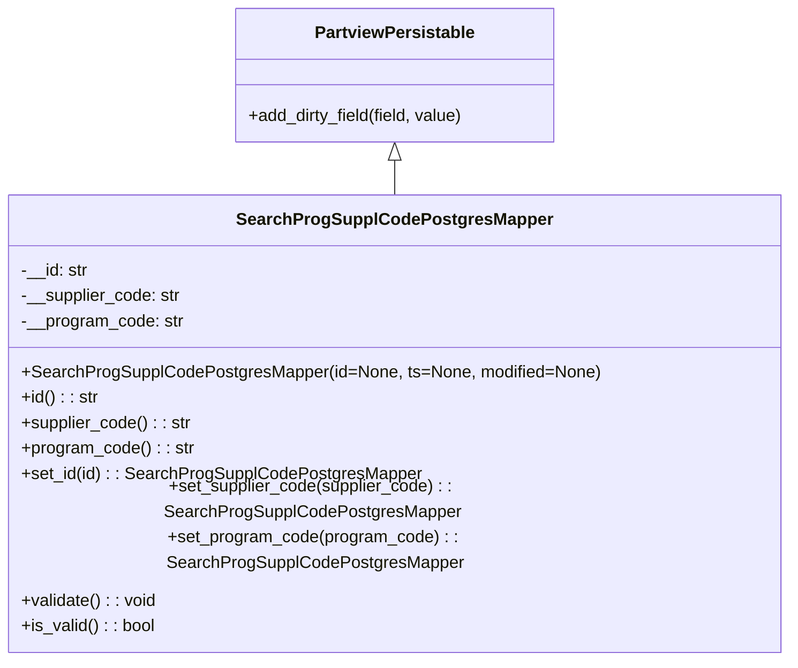

# Diagram: application_service/container_tracking_app_service/core/datamodel/SearchProgSupplCodePostgresMapper.py

> Auto-generated by Obscura crawlers

## Mermaid

### SVG

<svg id="container" width="732.6171875" xmlns="http://www.w3.org/2000/svg" class="classDiagram" height="576" viewBox="0 0 732.6171875 576" role="graphics-document document" aria-roledescription="class"><g><defs><marker id="container_class-aggregationStart" class="marker aggregation class" refX="18" refY="7" markerWidth="190" markerHeight="240" orient="auto"><path d="M 18,7 L9,13 L1,7 L9,1 Z"></path></marker></defs><defs><marker id="container_class-aggregationEnd" class="marker aggregation class" refX="1" refY="7" markerWidth="20" markerHeight="28" orient="auto"><path d="M 18,7 L9,13 L1,7 L9,1 Z"></path></marker></defs><defs><marker id="container_class-extensionStart" class="marker extension class" refX="18" refY="7" markerWidth="190" markerHeight="240" orient="auto"><path d="M 1,7 L18,13 V 1 Z"></path></marker></defs><defs><marker id="container_class-extensionEnd" class="marker extension class" refX="1" refY="7" markerWidth="20" markerHeight="28" orient="auto"><path d="M 1,1 V 13 L18,7 Z"></path></marker></defs><defs><marker id="container_class-compositionStart" class="marker composition class" refX="18" refY="7" markerWidth="190" markerHeight="240" orient="auto"><path d="M 18,7 L9,13 L1,7 L9,1 Z"></path></marker></defs><defs><marker id="container_class-compositionEnd" class="marker composition class" refX="1" refY="7" markerWidth="20" markerHeight="28" orient="auto"><path d="M 18,7 L9,13 L1,7 L9,1 Z"></path></marker></defs><defs><marker id="container_class-dependencyStart" class="marker dependency class" refX="6" refY="7" markerWidth="190" markerHeight="240" orient="auto"><path d="M 5,7 L9,13 L1,7 L9,1 Z"></path></marker></defs><defs><marker id="container_class-dependencyEnd" class="marker dependency class" refX="13" refY="7" markerWidth="20" markerHeight="28" orient="auto"><path d="M 18,7 L9,13 L14,7 L9,1 Z"></path></marker></defs><defs><marker id="container_class-lollipopStart" class="marker lollipop class" refX="13" refY="7" markerWidth="190" markerHeight="240" orient="auto"><circle stroke="black" fill="transparent" cx="7" cy="7" r="6"></circle></marker></defs><defs><marker id="container_class-lollipopEnd" class="marker lollipop class" refX="1" refY="7" markerWidth="190" markerHeight="240" orient="auto"><circle stroke="black" fill="transparent" cx="7" cy="7" r="6"></circle></marker></defs><g class="root"><g class="clusters"></g><g class="edgePaths"><path d="M366.309,151.25L366.309,152.542C366.309,153.833,366.309,156.417,366.309,161.875C366.309,167.333,366.309,175.667,366.309,179.833L366.309,184" id="id_PartviewPersistable_SearchProgSupplCodePostgresMapper_1" class="edge-thickness-normal edge-pattern-solid relation" style=";;;" data-edge="true" data-et="edge" data-id="id_PartviewPersistable_SearchProgSupplCodePostgresMapper_1" data-points="W3sieCI6MzY2LjMwODU5Mzc1LCJ5IjoxMzR9LHsieCI6MzY2LjMwODU5Mzc1LCJ5IjoxNTl9LHsieCI6MzY2LjMwODU5Mzc1LCJ5IjoxODR9XQ==" marker-start="url(#container_class-extensionStart)"></path></g><g class="edgeLabels"><g class="edgeLabel"><g class="label" data-id="id_PartviewPersistable_SearchProgSupplCodePostgresMapper_1" transform="translate(0, 0)"><foreignObject width="0" height="0">

</foreignObject></g></g></g><g class="nodes"><g class="node default" id="classId-PartviewPersistable-0" transform="translate(366.30859375, 71)"><g class="basic label-container"><path d="M-151.61328125 -63 L151.61328125 -63 L151.61328125 63 L-151.61328125 63" stroke="none" stroke-width="0" fill="#ECECFF" style=""></path><path d="M-151.61328125 -63 C-84.17905389298431 -63, -16.744826535968627 -63, 151.61328125 -63 M-151.61328125 -63 C-72.79596362272537 -63, 6.021354004549266 -63, 151.61328125 -63 M151.61328125 -63 C151.61328125 -16.66671531801199, 151.61328125 29.666569363976024, 151.61328125 63 M151.61328125 -63 C151.61328125 -13.158551431098346, 151.61328125 36.68289713780331, 151.61328125 63 M151.61328125 63 C50.908322018720185 63, -49.79663721255963 63, -151.61328125 63 M151.61328125 63 C50.687506608230066 63, -50.23826803353987 63, -151.61328125 63 M-151.61328125 63 C-151.61328125 17.7756651715654, -151.61328125 -27.4486696568692, -151.61328125 -63 M-151.61328125 63 C-151.61328125 13.870976103526665, -151.61328125 -35.25804779294667, -151.61328125 -63" stroke="#9370DB" stroke-width="1.3" fill="none" stroke-dasharray="0 0" style=""></path></g><g class="annotation-group text" transform="translate(0, -39)"></g><g class="label-group text" transform="translate(-72.7734375, -39)"><g class="label" style="font-weight: bolder" transform="translate(0,-12)"><foreignObject width="145.546875" height="24">

PartviewPersistable

</foreignObject></g></g><g class="members-group text" transform="translate(-139.61328125, 9)"></g><g class="methods-group text" transform="translate(-139.61328125, 39)"><g class="label" style="" transform="translate(0,-12)"><foreignObject width="206.453125" height="24">

+add_dirty_field(field, value)

</foreignObject></g></g><g class="divider" style=""><path d="M-151.61328125 -15 C-56.94662754882913 -15, 37.720026152341745 -15, 151.61328125 -15 M-151.61328125 -15 C-72.67126209670772 -15, 6.270757056584557 -15, 151.61328125 -15" stroke="#9370DB" stroke-width="1.3" fill="none" stroke-dasharray="0 0" style=""></path></g><g class="divider" style=""><path d="M-151.61328125 9 C-64.82950678684394 9, 21.954267676312128 9, 151.61328125 9 M-151.61328125 9 C-84.0760711083215 9, -16.538860966643 9, 151.61328125 9" stroke="#9370DB" stroke-width="1.3" fill="none" stroke-dasharray="0 0" style=""></path></g></g><g class="node default" id="classId-SearchProgSupplCodePostgresMapper-1" transform="translate(366.30859375, 376)"><g class="basic label-container"><path d="M-358.30859375 -192 L358.30859375 -192 L358.30859375 192 L-358.30859375 192" stroke="none" stroke-width="0" fill="#ECECFF" style=""></path><path d="M-358.30859375 -192 C-190.50072772288163 -192, -22.69286169576327 -192, 358.30859375 -192 M-358.30859375 -192 C-163.01349371746505 -192, 32.281606315069894 -192, 358.30859375 -192 M358.30859375 -192 C358.30859375 -89.8956611376089, 358.30859375 12.208677724782206, 358.30859375 192 M358.30859375 -192 C358.30859375 -78.27225528106061, 358.30859375 35.45548943787878, 358.30859375 192 M358.30859375 192 C108.55819034940609 192, -141.19221305118782 192, -358.30859375 192 M358.30859375 192 C104.39192050562255 192, -149.5247527387549 192, -358.30859375 192 M-358.30859375 192 C-358.30859375 75.67446745732839, -358.30859375 -40.65106508534322, -358.30859375 -192 M-358.30859375 192 C-358.30859375 88.64835595977196, -358.30859375 -14.703288080456076, -358.30859375 -192" stroke="#9370DB" stroke-width="1.3" fill="none" stroke-dasharray="0 0" style=""></path></g><g class="annotation-group text" transform="translate(0, -168)"></g><g class="label-group text" transform="translate(-140.3828125, -168)"><g class="label" style="font-weight: bolder" transform="translate(0,-12)"><foreignObject width="280.765625" height="24">

SearchProgSupplCodePostgresMapper

</foreignObject></g></g><g class="members-group text" transform="translate(-346.30859375, -120)"><g class="label" style="" transform="translate(0,-12)"><foreignObject width="63.234375" height="24">

-__id: str

</foreignObject></g><g class="label" style="" transform="translate(0,12)"><foreignObject width="150.734375" height="24">

-__supplier_code: str

</foreignObject></g><g class="label" style="" transform="translate(0,36)"><foreignObject width="153.015625" height="24">

-__program_code: str

</foreignObject></g></g><g class="methods-group text" transform="translate(-346.30859375, -24)"><g class="label" style="" transform="translate(0,-12)"><foreignObject width="540.09375" height="24">

+SearchProgSupplCodePostgresMapper(id=None, ts=None, modified=None)

</foreignObject></g><g class="label" style="" transform="translate(0,12)"><foreignObject width="72.265625" height="24">

+id() : : str

</foreignObject></g><g class="label" style="" transform="translate(0,36)"><foreignObject width="159.75" height="24">

+supplier_code() : : str

</foreignObject></g><g class="label" style="" transform="translate(0,60)"><foreignObject width="162.046875" height="24">

+program_code() : : str

</foreignObject></g><g class="label" style="" transform="translate(0,84)"><foreignObject width="372.6875" height="24">

+set_id(id) : : SearchProgSupplCodePostgresMapper

</foreignObject></g><g class="label" style="" transform="translate(0,108)"><foreignObject width="547.65625" height="24">

+set_supplier_code(supplier_code) : : SearchProgSupplCodePostgresMapper

</foreignObject></g><g class="label" style="" transform="translate(0,132)"><foreignObject width="552.234375" height="24">

+set_program_code(program_code) : : SearchProgSupplCodePostgresMapper

</foreignObject></g><g class="label" style="" transform="translate(0,156)"><foreignObject width="127.71875" height="24">

+validate() : : void

</foreignObject></g><g class="label" style="" transform="translate(0,180)"><foreignObject width="126.078125" height="24">

+is_valid() : : bool

</foreignObject></g></g><g class="divider" style=""><path d="M-358.30859375 -144 C-103.66942474559355 -144, 150.9697442588129 -144, 358.30859375 -144 M-358.30859375 -144 C-97.08686662191377 -144, 164.13486050617246 -144, 358.30859375 -144" stroke="#9370DB" stroke-width="1.3" fill="none" stroke-dasharray="0 0" style=""></path></g><g class="divider" style=""><path d="M-358.30859375 -48 C-106.06661231571167 -48, 146.17536911857667 -48, 358.30859375 -48 M-358.30859375 -48 C-199.232222453967 -48, -40.15585115793402 -48, 358.30859375 -48" stroke="#9370DB" stroke-width="1.3" fill="none" stroke-dasharray="0 0" style=""></path></g></g></g></g></g></svg>
