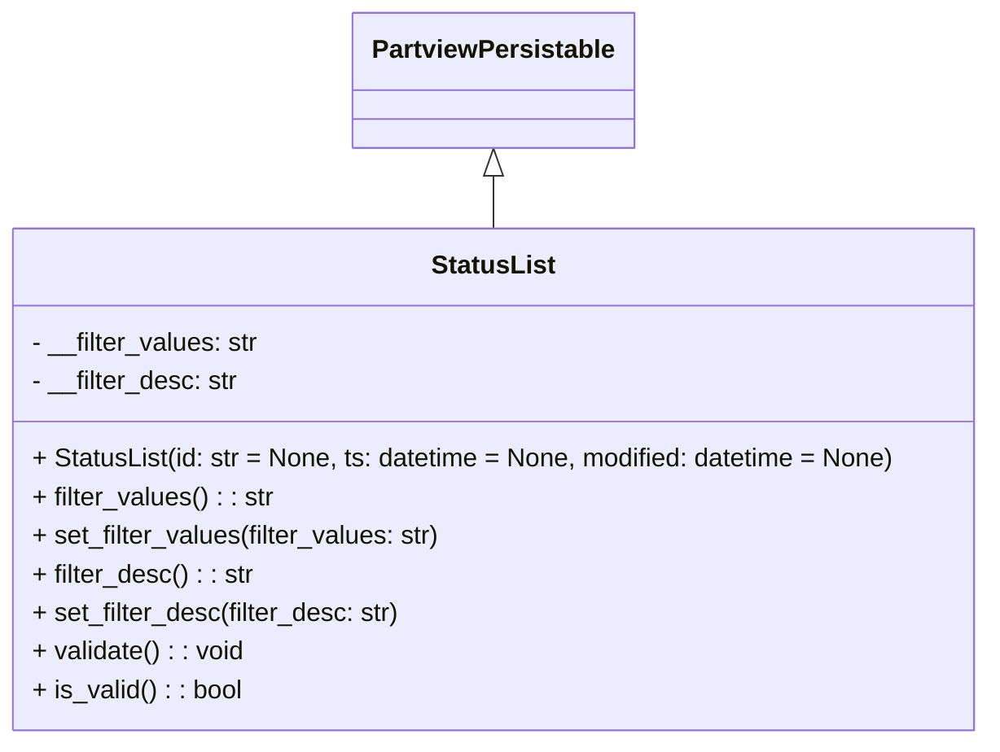

# Diagram: application_service/container_tracking_app_service/core/datamodel/StatusList.py

> Auto-generated by Obscura crawlers

## Mermaid

### SVG

<svg id="container" width="617.265625" xmlns="http://www.w3.org/2000/svg" class="classDiagram" height="462" viewBox="0 0 617.265625 462" role="graphics-document document" aria-roledescription="class"><g><defs><marker id="container_class-aggregationStart" class="marker aggregation class" refX="18" refY="7" markerWidth="190" markerHeight="240" orient="auto"><path d="M 18,7 L9,13 L1,7 L9,1 Z"></path></marker></defs><defs><marker id="container_class-aggregationEnd" class="marker aggregation class" refX="1" refY="7" markerWidth="20" markerHeight="28" orient="auto"><path d="M 18,7 L9,13 L1,7 L9,1 Z"></path></marker></defs><defs><marker id="container_class-extensionStart" class="marker extension class" refX="18" refY="7" markerWidth="190" markerHeight="240" orient="auto"><path d="M 1,7 L18,13 V 1 Z"></path></marker></defs><defs><marker id="container_class-extensionEnd" class="marker extension class" refX="1" refY="7" markerWidth="20" markerHeight="28" orient="auto"><path d="M 1,1 V 13 L18,7 Z"></path></marker></defs><defs><marker id="container_class-compositionStart" class="marker composition class" refX="18" refY="7" markerWidth="190" markerHeight="240" orient="auto"><path d="M 18,7 L9,13 L1,7 L9,1 Z"></path></marker></defs><defs><marker id="container_class-compositionEnd" class="marker composition class" refX="1" refY="7" markerWidth="20" markerHeight="28" orient="auto"><path d="M 18,7 L9,13 L1,7 L9,1 Z"></path></marker></defs><defs><marker id="container_class-dependencyStart" class="marker dependency class" refX="6" refY="7" markerWidth="190" markerHeight="240" orient="auto"><path d="M 5,7 L9,13 L1,7 L9,1 Z"></path></marker></defs><defs><marker id="container_class-dependencyEnd" class="marker dependency class" refX="13" refY="7" markerWidth="20" markerHeight="28" orient="auto"><path d="M 18,7 L9,13 L14,7 L9,1 Z"></path></marker></defs><defs><marker id="container_class-lollipopStart" class="marker lollipop class" refX="13" refY="7" markerWidth="190" markerHeight="240" orient="auto"><circle stroke="black" fill="transparent" cx="7" cy="7" r="6"></circle></marker></defs><defs><marker id="container_class-lollipopEnd" class="marker lollipop class" refX="1" refY="7" markerWidth="190" markerHeight="240" orient="auto"><circle stroke="black" fill="transparent" cx="7" cy="7" r="6"></circle></marker></defs><g class="root"><g class="clusters"></g><g class="edgePaths"><path d="M308.633,109.25L308.633,110.542C308.633,111.833,308.633,114.417,308.633,119.875C308.633,125.333,308.633,133.667,308.633,137.833L308.633,142" id="id_PartviewPersistable_StatusList_1" class="edge-thickness-normal edge-pattern-solid relation" style=";;;" data-edge="true" data-et="edge" data-id="id_PartviewPersistable_StatusList_1" data-points="W3sieCI6MzA4LjYzMjgxMjUsInkiOjkyfSx7IngiOjMwOC42MzI4MTI1LCJ5IjoxMTd9LHsieCI6MzA4LjYzMjgxMjUsInkiOjE0Mn1d" marker-start="url(#container_class-extensionStart)"></path></g><g class="edgeLabels"><g class="edgeLabel"><g class="label" data-id="id_PartviewPersistable_StatusList_1" transform="translate(0, 0)"><foreignObject width="0" height="0">

</foreignObject></g></g></g><g class="nodes"><g class="node default" id="classId-PartviewPersistable-0" transform="translate(308.6328125, 50)"><g class="basic label-container"><path d="M-84.7734375 -42 L84.7734375 -42 L84.7734375 42 L-84.7734375 42" stroke="none" stroke-width="0" fill="#ECECFF" style=""></path><path d="M-84.7734375 -42 C-45.22394104153371 -42, -5.674444583067427 -42, 84.7734375 -42 M-84.7734375 -42 C-26.704191640639266 -42, 31.36505421872147 -42, 84.7734375 -42 M84.7734375 -42 C84.7734375 -16.04481204461036, 84.7734375 9.91037591077928, 84.7734375 42 M84.7734375 -42 C84.7734375 -22.183821514545485, 84.7734375 -2.3676430290909707, 84.7734375 42 M84.7734375 42 C41.18648149347653 42, -2.4004745130469445 42, -84.7734375 42 M84.7734375 42 C31.487818901708344 42, -21.79779969658331 42, -84.7734375 42 M-84.7734375 42 C-84.7734375 23.51444101413169, -84.7734375 5.028882028263382, -84.7734375 -42 M-84.7734375 42 C-84.7734375 15.352866032697364, -84.7734375 -11.294267934605273, -84.7734375 -42" stroke="#9370DB" stroke-width="1.3" fill="none" stroke-dasharray="0 0" style=""></path></g><g class="annotation-group text" transform="translate(0, -18)"></g><g class="label-group text" transform="translate(-72.7734375, -18)"><g class="label" style="font-weight: bolder" transform="translate(0,-12)"><foreignObject width="145.546875" height="24">

PartviewPersistable

</foreignObject></g></g><g class="members-group text" transform="translate(-72.7734375, 30)"></g><g class="methods-group text" transform="translate(-72.7734375, 60)"></g><g class="divider" style=""><path d="M-84.7734375 6 C-37.30810050696241 6, 10.157236486075178 6, 84.7734375 6 M-84.7734375 6 C-49.75896027718379 6, -14.744483054367578 6, 84.7734375 6" stroke="#9370DB" stroke-width="1.3" fill="none" stroke-dasharray="0 0" style=""></path></g><g class="divider" style=""><path d="M-84.7734375 24 C-39.79255083249806 24, 5.188335835003883 24, 84.7734375 24 M-84.7734375 24 C-17.302772988156974 24, 50.16789152368605 24, 84.7734375 24" stroke="#9370DB" stroke-width="1.3" fill="none" stroke-dasharray="0 0" style=""></path></g></g><g class="node default" id="classId-StatusList-1" transform="translate(308.6328125, 298)"><g class="basic label-container"><path d="M-300.6328125 -156 L300.6328125 -156 L300.6328125 156 L-300.6328125 156" stroke="none" stroke-width="0" fill="#ECECFF" style=""></path><path d="M-300.6328125 -156 C-118.42714953942664 -156, 63.77851342114673 -156, 300.6328125 -156 M-300.6328125 -156 C-140.04677716140122 -156, 20.539258177197553 -156, 300.6328125 -156 M300.6328125 -156 C300.6328125 -50.6306282676059, 300.6328125 54.7387434647882, 300.6328125 156 M300.6328125 -156 C300.6328125 -92.58712618604412, 300.6328125 -29.174252372088233, 300.6328125 156 M300.6328125 156 C133.25425294971464 156, -34.12430660057072 156, -300.6328125 156 M300.6328125 156 C173.25881011423874 156, 45.88480772847748 156, -300.6328125 156 M-300.6328125 156 C-300.6328125 71.38862255534019, -300.6328125 -13.222754889319617, -300.6328125 -156 M-300.6328125 156 C-300.6328125 88.7989518677206, -300.6328125 21.597903735441207, -300.6328125 -156" stroke="#9370DB" stroke-width="1.3" fill="none" stroke-dasharray="0 0" style=""></path></g><g class="annotation-group text" transform="translate(0, -132)"></g><g class="label-group text" transform="translate(-36.796875, -132)"><g class="label" style="font-weight: bolder" transform="translate(0,-12)"><foreignObject width="73.59375" height="24">

StatusList

</foreignObject></g></g><g class="members-group text" transform="translate(-288.6328125, -84)"><g class="label" style="" transform="translate(0,-12)"><foreignObject width="141.59375" height="24">

- __filter_values: str

</foreignObject></g><g class="label" style="" transform="translate(0,12)"><foreignObject width="128.875" height="24">

- __filter_desc: str

</foreignObject></g></g><g class="methods-group text" transform="translate(-288.6328125, -12)"><g class="label" style="" transform="translate(0,-12)"><foreignObject width="540.46875" height="24">

+ StatusList(id: str = None, ts: datetime = None, modified: datetime = None)

</foreignObject></g><g class="label" style="" transform="translate(0,12)"><foreignObject width="149.65625" height="24">

+ filter_values() : : str

</foreignObject></g><g class="label" style="" transform="translate(0,36)"><foreignObject width="254.53125" height="24">

+ set_filter_values(filter_values: str)

</foreignObject></g><g class="label" style="" transform="translate(0,60)"><foreignObject width="136.875" height="24">

+ filter_desc() : : str

</foreignObject></g><g class="label" style="" transform="translate(0,84)"><foreignObject width="229.03125" height="24">

+ set_filter_desc(filter_desc: str)

</foreignObject></g><g class="label" style="" transform="translate(0,108)"><foreignObject width="132.125" height="24">

+ validate() : : void

</foreignObject></g><g class="label" style="" transform="translate(0,132)"><foreignObject width="130.3125" height="24">

+ is_valid() : : bool

</foreignObject></g></g><g class="divider" style=""><path d="M-300.6328125 -108 C-150.13129634627242 -108, 0.3702198074551575 -108, 300.6328125 -108 M-300.6328125 -108 C-81.85134595764606 -108, 136.93012058470788 -108, 300.6328125 -108" stroke="#9370DB" stroke-width="1.3" fill="none" stroke-dasharray="0 0" style=""></path></g><g class="divider" style=""><path d="M-300.6328125 -36 C-140.28417092487496 -36, 20.064470650250087 -36, 300.6328125 -36 M-300.6328125 -36 C-134.0375595598361 -36, 32.557693380327805 -36, 300.6328125 -36" stroke="#9370DB" stroke-width="1.3" fill="none" stroke-dasharray="0 0" style=""></path></g></g></g></g></g></svg>
