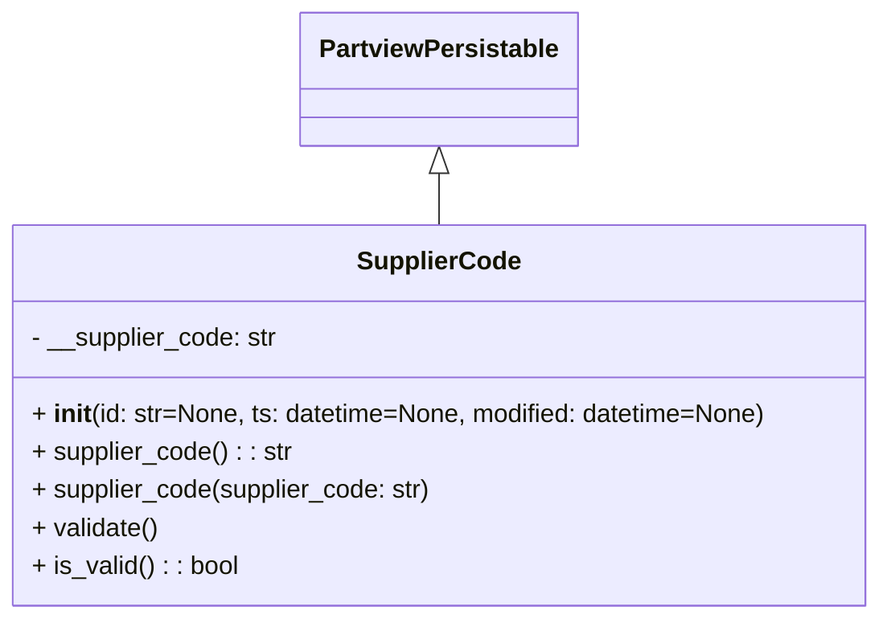

# Diagram: application_service/container_tracking_app_service/core/datamodel/SupplierCode.py

> Auto-generated by Obscura crawlers

## Mermaid

### SVG

<svg id="container" width="557.3984375" xmlns="http://www.w3.org/2000/svg" class="classDiagram" height="390" viewBox="0 0 557.3984375 390" role="graphics-document document" aria-roledescription="class"><g><defs><marker id="container_class-aggregationStart" class="marker aggregation class" refX="18" refY="7" markerWidth="190" markerHeight="240" orient="auto"><path d="M 18,7 L9,13 L1,7 L9,1 Z"></path></marker></defs><defs><marker id="container_class-aggregationEnd" class="marker aggregation class" refX="1" refY="7" markerWidth="20" markerHeight="28" orient="auto"><path d="M 18,7 L9,13 L1,7 L9,1 Z"></path></marker></defs><defs><marker id="container_class-extensionStart" class="marker extension class" refX="18" refY="7" markerWidth="190" markerHeight="240" orient="auto"><path d="M 1,7 L18,13 V 1 Z"></path></marker></defs><defs><marker id="container_class-extensionEnd" class="marker extension class" refX="1" refY="7" markerWidth="20" markerHeight="28" orient="auto"><path d="M 1,1 V 13 L18,7 Z"></path></marker></defs><defs><marker id="container_class-compositionStart" class="marker composition class" refX="18" refY="7" markerWidth="190" markerHeight="240" orient="auto"><path d="M 18,7 L9,13 L1,7 L9,1 Z"></path></marker></defs><defs><marker id="container_class-compositionEnd" class="marker composition class" refX="1" refY="7" markerWidth="20" markerHeight="28" orient="auto"><path d="M 18,7 L9,13 L1,7 L9,1 Z"></path></marker></defs><defs><marker id="container_class-dependencyStart" class="marker dependency class" refX="6" refY="7" markerWidth="190" markerHeight="240" orient="auto"><path d="M 5,7 L9,13 L1,7 L9,1 Z"></path></marker></defs><defs><marker id="container_class-dependencyEnd" class="marker dependency class" refX="13" refY="7" markerWidth="20" markerHeight="28" orient="auto"><path d="M 18,7 L9,13 L14,7 L9,1 Z"></path></marker></defs><defs><marker id="container_class-lollipopStart" class="marker lollipop class" refX="13" refY="7" markerWidth="190" markerHeight="240" orient="auto"><circle stroke="black" fill="transparent" cx="7" cy="7" r="6"></circle></marker></defs><defs><marker id="container_class-lollipopEnd" class="marker lollipop class" refX="1" refY="7" markerWidth="190" markerHeight="240" orient="auto"><circle stroke="black" fill="transparent" cx="7" cy="7" r="6"></circle></marker></defs><g class="root"><g class="clusters"></g><g class="edgePaths"><path d="M278.699,109.25L278.699,110.542C278.699,111.833,278.699,114.417,278.699,119.875C278.699,125.333,278.699,133.667,278.699,137.833L278.699,142" id="id_PartviewPersistable_SupplierCode_1" class="edge-thickness-normal edge-pattern-solid relation" style=";;;" data-edge="true" data-et="edge" data-id="id_PartviewPersistable_SupplierCode_1" data-points="W3sieCI6Mjc4LjY5OTIxODc1LCJ5Ijo5Mn0seyJ4IjoyNzguNjk5MjE4NzUsInkiOjExN30seyJ4IjoyNzguNjk5MjE4NzUsInkiOjE0Mn1d" marker-start="url(#container_class-extensionStart)"></path></g><g class="edgeLabels"><g class="edgeLabel"><g class="label" data-id="id_PartviewPersistable_SupplierCode_1" transform="translate(0, 0)"><foreignObject width="0" height="0">

</foreignObject></g></g></g><g class="nodes"><g class="node default" id="classId-PartviewPersistable-0" transform="translate(278.69921875, 50)"><g class="basic label-container"><path d="M-84.7734375 -42 L84.7734375 -42 L84.7734375 42 L-84.7734375 42" stroke="none" stroke-width="0" fill="#ECECFF" style=""></path><path d="M-84.7734375 -42 C-37.54800689536486 -42, 9.677423709270286 -42, 84.7734375 -42 M-84.7734375 -42 C-43.573054150558306 -42, -2.3726708011166124 -42, 84.7734375 -42 M84.7734375 -42 C84.7734375 -22.73135138322471, 84.7734375 -3.462702766449418, 84.7734375 42 M84.7734375 -42 C84.7734375 -23.756637910738906, 84.7734375 -5.513275821477812, 84.7734375 42 M84.7734375 42 C35.22438940740591 42, -14.324658685188183 42, -84.7734375 42 M84.7734375 42 C31.536218848929458 42, -21.700999802141084 42, -84.7734375 42 M-84.7734375 42 C-84.7734375 18.177403955958557, -84.7734375 -5.6451920880828865, -84.7734375 -42 M-84.7734375 42 C-84.7734375 9.46336923480478, -84.7734375 -23.07326153039044, -84.7734375 -42" stroke="#9370DB" stroke-width="1.3" fill="none" stroke-dasharray="0 0" style=""></path></g><g class="annotation-group text" transform="translate(0, -18)"></g><g class="label-group text" transform="translate(-72.7734375, -18)"><g class="label" style="font-weight: bolder" transform="translate(0,-12)"><foreignObject width="145.546875" height="24">

PartviewPersistable

</foreignObject></g></g><g class="members-group text" transform="translate(-72.7734375, 30)"></g><g class="methods-group text" transform="translate(-72.7734375, 60)"></g><g class="divider" style=""><path d="M-84.7734375 6 C-20.997804244602293 6, 42.777829010795415 6, 84.7734375 6 M-84.7734375 6 C-42.96749340142611 6, -1.1615493028522224 6, 84.7734375 6" stroke="#9370DB" stroke-width="1.3" fill="none" stroke-dasharray="0 0" style=""></path></g><g class="divider" style=""><path d="M-84.7734375 24 C-46.19213771785943 24, -7.6108379357188625 24, 84.7734375 24 M-84.7734375 24 C-44.91454098624442 24, -5.0556444724888365 24, 84.7734375 24" stroke="#9370DB" stroke-width="1.3" fill="none" stroke-dasharray="0 0" style=""></path></g></g><g class="node default" id="classId-SupplierCode-1" transform="translate(278.69921875, 262)"><g class="basic label-container"><path d="M-270.69921875 -120 L270.69921875 -120 L270.69921875 120 L-270.69921875 120" stroke="none" stroke-width="0" fill="#ECECFF" style=""></path><path d="M-270.69921875 -120 C-68.96315033408791 -120, 132.77291808182417 -120, 270.69921875 -120 M-270.69921875 -120 C-138.34636004135456 -120, -5.993501332709116 -120, 270.69921875 -120 M270.69921875 -120 C270.69921875 -34.49151409132874, 270.69921875 51.01697181734252, 270.69921875 120 M270.69921875 -120 C270.69921875 -31.03239895713348, 270.69921875 57.93520208573304, 270.69921875 120 M270.69921875 120 C90.06806592437667 120, -90.56308690124666 120, -270.69921875 120 M270.69921875 120 C122.19807583195859 120, -26.30306708608282 120, -270.69921875 120 M-270.69921875 120 C-270.69921875 30.28540821363275, -270.69921875 -59.4291835727345, -270.69921875 -120 M-270.69921875 120 C-270.69921875 40.619889196182655, -270.69921875 -38.76022160763469, -270.69921875 -120" stroke="#9370DB" stroke-width="1.3" fill="none" stroke-dasharray="0 0" style=""></path></g><g class="annotation-group text" transform="translate(0, -96)"></g><g class="label-group text" transform="translate(-49.2890625, -96)"><g class="label" style="font-weight: bolder" transform="translate(0,-12)"><foreignObject width="98.578125" height="24">

SupplierCode

</foreignObject></g></g><g class="members-group text" transform="translate(-258.69921875, -48)"><g class="label" style="" transform="translate(0,-12)"><foreignObject width="156.25" height="24">

- __supplier_code: str

</foreignObject></g></g><g class="methods-group text" transform="translate(-258.69921875, 0)"><g class="label" style="" transform="translate(0,-12)"><foreignObject width="468.109375" height="24">

+ <strong>init</strong>(id: str=None, ts: datetime=None, modified: datetime=None)

</foreignObject></g><g class="label" style="" transform="translate(0,12)"><foreignObject width="163.984375" height="24">

+ supplier_code() : : str

</foreignObject></g><g class="label" style="" transform="translate(0,36)"><foreignObject width="253.234375" height="24">

+ supplier_code(supplier_code: str)

</foreignObject></g><g class="label" style="" transform="translate(0,60)"><foreignObject width="80.484375" height="24">

+ validate()

</foreignObject></g><g class="label" style="" transform="translate(0,84)"><foreignObject width="130.3125" height="24">

+ is_valid() : : bool

</foreignObject></g></g><g class="divider" style=""><path d="M-270.69921875 -72 C-67.54438113436132 -72, 135.61045648127737 -72, 270.69921875 -72 M-270.69921875 -72 C-105.96468442260613 -72, 58.76984990478775 -72, 270.69921875 -72" stroke="#9370DB" stroke-width="1.3" fill="none" stroke-dasharray="0 0" style=""></path></g><g class="divider" style=""><path d="M-270.69921875 -24 C-115.61984307007853 -24, 39.45953260984294 -24, 270.69921875 -24 M-270.69921875 -24 C-110.66565615168622 -24, 49.36790644662756 -24, 270.69921875 -24" stroke="#9370DB" stroke-width="1.3" fill="none" stroke-dasharray="0 0" style=""></path></g></g></g></g></g></svg>
