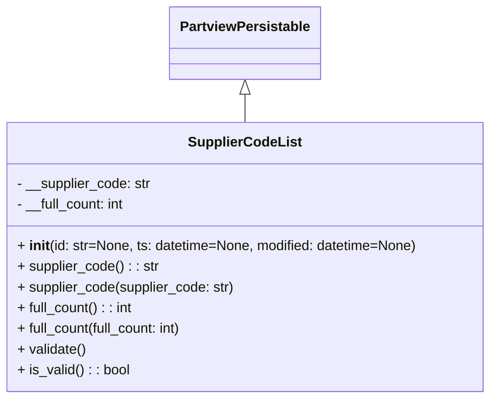

# Diagram: application_service/container_tracking_app_service/core/datamodel/SupplierCodeList.py

> Auto-generated by Obscura crawlers

## Mermaid

### SVG

<svg id="container" width="570.7109375" xmlns="http://www.w3.org/2000/svg" class="classDiagram" height="462" viewBox="0 0 570.7109375 462" role="graphics-document document" aria-roledescription="class"><g><defs><marker id="container_class-aggregationStart" class="marker aggregation class" refX="18" refY="7" markerWidth="190" markerHeight="240" orient="auto"><path d="M 18,7 L9,13 L1,7 L9,1 Z"></path></marker></defs><defs><marker id="container_class-aggregationEnd" class="marker aggregation class" refX="1" refY="7" markerWidth="20" markerHeight="28" orient="auto"><path d="M 18,7 L9,13 L1,7 L9,1 Z"></path></marker></defs><defs><marker id="container_class-extensionStart" class="marker extension class" refX="18" refY="7" markerWidth="190" markerHeight="240" orient="auto"><path d="M 1,7 L18,13 V 1 Z"></path></marker></defs><defs><marker id="container_class-extensionEnd" class="marker extension class" refX="1" refY="7" markerWidth="20" markerHeight="28" orient="auto"><path d="M 1,1 V 13 L18,7 Z"></path></marker></defs><defs><marker id="container_class-compositionStart" class="marker composition class" refX="18" refY="7" markerWidth="190" markerHeight="240" orient="auto"><path d="M 18,7 L9,13 L1,7 L9,1 Z"></path></marker></defs><defs><marker id="container_class-compositionEnd" class="marker composition class" refX="1" refY="7" markerWidth="20" markerHeight="28" orient="auto"><path d="M 18,7 L9,13 L1,7 L9,1 Z"></path></marker></defs><defs><marker id="container_class-dependencyStart" class="marker dependency class" refX="6" refY="7" markerWidth="190" markerHeight="240" orient="auto"><path d="M 5,7 L9,13 L1,7 L9,1 Z"></path></marker></defs><defs><marker id="container_class-dependencyEnd" class="marker dependency class" refX="13" refY="7" markerWidth="20" markerHeight="28" orient="auto"><path d="M 18,7 L9,13 L14,7 L9,1 Z"></path></marker></defs><defs><marker id="container_class-lollipopStart" class="marker lollipop class" refX="13" refY="7" markerWidth="190" markerHeight="240" orient="auto"><circle stroke="black" fill="transparent" cx="7" cy="7" r="6"></circle></marker></defs><defs><marker id="container_class-lollipopEnd" class="marker lollipop class" refX="1" refY="7" markerWidth="190" markerHeight="240" orient="auto"><circle stroke="black" fill="transparent" cx="7" cy="7" r="6"></circle></marker></defs><g class="root"><g class="clusters"></g><g class="edgePaths"><path d="M285.355,109.25L285.355,110.542C285.355,111.833,285.355,114.417,285.355,119.875C285.355,125.333,285.355,133.667,285.355,137.833L285.355,142" id="id_PartviewPersistable_SupplierCodeList_1" class="edge-thickness-normal edge-pattern-solid relation" style=";;;" data-edge="true" data-et="edge" data-id="id_PartviewPersistable_SupplierCodeList_1" data-points="W3sieCI6Mjg1LjM1NTQ2ODc1LCJ5Ijo5Mn0seyJ4IjoyODUuMzU1NDY4NzUsInkiOjExN30seyJ4IjoyODUuMzU1NDY4NzUsInkiOjE0Mn1d" marker-start="url(#container_class-extensionStart)"></path></g><g class="edgeLabels"><g class="edgeLabel"><g class="label" data-id="id_PartviewPersistable_SupplierCodeList_1" transform="translate(0, 0)"><foreignObject width="0" height="0">

</foreignObject></g></g></g><g class="nodes"><g class="node default" id="classId-PartviewPersistable-0" transform="translate(285.35546875, 50)"><g class="basic label-container"><path d="M-84.7734375 -42 L84.7734375 -42 L84.7734375 42 L-84.7734375 42" stroke="none" stroke-width="0" fill="#ECECFF" style=""></path><path d="M-84.7734375 -42 C-45.67549042206667 -42, -6.577543344133346 -42, 84.7734375 -42 M-84.7734375 -42 C-48.51581241740679 -42, -12.258187334813584 -42, 84.7734375 -42 M84.7734375 -42 C84.7734375 -24.01883204210144, 84.7734375 -6.037664084202881, 84.7734375 42 M84.7734375 -42 C84.7734375 -17.20440106126609, 84.7734375 7.59119787746782, 84.7734375 42 M84.7734375 42 C18.070365553562624 42, -48.63270639287475 42, -84.7734375 42 M84.7734375 42 C19.78625775718929 42, -45.20092198562142 42, -84.7734375 42 M-84.7734375 42 C-84.7734375 19.764406970492775, -84.7734375 -2.4711860590144497, -84.7734375 -42 M-84.7734375 42 C-84.7734375 18.191822061877545, -84.7734375 -5.61635587624491, -84.7734375 -42" stroke="#9370DB" stroke-width="1.3" fill="none" stroke-dasharray="0 0" style=""></path></g><g class="annotation-group text" transform="translate(0, -18)"></g><g class="label-group text" transform="translate(-72.7734375, -18)"><g class="label" style="font-weight: bolder" transform="translate(0,-12)"><foreignObject width="145.546875" height="24">

PartviewPersistable

</foreignObject></g></g><g class="members-group text" transform="translate(-72.7734375, 30)"></g><g class="methods-group text" transform="translate(-72.7734375, 60)"></g><g class="divider" style=""><path d="M-84.7734375 6 C-31.287815879085542 6, 22.197805741828915 6, 84.7734375 6 M-84.7734375 6 C-49.84262327321124 6, -14.911809046422476 6, 84.7734375 6" stroke="#9370DB" stroke-width="1.3" fill="none" stroke-dasharray="0 0" style=""></path></g><g class="divider" style=""><path d="M-84.7734375 24 C-28.837715171705824 24, 27.098007156588352 24, 84.7734375 24 M-84.7734375 24 C-44.32083365047025 24, -3.8682298009404974 24, 84.7734375 24" stroke="#9370DB" stroke-width="1.3" fill="none" stroke-dasharray="0 0" style=""></path></g></g><g class="node default" id="classId-SupplierCodeList-1" transform="translate(285.35546875, 298)"><g class="basic label-container"><path d="M-277.35546875 -156 L277.35546875 -156 L277.35546875 156 L-277.35546875 156" stroke="none" stroke-width="0" fill="#ECECFF" style=""></path><path d="M-277.35546875 -156 C-118.85454008274553 -156, 39.64638858450894 -156, 277.35546875 -156 M-277.35546875 -156 C-137.47554090229178 -156, 2.4043869454164337 -156, 277.35546875 -156 M277.35546875 -156 C277.35546875 -38.92426237779851, 277.35546875 78.15147524440297, 277.35546875 156 M277.35546875 -156 C277.35546875 -72.71025160256009, 277.35546875 10.579496794879816, 277.35546875 156 M277.35546875 156 C115.52398090446741 156, -46.307506941065185 156, -277.35546875 156 M277.35546875 156 C85.84280700538253 156, -105.66985473923495 156, -277.35546875 156 M-277.35546875 156 C-277.35546875 50.2525828533939, -277.35546875 -55.49483429321219, -277.35546875 -156 M-277.35546875 156 C-277.35546875 34.51808647661737, -277.35546875 -86.96382704676526, -277.35546875 -156" stroke="#9370DB" stroke-width="1.3" fill="none" stroke-dasharray="0 0" style=""></path></g><g class="annotation-group text" transform="translate(0, -132)"></g><g class="label-group text" transform="translate(-62.6015625, -132)"><g class="label" style="font-weight: bolder" transform="translate(0,-12)"><foreignObject width="125.203125" height="24">

SupplierCodeList

</foreignObject></g></g><g class="members-group text" transform="translate(-265.35546875, -84)"><g class="label" style="" transform="translate(0,-12)"><foreignObject width="156.25" height="24">

- __supplier_code: str

</foreignObject></g><g class="label" style="" transform="translate(0,12)"><foreignObject width="127.84375" height="24">

- __full_count: int

</foreignObject></g></g><g class="methods-group text" transform="translate(-265.35546875, -12)"><g class="label" style="" transform="translate(0,-12)"><foreignObject width="468.109375" height="24">

+ <strong>init</strong>(id: str=None, ts: datetime=None, modified: datetime=None)

</foreignObject></g><g class="label" style="" transform="translate(0,12)"><foreignObject width="163.984375" height="24">

+ supplier_code() : : str

</foreignObject></g><g class="label" style="" transform="translate(0,36)"><foreignObject width="253.234375" height="24">

+ supplier_code(supplier_code: str)

</foreignObject></g><g class="label" style="" transform="translate(0,60)"><foreignObject width="135.84375" height="24">

+ full_count() : : int

</foreignObject></g><g class="label" style="" transform="translate(0,84)"><foreignObject width="196.78125" height="24">

+ full_count(full_count: int)

</foreignObject></g><g class="label" style="" transform="translate(0,108)"><foreignObject width="80.484375" height="24">

+ validate()

</foreignObject></g><g class="label" style="" transform="translate(0,132)"><foreignObject width="130.3125" height="24">

+ is_valid() : : bool

</foreignObject></g></g><g class="divider" style=""><path d="M-277.35546875 -108 C-138.0678380752829 -108, 1.2197925994341858 -108, 277.35546875 -108 M-277.35546875 -108 C-127.93479284725368 -108, 21.48588305549265 -108, 277.35546875 -108" stroke="#9370DB" stroke-width="1.3" fill="none" stroke-dasharray="0 0" style=""></path></g><g class="divider" style=""><path d="M-277.35546875 -36 C-62.05605485870734 -36, 153.24335903258532 -36, 277.35546875 -36 M-277.35546875 -36 C-134.32791481430343 -36, 8.699639121393147 -36, 277.35546875 -36" stroke="#9370DB" stroke-width="1.3" fill="none" stroke-dasharray="0 0" style=""></path></g></g></g></g></g></svg>
