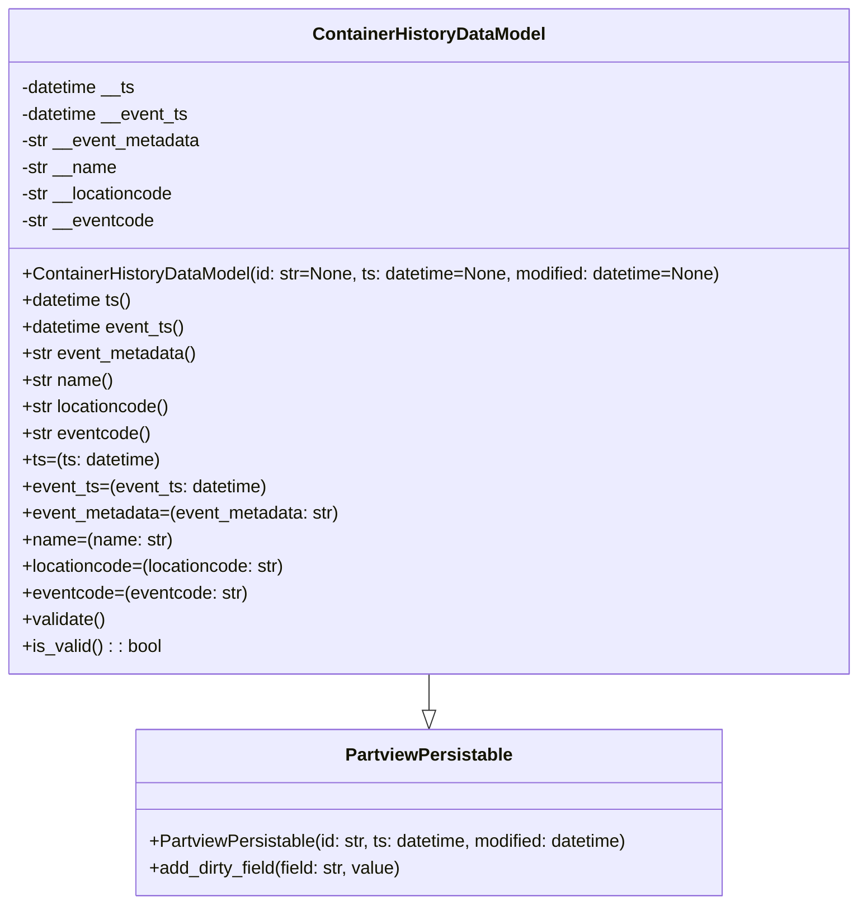

# Diagram: application_service/container_tracking_app_service/core/datamodel/container_history/ContainerHistoryDataModel.py

> Auto-generated by Obscura crawlers

## Mermaid

### SVG

<svg id="container" width="781.1640625" xmlns="http://www.w3.org/2000/svg" class="classDiagram" height="816" viewBox="0 0 781.1640625 816" role="graphics-document document" aria-roledescription="class"><g><defs><marker id="container_class-aggregationStart" class="marker aggregation class" refX="18" refY="7" markerWidth="190" markerHeight="240" orient="auto"><path d="M 18,7 L9,13 L1,7 L9,1 Z"></path></marker></defs><defs><marker id="container_class-aggregationEnd" class="marker aggregation class" refX="1" refY="7" markerWidth="20" markerHeight="28" orient="auto"><path d="M 18,7 L9,13 L1,7 L9,1 Z"></path></marker></defs><defs><marker id="container_class-extensionStart" class="marker extension class" refX="18" refY="7" markerWidth="190" markerHeight="240" orient="auto"><path d="M 1,7 L18,13 V 1 Z"></path></marker></defs><defs><marker id="container_class-extensionEnd" class="marker extension class" refX="1" refY="7" markerWidth="20" markerHeight="28" orient="auto"><path d="M 1,1 V 13 L18,7 Z"></path></marker></defs><defs><marker id="container_class-compositionStart" class="marker composition class" refX="18" refY="7" markerWidth="190" markerHeight="240" orient="auto"><path d="M 18,7 L9,13 L1,7 L9,1 Z"></path></marker></defs><defs><marker id="container_class-compositionEnd" class="marker composition class" refX="1" refY="7" markerWidth="20" markerHeight="28" orient="auto"><path d="M 18,7 L9,13 L1,7 L9,1 Z"></path></marker></defs><defs><marker id="container_class-dependencyStart" class="marker dependency class" refX="6" refY="7" markerWidth="190" markerHeight="240" orient="auto"><path d="M 5,7 L9,13 L1,7 L9,1 Z"></path></marker></defs><defs><marker id="container_class-dependencyEnd" class="marker dependency class" refX="13" refY="7" markerWidth="20" markerHeight="28" orient="auto"><path d="M 18,7 L9,13 L14,7 L9,1 Z"></path></marker></defs><defs><marker id="container_class-lollipopStart" class="marker lollipop class" refX="13" refY="7" markerWidth="190" markerHeight="240" orient="auto"><circle stroke="black" fill="transparent" cx="7" cy="7" r="6"></circle></marker></defs><defs><marker id="container_class-lollipopEnd" class="marker lollipop class" refX="1" refY="7" markerWidth="190" markerHeight="240" orient="auto"><circle stroke="black" fill="transparent" cx="7" cy="7" r="6"></circle></marker></defs><g class="root"><g class="clusters"></g><g class="edgePaths"><path d="M390.582,608L390.582,612.167C390.582,616.333,390.582,624.667,390.582,630.125C390.582,635.583,390.582,638.167,390.582,639.458L390.582,640.75" id="id_ContainerHistoryDataModel_PartviewPersistable_1" class="edge-thickness-normal edge-pattern-solid relation" style=";;;" data-edge="true" data-et="edge" data-id="id_ContainerHistoryDataModel_PartviewPersistable_1" data-points="W3sieCI6MzkwLjU4MjAzMTI1LCJ5Ijo2MDh9LHsieCI6MzkwLjU4MjAzMTI1LCJ5Ijo2MzN9LHsieCI6MzkwLjU4MjAzMTI1LCJ5Ijo2NTh9XQ==" marker-end="url(#container_class-extensionEnd)"></path></g><g class="edgeLabels"><g class="edgeLabel"><g class="label" data-id="id_ContainerHistoryDataModel_PartviewPersistable_1" transform="translate(0, 0)"><foreignObject width="0" height="0">

</foreignObject></g></g></g><g class="nodes"><g class="node default" id="classId-PartviewPersistable-0" transform="translate(390.58203125, 733)"><g class="basic label-container"><path d="M-268.83203125 -75 L268.83203125 -75 L268.83203125 75 L-268.83203125 75" stroke="none" stroke-width="0" fill="#ECECFF" style=""></path><path d="M-268.83203125 -75 C-137.05230570115407 -75, -5.272580152308137 -75, 268.83203125 -75 M-268.83203125 -75 C-138.60885614325989 -75, -8.38568103651977 -75, 268.83203125 -75 M268.83203125 -75 C268.83203125 -20.74391054153626, 268.83203125 33.51217891692748, 268.83203125 75 M268.83203125 -75 C268.83203125 -39.74477852766746, 268.83203125 -4.489557055334913, 268.83203125 75 M268.83203125 75 C99.07171356213416 75, -70.68860412573167 75, -268.83203125 75 M268.83203125 75 C102.94259403631148 75, -62.94684317737705 75, -268.83203125 75 M-268.83203125 75 C-268.83203125 24.96946626762029, -268.83203125 -25.061067464759418, -268.83203125 -75 M-268.83203125 75 C-268.83203125 21.74115246105667, -268.83203125 -31.517695077886657, -268.83203125 -75" stroke="#9370DB" stroke-width="1.3" fill="none" stroke-dasharray="0 0" style=""></path></g><g class="annotation-group text" transform="translate(0, -51)"></g><g class="label-group text" transform="translate(-72.7734375, -51)"><g class="label" style="font-weight: bolder" transform="translate(0,-12)"><foreignObject width="145.546875" height="24">

PartviewPersistable

</foreignObject></g></g><g class="members-group text" transform="translate(-256.83203125, -3)"></g><g class="methods-group text" transform="translate(-256.83203125, 27)"><g class="label" style="" transform="translate(0,-12)"><foreignObject width="440.890625" height="24">

+PartviewPersistable(id: str, ts: datetime, modified: datetime)

</foreignObject></g><g class="label" style="" transform="translate(0,12)"><foreignObject width="232.6875" height="24">

+add_dirty_field(field: str, value)

</foreignObject></g></g><g class="divider" style=""><path d="M-268.83203125 -27 C-97.19310971054006 -27, 74.44581182891989 -27, 268.83203125 -27 M-268.83203125 -27 C-150.82068019466936 -27, -32.8093291393387 -27, 268.83203125 -27" stroke="#9370DB" stroke-width="1.3" fill="none" stroke-dasharray="0 0" style=""></path></g><g class="divider" style=""><path d="M-268.83203125 -3 C-157.97573918171418 -3, -47.11944711342835 -3, 268.83203125 -3 M-268.83203125 -3 C-119.08306218833741 -3, 30.665906873325184 -3, 268.83203125 -3" stroke="#9370DB" stroke-width="1.3" fill="none" stroke-dasharray="0 0" style=""></path></g></g><g class="node default" id="classId-ContainerHistoryDataModel-1" transform="translate(390.58203125, 308)"><g class="basic label-container"><path d="M-382.58203125 -300 L382.58203125 -300 L382.58203125 300 L-382.58203125 300" stroke="none" stroke-width="0" fill="#ECECFF" style=""></path><path d="M-382.58203125 -300 C-196.0316840876248 -300, -9.481336925249593 -300, 382.58203125 -300 M-382.58203125 -300 C-187.9305102015458 -300, 6.7210108469084275 -300, 382.58203125 -300 M382.58203125 -300 C382.58203125 -101.67438595606836, 382.58203125 96.65122808786327, 382.58203125 300 M382.58203125 -300 C382.58203125 -144.50670291007276, 382.58203125 10.986594179854478, 382.58203125 300 M382.58203125 300 C166.85140117694328 300, -48.87922889611343 300, -382.58203125 300 M382.58203125 300 C122.04580171929575 300, -138.4904278114085 300, -382.58203125 300 M-382.58203125 300 C-382.58203125 99.71907047406071, -382.58203125 -100.56185905187857, -382.58203125 -300 M-382.58203125 300 C-382.58203125 111.86039438762785, -382.58203125 -76.2792112247443, -382.58203125 -300" stroke="#9370DB" stroke-width="1.3" fill="none" stroke-dasharray="0 0" style=""></path></g><g class="annotation-group text" transform="translate(0, -276)"></g><g class="label-group text" transform="translate(-101.4609375, -276)"><g class="label" style="font-weight: bolder" transform="translate(0,-12)"><foreignObject width="202.921875" height="24">

ContainerHistoryDataModel

</foreignObject></g></g><g class="members-group text" transform="translate(-370.58203125, -228)"><g class="label" style="" transform="translate(0,-12)"><foreignObject width="105.359375" height="24">

-datetime __ts

</foreignObject></g><g class="label" style="" transform="translate(0,12)"><foreignObject width="153.6875" height="24">

-datetime __event_ts

</foreignObject></g><g class="label" style="" transform="translate(0,36)"><foreignObject width="164.375" height="24">

-str __event_metadata

</foreignObject></g><g class="label" style="" transform="translate(0,60)"><foreignObject width="87.109375" height="24">

-str __name

</foreignObject></g><g class="label" style="" transform="translate(0,84)"><foreignObject width="140.546875" height="24">

-str __locationcode

</foreignObject></g><g class="label" style="" transform="translate(0,108)"><foreignObject width="121.34375" height="24">

-str __eventcode

</foreignObject></g></g><g class="methods-group text" transform="translate(-370.58203125, -60)"><g class="label" style="" transform="translate(0,-12)"><foreignObject width="639.703125" height="24">

+ContainerHistoryDataModel(id: str=None, ts: datetime=None, modified: datetime=None)

</foreignObject></g><g class="label" style="" transform="translate(0,12)"><foreignObject width="101.09375" height="24">

+datetime ts()

</foreignObject></g><g class="label" style="" transform="translate(0,36)"><foreignObject width="149.4375" height="24">

+datetime event_ts()

</foreignObject></g><g class="label" style="" transform="translate(0,60)"><foreignObject width="160.125" height="24">

+str event_metadata()

</foreignObject></g><g class="label" style="" transform="translate(0,84)"><foreignObject width="82.53125" height="24">

+str name()

</foreignObject></g><g class="label" style="" transform="translate(0,108)"><foreignObject width="136.140625" height="24">

+str locationcode()

</foreignObject></g><g class="label" style="" transform="translate(0,132)"><foreignObject width="117.078125" height="24">

+str eventcode()

</foreignObject></g><g class="label" style="" transform="translate(0,156)"><foreignObject width="126.109375" height="24">

+ts=(ts: datetime)

</foreignObject></g><g class="label" style="" transform="translate(0,180)"><foreignObject width="222.859375" height="24">

+event_ts=(event_ts: datetime)

</foreignObject></g><g class="label" style="" transform="translate(0,204)"><foreignObject width="290.0625" height="24">

+event_metadata=(event_metadata: str)

</foreignObject></g><g class="label" style="" transform="translate(0,228)"><foreignObject width="134.890625" height="24">

+name=(name: str)

</foreignObject></g><g class="label" style="" transform="translate(0,252)"><foreignObject width="242.09375" height="24">

+locationcode=(locationcode: str)

</foreignObject></g><g class="label" style="" transform="translate(0,276)"><foreignObject width="203.96875" height="24">

+eventcode=(eventcode: str)

</foreignObject></g><g class="label" style="" transform="translate(0,300)"><foreignObject width="76.09375" height="24">

+validate()

</foreignObject></g><g class="label" style="" transform="translate(0,324)"><foreignObject width="126.078125" height="24">

+is_valid() : : bool

</foreignObject></g></g><g class="divider" style=""><path d="M-382.58203125 -252 C-196.9690211083432 -252, -11.356010966686426 -252, 382.58203125 -252 M-382.58203125 -252 C-214.48697400893565 -252, -46.391916767871294 -252, 382.58203125 -252" stroke="#9370DB" stroke-width="1.3" fill="none" stroke-dasharray="0 0" style=""></path></g><g class="divider" style=""><path d="M-382.58203125 -84 C-118.75726270389481 -84, 145.06750584221038 -84, 382.58203125 -84 M-382.58203125 -84 C-91.92075131925117 -84, 198.74052861149767 -84, 382.58203125 -84" stroke="#9370DB" stroke-width="1.3" fill="none" stroke-dasharray="0 0" style=""></path></g></g></g></g></g></svg>
