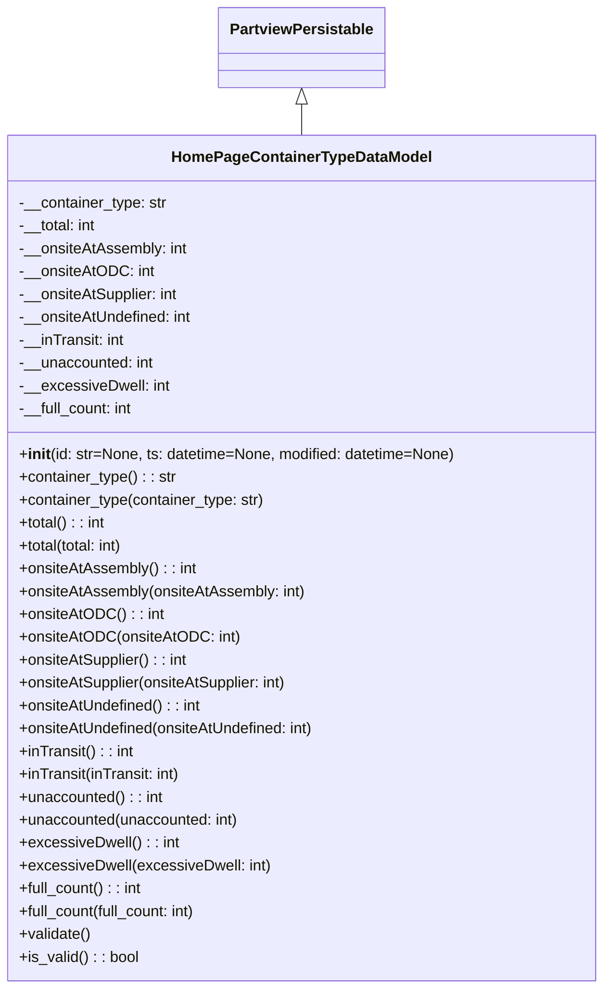

# Diagram: application_service/container_tracking_app_service/core/datamodel/container_type_in_homepage/HomePageContainerTypeDataModel.py

> Auto-generated by Obscura crawlers

## Mermaid

### SVG

<svg id="container" width="634.75" xmlns="http://www.w3.org/2000/svg" class="classDiagram" height="1038" viewBox="0 0 634.75 1038" role="graphics-document document" aria-roledescription="class"><g><defs><marker id="container_class-aggregationStart" class="marker aggregation class" refX="18" refY="7" markerWidth="190" markerHeight="240" orient="auto"><path d="M 18,7 L9,13 L1,7 L9,1 Z"></path></marker></defs><defs><marker id="container_class-aggregationEnd" class="marker aggregation class" refX="1" refY="7" markerWidth="20" markerHeight="28" orient="auto"><path d="M 18,7 L9,13 L1,7 L9,1 Z"></path></marker></defs><defs><marker id="container_class-extensionStart" class="marker extension class" refX="18" refY="7" markerWidth="190" markerHeight="240" orient="auto"><path d="M 1,7 L18,13 V 1 Z"></path></marker></defs><defs><marker id="container_class-extensionEnd" class="marker extension class" refX="1" refY="7" markerWidth="20" markerHeight="28" orient="auto"><path d="M 1,1 V 13 L18,7 Z"></path></marker></defs><defs><marker id="container_class-compositionStart" class="marker composition class" refX="18" refY="7" markerWidth="190" markerHeight="240" orient="auto"><path d="M 18,7 L9,13 L1,7 L9,1 Z"></path></marker></defs><defs><marker id="container_class-compositionEnd" class="marker composition class" refX="1" refY="7" markerWidth="20" markerHeight="28" orient="auto"><path d="M 18,7 L9,13 L1,7 L9,1 Z"></path></marker></defs><defs><marker id="container_class-dependencyStart" class="marker dependency class" refX="6" refY="7" markerWidth="190" markerHeight="240" orient="auto"><path d="M 5,7 L9,13 L1,7 L9,1 Z"></path></marker></defs><defs><marker id="container_class-dependencyEnd" class="marker dependency class" refX="13" refY="7" markerWidth="20" markerHeight="28" orient="auto"><path d="M 18,7 L9,13 L14,7 L9,1 Z"></path></marker></defs><defs><marker id="container_class-lollipopStart" class="marker lollipop class" refX="13" refY="7" markerWidth="190" markerHeight="240" orient="auto"><circle stroke="black" fill="transparent" cx="7" cy="7" r="6"></circle></marker></defs><defs><marker id="container_class-lollipopEnd" class="marker lollipop class" refX="1" refY="7" markerWidth="190" markerHeight="240" orient="auto"><circle stroke="black" fill="transparent" cx="7" cy="7" r="6"></circle></marker></defs><g class="root"><g class="clusters"></g><g class="edgePaths"><path d="M317.375,109.25L317.375,110.542C317.375,111.833,317.375,114.417,317.375,119.875C317.375,125.333,317.375,133.667,317.375,137.833L317.375,142" id="id_PartviewPersistable_HomePageContainerTypeDataModel_1" class="edge-thickness-normal edge-pattern-solid relation" style=";;;" data-edge="true" data-et="edge" data-id="id_PartviewPersistable_HomePageContainerTypeDataModel_1" data-points="W3sieCI6MzE3LjM3NSwieSI6OTJ9LHsieCI6MzE3LjM3NSwieSI6MTE3fSx7IngiOjMxNy4zNzUsInkiOjE0Mn1d" marker-start="url(#container_class-extensionStart)"></path></g><g class="edgeLabels"><g class="edgeLabel"><g class="label" data-id="id_PartviewPersistable_HomePageContainerTypeDataModel_1" transform="translate(0, 0)"><foreignObject width="0" height="0">

</foreignObject></g></g></g><g class="nodes"><g class="node default" id="classId-PartviewPersistable-0" transform="translate(317.375, 50)"><g class="basic label-container"><path d="M-84.7734375 -42 L84.7734375 -42 L84.7734375 42 L-84.7734375 42" stroke="none" stroke-width="0" fill="#ECECFF" style=""></path><path d="M-84.7734375 -42 C-39.6698935024524 -42, 5.433650495095193 -42, 84.7734375 -42 M-84.7734375 -42 C-33.8321330381233 -42, 17.109171423753395 -42, 84.7734375 -42 M84.7734375 -42 C84.7734375 -20.412578591044912, 84.7734375 1.174842817910175, 84.7734375 42 M84.7734375 -42 C84.7734375 -12.986408154655802, 84.7734375 16.027183690688396, 84.7734375 42 M84.7734375 42 C50.73704121043443 42, 16.700644920868854 42, -84.7734375 42 M84.7734375 42 C21.941926023211202 42, -40.889585453577595 42, -84.7734375 42 M-84.7734375 42 C-84.7734375 22.40823396153698, -84.7734375 2.816467923073958, -84.7734375 -42 M-84.7734375 42 C-84.7734375 21.62920928358093, -84.7734375 1.2584185671618613, -84.7734375 -42" stroke="#9370DB" stroke-width="1.3" fill="none" stroke-dasharray="0 0" style=""></path></g><g class="annotation-group text" transform="translate(0, -18)"></g><g class="label-group text" transform="translate(-72.7734375, -18)"><g class="label" style="font-weight: bolder" transform="translate(0,-12)"><foreignObject width="145.546875" height="24">

PartviewPersistable

</foreignObject></g></g><g class="members-group text" transform="translate(-72.7734375, 30)"></g><g class="methods-group text" transform="translate(-72.7734375, 60)"></g><g class="divider" style=""><path d="M-84.7734375 6 C-26.147131585394327 6, 32.47917432921135 6, 84.7734375 6 M-84.7734375 6 C-36.45881046555494 6, 11.85581656889012 6, 84.7734375 6" stroke="#9370DB" stroke-width="1.3" fill="none" stroke-dasharray="0 0" style=""></path></g><g class="divider" style=""><path d="M-84.7734375 24 C-24.53733058245485 24, 35.6987763350903 24, 84.7734375 24 M-84.7734375 24 C-32.8152222356947 24, 19.142993028610604 24, 84.7734375 24" stroke="#9370DB" stroke-width="1.3" fill="none" stroke-dasharray="0 0" style=""></path></g></g><g class="node default" id="classId-HomePageContainerTypeDataModel-1" transform="translate(317.375, 586)"><g class="basic label-container"><path d="M-309.375 -444 L309.375 -444 L309.375 444 L-309.375 444" stroke="none" stroke-width="0" fill="#ECECFF" style=""></path><path d="M-309.375 -444 C-70.66304336167741 -444, 168.04891327664518 -444, 309.375 -444 M-309.375 -444 C-68.65065528045551 -444, 172.07368943908898 -444, 309.375 -444 M309.375 -444 C309.375 -235.78996886664908, 309.375 -27.579937733298152, 309.375 444 M309.375 -444 C309.375 -193.263584423798, 309.375 57.47283115240401, 309.375 444 M309.375 444 C104.97773322151198 444, -99.41953355697603 444, -309.375 444 M309.375 444 C137.90300636623166 444, -33.56898726753667 444, -309.375 444 M-309.375 444 C-309.375 173.40750795200768, -309.375 -97.18498409598465, -309.375 -444 M-309.375 444 C-309.375 134.25358315487802, -309.375 -175.49283369024397, -309.375 -444" stroke="#9370DB" stroke-width="1.3" fill="none" stroke-dasharray="0 0" style=""></path></g><g class="annotation-group text" transform="translate(0, -420)"></g><g class="label-group text" transform="translate(-130.890625, -420)"><g class="label" style="font-weight: bolder" transform="translate(0,-12)"><foreignObject width="261.78125" height="24">

HomePageContainerTypeDataModel

</foreignObject></g></g><g class="members-group text" transform="translate(-297.375, -372)"><g class="label" style="" transform="translate(0,-12)"><foreignObject width="156.546875" height="24">

-__container_type: str

</foreignObject></g><g class="label" style="" transform="translate(0,12)"><foreignObject width="83.015625" height="24">

-__total: int

</foreignObject></g><g class="label" style="" transform="translate(0,36)"><foreignObject width="177.34375" height="24">

-__onsiteAtAssembly: int

</foreignObject></g><g class="label" style="" transform="translate(0,60)"><foreignObject width="139.3125" height="24">

-__onsiteAtODC: int

</foreignObject></g><g class="label" style="" transform="translate(0,84)"><foreignObject width="170.28125" height="24">

-__onsiteAtSupplier: int

</foreignObject></g><g class="label" style="" transform="translate(0,108)"><foreignObject width="184.109375" height="24">

-__onsiteAtUndefined: int

</foreignObject></g><g class="label" style="" transform="translate(0,132)"><foreignObject width="112.59375" height="24">

-__inTransit: int

</foreignObject></g><g class="label" style="" transform="translate(0,156)"><foreignObject width="142.984375" height="24">

-__unaccounted: int

</foreignObject></g><g class="label" style="" transform="translate(0,180)"><foreignObject width="157.171875" height="24">

-__excessiveDwell: int

</foreignObject></g><g class="label" style="" transform="translate(0,204)"><foreignObject width="122.328125" height="24">

-__full_count: int

</foreignObject></g></g><g class="methods-group text" transform="translate(-297.375, -108)"><g class="label" style="" transform="translate(0,-12)"><foreignObject width="463.859375" height="24">

+<strong>init</strong>(id: str=None, ts: datetime=None, modified: datetime=None)

</foreignObject></g><g class="label" style="" transform="translate(0,12)"><foreignObject width="165.890625" height="24">

+container_type() : : str

</foreignObject></g><g class="label" style="" transform="translate(0,36)"><foreignObject width="261.28125" height="24">

+container_type(container_type: str)

</foreignObject></g><g class="label" style="" transform="translate(0,60)"><foreignObject width="92.125" height="24">

+total() : : int

</foreignObject></g><g class="label" style="" transform="translate(0,84)"><foreignObject width="113.734375" height="24">

+total(total: int)

</foreignObject></g><g class="label" style="" transform="translate(0,108)"><foreignObject width="186.609375" height="24">

+onsiteAtAssembly() : : int

</foreignObject></g><g class="label" style="" transform="translate(0,132)"><foreignObject width="302.546875" height="24">

+onsiteAtAssembly(onsiteAtAssembly: int)

</foreignObject></g><g class="label" style="" transform="translate(0,156)"><foreignObject width="148.671875" height="24">

+onsiteAtODC() : : int

</foreignObject></g><g class="label" style="" transform="translate(0,180)"><foreignObject width="226.578125" height="24">

+onsiteAtODC(onsiteAtODC: int)

</foreignObject></g><g class="label" style="" transform="translate(0,204)"><foreignObject width="179.46875" height="24">

+onsiteAtSupplier() : : int

</foreignObject></g><g class="label" style="" transform="translate(0,228)"><foreignObject width="288.34375" height="24">

+onsiteAtSupplier(onsiteAtSupplier: int)

</foreignObject></g><g class="label" style="" transform="translate(0,252)"><foreignObject width="193.453125" height="24">

+onsiteAtUndefined() : : int

</foreignObject></g><g class="label" style="" transform="translate(0,276)"><foreignObject width="316.15625" height="24">

+onsiteAtUndefined(onsiteAtUndefined: int)

</foreignObject></g><g class="label" style="" transform="translate(0,300)"><foreignObject width="121.5625" height="24">

+inTransit() : : int

</foreignObject></g><g class="label" style="" transform="translate(0,324)"><foreignObject width="172.4375" height="24">

+inTransit(inTransit: int)

</foreignObject></g><g class="label" style="" transform="translate(0,348)"><foreignObject width="152.328125" height="24">

+unaccounted() : : int

</foreignObject></g><g class="label" style="" transform="translate(0,372)"><foreignObject width="233.90625" height="24">

+unaccounted(unaccounted: int)

</foreignObject></g><g class="label" style="" transform="translate(0,396)"><foreignObject width="166.359375" height="24">

+excessiveDwell() : : int

</foreignObject></g><g class="label" style="" transform="translate(0,420)"><foreignObject width="262.140625" height="24">

+excessiveDwell(excessiveDwell: int)

</foreignObject></g><g class="label" style="" transform="translate(0,444)"><foreignObject width="131.375" height="24">

+full_count() : : int

</foreignObject></g><g class="label" style="" transform="translate(0,468)"><foreignObject width="192.296875" height="24">

+full_count(full_count: int)

</foreignObject></g><g class="label" style="" transform="translate(0,492)"><foreignObject width="76.09375" height="24">

+validate()

</foreignObject></g><g class="label" style="" transform="translate(0,516)"><foreignObject width="126.078125" height="24">

+is_valid() : : bool

</foreignObject></g></g><g class="divider" style=""><path d="M-309.375 -396 C-177.31983379151185 -396, -45.26466758302371 -396, 309.375 -396 M-309.375 -396 C-120.89877706610136 -396, 67.57744586779728 -396, 309.375 -396" stroke="#9370DB" stroke-width="1.3" fill="none" stroke-dasharray="0 0" style=""></path></g><g class="divider" style=""><path d="M-309.375 -132 C-151.69904325496944 -132, 5.976913490061122 -132, 309.375 -132 M-309.375 -132 C-124.04368966108945 -132, 61.28762067782111 -132, 309.375 -132" stroke="#9370DB" stroke-width="1.3" fill="none" stroke-dasharray="0 0" style=""></path></g></g></g></g></g></svg>
