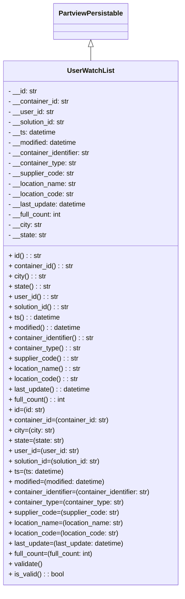

# Diagram: application_service/container_tracking_app_service/core/datamodel/watched_list/UserWatchList.py

> Auto-generated by Obscura crawlers

## Mermaid

### SVG

<svg id="container" width="436.140625" xmlns="http://www.w3.org/2000/svg" class="classDiagram" height="1374" viewBox="0 0 436.140625 1374" role="graphics-document document" aria-roledescription="class"><g><defs><marker id="container_class-aggregationStart" class="marker aggregation class" refX="18" refY="7" markerWidth="190" markerHeight="240" orient="auto"><path d="M 18,7 L9,13 L1,7 L9,1 Z"></path></marker></defs><defs><marker id="container_class-aggregationEnd" class="marker aggregation class" refX="1" refY="7" markerWidth="20" markerHeight="28" orient="auto"><path d="M 18,7 L9,13 L1,7 L9,1 Z"></path></marker></defs><defs><marker id="container_class-extensionStart" class="marker extension class" refX="18" refY="7" markerWidth="190" markerHeight="240" orient="auto"><path d="M 1,7 L18,13 V 1 Z"></path></marker></defs><defs><marker id="container_class-extensionEnd" class="marker extension class" refX="1" refY="7" markerWidth="20" markerHeight="28" orient="auto"><path d="M 1,1 V 13 L18,7 Z"></path></marker></defs><defs><marker id="container_class-compositionStart" class="marker composition class" refX="18" refY="7" markerWidth="190" markerHeight="240" orient="auto"><path d="M 18,7 L9,13 L1,7 L9,1 Z"></path></marker></defs><defs><marker id="container_class-compositionEnd" class="marker composition class" refX="1" refY="7" markerWidth="20" markerHeight="28" orient="auto"><path d="M 18,7 L9,13 L1,7 L9,1 Z"></path></marker></defs><defs><marker id="container_class-dependencyStart" class="marker dependency class" refX="6" refY="7" markerWidth="190" markerHeight="240" orient="auto"><path d="M 5,7 L9,13 L1,7 L9,1 Z"></path></marker></defs><defs><marker id="container_class-dependencyEnd" class="marker dependency class" refX="13" refY="7" markerWidth="20" markerHeight="28" orient="auto"><path d="M 18,7 L9,13 L14,7 L9,1 Z"></path></marker></defs><defs><marker id="container_class-lollipopStart" class="marker lollipop class" refX="13" refY="7" markerWidth="190" markerHeight="240" orient="auto"><circle stroke="black" fill="transparent" cx="7" cy="7" r="6"></circle></marker></defs><defs><marker id="container_class-lollipopEnd" class="marker lollipop class" refX="1" refY="7" markerWidth="190" markerHeight="240" orient="auto"><circle stroke="black" fill="transparent" cx="7" cy="7" r="6"></circle></marker></defs><g class="root"><g class="clusters"></g><g class="edgePaths"><path d="M218.07,109.25L218.07,110.542C218.07,111.833,218.07,114.417,218.07,119.875C218.07,125.333,218.07,133.667,218.07,137.833L218.07,142" id="id_PartviewPersistable_UserWatchList_1" class="edge-thickness-normal edge-pattern-solid relation" style=";;;" data-edge="true" data-et="edge" data-id="id_PartviewPersistable_UserWatchList_1" data-points="W3sieCI6MjE4LjA3MDMxMjUsInkiOjkyfSx7IngiOjIxOC4wNzAzMTI1LCJ5IjoxMTd9LHsieCI6MjE4LjA3MDMxMjUsInkiOjE0Mn1d" marker-start="url(#container_class-extensionStart)"></path></g><g class="edgeLabels"><g class="edgeLabel"><g class="label" data-id="id_PartviewPersistable_UserWatchList_1" transform="translate(0, 0)"><foreignObject width="0" height="0">

</foreignObject></g></g></g><g class="nodes"><g class="node default" id="classId-PartviewPersistable-0" transform="translate(218.0703125, 50)"><g class="basic label-container"><path d="M-84.7734375 -42 L84.7734375 -42 L84.7734375 42 L-84.7734375 42" stroke="none" stroke-width="0" fill="#ECECFF" style=""></path><path d="M-84.7734375 -42 C-20.710311882332604 -42, 43.35281373533479 -42, 84.7734375 -42 M-84.7734375 -42 C-33.50323238975911 -42, 17.766972720481775 -42, 84.7734375 -42 M84.7734375 -42 C84.7734375 -12.421157266179886, 84.7734375 17.157685467640228, 84.7734375 42 M84.7734375 -42 C84.7734375 -15.92593346558506, 84.7734375 10.148133068829878, 84.7734375 42 M84.7734375 42 C42.30113018128827 42, -0.17117713742345586 42, -84.7734375 42 M84.7734375 42 C32.01041913555705 42, -20.7525992288859 42, -84.7734375 42 M-84.7734375 42 C-84.7734375 17.867002769101717, -84.7734375 -6.265994461796566, -84.7734375 -42 M-84.7734375 42 C-84.7734375 24.53593680868439, -84.7734375 7.07187361736878, -84.7734375 -42" stroke="#9370DB" stroke-width="1.3" fill="none" stroke-dasharray="0 0" style=""></path></g><g class="annotation-group text" transform="translate(0, -18)"></g><g class="label-group text" transform="translate(-72.7734375, -18)"><g class="label" style="font-weight: bolder" transform="translate(0,-12)"><foreignObject width="145.546875" height="24">

PartviewPersistable

</foreignObject></g></g><g class="members-group text" transform="translate(-72.7734375, 30)"></g><g class="methods-group text" transform="translate(-72.7734375, 60)"></g><g class="divider" style=""><path d="M-84.7734375 6 C-29.927544682639116 6, 24.918348134721768 6, 84.7734375 6 M-84.7734375 6 C-43.71546086127601 6, -2.6574842225520143 6, 84.7734375 6" stroke="#9370DB" stroke-width="1.3" fill="none" stroke-dasharray="0 0" style=""></path></g><g class="divider" style=""><path d="M-84.7734375 24 C-38.721500034963725 24, 7.33043743007255 24, 84.7734375 24 M-84.7734375 24 C-27.721568091956797 24, 29.330301316086405 24, 84.7734375 24" stroke="#9370DB" stroke-width="1.3" fill="none" stroke-dasharray="0 0" style=""></path></g></g><g class="node default" id="classId-UserWatchList-1" transform="translate(218.0703125, 754)"><g class="basic label-container"><path d="M-210.0703125 -612 L210.0703125 -612 L210.0703125 612 L-210.0703125 612" stroke="none" stroke-width="0" fill="#ECECFF" style=""></path><path d="M-210.0703125 -612 C-81.52658690668898 -612, 47.01713868662205 -612, 210.0703125 -612 M-210.0703125 -612 C-87.91102708620288 -612, 34.24825832759424 -612, 210.0703125 -612 M210.0703125 -612 C210.0703125 -267.46087666912, 210.0703125 77.07824666175998, 210.0703125 612 M210.0703125 -612 C210.0703125 -140.35773204695192, 210.0703125 331.28453590609615, 210.0703125 612 M210.0703125 612 C46.931746235355064 612, -116.20682002928987 612, -210.0703125 612 M210.0703125 612 C101.315776937484 612, -7.438758625031994 612, -210.0703125 612 M-210.0703125 612 C-210.0703125 159.92908011501015, -210.0703125 -292.1418397699797, -210.0703125 -612 M-210.0703125 612 C-210.0703125 170.07647339442303, -210.0703125 -271.84705321115393, -210.0703125 -612" stroke="#9370DB" stroke-width="1.3" fill="none" stroke-dasharray="0 0" style=""></path></g><g class="annotation-group text" transform="translate(0, -588)"></g><g class="label-group text" transform="translate(-52.28125, -588)"><g class="label" style="font-weight: bolder" transform="translate(0,-12)"><foreignObject width="104.5625" height="24">

UserWatchList

</foreignObject></g></g><g class="members-group text" transform="translate(-198.0703125, -540)"><g class="label" style="" transform="translate(0,-12)"><foreignObject width="68.765625" height="24">

- __id: str

</foreignObject></g><g class="label" style="" transform="translate(0,12)"><foreignObject width="144.6875" height="24">

- __container_id: str

</foreignObject></g><g class="label" style="" transform="translate(0,36)"><foreignObject width="107.15625" height="24">

- __user_id: str

</foreignObject></g><g class="label" style="" transform="translate(0,60)"><foreignObject width="136.90625" height="24">

- __solution_id: str

</foreignObject></g><g class="label" style="" transform="translate(0,84)"><foreignObject width="113.4375" height="24">

- __ts: datetime

</foreignObject></g><g class="label" style="" transform="translate(0,108)"><foreignObject width="165.125" height="24">

- __modified: datetime

</foreignObject></g><g class="label" style="" transform="translate(0,132)"><foreignObject width="197.3125" height="24">

- __container_identifier: str

</foreignObject></g><g class="label" style="" transform="translate(0,156)"><foreignObject width="162.078125" height="24">

- __container_type: str

</foreignObject></g><g class="label" style="" transform="translate(0,180)"><foreignObject width="156.25" height="24">

- __supplier_code: str

</foreignObject></g><g class="label" style="" transform="translate(0,204)"><foreignObject width="162.5" height="24">

- __location_name: str

</foreignObject></g><g class="label" style="" transform="translate(0,228)"><foreignObject width="156.625" height="24">

- __location_code: str

</foreignObject></g><g class="label" style="" transform="translate(0,252)"><foreignObject width="186.09375" height="24">

- __last_update: datetime

</foreignObject></g><g class="label" style="" transform="translate(0,276)"><foreignObject width="127.84375" height="24">

- __full_count: int

</foreignObject></g><g class="label" style="" transform="translate(0,300)"><foreignObject width="80.15625" height="24">

- __city: str

</foreignObject></g><g class="label" style="" transform="translate(0,324)"><foreignObject width="90.78125" height="24">

- __state: str

</foreignObject></g></g><g class="methods-group text" transform="translate(-198.0703125, -156)"><g class="label" style="" transform="translate(0,-12)"><foreignObject width="76.5" height="24">

+ id() : : str

</foreignObject></g><g class="label" style="" transform="translate(0,12)"><foreignObject width="152.75" height="24">

+ container_id() : : str

</foreignObject></g><g class="label" style="" transform="translate(0,36)"><foreignObject width="88.15625" height="24">

+ city() : : str

</foreignObject></g><g class="label" style="" transform="translate(0,60)"><foreignObject width="98.515625" height="24">

+ state() : : str

</foreignObject></g><g class="label" style="" transform="translate(0,84)"><foreignObject width="115.21875" height="24">

+ user_id() : : str

</foreignObject></g><g class="label" style="" transform="translate(0,108)"><foreignObject width="144.640625" height="24">

+ solution_id() : : str

</foreignObject></g><g class="label" style="" transform="translate(0,132)"><foreignObject width="121.5" height="24">

+ ts() : : datetime

</foreignObject></g><g class="label" style="" transform="translate(0,156)"><foreignObject width="172.875" height="24">

+ modified() : : datetime

</foreignObject></g><g class="label" style="" transform="translate(0,180)"><foreignObject width="205.21875" height="24">

+ container_identifier() : : str

</foreignObject></g><g class="label" style="" transform="translate(0,204)"><foreignObject width="170.140625" height="24">

+ container_type() : : str

</foreignObject></g><g class="label" style="" transform="translate(0,228)"><foreignObject width="163.984375" height="24">

+ supplier_code() : : str

</foreignObject></g><g class="label" style="" transform="translate(0,252)"><foreignObject width="170.40625" height="24">

+ location_name() : : str

</foreignObject></g><g class="label" style="" transform="translate(0,276)"><foreignObject width="164.53125" height="24">

+ location_code() : : str

</foreignObject></g><g class="label" style="" transform="translate(0,300)"><foreignObject width="193.984375" height="24">

+ last_update() : : datetime

</foreignObject></g><g class="label" style="" transform="translate(0,324)"><foreignObject width="135.84375" height="24">

+ full_count() : : int

</foreignObject></g><g class="label" style="" transform="translate(0,348)"><foreignObject width="86.265625" height="24">

+ id=(id: str)

</foreignObject></g><g class="label" style="" transform="translate(0,372)"><foreignObject width="238.75" height="24">

+ container_id=(container_id: str)

</foreignObject></g><g class="label" style="" transform="translate(0,396)"><foreignObject width="109.625" height="24">

+ city=(city: str)

</foreignObject></g><g class="label" style="" transform="translate(0,420)"><foreignObject width="130.296875" height="24">

+ state=(state: str)

</foreignObject></g><g class="label" style="" transform="translate(0,444)"><foreignObject width="163.703125" height="24">

+ user_id=(user_id: str)

</foreignObject></g><g class="label" style="" transform="translate(0,468)"><foreignObject width="222.546875" height="24">

+ solution_id=(solution_id: str)

</foreignObject></g><g class="label" style="" transform="translate(0,492)"><foreignObject width="130.421875" height="24">

+ ts=(ts: datetime)

</foreignObject></g><g class="label" style="" transform="translate(0,516)"><foreignObject width="233.171875" height="24">

+ modified=(modified: datetime)

</foreignObject></g><g class="label" style="" transform="translate(0,540)"><foreignObject width="343.859375" height="24">

+ container_identifier=(container_identifier: str)

</foreignObject></g><g class="label" style="" transform="translate(0,564)"><foreignObject width="273.53125" height="24">

+ container_type=(container_type: str)

</foreignObject></g><g class="label" style="" transform="translate(0,588)"><foreignObject width="261.234375" height="24">

+ supplier_code=(supplier_code: str)

</foreignObject></g><g class="label" style="" transform="translate(0,612)"><foreignObject width="274.078125" height="24">

+ location_name=(location_name: str)

</foreignObject></g><g class="label" style="" transform="translate(0,636)"><foreignObject width="262.328125" height="24">

+ location_code=(location_code: str)

</foreignObject></g><g class="label" style="" transform="translate(0,660)"><foreignObject width="275.421875" height="24">

+ last_update=(last_update: datetime)

</foreignObject></g><g class="label" style="" transform="translate(0,684)"><foreignObject width="204.78125" height="24">

+ full_count=(full_count: int)

</foreignObject></g><g class="label" style="" transform="translate(0,708)"><foreignObject width="80.484375" height="24">

+ validate()

</foreignObject></g><g class="label" style="" transform="translate(0,732)"><foreignObject width="130.3125" height="24">

+ is_valid() : : bool

</foreignObject></g></g><g class="divider" style=""><path d="M-210.0703125 -564 C-68.04254149304444 -564, 73.98522951391112 -564, 210.0703125 -564 M-210.0703125 -564 C-89.85354646830415 -564, 30.36321956339171 -564, 210.0703125 -564" stroke="#9370DB" stroke-width="1.3" fill="none" stroke-dasharray="0 0" style=""></path></g><g class="divider" style=""><path d="M-210.0703125 -180 C-49.511141316239474 -180, 111.04802986752105 -180, 210.0703125 -180 M-210.0703125 -180 C-82.89643163754555 -180, 44.277449224908906 -180, 210.0703125 -180" stroke="#9370DB" stroke-width="1.3" fill="none" stroke-dasharray="0 0" style=""></path></g></g></g></g></g></svg>
