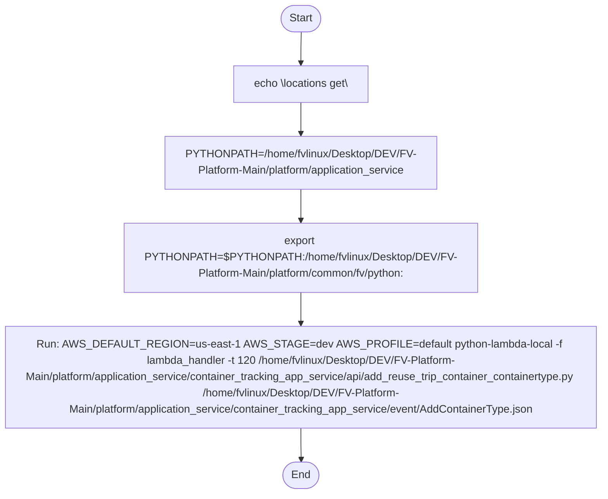

# Diagram: application_service/container_tracking_app_service/event/AddContainerType.sh

> Auto-generated by Obscura crawlers

## Mermaid

### SVG

<svg id="container" width="924.125" xmlns="http://www.w3.org/2000/svg" class="flowchart" height="728" viewBox="0 0 924.125 728" role="graphics-document document" aria-roledescription="flowchart-v2"><g><marker id="container_flowchart-v2-pointEnd" class="marker flowchart-v2" viewBox="0 0 10 10" refX="5" refY="5" markerUnits="userSpaceOnUse" markerWidth="8" markerHeight="8" orient="auto"><path d="M 0 0 L 10 5 L 0 10 z" class="arrowMarkerPath" style="stroke-width: 1; stroke-dasharray: 1, 0;"></path></marker><marker id="container_flowchart-v2-pointStart" class="marker flowchart-v2" viewBox="0 0 10 10" refX="4.5" refY="5" markerUnits="userSpaceOnUse" markerWidth="8" markerHeight="8" orient="auto"><path d="M 0 5 L 10 10 L 10 0 z" class="arrowMarkerPath" style="stroke-width: 1; stroke-dasharray: 1, 0;"></path></marker><marker id="container_flowchart-v2-circleEnd" class="marker flowchart-v2" viewBox="0 0 10 10" refX="11" refY="5" markerUnits="userSpaceOnUse" markerWidth="11" markerHeight="11" orient="auto"><circle cx="5" cy="5" r="5" class="arrowMarkerPath" style="stroke-width: 1; stroke-dasharray: 1, 0;"></circle></marker><marker id="container_flowchart-v2-circleStart" class="marker flowchart-v2" viewBox="0 0 10 10" refX="-1" refY="5" markerUnits="userSpaceOnUse" markerWidth="11" markerHeight="11" orient="auto"><circle cx="5" cy="5" r="5" class="arrowMarkerPath" style="stroke-width: 1; stroke-dasharray: 1, 0;"></circle></marker><marker id="container_flowchart-v2-crossEnd" class="marker cross flowchart-v2" viewBox="0 0 11 11" refX="12" refY="5.2" markerUnits="userSpaceOnUse" markerWidth="11" markerHeight="11" orient="auto"><path d="M 1,1 l 9,9 M 10,1 l -9,9" class="arrowMarkerPath" style="stroke-width: 2; stroke-dasharray: 1, 0;"></path></marker><marker id="container_flowchart-v2-crossStart" class="marker cross flowchart-v2" viewBox="0 0 11 11" refX="-1" refY="5.2" markerUnits="userSpaceOnUse" markerWidth="11" markerHeight="11" orient="auto"><path d="M 1,1 l 9,9 M 10,1 l -9,9" class="arrowMarkerPath" style="stroke-width: 2; stroke-dasharray: 1, 0;"></path></marker><g class="root"><g class="clusters"></g><g class="edgePaths"><path d="M462.563,47.5L462.479,51.583C462.396,55.667,462.229,63.833,462.146,71.417C462.063,79,462.063,86,462.063,89.5L462.063,93" id="L_Start_Echo_0" class="edge-thickness-normal edge-pattern-solid edge-thickness-normal edge-pattern-solid flowchart-link" style=";" data-edge="true" data-et="edge" data-id="L_Start_Echo_0" data-points="W3sieCI6NDYyLjU2MjUsInkiOjQ3LjV9LHsieCI6NDYyLjA2MjUsInkiOjcyfSx7IngiOjQ2Mi4wNjI1LCJ5Ijo5N31d" marker-end="url(#container_flowchart-v2-pointEnd)"></path><path d="M462.063,151L462.063,155.167C462.063,159.333,462.063,167.667,462.063,175.333C462.063,183,462.063,190,462.063,193.5L462.063,197" id="L_Echo_Set1_0" class="edge-thickness-normal edge-pattern-solid edge-thickness-normal edge-pattern-solid flowchart-link" style=";" data-edge="true" data-et="edge" data-id="L_Echo_Set1_0" data-points="W3sieCI6NDYyLjA2MjUsInkiOjE1MX0seyJ4Ijo0NjIuMDYyNSwieSI6MTc2fSx7IngiOjQ2Mi4wNjI1LCJ5IjoyMDF9XQ==" marker-end="url(#container_flowchart-v2-pointEnd)"></path><path d="M462.063,279L462.063,283.167C462.063,287.333,462.063,295.667,462.063,303.333C462.063,311,462.063,318,462.063,321.5L462.063,325" id="L_Set1_Append_0" class="edge-thickness-normal edge-pattern-solid edge-thickness-normal edge-pattern-solid flowchart-link" style=";" data-edge="true" data-et="edge" data-id="L_Set1_Append_0" data-points="W3sieCI6NDYyLjA2MjUsInkiOjI3OX0seyJ4Ijo0NjIuMDYyNSwieSI6MzA0fSx7IngiOjQ2Mi4wNjI1LCJ5IjozMjl9XQ==" marker-end="url(#container_flowchart-v2-pointEnd)"></path><path d="M462.063,431L462.063,435.167C462.063,439.333,462.063,447.667,462.063,455.333C462.063,463,462.063,470,462.063,473.5L462.063,477" id="L_Append_RunCmd_0" class="edge-thickness-normal edge-pattern-solid edge-thickness-normal edge-pattern-solid flowchart-link" style=";" data-edge="true" data-et="edge" data-id="L_Append_RunCmd_0" data-points="W3sieCI6NDYyLjA2MjUsInkiOjQzMX0seyJ4Ijo0NjIuMDYyNSwieSI6NDU2fSx7IngiOjQ2Mi4wNjI1LCJ5Ijo0ODF9XQ==" marker-end="url(#container_flowchart-v2-pointEnd)"></path><path d="M462.063,631L462.063,635.167C462.063,639.333,462.063,647.667,462.133,655.417C462.203,663.167,462.344,670.334,462.414,673.917L462.484,677.501" id="L_RunCmd_End_0" class="edge-thickness-normal edge-pattern-solid edge-thickness-normal edge-pattern-solid flowchart-link" style=";" data-edge="true" data-et="edge" data-id="L_RunCmd_End_0" data-points="W3sieCI6NDYyLjA2MjUsInkiOjYzMX0seyJ4Ijo0NjIuMDYyNSwieSI6NjU2fSx7IngiOjQ2Mi41NjI1LCJ5Ijo2ODEuNX1d" marker-end="url(#container_flowchart-v2-pointEnd)"></path></g><g class="edgeLabels"><g class="edgeLabel"><g class="label" data-id="L_Start_Echo_0" transform="translate(0, 0)"><foreignObject width="0" height="0">

</foreignObject></g></g><g class="edgeLabel"><g class="label" data-id="L_Echo_Set1_0" transform="translate(0, 0)"><foreignObject width="0" height="0">

</foreignObject></g></g><g class="edgeLabel"><g class="label" data-id="L_Set1_Append_0" transform="translate(0, 0)"><foreignObject width="0" height="0">

</foreignObject></g></g><g class="edgeLabel"><g class="label" data-id="L_Append_RunCmd_0" transform="translate(0, 0)"><foreignObject width="0" height="0">

</foreignObject></g></g><g class="edgeLabel"><g class="label" data-id="L_RunCmd_End_0" transform="translate(0, 0)"><foreignObject width="0" height="0">

</foreignObject></g></g></g><g class="nodes"><g class="node default" id="flowchart-Start-0" transform="translate(462.0625, 27.5)"><g class="basic label-container outer-path"><path d="M-10.3984375 -19.5 C-3.5265240754215696 -19.5, 3.3453893491568607 -19.5, 10.3984375 -19.5 C10.3984375 -19.5, 10.3984375 -19.5, 10.398437499999998 -19.5 C10.887047182427454 -19.484331238505604, 11.37565686485491 -19.468662477011208, 11.6478067896239 -19.45993515863156 C12.06012488415767 -19.420159327936943, 12.47244297869144 -19.38038349724233, 12.892042152847864 -19.3399052695533 C13.26748415433479 -19.2792067183491, 13.642926155821716 -19.2185081671449, 14.126030759676757 -19.140403561325776 C14.563057345241177 -19.04065509503569, 15.000083930805598 -18.9409066287456, 15.34470188623539 -18.862249829261074 C15.7516924865419 -18.74145715542736, 16.15868308684841 -18.620664481593643, 16.543047751460602 -18.50658706670804 C16.801030890964178 -18.411646886600725, 17.059014030467754 -18.31670670649341, 17.716144095147794 -18.074876768247425 C18.089157753161217 -17.909754686901906, 18.46217141117464 -17.744632605556387, 18.85917041279238 -17.568892924097174 C19.1337903467389 -17.42562388045974, 19.408410280685413 -17.282354836822304, 19.967429764076783 -16.990714730406097 C20.324318794237488 -16.774366503009936, 20.681207824398193 -16.558018275613776, 21.036368073605697 -16.342718045390892 C21.388519087910353 -16.097072742183677, 21.74067010221501 -15.851427438976463, 22.061592844578712 -15.627565626425154 C22.296671125634976 -15.440096952978564, 22.531749406691244 -15.252628279531974, 23.03889120850187 -14.848196188198123 C23.269802235258574 -14.638488903268659, 23.500713262015278 -14.428781618339194, 23.964247236767985 -14.007812326905688 C24.1671197730996 -13.798329776998301, 24.36999230943121 -13.588847227090916, 24.833858442968648 -13.10986736009568 C25.0051505627652 -12.908657889384923, 25.17644268256175 -12.707448418674165, 25.644151408126582 -12.158051136245305 C25.81669854160734 -11.926853696748328, 25.989245675088096 -11.69565625725135, 26.391796464640635 -11.156274872382312 C26.562065733485948 -10.894695551735305, 26.73233500233126 -10.633116231088296, 27.073721378604247 -10.108655082055241 C27.3129524763412 -9.683876043247796, 27.552183574078146 -9.25909700444035, 27.6871239742735 -9.019496659696287 C27.891408868913143 -8.595294704980544, 28.095693763552784 -8.171092750264803, 28.22948364880834 -7.893275190886684 C28.36630327881016 -7.5553280595545935, 28.50312290881198 -7.217380928222504, 28.698571729970325 -6.734618561215508 C28.83796720682977 -6.314781594567967, 28.977362683689215 -5.8949446279204265, 29.09246063421488 -5.548287939305138 C29.219163464574844 -5.065115133788549, 29.34586629493481 -4.58194232827196, 29.40953178754556 -4.339158212148133 C29.471423100636137 -4.021359400161681, 29.53331441372671 -3.70356058817523, 29.648482276581777 -3.1121979531509023 C29.699174432141422 -2.71903960492865, 29.749866587701067 -2.3258812567063973, 29.808330202509367 -1.872449005199798 C29.838521057083533 -1.402202075587966, 29.868711911657698 -0.931955145976134, 29.888418715913414 -0.6250057626472757 C29.888418715913414 -0.22696010168167557, 29.888418715913414 0.17108555928392455, 29.888418715913414 0.625005762647271 C29.872129873711295 0.8787176280620559, 29.855841031509176 1.1324294934768406, 29.808330202509367 1.8724490051997846 C29.75926798543142 2.2529658724257393, 29.710205768353475 2.633482739651694, 29.648482276581777 3.1121979531508885 C29.569980493317143 3.5152880188570244, 29.491478710052508 3.91837808456316, 29.40953178754556 4.339158212148129 C29.284560308953328 4.815728623001753, 29.159588830361095 5.292299033855377, 29.092460634214884 5.548287939305125 C28.975712272634468 5.8999154030600325, 28.85896391105405 6.251542866814939, 28.69857172997033 6.734618561215495 C28.51476616532359 7.188621859531787, 28.330960600676846 7.642625157848078, 28.229483648808344 7.893275190886679 C28.04044646135967 8.2858149553717, 27.851409273911003 8.67835471985672, 27.687123974273504 9.019496659696284 C27.506810107212054 9.339662189422839, 27.326496240150604 9.659827719149396, 27.07372137860425 10.108655082055236 C26.832417057226735 10.479363318974148, 26.591112735849215 10.850071555893058, 26.39179646464064 11.156274872382301 C26.225733839426926 11.378783661552298, 26.05967121421321 11.601292450722294, 25.644151408126582 12.158051136245302 C25.326820983632057 12.530805509469246, 25.009490559137532 12.903559882693191, 24.83385844296866 13.10986736009567 C24.575293418563543 13.376856976377255, 24.316728394158428 13.643846592658837, 23.96424723676799 14.007812326905684 C23.76093369244248 14.192456308480507, 23.55762014811698 14.37710029005533, 23.038891208501887 14.848196188198111 C22.77325280020898 15.060035749876784, 22.50761439191607 15.271875311555457, 22.061592844578715 15.627565626425152 C21.743376351050944 15.84953967694014, 21.425159857523177 16.071513727455127, 21.036368073605708 16.34271804539089 C20.675347272696946 16.5615709764955, 20.31432647178819 16.78042390760011, 19.967429764076787 16.990714730406093 C19.733943089649518 17.112524578899446, 19.500456415222246 17.234334427392803, 18.859170412792388 17.56889292409717 C18.41570110751639 17.765203630493314, 17.972231802240398 17.961514336889454, 17.716144095147804 18.07487676824742 C17.295553854568126 18.229657864674305, 16.87496361398845 18.384438961101193, 16.543047751460616 18.506587066708033 C16.281865042676152 18.584104723699248, 16.020682333891692 18.661622380690464, 15.344701886235413 18.86224982926107 C15.083284079024207 18.92191673784641, 14.821866271813002 18.98158364643175, 14.126030759676766 19.140403561325773 C13.700500684484316 19.20919996384787, 13.274970609291865 19.277996366369965, 12.892042152847878 19.3399052695533 C12.442561351060638 19.38326614192196, 11.9930805492734 19.42662701429062, 11.6478067896239 19.45993515863156 C11.27822519983334 19.471786920869217, 10.90864361004278 19.483638683106875, 10.398437500000004 19.5 C10.398437500000002 19.5, 10.398437500000002 19.5, 10.3984375 19.5 C4.939764525339158 19.5, -0.5189084493216836 19.5, -10.398437499999996 19.5 C-10.658011099508174 19.491675979893134, -10.91758469901635 19.48335195978627, -11.647806789623893 19.45993515863156 C-12.058729398646413 19.4202939487459, -12.469652007668934 19.38065273886024, -12.892042152847871 19.3399052695533 C-13.204994703207378 19.289309528194448, -13.517947253566884 19.238713786835596, -14.126030759676759 19.140403561325773 C-14.432512330813879 19.070451142692885, -14.738993901950998 19.000498724059998, -15.344701886235388 18.862249829261074 C-15.787443428963618 18.73084646337712, -16.23018497169185 18.59944309749316, -16.54304775146059 18.506587066708043 C-16.90825633910847 18.372186930502448, -17.273464926756343 18.237786794296852, -17.716144095147797 18.074876768247425 C-17.96860124348054 17.963121477555745, -18.221058391813283 17.851366186864063, -18.85917041279238 17.568892924097174 C-19.2542486785635 17.362780845904087, -19.649326944334618 17.156668767711004, -19.96742976407678 16.990714730406097 C-20.244613138048166 16.82268454019433, -20.52179651201955 16.654654349982565, -21.036368073605686 16.3427180453909 C-21.246125694594316 16.196400209250296, -21.45588331558295 16.050082373109692, -22.061592844578712 15.627565626425156 C-22.298655629378775 15.438514364052748, -22.535718414178838 15.249463101680341, -23.03889120850187 14.848196188198125 C-23.377611802687998 14.5405791066141, -23.716332396874126 14.232962025030075, -23.964247236767974 14.007812326905697 C-24.26382857636045 13.698469997691062, -24.563409915952924 13.389127668476426, -24.833858442968655 13.109867360095677 C-25.066936734148882 12.836080336744901, -25.30001502532911 12.562293313394125, -25.64415140812658 12.158051136245307 C-25.795215234273947 11.955639371405514, -25.94627906042131 11.753227606565721, -26.391796464640635 11.156274872382316 C-26.563297762255264 10.892802824699592, -26.734799059869893 10.629330777016868, -27.073721378604244 10.108655082055249 C-27.266158340741736 9.76696376942469, -27.458595302879225 9.42527245679413, -27.6871239742735 9.019496659696289 C-27.813274631638873 8.75754212048543, -27.939425289004244 8.495587581274572, -28.22948364880834 7.893275190886686 C-28.402026244632143 7.467091643317745, -28.574568840455942 7.0409080957488035, -28.698571729970325 6.73461856121551 C-28.856073735027046 6.260247616521268, -29.013575740083763 5.785876671827028, -29.09246063421488 5.5482879393051325 C-29.163276717815023 5.278235520653015, -29.234092801415162 5.008183102000898, -29.409531787545557 4.339158212148136 C-29.491388358609232 3.918842020128587, -29.57324492967291 3.498525828109038, -29.648482276581777 3.112197953150904 C-29.70674914227779 2.6602916489066812, -29.765016007973802 2.208385344662459, -29.808330202509364 1.872449005199809 C-29.83221400454495 1.5004395098375443, -29.856097806580536 1.1284300144752792, -29.888418715913414 0.6250057626472781 C-29.888418715913414 0.2035057526310977, -29.888418715913414 -0.2179942573850827, -29.888418715913414 -0.6250057626472687 C-29.865094364729135 -0.9883013594198438, -29.841770013544853 -1.3515969561924188, -29.808330202509367 -1.8724490051997822 C-29.769201718734212 -2.1759217985667956, -29.73007323495906 -2.4793945919338087, -29.648482276581777 -3.112197953150895 C-29.56946603107038 -3.5179296737625116, -29.490449785558987 -3.923661394374128, -29.40953178754556 -4.339158212148126 C-29.340655723895154 -4.601812493921939, -29.27177966024475 -4.864466775695751, -29.092460634214884 -5.548287939305123 C-28.941571659095864 -6.002741491470249, -28.79068268397684 -6.457195043635374, -28.698571729970332 -6.734618561215485 C-28.589550984788474 -7.003901909587397, -28.480530239606612 -7.273185257959311, -28.229483648808344 -7.893275190886676 C-28.06101602527053 -8.243101815792642, -27.892548401732714 -8.592928440698609, -27.687123974273504 -9.019496659696282 C-27.5214764209728 -9.313620664215323, -27.355828867672095 -9.607744668734366, -27.073721378604247 -10.108655082055243 C-26.840755552815466 -10.466553150550276, -26.607789727026685 -10.824451219045306, -26.39179646464064 -11.156274872382308 C-26.2147901490119 -11.393447209717731, -26.037783833383163 -11.630619547053156, -25.644151408126586 -12.158051136245302 C-25.411630634621588 -12.431183267611097, -25.17910986111659 -12.70431539897689, -24.833858442968662 -13.10986736009567 C-24.642207317648857 -13.307762881838386, -24.45055619232905 -13.505658403581101, -23.964247236767996 -14.007812326905677 C-23.75584659250331 -14.197076278047973, -23.547445948238625 -14.386340229190271, -23.038891208501887 -14.848196188198107 C-22.825979482256162 -15.01798762406009, -22.613067756010434 -15.187779059922073, -22.06159284457872 -15.627565626425149 C-21.708799774784673 -15.873658799747629, -21.356006704990627 -16.11975197307011, -21.03636807360571 -16.342718045390885 C-20.73006894311472 -16.528398378308015, -20.423769812623725 -16.71407871122514, -19.96742976407679 -16.99071473040609 C-19.63237285321877 -17.165513706186527, -19.297315942360743 -17.340312681966964, -18.859170412792388 -17.56889292409717 C-18.591577669141156 -17.687348293854864, -18.323984925489924 -17.805803663612554, -17.716144095147804 -18.07487676824742 C-17.32164353350207 -18.22005662165627, -16.92714297185633 -18.365236475065114, -16.54304775146062 -18.506587066708033 C-16.299602381619675 -18.578840374606003, -16.056157011778733 -18.65109368250397, -15.344701886235413 -18.862249829261067 C-14.893269402106458 -18.965286347891237, -14.441836917977502 -19.068322866521406, -14.126030759676768 -19.140403561325773 C-13.703958290213317 -19.20864096496774, -13.281885820749865 -19.2768783686097, -12.89204215284788 -19.3399052695533 C-12.61691225240957 -19.366446720156468, -12.34178235197126 -19.392988170759633, -11.647806789623903 -19.45993515863156 C-11.201190625824262 -19.474257269718986, -10.754574462024621 -19.488579380806414, -10.398437500000005 -19.5 C-10.398437500000004 -19.5, -10.398437500000002 -19.5, -10.3984375 -19.5" stroke="none" stroke-width="0" fill="#ECECFF" style=""></path><path d="M-10.3984375 -19.5 C-2.438458171993849 -19.5, 5.521521156012302 -19.5, 10.3984375 -19.5 M-10.3984375 -19.5 C-2.5837200984639557 -19.5, 5.230997303072089 -19.5, 10.3984375 -19.5 M10.3984375 -19.5 C10.3984375 -19.5, 10.398437499999998 -19.5, 10.398437499999998 -19.5 M10.3984375 -19.5 C10.3984375 -19.5, 10.398437499999998 -19.5, 10.398437499999998 -19.5 M10.398437499999998 -19.5 C10.816736453501354 -19.486585966730733, 11.23503540700271 -19.473171933461465, 11.6478067896239 -19.45993515863156 M10.398437499999998 -19.5 C10.777773750761721 -19.48783542477129, 11.157110001523446 -19.475670849542585, 11.6478067896239 -19.45993515863156 M11.6478067896239 -19.45993515863156 C12.049292382666591 -19.4212043263278, 12.450777975709283 -19.38247349402404, 12.892042152847864 -19.3399052695533 M11.6478067896239 -19.45993515863156 C11.97857463274389 -19.428026382612305, 12.309342475863879 -19.39611760659305, 12.892042152847864 -19.3399052695533 M12.892042152847864 -19.3399052695533 C13.153331399028128 -19.297662050559243, 13.414620645208391 -19.255418831565184, 14.126030759676757 -19.140403561325776 M12.892042152847864 -19.3399052695533 C13.2247147930327 -19.28612133700307, 13.557387433217533 -19.232337404452842, 14.126030759676757 -19.140403561325776 M14.126030759676757 -19.140403561325776 C14.462232223052498 -19.063667771229845, 14.798433686428238 -18.98693198113391, 15.34470188623539 -18.862249829261074 M14.126030759676757 -19.140403561325776 C14.580568472897347 -19.036658294418956, 15.035106186117936 -18.932913027512132, 15.34470188623539 -18.862249829261074 M15.34470188623539 -18.862249829261074 C15.680229880424324 -18.76266688180818, 16.015757874613257 -18.663083934355285, 16.543047751460602 -18.50658706670804 M15.34470188623539 -18.862249829261074 C15.755483768243405 -18.740331922919196, 16.166265650251418 -18.618414016577315, 16.543047751460602 -18.50658706670804 M16.543047751460602 -18.50658706670804 C16.85614427652419 -18.39136465125209, 17.169240801587776 -18.276142235796137, 17.716144095147794 -18.074876768247425 M16.543047751460602 -18.50658706670804 C16.96994313136858 -18.34948562072427, 17.396838511276563 -18.1923841747405, 17.716144095147794 -18.074876768247425 M17.716144095147794 -18.074876768247425 C17.98980033708841 -17.95373726766431, 18.26345657902903 -17.83259776708119, 18.85917041279238 -17.568892924097174 M17.716144095147794 -18.074876768247425 C18.12385436743641 -17.89439552500077, 18.531564639725026 -17.713914281754118, 18.85917041279238 -17.568892924097174 M18.85917041279238 -17.568892924097174 C19.29309741625063 -17.342513484336518, 19.72702441970888 -17.11613404457586, 19.967429764076783 -16.990714730406097 M18.85917041279238 -17.568892924097174 C19.146021803313438 -17.419242737399422, 19.432873193834496 -17.26959255070167, 19.967429764076783 -16.990714730406097 M19.967429764076783 -16.990714730406097 C20.25847054799245 -16.814284096850926, 20.549511331908114 -16.63785346329576, 21.036368073605697 -16.342718045390892 M19.967429764076783 -16.990714730406097 C20.3156339985887 -16.779631277169756, 20.66383823310062 -16.568547823933415, 21.036368073605697 -16.342718045390892 M21.036368073605697 -16.342718045390892 C21.428598129064063 -16.069115338068578, 21.82082818452243 -15.795512630746265, 22.061592844578712 -15.627565626425154 M21.036368073605697 -16.342718045390892 C21.241912621462937 -16.19933906668575, 21.44745716932018 -16.055960087980605, 22.061592844578712 -15.627565626425154 M22.061592844578712 -15.627565626425154 C22.306909826498597 -15.431931861503099, 22.552226808418485 -15.236298096581043, 23.03889120850187 -14.848196188198123 M22.061592844578712 -15.627565626425154 C22.370169175578706 -15.38148421401369, 22.678745506578696 -15.135402801602227, 23.03889120850187 -14.848196188198123 M23.03889120850187 -14.848196188198123 C23.408313091639137 -14.512697008300265, 23.777734974776408 -14.177197828402408, 23.964247236767985 -14.007812326905688 M23.03889120850187 -14.848196188198123 C23.22598716690971 -14.678280589059916, 23.41308312531755 -14.508364989921708, 23.964247236767985 -14.007812326905688 M23.964247236767985 -14.007812326905688 C24.237716601206365 -13.725432755870683, 24.51118596564475 -13.443053184835678, 24.833858442968648 -13.10986736009568 M23.964247236767985 -14.007812326905688 C24.236643001785342 -13.726541335417041, 24.509038766802703 -13.445270343928392, 24.833858442968648 -13.10986736009568 M24.833858442968648 -13.10986736009568 C25.07596860903894 -12.825470982570797, 25.31807877510923 -12.541074605045914, 25.644151408126582 -12.158051136245305 M24.833858442968648 -13.10986736009568 C25.02113231681939 -12.8898848116853, 25.208406190670132 -12.66990226327492, 25.644151408126582 -12.158051136245305 M25.644151408126582 -12.158051136245305 C25.933209945214376 -11.770739030322124, 26.222268482302173 -11.383426924398943, 26.391796464640635 -11.156274872382312 M25.644151408126582 -12.158051136245305 C25.855318815442534 -11.875106048188496, 26.06648622275848 -11.592160960131686, 26.391796464640635 -11.156274872382312 M26.391796464640635 -11.156274872382312 C26.658851785511803 -10.746006185129584, 26.92590710638297 -10.335737497876856, 27.073721378604247 -10.108655082055241 M26.391796464640635 -11.156274872382312 C26.62841068433223 -10.79277189112162, 26.86502490402383 -10.429268909860925, 27.073721378604247 -10.108655082055241 M27.073721378604247 -10.108655082055241 C27.233503994142016 -9.824944868423637, 27.393286609679787 -9.541234654792035, 27.6871239742735 -9.019496659696287 M27.073721378604247 -10.108655082055241 C27.271855522926337 -9.75684784555367, 27.46998966724843 -9.405040609052099, 27.6871239742735 -9.019496659696287 M27.6871239742735 -9.019496659696287 C27.80130127292041 -8.782405056053156, 27.915478571567313 -8.545313452410024, 28.22948364880834 -7.893275190886684 M27.6871239742735 -9.019496659696287 C27.860519172909832 -8.659437819665031, 28.033914371546167 -8.299378979633778, 28.22948364880834 -7.893275190886684 M28.22948364880834 -7.893275190886684 C28.39756727009689 -7.478105396628225, 28.565650891385438 -7.062935602369766, 28.698571729970325 -6.734618561215508 M28.22948364880834 -7.893275190886684 C28.348024201950476 -7.600477732799927, 28.466564755092612 -7.307680274713171, 28.698571729970325 -6.734618561215508 M28.698571729970325 -6.734618561215508 C28.82605858422893 -6.350648468460349, 28.953545438487538 -5.96667837570519, 29.09246063421488 -5.548287939305138 M28.698571729970325 -6.734618561215508 C28.800078321179583 -6.428896881372216, 28.901584912388838 -6.123175201528924, 29.09246063421488 -5.548287939305138 M29.09246063421488 -5.548287939305138 C29.21632737801799 -5.075930360997535, 29.340194121821096 -4.603572782689932, 29.40953178754556 -4.339158212148133 M29.09246063421488 -5.548287939305138 C29.20522439876906 -5.118270832935343, 29.317988163323243 -4.688253726565548, 29.40953178754556 -4.339158212148133 M29.40953178754556 -4.339158212148133 C29.49223217336905 -3.914509209677248, 29.57493255919254 -3.4898602072063625, 29.648482276581777 -3.1121979531509023 M29.40953178754556 -4.339158212148133 C29.467972450738976 -4.039077758088487, 29.526413113932392 -3.738997304028841, 29.648482276581777 -3.1121979531509023 M29.648482276581777 -3.1121979531509023 C29.69341555045991 -2.76370435403064, 29.738348824338043 -2.4152107549103783, 29.808330202509367 -1.872449005199798 M29.648482276581777 -3.1121979531509023 C29.69508214830474 -2.7507785502531137, 29.741682020027703 -2.389359147355325, 29.808330202509367 -1.872449005199798 M29.808330202509367 -1.872449005199798 C29.829948750361776 -1.5357226722207655, 29.851567298214185 -1.1989963392417329, 29.888418715913414 -0.6250057626472757 M29.808330202509367 -1.872449005199798 C29.839527613097538 -1.3865241531924544, 29.870725023685708 -0.9005993011851106, 29.888418715913414 -0.6250057626472757 M29.888418715913414 -0.6250057626472757 C29.888418715913414 -0.15212312120507843, 29.888418715913414 0.32075952023711884, 29.888418715913414 0.625005762647271 M29.888418715913414 -0.6250057626472757 C29.888418715913414 -0.2996400500659452, 29.888418715913414 0.025725662515385328, 29.888418715913414 0.625005762647271 M29.888418715913414 0.625005762647271 C29.85954601339816 1.074721409948347, 29.830673310882908 1.524437057249423, 29.808330202509367 1.8724490051997846 M29.888418715913414 0.625005762647271 C29.860912594756925 1.0534358022009762, 29.833406473600437 1.4818658417546815, 29.808330202509367 1.8724490051997846 M29.808330202509367 1.8724490051997846 C29.75198587631682 2.3094444727034844, 29.69564155012427 2.7464399402071846, 29.648482276581777 3.1121979531508885 M29.808330202509367 1.8724490051997846 C29.77083809454172 2.163230390942738, 29.73334598657407 2.454011776685692, 29.648482276581777 3.1121979531508885 M29.648482276581777 3.1121979531508885 C29.55775480226986 3.578064358484112, 29.46702732795794 4.043930763817336, 29.40953178754556 4.339158212148129 M29.648482276581777 3.1121979531508885 C29.5708617588934 3.5107629063784818, 29.493241241205023 3.909327859606075, 29.40953178754556 4.339158212148129 M29.40953178754556 4.339158212148129 C29.326262613466575 4.656699661999634, 29.24299343938759 4.97424111185114, 29.092460634214884 5.548287939305125 M29.40953178754556 4.339158212148129 C29.309538706655474 4.720475166857432, 29.209545625765383 5.101792121566736, 29.092460634214884 5.548287939305125 M29.092460634214884 5.548287939305125 C28.970394402898016 5.91593197941875, 28.848328171581144 6.283576019532374, 28.69857172997033 6.734618561215495 M29.092460634214884 5.548287939305125 C29.01033001433316 5.795652280651673, 28.92819939445144 6.043016621998221, 28.69857172997033 6.734618561215495 M28.69857172997033 6.734618561215495 C28.567413871556717 7.0585810072618065, 28.436256013143105 7.382543453308117, 28.229483648808344 7.893275190886679 M28.69857172997033 6.734618561215495 C28.517560863441908 7.181718901147725, 28.336549996913487 7.628819241079955, 28.229483648808344 7.893275190886679 M28.229483648808344 7.893275190886679 C28.056411475975054 8.252663260926273, 27.883339303141764 8.612051330965866, 27.687123974273504 9.019496659696284 M28.229483648808344 7.893275190886679 C28.098390104342325 8.165493740922875, 27.967296559876306 8.437712290959071, 27.687123974273504 9.019496659696284 M27.687123974273504 9.019496659696284 C27.45776725949308 9.426742731674716, 27.22841054471266 9.833988803653149, 27.07372137860425 10.108655082055236 M27.687123974273504 9.019496659696284 C27.555203447589257 9.253734913226028, 27.42328292090501 9.487973166755772, 27.07372137860425 10.108655082055236 M27.07372137860425 10.108655082055236 C26.9233709568706 10.339633704579358, 26.773020535136947 10.57061232710348, 26.39179646464064 11.156274872382301 M27.07372137860425 10.108655082055236 C26.84512660081295 10.459838047035403, 26.61653182302165 10.81102101201557, 26.39179646464064 11.156274872382301 M26.39179646464064 11.156274872382301 C26.23629420279131 11.364633736712921, 26.080791940941975 11.57299260104354, 25.644151408126582 12.158051136245302 M26.39179646464064 11.156274872382301 C26.11000334794841 11.53385197686884, 25.82821023125618 11.91142908135538, 25.644151408126582 12.158051136245302 M25.644151408126582 12.158051136245302 C25.386642242495892 12.460536054881725, 25.129133076865205 12.76302097351815, 24.83385844296866 13.10986736009567 M25.644151408126582 12.158051136245302 C25.41316373207047 12.42938240411192, 25.18217605601436 12.700713671978537, 24.83385844296866 13.10986736009567 M24.83385844296866 13.10986736009567 C24.63098941274991 13.319346289653668, 24.42812038253116 13.528825219211663, 23.96424723676799 14.007812326905684 M24.83385844296866 13.10986736009567 C24.499785792018052 13.454824800076903, 24.165713141067446 13.799782240058136, 23.96424723676799 14.007812326905684 M23.96424723676799 14.007812326905684 C23.75404146198381 14.19871564982465, 23.543835687199632 14.389618972743612, 23.038891208501887 14.848196188198111 M23.96424723676799 14.007812326905684 C23.606978739995583 14.33227412286796, 23.249710243223173 14.656735918830234, 23.038891208501887 14.848196188198111 M23.038891208501887 14.848196188198111 C22.743634916026437 15.083655224347362, 22.448378623550987 15.319114260496614, 22.061592844578715 15.627565626425152 M23.038891208501887 14.848196188198111 C22.676616340878933 15.137100754588314, 22.314341473255976 15.426005320978517, 22.061592844578715 15.627565626425152 M22.061592844578715 15.627565626425152 C21.744151344770376 15.848999074870402, 21.426709844962037 16.070432523315652, 21.036368073605708 16.34271804539089 M22.061592844578715 15.627565626425152 C21.820351109230643 15.79584541781756, 21.579109373882567 15.96412520920997, 21.036368073605708 16.34271804539089 M21.036368073605708 16.34271804539089 C20.64329934699355 16.580998617391415, 20.250230620381394 16.81927918939194, 19.967429764076787 16.990714730406093 M21.036368073605708 16.34271804539089 C20.710944950595827 16.539991454958024, 20.385521827585947 16.737264864525155, 19.967429764076787 16.990714730406093 M19.967429764076787 16.990714730406093 C19.631039056546538 17.166209547056095, 19.294648349016285 17.341704363706093, 18.859170412792388 17.56889292409717 M19.967429764076787 16.990714730406093 C19.706805372301524 17.126682308657358, 19.44618098052626 17.262649886908623, 18.859170412792388 17.56889292409717 M18.859170412792388 17.56889292409717 C18.485060954456994 17.734500083739466, 18.1109514961216 17.900107243381758, 17.716144095147804 18.07487676824742 M18.859170412792388 17.56889292409717 C18.579755557528408 17.692581591975344, 18.30034070226443 17.81627025985352, 17.716144095147804 18.07487676824742 M17.716144095147804 18.07487676824742 C17.31690594555495 18.22180009781459, 16.917667795962096 18.36872342738176, 16.543047751460616 18.506587066708033 M17.716144095147804 18.07487676824742 C17.459655301570475 18.169267015240294, 17.203166507993146 18.263657262233167, 16.543047751460616 18.506587066708033 M16.543047751460616 18.506587066708033 C16.216403841597643 18.603533264566494, 15.88975993173467 18.700479462424955, 15.344701886235413 18.86224982926107 M16.543047751460616 18.506587066708033 C16.12070323504505 18.63193670224857, 15.698358718629482 18.757286337789104, 15.344701886235413 18.86224982926107 M15.344701886235413 18.86224982926107 C14.952571760033646 18.95175097167841, 14.560441633831879 19.041252114095748, 14.126030759676766 19.140403561325773 M15.344701886235413 18.86224982926107 C15.051269787058066 18.929223791074904, 14.75783768788072 18.996197752888737, 14.126030759676766 19.140403561325773 M14.126030759676766 19.140403561325773 C13.730805732334337 19.204300478730634, 13.335580704991907 19.268197396135495, 12.892042152847878 19.3399052695533 M14.126030759676766 19.140403561325773 C13.83604768556152 19.1872857758964, 13.546064611446273 19.234167990467025, 12.892042152847878 19.3399052695533 M12.892042152847878 19.3399052695533 C12.606100234632699 19.367489742508045, 12.320158316417517 19.395074215462795, 11.6478067896239 19.45993515863156 M12.892042152847878 19.3399052695533 C12.446872976943549 19.382850204558526, 12.001703801039218 19.42579513956375, 11.6478067896239 19.45993515863156 M11.6478067896239 19.45993515863156 C11.2164409896233 19.473768220234984, 10.785075189622699 19.48760128183841, 10.398437500000004 19.5 M11.6478067896239 19.45993515863156 C11.231746983451899 19.47327738680421, 10.815687177279896 19.486619614976863, 10.398437500000004 19.5 M10.398437500000004 19.5 C10.398437500000002 19.5, 10.3984375 19.5, 10.3984375 19.5 M10.398437500000004 19.5 C10.398437500000002 19.5, 10.3984375 19.5, 10.3984375 19.5 M10.3984375 19.5 C3.936410896519125 19.5, -2.5256157069617498 19.5, -10.398437499999996 19.5 M10.3984375 19.5 C2.5710643682201537 19.5, -5.256308763559693 19.5, -10.398437499999996 19.5 M-10.398437499999996 19.5 C-10.743872740488404 19.488922564186442, -11.089307980976812 19.477845128372888, -11.647806789623893 19.45993515863156 M-10.398437499999996 19.5 C-10.698673878504582 19.49037200371602, -10.99891025700917 19.480744007432033, -11.647806789623893 19.45993515863156 M-11.647806789623893 19.45993515863156 C-12.116577845283423 19.414713378671763, -12.585348900942952 19.369491598711967, -12.892042152847871 19.3399052695533 M-11.647806789623893 19.45993515863156 C-12.02793886967866 19.42326427404439, -12.40807094973343 19.386593389457218, -12.892042152847871 19.3399052695533 M-12.892042152847871 19.3399052695533 C-13.317498103482228 19.27112085091491, -13.742954054116584 19.20233643227652, -14.126030759676759 19.140403561325773 M-12.892042152847871 19.3399052695533 C-13.17702405516242 19.29383160565474, -13.462005957476967 19.247757941756184, -14.126030759676759 19.140403561325773 M-14.126030759676759 19.140403561325773 C-14.425208394047567 19.072118218597154, -14.724386028418378 19.003832875868536, -15.344701886235388 18.862249829261074 M-14.126030759676759 19.140403561325773 C-14.4755275510111 19.060633199383414, -14.82502434234544 18.980862837441055, -15.344701886235388 18.862249829261074 M-15.344701886235388 18.862249829261074 C-15.648480387574486 18.772089964629522, -15.952258888913583 18.681930099997974, -16.54304775146059 18.506587066708043 M-15.344701886235388 18.862249829261074 C-15.701746969827887 18.75628072261871, -16.058792053420387 18.650311615976346, -16.54304775146059 18.506587066708043 M-16.54304775146059 18.506587066708043 C-17.010870333593292 18.334424031978667, -17.478692915725997 18.162260997249287, -17.716144095147797 18.074876768247425 M-16.54304775146059 18.506587066708043 C-16.92125066629836 18.367404897978325, -17.299453581136127 18.228222729248603, -17.716144095147797 18.074876768247425 M-17.716144095147797 18.074876768247425 C-18.170840112707698 17.873596329351784, -18.625536130267598 17.672315890456147, -18.85917041279238 17.568892924097174 M-17.716144095147797 18.074876768247425 C-17.954724842544053 17.96926414862152, -18.193305589940305 17.863651528995614, -18.85917041279238 17.568892924097174 M-18.85917041279238 17.568892924097174 C-19.16648468555992 17.408567264838535, -19.47379895832746 17.248241605579896, -19.96742976407678 16.990714730406097 M-18.85917041279238 17.568892924097174 C-19.22552673427591 17.37776506584164, -19.591883055759435 17.18663720758611, -19.96742976407678 16.990714730406097 M-19.96742976407678 16.990714730406097 C-20.19224621548138 16.854429676396514, -20.41706266688598 16.718144622386927, -21.036368073605686 16.3427180453909 M-19.96742976407678 16.990714730406097 C-20.337427454692605 16.766419956007006, -20.70742514530843 16.54212518160791, -21.036368073605686 16.3427180453909 M-21.036368073605686 16.3427180453909 C-21.393825578633844 16.093371163969252, -21.751283083662 15.844024282547606, -22.061592844578712 15.627565626425156 M-21.036368073605686 16.3427180453909 C-21.2544034762125 16.190625987132844, -21.472438878819307 16.03853392887479, -22.061592844578712 15.627565626425156 M-22.061592844578712 15.627565626425156 C-22.281796900681023 15.451958751559594, -22.502000956783334 15.276351876694035, -23.03889120850187 14.848196188198125 M-22.061592844578712 15.627565626425156 C-22.432768876439276 15.331562618425387, -22.80394490829984 15.035559610425619, -23.03889120850187 14.848196188198125 M-23.03889120850187 14.848196188198125 C-23.254787005018162 14.652125338091778, -23.47068280153446 14.456054487985432, -23.964247236767974 14.007812326905697 M-23.03889120850187 14.848196188198125 C-23.242223309005425 14.663535354393368, -23.44555540950898 14.47887452058861, -23.964247236767974 14.007812326905697 M-23.964247236767974 14.007812326905697 C-24.21665206581857 13.747183618089101, -24.469056894869166 13.486554909272504, -24.833858442968655 13.109867360095677 M-23.964247236767974 14.007812326905697 C-24.31114644318709 13.64961041532344, -24.65804564960621 13.291408503741183, -24.833858442968655 13.109867360095677 M-24.833858442968655 13.109867360095677 C-25.152129035455033 12.736008612051426, -25.470399627941415 12.362149864007174, -25.64415140812658 12.158051136245307 M-24.833858442968655 13.109867360095677 C-25.132087045450575 12.759551073932203, -25.430315647932492 12.409234787768728, -25.64415140812658 12.158051136245307 M-25.64415140812658 12.158051136245307 C-25.87652943890411 11.846685745077526, -26.108907469681647 11.535320353909745, -26.391796464640635 11.156274872382316 M-25.64415140812658 12.158051136245307 C-25.922176607907943 11.785522697155038, -26.200201807689307 11.412994258064769, -26.391796464640635 11.156274872382316 M-26.391796464640635 11.156274872382316 C-26.557076618462073 10.90236017217695, -26.722356772283508 10.648445471971586, -27.073721378604244 10.108655082055249 M-26.391796464640635 11.156274872382316 C-26.559882929106283 10.898048925427519, -26.727969393571932 10.639822978472722, -27.073721378604244 10.108655082055249 M-27.073721378604244 10.108655082055249 C-27.233282695739188 9.825337806146756, -27.392844012874132 9.542020530238263, -27.6871239742735 9.019496659696289 M-27.073721378604244 10.108655082055249 C-27.289682194431418 9.725194785150169, -27.505643010258595 9.341734488245088, -27.6871239742735 9.019496659696289 M-27.6871239742735 9.019496659696289 C-27.846800355132736 8.687925238314858, -28.006476735991967 8.356353816933426, -28.22948364880834 7.893275190886686 M-27.6871239742735 9.019496659696289 C-27.83137583070054 8.71995459333026, -27.97562768712758 8.420412526964231, -28.22948364880834 7.893275190886686 M-28.22948364880834 7.893275190886686 C-28.3315457449898 7.641179840082095, -28.433607841171256 7.3890844892775025, -28.698571729970325 6.73461856121551 M-28.22948364880834 7.893275190886686 C-28.368487668044622 7.549932575913189, -28.5074916872809 7.206589960939692, -28.698571729970325 6.73461856121551 M-28.698571729970325 6.73461856121551 C-28.81260843263458 6.391158182071909, -28.92664513529883 6.047697802928309, -29.09246063421488 5.5482879393051325 M-28.698571729970325 6.73461856121551 C-28.82707557720304 6.347585447658165, -28.95557942443575 5.9605523341008215, -29.09246063421488 5.5482879393051325 M-29.09246063421488 5.5482879393051325 C-29.159973365959356 5.290832632960421, -29.22748609770383 5.0333773266157085, -29.409531787545557 4.339158212148136 M-29.09246063421488 5.5482879393051325 C-29.17983607704613 5.215087507033112, -29.267211519877378 4.881887074761092, -29.409531787545557 4.339158212148136 M-29.409531787545557 4.339158212148136 C-29.469198865640152 4.032780376773822, -29.528865943734743 3.7264025413995068, -29.648482276581777 3.112197953150904 M-29.409531787545557 4.339158212148136 C-29.47731559181443 3.991102703339569, -29.54509939608331 3.643047194531002, -29.648482276581777 3.112197953150904 M-29.648482276581777 3.112197953150904 C-29.697422157440705 2.732629901481632, -29.746362038299633 2.3530618498123608, -29.808330202509364 1.872449005199809 M-29.648482276581777 3.112197953150904 C-29.709389902150733 2.6398104368091735, -29.770297527719684 2.167422920467443, -29.808330202509364 1.872449005199809 M-29.808330202509364 1.872449005199809 C-29.83968113896779 1.3841328638393622, -29.87103207542622 0.8958167224789154, -29.888418715913414 0.6250057626472781 M-29.808330202509364 1.872449005199809 C-29.829952002598187 1.53567201601349, -29.85157380268701 1.1988950268271708, -29.888418715913414 0.6250057626472781 M-29.888418715913414 0.6250057626472781 C-29.888418715913414 0.14622107690328218, -29.888418715913414 -0.3325636088407138, -29.888418715913414 -0.6250057626472687 M-29.888418715913414 0.6250057626472781 C-29.888418715913414 0.30601278341472393, -29.888418715913414 -0.012980195817830276, -29.888418715913414 -0.6250057626472687 M-29.888418715913414 -0.6250057626472687 C-29.868870455355687 -0.9294856999057788, -29.84932219479796 -1.2339656371642889, -29.808330202509367 -1.8724490051997822 M-29.888418715913414 -0.6250057626472687 C-29.861598205533348 -1.042756860943111, -29.834777695153285 -1.4605079592389534, -29.808330202509367 -1.8724490051997822 M-29.808330202509367 -1.8724490051997822 C-29.749272674471342 -2.330487530434716, -29.690215146433314 -2.78852605566965, -29.648482276581777 -3.112197953150895 M-29.808330202509367 -1.8724490051997822 C-29.74873498435091 -2.3346577488298403, -29.689139766192458 -2.7968664924598987, -29.648482276581777 -3.112197953150895 M-29.648482276581777 -3.112197953150895 C-29.5887825294895 -3.4187435369237176, -29.529082782397225 -3.72528912069654, -29.40953178754556 -4.339158212148126 M-29.648482276581777 -3.112197953150895 C-29.59708432858242 -3.3761155531674536, -29.545686380583057 -3.6400331531840115, -29.40953178754556 -4.339158212148126 M-29.40953178754556 -4.339158212148126 C-29.313481640622193 -4.705439050763932, -29.217431493698825 -5.071719889379738, -29.092460634214884 -5.548287939305123 M-29.40953178754556 -4.339158212148126 C-29.325590763801006 -4.65926171595593, -29.241649740056452 -4.979365219763734, -29.092460634214884 -5.548287939305123 M-29.092460634214884 -5.548287939305123 C-28.97207817571947 -5.910860723953284, -28.85169571722406 -6.273433508601447, -28.698571729970332 -6.734618561215485 M-29.092460634214884 -5.548287939305123 C-29.011549575797897 -5.791979155830623, -28.93063851738091 -6.0356703723561225, -28.698571729970332 -6.734618561215485 M-28.698571729970332 -6.734618561215485 C-28.57789558852956 -7.032690963688669, -28.457219447088786 -7.330763366161852, -28.229483648808344 -7.893275190886676 M-28.698571729970332 -6.734618561215485 C-28.548990091431897 -7.104088100369664, -28.39940845289346 -7.4735576395238414, -28.229483648808344 -7.893275190886676 M-28.229483648808344 -7.893275190886676 C-28.11626411503194 -8.128377975283325, -28.003044581255534 -8.363480759679973, -27.687123974273504 -9.019496659696282 M-28.229483648808344 -7.893275190886676 C-28.069664743664223 -8.225142566995212, -27.9098458385201 -8.557009943103747, -27.687123974273504 -9.019496659696282 M-27.687123974273504 -9.019496659696282 C-27.49674484493593 -9.357534081812425, -27.306365715598353 -9.695571503928566, -27.073721378604247 -10.108655082055243 M-27.687123974273504 -9.019496659696282 C-27.537144460880704 -9.285800472797758, -27.387164947487907 -9.552104285899233, -27.073721378604247 -10.108655082055243 M-27.073721378604247 -10.108655082055243 C-26.83125192911535 -10.48115326863394, -26.588782479626452 -10.853651455212637, -26.39179646464064 -11.156274872382308 M-27.073721378604247 -10.108655082055243 C-26.844772755593134 -10.460381648313787, -26.615824132582024 -10.81210821457233, -26.39179646464064 -11.156274872382308 M-26.39179646464064 -11.156274872382308 C-26.157909825381715 -11.4696616614781, -25.924023186122785 -11.783048450573888, -25.644151408126586 -12.158051136245302 M-26.39179646464064 -11.156274872382308 C-26.145103194600875 -11.486821380016355, -25.89840992456111 -11.817367887650402, -25.644151408126586 -12.158051136245302 M-25.644151408126586 -12.158051136245302 C-25.413548982906565 -12.42892986655845, -25.18294655768655 -12.6998085968716, -24.833858442968662 -13.10986736009567 M-25.644151408126586 -12.158051136245302 C-25.457751350175926 -12.377007250777911, -25.27135129222527 -12.59596336531052, -24.833858442968662 -13.10986736009567 M-24.833858442968662 -13.10986736009567 C-24.52519586719943 -13.428586811246163, -24.2165332914302 -13.747306262396654, -23.964247236767996 -14.007812326905677 M-24.833858442968662 -13.10986736009567 C-24.533489381454807 -13.420023076867302, -24.23312031994095 -13.730178793638935, -23.964247236767996 -14.007812326905677 M-23.964247236767996 -14.007812326905677 C-23.66251945140798 -14.281833518289913, -23.360791666047966 -14.555854709674149, -23.038891208501887 -14.848196188198107 M-23.964247236767996 -14.007812326905677 C-23.65483581462364 -14.28881159391956, -23.34542439247929 -14.56981086093344, -23.038891208501887 -14.848196188198107 M-23.038891208501887 -14.848196188198107 C-22.74198086440304 -15.084974286500858, -22.445070520304192 -15.321752384803608, -22.06159284457872 -15.627565626425149 M-23.038891208501887 -14.848196188198107 C-22.683771447173317 -15.131394747723913, -22.328651685844747 -15.414593307249719, -22.06159284457872 -15.627565626425149 M-22.06159284457872 -15.627565626425149 C-21.80577102505955 -15.806015853373644, -21.549949205540376 -15.984466080322138, -21.03636807360571 -16.342718045390885 M-22.06159284457872 -15.627565626425149 C-21.81776766045063 -15.797647519850798, -21.573942476322546 -15.967729413276448, -21.03636807360571 -16.342718045390885 M-21.03636807360571 -16.342718045390885 C-20.771014421687145 -16.50357698857507, -20.50566076976858 -16.66443593175925, -19.96742976407679 -16.99071473040609 M-21.03636807360571 -16.342718045390885 C-20.61371296072918 -16.59893405861378, -20.191057847852655 -16.85515007183667, -19.96742976407679 -16.99071473040609 M-19.96742976407679 -16.99071473040609 C-19.719912204803432 -17.11984448253644, -19.47239464553007 -17.24897423466679, -18.859170412792388 -17.56889292409717 M-19.96742976407679 -16.99071473040609 C-19.745266686494965 -17.106617065678286, -19.52310360891314 -17.222519400950482, -18.859170412792388 -17.56889292409717 M-18.859170412792388 -17.56889292409717 C-18.504297869219624 -17.72598447221685, -18.149425325646863 -17.883076020336528, -17.716144095147804 -18.07487676824742 M-18.859170412792388 -17.56889292409717 C-18.550835516463813 -17.705383636272103, -18.24250062013524 -17.84187434844704, -17.716144095147804 -18.07487676824742 M-17.716144095147804 -18.07487676824742 C-17.448228516532975 -18.17347217776214, -17.180312937918146 -18.272067587276855, -16.54304775146062 -18.506587066708033 M-17.716144095147804 -18.07487676824742 C-17.460251844134 -18.16904748206254, -17.204359593120195 -18.263218195877656, -16.54304775146062 -18.506587066708033 M-16.54304775146062 -18.506587066708033 C-16.290628363151786 -18.581503816181687, -16.038208974842956 -18.656420565655342, -15.344701886235413 -18.862249829261067 M-16.54304775146062 -18.506587066708033 C-16.265531432046934 -18.588952453597127, -15.988015112633251 -18.67131784048622, -15.344701886235413 -18.862249829261067 M-15.344701886235413 -18.862249829261067 C-14.981782455633141 -18.945083821025424, -14.618863025030869 -19.027917812789784, -14.126030759676768 -19.140403561325773 M-15.344701886235413 -18.862249829261067 C-14.96868600990776 -18.94807299929995, -14.592670133580109 -19.033896169338828, -14.126030759676768 -19.140403561325773 M-14.126030759676768 -19.140403561325773 C-13.802697553672218 -19.192677566586127, -13.47936434766767 -19.24495157184648, -12.89204215284788 -19.3399052695533 M-14.126030759676768 -19.140403561325773 C-13.847356096469865 -19.185457519718774, -13.56868143326296 -19.230511478111776, -12.89204215284788 -19.3399052695533 M-12.89204215284788 -19.3399052695533 C-12.539693188112269 -19.373895950419715, -12.187344223376655 -19.407886631286132, -11.647806789623903 -19.45993515863156 M-12.89204215284788 -19.3399052695533 C-12.564547813312618 -19.371498254618697, -12.237053473777355 -19.403091239684095, -11.647806789623903 -19.45993515863156 M-11.647806789623903 -19.45993515863156 C-11.32176335341609 -19.470390737025696, -10.995719917208278 -19.48084631541983, -10.398437500000005 -19.5 M-11.647806789623903 -19.45993515863156 C-11.34405477811855 -19.469675894423112, -11.0403027666132 -19.479416630214665, -10.398437500000005 -19.5 M-10.398437500000005 -19.5 C-10.398437500000004 -19.5, -10.398437500000004 -19.5, -10.3984375 -19.5 M-10.398437500000005 -19.5 C-10.398437500000004 -19.5, -10.398437500000002 -19.5, -10.3984375 -19.5" stroke="#9370DB" stroke-width="1.3" fill="none" stroke-dasharray="0 0" style=""></path></g><g class="label" style="" transform="translate(-17.5234375, -12)"><rect></rect><foreignObject width="35.046875" height="24">

Start

</foreignObject></g></g><g class="node default" id="flowchart-Echo-1" transform="translate(462.0625, 124)"><rect class="basic label-container" style="" x="-104.3828125" y="-27" width="208.765625" height="54"></rect><g class="label" style="" transform="translate(-74.3828125, -12)"><rect></rect><foreignObject width="148.765625" height="24">

echo \locations get\

</foreignObject></g></g><g class="node default" id="flowchart-Set1-3" transform="translate(462.0625, 240)"><rect class="basic label-container" style="" x="-201.4140625" y="-39" width="402.828125" height="78"></rect><g class="label" style="" transform="translate(-171.4140625, -24)"><rect></rect><foreignObject width="342.828125" height="48">

PYTHONPATH=/home/fvlinux/Desktop/DEV/FV-Platform-Main/platform/application_service

</foreignObject></g></g><g class="node default" id="flowchart-Append-5" transform="translate(462.0625, 380)"><rect class="basic label-container" style="" x="-254.828125" y="-51" width="509.65625" height="102"></rect><g class="label" style="" transform="translate(-224.828125, -36)"><rect></rect><foreignObject width="449.65625" height="72">

export PYTHONPATH=$PYTHONPATH:/home/fvlinux/Desktop/DEV/FV-Platform-Main/platform/common/fv/python:

</foreignObject></g></g><g class="node default" id="flowchart-RunCmd-7" transform="translate(462.0625, 556)"><rect class="basic label-container" style="" x="-454.0625" y="-75" width="908.125" height="150"></rect><g class="label" style="" transform="translate(-424.0625, -60)"><rect></rect><foreignObject width="848.125" height="120">

Run: AWS_DEFAULT_REGION=us-east-1 AWS_STAGE=dev AWS_PROFILE=default python-lambda-local -f lambda_handler -t 120 /home/fvlinux/Desktop/DEV/FV-Platform-Main/platform/application_service/container_tracking_app_service/api/add_reuse_trip_container_containertype.py /home/fvlinux/Desktop/DEV/FV-Platform-Main/platform/application_service/container_tracking_app_service/event/AddContainerType.json

</foreignObject></g></g><g class="node default" id="flowchart-End-9" transform="translate(462.0625, 700.5)"><g class="basic label-container outer-path"><path d="M-6.5546875 -19.5 C-3.052654749826745 -19.5, 0.44937800034650976 -19.5, 6.5546875 -19.5 C6.5546875 -19.5, 6.5546875 -19.5, 6.554687499999999 -19.5 C6.832614107077157 -19.491087434662358, 7.110540714154316 -19.48217486932472, 7.8040567896239 -19.45993515863156 C8.074542445885454 -19.4338417326786, 8.345028102147007 -19.407748306725647, 9.048292152847864 -19.3399052695533 C9.29564985465655 -19.299914394612497, 9.543007556465234 -19.2599235196717, 10.282280759676757 -19.140403561325776 C10.539620147842658 -19.081667525273357, 10.796959536008558 -19.022931489220934, 11.50095188623539 -18.862249829261074 C11.962210572262794 -18.725350672444392, 12.4234692582902 -18.58845151562771, 12.699297751460602 -18.50658706670804 C12.98668023162835 -18.400827657471783, 13.274062711796098 -18.295068248235527, 13.872394095147794 -18.074876768247425 C14.210263350459252 -17.9253120714564, 14.548132605770713 -17.775747374665375, 15.015420412792382 -17.568892924097174 C15.294479421992472 -17.423308017743313, 15.573538431192564 -17.277723111389452, 16.123679764076783 -16.990714730406097 C16.504180581963944 -16.760052898531892, 16.8846813998511 -16.52939106665769, 17.192618073605697 -16.342718045390892 C17.525136590506598 -16.110767522495422, 17.8576551074075 -15.878816999599952, 18.217842844578712 -15.627565626425154 C18.421624598007025 -15.46505510092628, 18.625406351435334 -15.302544575427406, 19.19514120850187 -14.848196188198123 C19.535573387811045 -14.53902469029141, 19.876005567120217 -14.229853192384695, 20.120497236767985 -14.007812326905688 C20.459080271443057 -13.65819754541955, 20.79766330611813 -13.308582763933416, 20.990108442968648 -13.10986736009568 C21.240458249895315 -12.815792231572052, 21.490808056821983 -12.521717103048426, 21.800401408126582 -12.158051136245305 C22.077176141137482 -11.787198208707592, 22.353950874148378 -11.416345281169878, 22.548046464640635 -11.156274872382312 C22.819135621354175 -10.739809130039108, 23.090224778067714 -10.323343387695903, 23.229971378604247 -10.108655082055241 C23.46750312178527 -9.686893419340151, 23.705034864966297 -9.26513175662506, 23.8433739742735 -9.019496659696287 C24.019397424090563 -8.653980199852677, 24.19542087390763 -8.28846374000907, 24.38573364880834 -7.893275190886684 C24.508206750085144 -7.590764262876649, 24.63067985136195 -7.2882533348666145, 24.854821729970325 -6.734618561215508 C24.946404974471378 -6.458784420586745, 25.03798821897243 -6.182950279957981, 25.24871063421488 -5.548287939305138 C25.342128172834002 -5.192046377133078, 25.435545711453123 -4.835804814961019, 25.56578178754556 -4.339158212148133 C25.630257481378873 -4.008089151256794, 25.694733175212185 -3.6770200903654544, 25.804732276581777 -3.1121979531509023 C25.84888482019053 -2.769759543827317, 25.893037363799287 -2.427321134503732, 25.964580202509367 -1.872449005199798 C25.989446782831816 -1.4851319447352958, 26.014313363154262 -1.0978148842707935, 26.044668715913414 -0.6250057626472757 C26.044668715913414 -0.26487163791046975, 26.044668715913414 0.0952624868263362, 26.044668715913414 0.625005762647271 C26.01311921994144 1.116414628705542, 25.981569723969468 1.607823494763813, 25.964580202509367 1.8724490051997846 C25.905641904537877 2.3295628055833055, 25.846703606566386 2.7866766059668264, 25.804732276581777 3.1121979531508885 C25.73334422111037 3.4787605301256868, 25.66195616563897 3.8453231071004854, 25.56578178754556 4.339158212148129 C25.477031411886998 4.677601859190361, 25.38828103622843 5.016045506232594, 25.248710634214884 5.548287939305125 C25.115919112937142 5.948234843938012, 24.983127591659397 6.3481817485709, 24.85482172997033 6.734618561215495 C24.69278617323258 7.134849519102107, 24.53075061649483 7.5350804769887185, 24.385733648808344 7.893275190886679 C24.25398184129705 8.166860638220962, 24.122230033785755 8.440446085555246, 23.843373974273504 9.019496659696284 C23.71721450316008 9.243505575689895, 23.591055032046654 9.467514491683508, 23.22997137860425 10.108655082055236 C23.071424931715654 10.352225000158265, 22.91287848482706 10.595794918261294, 22.54804646464064 11.156274872382301 C22.38544378107784 11.374147654947244, 22.222841097515037 11.592020437512186, 21.800401408126582 12.158051136245302 C21.53850045640747 12.465694896720894, 21.27659950468836 12.773338657196488, 20.99010844296866 13.10986736009567 C20.65418837772498 13.456732407010032, 20.318268312481308 13.803597453924393, 20.12049723676799 14.007812326905684 C19.80379794276577 14.295430246314359, 19.487098648763553 14.583048165723032, 19.195141208501887 14.848196188198111 C18.998261071448365 15.005202858297817, 18.80138093439484 15.162209528397524, 18.217842844578715 15.627565626425152 C17.97755759905967 15.795178211918609, 17.73727235354062 15.962790797412065, 17.192618073605708 16.34271804539089 C16.79268067799305 16.585162444904295, 16.392743282380394 16.827606844417705, 16.123679764076787 16.990714730406093 C15.854583418971623 17.13110212128302, 15.585487073866462 17.27148951215995, 15.015420412792386 17.56889292409717 C14.679972964678893 17.717385558682015, 14.3445255165654 17.86587819326686, 13.872394095147804 18.07487676824742 C13.621923425078199 18.16705229015853, 13.371452755008594 18.259227812069636, 12.699297751460616 18.506587066708033 C12.419902234736425 18.589510189494778, 12.140506718012233 18.672433312281527, 11.500951886235413 18.86224982926107 C11.238859794193207 18.922070638958967, 10.976767702151003 18.98189144865686, 10.282280759676766 19.140403561325773 C9.793499736183378 19.219425886650736, 9.304718712689988 19.298448211975696, 9.048292152847878 19.3399052695533 C8.619538214352602 19.381266646347886, 8.190784275857325 19.42262802314247, 7.804056789623901 19.45993515863156 C7.396497943607853 19.473004777558124, 6.988939097591805 19.48607439648469, 6.5546875000000036 19.5 C6.554687500000003 19.5, 6.554687500000002 19.5, 6.5546875 19.5 C1.684502750924672 19.5, -3.185681998150656 19.5, -6.5546874999999964 19.5 C-6.94345156058339 19.487533093260428, -7.3322156211667835 19.47506618652086, -7.8040567896238935 19.45993515863156 C-8.064917987806169 19.434770192574405, -8.325779185988443 19.409605226517254, -9.048292152847871 19.3399052695533 C-9.386702963897767 19.285193634037785, -9.725113774947662 19.230481998522276, -10.282280759676759 19.140403561325773 C-10.54089089947579 19.08137748450552, -10.799501039274823 19.022351407685267, -11.500951886235388 18.862249829261074 C-11.914599637067276 18.739481348095524, -12.328247387899163 18.616712866929973, -12.699297751460593 18.506587066708043 C-13.009461934069325 18.392443780381754, -13.319626116678059 18.27830049405547, -13.872394095147797 18.074876768247425 C-14.205171630092996 17.927566025022024, -14.537949165038196 17.780255281796624, -15.01542041279238 17.568892924097174 C-15.279669471207391 17.431034359581663, -15.543918529622403 17.29317579506615, -16.12367976407678 16.990714730406097 C-16.49347662544968 16.76654169987427, -16.863273486822578 16.54236866934244, -17.192618073605686 16.3427180453909 C-17.42693410509032 16.17926932520474, -17.66125013657496 16.01582060501858, -18.217842844578712 15.627565626425156 C-18.487692808825745 15.412367460947278, -18.75754277307278 15.197169295469399, -19.19514120850187 14.848196188198125 C-19.474702702040375 14.594305836558242, -19.75426419557888 14.340415484918358, -20.120497236767974 14.007812326905697 C-20.38662438947363 13.733014192291526, -20.65275154217929 13.458216057677355, -20.990108442968655 13.109867360095677 C-21.26396947959926 12.788174603334932, -21.537830516229864 12.466481846574188, -21.80040140812658 12.158051136245307 C-21.97053988449171 11.93008107785009, -22.140678360856842 11.702111019454874, -22.548046464640635 11.156274872382316 C-22.750950325118772 10.844560055372412, -22.953854185596914 10.53284523836251, -23.229971378604244 10.108655082055249 C-23.40494269979586 9.797975783512012, -23.57991402098748 9.487296484968775, -23.8433739742735 9.019496659696289 C-24.017718691656242 8.657466123671668, -24.192063409038987 8.295435587647045, -24.38573364880834 7.893275190886686 C-24.508028798828548 7.591203805920896, -24.63032394884876 7.289132420955107, -24.854821729970325 6.73461856121551 C-24.943905039959883 6.466313825024893, -25.03298834994944 6.198009088834277, -25.24871063421488 5.5482879393051325 C-25.312425320616995 5.305316225934103, -25.37614000701911 5.062344512563073, -25.565781787545557 4.339158212148136 C-25.643717378868434 3.938975422398233, -25.721652970191307 3.53879263264833, -25.804732276581777 3.112197953150904 C-25.845109615545887 2.7990392855526913, -25.88548695451 2.485880617954479, -25.964580202509364 1.872449005199809 C-25.985247209625264 1.5505436872617961, -26.00591421674116 1.2286383693237832, -26.044668715913414 0.6250057626472781 C-26.044668715913414 0.17300104190176563, -26.044668715913414 -0.2790036788437469, -26.044668715913414 -0.6250057626472687 C-26.014909334162795 -1.0885321547537548, -25.985149952412176 -1.5520585468602408, -25.964580202509367 -1.8724490051997822 C-25.93121611009886 -2.1312143174504308, -25.89785201768835 -2.3899796297010796, -25.804732276581777 -3.112197953150895 C-25.723247946933988 -3.5306027641731186, -25.641763617286202 -3.9490075751953424, -25.56578178754556 -4.339158212148126 C-25.44281440871525 -4.808086122027213, -25.319847029884937 -5.277014031906299, -25.248710634214884 -5.548287939305123 C-25.103325077500145 -5.986166072087199, -24.957939520785402 -6.4240442048692765, -24.854821729970332 -6.734618561215485 C-24.705214607719984 -7.104151045630778, -24.55560748546964 -7.473683530046071, -24.385733648808344 -7.893275190886676 C-24.169106801525743 -8.343105474341007, -23.95247995424314 -8.792935757795338, -23.843373974273504 -9.019496659696282 C-23.640073469756967 -9.380477291873794, -23.436772965240426 -9.741457924051304, -23.229971378604247 -10.108655082055243 C-23.070394131378997 -10.353808586284025, -22.910816884153746 -10.598962090512806, -22.54804646464064 -11.156274872382308 C-22.268697403986152 -11.53057716443636, -21.98934834333166 -11.904879456490413, -21.800401408126586 -12.158051136245302 C-21.551173503396562 -12.450808414610709, -21.301945598666542 -12.743565692976116, -20.990108442968662 -13.10986736009567 C-20.65513562241299 -13.455754299099434, -20.320162801857315 -13.801641238103198, -20.120497236767996 -14.007812326905677 C-19.849129481684766 -14.25426134207492, -19.577761726601537 -14.50071035724416, -19.195141208501887 -14.848196188198107 C-18.838704344568363 -15.132445102001792, -18.48226748063484 -15.416694015805477, -18.21784284457872 -15.627565626425149 C-17.856239118355255 -15.87980473226562, -17.49463539213179 -16.132043838106092, -17.19261807360571 -16.342718045390885 C-16.97655156277184 -16.473698834006136, -16.76048505193797 -16.604679622621386, -16.12367976407679 -16.99071473040609 C-15.815984634195138 -17.151239082577213, -15.508289504313485 -17.311763434748336, -15.01542041279239 -17.56889292409717 C-14.708933913999045 -17.70456540551402, -14.402447415205701 -17.840237886930876, -13.872394095147806 -18.07487676824742 C-13.63081337562298 -18.163780706180248, -13.389232656098153 -18.252684644113074, -12.699297751460618 -18.506587066708033 C-12.322857058070234 -18.61831268852878, -11.946416364679852 -18.73003831034952, -11.500951886235413 -18.862249829261067 C-11.080727173793854 -18.95816337765333, -10.660502461352294 -19.054076926045596, -10.282280759676768 -19.140403561325773 C-9.798619317494381 -19.218598192447317, -9.314957875311995 -19.296792823568865, -9.04829215284788 -19.3399052695533 C-8.650056255164646 -19.37832260765406, -8.25182035748141 -19.416739945754824, -7.804056789623903 -19.45993515863156 C-7.497786183654923 -19.469756660845412, -7.1915155776859425 -19.47957816305927, -6.554687500000006 -19.5 C-6.554687500000004 -19.5, -6.554687500000003 -19.5, -6.5546875 -19.5" stroke="none" stroke-width="0" fill="#ECECFF" style=""></path><path d="M-6.5546875 -19.5 C-1.9372274526144517 -19.5, 2.6802325947710965 -19.5, 6.5546875 -19.5 M-6.5546875 -19.5 C-2.440989588267917 -19.5, 1.6727083234641658 -19.5, 6.5546875 -19.5 M6.5546875 -19.5 C6.5546875 -19.5, 6.554687499999999 -19.5, 6.554687499999999 -19.5 M6.5546875 -19.5 C6.5546875 -19.5, 6.554687499999999 -19.5, 6.554687499999999 -19.5 M6.554687499999999 -19.5 C6.978560775165645 -19.486407209084717, 7.4024340503312915 -19.472814418169435, 7.8040567896239 -19.45993515863156 M6.554687499999999 -19.5 C7.032487462787577 -19.484677885174612, 7.510287425575154 -19.469355770349225, 7.8040567896239 -19.45993515863156 M7.8040567896239 -19.45993515863156 C8.200771253246552 -19.421664591444827, 8.597485716869205 -19.3833940242581, 9.048292152847864 -19.3399052695533 M7.8040567896239 -19.45993515863156 C8.221558811486702 -19.4196592407021, 8.639060833349504 -19.379383322772636, 9.048292152847864 -19.3399052695533 M9.048292152847864 -19.3399052695533 C9.496845675671432 -19.26738661456771, 9.945399198495002 -19.194867959582115, 10.282280759676757 -19.140403561325776 M9.048292152847864 -19.3399052695533 C9.300120222627598 -19.29919166018716, 9.551948292407332 -19.258478050821022, 10.282280759676757 -19.140403561325776 M10.282280759676757 -19.140403561325776 C10.644649601475534 -19.057695237862887, 11.00701844327431 -18.974986914400002, 11.50095188623539 -18.862249829261074 M10.282280759676757 -19.140403561325776 C10.632216607184564 -19.060532987676932, 10.982152454692372 -18.98066241402809, 11.50095188623539 -18.862249829261074 M11.50095188623539 -18.862249829261074 C11.84583175664985 -18.759891294033444, 12.190711627064312 -18.657532758805814, 12.699297751460602 -18.50658706670804 M11.50095188623539 -18.862249829261074 C11.755858311734798 -18.786594940203983, 12.010764737234206 -18.71094005114689, 12.699297751460602 -18.50658706670804 M12.699297751460602 -18.50658706670804 C12.977512997594697 -18.404201284337148, 13.255728243728793 -18.30181550196626, 13.872394095147794 -18.074876768247425 M12.699297751460602 -18.50658706670804 C13.032540303436493 -18.38395072712053, 13.365782855412382 -18.26131438753302, 13.872394095147794 -18.074876768247425 M13.872394095147794 -18.074876768247425 C14.266259190659124 -17.9005243740575, 14.660124286170454 -17.726171979867573, 15.015420412792382 -17.568892924097174 M13.872394095147794 -18.074876768247425 C14.271154925485467 -17.89835717747669, 14.66991575582314 -17.721837586705956, 15.015420412792382 -17.568892924097174 M15.015420412792382 -17.568892924097174 C15.43925255944639 -17.347779964665225, 15.863084706100397 -17.126667005233276, 16.123679764076783 -16.990714730406097 M15.015420412792382 -17.568892924097174 C15.256243772574136 -17.443255531553756, 15.49706713235589 -17.31761813901034, 16.123679764076783 -16.990714730406097 M16.123679764076783 -16.990714730406097 C16.435055569729045 -16.80195688717235, 16.74643137538131 -16.613199043938604, 17.192618073605697 -16.342718045390892 M16.123679764076783 -16.990714730406097 C16.54988326837579 -16.732347661450234, 16.976086772674797 -16.473980592494375, 17.192618073605697 -16.342718045390892 M17.192618073605697 -16.342718045390892 C17.404173804996844 -16.19514592527244, 17.615729536387988 -16.047573805153984, 18.217842844578712 -15.627565626425154 M17.192618073605697 -16.342718045390892 C17.477686794776254 -16.14386644592836, 17.76275551594681 -15.945014846465826, 18.217842844578712 -15.627565626425154 M18.217842844578712 -15.627565626425154 C18.429846526928365 -15.458498331406226, 18.641850209278022 -15.289431036387297, 19.19514120850187 -14.848196188198123 M18.217842844578712 -15.627565626425154 C18.584216360470798 -15.33539249710993, 18.950589876362884 -15.043219367794707, 19.19514120850187 -14.848196188198123 M19.19514120850187 -14.848196188198123 C19.47126212487571 -14.597430477706506, 19.74738304124955 -14.34666476721489, 20.120497236767985 -14.007812326905688 M19.19514120850187 -14.848196188198123 C19.478601663839886 -14.590764902612802, 19.762062119177898 -14.333333617027481, 20.120497236767985 -14.007812326905688 M20.120497236767985 -14.007812326905688 C20.383805442153395 -13.735924986839548, 20.64711364753881 -13.464037646773406, 20.990108442968648 -13.10986736009568 M20.120497236767985 -14.007812326905688 C20.336535195457937 -13.784735397512039, 20.55257315414789 -13.561658468118392, 20.990108442968648 -13.10986736009568 M20.990108442968648 -13.10986736009568 C21.247207553322188 -12.807864115720603, 21.504306663675727 -12.505860871345526, 21.800401408126582 -12.158051136245305 M20.990108442968648 -13.10986736009568 C21.26920731455344 -12.782021944356497, 21.548306186138234 -12.454176528617316, 21.800401408126582 -12.158051136245305 M21.800401408126582 -12.158051136245305 C21.959771691098435 -11.944509475994483, 22.11914197407029 -11.73096781574366, 22.548046464640635 -11.156274872382312 M21.800401408126582 -12.158051136245305 C21.992109788331224 -11.901179371763812, 22.18381816853586 -11.644307607282318, 22.548046464640635 -11.156274872382312 M22.548046464640635 -11.156274872382312 C22.749793547107725 -10.84633717703577, 22.951540629574815 -10.536399481689227, 23.229971378604247 -10.108655082055241 M22.548046464640635 -11.156274872382312 C22.750067414663263 -10.845916442926727, 22.952088364685892 -10.535558013471144, 23.229971378604247 -10.108655082055241 M23.229971378604247 -10.108655082055241 C23.357542994578928 -9.882138759865295, 23.48511461055361 -9.65562243767535, 23.8433739742735 -9.019496659696287 M23.229971378604247 -10.108655082055241 C23.36835955874432 -9.862932854893751, 23.506747738884393 -9.617210627732263, 23.8433739742735 -9.019496659696287 M23.8433739742735 -9.019496659696287 C24.0232299164029 -8.646021947563913, 24.2030858585323 -8.27254723543154, 24.38573364880834 -7.893275190886684 M23.8433739742735 -9.019496659696287 C23.996119817648395 -8.702316647690834, 24.148865661023287 -8.385136635685381, 24.38573364880834 -7.893275190886684 M24.38573364880834 -7.893275190886684 C24.553502004732668 -7.478884108173095, 24.721270360656995 -7.064493025459505, 24.854821729970325 -6.734618561215508 M24.38573364880834 -7.893275190886684 C24.560946172154182 -7.46049687071877, 24.736158695500023 -7.027718550550856, 24.854821729970325 -6.734618561215508 M24.854821729970325 -6.734618561215508 C24.967089818286304 -6.396484966698487, 25.07935790660228 -6.058351372181465, 25.24871063421488 -5.548287939305138 M24.854821729970325 -6.734618561215508 C24.9479938531311 -6.453998971217095, 25.041165976291875 -6.17337938121868, 25.24871063421488 -5.548287939305138 M25.24871063421488 -5.548287939305138 C25.318017455718177 -5.283990991146621, 25.387324277221474 -5.019694042988105, 25.56578178754556 -4.339158212148133 M25.24871063421488 -5.548287939305138 C25.325577881609377 -5.255159810514174, 25.40244512900387 -4.96203168172321, 25.56578178754556 -4.339158212148133 M25.56578178754556 -4.339158212148133 C25.655688417013298 -3.87750667160417, 25.745595046481036 -3.4158551310602068, 25.804732276581777 -3.1121979531509023 M25.56578178754556 -4.339158212148133 C25.65920856870298 -3.8594314366619695, 25.7526353498604 -3.379704661175806, 25.804732276581777 -3.1121979531509023 M25.804732276581777 -3.1121979531509023 C25.852333738034297 -2.7430104180969423, 25.899935199486816 -2.3738228830429824, 25.964580202509367 -1.872449005199798 M25.804732276581777 -3.1121979531509023 C25.84922782730509 -2.7670992483812116, 25.893723378028405 -2.4220005436115213, 25.964580202509367 -1.872449005199798 M25.964580202509367 -1.872449005199798 C25.991807851272927 -1.4483563979448386, 26.019035500036487 -1.0242637906898793, 26.044668715913414 -0.6250057626472757 M25.964580202509367 -1.872449005199798 C25.99529391431891 -1.394058152104187, 26.026007626128454 -0.9156672990085762, 26.044668715913414 -0.6250057626472757 M26.044668715913414 -0.6250057626472757 C26.044668715913414 -0.229482864232519, 26.044668715913414 0.16604003418223767, 26.044668715913414 0.625005762647271 M26.044668715913414 -0.6250057626472757 C26.044668715913414 -0.25400759508420234, 26.044668715913414 0.11699057247887101, 26.044668715913414 0.625005762647271 M26.044668715913414 0.625005762647271 C26.015131915401597 1.0850652722950653, 25.985595114889783 1.5451247819428597, 25.964580202509367 1.8724490051997846 M26.044668715913414 0.625005762647271 C26.01541906529691 1.0805926808923467, 25.986169414680408 1.5361795991374225, 25.964580202509367 1.8724490051997846 M25.964580202509367 1.8724490051997846 C25.919960026689207 2.2185142776106197, 25.875339850869043 2.564579550021455, 25.804732276581777 3.1121979531508885 M25.964580202509367 1.8724490051997846 C25.911317251986272 2.285545931497679, 25.858054301463174 2.698642857795573, 25.804732276581777 3.1121979531508885 M25.804732276581777 3.1121979531508885 C25.748937969696847 3.398689926874076, 25.693143662811917 3.685181900597263, 25.56578178754556 4.339158212148129 M25.804732276581777 3.1121979531508885 C25.74977842995613 3.3943743410739846, 25.694824583330487 3.6765507289970807, 25.56578178754556 4.339158212148129 M25.56578178754556 4.339158212148129 C25.47622164701374 4.680689843606396, 25.38666150648192 5.022221475064663, 25.248710634214884 5.548287939305125 M25.56578178754556 4.339158212148129 C25.462754821549332 4.732044685661265, 25.359727855553103 5.1249311591744, 25.248710634214884 5.548287939305125 M25.248710634214884 5.548287939305125 C25.10605251361715 5.977951469060711, 24.963394393019414 6.407614998816297, 24.85482172997033 6.734618561215495 M25.248710634214884 5.548287939305125 C25.11351717107739 5.955469110122119, 24.978323707939893 6.362650280939113, 24.85482172997033 6.734618561215495 M24.85482172997033 6.734618561215495 C24.75335400967651 6.985245792086148, 24.651886289382688 7.235873022956801, 24.385733648808344 7.893275190886679 M24.85482172997033 6.734618561215495 C24.679318468172426 7.168115010981052, 24.503815206374522 7.601611460746609, 24.385733648808344 7.893275190886679 M24.385733648808344 7.893275190886679 C24.234463111992905 8.207391697254922, 24.083192575177467 8.521508203623164, 23.843373974273504 9.019496659696284 M24.385733648808344 7.893275190886679 C24.202529182691652 8.273703184725605, 24.019324716574957 8.65413117856453, 23.843373974273504 9.019496659696284 M23.843373974273504 9.019496659696284 C23.703618877702112 9.267645985396882, 23.563863781130717 9.515795311097481, 23.22997137860425 10.108655082055236 M23.843373974273504 9.019496659696284 C23.69438597573946 9.284039937764268, 23.545397977205422 9.548583215832252, 23.22997137860425 10.108655082055236 M23.22997137860425 10.108655082055236 C23.036346182523452 10.40611537888057, 22.84272098644265 10.7035756757059, 22.54804646464064 11.156274872382301 M23.22997137860425 10.108655082055236 C23.07247620345511 10.350609964460475, 22.91498102830597 10.592564846865711, 22.54804646464064 11.156274872382301 M22.54804646464064 11.156274872382301 C22.354501001376974 11.415608160801181, 22.160955538113306 11.67494144922006, 21.800401408126582 12.158051136245302 M22.54804646464064 11.156274872382301 C22.34219148765966 11.43210178776261, 22.136336510678685 11.707928703142917, 21.800401408126582 12.158051136245302 M21.800401408126582 12.158051136245302 C21.49634664990212 12.515211156461623, 21.19229189167765 12.872371176677943, 20.99010844296866 13.10986736009567 M21.800401408126582 12.158051136245302 C21.517391735230806 12.490490401735265, 21.234382062335033 12.822929667225228, 20.99010844296866 13.10986736009567 M20.99010844296866 13.10986736009567 C20.666595483254472 13.443921051908525, 20.343082523540286 13.777974743721382, 20.12049723676799 14.007812326905684 M20.99010844296866 13.10986736009567 C20.703225408446535 13.406097646774935, 20.416342373924408 13.702327933454198, 20.12049723676799 14.007812326905684 M20.12049723676799 14.007812326905684 C19.903835429798548 14.204578847438052, 19.68717362282911 14.40134536797042, 19.195141208501887 14.848196188198111 M20.12049723676799 14.007812326905684 C19.92164555851342 14.18840415976939, 19.72279388025885 14.368995992633097, 19.195141208501887 14.848196188198111 M19.195141208501887 14.848196188198111 C18.94074998204543 15.051066421662295, 18.68635875558897 15.253936655126477, 18.217842844578715 15.627565626425152 M19.195141208501887 14.848196188198111 C18.95741351444828 15.037777698006241, 18.71968582039467 15.227359207814372, 18.217842844578715 15.627565626425152 M18.217842844578715 15.627565626425152 C17.94964524473587 15.814648661988548, 17.68144764489302 16.001731697551943, 17.192618073605708 16.34271804539089 M18.217842844578715 15.627565626425152 C17.98511304129101 15.789907862487848, 17.752383238003308 15.952250098550541, 17.192618073605708 16.34271804539089 M17.192618073605708 16.34271804539089 C16.916270612237494 16.510241500470244, 16.639923150869283 16.6777649555496, 16.123679764076787 16.990714730406093 M17.192618073605708 16.34271804539089 C16.857164660784367 16.546071875586257, 16.521711247963022 16.749425705781622, 16.123679764076787 16.990714730406093 M16.123679764076787 16.990714730406093 C15.821250211337823 17.148492034354636, 15.518820658598859 17.30626933830318, 15.015420412792386 17.56889292409717 M16.123679764076787 16.990714730406093 C15.84953257571871 17.133737142972848, 15.575385387360633 17.276759555539602, 15.015420412792386 17.56889292409717 M15.015420412792386 17.56889292409717 C14.786724876477082 17.670129654011905, 14.558029340161779 17.771366383926644, 13.872394095147804 18.07487676824742 M15.015420412792386 17.56889292409717 C14.645211695802326 17.732773341257268, 14.275002978812267 17.89665375841736, 13.872394095147804 18.07487676824742 M13.872394095147804 18.07487676824742 C13.411055688192484 18.244653566572463, 12.949717281237161 18.414430364897505, 12.699297751460616 18.506587066708033 M13.872394095147804 18.07487676824742 C13.571227195182496 18.18570897139096, 13.270060295217187 18.296541174534497, 12.699297751460616 18.506587066708033 M12.699297751460616 18.506587066708033 C12.334705882108361 18.61479601975001, 11.970114012756104 18.723004972791983, 11.500951886235413 18.86224982926107 M12.699297751460616 18.506587066708033 C12.374973479164352 18.60284480831272, 12.050649206868085 18.69910254991741, 11.500951886235413 18.86224982926107 M11.500951886235413 18.86224982926107 C11.189350132164094 18.933370896236372, 10.877748378092777 19.004491963211674, 10.282280759676766 19.140403561325773 M11.500951886235413 18.86224982926107 C11.017843584953733 18.972516146452325, 10.534735283672054 19.08278246364358, 10.282280759676766 19.140403561325773 M10.282280759676766 19.140403561325773 C9.84887452261841 19.2104733206178, 9.415468285560054 19.28054307990983, 9.048292152847878 19.3399052695533 M10.282280759676766 19.140403561325773 C9.920298791107133 19.19892599879202, 9.558316822537499 19.257448436258265, 9.048292152847878 19.3399052695533 M9.048292152847878 19.3399052695533 C8.782679845264417 19.365528569420338, 8.517067537680957 19.39115186928738, 7.804056789623901 19.45993515863156 M9.048292152847878 19.3399052695533 C8.717977101591636 19.371770365286018, 8.387662050335395 19.403635461018737, 7.804056789623901 19.45993515863156 M7.804056789623901 19.45993515863156 C7.4346857759561065 19.47178016810282, 7.065314762288313 19.483625177574087, 6.5546875000000036 19.5 M7.804056789623901 19.45993515863156 C7.479641573594735 19.4703385231737, 7.155226357565571 19.480741887715848, 6.5546875000000036 19.5 M6.5546875000000036 19.5 C6.554687500000003 19.5, 6.554687500000002 19.5, 6.5546875 19.5 M6.5546875000000036 19.5 C6.554687500000003 19.5, 6.554687500000002 19.5, 6.5546875 19.5 M6.5546875 19.5 C2.842133241592441 19.5, -0.8704210168151176 19.5, -6.5546874999999964 19.5 M6.5546875 19.5 C2.59072597566362 19.5, -1.3732355486727599 19.5, -6.5546874999999964 19.5 M-6.5546874999999964 19.5 C-6.927438468417671 19.48804660195859, -7.300189436835346 19.47609320391718, -7.8040567896238935 19.45993515863156 M-6.5546874999999964 19.5 C-6.871712058661337 19.4898336394546, -7.188736617322677 19.4796672789092, -7.8040567896238935 19.45993515863156 M-7.8040567896238935 19.45993515863156 C-8.246723087657227 19.417231673244398, -8.689389385690559 19.374528187857237, -9.048292152847871 19.3399052695533 M-7.8040567896238935 19.45993515863156 C-8.08401384237981 19.432928038449813, -8.363970895135724 19.405920918268066, -9.048292152847871 19.3399052695533 M-9.048292152847871 19.3399052695533 C-9.485471088350238 19.269225569634557, -9.922650023852603 19.19854586971581, -10.282280759676759 19.140403561325773 M-9.048292152847871 19.3399052695533 C-9.462446206989084 19.272948053892407, -9.876600261130294 19.20599083823151, -10.282280759676759 19.140403561325773 M-10.282280759676759 19.140403561325773 C-10.569157243022104 19.074925876046205, -10.856033726367452 19.009448190766634, -11.500951886235388 18.862249829261074 M-10.282280759676759 19.140403561325773 C-10.560032338134047 19.077008576041333, -10.837783916591333 19.013613590756894, -11.500951886235388 18.862249829261074 M-11.500951886235388 18.862249829261074 C-11.901199150127113 18.743458542278773, -12.301446414018837 18.62466725529647, -12.699297751460593 18.506587066708043 M-11.500951886235388 18.862249829261074 C-11.849862531156482 18.75869498131784, -12.198773176077577 18.655140133374612, -12.699297751460593 18.506587066708043 M-12.699297751460593 18.506587066708043 C-12.950001174157876 18.41432588967841, -13.20070459685516 18.32206471264877, -13.872394095147797 18.074876768247425 M-12.699297751460593 18.506587066708043 C-13.127251686643158 18.349096062598047, -13.55520562182572 18.191605058488054, -13.872394095147797 18.074876768247425 M-13.872394095147797 18.074876768247425 C-14.198111448090296 17.930691358161763, -14.523828801032796 17.786505948076098, -15.01542041279238 17.568892924097174 M-13.872394095147797 18.074876768247425 C-14.299315917651347 17.88589114161101, -14.726237740154897 17.696905514974592, -15.01542041279238 17.568892924097174 M-15.01542041279238 17.568892924097174 C-15.314636699271226 17.41279197909834, -15.613852985750071 17.256691034099504, -16.12367976407678 16.990714730406097 M-15.01542041279238 17.568892924097174 C-15.33350867940257 17.402946479151897, -15.65159694601276 17.23700003420662, -16.12367976407678 16.990714730406097 M-16.12367976407678 16.990714730406097 C-16.44538559933565 16.79569476251883, -16.767091434594526 16.600674794631566, -17.192618073605686 16.3427180453909 M-16.12367976407678 16.990714730406097 C-16.412761745941378 16.815471534165482, -16.70184372780598 16.64022833792487, -17.192618073605686 16.3427180453909 M-17.192618073605686 16.3427180453909 C-17.593173985106816 16.063307581313655, -17.993729896607945 15.783897117236407, -18.217842844578712 15.627565626425156 M-17.192618073605686 16.3427180453909 C-17.40564202230533 16.19412176043614, -17.618665971004972 16.045525475481384, -18.217842844578712 15.627565626425156 M-18.217842844578712 15.627565626425156 C-18.418301270469403 15.467705366200075, -18.61875969636009 15.307845105974994, -19.19514120850187 14.848196188198125 M-18.217842844578712 15.627565626425156 C-18.57748623626593 15.340759592067188, -18.937129627953144 15.053953557709221, -19.19514120850187 14.848196188198125 M-19.19514120850187 14.848196188198125 C-19.388481437067863 14.672609708116616, -19.58182166563386 14.497023228035106, -20.120497236767974 14.007812326905697 M-19.19514120850187 14.848196188198125 C-19.477678555084687 14.591603245560155, -19.760215901667504 14.335010302922182, -20.120497236767974 14.007812326905697 M-20.120497236767974 14.007812326905697 C-20.45439295093926 13.663037588675895, -20.788288665110542 13.318262850446093, -20.990108442968655 13.109867360095677 M-20.120497236767974 14.007812326905697 C-20.356937210789475 13.763668641645618, -20.593377184810972 13.519524956385537, -20.990108442968655 13.109867360095677 M-20.990108442968655 13.109867360095677 C-21.289196205747775 12.758541855359505, -21.588283968526895 12.407216350623333, -21.80040140812658 12.158051136245307 M-20.990108442968655 13.109867360095677 C-21.188443738047194 12.876891436898429, -21.38677903312573 12.64391551370118, -21.80040140812658 12.158051136245307 M-21.80040140812658 12.158051136245307 C-22.069527682371003 11.797446446665745, -22.338653956615428 11.436841757086182, -22.548046464640635 11.156274872382316 M-21.80040140812658 12.158051136245307 C-22.031379129684815 11.848562031860588, -22.26235685124305 11.539072927475871, -22.548046464640635 11.156274872382316 M-22.548046464640635 11.156274872382316 C-22.68640527696567 10.943718582107826, -22.824764089290706 10.731162291833336, -23.229971378604244 10.108655082055249 M-22.548046464640635 11.156274872382316 C-22.71407706304691 10.901207287772047, -22.88010766145319 10.646139703161781, -23.229971378604244 10.108655082055249 M-23.229971378604244 10.108655082055249 C-23.474427639442286 9.674598237056674, -23.71888390028033 9.240541392058102, -23.8433739742735 9.019496659696289 M-23.229971378604244 10.108655082055249 C-23.389049814007368 9.826195211558677, -23.548128249410492 9.543735341062105, -23.8433739742735 9.019496659696289 M-23.8433739742735 9.019496659696289 C-24.01006413718416 8.673360969814176, -24.17675430009482 8.327225279932064, -24.38573364880834 7.893275190886686 M-23.8433739742735 9.019496659696289 C-23.994952999822562 8.704739569872078, -24.146532025371624 8.38998248004787, -24.38573364880834 7.893275190886686 M-24.38573364880834 7.893275190886686 C-24.490440728723044 7.634646679123696, -24.595147808637748 7.376018167360705, -24.854821729970325 6.73461856121551 M-24.38573364880834 7.893275190886686 C-24.52846315426883 7.540730552912015, -24.67119265972932 7.188185914937343, -24.854821729970325 6.73461856121551 M-24.854821729970325 6.73461856121551 C-24.96437844240873 6.404651198842656, -25.073935154847135 6.074683836469804, -25.24871063421488 5.5482879393051325 M-24.854821729970325 6.73461856121551 C-24.933612035938285 6.497314713170467, -25.012402341906245 6.260010865125424, -25.24871063421488 5.5482879393051325 M-25.24871063421488 5.5482879393051325 C-25.330735641180176 5.235491037883564, -25.412760648145472 4.922694136461997, -25.565781787545557 4.339158212148136 M-25.24871063421488 5.5482879393051325 C-25.328604005295222 5.243619889369732, -25.408497376375564 4.938951839434333, -25.565781787545557 4.339158212148136 M-25.565781787545557 4.339158212148136 C-25.636096335031922 3.97810787179053, -25.706410882518288 3.6170575314329247, -25.804732276581777 3.112197953150904 M-25.565781787545557 4.339158212148136 C-25.619771734895455 4.061931243285825, -25.673761682245352 3.784704274423514, -25.804732276581777 3.112197953150904 M-25.804732276581777 3.112197953150904 C-25.842388344228194 2.820144928516932, -25.880044411874607 2.528091903882961, -25.964580202509364 1.872449005199809 M-25.804732276581777 3.112197953150904 C-25.853630987248817 2.7329492093599415, -25.902529697915856 2.353700465568979, -25.964580202509364 1.872449005199809 M-25.964580202509364 1.872449005199809 C-25.993438919801577 1.4229511890362834, -26.02229763709379 0.9734533728727577, -26.044668715913414 0.6250057626472781 M-25.964580202509364 1.872449005199809 C-25.98111713056388 1.6148730023826114, -25.9976540586184 1.3572969995654138, -26.044668715913414 0.6250057626472781 M-26.044668715913414 0.6250057626472781 C-26.044668715913414 0.3258549831452672, -26.044668715913414 0.026704203643256208, -26.044668715913414 -0.6250057626472687 M-26.044668715913414 0.6250057626472781 C-26.044668715913414 0.13021130347976867, -26.044668715913414 -0.3645831556877408, -26.044668715913414 -0.6250057626472687 M-26.044668715913414 -0.6250057626472687 C-26.020728113870277 -0.997899963975277, -25.99678751182714 -1.3707941653032854, -25.964580202509367 -1.8724490051997822 M-26.044668715913414 -0.6250057626472687 C-26.018952276732268 -1.0255600608297213, -25.993235837551122 -1.4261143590121739, -25.964580202509367 -1.8724490051997822 M-25.964580202509367 -1.8724490051997822 C-25.90342920677619 -2.346724052476344, -25.842278211043016 -2.820999099752906, -25.804732276581777 -3.112197953150895 M-25.964580202509367 -1.8724490051997822 C-25.921072285130183 -2.209887820782672, -25.877564367751 -2.547326636365563, -25.804732276581777 -3.112197953150895 M-25.804732276581777 -3.112197953150895 C-25.719036550639597 -3.552227394065903, -25.633340824697417 -3.99225683498091, -25.56578178754556 -4.339158212148126 M-25.804732276581777 -3.112197953150895 C-25.748071144249668 -3.4031408923417263, -25.691410011917554 -3.6940838315325575, -25.56578178754556 -4.339158212148126 M-25.56578178754556 -4.339158212148126 C-25.444562751380527 -4.801418933707997, -25.323343715215497 -5.263679655267868, -25.248710634214884 -5.548287939305123 M-25.56578178754556 -4.339158212148126 C-25.485407641557142 -4.64565966517719, -25.405033495568723 -4.952161118206255, -25.248710634214884 -5.548287939305123 M-25.248710634214884 -5.548287939305123 C-25.09393632437101 -6.014443500617481, -24.939162014527138 -6.480599061929838, -24.854821729970332 -6.734618561215485 M-25.248710634214884 -5.548287939305123 C-25.113723058920282 -5.954849008743098, -24.97873548362568 -6.361410078181074, -24.854821729970332 -6.734618561215485 M-24.854821729970332 -6.734618561215485 C-24.670978906137194 -7.188713890442537, -24.487136082304055 -7.64280921966959, -24.385733648808344 -7.893275190886676 M-24.854821729970332 -6.734618561215485 C-24.75740955921665 -6.975228506313281, -24.65999738846297 -7.215838451411075, -24.385733648808344 -7.893275190886676 M-24.385733648808344 -7.893275190886676 C-24.2525253275592 -8.169885120162, -24.119317006310062 -8.446495049437324, -23.843373974273504 -9.019496659696282 M-24.385733648808344 -7.893275190886676 C-24.219339623136246 -8.238795945456598, -24.052945597464145 -8.58431670002652, -23.843373974273504 -9.019496659696282 M-23.843373974273504 -9.019496659696282 C-23.6724161608923 -9.323049568710392, -23.5014583475111 -9.6266024777245, -23.229971378604247 -10.108655082055243 M-23.843373974273504 -9.019496659696282 C-23.709186647286213 -9.257759846702502, -23.57499932029892 -9.496023033708722, -23.229971378604247 -10.108655082055243 M-23.229971378604247 -10.108655082055243 C-22.996853625656556 -10.466786551464516, -22.763735872708864 -10.824918020873788, -22.54804646464064 -11.156274872382308 M-23.229971378604247 -10.108655082055243 C-23.02576061674463 -10.422377650539255, -22.821549854885014 -10.736100219023267, -22.54804646464064 -11.156274872382308 M-22.54804646464064 -11.156274872382308 C-22.318463943403334 -11.463894535442344, -22.08888142216603 -11.77151419850238, -21.800401408126586 -12.158051136245302 M-22.54804646464064 -11.156274872382308 C-22.324899488768963 -11.455271490942645, -22.101752512897285 -11.754268109502982, -21.800401408126586 -12.158051136245302 M-21.800401408126586 -12.158051136245302 C-21.542924503295023 -12.460498159511381, -21.28544759846346 -12.762945182777461, -20.990108442968662 -13.10986736009567 M-21.800401408126586 -12.158051136245302 C-21.51911223183705 -12.488469408522546, -21.237823055547512 -12.818887680799792, -20.990108442968662 -13.10986736009567 M-20.990108442968662 -13.10986736009567 C-20.681663258410033 -13.428362336973066, -20.3732180738514 -13.746857313850462, -20.120497236767996 -14.007812326905677 M-20.990108442968662 -13.10986736009567 C-20.730472707456023 -13.377962573502789, -20.47083697194338 -13.646057786909907, -20.120497236767996 -14.007812326905677 M-20.120497236767996 -14.007812326905677 C-19.783348274072207 -14.314002094353267, -19.446199311376418 -14.620191861800857, -19.195141208501887 -14.848196188198107 M-20.120497236767996 -14.007812326905677 C-19.931951428428864 -14.179044641390556, -19.743405620089735 -14.350276955875437, -19.195141208501887 -14.848196188198107 M-19.195141208501887 -14.848196188198107 C-18.825214845715852 -15.14320261836603, -18.455288482929816 -15.438209048533954, -18.21784284457872 -15.627565626425149 M-19.195141208501887 -14.848196188198107 C-18.872072534000235 -15.105834858894687, -18.549003859498587 -15.363473529591266, -18.21784284457872 -15.627565626425149 M-18.21784284457872 -15.627565626425149 C-17.905675306270165 -15.845320187634263, -17.593507767961608 -16.063074748843377, -17.19261807360571 -16.342718045390885 M-18.21784284457872 -15.627565626425149 C-17.940721406744945 -15.820873545064293, -17.663599968911175 -16.014181463703437, -17.19261807360571 -16.342718045390885 M-17.19261807360571 -16.342718045390885 C-16.858868622652302 -16.54503892388832, -16.525119171698893 -16.747359802385756, -16.12367976407679 -16.99071473040609 M-17.19261807360571 -16.342718045390885 C-16.81614248111008 -16.57093976197789, -16.439666888614454 -16.799161478564898, -16.12367976407679 -16.99071473040609 M-16.12367976407679 -16.99071473040609 C-15.729825501454119 -17.196188246940643, -15.335971238831446 -17.401661763475197, -15.01542041279239 -17.56889292409717 M-16.12367976407679 -16.99071473040609 C-15.697183448284243 -17.213217585171137, -15.270687132491693 -17.43572043993618, -15.01542041279239 -17.56889292409717 M-15.01542041279239 -17.56889292409717 C-14.748822389252142 -17.686907960769055, -14.482224365711893 -17.804922997440936, -13.872394095147806 -18.07487676824742 M-15.01542041279239 -17.56889292409717 C-14.60092492648919 -17.752377780311857, -14.186429440185991 -17.935862636526547, -13.872394095147806 -18.07487676824742 M-13.872394095147806 -18.07487676824742 C-13.463324874496774 -18.225418022841424, -13.05425565384574 -18.375959277435427, -12.699297751460618 -18.506587066708033 M-13.872394095147806 -18.07487676824742 C-13.535836403971981 -18.198733109705316, -13.199278712796156 -18.322589451163214, -12.699297751460618 -18.506587066708033 M-12.699297751460618 -18.506587066708033 C-12.226407764616715 -18.64693833255311, -11.75351777777281 -18.787289598398186, -11.500951886235413 -18.862249829261067 M-12.699297751460618 -18.506587066708033 C-12.250757984988406 -18.639711314963705, -11.802218218516193 -18.77283556321938, -11.500951886235413 -18.862249829261067 M-11.500951886235413 -18.862249829261067 C-11.129670035663406 -18.946992488813628, -10.7583881850914 -19.031735148366188, -10.282280759676768 -19.140403561325773 M-11.500951886235413 -18.862249829261067 C-11.251163319125334 -18.91926243968121, -11.001374752015256 -18.97627505010135, -10.282280759676768 -19.140403561325773 M-10.282280759676768 -19.140403561325773 C-9.894803177700284 -19.203047931846204, -9.5073255957238 -19.265692302366634, -9.04829215284788 -19.3399052695533 M-10.282280759676768 -19.140403561325773 C-9.94539560136086 -19.194868541138867, -9.60851044304495 -19.24933352095196, -9.04829215284788 -19.3399052695533 M-9.04829215284788 -19.3399052695533 C-8.688092097566713 -19.374653335682325, -8.327892042285546 -19.409401401811355, -7.804056789623903 -19.45993515863156 M-9.04829215284788 -19.3399052695533 C-8.680386496435153 -19.375396685756147, -8.312480840022426 -19.410888101958996, -7.804056789623903 -19.45993515863156 M-7.804056789623903 -19.45993515863156 C-7.421282622033336 -19.47220998116147, -7.038508454442768 -19.48448480369138, -6.554687500000006 -19.5 M-7.804056789623903 -19.45993515863156 C-7.4649962499579425 -19.47080817019734, -7.125935710291982 -19.481681181763125, -6.554687500000006 -19.5 M-6.554687500000006 -19.5 C-6.554687500000005 -19.5, -6.5546875000000036 -19.5, -6.5546875 -19.5 M-6.554687500000006 -19.5 C-6.554687500000004 -19.5, -6.554687500000003 -19.5, -6.5546875 -19.5" stroke="#9370DB" stroke-width="1.3" fill="none" stroke-dasharray="0 0" style=""></path></g><g class="label" style="" transform="translate(-13.6796875, -12)"><rect></rect><foreignObject width="27.359375" height="24">

End

</foreignObject></g></g></g></g></g></svg>
