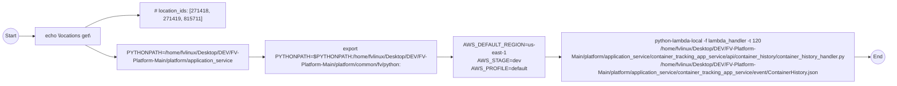

# Diagram: application_service/container_tracking_app_service/event/Containerhistory.sh

> Auto-generated by Obscura crawlers

## Mermaid

### SVG

<svg id="container" width="2723.046875" xmlns="http://www.w3.org/2000/svg" class="flowchart" height="258" viewBox="0 0 2723.046875 258" role="graphics-document document" aria-roledescription="flowchart-v2"><g><marker id="container_flowchart-v2-pointEnd" class="marker flowchart-v2" viewBox="0 0 10 10" refX="5" refY="5" markerUnits="userSpaceOnUse" markerWidth="8" markerHeight="8" orient="auto"><path d="M 0 0 L 10 5 L 0 10 z" class="arrowMarkerPath" style="stroke-width: 1; stroke-dasharray: 1, 0;"></path></marker><marker id="container_flowchart-v2-pointStart" class="marker flowchart-v2" viewBox="0 0 10 10" refX="4.5" refY="5" markerUnits="userSpaceOnUse" markerWidth="8" markerHeight="8" orient="auto"><path d="M 0 5 L 10 10 L 10 0 z" class="arrowMarkerPath" style="stroke-width: 1; stroke-dasharray: 1, 0;"></path></marker><marker id="container_flowchart-v2-circleEnd" class="marker flowchart-v2" viewBox="0 0 10 10" refX="11" refY="5" markerUnits="userSpaceOnUse" markerWidth="11" markerHeight="11" orient="auto"><circle cx="5" cy="5" r="5" class="arrowMarkerPath" style="stroke-width: 1; stroke-dasharray: 1, 0;"></circle></marker><marker id="container_flowchart-v2-circleStart" class="marker flowchart-v2" viewBox="0 0 10 10" refX="-1" refY="5" markerUnits="userSpaceOnUse" markerWidth="11" markerHeight="11" orient="auto"><circle cx="5" cy="5" r="5" class="arrowMarkerPath" style="stroke-width: 1; stroke-dasharray: 1, 0;"></circle></marker><marker id="container_flowchart-v2-crossEnd" class="marker cross flowchart-v2" viewBox="0 0 11 11" refX="12" refY="5.2" markerUnits="userSpaceOnUse" markerWidth="11" markerHeight="11" orient="auto"><path d="M 1,1 l 9,9 M 10,1 l -9,9" class="arrowMarkerPath" style="stroke-width: 2; stroke-dasharray: 1, 0;"></path></marker><marker id="container_flowchart-v2-crossStart" class="marker cross flowchart-v2" viewBox="0 0 11 11" refX="-1" refY="5.2" markerUnits="userSpaceOnUse" markerWidth="11" markerHeight="11" orient="auto"><path d="M 1,1 l 9,9 M 10,1 l -9,9" class="arrowMarkerPath" style="stroke-width: 2; stroke-dasharray: 1, 0;"></path></marker><g class="root"><g class="clusters"></g><g class="edgePaths"><path d="M58.047,111L62.214,111C66.38,111,74.714,111,82.38,111C90.047,111,97.047,111,100.547,111L104.047,111" id="L_S_ECHO_0" class="edge-thickness-normal edge-pattern-solid edge-thickness-normal edge-pattern-solid flowchart-link" style=";" data-edge="true" data-et="edge" data-id="L_S_ECHO_0" data-points="W3sieCI6NTguMDQ2ODc1LCJ5IjoxMTF9LHsieCI6ODMuMDQ2ODc1LCJ5IjoxMTF9LHsieCI6MTA4LjA0Njg3NSwieSI6MTExfV0=" marker-end="url(#container_flowchart-v2-pointEnd)"></path><path d="M267.013,84L279.48,77.833C291.946,71.667,316.879,59.333,344.748,53.167C372.617,47,403.422,47,418.824,47L434.227,47" id="L_ECHO_COMMENT_0" class="edge-thickness-normal edge-pattern-solid edge-thickness-normal edge-pattern-solid flowchart-link" style=";" data-edge="true" data-et="edge" data-id="L_ECHO_COMMENT_0" data-points="W3sieCI6MjY3LjAxMzA2MTUyMzQzNzUsInkiOjg0fSx7IngiOjM0MS44MTI1LCJ5Ijo0N30seyJ4Ijo0MzguMjI2NTYyNSwieSI6NDd9XQ==" marker-end="url(#container_flowchart-v2-pointEnd)"></path><path d="M267.013,138L279.48,144.167C291.946,150.333,316.879,162.667,332.846,168.833C348.813,175,355.813,175,359.313,175L362.813,175" id="L_ECHO_PY1_0" class="edge-thickness-normal edge-pattern-solid edge-thickness-normal edge-pattern-solid flowchart-link" style=";" data-edge="true" data-et="edge" data-id="L_ECHO_PY1_0" data-points="W3sieCI6MjY3LjAxMzA2MTUyMzQzNzUsInkiOjEzOH0seyJ4IjozNDEuODEyNSwieSI6MTc1fSx7IngiOjM2Ni44MTI1LCJ5IjoxNzV9XQ==" marker-end="url(#container_flowchart-v2-pointEnd)"></path><path d="M769.641,175L773.807,175C777.974,175,786.307,175,793.974,175C801.641,175,808.641,175,812.141,175L815.641,175" id="L_PY1_EXPORT_0" class="edge-thickness-normal edge-pattern-solid edge-thickness-normal edge-pattern-solid flowchart-link" style=";" data-edge="true" data-et="edge" data-id="L_PY1_EXPORT_0" data-points="W3sieCI6NzY5LjY0MDYyNSwieSI6MTc1fSx7IngiOjc5NC42NDA2MjUsInkiOjE3NX0seyJ4Ijo4MTkuNjQwNjI1LCJ5IjoxNzV9XQ==" marker-end="url(#container_flowchart-v2-pointEnd)"></path><path d="M1329.297,175L1333.464,175C1337.63,175,1345.964,175,1353.63,175C1361.297,175,1368.297,175,1371.797,175L1375.297,175" id="L_EXPORT_ENV_0" class="edge-thickness-normal edge-pattern-solid edge-thickness-normal edge-pattern-solid flowchart-link" style=";" data-edge="true" data-et="edge" data-id="L_EXPORT_ENV_0" data-points="W3sieCI6MTMyOS4yOTY4NzUsInkiOjE3NX0seyJ4IjoxMzU0LjI5Njg3NSwieSI6MTc1fSx7IngiOjEzNzkuMjk2ODc1LCJ5IjoxNzV9XQ==" marker-end="url(#container_flowchart-v2-pointEnd)"></path><path d="M1639.297,175L1643.464,175C1647.63,175,1655.964,175,1663.63,175C1671.297,175,1678.297,175,1681.797,175L1685.297,175" id="L_ENV_INVOKE_0" class="edge-thickness-normal edge-pattern-solid edge-thickness-normal edge-pattern-solid flowchart-link" style=";" data-edge="true" data-et="edge" data-id="L_ENV_INVOKE_0" data-points="W3sieCI6MTYzOS4yOTY4NzUsInkiOjE3NX0seyJ4IjoxNjY0LjI5Njg3NSwieSI6MTc1fSx7IngiOjE2ODkuMjk2ODc1LCJ5IjoxNzV9XQ==" marker-end="url(#container_flowchart-v2-pointEnd)"></path><path d="M2622.688,175L2626.854,175C2631.021,175,2639.354,175,2647.021,175C2654.688,175,2661.688,175,2665.188,175L2668.688,175" id="L_INVOKE_T_0" class="edge-thickness-normal edge-pattern-solid edge-thickness-normal edge-pattern-solid flowchart-link" style=";" data-edge="true" data-et="edge" data-id="L_INVOKE_T_0" data-points="W3sieCI6MjYyMi42ODc1LCJ5IjoxNzV9LHsieCI6MjY0Ny42ODc1LCJ5IjoxNzV9LHsieCI6MjY3Mi42ODc1LCJ5IjoxNzV9XQ==" marker-end="url(#container_flowchart-v2-pointEnd)"></path></g><g class="edgeLabels"><g class="edgeLabel"><g class="label" data-id="L_S_ECHO_0" transform="translate(0, 0)"><foreignObject width="0" height="0">

</foreignObject></g></g><g class="edgeLabel"><g class="label" data-id="L_ECHO_COMMENT_0" transform="translate(0, 0)"><foreignObject width="0" height="0">

</foreignObject></g></g><g class="edgeLabel"><g class="label" data-id="L_ECHO_PY1_0" transform="translate(0, 0)"><foreignObject width="0" height="0">

</foreignObject></g></g><g class="edgeLabel"><g class="label" data-id="L_PY1_EXPORT_0" transform="translate(0, 0)"><foreignObject width="0" height="0">

</foreignObject></g></g><g class="edgeLabel"><g class="label" data-id="L_EXPORT_ENV_0" transform="translate(0, 0)"><foreignObject width="0" height="0">

</foreignObject></g></g><g class="edgeLabel"><g class="label" data-id="L_ENV_INVOKE_0" transform="translate(0, 0)"><foreignObject width="0" height="0">

</foreignObject></g></g><g class="edgeLabel"><g class="label" data-id="L_INVOKE_T_0" transform="translate(0, 0)"><foreignObject width="0" height="0">

</foreignObject></g></g></g><g class="nodes"><g class="node default" id="flowchart-S-0" transform="translate(33.0234375, 111)"><circle class="basic label-container" style="" r="25.0234375" cx="0" cy="0"></circle><g class="label" style="" transform="translate(-17.5234375, -12)"><rect></rect><foreignObject width="35.046875" height="24">

Start

</foreignObject></g></g><g class="node default" id="flowchart-ECHO-1" transform="translate(212.4296875, 111)"><rect class="basic label-container" style="" x="-104.3828125" y="-27" width="208.765625" height="54"></rect><g class="label" style="" transform="translate(-74.3828125, -12)"><rect></rect><foreignObject width="148.765625" height="24">

echo \locations get\

</foreignObject></g></g><g class="node default" id="flowchart-COMMENT-3" transform="translate(568.2265625, 47)"><rect class="basic label-container" style="" x="-130" y="-39" width="260" height="78"></rect><g class="label" style="" transform="translate(-100, -24)"><rect></rect><foreignObject width="200" height="48">
# location_ids: [271418, 271419, 815711]
</foreignObject></g></g><g class="node default" id="flowchart-PY1-5" transform="translate(568.2265625, 175)"><rect class="basic label-container" style="" x="-201.4140625" y="-39" width="402.828125" height="78"></rect><g class="label" style="" transform="translate(-171.4140625, -24)"><rect></rect><foreignObject width="342.828125" height="48">

PYTHONPATH=/home/fvlinux/Desktop/DEV/FV-Platform-Main/platform/application_service

</foreignObject></g></g><g class="node default" id="flowchart-EXPORT-7" transform="translate(1074.46875, 175)"><rect class="basic label-container" style="" x="-254.828125" y="-51" width="509.65625" height="102"></rect><g class="label" style="" transform="translate(-224.828125, -36)"><rect></rect><foreignObject width="449.65625" height="72">

export PYTHONPATH=$PYTHONPATH:/home/fvlinux/Desktop/DEV/FV-Platform-Main/platform/common/fv/python:

</foreignObject></g></g><g class="node default" id="flowchart-ENV-9" transform="translate(1509.296875, 175)"><rect class="basic label-container" style="" x="-130" y="-63" width="260" height="126"></rect><g class="label" style="" transform="translate(-100, -48)"><rect></rect><foreignObject width="200" height="96">

AWS_DEFAULT_REGION=us-east-1 AWS_STAGE=dev AWS_PROFILE=default

</foreignObject></g></g><g class="node default" id="flowchart-INVOKE-11" transform="translate(2155.9921875, 175)"><rect class="basic label-container" style="" x="-466.6953125" y="-75" width="933.390625" height="150"></rect><g class="label" style="" transform="translate(-436.6953125, -60)"><rect></rect><foreignObject width="873.390625" height="120">

python-lambda-local -f lambda_handler -t 120 /home/fvlinux/Desktop/DEV/FV-Platform-Main/platform/application_service/container_tracking_app_service/api/container_history/container_history_handler.py /home/fvlinux/Desktop/DEV/FV-Platform-Main/platform/application_service/container_tracking_app_service/event/ContainerHistory.json

</foreignObject></g></g><g class="node default" id="flowchart-T-13" transform="translate(2693.8671875, 175)"><circle class="basic label-container" style="" r="21.1796875" cx="0" cy="0"></circle><g class="label" style="" transform="translate(-13.6796875, -12)"><rect></rect><foreignObject width="27.359375" height="24">

End

</foreignObject></g></g></g></g></g></svg>
