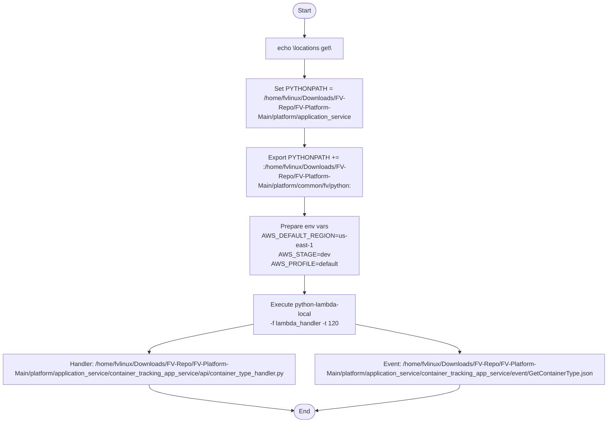

# Diagram: application_service/container_tracking_app_service/event/GetContainerType.sh

> Auto-generated by Obscura crawlers

## Mermaid

### SVG

<svg id="container" width="1616.546875" xmlns="http://www.w3.org/2000/svg" class="flowchart" height="1080" viewBox="0 0 1616.546875 1080" role="graphics-document document" aria-roledescription="flowchart-v2"><g><marker id="container_flowchart-v2-pointEnd" class="marker flowchart-v2" viewBox="0 0 10 10" refX="5" refY="5" markerUnits="userSpaceOnUse" markerWidth="8" markerHeight="8" orient="auto"><path d="M 0 0 L 10 5 L 0 10 z" class="arrowMarkerPath" style="stroke-width: 1; stroke-dasharray: 1, 0;"></path></marker><marker id="container_flowchart-v2-pointStart" class="marker flowchart-v2" viewBox="0 0 10 10" refX="4.5" refY="5" markerUnits="userSpaceOnUse" markerWidth="8" markerHeight="8" orient="auto"><path d="M 0 5 L 10 10 L 10 0 z" class="arrowMarkerPath" style="stroke-width: 1; stroke-dasharray: 1, 0;"></path></marker><marker id="container_flowchart-v2-circleEnd" class="marker flowchart-v2" viewBox="0 0 10 10" refX="11" refY="5" markerUnits="userSpaceOnUse" markerWidth="11" markerHeight="11" orient="auto"><circle cx="5" cy="5" r="5" class="arrowMarkerPath" style="stroke-width: 1; stroke-dasharray: 1, 0;"></circle></marker><marker id="container_flowchart-v2-circleStart" class="marker flowchart-v2" viewBox="0 0 10 10" refX="-1" refY="5" markerUnits="userSpaceOnUse" markerWidth="11" markerHeight="11" orient="auto"><circle cx="5" cy="5" r="5" class="arrowMarkerPath" style="stroke-width: 1; stroke-dasharray: 1, 0;"></circle></marker><marker id="container_flowchart-v2-crossEnd" class="marker cross flowchart-v2" viewBox="0 0 11 11" refX="12" refY="5.2" markerUnits="userSpaceOnUse" markerWidth="11" markerHeight="11" orient="auto"><path d="M 1,1 l 9,9 M 10,1 l -9,9" class="arrowMarkerPath" style="stroke-width: 2; stroke-dasharray: 1, 0;"></path></marker><marker id="container_flowchart-v2-crossStart" class="marker cross flowchart-v2" viewBox="0 0 11 11" refX="-1" refY="5.2" markerUnits="userSpaceOnUse" markerWidth="11" markerHeight="11" orient="auto"><path d="M 1,1 l 9,9 M 10,1 l -9,9" class="arrowMarkerPath" style="stroke-width: 2; stroke-dasharray: 1, 0;"></path></marker><g class="root"><g class="clusters"></g><g class="edgePaths"><path d="M811.48,47.5L811.397,51.583C811.314,55.667,811.147,63.833,811.064,71.417C810.98,79,810.98,86,810.98,89.5L810.98,93" id="L_A_B_0" class="edge-thickness-normal edge-pattern-solid edge-thickness-normal edge-pattern-solid flowchart-link" style=";" data-edge="true" data-et="edge" data-id="L_A_B_0" data-points="W3sieCI6ODExLjQ4MDQ2ODc1LCJ5Ijo0Ny41fSx7IngiOjgxMC45ODA0Njg3NSwieSI6NzJ9LHsieCI6ODEwLjk4MDQ2ODc1LCJ5Ijo5N31d" marker-end="url(#container_flowchart-v2-pointEnd)"></path><path d="M810.98,151L810.98,155.167C810.98,159.333,810.98,167.667,810.98,175.333C810.98,183,810.98,190,810.98,193.5L810.98,197" id="L_B_C_0" class="edge-thickness-normal edge-pattern-solid edge-thickness-normal edge-pattern-solid flowchart-link" style=";" data-edge="true" data-et="edge" data-id="L_B_C_0" data-points="W3sieCI6ODEwLjk4MDQ2ODc1LCJ5IjoxNTF9LHsieCI6ODEwLjk4MDQ2ODc1LCJ5IjoxNzZ9LHsieCI6ODEwLjk4MDQ2ODc1LCJ5IjoyMDF9XQ==" marker-end="url(#container_flowchart-v2-pointEnd)"></path><path d="M810.98,327L810.98,331.167C810.98,335.333,810.98,343.667,810.98,351.333C810.98,359,810.98,366,810.98,369.5L810.98,373" id="L_C_D_0" class="edge-thickness-normal edge-pattern-solid edge-thickness-normal edge-pattern-solid flowchart-link" style=";" data-edge="true" data-et="edge" data-id="L_C_D_0" data-points="W3sieCI6ODEwLjk4MDQ2ODc1LCJ5IjozMjd9LHsieCI6ODEwLjk4MDQ2ODc1LCJ5IjozNTJ9LHsieCI6ODEwLjk4MDQ2ODc1LCJ5IjozNzd9XQ==" marker-end="url(#container_flowchart-v2-pointEnd)"></path><path d="M810.98,503L810.98,507.167C810.98,511.333,810.98,519.667,810.98,527.333C810.98,535,810.98,542,810.98,545.5L810.98,549" id="L_D_E_0" class="edge-thickness-normal edge-pattern-solid edge-thickness-normal edge-pattern-solid flowchart-link" style=";" data-edge="true" data-et="edge" data-id="L_D_E_0" data-points="W3sieCI6ODEwLjk4MDQ2ODc1LCJ5Ijo1MDN9LHsieCI6ODEwLjk4MDQ2ODc1LCJ5Ijo1Mjh9LHsieCI6ODEwLjk4MDQ2ODc1LCJ5Ijo1NTN9XQ==" marker-end="url(#container_flowchart-v2-pointEnd)"></path><path d="M810.98,703L810.98,707.167C810.98,711.333,810.98,719.667,810.98,727.333C810.98,735,810.98,742,810.98,745.5L810.98,749" id="L_E_F_0" class="edge-thickness-normal edge-pattern-solid edge-thickness-normal edge-pattern-solid flowchart-link" style=";" data-edge="true" data-et="edge" data-id="L_E_F_0" data-points="W3sieCI6ODEwLjk4MDQ2ODc1LCJ5Ijo3MDN9LHsieCI6ODEwLjk4MDQ2ODc1LCJ5Ijo3Mjh9LHsieCI6ODEwLjk4MDQ2ODc1LCJ5Ijo3NTN9XQ==" marker-end="url(#container_flowchart-v2-pointEnd)"></path><path d="M680.98,827.944L633.874,836.62C586.768,845.296,492.556,862.648,445.45,874.824C398.344,887,398.344,894,398.344,897.5L398.344,901" id="L_F_G_0" class="edge-thickness-normal edge-pattern-solid edge-thickness-normal edge-pattern-solid flowchart-link" style=";" data-edge="true" data-et="edge" data-id="L_F_G_0" data-points="W3sieCI6NjgwLjk4MDQ2ODc1LCJ5Ijo4MjcuOTQzNTc5MzA2MTAxMn0seyJ4IjozOTguMzQzNzUsInkiOjg4MH0seyJ4IjozOTguMzQzNzUsInkiOjkwNX1d" marker-end="url(#container_flowchart-v2-pointEnd)"></path><path d="M940.98,827.944L988.087,836.62C1035.193,845.296,1129.405,862.648,1176.511,874.824C1223.617,887,1223.617,894,1223.617,897.5L1223.617,901" id="L_F_H_0" class="edge-thickness-normal edge-pattern-solid edge-thickness-normal edge-pattern-solid flowchart-link" style=";" data-edge="true" data-et="edge" data-id="L_F_H_0" data-points="W3sieCI6OTQwLjk4MDQ2ODc1LCJ5Ijo4MjcuOTQzNTc5MzA2MTAxMn0seyJ4IjoxMjIzLjYxNzE4NzUsInkiOjg4MH0seyJ4IjoxMjIzLjYxNzE4NzUsInkiOjkwNX1d" marker-end="url(#container_flowchart-v2-pointEnd)"></path><path d="M398.344,983L398.344,987.167C398.344,991.333,398.344,999.667,462.229,1010.797C526.115,1021.926,653.886,1035.853,717.772,1042.816L781.657,1049.779" id="L_G_I_0" class="edge-thickness-normal edge-pattern-solid edge-thickness-normal edge-pattern-solid flowchart-link" style=";" data-edge="true" data-et="edge" data-id="L_G_I_0" data-points="W3sieCI6Mzk4LjM0Mzc1LCJ5Ijo5ODN9LHsieCI6Mzk4LjM0Mzc1LCJ5IjoxMDA4fSx7IngiOjc4NS42MzM4NTYwMTk4NTQ1LCJ5IjoxMDUwLjIxMjYyMjU5NDU3NzJ9XQ==" marker-end="url(#container_flowchart-v2-pointEnd)"></path><path d="M1223.617,983L1223.617,987.167C1223.617,991.333,1223.617,999.667,1159.898,1010.796C1096.179,1021.926,968.741,1035.852,905.022,1042.815L841.303,1049.778" id="L_H_I_0" class="edge-thickness-normal edge-pattern-solid edge-thickness-normal edge-pattern-solid flowchart-link" style=";" data-edge="true" data-et="edge" data-id="L_H_I_0" data-points="W3sieCI6MTIyMy42MTcxODc1LCJ5Ijo5ODN9LHsieCI6MTIyMy42MTcxODc1LCJ5IjoxMDA4fSx7IngiOjgzNy4zMjcwODI1MDI1NDMyLCJ5IjoxMDUwLjIxMjYyMjQ4NDMxODd9XQ==" marker-end="url(#container_flowchart-v2-pointEnd)"></path></g><g class="edgeLabels"><g class="edgeLabel"><g class="label" data-id="L_A_B_0" transform="translate(0, 0)"><foreignObject width="0" height="0">

</foreignObject></g></g><g class="edgeLabel"><g class="label" data-id="L_B_C_0" transform="translate(0, 0)"><foreignObject width="0" height="0">

</foreignObject></g></g><g class="edgeLabel"><g class="label" data-id="L_C_D_0" transform="translate(0, 0)"><foreignObject width="0" height="0">

</foreignObject></g></g><g class="edgeLabel"><g class="label" data-id="L_D_E_0" transform="translate(0, 0)"><foreignObject width="0" height="0">

</foreignObject></g></g><g class="edgeLabel"><g class="label" data-id="L_E_F_0" transform="translate(0, 0)"><foreignObject width="0" height="0">

</foreignObject></g></g><g class="edgeLabel"><g class="label" data-id="L_F_G_0" transform="translate(0, 0)"><foreignObject width="0" height="0">

</foreignObject></g></g><g class="edgeLabel"><g class="label" data-id="L_F_H_0" transform="translate(0, 0)"><foreignObject width="0" height="0">

</foreignObject></g></g><g class="edgeLabel"><g class="label" data-id="L_G_I_0" transform="translate(0, 0)"><foreignObject width="0" height="0">

</foreignObject></g></g><g class="edgeLabel"><g class="label" data-id="L_H_I_0" transform="translate(0, 0)"><foreignObject width="0" height="0">

</foreignObject></g></g></g><g class="nodes"><g class="node default" id="flowchart-A-0" transform="translate(810.98046875, 27.5)"><g class="basic label-container outer-path"><path d="M-10.3984375 -19.5 C-4.245179242017039 -19.5, 1.9080790159659227 -19.5, 10.3984375 -19.5 C10.3984375 -19.5, 10.398437499999998 -19.5, 10.398437499999998 -19.5 C10.812721978836606 -19.486714703119528, 11.227006457673214 -19.47342940623906, 11.6478067896239 -19.45993515863156 C11.946008826566517 -19.431167966768125, 12.244210863509137 -19.40240077490469, 12.892042152847864 -19.3399052695533 C13.233414086840526 -19.284714902644254, 13.574786020833187 -19.229524535735205, 14.126030759676757 -19.140403561325776 C14.567997100293816 -19.039527628179837, 15.009963440910873 -18.9386516950339, 15.34470188623539 -18.862249829261074 C15.611237409542818 -18.783143485016943, 15.877772932850247 -18.704037140772808, 16.543047751460602 -18.50658706670804 C16.962644535089392 -18.352171571622495, 17.38224131871818 -18.19775607653695, 17.716144095147794 -18.074876768247425 C17.972457090370114 -17.961414608517362, 18.228770085592434 -17.8479524487873, 18.85917041279238 -17.568892924097174 C19.132417128849173 -17.42634028735322, 19.405663844905966 -17.283787650609266, 19.967429764076783 -16.990714730406097 C20.264310261804305 -16.810744028020213, 20.561190759531826 -16.63077332563433, 21.036368073605697 -16.342718045390892 C21.312193024226946 -16.15031450010718, 21.588017974848196 -15.957910954823465, 22.061592844578712 -15.627565626425154 C22.31417876117096 -15.426135079536364, 22.566764677763214 -15.224704532647573, 23.03889120850187 -14.848196188198123 C23.34220845841264 -14.572731487163823, 23.645525708323405 -14.297266786129521, 23.964247236767985 -14.007812326905688 C24.139170394962168 -13.827189804611821, 24.314093553156347 -13.646567282317953, 24.833858442968648 -13.10986736009568 C25.112381977712154 -12.782697767747866, 25.39090551245566 -12.455528175400051, 25.644151408126582 -12.158051136245305 C25.860279247000957 -11.868459521804818, 26.07640708587533 -11.57886790736433, 26.391796464640635 -11.156274872382312 C26.57377389664018 -10.876708669048384, 26.755751328639725 -10.597142465714455, 27.073721378604247 -10.108655082055241 C27.209596343475084 -9.867395323094918, 27.345471308345925 -9.626135564134595, 27.6871239742735 -9.019496659696287 C27.80659476225923 -8.77141301217856, 27.926065550244964 -8.52332936466083, 28.22948364880834 -7.893275190886684 C28.398306766876715 -7.476278825284856, 28.567129884945093 -7.059282459683028, 28.698571729970325 -6.734618561215508 C28.813435822898914 -6.388666214422467, 28.928299915827502 -6.042713867629425, 29.09246063421488 -5.548287939305138 C29.20432213436208 -5.1217115581630335, 29.316183634509276 -4.69513517702093, 29.40953178754556 -4.339158212148133 C29.47559617845029 -3.999931527566323, 29.541660569355013 -3.6607048429845133, 29.648482276581777 -3.1121979531509023 C29.707560378748166 -2.6539998590391995, 29.76663848091456 -2.195801764927497, 29.808330202509367 -1.872449005199798 C29.834043854687064 -1.471938116845685, 29.859757506864764 -1.0714272284915722, 29.888418715913414 -0.6250057626472757 C29.888418715913414 -0.3112126197030878, 29.888418715913414 0.002580523241100141, 29.888418715913414 0.625005762647271 C29.8570816841048 1.113105327863247, 29.825744652296187 1.601204893079223, 29.808330202509367 1.8724490051997846 C29.768371648308342 2.1823596608739075, 29.728413094107317 2.492270316548031, 29.648482276581777 3.1121979531508885 C29.555533611100188 3.5894697056914415, 29.4625849456186 4.066741458231995, 29.40953178754556 4.339158212148129 C29.319047534037058 4.684213886899596, 29.22856328052855 5.0292695616510645, 29.092460634214884 5.548287939305125 C28.995959199323494 5.838934885782367, 28.899457764432103 6.129581832259608, 28.69857172997033 6.734618561215495 C28.583364017061626 7.01918383948959, 28.468156304152927 7.303749117763686, 28.229483648808344 7.893275190886679 C28.039661332555017 8.287445292133631, 27.849839016301694 8.681615393380584, 27.687123974273504 9.019496659696284 C27.536834252716584 9.286351278805139, 27.386544531159664 9.553205897913992, 27.07372137860425 10.108655082055236 C26.910669923034384 10.359145903256914, 26.747618467464516 10.609636724458593, 26.39179646464064 11.156274872382301 C26.096096641234173 11.552485696938874, 25.800396817827707 11.948696521495446, 25.644151408126582 12.158051136245302 C25.363326524909898 12.487924023460149, 25.082501641693216 12.817796910674996, 24.83385844296866 13.10986736009567 C24.654083082501355 13.29550017960975, 24.474307722034055 13.48113299912383, 23.96424723676799 14.007812326905684 C23.71900695503909 14.230533062069584, 23.473766673310195 14.453253797233485, 23.038891208501887 14.848196188198111 C22.738346350056194 15.087872714973981, 22.4378014916105 15.32754924174985, 22.061592844578715 15.627565626425152 C21.848849223374113 15.775966367054552, 21.63610560216951 15.92436710768395, 21.036368073605708 16.34271804539089 C20.793636678193064 16.489863243738046, 20.550905282780423 16.637008442085204, 19.967429764076787 16.990714730406093 C19.674213973294528 17.143685220643523, 19.38099818251227 17.296655710880948, 18.859170412792388 17.56889292409717 C18.489162266048933 17.7326845547588, 18.119154119305474 17.89647618542043, 17.716144095147804 18.07487676824742 C17.41488218249413 18.185743936938568, 17.11362026984045 18.29661110562971, 16.543047751460616 18.506587066708033 C16.23449572279434 18.598163689193537, 15.925943694128064 18.68974031167904, 15.344701886235413 18.86224982926107 C14.998805501839612 18.94119842181456, 14.652909117443812 19.020147014368046, 14.126030759676766 19.140403561325773 C13.699846953328441 19.20930565403139, 13.273663146980114 19.278207746737007, 12.892042152847878 19.3399052695533 C12.443958002951696 19.383131408593748, 11.995873853055514 19.4263575476342, 11.6478067896239 19.45993515863156 C11.393994846359812 19.468074413637062, 11.140182903095724 19.47621366864256, 10.398437500000004 19.5 C10.398437500000004 19.5, 10.398437500000002 19.5, 10.3984375 19.5 C3.2634584093738246 19.5, -3.871520681252351 19.5, -10.398437499999996 19.5 C-10.892910396874495 19.48414321663034, -11.387383293748995 19.468286433260683, -11.647806789623893 19.45993515863156 C-12.1057883864733 19.41575422478695, -12.563769983322707 19.371573290942344, -12.892042152847871 19.3399052695533 C-13.266678336764997 19.279336996684574, -13.641314520682123 19.218768723815852, -14.126030759676759 19.140403561325773 C-14.551508957146037 19.043290939258128, -14.976987154615314 18.94617831719048, -15.344701886235388 18.862249829261074 C-15.625247561446635 18.778985345472677, -15.905793236657884 18.69572086168428, -16.54304775146059 18.506587066708043 C-16.78122430980449 18.41893589155752, -17.019400868148388 18.331284716406994, -17.716144095147797 18.074876768247425 C-18.130651690979004 17.891386551503903, -18.54515928681021 17.707896334760385, -18.85917041279238 17.568892924097174 C-19.128316060915402 17.42847981186741, -19.397461709038424 17.288066699637646, -19.96742976407678 16.990714730406097 C-20.184693928565764 16.859007917106926, -20.401958093054745 16.72730110380775, -21.036368073605686 16.3427180453909 C-21.2575263161029 16.18844762921086, -21.478684558600115 16.03417721303082, -22.061592844578712 15.627565626425156 C-22.27658408791455 15.456115831022084, -22.491575331250388 15.284666035619011, -23.03889120850187 14.848196188198125 C-23.3881753615586 14.530985561944272, -23.737459514615328 14.213774935690418, -23.964247236767974 14.007812326905697 C-24.245657519015342 13.717233106271436, -24.527067801262714 13.426653885637176, -24.833858442968655 13.109867360095677 C-25.104042967557877 12.792493243578203, -25.374227492147096 12.475119127060731, -25.64415140812658 12.158051136245307 C-25.80957852495774 11.936393870411928, -25.9750056417889 11.71473660457855, -26.391796464640635 11.156274872382316 C-26.590398842867213 10.851168287220526, -26.78900122109379 10.546061702058736, -27.073721378604244 10.108655082055249 C-27.31832170742862 9.674342429758473, -27.562922036253 9.240029777461698, -27.6871239742735 9.019496659696289 C-27.826425642076842 8.730233765924437, -27.965727309880187 8.440970872152583, -28.22948364880834 7.893275190886686 C-28.4069586500447 7.454908506587152, -28.584433651281064 7.0165418222876195, -28.698571729970325 6.73461856121551 C-28.78814461520162 6.464839302400004, -28.87771750043291 6.1950600435844985, -29.09246063421488 5.5482879393051325 C-29.212465937038996 5.090655709009537, -29.33247123986311 4.633023478713942, -29.409531787545557 4.339158212148136 C-29.4629394209809 4.064921302164993, -29.516347054416237 3.79068439218185, -29.648482276581777 3.112197953150904 C-29.70155644072954 2.7005652166999954, -29.754630604877306 2.2889324802490862, -29.808330202509364 1.872449005199809 C-29.835377109159563 1.4511716022528556, -29.86242401580976 1.0298941993059019, -29.888418715913414 0.6250057626472781 C-29.888418715913414 0.1380521863217618, -29.888418715913414 -0.34890139000375453, -29.888418715913414 -0.6250057626472687 C-29.87208034492603 -0.8794890788714972, -29.855741973938642 -1.1339723950957257, -29.808330202509367 -1.8724490051997822 C-29.768033171697404 -2.1849848186285747, -29.72773614088544 -2.497520632057367, -29.648482276581777 -3.112197953150895 C-29.557627703966627 -3.5787169814089737, -29.466773131351474 -4.045236009667052, -29.40953178754556 -4.339158212148126 C-29.33881398379913 -4.608835847123279, -29.268096180052705 -4.878513482098431, -29.092460634214884 -5.548287939305123 C-28.99392630604608 -5.845057636436374, -28.895391977877278 -6.141827333567626, -28.698571729970332 -6.734618561215485 C-28.59676419143053 -6.986085149723649, -28.494956652890732 -7.237551738231812, -28.229483648808344 -7.893275190886676 C-28.020200224662357 -8.327856699073743, -27.81091680051637 -8.762438207260809, -27.687123974273504 -9.019496659696282 C-27.55694414763335 -9.250644124032746, -27.426764320993193 -9.48179158836921, -27.073721378604247 -10.108655082055243 C-26.826481501027708 -10.488481927215862, -26.57924162345117 -10.868308772376482, -26.39179646464064 -11.156274872382308 C-26.167457650736324 -11.456868445327704, -25.94311883683201 -11.757462018273097, -25.644151408126586 -12.158051136245302 C-25.468132936548002 -12.36481244869627, -25.292114464969423 -12.57157376114724, -24.833858442968662 -13.10986736009567 C-24.65275893705756 -13.296867468494836, -24.471659431146456 -13.483867576894001, -23.964247236767996 -14.007812326905677 C-23.66996027996047 -14.275075954672076, -23.37567332315295 -14.542339582438474, -23.038891208501887 -14.848196188198107 C-22.802343185774255 -15.036836941516146, -22.56579516304662 -15.225477694834186, -22.06159284457872 -15.627565626425149 C-21.701487669715252 -15.878759407708129, -21.34138249485179 -16.12995318899111, -21.03636807360571 -16.342718045390885 C-20.731816953716585 -16.52733872400871, -20.427265833827455 -16.71195940262654, -19.96742976407679 -16.99071473040609 C-19.646303359851412 -17.15824616979919, -19.325176955626034 -17.325777609192293, -18.859170412792388 -17.56889292409717 C-18.451425915286393 -17.749389317832303, -18.043681417780398 -17.929885711567437, -17.716144095147804 -18.07487676824742 C-17.2902770229148 -18.231599787501228, -16.864409950681797 -18.388322806755035, -16.54304775146062 -18.506587066708033 C-16.138326268979768 -18.626706278281937, -15.733604786498917 -18.74682548985584, -15.344701886235413 -18.862249829261067 C-14.990659190027305 -18.943057764326063, -14.636616493819195 -19.02386569939106, -14.126030759676768 -19.140403561325773 C-13.753389369869026 -19.20064933135275, -13.380747980061287 -19.260895101379727, -12.89204215284788 -19.3399052695533 C-12.562261035389197 -19.371718857334717, -12.232479917930513 -19.403532445116134, -11.647806789623903 -19.45993515863156 C-11.203556401395886 -19.474181403901106, -10.75930601316787 -19.488427649170657, -10.398437500000005 -19.5 C-10.398437500000004 -19.5, -10.398437500000004 -19.5, -10.3984375 -19.5" stroke="none" stroke-width="0" fill="#ECECFF" style=""></path><path d="M-10.3984375 -19.5 C-5.22636515969679 -19.5, -0.05429281939358077 -19.5, 10.3984375 -19.5 M-10.3984375 -19.5 C-3.363768180843831 -19.5, 3.670901138312338 -19.5, 10.3984375 -19.5 M10.3984375 -19.5 C10.3984375 -19.5, 10.398437499999998 -19.5, 10.398437499999998 -19.5 M10.3984375 -19.5 C10.3984375 -19.5, 10.398437499999998 -19.5, 10.398437499999998 -19.5 M10.398437499999998 -19.5 C10.795436100407962 -19.487269027595815, 11.192434700815927 -19.47453805519163, 11.6478067896239 -19.45993515863156 M10.398437499999998 -19.5 C10.843672602873806 -19.48572217684839, 11.288907705747615 -19.471444353696782, 11.6478067896239 -19.45993515863156 M11.6478067896239 -19.45993515863156 C11.946248569493726 -19.43114483905627, 12.244690349363552 -19.40235451948098, 12.892042152847864 -19.3399052695533 M11.6478067896239 -19.45993515863156 C12.097506148319907 -19.41655320234076, 12.547205507015915 -19.373171246049964, 12.892042152847864 -19.3399052695533 M12.892042152847864 -19.3399052695533 C13.258710004898576 -19.280625254785402, 13.62537785694929 -19.221345240017506, 14.126030759676757 -19.140403561325776 M12.892042152847864 -19.3399052695533 C13.292210157959785 -19.27520920983603, 13.692378163071707 -19.210513150118768, 14.126030759676757 -19.140403561325776 M14.126030759676757 -19.140403561325776 C14.59429437006464 -19.03352544796037, 15.062557980452523 -18.926647334594964, 15.34470188623539 -18.862249829261074 M14.126030759676757 -19.140403561325776 C14.398325303448603 -19.078254108597807, 14.670619847220447 -19.016104655869842, 15.34470188623539 -18.862249829261074 M15.34470188623539 -18.862249829261074 C15.649775049123049 -18.771705715877726, 15.954848212010706 -18.68116160249438, 16.543047751460602 -18.50658706670804 M15.34470188623539 -18.862249829261074 C15.734122328152273 -18.746671886209757, 16.123542770069157 -18.631093943158437, 16.543047751460602 -18.50658706670804 M16.543047751460602 -18.50658706670804 C16.8852575217797 -18.38065070787817, 17.2274672920988 -18.254714349048303, 17.716144095147794 -18.074876768247425 M16.543047751460602 -18.50658706670804 C16.80261192292698 -18.411065052223513, 17.06217609439336 -18.315543037738987, 17.716144095147794 -18.074876768247425 M17.716144095147794 -18.074876768247425 C18.072407833078145 -17.917169379653956, 18.428671571008497 -17.759461991060487, 18.85917041279238 -17.568892924097174 M17.716144095147794 -18.074876768247425 C17.961681740526682 -17.966184536253653, 18.20721938590557 -17.857492304259882, 18.85917041279238 -17.568892924097174 M18.85917041279238 -17.568892924097174 C19.30095244727196 -17.338415519684077, 19.74273448175154 -17.10793811527098, 19.967429764076783 -16.990714730406097 M18.85917041279238 -17.568892924097174 C19.255103262677622 -17.36233500991914, 19.65103611256286 -17.155777095741104, 19.967429764076783 -16.990714730406097 M19.967429764076783 -16.990714730406097 C20.35718340521773 -16.754443782699823, 20.746937046358674 -16.51817283499355, 21.036368073605697 -16.342718045390892 M19.967429764076783 -16.990714730406097 C20.30244059569151 -16.787629195539072, 20.637451427306242 -16.58454366067205, 21.036368073605697 -16.342718045390892 M21.036368073605697 -16.342718045390892 C21.284643210432108 -16.16953205759824, 21.53291834725852 -15.996346069805586, 22.061592844578712 -15.627565626425154 M21.036368073605697 -16.342718045390892 C21.420172000600374 -16.074993040523626, 21.80397592759505 -15.807268035656358, 22.061592844578712 -15.627565626425154 M22.061592844578712 -15.627565626425154 C22.410930864417114 -15.348977851879155, 22.760268884255517 -15.070390077333155, 23.03889120850187 -14.848196188198123 M22.061592844578712 -15.627565626425154 C22.325241366458428 -15.4173129462079, 22.588889888338144 -15.207060265990645, 23.03889120850187 -14.848196188198123 M23.03889120850187 -14.848196188198123 C23.241253138683593 -14.664416437410354, 23.443615068865316 -14.480636686622585, 23.964247236767985 -14.007812326905688 M23.03889120850187 -14.848196188198123 C23.319698670514352 -14.593174280956694, 23.600506132526835 -14.338152373715264, 23.964247236767985 -14.007812326905688 M23.964247236767985 -14.007812326905688 C24.187896277397446 -13.776876330528049, 24.411545318026906 -13.54594033415041, 24.833858442968648 -13.10986736009568 M23.964247236767985 -14.007812326905688 C24.287885608331223 -13.673629137062184, 24.611523979894457 -13.33944594721868, 24.833858442968648 -13.10986736009568 M24.833858442968648 -13.10986736009568 C25.078018125080852 -12.823063504407202, 25.322177807193054 -12.536259648718724, 25.644151408126582 -12.158051136245305 M24.833858442968648 -13.10986736009568 C25.098221698750862 -12.799331237158498, 25.362584954533077 -12.488795114221315, 25.644151408126582 -12.158051136245305 M25.644151408126582 -12.158051136245305 C25.879913430270356 -11.842151504934717, 26.115675452414127 -11.526251873624128, 26.391796464640635 -11.156274872382312 M25.644151408126582 -12.158051136245305 C25.91563552846836 -11.794287147699483, 26.18711964881014 -11.430523159153662, 26.391796464640635 -11.156274872382312 M26.391796464640635 -11.156274872382312 C26.63694764102143 -10.77965683315316, 26.882098817402227 -10.403038793924008, 27.073721378604247 -10.108655082055241 M26.391796464640635 -11.156274872382312 C26.61952276643735 -10.80642611974829, 26.847249068234063 -10.456577367114265, 27.073721378604247 -10.108655082055241 M27.073721378604247 -10.108655082055241 C27.292581505379662 -9.720046764974494, 27.511441632155076 -9.331438447893746, 27.6871239742735 -9.019496659696287 M27.073721378604247 -10.108655082055241 C27.21871484474129 -9.851204500748397, 27.36370831087833 -9.593753919441554, 27.6871239742735 -9.019496659696287 M27.6871239742735 -9.019496659696287 C27.826182392842956 -8.7307388781633, 27.96524081141241 -8.441981096630315, 28.22948364880834 -7.893275190886684 M27.6871239742735 -9.019496659696287 C27.860594342642045 -8.659281728107718, 28.034064711010593 -8.299066796519147, 28.22948364880834 -7.893275190886684 M28.22948364880834 -7.893275190886684 C28.34663632136109 -7.603905824688556, 28.46378899391384 -7.314536458490426, 28.698571729970325 -6.734618561215508 M28.22948364880834 -7.893275190886684 C28.39513616307655 -7.484110277970722, 28.560788677344757 -7.07494536505476, 28.698571729970325 -6.734618561215508 M28.698571729970325 -6.734618561215508 C28.814298206845525 -6.386068851377498, 28.930024683720724 -6.037519141539489, 29.09246063421488 -5.548287939305138 M28.698571729970325 -6.734618561215508 C28.794267473685096 -6.446398228192792, 28.889963217399863 -6.158177895170077, 29.09246063421488 -5.548287939305138 M29.09246063421488 -5.548287939305138 C29.16142337235819 -5.2853031301249285, 29.230386110501495 -5.022318320944718, 29.40953178754556 -4.339158212148133 M29.09246063421488 -5.548287939305138 C29.185006397066626 -5.195370835964097, 29.27755215991837 -4.842453732623056, 29.40953178754556 -4.339158212148133 M29.40953178754556 -4.339158212148133 C29.460652801365658 -4.076662610612029, 29.511773815185755 -3.814167009075926, 29.648482276581777 -3.1121979531509023 M29.40953178754556 -4.339158212148133 C29.46800856691061 -4.03889230918031, 29.526485346275656 -3.7386264062124877, 29.648482276581777 -3.1121979531509023 M29.648482276581777 -3.1121979531509023 C29.682559823287637 -2.8478992302729913, 29.7166373699935 -2.5836005073950807, 29.808330202509367 -1.872449005199798 M29.648482276581777 -3.1121979531509023 C29.680629481252335 -2.8628705819096565, 29.71277668592289 -2.613543210668411, 29.808330202509367 -1.872449005199798 M29.808330202509367 -1.872449005199798 C29.827266434976625 -1.5775018994705285, 29.84620266744388 -1.282554793741259, 29.888418715913414 -0.6250057626472757 M29.808330202509367 -1.872449005199798 C29.82449263801272 -1.6207060261519373, 29.840655073516075 -1.3689630471040768, 29.888418715913414 -0.6250057626472757 M29.888418715913414 -0.6250057626472757 C29.888418715913414 -0.20723076669683899, 29.888418715913414 0.21054422925359773, 29.888418715913414 0.625005762647271 M29.888418715913414 -0.6250057626472757 C29.888418715913414 -0.14622366403423653, 29.888418715913414 0.33255843457880263, 29.888418715913414 0.625005762647271 M29.888418715913414 0.625005762647271 C29.867472158526265 0.951265301708897, 29.84652560113912 1.277524840770523, 29.808330202509367 1.8724490051997846 M29.888418715913414 0.625005762647271 C29.866691246715234 0.9634286335064124, 29.84496377751705 1.3018515043655539, 29.808330202509367 1.8724490051997846 M29.808330202509367 1.8724490051997846 C29.76015654675607 2.2460743662580587, 29.71198289100277 2.619699727316333, 29.648482276581777 3.1121979531508885 M29.808330202509367 1.8724490051997846 C29.7534052599293 2.2984360136941024, 29.69848031734923 2.7244230221884203, 29.648482276581777 3.1121979531508885 M29.648482276581777 3.1121979531508885 C29.56256574945926 3.5533611614605722, 29.476649222336746 3.9945243697702564, 29.40953178754556 4.339158212148129 M29.648482276581777 3.1121979531508885 C29.57591887980602 3.4847956593150506, 29.50335548303027 3.857393365479213, 29.40953178754556 4.339158212148129 M29.40953178754556 4.339158212148129 C29.302445087792716 4.74752620997498, 29.195358388039875 5.155894207801833, 29.092460634214884 5.548287939305125 M29.40953178754556 4.339158212148129 C29.342575412101738 4.594491890792107, 29.275619036657915 4.849825569436086, 29.092460634214884 5.548287939305125 M29.092460634214884 5.548287939305125 C28.96921543822119 5.919482833182828, 28.8459702422275 6.29067772706053, 28.69857172997033 6.734618561215495 M29.092460634214884 5.548287939305125 C29.008853436197754 5.800099498734745, 28.925246238180623 6.0519110581643645, 28.69857172997033 6.734618561215495 M28.69857172997033 6.734618561215495 C28.56167341845072 7.0727600374177255, 28.42477510693111 7.410901513619956, 28.229483648808344 7.893275190886679 M28.69857172997033 6.734618561215495 C28.5742147595367 7.041782682465014, 28.449857789103078 7.348946803714532, 28.229483648808344 7.893275190886679 M28.229483648808344 7.893275190886679 C28.09001006204736 8.182895078052555, 27.95053647528637 8.472514965218432, 27.687123974273504 9.019496659696284 M28.229483648808344 7.893275190886679 C28.07976649331499 8.204166067702573, 27.93004933782164 8.515056944518468, 27.687123974273504 9.019496659696284 M27.687123974273504 9.019496659696284 C27.475331424039517 9.395555778957998, 27.26353887380553 9.771614898219712, 27.07372137860425 10.108655082055236 M27.687123974273504 9.019496659696284 C27.456035266454467 9.429818060698086, 27.224946558635434 9.840139461699886, 27.07372137860425 10.108655082055236 M27.07372137860425 10.108655082055236 C26.831971492739147 10.480047825677895, 26.590221606874046 10.851440569300555, 26.39179646464064 11.156274872382301 M27.07372137860425 10.108655082055236 C26.923099057656085 10.340051414788013, 26.77247673670792 10.571447747520791, 26.39179646464064 11.156274872382301 M26.39179646464064 11.156274872382301 C26.201294086183598 11.411530704391033, 26.010791707726554 11.666786536399766, 25.644151408126582 12.158051136245302 M26.39179646464064 11.156274872382301 C26.2047980142434 11.406835760005311, 26.01779956384616 11.657396647628321, 25.644151408126582 12.158051136245302 M25.644151408126582 12.158051136245302 C25.42515546594952 12.415296231148602, 25.206159523772456 12.6725413260519, 24.83385844296866 13.10986736009567 M25.644151408126582 12.158051136245302 C25.45809050330812 12.37660886221047, 25.272029598489663 12.595166588175639, 24.83385844296866 13.10986736009567 M24.83385844296866 13.10986736009567 C24.63211664183525 13.318182333075825, 24.43037484070184 13.526497306055978, 23.96424723676799 14.007812326905684 M24.83385844296866 13.10986736009567 C24.6500993974842 13.299613661456585, 24.466340351999747 13.489359962817497, 23.96424723676799 14.007812326905684 M23.96424723676799 14.007812326905684 C23.710617125252963 14.238152483498615, 23.456987013737937 14.468492640091545, 23.038891208501887 14.848196188198111 M23.96424723676799 14.007812326905684 C23.73870345130512 14.212645225301511, 23.51315966584225 14.41747812369734, 23.038891208501887 14.848196188198111 M23.038891208501887 14.848196188198111 C22.705794078486207 15.113832285298718, 22.372696948470526 15.379468382399326, 22.061592844578715 15.627565626425152 M23.038891208501887 14.848196188198111 C22.798092097917507 15.040227070955705, 22.55729298733313 15.232257953713297, 22.061592844578715 15.627565626425152 M22.061592844578715 15.627565626425152 C21.85405459146721 15.772335327609559, 21.64651633835571 15.917105028793967, 21.036368073605708 16.34271804539089 M22.061592844578715 15.627565626425152 C21.732973252763088 15.856796427962884, 21.40435366094746 16.086027229500615, 21.036368073605708 16.34271804539089 M21.036368073605708 16.34271804539089 C20.78455204571051 16.495370401336196, 20.53273601781531 16.648022757281506, 19.967429764076787 16.990714730406093 M21.036368073605708 16.34271804539089 C20.753542334554048 16.514168670472536, 20.470716595502385 16.685619295554183, 19.967429764076787 16.990714730406093 M19.967429764076787 16.990714730406093 C19.580296412313377 17.192681952050318, 19.19316306054997 17.39464917369454, 18.859170412792388 17.56889292409717 M19.967429764076787 16.990714730406093 C19.729150296436213 17.115024976048897, 19.49087082879564 17.2393352216917, 18.859170412792388 17.56889292409717 M18.859170412792388 17.56889292409717 C18.51345547650534 17.721930671122234, 18.16774054021829 17.874968418147294, 17.716144095147804 18.07487676824742 M18.859170412792388 17.56889292409717 C18.620696436625984 17.674458279266876, 18.38222246045958 17.78002363443658, 17.716144095147804 18.07487676824742 M17.716144095147804 18.07487676824742 C17.31318528922089 18.223169333738895, 16.91022648329398 18.371461899230365, 16.543047751460616 18.506587066708033 M17.716144095147804 18.07487676824742 C17.32705497294292 18.218065161919235, 16.93796585073804 18.361253555591052, 16.543047751460616 18.506587066708033 M16.543047751460616 18.506587066708033 C16.131236672694147 18.62881043324546, 15.719425593927678 18.751033799782885, 15.344701886235413 18.86224982926107 M16.543047751460616 18.506587066708033 C16.263128365851575 18.58966567102996, 15.983208980242537 18.672744275351885, 15.344701886235413 18.86224982926107 M15.344701886235413 18.86224982926107 C14.960390631587654 18.949966365269113, 14.576079376939893 19.037682901277154, 14.126030759676766 19.140403561325773 M15.344701886235413 18.86224982926107 C14.981548636291338 18.94513718876438, 14.618395386347263 19.02802454826769, 14.126030759676766 19.140403561325773 M14.126030759676766 19.140403561325773 C13.639961372021702 19.218987490397446, 13.153891984366638 19.29757141946912, 12.892042152847878 19.3399052695533 M14.126030759676766 19.140403561325773 C13.650883117070837 19.2172217473573, 13.175735474464908 19.294039933388824, 12.892042152847878 19.3399052695533 M12.892042152847878 19.3399052695533 C12.562072229635834 19.37173707119867, 12.23210230642379 19.403568872844044, 11.6478067896239 19.45993515863156 M12.892042152847878 19.3399052695533 C12.624220962347325 19.36574165769878, 12.356399771846771 19.391578045844263, 11.6478067896239 19.45993515863156 M11.6478067896239 19.45993515863156 C11.284627058802135 19.471581625712552, 10.92144732798037 19.483228092793542, 10.398437500000004 19.5 M11.6478067896239 19.45993515863156 C11.198811408608412 19.474333566584235, 10.749816027592924 19.488731974536908, 10.398437500000004 19.5 M10.398437500000004 19.5 C10.398437500000002 19.5, 10.398437500000002 19.5, 10.3984375 19.5 M10.398437500000004 19.5 C10.398437500000004 19.5, 10.398437500000002 19.5, 10.3984375 19.5 M10.3984375 19.5 C6.112427953039466 19.5, 1.8264184060789326 19.5, -10.398437499999996 19.5 M10.3984375 19.5 C2.264503458879741 19.5, -5.869430582240518 19.5, -10.398437499999996 19.5 M-10.398437499999996 19.5 C-10.679512226244034 19.490986480608118, -10.960586952488072 19.48197296121624, -11.647806789623893 19.45993515863156 M-10.398437499999996 19.5 C-10.660081280025961 19.49160959323329, -10.921725060051926 19.48321918646658, -11.647806789623893 19.45993515863156 M-11.647806789623893 19.45993515863156 C-11.934919230311154 19.43223776678169, -12.222031670998414 19.40454037493182, -12.892042152847871 19.3399052695533 M-11.647806789623893 19.45993515863156 C-11.982156908524594 19.42768080477606, -12.316507027425295 19.395426450920557, -12.892042152847871 19.3399052695533 M-12.892042152847871 19.3399052695533 C-13.312116816834916 19.271990855607548, -13.732191480821959 19.204076441661794, -14.126030759676759 19.140403561325773 M-12.892042152847871 19.3399052695533 C-13.37821526485114 19.261304571133405, -13.864388376854407 19.182703872713507, -14.126030759676759 19.140403561325773 M-14.126030759676759 19.140403561325773 C-14.43254797902061 19.070443006222323, -14.73906519836446 19.000482451118877, -15.344701886235388 18.862249829261074 M-14.126030759676759 19.140403561325773 C-14.443164264191733 19.068019908409752, -14.760297768706705 18.99563625549373, -15.344701886235388 18.862249829261074 M-15.344701886235388 18.862249829261074 C-15.818601021190984 18.721599053553575, -16.29250015614658 18.580948277846076, -16.54304775146059 18.506587066708043 M-15.344701886235388 18.862249829261074 C-15.760471880320758 18.738851477437773, -16.176241874406127 18.61545312561447, -16.54304775146059 18.506587066708043 M-16.54304775146059 18.506587066708043 C-16.974347580494285 18.34786474273173, -17.40564740952798 18.189142418755416, -17.716144095147797 18.074876768247425 M-16.54304775146059 18.506587066708043 C-16.97752542273758 18.346695267410546, -17.412003094014565 18.186803468113048, -17.716144095147797 18.074876768247425 M-17.716144095147797 18.074876768247425 C-17.97708183491631 17.959367371294935, -18.23801957468482 17.84385797434245, -18.85917041279238 17.568892924097174 M-17.716144095147797 18.074876768247425 C-18.15340771621184 17.88131313416683, -18.59067133727589 17.687749500086237, -18.85917041279238 17.568892924097174 M-18.85917041279238 17.568892924097174 C-19.183380751590434 17.399752598012864, -19.50759109038849 17.23061227192855, -19.96742976407678 16.990714730406097 M-18.85917041279238 17.568892924097174 C-19.180617795934875 17.40119403020861, -19.50206517907737 17.233495136320045, -19.96742976407678 16.990714730406097 M-19.96742976407678 16.990714730406097 C-20.211063327945883 16.843022632238903, -20.45469689181499 16.695330534071708, -21.036368073605686 16.3427180453909 M-19.96742976407678 16.990714730406097 C-20.361880288242013 16.751596504608553, -20.75633081240725 16.512478278811006, -21.036368073605686 16.3427180453909 M-21.036368073605686 16.3427180453909 C-21.39878931031895 16.0899086796222, -21.761210547032217 15.837099313853507, -22.061592844578712 15.627565626425156 M-21.036368073605686 16.3427180453909 C-21.32361015925978 16.142350400948082, -21.610852244913872 15.941982756505269, -22.061592844578712 15.627565626425156 M-22.061592844578712 15.627565626425156 C-22.271100777254652 15.460488625356327, -22.480608709930593 15.293411624287497, -23.03889120850187 14.848196188198125 M-22.061592844578712 15.627565626425156 C-22.440250718780508 15.325596048258442, -22.818908592982304 15.023626470091727, -23.03889120850187 14.848196188198125 M-23.03889120850187 14.848196188198125 C-23.38748936451064 14.531608566312741, -23.736087520519412 14.215020944427355, -23.964247236767974 14.007812326905697 M-23.03889120850187 14.848196188198125 C-23.3284595859803 14.585217849331642, -23.618027963458733 14.322239510465158, -23.964247236767974 14.007812326905697 M-23.964247236767974 14.007812326905697 C-24.282561660055347 13.679126550761307, -24.600876083342715 13.350440774616919, -24.833858442968655 13.109867360095677 M-23.964247236767974 14.007812326905697 C-24.283752924009132 13.677896472924433, -24.60325861125029 13.347980618943168, -24.833858442968655 13.109867360095677 M-24.833858442968655 13.109867360095677 C-25.060440997730133 12.843710598360238, -25.28702355249161 12.5775538366248, -25.64415140812658 12.158051136245307 M-24.833858442968655 13.109867360095677 C-25.038020526683244 12.870046959412859, -25.24218261039783 12.63022655873004, -25.64415140812658 12.158051136245307 M-25.64415140812658 12.158051136245307 C-25.855770468131972 11.874500874731053, -26.06738952813736 11.5909506132168, -26.391796464640635 11.156274872382316 M-25.64415140812658 12.158051136245307 C-25.871289322649535 11.85370702347425, -26.098427237172487 11.549362910703193, -26.391796464640635 11.156274872382316 M-26.391796464640635 11.156274872382316 C-26.613587795230213 10.815543829285371, -26.83537912581979 10.474812786188426, -27.073721378604244 10.108655082055249 M-26.391796464640635 11.156274872382316 C-26.638481305814217 10.777300712184783, -26.8851661469878 10.39832655198725, -27.073721378604244 10.108655082055249 M-27.073721378604244 10.108655082055249 C-27.253423367943707 9.78957600318342, -27.433125357283167 9.470496924311592, -27.6871239742735 9.019496659696289 M-27.073721378604244 10.108655082055249 C-27.267215393393013 9.765086865404157, -27.46070940818178 9.421518648753066, -27.6871239742735 9.019496659696289 M-27.6871239742735 9.019496659696289 C-27.87588504661882 8.627530254131294, -28.06464611896414 8.235563848566299, -28.22948364880834 7.893275190886686 M-27.6871239742735 9.019496659696289 C-27.876099182355592 8.627085596692119, -28.065074390437683 8.234674533687949, -28.22948364880834 7.893275190886686 M-28.22948364880834 7.893275190886686 C-28.35424269299523 7.5851179396930455, -28.479001737182116 7.276960688499404, -28.698571729970325 6.73461856121551 M-28.22948364880834 7.893275190886686 C-28.324208222628418 7.659303662176046, -28.418932796448498 7.425332133465405, -28.698571729970325 6.73461856121551 M-28.698571729970325 6.73461856121551 C-28.813450962162072 6.388620617373948, -28.92833019435382 6.042622673532387, -29.09246063421488 5.5482879393051325 M-28.698571729970325 6.73461856121551 C-28.8250439969332 6.353704243742566, -28.95151626389607 5.9727899262696225, -29.09246063421488 5.5482879393051325 M-29.09246063421488 5.5482879393051325 C-29.19304392203629 5.1647202697694015, -29.2936272098577 4.7811526002336695, -29.409531787545557 4.339158212148136 M-29.09246063421488 5.5482879393051325 C-29.185728952152555 5.19261542026408, -29.27899727009023 4.836942901223027, -29.409531787545557 4.339158212148136 M-29.409531787545557 4.339158212148136 C-29.47307897114681 4.012856855057725, -29.53662615474806 3.686555497967315, -29.648482276581777 3.112197953150904 M-29.409531787545557 4.339158212148136 C-29.49048538362048 3.92347860585199, -29.571438979695408 3.507798999555845, -29.648482276581777 3.112197953150904 M-29.648482276581777 3.112197953150904 C-29.697798815491396 2.7297086160200243, -29.747115354401014 2.347219278889145, -29.808330202509364 1.872449005199809 M-29.648482276581777 3.112197953150904 C-29.704804124169637 2.6753768252662398, -29.7611259717575 2.238555697381576, -29.808330202509364 1.872449005199809 M-29.808330202509364 1.872449005199809 C-29.829852621234885 1.5372199609661137, -29.851375039960406 1.2019909167324183, -29.888418715913414 0.6250057626472781 M-29.808330202509364 1.872449005199809 C-29.8351212470607 1.4551568609707828, -29.86191229161204 1.0378647167417563, -29.888418715913414 0.6250057626472781 M-29.888418715913414 0.6250057626472781 C-29.888418715913414 0.2145843333108663, -29.888418715913414 -0.19583709602554555, -29.888418715913414 -0.6250057626472687 M-29.888418715913414 0.6250057626472781 C-29.888418715913414 0.1275817834730953, -29.888418715913414 -0.36984219570108756, -29.888418715913414 -0.6250057626472687 M-29.888418715913414 -0.6250057626472687 C-29.860848499599705 -1.054434136011361, -29.833278283285996 -1.4838625093754534, -29.808330202509367 -1.8724490051997822 M-29.888418715913414 -0.6250057626472687 C-29.858781665349973 -1.0866267477694784, -29.829144614786536 -1.5482477328916882, -29.808330202509367 -1.8724490051997822 M-29.808330202509367 -1.8724490051997822 C-29.74649267753894 -2.3520486376699363, -29.68465515256851 -2.8316482701400902, -29.648482276581777 -3.112197953150895 M-29.808330202509367 -1.8724490051997822 C-29.768808287535016 -2.178973173255997, -29.729286372560665 -2.4854973413122123, -29.648482276581777 -3.112197953150895 M-29.648482276581777 -3.112197953150895 C-29.554540106646478 -3.594571141084012, -29.460597936711178 -4.076944329017129, -29.40953178754556 -4.339158212148126 M-29.648482276581777 -3.112197953150895 C-29.58725121338552 -3.4266065214738894, -29.52602015018926 -3.7410150897968832, -29.40953178754556 -4.339158212148126 M-29.40953178754556 -4.339158212148126 C-29.31600870954797 -4.695802241711345, -29.222485631550377 -5.052446271274564, -29.092460634214884 -5.548287939305123 M-29.40953178754556 -4.339158212148126 C-29.331844247914336 -4.635414470754641, -29.254156708283116 -4.931670729361156, -29.092460634214884 -5.548287939305123 M-29.092460634214884 -5.548287939305123 C-29.00159159303449 -5.82197101332491, -28.910722551854096 -6.0956540873446965, -28.698571729970332 -6.734618561215485 M-29.092460634214884 -5.548287939305123 C-28.99680877309809 -5.836376104934488, -28.90115691198129 -6.124464270563854, -28.698571729970332 -6.734618561215485 M-28.698571729970332 -6.734618561215485 C-28.530296972521015 -7.150260465486408, -28.3620222150717 -7.565902369757331, -28.229483648808344 -7.893275190886676 M-28.698571729970332 -6.734618561215485 C-28.54934177086468 -7.103219445371434, -28.400111811759025 -7.471820329527383, -28.229483648808344 -7.893275190886676 M-28.229483648808344 -7.893275190886676 C-28.014382730816905 -8.339936849518253, -27.799281812825466 -8.78659850814983, -27.687123974273504 -9.019496659696282 M-28.229483648808344 -7.893275190886676 C-28.08318527868266 -8.19706688673632, -27.936886908556975 -8.500858582585964, -27.687123974273504 -9.019496659696282 M-27.687123974273504 -9.019496659696282 C-27.445172539095505 -9.449105933094348, -27.203221103917503 -9.878715206492416, -27.073721378604247 -10.108655082055243 M-27.687123974273504 -9.019496659696282 C-27.44464813677344 -9.450037062518664, -27.20217229927338 -9.880577465341048, -27.073721378604247 -10.108655082055243 M-27.073721378604247 -10.108655082055243 C-26.80694099473311 -10.518501392245005, -26.540160610861975 -10.928347702434767, -26.39179646464064 -11.156274872382308 M-27.073721378604247 -10.108655082055243 C-26.914834146540198 -10.352748537701407, -26.755946914476144 -10.596841993347569, -26.39179646464064 -11.156274872382308 M-26.39179646464064 -11.156274872382308 C-26.196305948633057 -11.418214354280085, -26.000815432625476 -11.680153836177862, -25.644151408126586 -12.158051136245302 M-26.39179646464064 -11.156274872382308 C-26.183918454896098 -11.434812467363718, -25.97604044515155 -11.713350062345127, -25.644151408126586 -12.158051136245302 M-25.644151408126586 -12.158051136245302 C-25.42866009079349 -12.411179499388076, -25.213168773460392 -12.66430786253085, -24.833858442968662 -13.10986736009567 M-25.644151408126586 -12.158051136245302 C-25.40188728258087 -12.442628363330563, -25.159623157035153 -12.727205590415824, -24.833858442968662 -13.10986736009567 M-24.833858442968662 -13.10986736009567 C-24.641147998621378 -13.308856715705966, -24.448437554274097 -13.507846071316262, -23.964247236767996 -14.007812326905677 M-24.833858442968662 -13.10986736009567 C-24.557165091291285 -13.395575962649211, -24.28047173961391 -13.681284565202752, -23.964247236767996 -14.007812326905677 M-23.964247236767996 -14.007812326905677 C-23.6239865232363 -14.316828104130021, -23.283725809704606 -14.625843881354365, -23.038891208501887 -14.848196188198107 M-23.964247236767996 -14.007812326905677 C-23.602935553214436 -14.335946038125732, -23.241623869660877 -14.664079749345786, -23.038891208501887 -14.848196188198107 M-23.038891208501887 -14.848196188198107 C-22.76653366814001 -15.06539407889817, -22.494176127778136 -15.282591969598233, -22.06159284457872 -15.627565626425149 M-23.038891208501887 -14.848196188198107 C-22.783148650537388 -15.05214407257951, -22.52740609257289 -15.256091956960915, -22.06159284457872 -15.627565626425149 M-22.06159284457872 -15.627565626425149 C-21.698989385022752 -15.880502102960618, -21.336385925466782 -16.133438579496087, -21.03636807360571 -16.342718045390885 M-22.06159284457872 -15.627565626425149 C-21.838435858936517 -15.783230279298937, -21.615278873294315 -15.938894932172726, -21.03636807360571 -16.342718045390885 M-21.03636807360571 -16.342718045390885 C-20.75580796364941 -16.51279523280061, -20.47524785369311 -16.682872420210337, -19.96742976407679 -16.99071473040609 M-21.03636807360571 -16.342718045390885 C-20.797668985634566 -16.487418835270535, -20.558969897663424 -16.63211962515019, -19.96742976407679 -16.99071473040609 M-19.96742976407679 -16.99071473040609 C-19.704078515508723 -17.128104908099527, -19.44072726694066 -17.26549508579296, -18.859170412792388 -17.56889292409717 M-19.96742976407679 -16.99071473040609 C-19.73879581667354 -17.10999291431933, -19.51016186927029 -17.229271098232577, -18.859170412792388 -17.56889292409717 M-18.859170412792388 -17.56889292409717 C-18.50373496777998 -17.726233651986302, -18.14829952276757 -17.883574379875434, -17.716144095147804 -18.07487676824742 M-18.859170412792388 -17.56889292409717 C-18.45065088140619 -17.749732402340506, -18.04213135001999 -17.93057188058384, -17.716144095147804 -18.07487676824742 M-17.716144095147804 -18.07487676824742 C-17.453332714677355 -18.171593785662317, -17.190521334206906 -18.26831080307721, -16.54304775146062 -18.506587066708033 M-17.716144095147804 -18.07487676824742 C-17.314077466083216 -18.222841004406366, -16.912010837018627 -18.37080524056531, -16.54304775146062 -18.506587066708033 M-16.54304775146062 -18.506587066708033 C-16.227785197592695 -18.60015533784912, -15.912522643724769 -18.693723608990204, -15.344701886235413 -18.862249829261067 M-16.54304775146062 -18.506587066708033 C-16.261330136817406 -18.590199375968204, -15.979612522174195 -18.673811685228372, -15.344701886235413 -18.862249829261067 M-15.344701886235413 -18.862249829261067 C-14.872431209747052 -18.970042529315357, -14.400160533258692 -19.077835229369647, -14.126030759676768 -19.140403561325773 M-15.344701886235413 -18.862249829261067 C-14.864708442990255 -18.971805200431834, -14.384714999745096 -19.081360571602602, -14.126030759676768 -19.140403561325773 M-14.126030759676768 -19.140403561325773 C-13.795824606186022 -19.19378873143519, -13.465618452695276 -19.24717390154461, -12.89204215284788 -19.3399052695533 M-14.126030759676768 -19.140403561325773 C-13.75158206221258 -19.200941522838765, -13.377133364748394 -19.261479484351756, -12.89204215284788 -19.3399052695533 M-12.89204215284788 -19.3399052695533 C-12.484939163671703 -19.379178005306148, -12.077836174495523 -19.418450741058997, -11.647806789623903 -19.45993515863156 M-12.89204215284788 -19.3399052695533 C-12.43622151278662 -19.383877738495485, -11.98040087272536 -19.427850207437668, -11.647806789623903 -19.45993515863156 M-11.647806789623903 -19.45993515863156 C-11.357673627990348 -19.469239164415207, -11.06754046635679 -19.478543170198854, -10.398437500000005 -19.5 M-11.647806789623903 -19.45993515863156 C-11.351782497675265 -19.469428081498023, -11.055758205726628 -19.478921004364484, -10.398437500000005 -19.5 M-10.398437500000005 -19.5 C-10.398437500000004 -19.5, -10.398437500000002 -19.5, -10.3984375 -19.5 M-10.398437500000005 -19.5 C-10.398437500000004 -19.5, -10.398437500000002 -19.5, -10.3984375 -19.5" stroke="#9370DB" stroke-width="1.3" fill="none" stroke-dasharray="0 0" style=""></path></g><g class="label" style="" transform="translate(-17.5234375, -12)"><rect></rect><foreignObject width="35.046875" height="24">

Start

</foreignObject></g></g><g class="node default" id="flowchart-B-1" transform="translate(810.98046875, 124)"><rect class="basic label-container" style="" x="-104.3828125" y="-27" width="208.765625" height="54"></rect><g class="label" style="" transform="translate(-74.3828125, -12)"><rect></rect><foreignObject width="148.765625" height="24">

echo \locations get\

</foreignObject></g></g><g class="node default" id="flowchart-C-3" transform="translate(810.98046875, 264)"><rect class="basic label-container" style="" x="-157.328125" y="-63" width="314.65625" height="126"></rect><g class="label" style="" transform="translate(-127.328125, -48)"><rect></rect><foreignObject width="254.65625" height="96">

Set PYTHONPATH = /home/fvlinux/Downloads/FV-Repo/FV-Platform-Main/platform/application_service

</foreignObject></g></g><g class="node default" id="flowchart-D-5" transform="translate(810.98046875, 440)"><rect class="basic label-container" style="" x="-160.0859375" y="-63" width="320.171875" height="126"></rect><g class="label" style="" transform="translate(-130.0859375, -48)"><rect></rect><foreignObject width="260.171875" height="96">

Export PYTHONPATH += :/home/fvlinux/Downloads/FV-Repo/FV-Platform-Main/platform/common/fv/python:

</foreignObject></g></g><g class="node default" id="flowchart-E-7" transform="translate(810.98046875, 628)"><rect class="basic label-container" style="" x="-130" y="-75" width="260" height="150"></rect><g class="label" style="" transform="translate(-100, -60)"><rect></rect><foreignObject width="200" height="120">

Prepare env vars AWS_DEFAULT_REGION=us-east-1 AWS_STAGE=dev AWS_PROFILE=default

</foreignObject></g></g><g class="node default" id="flowchart-F-9" transform="translate(810.98046875, 804)"><rect class="basic label-container" style="" x="-130" y="-51" width="260" height="102"></rect><g class="label" style="" transform="translate(-100, -36)"><rect></rect><foreignObject width="200" height="72">

Execute python-lambda-local -f lambda_handler -t 120

</foreignObject></g></g><g class="node default" id="flowchart-G-11" transform="translate(398.34375, 944)"><rect class="basic label-container" style="" x="-390.34375" y="-39" width="780.6875" height="78"></rect><g class="label" style="" transform="translate(-360.34375, -24)"><rect></rect><foreignObject width="720.6875" height="48">

Handler: /home/fvlinux/Downloads/FV-Repo/FV-Platform-Main/platform/application_service/container_tracking_app_service/api/container_type_handler.py

</foreignObject></g></g><g class="node default" id="flowchart-H-13" transform="translate(1223.6171875, 944)"><rect class="basic label-container" style="" x="-384.9296875" y="-39" width="769.859375" height="78"></rect><g class="label" style="" transform="translate(-354.9296875, -24)"><rect></rect><foreignObject width="709.859375" height="48">

Event: /home/fvlinux/Downloads/FV-Repo/FV-Platform-Main/platform/application_service/container_tracking_app_service/event/GetContainerType.json

</foreignObject></g></g><g class="node default" id="flowchart-I-15" transform="translate(810.98046875, 1052.5)"><g class="basic label-container outer-path"><path d="M-6.5546875 -19.5 C-2.262367747359489 -19.5, 2.0299520052810216 -19.5, 6.5546875 -19.5 C6.5546875 -19.5, 6.554687499999999 -19.5, 6.554687499999999 -19.5 C6.984231333075835 -19.48622536532961, 7.4137751661516695 -19.47245073065922, 7.8040567896239 -19.45993515863156 C8.071811066836114 -19.43410522553053, 8.339565344048326 -19.408275292429497, 9.048292152847864 -19.3399052695533 C9.504891393899284 -19.266085845240106, 9.961490634950703 -19.192266420926913, 10.282280759676757 -19.140403561325776 C10.592589634822511 -19.06957758552841, 10.902898509968267 -18.99875160973104, 11.50095188623539 -18.862249829261074 C11.945076899577307 -18.730435856560963, 12.389201912919223 -18.598621883860847, 12.699297751460602 -18.50658706670804 C13.029319291329925 -18.385136089350457, 13.359340831199248 -18.263685111992874, 13.872394095147794 -18.074876768247425 C14.222755029138519 -17.919782375857572, 14.573115963129244 -17.764687983467716, 15.015420412792382 -17.568892924097174 C15.424126843339128 -17.3556710410699, 15.832833273885875 -17.142449158042627, 16.123679764076783 -16.990714730406097 C16.43750925653698 -16.800469447809917, 16.751338748997178 -16.610224165213737, 17.192618073605697 -16.342718045390892 C17.5737290488245 -16.076871527106473, 17.9548400240433 -15.811025008822053, 18.217842844578712 -15.627565626425154 C18.459358735606298 -15.434963130338431, 18.700874626633883 -15.242360634251709, 19.19514120850187 -14.848196188198123 C19.475476541712585 -14.593603055842618, 19.755811874923296 -14.33900992348711, 20.120497236767985 -14.007812326905688 C20.376093536561008 -13.743888162522914, 20.63168983635403 -13.47996399814014, 20.990108442968648 -13.10986736009568 C21.2032992918245 -12.859441258126642, 21.416490140680356 -12.609015156157605, 21.800401408126582 -12.158051136245305 C22.01860991549524 -11.865671615575277, 22.236818422863898 -11.57329209490525, 22.548046464640635 -11.156274872382312 C22.745575259236563 -10.852817599974768, 22.943104053832492 -10.549360327567227, 23.229971378604247 -10.108655082055241 C23.4051247650361 -9.797652508241864, 23.58027815146795 -9.486649934428486, 23.8433739742735 -9.019496659696287 C23.96545870004205 -8.765985114443232, 24.087543425810598 -8.512473569190176, 24.38573364880834 -7.893275190886684 C24.48579738577572 -7.64611582597652, 24.585861122743093 -7.398956461066357, 24.854821729970325 -6.734618561215508 C24.95733815808715 -6.425855413502283, 25.059854586203972 -6.11709226578906, 25.24871063421488 -5.548287939305138 C25.36277457910438 -5.113312681815057, 25.476838523993873 -4.678337424324978, 25.56578178754556 -4.339158212148133 C25.660514528684843 -3.8527256081698438, 25.755247269824128 -3.366293004191555, 25.804732276581777 -3.1121979531509023 C25.838897631176348 -2.847218209627797, 25.873062985770915 -2.582238466104692, 25.964580202509367 -1.872449005199798 C25.994543330248742 -1.4057491048576178, 26.024506457988117 -0.9390492045154376, 26.044668715913414 -0.6250057626472757 C26.044668715913414 -0.18144635853920915, 26.044668715913414 0.2621130455688574, 26.044668715913414 0.625005762647271 C26.013275793508182 1.1139758690196646, 25.981882871102947 1.602945975392058, 25.964580202509367 1.8724490051997846 C25.91219987488138 2.2787004826168165, 25.85981954725339 2.6849519600338483, 25.804732276581777 3.1121979531508885 C25.725591602390246 3.51856858873699, 25.646450928198714 3.924939224323091, 25.56578178754556 4.339158212148129 C25.489206391442067 4.631173385477356, 25.412630995338574 4.923188558806585, 25.248710634214884 5.548287939305125 C25.126001641371325 5.917867874727001, 25.003292648527765 6.287447810148876, 24.85482172997033 6.734618561215495 C24.67140151043461 7.18767004965742, 24.487981290898894 7.640721538099345, 24.385733648808344 7.893275190886679 C24.188958864497597 8.301882240813857, 23.992184080186846 8.710489290741034, 23.843373974273504 9.019496659696284 C23.713648026807096 9.249838215599508, 23.58392207934069 9.480179771502732, 23.22997137860425 10.108655082055236 C23.06218297476482 10.366423127847677, 22.89439457092539 10.624191173640117, 22.54804646464064 11.156274872382301 C22.26737974103242 11.532342712752785, 21.986713017424204 11.90841055312327, 21.800401408126582 12.158051136245302 C21.58357099124383 12.412752481916025, 21.366740574361078 12.667453827586748, 20.99010844296866 13.10986736009567 C20.777121321006643 13.32979405008937, 20.564134199044627 13.549720740083071, 20.12049723676799 14.007812326905684 C19.754754548645177 14.339970159237579, 19.389011860522366 14.672127991569475, 19.195141208501887 14.848196188198111 C18.899536306173292 15.083933231428347, 18.603931403844697 15.319670274658584, 18.217842844578715 15.627565626425152 C17.976388693637983 15.795993589739675, 17.734934542697253 15.9644215530542, 17.192618073605708 16.34271804539089 C16.85504278868813 16.547358166920496, 16.517467503770558 16.751998288450103, 16.123679764076787 16.990714730406093 C15.880209628389876 17.11773294424389, 15.636739492702963 17.244751158081687, 15.015420412792386 17.56889292409717 C14.757001036101668 17.683287516419707, 14.498581659410949 17.797682108742244, 13.872394095147804 18.07487676824742 C13.606077593100487 18.172883702803592, 13.339761091053168 18.270890637359763, 12.699297751460616 18.506587066708033 C12.388765756882592 18.59875133268309, 12.078233762304565 18.690915598658147, 11.500951886235413 18.86224982926107 C11.255783373278273 18.918207942469476, 11.010614860321136 18.974166055677877, 10.282280759676766 19.140403561325773 C9.997658169700628 19.186419134391965, 9.71303557972449 19.232434707458154, 9.048292152847878 19.3399052695533 C8.671676486548536 19.37623692993459, 8.295060820249192 19.41256859031588, 7.804056789623901 19.45993515863156 C7.360245515016683 19.474167322381973, 6.916434240409465 19.488399486132383, 6.5546875000000036 19.5 C6.554687500000003 19.5, 6.554687500000002 19.5, 6.5546875 19.5 C2.064057248929866 19.5, -2.426573002140268 19.5, -6.5546874999999964 19.5 C-6.967084146191058 19.48677524223803, -7.379480792382119 19.473550484476057, -7.8040567896238935 19.45993515863156 C-8.214326051322377 19.420356976376482, -8.62459531302086 19.380778794121408, -9.048292152847871 19.3399052695533 C-9.405922879426486 19.282086307147775, -9.7635536060051 19.22426734474225, -10.282280759676759 19.140403561325773 C-10.741645636281792 19.035556525876636, -11.201010512886825 18.930709490427503, -11.500951886235388 18.862249829261074 C-11.91756197666189 18.73860214125348, -12.334172067088392 18.614954453245883, -12.699297751460593 18.506587066708043 C-13.00486110593994 18.39413692766296, -13.310424460419286 18.281686788617876, -13.872394095147797 18.074876768247425 C-14.205199417662973 17.927553724289083, -14.538004740178149 17.780230680330742, -15.01542041279238 17.568892924097174 C-15.345584503120515 17.39664652965318, -15.67574859344865 17.224400135209184, -16.12367976407678 16.990714730406097 C-16.356602507756765 16.849515594381312, -16.589525251436754 16.708316458356528, -17.192618073605686 16.3427180453909 C-17.598282913363132 16.059743814123987, -18.003947753120574 15.776769582857078, -18.217842844578712 15.627565626425156 C-18.553637849048492 15.359778046240859, -18.88943285351827 15.091990466056563, -19.19514120850187 14.848196188198125 C-19.38518911592247 14.675599707070822, -19.575237023343064 14.503003225943516, -20.120497236767974 14.007812326905697 C-20.408416068887494 13.710512494166561, -20.69633490100701 13.413212661427426, -20.990108442968655 13.109867360095677 C-21.258141817872055 12.795020106403053, -21.526175192775458 12.480172852710426, -21.80040140812658 12.158051136245307 C-22.047520249127754 11.826934402293283, -22.294639090128932 11.495817668341259, -22.548046464640635 11.156274872382316 C-22.703464602431655 10.917510877121773, -22.85888274022268 10.67874688186123, -23.229971378604244 10.108655082055249 C-23.35433822247233 9.887829157258931, -23.478705066340414 9.667003232462612, -23.8433739742735 9.019496659696289 C-23.991615262556152 8.711670452721918, -24.1398565508388 8.403844245747546, -24.38573364880834 7.893275190886686 C-24.522700558946603 7.554964274770116, -24.659667469084866 7.216653358653547, -24.854821729970325 6.73461856121551 C-24.979826404882346 6.358124397170696, -25.104831079794366 5.981630233125883, -25.24871063421488 5.5482879393051325 C-25.347441545460317 5.171784184478671, -25.446172456705753 4.79528042965221, -25.565781787545557 4.339158212148136 C-25.655225699071607 3.8798826304392624, -25.74466961059766 3.420607048730389, -25.804732276581777 3.112197953150904 C-25.868351737019122 2.6187779810823106, -25.931971197456463 2.125358009013717, -25.964580202509364 1.872449005199809 C-25.991871515641847 1.4473647740099458, -26.019162828774327 1.0222805428200827, -26.044668715913414 0.6250057626472781 C-26.044668715913414 0.157797500736161, -26.044668715913414 -0.30941076117495614, -26.044668715913414 -0.6250057626472687 C-26.015580561516657 -1.0780772469123614, -25.986492407119904 -1.531148731177454, -25.964580202509367 -1.8724490051997822 C-25.9183795044558 -2.2307724959434942, -25.872178806402236 -2.589095986687206, -25.804732276581777 -3.112197953150895 C-25.742653152068932 -3.4309611370967388, -25.680574027556087 -3.7497243210425824, -25.56578178754556 -4.339158212148126 C-25.44049457655536 -4.816932647474485, -25.31520736556516 -5.294707082800844, -25.248710634214884 -5.548287939305123 C-25.11797583306911 -5.942040330594373, -24.987241031923332 -6.335792721883624, -24.854821729970332 -6.734618561215485 C-24.713396431425323 -7.083941782893795, -24.571971132880314 -7.433265004572105, -24.385733648808344 -7.893275190886676 C-24.21781501536995 -8.241961826104689, -24.049896381931557 -8.590648461322703, -23.843373974273504 -9.019496659696282 C-23.64394182675362 -9.373608632312616, -23.44450967923373 -9.727720604928951, -23.229971378604247 -10.108655082055243 C-23.019911987910255 -10.431362715005601, -22.809852597216263 -10.75407034795596, -22.54804646464064 -11.156274872382308 C-22.377383937736724 -11.38494711075751, -22.206721410832806 -11.613619349132712, -21.800401408126586 -12.158051136245302 C-21.5928968461512 -12.401797802085657, -21.38539228417581 -12.645544467926012, -20.990108442968662 -13.10986736009567 C-20.70946498990547 -13.399654766639422, -20.428821536842275 -13.689442173183172, -20.120497236767996 -14.007812326905677 C-19.817398153096725 -14.283078895133627, -19.51429906942546 -14.55834546336158, -19.195141208501887 -14.848196188198107 C-18.839384863359882 -15.131902406374923, -18.483628518217873 -15.415608624551739, -18.21784284457872 -15.627565626425149 C-17.978564493250598 -15.794475846118763, -17.739286141922474 -15.961386065812377, -17.19261807360571 -16.342718045390885 C-16.963908909284974 -16.48136288484635, -16.735199744964234 -16.62000772430182, -16.12367976407679 -16.99071473040609 C-15.70593679464758 -17.208650969980166, -15.28819382521837 -17.426587209554246, -15.01542041279239 -17.56889292409717 C-14.748102530742603 -17.687226620777384, -14.480784648692818 -17.805560317457594, -13.872394095147806 -18.07487676824742 C-13.550801221388097 -18.19322591856293, -13.229208347628388 -18.31157506887844, -12.699297751460618 -18.506587066708033 C-12.27837792463473 -18.6315138618567, -11.857458097808843 -18.756440657005363, -11.500951886235413 -18.862249829261067 C-11.131344887276342 -18.946610214862403, -10.761737888317269 -19.03097060046374, -10.282280759676768 -19.140403561325773 C-10.010856431654936 -19.18428534175324, -9.739432103633105 -19.22816712218071, -9.04829215284788 -19.3399052695533 C-8.57769036573723 -19.385303657974408, -8.107088578626579 -19.430702046395517, -7.804056789623903 -19.45993515863156 C-7.367462273407149 -19.47393589498696, -6.930867757190396 -19.487936631342357, -6.554687500000006 -19.5 C-6.554687500000004 -19.5, -6.554687500000003 -19.5, -6.5546875 -19.5" stroke="none" stroke-width="0" fill="#ECECFF" style=""></path><path d="M-6.5546875 -19.5 C-1.6391524875289374 -19.5, 3.2763825249421252 -19.5, 6.5546875 -19.5 M-6.5546875 -19.5 C-3.306933715650356 -19.5, -0.05917993130071242 -19.5, 6.5546875 -19.5 M6.5546875 -19.5 C6.5546875 -19.5, 6.554687499999999 -19.5, 6.554687499999999 -19.5 M6.5546875 -19.5 C6.5546875 -19.5, 6.554687499999999 -19.5, 6.554687499999999 -19.5 M6.554687499999999 -19.5 C6.912258223276973 -19.4885334028737, 7.269828946553948 -19.4770668057474, 7.8040567896239 -19.45993515863156 M6.554687499999999 -19.5 C6.870892965214345 -19.489859906187178, 7.1870984304286925 -19.479719812374352, 7.8040567896239 -19.45993515863156 M7.8040567896239 -19.45993515863156 C8.140800095261456 -19.427449936929783, 8.477543400899012 -19.394964715228003, 9.048292152847864 -19.3399052695533 M7.8040567896239 -19.45993515863156 C8.23200521712771 -19.41865148851355, 8.659953644631521 -19.37736781839554, 9.048292152847864 -19.3399052695533 M9.048292152847864 -19.3399052695533 C9.339614998112209 -19.292806451173366, 9.630937843376552 -19.245707632793437, 10.282280759676757 -19.140403561325776 M9.048292152847864 -19.3399052695533 C9.37397291703917 -19.287251729290897, 9.699653681230476 -19.234598189028496, 10.282280759676757 -19.140403561325776 M10.282280759676757 -19.140403561325776 C10.753909640701805 -19.03275734689788, 11.225538521726854 -18.925111132469983, 11.50095188623539 -18.862249829261074 M10.282280759676757 -19.140403561325776 C10.64242834350118 -19.058202225500473, 11.002575927325603 -18.976000889675166, 11.50095188623539 -18.862249829261074 M11.50095188623539 -18.862249829261074 C11.889474858643515 -18.74693825044904, 12.27799783105164 -18.631626671637008, 12.699297751460602 -18.50658706670804 M11.50095188623539 -18.862249829261074 C11.82650201815398 -18.76562825895515, 12.15205215007257 -18.669006688649226, 12.699297751460602 -18.50658706670804 M12.699297751460602 -18.50658706670804 C13.035176874197234 -18.382980444708384, 13.371055996933865 -18.259373822708728, 13.872394095147794 -18.074876768247425 M12.699297751460602 -18.50658706670804 C12.940143021409165 -18.417953781017697, 13.18098829135773 -18.329320495327355, 13.872394095147794 -18.074876768247425 M13.872394095147794 -18.074876768247425 C14.160359952529102 -17.947402825388373, 14.448325809910413 -17.81992888252932, 15.015420412792382 -17.568892924097174 M13.872394095147794 -18.074876768247425 C14.311236503036097 -17.880614252072778, 14.750078910924403 -17.686351735898135, 15.015420412792382 -17.568892924097174 M15.015420412792382 -17.568892924097174 C15.4205713021879 -17.357525964611064, 15.825722191583417 -17.146159005124954, 16.123679764076783 -16.990714730406097 M15.015420412792382 -17.568892924097174 C15.296945771294018 -17.42202132489247, 15.578471129795654 -17.275149725687765, 16.123679764076783 -16.990714730406097 M16.123679764076783 -16.990714730406097 C16.537909381184253 -16.73960630223212, 16.95213899829172 -16.488497874058137, 17.192618073605697 -16.342718045390892 M16.123679764076783 -16.990714730406097 C16.4800692030206 -16.774669358141537, 16.836458641964423 -16.558623985876977, 17.192618073605697 -16.342718045390892 M17.192618073605697 -16.342718045390892 C17.599051081131243 -16.0592079735424, 18.005484088656786 -15.775697901693908, 18.217842844578712 -15.627565626425154 M17.192618073605697 -16.342718045390892 C17.4093003299112 -16.19156988341587, 17.625982586216704 -16.040421721440847, 18.217842844578712 -15.627565626425154 M18.217842844578712 -15.627565626425154 C18.59529581541867 -15.326556926625681, 18.972748786258627 -15.025548226826208, 19.19514120850187 -14.848196188198123 M18.217842844578712 -15.627565626425154 C18.594602349932295 -15.327109946897174, 18.971361855285874 -15.026654267369196, 19.19514120850187 -14.848196188198123 M19.19514120850187 -14.848196188198123 C19.465351861782075 -14.602798022271154, 19.735562515062277 -14.357399856344184, 20.120497236767985 -14.007812326905688 M19.19514120850187 -14.848196188198123 C19.42816647291943 -14.636568808564732, 19.66119173733699 -14.424941428931342, 20.120497236767985 -14.007812326905688 M20.120497236767985 -14.007812326905688 C20.363574645150436 -13.756814945724429, 20.606652053532887 -13.505817564543168, 20.990108442968648 -13.10986736009568 M20.120497236767985 -14.007812326905688 C20.385168837188775 -13.734517169528706, 20.649840437609566 -13.461222012151723, 20.990108442968648 -13.10986736009568 M20.990108442968648 -13.10986736009568 C21.158677374276277 -12.911856701537825, 21.327246305583902 -12.713846042979972, 21.800401408126582 -12.158051136245305 M20.990108442968648 -13.10986736009568 C21.245227514767706 -12.810189981674085, 21.50034658656676 -12.51051260325249, 21.800401408126582 -12.158051136245305 M21.800401408126582 -12.158051136245305 C22.073591420788688 -11.792001407400232, 22.346781433450793 -11.42595167855516, 22.548046464640635 -11.156274872382312 M21.800401408126582 -12.158051136245305 C22.089258892898446 -11.771008422109231, 22.378116377670306 -11.383965707973156, 22.548046464640635 -11.156274872382312 M22.548046464640635 -11.156274872382312 C22.68522399686215 -10.945533345564954, 22.822401529083663 -10.734791818747597, 23.229971378604247 -10.108655082055241 M22.548046464640635 -11.156274872382312 C22.79608871672943 -10.775215364503145, 23.044130968818223 -10.39415585662398, 23.229971378604247 -10.108655082055241 M23.229971378604247 -10.108655082055241 C23.375206643853456 -9.850775161939927, 23.520441909102665 -9.592895241824612, 23.8433739742735 -9.019496659696287 M23.229971378604247 -10.108655082055241 C23.405910199821975 -9.796257889245648, 23.581849021039698 -9.483860696436057, 23.8433739742735 -9.019496659696287 M23.8433739742735 -9.019496659696287 C23.995328929690782 -8.703958943457108, 24.147283885108063 -8.38842122721793, 24.38573364880834 -7.893275190886684 M23.8433739742735 -9.019496659696287 C23.97451660059808 -8.74717619013061, 24.105659226922658 -8.47485572056493, 24.38573364880834 -7.893275190886684 M24.38573364880834 -7.893275190886684 C24.557379676965606 -7.46930618278804, 24.729025705122876 -7.045337174689395, 24.854821729970325 -6.734618561215508 M24.38573364880834 -7.893275190886684 C24.53841740788172 -7.516143354035777, 24.691101166955097 -7.139011517184869, 24.854821729970325 -6.734618561215508 M24.854821729970325 -6.734618561215508 C24.94014291802985 -6.477644736865421, 25.025464106089377 -6.220670912515334, 25.24871063421488 -5.548287939305138 M24.854821729970325 -6.734618561215508 C24.946396044802935 -6.4588113153253435, 25.037970359635544 -6.18300406943518, 25.24871063421488 -5.548287939305138 M25.24871063421488 -5.548287939305138 C25.34783066309738 -5.170300310283906, 25.44695069197988 -4.792312681262674, 25.56578178754556 -4.339158212148133 M25.24871063421488 -5.548287939305138 C25.33048184345816 -5.236458878594253, 25.412253052701438 -4.924629817883369, 25.56578178754556 -4.339158212148133 M25.56578178754556 -4.339158212148133 C25.62226723935675 -4.049117355302154, 25.678752691167936 -3.7590764984561735, 25.804732276581777 -3.1121979531509023 M25.56578178754556 -4.339158212148133 C25.648021496606585 -3.9168746874884426, 25.730261205667606 -3.494591162828752, 25.804732276581777 -3.1121979531509023 M25.804732276581777 -3.1121979531509023 C25.862924010920185 -2.6608743528798975, 25.921115745258597 -2.2095507526088927, 25.964580202509367 -1.872449005199798 M25.804732276581777 -3.1121979531509023 C25.866254117476775 -2.635046704030924, 25.92777595837177 -2.1578954549109453, 25.964580202509367 -1.872449005199798 M25.964580202509367 -1.872449005199798 C25.9922060666222 -1.4421538724462997, 26.019831930735027 -1.0118587396928014, 26.044668715913414 -0.6250057626472757 M25.964580202509367 -1.872449005199798 C25.989158609081198 -1.4896204835108018, 26.01373701565303 -1.1067919618218056, 26.044668715913414 -0.6250057626472757 M26.044668715913414 -0.6250057626472757 C26.044668715913414 -0.1870023097567654, 26.044668715913414 0.2510011431337449, 26.044668715913414 0.625005762647271 M26.044668715913414 -0.6250057626472757 C26.044668715913414 -0.37257469793114617, 26.044668715913414 -0.12014363321501664, 26.044668715913414 0.625005762647271 M26.044668715913414 0.625005762647271 C26.018716978807184 1.0292250159419862, 25.99276524170095 1.4334442692367015, 25.964580202509367 1.8724490051997846 M26.044668715913414 0.625005762647271 C26.027314509594966 0.8953115341203295, 26.009960303276515 1.165617305593388, 25.964580202509367 1.8724490051997846 M25.964580202509367 1.8724490051997846 C25.91019282369141 2.294266775309138, 25.855805444873454 2.7160845454184916, 25.804732276581777 3.1121979531508885 M25.964580202509367 1.8724490051997846 C25.93218971778145 2.1236632085248157, 25.89979923305354 2.374877411849847, 25.804732276581777 3.1121979531508885 M25.804732276581777 3.1121979531508885 C25.731453458968403 3.4884691941119756, 25.658174641355032 3.8647404350730628, 25.56578178754556 4.339158212148129 M25.804732276581777 3.1121979531508885 C25.71171120053779 3.589841518625384, 25.618690124493803 4.0674850840998795, 25.56578178754556 4.339158212148129 M25.56578178754556 4.339158212148129 C25.485671977688117 4.6446516369457775, 25.405562167830674 4.950145061743426, 25.248710634214884 5.548287939305125 M25.56578178754556 4.339158212148129 C25.462879401923598 4.73156960670072, 25.359977016301634 5.123981001253312, 25.248710634214884 5.548287939305125 M25.248710634214884 5.548287939305125 C25.125591607071915 5.919102832706726, 25.002472579928945 6.289917726108327, 24.85482172997033 6.734618561215495 M25.248710634214884 5.548287939305125 C25.095383797509136 6.010083942148975, 24.942056960803388 6.471879944992824, 24.85482172997033 6.734618561215495 M24.85482172997033 6.734618561215495 C24.672632284935126 7.184630012845737, 24.490442839899927 7.634641464475981, 24.385733648808344 7.893275190886679 M24.85482172997033 6.734618561215495 C24.690979074539793 7.13931308781117, 24.527136419109254 7.544007614406846, 24.385733648808344 7.893275190886679 M24.385733648808344 7.893275190886679 C24.178498197389743 8.323604039885733, 23.97126274597114 8.753932888884789, 23.843373974273504 9.019496659696284 M24.385733648808344 7.893275190886679 C24.18038577507525 8.319684444434085, 23.975037901342155 8.74609369798149, 23.843373974273504 9.019496659696284 M23.843373974273504 9.019496659696284 C23.670130749836243 9.327107547463388, 23.496887525398982 9.634718435230493, 23.22997137860425 10.108655082055236 M23.843373974273504 9.019496659696284 C23.69565851262468 9.281780419666232, 23.547943050975856 9.54406417963618, 23.22997137860425 10.108655082055236 M23.22997137860425 10.108655082055236 C22.977350336359773 10.496748841190845, 22.724729294115296 10.884842600326456, 22.54804646464064 11.156274872382301 M23.22997137860425 10.108655082055236 C22.977177945853445 10.497013679301899, 22.72438451310264 10.88537227654856, 22.54804646464064 11.156274872382301 M22.54804646464064 11.156274872382301 C22.370223421205456 11.394541550572928, 22.19240037777027 11.632808228763556, 21.800401408126582 12.158051136245302 M22.54804646464064 11.156274872382301 C22.333482137655462 11.443771523330131, 22.118917810670283 11.73126817427796, 21.800401408126582 12.158051136245302 M21.800401408126582 12.158051136245302 C21.5969614948522 12.397023234436395, 21.39352158157781 12.635995332627488, 20.99010844296866 13.10986736009567 M21.800401408126582 12.158051136245302 C21.49142373428631 12.520993893265782, 21.18244606044604 12.883936650286262, 20.99010844296866 13.10986736009567 M20.99010844296866 13.10986736009567 C20.65169558134633 13.459306423933377, 20.313282719724008 13.808745487771084, 20.12049723676799 14.007812326905684 M20.99010844296866 13.10986736009567 C20.745100139174756 13.362858549318716, 20.50009183538085 13.615849738541762, 20.12049723676799 14.007812326905684 M20.12049723676799 14.007812326905684 C19.877785211423205 14.228236966515531, 19.63507318607842 14.448661606125379, 19.195141208501887 14.848196188198111 M20.12049723676799 14.007812326905684 C19.877461968544885 14.228530527145084, 19.634426700321782 14.449248727384482, 19.195141208501887 14.848196188198111 M19.195141208501887 14.848196188198111 C18.98802849991021 15.013363061799328, 18.780915791318535 15.178529935400547, 18.217842844578715 15.627565626425152 M19.195141208501887 14.848196188198111 C18.964726353989754 15.03194590307475, 18.73431149947762 15.215695617951386, 18.217842844578715 15.627565626425152 M18.217842844578715 15.627565626425152 C17.998990768137098 15.780227360997129, 17.780138691695484 15.932889095569104, 17.192618073605708 16.34271804539089 M18.217842844578715 15.627565626425152 C17.97892507518316 15.79422431977195, 17.7400073057876 15.960883013118746, 17.192618073605708 16.34271804539089 M17.192618073605708 16.34271804539089 C16.82005800131863 16.568566150617322, 16.447497929031545 16.794414255843755, 16.123679764076787 16.990714730406093 M17.192618073605708 16.34271804539089 C16.807202951259804 16.57635895750764, 16.4217878289139 16.80999986962439, 16.123679764076787 16.990714730406093 M16.123679764076787 16.990714730406093 C15.716942476896444 17.20290931260041, 15.3102051897161 17.41510389479473, 15.015420412792386 17.56889292409717 M16.123679764076787 16.990714730406093 C15.869121629120785 17.12351754636037, 15.614563494164784 17.25632036231465, 15.015420412792386 17.56889292409717 M15.015420412792386 17.56889292409717 C14.57359648367062 17.764475271278183, 14.131772554548856 17.9600576184592, 13.872394095147804 18.07487676824742 M15.015420412792386 17.56889292409717 C14.598916995072202 17.75326663198699, 14.182413577352017 17.937640339876808, 13.872394095147804 18.07487676824742 M13.872394095147804 18.07487676824742 C13.419643500205606 18.24149317236677, 12.966892905263407 18.40810957648612, 12.699297751460616 18.506587066708033 M13.872394095147804 18.07487676824742 C13.411841783952504 18.244364276066186, 12.951289472757203 18.41385178388495, 12.699297751460616 18.506587066708033 M12.699297751460616 18.506587066708033 C12.373102181377918 18.60340019967309, 12.04690661129522 18.70021333263815, 11.500951886235413 18.86224982926107 M12.699297751460616 18.506587066708033 C12.34213133019345 18.612592185735327, 11.984964908926285 18.718597304762618, 11.500951886235413 18.86224982926107 M11.500951886235413 18.86224982926107 C11.13456226301876 18.94587586984454, 10.768172639802104 19.029501910428003, 10.282280759676766 19.140403561325773 M11.500951886235413 18.86224982926107 C11.198910835728642 18.931188728037185, 10.89686978522187 19.000127626813303, 10.282280759676766 19.140403561325773 M10.282280759676766 19.140403561325773 C9.905216081353286 19.20136445433686, 9.528151403029808 19.262325347347947, 9.048292152847878 19.3399052695533 M10.282280759676766 19.140403561325773 C9.842729708111186 19.21146676657358, 9.403178656545608 19.28252997182139, 9.048292152847878 19.3399052695533 M9.048292152847878 19.3399052695533 C8.589281701413388 19.38418545576235, 8.130271249978898 19.4284656419714, 7.804056789623901 19.45993515863156 M9.048292152847878 19.3399052695533 C8.739646351575477 19.369679958801164, 8.431000550303075 19.399454648049026, 7.804056789623901 19.45993515863156 M7.804056789623901 19.45993515863156 C7.464862057681141 19.470812473482468, 7.125667325738381 19.48168978833338, 6.5546875000000036 19.5 M7.804056789623901 19.45993515863156 C7.342208975529761 19.474745719097324, 6.880361161435622 19.489556279563086, 6.5546875000000036 19.5 M6.5546875000000036 19.5 C6.554687500000003 19.5, 6.554687500000001 19.5, 6.5546875 19.5 M6.5546875000000036 19.5 C6.554687500000003 19.5, 6.554687500000002 19.5, 6.5546875 19.5 M6.5546875 19.5 C2.185587581600222 19.5, -2.1835123367995557 19.5, -6.5546874999999964 19.5 M6.5546875 19.5 C3.1610710000053786 19.5, -0.2325454999892429 19.5, -6.5546874999999964 19.5 M-6.5546874999999964 19.5 C-6.9775217681916395 19.486440528016068, -7.400356036383282 19.47288105603214, -7.8040567896238935 19.45993515863156 M-6.5546874999999964 19.5 C-7.036457467725612 19.484550574843393, -7.518227435451228 19.46910114968679, -7.8040567896238935 19.45993515863156 M-7.8040567896238935 19.45993515863156 C-8.160761878601278 19.425524247698544, -8.517466967578663 19.39111333676553, -9.048292152847871 19.3399052695533 M-7.8040567896238935 19.45993515863156 C-8.174491051266887 19.42419981092324, -8.54492531290988 19.38846446321492, -9.048292152847871 19.3399052695533 M-9.048292152847871 19.3399052695533 C-9.346206980068148 19.291740710652313, -9.644121807288425 19.24357615175133, -10.282280759676759 19.140403561325773 M-9.048292152847871 19.3399052695533 C-9.350389232007105 19.291064556592673, -9.652486311166339 19.242223843632047, -10.282280759676759 19.140403561325773 M-10.282280759676759 19.140403561325773 C-10.54958301576259 19.079393565684416, -10.816885271848422 19.01838357004306, -11.500951886235388 18.862249829261074 M-10.282280759676759 19.140403561325773 C-10.555507140877246 19.078041422785525, -10.828733522077735 19.01567928424528, -11.500951886235388 18.862249829261074 M-11.500951886235388 18.862249829261074 C-11.823510735149256 18.766516056049387, -12.146069584063126 18.6707822828377, -12.699297751460593 18.506587066708043 M-11.500951886235388 18.862249829261074 C-11.976443212713164 18.721126499467378, -12.451934539190942 18.580003169673677, -12.699297751460593 18.506587066708043 M-12.699297751460593 18.506587066708043 C-13.053899840563828 18.376090220012273, -13.408501929667061 18.245593373316506, -13.872394095147797 18.074876768247425 M-12.699297751460593 18.506587066708043 C-13.002722238175187 18.394924050771863, -13.30614672488978 18.283261034835686, -13.872394095147797 18.074876768247425 M-13.872394095147797 18.074876768247425 C-14.163184388201907 17.94615253149993, -14.453974681256017 17.81742829475244, -15.01542041279238 17.568892924097174 M-13.872394095147797 18.074876768247425 C-14.294235536134533 17.888140075804337, -14.716076977121268 17.701403383361253, -15.01542041279238 17.568892924097174 M-15.01542041279238 17.568892924097174 C-15.384742712515912 17.37621771689363, -15.754065012239446 17.18354250969009, -16.12367976407678 16.990714730406097 M-15.01542041279238 17.568892924097174 C-15.328781358680938 17.40541271934438, -15.642142304569497 17.241932514591582, -16.12367976407678 16.990714730406097 M-16.12367976407678 16.990714730406097 C-16.484606210002042 16.771918997846974, -16.845532655927304 16.55312326528785, -17.192618073605686 16.3427180453909 M-16.12367976407678 16.990714730406097 C-16.391453607702527 16.828388652786394, -16.659227451328274 16.666062575166695, -17.192618073605686 16.3427180453909 M-17.192618073605686 16.3427180453909 C-17.522809337531545 16.112390913425664, -17.853000601457403 15.882063781460428, -18.217842844578712 15.627565626425156 M-17.192618073605686 16.3427180453909 C-17.42568411137492 16.18014126670925, -17.658750149144154 16.017564488027595, -18.217842844578712 15.627565626425156 M-18.217842844578712 15.627565626425156 C-18.534230807289678 15.37525464560044, -18.850618770000647 15.122943664775727, -19.19514120850187 14.848196188198125 M-18.217842844578712 15.627565626425156 C-18.469899146455596 15.42655743317823, -18.72195544833248 15.225549239931304, -19.19514120850187 14.848196188198125 M-19.19514120850187 14.848196188198125 C-19.463148243666012 14.604799289939622, -19.731155278830155 14.36140239168112, -20.120497236767974 14.007812326905697 M-19.19514120850187 14.848196188198125 C-19.415036419597616 14.648493175589431, -19.63493163069336 14.448790162980739, -20.120497236767974 14.007812326905697 M-20.120497236767974 14.007812326905697 C-20.40328996731521 13.71580561490071, -20.686082697862446 13.42379890289572, -20.990108442968655 13.109867360095677 M-20.120497236767974 14.007812326905697 C-20.426003003019158 13.692352540761473, -20.731508769270338 13.376892754617248, -20.990108442968655 13.109867360095677 M-20.990108442968655 13.109867360095677 C-21.310821616248152 12.733139417665043, -21.631534789527652 12.35641147523441, -21.80040140812658 12.158051136245307 M-20.990108442968655 13.109867360095677 C-21.16310039044675 12.906661175067239, -21.33609233792485 12.703454990038798, -21.80040140812658 12.158051136245307 M-21.80040140812658 12.158051136245307 C-21.955125090774086 11.950735497115108, -22.109848773421596 11.743419857984911, -22.548046464640635 11.156274872382316 M-21.80040140812658 12.158051136245307 C-22.033949396439656 11.84511810856522, -22.267497384752737 11.532185080885133, -22.548046464640635 11.156274872382316 M-22.548046464640635 11.156274872382316 C-22.766423251653816 10.820789485152051, -22.984800038666993 10.485304097921789, -23.229971378604244 10.108655082055249 M-22.548046464640635 11.156274872382316 C-22.742166880544275 10.858053784923959, -22.936287296447915 10.5598326974656, -23.229971378604244 10.108655082055249 M-23.229971378604244 10.108655082055249 C-23.390318372623078 9.823942757280998, -23.550665366641912 9.539230432506747, -23.8433739742735 9.019496659696289 M-23.229971378604244 10.108655082055249 C-23.367860596888598 9.863818812193953, -23.50574981517295 9.618982542332658, -23.8433739742735 9.019496659696289 M-23.8433739742735 9.019496659696289 C-24.02320014913402 8.646083759934662, -24.20302632399454 8.272670860173033, -24.38573364880834 7.893275190886686 M-23.8433739742735 9.019496659696289 C-23.999637900888324 8.695011272568202, -24.155901827503147 8.370525885440113, -24.38573364880834 7.893275190886686 M-24.38573364880834 7.893275190886686 C-24.485479918758532 7.646899975646774, -24.585226188708724 7.400524760406862, -24.854821729970325 6.73461856121551 M-24.38573364880834 7.893275190886686 C-24.513919148774878 7.576654527671297, -24.642104648741412 7.260033864455909, -24.854821729970325 6.73461856121551 M-24.854821729970325 6.73461856121551 C-24.983699371586535 6.346459638531116, -25.11257701320275 5.958300715846723, -25.24871063421488 5.5482879393051325 M-24.854821729970325 6.73461856121551 C-25.00214986220482 6.2908897004753035, -25.14947799443932 5.847160839735097, -25.24871063421488 5.5482879393051325 M-25.24871063421488 5.5482879393051325 C-25.31270064277157 5.30426630323333, -25.37669065132826 5.060244667161528, -25.565781787545557 4.339158212148136 M-25.24871063421488 5.5482879393051325 C-25.33998938408962 5.200202505572315, -25.431268133964355 4.852117071839498, -25.565781787545557 4.339158212148136 M-25.565781787545557 4.339158212148136 C-25.623028740765555 4.045207206511294, -25.680275693985553 3.751256200874452, -25.804732276581777 3.112197953150904 M-25.565781787545557 4.339158212148136 C-25.620163379639248 4.059920230300596, -25.67454497173294 3.7806822484530564, -25.804732276581777 3.112197953150904 M-25.804732276581777 3.112197953150904 C-25.8439982486111 2.807658828034671, -25.883264220640424 2.503119702918438, -25.964580202509364 1.872449005199809 M-25.804732276581777 3.112197953150904 C-25.84892862280036 2.7694198194352864, -25.893124969018942 2.4266416857196687, -25.964580202509364 1.872449005199809 M-25.964580202509364 1.872449005199809 C-25.992856095803692 1.4320291432503682, -26.021131989098023 0.9916092813009274, -26.044668715913414 0.6250057626472781 M-25.964580202509364 1.872449005199809 C-25.99298777745953 1.429978095169215, -26.021395352409694 0.9875071851386206, -26.044668715913414 0.6250057626472781 M-26.044668715913414 0.6250057626472781 C-26.044668715913414 0.30613839645601987, -26.044668715913414 -0.012728969735238405, -26.044668715913414 -0.6250057626472687 M-26.044668715913414 0.6250057626472781 C-26.044668715913414 0.31722352116138197, -26.044668715913414 0.009441279675485803, -26.044668715913414 -0.6250057626472687 M-26.044668715913414 -0.6250057626472687 C-26.01791596588208 -1.0417014388164452, -25.991163215850747 -1.4583971149856216, -25.964580202509367 -1.8724490051997822 M-26.044668715913414 -0.6250057626472687 C-26.013663016186882 -1.1079445632383376, -25.982657316460354 -1.5908833638294064, -25.964580202509367 -1.8724490051997822 M-25.964580202509367 -1.8724490051997822 C-25.92369057480737 -2.189580883086193, -25.882800947105373 -2.5067127609726034, -25.804732276581777 -3.112197953150895 M-25.964580202509367 -1.8724490051997822 C-25.91307833875477 -2.271887290287115, -25.861576475000174 -2.6713255753744476, -25.804732276581777 -3.112197953150895 M-25.804732276581777 -3.112197953150895 C-25.718195482562834 -3.5565461008802837, -25.631658688543887 -4.000894248609672, -25.56578178754556 -4.339158212148126 M-25.804732276581777 -3.112197953150895 C-25.752053594695763 -3.382691850992223, -25.69937491280975 -3.653185748833551, -25.56578178754556 -4.339158212148126 M-25.56578178754556 -4.339158212148126 C-25.48936577586961 -4.630565583577482, -25.412949764193662 -4.921972955006837, -25.248710634214884 -5.548287939305123 M-25.56578178754556 -4.339158212148126 C-25.44949372178183 -4.782615006471746, -25.333205656018098 -5.226071800795365, -25.248710634214884 -5.548287939305123 M-25.248710634214884 -5.548287939305123 C-25.1662124465159 -5.796759336353281, -25.08371425881692 -6.045230733401439, -24.854821729970332 -6.734618561215485 M-25.248710634214884 -5.548287939305123 C-25.152171185365948 -5.839049377765788, -25.055631736517014 -6.129810816226453, -24.854821729970332 -6.734618561215485 M-24.854821729970332 -6.734618561215485 C-24.67667273257993 -7.174650029046331, -24.49852373518953 -7.6146814968771785, -24.385733648808344 -7.893275190886676 M-24.854821729970332 -6.734618561215485 C-24.685613899552564 -7.152565173758224, -24.516406069134796 -7.570511786300963, -24.385733648808344 -7.893275190886676 M-24.385733648808344 -7.893275190886676 C-24.21445183938161 -8.248945533004918, -24.043170029954876 -8.604615875123157, -23.843373974273504 -9.019496659696282 M-24.385733648808344 -7.893275190886676 C-24.21953112775376 -8.23839828202078, -24.053328606699182 -8.583521373154882, -23.843373974273504 -9.019496659696282 M-23.843373974273504 -9.019496659696282 C-23.67201107405871 -9.323768841402922, -23.500648173843917 -9.628041023109562, -23.229971378604247 -10.108655082055243 M-23.843373974273504 -9.019496659696282 C-23.618282555942553 -9.419169265920576, -23.393191137611602 -9.818841872144873, -23.229971378604247 -10.108655082055243 M-23.229971378604247 -10.108655082055243 C-22.98984891637865 -10.477547665943186, -22.749726454153055 -10.84644024983113, -22.54804646464064 -11.156274872382308 M-23.229971378604247 -10.108655082055243 C-23.062196844698992 -10.366401819904196, -22.894422310793733 -10.624148557753147, -22.54804646464064 -11.156274872382308 M-22.54804646464064 -11.156274872382308 C-22.284384178640305 -11.509558315494363, -22.02072189263997 -11.86284175860642, -21.800401408126586 -12.158051136245302 M-22.54804646464064 -11.156274872382308 C-22.259890368440995 -11.542377789729427, -21.97173427224135 -11.928480707076544, -21.800401408126586 -12.158051136245302 M-21.800401408126586 -12.158051136245302 C-21.479578729987526 -12.534907709314977, -21.158756051848467 -12.911764282384652, -20.990108442968662 -13.10986736009567 M-21.800401408126586 -12.158051136245302 C-21.483924272452846 -12.529803187866841, -21.16744713677911 -12.901555239488381, -20.990108442968662 -13.10986736009567 M-20.990108442968662 -13.10986736009567 C-20.799954605836202 -13.306216808855304, -20.609800768703746 -13.502566257614937, -20.120497236767996 -14.007812326905677 M-20.990108442968662 -13.10986736009567 C-20.804487042945265 -13.30153669542019, -20.61886564292187 -13.493206030744707, -20.120497236767996 -14.007812326905677 M-20.120497236767996 -14.007812326905677 C-19.79693815375738 -14.301660125191704, -19.473379070746766 -14.59550792347773, -19.195141208501887 -14.848196188198107 M-20.120497236767996 -14.007812326905677 C-19.82418093875028 -14.276918948665742, -19.52786464073257 -14.546025570425808, -19.195141208501887 -14.848196188198107 M-19.195141208501887 -14.848196188198107 C-18.943003734939886 -15.049269113703845, -18.690866261377884 -15.250342039209583, -18.21784284457872 -15.627565626425149 M-19.195141208501887 -14.848196188198107 C-18.881546299051497 -15.098279783373782, -18.567951389601106 -15.348363378549456, -18.21784284457872 -15.627565626425149 M-18.21784284457872 -15.627565626425149 C-17.98534642747316 -15.789745062390304, -17.752850010367602 -15.951924498355458, -17.19261807360571 -16.342718045390885 M-18.21784284457872 -15.627565626425149 C-17.962893686174393 -15.805407122756817, -17.70794452777007 -15.983248619088485, -17.19261807360571 -16.342718045390885 M-17.19261807360571 -16.342718045390885 C-16.85221818571698 -16.54907045784082, -16.511818297828246 -16.75542287029075, -16.12367976407679 -16.99071473040609 M-17.19261807360571 -16.342718045390885 C-16.79971602719283 -16.580897574875088, -16.406813980779948 -16.81907710435929, -16.12367976407679 -16.99071473040609 M-16.12367976407679 -16.99071473040609 C-15.771121306435342 -17.174644251933163, -15.418562848793893 -17.35857377346024, -15.01542041279239 -17.56889292409717 M-16.12367976407679 -16.99071473040609 C-15.747743138545143 -17.18684062714705, -15.371806513013496 -17.382966523888012, -15.01542041279239 -17.56889292409717 M-15.01542041279239 -17.56889292409717 C-14.73298139414117 -17.693920299398258, -14.45054237548995 -17.818947674699345, -13.872394095147806 -18.07487676824742 M-15.01542041279239 -17.56889292409717 C-14.57386497459864 -17.76435641830885, -14.132309536404893 -17.959819912520533, -13.872394095147806 -18.07487676824742 M-13.872394095147806 -18.07487676824742 C-13.608610919043 -18.17195141543894, -13.344827742938193 -18.26902606263046, -12.699297751460618 -18.506587066708033 M-13.872394095147806 -18.07487676824742 C-13.483049598098317 -18.21815914222271, -13.093705101048828 -18.361441516198, -12.699297751460618 -18.506587066708033 M-12.699297751460618 -18.506587066708033 C-12.360142265765047 -18.607246634599004, -12.020986780069476 -18.70790620248998, -11.500951886235413 -18.862249829261067 M-12.699297751460618 -18.506587066708033 C-12.390626628037166 -18.598199035892325, -12.081955504613715 -18.689811005076614, -11.500951886235413 -18.862249829261067 M-11.500951886235413 -18.862249829261067 C-11.240213768578307 -18.92176160314107, -10.979475650921204 -18.98127337702108, -10.282280759676768 -19.140403561325773 M-11.500951886235413 -18.862249829261067 C-11.216914354259439 -18.927079542416468, -10.932876822283465 -18.99190925557187, -10.282280759676768 -19.140403561325773 M-10.282280759676768 -19.140403561325773 C-9.885061873639934 -19.20462283034174, -9.487842987603099 -19.26884209935771, -9.04829215284788 -19.3399052695533 M-10.282280759676768 -19.140403561325773 C-9.814546970322553 -19.21602313305885, -9.346813180968338 -19.291642704791933, -9.04829215284788 -19.3399052695533 M-9.04829215284788 -19.3399052695533 C-8.773812589156677 -19.366383982952616, -8.499333025465472 -19.392862696351937, -7.804056789623903 -19.45993515863156 M-9.04829215284788 -19.3399052695533 C-8.555342523496144 -19.387459527438192, -8.062392894144407 -19.435013785323086, -7.804056789623903 -19.45993515863156 M-7.804056789623903 -19.45993515863156 C-7.526084634562172 -19.468849184604412, -7.24811247950044 -19.477763210577265, -6.554687500000006 -19.5 M-7.804056789623903 -19.45993515863156 C-7.454043464825366 -19.47115940469824, -7.104030140026829 -19.482383650764923, -6.554687500000006 -19.5 M-6.554687500000006 -19.5 C-6.554687500000004 -19.5, -6.554687500000002 -19.5, -6.5546875 -19.5 M-6.554687500000006 -19.5 C-6.5546875000000036 -19.5, -6.554687500000002 -19.5, -6.5546875 -19.5" stroke="#9370DB" stroke-width="1.3" fill="none" stroke-dasharray="0 0" style=""></path></g><g class="label" style="" transform="translate(-13.6796875, -12)"><rect></rect><foreignObject width="27.359375" height="24">

End

</foreignObject></g></g></g></g></g></svg>
