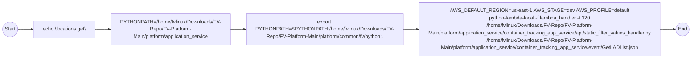

# Diagram: application_service/container_tracking_app_service/event/GetLADList.sh

> Auto-generated by Obscura crawlers

## Mermaid

### SVG

<svg id="container" width="2258.671875" xmlns="http://www.w3.org/2000/svg" class="flowchart" height="190" viewBox="0 0 2258.671875 190" role="graphics-document document" aria-roledescription="flowchart-v2"><g><marker id="container_flowchart-v2-pointEnd" class="marker flowchart-v2" viewBox="0 0 10 10" refX="5" refY="5" markerUnits="userSpaceOnUse" markerWidth="8" markerHeight="8" orient="auto"><path d="M 0 0 L 10 5 L 0 10 z" class="arrowMarkerPath" style="stroke-width: 1; stroke-dasharray: 1, 0;"></path></marker><marker id="container_flowchart-v2-pointStart" class="marker flowchart-v2" viewBox="0 0 10 10" refX="4.5" refY="5" markerUnits="userSpaceOnUse" markerWidth="8" markerHeight="8" orient="auto"><path d="M 0 5 L 10 10 L 10 0 z" class="arrowMarkerPath" style="stroke-width: 1; stroke-dasharray: 1, 0;"></path></marker><marker id="container_flowchart-v2-circleEnd" class="marker flowchart-v2" viewBox="0 0 10 10" refX="11" refY="5" markerUnits="userSpaceOnUse" markerWidth="11" markerHeight="11" orient="auto"><circle cx="5" cy="5" r="5" class="arrowMarkerPath" style="stroke-width: 1; stroke-dasharray: 1, 0;"></circle></marker><marker id="container_flowchart-v2-circleStart" class="marker flowchart-v2" viewBox="0 0 10 10" refX="-1" refY="5" markerUnits="userSpaceOnUse" markerWidth="11" markerHeight="11" orient="auto"><circle cx="5" cy="5" r="5" class="arrowMarkerPath" style="stroke-width: 1; stroke-dasharray: 1, 0;"></circle></marker><marker id="container_flowchart-v2-crossEnd" class="marker cross flowchart-v2" viewBox="0 0 11 11" refX="12" refY="5.2" markerUnits="userSpaceOnUse" markerWidth="11" markerHeight="11" orient="auto"><path d="M 1,1 l 9,9 M 10,1 l -9,9" class="arrowMarkerPath" style="stroke-width: 2; stroke-dasharray: 1, 0;"></path></marker><marker id="container_flowchart-v2-crossStart" class="marker cross flowchart-v2" viewBox="0 0 11 11" refX="-1" refY="5.2" markerUnits="userSpaceOnUse" markerWidth="11" markerHeight="11" orient="auto"><path d="M 1,1 l 9,9 M 10,1 l -9,9" class="arrowMarkerPath" style="stroke-width: 2; stroke-dasharray: 1, 0;"></path></marker><g class="root"><g class="clusters"></g><g class="edgePaths"><path d="M58.047,95L62.214,95C66.38,95,74.714,95,82.38,95C90.047,95,97.047,95,100.547,95L104.047,95" id="L_Start_Echo_0" class="edge-thickness-normal edge-pattern-solid edge-thickness-normal edge-pattern-solid flowchart-link" style=";" data-edge="true" data-et="edge" data-id="L_Start_Echo_0" data-points="W3sieCI6NTguMDQ2ODc1LCJ5Ijo5NX0seyJ4Ijo4My4wNDY4NzUsInkiOjk1fSx7IngiOjEwOC4wNDY4NzUsInkiOjk1fV0=" marker-end="url(#container_flowchart-v2-pointEnd)"></path><path d="M316.813,95L320.979,95C325.146,95,333.479,95,341.146,95C348.813,95,355.813,95,359.313,95L362.813,95" id="L_Echo_SetPY_0" class="edge-thickness-normal edge-pattern-solid edge-thickness-normal edge-pattern-solid flowchart-link" style=";" data-edge="true" data-et="edge" data-id="L_Echo_SetPY_0" data-points="W3sieCI6MzE2LjgxMjUsInkiOjk1fSx7IngiOjM0MS44MTI1LCJ5Ijo5NX0seyJ4IjozNjYuODEyNSwieSI6OTV9XQ==" marker-end="url(#container_flowchart-v2-pointEnd)"></path><path d="M755,95L759.167,95C763.333,95,771.667,95,779.333,95C787,95,794,95,797.5,95L801,95" id="L_SetPY_ExportPY_0" class="edge-thickness-normal edge-pattern-solid edge-thickness-normal edge-pattern-solid flowchart-link" style=";" data-edge="true" data-et="edge" data-id="L_SetPY_ExportPY_0" data-points="W3sieCI6NzU1LCJ5Ijo5NX0seyJ4Ijo3ODAsInkiOjk1fSx7IngiOjgwNSwieSI6OTV9XQ==" marker-end="url(#container_flowchart-v2-pointEnd)"></path><path d="M1300.016,95L1304.182,95C1308.349,95,1316.682,95,1324.349,95C1332.016,95,1339.016,95,1342.516,95L1346.016,95" id="L_ExportPY_Run_0" class="edge-thickness-normal edge-pattern-solid edge-thickness-normal edge-pattern-solid flowchart-link" style=";" data-edge="true" data-et="edge" data-id="L_ExportPY_Run_0" data-points="W3sieCI6MTMwMC4wMTU2MjUsInkiOjk1fSx7IngiOjEzMjUuMDE1NjI1LCJ5Ijo5NX0seyJ4IjoxMzUwLjAxNTYyNSwieSI6OTV9XQ==" marker-end="url(#container_flowchart-v2-pointEnd)"></path><path d="M2158.313,95L2162.479,95C2166.646,95,2174.979,95,2182.646,95C2190.313,95,2197.313,95,2200.813,95L2204.313,95" id="L_Run_End_0" class="edge-thickness-normal edge-pattern-solid edge-thickness-normal edge-pattern-solid flowchart-link" style=";" data-edge="true" data-et="edge" data-id="L_Run_End_0" data-points="W3sieCI6MjE1OC4zMTI1LCJ5Ijo5NX0seyJ4IjoyMTgzLjMxMjUsInkiOjk1fSx7IngiOjIyMDguMzEyNSwieSI6OTV9XQ==" marker-end="url(#container_flowchart-v2-pointEnd)"></path></g><g class="edgeLabels"><g class="edgeLabel"><g class="label" data-id="L_Start_Echo_0" transform="translate(0, 0)"><foreignObject width="0" height="0">

</foreignObject></g></g><g class="edgeLabel"><g class="label" data-id="L_Echo_SetPY_0" transform="translate(0, 0)"><foreignObject width="0" height="0">

</foreignObject></g></g><g class="edgeLabel"><g class="label" data-id="L_SetPY_ExportPY_0" transform="translate(0, 0)"><foreignObject width="0" height="0">

</foreignObject></g></g><g class="edgeLabel"><g class="label" data-id="L_ExportPY_Run_0" transform="translate(0, 0)"><foreignObject width="0" height="0">

</foreignObject></g></g><g class="edgeLabel"><g class="label" data-id="L_Run_End_0" transform="translate(0, 0)"><foreignObject width="0" height="0">

</foreignObject></g></g></g><g class="nodes"><g class="node default" id="flowchart-Start-0" transform="translate(33.0234375, 95)"><circle class="basic label-container" style="" r="25.0234375" cx="0" cy="0"></circle><g class="label" style="" transform="translate(-17.5234375, -12)"><rect></rect><foreignObject width="35.046875" height="24">

Start

</foreignObject></g></g><g class="node default" id="flowchart-Echo-1" transform="translate(212.4296875, 95)"><rect class="basic label-container" style="" x="-104.3828125" y="-27" width="208.765625" height="54"></rect><g class="label" style="" transform="translate(-74.3828125, -12)"><rect></rect><foreignObject width="148.765625" height="24">

echo \locations get\

</foreignObject></g></g><g class="node default" id="flowchart-SetPY-3" transform="translate(560.90625, 95)"><rect class="basic label-container" style="" x="-194.09375" y="-51" width="388.1875" height="102"></rect><g class="label" style="" transform="translate(-164.09375, -36)"><rect></rect><foreignObject width="328.1875" height="72">

PYTHONPATH=/home/fvlinux/Downloads/FV-Repo/FV-Platform-Main/platform/application_service

</foreignObject></g></g><g class="node default" id="flowchart-ExportPY-5" transform="translate(1052.5078125, 95)"><rect class="basic label-container" style="" x="-247.5078125" y="-51" width="495.015625" height="102"></rect><g class="label" style="" transform="translate(-217.5078125, -36)"><rect></rect><foreignObject width="435.015625" height="72">

export PYTHONPATH=$PYTHONPATH:/home/fvlinux/Downloads/FV-Repo/FV-Platform-Main/platform/common/fv/python:.

</foreignObject></g></g><g class="node default" id="flowchart-Run-7" transform="translate(1754.1640625, 95)"><rect class="basic label-container" style="" x="-404.1484375" y="-87" width="808.296875" height="174"></rect><g class="label" style="" transform="translate(-374.1484375, -72)"><rect></rect><foreignObject width="748.296875" height="144">

AWS_DEFAULT_REGION=us-east-1 AWS_STAGE=dev AWS_PROFILE=default python-lambda-local -f lambda_handler -t 120 /home/fvlinux/Downloads/FV-Repo/FV-Platform-Main/platform/application_service/container_tracking_app_service/api/static_filter_values_handler.py /home/fvlinux/Downloads/FV-Repo/FV-Platform-Main/platform/application_service/container_tracking_app_service/event/GetLADList.json

</foreignObject></g></g><g class="node default" id="flowchart-End-9" transform="translate(2229.4921875, 95)"><circle class="basic label-container" style="" r="21.1796875" cx="0" cy="0"></circle><g class="label" style="" transform="translate(-13.6796875, -12)"><rect></rect><foreignObject width="27.359375" height="24">

End

</foreignObject></g></g></g></g></g></svg>
