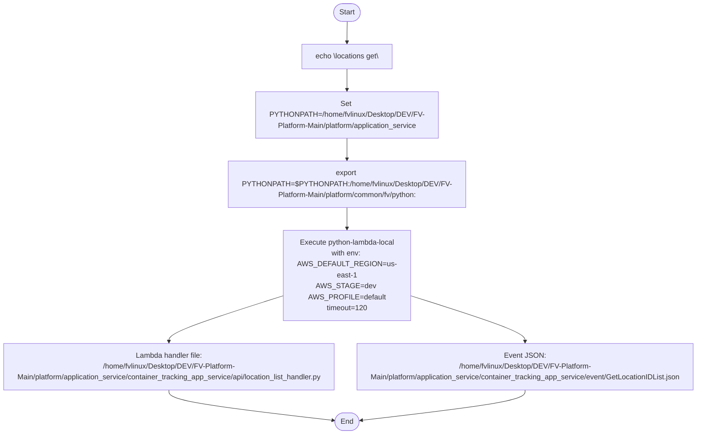

# Diagram: application_service/container_tracking_app_service/event/GetLocationIDList.sh

> Auto-generated by Obscura crawlers

## Mermaid

### SVG

<svg id="container" width="1598.578125" xmlns="http://www.w3.org/2000/svg" class="flowchart" height="880" viewBox="0 0 1598.578125 880" role="graphics-document document" aria-roledescription="flowchart-v2"><g><marker id="container_flowchart-v2-pointEnd" class="marker flowchart-v2" viewBox="0 0 10 10" refX="5" refY="5" markerUnits="userSpaceOnUse" markerWidth="8" markerHeight="8" orient="auto"><path d="M 0 0 L 10 5 L 0 10 z" class="arrowMarkerPath" style="stroke-width: 1; stroke-dasharray: 1, 0;"></path></marker><marker id="container_flowchart-v2-pointStart" class="marker flowchart-v2" viewBox="0 0 10 10" refX="4.5" refY="5" markerUnits="userSpaceOnUse" markerWidth="8" markerHeight="8" orient="auto"><path d="M 0 5 L 10 10 L 10 0 z" class="arrowMarkerPath" style="stroke-width: 1; stroke-dasharray: 1, 0;"></path></marker><marker id="container_flowchart-v2-circleEnd" class="marker flowchart-v2" viewBox="0 0 10 10" refX="11" refY="5" markerUnits="userSpaceOnUse" markerWidth="11" markerHeight="11" orient="auto"><circle cx="5" cy="5" r="5" class="arrowMarkerPath" style="stroke-width: 1; stroke-dasharray: 1, 0;"></circle></marker><marker id="container_flowchart-v2-circleStart" class="marker flowchart-v2" viewBox="0 0 10 10" refX="-1" refY="5" markerUnits="userSpaceOnUse" markerWidth="11" markerHeight="11" orient="auto"><circle cx="5" cy="5" r="5" class="arrowMarkerPath" style="stroke-width: 1; stroke-dasharray: 1, 0;"></circle></marker><marker id="container_flowchart-v2-crossEnd" class="marker cross flowchart-v2" viewBox="0 0 11 11" refX="12" refY="5.2" markerUnits="userSpaceOnUse" markerWidth="11" markerHeight="11" orient="auto"><path d="M 1,1 l 9,9 M 10,1 l -9,9" class="arrowMarkerPath" style="stroke-width: 2; stroke-dasharray: 1, 0;"></path></marker><marker id="container_flowchart-v2-crossStart" class="marker cross flowchart-v2" viewBox="0 0 11 11" refX="-1" refY="5.2" markerUnits="userSpaceOnUse" markerWidth="11" markerHeight="11" orient="auto"><path d="M 1,1 l 9,9 M 10,1 l -9,9" class="arrowMarkerPath" style="stroke-width: 2; stroke-dasharray: 1, 0;"></path></marker><g class="root"><g class="clusters"></g><g class="edgePaths"><path d="M798.574,47.5L798.491,51.583C798.408,55.667,798.241,63.833,798.158,71.417C798.074,79,798.074,86,798.074,89.5L798.074,93" id="L_Start_Echo_0" class="edge-thickness-normal edge-pattern-solid edge-thickness-normal edge-pattern-solid flowchart-link" style=";" data-edge="true" data-et="edge" data-id="L_Start_Echo_0" data-points="W3sieCI6Nzk4LjU3NDIxODc1LCJ5Ijo0Ny41fSx7IngiOjc5OC4wNzQyMTg3NSwieSI6NzJ9LHsieCI6Nzk4LjA3NDIxODc1LCJ5Ijo5N31d" marker-end="url(#container_flowchart-v2-pointEnd)"></path><path d="M798.074,151L798.074,155.167C798.074,159.333,798.074,167.667,798.074,175.333C798.074,183,798.074,190,798.074,193.5L798.074,197" id="L_Echo_SetPYTHONPATH_0" class="edge-thickness-normal edge-pattern-solid edge-thickness-normal edge-pattern-solid flowchart-link" style=";" data-edge="true" data-et="edge" data-id="L_Echo_SetPYTHONPATH_0" data-points="W3sieCI6Nzk4LjA3NDIxODc1LCJ5IjoxNTF9LHsieCI6Nzk4LjA3NDIxODc1LCJ5IjoxNzZ9LHsieCI6Nzk4LjA3NDIxODc1LCJ5IjoyMDF9XQ==" marker-end="url(#container_flowchart-v2-pointEnd)"></path><path d="M798.074,303L798.074,307.167C798.074,311.333,798.074,319.667,798.074,327.333C798.074,335,798.074,342,798.074,345.5L798.074,349" id="L_SetPYTHONPATH_ExportPYTHONPATH_0" class="edge-thickness-normal edge-pattern-solid edge-thickness-normal edge-pattern-solid flowchart-link" style=";" data-edge="true" data-et="edge" data-id="L_SetPYTHONPATH_ExportPYTHONPATH_0" data-points="W3sieCI6Nzk4LjA3NDIxODc1LCJ5IjozMDN9LHsieCI6Nzk4LjA3NDIxODc1LCJ5IjozMjh9LHsieCI6Nzk4LjA3NDIxODc1LCJ5IjozNTN9XQ==" marker-end="url(#container_flowchart-v2-pointEnd)"></path><path d="M798.074,455L798.074,459.167C798.074,463.333,798.074,471.667,798.074,479.333C798.074,487,798.074,494,798.074,497.5L798.074,501" id="L_ExportPYTHONPATH_Run_0" class="edge-thickness-normal edge-pattern-solid edge-thickness-normal edge-pattern-solid flowchart-link" style=";" data-edge="true" data-et="edge" data-id="L_ExportPYTHONPATH_Run_0" data-points="W3sieCI6Nzk4LjA3NDIxODc1LCJ5Ijo0NTV9LHsieCI6Nzk4LjA3NDIxODc1LCJ5Ijo0ODB9LHsieCI6Nzk4LjA3NDIxODc1LCJ5Ijo1MDV9XQ==" marker-end="url(#container_flowchart-v2-pointEnd)"></path><path d="M636.457,619.598L595.369,629.665C554.281,639.732,472.105,659.866,431.018,673.433C389.93,687,389.93,694,389.93,697.5L389.93,701" id="L_Run_Handler_0" class="edge-thickness-normal edge-pattern-solid edge-thickness-normal edge-pattern-solid flowchart-link" style=";" data-edge="true" data-et="edge" data-id="L_Run_Handler_0" data-points="W3sieCI6NjM2LjQ1NzAzMTI1LCJ5Ijo2MTkuNTk4MDI4NDI1MTMyOH0seyJ4IjozODkuOTI5Njg3NSwieSI6NjgwfSx7IngiOjM4OS45Mjk2ODc1LCJ5Ijo3MDV9XQ==" marker-end="url(#container_flowchart-v2-pointEnd)"></path><path d="M959.691,619.598L1000.779,629.665C1041.867,639.732,1124.043,659.866,1165.131,673.433C1206.219,687,1206.219,694,1206.219,697.5L1206.219,701" id="L_Run_Event_0" class="edge-thickness-normal edge-pattern-solid edge-thickness-normal edge-pattern-solid flowchart-link" style=";" data-edge="true" data-et="edge" data-id="L_Run_Event_0" data-points="W3sieCI6OTU5LjY5MTQwNjI1LCJ5Ijo2MTkuNTk4MDI4NDI1MTMyOH0seyJ4IjoxMjA2LjIxODc1LCJ5Ijo2ODB9LHsieCI6MTIwNi4yMTg3NSwieSI6NzA1fV0=" marker-end="url(#container_flowchart-v2-pointEnd)"></path><path d="M389.93,783L389.93,787.167C389.93,791.333,389.93,799.667,453.067,810.791C516.205,821.915,642.48,835.829,705.618,842.787L768.756,849.744" id="L_Handler_End_0" class="edge-thickness-normal edge-pattern-solid edge-thickness-normal edge-pattern-solid flowchart-link" style=";" data-edge="true" data-et="edge" data-id="L_Handler_End_0" data-points="W3sieCI6Mzg5LjkyOTY4NzUsInkiOjc4M30seyJ4IjozODkuOTI5Njg3NSwieSI6ODA4fSx7IngiOjc3Mi43MzE1MDY3ODg0NTQ5LCJ5Ijo4NTAuMTgyMzY5MDAzNTMyNH1d" marker-end="url(#container_flowchart-v2-pointEnd)"></path><path d="M1206.219,783L1206.219,787.167C1206.219,791.333,1206.219,799.667,1143.248,810.791C1080.277,821.914,954.335,835.829,891.364,842.786L828.393,849.743" id="L_Event_End_0" class="edge-thickness-normal edge-pattern-solid edge-thickness-normal edge-pattern-solid flowchart-link" style=";" data-edge="true" data-et="edge" data-id="L_Event_End_0" data-points="W3sieCI6MTIwNi4yMTg3NSwieSI6NzgzfSx7IngiOjEyMDYuMjE4NzUsInkiOjgwOH0seyJ4Ijo4MjQuNDE2OTMxNzMzNzczNiwieSI6ODUwLjE4MjM2ODg5MjA3ODl9XQ==" marker-end="url(#container_flowchart-v2-pointEnd)"></path></g><g class="edgeLabels"><g class="edgeLabel"><g class="label" data-id="L_Start_Echo_0" transform="translate(0, 0)"><foreignObject width="0" height="0">

</foreignObject></g></g><g class="edgeLabel"><g class="label" data-id="L_Echo_SetPYTHONPATH_0" transform="translate(0, 0)"><foreignObject width="0" height="0">

</foreignObject></g></g><g class="edgeLabel"><g class="label" data-id="L_SetPYTHONPATH_ExportPYTHONPATH_0" transform="translate(0, 0)"><foreignObject width="0" height="0">

</foreignObject></g></g><g class="edgeLabel"><g class="label" data-id="L_ExportPYTHONPATH_Run_0" transform="translate(0, 0)"><foreignObject width="0" height="0">

</foreignObject></g></g><g class="edgeLabel"><g class="label" data-id="L_Run_Handler_0" transform="translate(0, 0)"><foreignObject width="0" height="0">

</foreignObject></g></g><g class="edgeLabel"><g class="label" data-id="L_Run_Event_0" transform="translate(0, 0)"><foreignObject width="0" height="0">

</foreignObject></g></g><g class="edgeLabel"><g class="label" data-id="L_Handler_End_0" transform="translate(0, 0)"><foreignObject width="0" height="0">

</foreignObject></g></g><g class="edgeLabel"><g class="label" data-id="L_Event_End_0" transform="translate(0, 0)"><foreignObject width="0" height="0">

</foreignObject></g></g></g><g class="nodes"><g class="node default" id="flowchart-Start-0" transform="translate(798.07421875, 27.5)"><g class="basic label-container outer-path"><path d="M-10.3984375 -19.5 C-5.578527229389525 -19.5, -0.7586169587790508 -19.5, 10.3984375 -19.5 C10.3984375 -19.5, 10.398437499999998 -19.5, 10.398437499999998 -19.5 C10.745231481332386 -19.488878992012207, 11.092025462664774 -19.47775798402441, 11.6478067896239 -19.45993515863156 C12.117153475166191 -19.414657848349268, 12.58650016070848 -19.369380538066977, 12.892042152847864 -19.3399052695533 C13.312394528782601 -19.271945957293532, 13.732746904717338 -19.20398664503377, 14.126030759676757 -19.140403561325776 C14.567394609092451 -19.039665142864926, 15.008758458508145 -18.938926724404077, 15.34470188623539 -18.862249829261074 C15.664168690932241 -18.767433758542527, 15.983635495629093 -18.67261768782398, 16.543047751460602 -18.50658706670804 C16.91662120912006 -18.36910858101417, 17.290194666779517 -18.231630095320305, 17.716144095147794 -18.074876768247425 C18.014106340469088 -17.942977720979655, 18.312068585790378 -17.811078673711886, 18.85917041279238 -17.568892924097174 C19.293183713789862 -17.342468462965577, 19.727197014787343 -17.116044001833977, 19.967429764076783 -16.990714730406097 C20.23151683172308 -16.830623598051037, 20.495603899369378 -16.670532465695977, 21.036368073605697 -16.342718045390892 C21.274155805539504 -16.17684761725888, 21.51194353747331 -16.010977189126866, 22.061592844578712 -15.627565626425154 C22.43011800319108 -15.333676619298124, 22.798643161803444 -15.039787612171095, 23.03889120850187 -14.848196188198123 C23.39665138291564 -14.523287863611042, 23.754411557329412 -14.198379539023959, 23.964247236767985 -14.007812326905688 C24.210738784537412 -13.753289566501318, 24.457230332306843 -13.498766806096947, 24.833858442968648 -13.10986736009568 C25.08117772203698 -12.819352062036376, 25.32849700110531 -12.52883676397707, 25.644151408126582 -12.158051136245305 C25.89780038060997 -11.818184621014334, 26.151449353093355 -11.478318105783364, 26.391796464640635 -11.156274872382312 C26.55912405590065 -10.899214758457356, 26.72645164716067 -10.642154644532399, 27.073721378604247 -10.108655082055241 C27.25389496328012 -9.788738637909406, 27.434068547956 -9.46882219376357, 27.6871239742735 -9.019496659696287 C27.873978635871204 -8.631488956839373, 28.060833297468907 -8.243481253982457, 28.22948364880834 -7.893275190886684 C28.35928513993805 -7.572662998255202, 28.489086631067753 -7.25205080562372, 28.698571729970325 -6.734618561215508 C28.808145108828366 -6.404601002242149, 28.917718487686404 -6.07458344326879, 29.09246063421488 -5.548287939305138 C29.18488220474882 -5.195844435097183, 29.277303775282757 -4.843400930889228, 29.40953178754556 -4.339158212148133 C29.48237207478605 -3.9651387319683895, 29.555212362026534 -3.591119251788646, 29.648482276581777 -3.1121979531509023 C29.711265947420753 -2.625260200161925, 29.77404961825973 -2.138322447172948, 29.808330202509367 -1.872449005199798 C29.82727208393388 -1.5774139124014792, 29.846213965358398 -1.2823788196031607, 29.888418715913414 -0.6250057626472757 C29.888418715913414 -0.299359558377604, 29.888418715913414 0.02628664589206775, 29.888418715913414 0.625005762647271 C29.86031209907345 1.0627890071824828, 29.832205482233487 1.5005722517176947, 29.808330202509367 1.8724490051997846 C29.76399690101315 2.2162893370038517, 29.719663599516934 2.5601296688079187, 29.648482276581777 3.1121979531508885 C29.589811095666636 3.4134620669916584, 29.531139914751495 3.714726180832429, 29.40953178754556 4.339158212148129 C29.300271642808497 4.7558144976768295, 29.191011498071433 5.172470783205529, 29.092460634214884 5.548287939305125 C29.012016933662352 5.790571548406253, 28.931573233109816 6.032855157507379, 28.69857172997033 6.734618561215495 C28.562972562108488 7.069551127465801, 28.42737339424665 7.404483693716108, 28.229483648808344 7.893275190886679 C28.101488219652648 8.15906043819194, 27.97349279049695 8.424845685497202, 27.687123974273504 9.019496659696284 C27.46643834361261 9.411346343778016, 27.245752712951713 9.803196027859748, 27.07372137860425 10.108655082055236 C26.849144283067986 10.45366580819292, 26.624567187531724 10.798676534330603, 26.39179646464064 11.156274872382301 C26.150970510467328 11.478959711278772, 25.910144556294018 11.801644550175245, 25.644151408126582 12.158051136245302 C25.417070225869757 12.42479361420948, 25.189989043612936 12.69153609217366, 24.83385844296866 13.10986736009567 C24.588050325839113 13.363684422253662, 24.342242208709568 13.617501484411653, 23.96424723676799 14.007812326905684 C23.77808513857955 14.17687981890122, 23.59192304039111 14.345947310896756, 23.038891208501887 14.848196188198111 C22.723602867824365 15.099630249713325, 22.408314527146842 15.351064311228539, 22.061592844578715 15.627565626425152 C21.791975666915366 15.815638898023597, 21.522358489252017 16.00371216962204, 21.036368073605708 16.34271804539089 C20.744535908855344 16.51962841865872, 20.452703744104983 16.696538791926553, 19.967429764076787 16.990714730406093 C19.619678407601395 17.17213639033393, 19.271927051126006 17.353558050261768, 18.859170412792388 17.56889292409717 C18.48015401175211 17.736672241715635, 18.101137610711834 17.904451559334095, 17.716144095147804 18.07487676824742 C17.445955681873034 18.17430860192685, 17.175767268598264 18.27374043560628, 16.543047751460616 18.506587066708033 C16.225598609414856 18.600804305742667, 15.908149467369094 18.695021544777298, 15.344701886235413 18.86224982926107 C15.07717069586366 18.92331207765925, 14.80963950549191 18.98437432605743, 14.126030759676766 19.140403561325773 C13.708353834233668 19.20793032749848, 13.29067690879057 19.275457093671186, 12.892042152847878 19.3399052695533 C12.414586677899912 19.38596482499731, 11.937131202951944 19.43202438044132, 11.6478067896239 19.45993515863156 C11.309098958613534 19.470796859517264, 10.970391127603168 19.481658560402966, 10.398437500000004 19.5 C10.398437500000002 19.5, 10.398437500000002 19.5, 10.3984375 19.5 C5.520234918189884 19.5, 0.6420323363797689 19.5, -10.398437499999996 19.5 C-10.657254153987264 19.491700253662685, -10.916070807974531 19.483400507325367, -11.647806789623893 19.45993515863156 C-11.953766532378948 19.430419590218406, -12.259726275134003 19.400904021805253, -12.892042152847871 19.3399052695533 C-13.20151573890021 19.28987198016386, -13.510989324952549 19.239838690774423, -14.126030759676759 19.140403561325773 C-14.48746112452535 19.05790943910263, -14.84889148937394 18.975415316879488, -15.344701886235388 18.862249829261074 C-15.653720160628728 18.770534827491154, -15.962738435022066 18.678819825721234, -16.54304775146059 18.506587066708043 C-16.866531233816033 18.38754215495271, -17.190014716171476 18.268497243197373, -17.716144095147797 18.074876768247425 C-18.131097680427857 17.891189125204704, -18.546051265707913 17.707501482161984, -18.85917041279238 17.568892924097174 C-19.231753677730598 17.37451647342988, -19.604336942668816 17.18014002276258, -19.96742976407678 16.990714730406097 C-20.3327512572124 16.76925469439989, -20.69807275034802 16.547794658393684, -21.036368073605686 16.3427180453909 C-21.402424799996748 16.087372719400783, -21.768481526387813 15.832027393410666, -22.061592844578712 15.627565626425156 C-22.369677799029482 15.381876073735619, -22.677762753480252 15.136186521046081, -23.03889120850187 14.848196188198125 C-23.230768420598455 14.673938380964838, -23.42264563269504 14.49968057373155, -23.964247236767974 14.007812326905697 C-24.292594543865928 13.668766774511802, -24.62094185096388 13.329721222117906, -24.833858442968655 13.109867360095677 C-25.085000957008834 12.814861072690205, -25.336143471049013 12.519854785284732, -25.64415140812658 12.158051136245307 C-25.81658177712994 11.927010150510577, -25.989012146133305 11.695969164775846, -26.391796464640635 11.156274872382316 C-26.58680960592601 10.85668231900728, -26.78182274721139 10.557089765632245, -27.073721378604244 10.108655082055249 C-27.309727057889024 9.689603100318667, -27.545732737173804 9.270551118582086, -27.6871239742735 9.019496659696289 C-27.85837079341196 8.66389897566032, -28.029617612550425 8.308301291624351, -28.22948364880834 7.893275190886686 C-28.413791446169125 7.438031368056705, -28.598099243529905 6.982787545226724, -28.698571729970325 6.73461856121551 C-28.779989795014504 6.489400321509445, -28.861407860058684 6.244182081803379, -29.09246063421488 5.5482879393051325 C-29.21717210755613 5.072709041160495, -29.34188358089738 4.597130143015857, -29.409531787545557 4.339158212148136 C-29.46186892592624 4.070418068021448, -29.514206064306922 3.8016779238947613, -29.648482276581777 3.112197953150904 C-29.701771656854145 2.6988960429367976, -29.755061037126513 2.285594132722691, -29.808330202509364 1.872449005199809 C-29.838453901925337 1.4032480713835174, -29.868577601341308 0.9340471375672257, -29.888418715913414 0.6250057626472781 C-29.888418715913414 0.3500042906722497, -29.888418715913414 0.07500281869722125, -29.888418715913414 -0.6250057626472687 C-29.85872030280731 -1.0875825189024262, -29.829021889701206 -1.550159275157584, -29.808330202509367 -1.8724490051997822 C-29.763140348974773 -2.222932585468187, -29.717950495440174 -2.5734161657365924, -29.648482276581777 -3.112197953150895 C-29.559520992185696 -3.5689953465506643, -29.47055970778961 -4.025792739950433, -29.40953178754556 -4.339158212148126 C-29.328168074858013 -4.649433311881895, -29.24680436217046 -4.959708411615663, -29.092460634214884 -5.548287939305123 C-28.979376044304807 -5.888880706531711, -28.86629145439473 -6.229473473758299, -28.698571729970332 -6.734618561215485 C-28.55030842642934 -7.100831787437712, -28.402045122888342 -7.467045013659939, -28.229483648808344 -7.893275190886676 C-28.02566721146132 -8.316504384010914, -27.8218507741143 -8.739733577135153, -27.687123974273504 -9.019496659696282 C-27.50173800398598 -9.348668222306879, -27.316352033698454 -9.677839784917477, -27.073721378604247 -10.108655082055243 C-26.876956182235954 -10.410939262530304, -26.68019098586766 -10.713223443005363, -26.39179646464064 -11.156274872382308 C-26.23663271354355 -11.36418016314389, -26.081468962446454 -11.572085453905471, -25.644151408126586 -12.158051136245302 C-25.409849304305684 -12.433275719560722, -25.175547200484786 -12.708500302876143, -24.833858442968662 -13.10986736009567 C-24.549572965387632 -13.403415455969864, -24.2652874878066 -13.696963551844055, -23.964247236767996 -14.007812326905677 C-23.687455614738496 -14.259187154527865, -23.410663992708997 -14.510561982150051, -23.038891208501887 -14.848196188198107 C-22.717454970859933 -15.104533033940045, -22.396018733217982 -15.360869879681985, -22.06159284457872 -15.627565626425149 C-21.772090843371455 -15.82950969012769, -21.48258884216419 -16.03145375383023, -21.03636807360571 -16.342718045390885 C-20.66633444987688 -16.567034602654246, -20.29630082614805 -16.79135115991761, -19.96742976407679 -16.99071473040609 C-19.61788465379231 -17.173072190547174, -19.268339543507828 -17.35542965068826, -18.859170412792388 -17.56889292409717 C-18.4676825262981 -17.74219299837265, -18.07619463980381 -17.915493072648136, -17.716144095147804 -18.07487676824742 C-17.39336602195998 -18.19366208290834, -17.070587948772157 -18.312447397569258, -16.54304775146062 -18.506587066708033 C-16.294327830867953 -18.580405833582432, -16.045607910275287 -18.654224600456832, -15.344701886235413 -18.862249829261067 C-15.035099014823805 -18.93291466431322, -14.725496143412197 -19.003579499365372, -14.126030759676768 -19.140403561325773 C-13.74947241100101 -19.201282594886063, -13.372914062325252 -19.26216162844635, -12.89204215284788 -19.3399052695533 C-12.597977124680977 -19.36827336915562, -12.303912096514074 -19.39664146875794, -11.647806789623903 -19.45993515863156 C-11.17501385404071 -19.47509670784009, -10.702220918457515 -19.49025825704862, -10.398437500000005 -19.5 C-10.398437500000004 -19.5, -10.398437500000002 -19.5, -10.3984375 -19.5" stroke="none" stroke-width="0" fill="#ECECFF" style=""></path><path d="M-10.3984375 -19.5 C-4.557888392609248 -19.5, 1.2826607147815032 -19.5, 10.3984375 -19.5 M-10.3984375 -19.5 C-3.9004089421227084 -19.5, 2.5976196157545832 -19.5, 10.3984375 -19.5 M10.3984375 -19.5 C10.3984375 -19.5, 10.398437499999998 -19.5, 10.398437499999998 -19.5 M10.3984375 -19.5 C10.3984375 -19.5, 10.398437499999998 -19.5, 10.398437499999998 -19.5 M10.398437499999998 -19.5 C10.804241438759606 -19.48698665753343, 11.210045377519213 -19.473973315066857, 11.6478067896239 -19.45993515863156 M10.398437499999998 -19.5 C10.739533774265446 -19.48906170638793, 11.080630048530896 -19.478123412775858, 11.6478067896239 -19.45993515863156 M11.6478067896239 -19.45993515863156 C11.929067536113527 -19.432802272683244, 12.210328282603154 -19.405669386734925, 12.892042152847864 -19.3399052695533 M11.6478067896239 -19.45993515863156 C12.127618210441574 -19.41364832792294, 12.607429631259249 -19.367361497214315, 12.892042152847864 -19.3399052695533 M12.892042152847864 -19.3399052695533 C13.247707767001828 -19.282404011284918, 13.603373381155789 -19.22490275301654, 14.126030759676757 -19.140403561325776 M12.892042152847864 -19.3399052695533 C13.317840312220062 -19.271065525260045, 13.74363847159226 -19.202225780966792, 14.126030759676757 -19.140403561325776 M14.126030759676757 -19.140403561325776 C14.406555155133443 -19.076375698655546, 14.68707955059013 -19.012347835985313, 15.34470188623539 -18.862249829261074 M14.126030759676757 -19.140403561325776 C14.557814341079226 -19.041851776521852, 14.989597922481696 -18.943299991717932, 15.34470188623539 -18.862249829261074 M15.34470188623539 -18.862249829261074 C15.714701861847969 -18.752435778668765, 16.084701837460546 -18.642621728076456, 16.543047751460602 -18.50658706670804 M15.34470188623539 -18.862249829261074 C15.75131952891301 -18.74156784729392, 16.15793717159063 -18.620885865326763, 16.543047751460602 -18.50658706670804 M16.543047751460602 -18.50658706670804 C16.8947046881959 -18.37717406330836, 17.2463616249312 -18.247761059908683, 17.716144095147794 -18.074876768247425 M16.543047751460602 -18.50658706670804 C16.999693808810115 -18.33853709641354, 17.456339866159624 -18.17048712611904, 17.716144095147794 -18.074876768247425 M17.716144095147794 -18.074876768247425 C18.113938620270943 -17.898784932130734, 18.511733145394093 -17.722693096014044, 18.85917041279238 -17.568892924097174 M17.716144095147794 -18.074876768247425 C18.14788069167293 -17.88375978397685, 18.579617288198072 -17.69264279970627, 18.85917041279238 -17.568892924097174 M18.85917041279238 -17.568892924097174 C19.123672023802 -17.43090260305482, 19.38817363481162 -17.292912282012473, 19.967429764076783 -16.990714730406097 M18.85917041279238 -17.568892924097174 C19.108525494692174 -17.438804537589604, 19.357880576591967 -17.308716151082038, 19.967429764076783 -16.990714730406097 M19.967429764076783 -16.990714730406097 C20.230664654019424 -16.831140193182947, 20.493899543962065 -16.671565655959796, 21.036368073605697 -16.342718045390892 M19.967429764076783 -16.990714730406097 C20.184659681683097 -16.859028677768453, 20.40188959928941 -16.727342625130813, 21.036368073605697 -16.342718045390892 M21.036368073605697 -16.342718045390892 C21.32013337287238 -16.144775656624276, 21.603898672139064 -15.946833267857661, 22.061592844578712 -15.627565626425154 M21.036368073605697 -16.342718045390892 C21.330135459800925 -16.137798633766288, 21.623902845996152 -15.932879222141684, 22.061592844578712 -15.627565626425154 M22.061592844578712 -15.627565626425154 C22.38949049084038 -15.366075979254298, 22.71738813710205 -15.104586332083441, 23.03889120850187 -14.848196188198123 M22.061592844578712 -15.627565626425154 C22.304236437550514 -15.434063818047328, 22.546880030522317 -15.240562009669501, 23.03889120850187 -14.848196188198123 M23.03889120850187 -14.848196188198123 C23.24795752243783 -14.65832769347303, 23.45702383637379 -14.468459198747938, 23.964247236767985 -14.007812326905688 M23.03889120850187 -14.848196188198123 C23.26544541557835 -14.642445651627106, 23.491999622654827 -14.436695115056091, 23.964247236767985 -14.007812326905688 M23.964247236767985 -14.007812326905688 C24.201533959194002 -13.762794304398605, 24.43882068162002 -13.517776281891523, 24.833858442968648 -13.10986736009568 M23.964247236767985 -14.007812326905688 C24.25775742097336 -13.704738964079361, 24.55126760517873 -13.401665601253036, 24.833858442968648 -13.10986736009568 M24.833858442968648 -13.10986736009568 C25.07829916921039 -12.822733373980784, 25.32273989545213 -12.535599387865886, 25.644151408126582 -12.158051136245305 M24.833858442968648 -13.10986736009568 C25.15686589029787 -12.730444432818356, 25.479873337627087 -12.35102150554103, 25.644151408126582 -12.158051136245305 M25.644151408126582 -12.158051136245305 C25.90485818048054 -11.80872781216656, 26.1655649528345 -11.459404488087817, 26.391796464640635 -11.156274872382312 M25.644151408126582 -12.158051136245305 C25.89650317831236 -11.819922753915568, 26.148854948498137 -11.481794371585833, 26.391796464640635 -11.156274872382312 M26.391796464640635 -11.156274872382312 C26.597336506904597 -10.84051017223546, 26.80287654916856 -10.524745472088606, 27.073721378604247 -10.108655082055241 M26.391796464640635 -11.156274872382312 C26.55567835841716 -10.904508275091324, 26.71956025219369 -10.652741677800334, 27.073721378604247 -10.108655082055241 M27.073721378604247 -10.108655082055241 C27.260247604010463 -9.777458881018056, 27.44677382941668 -9.446262679980872, 27.6871239742735 -9.019496659696287 M27.073721378604247 -10.108655082055241 C27.21565877162346 -9.856630868030065, 27.35759616464267 -9.604606654004888, 27.6871239742735 -9.019496659696287 M27.6871239742735 -9.019496659696287 C27.84435826338501 -8.692996294081391, 28.001592552496525 -8.366495928466497, 28.22948364880834 -7.893275190886684 M27.6871239742735 -9.019496659696287 C27.79941831655444 -8.786315055235896, 27.91171265883538 -8.553133450775507, 28.22948364880834 -7.893275190886684 M28.22948364880834 -7.893275190886684 C28.372759221153668 -7.539381757148981, 28.516034793498996 -7.1854883234112785, 28.698571729970325 -6.734618561215508 M28.22948364880834 -7.893275190886684 C28.348130263088336 -7.600215759738859, 28.466776877368332 -7.3071563285910335, 28.698571729970325 -6.734618561215508 M28.698571729970325 -6.734618561215508 C28.80915439499105 -6.401561193128054, 28.919737060011776 -6.068503825040601, 29.09246063421488 -5.548287939305138 M28.698571729970325 -6.734618561215508 C28.780512193105633 -6.487826941691804, 28.862452656240936 -6.241035322168099, 29.09246063421488 -5.548287939305138 M29.09246063421488 -5.548287939305138 C29.161299976526358 -5.285773691911784, 29.23013931883784 -5.02325944451843, 29.40953178754556 -4.339158212148133 M29.09246063421488 -5.548287939305138 C29.179027448572352 -5.218171157865423, 29.265594262929827 -4.888054376425708, 29.40953178754556 -4.339158212148133 M29.40953178754556 -4.339158212148133 C29.488908104577362 -3.9315776003803773, 29.568284421609164 -3.5239969886126215, 29.648482276581777 -3.1121979531509023 M29.40953178754556 -4.339158212148133 C29.46183537558194 -4.070590341948572, 29.51413896361832 -3.8020224717490096, 29.648482276581777 -3.1121979531509023 M29.648482276581777 -3.1121979531509023 C29.70206765002416 -2.6966003783606456, 29.75565302346654 -2.281002803570389, 29.808330202509367 -1.872449005199798 M29.648482276581777 -3.1121979531509023 C29.703078690716154 -2.6887589464060917, 29.75767510485053 -2.265319939661281, 29.808330202509367 -1.872449005199798 M29.808330202509367 -1.872449005199798 C29.826045398414706 -1.5965205295253977, 29.84376059432004 -1.3205920538509974, 29.888418715913414 -0.6250057626472757 M29.808330202509367 -1.872449005199798 C29.831054462821943 -1.51850030813864, 29.853778723134518 -1.164551611077482, 29.888418715913414 -0.6250057626472757 M29.888418715913414 -0.6250057626472757 C29.888418715913414 -0.23681718584674916, 29.888418715913414 0.15137139095377738, 29.888418715913414 0.625005762647271 M29.888418715913414 -0.6250057626472757 C29.888418715913414 -0.34418100615769626, 29.888418715913414 -0.06335624966811682, 29.888418715913414 0.625005762647271 M29.888418715913414 0.625005762647271 C29.86579087068317 0.9774527169762135, 29.84316302545293 1.329899671305156, 29.808330202509367 1.8724490051997846 M29.888418715913414 0.625005762647271 C29.8617848853193 1.0398491725917283, 29.835151054725184 1.4546925825361854, 29.808330202509367 1.8724490051997846 M29.808330202509367 1.8724490051997846 C29.75644915347881 2.2748281764088807, 29.704568104448246 2.677207347617977, 29.648482276581777 3.1121979531508885 M29.808330202509367 1.8724490051997846 C29.7525409491055 2.305139437765992, 29.696751695701636 2.737829870332199, 29.648482276581777 3.1121979531508885 M29.648482276581777 3.1121979531508885 C29.562504704084336 3.5536746165588657, 29.476527131586895 3.9951512799668434, 29.40953178754556 4.339158212148129 M29.648482276581777 3.1121979531508885 C29.58044887997643 3.4615350658558866, 29.512415483371083 3.8108721785608846, 29.40953178754556 4.339158212148129 M29.40953178754556 4.339158212148129 C29.31864684247525 4.685741897485581, 29.227761897404942 5.0323255828230335, 29.092460634214884 5.548287939305125 M29.40953178754556 4.339158212148129 C29.323332927343973 4.667871824919117, 29.237134067142385 4.996585437690106, 29.092460634214884 5.548287939305125 M29.092460634214884 5.548287939305125 C28.99763406523571 5.833890456508411, 28.90280749625654 6.119492973711696, 28.69857172997033 6.734618561215495 M29.092460634214884 5.548287939305125 C28.96811418756901 5.922799624686733, 28.843767740923138 6.29731131006834, 28.69857172997033 6.734618561215495 M28.69857172997033 6.734618561215495 C28.55920173557836 7.0788651418991915, 28.419831741186393 7.423111722582889, 28.229483648808344 7.893275190886679 M28.69857172997033 6.734618561215495 C28.549961696976176 7.101688215890584, 28.40135166398202 7.468757870565672, 28.229483648808344 7.893275190886679 M28.229483648808344 7.893275190886679 C28.11009881496071 8.14118035279752, 27.990713981113082 8.389085514708361, 27.687123974273504 9.019496659696284 M28.229483648808344 7.893275190886679 C28.100086663888362 8.161970798724969, 27.97068967896838 8.43066640656326, 27.687123974273504 9.019496659696284 M27.687123974273504 9.019496659696284 C27.518969777915114 9.318071462789383, 27.35081558155672 9.616646265882483, 27.07372137860425 10.108655082055236 M27.687123974273504 9.019496659696284 C27.529159135243187 9.299979227069073, 27.37119429621287 9.580461794441865, 27.07372137860425 10.108655082055236 M27.07372137860425 10.108655082055236 C26.803741425980316 10.523416789053803, 26.533761473356382 10.938178496052368, 26.39179646464064 11.156274872382301 M27.07372137860425 10.108655082055236 C26.920431371061458 10.344149697771513, 26.767141363518665 10.57964431348779, 26.39179646464064 11.156274872382301 M26.39179646464064 11.156274872382301 C26.121081478039578 11.51900829178509, 25.850366491438514 11.88174171118788, 25.644151408126582 12.158051136245302 M26.39179646464064 11.156274872382301 C26.161982135334544 11.464205137136366, 25.93216780602845 11.772135401890433, 25.644151408126582 12.158051136245302 M25.644151408126582 12.158051136245302 C25.46984745346354 12.362798479568502, 25.295543498800495 12.567545822891704, 24.83385844296866 13.10986736009567 M25.644151408126582 12.158051136245302 C25.355890288935825 12.496659049369109, 25.067629169745068 12.835266962492918, 24.83385844296866 13.10986736009567 M24.83385844296866 13.10986736009567 C24.594853338994106 13.356659752633364, 24.355848235019554 13.603452145171058, 23.96424723676799 14.007812326905684 M24.83385844296866 13.10986736009567 C24.497970908659184 13.456698816149629, 24.16208337434971 13.80353027220359, 23.96424723676799 14.007812326905684 M23.96424723676799 14.007812326905684 C23.748117237201765 14.204095874025302, 23.531987237635544 14.400379421144923, 23.038891208501887 14.848196188198111 M23.96424723676799 14.007812326905684 C23.767542429183734 14.186454428629695, 23.57083762159948 14.365096530353705, 23.038891208501887 14.848196188198111 M23.038891208501887 14.848196188198111 C22.719707400633244 15.102736781135508, 22.4005235927646 15.357277374072906, 22.061592844578715 15.627565626425152 M23.038891208501887 14.848196188198111 C22.668908152907907 15.143247829371711, 22.298925097313923 15.43829947054531, 22.061592844578715 15.627565626425152 M22.061592844578715 15.627565626425152 C21.71152803964226 15.87175568028766, 21.361463234705806 16.115945734150166, 21.036368073605708 16.34271804539089 M22.061592844578715 15.627565626425152 C21.77084964196921 15.830375498495155, 21.480106439359705 16.033185370565157, 21.036368073605708 16.34271804539089 M21.036368073605708 16.34271804539089 C20.703345778841577 16.544598117533138, 20.370323484077446 16.74647818967539, 19.967429764076787 16.990714730406093 M21.036368073605708 16.34271804539089 C20.80787091517602 16.481234365629316, 20.579373756746335 16.619750685867743, 19.967429764076787 16.990714730406093 M19.967429764076787 16.990714730406093 C19.672009494016013 17.144835296071086, 19.37658922395524 17.298955861736076, 18.859170412792388 17.56889292409717 M19.967429764076787 16.990714730406093 C19.574320737009938 17.195799458028517, 19.181211709943092 17.400884185650945, 18.859170412792388 17.56889292409717 M18.859170412792388 17.56889292409717 C18.427053165351563 17.760178411236513, 17.994935917910738 17.951463898375856, 17.716144095147804 18.07487676824742 M18.859170412792388 17.56889292409717 C18.45125568883944 17.749464672030783, 18.043340964886486 17.930036419964395, 17.716144095147804 18.07487676824742 M17.716144095147804 18.07487676824742 C17.256715107174358 18.24395088273666, 16.79728611920091 18.413024997225897, 16.543047751460616 18.506587066708033 M17.716144095147804 18.07487676824742 C17.389153106174536 18.19521247486115, 17.062162117201268 18.31554818147488, 16.543047751460616 18.506587066708033 M16.543047751460616 18.506587066708033 C16.10625938722184 18.636223560465194, 15.669471022983064 18.765860054222355, 15.344701886235413 18.86224982926107 M16.543047751460616 18.506587066708033 C16.07597187617512 18.64521273476147, 15.60889600088963 18.783838402814904, 15.344701886235413 18.86224982926107 M15.344701886235413 18.86224982926107 C14.953223890359505 18.95160212718708, 14.561745894483597 19.04095442511309, 14.126030759676766 19.140403561325773 M15.344701886235413 18.86224982926107 C14.997283257785258 18.941545864086393, 14.649864629335102 19.02084189891172, 14.126030759676766 19.140403561325773 M14.126030759676766 19.140403561325773 C13.868554129533315 19.18203038612628, 13.611077499389864 19.22365721092678, 12.892042152847878 19.3399052695533 M14.126030759676766 19.140403561325773 C13.697639368975144 19.20966255914956, 13.269247978273523 19.278921556973344, 12.892042152847878 19.3399052695533 M12.892042152847878 19.3399052695533 C12.433976885018861 19.38409427503668, 11.975911617189842 19.42828328052006, 11.6478067896239 19.45993515863156 M12.892042152847878 19.3399052695533 C12.579525902141508 19.37005333640316, 12.267009651435139 19.400201403253025, 11.6478067896239 19.45993515863156 M11.6478067896239 19.45993515863156 C11.391036142620939 19.4681692935072, 11.134265495617978 19.476403428382838, 10.398437500000004 19.5 M11.6478067896239 19.45993515863156 C11.33497081188741 19.469967199539276, 11.022134834150922 19.479999240446997, 10.398437500000004 19.5 M10.398437500000004 19.5 C10.398437500000002 19.5, 10.398437500000002 19.5, 10.3984375 19.5 M10.398437500000004 19.5 C10.398437500000002 19.5, 10.398437500000002 19.5, 10.3984375 19.5 M10.3984375 19.5 C3.163304263705367 19.5, -4.071828972589266 19.5, -10.398437499999996 19.5 M10.3984375 19.5 C6.104611535774914 19.5, 1.8107855715498289 19.5, -10.398437499999996 19.5 M-10.398437499999996 19.5 C-10.651440479756065 19.49188668687965, -10.904443459512132 19.4837733737593, -11.647806789623893 19.45993515863156 M-10.398437499999996 19.5 C-10.894643535218693 19.48408763825699, -11.390849570437387 19.468175276513985, -11.647806789623893 19.45993515863156 M-11.647806789623893 19.45993515863156 C-11.987057312238681 19.427208068723356, -12.32630783485347 19.394480978815157, -12.892042152847871 19.3399052695533 M-11.647806789623893 19.45993515863156 C-12.084154206395231 19.417841248120176, -12.520501623166572 19.375747337608793, -12.892042152847871 19.3399052695533 M-12.892042152847871 19.3399052695533 C-13.369880977281406 19.26265199411431, -13.847719801714941 19.185398718675327, -14.126030759676759 19.140403561325773 M-12.892042152847871 19.3399052695533 C-13.342971319077133 19.26700253896526, -13.793900485306393 19.194099808377228, -14.126030759676759 19.140403561325773 M-14.126030759676759 19.140403561325773 C-14.612492223944932 19.029371906564286, -15.098953688213106 18.9183402518028, -15.344701886235388 18.862249829261074 M-14.126030759676759 19.140403561325773 C-14.394126867426584 19.079212374222475, -14.662222975176409 19.01802118711918, -15.344701886235388 18.862249829261074 M-15.344701886235388 18.862249829261074 C-15.719008243005018 18.75115766734601, -16.093314599774647 18.640065505430943, -16.54304775146059 18.506587066708043 M-15.344701886235388 18.862249829261074 C-15.602647016114346 18.785693068694616, -15.860592145993307 18.70913630812816, -16.54304775146059 18.506587066708043 M-16.54304775146059 18.506587066708043 C-16.89573654626275 18.37679433000137, -17.248425341064905 18.247001593294694, -17.716144095147797 18.074876768247425 M-16.54304775146059 18.506587066708043 C-16.907672522674837 18.372401780346763, -17.272297293889086 18.238216493985483, -17.716144095147797 18.074876768247425 M-17.716144095147797 18.074876768247425 C-18.00615107919019 17.946499279163383, -18.296158063232582 17.81812179007934, -18.85917041279238 17.568892924097174 M-17.716144095147797 18.074876768247425 C-18.061577159435608 17.92196379759499, -18.407010223723415 17.769050826942557, -18.85917041279238 17.568892924097174 M-18.85917041279238 17.568892924097174 C-19.196685576928875 17.392811479155945, -19.534200741065366 17.216730034214716, -19.96742976407678 16.990714730406097 M-18.85917041279238 17.568892924097174 C-19.213334827098944 17.384125576006575, -19.567499241405507 17.199358227915976, -19.96742976407678 16.990714730406097 M-19.96742976407678 16.990714730406097 C-20.201238838335122 16.848978295576057, -20.435047912593465 16.707241860746016, -21.036368073605686 16.3427180453909 M-19.96742976407678 16.990714730406097 C-20.323401334204735 16.774922672673384, -20.67937290433269 16.55913061494067, -21.036368073605686 16.3427180453909 M-21.036368073605686 16.3427180453909 C-21.408249829435743 16.0833094310256, -21.7801315852658 15.823900816660304, -22.061592844578712 15.627565626425156 M-21.036368073605686 16.3427180453909 C-21.383255284748497 16.100744543403025, -21.730142495891304 15.85877104141515, -22.061592844578712 15.627565626425156 M-22.061592844578712 15.627565626425156 C-22.333965632558737 15.410355576155377, -22.606338420538762 15.193145525885598, -23.03889120850187 14.848196188198125 M-22.061592844578712 15.627565626425156 C-22.444197171317487 15.322448857379714, -22.826801498056263 15.017332088334271, -23.03889120850187 14.848196188198125 M-23.03889120850187 14.848196188198125 C-23.35931242874134 14.557198113857552, -23.679733648980807 14.26620003951698, -23.964247236767974 14.007812326905697 M-23.03889120850187 14.848196188198125 C-23.336425899399824 14.577983054261134, -23.633960590297775 14.307769920324143, -23.964247236767974 14.007812326905697 M-23.964247236767974 14.007812326905697 C-24.172776313344343 13.79248893478501, -24.381305389920712 13.577165542664325, -24.833858442968655 13.109867360095677 M-23.964247236767974 14.007812326905697 C-24.18874920671062 13.775995610985396, -24.413251176653265 13.544178895065095, -24.833858442968655 13.109867360095677 M-24.833858442968655 13.109867360095677 C-25.10395682962166 12.792594426099473, -25.374055216274662 12.47532149210327, -25.64415140812658 12.158051136245307 M-24.833858442968655 13.109867360095677 C-25.049366054280327 12.856719857118513, -25.264873665592003 12.60357235414135, -25.64415140812658 12.158051136245307 M-25.64415140812658 12.158051136245307 C-25.856445688324172 11.873596141187328, -26.068739968521765 11.58914114612935, -26.391796464640635 11.156274872382316 M-25.64415140812658 12.158051136245307 C-25.858457588409774 11.87090037836049, -26.07276376869297 11.583749620475674, -26.391796464640635 11.156274872382316 M-26.391796464640635 11.156274872382316 C-26.611556296730157 10.818664756515187, -26.831316128819676 10.48105464064806, -27.073721378604244 10.108655082055249 M-26.391796464640635 11.156274872382316 C-26.586394478023273 10.85732006694334, -26.780992491405907 10.558365261504361, -27.073721378604244 10.108655082055249 M-27.073721378604244 10.108655082055249 C-27.253832829162427 9.788848963327135, -27.433944279720613 9.469042844599022, -27.6871239742735 9.019496659696289 M-27.073721378604244 10.108655082055249 C-27.281627303273957 9.739497060046418, -27.48953322794367 9.370339038037589, -27.6871239742735 9.019496659696289 M-27.6871239742735 9.019496659696289 C-27.864694572097243 8.650767513913145, -28.042265169920988 8.28203836813, -28.22948364880834 7.893275190886686 M-27.6871239742735 9.019496659696289 C-27.832067601647026 8.718518116158354, -27.977011229020555 8.41753957262042, -28.22948364880834 7.893275190886686 M-28.22948364880834 7.893275190886686 C-28.34698325210336 7.603048899047697, -28.464482855398384 7.312822607208708, -28.698571729970325 6.73461856121551 M-28.22948364880834 7.893275190886686 C-28.32605011487395 7.65475415271902, -28.42261658093956 7.416233114551353, -28.698571729970325 6.73461856121551 M-28.698571729970325 6.73461856121551 C-28.78220975922229 6.482714143018858, -28.865847788474255 6.230809724822206, -29.09246063421488 5.5482879393051325 M-28.698571729970325 6.73461856121551 C-28.850080709927685 6.278297653261659, -29.001589689885048 5.821976745307809, -29.09246063421488 5.5482879393051325 M-29.09246063421488 5.5482879393051325 C-29.196161308142212 5.152832325463833, -29.299861982069544 4.757376711622533, -29.409531787545557 4.339158212148136 M-29.09246063421488 5.5482879393051325 C-29.20430073302431 5.121793170739335, -29.31614083183374 4.6952984021735364, -29.409531787545557 4.339158212148136 M-29.409531787545557 4.339158212148136 C-29.484182940956266 3.955840316911003, -29.55883409436698 3.5725224216738707, -29.648482276581777 3.112197953150904 M-29.409531787545557 4.339158212148136 C-29.488239858238913 3.9350089040943894, -29.56694792893227 3.5308595960406435, -29.648482276581777 3.112197953150904 M-29.648482276581777 3.112197953150904 C-29.694753224927563 2.753329615013228, -29.74102417327335 2.394461276875552, -29.808330202509364 1.872449005199809 M-29.648482276581777 3.112197953150904 C-29.70107677096768 2.70428544065149, -29.75367126535358 2.296372928152076, -29.808330202509364 1.872449005199809 M-29.808330202509364 1.872449005199809 C-29.829267964856626 1.5463264559836436, -29.850205727203885 1.2202039067674781, -29.888418715913414 0.6250057626472781 M-29.808330202509364 1.872449005199809 C-29.830787102763445 1.5226646568588613, -29.85324400301753 1.1728803085179136, -29.888418715913414 0.6250057626472781 M-29.888418715913414 0.6250057626472781 C-29.888418715913414 0.17264411726686735, -29.888418715913414 -0.27971752811354345, -29.888418715913414 -0.6250057626472687 M-29.888418715913414 0.6250057626472781 C-29.888418715913414 0.3352789673653768, -29.888418715913414 0.045552172083475506, -29.888418715913414 -0.6250057626472687 M-29.888418715913414 -0.6250057626472687 C-29.85819162120405 -1.0958171616173207, -29.827964526494686 -1.5666285605873729, -29.808330202509367 -1.8724490051997822 M-29.888418715913414 -0.6250057626472687 C-29.87176119141357 -0.8844601524441339, -29.855103666913724 -1.143914542240999, -29.808330202509367 -1.8724490051997822 M-29.808330202509367 -1.8724490051997822 C-29.75843582289716 -2.2594199607124064, -29.708541443284947 -2.6463909162250303, -29.648482276581777 -3.112197953150895 M-29.808330202509367 -1.8724490051997822 C-29.75579212275474 -2.279923976959345, -29.703254043000115 -2.6873989487189083, -29.648482276581777 -3.112197953150895 M-29.648482276581777 -3.112197953150895 C-29.57649075955686 -3.4818591776613195, -29.50449924253195 -3.8515204021717433, -29.40953178754556 -4.339158212148126 M-29.648482276581777 -3.112197953150895 C-29.553959850421503 -3.5975506341620656, -29.45943742426123 -4.082903315173236, -29.40953178754556 -4.339158212148126 M-29.40953178754556 -4.339158212148126 C-29.337134114635866 -4.615241916302715, -29.26473644172617 -4.8913256204573035, -29.092460634214884 -5.548287939305123 M-29.40953178754556 -4.339158212148126 C-29.294042720193616 -4.779568079239498, -29.178553652841675 -5.21997794633087, -29.092460634214884 -5.548287939305123 M-29.092460634214884 -5.548287939305123 C-29.009848615494427 -5.797102177253452, -28.92723659677397 -6.045916415201781, -28.698571729970332 -6.734618561215485 M-29.092460634214884 -5.548287939305123 C-28.990781316759456 -5.854529843081689, -28.88910199930403 -6.160771746858256, -28.698571729970332 -6.734618561215485 M-28.698571729970332 -6.734618561215485 C-28.57477188109593 -7.040406581442503, -28.450972032221532 -7.346194601669522, -28.229483648808344 -7.893275190886676 M-28.698571729970332 -6.734618561215485 C-28.51552959787198 -7.1867361663773, -28.33248746577362 -7.6388537715391145, -28.229483648808344 -7.893275190886676 M-28.229483648808344 -7.893275190886676 C-28.062995617451378 -8.238991150272623, -27.896507586094412 -8.58470710965857, -27.687123974273504 -9.019496659696282 M-28.229483648808344 -7.893275190886676 C-28.03450728938615 -8.298147773052643, -27.839530929963956 -8.703020355218607, -27.687123974273504 -9.019496659696282 M-27.687123974273504 -9.019496659696282 C-27.494871540269973 -9.360860323939495, -27.302619106266445 -9.702223988182707, -27.073721378604247 -10.108655082055243 M-27.687123974273504 -9.019496659696282 C-27.486482578670152 -9.375755774734454, -27.2858411830668 -9.732014889772627, -27.073721378604247 -10.108655082055243 M-27.073721378604247 -10.108655082055243 C-26.872554370843407 -10.417701626881122, -26.671387363082562 -10.726748171707, -26.39179646464064 -11.156274872382308 M-27.073721378604247 -10.108655082055243 C-26.90904225714472 -10.361646435152931, -26.74436313568519 -10.614637788250619, -26.39179646464064 -11.156274872382308 M-26.39179646464064 -11.156274872382308 C-26.097081955382873 -11.55116546574359, -25.802367446125103 -11.94605605910487, -25.644151408126586 -12.158051136245302 M-26.39179646464064 -11.156274872382308 C-26.11309000303558 -11.529716140252102, -25.834383541430523 -11.903157408121896, -25.644151408126586 -12.158051136245302 M-25.644151408126586 -12.158051136245302 C-25.332144002820435 -12.52455278824221, -25.020136597514284 -12.891054440239115, -24.833858442968662 -13.10986736009567 M-25.644151408126586 -12.158051136245302 C-25.33589933657913 -12.520141559524703, -25.02764726503167 -12.882231982804104, -24.833858442968662 -13.10986736009567 M-24.833858442968662 -13.10986736009567 C-24.570493558605452 -13.381813225859817, -24.30712867424224 -13.653759091623964, -23.964247236767996 -14.007812326905677 M-24.833858442968662 -13.10986736009567 C-24.549421950585828 -13.40357139115127, -24.264985458202997 -13.69727542220687, -23.964247236767996 -14.007812326905677 M-23.964247236767996 -14.007812326905677 C-23.72788184011811 -14.222473126257412, -23.49151644346822 -14.437133925609148, -23.038891208501887 -14.848196188198107 M-23.964247236767996 -14.007812326905677 C-23.639243739665112 -14.3029719038532, -23.314240242562228 -14.598131480800722, -23.038891208501887 -14.848196188198107 M-23.038891208501887 -14.848196188198107 C-22.660886352210092 -15.149645001959133, -22.282881495918296 -15.451093815720158, -22.06159284457872 -15.627565626425149 M-23.038891208501887 -14.848196188198107 C-22.801045369978315 -15.037871915077078, -22.563199531454746 -15.227547641956049, -22.06159284457872 -15.627565626425149 M-22.06159284457872 -15.627565626425149 C-21.779006956411727 -15.824685309064506, -21.496421068244732 -16.02180499170386, -21.03636807360571 -16.342718045390885 M-22.06159284457872 -15.627565626425149 C-21.851488880767203 -15.774125056326058, -21.641384916955687 -15.92068448622697, -21.03636807360571 -16.342718045390885 M-21.03636807360571 -16.342718045390885 C-20.66785429284215 -16.566113264917114, -20.29934051207859 -16.78950848444334, -19.96742976407679 -16.99071473040609 M-21.03636807360571 -16.342718045390885 C-20.80996802198745 -16.47996308715626, -20.583567970369188 -16.617208128921632, -19.96742976407679 -16.99071473040609 M-19.96742976407679 -16.99071473040609 C-19.66420786597111 -17.14890540042493, -19.360985967865428 -17.307096070443766, -18.859170412792388 -17.56889292409717 M-19.96742976407679 -16.99071473040609 C-19.58420518962572 -17.190642745430157, -19.20098061517465 -17.390570760454228, -18.859170412792388 -17.56889292409717 M-18.859170412792388 -17.56889292409717 C-18.42427439404705 -17.761408490863698, -17.989378375301712 -17.95392405763023, -17.716144095147804 -18.07487676824742 M-18.859170412792388 -17.56889292409717 C-18.56256610443068 -17.7001908529547, -18.265961796068975 -17.83148878181223, -17.716144095147804 -18.07487676824742 M-17.716144095147804 -18.07487676824742 C-17.4424076232907 -18.175614320283042, -17.168671151433593 -18.276351872318667, -16.54304775146062 -18.506587066708033 M-17.716144095147804 -18.07487676824742 C-17.335098454943346 -18.215105086189947, -16.954052814738887 -18.355333404132473, -16.54304775146062 -18.506587066708033 M-16.54304775146062 -18.506587066708033 C-16.259115272152258 -18.590856736174757, -15.975182792843892 -18.675126405641482, -15.344701886235413 -18.862249829261067 M-16.54304775146062 -18.506587066708033 C-16.168848361553366 -18.617647481419827, -15.794648971646113 -18.728707896131617, -15.344701886235413 -18.862249829261067 M-15.344701886235413 -18.862249829261067 C-14.935402403113676 -18.955669765354866, -14.526102919991938 -19.049089701448665, -14.126030759676768 -19.140403561325773 M-15.344701886235413 -18.862249829261067 C-15.01115353433192 -18.93838006397663, -14.677605182428426 -19.01451029869219, -14.126030759676768 -19.140403561325773 M-14.126030759676768 -19.140403561325773 C-13.72197464018638 -19.205728221222973, -13.317918520695992 -19.271052881120173, -12.89204215284788 -19.3399052695533 M-14.126030759676768 -19.140403561325773 C-13.656746437536396 -19.216273811175157, -13.187462115396023 -19.29214406102454, -12.89204215284788 -19.3399052695533 M-12.89204215284788 -19.3399052695533 C-12.394816748325411 -19.387872006326543, -11.89759134380294 -19.435838743099787, -11.647806789623903 -19.45993515863156 M-12.89204215284788 -19.3399052695533 C-12.466084547239815 -19.380996887477338, -12.04012694163175 -19.422088505401376, -11.647806789623903 -19.45993515863156 M-11.647806789623903 -19.45993515863156 C-11.161385256269124 -19.475533750444168, -10.674963722914343 -19.49113234225678, -10.398437500000005 -19.5 M-11.647806789623903 -19.45993515863156 C-11.21091327008808 -19.473945483441426, -10.774019750552256 -19.487955808251293, -10.398437500000005 -19.5 M-10.398437500000005 -19.5 C-10.398437500000004 -19.5, -10.398437500000002 -19.5, -10.3984375 -19.5 M-10.398437500000005 -19.5 C-10.398437500000004 -19.5, -10.398437500000002 -19.5, -10.3984375 -19.5" stroke="#9370DB" stroke-width="1.3" fill="none" stroke-dasharray="0 0" style=""></path></g><g class="label" style="" transform="translate(-17.5234375, -12)"><rect></rect><foreignObject width="35.046875" height="24">

Start

</foreignObject></g></g><g class="node default" id="flowchart-Echo-1" transform="translate(798.07421875, 124)"><rect class="basic label-container" style="" x="-104.3828125" y="-27" width="208.765625" height="54"></rect><g class="label" style="" transform="translate(-74.3828125, -12)"><rect></rect><foreignObject width="148.765625" height="24">

echo \locations get\

</foreignObject></g></g><g class="node default" id="flowchart-SetPYTHONPATH-2" transform="translate(798.07421875, 252)"><rect class="basic label-container" style="" x="-201.40625" y="-51" width="402.8125" height="102"></rect><g class="label" style="" transform="translate(-171.40625, -36)"><rect></rect><foreignObject width="342.8125" height="72">

Set PYTHONPATH=/home/fvlinux/Desktop/DEV/FV-Platform-Main/platform/application_service

</foreignObject></g></g><g class="node default" id="flowchart-ExportPYTHONPATH-3" transform="translate(798.07421875, 404)"><rect class="basic label-container" style="" x="-254.828125" y="-51" width="509.65625" height="102"></rect><g class="label" style="" transform="translate(-224.828125, -36)"><rect></rect><foreignObject width="449.65625" height="72">

export PYTHONPATH=$PYTHONPATH:/home/fvlinux/Desktop/DEV/FV-Platform-Main/platform/common/fv/python:

</foreignObject></g></g><g class="node default" id="flowchart-Run-4" transform="translate(798.07421875, 580)"><rect class="basic label-container" style="" x="-161.6171875" y="-75" width="323.234375" height="150"></rect><g class="label" style="" transform="translate(-131.6171875, -60)"><rect></rect><foreignObject width="263.234375" height="120">

Execute python-lambda-local\nwith env: AWS_DEFAULT_REGION=us-east-1\nAWS_STAGE=dev AWS_PROFILE=default\ntimeout=120

</foreignObject></g></g><g class="node default" id="flowchart-Handler-5" transform="translate(389.9296875, 744)"><rect class="basic label-container" style="" x="-381.9296875" y="-39" width="763.859375" height="78"></rect><g class="label" style="" transform="translate(-351.9296875, -24)"><rect></rect><foreignObject width="703.859375" height="48">

Lambda handler file:\n/home/fvlinux/Desktop/DEV/FV-Platform-Main/platform/application_service/container_tracking_app_service/api/location_list_handler.py

</foreignObject></g></g><g class="node default" id="flowchart-Event-6" transform="translate(1206.21875, 744)"><rect class="basic label-container" style="" x="-384.359375" y="-39" width="768.71875" height="78"></rect><g class="label" style="" transform="translate(-354.359375, -24)"><rect></rect><foreignObject width="708.71875" height="48">

Event JSON:\n/home/fvlinux/Desktop/DEV/FV-Platform-Main/platform/application_service/container_tracking_app_service/event/GetLocationIDList.json

</foreignObject></g></g><g class="node default" id="flowchart-End-7" transform="translate(798.07421875, 852.5)"><g class="basic label-container outer-path"><path d="M-6.5546875 -19.5 C-2.212970589531187 -19.5, 2.1287463209376263 -19.5, 6.5546875 -19.5 C6.5546875 -19.5, 6.554687499999999 -19.5, 6.554687499999999 -19.5 C6.834049933693625 -19.491041390497436, 7.11341236738725 -19.482082780994872, 7.8040567896239 -19.45993515863156 C8.119163458692896 -19.42953719723769, 8.434270127761891 -19.399139235843815, 9.048292152847864 -19.3399052695533 C9.461487807476198 -19.27310300049315, 9.874683462104532 -19.206300731433, 10.282280759676757 -19.140403561325776 C10.668150759292008 -19.052331251950665, 11.05402075890726 -18.964258942575555, 11.50095188623539 -18.862249829261074 C11.864708810458719 -18.754288683550648, 12.228465734682048 -18.646327537840225, 12.699297751460602 -18.50658706670804 C12.978550524733004 -18.403819464759458, 13.257803298005406 -18.301051862810873, 13.872394095147794 -18.074876768247425 C14.293692473132424 -17.88838047368598, 14.714990851117056 -17.701884179124534, 15.015420412792382 -17.568892924097174 C15.30670822838476 -17.41692825728138, 15.597996043977139 -17.264963590465587, 16.123679764076783 -16.990714730406097 C16.520449475792546 -16.750190599486363, 16.91721918750831 -16.50966646856663, 17.192618073605697 -16.342718045390892 C17.468954118293706 -16.149957983011113, 17.745290162981714 -15.957197920631332, 18.217842844578712 -15.627565626425154 C18.508408864645165 -15.395846957708686, 18.798974884711622 -15.164128288992217, 19.19514120850187 -14.848196188198123 C19.54279386920157 -14.532467240136002, 19.89044652990127 -14.216738292073883, 20.120497236767985 -14.007812326905688 C20.304129514057347 -13.81819692411407, 20.487761791346713 -13.62858152132245, 20.990108442968648 -13.10986736009568 C21.229847261627178 -12.828256502174142, 21.469586080285712 -12.546645644252603, 21.800401408126582 -12.158051136245305 C21.958436862966735 -11.946298024085616, 22.11647231780689 -11.734544911925928, 22.548046464640635 -11.156274872382312 C22.78819420357091 -10.787343456688236, 23.02834194250119 -10.41841204099416, 23.229971378604247 -10.108655082055241 C23.367664577379667 -9.864166864681188, 23.505357776155087 -9.619678647307135, 23.8433739742735 -9.019496659696287 C23.993496218541864 -8.707764607371574, 24.143618462810224 -8.396032555046864, 24.38573364880834 -7.893275190886684 C24.52820234961094 -7.541374745459322, 24.670671050413535 -7.189474300031959, 24.854821729970325 -6.734618561215508 C24.967502247764326 -6.395242794822395, 25.080182765558327 -6.055867028429283, 25.24871063421488 -5.548287939305138 C25.332451481846356 -5.228947793773383, 25.41619232947783 -4.909607648241629, 25.56578178754556 -4.339158212148133 C25.618333468389668 -4.069316437815329, 25.670885149233772 -3.799474663482523, 25.804732276581777 -3.1121979531509023 C25.854799148163828 -2.72388918398259, 25.904866019745878 -2.335580414814277, 25.964580202509367 -1.872449005199798 C25.992908171279815 -1.4312180256752518, 26.02123614005026 -0.9899870461507057, 26.044668715913414 -0.6250057626472757 C26.044668715913414 -0.13138045694563016, 26.044668715913414 0.36224484875601537, 26.044668715913414 0.625005762647271 C26.01495165173347 1.0878730244323875, 25.985234587553524 1.5507402862175041, 25.964580202509367 1.8724490051997846 C25.916845249205455 2.2426718766922003, 25.869110295901546 2.6128947481846154, 25.804732276581777 3.1121979531508885 C25.714307971999954 3.5765076459950196, 25.623883667418127 4.04081733883915, 25.56578178754556 4.339158212148129 C25.502197406353833 4.581633015277317, 25.438613025162105 4.824107818406507, 25.248710634214884 5.548287939305125 C25.167016411151724 5.794337922964556, 25.08532218808856 6.0403879066239865, 24.85482172997033 6.734618561215495 C24.68762613292427 7.147594918426227, 24.52043053587821 7.56057127563696, 24.385733648808344 7.893275190886679 C24.216923345053704 8.243813398595067, 24.04811304129906 8.594351606303457, 23.843373974273504 9.019496659696284 C23.616702087092108 9.42197554840437, 23.39003019991071 9.824454437112458, 23.22997137860425 10.108655082055236 C23.010445512294094 10.445905763656654, 22.790919645983934 10.783156445258072, 22.54804646464064 11.156274872382301 C22.263750405015145 11.537205692376626, 21.979454345389648 11.91813651237095, 21.800401408126582 12.158051136245302 C21.493149570384915 12.518966627981508, 21.185897732643244 12.879882119717713, 20.99010844296866 13.10986736009567 C20.79013803396252 13.316353225270419, 20.590167624956383 13.522839090445167, 20.12049723676799 14.007812326905684 C19.822379828738775 14.278554669123437, 19.524262420709558 14.54929701134119, 19.195141208501887 14.848196188198111 C18.934547734331574 15.056012549165349, 18.673954260161263 15.263828910132588, 18.217842844578715 15.627565626425152 C17.97664537214199 15.795814541926713, 17.735447899705267 15.964063457428274, 17.192618073605708 16.34271804539089 C16.86600064507943 16.540715449980578, 16.539383216553155 16.73871285457027, 16.123679764076787 16.990714730406093 C15.882317082266093 17.116633486906554, 15.6409544004554 17.24255224340702, 15.015420412792386 17.56889292409717 C14.623070946061635 17.742574394385464, 14.230721479330883 17.916255864673758, 13.872394095147804 18.07487676824742 C13.407392895536134 18.246001508128483, 12.942391695924462 18.41712624800955, 12.699297751460616 18.506587066708033 C12.454862320059567 18.579134219680103, 12.21042688865852 18.651681372652174, 11.500951886235413 18.86224982926107 C11.101177097508304 18.953495816013735, 10.701402308781194 19.044741802766396, 10.282280759676766 19.140403561325773 C9.795205827486003 19.219150059039862, 9.308130895295239 19.29789655675395, 9.048292152847878 19.3399052695533 C8.722404905456958 19.371343220372342, 8.396517658066037 19.40278117119139, 7.804056789623901 19.45993515863156 C7.31623706729796 19.475578587643064, 6.828417344972019 19.491222016654568, 6.5546875000000036 19.5 C6.554687500000003 19.5, 6.554687500000001 19.5, 6.5546875 19.5 C1.4846438674001448 19.5, -3.5853997651997105 19.5, -6.5546874999999964 19.5 C-6.870790606805423 19.489863188622124, -7.186893713610851 19.479726377244244, -7.8040567896238935 19.45993515863156 C-8.225882039436552 19.41924218410122, -8.647707289249212 19.378549209570878, -9.048292152847871 19.3399052695533 C-9.384961125519663 19.2854752409586, -9.721630098191454 19.231045212363902, -10.282280759676759 19.140403561325773 C-10.533910337426 19.08297075224096, -10.785539915175242 19.025537943156145, -11.500951886235388 18.862249829261074 C-11.838559275396603 18.762049728295374, -12.176166664557817 18.661849627329676, -12.699297751460593 18.506587066708043 C-12.97684524386401 18.40444702388269, -13.254392736267429 18.302306981057338, -13.872394095147797 18.074876768247425 C-14.285717769137483 17.89191063858335, -14.699041443127166 17.70894450891928, -15.01542041279238 17.568892924097174 C-15.283529841353722 17.429020406949007, -15.551639269915063 17.28914788980084, -16.12367976407678 16.990714730406097 C-16.40581022668977 16.81968558598747, -16.68794068930276 16.648656441568846, -17.192618073605686 16.3427180453909 C-17.537440637631388 16.102184751854786, -17.88226320165709 15.86165145831867, -18.217842844578712 15.627565626425156 C-18.59582681373408 15.3261334695996, -18.97381078288945 15.024701312774045, -19.19514120850187 14.848196188198125 C-19.411220652848062 14.651958553991722, -19.62730009719425 14.455720919785318, -20.120497236767974 14.007812326905697 C-20.304482120587444 13.81783282892221, -20.488467004406917 13.627853330938722, -20.990108442968655 13.109867360095677 C-21.174877921198917 12.89282661728526, -21.35964739942918 12.675785874474844, -21.80040140812658 12.158051136245307 C-22.018357582456883 11.866009718858665, -22.236313756787183 11.573968301472021, -22.548046464640635 11.156274872382316 C-22.75552353067493 10.837534383560516, -22.96300059670923 10.518793894738717, -23.229971378604244 10.108655082055249 C-23.458552580765396 9.702786011261502, -23.687133782926548 9.296916940467755, -23.8433739742735 9.019496659696289 C-23.979173130346005 8.737506806475267, -24.11497228641851 8.455516953254243, -24.38573364880834 7.893275190886686 C-24.52976439594627 7.537516460810946, -24.673795143084195 7.181757730735207, -24.854821729970325 6.73461856121551 C-24.9962401334646 6.308688861853448, -25.137658536958874 5.8827591624913875, -25.24871063421488 5.5482879393051325 C-25.3244625515572 5.259413047390211, -25.40021446889952 4.97053815547529, -25.565781787545557 4.339158212148136 C-25.637196774460538 3.972457347902537, -25.708611761375522 3.605756483656938, -25.804732276581777 3.112197953150904 C-25.84719907703888 2.78283383482389, -25.889665877495982 2.453469716496876, -25.964580202509364 1.872449005199809 C-25.981132345284813 1.6146360208229997, -25.997684488060266 1.3568230364461904, -26.044668715913414 0.6250057626472781 C-26.044668715913414 0.36544491922540606, -26.044668715913414 0.10588407580353398, -26.044668715913414 -0.6250057626472687 C-26.026812163320223 -0.903135982836051, -26.008955610727032 -1.1812662030248333, -25.964580202509367 -1.8724490051997822 C-25.90069491072134 -2.3679307127299287, -25.836809618933316 -2.863412420260075, -25.804732276581777 -3.112197953150895 C-25.710142876522177 -3.597894530980164, -25.615553476462576 -4.083591108809433, -25.56578178754556 -4.339158212148126 C-25.443278809554748 -4.806315160353606, -25.320775831563935 -5.273472108559085, -25.248710634214884 -5.548287939305123 C-25.120444083771435 -5.934606352741308, -24.99217753332799 -6.320924766177493, -24.854821729970332 -6.734618561215485 C-24.75161786241595 -6.989534109385847, -24.64841399486157 -7.244449657556208, -24.385733648808344 -7.893275190886676 C-24.233692736123917 -8.20899139923028, -24.081651823439486 -8.524707607573884, -23.843373974273504 -9.019496659696282 C-23.60917476095662 -9.43534107818235, -23.374975547639735 -9.851185496668421, -23.229971378604247 -10.108655082055243 C-23.04093035576081 -10.399072857765113, -22.851889332917377 -10.68949063347498, -22.54804646464064 -11.156274872382308 C-22.256507611731507 -11.546910375544662, -21.964968758822376 -11.937545878707017, -21.800401408126586 -12.158051136245302 C-21.590736479387523 -12.404335491814619, -21.38107155064846 -12.650619847383936, -20.990108442968662 -13.10986736009567 C-20.649020608673972 -13.462068552836934, -20.307932774379278 -13.814269745578198, -20.120497236767996 -14.007812326905677 C-19.90371697612065 -14.204686423934206, -19.686936715473305 -14.401560520962734, -19.195141208501887 -14.848196188198107 C-18.962733252447652 -15.033535348515912, -18.730325296393417 -15.218874508833716, -18.21784284457872 -15.627565626425149 C-17.859670954181535 -15.877410832154988, -17.501499063784347 -16.127256037884827, -17.19261807360571 -16.342718045390885 C-16.869400226159364 -16.538654603951766, -16.546182378713016 -16.734591162512647, -16.12367976407679 -16.99071473040609 C-15.788362852722587 -17.165649348278848, -15.453045941368384 -17.340583966151602, -15.01542041279239 -17.56889292409717 C-14.716136593476206 -17.70137699296938, -14.416852774160022 -17.83386106184159, -13.872394095147806 -18.07487676824742 C-13.494432125976978 -18.21397026674443, -13.116470156806148 -18.353063765241437, -12.699297751460618 -18.506587066708033 C-12.448868482122423 -18.58091315931755, -12.19843921278423 -18.655239251927068, -11.500951886235413 -18.862249829261067 C-11.143524356863903 -18.943830330407508, -10.786096827492393 -19.02541083155395, -10.282280759676768 -19.140403561325773 C-9.837517512976943 -19.21230943386171, -9.39275426627712 -19.284215306397645, -9.04829215284788 -19.3399052695533 C-8.778071371768997 -19.36597314331594, -8.507850590690113 -19.392041017078586, -7.804056789623903 -19.45993515863156 C-7.441018214362652 -19.471577099128467, -7.077979639101401 -19.48321903962538, -6.554687500000006 -19.5 C-6.554687500000004 -19.5, -6.554687500000003 -19.5, -6.5546875 -19.5" stroke="none" stroke-width="0" fill="#ECECFF" style=""></path><path d="M-6.5546875 -19.5 C-3.3237220180894513 -19.5, -0.09275653617890267 -19.5, 6.5546875 -19.5 M-6.5546875 -19.5 C-3.8615351159512676 -19.5, -1.1683827319025353 -19.5, 6.5546875 -19.5 M6.5546875 -19.5 C6.5546875 -19.5, 6.554687499999999 -19.5, 6.554687499999999 -19.5 M6.5546875 -19.5 C6.5546875 -19.5, 6.554687499999999 -19.5, 6.554687499999999 -19.5 M6.554687499999999 -19.5 C6.834738866678252 -19.491019297757546, 7.114790233356505 -19.482038595515093, 7.8040567896239 -19.45993515863156 M6.554687499999999 -19.5 C6.818872979884213 -19.491528085865955, 7.083058459768427 -19.48305617173191, 7.8040567896239 -19.45993515863156 M7.8040567896239 -19.45993515863156 C8.056059906029176 -19.43562472107003, 8.308063022434453 -19.411314283508503, 9.048292152847864 -19.3399052695533 M7.8040567896239 -19.45993515863156 C8.14228447756376 -19.427306740354307, 8.480512165503619 -19.39467832207706, 9.048292152847864 -19.3399052695533 M9.048292152847864 -19.3399052695533 C9.498887223018544 -19.267056553025064, 9.949482293189222 -19.194207836496826, 10.282280759676757 -19.140403561325776 M9.048292152847864 -19.3399052695533 C9.53423622323242 -19.261341600806073, 10.020180293616976 -19.18277793205885, 10.282280759676757 -19.140403561325776 M10.282280759676757 -19.140403561325776 C10.734783102196172 -19.03712285449946, 11.187285444715588 -18.93384214767315, 11.50095188623539 -18.862249829261074 M10.282280759676757 -19.140403561325776 C10.575255828331246 -19.07353391374638, 10.868230896985736 -19.00666426616699, 11.50095188623539 -18.862249829261074 M11.50095188623539 -18.862249829261074 C11.825836677396731 -18.765825728599456, 12.150721468558073 -18.66940162793784, 12.699297751460602 -18.50658706670804 M11.50095188623539 -18.862249829261074 C11.826145906688872 -18.765733950968727, 12.151339927142354 -18.66921807267638, 12.699297751460602 -18.50658706670804 M12.699297751460602 -18.50658706670804 C12.99954982092555 -18.396091529645233, 13.299801890390498 -18.28559599258243, 13.872394095147794 -18.074876768247425 M12.699297751460602 -18.50658706670804 C12.946153529063725 -18.415741858640295, 13.19300930666685 -18.324896650572555, 13.872394095147794 -18.074876768247425 M13.872394095147794 -18.074876768247425 C14.290692400169275 -17.889708516992762, 14.708990705190757 -17.704540265738103, 15.015420412792382 -17.568892924097174 M13.872394095147794 -18.074876768247425 C14.217734846456274 -17.922004661812572, 14.563075597764753 -17.76913255537772, 15.015420412792382 -17.568892924097174 M15.015420412792382 -17.568892924097174 C15.400962707056358 -17.367755756131285, 15.786505001320334 -17.166618588165395, 16.123679764076783 -16.990714730406097 M15.015420412792382 -17.568892924097174 C15.419227281016356 -17.35822713959537, 15.823034149240332 -17.14756135509357, 16.123679764076783 -16.990714730406097 M16.123679764076783 -16.990714730406097 C16.359851629116008 -16.847545957919387, 16.59602349415523 -16.704377185432673, 17.192618073605697 -16.342718045390892 M16.123679764076783 -16.990714730406097 C16.3913875301661 -16.828428709377295, 16.659095296255416 -16.66614268834849, 17.192618073605697 -16.342718045390892 M17.192618073605697 -16.342718045390892 C17.562293354719113 -16.08484857227117, 17.931968635832526 -15.826979099151451, 18.217842844578712 -15.627565626425154 M17.192618073605697 -16.342718045390892 C17.42614537879301 -16.179819506526336, 17.659672683980318 -16.016920967661775, 18.217842844578712 -15.627565626425154 M18.217842844578712 -15.627565626425154 C18.512059972673004 -15.39293529621655, 18.806277100767296 -15.158304966007945, 19.19514120850187 -14.848196188198123 M18.217842844578712 -15.627565626425154 C18.4665653655703 -15.429216034718616, 18.71528788656189 -15.23086644301208, 19.19514120850187 -14.848196188198123 M19.19514120850187 -14.848196188198123 C19.53167203444853 -14.542567796191092, 19.86820286039519 -14.23693940418406, 20.120497236767985 -14.007812326905688 M19.19514120850187 -14.848196188198123 C19.43269226246956 -14.632458606241137, 19.670243316437244 -14.41672102428415, 20.120497236767985 -14.007812326905688 M20.120497236767985 -14.007812326905688 C20.459433813932247 -13.657832483773086, 20.79837039109651 -13.307852640640485, 20.990108442968648 -13.10986736009568 M20.120497236767985 -14.007812326905688 C20.368335497837577 -13.75189897445168, 20.61617375890717 -13.495985621997674, 20.990108442968648 -13.10986736009568 M20.990108442968648 -13.10986736009568 C21.219852941688455 -12.839996399067081, 21.449597440408265 -12.570125438038481, 21.800401408126582 -12.158051136245305 M20.990108442968648 -13.10986736009568 C21.16334297642673 -12.906376219771618, 21.336577509884815 -12.702885079447555, 21.800401408126582 -12.158051136245305 M21.800401408126582 -12.158051136245305 C21.98797075312946 -11.90672530186031, 22.175540098132338 -11.655399467475315, 22.548046464640635 -11.156274872382312 M21.800401408126582 -12.158051136245305 C22.042007665091955 -11.834320762694517, 22.28361392205733 -11.510590389143728, 22.548046464640635 -11.156274872382312 M22.548046464640635 -11.156274872382312 C22.74724504897004 -10.850252354542823, 22.94644363329945 -10.544229836703332, 23.229971378604247 -10.108655082055241 M22.548046464640635 -11.156274872382312 C22.808856842727554 -10.75560009424813, 23.06966722081447 -10.354925316113949, 23.229971378604247 -10.108655082055241 M23.229971378604247 -10.108655082055241 C23.36634069921627 -9.866517544417501, 23.50271001982829 -9.624380006779761, 23.8433739742735 -9.019496659696287 M23.229971378604247 -10.108655082055241 C23.418147689622597 -9.77452898692443, 23.606324000640942 -9.44040289179362, 23.8433739742735 -9.019496659696287 M23.8433739742735 -9.019496659696287 C23.955593585072627 -8.786470236756879, 24.067813195871757 -8.55344381381747, 24.38573364880834 -7.893275190886684 M23.8433739742735 -9.019496659696287 C24.0550982325445 -8.579846707223155, 24.266822490815496 -8.14019675475002, 24.38573364880834 -7.893275190886684 M24.38573364880834 -7.893275190886684 C24.54445789510941 -7.501223233798504, 24.70318214141048 -7.109171276710322, 24.854821729970325 -6.734618561215508 M24.38573364880834 -7.893275190886684 C24.570506868175116 -7.436881766703577, 24.75528008754189 -6.980488342520469, 24.854821729970325 -6.734618561215508 M24.854821729970325 -6.734618561215508 C24.951981512036774 -6.441988777940366, 25.049141294103226 -6.1493589946652225, 25.24871063421488 -5.548287939305138 M24.854821729970325 -6.734618561215508 C24.99360516025384 -6.316624981338294, 25.132388590537353 -5.8986314014610794, 25.24871063421488 -5.548287939305138 M25.24871063421488 -5.548287939305138 C25.337462186833257 -5.209839804005043, 25.426213739451637 -4.8713916687049466, 25.56578178754556 -4.339158212148133 M25.24871063421488 -5.548287939305138 C25.358061600438575 -5.131285312085636, 25.467412566662272 -4.7142826848661326, 25.56578178754556 -4.339158212148133 M25.56578178754556 -4.339158212148133 C25.636291068828818 -3.977107954900479, 25.706800350112076 -3.6150576976528246, 25.804732276581777 -3.1121979531509023 M25.56578178754556 -4.339158212148133 C25.63860757360176 -3.965213192484888, 25.711433359657956 -3.591268172821643, 25.804732276581777 -3.1121979531509023 M25.804732276581777 -3.1121979531509023 C25.84113594239218 -2.829858309842319, 25.877539608202586 -2.547518666533736, 25.964580202509367 -1.872449005199798 M25.804732276581777 -3.1121979531509023 C25.83870773962798 -2.8486909709785744, 25.87268320267419 -2.5851839888062464, 25.964580202509367 -1.872449005199798 M25.964580202509367 -1.872449005199798 C25.993915601709944 -1.4155264835427483, 26.023251000910523 -0.9586039618856985, 26.044668715913414 -0.6250057626472757 M25.964580202509367 -1.872449005199798 C25.993960516172677 -1.4148269045313975, 26.023340829835988 -0.957204803862997, 26.044668715913414 -0.6250057626472757 M26.044668715913414 -0.6250057626472757 C26.044668715913414 -0.16353363750993838, 26.044668715913414 0.29793848762739894, 26.044668715913414 0.625005762647271 M26.044668715913414 -0.6250057626472757 C26.044668715913414 -0.18804471198294387, 26.044668715913414 0.24891633868138796, 26.044668715913414 0.625005762647271 M26.044668715913414 0.625005762647271 C26.02226720984577 0.9739273018210832, 25.999865703778124 1.3228488409948955, 25.964580202509367 1.8724490051997846 M26.044668715913414 0.625005762647271 C26.016784265355003 1.059328588017883, 25.988899814796596 1.4936514133884953, 25.964580202509367 1.8724490051997846 M25.964580202509367 1.8724490051997846 C25.918298156984356 2.231403410868137, 25.872016111459345 2.5903578165364896, 25.804732276581777 3.1121979531508885 M25.964580202509367 1.8724490051997846 C25.920438759661405 2.2148013192147586, 25.876297316813442 2.557153633229733, 25.804732276581777 3.1121979531508885 M25.804732276581777 3.1121979531508885 C25.745454868438507 3.4165749156819367, 25.686177460295237 3.720951878212985, 25.56578178754556 4.339158212148129 M25.804732276581777 3.1121979531508885 C25.71204531828336 3.5881258946176997, 25.61935835998494 4.064053836084511, 25.56578178754556 4.339158212148129 M25.56578178754556 4.339158212148129 C25.45027745021078 4.779626310302111, 25.334773112876 5.2200944084560925, 25.248710634214884 5.548287939305125 M25.56578178754556 4.339158212148129 C25.47808001544797 4.673603079344718, 25.390378243350376 5.008047946541309, 25.248710634214884 5.548287939305125 M25.248710634214884 5.548287939305125 C25.14011749944113 5.875353159277304, 25.031524364667373 6.202418379249482, 24.85482172997033 6.734618561215495 M25.248710634214884 5.548287939305125 C25.09325891921888 6.01648373700585, 24.937807204222874 6.484679534706574, 24.85482172997033 6.734618561215495 M24.85482172997033 6.734618561215495 C24.68260525820046 7.1599965760660425, 24.510388786430592 7.585374590916591, 24.385733648808344 7.893275190886679 M24.85482172997033 6.734618561215495 C24.685063311345083 7.1539251372756025, 24.515304892719836 7.573231713335709, 24.385733648808344 7.893275190886679 M24.385733648808344 7.893275190886679 C24.175615199296963 8.329590647111667, 23.965496749785583 8.765906103336654, 23.843373974273504 9.019496659696284 M24.385733648808344 7.893275190886679 C24.217411423692578 8.242799892858233, 24.049089198576812 8.59232459482979, 23.843373974273504 9.019496659696284 M23.843373974273504 9.019496659696284 C23.625523882456367 9.406311557431481, 23.40767379063923 9.793126455166679, 23.22997137860425 10.108655082055236 M23.843373974273504 9.019496659696284 C23.69419510755685 9.284378843549995, 23.545016240840198 9.549261027403704, 23.22997137860425 10.108655082055236 M23.22997137860425 10.108655082055236 C23.085080054818867 10.331247064157765, 22.940188731033484 10.553839046260292, 22.54804646464064 11.156274872382301 M23.22997137860425 10.108655082055236 C23.041325734692805 10.398465449551459, 22.85268009078136 10.688275817047682, 22.54804646464064 11.156274872382301 M22.54804646464064 11.156274872382301 C22.27135264391712 11.52701938482619, 21.994658823193596 11.897763897270078, 21.800401408126582 12.158051136245302 M22.54804646464064 11.156274872382301 C22.355351958197215 11.41446795618582, 22.162657451753788 11.672661039989341, 21.800401408126582 12.158051136245302 M21.800401408126582 12.158051136245302 C21.493905105469146 12.518079133480406, 21.187408802811706 12.87810713071551, 20.99010844296866 13.10986736009567 M21.800401408126582 12.158051136245302 C21.60860951715912 12.383340804643439, 21.416817626191655 12.608630473041575, 20.99010844296866 13.10986736009567 M20.99010844296866 13.10986736009567 C20.744408139762882 13.363573095525682, 20.498707836557106 13.617278830955696, 20.12049723676799 14.007812326905684 M20.99010844296866 13.10986736009567 C20.774010108650938 13.333006632281922, 20.557911774333213 13.556145904468174, 20.12049723676799 14.007812326905684 M20.12049723676799 14.007812326905684 C19.794412584964608 14.303953779946415, 19.468327933161223 14.600095232987146, 19.195141208501887 14.848196188198111 M20.12049723676799 14.007812326905684 C19.85233610023086 14.251349175953834, 19.584174963693734 14.494886025001984, 19.195141208501887 14.848196188198111 M19.195141208501887 14.848196188198111 C18.85190670230684 15.121916573034852, 18.5086721961118 15.395636957871591, 18.217842844578715 15.627565626425152 M19.195141208501887 14.848196188198111 C18.970811067482813 15.02709350598506, 18.746480926463736 15.205990823772009, 18.217842844578715 15.627565626425152 M18.217842844578715 15.627565626425152 C17.970605985458807 15.800027356636067, 17.723369126338902 15.97248908684698, 17.192618073605708 16.34271804539089 M18.217842844578715 15.627565626425152 C17.970086780899628 15.800389531260548, 17.722330717220537 15.973213436095943, 17.192618073605708 16.34271804539089 M17.192618073605708 16.34271804539089 C16.769500532058967 16.599214385591196, 16.34638299051223 16.8557107257915, 16.123679764076787 16.990714730406093 M17.192618073605708 16.34271804539089 C16.96474834273424 16.48085401535635, 16.73687861186277 16.618989985321814, 16.123679764076787 16.990714730406093 M16.123679764076787 16.990714730406093 C15.686396344484859 17.218845210313805, 15.24911292489293 17.446975690221514, 15.015420412792386 17.56889292409717 M16.123679764076787 16.990714730406093 C15.764587011994589 17.17805318915749, 15.405494259912391 17.365391647908886, 15.015420412792386 17.56889292409717 M15.015420412792386 17.56889292409717 C14.669212387940233 17.722148946803053, 14.32300436308808 17.87540496950893, 13.872394095147804 18.07487676824742 M15.015420412792386 17.56889292409717 C14.671725638648827 17.72103640526729, 14.328030864505266 17.873179886437413, 13.872394095147804 18.07487676824742 M13.872394095147804 18.07487676824742 C13.600805491262413 18.174823885014778, 13.329216887377022 18.274771001782135, 12.699297751460616 18.506587066708033 M13.872394095147804 18.07487676824742 C13.526570270257775 18.202143132567347, 13.180746445367745 18.32940949688727, 12.699297751460616 18.506587066708033 M12.699297751460616 18.506587066708033 C12.439921268758912 18.58356864527896, 12.180544786057208 18.660550223849885, 11.500951886235413 18.86224982926107 M12.699297751460616 18.506587066708033 C12.287137338889405 18.628914113685017, 11.874976926318194 18.751241160661998, 11.500951886235413 18.86224982926107 M11.500951886235413 18.86224982926107 C11.089276638685954 18.956212018082184, 10.677601391136495 19.050174206903296, 10.282280759676766 19.140403561325773 M11.500951886235413 18.86224982926107 C11.131166311008384 18.946650973730247, 10.761380735781355 19.031052118199423, 10.282280759676766 19.140403561325773 M10.282280759676766 19.140403561325773 C9.885574752346297 19.204539912089928, 9.488868745015829 19.268676262854086, 9.048292152847878 19.3399052695533 M10.282280759676766 19.140403561325773 C9.83396023562007 19.21288454687767, 9.385639711563377 19.285365532429566, 9.048292152847878 19.3399052695533 M9.048292152847878 19.3399052695533 C8.633422678036792 19.37992722883478, 8.218553203225708 19.419949188116263, 7.804056789623901 19.45993515863156 M9.048292152847878 19.3399052695533 C8.569310191867677 19.38611208326897, 8.090328230887476 19.432318896984643, 7.804056789623901 19.45993515863156 M7.804056789623901 19.45993515863156 C7.320393707558865 19.475445292280305, 6.836730625493829 19.49095542592905, 6.5546875000000036 19.5 M7.804056789623901 19.45993515863156 C7.323835503347614 19.47533492058841, 6.843614217071328 19.490734682545263, 6.5546875000000036 19.5 M6.5546875000000036 19.5 C6.554687500000003 19.5, 6.554687500000002 19.5, 6.5546875 19.5 M6.5546875000000036 19.5 C6.554687500000003 19.5, 6.554687500000001 19.5, 6.5546875 19.5 M6.5546875 19.5 C1.9242601891150066 19.5, -2.7061671217699867 19.5, -6.5546874999999964 19.5 M6.5546875 19.5 C3.4059238463662527 19.5, 0.25716019273250534 19.5, -6.5546874999999964 19.5 M-6.5546874999999964 19.5 C-6.949296651293869 19.487345652578124, -7.3439058025877415 19.474691305156245, -7.8040567896238935 19.45993515863156 M-6.5546874999999964 19.5 C-7.018555345941432 19.485124661044647, -7.482423191882868 19.470249322089295, -7.8040567896238935 19.45993515863156 M-7.8040567896238935 19.45993515863156 C-8.06621484031275 19.43464508677279, -8.328372891001605 19.40935501491402, -9.048292152847871 19.3399052695533 M-7.8040567896238935 19.45993515863156 C-8.21455316411559 19.420335067078465, -8.625049538607284 19.38073497552537, -9.048292152847871 19.3399052695533 M-9.048292152847871 19.3399052695533 C-9.350039329220985 19.291121126161595, -9.651786505594098 19.242336982769892, -10.282280759676759 19.140403561325773 M-9.048292152847871 19.3399052695533 C-9.392544438263055 19.284249229763716, -9.73679672367824 19.228593189974134, -10.282280759676759 19.140403561325773 M-10.282280759676759 19.140403561325773 C-10.661458757214014 19.05385865775557, -11.040636754751269 18.96731375418537, -11.500951886235388 18.862249829261074 M-10.282280759676759 19.140403561325773 C-10.663344347944125 19.053428283976054, -11.04440793621149 18.96645300662633, -11.500951886235388 18.862249829261074 M-11.500951886235388 18.862249829261074 C-11.979415957496018 18.72024420442008, -12.457880028756648 18.578238579579086, -12.699297751460593 18.506587066708043 M-11.500951886235388 18.862249829261074 C-11.81439946502435 18.769220233196428, -12.12784704381331 18.676190637131782, -12.699297751460593 18.506587066708043 M-12.699297751460593 18.506587066708043 C-13.004135272138203 18.39440404121153, -13.308972792815815 18.28222101571502, -13.872394095147797 18.074876768247425 M-12.699297751460593 18.506587066708043 C-13.137576283008915 18.345296515695928, -13.575854814557236 18.184005964683813, -13.872394095147797 18.074876768247425 M-13.872394095147797 18.074876768247425 C-14.19767341512051 17.9308852623637, -14.522952735093224 17.786893756479973, -15.01542041279238 17.568892924097174 M-13.872394095147797 18.074876768247425 C-14.256021894880643 17.905056121220042, -14.639649694613489 17.735235474192663, -15.01542041279238 17.568892924097174 M-15.01542041279238 17.568892924097174 C-15.333194907906632 17.403110173540348, -15.650969403020884 17.23732742298352, -16.12367976407678 16.990714730406097 M-15.01542041279238 17.568892924097174 C-15.40454410507675 17.36588734307804, -15.79366779736112 17.162881762058902, -16.12367976407678 16.990714730406097 M-16.12367976407678 16.990714730406097 C-16.477136410709686 16.776447234075412, -16.830593057342593 16.56217973774473, -17.192618073605686 16.3427180453909 M-16.12367976407678 16.990714730406097 C-16.457179337227032 16.78854532930138, -16.79067891037728 16.586375928196667, -17.192618073605686 16.3427180453909 M-17.192618073605686 16.3427180453909 C-17.517983258046293 16.11575737755696, -17.8433484424869 15.888796709723023, -18.217842844578712 15.627565626425156 M-17.192618073605686 16.3427180453909 C-17.48452203678317 16.139098476997194, -17.776425999960647 15.93547890860349, -18.217842844578712 15.627565626425156 M-18.217842844578712 15.627565626425156 C-18.54713126167297 15.364966876525274, -18.87641967876723 15.102368126625393, -19.19514120850187 14.848196188198125 M-18.217842844578712 15.627565626425156 C-18.450934078839687 15.441681569920274, -18.684025313100662 15.255797513415393, -19.19514120850187 14.848196188198125 M-19.19514120850187 14.848196188198125 C-19.519272319655574 14.55382888908758, -19.84340343080928 14.259461589977034, -20.120497236767974 14.007812326905697 M-19.19514120850187 14.848196188198125 C-19.47287065349475 14.59596965457403, -19.750600098487627 14.343743120949938, -20.120497236767974 14.007812326905697 M-20.120497236767974 14.007812326905697 C-20.45797820818532 13.659335516214242, -20.795459179602666 13.310858705522788, -20.990108442968655 13.109867360095677 M-20.120497236767974 14.007812326905697 C-20.401750647961563 13.717395088513817, -20.683004059155156 13.426977850121936, -20.990108442968655 13.109867360095677 M-20.990108442968655 13.109867360095677 C-21.302649502519973 12.742738847456609, -21.61519056207129 12.37561033481754, -21.80040140812658 12.158051136245307 M-20.990108442968655 13.109867360095677 C-21.186754523837795 12.878875684027799, -21.383400604706935 12.647884007959922, -21.80040140812658 12.158051136245307 M-21.80040140812658 12.158051136245307 C-21.983595048943926 11.912588346834072, -22.166788689761272 11.667125557422837, -22.548046464640635 11.156274872382316 M-21.80040140812658 12.158051136245307 C-21.99614814431594 11.895768342646088, -22.191894880505302 11.633485549046867, -22.548046464640635 11.156274872382316 M-22.548046464640635 11.156274872382316 C-22.7663303169288 10.820932257846138, -22.984614169216968 10.485589643309961, -23.229971378604244 10.108655082055249 M-22.548046464640635 11.156274872382316 C-22.759383146964222 10.831604976488077, -22.970719829287805 10.506935080593838, -23.229971378604244 10.108655082055249 M-23.229971378604244 10.108655082055249 C-23.444253494660334 9.728175486580517, -23.65853561071642 9.347695891105786, -23.8433739742735 9.019496659696289 M-23.229971378604244 10.108655082055249 C-23.419660282930028 9.771843224340403, -23.609349187255813 9.435031366625557, -23.8433739742735 9.019496659696289 M-23.8433739742735 9.019496659696289 C-23.974958432046012 8.746258717675301, -24.10654288981852 8.473020775654314, -24.38573364880834 7.893275190886686 M-23.8433739742735 9.019496659696289 C-23.983799894083344 8.727899232577798, -24.124225813893187 8.436301805459308, -24.38573364880834 7.893275190886686 M-24.38573364880834 7.893275190886686 C-24.488734320055123 7.638861541524627, -24.591734991301905 7.384447892162568, -24.854821729970325 6.73461856121551 M-24.38573364880834 7.893275190886686 C-24.55071089842401 7.485778194717848, -24.715688148039682 7.07828119854901, -24.854821729970325 6.73461856121551 M-24.854821729970325 6.73461856121551 C-24.937518212927653 6.485549930443276, -25.02021469588498 6.236481299671042, -25.24871063421488 5.5482879393051325 M-24.854821729970325 6.73461856121551 C-24.934539912668665 6.494520096295638, -25.01425809536701 6.254421631375766, -25.24871063421488 5.5482879393051325 M-25.24871063421488 5.5482879393051325 C-25.31836547270748 5.282663851534881, -25.38802031120008 5.01703976376463, -25.565781787545557 4.339158212148136 M-25.24871063421488 5.5482879393051325 C-25.350590690623882 5.159775129121851, -25.452470747032883 4.77126231893857, -25.565781787545557 4.339158212148136 M-25.565781787545557 4.339158212148136 C-25.636122158413762 3.977975274182556, -25.706462529281968 3.616792336216976, -25.804732276581777 3.112197953150904 M-25.565781787545557 4.339158212148136 C-25.631507662806992 4.001669733849331, -25.697233538068424 3.6641812555505267, -25.804732276581777 3.112197953150904 M-25.804732276581777 3.112197953150904 C-25.863328321010627 2.6577386036584936, -25.921924365439477 2.203279254166083, -25.964580202509364 1.872449005199809 M-25.804732276581777 3.112197953150904 C-25.85608866366438 2.713887956403934, -25.907445050746983 2.3155779596569643, -25.964580202509364 1.872449005199809 M-25.964580202509364 1.872449005199809 C-25.993999036125835 1.4142269251681592, -26.02341786974231 0.9560048451365092, -26.044668715913414 0.6250057626472781 M-25.964580202509364 1.872449005199809 C-25.983388274067387 1.579498109081488, -26.00219634562541 1.2865472129631665, -26.044668715913414 0.6250057626472781 M-26.044668715913414 0.6250057626472781 C-26.044668715913414 0.24947020995956393, -26.044668715913414 -0.1260653427281503, -26.044668715913414 -0.6250057626472687 M-26.044668715913414 0.6250057626472781 C-26.044668715913414 0.21886137902760594, -26.044668715913414 -0.18728300459206626, -26.044668715913414 -0.6250057626472687 M-26.044668715913414 -0.6250057626472687 C-26.018979660393207 -1.0251335382068936, -25.993290604873 -1.4252613137665182, -25.964580202509367 -1.8724490051997822 M-26.044668715913414 -0.6250057626472687 C-26.014061729394363 -1.1017342831963273, -25.983454742875313 -1.578462803745386, -25.964580202509367 -1.8724490051997822 M-25.964580202509367 -1.8724490051997822 C-25.932127203328477 -2.1241480582772114, -25.89967420414759 -2.375847111354641, -25.804732276581777 -3.112197953150895 M-25.964580202509367 -1.8724490051997822 C-25.91345057196384 -2.269000323023332, -25.86232094141831 -2.6655516408468825, -25.804732276581777 -3.112197953150895 M-25.804732276581777 -3.112197953150895 C-25.733508365253112 -3.4779176846446007, -25.662284453924446 -3.8436374161383062, -25.56578178754556 -4.339158212148126 M-25.804732276581777 -3.112197953150895 C-25.739838374489754 -3.4454144250623644, -25.674944472397733 -3.7786308969738336, -25.56578178754556 -4.339158212148126 M-25.56578178754556 -4.339158212148126 C-25.49211869169369 -4.620067522419004, -25.41845559584182 -4.9009768326898815, -25.248710634214884 -5.548287939305123 M-25.56578178754556 -4.339158212148126 C-25.45909984685355 -4.745982688252325, -25.352417906161545 -5.152807164356524, -25.248710634214884 -5.548287939305123 M-25.248710634214884 -5.548287939305123 C-25.1430707122294 -5.866458552889595, -25.03743079024391 -6.184629166474067, -24.854821729970332 -6.734618561215485 M-25.248710634214884 -5.548287939305123 C-25.128037290736795 -5.911736823174878, -25.007363947258707 -6.275185707044632, -24.854821729970332 -6.734618561215485 M-24.854821729970332 -6.734618561215485 C-24.669424343932278 -7.192553689144094, -24.484026957894223 -7.650488817072702, -24.385733648808344 -7.893275190886676 M-24.854821729970332 -6.734618561215485 C-24.704932075752787 -7.104848905052147, -24.55504242153524 -7.475079248888808, -24.385733648808344 -7.893275190886676 M-24.385733648808344 -7.893275190886676 C-24.177236646916914 -8.326223676435413, -23.968739645025483 -8.759172161984152, -23.843373974273504 -9.019496659696282 M-24.385733648808344 -7.893275190886676 C-24.26661874151532 -8.140619844531376, -24.14750383422229 -8.387964498176073, -23.843373974273504 -9.019496659696282 M-23.843373974273504 -9.019496659696282 C-23.687411739034612 -9.296423401251777, -23.531449503795717 -9.573350142807273, -23.229971378604247 -10.108655082055243 M-23.843373974273504 -9.019496659696282 C-23.695314872801603 -9.282390586969406, -23.547255771329706 -9.54528451424253, -23.229971378604247 -10.108655082055243 M-23.229971378604247 -10.108655082055243 C-23.072032711011154 -10.351291287948788, -22.914094043418064 -10.593927493842333, -22.54804646464064 -11.156274872382308 M-23.229971378604247 -10.108655082055243 C-23.0638737232831 -10.363825684094056, -22.89777606796195 -10.618996286132871, -22.54804646464064 -11.156274872382308 M-22.54804646464064 -11.156274872382308 C-22.25010366452526 -11.555491081389443, -21.952160864409876 -11.954707290396577, -21.800401408126586 -12.158051136245302 M-22.54804646464064 -11.156274872382308 C-22.386553042576377 -11.372661345595013, -22.22505962051211 -11.589047818807718, -21.800401408126586 -12.158051136245302 M-21.800401408126586 -12.158051136245302 C-21.517301722586097 -12.490596135709609, -21.234202037045613 -12.823141135173916, -20.990108442968662 -13.10986736009567 M-21.800401408126586 -12.158051136245302 C-21.491146566101957 -12.521319470786446, -21.181891724077328 -12.884587805327591, -20.990108442968662 -13.10986736009567 M-20.990108442968662 -13.10986736009567 C-20.691375947109886 -13.418333188463894, -20.39264345125111 -13.726799016832118, -20.120497236767996 -14.007812326905677 M-20.990108442968662 -13.10986736009567 C-20.710211019318283 -13.398884430020535, -20.430313595667908 -13.687901499945403, -20.120497236767996 -14.007812326905677 M-20.120497236767996 -14.007812326905677 C-19.790481847149472 -14.307523572028494, -19.460466457530952 -14.60723481715131, -19.195141208501887 -14.848196188198107 M-20.120497236767996 -14.007812326905677 C-19.793653507882293 -14.30464315366849, -19.466809778996595 -14.601473980431303, -19.195141208501887 -14.848196188198107 M-19.195141208501887 -14.848196188198107 C-18.943924103160185 -15.048535144540184, -18.69270699781848 -15.248874100882261, -18.21784284457872 -15.627565626425149 M-19.195141208501887 -14.848196188198107 C-18.935698222142456 -15.055095065751935, -18.676255235783024 -15.261993943305765, -18.21784284457872 -15.627565626425149 M-18.21784284457872 -15.627565626425149 C-17.93879814089918 -15.822215132061462, -17.659753437219642 -16.016864637697775, -17.19261807360571 -16.342718045390885 M-18.21784284457872 -15.627565626425149 C-17.989366254329443 -15.786941005190862, -17.760889664080164 -15.946316383956573, -17.19261807360571 -16.342718045390885 M-17.19261807360571 -16.342718045390885 C-16.978009695545914 -16.47281490534955, -16.76340131748612 -16.602911765308217, -16.12367976407679 -16.99071473040609 M-17.19261807360571 -16.342718045390885 C-16.87406463045691 -16.535827014655514, -16.555511187308106 -16.728935983920138, -16.12367976407679 -16.99071473040609 M-16.12367976407679 -16.99071473040609 C-15.877488857880424 -17.119152368475934, -15.631297951684056 -17.247590006545778, -15.01542041279239 -17.56889292409717 M-16.12367976407679 -16.99071473040609 C-15.784210917665582 -17.167815410138644, -15.444742071254373 -17.344916089871198, -15.01542041279239 -17.56889292409717 M-15.01542041279239 -17.56889292409717 C-14.734863261705428 -17.69308725245118, -14.454306110618466 -17.817281580805187, -13.872394095147806 -18.07487676824742 M-15.01542041279239 -17.56889292409717 C-14.604959627783847 -17.750591737733874, -14.194498842775305 -17.93229055137058, -13.872394095147806 -18.07487676824742 M-13.872394095147806 -18.07487676824742 C-13.56755127171261 -18.187061745207743, -13.262708448277415 -18.299246722168064, -12.699297751460618 -18.506587066708033 M-13.872394095147806 -18.07487676824742 C-13.493490743622443 -18.21431670415294, -13.11458739209708 -18.35375664005846, -12.699297751460618 -18.506587066708033 M-12.699297751460618 -18.506587066708033 C-12.267406494767066 -18.63477012465121, -11.835515238073516 -18.762953182594387, -11.500951886235413 -18.862249829261067 M-12.699297751460618 -18.506587066708033 C-12.382474462424641 -18.60061855585453, -12.065651173388666 -18.694650045001026, -11.500951886235413 -18.862249829261067 M-11.500951886235413 -18.862249829261067 C-11.10973493842701 -18.951542544669167, -10.718517990618608 -19.04083526007727, -10.282280759676768 -19.140403561325773 M-11.500951886235413 -18.862249829261067 C-11.222070855475346 -18.92590260466325, -10.94318982471528 -18.989555380065436, -10.282280759676768 -19.140403561325773 M-10.282280759676768 -19.140403561325773 C-9.890712337481192 -19.203709307167887, -9.499143915285616 -19.267015053010002, -9.04829215284788 -19.3399052695533 M-10.282280759676768 -19.140403561325773 C-9.909399242186538 -19.200688153334237, -9.53651772469631 -19.260972745342702, -9.04829215284788 -19.3399052695533 M-9.04829215284788 -19.3399052695533 C-8.787904847513895 -19.365024519737318, -8.527517542179908 -19.390143769921334, -7.804056789623903 -19.45993515863156 M-9.04829215284788 -19.3399052695533 C-8.752014623501085 -19.368486806483524, -8.455737094154289 -19.397068343413746, -7.804056789623903 -19.45993515863156 M-7.804056789623903 -19.45993515863156 C-7.486958549933463 -19.47010388198415, -7.169860310243021 -19.480272605336744, -6.554687500000006 -19.5 M-7.804056789623903 -19.45993515863156 C-7.364212118723876 -19.474040121121607, -6.92436744782385 -19.488145083611656, -6.554687500000006 -19.5 M-6.554687500000006 -19.5 C-6.5546875000000036 -19.5, -6.554687500000002 -19.5, -6.5546875 -19.5 M-6.554687500000006 -19.5 C-6.554687500000004 -19.5, -6.5546875000000036 -19.5, -6.5546875 -19.5" stroke="#9370DB" stroke-width="1.3" fill="none" stroke-dasharray="0 0" style=""></path></g><g class="label" style="" transform="translate(-13.6796875, -12)"><rect></rect><foreignObject width="27.359375" height="24">

End

</foreignObject></g></g></g></g></g></svg>
