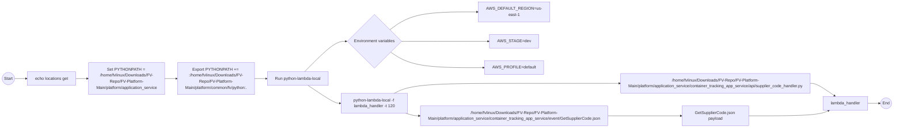

# Diagram: application_service/container_tracking_app_service/event/GetSupplierCode.sh

> Auto-generated by Obscura crawlers

## Mermaid

### SVG

<svg id="container" width="3613.40625" xmlns="http://www.w3.org/2000/svg" class="flowchart" height="504" viewBox="0 0 3613.40625 504" role="graphics-document document" aria-roledescription="flowchart-v2"><g><marker id="container_flowchart-v2-pointEnd" class="marker flowchart-v2" viewBox="0 0 10 10" refX="5" refY="5" markerUnits="userSpaceOnUse" markerWidth="8" markerHeight="8" orient="auto"><path d="M 0 0 L 10 5 L 0 10 z" class="arrowMarkerPath" style="stroke-width: 1; stroke-dasharray: 1, 0;"></path></marker><marker id="container_flowchart-v2-pointStart" class="marker flowchart-v2" viewBox="0 0 10 10" refX="4.5" refY="5" markerUnits="userSpaceOnUse" markerWidth="8" markerHeight="8" orient="auto"><path d="M 0 5 L 10 10 L 10 0 z" class="arrowMarkerPath" style="stroke-width: 1; stroke-dasharray: 1, 0;"></path></marker><marker id="container_flowchart-v2-circleEnd" class="marker flowchart-v2" viewBox="0 0 10 10" refX="11" refY="5" markerUnits="userSpaceOnUse" markerWidth="11" markerHeight="11" orient="auto"><circle cx="5" cy="5" r="5" class="arrowMarkerPath" style="stroke-width: 1; stroke-dasharray: 1, 0;"></circle></marker><marker id="container_flowchart-v2-circleStart" class="marker flowchart-v2" viewBox="0 0 10 10" refX="-1" refY="5" markerUnits="userSpaceOnUse" markerWidth="11" markerHeight="11" orient="auto"><circle cx="5" cy="5" r="5" class="arrowMarkerPath" style="stroke-width: 1; stroke-dasharray: 1, 0;"></circle></marker><marker id="container_flowchart-v2-crossEnd" class="marker cross flowchart-v2" viewBox="0 0 11 11" refX="12" refY="5.2" markerUnits="userSpaceOnUse" markerWidth="11" markerHeight="11" orient="auto"><path d="M 1,1 l 9,9 M 10,1 l -9,9" class="arrowMarkerPath" style="stroke-width: 2; stroke-dasharray: 1, 0;"></path></marker><marker id="container_flowchart-v2-crossStart" class="marker cross flowchart-v2" viewBox="0 0 11 11" refX="-1" refY="5.2" markerUnits="userSpaceOnUse" markerWidth="11" markerHeight="11" orient="auto"><path d="M 1,1 l 9,9 M 10,1 l -9,9" class="arrowMarkerPath" style="stroke-width: 2; stroke-dasharray: 1, 0;"></path></marker><g class="root"><g class="clusters"></g><g class="edgePaths"><path d="M58.047,310L62.214,310C66.38,310,74.714,310,82.38,310C90.047,310,97.047,310,100.547,310L104.047,310" id="L_Start_Echo_0" class="edge-thickness-normal edge-pattern-solid edge-thickness-normal edge-pattern-solid flowchart-link" style=";" data-edge="true" data-et="edge" data-id="L_Start_Echo_0" data-points="W3sieCI6NTguMDQ2ODc1LCJ5IjozMTB9LHsieCI6ODMuMDQ2ODc1LCJ5IjozMTB9LHsieCI6MTA4LjA0Njg3NSwieSI6MzEwfV0=" marker-end="url(#container_flowchart-v2-pointEnd)"></path><path d="M300.813,310L304.979,310C309.146,310,317.479,310,325.146,310C332.813,310,339.813,310,343.313,310L346.813,310" id="L_Echo_SetPY_0" class="edge-thickness-normal edge-pattern-solid edge-thickness-normal edge-pattern-solid flowchart-link" style=";" data-edge="true" data-et="edge" data-id="L_Echo_SetPY_0" data-points="W3sieCI6MzAwLjgxMjUsInkiOjMxMH0seyJ4IjozMjUuODEyNSwieSI6MzEwfSx7IngiOjM1MC44MTI1LCJ5IjozMTB9XQ==" marker-end="url(#container_flowchart-v2-pointEnd)"></path><path d="M665.469,310L669.635,310C673.802,310,682.135,310,689.802,310C697.469,310,704.469,310,707.969,310L711.469,310" id="L_SetPY_ExportPY_0" class="edge-thickness-normal edge-pattern-solid edge-thickness-normal edge-pattern-solid flowchart-link" style=";" data-edge="true" data-et="edge" data-id="L_SetPY_ExportPY_0" data-points="W3sieCI6NjY1LjQ2ODc1LCJ5IjozMTB9LHsieCI6NjkwLjQ2ODc1LCJ5IjozMTB9LHsieCI6NzE1LjQ2ODc1LCJ5IjozMTB9XQ==" marker-end="url(#container_flowchart-v2-pointEnd)"></path><path d="M1039.484,310L1043.651,310C1047.818,310,1056.151,310,1063.818,310C1071.484,310,1078.484,310,1081.984,310L1085.484,310" id="L_ExportPY_Run_0" class="edge-thickness-normal edge-pattern-solid edge-thickness-normal edge-pattern-solid flowchart-link" style=";" data-edge="true" data-et="edge" data-id="L_ExportPY_Run_0" data-points="W3sieCI6MTAzOS40ODQzNzUsInkiOjMxMH0seyJ4IjoxMDY0LjQ4NDM3NSwieSI6MzEwfSx7IngiOjEwODkuNDg0Mzc1LCJ5IjozMTB9XQ==" marker-end="url(#container_flowchart-v2-pointEnd)"></path><path d="M1239.677,283L1259.814,263C1279.952,243,1320.226,203,1347.504,183C1374.781,163,1389.063,163,1396.203,163L1403.344,163" id="L_Run_Env_0" class="edge-thickness-normal edge-pattern-solid edge-thickness-normal edge-pattern-solid flowchart-link" style=";" data-edge="true" data-et="edge" data-id="L_Run_Env_0" data-points="W3sieCI6MTIzOS42NzcyOTU5MTgzNjcyLCJ5IjoyODN9LHsieCI6MTM2MC41LCJ5IjoxNjN9LHsieCI6MTQwNy4zNDM3NSwieSI6MTYzfV0=" marker-end="url(#container_flowchart-v2-pointEnd)"></path><path d="M1577.361,116.704L1592.884,105.087C1608.407,93.47,1639.454,70.235,1700.396,58.617C1761.339,47,1852.177,47,1897.596,47L1943.016,47" id="L_Env_REGION_0" class="edge-thickness-normal edge-pattern-solid edge-thickness-normal edge-pattern-solid flowchart-link" style=";" data-edge="true" data-et="edge" data-id="L_Env_REGION_0" data-points="W3sieCI6MTU3Ny4zNjA1ODU3OTMzNTgsInkiOjExNi43MDQzMzU3OTMzNTc5M30seyJ4IjoxNjcwLjUsInkiOjQ3fSx7IngiOjE5NDcuMDE1NjI1LCJ5Ijo0N31d" marker-end="url(#container_flowchart-v2-pointEnd)"></path><path d="M1623.656,163L1631.464,163C1639.271,163,1654.885,163,1715.105,163C1775.326,163,1880.151,163,1932.564,163L1984.977,163" id="L_Env_STAGE_0" class="edge-thickness-normal edge-pattern-solid edge-thickness-normal edge-pattern-solid flowchart-link" style=";" data-edge="true" data-et="edge" data-id="L_Env_STAGE_0" data-points="W3sieCI6MTYyMy42NTYyNSwieSI6MTYzfSx7IngiOjE2NzAuNSwieSI6MTYzfSx7IngiOjE5ODguOTc2NTYyNSwieSI6MTYzfV0=" marker-end="url(#container_flowchart-v2-pointEnd)"></path><path d="M1580.227,206.43L1595.272,216.525C1610.318,226.62,1640.409,246.81,1704.409,256.905C1768.409,267,1866.318,267,1915.272,267L1964.227,267" id="L_Env_PROFILE_0" class="edge-thickness-normal edge-pattern-solid edge-thickness-normal edge-pattern-solid flowchart-link" style=";" data-edge="true" data-et="edge" data-id="L_Env_PROFILE_0" data-points="W3sieCI6MTU4MC4yMjY3MTMzMjA0NjM0LCJ5IjoyMDYuNDI5NTM2Njc5NTM2Njh9LHsieCI6MTY3MC41LCJ5IjoyNjd9LHsieCI6MTk2OC4yMjY1NjI1LCJ5IjoyNjd9XQ==" marker-end="url(#container_flowchart-v2-pointEnd)"></path><path d="M1253.031,337L1270.942,348.93C1288.854,360.859,1324.677,384.719,1346.088,396.648C1367.5,408.578,1374.5,408.578,1378,408.578L1381.5,408.578" id="L_Run_Cmd_0" class="edge-thickness-normal edge-pattern-solid edge-thickness-normal edge-pattern-solid flowchart-link" style=";" data-edge="true" data-et="edge" data-id="L_Run_Cmd_0" data-points="W3sieCI6MTI1My4wMzA3MDM5MDUxMzU2LCJ5IjozMzd9LHsieCI6MTM2MC41LCJ5Ijo0MDguNTc4MTI1fSx7IngiOjEzODUuNSwieSI6NDA4LjU3ODEyNX1d" marker-end="url(#container_flowchart-v2-pointEnd)"></path><path d="M1591.463,369.578L1604.636,362.815C1617.809,356.052,1644.154,342.526,1725.08,335.763C1806.005,329,1941.51,329,2077.016,329C2212.521,329,2348.026,329,2419.279,329C2490.531,329,2497.531,329,2501.031,329L2504.531,329" id="L_Cmd_HandlerFile_0" class="edge-thickness-normal edge-pattern-solid edge-thickness-normal edge-pattern-solid flowchart-link" style=";" data-edge="true" data-et="edge" data-id="L_Cmd_HandlerFile_0" data-points="W3sieCI6MTU5MS40NjMwODY1ODk0MzY0LCJ5IjozNjkuNTc4MTI1fSx7IngiOjE2NzAuNSwieSI6MzI5fSx7IngiOjIwNzcuMDE1NjI1LCJ5IjozMjl9LHsieCI6MjQ4My41MzEyNSwieSI6MzI5fSx7IngiOjI1MDguNTMxMjUsInkiOjMyOX1d" marker-end="url(#container_flowchart-v2-pointEnd)"></path><path d="M1640.34,447.578L1645.367,449.148C1650.394,450.719,1660.447,453.859,1668.973,455.43C1677.5,457,1684.5,457,1688,457L1691.5,457" id="L_Cmd_EventFile_0" class="edge-thickness-normal edge-pattern-solid edge-thickness-normal edge-pattern-solid flowchart-link" style=";" data-edge="true" data-et="edge" data-id="L_Cmd_EventFile_0" data-points="W3sieCI6MTY0MC4zNDAyNzEwNTUxNzksInkiOjQ0Ny41NzgxMjV9LHsieCI6MTY3MC41LCJ5Ijo0NTd9LHsieCI6MTY5NS41LCJ5Ijo0NTd9XQ==" marker-end="url(#container_flowchart-v2-pointEnd)"></path><path d="M3283.391,329L3287.557,329C3291.724,329,3300.057,329,3316.321,337.383C3332.584,345.767,3356.778,362.533,3368.874,370.916L3380.971,379.3" id="L_HandlerFile_HandlerFunc_0" class="edge-thickness-normal edge-pattern-solid edge-thickness-normal edge-pattern-solid flowchart-link" style=";" data-edge="true" data-et="edge" data-id="L_HandlerFile_HandlerFunc_0" data-points="W3sieCI6MzI4My4zOTA2MjUsInkiOjMyOX0seyJ4IjozMzA4LjM5MDYyNSwieSI6MzI5fSx7IngiOjMzODQuMjU4ODA0OTc3NDIsInkiOjM4MS41NzgxMjV9XQ==" marker-end="url(#container_flowchart-v2-pointEnd)"></path><path d="M2458.531,457L2462.698,457C2466.865,457,2475.198,457,2525.77,457C2576.341,457,2669.151,457,2715.556,457L2761.961,457" id="L_EventFile_EventData_0" class="edge-thickness-normal edge-pattern-solid edge-thickness-normal edge-pattern-solid flowchart-link" style=";" data-edge="true" data-et="edge" data-id="L_EventFile_EventData_0" data-points="W3sieCI6MjQ1OC41MzEyNSwieSI6NDU3fSx7IngiOjI0ODMuNTMxMjUsInkiOjQ1N30seyJ4IjoyNzY1Ljk2MDkzNzUsInkiOjQ1N31d" marker-end="url(#container_flowchart-v2-pointEnd)"></path><path d="M3025.961,457L3073.033,457C3120.104,457,3214.247,457,3269.171,453.689C3324.095,450.377,3339.8,443.755,3347.653,440.444L3355.505,437.132" id="L_EventData_HandlerFunc_0" class="edge-thickness-normal edge-pattern-solid edge-thickness-normal edge-pattern-solid flowchart-link" style=";" data-edge="true" data-et="edge" data-id="L_EventData_HandlerFunc_0" data-points="W3sieCI6MzAyNS45NjA5Mzc1LCJ5Ijo0NTd9LHsieCI6MzMwOC4zOTA2MjUsInkiOjQ1N30seyJ4IjozMzU5LjE5MDY3NjQyNzg4LCJ5Ijo0MzUuNTc4MTI1fV0=" marker-end="url(#container_flowchart-v2-pointEnd)"></path><path d="M3513.047,408.578L3517.214,408.578C3521.38,408.578,3529.714,408.578,3537.38,408.578C3545.047,408.578,3552.047,408.578,3555.547,408.578L3559.047,408.578" id="L_HandlerFunc_End_0" class="edge-thickness-normal edge-pattern-solid edge-thickness-normal edge-pattern-solid flowchart-link" style=";" data-edge="true" data-et="edge" data-id="L_HandlerFunc_End_0" data-points="W3sieCI6MzUxMy4wNDY4NzUsInkiOjQwOC41NzgxMjV9LHsieCI6MzUzOC4wNDY4NzUsInkiOjQwOC41NzgxMjV9LHsieCI6MzU2My4wNDY4NzUsInkiOjQwOC41NzgxMjV9XQ==" marker-end="url(#container_flowchart-v2-pointEnd)"></path></g><g class="edgeLabels"><g class="edgeLabel"><g class="label" data-id="L_Start_Echo_0" transform="translate(0, 0)"><foreignObject width="0" height="0">

</foreignObject></g></g><g class="edgeLabel"><g class="label" data-id="L_Echo_SetPY_0" transform="translate(0, 0)"><foreignObject width="0" height="0">

</foreignObject></g></g><g class="edgeLabel"><g class="label" data-id="L_SetPY_ExportPY_0" transform="translate(0, 0)"><foreignObject width="0" height="0">

</foreignObject></g></g><g class="edgeLabel"><g class="label" data-id="L_ExportPY_Run_0" transform="translate(0, 0)"><foreignObject width="0" height="0">

</foreignObject></g></g><g class="edgeLabel"><g class="label" data-id="L_Run_Env_0" transform="translate(0, 0)"><foreignObject width="0" height="0">

</foreignObject></g></g><g class="edgeLabel"><g class="label" data-id="L_Env_REGION_0" transform="translate(0, 0)"><foreignObject width="0" height="0">

</foreignObject></g></g><g class="edgeLabel"><g class="label" data-id="L_Env_STAGE_0" transform="translate(0, 0)"><foreignObject width="0" height="0">

</foreignObject></g></g><g class="edgeLabel"><g class="label" data-id="L_Env_PROFILE_0" transform="translate(0, 0)"><foreignObject width="0" height="0">

</foreignObject></g></g><g class="edgeLabel"><g class="label" data-id="L_Run_Cmd_0" transform="translate(0, 0)"><foreignObject width="0" height="0">

</foreignObject></g></g><g class="edgeLabel"><g class="label" data-id="L_Cmd_HandlerFile_0" transform="translate(0, 0)"><foreignObject width="0" height="0">

</foreignObject></g></g><g class="edgeLabel"><g class="label" data-id="L_Cmd_EventFile_0" transform="translate(0, 0)"><foreignObject width="0" height="0">

</foreignObject></g></g><g class="edgeLabel"><g class="label" data-id="L_HandlerFile_HandlerFunc_0" transform="translate(0, 0)"><foreignObject width="0" height="0">

</foreignObject></g></g><g class="edgeLabel"><g class="label" data-id="L_EventFile_EventData_0" transform="translate(0, 0)"><foreignObject width="0" height="0">

</foreignObject></g></g><g class="edgeLabel"><g class="label" data-id="L_EventData_HandlerFunc_0" transform="translate(0, 0)"><foreignObject width="0" height="0">

</foreignObject></g></g><g class="edgeLabel"><g class="label" data-id="L_HandlerFunc_End_0" transform="translate(0, 0)"><foreignObject width="0" height="0">

</foreignObject></g></g></g><g class="nodes"><g class="node default" id="flowchart-Start-0" transform="translate(33.0234375, 310)"><circle class="basic label-container" style="" r="25.0234375" cx="0" cy="0"></circle><g class="label" style="" transform="translate(-17.5234375, -12)"><rect></rect><foreignObject width="35.046875" height="24">

Start

</foreignObject></g></g><g class="node default" id="flowchart-Echo-1" transform="translate(204.4296875, 310)"><rect class="basic label-container" style="" x="-96.3828125" y="-27" width="192.765625" height="54"></rect><g class="label" style="" transform="translate(-66.3828125, -12)"><rect></rect><foreignObject width="132.765625" height="24">

echo locations get

</foreignObject></g></g><g class="node default" id="flowchart-SetPY-3" transform="translate(508.140625, 310)"><rect class="basic label-container" style="" x="-157.328125" y="-63" width="314.65625" height="126"></rect><g class="label" style="" transform="translate(-127.328125, -48)"><rect></rect><foreignObject width="254.65625" height="96">

Set PYTHONPATH = /home/fvlinux/Downloads/FV-Repo/FV-Platform-Main/platform/application_service

</foreignObject></g></g><g class="node default" id="flowchart-ExportPY-5" transform="translate(877.4765625, 310)"><rect class="basic label-container" style="" x="-162.0078125" y="-63" width="324.015625" height="126"></rect><g class="label" style="" transform="translate(-132.0078125, -48)"><rect></rect><foreignObject width="264.015625" height="96">

Export PYTHONPATH += :/home/fvlinux/Downloads/FV-Repo/FV-Platform-Main/platform/common/fv/python:.

</foreignObject></g></g><g class="node default" id="flowchart-Run-7" transform="translate(1212.4921875, 310)"><rect class="basic label-container" style="" x="-123.0078125" y="-27" width="246.015625" height="54"></rect><g class="label" style="" transform="translate(-93.0078125, -12)"><rect></rect><foreignObject width="186.015625" height="24">

Run python-lambda-local

</foreignObject></g></g><g class="node default" id="flowchart-Env-9" transform="translate(1515.5, 163)"><polygon points="108.15625,0 216.3125,-108.15625 108.15625,-216.3125 0,-108.15625" class="label-container" transform="translate(-107.65625, 108.15625)"></polygon><g class="label" style="" transform="translate(-81.15625, -12)"><rect></rect><foreignObject width="162.3125" height="24">

Environment variables

</foreignObject></g></g><g class="node default" id="flowchart-REGION-11" transform="translate(2077.015625, 47)"><rect class="basic label-container" style="" x="-130" y="-39" width="260" height="78"></rect><g class="label" style="" transform="translate(-100, -24)"><rect></rect><foreignObject width="200" height="48">

AWS_DEFAULT_REGION=us-east-1

</foreignObject></g></g><g class="node default" id="flowchart-STAGE-13" transform="translate(2077.015625, 163)"><rect class="basic label-container" style="" x="-88.0390625" y="-27" width="176.078125" height="54"></rect><g class="label" style="" transform="translate(-58.0390625, -12)"><rect></rect><foreignObject width="116.078125" height="24">

AWS_STAGE=dev

</foreignObject></g></g><g class="node default" id="flowchart-PROFILE-15" transform="translate(2077.015625, 267)"><rect class="basic label-container" style="" x="-108.7890625" y="-27" width="217.578125" height="54"></rect><g class="label" style="" transform="translate(-78.7890625, -12)"><rect></rect><foreignObject width="157.578125" height="24">

AWS_PROFILE=default

</foreignObject></g></g><g class="node default" id="flowchart-Cmd-17" transform="translate(1515.5, 408.578125)"><rect class="basic label-container" style="" x="-130" y="-39" width="260" height="78"></rect><g class="label" style="" transform="translate(-100, -24)"><rect></rect><foreignObject width="200" height="48">

python-lambda-local -f lambda_handler -t 120

</foreignObject></g></g><g class="node default" id="flowchart-HandlerFile-19" transform="translate(2895.9609375, 329)"><rect class="basic label-container" style="" x="-387.4296875" y="-39" width="774.859375" height="78"></rect><g class="label" style="" transform="translate(-357.4296875, -24)"><rect></rect><foreignObject width="714.859375" height="48">

/home/fvlinux/Downloads/FV-Repo/FV-Platform-Main/platform/application_service/container_tracking_app_service/api/supplier_code_handler.py

</foreignObject></g></g><g class="node default" id="flowchart-EventFile-21" transform="translate(2077.015625, 457)"><rect class="basic label-container" style="" x="-381.515625" y="-39" width="763.03125" height="78"></rect><g class="label" style="" transform="translate(-351.515625, -24)"><rect></rect><foreignObject width="703.03125" height="48">

/home/fvlinux/Downloads/FV-Repo/FV-Platform-Main/platform/application_service/container_tracking_app_service/event/GetSupplierCode.json

</foreignObject></g></g><g class="node default" id="flowchart-HandlerFunc-23" transform="translate(3423.21875, 408.578125)"><rect class="basic label-container" style="" x="-89.828125" y="-27" width="179.65625" height="54"></rect><g class="label" style="" transform="translate(-59.828125, -12)"><rect></rect><foreignObject width="119.65625" height="24">

lambda_handler

</foreignObject></g></g><g class="node default" id="flowchart-EventData-25" transform="translate(2895.9609375, 457)"><rect class="basic label-container" style="" x="-130" y="-39" width="260" height="78"></rect><g class="label" style="" transform="translate(-100, -24)"><rect></rect><foreignObject width="200" height="48">

GetSupplierCode.json payload

</foreignObject></g></g><g class="node default" id="flowchart-End-29" transform="translate(3584.2265625, 408.578125)"><circle class="basic label-container" style="" r="21.1796875" cx="0" cy="0"></circle><g class="label" style="" transform="translate(-13.6796875, -12)"><rect></rect><foreignObject width="27.359375" height="24">

End

</foreignObject></g></g></g></g></g></svg>
