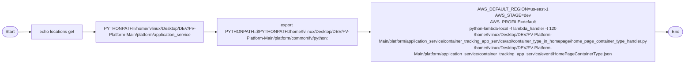

# Diagram: application_service/container_tracking_app_service/event/HomePageContainerType.sh

> Auto-generated by Obscura crawlers

## Mermaid

### SVG

<svg id="container" width="2577.3662109375" xmlns="http://www.w3.org/2000/svg" class="flowchart" height="238" viewBox="0.0000019073486328125 0 2577.3662109375 238" role="graphics-document document" aria-roledescription="flowchart-v2"><g><marker id="container_flowchart-v2-pointEnd" class="marker flowchart-v2" viewBox="0 0 10 10" refX="5" refY="5" markerUnits="userSpaceOnUse" markerWidth="8" markerHeight="8" orient="auto"><path d="M 0 0 L 10 5 L 0 10 z" class="arrowMarkerPath" style="stroke-width: 1; stroke-dasharray: 1, 0;"></path></marker><marker id="container_flowchart-v2-pointStart" class="marker flowchart-v2" viewBox="0 0 10 10" refX="4.5" refY="5" markerUnits="userSpaceOnUse" markerWidth="8" markerHeight="8" orient="auto"><path d="M 0 5 L 10 10 L 10 0 z" class="arrowMarkerPath" style="stroke-width: 1; stroke-dasharray: 1, 0;"></path></marker><marker id="container_flowchart-v2-circleEnd" class="marker flowchart-v2" viewBox="0 0 10 10" refX="11" refY="5" markerUnits="userSpaceOnUse" markerWidth="11" markerHeight="11" orient="auto"><circle cx="5" cy="5" r="5" class="arrowMarkerPath" style="stroke-width: 1; stroke-dasharray: 1, 0;"></circle></marker><marker id="container_flowchart-v2-circleStart" class="marker flowchart-v2" viewBox="0 0 10 10" refX="-1" refY="5" markerUnits="userSpaceOnUse" markerWidth="11" markerHeight="11" orient="auto"><circle cx="5" cy="5" r="5" class="arrowMarkerPath" style="stroke-width: 1; stroke-dasharray: 1, 0;"></circle></marker><marker id="container_flowchart-v2-crossEnd" class="marker cross flowchart-v2" viewBox="0 0 11 11" refX="12" refY="5.2" markerUnits="userSpaceOnUse" markerWidth="11" markerHeight="11" orient="auto"><path d="M 1,1 l 9,9 M 10,1 l -9,9" class="arrowMarkerPath" style="stroke-width: 2; stroke-dasharray: 1, 0;"></path></marker><marker id="container_flowchart-v2-crossStart" class="marker cross flowchart-v2" viewBox="0 0 11 11" refX="-1" refY="5.2" markerUnits="userSpaceOnUse" markerWidth="11" markerHeight="11" orient="auto"><path d="M 1,1 l 9,9 M 10,1 l -9,9" class="arrowMarkerPath" style="stroke-width: 2; stroke-dasharray: 1, 0;"></path></marker><g class="root"><g class="clusters"></g><g class="edgePaths"><path d="M68.277,119.5L72.36,119.417C76.444,119.333,84.61,119.167,92.194,119.083C99.777,119,106.777,119,110.277,119L113.777,119" id="L_Start_Echo_0" class="edge-thickness-normal edge-pattern-solid edge-thickness-normal edge-pattern-solid flowchart-link" style=";" data-edge="true" data-et="edge" data-id="L_Start_Echo_0" data-points="W3sieCI6NjguMjc2ODM3NDMxODI2NTYsInkiOjExOS41MDAwMDAwMDAwMDAwMX0seyJ4Ijo5Mi43NzY4MzYzOTUyNjM2NywieSI6MTE5fSx7IngiOjExNy43NzY4MzYzOTUyNjM2NywieSI6MTE5fV0=" marker-end="url(#container_flowchart-v2-pointEnd)"></path><path d="M310.542,119L314.709,119C318.876,119,327.209,119,334.876,119C342.542,119,349.542,119,353.042,119L356.542,119" id="L_Echo_SetPY_0" class="edge-thickness-normal edge-pattern-solid edge-thickness-normal edge-pattern-solid flowchart-link" style=";" data-edge="true" data-et="edge" data-id="L_Echo_SetPY_0" data-points="W3sieCI6MzEwLjU0MjQ2MTM5NTI2MzcsInkiOjExOX0seyJ4IjozMzUuNTQyNDYxMzk1MjYzNywieSI6MTE5fSx7IngiOjM2MC41NDI0NjEzOTUyNjM3LCJ5IjoxMTl9XQ==" marker-end="url(#container_flowchart-v2-pointEnd)"></path><path d="M763.371,119L767.537,119C771.704,119,780.037,119,787.704,119C795.371,119,802.371,119,805.871,119L809.371,119" id="L_SetPY_ExportPY_0" class="edge-thickness-normal edge-pattern-solid edge-thickness-normal edge-pattern-solid flowchart-link" style=";" data-edge="true" data-et="edge" data-id="L_SetPY_ExportPY_0" data-points="W3sieCI6NzYzLjM3MDU4NjM5NTI2MzcsInkiOjExOX0seyJ4Ijo3ODguMzcwNTg2Mzk1MjYzNywieSI6MTE5fSx7IngiOjgxMy4zNzA1ODYzOTUyNjM3LCJ5IjoxMTl9XQ==" marker-end="url(#container_flowchart-v2-pointEnd)"></path><path d="M1323.027,119L1327.194,119C1331.36,119,1339.694,119,1347.36,119C1355.027,119,1362.027,119,1365.527,119L1369.027,119" id="L_ExportPY_Run_0" class="edge-thickness-normal edge-pattern-solid edge-thickness-normal edge-pattern-solid flowchart-link" style=";" data-edge="true" data-et="edge" data-id="L_ExportPY_Run_0" data-points="W3sieCI6MTMyMy4wMjY4MzYzOTUyNjM3LCJ5IjoxMTl9LHsieCI6MTM0OC4wMjY4MzYzOTUyNjM3LCJ5IjoxMTl9LHsieCI6MTM3My4wMjY4MzYzOTUyNjM3LCJ5IjoxMTl9XQ==" marker-end="url(#container_flowchart-v2-pointEnd)"></path><path d="M2467.277,119L2471.444,119C2475.61,119,2483.944,119,2491.694,119.07C2499.444,119.141,2506.611,119.281,2510.194,119.351L2513.778,119.422" id="L_Run_End_0" class="edge-thickness-normal edge-pattern-solid edge-thickness-normal edge-pattern-solid flowchart-link" style=";" data-edge="true" data-et="edge" data-id="L_Run_End_0" data-points="W3sieCI6MjQ2Ny4yNzY4MzYzOTUyNjM3LCJ5IjoxMTl9LHsieCI6MjQ5Mi4yNzY4MzYzOTUyNjM3LCJ5IjoxMTl9LHsieCI6MjUxNy43NzY4MzYzOTUyMzczLCJ5IjoxMTkuNX1d" marker-end="url(#container_flowchart-v2-pointEnd)"></path></g><g class="edgeLabels"><g class="edgeLabel"><g class="label" data-id="L_Start_Echo_0" transform="translate(0, 0)"><foreignObject width="0" height="0">

</foreignObject></g></g><g class="edgeLabel"><g class="label" data-id="L_Echo_SetPY_0" transform="translate(0, 0)"><foreignObject width="0" height="0">

</foreignObject></g></g><g class="edgeLabel"><g class="label" data-id="L_SetPY_ExportPY_0" transform="translate(0, 0)"><foreignObject width="0" height="0">

</foreignObject></g></g><g class="edgeLabel"><g class="label" data-id="L_ExportPY_Run_0" transform="translate(0, 0)"><foreignObject width="0" height="0">

</foreignObject></g></g><g class="edgeLabel"><g class="label" data-id="L_Run_End_0" transform="translate(0, 0)"><foreignObject width="0" height="0">

</foreignObject></g></g></g><g class="nodes"><g class="node default" id="flowchart-Start-0" transform="translate(37.888418197631836, 119)"><g class="basic label-container outer-path"><path d="M-10.3984375 -19.5 C-3.2344740598608688 -19.5, 3.9294893802782624 -19.5, 10.3984375 -19.5 C10.3984375 -19.5, 10.398437499999998 -19.5, 10.398437499999998 -19.5 C10.89273548302092 -19.484148825777176, 11.38703346604184 -19.468297651554355, 11.6478067896239 -19.45993515863156 C12.113867216582932 -19.414974869762492, 12.579927643541966 -19.37001458089342, 12.892042152847864 -19.3399052695533 C13.315919132513281 -19.271376126696065, 13.739796112178698 -19.202846983838835, 14.126030759676757 -19.140403561325776 C14.433796808681581 -19.070157969001585, 14.741562857686407 -18.999912376677393, 15.34470188623539 -18.862249829261074 C15.610553566405212 -18.783346446070617, 15.876405246575036 -18.70444306288016, 16.543047751460602 -18.50658706670804 C16.99752963304867 -18.339333533099172, 17.452011514636737 -18.1720799994903, 17.716144095147794 -18.074876768247425 C18.048889335979094 -17.927580320668277, 18.3816345768104 -17.780283873089125, 18.85917041279238 -17.568892924097174 C19.141681131199636 -17.42150726326086, 19.42419184960689 -17.27412160242455, 19.967429764076783 -16.990714730406097 C20.269353380444798 -16.807686859863693, 20.571276996812813 -16.624658989321286, 21.036368073605697 -16.342718045390892 C21.373924910360024 -16.107253008671023, 21.711481747114355 -15.871787971951152, 22.061592844578712 -15.627565626425154 C22.333787269367505 -15.410497816053939, 22.6059816941563 -15.193430005682723, 23.03889120850187 -14.848196188198123 C23.400587691403555 -14.519713012391334, 23.76228417430524 -14.191229836584544, 23.964247236767985 -14.007812326905688 C24.17602642171809 -13.78913293105026, 24.387805606668195 -13.570453535194831, 24.833858442968648 -13.10986736009568 C25.048862989410512 -12.857310785739799, 25.263867535852377 -12.604754211383916, 25.644151408126582 -12.158051136245305 C25.914812623738534 -11.795389765069286, 26.185473839350486 -11.43272839389327, 26.391796464640635 -11.156274872382312 C26.65134425716029 -10.757539764731144, 26.910892049679944 -10.358804657079977, 27.073721378604247 -10.108655082055241 C27.318394718058155 -9.674212791992606, 27.563068057512062 -9.239770501929971, 27.6871239742735 -9.019496659696287 C27.84318986681667 -8.69542249455524, 27.999255759359837 -8.371348329414191, 28.22948364880834 -7.893275190886684 C28.355011385647625 -7.583219253979965, 28.480539122486906 -7.273163317073244, 28.698571729970325 -6.734618561215508 C28.81607682309185 -6.380711942627579, 28.933581916213377 -6.026805324039651, 29.09246063421488 -5.548287939305138 C29.15604392231165 -5.305817304620779, 29.21962721040842 -5.06334666993642, 29.40953178754556 -4.339158212148133 C29.50458892104844 -3.851059921943122, 29.59964605455132 -3.3629616317381115, 29.648482276581777 -3.1121979531509023 C29.703532159665492 -2.685241930782605, 29.758582042749207 -2.2582859084143085, 29.808330202509367 -1.872449005199798 C29.826183975904463 -1.5943620732646469, 29.844037749299563 -1.3162751413294957, 29.888418715913414 -0.6250057626472757 C29.888418715913414 -0.2874292642949372, 29.888418715913414 0.05014723405740129, 29.888418715913414 0.625005762647271 C29.862187496927255 1.033578171815537, 29.8359562779411 1.442150580983803, 29.808330202509367 1.8724490051997846 C29.764375964309878 2.213349396928953, 29.720421726110388 2.5542497886581215, 29.648482276581777 3.1121979531508885 C29.593154559874982 3.39629408492321, 29.53782684316819 3.680390216695532, 29.40953178754556 4.339158212148129 C29.301569706586495 4.750864417906924, 29.193607625627426 5.16257062366572, 29.092460634214884 5.548287939305125 C28.973790983501303 5.905702019813272, 28.85512133278772 6.263116100321419, 28.69857172997033 6.734618561215495 C28.531393284903764 7.147552552705261, 28.364214839837203 7.560486544195029, 28.229483648808344 7.893275190886679 C28.072909640593476 8.218404469091947, 27.91633563237861 8.543533747297214, 27.687123974273504 9.019496659696284 C27.492159492770938 9.36567583889862, 27.297195011268375 9.711855018100957, 27.07372137860425 10.108655082055236 C26.92700736796674 10.334047200622576, 26.780293357329235 10.559439319189917, 26.39179646464064 11.156274872382301 C26.17301416284412 11.449423225311921, 25.954231861047592 11.742571578241542, 25.644151408126582 12.158051136245302 C25.477930707639544 12.353303429263176, 25.311710007152502 12.54855572228105, 24.83385844296866 13.10986736009567 C24.495729425785093 13.459013331246295, 24.157600408601528 13.80815930239692, 23.96424723676799 14.007812326905684 C23.650967361512688 14.29232482068127, 23.337687486257387 14.576837314456855, 23.038891208501887 14.848196188198111 C22.751380286630614 15.0774784974035, 22.463869364759336 15.30676080660889, 22.061592844578715 15.627565626425152 C21.731088203817208 15.858111356505075, 21.4005835630557 16.088657086585, 21.036368073605708 16.34271804539089 C20.808155933391365 16.481061585912222, 20.579943793177023 16.619405126433552, 19.967429764076787 16.990714730406093 C19.63096378757595 17.166248814829835, 19.294497811075114 17.341782899253577, 18.859170412792388 17.56889292409717 C18.55317674489561 17.704347243895423, 18.24718307699883 17.839801563693673, 17.716144095147804 18.07487676824742 C17.333148582707125 18.215822657197297, 16.95015307026645 18.356768546147173, 16.543047751460616 18.506587066708033 C16.24106914462428 18.596212732099005, 15.939090537787948 18.685838397489977, 15.344701886235413 18.86224982926107 C15.062935883527302 18.926561080684195, 14.781169880819194 18.990872332107315, 14.126030759676766 19.140403561325773 C13.81588934577791 19.190544819942353, 13.505747931879055 19.240686078558934, 12.892042152847878 19.3399052695533 C12.463498178223668 19.381246391385762, 12.034954203599456 19.422587513218225, 11.6478067896239 19.45993515863156 C11.215561499102508 19.47379642378416, 10.783316208581114 19.487657688936764, 10.398437500000004 19.5 C10.398437500000002 19.5, 10.398437500000002 19.5, 10.3984375 19.5 C5.374034280320143 19.5, 0.34963106064028615 19.5, -10.398437499999996 19.5 C-10.717751819134271 19.48976021129298, -11.037066138268544 19.479520422585964, -11.647806789623893 19.45993515863156 C-12.034853325842017 19.42259724477416, -12.42189986206014 19.38525933091676, -12.892042152847871 19.3399052695533 C-13.259949721445233 19.280424827028284, -13.627857290042595 19.22094438450327, -14.126030759676759 19.140403561325773 C-14.57063268460164 19.03892607326037, -15.01523460952652 18.937448585194968, -15.344701886235388 18.862249829261074 C-15.62163560761155 18.780057354411397, -15.898569328987714 18.69786487956172, -16.54304775146059 18.506587066708043 C-16.861053110464635 18.38955815498524, -17.179058469468682 18.27252924326244, -17.716144095147797 18.074876768247425 C-18.015451043988175 17.94238246062097, -18.314757992828557 17.80988815299451, -18.85917041279238 17.568892924097174 C-19.257665625439387 17.360998226907597, -19.656160838086393 17.15310352971802, -19.96742976407678 16.990714730406097 C-20.3050192899917 16.786065975900208, -20.642608815906623 16.581417221394318, -21.036368073605686 16.3427180453909 C-21.32974685685289 16.138069706360486, -21.623125640100096 15.933421367330075, -22.061592844578712 15.627565626425156 C-22.374947720324855 15.377673451741053, -22.688302596071 15.12778127705695, -23.03889120850187 14.848196188198125 C-23.374280871164316 14.543604170492287, -23.709670533826767 14.239012152786449, -23.964247236767974 14.007812326905697 C-24.148739077405214 13.817309354385934, -24.333230918042453 13.62680638186617, -24.833858442968655 13.109867360095677 C-25.05907087353457 12.845320024202623, -25.284283304100484 12.580772688309567, -25.64415140812658 12.158051136245307 C-25.89254784928186 11.825222534478549, -26.140944290437144 11.49239393271179, -26.391796464640635 11.156274872382316 C-26.61633832404578 10.811318278404253, -26.84088018345093 10.466361684426188, -27.073721378604244 10.108655082055249 C-27.21788429514373 9.85267922566113, -27.362047211683215 9.596703369267015, -27.6871239742735 9.019496659696289 C-27.812684652696007 8.758767224383817, -27.938245331118512 8.498037789071345, -28.22948364880834 7.893275190886686 C-28.38917138879187 7.498843385774948, -28.548859128775398 7.104411580663211, -28.698571729970325 6.73461856121551 C-28.806140054404022 6.410639906706237, -28.913708378837715 6.086661252196964, -29.09246063421488 5.5482879393051325 C-29.193490594886875 5.163016912600878, -29.294520555558872 4.777745885896625, -29.409531787545557 4.339158212148136 C-29.473628806727692 4.010033565557685, -29.537725825909824 3.680908918967234, -29.648482276581777 3.112197953150904 C-29.68281534558735 2.8459174497749964, -29.717148414592923 2.5796369463990887, -29.808330202509364 1.872449005199809 C-29.834124075820224 1.470688607943393, -29.85991794913108 1.0689282106869769, -29.888418715913414 0.6250057626472781 C-29.888418715913414 0.23297287430068686, -29.888418715913414 -0.15906001404590442, -29.888418715913414 -0.6250057626472687 C-29.87108029834884 -0.8950656115342888, -29.853741880784263 -1.1651254604213088, -29.808330202509367 -1.8724490051997822 C-29.774761771232935 -2.1327991293432613, -29.741193339956503 -2.3931492534867402, -29.648482276581777 -3.112197953150895 C-29.597025181180324 -3.376419262576395, -29.54556808577887 -3.6406405720018946, -29.40953178754556 -4.339158212148126 C-29.28655255538385 -4.808131323917108, -29.16357332322214 -5.2771044356860894, -29.092460634214884 -5.548287939305123 C-28.94104886923999 -6.004316051220886, -28.789637104265097 -6.46034416313665, -28.698571729970332 -6.734618561215485 C-28.591982730625958 -6.997895450354203, -28.485393731281583 -7.261172339492921, -28.229483648808344 -7.893275190886676 C-28.1142519403571 -8.132556299049273, -27.999020231905853 -8.37183740721187, -27.687123974273504 -9.019496659696282 C-27.477333966611475 -9.392000061842062, -27.267543958949446 -9.76450346398784, -27.073721378604247 -10.108655082055243 C-26.84112827706245 -10.465980546016436, -26.608535175520647 -10.82330600997763, -26.39179646464064 -11.156274872382308 C-26.2021480348493 -11.410386490975323, -26.01249960505796 -11.664498109568337, -25.644151408126586 -12.158051136245302 C-25.456469652934643 -12.37851280528816, -25.2687878977427 -12.598974474331019, -24.833858442968662 -13.10986736009567 C-24.525701474904967 -13.428064729779031, -24.21754450684127 -13.746262099462394, -23.964247236767996 -14.007812326905677 C-23.653347550647478 -14.290163195885405, -23.342447864526957 -14.572514064865135, -23.038891208501887 -14.848196188198107 C-22.735545189180815 -15.090106566230071, -22.43219916985974 -15.332016944262037, -22.06159284457872 -15.627565626425149 C-21.65855199179038 -15.90870947797298, -21.25551113900204 -16.189853329520812, -21.03636807360571 -16.342718045390885 C-20.70549054737275 -16.54329794624548, -20.374613021139787 -16.743877847100077, -19.96742976407679 -16.99071473040609 C-19.546911857744217 -17.21009865278522, -19.126393951411643 -17.42948257516435, -18.859170412792388 -17.56889292409717 C-18.62241173109532 -17.673698969287706, -18.38565304939825 -17.778505014478238, -17.716144095147804 -18.07487676824742 C-17.351244355284365 -18.209163245613386, -16.986344615420926 -18.34344972297935, -16.54304775146062 -18.506587066708033 C-16.106071034739614 -18.636279462493235, -15.669094318018608 -18.765971858278437, -15.344701886235413 -18.862249829261067 C-15.027662710103911 -18.93461195233911, -14.710623533972408 -19.00697407541716, -14.126030759676768 -19.140403561325773 C-13.830718467722345 -19.188147362507937, -13.535406175767921 -19.2358911636901, -12.89204215284788 -19.3399052695533 C-12.43115208832946 -19.38436677977599, -11.970262023811038 -19.428828289998684, -11.647806789623903 -19.45993515863156 C-11.346044144975192 -19.469612099300086, -11.04428150032648 -19.479289039968616, -10.398437500000005 -19.5 C-10.398437500000004 -19.5, -10.398437500000002 -19.5, -10.3984375 -19.5" stroke="none" stroke-width="0" fill="#ECECFF" style=""></path><path d="M-10.3984375 -19.5 C-4.064975992680129 -19.5, 2.2684855146397425 -19.5, 10.3984375 -19.5 M-10.3984375 -19.5 C-4.974342707623861 -19.5, 0.44975208475227824 -19.5, 10.3984375 -19.5 M10.3984375 -19.5 C10.3984375 -19.5, 10.398437499999998 -19.5, 10.398437499999998 -19.5 M10.3984375 -19.5 C10.3984375 -19.5, 10.398437499999998 -19.5, 10.398437499999998 -19.5 M10.398437499999998 -19.5 C10.808056639671955 -19.486864311466007, 11.217675779343912 -19.473728622932015, 11.6478067896239 -19.45993515863156 M10.398437499999998 -19.5 C10.676259567843253 -19.491090787032118, 10.95408163568651 -19.482181574064235, 11.6478067896239 -19.45993515863156 M11.6478067896239 -19.45993515863156 C12.035102298009233 -19.422573226728623, 12.422397806394567 -19.385211294825684, 12.892042152847864 -19.3399052695533 M11.6478067896239 -19.45993515863156 C12.113827900900073 -19.41497866249913, 12.579849012176245 -19.370022166366706, 12.892042152847864 -19.3399052695533 M12.892042152847864 -19.3399052695533 C13.283500091576835 -19.276617385821254, 13.674958030305804 -19.21332950208921, 14.126030759676757 -19.140403561325776 M12.892042152847864 -19.3399052695533 C13.246689868700011 -19.282568577188435, 13.60133758455216 -19.225231884823575, 14.126030759676757 -19.140403561325776 M14.126030759676757 -19.140403561325776 C14.607798219921703 -19.03044328235135, 15.089565680166647 -18.920483003376926, 15.34470188623539 -18.862249829261074 M14.126030759676757 -19.140403561325776 C14.512465247838369 -19.05220241112359, 14.898899735999981 -18.964001260921403, 15.34470188623539 -18.862249829261074 M15.34470188623539 -18.862249829261074 C15.774547228040113 -18.734673988117674, 16.20439256984484 -18.607098146974273, 16.543047751460602 -18.50658706670804 M15.34470188623539 -18.862249829261074 C15.736292034143434 -18.7460279288606, 16.12788218205148 -18.629806028460123, 16.543047751460602 -18.50658706670804 M16.543047751460602 -18.50658706670804 C16.98451121443277 -18.344124431490762, 17.425974677404945 -18.181661796273488, 17.716144095147794 -18.074876768247425 M16.543047751460602 -18.50658706670804 C16.98219322637815 -18.34497747252211, 17.4213387012957 -18.183367878336185, 17.716144095147794 -18.074876768247425 M17.716144095147794 -18.074876768247425 C18.06188985125413 -17.921825378202602, 18.40763560736047 -17.76877398815778, 18.85917041279238 -17.568892924097174 M17.716144095147794 -18.074876768247425 C18.002915429866857 -17.947931605136695, 18.28968676458592 -17.820986442025966, 18.85917041279238 -17.568892924097174 M18.85917041279238 -17.568892924097174 C19.237521077271776 -17.37150762478344, 19.61587174175117 -17.174122325469707, 19.967429764076783 -16.990714730406097 M18.85917041279238 -17.568892924097174 C19.23048803359369 -17.37517675916542, 19.601805654395 -17.181460594233663, 19.967429764076783 -16.990714730406097 M19.967429764076783 -16.990714730406097 C20.328087033754805 -16.772082174069904, 20.688744303432827 -16.553449617733715, 21.036368073605697 -16.342718045390892 M19.967429764076783 -16.990714730406097 C20.37571563752237 -16.743209434569263, 20.784001510967958 -16.49570413873243, 21.036368073605697 -16.342718045390892 M21.036368073605697 -16.342718045390892 C21.39813657302403 -16.0903640009026, 21.759905072442358 -15.838009956414306, 22.061592844578712 -15.627565626425154 M21.036368073605697 -16.342718045390892 C21.320345828426596 -16.144627456826708, 21.6043235832475 -15.946536868262521, 22.061592844578712 -15.627565626425154 M22.061592844578712 -15.627565626425154 C22.39974127007072 -15.357901255602792, 22.73788969556273 -15.08823688478043, 23.03889120850187 -14.848196188198123 M22.061592844578712 -15.627565626425154 C22.44546934911723 -15.321434329438492, 22.829345853655745 -15.015303032451829, 23.03889120850187 -14.848196188198123 M23.03889120850187 -14.848196188198123 C23.2535164191948 -14.653279250518699, 23.468141629887725 -14.458362312839276, 23.964247236767985 -14.007812326905688 M23.03889120850187 -14.848196188198123 C23.25971719702331 -14.647647868158437, 23.480543185544747 -14.44709954811875, 23.964247236767985 -14.007812326905688 M23.964247236767985 -14.007812326905688 C24.201764810078437 -13.762555931907217, 24.43928238338889 -13.517299536908745, 24.833858442968648 -13.10986736009568 M23.964247236767985 -14.007812326905688 C24.293380016015398 -13.667955710029009, 24.622512795262814 -13.328099093152332, 24.833858442968648 -13.10986736009568 M24.833858442968648 -13.10986736009568 C25.072218749137214 -12.829875781384438, 25.31057905530578 -12.549884202673194, 25.644151408126582 -12.158051136245305 M24.833858442968648 -13.10986736009568 C25.028372557919493 -12.88138001250773, 25.22288667287034 -12.652892664919777, 25.644151408126582 -12.158051136245305 M25.644151408126582 -12.158051136245305 C25.79471056351608 -11.956315584244601, 25.94526971890558 -11.754580032243899, 26.391796464640635 -11.156274872382312 M25.644151408126582 -12.158051136245305 C25.916782727472206 -11.79275000554631, 26.18941404681783 -11.427448874847315, 26.391796464640635 -11.156274872382312 M26.391796464640635 -11.156274872382312 C26.53015462390036 -10.943719585391515, 26.668512783160082 -10.731164298400715, 27.073721378604247 -10.108655082055241 M26.391796464640635 -11.156274872382312 C26.661066217181396 -10.742604223426921, 26.93033596972216 -10.328933574471531, 27.073721378604247 -10.108655082055241 M27.073721378604247 -10.108655082055241 C27.265951014481473 -9.767331898193845, 27.458180650358695 -9.42600871433245, 27.6871239742735 -9.019496659696287 M27.073721378604247 -10.108655082055241 C27.2696164668049 -9.760823516426301, 27.465511555005556 -9.412991950797363, 27.6871239742735 -9.019496659696287 M27.6871239742735 -9.019496659696287 C27.86588799450106 -8.648289346756476, 28.044652014728616 -8.277082033816663, 28.22948364880834 -7.893275190886684 M27.6871239742735 -9.019496659696287 C27.867607053345854 -8.644719684283292, 28.048090132418206 -8.269942708870296, 28.22948364880834 -7.893275190886684 M28.22948364880834 -7.893275190886684 C28.36281681775391 -7.563939685769679, 28.496149986699475 -7.234604180652672, 28.698571729970325 -6.734618561215508 M28.22948364880834 -7.893275190886684 C28.390750317874794 -7.494943400413611, 28.552016986941243 -7.0966116099405365, 28.698571729970325 -6.734618561215508 M28.698571729970325 -6.734618561215508 C28.847240618465413 -6.286851556238905, 28.9959095069605 -5.839084551262302, 29.09246063421488 -5.548287939305138 M28.698571729970325 -6.734618561215508 C28.78360439030337 -6.478513736406928, 28.868637050636416 -6.222408911598348, 29.09246063421488 -5.548287939305138 M29.09246063421488 -5.548287939305138 C29.171924991231133 -5.245255905931975, 29.25138934824739 -4.942223872558811, 29.40953178754556 -4.339158212148133 M29.09246063421488 -5.548287939305138 C29.18437673036754 -5.197772027986986, 29.276292826520198 -4.847256116668833, 29.40953178754556 -4.339158212148133 M29.40953178754556 -4.339158212148133 C29.468085826915114 -4.038495595386086, 29.526639866284665 -3.7378329786240387, 29.648482276581777 -3.1121979531509023 M29.40953178754556 -4.339158212148133 C29.496600629525844 -3.89207811058565, 29.583669471506127 -3.444998009023167, 29.648482276581777 -3.1121979531509023 M29.648482276581777 -3.1121979531509023 C29.704355357595635 -2.678857370195232, 29.76022843860949 -2.245516787239562, 29.808330202509367 -1.872449005199798 M29.648482276581777 -3.1121979531509023 C29.694505241612422 -2.755252924635614, 29.74052820664307 -2.3983078961203255, 29.808330202509367 -1.872449005199798 M29.808330202509367 -1.872449005199798 C29.830940441921264 -1.5202762757027437, 29.85355068133316 -1.1681035462056895, 29.888418715913414 -0.6250057626472757 M29.808330202509367 -1.872449005199798 C29.833108751903193 -1.4865030975058962, 29.857887301297016 -1.1005571898119944, 29.888418715913414 -0.6250057626472757 M29.888418715913414 -0.6250057626472757 C29.888418715913414 -0.3232550312747082, 29.888418715913414 -0.021504299902140755, 29.888418715913414 0.625005762647271 M29.888418715913414 -0.6250057626472757 C29.888418715913414 -0.34311749760210186, 29.888418715913414 -0.061229232556928026, 29.888418715913414 0.625005762647271 M29.888418715913414 0.625005762647271 C29.86882461457857 0.9301997070113717, 29.84923051324373 1.2353936513754724, 29.808330202509367 1.8724490051997846 M29.888418715913414 0.625005762647271 C29.865229293382313 0.986199736734102, 29.842039870851217 1.347393710820933, 29.808330202509367 1.8724490051997846 M29.808330202509367 1.8724490051997846 C29.755847431094747 2.2794950163961287, 29.703364659680126 2.6865410275924724, 29.648482276581777 3.1121979531508885 M29.808330202509367 1.8724490051997846 C29.767185483836354 2.1915593182839945, 29.726040765163336 2.5106696313682044, 29.648482276581777 3.1121979531508885 M29.648482276581777 3.1121979531508885 C29.576999762464006 3.479245555310947, 29.50551724834623 3.8462931574710058, 29.40953178754556 4.339158212148129 M29.648482276581777 3.1121979531508885 C29.591450788180428 3.4050425924824808, 29.534419299779078 3.697887231814073, 29.40953178754556 4.339158212148129 M29.40953178754556 4.339158212148129 C29.309740415139796 4.71970596498569, 29.209949042734035 5.100253717823252, 29.092460634214884 5.548287939305125 M29.40953178754556 4.339158212148129 C29.317274088906167 4.6909768017996605, 29.225016390266774 5.042795391451192, 29.092460634214884 5.548287939305125 M29.092460634214884 5.548287939305125 C28.942246749958638 6.000708225352689, 28.792032865702396 6.453128511400253, 28.69857172997033 6.734618561215495 M29.092460634214884 5.548287939305125 C28.979323057721174 5.889040293679346, 28.866185481227465 6.229792648053566, 28.69857172997033 6.734618561215495 M28.69857172997033 6.734618561215495 C28.520334484590716 7.1748680032858525, 28.342097239211103 7.61511744535621, 28.229483648808344 7.893275190886679 M28.69857172997033 6.734618561215495 C28.558119022429942 7.081539464308622, 28.417666314889555 7.428460367401748, 28.229483648808344 7.893275190886679 M28.229483648808344 7.893275190886679 C28.064271575519463 8.236341596043118, 27.899059502230582 8.579408001199559, 27.687123974273504 9.019496659696284 M28.229483648808344 7.893275190886679 C28.116380908497632 8.128135451152835, 28.003278168186924 8.36299571141899, 27.687123974273504 9.019496659696284 M27.687123974273504 9.019496659696284 C27.54186835560671 9.277412719365525, 27.396612736939915 9.535328779034767, 27.07372137860425 10.108655082055236 M27.687123974273504 9.019496659696284 C27.473007645321754 9.399681883379495, 27.258891316370004 9.779867107062708, 27.07372137860425 10.108655082055236 M27.07372137860425 10.108655082055236 C26.841949696889337 10.464718624580224, 26.610178015174423 10.820782167105211, 26.39179646464064 11.156274872382301 M27.07372137860425 10.108655082055236 C26.866120548424853 10.427585705839238, 26.658519718245454 10.74651632962324, 26.39179646464064 11.156274872382301 M26.39179646464064 11.156274872382301 C26.13395865191695 11.501754051924086, 25.876120839193256 11.847233231465871, 25.644151408126582 12.158051136245302 M26.39179646464064 11.156274872382301 C26.1767621732787 11.444401232780354, 25.96172788191676 11.732527593178407, 25.644151408126582 12.158051136245302 M25.644151408126582 12.158051136245302 C25.4616257520337 12.372456157896055, 25.27910009594082 12.586861179546807, 24.83385844296866 13.10986736009567 M25.644151408126582 12.158051136245302 C25.400080425880503 12.444750800023865, 25.156009443634424 12.73145046380243, 24.83385844296866 13.10986736009567 M24.83385844296866 13.10986736009567 C24.52050410988324 13.433431435875566, 24.20714977679782 13.756995511655463, 23.96424723676799 14.007812326905684 M24.83385844296866 13.10986736009567 C24.52334281715786 13.43050023755232, 24.21282719134706 13.751133115008969, 23.96424723676799 14.007812326905684 M23.96424723676799 14.007812326905684 C23.771191427586075 14.183140504827898, 23.578135618404158 14.358468682750111, 23.038891208501887 14.848196188198111 M23.96424723676799 14.007812326905684 C23.637971806533308 14.30412703987, 23.311696376298624 14.600441752834318, 23.038891208501887 14.848196188198111 M23.038891208501887 14.848196188198111 C22.7099120097171 15.110548344724833, 22.380932810932315 15.372900501251554, 22.061592844578715 15.627565626425152 M23.038891208501887 14.848196188198111 C22.68393206332327 15.131266660618506, 22.32897291814465 15.4143371330389, 22.061592844578715 15.627565626425152 M22.061592844578715 15.627565626425152 C21.68703095471483 15.88884378627132, 21.312469064850944 16.150121946117487, 21.036368073605708 16.34271804539089 M22.061592844578715 15.627565626425152 C21.7243139360462 15.862836792448803, 21.38703502751369 16.098107958472454, 21.036368073605708 16.34271804539089 M21.036368073605708 16.34271804539089 C20.693321477780234 16.550674907745858, 20.35027488195476 16.758631770100823, 19.967429764076787 16.990714730406093 M21.036368073605708 16.34271804539089 C20.683915547351578 16.556376838047093, 20.331463021097445 16.770035630703294, 19.967429764076787 16.990714730406093 M19.967429764076787 16.990714730406093 C19.683028455627966 17.139086710856112, 19.39862714717914 17.28745869130613, 18.859170412792388 17.56889292409717 M19.967429764076787 16.990714730406093 C19.57802647314231 17.1938661778619, 19.188623182207827 17.397017625317705, 18.859170412792388 17.56889292409717 M18.859170412792388 17.56889292409717 C18.50691518446814 17.72482586439623, 18.154659956143895 17.88075880469529, 17.716144095147804 18.07487676824742 M18.859170412792388 17.56889292409717 C18.564351749714152 17.699400400756993, 18.26953308663592 17.829907877416815, 17.716144095147804 18.07487676824742 M17.716144095147804 18.07487676824742 C17.280360108730292 18.235249303592077, 16.84457612231278 18.39562183893673, 16.543047751460616 18.506587066708033 M17.716144095147804 18.07487676824742 C17.366215812085816 18.203653611115822, 17.016287529023828 18.332430453984223, 16.543047751460616 18.506587066708033 M16.543047751460616 18.506587066708033 C16.258412326339382 18.59106536680218, 15.973776901218152 18.675543666896328, 15.344701886235413 18.86224982926107 M16.543047751460616 18.506587066708033 C16.251685987714897 18.593061708798658, 15.960324223969174 18.67953635088928, 15.344701886235413 18.86224982926107 M15.344701886235413 18.86224982926107 C14.9488247502409 18.952606202212078, 14.55294761424639 19.042962575163088, 14.126030759676766 19.140403561325773 M15.344701886235413 18.86224982926107 C14.868100564723248 18.971030970781943, 14.391499243211083 19.079812112302815, 14.126030759676766 19.140403561325773 M14.126030759676766 19.140403561325773 C13.753708610799734 19.200597718954825, 13.3813864619227 19.260791876583873, 12.892042152847878 19.3399052695533 M14.126030759676766 19.140403561325773 C13.7799586518155 19.196353815895502, 13.433886543954232 19.252304070465232, 12.892042152847878 19.3399052695533 M12.892042152847878 19.3399052695533 C12.483589612557223 19.379308194879087, 12.07513707226657 19.41871112020488, 11.6478067896239 19.45993515863156 M12.892042152847878 19.3399052695533 C12.423096343058631 19.385143907833818, 11.954150533269386 19.430382546114334, 11.6478067896239 19.45993515863156 M11.6478067896239 19.45993515863156 C11.315116541765237 19.470603887338104, 10.982426293906572 19.481272616044645, 10.398437500000004 19.5 M11.6478067896239 19.45993515863156 C11.16058083922369 19.475559546533113, 10.67335488882348 19.491183934434666, 10.398437500000004 19.5 M10.398437500000004 19.5 C10.398437500000002 19.5, 10.398437500000002 19.5, 10.3984375 19.5 M10.398437500000004 19.5 C10.398437500000002 19.5, 10.3984375 19.5, 10.3984375 19.5 M10.3984375 19.5 C5.521687384772323 19.5, 0.6449372695446467 19.5, -10.398437499999996 19.5 M10.3984375 19.5 C2.433067224994465 19.5, -5.53230305001107 19.5, -10.398437499999996 19.5 M-10.398437499999996 19.5 C-10.89744747443338 19.483997721383915, -11.39645744886676 19.467995442767826, -11.647806789623893 19.45993515863156 M-10.398437499999996 19.5 C-10.893342114431677 19.48412937228857, -11.388246728863358 19.46825874457714, -11.647806789623893 19.45993515863156 M-11.647806789623893 19.45993515863156 C-11.899407015089745 19.435663587474412, -12.151007240555597 19.41139201631726, -12.892042152847871 19.3399052695533 M-11.647806789623893 19.45993515863156 C-12.09337736690378 19.41695150091839, -12.538947944183668 19.373967843205218, -12.892042152847871 19.3399052695533 M-12.892042152847871 19.3399052695533 C-13.211935699453628 19.288187361749586, -13.531829246059385 19.23646945394587, -14.126030759676759 19.140403561325773 M-12.892042152847871 19.3399052695533 C-13.27795013114531 19.277514660383236, -13.663858109442751 19.215124051213174, -14.126030759676759 19.140403561325773 M-14.126030759676759 19.140403561325773 C-14.437220312004062 19.069376576708674, -14.748409864331366 18.998349592091575, -15.344701886235388 18.862249829261074 M-14.126030759676759 19.140403561325773 C-14.470891834108293 19.0616912715156, -14.815752908539826 18.982978981705426, -15.344701886235388 18.862249829261074 M-15.344701886235388 18.862249829261074 C-15.596574041148406 18.78749549578681, -15.848446196061422 18.71274116231255, -16.54304775146059 18.506587066708043 M-15.344701886235388 18.862249829261074 C-15.80415743612367 18.72588583378563, -16.263612986011953 18.589521838310183, -16.54304775146059 18.506587066708043 M-16.54304775146059 18.506587066708043 C-16.818169428028757 18.40533974653406, -17.09329110459692 18.304092426360075, -17.716144095147797 18.074876768247425 M-16.54304775146059 18.506587066708043 C-16.96807317611133 18.350173781544616, -17.39309860076207 18.193760496381188, -17.716144095147797 18.074876768247425 M-17.716144095147797 18.074876768247425 C-17.97234621650973 17.9614636890864, -18.228548337871665 17.848050609925373, -18.85917041279238 17.568892924097174 M-17.716144095147797 18.074876768247425 C-18.156418468115305 17.87998036360995, -18.596692841082817 17.685083958972474, -18.85917041279238 17.568892924097174 M-18.85917041279238 17.568892924097174 C-19.097426745076845 17.444594748154834, -19.335683077361306 17.320296572212495, -19.96742976407678 16.990714730406097 M-18.85917041279238 17.568892924097174 C-19.198104387521333 17.392071286578652, -19.53703836225029 17.215249649060127, -19.96742976407678 16.990714730406097 M-19.96742976407678 16.990714730406097 C-20.24462896696245 16.82267494461347, -20.521828169848117 16.65463515882085, -21.036368073605686 16.3427180453909 M-19.96742976407678 16.990714730406097 C-20.195219857540206 16.85262703710539, -20.423009951003635 16.714539343804685, -21.036368073605686 16.3427180453909 M-21.036368073605686 16.3427180453909 C-21.30818264058172 16.15311197013138, -21.57999720755775 15.96350589487186, -22.061592844578712 15.627565626425156 M-21.036368073605686 16.3427180453909 C-21.389319523131064 16.096514393223995, -21.74227097265644 15.850310741057088, -22.061592844578712 15.627565626425156 M-22.061592844578712 15.627565626425156 C-22.398879673883393 15.35858835563415, -22.736166503188073 15.089611084843146, -23.03889120850187 14.848196188198125 M-22.061592844578712 15.627565626425156 C-22.404233989072875 15.35431843175485, -22.746875133567038 15.081071237084544, -23.03889120850187 14.848196188198125 M-23.03889120850187 14.848196188198125 C-23.338220911865175 14.57635287143353, -23.63755061522848 14.304509554668932, -23.964247236767974 14.007812326905697 M-23.03889120850187 14.848196188198125 C-23.27790048801489 14.631134284383402, -23.51690976752791 14.414072380568676, -23.964247236767974 14.007812326905697 M-23.964247236767974 14.007812326905697 C-24.294868620082397 13.666418604113165, -24.625490003396823 13.325024881320635, -24.833858442968655 13.109867360095677 M-23.964247236767974 14.007812326905697 C-24.149048041874877 13.816990323204552, -24.333848846981784 13.626168319503407, -24.833858442968655 13.109867360095677 M-24.833858442968655 13.109867360095677 C-25.0709732902879 12.831338768217464, -25.30808813760714 12.55281017633925, -25.64415140812658 12.158051136245307 M-24.833858442968655 13.109867360095677 C-25.01987630148995 12.89136019876056, -25.205894160011244 12.672853037425446, -25.64415140812658 12.158051136245307 M-25.64415140812658 12.158051136245307 C-25.83517777052295 11.902093213493796, -26.02620413291932 11.646135290742285, -26.391796464640635 11.156274872382316 M-25.64415140812658 12.158051136245307 C-25.828414181846348 11.911155806144839, -26.012676955566114 11.66426047604437, -26.391796464640635 11.156274872382316 M-26.391796464640635 11.156274872382316 C-26.61915410445912 10.806992483546452, -26.846511744277606 10.45771009471059, -27.073721378604244 10.108655082055249 M-26.391796464640635 11.156274872382316 C-26.635207417405645 10.78233028394248, -26.878618370170656 10.408385695502645, -27.073721378604244 10.108655082055249 M-27.073721378604244 10.108655082055249 C-27.310386397310598 9.688432376410304, -27.547051416016952 9.26820967076536, -27.6871239742735 9.019496659696289 M-27.073721378604244 10.108655082055249 C-27.291035125069474 9.722792519803217, -27.508348871534707 9.336929957551185, -27.6871239742735 9.019496659696289 M-27.6871239742735 9.019496659696289 C-27.871984965928185 8.635628855133756, -28.05684595758287 8.251761050571224, -28.22948364880834 7.893275190886686 M-27.6871239742735 9.019496659696289 C-27.804044300666533 8.776709100246933, -27.92096462705957 8.533921540797579, -28.22948364880834 7.893275190886686 M-28.22948364880834 7.893275190886686 C-28.37679394835234 7.529415902962118, -28.52410424789634 7.165556615037549, -28.698571729970325 6.73461856121551 M-28.22948364880834 7.893275190886686 C-28.359468173908546 7.57221090080935, -28.48945269900875 7.251146610732014, -28.698571729970325 6.73461856121551 M-28.698571729970325 6.73461856121551 C-28.78359411576092 6.47854468169177, -28.86861650155151 6.222470802168029, -29.09246063421488 5.5482879393051325 M-28.698571729970325 6.73461856121551 C-28.808707076417523 6.4029084454009775, -28.918842422864724 6.071198329586445, -29.09246063421488 5.5482879393051325 M-29.09246063421488 5.5482879393051325 C-29.15705143722743 5.30197521358718, -29.221642240239976 5.055662487869227, -29.409531787545557 4.339158212148136 M-29.09246063421488 5.5482879393051325 C-29.213729053019186 5.085838900339138, -29.334997471823492 4.623389861373145, -29.409531787545557 4.339158212148136 M-29.409531787545557 4.339158212148136 C-29.473389358277988 4.011263082739466, -29.53724692901042 3.683367953330796, -29.648482276581777 3.112197953150904 M-29.409531787545557 4.339158212148136 C-29.488371215214325 3.9343344137879543, -29.567210642883094 3.5295106154277724, -29.648482276581777 3.112197953150904 M-29.648482276581777 3.112197953150904 C-29.70035067751341 2.7099168780994463, -29.75221907844504 2.3076358030479884, -29.808330202509364 1.872449005199809 M-29.648482276581777 3.112197953150904 C-29.709020544619005 2.642675100887357, -29.76955881265623 2.1731522486238095, -29.808330202509364 1.872449005199809 M-29.808330202509364 1.872449005199809 C-29.835423490815398 1.450449170524639, -29.86251677912143 1.0284493358494688, -29.888418715913414 0.6250057626472781 M-29.808330202509364 1.872449005199809 C-29.833741386249663 1.4766493069063082, -29.859152569989963 1.0808496086128074, -29.888418715913414 0.6250057626472781 M-29.888418715913414 0.6250057626472781 C-29.888418715913414 0.3532808126775154, -29.888418715913414 0.08155586270775261, -29.888418715913414 -0.6250057626472687 M-29.888418715913414 0.6250057626472781 C-29.888418715913414 0.13095320920187037, -29.888418715913414 -0.3630993442435374, -29.888418715913414 -0.6250057626472687 M-29.888418715913414 -0.6250057626472687 C-29.866166037505337 -0.9716091908917897, -29.84391335909726 -1.3182126191363106, -29.808330202509367 -1.8724490051997822 M-29.888418715913414 -0.6250057626472687 C-29.857793536447478 -1.102017653029177, -29.82716835698154 -1.579029543411085, -29.808330202509367 -1.8724490051997822 M-29.808330202509367 -1.8724490051997822 C-29.761142142570222 -2.2384302797513724, -29.71395408263108 -2.604411554302963, -29.648482276581777 -3.112197953150895 M-29.808330202509367 -1.8724490051997822 C-29.764459504076235 -2.2127014789978676, -29.720588805643104 -2.5529539527959533, -29.648482276581777 -3.112197953150895 M-29.648482276581777 -3.112197953150895 C-29.588088878275084 -3.4223052893065073, -29.527695479968393 -3.7324126254621195, -29.40953178754556 -4.339158212148126 M-29.648482276581777 -3.112197953150895 C-29.577722220522414 -3.475535885872581, -29.50696216446305 -3.8388738185942666, -29.40953178754556 -4.339158212148126 M-29.40953178754556 -4.339158212148126 C-29.295305167909106 -4.774753818952036, -29.18107854827265 -5.210349425755946, -29.092460634214884 -5.548287939305123 M-29.40953178754556 -4.339158212148126 C-29.34098838150329 -4.600543926287401, -29.27244497546102 -4.861929640426675, -29.092460634214884 -5.548287939305123 M-29.092460634214884 -5.548287939305123 C-28.97898265514073 -5.8900655320158615, -28.865504676066575 -6.2318431247266, -28.698571729970332 -6.734618561215485 M-29.092460634214884 -5.548287939305123 C-28.968305422061405 -5.922223656864714, -28.84415020990793 -6.296159374424307, -28.698571729970332 -6.734618561215485 M-28.698571729970332 -6.734618561215485 C-28.578454985193993 -7.031309243112316, -28.458338240417657 -7.3279999250091485, -28.229483648808344 -7.893275190886676 M-28.698571729970332 -6.734618561215485 C-28.526783069692645 -7.158939873409175, -28.354994409414957 -7.583261185602867, -28.229483648808344 -7.893275190886676 M-28.229483648808344 -7.893275190886676 C-28.11712327878829 -8.126593903360098, -28.004762908768242 -8.35991261583352, -27.687123974273504 -9.019496659696282 M-28.229483648808344 -7.893275190886676 C-28.02883063355337 -8.309935470350387, -27.828177618298394 -8.726595749814098, -27.687123974273504 -9.019496659696282 M-27.687123974273504 -9.019496659696282 C-27.531080919725717 -9.29656690411856, -27.37503786517793 -9.57363714854084, -27.073721378604247 -10.108655082055243 M-27.687123974273504 -9.019496659696282 C-27.46024072084667 -9.422350850576299, -27.233357467419832 -9.825205041456314, -27.073721378604247 -10.108655082055243 M-27.073721378604247 -10.108655082055243 C-26.82928832201492 -10.484169896442534, -26.5848552654256 -10.859684710829823, -26.39179646464064 -11.156274872382308 M-27.073721378604247 -10.108655082055243 C-26.933295884819906 -10.324386350032908, -26.79287039103556 -10.540117618010573, -26.39179646464064 -11.156274872382308 M-26.39179646464064 -11.156274872382308 C-26.196021247613466 -11.41859582770954, -26.000246030586293 -11.680916783036773, -25.644151408126586 -12.158051136245302 M-26.39179646464064 -11.156274872382308 C-26.155422273451652 -11.472994754443741, -25.91904808226266 -11.789714636505172, -25.644151408126586 -12.158051136245302 M-25.644151408126586 -12.158051136245302 C-25.452553308700345 -12.383113166072066, -25.26095520927411 -12.60817519589883, -24.833858442968662 -13.10986736009567 M-25.644151408126586 -12.158051136245302 C-25.449090436636244 -12.387180852641565, -25.2540294651459 -12.616310569037829, -24.833858442968662 -13.10986736009567 M-24.833858442968662 -13.10986736009567 C-24.514908159129035 -13.439209714465386, -24.19595787528941 -13.768552068835103, -23.964247236767996 -14.007812326905677 M-24.833858442968662 -13.10986736009567 C-24.556043110396214 -13.396734500039718, -24.278227777823766 -13.683601639983765, -23.964247236767996 -14.007812326905677 M-23.964247236767996 -14.007812326905677 C-23.777093810667605 -14.177780116681747, -23.589940384567214 -14.347747906457817, -23.038891208501887 -14.848196188198107 M-23.964247236767996 -14.007812326905677 C-23.599350847406047 -14.339201573094794, -23.234454458044098 -14.670590819283909, -23.038891208501887 -14.848196188198107 M-23.038891208501887 -14.848196188198107 C-22.71116198606203 -15.109551521853016, -22.383432763622178 -15.370906855507922, -22.06159284457872 -15.627565626425149 M-23.038891208501887 -14.848196188198107 C-22.79921983912943 -15.039327727349647, -22.559548469756976 -15.230459266501187, -22.06159284457872 -15.627565626425149 M-22.06159284457872 -15.627565626425149 C-21.840487465975162 -15.781799167041415, -21.61938208737161 -15.936032707657683, -21.03636807360571 -16.342718045390885 M-22.06159284457872 -15.627565626425149 C-21.749915633024305 -15.84497815691648, -21.43823842146989 -16.06239068740781, -21.03636807360571 -16.342718045390885 M-21.03636807360571 -16.342718045390885 C-20.760607220321898 -16.509885895202185, -20.484846367038084 -16.677053745013485, -19.96742976407679 -16.99071473040609 M-21.03636807360571 -16.342718045390885 C-20.68600140157669 -16.555112380957986, -20.335634729547667 -16.767506716525087, -19.96742976407679 -16.99071473040609 M-19.96742976407679 -16.99071473040609 C-19.619645050449222 -17.17215379273885, -19.271860336821653 -17.353592855071614, -18.859170412792388 -17.56889292409717 M-19.96742976407679 -16.99071473040609 C-19.729168469487764 -17.11501549517954, -19.490907174898737 -17.239316259952997, -18.859170412792388 -17.56889292409717 M-18.859170412792388 -17.56889292409717 C-18.547188672321948 -17.706997985993922, -18.235206931851504 -17.84510304789067, -17.716144095147804 -18.07487676824742 M-18.859170412792388 -17.56889292409717 C-18.536295804280407 -17.711819935550462, -18.213421195768426 -17.85474694700375, -17.716144095147804 -18.07487676824742 M-17.716144095147804 -18.07487676824742 C-17.364229662243627 -18.204384532617517, -17.012315229339446 -18.33389229698761, -16.54304775146062 -18.506587066708033 M-17.716144095147804 -18.07487676824742 C-17.439943676179 -18.176521075596625, -17.163743257210196 -18.27816538294583, -16.54304775146062 -18.506587066708033 M-16.54304775146062 -18.506587066708033 C-16.09432356629289 -18.6397660494645, -15.645599381125159 -18.77294503222097, -15.344701886235413 -18.862249829261067 M-16.54304775146062 -18.506587066708033 C-16.275955108215324 -18.585858761225342, -16.00886246497003 -18.665130455742652, -15.344701886235413 -18.862249829261067 M-15.344701886235413 -18.862249829261067 C-15.086156376951717 -18.92126115458795, -14.827610867668021 -18.98027247991483, -14.126030759676768 -19.140403561325773 M-15.344701886235413 -18.862249829261067 C-14.96915173596415 -18.947966700366724, -14.593601585692886 -19.03368357147238, -14.126030759676768 -19.140403561325773 M-14.126030759676768 -19.140403561325773 C-13.809924480277996 -19.191509173138158, -13.493818200879224 -19.242614784950543, -12.89204215284788 -19.3399052695533 M-14.126030759676768 -19.140403561325773 C-13.635778540839379 -19.219663738104664, -13.145526322001992 -19.298923914883552, -12.89204215284788 -19.3399052695533 M-12.89204215284788 -19.3399052695533 C-12.478042783227876 -19.379843290833453, -12.064043413607873 -19.419781312113606, -11.647806789623903 -19.45993515863156 M-12.89204215284788 -19.3399052695533 C-12.500697672691507 -19.377657800893388, -12.109353192535133 -19.415410332233474, -11.647806789623903 -19.45993515863156 M-11.647806789623903 -19.45993515863156 C-11.211146149502696 -19.47393801545187, -10.77448550938149 -19.487940872272183, -10.398437500000005 -19.5 M-11.647806789623903 -19.45993515863156 C-11.218311015378683 -19.473708252148793, -10.788815241133463 -19.487481345666026, -10.398437500000005 -19.5 M-10.398437500000005 -19.5 C-10.398437500000004 -19.5, -10.398437500000002 -19.5, -10.3984375 -19.5 M-10.398437500000005 -19.5 C-10.398437500000004 -19.5, -10.398437500000004 -19.5, -10.3984375 -19.5" stroke="#9370DB" stroke-width="1.3" fill="none" stroke-dasharray="0 0" style=""></path></g><g class="label" style="" transform="translate(-17.5234375, -12)"><rect></rect><foreignObject width="35.046875" height="24">

Start

</foreignObject></g></g><g class="node default" id="flowchart-Echo-1" transform="translate(214.15964889526367, 119)"><rect class="basic label-container" style="" x="-96.3828125" y="-27" width="192.765625" height="54"></rect><g class="label" style="" transform="translate(-66.3828125, -12)"><rect></rect><foreignObject width="132.765625" height="24">

echo locations get

</foreignObject></g></g><g class="node default" id="flowchart-SetPY-3" transform="translate(561.9565238952637, 119)"><rect class="basic label-container" style="" x="-201.4140625" y="-39" width="402.828125" height="78"></rect><g class="label" style="" transform="translate(-171.4140625, -24)"><rect></rect><foreignObject width="342.828125" height="48">

PYTHONPATH=/home/fvlinux/Desktop/DEV/FV-Platform-Main/platform/application_service

</foreignObject></g></g><g class="node default" id="flowchart-ExportPY-5" transform="translate(1068.1987113952637, 119)"><rect class="basic label-container" style="" x="-254.828125" y="-51" width="509.65625" height="102"></rect><g class="label" style="" transform="translate(-224.828125, -36)"><rect></rect><foreignObject width="449.65625" height="72">

export PYTHONPATH=$PYTHONPATH:/home/fvlinux/Desktop/DEV/FV-Platform-Main/platform/common/fv/python:

</foreignObject></g></g><g class="node default" id="flowchart-Run-7" transform="translate(1920.1518363952637, 119)"><rect class="basic label-container" style="" x="-547.125" y="-111" width="1094.25" height="222"></rect><g class="label" style="" transform="translate(-517.125, -96)"><rect></rect><foreignObject width="1034.25" height="192">

AWS_DEFAULT_REGION=us-east-1 AWS_STAGE=dev AWS_PROFILE=default python-lambda-local -f lambda_handler -t 120 /home/fvlinux/Desktop/DEV/FV-Platform-Main/platform/application_service/container_tracking_app_service/api/container_type_in_homepage/home_page_container_type_handler.py /home/fvlinux/Desktop/DEV/FV-Platform-Main/platform/application_service/container_tracking_app_service/event/HomePageContainerType.json

</foreignObject></g></g><g class="node default" id="flowchart-End-9" transform="translate(2543.3215045928955, 119)"><g class="basic label-container outer-path"><path d="M-6.5546875 -19.5 C-2.711565914378698 -19.5, 1.1315556712426043 -19.5, 6.5546875 -19.5 C6.5546875 -19.5, 6.554687499999999 -19.5, 6.554687499999999 -19.5 C6.969739753045847 -19.48669008209502, 7.384792006091693 -19.473380164190043, 7.8040567896239 -19.45993515863156 C8.068503544305516 -19.434424298251177, 8.332950298987132 -19.408913437870794, 9.048292152847864 -19.3399052695533 C9.34775235400336 -19.29149086657902, 9.647212555158855 -19.243076463604748, 10.282280759676757 -19.140403561325776 C10.55168092008534 -19.078914732712857, 10.821081080493922 -19.017425904099937, 11.50095188623539 -18.862249829261074 C11.740787867453301 -18.791067768960353, 11.980623848671215 -18.719885708659632, 12.699297751460602 -18.50658706670804 C13.025700324766136 -18.38646790249929, 13.35210289807167 -18.266348738290542, 13.872394095147794 -18.074876768247425 C14.26897763552239 -17.899320999156334, 14.665561175896986 -17.72376523006524, 15.015420412792382 -17.568892924097174 C15.341036342269916 -17.399019302255702, 15.666652271747452 -17.229145680414227, 16.123679764076783 -16.990714730406097 C16.477520532098815 -16.776214377431977, 16.831361300120843 -16.56171402445786, 17.192618073605697 -16.342718045390892 C17.54184221678014 -16.099114400781907, 17.89106635995458 -15.85551075617292, 18.217842844578712 -15.627565626425154 C18.50076990160751 -15.401938827449875, 18.783696958636302 -15.176312028474596, 19.19514120850187 -14.848196188198123 C19.513073885254705 -14.55945814320886, 19.831006562007545 -14.270720098219595, 20.120497236767985 -14.007812326905688 C20.428461332375704 -13.689814113868245, 20.73642542798342 -13.371815900830802, 20.990108442968648 -13.10986736009568 C21.210065473488275 -12.851493316137729, 21.430022504007905 -12.593119272179779, 21.800401408126582 -12.158051136245305 C22.03321132194199 -11.846107061152125, 22.2660212357574 -11.534162986058943, 22.548046464640635 -11.156274872382312 C22.686582974700183 -10.943445590669088, 22.825119484759732 -10.730616308955861, 23.229971378604247 -10.108655082055241 C23.429001628532696 -9.755256719309054, 23.62803187846114 -9.401858356562867, 23.8433739742735 -9.019496659696287 C24.034121008485613 -8.623406361822118, 24.22486804269773 -8.22731606394795, 24.38573364880834 -7.893275190886684 C24.550282026401682 -7.486837516904679, 24.71483040399502 -7.080399842922673, 24.854821729970325 -6.734618561215508 C24.9931193896479 -6.318088045006343, 25.131417049325478 -5.901557528797179, 25.24871063421488 -5.548287939305138 C25.317821097564885 -5.284739789887288, 25.38693156091489 -5.0211916404694374, 25.56578178754556 -4.339158212148133 C25.62963851887203 -4.011267392911643, 25.693495250198506 -3.6833765736751527, 25.804732276581777 -3.1121979531509023 C25.841628159528714 -2.8260407709306476, 25.87852404247565 -2.539883588710393, 25.964580202509367 -1.872449005199798 C25.98416936317341 -1.5673320157714252, 26.003758523837455 -1.2622150263430525, 26.044668715913414 -0.6250057626472757 C26.044668715913414 -0.2924576124177867, 26.044668715913414 0.04009053781170224, 26.044668715913414 0.625005762647271 C26.018362462323104 1.0347468963420385, 25.992056208732798 1.444488030036806, 25.964580202509367 1.8724490051997846 C25.929710487708466 2.142891627391548, 25.894840772907564 2.413334249583311, 25.804732276581777 3.1121979531508885 C25.711533228750408 3.590755366139236, 25.61833418091904 4.069312779127584, 25.56578178754556 4.339158212148129 C25.476820079464485 4.678407761309454, 25.387858371383405 5.01765731047078, 25.248710634214884 5.548287939305125 C25.151948583040426 5.839719820503396, 25.05518653186597 6.131151701701668, 24.85482172997033 6.734618561215495 C24.679449083051818 7.167792389703685, 24.504076436133307 7.600966218191874, 24.385733648808344 7.893275190886679 C24.185997730711446 8.308031098478908, 23.986261812614547 8.722787006071139, 23.843373974273504 9.019496659696284 C23.65547882528342 9.35312352317517, 23.467583676293334 9.686750386654058, 23.22997137860425 10.108655082055236 C22.983165703604 10.487814875458957, 22.73636002860375 10.866974668862678, 22.54804646464064 11.156274872382301 C22.25828666771357 11.544526602604027, 21.968526870786498 11.932778332825754, 21.800401408126582 12.158051136245302 C21.506216756572073 12.503617167542114, 21.212032105017563 12.849183198838926, 20.99010844296866 13.10986736009567 C20.77851546994707 13.328354476846624, 20.56692249692548 13.546841593597577, 20.12049723676799 14.007812326905684 C19.767881789907058 14.328048346051311, 19.415266343046124 14.648284365196938, 19.195141208501887 14.848196188198111 C18.873156068396607 15.104970769047645, 18.551170928291327 15.361745349897179, 18.217842844578715 15.627565626425152 C17.921798651576676 15.834073239916812, 17.625754458574633 16.04058085340847, 17.192618073605708 16.34271804539089 C16.76703829665532 16.600707007162587, 16.341458519704933 16.85869596893429, 16.123679764076787 16.990714730406093 C15.77444641474516 17.172909545057767, 15.425213065413532 17.35510435970944, 15.015420412792386 17.56889292409717 C14.73393302773996 17.693499039433277, 14.452445642687534 17.818105154769388, 13.872394095147804 18.07487676824742 C13.492468722838042 18.214692817249055, 13.11254335052828 18.35450886625069, 12.699297751460616 18.506587066708033 C12.455877343608662 18.578832966018698, 12.212456935756709 18.651078865329364, 11.500951886235413 18.86224982926107 C11.10167091567752 18.953383105239077, 10.702389945119625 19.04451638121708, 10.282280759676766 19.140403561325773 C9.840233999400159 19.21187025340347, 9.39818723912355 19.283336945481167, 9.048292152847878 19.3399052695533 C8.70152716910082 19.373357270489468, 8.354762185353762 19.40680927142564, 7.804056789623901 19.45993515863156 C7.408110711239481 19.472632378703057, 7.012164632855062 19.48532959877456, 6.5546875000000036 19.5 C6.554687500000003 19.5, 6.554687500000002 19.5, 6.5546875 19.5 C2.8580373452070726 19.5, -0.8386128095858547 19.5, -6.5546874999999964 19.5 C-6.961124435237971 19.48696635856842, -7.367561370475946 19.47393271713684, -7.8040567896238935 19.45993515863156 C-8.231129999381622 19.418735919716912, -8.658203209139351 19.377536680802265, -9.048292152847871 19.3399052695533 C-9.375180938549159 19.287056425741508, -9.702069724250446 19.234207581929716, -10.282280759676759 19.140403561325773 C-10.610262053373452 19.065543971317464, -10.938243347070145 18.990684381309155, -11.500951886235388 18.862249829261074 C-11.844165261727824 18.76038590097869, -12.187378637220258 18.65852197269631, -12.699297751460593 18.506587066708043 C-13.107913310258498 18.356212763869596, -13.516528869056405 18.205838461031146, -13.872394095147797 18.074876768247425 C-14.206778592442134 17.926854670458905, -14.541163089736472 17.778832572670385, -15.01542041279238 17.568892924097174 C-15.348216300919388 17.395273522427253, -15.681012189046394 17.221654120757336, -16.12367976407678 16.990714730406097 C-16.357130406924405 16.84919557880361, -16.590581049772034 16.70767642720112, -17.192618073605686 16.3427180453909 C-17.55502137141568 16.089921193024562, -17.91742466922567 15.837124340658226, -18.217842844578712 15.627565626425156 C-18.482494449047138 15.416513014536553, -18.747146053515564 15.205460402647953, -19.19514120850187 14.848196188198125 C-19.479232761985077 14.59019175597528, -19.76332431546829 14.332187323752434, -20.120497236767974 14.007812326905697 C-20.42066169635519 13.697867878421452, -20.720826155942405 13.387923429937207, -20.990108442968655 13.109867360095677 C-21.158600454077735 12.911947056379917, -21.327092465186816 12.714026752664157, -21.80040140812658 12.158051136245307 C-22.0008819419167 11.889425485118904, -22.20136247570682 11.620799833992502, -22.548046464640635 11.156274872382316 C-22.7154734143532 10.899062117192761, -22.88290036406577 10.641849362003208, -23.229971378604244 10.108655082055249 C-23.446713542883693 9.723807421853047, -23.66345570716314 9.338959761650845, -23.8433739742735 9.019496659696289 C-23.9907938208055 8.713376194093184, -24.1382136673375 8.407255728490078, -24.38573364880834 7.893275190886686 C-24.49991474808359 7.611245668135442, -24.61409584735884 7.329216145384199, -24.854821729970325 6.73461856121551 C-24.99408448137623 6.315181342487101, -25.133347232782135 5.895744123758692, -25.24871063421488 5.5482879393051325 C-25.35806209735418 5.131283417131069, -25.467413560493476 4.714278894957005, -25.565781787545557 4.339158212148136 C-25.656924643295824 3.8711589109199, -25.748067499046094 3.403159609691664, -25.804732276581777 3.112197953150904 C-25.86687522246175 2.6302295364185038, -25.92901816834172 2.1482611196861034, -25.964580202509364 1.872449005199809 C-25.99310575891099 1.4281404388297907, -26.021631315312614 0.9838318724597724, -26.044668715913414 0.6250057626472781 C-26.044668715913414 0.21900917669193926, -26.044668715913414 -0.18698740926339963, -26.044668715913414 -0.6250057626472687 C-26.026759241184497 -0.9039602878179869, -26.008849766455576 -1.182914812988705, -25.964580202509367 -1.8724490051997822 C-25.911810296402134 -2.2817219763708803, -25.8590403902949 -2.6909949475419785, -25.804732276581777 -3.112197953150895 C-25.725199814521492 -3.5205803366386434, -25.64566735246121 -3.9289627201263917, -25.56578178754556 -4.339158212148126 C-25.50035857074924 -4.588645292394023, -25.434935353952916 -4.838132372639921, -25.248710634214884 -5.548287939305123 C-25.12686731539228 -5.915260602502308, -25.005023996569673 -6.2822332656994915, -24.854821729970332 -6.734618561215485 C-24.70342725055696 -7.108565852379654, -24.552032771143587 -7.482513143543825, -24.385733648808344 -7.893275190886676 C-24.206263443066558 -8.265948913156736, -24.02679323732477 -8.638622635426795, -23.843373974273504 -9.019496659696282 C-23.70685578313079 -9.261898532036039, -23.570337591988082 -9.504300404375796, -23.229971378604247 -10.108655082055243 C-22.990133608993503 -10.4771103016361, -22.750295839382762 -10.845565521216958, -22.54804646464064 -11.156274872382308 C-22.337917025493375 -11.437829177653924, -22.127787586346113 -11.719383482925542, -21.800401408126586 -12.158051136245302 C-21.5366833621045 -12.467829359084762, -21.272965316082416 -12.77760758192422, -20.990108442968662 -13.10986736009567 C-20.689561576351448 -13.42020667523459, -20.389014709734237 -13.73054599037351, -20.120497236767996 -14.007812326905677 C-19.9241027049939 -14.186172644348352, -19.7277081732198 -14.364532961791026, -19.195141208501887 -14.848196188198107 C-18.986729447075554 -15.014399021865717, -18.77831768564922 -15.180601855533327, -18.21784284457872 -15.627565626425149 C-17.840468546322573 -15.89080560061856, -17.463094248066426 -16.15404557481197, -17.19261807360571 -16.342718045390885 C-16.93531495130392 -16.498696710211217, -16.678011829002127 -16.654675375031548, -16.12367976407679 -16.99071473040609 C-15.875988745037356 -17.119934976385295, -15.62829772599792 -17.2491552223645, -15.01542041279239 -17.56889292409717 C-14.66986740906828 -17.721858988380177, -14.324314405344172 -17.874825052663184, -13.872394095147806 -18.07487676824742 C-13.587460131487052 -18.179735100775265, -13.302526167826299 -18.284593433303108, -12.699297751460618 -18.506587066708033 C-12.271746416125515 -18.633482058772735, -11.844195080790413 -18.760377050837437, -11.500951886235413 -18.862249829261067 C-11.204071726705932 -18.930010788349577, -10.90719156717645 -18.99777174743809, -10.282280759676768 -19.140403561325773 C-9.907669544203161 -19.200967797490183, -9.533058328729556 -19.26153203365459, -9.04829215284788 -19.3399052695533 C-8.797115749923067 -19.364135955059634, -8.545939346998253 -19.38836664056597, -7.804056789623903 -19.45993515863156 C-7.486018970585382 -19.470134012465063, -7.167981151546862 -19.480332866298568, -6.554687500000006 -19.5 C-6.554687500000004 -19.5, -6.554687500000002 -19.5, -6.5546875 -19.5" stroke="none" stroke-width="0" fill="#ECECFF" style=""></path><path d="M-6.5546875 -19.5 C-2.3074373359581175 -19.5, 1.939812828083765 -19.5, 6.5546875 -19.5 M-6.5546875 -19.5 C-2.382591806105 -19.5, 1.7895038877899996 -19.5, 6.5546875 -19.5 M6.5546875 -19.5 C6.5546875 -19.5, 6.554687499999999 -19.5, 6.554687499999999 -19.5 M6.5546875 -19.5 C6.5546875 -19.5, 6.554687499999999 -19.5, 6.554687499999999 -19.5 M6.554687499999999 -19.5 C7.011809556774802 -19.485340985373337, 7.468931613549605 -19.47068197074668, 7.8040567896239 -19.45993515863156 M6.554687499999999 -19.5 C6.918649969788266 -19.48832843200386, 7.282612439576533 -19.476656864007722, 7.8040567896239 -19.45993515863156 M7.8040567896239 -19.45993515863156 C8.115245851670405 -19.429915124075535, 8.42643491371691 -19.39989508951951, 9.048292152847864 -19.3399052695533 M7.8040567896239 -19.45993515863156 C8.224363191709188 -19.419388705514795, 8.644669593794475 -19.37884225239803, 9.048292152847864 -19.3399052695533 M9.048292152847864 -19.3399052695533 C9.389182033455734 -19.284792837297125, 9.730071914063602 -19.229680405040952, 10.282280759676757 -19.140403561325776 M9.048292152847864 -19.3399052695533 C9.416252116096688 -19.280416356267363, 9.784212079345512 -19.220927442981427, 10.282280759676757 -19.140403561325776 M10.282280759676757 -19.140403561325776 C10.667027717653362 -19.052587578876153, 11.051774675629964 -18.964771596426534, 11.50095188623539 -18.862249829261074 M10.282280759676757 -19.140403561325776 C10.539034594862297 -19.08180117392003, 10.795788430047839 -19.02319878651429, 11.50095188623539 -18.862249829261074 M11.50095188623539 -18.862249829261074 C11.85811920170923 -18.756244444837936, 12.215286517183067 -18.650239060414798, 12.699297751460602 -18.50658706670804 M11.50095188623539 -18.862249829261074 C11.933839776634688 -18.73377097566547, 12.366727667033986 -18.605292122069862, 12.699297751460602 -18.50658706670804 M12.699297751460602 -18.50658706670804 C12.99931564395641 -18.396177708934587, 13.299333536452215 -18.28576835116113, 13.872394095147794 -18.074876768247425 M12.699297751460602 -18.50658706670804 C13.084107221942663 -18.36497362443089, 13.468916692424726 -18.22336018215374, 13.872394095147794 -18.074876768247425 M13.872394095147794 -18.074876768247425 C14.123211824046068 -17.963847199907736, 14.374029552944343 -17.852817631568044, 15.015420412792382 -17.568892924097174 M13.872394095147794 -18.074876768247425 C14.220730399259729 -17.9206786194464, 14.569066703371664 -17.766480470645376, 15.015420412792382 -17.568892924097174 M15.015420412792382 -17.568892924097174 C15.4053418227655 -17.36547117427078, 15.795263232738618 -17.16204942444439, 16.123679764076783 -16.990714730406097 M15.015420412792382 -17.568892924097174 C15.258370136336877 -17.442146208940738, 15.50131985988137 -17.315399493784298, 16.123679764076783 -16.990714730406097 M16.123679764076783 -16.990714730406097 C16.524877835906963 -16.74750610156107, 16.926075907737143 -16.504297472716043, 17.192618073605697 -16.342718045390892 M16.123679764076783 -16.990714730406097 C16.37435989614214 -16.838750961188104, 16.62504002820749 -16.68678719197011, 17.192618073605697 -16.342718045390892 M17.192618073605697 -16.342718045390892 C17.57247077010451 -16.07774924787153, 17.952323466603318 -15.81278045035217, 18.217842844578712 -15.627565626425154 M17.192618073605697 -16.342718045390892 C17.415185258196498 -16.187464812198485, 17.6377524427873 -16.032211579006077, 18.217842844578712 -15.627565626425154 M18.217842844578712 -15.627565626425154 C18.443564273047084 -15.447558793921102, 18.66928570151546 -15.267551961417052, 19.19514120850187 -14.848196188198123 M18.217842844578712 -15.627565626425154 C18.53208820613304 -15.376963313005847, 18.84633356768737 -15.12636099958654, 19.19514120850187 -14.848196188198123 M19.19514120850187 -14.848196188198123 C19.548876556666215 -14.526943104319704, 19.902611904830557 -14.205690020441285, 20.120497236767985 -14.007812326905688 M19.19514120850187 -14.848196188198123 C19.499359925805088 -14.57191279832952, 19.803578643108306 -14.295629408460915, 20.120497236767985 -14.007812326905688 M20.120497236767985 -14.007812326905688 C20.37016528002351 -13.750009574116792, 20.61983332327904 -13.492206821327896, 20.990108442968648 -13.10986736009568 M20.120497236767985 -14.007812326905688 C20.460394467152906 -13.656840530451662, 20.800291697537823 -13.305868733997634, 20.990108442968648 -13.10986736009568 M20.990108442968648 -13.10986736009568 C21.277952067345122 -12.77174986013686, 21.565795691721597 -12.433632360178038, 21.800401408126582 -12.158051136245305 M20.990108442968648 -13.10986736009568 C21.275571586811864 -12.774546108024404, 21.561034730655077 -12.439224855953128, 21.800401408126582 -12.158051136245305 M21.800401408126582 -12.158051136245305 C21.951218958260895 -11.955969358826795, 22.10203650839521 -11.753887581408287, 22.548046464640635 -11.156274872382312 M21.800401408126582 -12.158051136245305 C22.023419890154823 -11.85922668772914, 22.246438372183064 -11.560402239212976, 22.548046464640635 -11.156274872382312 M22.548046464640635 -11.156274872382312 C22.68973151872114 -10.938608581550445, 22.831416572801647 -10.72094229071858, 23.229971378604247 -10.108655082055241 M22.548046464640635 -11.156274872382312 C22.75892279745406 -10.832312196956835, 22.969799130267482 -10.508349521531358, 23.229971378604247 -10.108655082055241 M23.229971378604247 -10.108655082055241 C23.460631016746028 -9.69909553771342, 23.69129065488781 -9.289535993371599, 23.8433739742735 -9.019496659696287 M23.229971378604247 -10.108655082055241 C23.39160094979848 -9.821665411631045, 23.553230520992717 -9.534675741206847, 23.8433739742735 -9.019496659696287 M23.8433739742735 -9.019496659696287 C24.031301172735976 -8.629261811091062, 24.21922837119845 -8.23902696248584, 24.38573364880834 -7.893275190886684 M23.8433739742735 -9.019496659696287 C24.03602073489796 -8.619461539279248, 24.22866749552242 -8.219426418862211, 24.38573364880834 -7.893275190886684 M24.38573364880834 -7.893275190886684 C24.480758739109195 -7.658561380658432, 24.575783829410053 -7.42384757043018, 24.854821729970325 -6.734618561215508 M24.38573364880834 -7.893275190886684 C24.56009400050777 -7.462601751161019, 24.7344543522072 -7.031928311435355, 24.854821729970325 -6.734618561215508 M24.854821729970325 -6.734618561215508 C24.95087688349229 -6.4453157431177, 25.046932037014255 -6.156012925019892, 25.24871063421488 -5.548287939305138 M24.854821729970325 -6.734618561215508 C24.99495889009713 -6.312547762737856, 25.135096050223936 -5.890476964260205, 25.24871063421488 -5.548287939305138 M25.24871063421488 -5.548287939305138 C25.37287180896619 -5.074807568184861, 25.4970329837175 -4.601327197064583, 25.56578178754556 -4.339158212148133 M25.24871063421488 -5.548287939305138 C25.36817076051151 -5.092734703389844, 25.48763088680814 -4.637181467474551, 25.56578178754556 -4.339158212148133 M25.56578178754556 -4.339158212148133 C25.619645644226242 -4.062578692222971, 25.673509500906924 -3.7859991722978075, 25.804732276581777 -3.1121979531509023 M25.56578178754556 -4.339158212148133 C25.641795341725143 -3.9488446769063392, 25.717808895904728 -3.5585311416645453, 25.804732276581777 -3.1121979531509023 M25.804732276581777 -3.1121979531509023 C25.86532788170098 -2.6422304058020294, 25.925923486820185 -2.172262858453157, 25.964580202509367 -1.872449005199798 M25.804732276581777 -3.1121979531509023 C25.84864204221458 -2.7716424818668854, 25.892551807847376 -2.4310870105828686, 25.964580202509367 -1.872449005199798 M25.964580202509367 -1.872449005199798 C25.98189027834024 -1.6028306016921783, 25.99920035417112 -1.3332121981845586, 26.044668715913414 -0.6250057626472757 M25.964580202509367 -1.872449005199798 C25.98556575748496 -1.5455820472198352, 26.006551312460555 -1.2187150892398726, 26.044668715913414 -0.6250057626472757 M26.044668715913414 -0.6250057626472757 C26.044668715913414 -0.2968911501343243, 26.044668715913414 0.031223462378627054, 26.044668715913414 0.625005762647271 M26.044668715913414 -0.6250057626472757 C26.044668715913414 -0.1584089455967611, 26.044668715913414 0.3081878714537535, 26.044668715913414 0.625005762647271 M26.044668715913414 0.625005762647271 C26.016500979102325 1.0637410000679235, 25.988333242291233 1.502476237488576, 25.964580202509367 1.8724490051997846 M26.044668715913414 0.625005762647271 C26.023979970834784 0.947249666901416, 26.00329122575615 1.2694935711555608, 25.964580202509367 1.8724490051997846 M25.964580202509367 1.8724490051997846 C25.918857813023035 2.2270628291487338, 25.873135423536702 2.5816766530976833, 25.804732276581777 3.1121979531508885 M25.964580202509367 1.8724490051997846 C25.92470638773687 2.181702438599948, 25.88483257296437 2.4909558720001117, 25.804732276581777 3.1121979531508885 M25.804732276581777 3.1121979531508885 C25.72538481483377 3.5196303991349356, 25.64603735308576 3.9270628451189826, 25.56578178754556 4.339158212148129 M25.804732276581777 3.1121979531508885 C25.74522105421573 3.417775502299254, 25.685709831849678 3.723353051447619, 25.56578178754556 4.339158212148129 M25.56578178754556 4.339158212148129 C25.459299856183033 4.745219965994422, 25.35281792482051 5.151281719840714, 25.248710634214884 5.548287939305125 M25.56578178754556 4.339158212148129 C25.479899016743452 4.666666439044883, 25.394016245941344 4.994174665941638, 25.248710634214884 5.548287939305125 M25.248710634214884 5.548287939305125 C25.16886749367236 5.788762757342354, 25.08902435312983 6.029237575379582, 24.85482172997033 6.734618561215495 M25.248710634214884 5.548287939305125 C25.117432061760514 5.943678083137667, 24.986153489306147 6.339068226970208, 24.85482172997033 6.734618561215495 M24.85482172997033 6.734618561215495 C24.725405327744845 7.054279576808361, 24.59598892551936 7.373940592401229, 24.385733648808344 7.893275190886679 M24.85482172997033 6.734618561215495 C24.751866388429523 6.988920245327404, 24.648911046888717 7.243221929439312, 24.385733648808344 7.893275190886679 M24.385733648808344 7.893275190886679 C24.260566986080583 8.15318644417843, 24.13540032335282 8.413097697470182, 23.843373974273504 9.019496659696284 M24.385733648808344 7.893275190886679 C24.249665220686236 8.175824193280206, 24.113596792564124 8.458373195673733, 23.843373974273504 9.019496659696284 M23.843373974273504 9.019496659696284 C23.689547345992704 9.292631414844031, 23.535720717711904 9.565766169991779, 23.22997137860425 10.108655082055236 M23.843373974273504 9.019496659696284 C23.66926046163073 9.328652832298511, 23.49514694898796 9.637809004900738, 23.22997137860425 10.108655082055236 M23.22997137860425 10.108655082055236 C23.00032957896133 10.461446553764223, 22.77068777931841 10.81423802547321, 22.54804646464064 11.156274872382301 M23.22997137860425 10.108655082055236 C23.054654654955215 10.377988648712154, 22.87933793130618 10.647322215369071, 22.54804646464064 11.156274872382301 M22.54804646464064 11.156274872382301 C22.316145434260488 11.467001126473226, 22.084244403880334 11.777727380564151, 21.800401408126582 12.158051136245302 M22.54804646464064 11.156274872382301 C22.299642995692423 11.489112890751352, 22.0512395267442 11.821950909120403, 21.800401408126582 12.158051136245302 M21.800401408126582 12.158051136245302 C21.548527056500117 12.453917081722366, 21.29665270487365 12.74978302719943, 20.99010844296866 13.10986736009567 M21.800401408126582 12.158051136245302 C21.607423129887938 12.384734402639518, 21.414444851649293 12.611417669033733, 20.99010844296866 13.10986736009567 M20.99010844296866 13.10986736009567 C20.80767919352418 13.298240537867022, 20.6252499440797 13.486613715638374, 20.12049723676799 14.007812326905684 M20.99010844296866 13.10986736009567 C20.698351175997754 13.411130691960224, 20.406593909026853 13.712394023824778, 20.12049723676799 14.007812326905684 M20.12049723676799 14.007812326905684 C19.794275240201756 14.304078512826093, 19.46805324363552 14.600344698746504, 19.195141208501887 14.848196188198111 M20.12049723676799 14.007812326905684 C19.886826220961698 14.220026160864675, 19.653155205155407 14.432239994823668, 19.195141208501887 14.848196188198111 M19.195141208501887 14.848196188198111 C18.918432320077898 15.068864163183472, 18.64172343165391 15.289532138168832, 18.217842844578715 15.627565626425152 M19.195141208501887 14.848196188198111 C18.897975644587714 15.085177817511898, 18.600810080673543 15.322159446825683, 18.217842844578715 15.627565626425152 M18.217842844578715 15.627565626425152 C17.98358729319909 15.7909721583082, 17.749331741819464 15.954378690191248, 17.192618073605708 16.34271804539089 M18.217842844578715 15.627565626425152 C17.92572733425092 15.831332760953192, 17.63361182392312 16.03509989548123, 17.192618073605708 16.34271804539089 M17.192618073605708 16.34271804539089 C16.84087318570655 16.555947863517762, 16.48912829780739 16.769177681644635, 16.123679764076787 16.990714730406093 M17.192618073605708 16.34271804539089 C16.910573886831187 16.51369488888922, 16.62852970005667 16.684671732387553, 16.123679764076787 16.990714730406093 M16.123679764076787 16.990714730406093 C15.701134045692648 17.211156561033647, 15.27858832730851 17.431598391661204, 15.015420412792386 17.56889292409717 M16.123679764076787 16.990714730406093 C15.708234040965605 17.20745249804751, 15.292788317854423 17.424190265688928, 15.015420412792386 17.56889292409717 M15.015420412792386 17.56889292409717 C14.759584578840844 17.682143858687144, 14.503748744889304 17.79539479327712, 13.872394095147804 18.07487676824742 M15.015420412792386 17.56889292409717 C14.651979002046716 17.729777655527883, 14.288537591301044 17.890662386958596, 13.872394095147804 18.07487676824742 M13.872394095147804 18.07487676824742 C13.577204895021318 18.183509122593023, 13.282015694894831 18.29214147693862, 12.699297751460616 18.506587066708033 M13.872394095147804 18.07487676824742 C13.436100448888034 18.23543686312527, 12.999806802628266 18.39599695800312, 12.699297751460616 18.506587066708033 M12.699297751460616 18.506587066708033 C12.230299754260452 18.64578321045632, 11.76130175706029 18.784979354204605, 11.500951886235413 18.86224982926107 M12.699297751460616 18.506587066708033 C12.227051947297067 18.646747142514965, 11.754806143133518 18.786907218321897, 11.500951886235413 18.86224982926107 M11.500951886235413 18.86224982926107 C11.161603176564029 18.939703957786282, 10.822254466892645 19.017158086311493, 10.282280759676766 19.140403561325773 M11.500951886235413 18.86224982926107 C11.10311622222806 18.95305322345042, 10.705280558220709 19.043856617639772, 10.282280759676766 19.140403561325773 M10.282280759676766 19.140403561325773 C9.991768620419545 19.18737131104559, 9.701256481162327 19.23433906076541, 9.048292152847878 19.3399052695533 M10.282280759676766 19.140403561325773 C9.814751997254556 19.215989985894492, 9.347223234832345 19.291576410463215, 9.048292152847878 19.3399052695533 M9.048292152847878 19.3399052695533 C8.560715339713207 19.38694121831949, 8.073138526578536 19.433977167085683, 7.804056789623901 19.45993515863156 M9.048292152847878 19.3399052695533 C8.777407045651668 19.36603723005751, 8.506521938455458 19.392169190561724, 7.804056789623901 19.45993515863156 M7.804056789623901 19.45993515863156 C7.500955507212368 19.46965502680764, 7.197854224800837 19.47937489498372, 6.5546875000000036 19.5 M7.804056789623901 19.45993515863156 C7.386863280195909 19.47331374246101, 6.969669770767918 19.486692326290463, 6.5546875000000036 19.5 M6.5546875000000036 19.5 C6.554687500000003 19.5, 6.554687500000002 19.5, 6.5546875 19.5 M6.5546875000000036 19.5 C6.554687500000003 19.5, 6.554687500000002 19.5, 6.5546875 19.5 M6.5546875 19.5 C2.9765754201156573 19.5, -0.6015366597686853 19.5, -6.5546874999999964 19.5 M6.5546875 19.5 C2.807757267796517 19.5, -0.939172964406966 19.5, -6.5546874999999964 19.5 M-6.5546874999999964 19.5 C-7.041503550905525 19.48438875677742, -7.528319601811054 19.46877751355484, -7.8040567896238935 19.45993515863156 M-6.5546874999999964 19.5 C-6.8101604157362745 19.4918074808402, -7.065633331472553 19.483614961680402, -7.8040567896238935 19.45993515863156 M-7.8040567896238935 19.45993515863156 C-8.107479457049976 19.430664338824112, -8.41090212447606 19.401393519016665, -9.048292152847871 19.3399052695533 M-7.8040567896238935 19.45993515863156 C-8.242088338956544 19.417678781877452, -8.680119888289193 19.375422405123345, -9.048292152847871 19.3399052695533 M-9.048292152847871 19.3399052695533 C-9.528609052626543 19.262251358110273, -10.008925952405214 19.184597446667244, -10.282280759676759 19.140403561325773 M-9.048292152847871 19.3399052695533 C-9.475105524554394 19.27090139360292, -9.901918896260918 19.20189751765254, -10.282280759676759 19.140403561325773 M-10.282280759676759 19.140403561325773 C-10.54162427409476 19.081210096534456, -10.80096778851276 19.02201663174314, -11.500951886235388 18.862249829261074 M-10.282280759676759 19.140403561325773 C-10.5769635711468 19.073144132592795, -10.871646382616841 19.005884703859813, -11.500951886235388 18.862249829261074 M-11.500951886235388 18.862249829261074 C-11.767942125214777 18.783008527792354, -12.034932364194166 18.703767226323635, -12.699297751460593 18.506587066708043 M-11.500951886235388 18.862249829261074 C-11.746811843659833 18.789279884442752, -11.992671801084276 18.71630993962443, -12.699297751460593 18.506587066708043 M-12.699297751460593 18.506587066708043 C-12.977981067756215 18.40402903019092, -13.256664384051836 18.301470993673792, -13.872394095147797 18.074876768247425 M-12.699297751460593 18.506587066708043 C-13.114119302084212 18.353928901510173, -13.528940852707832 18.201270736312303, -13.872394095147797 18.074876768247425 M-13.872394095147797 18.074876768247425 C-14.145623856414472 17.95392605800756, -14.418853617681147 17.832975347767697, -15.01542041279238 17.568892924097174 M-13.872394095147797 18.074876768247425 C-14.262214054426805 17.902315035872846, -14.652034013705812 17.729753303498264, -15.01542041279238 17.568892924097174 M-15.01542041279238 17.568892924097174 C-15.322749351621878 17.408559613563405, -15.630078290451374 17.248226303029636, -16.12367976407678 16.990714730406097 M-15.01542041279238 17.568892924097174 C-15.258239265353513 17.44221448424893, -15.501058117914646 17.315536044400684, -16.12367976407678 16.990714730406097 M-16.12367976407678 16.990714730406097 C-16.50063652507126 16.762201326647425, -16.877593286065743 16.533687922888756, -17.192618073605686 16.3427180453909 M-16.12367976407678 16.990714730406097 C-16.380059729057685 16.835295688978764, -16.636439694038586 16.679876647551428, -17.192618073605686 16.3427180453909 M-17.192618073605686 16.3427180453909 C-17.435932834108414 16.17299220139042, -17.679247594611137 16.00326635738994, -18.217842844578712 15.627565626425156 M-17.192618073605686 16.3427180453909 C-17.40564269732993 16.1941212895682, -17.618667321054176 16.045524533745503, -18.217842844578712 15.627565626425156 M-18.217842844578712 15.627565626425156 C-18.565181225402405 15.350572510780758, -18.9125196062261 15.073579395136361, -19.19514120850187 14.848196188198125 M-18.217842844578712 15.627565626425156 C-18.48415718205988 15.415187029206075, -18.75047151954105 15.202808431986993, -19.19514120850187 14.848196188198125 M-19.19514120850187 14.848196188198125 C-19.531948853508254 14.54231639644528, -19.86875649851464 14.236436604692436, -20.120497236767974 14.007812326905697 M-19.19514120850187 14.848196188198125 C-19.494457818757336 14.576364762247643, -19.793774429012803 14.30453333629716, -20.120497236767974 14.007812326905697 M-20.120497236767974 14.007812326905697 C-20.300711506287062 13.821726297760547, -20.48092577580615 13.635640268615397, -20.990108442968655 13.109867360095677 M-20.120497236767974 14.007812326905697 C-20.344899145816807 13.77609893207341, -20.56930105486564 13.544385537241125, -20.990108442968655 13.109867360095677 M-20.990108442968655 13.109867360095677 C-21.29806478791724 12.748124314106631, -21.606021132865823 12.386381268117585, -21.80040140812658 12.158051136245307 M-20.990108442968655 13.109867360095677 C-21.16028730671112 12.909965583292111, -21.330466170453583 12.710063806488545, -21.80040140812658 12.158051136245307 M-21.80040140812658 12.158051136245307 C-22.07444753032178 11.79085429861907, -22.348493652516982 11.423657460992832, -22.548046464640635 11.156274872382316 M-21.80040140812658 12.158051136245307 C-22.06878490798699 11.79844169667218, -22.337168407847404 11.438832257099055, -22.548046464640635 11.156274872382316 M-22.548046464640635 11.156274872382316 C-22.731082815127454 10.87508188589251, -22.91411916561427 10.593888899402703, -23.229971378604244 10.108655082055249 M-22.548046464640635 11.156274872382316 C-22.7356686738776 10.868036775376783, -22.923290883114568 10.57979867837125, -23.229971378604244 10.108655082055249 M-23.229971378604244 10.108655082055249 C-23.394509748571128 9.816500544862397, -23.559048118538012 9.524346007669545, -23.8433739742735 9.019496659696289 M-23.229971378604244 10.108655082055249 C-23.411522405259124 9.786292850194563, -23.593073431914004 9.463930618333878, -23.8433739742735 9.019496659696289 M-23.8433739742735 9.019496659696289 C-24.0124086077058 8.668492626612355, -24.1814432411381 8.317488593528422, -24.38573364880834 7.893275190886686 M-23.8433739742735 9.019496659696289 C-24.027280910377733 8.637609971897792, -24.211187846481963 8.255723284099295, -24.38573364880834 7.893275190886686 M-24.38573364880834 7.893275190886686 C-24.482562711302798 7.654105534462812, -24.57939177379725 7.414935878038938, -24.854821729970325 6.73461856121551 M-24.38573364880834 7.893275190886686 C-24.499317276542047 7.6127214343943805, -24.612900904275754 7.332167677902075, -24.854821729970325 6.73461856121551 M-24.854821729970325 6.73461856121551 C-24.985636645328757 6.340624878682199, -25.116451560687192 5.946631196148889, -25.24871063421488 5.5482879393051325 M-24.854821729970325 6.73461856121551 C-24.960453992967107 6.416471015284725, -25.066086255963885 6.098323469353939, -25.24871063421488 5.5482879393051325 M-25.24871063421488 5.5482879393051325 C-25.313881589482065 5.299762841600676, -25.37905254474925 5.051237743896218, -25.565781787545557 4.339158212148136 M-25.24871063421488 5.5482879393051325 C-25.363845931855494 5.109227149447824, -25.478981229496107 4.670166359590515, -25.565781787545557 4.339158212148136 M-25.565781787545557 4.339158212148136 C-25.63839257960907 3.966317141198332, -25.711003371672586 3.5934760702485278, -25.804732276581777 3.112197953150904 M-25.565781787545557 4.339158212148136 C-25.648805641804103 3.9128482676283283, -25.731829496062645 3.4865383231085207, -25.804732276581777 3.112197953150904 M-25.804732276581777 3.112197953150904 C-25.868311613066425 2.6190891745360623, -25.931890949551068 2.12598039592122, -25.964580202509364 1.872449005199809 M-25.804732276581777 3.112197953150904 C-25.84774068370169 2.7786332404994516, -25.890749090821608 2.445068527847999, -25.964580202509364 1.872449005199809 M-25.964580202509364 1.872449005199809 C-25.98687452248276 1.5251969759629476, -26.009168842456162 1.177944946726086, -26.044668715913414 0.6250057626472781 M-25.964580202509364 1.872449005199809 C-25.982358527153174 1.5955372484671138, -26.000136851796984 1.3186254917344187, -26.044668715913414 0.6250057626472781 M-26.044668715913414 0.6250057626472781 C-26.044668715913414 0.13183647161170153, -26.044668715913414 -0.3613328194238751, -26.044668715913414 -0.6250057626472687 M-26.044668715913414 0.6250057626472781 C-26.044668715913414 0.2075322286541214, -26.044668715913414 -0.20994130533903532, -26.044668715913414 -0.6250057626472687 M-26.044668715913414 -0.6250057626472687 C-26.01810612611029 -1.0387395397675354, -25.991543536307162 -1.4524733168878021, -25.964580202509367 -1.8724490051997822 M-26.044668715913414 -0.6250057626472687 C-26.01995808348062 -1.0098938088515332, -25.995247451047828 -1.394781855055798, -25.964580202509367 -1.8724490051997822 M-25.964580202509367 -1.8724490051997822 C-25.908578412491202 -2.3067878297763826, -25.85257662247304 -2.7411266543529833, -25.804732276581777 -3.112197953150895 M-25.964580202509367 -1.8724490051997822 C-25.920058518168027 -2.217750397150238, -25.875536833826683 -2.563051789100694, -25.804732276581777 -3.112197953150895 M-25.804732276581777 -3.112197953150895 C-25.75312270114147 -3.3772022153492425, -25.70151312570116 -3.6422064775475897, -25.56578178754556 -4.339158212148126 M-25.804732276581777 -3.112197953150895 C-25.75448849230443 -3.3701891663875077, -25.704244708027083 -3.62818037962412, -25.56578178754556 -4.339158212148126 M-25.56578178754556 -4.339158212148126 C-25.477658732629216 -4.675209613317747, -25.38953567771287 -5.011261014487369, -25.248710634214884 -5.548287939305123 M-25.56578178754556 -4.339158212148126 C-25.488320862287505 -4.634550291934469, -25.410859937029446 -4.929942371720812, -25.248710634214884 -5.548287939305123 M-25.248710634214884 -5.548287939305123 C-25.093195982377512 -6.0166732927444215, -24.93768133054014 -6.485058646183721, -24.854821729970332 -6.734618561215485 M-25.248710634214884 -5.548287939305123 C-25.09162267056526 -6.021411857249732, -24.934534706915635 -6.4945357751943416, -24.854821729970332 -6.734618561215485 M-24.854821729970332 -6.734618561215485 C-24.734538094299076 -7.031721466849378, -24.614254458627823 -7.32882437248327, -24.385733648808344 -7.893275190886676 M-24.854821729970332 -6.734618561215485 C-24.720252464717976 -7.067007248108556, -24.58568319946562 -7.399395935001627, -24.385733648808344 -7.893275190886676 M-24.385733648808344 -7.893275190886676 C-24.209095727147705 -8.260067614661061, -24.032457805487066 -8.626860038435444, -23.843373974273504 -9.019496659696282 M-24.385733648808344 -7.893275190886676 C-24.17492922442407 -8.331015088612741, -23.964124800039794 -8.768754986338806, -23.843373974273504 -9.019496659696282 M-23.843373974273504 -9.019496659696282 C-23.686979284128455 -9.297191268728465, -23.530584593983406 -9.57488587776065, -23.229971378604247 -10.108655082055243 M-23.843373974273504 -9.019496659696282 C-23.704133262530497 -9.26673264304697, -23.56489255078749 -9.513968626397658, -23.229971378604247 -10.108655082055243 M-23.229971378604247 -10.108655082055243 C-23.007250329438342 -10.450814422549822, -22.784529280272437 -10.792973763044403, -22.54804646464064 -11.156274872382308 M-23.229971378604247 -10.108655082055243 C-23.07162120460815 -10.351923472288748, -22.913271030612048 -10.595191862522253, -22.54804646464064 -11.156274872382308 M-22.54804646464064 -11.156274872382308 C-22.34048965494121 -11.434382088565195, -22.132932845241772 -11.712489304748084, -21.800401408126586 -12.158051136245302 M-22.54804646464064 -11.156274872382308 C-22.256166514797215 -11.547367414362043, -21.96428656495379 -11.938459956341777, -21.800401408126586 -12.158051136245302 M-21.800401408126586 -12.158051136245302 C-21.515726456400554 -12.492446533006333, -21.23105150467452 -12.826841929767367, -20.990108442968662 -13.10986736009567 M-21.800401408126586 -12.158051136245302 C-21.481390312038098 -12.532779721956437, -21.16237921594961 -12.907508307667573, -20.990108442968662 -13.10986736009567 M-20.990108442968662 -13.10986736009567 C-20.80812625168373 -13.297778913613131, -20.626144060398797 -13.485690467130592, -20.120497236767996 -14.007812326905677 M-20.990108442968662 -13.10986736009567 C-20.686552395625256 -13.423313901392717, -20.382996348281846 -13.736760442689766, -20.120497236767996 -14.007812326905677 M-20.120497236767996 -14.007812326905677 C-19.829820574225643 -14.271797180943597, -19.53914391168329 -14.53578203498152, -19.195141208501887 -14.848196188198107 M-20.120497236767996 -14.007812326905677 C-19.78749565561084 -14.31023555217358, -19.454494074453688 -14.612658777441483, -19.195141208501887 -14.848196188198107 M-19.195141208501887 -14.848196188198107 C-18.825273433545117 -15.143155896131278, -18.455405658588347 -15.43811560406445, -18.21784284457872 -15.627565626425149 M-19.195141208501887 -14.848196188198107 C-18.821507710236187 -15.146158960260045, -18.447874211970483 -15.444121732321985, -18.21784284457872 -15.627565626425149 M-18.21784284457872 -15.627565626425149 C-17.85232352905514 -15.882536077858251, -17.486804213531563 -16.137506529291354, -17.19261807360571 -16.342718045390885 M-18.21784284457872 -15.627565626425149 C-17.836495079860367 -15.893577318814003, -17.455147315142014 -16.159589011202858, -17.19261807360571 -16.342718045390885 M-17.19261807360571 -16.342718045390885 C-16.940621817043628 -16.4954796570132, -16.688625560481544 -16.648241268635516, -16.12367976407679 -16.99071473040609 M-17.19261807360571 -16.342718045390885 C-16.942494910648954 -16.494344176662132, -16.6923717476922 -16.64597030793338, -16.12367976407679 -16.99071473040609 M-16.12367976407679 -16.99071473040609 C-15.761055868463744 -17.179895384475728, -15.398431972850696 -17.369076038545362, -15.01542041279239 -17.56889292409717 M-16.12367976407679 -16.99071473040609 C-15.699609457522198 -17.211951937705628, -15.275539150967607 -17.433189145005162, -15.01542041279239 -17.56889292409717 M-15.01542041279239 -17.56889292409717 C-14.76418037586129 -17.680109435675668, -14.512940338930193 -17.79132594725417, -13.872394095147806 -18.07487676824742 M-15.01542041279239 -17.56889292409717 C-14.765973118041241 -17.67931584189241, -14.516525823290095 -17.789738759687655, -13.872394095147806 -18.07487676824742 M-13.872394095147806 -18.07487676824742 C-13.613339514153095 -18.17021124872777, -13.354284933158382 -18.26554572920812, -12.699297751460618 -18.506587066708033 M-13.872394095147806 -18.07487676824742 C-13.40468549705497 -18.24699785579647, -12.936976898962135 -18.41911894334552, -12.699297751460618 -18.506587066708033 M-12.699297751460618 -18.506587066708033 C-12.420611732190071 -18.589299614374763, -12.141925712919527 -18.672012162041497, -11.500951886235413 -18.862249829261067 M-12.699297751460618 -18.506587066708033 C-12.302674324303746 -18.62430281796934, -11.906050897146875 -18.742018569230645, -11.500951886235413 -18.862249829261067 M-11.500951886235413 -18.862249829261067 C-11.051723483127555 -18.964783280781145, -10.602495080019697 -19.067316732301222, -10.282280759676768 -19.140403561325773 M-11.500951886235413 -18.862249829261067 C-11.14696418175622 -18.943045212822792, -10.792976477277024 -19.023840596384517, -10.282280759676768 -19.140403561325773 M-10.282280759676768 -19.140403561325773 C-9.789235821289564 -19.220115243343614, -9.296190882902359 -19.299826925361454, -9.04829215284788 -19.3399052695533 M-10.282280759676768 -19.140403561325773 C-10.010551041886984 -19.184334714802592, -9.738821324097202 -19.228265868279408, -9.04829215284788 -19.3399052695533 M-9.04829215284788 -19.3399052695533 C-8.70439522546747 -19.373080592541122, -8.36049829808706 -19.40625591552894, -7.804056789623903 -19.45993515863156 M-9.04829215284788 -19.3399052695533 C-8.608406542231124 -19.382340505369648, -8.16852093161437 -19.424775741186, -7.804056789623903 -19.45993515863156 M-7.804056789623903 -19.45993515863156 C-7.427863667973025 -19.47199893982741, -7.051670546322146 -19.484062721023264, -6.554687500000006 -19.5 M-7.804056789623903 -19.45993515863156 C-7.4111737659506165 -19.472534152500348, -7.018290742277329 -19.485133146369137, -6.554687500000006 -19.5 M-6.554687500000006 -19.5 C-6.554687500000004 -19.5, -6.554687500000003 -19.5, -6.5546875 -19.5 M-6.554687500000006 -19.5 C-6.554687500000004 -19.5, -6.5546875000000036 -19.5, -6.5546875 -19.5" stroke="#9370DB" stroke-width="1.3" fill="none" stroke-dasharray="0 0" style=""></path></g><g class="label" style="" transform="translate(-13.6796875, -12)"><rect></rect><foreignObject width="27.359375" height="24">

End

</foreignObject></g></g></g></g></g></svg>
