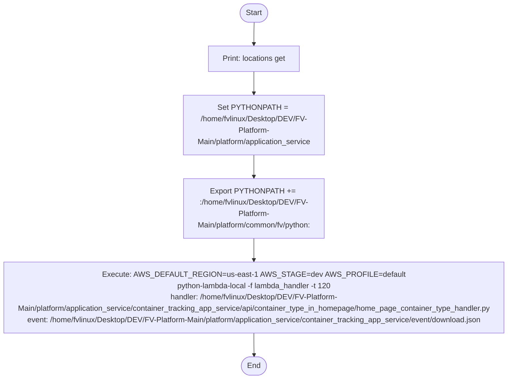
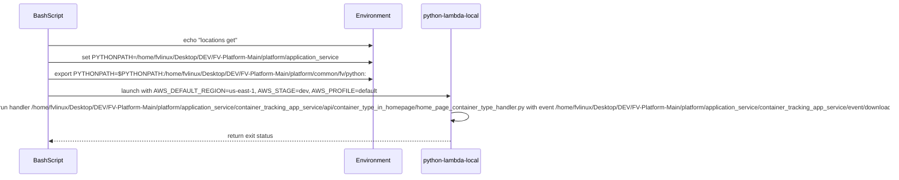

# Diagram: application_service/container_tracking_app_service/event/download.sh

> Auto-generated by Obscura crawlers

## Diagram 1

### SVG

<svg id="container" width="1176.125" xmlns="http://www.w3.org/2000/svg" class="flowchart" height="776" viewBox="0 0 1176.125 776" role="graphics-document document" aria-roledescription="flowchart-v2"><g><marker id="container_flowchart-v2-pointEnd" class="marker flowchart-v2" viewBox="0 0 10 10" refX="5" refY="5" markerUnits="userSpaceOnUse" markerWidth="8" markerHeight="8" orient="auto"><path d="M 0 0 L 10 5 L 0 10 z" class="arrowMarkerPath" style="stroke-width: 1; stroke-dasharray: 1, 0;"></path></marker><marker id="container_flowchart-v2-pointStart" class="marker flowchart-v2" viewBox="0 0 10 10" refX="4.5" refY="5" markerUnits="userSpaceOnUse" markerWidth="8" markerHeight="8" orient="auto"><path d="M 0 5 L 10 10 L 10 0 z" class="arrowMarkerPath" style="stroke-width: 1; stroke-dasharray: 1, 0;"></path></marker><marker id="container_flowchart-v2-circleEnd" class="marker flowchart-v2" viewBox="0 0 10 10" refX="11" refY="5" markerUnits="userSpaceOnUse" markerWidth="11" markerHeight="11" orient="auto"><circle cx="5" cy="5" r="5" class="arrowMarkerPath" style="stroke-width: 1; stroke-dasharray: 1, 0;"></circle></marker><marker id="container_flowchart-v2-circleStart" class="marker flowchart-v2" viewBox="0 0 10 10" refX="-1" refY="5" markerUnits="userSpaceOnUse" markerWidth="11" markerHeight="11" orient="auto"><circle cx="5" cy="5" r="5" class="arrowMarkerPath" style="stroke-width: 1; stroke-dasharray: 1, 0;"></circle></marker><marker id="container_flowchart-v2-crossEnd" class="marker cross flowchart-v2" viewBox="0 0 11 11" refX="12" refY="5.2" markerUnits="userSpaceOnUse" markerWidth="11" markerHeight="11" orient="auto"><path d="M 1,1 l 9,9 M 10,1 l -9,9" class="arrowMarkerPath" style="stroke-width: 2; stroke-dasharray: 1, 0;"></path></marker><marker id="container_flowchart-v2-crossStart" class="marker cross flowchart-v2" viewBox="0 0 11 11" refX="-1" refY="5.2" markerUnits="userSpaceOnUse" markerWidth="11" markerHeight="11" orient="auto"><path d="M 1,1 l 9,9 M 10,1 l -9,9" class="arrowMarkerPath" style="stroke-width: 2; stroke-dasharray: 1, 0;"></path></marker><g class="root"><g class="clusters"></g><g class="edgePaths"><path d="M588.563,47.5L588.479,51.583C588.396,55.667,588.229,63.833,588.146,71.417C588.063,79,588.063,86,588.063,89.5L588.063,93" id="L_Start_Echo_0" class="edge-thickness-normal edge-pattern-solid edge-thickness-normal edge-pattern-solid flowchart-link" style=";" data-edge="true" data-et="edge" data-id="L_Start_Echo_0" data-points="W3sieCI6NTg4LjU2MjUsInkiOjQ3LjV9LHsieCI6NTg4LjA2MjUsInkiOjcyfSx7IngiOjU4OC4wNjI1LCJ5Ijo5N31d" marker-end="url(#container_flowchart-v2-pointEnd)"></path><path d="M588.063,151L588.063,155.167C588.063,159.333,588.063,167.667,588.063,175.333C588.063,183,588.063,190,588.063,193.5L588.063,197" id="L_Echo_SetPY_0" class="edge-thickness-normal edge-pattern-solid edge-thickness-normal edge-pattern-solid flowchart-link" style=";" data-edge="true" data-et="edge" data-id="L_Echo_SetPY_0" data-points="W3sieCI6NTg4LjA2MjUsInkiOjE1MX0seyJ4Ijo1ODguMDYyNSwieSI6MTc2fSx7IngiOjU4OC4wNjI1LCJ5IjoyMDF9XQ==" marker-end="url(#container_flowchart-v2-pointEnd)"></path><path d="M588.063,327L588.063,331.167C588.063,335.333,588.063,343.667,588.063,351.333C588.063,359,588.063,366,588.063,369.5L588.063,373" id="L_SetPY_ExportPY_0" class="edge-thickness-normal edge-pattern-solid edge-thickness-normal edge-pattern-solid flowchart-link" style=";" data-edge="true" data-et="edge" data-id="L_SetPY_ExportPY_0" data-points="W3sieCI6NTg4LjA2MjUsInkiOjMyN30seyJ4Ijo1ODguMDYyNSwieSI6MzUyfSx7IngiOjU4OC4wNjI1LCJ5IjozNzd9XQ==" marker-end="url(#container_flowchart-v2-pointEnd)"></path><path d="M588.063,503L588.063,507.167C588.063,511.333,588.063,519.667,588.063,527.333C588.063,535,588.063,542,588.063,545.5L588.063,549" id="L_ExportPY_Run_0" class="edge-thickness-normal edge-pattern-solid edge-thickness-normal edge-pattern-solid flowchart-link" style=";" data-edge="true" data-et="edge" data-id="L_ExportPY_Run_0" data-points="W3sieCI6NTg4LjA2MjUsInkiOjUwM30seyJ4Ijo1ODguMDYyNSwieSI6NTI4fSx7IngiOjU4OC4wNjI1LCJ5Ijo1NTN9XQ==" marker-end="url(#container_flowchart-v2-pointEnd)"></path><path d="M588.063,679L588.063,683.167C588.063,687.333,588.063,695.667,588.133,703.417C588.203,711.167,588.344,718.334,588.414,721.917L588.484,725.501" id="L_Run_End_0" class="edge-thickness-normal edge-pattern-solid edge-thickness-normal edge-pattern-solid flowchart-link" style=";" data-edge="true" data-et="edge" data-id="L_Run_End_0" data-points="W3sieCI6NTg4LjA2MjUsInkiOjY3OX0seyJ4Ijo1ODguMDYyNSwieSI6NzA0fSx7IngiOjU4OC41NjI1LCJ5Ijo3MjkuNX1d" marker-end="url(#container_flowchart-v2-pointEnd)"></path></g><g class="edgeLabels"><g class="edgeLabel"><g class="label" data-id="L_Start_Echo_0" transform="translate(0, 0)"><foreignObject width="0" height="0">

</foreignObject></g></g><g class="edgeLabel"><g class="label" data-id="L_Echo_SetPY_0" transform="translate(0, 0)"><foreignObject width="0" height="0">

</foreignObject></g></g><g class="edgeLabel"><g class="label" data-id="L_SetPY_ExportPY_0" transform="translate(0, 0)"><foreignObject width="0" height="0">

</foreignObject></g></g><g class="edgeLabel"><g class="label" data-id="L_ExportPY_Run_0" transform="translate(0, 0)"><foreignObject width="0" height="0">

</foreignObject></g></g><g class="edgeLabel"><g class="label" data-id="L_Run_End_0" transform="translate(0, 0)"><foreignObject width="0" height="0">

</foreignObject></g></g></g><g class="nodes"><g class="node default" id="flowchart-Start-0" transform="translate(588.0625, 27.5)"><g class="basic label-container outer-path"><path d="M-10.3984375 -19.5 C-3.859252887850176 -19.5, 2.6799317242996477 -19.5, 10.3984375 -19.5 C10.3984375 -19.5, 10.3984375 -19.5, 10.398437499999998 -19.5 C10.876910118707059 -19.484656314408518, 11.35538273741412 -19.46931262881704, 11.6478067896239 -19.45993515863156 C12.056901230414766 -19.420470309936512, 12.465995671205635 -19.381005461241465, 12.892042152847864 -19.3399052695533 C13.192198784555682 -19.291378273088224, 13.492355416263498 -19.24285127662315, 14.126030759676757 -19.140403561325776 C14.50708542127567 -19.053430321429875, 14.888140082874585 -18.966457081533978, 15.34470188623539 -18.862249829261074 C15.80914532834905 -18.724405453555118, 16.273588770462712 -18.586561077849158, 16.543047751460602 -18.50658706670804 C16.990269869130557 -18.34200519332956, 17.437491986800513 -18.177423319951078, 17.716144095147794 -18.074876768247425 C18.096296337471575 -17.90659464738629, 18.476448579795356 -17.738312526525153, 18.85917041279238 -17.568892924097174 C19.276897211946615 -17.350965120545194, 19.69462401110085 -17.133037316993217, 19.967429764076783 -16.990714730406097 C20.38000178808532 -16.74061114490979, 20.792573812093856 -16.49050755941348, 21.036368073605697 -16.342718045390892 C21.326505095447047 -16.140331018783616, 21.616642117288396 -15.937943992176336, 22.061592844578712 -15.627565626425154 C22.279188978004132 -15.454038500494676, 22.496785111429556 -15.280511374564195, 23.03889120850187 -14.848196188198123 C23.306639394122048 -14.605034370246665, 23.574387579742226 -14.361872552295207, 23.964247236767985 -14.007812326905688 C24.305909419955405 -13.655018071777759, 24.647571603142826 -13.30222381664983, 24.833858442968648 -13.10986736009568 C25.06261224630038 -12.84116012624208, 25.291366049632114 -12.57245289238848, 25.644151408126582 -12.158051136245305 C25.8207565471026 -11.921416339076583, 25.99736168607862 -11.684781541907862, 26.391796464640635 -11.156274872382312 C26.59317971697256 -10.846896117825452, 26.794562969304486 -10.537517363268593, 27.073721378604247 -10.108655082055241 C27.229708872884615 -9.831683490513855, 27.385696367164982 -9.554711898972469, 27.6871239742735 -9.019496659696287 C27.862755933650316 -8.654793138128404, 28.03838789302713 -8.290089616560524, 28.22948364880834 -7.893275190886684 C28.392680009546748 -7.49017702467583, 28.555876370285155 -7.087078858464976, 28.698571729970325 -6.734618561215508 C28.827730517695155 -6.3456128712465105, 28.95688930541998 -5.956607181277514, 29.09246063421488 -5.548287939305138 C29.196098422521498 -5.153072135590431, 29.29973621082811 -4.757856331875725, 29.40953178754556 -4.339158212148133 C29.481503803785134 -3.9695971200489426, 29.55347582002471 -3.6000360279497525, 29.648482276581777 -3.1121979531509023 C29.71089093390047 -2.628168730970462, 29.77329959121916 -2.1441395087900217, 29.808330202509367 -1.872449005199798 C29.831914899067616 -1.5050983190806377, 29.855499595625865 -1.1377476329614773, 29.888418715913414 -0.6250057626472757 C29.888418715913414 -0.3315040572863513, 29.888418715913414 -0.03800235192542689, 29.888418715913414 0.625005762647271 C29.866325106169757 0.9691315680455206, 29.8442314964261 1.3132573734437702, 29.808330202509367 1.8724490051997846 C29.77060669467735 2.165025082595693, 29.73288318684534 2.457601159991601, 29.648482276581777 3.1121979531508885 C29.55344764314566 3.600180710268467, 29.458413009709542 4.088163467386045, 29.40953178754556 4.339158212148129 C29.29721201047179 4.767482201829734, 29.18489223339802 5.195806191511339, 29.092460634214884 5.548287939305125 C28.958263563534206 5.95246813479576, 28.824066492853532 6.356648330286394, 28.69857172997033 6.734618561215495 C28.578756863639054 7.030563597516601, 28.458941997307775 7.326508633817709, 28.229483648808344 7.893275190886679 C28.09513315610333 8.172256863628675, 27.96078266339832 8.45123853637067, 27.687123974273504 9.019496659696284 C27.495844039292763 9.359133553448327, 27.304564104312025 9.698770447200372, 27.07372137860425 10.108655082055236 C26.818460238227424 10.500804740887748, 26.563199097850596 10.892954399720258, 26.39179646464064 11.156274872382301 C26.10415320522074 11.54169063516495, 25.816509945800842 11.9271063979476, 25.644151408126582 12.158051136245302 C25.375920973002525 12.473129868086154, 25.107690537878465 12.788208599927005, 24.83385844296866 13.10986736009567 C24.58722991660111 13.364531562148752, 24.34060139023356 13.619195764201836, 23.96424723676799 14.007812326905684 C23.595966110757708 14.342275501363593, 23.227684984747427 14.676738675821504, 23.038891208501887 14.848196188198111 C22.72404970551808 15.099273908543436, 22.409208202534277 15.350351628888761, 22.061592844578715 15.627565626425152 C21.768249621080244 15.832189160514208, 21.47490639758177 16.036812694603263, 21.036368073605708 16.34271804539089 C20.707727008926437 16.54194219010873, 20.379085944247162 16.741166334826573, 19.967429764076787 16.990714730406093 C19.526421550154687 17.22078843313001, 19.085413336232588 17.450862135853928, 18.859170412792388 17.56889292409717 C18.6208490166179 17.67439073663058, 18.382527620443415 17.77988854916399, 17.716144095147804 18.07487676824742 C17.275885693607023 18.23689592971848, 16.835627292066242 18.398915091189536, 16.543047751460616 18.506587066708033 C16.298447912411536 18.579183015007043, 16.053848073362456 18.651778963306057, 15.344701886235413 18.86224982926107 C14.877795575906045 18.96881814774533, 14.410889265576678 19.07538646622959, 14.126030759676766 19.140403561325773 C13.804328277516879 19.192413923801375, 13.482625795356991 19.244424286276974, 12.892042152847878 19.3399052695533 C12.616127498690481 19.366522424403943, 12.340212844533085 19.393139579254584, 11.6478067896239 19.45993515863156 C11.277270749529187 19.471817528232748, 10.906734709434474 19.483699897833937, 10.398437500000004 19.5 C10.398437500000002 19.5, 10.398437500000002 19.5, 10.3984375 19.5 C3.4837458372328083 19.5, -3.4309458255343834 19.5, -10.398437499999996 19.5 C-10.801452593998736 19.48707609035675, -11.204467687997477 19.474152180713507, -11.647806789623893 19.45993515863156 C-12.139830614523595 19.41247021198871, -12.631854439423295 19.36500526534586, -12.892042152847871 19.3399052695533 C-13.17019699494595 19.294935351805897, -13.448351837044028 19.2499654340585, -14.126030759676759 19.140403561325773 C-14.475498769969938 19.060639768468246, -14.82496678026312 18.98087597561072, -15.344701886235388 18.862249829261074 C-15.723099405471185 18.749943431801, -16.101496924706982 18.637637034340926, -16.54304775146059 18.506587066708043 C-16.866648107273406 18.38749914444003, -17.19024846308622 18.268411222172016, -17.716144095147797 18.074876768247425 C-18.098209210254492 17.90574787534865, -18.480274325361183 17.736618982449873, -18.85917041279238 17.568892924097174 C-19.286955585888496 17.345717673302413, -19.714740758984608 17.12254242250765, -19.96742976407678 16.990714730406097 C-20.319182548984482 16.777480125066234, -20.670935333892185 16.564245519726374, -21.036368073605686 16.3427180453909 C-21.251097977324637 16.192931760064276, -21.465827881043584 16.043145474737653, -22.061592844578712 15.627565626425156 C-22.28828804258934 15.446782238624252, -22.514983240599967 15.26599885082335, -23.03889120850187 14.848196188198125 C-23.30768399550413 14.604085690910098, -23.57647678250639 14.35997519362207, -23.964247236767974 14.007812326905697 C-24.166792440144153 13.798667775149335, -24.369337643520332 13.589523223392971, -24.833858442968655 13.109867360095677 C-24.996613491185535 12.918686019435532, -25.159368539402415 12.727504678775388, -25.64415140812658 12.158051136245307 C-25.804488996967514 11.943213374253292, -25.964826585808453 11.728375612261274, -26.391796464640635 11.156274872382316 C-26.59972233311853 10.836844902486812, -26.807648201596432 10.517414932591308, -27.073721378604244 10.108655082055249 C-27.238151361110166 9.816692997774755, -27.402581343616088 9.52473091349426, -27.6871239742735 9.019496659696289 C-27.79868536846013 8.78783703763631, -27.91024676264676 8.556177415576332, -28.22948364880834 7.893275190886686 C-28.387769353328952 7.502306440474866, -28.546055057849564 7.111337690063047, -28.698571729970325 6.73461856121551 C-28.853706331596758 6.267377858458783, -29.008840933223187 5.800137155702055, -29.09246063421488 5.5482879393051325 C-29.206051738000152 5.1151158298760935, -29.319642841785424 4.681943720447054, -29.409531787545557 4.339158212148136 C-29.500615874667734 3.8714606754043963, -29.59169996178991 3.403763138660657, -29.648482276581777 3.112197953150904 C-29.69021859242155 2.78849932926539, -29.731954908261322 2.4648007053798757, -29.808330202509364 1.872449005199809 C-29.82561216069813 1.6032685566641822, -29.8428941188869 1.3340881081285554, -29.888418715913414 0.6250057626472781 C-29.888418715913414 0.37426431769768, -29.888418715913414 0.12352287274808182, -29.888418715913414 -0.6250057626472687 C-29.85894480740154 -1.0840856786304929, -29.82947089888966 -1.543165594613717, -29.808330202509367 -1.8724490051997822 C-29.768831038247733 -2.178796723220795, -29.729331873986098 -2.485144441241808, -29.648482276581777 -3.112197953150895 C-29.572879133558864 -3.5004041138436213, -29.49727599053595 -3.888610274536347, -29.40953178754556 -4.339158212148126 C-29.306391625250182 -4.7324763522095115, -29.203251462954803 -5.125794492270897, -29.092460634214884 -5.548287939305123 C-28.99401360476291 -5.8447947066104495, -28.895566575310934 -6.141301473915775, -28.698571729970332 -6.734618561215485 C-28.60003777702449 -6.977999330016098, -28.50150382407865 -7.22138009881671, -28.229483648808344 -7.893275190886676 C-28.020672587768036 -8.326875826977846, -27.811861526727732 -8.760476463069017, -27.687123974273504 -9.019496659696282 C-27.465161977668892 -9.41361266075715, -27.24319998106428 -9.80772866181802, -27.073721378604247 -10.108655082055243 C-26.844271034013627 -10.461152427391019, -26.61482068942301 -10.813649772726793, -26.39179646464064 -11.156274872382308 C-26.233412490262538 -11.368494968972069, -26.075028515884433 -11.580715065561828, -25.644151408126586 -12.158051136245302 C-25.399895791502377 -12.444967682070413, -25.155640174878165 -12.731884227895524, -24.833858442968662 -13.10986736009567 C-24.608051377942846 -13.343031693839643, -24.382244312917027 -13.576196027583618, -23.964247236767996 -14.007812326905677 C-23.675868903892727 -14.269709898750422, -23.38749057101746 -14.531607470595167, -23.038891208501887 -14.848196188198107 C-22.74256474839478 -15.08450865455525, -22.44623828828767 -15.320821120912393, -22.06159284457872 -15.627565626425149 C-21.65978050221723 -15.907852522280566, -21.257968159855746 -16.188139418135982, -21.03636807360571 -16.342718045390885 C-20.65135435026558 -16.576115627071452, -20.266340626925455 -16.80951320875202, -19.96742976407679 -16.99071473040609 C-19.567973345092028 -17.199110888326395, -19.168516926107266 -17.407507046246696, -18.859170412792388 -17.56889292409717 C-18.480765161401354 -17.736401703895023, -18.102359910010318 -17.903910483692876, -17.716144095147804 -18.07487676824742 C-17.356716268941543 -18.20714953080573, -16.997288442735282 -18.339422293364034, -16.54304775146062 -18.506587066708033 C-16.161452930256445 -18.61984240660934, -15.779858109052268 -18.73309774651065, -15.344701886235413 -18.862249829261067 C-15.067766859534641 -18.925458441935582, -14.79083183283387 -18.988667054610094, -14.126030759676768 -19.140403561325773 C-13.740277791016531 -19.20276910973981, -13.354524822356293 -19.265134658153848, -12.89204215284788 -19.3399052695533 C-12.555696220223691 -19.37235215715839, -12.219350287599502 -19.404799044763475, -11.647806789623903 -19.45993515863156 C-11.197508574340883 -19.47437534594338, -10.747210359057865 -19.488815533255202, -10.398437500000005 -19.5 C-10.398437500000004 -19.5, -10.398437500000002 -19.5, -10.3984375 -19.5" stroke="none" stroke-width="0" fill="#ECECFF" style=""></path><path d="M-10.3984375 -19.5 C-4.320303175097076 -19.5, 1.7578311498058472 -19.5, 10.3984375 -19.5 M-10.3984375 -19.5 C-6.095333859231451 -19.5, -1.7922302184629029 -19.5, 10.3984375 -19.5 M10.3984375 -19.5 C10.3984375 -19.5, 10.398437499999998 -19.5, 10.398437499999998 -19.5 M10.3984375 -19.5 C10.3984375 -19.5, 10.398437499999998 -19.5, 10.398437499999998 -19.5 M10.398437499999998 -19.5 C10.88169146564345 -19.484502985918596, 11.364945431286898 -19.46900597183719, 11.6478067896239 -19.45993515863156 M10.398437499999998 -19.5 C10.721209120815944 -19.48964934235728, 11.04398074163189 -19.47929868471456, 11.6478067896239 -19.45993515863156 M11.6478067896239 -19.45993515863156 C12.031057673654082 -19.42296340677579, 12.414308557684263 -19.385991654920023, 12.892042152847864 -19.3399052695533 M11.6478067896239 -19.45993515863156 C12.094605707955049 -19.41683300433447, 12.541404626286198 -19.37373085003738, 12.892042152847864 -19.3399052695533 M12.892042152847864 -19.3399052695533 C13.278847680195842 -19.277369551613344, 13.665653207543821 -19.21483383367339, 14.126030759676757 -19.140403561325776 M12.892042152847864 -19.3399052695533 C13.14114492598417 -19.29963226501348, 13.390247699120474 -19.25935926047366, 14.126030759676757 -19.140403561325776 M14.126030759676757 -19.140403561325776 C14.46796674134134 -19.062358904851646, 14.809902723005926 -18.984314248377512, 15.34470188623539 -18.862249829261074 M14.126030759676757 -19.140403561325776 C14.559552879580679 -19.041454966453923, 14.9930749994846 -18.942506371582066, 15.34470188623539 -18.862249829261074 M15.34470188623539 -18.862249829261074 C15.76703594470962 -18.736903297582636, 16.18937000318385 -18.611556765904194, 16.543047751460602 -18.50658706670804 M15.34470188623539 -18.862249829261074 C15.63798677824296 -18.77520441279704, 15.931271670250531 -18.68815899633301, 16.543047751460602 -18.50658706670804 M16.543047751460602 -18.50658706670804 C16.89557375749622 -18.376854237772257, 17.248099763531833 -18.24712140883647, 17.716144095147794 -18.074876768247425 M16.543047751460602 -18.50658706670804 C16.921537141607793 -18.367299472416303, 17.300026531754988 -18.22801187812457, 17.716144095147794 -18.074876768247425 M17.716144095147794 -18.074876768247425 C17.950694746675396 -17.971048152514026, 18.185245398202998 -17.867219536780627, 18.85917041279238 -17.568892924097174 M17.716144095147794 -18.074876768247425 C18.0891585237599 -17.909754345780726, 18.462172952372004 -17.74463192331403, 18.85917041279238 -17.568892924097174 M18.85917041279238 -17.568892924097174 C19.15967615162131 -17.412119272633234, 19.460181890450237 -17.255345621169297, 19.967429764076783 -16.990714730406097 M18.85917041279238 -17.568892924097174 C19.274024347073855 -17.352463892309157, 19.688878281355333 -17.136034860521136, 19.967429764076783 -16.990714730406097 M19.967429764076783 -16.990714730406097 C20.237541066821834 -16.82697167133184, 20.507652369566884 -16.66322861225758, 21.036368073605697 -16.342718045390892 M19.967429764076783 -16.990714730406097 C20.337469295684038 -16.766394591752114, 20.707508827291292 -16.54207445309813, 21.036368073605697 -16.342718045390892 M21.036368073605697 -16.342718045390892 C21.319824857902304 -16.144990863312003, 21.603281642198912 -15.947263681233116, 22.061592844578712 -15.627565626425154 M21.036368073605697 -16.342718045390892 C21.268518989514675 -16.18077961610397, 21.500669905423653 -16.018841186817042, 22.061592844578712 -15.627565626425154 M22.061592844578712 -15.627565626425154 C22.433904230154557 -15.330657204050482, 22.8062156157304 -15.033748781675808, 23.03889120850187 -14.848196188198123 M22.061592844578712 -15.627565626425154 C22.44345726937027 -15.323038909493, 22.825321694161826 -15.018512192560847, 23.03889120850187 -14.848196188198123 M23.03889120850187 -14.848196188198123 C23.28569355875479 -14.624056823730774, 23.53249590900771 -14.399917459263424, 23.964247236767985 -14.007812326905688 M23.03889120850187 -14.848196188198123 C23.391869665803586 -14.527630492574907, 23.744848123105303 -14.207064796951691, 23.964247236767985 -14.007812326905688 M23.964247236767985 -14.007812326905688 C24.218117534212475 -13.745670401655202, 24.471987831656964 -13.483528476404715, 24.833858442968648 -13.10986736009568 M23.964247236767985 -14.007812326905688 C24.28168552078049 -13.680031236494969, 24.599123804792995 -13.35225014608425, 24.833858442968648 -13.10986736009568 M24.833858442968648 -13.10986736009568 C25.056575207705215 -12.848251575293189, 25.279291972441783 -12.586635790490694, 25.644151408126582 -12.158051136245305 M24.833858442968648 -13.10986736009568 C25.023926232111815 -12.886602919804533, 25.213994021254987 -12.663338479513385, 25.644151408126582 -12.158051136245305 M25.644151408126582 -12.158051136245305 C25.84071073364079 -11.8946795469792, 26.037270059155 -11.631307957713096, 26.391796464640635 -11.156274872382312 M25.644151408126582 -12.158051136245305 C25.936524784972953 -11.766297447033748, 26.22889816181932 -11.374543757822194, 26.391796464640635 -11.156274872382312 M26.391796464640635 -11.156274872382312 C26.623815561727152 -10.799831233406215, 26.855834658813666 -10.443387594430117, 27.073721378604247 -10.108655082055241 M26.391796464640635 -11.156274872382312 C26.650538835242976 -10.758777109082201, 26.90928120584532 -10.361279345782092, 27.073721378604247 -10.108655082055241 M27.073721378604247 -10.108655082055241 C27.22152968524685 -9.84620646639726, 27.369337991889456 -9.583757850739282, 27.6871239742735 -9.019496659696287 M27.073721378604247 -10.108655082055241 C27.27190513352871 -9.756759756905547, 27.470088888453166 -9.404864431755854, 27.6871239742735 -9.019496659696287 M27.6871239742735 -9.019496659696287 C27.901559997206103 -8.574215669880862, 28.115996020138706 -8.12893468006544, 28.22948364880834 -7.893275190886684 M27.6871239742735 -9.019496659696287 C27.88450795329775 -8.609624603911854, 28.081891932321994 -8.19975254812742, 28.22948364880834 -7.893275190886684 M28.22948364880834 -7.893275190886684 C28.358422486355682 -7.57479376928192, 28.48736132390302 -7.256312347677155, 28.698571729970325 -6.734618561215508 M28.22948364880834 -7.893275190886684 C28.380449171274268 -7.520387431676025, 28.531414693740196 -7.147499672465367, 28.698571729970325 -6.734618561215508 M28.698571729970325 -6.734618561215508 C28.79392768464065 -6.447421618656632, 28.88928363931097 -6.160224676097757, 29.09246063421488 -5.548287939305138 M28.698571729970325 -6.734618561215508 C28.802385653258106 -6.421947564775147, 28.906199576545884 -6.109276568334785, 29.09246063421488 -5.548287939305138 M29.09246063421488 -5.548287939305138 C29.166732697197517 -5.265056373436631, 29.24100476018015 -4.981824807568126, 29.40953178754556 -4.339158212148133 M29.09246063421488 -5.548287939305138 C29.210675653031746 -5.097482837843182, 29.32889067184861 -4.646677736381225, 29.40953178754556 -4.339158212148133 M29.40953178754556 -4.339158212148133 C29.501873727221714 -3.8650018683869427, 29.59421566689787 -3.3908455246257523, 29.648482276581777 -3.1121979531509023 M29.40953178754556 -4.339158212148133 C29.49571429418582 -3.896629255229625, 29.58189680082608 -3.454100298311117, 29.648482276581777 -3.1121979531509023 M29.648482276581777 -3.1121979531509023 C29.70348777579168 -2.6855861633433196, 29.758493275001577 -2.2589743735357364, 29.808330202509367 -1.872449005199798 M29.648482276581777 -3.1121979531509023 C29.70895510719539 -2.643182620622822, 29.769427937809006 -2.174167288094742, 29.808330202509367 -1.872449005199798 M29.808330202509367 -1.872449005199798 C29.84007984679226 -1.3779226676421248, 29.871829491075154 -0.8833963300844516, 29.888418715913414 -0.6250057626472757 M29.808330202509367 -1.872449005199798 C29.833901649228455 -1.474153081649716, 29.859473095947543 -1.075857158099634, 29.888418715913414 -0.6250057626472757 M29.888418715913414 -0.6250057626472757 C29.888418715913414 -0.29708974096272756, 29.888418715913414 0.030826280721820587, 29.888418715913414 0.625005762647271 M29.888418715913414 -0.6250057626472757 C29.888418715913414 -0.21296751662481028, 29.888418715913414 0.19907072939765513, 29.888418715913414 0.625005762647271 M29.888418715913414 0.625005762647271 C29.858517257914045 1.0907451070099365, 29.828615799914676 1.5564844513726022, 29.808330202509367 1.8724490051997846 M29.888418715913414 0.625005762647271 C29.86677290109615 0.9621568006133918, 29.845127086278886 1.2993078385795127, 29.808330202509367 1.8724490051997846 M29.808330202509367 1.8724490051997846 C29.751173880217273 2.3157421541048073, 29.69401755792518 2.7590353030098296, 29.648482276581777 3.1121979531508885 M29.808330202509367 1.8724490051997846 C29.7618519615454 2.2329250639495264, 29.71537372058143 2.5934011226992677, 29.648482276581777 3.1121979531508885 M29.648482276581777 3.1121979531508885 C29.588099264361084 3.4222519589499982, 29.52771625214039 3.732305964749108, 29.40953178754556 4.339158212148129 M29.648482276581777 3.1121979531508885 C29.553054142122242 3.6022012548572495, 29.457626007662704 4.09220455656361, 29.40953178754556 4.339158212148129 M29.40953178754556 4.339158212148129 C29.29883523317119 4.76129215016775, 29.188138678796822 5.183426088187373, 29.092460634214884 5.548287939305125 M29.40953178754556 4.339158212148129 C29.29565766551187 4.773409592819272, 29.181783543478183 5.207660973490414, 29.092460634214884 5.548287939305125 M29.092460634214884 5.548287939305125 C28.980004116561123 5.886989052965416, 28.86754759890736 6.225690166625706, 28.69857172997033 6.734618561215495 M29.092460634214884 5.548287939305125 C28.978824113906015 5.890543032954709, 28.865187593597145 6.232798126604293, 28.69857172997033 6.734618561215495 M28.69857172997033 6.734618561215495 C28.533035169797465 7.143497065274139, 28.3674986096246 7.552375569332784, 28.229483648808344 7.893275190886679 M28.69857172997033 6.734618561215495 C28.539135514283736 7.128429096450911, 28.379699298597142 7.522239631686326, 28.229483648808344 7.893275190886679 M28.229483648808344 7.893275190886679 C28.02426541077291 8.319415253134139, 27.81904717273747 8.7455553153816, 27.687123974273504 9.019496659696284 M28.229483648808344 7.893275190886679 C28.054217348385848 8.257219413812066, 27.878951047963355 8.621163636737453, 27.687123974273504 9.019496659696284 M27.687123974273504 9.019496659696284 C27.480357882419156 9.386630793120847, 27.273591790564804 9.753764926545411, 27.07372137860425 10.108655082055236 M27.687123974273504 9.019496659696284 C27.553434808777585 9.256875310530251, 27.419745643281665 9.49425396136422, 27.07372137860425 10.108655082055236 M27.07372137860425 10.108655082055236 C26.851762978852545 10.44964278824956, 26.62980457910084 10.790630494443887, 26.39179646464064 11.156274872382301 M27.07372137860425 10.108655082055236 C26.85033514628469 10.451836322500519, 26.626948913965123 10.795017562945802, 26.39179646464064 11.156274872382301 M26.39179646464064 11.156274872382301 C26.13849286928844 11.495678613721985, 25.885189273936245 11.835082355061667, 25.644151408126582 12.158051136245302 M26.39179646464064 11.156274872382301 C26.123655560182584 11.515559256217166, 25.85551465572453 11.874843640052031, 25.644151408126582 12.158051136245302 M25.644151408126582 12.158051136245302 C25.400151244346247 12.444667612624318, 25.156151080565916 12.731284089003333, 24.83385844296866 13.10986736009567 M25.644151408126582 12.158051136245302 C25.344084724247598 12.510526537407564, 25.04401804036861 12.863001938569829, 24.83385844296866 13.10986736009567 M24.83385844296866 13.10986736009567 C24.623765887534113 13.326805172501427, 24.413673332099567 13.543742984907183, 23.96424723676799 14.007812326905684 M24.83385844296866 13.10986736009567 C24.650876788460966 13.298810941448089, 24.467895133953274 13.487754522800508, 23.96424723676799 14.007812326905684 M23.96424723676799 14.007812326905684 C23.75471602701936 14.198103027707374, 23.545184817270734 14.388393728509065, 23.038891208501887 14.848196188198111 M23.96424723676799 14.007812326905684 C23.643156981137707 14.299418001486487, 23.322066725507426 14.59102367606729, 23.038891208501887 14.848196188198111 M23.038891208501887 14.848196188198111 C22.815404046339523 15.026421252779443, 22.59191688417716 15.204646317360776, 22.061592844578715 15.627565626425152 M23.038891208501887 14.848196188198111 C22.686508119605776 15.129212324284943, 22.334125030709664 15.410228460371775, 22.061592844578715 15.627565626425152 M22.061592844578715 15.627565626425152 C21.725773271508775 15.861818823203727, 21.389953698438834 16.0960720199823, 21.036368073605708 16.34271804539089 M22.061592844578715 15.627565626425152 C21.80737381768633 15.804897814620976, 21.553154790793947 15.982230002816799, 21.036368073605708 16.34271804539089 M21.036368073605708 16.34271804539089 C20.803381610052234 16.48395580877744, 20.570395146498765 16.62519357216399, 19.967429764076787 16.990714730406093 M21.036368073605708 16.34271804539089 C20.78880791537079 16.49279046813787, 20.54124775713587 16.64286289088485, 19.967429764076787 16.990714730406093 M19.967429764076787 16.990714730406093 C19.573151100035872 17.1964096568887, 19.178872435994958 17.402104583371308, 18.859170412792388 17.56889292409717 M19.967429764076787 16.990714730406093 C19.680895463444294 17.140199491512085, 19.394361162811805 17.289684252618077, 18.859170412792388 17.56889292409717 M18.859170412792388 17.56889292409717 C18.501142926147857 17.72738107192666, 18.143115439503323 17.885869219756152, 17.716144095147804 18.07487676824742 M18.859170412792388 17.56889292409717 C18.565561944741518 17.698864683317538, 18.271953476690648 17.828836442537906, 17.716144095147804 18.07487676824742 M17.716144095147804 18.07487676824742 C17.36773092825408 18.20309603436032, 17.019317761360355 18.331315300473218, 16.543047751460616 18.506587066708033 M17.716144095147804 18.07487676824742 C17.45758495728339 18.170028921075996, 17.199025819418974 18.265181073904568, 16.543047751460616 18.506587066708033 M16.543047751460616 18.506587066708033 C16.066069536157826 18.648151697300158, 15.589091320855038 18.789716327892286, 15.344701886235413 18.86224982926107 M16.543047751460616 18.506587066708033 C16.106278855915207 18.636217782259195, 15.669509960369801 18.765848497810357, 15.344701886235413 18.86224982926107 M15.344701886235413 18.86224982926107 C15.003315209107658 18.940169110559218, 14.661928531979902 19.018088391857365, 14.126030759676766 19.140403561325773 M15.344701886235413 18.86224982926107 C15.079264838502171 18.92283410326757, 14.81382779076893 18.983418377274067, 14.126030759676766 19.140403561325773 M14.126030759676766 19.140403561325773 C13.752753929555585 19.200752064414715, 13.379477099434403 19.261100567503654, 12.892042152847878 19.3399052695533 M14.126030759676766 19.140403561325773 C13.73215107976636 19.20408297339115, 13.338271399855957 19.267762385456525, 12.892042152847878 19.3399052695533 M12.892042152847878 19.3399052695533 C12.522349223476219 19.375569101828987, 12.15265629410456 19.41123293410467, 11.6478067896239 19.45993515863156 M12.892042152847878 19.3399052695533 C12.624277519726416 19.36573620167644, 12.356512886604952 19.39156713379958, 11.6478067896239 19.45993515863156 M11.6478067896239 19.45993515863156 C11.376710068193685 19.46862870283007, 11.105613346763471 19.477322247028578, 10.398437500000004 19.5 M11.6478067896239 19.45993515863156 C11.346783335857893 19.46958839488723, 11.045759882091886 19.479241631142894, 10.398437500000004 19.5 M10.398437500000004 19.5 C10.398437500000002 19.5, 10.398437500000002 19.5, 10.3984375 19.5 M10.398437500000004 19.5 C10.398437500000002 19.5, 10.398437500000002 19.5, 10.3984375 19.5 M10.3984375 19.5 C4.38816958706216 19.5, -1.6220983258756796 19.5, -10.398437499999996 19.5 M10.3984375 19.5 C5.872675338733202 19.5, 1.3469131774664032 19.5, -10.398437499999996 19.5 M-10.398437499999996 19.5 C-10.682968842745872 19.4908756336448, -10.967500185491748 19.481751267289603, -11.647806789623893 19.45993515863156 M-10.398437499999996 19.5 C-10.676054617850644 19.49109735937947, -10.953671735701294 19.482194718758937, -11.647806789623893 19.45993515863156 M-11.647806789623893 19.45993515863156 C-11.90676330745637 19.43495393479704, -12.165719825288845 19.409972710962517, -12.892042152847871 19.3399052695533 M-11.647806789623893 19.45993515863156 C-11.910683998661327 19.434575710431815, -12.17356120769876 19.409216262232075, -12.892042152847871 19.3399052695533 M-12.892042152847871 19.3399052695533 C-13.347874838695082 19.266209775940794, -13.803707524542293 19.192514282328293, -14.126030759676759 19.140403561325773 M-12.892042152847871 19.3399052695533 C-13.282192390528525 19.27682880478537, -13.67234262820918 19.213752340017443, -14.126030759676759 19.140403561325773 M-14.126030759676759 19.140403561325773 C-14.425482678762961 19.07205561490074, -14.724934597849161 19.00370766847571, -15.344701886235388 18.862249829261074 M-14.126030759676759 19.140403561325773 C-14.548162706436885 19.044054699146162, -14.970294653197012 18.947705836966556, -15.344701886235388 18.862249829261074 M-15.344701886235388 18.862249829261074 C-15.808542756668748 18.724584293666865, -16.27238362710211 18.58691875807266, -16.54304775146059 18.506587066708043 M-15.344701886235388 18.862249829261074 C-15.774460263856398 18.734699798630917, -16.204218641477407 18.60714976800076, -16.54304775146059 18.506587066708043 M-16.54304775146059 18.506587066708043 C-16.98012046373326 18.345740268335838, -17.41719317600593 18.184893469963633, -17.716144095147797 18.074876768247425 M-16.54304775146059 18.506587066708043 C-16.98683614147428 18.343268836848097, -17.43062453148797 18.179950606988154, -17.716144095147797 18.074876768247425 M-17.716144095147797 18.074876768247425 C-17.972680706225088 17.961315620411696, -18.229217317302382 17.847754472575964, -18.85917041279238 17.568892924097174 M-17.716144095147797 18.074876768247425 C-18.084201267340234 17.911948776145927, -18.45225843953267 17.74902078404443, -18.85917041279238 17.568892924097174 M-18.85917041279238 17.568892924097174 C-19.122271319575 17.431633349552857, -19.385372226357614 17.294373775008538, -19.96742976407678 16.990714730406097 M-18.85917041279238 17.568892924097174 C-19.266540188070554 17.356368373267344, -19.673909963348727 17.143843822437518, -19.96742976407678 16.990714730406097 M-19.96742976407678 16.990714730406097 C-20.208509757249704 16.844570621801374, -20.449589750422625 16.698426513196654, -21.036368073605686 16.3427180453909 M-19.96742976407678 16.990714730406097 C-20.249714348811565 16.819592156251517, -20.531998933546355 16.648469582096933, -21.036368073605686 16.3427180453909 M-21.036368073605686 16.3427180453909 C-21.39373850567269 16.093431902297628, -21.75110893773969 15.844145759204354, -22.061592844578712 15.627565626425156 M-21.036368073605686 16.3427180453909 C-21.251418351622608 16.19270828082279, -21.466468629639532 16.04269851625468, -22.061592844578712 15.627565626425156 M-22.061592844578712 15.627565626425156 C-22.337712711585485 15.407367380345505, -22.61383257859226 15.187169134265854, -23.03889120850187 14.848196188198125 M-22.061592844578712 15.627565626425156 C-22.432314284106575 15.331925143713507, -22.803035723634437 15.036284661001858, -23.03889120850187 14.848196188198125 M-23.03889120850187 14.848196188198125 C-23.317303593828804 14.595349426232252, -23.59571597915574 14.342502664266378, -23.964247236767974 14.007812326905697 M-23.03889120850187 14.848196188198125 C-23.389830881820213 14.529482062245341, -23.740770555138553 14.210767936292557, -23.964247236767974 14.007812326905697 M-23.964247236767974 14.007812326905697 C-24.274962635846865 13.686973167148054, -24.585678034925756 13.366134007390409, -24.833858442968655 13.109867360095677 M-23.964247236767974 14.007812326905697 C-24.150482988342393 13.815508623165545, -24.33671873991681 13.623204919425396, -24.833858442968655 13.109867360095677 M-24.833858442968655 13.109867360095677 C-25.048912821190566 12.857252250495442, -25.263967199412477 12.604637140895207, -25.64415140812658 12.158051136245307 M-24.833858442968655 13.109867360095677 C-25.137924115962278 12.752694518770433, -25.4419897889559 12.39552167744519, -25.64415140812658 12.158051136245307 M-25.64415140812658 12.158051136245307 C-25.87010279319012 11.855296864854804, -26.096054178253663 11.5525425934643, -26.391796464640635 11.156274872382316 M-25.64415140812658 12.158051136245307 C-25.942370885720372 11.758464204622937, -26.240590363314166 11.35887727300057, -26.391796464640635 11.156274872382316 M-26.391796464640635 11.156274872382316 C-26.64778374385936 10.763009669293066, -26.903771023078086 10.369744466203814, -27.073721378604244 10.108655082055249 M-26.391796464640635 11.156274872382316 C-26.545760485874254 10.91974479063891, -26.699724507107874 10.683214708895505, -27.073721378604244 10.108655082055249 M-27.073721378604244 10.108655082055249 C-27.21806647542558 9.85235574612295, -27.36241157224692 9.59605641019065, -27.6871239742735 9.019496659696289 M-27.073721378604244 10.108655082055249 C-27.28222622233909 9.73843361859914, -27.490731066073938 9.36821215514303, -27.6871239742735 9.019496659696289 M-27.6871239742735 9.019496659696289 C-27.82011149002316 8.743345237765126, -27.953099005772813 8.467193815833966, -28.22948364880834 7.893275190886686 M-27.6871239742735 9.019496659696289 C-27.85894637543348 8.662703767277161, -28.030768776593455 8.305910874858032, -28.22948364880834 7.893275190886686 M-28.22948364880834 7.893275190886686 C-28.38418966722819 7.511148334352276, -28.538895685648036 7.129021477817865, -28.698571729970325 6.73461856121551 M-28.22948364880834 7.893275190886686 C-28.370030685913953 7.546121291943717, -28.510577723019566 7.198967393000746, -28.698571729970325 6.73461856121551 M-28.698571729970325 6.73461856121551 C-28.820505047450773 6.367374836400237, -28.942438364931224 6.000131111584963, -29.09246063421488 5.5482879393051325 M-28.698571729970325 6.73461856121551 C-28.78079163987601 6.486985292543217, -28.863011549781696 6.239352023870924, -29.09246063421488 5.5482879393051325 M-29.09246063421488 5.5482879393051325 C-29.16815459948574 5.259634043755276, -29.2438485647566 4.970980148205419, -29.409531787545557 4.339158212148136 M-29.09246063421488 5.5482879393051325 C-29.17140060414935 5.247255621145608, -29.250340574083822 4.946223302986082, -29.409531787545557 4.339158212148136 M-29.409531787545557 4.339158212148136 C-29.476692635197953 3.994301453903274, -29.543853482850345 3.6494446956584126, -29.648482276581777 3.112197953150904 M-29.409531787545557 4.339158212148136 C-29.45992830357994 4.080382753619026, -29.510324819614322 3.821607295089916, -29.648482276581777 3.112197953150904 M-29.648482276581777 3.112197953150904 C-29.69657447731671 2.7392043411299696, -29.744666678051644 2.366210729109035, -29.808330202509364 1.872449005199809 M-29.648482276581777 3.112197953150904 C-29.684188812785724 2.8352651094061825, -29.719895348989674 2.558332265661461, -29.808330202509364 1.872449005199809 M-29.808330202509364 1.872449005199809 C-29.82765471613661 1.571454106988826, -29.846979229763853 1.2704592087778428, -29.888418715913414 0.6250057626472781 M-29.808330202509364 1.872449005199809 C-29.84004215340853 1.3785097725192788, -29.871754104307694 0.8845705398387484, -29.888418715913414 0.6250057626472781 M-29.888418715913414 0.6250057626472781 C-29.888418715913414 0.15179091939277278, -29.888418715913414 -0.3214239238617326, -29.888418715913414 -0.6250057626472687 M-29.888418715913414 0.6250057626472781 C-29.888418715913414 0.13218481959427808, -29.888418715913414 -0.360636123458722, -29.888418715913414 -0.6250057626472687 M-29.888418715913414 -0.6250057626472687 C-29.871373259372692 -0.8905025071139052, -29.854327802831968 -1.1559992515805417, -29.808330202509367 -1.8724490051997822 M-29.888418715913414 -0.6250057626472687 C-29.869486141230343 -0.9198958954353255, -29.850553566547273 -1.2147860282233822, -29.808330202509367 -1.8724490051997822 M-29.808330202509367 -1.8724490051997822 C-29.75998835251718 -2.24737884756115, -29.711646502524996 -2.622308689922518, -29.648482276581777 -3.112197953150895 M-29.808330202509367 -1.8724490051997822 C-29.755283778238407 -2.28386659664405, -29.702237353967448 -2.695284188088318, -29.648482276581777 -3.112197953150895 M-29.648482276581777 -3.112197953150895 C-29.577430860409795 -3.4770319584719025, -29.506379444237812 -3.84186596379291, -29.40953178754556 -4.339158212148126 M-29.648482276581777 -3.112197953150895 C-29.5842425468521 -3.442055388241113, -29.520002817122418 -3.7719128233313306, -29.40953178754556 -4.339158212148126 M-29.40953178754556 -4.339158212148126 C-29.29666121505215 -4.769582623481056, -29.183790642558744 -5.200007034813986, -29.092460634214884 -5.548287939305123 M-29.40953178754556 -4.339158212148126 C-29.32573785818174 -4.658700781331085, -29.24194392881792 -4.9782433505140435, -29.092460634214884 -5.548287939305123 M-29.092460634214884 -5.548287939305123 C-28.99387142205508 -5.845222938272697, -28.895282209895274 -6.14215793724027, -28.698571729970332 -6.734618561215485 M-29.092460634214884 -5.548287939305123 C-28.93910286264583 -6.010177113028459, -28.78574509107677 -6.4720662867517955, -28.698571729970332 -6.734618561215485 M-28.698571729970332 -6.734618561215485 C-28.521260184460896 -7.172581506709319, -28.343948638951456 -7.610544452203153, -28.229483648808344 -7.893275190886676 M-28.698571729970332 -6.734618561215485 C-28.52596229185718 -7.160967210531431, -28.353352853744028 -7.5873158598473776, -28.229483648808344 -7.893275190886676 M-28.229483648808344 -7.893275190886676 C-28.104574217500844 -8.152652297630384, -27.979664786193343 -8.412029404374092, -27.687123974273504 -9.019496659696282 M-28.229483648808344 -7.893275190886676 C-28.0246267063207 -8.318665015198663, -27.81976976383305 -8.744054839510651, -27.687123974273504 -9.019496659696282 M-27.687123974273504 -9.019496659696282 C-27.458716576285795 -9.425057123580505, -27.230309178298082 -9.830617587464728, -27.073721378604247 -10.108655082055243 M-27.687123974273504 -9.019496659696282 C-27.553494274864047 -9.25676972247214, -27.419864575454593 -9.494042785247997, -27.073721378604247 -10.108655082055243 M-27.073721378604247 -10.108655082055243 C-26.810813151768894 -10.512552719218288, -26.547904924933544 -10.916450356381333, -26.39179646464064 -11.156274872382308 M-27.073721378604247 -10.108655082055243 C-26.86683310899064 -10.426491021460887, -26.659944839377037 -10.74432696086653, -26.39179646464064 -11.156274872382308 M-26.39179646464064 -11.156274872382308 C-26.166651219592623 -11.457948989592875, -25.941505974544604 -11.759623106803444, -25.644151408126586 -12.158051136245302 M-26.39179646464064 -11.156274872382308 C-26.227074377681117 -11.376987462417237, -26.06235229072159 -11.597700052452165, -25.644151408126586 -12.158051136245302 M-25.644151408126586 -12.158051136245302 C-25.34526541172908 -12.509139634708795, -25.04637941533158 -12.860228133172287, -24.833858442968662 -13.10986736009567 M-25.644151408126586 -12.158051136245302 C-25.37356823829478 -12.475893524148269, -25.102985068462978 -12.793735912051238, -24.833858442968662 -13.10986736009567 M-24.833858442968662 -13.10986736009567 C-24.54006172940373 -13.413236588010236, -24.2462650158388 -13.716605815924803, -23.964247236767996 -14.007812326905677 M-24.833858442968662 -13.10986736009567 C-24.53171501610996 -13.42185525476396, -24.22957158925126 -13.73384314943225, -23.964247236767996 -14.007812326905677 M-23.964247236767996 -14.007812326905677 C-23.612444230983375 -14.327310508561812, -23.26064122519875 -14.646808690217945, -23.038891208501887 -14.848196188198107 M-23.964247236767996 -14.007812326905677 C-23.715335788749535 -14.23386711816002, -23.466424340731074 -14.459921909414364, -23.038891208501887 -14.848196188198107 M-23.038891208501887 -14.848196188198107 C-22.787127498747715 -15.048971047013376, -22.53536378899354 -15.249745905828643, -22.06159284457872 -15.627565626425149 M-23.038891208501887 -14.848196188198107 C-22.80875296689351 -15.031725311644976, -22.57861472528514 -15.215254435091845, -22.06159284457872 -15.627565626425149 M-22.06159284457872 -15.627565626425149 C-21.769619686790936 -15.831233461983617, -21.47764652900315 -16.034901297542085, -21.03636807360571 -16.342718045390885 M-22.06159284457872 -15.627565626425149 C-21.760136768813823 -15.837848335055549, -21.458680693048922 -16.04813104368595, -21.03636807360571 -16.342718045390885 M-21.03636807360571 -16.342718045390885 C-20.74947826451586 -16.516632333612808, -20.462588455426012 -16.69054662183473, -19.96742976407679 -16.99071473040609 M-21.03636807360571 -16.342718045390885 C-20.653341309747585 -16.574911120556795, -20.270314545889455 -16.807104195722705, -19.96742976407679 -16.99071473040609 M-19.96742976407679 -16.99071473040609 C-19.528667374779637 -17.219616787861693, -19.08990498548248 -17.448518845317295, -18.859170412792388 -17.56889292409717 M-19.96742976407679 -16.99071473040609 C-19.629801625984364 -17.166855113787765, -19.292173487891937 -17.342995497169444, -18.859170412792388 -17.56889292409717 M-18.859170412792388 -17.56889292409717 C-18.600209912384173 -17.683527055837576, -18.341249411975955 -17.798161187577985, -17.716144095147804 -18.07487676824742 M-18.859170412792388 -17.56889292409717 C-18.522356017891134 -17.71799066547592, -18.185541622989877 -17.86708840685467, -17.716144095147804 -18.07487676824742 M-17.716144095147804 -18.07487676824742 C-17.476353628168837 -18.163121876694458, -17.236563161189867 -18.251366985141498, -16.54304775146062 -18.506587066708033 M-17.716144095147804 -18.07487676824742 C-17.408683039381252 -18.188025278908356, -17.1012219836147 -18.30117378956929, -16.54304775146062 -18.506587066708033 M-16.54304775146062 -18.506587066708033 C-16.154920827697264 -18.6217811003612, -15.766793903933909 -18.736975134014365, -15.344701886235413 -18.862249829261067 M-16.54304775146062 -18.506587066708033 C-16.13977274319819 -18.626276972326608, -15.736497734935757 -18.745966877945182, -15.344701886235413 -18.862249829261067 M-15.344701886235413 -18.862249829261067 C-14.895056269665844 -18.96487850703121, -14.445410653096276 -19.067507184801347, -14.126030759676768 -19.140403561325773 M-15.344701886235413 -18.862249829261067 C-14.95231210027045 -18.951810237324917, -14.559922314305487 -19.04137064538877, -14.126030759676768 -19.140403561325773 M-14.126030759676768 -19.140403561325773 C-13.865629607169936 -19.18250320022198, -13.605228454663106 -19.224602839118187, -12.89204215284788 -19.3399052695533 M-14.126030759676768 -19.140403561325773 C-13.70788109951407 -19.20800675558183, -13.289731439351373 -19.275609949837893, -12.89204215284788 -19.3399052695533 M-12.89204215284788 -19.3399052695533 C-12.463644683199853 -19.381232258226905, -12.035247213551825 -19.422559246900516, -11.647806789623903 -19.45993515863156 M-12.89204215284788 -19.3399052695533 C-12.511998849225401 -19.376567589984816, -12.131955545602922 -19.41322991041633, -11.647806789623903 -19.45993515863156 M-11.647806789623903 -19.45993515863156 C-11.370261878648083 -19.468835483718156, -11.092716967672265 -19.477735808804756, -10.398437500000005 -19.5 M-11.647806789623903 -19.45993515863156 C-11.19016106099868 -19.474610966395197, -10.732515332373456 -19.48928677415884, -10.398437500000005 -19.5 M-10.398437500000005 -19.5 C-10.398437500000004 -19.5, -10.398437500000002 -19.5, -10.3984375 -19.5 M-10.398437500000005 -19.5 C-10.398437500000004 -19.5, -10.398437500000002 -19.5, -10.3984375 -19.5" stroke="#9370DB" stroke-width="1.3" fill="none" stroke-dasharray="0 0" style=""></path></g><g class="label" style="" transform="translate(-17.5234375, -12)"><rect></rect><foreignObject width="35.046875" height="24">

Start

</foreignObject></g></g><g class="node default" id="flowchart-Echo-1" transform="translate(588.0625, 124)"><rect class="basic label-container" style="" x="-98.1953125" y="-27" width="196.390625" height="54"></rect><g class="label" style="" transform="translate(-68.1953125, -12)"><rect></rect><foreignObject width="136.390625" height="24">

Print: locations get

</foreignObject></g></g><g class="node default" id="flowchart-SetPY-3" transform="translate(588.0625, 264)"><rect class="basic label-container" style="" x="-157.328125" y="-63" width="314.65625" height="126"></rect><g class="label" style="" transform="translate(-127.328125, -48)"><rect></rect><foreignObject width="254.65625" height="96">

Set PYTHONPATH = /home/fvlinux/Desktop/DEV/FV-Platform-Main/platform/application_service

</foreignObject></g></g><g class="node default" id="flowchart-ExportPY-5" transform="translate(588.0625, 440)"><rect class="basic label-container" style="" x="-160.0859375" y="-63" width="320.171875" height="126"></rect><g class="label" style="" transform="translate(-130.0859375, -48)"><rect></rect><foreignObject width="260.171875" height="96">

Export PYTHONPATH += :/home/fvlinux/Desktop/DEV/FV-Platform-Main/platform/common/fv/python:

</foreignObject></g></g><g class="node default" id="flowchart-Run-7" transform="translate(588.0625, 616)"><rect class="basic label-container" style="" x="-580.0625" y="-63" width="1160.125" height="126"></rect><g class="label" style="" transform="translate(-550.0625, -48)"><rect></rect><foreignObject width="1100.125" height="96">

Execute: AWS_DEFAULT_REGION=us-east-1 AWS_STAGE=dev AWS_PROFILE=default\npython-lambda-local -f lambda_handler -t 120\nhandler: /home/fvlinux/Desktop/DEV/FV-Platform-Main/platform/application_service/container_tracking_app_service/api/container_type_in_homepage/home_page_container_type_handler.py\nevent: /home/fvlinux/Desktop/DEV/FV-Platform-Main/platform/application_service/container_tracking_app_service/event/download.json

</foreignObject></g></g><g class="node default" id="flowchart-End-9" transform="translate(588.0625, 748.5)"><g class="basic label-container outer-path"><path d="M-6.5546875 -19.5 C-2.76406388271753 -19.5, 1.0265597345649402 -19.5, 6.5546875 -19.5 C6.5546875 -19.5, 6.554687499999999 -19.5, 6.554687499999999 -19.5 C6.916351862027664 -19.488402127846747, 7.278016224055329 -19.476804255693498, 7.8040567896239 -19.45993515863156 C8.075765340410403 -19.433723761514525, 8.347473891196906 -19.407512364397494, 9.048292152847864 -19.3399052695533 C9.468645274947207 -19.271945836659427, 9.888998397046548 -19.203986403765555, 10.282280759676757 -19.140403561325776 C10.636053608729803 -19.059657217113006, 10.98982645778285 -18.978910872900236, 11.50095188623539 -18.862249829261074 C11.806502669121176 -18.771563960769363, 12.112053452006961 -18.68087809227765, 12.699297751460602 -18.50658706670804 C13.116811398530544 -18.352938185132455, 13.534325045600486 -18.19928930355687, 13.872394095147794 -18.074876768247425 C14.118498804755694 -17.965933513740833, 14.364603514363594 -17.85699025923424, 15.015420412792382 -17.568892924097174 C15.334147837574863 -17.402613030742813, 15.652875262357341 -17.236333137388453, 16.123679764076783 -16.990714730406097 C16.530715588336843 -16.743967221731634, 16.937751412596903 -16.497219713057174, 17.192618073605697 -16.342718045390892 C17.537820000199446 -16.101920124949647, 17.883021926793194 -15.861122204508405, 18.217842844578712 -15.627565626425154 C18.594508618661838 -15.32718469509107, 18.971174392744963 -15.026803763756984, 19.19514120850187 -14.848196188198123 C19.508383351995622 -14.563717961410049, 19.82162549548938 -14.279239734621974, 20.120497236767985 -14.007812326905688 C20.40622142531966 -13.712778643833936, 20.691945613871336 -13.417744960762183, 20.990108442968648 -13.10986736009568 C21.300923219272487 -12.7447666379874, 21.61173799557633 -12.379665915879121, 21.800401408126582 -12.158051136245305 C22.036749636855593 -11.841366041515016, 22.273097865584603 -11.524680946784727, 22.548046464640635 -11.156274872382312 C22.804199746801082 -10.762754644196546, 23.06035302896153 -10.369234416010782, 23.229971378604247 -10.108655082055241 C23.441838487699215 -9.732463575985953, 23.653705596794182 -9.356272069916667, 23.8433739742735 -9.019496659696287 C23.98498795689108 -8.725432194737067, 24.126601939508653 -8.431367729777845, 24.38573364880834 -7.893275190886684 C24.483993860769658 -7.65057056761027, 24.582254072730976 -7.407865944333857, 24.854821729970325 -6.734618561215508 C24.933609869923337 -6.497321236862382, 25.01239800987635 -6.260023912509256, 25.24871063421488 -5.548287939305138 C25.363330224191948 -5.111193766278042, 25.47794981416902 -4.674099593250947, 25.56578178754556 -4.339158212148133 C25.655015908172178 -3.8809598623685333, 25.744250028798792 -3.4227615125889335, 25.804732276581777 -3.1121979531509023 C25.861193920538007 -2.6742925922390963, 25.917655564494236 -2.2363872313272903, 25.964580202509367 -1.872449005199798 C25.986151546495762 -1.5364579105362437, 26.007722890482153 -1.2004668158726894, 26.044668715913414 -0.6250057626472757 C26.044668715913414 -0.19772784342571498, 26.044668715913414 0.22955007579584574, 26.044668715913414 0.625005762647271 C26.02765635917676 0.88998695094784, 26.01064400244011 1.154968139248409, 25.964580202509367 1.8724490051997846 C25.909615459697363 2.29874469643355, 25.85465071688536 2.7250403876673155, 25.804732276581777 3.1121979531508885 C25.72658252020855 3.5134804351705595, 25.64843276383532 3.9147629171902305, 25.56578178754556 4.339158212148129 C25.474697961940702 4.686500315159189, 25.38361413633584 5.033842418170249, 25.248710634214884 5.548287939305125 C25.163329327596532 5.805442831175802, 25.077948020978184 6.06259772304648, 24.85482172997033 6.734618561215495 C24.751292573433364 6.990337579461876, 24.647763416896396 7.246056597708258, 24.385733648808344 7.893275190886679 C24.22623357592308 8.224480504987778, 24.066733503037817 8.555685819088875, 23.843373974273504 9.019496659696284 C23.679669117706894 9.310171209444565, 23.515964261140283 9.600845759192847, 23.22997137860425 10.108655082055236 C22.978739346680523 10.494614948336679, 22.727507314756792 10.880574814618123, 22.54804646464064 11.156274872382301 C22.29052618581309 11.501328585431192, 22.033005906985537 11.846382298480084, 21.800401408126582 12.158051136245302 C21.55493385249614 12.446391294588416, 21.309466296865697 12.73473145293153, 20.99010844296866 13.10986736009567 C20.70711550209501 13.402080805700255, 20.424122561221363 13.69429425130484, 20.12049723676799 14.007812326905684 C19.770383740845475 14.325776140407035, 19.420270244922957 14.643739953908387, 19.195141208501887 14.848196188198111 C18.88559152412289 15.095053824027309, 18.57604183974389 15.341911459856508, 18.217842844578715 15.627565626425152 C17.982526078539298 15.79171241571563, 17.74720931249988 15.955859205006107, 17.192618073605708 16.34271804539089 C16.854644094794608 16.547599857501737, 16.51667011598351 16.752481669612582, 16.123679764076787 16.990714730406093 C15.757821872776805 17.18158255795413, 15.391963981476824 17.372450385502166, 15.015420412792386 17.56889292409717 C14.768900745436454 17.67801986808953, 14.522381078080521 17.787146812081893, 13.872394095147804 18.07487676824742 C13.4935230138412 18.214304828414136, 13.114651932534594 18.353732888580847, 12.699297751460616 18.506587066708033 C12.38479140777376 18.599930898636806, 12.070285064086901 18.69327473056558, 11.500951886235413 18.86224982926107 C11.175665143700018 18.936494405550402, 10.85037840116462 19.010738981839737, 10.282280759676766 19.140403561325773 C10.004867953921131 19.185253512391906, 9.727455148165497 19.230103463458036, 9.048292152847878 19.3399052695533 C8.574213940690145 19.385639024517687, 8.100135728532411 19.431372779482075, 7.804056789623901 19.45993515863156 C7.447181183987621 19.471379464688088, 7.090305578351341 19.482823770744616, 6.5546875000000036 19.5 C6.554687500000003 19.5, 6.554687500000002 19.5, 6.5546875 19.5 C2.528156400919113 19.5, -1.4983746981617738 19.5, -6.5546874999999964 19.5 C-7.019216765275017 19.485103450613995, -7.483746030550038 19.470206901227986, -7.8040567896238935 19.45993515863156 C-8.131400234663268 19.428356730176702, -8.458743679702643 19.396778301721845, -9.048292152847871 19.3399052695533 C-9.509361973083939 19.265363076667388, -9.970431793320005 19.19082088378148, -10.282280759676759 19.140403561325773 C-10.631085478400044 19.06079116044069, -10.979890197123328 18.98117875955561, -11.500951886235388 18.862249829261074 C-11.789924856015567 18.77648416868039, -12.078897825795744 18.690718508099707, -12.699297751460593 18.506587066708043 C-13.007590134160942 18.393132620050768, -13.315882516861292 18.279678173393496, -13.872394095147797 18.074876768247425 C-14.280658700600853 17.894150138152582, -14.688923306053908 17.71342350805774, -15.01542041279238 17.568892924097174 C-15.273302518830356 17.434355994558533, -15.531184624868333 17.299819065019896, -16.12367976407678 16.990714730406097 C-16.446212964484754 16.79519320890331, -16.768746164892725 16.599671687400523, -17.192618073605686 16.3427180453909 C-17.506692005543385 16.123633666512546, -17.820765937481085 15.904549287634193, -18.217842844578712 15.627565626425156 C-18.54075251447349 15.37005375767127, -18.863662184368263 15.112541888917384, -19.19514120850187 14.848196188198125 C-19.557420785435436 14.5191834618194, -19.919700362369007 14.190170735440676, -20.120497236767974 14.007812326905697 C-20.442326532598774 13.675497156283814, -20.764155828429576 13.343181985661932, -20.990108442968655 13.109867360095677 C-21.265380198269966 12.786517492912155, -21.540651953571277 12.463167625728634, -21.80040140812658 12.158051136245307 C-21.967233738725593 11.934511011980614, -22.134066069324607 11.710970887715922, -22.548046464640635 11.156274872382316 C-22.804046240826576 10.762990470595517, -23.060046017012517 10.369706068808718, -23.229971378604244 10.108655082055249 C-23.400237131820653 9.806330995942425, -23.570502885037058 9.5040069098296, -23.8433739742735 9.019496659696289 C-23.98901290737142 8.717074298944487, -24.134651840469346 8.414651938192687, -24.38573364880834 7.893275190886686 C-24.515315724461953 7.573204958723264, -24.644897800115565 7.253134726559841, -24.854821729970325 6.73461856121551 C-24.96629151814107 6.398889319544079, -25.07776130631181 6.063160077872649, -25.24871063421488 5.5482879393051325 C-25.319985493932077 5.276486008483864, -25.39126035364927 5.004684077662595, -25.565781787545557 4.339158212148136 C-25.6238033345731 4.041229831020008, -25.681824881600644 3.7433014498918804, -25.804732276581777 3.112197953150904 C-25.85298480773788 2.737960850044204, -25.90123733889398 2.3637237469375045, -25.964580202509364 1.872449005199809 C-25.994455431937702 1.4071181920023008, -26.02433066136604 0.9417873788047927, -26.044668715913414 0.6250057626472781 C-26.044668715913414 0.3375496070612038, -26.044668715913414 0.05009345147512945, -26.044668715913414 -0.6250057626472687 C-26.0282024712977 -0.8814808138504472, -26.011736226681986 -1.1379558650536257, -25.964580202509367 -1.8724490051997822 C-25.909253838929544 -2.3015493556986666, -25.853927475349717 -2.7306497061975508, -25.804732276581777 -3.112197953150895 C-25.75428739416992 -3.3712217628060994, -25.703842511758065 -3.630245572461303, -25.56578178754556 -4.339158212148126 C-25.451720050271298 -4.774125051044536, -25.337658312997032 -5.209091889940946, -25.248710634214884 -5.548287939305123 C-25.117959329618788 -5.942090036357277, -24.98720802502269 -6.3358921334094305, -24.854821729970332 -6.734618561215485 C-24.7053346854037 -7.103854451430459, -24.55584764083707 -7.473090341645434, -24.385733648808344 -7.893275190886676 C-24.206245235274004 -8.265986722027556, -24.026756821739667 -8.638698253168434, -23.843373974273504 -9.019496659696282 C-23.68196356738754 -9.306097181698354, -23.520553160501578 -9.592697703700424, -23.229971378604247 -10.108655082055243 C-22.957944872108225 -10.526560845378, -22.685918365612203 -10.944466608700758, -22.54804646464064 -11.156274872382308 C-22.322697468818497 -11.45822199706813, -22.097348472996348 -11.760169121753949, -21.800401408126586 -12.158051136245302 C-21.595367994428866 -12.398895050706388, -21.390334580731146 -12.639738965167473, -20.990108442968662 -13.10986736009567 C-20.760127220567227 -13.347341854034664, -20.530145998165793 -13.584816347973659, -20.120497236767996 -14.007812326905677 C-19.835561289367842 -14.266583615342453, -19.550625341967688 -14.525354903779228, -19.195141208501887 -14.848196188198107 C-18.894516909545434 -15.087936066667307, -18.59389261058898 -15.327675945136509, -18.21784284457872 -15.627565626425149 C-17.82448322746843 -15.901956267057908, -17.431123610358146 -16.176346907690668, -17.19261807360571 -16.342718045390885 C-16.968763521808867 -16.4784199902055, -16.744908970012027 -16.61412193502011, -16.12367976407679 -16.99071473040609 C-15.78349101286338 -17.16819098401283, -15.443302261649968 -17.345667237619576, -15.01542041279239 -17.56889292409717 C-14.59789200772446 -17.753720363480667, -14.180363602656529 -17.93854780286416, -13.872394095147806 -18.07487676824742 C-13.518327286890857 -18.205176626643674, -13.164260478633906 -18.33547648503993, -12.699297751460618 -18.506587066708033 C-12.343977887120326 -18.612044137332205, -11.988658022780035 -18.717501207956374, -11.500951886235413 -18.862249829261067 C-11.079039114001144 -18.9585486662854, -10.657126341766878 -19.054847503309727, -10.282280759676768 -19.140403561325773 C-9.820070915227511 -19.21513006448545, -9.357861070778256 -19.289856567645128, -9.04829215284788 -19.3399052695533 C-8.686394019180627 -19.374817147261993, -8.324495885513373 -19.40972902497069, -7.804056789623903 -19.45993515863156 C-7.544990232418135 -19.468242918878683, -7.285923675212366 -19.47655067912581, -6.554687500000006 -19.5 C-6.554687500000004 -19.5, -6.5546875000000036 -19.5, -6.5546875 -19.5" stroke="none" stroke-width="0" fill="#ECECFF" style=""></path><path d="M-6.5546875 -19.5 C-2.7555308757534274 -19.5, 1.0436257484931453 -19.5, 6.5546875 -19.5 M-6.5546875 -19.5 C-1.4932823377733797 -19.5, 3.5681228244532406 -19.5, 6.5546875 -19.5 M6.5546875 -19.5 C6.5546875 -19.5, 6.554687499999999 -19.5, 6.554687499999999 -19.5 M6.5546875 -19.5 C6.5546875 -19.5, 6.554687499999999 -19.5, 6.554687499999999 -19.5 M6.554687499999999 -19.5 C6.960487406552498 -19.486986786838465, 7.366287313104997 -19.473973573676925, 7.8040567896239 -19.45993515863156 M6.554687499999999 -19.5 C6.89346948247433 -19.489135921221173, 7.2322514649486624 -19.478271842442346, 7.8040567896239 -19.45993515863156 M7.8040567896239 -19.45993515863156 C8.074848549553437 -19.433812203225894, 8.345640309482974 -19.407689247820233, 9.048292152847864 -19.3399052695533 M7.8040567896239 -19.45993515863156 C8.062486775698844 -19.43500472868244, 8.320916761773788 -19.41007429873332, 9.048292152847864 -19.3399052695533 M9.048292152847864 -19.3399052695533 C9.319575052084295 -19.296046354235056, 9.590857951320725 -19.252187438916817, 10.282280759676757 -19.140403561325776 M9.048292152847864 -19.3399052695533 C9.40012684628178 -19.283023364837703, 9.751961539715696 -19.226141460122104, 10.282280759676757 -19.140403561325776 M10.282280759676757 -19.140403561325776 C10.561556609600748 -19.076660671025863, 10.84083245952474 -19.012917780725946, 11.50095188623539 -18.862249829261074 M10.282280759676757 -19.140403561325776 C10.688163734505368 -19.047763420955086, 11.094046709333977 -18.95512328058439, 11.50095188623539 -18.862249829261074 M11.50095188623539 -18.862249829261074 C11.930391132467436 -18.734794515152007, 12.359830378699481 -18.607339201042937, 12.699297751460602 -18.50658706670804 M11.50095188623539 -18.862249829261074 C11.878034467091503 -18.75033369860984, 12.255117047947616 -18.6384175679586, 12.699297751460602 -18.50658706670804 M12.699297751460602 -18.50658706670804 C12.974738980328203 -18.405222148333955, 13.250180209195804 -18.303857229959867, 13.872394095147794 -18.074876768247425 M12.699297751460602 -18.50658706670804 C13.096149728389136 -18.360541870738878, 13.493001705317669 -18.214496674769716, 13.872394095147794 -18.074876768247425 M13.872394095147794 -18.074876768247425 C14.266829410805704 -17.900271954513588, 14.661264726463614 -17.725667140779752, 15.015420412792382 -17.568892924097174 M13.872394095147794 -18.074876768247425 C14.312634670738728 -17.879995324705998, 14.752875246329662 -17.68511388116457, 15.015420412792382 -17.568892924097174 M15.015420412792382 -17.568892924097174 C15.442071477171517 -17.34630933709363, 15.86872254155065 -17.123725750090085, 16.123679764076783 -16.990714730406097 M15.015420412792382 -17.568892924097174 C15.384708358062802 -17.376235639589815, 15.753996303333224 -17.183578355082453, 16.123679764076783 -16.990714730406097 M16.123679764076783 -16.990714730406097 C16.525474399349825 -16.747144461296212, 16.927269034622864 -16.503574192186328, 17.192618073605697 -16.342718045390892 M16.123679764076783 -16.990714730406097 C16.531518371173895 -16.74348057005814, 16.939356978271004 -16.49624640971018, 17.192618073605697 -16.342718045390892 M17.192618073605697 -16.342718045390892 C17.519110930259682 -16.114970762237043, 17.84560378691367 -15.887223479083191, 18.217842844578712 -15.627565626425154 M17.192618073605697 -16.342718045390892 C17.508343782457697 -16.122481458441392, 17.824069491309697 -15.902244871491892, 18.217842844578712 -15.627565626425154 M18.217842844578712 -15.627565626425154 C18.480366396671666 -15.418210079676138, 18.742889948764624 -15.208854532927122, 19.19514120850187 -14.848196188198123 M18.217842844578712 -15.627565626425154 C18.556434026796044 -15.3575481688966, 18.895025209013376 -15.087530711368045, 19.19514120850187 -14.848196188198123 M19.19514120850187 -14.848196188198123 C19.404478607742394 -14.658081500971948, 19.613816006982923 -14.46796681374577, 20.120497236767985 -14.007812326905688 M19.19514120850187 -14.848196188198123 C19.3815614517184 -14.67889425571822, 19.56798169493493 -14.509592323238316, 20.120497236767985 -14.007812326905688 M20.120497236767985 -14.007812326905688 C20.45567113219657 -13.661717761587088, 20.790845027625156 -13.315623196268488, 20.990108442968648 -13.10986736009568 M20.120497236767985 -14.007812326905688 C20.357653354503213 -13.762929164464689, 20.594809472238445 -13.518046002023688, 20.990108442968648 -13.10986736009568 M20.990108442968648 -13.10986736009568 C21.288514783196717 -12.759342293062016, 21.586921123424787 -12.40881722602835, 21.800401408126582 -12.158051136245305 M20.990108442968648 -13.10986736009568 C21.212341422901915 -12.848819856451279, 21.434574402835185 -12.587772352806875, 21.800401408126582 -12.158051136245305 M21.800401408126582 -12.158051136245305 C22.027025650399953 -11.854395297492184, 22.253649892673323 -11.550739458739063, 22.548046464640635 -11.156274872382312 M21.800401408126582 -12.158051136245305 C21.957719195684955 -11.947259632862368, 22.115036983243325 -11.73646812947943, 22.548046464640635 -11.156274872382312 M22.548046464640635 -11.156274872382312 C22.7711794551436 -10.813482679372274, 22.994312445646564 -10.470690486362235, 23.229971378604247 -10.108655082055241 M22.548046464640635 -11.156274872382312 C22.745261003452253 -10.853300381248962, 22.942475542263875 -10.550325890115612, 23.229971378604247 -10.108655082055241 M23.229971378604247 -10.108655082055241 C23.450750310094755 -9.716639732902797, 23.671529241585265 -9.324624383750354, 23.8433739742735 -9.019496659696287 M23.229971378604247 -10.108655082055241 C23.430905887753323 -9.751875514235673, 23.631840396902398 -9.395095946416104, 23.8433739742735 -9.019496659696287 M23.8433739742735 -9.019496659696287 C23.991198942412094 -8.712534950408877, 24.139023910550684 -8.405573241121466, 24.38573364880834 -7.893275190886684 M23.8433739742735 -9.019496659696287 C23.966112899464804 -8.764626655344255, 24.088851824656107 -8.509756650992223, 24.38573364880834 -7.893275190886684 M24.38573364880834 -7.893275190886684 C24.55999824152203 -7.46283827770717, 24.734262834235725 -7.032401364527655, 24.854821729970325 -6.734618561215508 M24.38573364880834 -7.893275190886684 C24.54466419580493 -7.500713667092019, 24.70359474280152 -7.108152143297353, 24.854821729970325 -6.734618561215508 M24.854821729970325 -6.734618561215508 C24.962448715034565 -6.410463230233338, 25.070075700098805 -6.086307899251168, 25.24871063421488 -5.548287939305138 M24.854821729970325 -6.734618561215508 C24.94442188935687 -6.464757156989932, 25.034022048743417 -6.194895752764355, 25.24871063421488 -5.548287939305138 M25.24871063421488 -5.548287939305138 C25.31840759277436 -5.2825032294649255, 25.38810455133384 -5.016718519624713, 25.56578178754556 -4.339158212148133 M25.24871063421488 -5.548287939305138 C25.318024272763743 -5.283964994797355, 25.387337911312603 -5.019642050289571, 25.56578178754556 -4.339158212148133 M25.56578178754556 -4.339158212148133 C25.63776805558124 -3.969523940088064, 25.709754323616917 -3.599889668027995, 25.804732276581777 -3.1121979531509023 M25.56578178754556 -4.339158212148133 C25.661316695533394 -3.848606650940563, 25.756851603521227 -3.358055089732993, 25.804732276581777 -3.1121979531509023 M25.804732276581777 -3.1121979531509023 C25.85456755109125 -2.725685405143487, 25.904402825600723 -2.339172857136072, 25.964580202509367 -1.872449005199798 M25.804732276581777 -3.1121979531509023 C25.837765966567392 -2.8559951768623884, 25.870799656553007 -2.5997924005738744, 25.964580202509367 -1.872449005199798 M25.964580202509367 -1.872449005199798 C25.99067095323674 -1.4660645025460233, 26.016761703964114 -1.0596799998922486, 26.044668715913414 -0.6250057626472757 M25.964580202509367 -1.872449005199798 C25.99303464526146 -1.4292480913231314, 26.021489088013556 -0.9860471774464646, 26.044668715913414 -0.6250057626472757 M26.044668715913414 -0.6250057626472757 C26.044668715913414 -0.3199831678534736, 26.044668715913414 -0.014960573059671467, 26.044668715913414 0.625005762647271 M26.044668715913414 -0.6250057626472757 C26.044668715913414 -0.16456000972689266, 26.044668715913414 0.29588574319349037, 26.044668715913414 0.625005762647271 M26.044668715913414 0.625005762647271 C26.023839975150807 0.9494302126818241, 26.0030112343882 1.2738546627163774, 25.964580202509367 1.8724490051997846 M26.044668715913414 0.625005762647271 C26.01765481903127 1.045769011811727, 25.99064092214913 1.4665322609761828, 25.964580202509367 1.8724490051997846 M25.964580202509367 1.8724490051997846 C25.92605872662812 2.171213965208916, 25.887537250746874 2.4699789252180477, 25.804732276581777 3.1121979531508885 M25.964580202509367 1.8724490051997846 C25.90694049252497 2.31949121359061, 25.849300782540574 2.7665334219814355, 25.804732276581777 3.1121979531508885 M25.804732276581777 3.1121979531508885 C25.730553266311286 3.493091493150493, 25.656374256040795 3.8739850331500976, 25.56578178754556 4.339158212148129 M25.804732276581777 3.1121979531508885 C25.733794075068474 3.4764506251275087, 25.66285587355517 3.840703297104129, 25.56578178754556 4.339158212148129 M25.56578178754556 4.339158212148129 C25.488741911229912 4.632944649833309, 25.41170203491426 4.9267310875184895, 25.248710634214884 5.548287939305125 M25.56578178754556 4.339158212148129 C25.440033220072085 4.818691999698379, 25.314284652598612 5.298225787248629, 25.248710634214884 5.548287939305125 M25.248710634214884 5.548287939305125 C25.143086917728617 5.866409744507946, 25.037463201242346 6.184531549710767, 24.85482172997033 6.734618561215495 M25.248710634214884 5.548287939305125 C25.11342854072722 5.955736050615497, 24.97814644723956 6.363184161925868, 24.85482172997033 6.734618561215495 M24.85482172997033 6.734618561215495 C24.736101978738297 7.027858642048859, 24.617382227506265 7.321098722882222, 24.385733648808344 7.893275190886679 M24.85482172997033 6.734618561215495 C24.74460536440228 7.006855115057048, 24.634388998834226 7.279091668898602, 24.385733648808344 7.893275190886679 M24.385733648808344 7.893275190886679 C24.2303059114403 8.216024213152245, 24.07487817407226 8.53877323541781, 23.843373974273504 9.019496659696284 M24.385733648808344 7.893275190886679 C24.220193278121595 8.237023312614228, 24.054652907434846 8.580771434341779, 23.843373974273504 9.019496659696284 M23.843373974273504 9.019496659696284 C23.616263389073595 9.422754501159229, 23.389152803873685 9.826012342622175, 23.22997137860425 10.108655082055236 M23.843373974273504 9.019496659696284 C23.617250102773845 9.421002491068842, 23.391126231274182 9.8225083224414, 23.22997137860425 10.108655082055236 M23.22997137860425 10.108655082055236 C23.06816836299789 10.357227964219897, 22.906365347391528 10.605800846384557, 22.54804646464064 11.156274872382301 M23.22997137860425 10.108655082055236 C23.000355979811626 10.461405994968546, 22.770740581019005 10.814156907881856, 22.54804646464064 11.156274872382301 M22.54804646464064 11.156274872382301 C22.379373811896286 11.382280860664958, 22.210701159151927 11.608286848947614, 21.800401408126582 12.158051136245302 M22.54804646464064 11.156274872382301 C22.373479423179923 11.390178804555026, 22.198912381719204 11.62408273672775, 21.800401408126582 12.158051136245302 M21.800401408126582 12.158051136245302 C21.501139701227274 12.509580965642748, 21.201877994327965 12.861110795040194, 20.99010844296866 13.10986736009567 M21.800401408126582 12.158051136245302 C21.61952716550724 12.370516313661946, 21.438652922887897 12.582981491078591, 20.99010844296866 13.10986736009567 M20.99010844296866 13.10986736009567 C20.772732460586397 13.334325908805415, 20.55535647820414 13.55878445751516, 20.12049723676799 14.007812326905684 M20.99010844296866 13.10986736009567 C20.665287157716804 13.445272005441694, 20.340465872464947 13.780676650787719, 20.12049723676799 14.007812326905684 M20.12049723676799 14.007812326905684 C19.846781524132364 14.256393695000458, 19.573065811496743 14.50497506309523, 19.195141208501887 14.848196188198111 M20.12049723676799 14.007812326905684 C19.883439093108535 14.223102260762426, 19.646380949449085 14.438392194619166, 19.195141208501887 14.848196188198111 M19.195141208501887 14.848196188198111 C18.905637165940373 15.079067958114797, 18.616133123378862 15.309939728031482, 18.217842844578715 15.627565626425152 M19.195141208501887 14.848196188198111 C18.831986056189336 15.137802758202907, 18.468830903876785 15.427409328207702, 18.217842844578715 15.627565626425152 M18.217842844578715 15.627565626425152 C17.972454095042874 15.798738195393597, 17.727065345507032 15.96991076436204, 17.192618073605708 16.34271804539089 M18.217842844578715 15.627565626425152 C17.93640708013 15.823883032546691, 17.654971315681287 16.02020043866823, 17.192618073605708 16.34271804539089 M17.192618073605708 16.34271804539089 C16.874492264889863 16.535567780149197, 16.55636645617402 16.72841751490751, 16.123679764076787 16.990714730406093 M17.192618073605708 16.34271804539089 C16.799196161864312 16.581212720292303, 16.405774250122917 16.81970739519372, 16.123679764076787 16.990714730406093 M16.123679764076787 16.990714730406093 C15.73669673665701 17.192603527936534, 15.34971370923723 17.39449232546697, 15.015420412792386 17.56889292409717 M16.123679764076787 16.990714730406093 C15.787363220872988 17.16617085557449, 15.451046677669192 17.34162698074288, 15.015420412792386 17.56889292409717 M15.015420412792386 17.56889292409717 C14.575144931925298 17.763789819168924, 14.134869451058211 17.958686714240677, 13.872394095147804 18.07487676824742 M15.015420412792386 17.56889292409717 C14.559467325219533 17.770729830597887, 14.103514237646682 17.972566737098603, 13.872394095147804 18.07487676824742 M13.872394095147804 18.07487676824742 C13.45892947359353 18.227035571004457, 13.045464852039254 18.379194373761493, 12.699297751460616 18.506587066708033 M13.872394095147804 18.07487676824742 C13.580532465088293 18.182284546048653, 13.288670835028782 18.289692323849888, 12.699297751460616 18.506587066708033 M12.699297751460616 18.506587066708033 C12.406925373837698 18.59336165369259, 12.114552996214778 18.680136240677143, 11.500951886235413 18.86224982926107 M12.699297751460616 18.506587066708033 C12.230988920371825 18.64557866957197, 11.762680089283036 18.784570272435907, 11.500951886235413 18.86224982926107 M11.500951886235413 18.86224982926107 C11.095472861200268 18.95479777072742, 10.689993836165124 19.047345712193774, 10.282280759676766 19.140403561325773 M11.500951886235413 18.86224982926107 C11.069503815119893 18.960725036031405, 10.638055744004372 19.05920024280174, 10.282280759676766 19.140403561325773 M10.282280759676766 19.140403561325773 C9.803445795760982 19.21781788487107, 9.324610831845199 19.295232208416373, 9.048292152847878 19.3399052695533 M10.282280759676766 19.140403561325773 C9.907539978681253 19.200988744638966, 9.532799197685739 19.261573927952163, 9.048292152847878 19.3399052695533 M9.048292152847878 19.3399052695533 C8.655753990726625 19.377772953956928, 8.26321582860537 19.415640638360554, 7.804056789623901 19.45993515863156 M9.048292152847878 19.3399052695533 C8.72574120056753 19.371021371995507, 8.40319024828718 19.40213747443772, 7.804056789623901 19.45993515863156 M7.804056789623901 19.45993515863156 C7.408194784923544 19.47262968262365, 7.012332780223186 19.485324206615743, 6.5546875000000036 19.5 M7.804056789623901 19.45993515863156 C7.451408592231316 19.471243899933864, 7.098760394838733 19.48255264123617, 6.5546875000000036 19.5 M6.5546875000000036 19.5 C6.554687500000003 19.5, 6.554687500000002 19.5, 6.5546875 19.5 M6.5546875000000036 19.5 C6.554687500000003 19.5, 6.554687500000001 19.5, 6.5546875 19.5 M6.5546875 19.5 C2.4171644290252985 19.5, -1.720358641949403 19.5, -6.5546874999999964 19.5 M6.5546875 19.5 C2.793124796171266 19.5, -0.9684379076574681 19.5, -6.5546874999999964 19.5 M-6.5546874999999964 19.5 C-6.888934067250643 19.489281363159748, -7.223180634501289 19.478562726319495, -7.8040567896238935 19.45993515863156 M-6.5546874999999964 19.5 C-6.934849503509991 19.487808944487885, -7.315011507019984 19.47561788897577, -7.8040567896238935 19.45993515863156 M-7.8040567896238935 19.45993515863156 C-8.114574598248977 19.4299798790858, -8.425092406874061 19.400024599540043, -9.048292152847871 19.3399052695533 M-7.8040567896238935 19.45993515863156 C-8.210866828709259 19.420690683421647, -8.617676867794625 19.381446208211734, -9.048292152847871 19.3399052695533 M-9.048292152847871 19.3399052695533 C-9.369016237054476 19.288053086871194, -9.68974032126108 19.23620090418909, -10.282280759676759 19.140403561325773 M-9.048292152847871 19.3399052695533 C-9.461665425330851 19.273074284615856, -9.875038697813833 19.206243299678412, -10.282280759676759 19.140403561325773 M-10.282280759676759 19.140403561325773 C-10.633335772788264 19.060277545431124, -10.984390785899771 18.980151529536474, -11.500951886235388 18.862249829261074 M-10.282280759676759 19.140403561325773 C-10.72941322850662 19.0383484931274, -11.176545697336483 18.936293424929026, -11.500951886235388 18.862249829261074 M-11.500951886235388 18.862249829261074 C-11.870858428077455 18.75246350932141, -12.240764969919521 18.642677189381747, -12.699297751460593 18.506587066708043 M-11.500951886235388 18.862249829261074 C-11.828733169157582 18.76496606504883, -12.156514452079776 18.66768230083659, -12.699297751460593 18.506587066708043 M-12.699297751460593 18.506587066708043 C-13.13122528883712 18.347633740259095, -13.563152826213647 18.188680413810147, -13.872394095147797 18.074876768247425 M-12.699297751460593 18.506587066708043 C-12.97870995461054 18.403760793090772, -13.25812215776049 18.300934519473497, -13.872394095147797 18.074876768247425 M-13.872394095147797 18.074876768247425 C-14.186114811117884 17.936001913481856, -14.499835527087969 17.79712705871629, -15.01542041279238 17.568892924097174 M-13.872394095147797 18.074876768247425 C-14.281499843296427 17.893777789232864, -14.690605591445056 17.7126788102183, -15.01542041279238 17.568892924097174 M-15.01542041279238 17.568892924097174 C-15.299732942175048 17.420567259629102, -15.584045471557715 17.27224159516103, -16.12367976407678 16.990714730406097 M-15.01542041279238 17.568892924097174 C-15.37941072385708 17.37899941196164, -15.743401034921778 17.18910589982611, -16.12367976407678 16.990714730406097 M-16.12367976407678 16.990714730406097 C-16.53404859476149 16.741946733650092, -16.944417425446197 16.49317873689409, -17.192618073605686 16.3427180453909 M-16.12367976407678 16.990714730406097 C-16.548247287288806 16.733339402799256, -16.97281481050083 16.475964075192415, -17.192618073605686 16.3427180453909 M-17.192618073605686 16.3427180453909 C-17.578688362473006 16.0734121245905, -17.964758651340325 15.804106203790106, -18.217842844578712 15.627565626425156 M-17.192618073605686 16.3427180453909 C-17.455442117312913 16.159383369970218, -17.718266161020136 15.97604869454954, -18.217842844578712 15.627565626425156 M-18.217842844578712 15.627565626425156 C-18.606603993067914 15.317538955873655, -18.995365141557116 15.007512285322155, -19.19514120850187 14.848196188198125 M-18.217842844578712 15.627565626425156 C-18.455660682733757 15.437912229094962, -18.693478520888807 15.24825883176477, -19.19514120850187 14.848196188198125 M-19.19514120850187 14.848196188198125 C-19.531734246067376 14.542511297244884, -19.868327283632883 14.236826406291643, -20.120497236767974 14.007812326905697 M-19.19514120850187 14.848196188198125 C-19.441029015120794 14.624887388061673, -19.686916821739715 14.40157858792522, -20.120497236767974 14.007812326905697 M-20.120497236767974 14.007812326905697 C-20.42758179685954 13.690722306499891, -20.734666356951106 13.373632286094088, -20.990108442968655 13.109867360095677 M-20.120497236767974 14.007812326905697 C-20.304986379624907 13.817312140065592, -20.489475522481843 13.626811953225486, -20.990108442968655 13.109867360095677 M-20.990108442968655 13.109867360095677 C-21.29195194640786 12.755304805574085, -21.593795449847065 12.40074225105249, -21.80040140812658 12.158051136245307 M-20.990108442968655 13.109867360095677 C-21.250141756679312 12.804417433496429, -21.510175070389966 12.49896750689718, -21.80040140812658 12.158051136245307 M-21.80040140812658 12.158051136245307 C-21.960448634275934 11.943602433807424, -22.12049586042529 11.72915373136954, -22.548046464640635 11.156274872382316 M-21.80040140812658 12.158051136245307 C-22.0094115433414 11.87799659627248, -22.218421678556222 11.597942056299653, -22.548046464640635 11.156274872382316 M-22.548046464640635 11.156274872382316 C-22.705920153633798 10.91373849106746, -22.863793842626958 10.671202109752608, -23.229971378604244 10.108655082055249 M-22.548046464640635 11.156274872382316 C-22.81274755412478 10.749622916739698, -23.07744864360892 10.34297096109708, -23.229971378604244 10.108655082055249 M-23.229971378604244 10.108655082055249 C-23.39274047739123 9.819642065000444, -23.55550957617821 9.53062904794564, -23.8433739742735 9.019496659696289 M-23.229971378604244 10.108655082055249 C-23.438197956807407 9.738927707228086, -23.64642453501057 9.369200332400924, -23.8433739742735 9.019496659696289 M-23.8433739742735 9.019496659696289 C-23.985140301724922 8.725115847429935, -24.12690662917634 8.43073503516358, -24.38573364880834 7.893275190886686 M-23.8433739742735 9.019496659696289 C-24.008573602990968 8.676456095958667, -24.17377323170843 8.333415532221043, -24.38573364880834 7.893275190886686 M-24.38573364880834 7.893275190886686 C-24.485574393179252 7.646666622001058, -24.585415137550164 7.400058053115431, -24.854821729970325 6.73461856121551 M-24.38573364880834 7.893275190886686 C-24.56595400708953 7.448127421608554, -24.746174365370724 7.002979652330422, -24.854821729970325 6.73461856121551 M-24.854821729970325 6.73461856121551 C-25.011558182686446 6.2625533381969465, -25.16829463540257 5.790488115178382, -25.24871063421488 5.5482879393051325 M-24.854821729970325 6.73461856121551 C-24.94834047068927 6.452955014357891, -25.041859211408216 6.171291467500272, -25.24871063421488 5.5482879393051325 M-25.24871063421488 5.5482879393051325 C-25.3697415488531 5.08674460665938, -25.49077246349132 4.625201274013628, -25.565781787545557 4.339158212148136 M-25.24871063421488 5.5482879393051325 C-25.357878090105114 5.131985116520999, -25.467045545995347 4.715682293736866, -25.565781787545557 4.339158212148136 M-25.565781787545557 4.339158212148136 C-25.648573062814442 3.914042511584637, -25.731364338083328 3.488926811021139, -25.804732276581777 3.112197953150904 M-25.565781787545557 4.339158212148136 C-25.615392578811438 4.084417284242282, -25.665003370077322 3.829676356336428, -25.804732276581777 3.112197953150904 M-25.804732276581777 3.112197953150904 C-25.855349606003077 2.7196199416815556, -25.905966935424377 2.327041930212207, -25.964580202509364 1.872449005199809 M-25.804732276581777 3.112197953150904 C-25.845669793696473 2.7946946544364373, -25.88660731081117 2.4771913557219705, -25.964580202509364 1.872449005199809 M-25.964580202509364 1.872449005199809 C-25.995219552791397 1.3952163929187607, -26.025858903073427 0.9179837806377121, -26.044668715913414 0.6250057626472781 M-25.964580202509364 1.872449005199809 C-25.986503003954656 1.5309836769225613, -26.00842580539995 1.1895183486453136, -26.044668715913414 0.6250057626472781 M-26.044668715913414 0.6250057626472781 C-26.044668715913414 0.23160923083034807, -26.044668715913414 -0.161787300986582, -26.044668715913414 -0.6250057626472687 M-26.044668715913414 0.6250057626472781 C-26.044668715913414 0.22015026333399218, -26.044668715913414 -0.18470523597929378, -26.044668715913414 -0.6250057626472687 M-26.044668715913414 -0.6250057626472687 C-26.022449720041667 -0.9710845582004136, -26.000230724169917 -1.3171633537535585, -25.964580202509367 -1.8724490051997822 M-26.044668715913414 -0.6250057626472687 C-26.01849841340143 -1.0326293485593723, -25.99232811088945 -1.4402529344714758, -25.964580202509367 -1.8724490051997822 M-25.964580202509367 -1.8724490051997822 C-25.91761523463179 -2.236700021776375, -25.87065026675421 -2.6009510383529673, -25.804732276581777 -3.112197953150895 M-25.964580202509367 -1.8724490051997822 C-25.92394587549608 -2.1876008213593607, -25.883311548482798 -2.5027526375189395, -25.804732276581777 -3.112197953150895 M-25.804732276581777 -3.112197953150895 C-25.727273310187044 -3.509933374629506, -25.64981434379231 -3.9076687961081165, -25.56578178754556 -4.339158212148126 M-25.804732276581777 -3.112197953150895 C-25.749010098322632 -3.3983195616250557, -25.69328792006349 -3.684441170099216, -25.56578178754556 -4.339158212148126 M-25.56578178754556 -4.339158212148126 C-25.472287521162325 -4.695692370538769, -25.378793254779094 -5.0522265289294115, -25.248710634214884 -5.548287939305123 M-25.56578178754556 -4.339158212148126 C-25.465681715911362 -4.720883168934806, -25.365581644277164 -5.102608125721486, -25.248710634214884 -5.548287939305123 M-25.248710634214884 -5.548287939305123 C-25.12786831141899 -5.9122457619569175, -25.00702598862309 -6.276203584608712, -24.854821729970332 -6.734618561215485 M-25.248710634214884 -5.548287939305123 C-25.159510375740236 -5.816944905699623, -25.070310117265585 -6.0856018720941245, -24.854821729970332 -6.734618561215485 M-24.854821729970332 -6.734618561215485 C-24.706825362437502 -7.100172450336688, -24.558828994904673 -7.46572633945789, -24.385733648808344 -7.893275190886676 M-24.854821729970332 -6.734618561215485 C-24.735269949707526 -7.029913769841051, -24.615718169444715 -7.325208978466616, -24.385733648808344 -7.893275190886676 M-24.385733648808344 -7.893275190886676 C-24.227981940372754 -8.22084998879902, -24.070230231937163 -8.548424786711363, -23.843373974273504 -9.019496659696282 M-24.385733648808344 -7.893275190886676 C-24.266300932418545 -8.141279781920849, -24.146868216028746 -8.389284372955023, -23.843373974273504 -9.019496659696282 M-23.843373974273504 -9.019496659696282 C-23.654848735642645 -9.354242311135863, -23.466323497011782 -9.688987962575442, -23.229971378604247 -10.108655082055243 M-23.843373974273504 -9.019496659696282 C-23.658040970106168 -9.348574175597085, -23.47270796593883 -9.67765169149789, -23.229971378604247 -10.108655082055243 M-23.229971378604247 -10.108655082055243 C-22.998482516701884 -10.4642841374004, -22.76699365479952 -10.819913192745556, -22.54804646464064 -11.156274872382308 M-23.229971378604247 -10.108655082055243 C-22.975718133058265 -10.49925634376992, -22.721464887512287 -10.889857605484595, -22.54804646464064 -11.156274872382308 M-22.54804646464064 -11.156274872382308 C-22.304885970590554 -11.482087782032698, -22.06172547654047 -11.80790069168309, -21.800401408126586 -12.158051136245302 M-22.54804646464064 -11.156274872382308 C-22.266723139229413 -11.533222499351169, -21.985399813818187 -11.910170126320027, -21.800401408126586 -12.158051136245302 M-21.800401408126586 -12.158051136245302 C-21.573018653052632 -12.425147858800461, -21.345635897978678 -12.692244581355622, -20.990108442968662 -13.10986736009567 M-21.800401408126586 -12.158051136245302 C-21.543120554251555 -12.460267866902223, -21.285839700376524 -12.762484597559144, -20.990108442968662 -13.10986736009567 M-20.990108442968662 -13.10986736009567 C-20.77084677051644 -13.336273038620684, -20.55158509806422 -13.562678717145696, -20.120497236767996 -14.007812326905677 M-20.990108442968662 -13.10986736009567 C-20.75410412404974 -13.35356119569439, -20.518099805130817 -13.59725503129311, -20.120497236767996 -14.007812326905677 M-20.120497236767996 -14.007812326905677 C-19.837894187849084 -14.264464938666901, -19.55529113893017 -14.521117550428125, -19.195141208501887 -14.848196188198107 M-20.120497236767996 -14.007812326905677 C-19.802603065386407 -14.296515402335569, -19.48470889400482 -14.585218477765462, -19.195141208501887 -14.848196188198107 M-19.195141208501887 -14.848196188198107 C-18.91276029888227 -15.07338744914816, -18.630379389262654 -15.298578710098212, -18.21784284457872 -15.627565626425149 M-19.195141208501887 -14.848196188198107 C-18.999555521601668 -15.004170568747318, -18.80396983470145 -15.160144949296528, -18.21784284457872 -15.627565626425149 M-18.21784284457872 -15.627565626425149 C-17.989924660974413 -15.786551484888363, -17.762006477370104 -15.94553734335158, -17.19261807360571 -16.342718045390885 M-18.21784284457872 -15.627565626425149 C-17.949141040187342 -15.815000373254934, -17.680439235795966 -16.00243512008472, -17.19261807360571 -16.342718045390885 M-17.19261807360571 -16.342718045390885 C-16.81400761184088 -16.572233932274766, -16.435397150076042 -16.80174981915865, -16.12367976407679 -16.99071473040609 M-17.19261807360571 -16.342718045390885 C-16.77248976156006 -16.59740229710097, -16.352361449514408 -16.852086548811055, -16.12367976407679 -16.99071473040609 M-16.12367976407679 -16.99071473040609 C-15.802174970022014 -17.158443575530818, -15.480670175967237 -17.32617242065555, -15.01542041279239 -17.56889292409717 M-16.12367976407679 -16.99071473040609 C-15.703724178627427 -17.209805290340633, -15.283768593178062 -17.428895850275175, -15.01542041279239 -17.56889292409717 M-15.01542041279239 -17.56889292409717 C-14.57904469988927 -17.76206350757378, -14.14266898698615 -17.955234091050393, -13.872394095147806 -18.07487676824742 M-15.01542041279239 -17.56889292409717 C-14.58712832835314 -17.758485125045144, -14.158836243913889 -17.94807732599312, -13.872394095147806 -18.07487676824742 M-13.872394095147806 -18.07487676824742 C-13.525063227823125 -18.202697738114246, -13.177732360498442 -18.330518707981067, -12.699297751460618 -18.506587066708033 M-13.872394095147806 -18.07487676824742 C-13.527087044495854 -18.201952954870723, -13.181779993843902 -18.32902914149403, -12.699297751460618 -18.506587066708033 M-12.699297751460618 -18.506587066708033 C-12.293221451798503 -18.627108380909753, -11.887145152136387 -18.747629695111478, -11.500951886235413 -18.862249829261067 M-12.699297751460618 -18.506587066708033 C-12.247789852590815 -18.640592241079265, -11.796281953721014 -18.7745974154505, -11.500951886235413 -18.862249829261067 M-11.500951886235413 -18.862249829261067 C-11.094555155733763 -18.95500723101156, -10.688158425232114 -19.047764632762057, -10.282280759676768 -19.140403561325773 M-11.500951886235413 -18.862249829261067 C-11.253808338073293 -18.918658731366698, -11.006664789911174 -18.97506763347233, -10.282280759676768 -19.140403561325773 M-10.282280759676768 -19.140403561325773 C-9.963761741401052 -19.191899246048713, -9.645242723125335 -19.24339493077165, -9.04829215284788 -19.3399052695533 M-10.282280759676768 -19.140403561325773 C-9.979845711885872 -19.18929891443378, -9.677410664094975 -19.23819426754179, -9.04829215284788 -19.3399052695533 M-9.04829215284788 -19.3399052695533 C-8.66044507105469 -19.377320411079527, -8.272597989261499 -19.414735552605755, -7.804056789623903 -19.45993515863156 M-9.04829215284788 -19.3399052695533 C-8.78463697032808 -19.365339767919235, -8.520981787808278 -19.39077426628517, -7.804056789623903 -19.45993515863156 M-7.804056789623903 -19.45993515863156 C-7.479736200920066 -19.47033548865956, -7.15541561221623 -19.480735818687563, -6.554687500000006 -19.5 M-7.804056789623903 -19.45993515863156 C-7.305367202315619 -19.475927163056138, -6.806677615007335 -19.49191916748072, -6.554687500000006 -19.5 M-6.554687500000006 -19.5 C-6.5546875000000036 -19.5, -6.554687500000002 -19.5, -6.5546875 -19.5 M-6.554687500000006 -19.5 C-6.554687500000004 -19.5, -6.5546875000000036 -19.5, -6.5546875 -19.5" stroke="#9370DB" stroke-width="1.3" fill="none" stroke-dasharray="0 0" style=""></path></g><g class="label" style="" transform="translate(-13.6796875, -12)"><rect></rect><foreignObject width="27.359375" height="24">

End

</foreignObject></g></g></g></g></g></svg>

## Diagram 2

### SVG

<svg id="container" width="2580" xmlns="http://www.w3.org/2000/svg" height="489" viewBox="-102 -10 2580 489" role="graphics-document document" aria-roledescription="sequence"><g><rect x="1100" y="403" fill="#eaeaea" stroke="#666" width="174" height="65" name="LambdaLocal" rx="3" ry="3" class="actor actor-bottom"></rect><text x="1187" y="435.5" dominant-baseline="central" alignment-baseline="central" class="actor actor-box" style="text-anchor: middle; font-size: 16px; font-weight: 400;"><tspan x="1187" dy="0">python-lambda-local</tspan></text></g><g><rect x="900" y="403" fill="#eaeaea" stroke="#666" width="150" height="65" name="Env" rx="3" ry="3" class="actor actor-bottom"></rect><text x="975" y="435.5" dominant-baseline="central" alignment-baseline="central" class="actor actor-box" style="text-anchor: middle; font-size: 16px; font-weight: 400;"><tspan x="975" dy="0">Environment</tspan></text></g><g><rect x="0" y="403" fill="#eaeaea" stroke="#666" width="150" height="65" name="Bash" rx="3" ry="3" class="actor actor-bottom"></rect><text x="75" y="435.5" dominant-baseline="central" alignment-baseline="central" class="actor actor-box" style="text-anchor: middle; font-size: 16px; font-weight: 400;"><tspan x="75" dy="0">BashScript</tspan></text></g><g><line id="actor2" x1="1187" y1="65" x2="1187" y2="403" class="actor-line 200" stroke-width="0.5px" stroke="#999" name="LambdaLocal"></line><g id="root-2"><rect x="1100" y="0" fill="#eaeaea" stroke="#666" width="174" height="65" name="LambdaLocal" rx="3" ry="3" class="actor actor-top"></rect><text x="1187" y="32.5" dominant-baseline="central" alignment-baseline="central" class="actor actor-box" style="text-anchor: middle; font-size: 16px; font-weight: 400;"><tspan x="1187" dy="0">python-lambda-local</tspan></text></g></g><g><line id="actor1" x1="975" y1="65" x2="975" y2="403" class="actor-line 200" stroke-width="0.5px" stroke="#999" name="Env"></line><g id="root-1"><rect x="900" y="0" fill="#eaeaea" stroke="#666" width="150" height="65" name="Env" rx="3" ry="3" class="actor actor-top"></rect><text x="975" y="32.5" dominant-baseline="central" alignment-baseline="central" class="actor actor-box" style="text-anchor: middle; font-size: 16px; font-weight: 400;"><tspan x="975" dy="0">Environment</tspan></text></g></g><g><line id="actor0" x1="75" y1="65" x2="75" y2="403" class="actor-line 200" stroke-width="0.5px" stroke="#999" name="Bash"></line><g id="root-0"><rect x="0" y="0" fill="#eaeaea" stroke="#666" width="150" height="65" name="Bash" rx="3" ry="3" class="actor actor-top"></rect><text x="75" y="32.5" dominant-baseline="central" alignment-baseline="central" class="actor actor-box" style="text-anchor: middle; font-size: 16px; font-weight: 400;"><tspan x="75" dy="0">BashScript</tspan></text></g></g><g></g><defs><symbol id="computer" width="24" height="24"><path transform="scale(.5)" d="M2 2v13h20v-13h-20zm18 11h-16v-9h16v9zm-10.228 6l.466-1h3.524l.467 1h-4.457zm14.228 3h-24l2-6h2.104l-1.33 4h18.45l-1.297-4h2.073l2 6zm-5-10h-14v-7h14v7z"></path></symbol></defs><defs><symbol id="database" fill-rule="evenodd" clip-rule="evenodd"><path transform="scale(.5)" d="M12.258.001l.256.004.255.005.253.008.251.01.249.012.247.015.246.016.242.019.241.02.239.023.236.024.233.027.231.028.229.031.225.032.223.034.22.036.217.038.214.04.211.041.208.043.205.045.201.046.198.048.194.05.191.051.187.053.183.054.18.056.175.057.172.059.168.06.163.061.16.063.155.064.15.066.074.033.073.033.071.034.07.034.069.035.068.035.067.035.066.035.064.036.064.036.062.036.06.036.06.037.058.037.058.037.055.038.055.038.053.038.052.038.051.039.05.039.048.039.047.039.045.04.044.04.043.04.041.04.04.041.039.041.037.041.036.041.034.041.033.042.032.042.03.042.029.042.027.042.026.043.024.043.023.043.021.043.02.043.018.044.017.043.015.044.013.044.012.044.011.045.009.044.007.045.006.045.004.045.002.045.001.045v17l-.001.045-.002.045-.004.045-.006.045-.007.045-.009.044-.011.045-.012.044-.013.044-.015.044-.017.043-.018.044-.02.043-.021.043-.023.043-.024.043-.026.043-.027.042-.029.042-.03.042-.032.042-.033.042-.034.041-.036.041-.037.041-.039.041-.04.041-.041.04-.043.04-.044.04-.045.04-.047.039-.048.039-.05.039-.051.039-.052.038-.053.038-.055.038-.055.038-.058.037-.058.037-.06.037-.06.036-.062.036-.064.036-.064.036-.066.035-.067.035-.068.035-.069.035-.07.034-.071.034-.073.033-.074.033-.15.066-.155.064-.16.063-.163.061-.168.06-.172.059-.175.057-.18.056-.183.054-.187.053-.191.051-.194.05-.198.048-.201.046-.205.045-.208.043-.211.041-.214.04-.217.038-.22.036-.223.034-.225.032-.229.031-.231.028-.233.027-.236.024-.239.023-.241.02-.242.019-.246.016-.247.015-.249.012-.251.01-.253.008-.255.005-.256.004-.258.001-.258-.001-.256-.004-.255-.005-.253-.008-.251-.01-.249-.012-.247-.015-.245-.016-.243-.019-.241-.02-.238-.023-.236-.024-.234-.027-.231-.028-.228-.031-.226-.032-.223-.034-.22-.036-.217-.038-.214-.04-.211-.041-.208-.043-.204-.045-.201-.046-.198-.048-.195-.05-.19-.051-.187-.053-.184-.054-.179-.056-.176-.057-.172-.059-.167-.06-.164-.061-.159-.063-.155-.064-.151-.066-.074-.033-.072-.033-.072-.034-.07-.034-.069-.035-.068-.035-.067-.035-.066-.035-.064-.036-.063-.036-.062-.036-.061-.036-.06-.037-.058-.037-.057-.037-.056-.038-.055-.038-.053-.038-.052-.038-.051-.039-.049-.039-.049-.039-.046-.039-.046-.04-.044-.04-.043-.04-.041-.04-.04-.041-.039-.041-.037-.041-.036-.041-.034-.041-.033-.042-.032-.042-.03-.042-.029-.042-.027-.042-.026-.043-.024-.043-.023-.043-.021-.043-.02-.043-.018-.044-.017-.043-.015-.044-.013-.044-.012-.044-.011-.045-.009-.044-.007-.045-.006-.045-.004-.045-.002-.045-.001-.045v-17l.001-.045.002-.045.004-.045.006-.045.007-.045.009-.044.011-.045.012-.044.013-.044.015-.044.017-.043.018-.044.02-.043.021-.043.023-.043.024-.043.026-.043.027-.042.029-.042.03-.042.032-.042.033-.042.034-.041.036-.041.037-.041.039-.041.04-.041.041-.04.043-.04.044-.04.046-.04.046-.039.049-.039.049-.039.051-.039.052-.038.053-.038.055-.038.056-.038.057-.037.058-.037.06-.037.061-.036.062-.036.063-.036.064-.036.066-.035.067-.035.068-.035.069-.035.07-.034.072-.034.072-.033.074-.033.151-.066.155-.064.159-.063.164-.061.167-.06.172-.059.176-.057.179-.056.184-.054.187-.053.19-.051.195-.05.198-.048.201-.046.204-.045.208-.043.211-.041.214-.04.217-.038.22-.036.223-.034.226-.032.228-.031.231-.028.234-.027.236-.024.238-.023.241-.02.243-.019.245-.016.247-.015.249-.012.251-.01.253-.008.255-.005.256-.004.258-.001.258.001zm-9.258 20.499v.01l.001.021.003.021.004.022.005.021.006.022.007.022.009.023.01.022.011.023.012.023.013.023.015.023.016.024.017.023.018.024.019.024.021.024.022.025.023.024.024.025.052.049.056.05.061.051.066.051.07.051.075.051.079.052.084.052.088.052.092.052.097.052.102.051.105.052.11.052.114.051.119.051.123.051.127.05.131.05.135.05.139.048.144.049.147.047.152.047.155.047.16.045.163.045.167.043.171.043.176.041.178.041.183.039.187.039.19.037.194.035.197.035.202.033.204.031.209.03.212.029.216.027.219.025.222.024.226.021.23.02.233.018.236.016.24.015.243.012.246.01.249.008.253.005.256.004.259.001.26-.001.257-.004.254-.005.25-.008.247-.011.244-.012.241-.014.237-.016.233-.018.231-.021.226-.021.224-.024.22-.026.216-.027.212-.028.21-.031.205-.031.202-.034.198-.034.194-.036.191-.037.187-.039.183-.04.179-.04.175-.042.172-.043.168-.044.163-.045.16-.046.155-.046.152-.047.148-.048.143-.049.139-.049.136-.05.131-.05.126-.05.123-.051.118-.052.114-.051.11-.052.106-.052.101-.052.096-.052.092-.052.088-.053.083-.051.079-.052.074-.052.07-.051.065-.051.06-.051.056-.05.051-.05.023-.024.023-.025.021-.024.02-.024.019-.024.018-.024.017-.024.015-.023.014-.024.013-.023.012-.023.01-.023.01-.022.008-.022.006-.022.006-.022.004-.022.004-.021.001-.021.001-.021v-4.127l-.077.055-.08.053-.083.054-.085.053-.087.052-.09.052-.093.051-.095.05-.097.05-.1.049-.102.049-.105.048-.106.047-.109.047-.111.046-.114.045-.115.045-.118.044-.12.043-.122.042-.124.042-.126.041-.128.04-.13.04-.132.038-.134.038-.135.037-.138.037-.139.035-.142.035-.143.034-.144.033-.147.032-.148.031-.15.03-.151.03-.153.029-.154.027-.156.027-.158.026-.159.025-.161.024-.162.023-.163.022-.165.021-.166.02-.167.019-.169.018-.169.017-.171.016-.173.015-.173.014-.175.013-.175.012-.177.011-.178.01-.179.008-.179.008-.181.006-.182.005-.182.004-.184.003-.184.002h-.37l-.184-.002-.184-.003-.182-.004-.182-.005-.181-.006-.179-.008-.179-.008-.178-.01-.176-.011-.176-.012-.175-.013-.173-.014-.172-.015-.171-.016-.17-.017-.169-.018-.167-.019-.166-.02-.165-.021-.163-.022-.162-.023-.161-.024-.159-.025-.157-.026-.156-.027-.155-.027-.153-.029-.151-.03-.15-.03-.148-.031-.146-.032-.145-.033-.143-.034-.141-.035-.14-.035-.137-.037-.136-.037-.134-.038-.132-.038-.13-.04-.128-.04-.126-.041-.124-.042-.122-.042-.12-.044-.117-.043-.116-.045-.113-.045-.112-.046-.109-.047-.106-.047-.105-.048-.102-.049-.1-.049-.097-.05-.095-.05-.093-.052-.09-.051-.087-.052-.085-.053-.083-.054-.08-.054-.077-.054v4.127zm0-5.654v.011l.001.021.003.021.004.021.005.022.006.022.007.022.009.022.01.022.011.023.012.023.013.023.015.024.016.023.017.024.018.024.019.024.021.024.022.024.023.025.024.024.052.05.056.05.061.05.066.051.07.051.075.052.079.051.084.052.088.052.092.052.097.052.102.052.105.052.11.051.114.051.119.052.123.05.127.051.131.05.135.049.139.049.144.048.147.048.152.047.155.046.16.045.163.045.167.044.171.042.176.042.178.04.183.04.187.038.19.037.194.036.197.034.202.033.204.032.209.03.212.028.216.027.219.025.222.024.226.022.23.02.233.018.236.016.24.014.243.012.246.01.249.008.253.006.256.003.259.001.26-.001.257-.003.254-.006.25-.008.247-.01.244-.012.241-.015.237-.016.233-.018.231-.02.226-.022.224-.024.22-.025.216-.027.212-.029.21-.03.205-.032.202-.033.198-.035.194-.036.191-.037.187-.039.183-.039.179-.041.175-.042.172-.043.168-.044.163-.045.16-.045.155-.047.152-.047.148-.048.143-.048.139-.05.136-.049.131-.05.126-.051.123-.051.118-.051.114-.052.11-.052.106-.052.101-.052.096-.052.092-.052.088-.052.083-.052.079-.052.074-.051.07-.052.065-.051.06-.05.056-.051.051-.049.023-.025.023-.024.021-.025.02-.024.019-.024.018-.024.017-.024.015-.023.014-.023.013-.024.012-.022.01-.023.01-.023.008-.022.006-.022.006-.022.004-.021.004-.022.001-.021.001-.021v-4.139l-.077.054-.08.054-.083.054-.085.052-.087.053-.09.051-.093.051-.095.051-.097.05-.1.049-.102.049-.105.048-.106.047-.109.047-.111.046-.114.045-.115.044-.118.044-.12.044-.122.042-.124.042-.126.041-.128.04-.13.039-.132.039-.134.038-.135.037-.138.036-.139.036-.142.035-.143.033-.144.033-.147.033-.148.031-.15.03-.151.03-.153.028-.154.028-.156.027-.158.026-.159.025-.161.024-.162.023-.163.022-.165.021-.166.02-.167.019-.169.018-.169.017-.171.016-.173.015-.173.014-.175.013-.175.012-.177.011-.178.009-.179.009-.179.007-.181.007-.182.005-.182.004-.184.003-.184.002h-.37l-.184-.002-.184-.003-.182-.004-.182-.005-.181-.007-.179-.007-.179-.009-.178-.009-.176-.011-.176-.012-.175-.013-.173-.014-.172-.015-.171-.016-.17-.017-.169-.018-.167-.019-.166-.02-.165-.021-.163-.022-.162-.023-.161-.024-.159-.025-.157-.026-.156-.027-.155-.028-.153-.028-.151-.03-.15-.03-.148-.031-.146-.033-.145-.033-.143-.033-.141-.035-.14-.036-.137-.036-.136-.037-.134-.038-.132-.039-.13-.039-.128-.04-.126-.041-.124-.042-.122-.043-.12-.043-.117-.044-.116-.044-.113-.046-.112-.046-.109-.046-.106-.047-.105-.048-.102-.049-.1-.049-.097-.05-.095-.051-.093-.051-.09-.051-.087-.053-.085-.052-.083-.054-.08-.054-.077-.054v4.139zm0-5.666v.011l.001.02.003.022.004.021.005.022.006.021.007.022.009.023.01.022.011.023.012.023.013.023.015.023.016.024.017.024.018.023.019.024.021.025.022.024.023.024.024.025.052.05.056.05.061.05.066.051.07.051.075.052.079.051.084.052.088.052.092.052.097.052.102.052.105.051.11.052.114.051.119.051.123.051.127.05.131.05.135.05.139.049.144.048.147.048.152.047.155.046.16.045.163.045.167.043.171.043.176.042.178.04.183.04.187.038.19.037.194.036.197.034.202.033.204.032.209.03.212.028.216.027.219.025.222.024.226.021.23.02.233.018.236.017.24.014.243.012.246.01.249.008.253.006.256.003.259.001.26-.001.257-.003.254-.006.25-.008.247-.01.244-.013.241-.014.237-.016.233-.018.231-.02.226-.022.224-.024.22-.025.216-.027.212-.029.21-.03.205-.032.202-.033.198-.035.194-.036.191-.037.187-.039.183-.039.179-.041.175-.042.172-.043.168-.044.163-.045.16-.045.155-.047.152-.047.148-.048.143-.049.139-.049.136-.049.131-.051.126-.05.123-.051.118-.052.114-.051.11-.052.106-.052.101-.052.096-.052.092-.052.088-.052.083-.052.079-.052.074-.052.07-.051.065-.051.06-.051.056-.05.051-.049.023-.025.023-.025.021-.024.02-.024.019-.024.018-.024.017-.024.015-.023.014-.024.013-.023.012-.023.01-.022.01-.023.008-.022.006-.022.006-.022.004-.022.004-.021.001-.021.001-.021v-4.153l-.077.054-.08.054-.083.053-.085.053-.087.053-.09.051-.093.051-.095.051-.097.05-.1.049-.102.048-.105.048-.106.048-.109.046-.111.046-.114.046-.115.044-.118.044-.12.043-.122.043-.124.042-.126.041-.128.04-.13.039-.132.039-.134.038-.135.037-.138.036-.139.036-.142.034-.143.034-.144.033-.147.032-.148.032-.15.03-.151.03-.153.028-.154.028-.156.027-.158.026-.159.024-.161.024-.162.023-.163.023-.165.021-.166.02-.167.019-.169.018-.169.017-.171.016-.173.015-.173.014-.175.013-.175.012-.177.01-.178.01-.179.009-.179.007-.181.006-.182.006-.182.004-.184.003-.184.001-.185.001-.185-.001-.184-.001-.184-.003-.182-.004-.182-.006-.181-.006-.179-.007-.179-.009-.178-.01-.176-.01-.176-.012-.175-.013-.173-.014-.172-.015-.171-.016-.17-.017-.169-.018-.167-.019-.166-.02-.165-.021-.163-.023-.162-.023-.161-.024-.159-.024-.157-.026-.156-.027-.155-.028-.153-.028-.151-.03-.15-.03-.148-.032-.146-.032-.145-.033-.143-.034-.141-.034-.14-.036-.137-.036-.136-.037-.134-.038-.132-.039-.13-.039-.128-.041-.126-.041-.124-.041-.122-.043-.12-.043-.117-.044-.116-.044-.113-.046-.112-.046-.109-.046-.106-.048-.105-.048-.102-.048-.1-.05-.097-.049-.095-.051-.093-.051-.09-.052-.087-.052-.085-.053-.083-.053-.08-.054-.077-.054v4.153zm8.74-8.179l-.257.004-.254.005-.25.008-.247.011-.244.012-.241.014-.237.016-.233.018-.231.021-.226.022-.224.023-.22.026-.216.027-.212.028-.21.031-.205.032-.202.033-.198.034-.194.036-.191.038-.187.038-.183.04-.179.041-.175.042-.172.043-.168.043-.163.045-.16.046-.155.046-.152.048-.148.048-.143.048-.139.049-.136.05-.131.05-.126.051-.123.051-.118.051-.114.052-.11.052-.106.052-.101.052-.096.052-.092.052-.088.052-.083.052-.079.052-.074.051-.07.052-.065.051-.06.05-.056.05-.051.05-.023.025-.023.024-.021.024-.02.025-.019.024-.018.024-.017.023-.015.024-.014.023-.013.023-.012.023-.01.023-.01.022-.008.022-.006.023-.006.021-.004.022-.004.021-.001.021-.001.021.001.021.001.021.004.021.004.022.006.021.006.023.008.022.01.022.01.023.012.023.013.023.014.023.015.024.017.023.018.024.019.024.02.025.021.024.023.024.023.025.051.05.056.05.06.05.065.051.07.052.074.051.079.052.083.052.088.052.092.052.096.052.101.052.106.052.11.052.114.052.118.051.123.051.126.051.131.05.136.05.139.049.143.048.148.048.152.048.155.046.16.046.163.045.168.043.172.043.175.042.179.041.183.04.187.038.191.038.194.036.198.034.202.033.205.032.21.031.212.028.216.027.22.026.224.023.226.022.231.021.233.018.237.016.241.014.244.012.247.011.25.008.254.005.257.004.26.001.26-.001.257-.004.254-.005.25-.008.247-.011.244-.012.241-.014.237-.016.233-.018.231-.021.226-.022.224-.023.22-.026.216-.027.212-.028.21-.031.205-.032.202-.033.198-.034.194-.036.191-.038.187-.038.183-.04.179-.041.175-.042.172-.043.168-.043.163-.045.16-.046.155-.046.152-.048.148-.048.143-.048.139-.049.136-.05.131-.05.126-.051.123-.051.118-.051.114-.052.11-.052.106-.052.101-.052.096-.052.092-.052.088-.052.083-.052.079-.052.074-.051.07-.052.065-.051.06-.05.056-.05.051-.05.023-.025.023-.024.021-.024.02-.025.019-.024.018-.024.017-.023.015-.024.014-.023.013-.023.012-.023.01-.023.01-.022.008-.022.006-.023.006-.021.004-.022.004-.021.001-.021.001-.021-.001-.021-.001-.021-.004-.021-.004-.022-.006-.021-.006-.023-.008-.022-.01-.022-.01-.023-.012-.023-.013-.023-.014-.023-.015-.024-.017-.023-.018-.024-.019-.024-.02-.025-.021-.024-.023-.024-.023-.025-.051-.05-.056-.05-.06-.05-.065-.051-.07-.052-.074-.051-.079-.052-.083-.052-.088-.052-.092-.052-.096-.052-.101-.052-.106-.052-.11-.052-.114-.052-.118-.051-.123-.051-.126-.051-.131-.05-.136-.05-.139-.049-.143-.048-.148-.048-.152-.048-.155-.046-.16-.046-.163-.045-.168-.043-.172-.043-.175-.042-.179-.041-.183-.04-.187-.038-.191-.038-.194-.036-.198-.034-.202-.033-.205-.032-.21-.031-.212-.028-.216-.027-.22-.026-.224-.023-.226-.022-.231-.021-.233-.018-.237-.016-.241-.014-.244-.012-.247-.011-.25-.008-.254-.005-.257-.004-.26-.001-.26.001z"></path></symbol></defs><defs><symbol id="clock" width="24" height="24"><path transform="scale(.5)" d="M12 2c5.514 0 10 4.486 10 10s-4.486 10-10 10-10-4.486-10-10 4.486-10 10-10zm0-2c-6.627 0-12 5.373-12 12s5.373 12 12 12 12-5.373 12-12-5.373-12-12-12zm5.848 12.459c.202.038.202.333.001.372-1.907.361-6.045 1.111-6.547 1.111-.719 0-1.301-.582-1.301-1.301 0-.512.77-5.447 1.125-7.445.034-.192.312-.181.343.014l.985 6.238 5.394 1.011z"></path></symbol></defs><defs><marker id="arrowhead" refX="7.9" refY="5" markerUnits="userSpaceOnUse" markerWidth="12" markerHeight="12" orient="auto-start-reverse"><path d="M -1 0 L 10 5 L 0 10 z"></path></marker></defs><defs><marker id="crosshead" markerWidth="15" markerHeight="8" orient="auto" refX="4" refY="4.5"><path fill="none" stroke="#000000" stroke-width="1pt" d="M 1,2 L 6,7 M 6,2 L 1,7" style="stroke-dasharray: 0, 0;"></path></marker></defs><defs><marker id="filled-head" refX="15.5" refY="7" markerWidth="20" markerHeight="28" orient="auto"><path d="M 18,7 L9,13 L14,7 L9,1 Z"></path></marker></defs><defs><marker id="sequencenumber" refX="15" refY="15" markerWidth="60" markerHeight="40" orient="auto"><circle cx="15" cy="15" r="6"></circle></marker></defs><text x="524" y="80" text-anchor="middle" dominant-baseline="middle" alignment-baseline="middle" class="messageText" dy="1em" style="font-size: 16px; font-weight: 400;">echo "locations get"</text><line x1="76" y1="113" x2="971" y2="113" class="messageLine0" stroke-width="2" stroke="none" marker-end="url(#arrowhead)" style="fill: none;"></line><text x="524" y="128" text-anchor="middle" dominant-baseline="middle" alignment-baseline="middle" class="messageText" dy="1em" style="font-size: 16px; font-weight: 400;">set PYTHONPATH=/home/fvlinux/Desktop/DEV/FV-Platform-Main/platform/application_service</text><line x1="76" y1="161" x2="971" y2="161" class="messageLine0" stroke-width="2" stroke="none" marker-end="url(#arrowhead)" style="fill: none;"></line><text x="524" y="176" text-anchor="middle" dominant-baseline="middle" alignment-baseline="middle" class="messageText" dy="1em" style="font-size: 16px; font-weight: 400;">export PYTHONPATH=$PYTHONPATH:/home/fvlinux/Desktop/DEV/FV-Platform-Main/platform/common/fv/python:</text><line x1="76" y1="209" x2="971" y2="209" class="messageLine0" stroke-width="2" stroke="none" marker-end="url(#arrowhead)" style="fill: none;"></line><text x="630" y="224" text-anchor="middle" dominant-baseline="middle" alignment-baseline="middle" class="messageText" dy="1em" style="font-size: 16px; font-weight: 400;">launch with AWS_DEFAULT_REGION=us-east-1, AWS_STAGE=dev, AWS_PROFILE=default</text><line x1="76" y1="257" x2="1183" y2="257" class="messageLine0" stroke-width="2" stroke="none" marker-end="url(#arrowhead)" style="fill: none;"></line><text x="1188" y="272" text-anchor="middle" dominant-baseline="middle" alignment-baseline="middle" class="messageText" dy="1em" style="font-size: 16px; font-weight: 400;">run handler /home/fvlinux/Desktop/DEV/FV-Platform-Main/platform/application_service/container_tracking_app_service/api/container_type_in_homepage/home_page_container_type_handler.py with event /home/fvlinux/Desktop/DEV/FV-Platform-Main/platform/application_service/container_tracking_app_service/event/download.json</text><path d="M 1188,305 C 1248,295 1248,335 1188,325" class="messageLine0" stroke-width="2" stroke="none" marker-end="url(#arrowhead)" style="fill: none;"></path><text x="633" y="350" text-anchor="middle" dominant-baseline="middle" alignment-baseline="middle" class="messageText" dy="1em" style="font-size: 16px; font-weight: 400;">return exit status</text><line x1="1186" y1="383" x2="79" y2="383" class="messageLine1" stroke-width="2" stroke="none" marker-end="url(#arrowhead)" style="stroke-dasharray: 3, 3; fill: none;"></line></svg>
