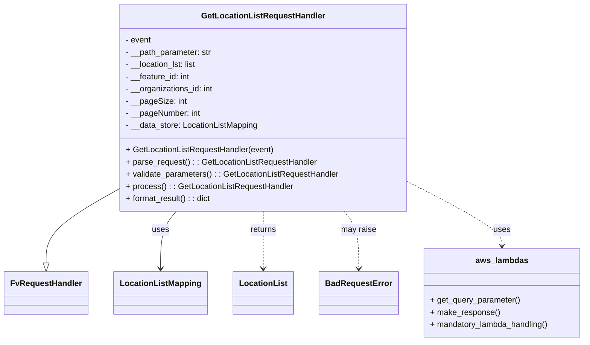

# Diagram: application_service/container_tracking_app_service/event/python_code/location_id_list_handler.py


> Auto-generated by Obscura crawlers

## Diagram 1



### SVG

<svg id="container" width="1121.4453125" xmlns="http://www.w3.org/2000/svg" class="classDiagram" height="672" viewBox="0 0 1121.4453125 672" role="graphics-document document" aria-roledescription="class"><style>#container{font-family:"trebuchet ms",verdana,arial,sans-serif;font-size:16px;fill:#333;}@keyframes edge-animation-frame{from{stroke-dashoffset:0;}}@keyframes dash{to{stroke-dashoffset:0;}}#container .edge-animation-slow{stroke-dasharray:9,5!important;stroke-dashoffset:900;animation:dash 50s linear infinite;stroke-linecap:round;}#container .edge-animation-fast{stroke-dasharray:9,5!important;stroke-dashoffset:900;animation:dash 20s linear infinite;stroke-linecap:round;}#container .error-icon{fill:#552222;}#container .error-text{fill:#552222;stroke:#552222;}#container .edge-thickness-normal{stroke-width:1px;}#container .edge-thickness-thick{stroke-width:3.5px;}#container .edge-pattern-solid{stroke-dasharray:0;}#container .edge-thickness-invisible{stroke-width:0;fill:none;}#container .edge-pattern-dashed{stroke-dasharray:3;}#container .edge-pattern-dotted{stroke-dasharray:2;}#container .marker{fill:#333333;stroke:#333333;}#container .marker.cross{stroke:#333333;}#container svg{font-family:"trebuchet ms",verdana,arial,sans-serif;font-size:16px;}#container p{margin:0;}#container g.classGroup text{fill:#9370DB;stroke:none;font-family:"trebuchet ms",verdana,arial,sans-serif;font-size:10px;}#container g.classGroup text .title{font-weight:bolder;}#container .nodeLabel,#container .edgeLabel{color:#131300;}#container .edgeLabel .label rect{fill:#ECECFF;}#container .label text{fill:#131300;}#container .labelBkg{background:#ECECFF;}#container .edgeLabel .label span{background:#ECECFF;}#container .classTitle{font-weight:bolder;}#container .node rect,#container .node circle,#container .node ellipse,#container .node polygon,#container .node path{fill:#ECECFF;stroke:#9370DB;stroke-width:1px;}#container .divider{stroke:#9370DB;stroke-width:1;}#container g.clickable{cursor:pointer;}#container g.classGroup rect{fill:#ECECFF;stroke:#9370DB;}#container g.classGroup line{stroke:#9370DB;stroke-width:1;}#container .classLabel .box{stroke:none;stroke-width:0;fill:#ECECFF;opacity:0.5;}#container .classLabel .label{fill:#9370DB;font-size:10px;}#container .relation{stroke:#333333;stroke-width:1;fill:none;}#container .dashed-line{stroke-dasharray:3;}#container .dotted-line{stroke-dasharray:1 2;}#container #compositionStart,#container .composition{fill:#333333!important;stroke:#333333!important;stroke-width:1;}#container #compositionEnd,#container .composition{fill:#333333!important;stroke:#333333!important;stroke-width:1;}#container #dependencyStart,#container .dependency{fill:#333333!important;stroke:#333333!important;stroke-width:1;}#container #dependencyStart,#container .dependency{fill:#333333!important;stroke:#333333!important;stroke-width:1;}#container #extensionStart,#container .extension{fill:transparent!important;stroke:#333333!important;stroke-width:1;}#container #extensionEnd,#container .extension{fill:transparent!important;stroke:#333333!important;stroke-width:1;}#container #aggregationStart,#container .aggregation{fill:transparent!important;stroke:#333333!important;stroke-width:1;}#container #aggregationEnd,#container .aggregation{fill:transparent!important;stroke:#333333!important;stroke-width:1;}#container #lollipopStart,#container .lollipop{fill:#ECECFF!important;stroke:#333333!important;stroke-width:1;}#container #lollipopEnd,#container .lollipop{fill:#ECECFF!important;stroke:#333333!important;stroke-width:1;}#container .edgeTerminals{font-size:11px;line-height:initial;}#container .classTitleText{text-anchor:middle;font-size:18px;fill:#333;}#container .label-icon{display:inline-block;height:1em;overflow:visible;vertical-align:-0.125em;}#container .node .label-icon path{fill:currentColor;stroke:revert;stroke-width:revert;}#container :root{--mermaid-font-family:"trebuchet ms",verdana,arial,sans-serif;}</style><g><defs><marker id="container_class-aggregationStart" class="marker aggregation class" refX="18" refY="7" markerWidth="190" markerHeight="240" orient="auto"><path d="M 18,7 L9,13 L1,7 L9,1 Z"></path></marker></defs><defs><marker id="container_class-aggregationEnd" class="marker aggregation class" refX="1" refY="7" markerWidth="20" markerHeight="28" orient="auto"><path d="M 18,7 L9,13 L1,7 L9,1 Z"></path></marker></defs><defs><marker id="container_class-extensionStart" class="marker extension class" refX="18" refY="7" markerWidth="190" markerHeight="240" orient="auto"><path d="M 1,7 L18,13 V 1 Z"></path></marker></defs><defs><marker id="container_class-extensionEnd" class="marker extension class" refX="1" refY="7" markerWidth="20" markerHeight="28" orient="auto"><path d="M 1,1 V 13 L18,7 Z"></path></marker></defs><defs><marker id="container_class-compositionStart" class="marker composition class" refX="18" refY="7" markerWidth="190" markerHeight="240" orient="auto"><path d="M 18,7 L9,13 L1,7 L9,1 Z"></path></marker></defs><defs><marker id="container_class-compositionEnd" class="marker composition class" refX="1" refY="7" markerWidth="20" markerHeight="28" orient="auto"><path d="M 18,7 L9,13 L1,7 L9,1 Z"></path></marker></defs><defs><marker id="container_class-dependencyStart" class="marker dependency class" refX="6" refY="7" markerWidth="190" markerHeight="240" orient="auto"><path d="M 5,7 L9,13 L1,7 L9,1 Z"></path></marker></defs><defs><marker id="container_class-dependencyEnd" class="marker dependency class" refX="13" refY="7" markerWidth="20" markerHeight="28" orient="auto"><path d="M 18,7 L9,13 L14,7 L9,1 Z"></path></marker></defs><defs><marker id="container_class-lollipopStart" class="marker lollipop class" refX="13" refY="7" markerWidth="190" markerHeight="240" orient="auto"><circle stroke="black" fill="transparent" cx="7" cy="7" r="6"></circle></marker></defs><defs><marker id="container_class-lollipopEnd" class="marker lollipop class" refX="1" refY="7" markerWidth="190" markerHeight="240" orient="auto"><circle stroke="black" fill="transparent" cx="7" cy="7" r="6"></circle></marker></defs><g class="root"><g class="clusters"></g><g class="edgePaths"><path d="M217.953,376.233L196.092,389.028C174.232,401.822,130.51,427.411,108.65,450.997C86.789,474.583,86.789,496.167,86.789,506.958L86.789,517.75" id="id_GetLocationListRequestHandler_FvRequestHandler_1" class="edge-thickness-normal edge-pattern-solid relation" style=";;;" data-edge="true" data-et="edge" data-id="id_GetLocationListRequestHandler_FvRequestHandler_1" data-points="W3sieCI6MjE3Ljk1MzEyNSwieSI6Mzc2LjIzMzE3NTg1ODk5NDA2fSx7IngiOjg2Ljc4OTA2MjUsInkiOjQ1M30seyJ4Ijo4Ni43ODkwNjI1LCJ5Ijo1MzV9XQ==" marker-end="url(#container_class-extensionEnd)"></path><path d="M333.652,416L328.667,422.167C323.682,428.333,313.712,440.667,308.727,459.5C303.742,478.333,303.742,503.667,303.742,516.333L303.742,529" id="id_GetLocationListRequestHandler_LocationListMapping_2" class="edge-thickness-normal edge-pattern-solid relation" style=";;;" data-edge="true" data-et="edge" data-id="id_GetLocationListRequestHandler_LocationListMapping_2" data-points="W3sieCI6MzMzLjY1MjM1OTk1ODUwNjIsInkiOjQxNn0seyJ4IjozMDMuNzQyMTg3NSwieSI6NDUzfSx7IngiOjMwMy43NDIxODc1LCJ5Ijo1MzV9XQ==" marker-end="url(#container_class-dependencyEnd)"></path><path d="M498.563,416L498.563,422.167C498.563,428.333,498.563,440.667,498.563,459.5C498.563,478.333,498.563,503.667,498.563,516.333L498.563,529" id="id_GetLocationListRequestHandler_LocationList_3" class="edge-thickness-normal edge-pattern-dashed relation" style=";;;" data-edge="true" data-et="edge" data-id="id_GetLocationListRequestHandler_LocationList_3" data-points="W3sieCI6NDk4LjU2MjUsInkiOjQxNn0seyJ4Ijo0OTguNTYyNSwieSI6NDUzfSx7IngiOjQ5OC41NjI1LCJ5Ijo1MzV9XQ==" marker-end="url(#container_class-dependencyEnd)"></path><path d="M651.721,416L656.351,422.167C660.981,428.333,670.24,440.667,674.87,459.5C679.5,478.333,679.5,503.667,679.5,516.333L679.5,529" id="id_GetLocationListRequestHandler_BadRequestError_4" class="edge-thickness-normal edge-pattern-dashed relation" style=";;;" data-edge="true" data-et="edge" data-id="id_GetLocationListRequestHandler_BadRequestError_4" data-points="W3sieCI6NjUxLjcyMTIxMzY5Mjk0NjEsInkiOjQxNn0seyJ4Ijo2NzkuNSwieSI6NDUzfSx7IngiOjY3OS41LCJ5Ijo1MzV9XQ==" marker-end="url(#container_class-dependencyEnd)"></path><path d="M779.172,358.999L809.079,374.666C838.986,390.332,898.799,421.666,928.706,442.5C958.613,463.333,958.613,473.667,958.613,478.833L958.613,484" id="id_GetLocationListRequestHandler_aws_lambdas_5" class="edge-thickness-normal edge-pattern-dashed relation" style=";;;" data-edge="true" data-et="edge" data-id="id_GetLocationListRequestHandler_aws_lambdas_5" data-points="W3sieCI6Nzc5LjE3MTg3NSwieSI6MzU4Ljk5ODY4MzkwODg3NTUzfSx7IngiOjk1OC42MTMyODEyNSwieSI6NDUzfSx7IngiOjk1OC42MTMyODEyNSwieSI6NDkwfV0=" marker-end="url(#container_class-dependencyEnd)"></path></g><g class="edgeLabels"><g class="edgeLabel"><g class="label" data-id="id_GetLocationListRequestHandler_FvRequestHandler_1" transform="translate(0, 0)"><foreignObject width="0" height="0"><div xmlns="http://www.w3.org/1999/xhtml" class="labelBkg" style="display: table-cell; white-space: nowrap; line-height: 1.5; max-width: 200px; text-align: center;"><span class="edgeLabel"></span></div></foreignObject></g></g><g class="edgeLabel" transform="translate(303.7421875, 453)"><g class="label" data-id="id_GetLocationListRequestHandler_LocationListMapping_2" transform="translate(-16.4921875, -12)"><foreignObject width="32.984375" height="24"><div xmlns="http://www.w3.org/1999/xhtml" class="labelBkg" style="display: table-cell; white-space: nowrap; line-height: 1.5; max-width: 200px; text-align: center;"><span class="edgeLabel"><p>uses</p></span></div></foreignObject></g></g><g class="edgeLabel" transform="translate(498.5625, 453)"><g class="label" data-id="id_GetLocationListRequestHandler_LocationList_3" transform="translate(-26.265625, -12)"><foreignObject width="52.53125" height="24"><div xmlns="http://www.w3.org/1999/xhtml" class="labelBkg" style="display: table-cell; white-space: nowrap; line-height: 1.5; max-width: 200px; text-align: center;"><span class="edgeLabel"><p>returns</p></span></div></foreignObject></g></g><g class="edgeLabel" transform="translate(679.5, 453)"><g class="label" data-id="id_GetLocationListRequestHandler_BadRequestError_4" transform="translate(-34.65625, -12)"><foreignObject width="69.3125" height="24"><div xmlns="http://www.w3.org/1999/xhtml" class="labelBkg" style="display: table-cell; white-space: nowrap; line-height: 1.5; max-width: 200px; text-align: center;"><span class="edgeLabel"><p>may raise</p></span></div></foreignObject></g></g><g class="edgeLabel" transform="translate(958.61328125, 453)"><g class="label" data-id="id_GetLocationListRequestHandler_aws_lambdas_5" transform="translate(-16.4921875, -12)"><foreignObject width="32.984375" height="24"><div xmlns="http://www.w3.org/1999/xhtml" class="labelBkg" style="display: table-cell; white-space: nowrap; line-height: 1.5; max-width: 200px; text-align: center;"><span class="edgeLabel"><p>uses</p></span></div></foreignObject></g></g></g><g class="nodes"><g class="node default" id="classId-GetLocationListRequestHandler-0" transform="translate(498.5625, 212)"><g class="basic label-container"><path d="M-280.609375 -204 L280.609375 -204 L280.609375 204 L-280.609375 204" stroke="none" stroke-width="0" fill="#ECECFF" style=""></path><path d="M-280.609375 -204 C-68.47587779252584 -204, 143.65761941494833 -204, 280.609375 -204 M-280.609375 -204 C-152.52798345260356 -204, -24.44659190520713 -204, 280.609375 -204 M280.609375 -204 C280.609375 -93.07865386370024, 280.609375 17.84269227259952, 280.609375 204 M280.609375 -204 C280.609375 -83.71420098168478, 280.609375 36.571598036630434, 280.609375 204 M280.609375 204 C98.30556491260256 204, -83.99824517479487 204, -280.609375 204 M280.609375 204 C152.6570415522914 204, 24.704708104582778 204, -280.609375 204 M-280.609375 204 C-280.609375 72.34692092496994, -280.609375 -59.30615815006013, -280.609375 -204 M-280.609375 204 C-280.609375 53.39231584033743, -280.609375 -97.21536831932514, -280.609375 -204" stroke="#9370DB" stroke-width="1.3" fill="none" stroke-dasharray="0 0" style=""></path></g><g class="annotation-group text" transform="translate(0, -180)"></g><g class="label-group text" transform="translate(-116.390625, -180)"><g class="label" style="font-weight: bolder" transform="translate(0,-12)"><foreignObject width="232.78125" height="24"><div xmlns="http://www.w3.org/1999/xhtml" style="display: table-cell; white-space: nowrap; line-height: 1.5; max-width: 280px; text-align: center;"><span class="nodeLabel markdown-node-label" style=""><p>GetLocationListRequestHandler</p></span></div></foreignObject></g></g><g class="members-group text" transform="translate(-268.609375, -132)"><g class="label" style="" transform="translate(0,-12)"><foreignObject width="51.03125" height="24"><div xmlns="http://www.w3.org/1999/xhtml" style="display: table-cell; white-space: nowrap; line-height: 1.5; max-width: 109px; text-align: center;"><span class="nodeLabel markdown-node-label" style=""><p>- event</p></span></div></foreignObject></g><g class="label" style="" transform="translate(0,12)"><foreignObject width="171.59375" height="24"><div xmlns="http://www.w3.org/1999/xhtml" style="display: table-cell; white-space: nowrap; line-height: 1.5; max-width: 230px; text-align: center;"><span class="nodeLabel markdown-node-label" style=""><p>- __path_parameter: str</p></span></div></foreignObject></g><g class="label" style="" transform="translate(0,36)"><foreignObject width="142.859375" height="24"><div xmlns="http://www.w3.org/1999/xhtml" style="display: table-cell; white-space: nowrap; line-height: 1.5; max-width: 200px; text-align: center;"><span class="nodeLabel markdown-node-label" style=""><p>- __location_lst: list</p></span></div></foreignObject></g><g class="label" style="" transform="translate(0,60)"><foreignObject width="128.640625" height="24"><div xmlns="http://www.w3.org/1999/xhtml" style="display: table-cell; white-space: nowrap; line-height: 1.5; max-width: 186px; text-align: center;"><span class="nodeLabel markdown-node-label" style=""><p>- __feature_id: int</p></span></div></foreignObject></g><g class="label" style="" transform="translate(0,84)"><foreignObject width="174.5" height="24"><div xmlns="http://www.w3.org/1999/xhtml" style="display: table-cell; white-space: nowrap; line-height: 1.5; max-width: 232px; text-align: center;"><span class="nodeLabel markdown-node-label" style=""><p>- __organizations_id: int</p></span></div></foreignObject></g><g class="label" style="" transform="translate(0,108)"><foreignObject width="118.421875" height="24"><div xmlns="http://www.w3.org/1999/xhtml" style="display: table-cell; white-space: nowrap; line-height: 1.5; max-width: 176px; text-align: center;"><span class="nodeLabel markdown-node-label" style=""><p>- __pageSize: int</p></span></div></foreignObject></g><g class="label" style="" transform="translate(0,132)"><foreignObject width="148.109375" height="24"><div xmlns="http://www.w3.org/1999/xhtml" style="display: table-cell; white-space: nowrap; line-height: 1.5; max-width: 206px; text-align: center;"><span class="nodeLabel markdown-node-label" style=""><p>- __pageNumber: int</p></span></div></foreignObject></g><g class="label" style="" transform="translate(0,156)"><foreignObject width="262.875" height="24"><div xmlns="http://www.w3.org/1999/xhtml" style="display: table-cell; white-space: nowrap; line-height: 1.5; max-width: 321px; text-align: center;"><span class="nodeLabel markdown-node-label" style=""><p>- __data_store: LocationListMapping</p></span></div></foreignObject></g></g><g class="methods-group text" transform="translate(-268.609375, 84)"><g class="label" style="" transform="translate(0,-12)"><foreignObject width="292.40625" height="24"><div xmlns="http://www.w3.org/1999/xhtml" style="display: table-cell; white-space: nowrap; line-height: 1.5; max-width: 350px; text-align: center;"><span class="nodeLabel markdown-node-label" style=""><p>+ GetLocationListRequestHandler(event)</p></span></div></foreignObject></g><g class="label" style="" transform="translate(0,12)"><foreignObject width="375.90625" height="24"><div xmlns="http://www.w3.org/1999/xhtml" style="display: table-cell; white-space: nowrap; line-height: 1.5; max-width: 434px; text-align: center;"><span class="nodeLabel markdown-node-label" style=""><p>+ parse_request() : : GetLocationListRequestHandler</p></span></div></foreignObject></g><g class="label" style="" transform="translate(0,36)"><foreignObject width="420.828125" height="24"><div xmlns="http://www.w3.org/1999/xhtml" style="display: table-cell; white-space: nowrap; line-height: 1.5; max-width: 479px; text-align: center;"><span class="nodeLabel markdown-node-label" style=""><p>+ validate_parameters() : : GetLocationListRequestHandler</p></span></div></foreignObject></g><g class="label" style="" transform="translate(0,60)"><foreignObject width="327.84375" height="24"><div xmlns="http://www.w3.org/1999/xhtml" style="display: table-cell; white-space: nowrap; line-height: 1.5; max-width: 386px; text-align: center;"><span class="nodeLabel markdown-node-label" style=""><p>+ process() : : GetLocationListRequestHandler</p></span></div></foreignObject></g><g class="label" style="" transform="translate(0,84)"><foreignObject width="169.40625" height="24"><div xmlns="http://www.w3.org/1999/xhtml" style="display: table-cell; white-space: nowrap; line-height: 1.5; max-width: 227px; text-align: center;"><span class="nodeLabel markdown-node-label" style=""><p>+ format_result() : : dict</p></span></div></foreignObject></g></g><g class="divider" style=""><path d="M-280.609375 -156 C-141.81899330548012 -156, -3.0286116109602403 -156, 280.609375 -156 M-280.609375 -156 C-100.08358046195048 -156, 80.44221407609905 -156, 280.609375 -156" stroke="#9370DB" stroke-width="1.3" fill="none" stroke-dasharray="0 0" style=""></path></g><g class="divider" style=""><path d="M-280.609375 60 C-126.68597701874208 60, 27.23742096251584 60, 280.609375 60 M-280.609375 60 C-156.23896418854423 60, -31.86855337708849 60, 280.609375 60" stroke="#9370DB" stroke-width="1.3" fill="none" stroke-dasharray="0 0" style=""></path></g></g><g class="node default" id="classId-FvRequestHandler-1" transform="translate(86.7890625, 577)"><g class="basic label-container"><path d="M-78.7890625 -42 L78.7890625 -42 L78.7890625 42 L-78.7890625 42" stroke="none" stroke-width="0" fill="#ECECFF" style=""></path><path d="M-78.7890625 -42 C-42.0250673740206 -42, -5.261072248041202 -42, 78.7890625 -42 M-78.7890625 -42 C-29.113313243716078 -42, 20.562436012567844 -42, 78.7890625 -42 M78.7890625 -42 C78.7890625 -9.135087603645609, 78.7890625 23.729824792708783, 78.7890625 42 M78.7890625 -42 C78.7890625 -18.68947207702075, 78.7890625 4.621055845958502, 78.7890625 42 M78.7890625 42 C19.454490210145245 42, -39.88008207970951 42, -78.7890625 42 M78.7890625 42 C24.64462780386461 42, -29.499806892270783 42, -78.7890625 42 M-78.7890625 42 C-78.7890625 20.497615624854298, -78.7890625 -1.0047687502914044, -78.7890625 -42 M-78.7890625 42 C-78.7890625 24.0583215401392, -78.7890625 6.116643080278401, -78.7890625 -42" stroke="#9370DB" stroke-width="1.3" fill="none" stroke-dasharray="0 0" style=""></path></g><g class="annotation-group text" transform="translate(0, -18)"></g><g class="label-group text" transform="translate(-66.7890625, -18)"><g class="label" style="font-weight: bolder" transform="translate(0,-12)"><foreignObject width="133.578125" height="24"><div xmlns="http://www.w3.org/1999/xhtml" style="display: table-cell; white-space: nowrap; line-height: 1.5; max-width: 183px; text-align: center;"><span class="nodeLabel markdown-node-label" style=""><p>FvRequestHandler</p></span></div></foreignObject></g></g><g class="members-group text" transform="translate(-66.7890625, 30)"></g><g class="methods-group text" transform="translate(-66.7890625, 60)"></g><g class="divider" style=""><path d="M-78.7890625 6 C-29.30845425286069 6, 20.172153994278617 6, 78.7890625 6 M-78.7890625 6 C-20.08294958088704 6, 38.62316333822592 6, 78.7890625 6" stroke="#9370DB" stroke-width="1.3" fill="none" stroke-dasharray="0 0" style=""></path></g><g class="divider" style=""><path d="M-78.7890625 24 C-47.14637900645543 24, -15.503695512910873 24, 78.7890625 24 M-78.7890625 24 C-27.863018133630817 24, 23.063026232738366 24, 78.7890625 24" stroke="#9370DB" stroke-width="1.3" fill="none" stroke-dasharray="0 0" style=""></path></g></g><g class="node default" id="classId-LocationListMapping-2" transform="translate(303.7421875, 577)"><g class="basic label-container"><path d="M-88.1640625 -42 L88.1640625 -42 L88.1640625 42 L-88.1640625 42" stroke="none" stroke-width="0" fill="#ECECFF" style=""></path><path d="M-88.1640625 -42 C-45.60752511363458 -42, -3.0509877272691597 -42, 88.1640625 -42 M-88.1640625 -42 C-32.0886003664319 -42, 23.986861767136205 -42, 88.1640625 -42 M88.1640625 -42 C88.1640625 -17.385729842731163, 88.1640625 7.228540314537675, 88.1640625 42 M88.1640625 -42 C88.1640625 -17.84963545474189, 88.1640625 6.300729090516221, 88.1640625 42 M88.1640625 42 C52.76751166076276 42, 17.370960821525514 42, -88.1640625 42 M88.1640625 42 C31.02276487087932 42, -26.118532758241358 42, -88.1640625 42 M-88.1640625 42 C-88.1640625 20.52041658077886, -88.1640625 -0.9591668384422789, -88.1640625 -42 M-88.1640625 42 C-88.1640625 11.777932503504498, -88.1640625 -18.444134992991003, -88.1640625 -42" stroke="#9370DB" stroke-width="1.3" fill="none" stroke-dasharray="0 0" style=""></path></g><g class="annotation-group text" transform="translate(0, -18)"></g><g class="label-group text" transform="translate(-76.1640625, -18)"><g class="label" style="font-weight: bolder" transform="translate(0,-12)"><foreignObject width="152.328125" height="24"><div xmlns="http://www.w3.org/1999/xhtml" style="display: table-cell; white-space: nowrap; line-height: 1.5; max-width: 201px; text-align: center;"><span class="nodeLabel markdown-node-label" style=""><p>LocationListMapping</p></span></div></foreignObject></g></g><g class="members-group text" transform="translate(-76.1640625, 30)"></g><g class="methods-group text" transform="translate(-76.1640625, 60)"></g><g class="divider" style=""><path d="M-88.1640625 6 C-19.72060188873421 6, 48.72285872253158 6, 88.1640625 6 M-88.1640625 6 C-31.4998159668342 6, 25.164430566331603 6, 88.1640625 6" stroke="#9370DB" stroke-width="1.3" fill="none" stroke-dasharray="0 0" style=""></path></g><g class="divider" style=""><path d="M-88.1640625 24 C-30.099222861333025 24, 27.96561677733395 24, 88.1640625 24 M-88.1640625 24 C-18.86497445293851 24, 50.43411359412298 24, 88.1640625 24" stroke="#9370DB" stroke-width="1.3" fill="none" stroke-dasharray="0 0" style=""></path></g></g><g class="node default" id="classId-LocationList-3" transform="translate(498.5625, 577)"><g class="basic label-container"><path d="M-56.65625 -42 L56.65625 -42 L56.65625 42 L-56.65625 42" stroke="none" stroke-width="0" fill="#ECECFF" style=""></path><path d="M-56.65625 -42 C-16.591366725427854 -42, 23.473516549144293 -42, 56.65625 -42 M-56.65625 -42 C-31.19727800177343 -42, -5.73830600354686 -42, 56.65625 -42 M56.65625 -42 C56.65625 -24.313138813959835, 56.65625 -6.62627762791967, 56.65625 42 M56.65625 -42 C56.65625 -9.399696979783066, 56.65625 23.20060604043387, 56.65625 42 M56.65625 42 C18.83916332872866 42, -18.97792334254268 42, -56.65625 42 M56.65625 42 C32.517284202155494 42, 8.378318404310988 42, -56.65625 42 M-56.65625 42 C-56.65625 17.302115210251007, -56.65625 -7.395769579497987, -56.65625 -42 M-56.65625 42 C-56.65625 22.65720005004926, -56.65625 3.314400100098517, -56.65625 -42" stroke="#9370DB" stroke-width="1.3" fill="none" stroke-dasharray="0 0" style=""></path></g><g class="annotation-group text" transform="translate(0, -18)"></g><g class="label-group text" transform="translate(-44.65625, -18)"><g class="label" style="font-weight: bolder" transform="translate(0,-12)"><foreignObject width="89.3125" height="24"><div xmlns="http://www.w3.org/1999/xhtml" style="display: table-cell; white-space: nowrap; line-height: 1.5; max-width: 138px; text-align: center;"><span class="nodeLabel markdown-node-label" style=""><p>LocationList</p></span></div></foreignObject></g></g><g class="members-group text" transform="translate(-44.65625, 30)"></g><g class="methods-group text" transform="translate(-44.65625, 60)"></g><g class="divider" style=""><path d="M-56.65625 6 C-12.846253472468781 6, 30.963743055062437 6, 56.65625 6 M-56.65625 6 C-32.94156797536977 6, -9.226885950739543 6, 56.65625 6" stroke="#9370DB" stroke-width="1.3" fill="none" stroke-dasharray="0 0" style=""></path></g><g class="divider" style=""><path d="M-56.65625 24 C-30.955532378954462 24, -5.254814757908925 24, 56.65625 24 M-56.65625 24 C-31.293073947269182 24, -5.929897894538364 24, 56.65625 24" stroke="#9370DB" stroke-width="1.3" fill="none" stroke-dasharray="0 0" style=""></path></g></g><g class="node default" id="classId-BadRequestError-4" transform="translate(679.5, 577)"><g class="basic label-container"><path d="M-74.28125 -42 L74.28125 -42 L74.28125 42 L-74.28125 42" stroke="none" stroke-width="0" fill="#ECECFF" style=""></path><path d="M-74.28125 -42 C-41.00962141011514 -42, -7.737992820230275 -42, 74.28125 -42 M-74.28125 -42 C-38.03835903092047 -42, -1.7954680618409355 -42, 74.28125 -42 M74.28125 -42 C74.28125 -17.17038406418236, 74.28125 7.659231871635278, 74.28125 42 M74.28125 -42 C74.28125 -10.404091665893532, 74.28125 21.191816668212937, 74.28125 42 M74.28125 42 C21.21472087046412 42, -31.85180825907176 42, -74.28125 42 M74.28125 42 C44.12454085172253 42, 13.967831703445064 42, -74.28125 42 M-74.28125 42 C-74.28125 11.26821841700697, -74.28125 -19.46356316598606, -74.28125 -42 M-74.28125 42 C-74.28125 24.810631322350662, -74.28125 7.621262644701325, -74.28125 -42" stroke="#9370DB" stroke-width="1.3" fill="none" stroke-dasharray="0 0" style=""></path></g><g class="annotation-group text" transform="translate(0, -18)"></g><g class="label-group text" transform="translate(-62.28125, -18)"><g class="label" style="font-weight: bolder" transform="translate(0,-12)"><foreignObject width="124.5625" height="24"><div xmlns="http://www.w3.org/1999/xhtml" style="display: table-cell; white-space: nowrap; line-height: 1.5; max-width: 174px; text-align: center;"><span class="nodeLabel markdown-node-label" style=""><p>BadRequestError</p></span></div></foreignObject></g></g><g class="members-group text" transform="translate(-62.28125, 30)"></g><g class="methods-group text" transform="translate(-62.28125, 60)"></g><g class="divider" style=""><path d="M-74.28125 6 C-41.142167004250844 6, -8.003084008501688 6, 74.28125 6 M-74.28125 6 C-25.91045380284976 6, 22.460342394300483 6, 74.28125 6" stroke="#9370DB" stroke-width="1.3" fill="none" stroke-dasharray="0 0" style=""></path></g><g class="divider" style=""><path d="M-74.28125 24 C-37.872331521331084 24, -1.463413042662168 24, 74.28125 24 M-74.28125 24 C-33.17606736635738 24, 7.9291152672852405 24, 74.28125 24" stroke="#9370DB" stroke-width="1.3" fill="none" stroke-dasharray="0 0" style=""></path></g></g><g class="node default" id="classId-aws_lambdas-5" transform="translate(958.61328125, 577)"><g class="basic label-container"><path d="M-154.83203125 -87 L154.83203125 -87 L154.83203125 87 L-154.83203125 87" stroke="none" stroke-width="0" fill="#ECECFF" style=""></path><path d="M-154.83203125 -87 C-58.356838114114765 -87, 38.11835502177047 -87, 154.83203125 -87 M-154.83203125 -87 C-36.249382166063285 -87, 82.33326691787343 -87, 154.83203125 -87 M154.83203125 -87 C154.83203125 -35.16204091149506, 154.83203125 16.675918177009876, 154.83203125 87 M154.83203125 -87 C154.83203125 -44.77005596417398, 154.83203125 -2.5401119283479545, 154.83203125 87 M154.83203125 87 C71.73484293274483 87, -11.362345384510348 87, -154.83203125 87 M154.83203125 87 C75.25357652347725 87, -4.3248782030455 87, -154.83203125 87 M-154.83203125 87 C-154.83203125 20.078387310062425, -154.83203125 -46.84322537987515, -154.83203125 -87 M-154.83203125 87 C-154.83203125 27.790180602932246, -154.83203125 -31.41963879413551, -154.83203125 -87" stroke="#9370DB" stroke-width="1.3" fill="none" stroke-dasharray="0 0" style=""></path></g><g class="annotation-group text" transform="translate(0, -63)"></g><g class="label-group text" transform="translate(-49.3515625, -63)"><g class="label" style="font-weight: bolder" transform="translate(0,-12)"><foreignObject width="98.703125" height="24"><div xmlns="http://www.w3.org/1999/xhtml" style="display: table-cell; white-space: nowrap; line-height: 1.5; max-width: 148px; text-align: center;"><span class="nodeLabel markdown-node-label" style=""><p>aws_lambdas</p></span></div></foreignObject></g></g><g class="members-group text" transform="translate(-142.83203125, -15)"></g><g class="methods-group text" transform="translate(-142.83203125, 15)"><g class="label" style="" transform="translate(0,-12)"><foreignObject width="177.875" height="24"><div xmlns="http://www.w3.org/1999/xhtml" style="display: table-cell; white-space: nowrap; line-height: 1.5; max-width: 235px; text-align: center;"><span class="nodeLabel markdown-node-label" style=""><p>+ get_query_parameter()</p></span></div></foreignObject></g><g class="label" style="" transform="translate(0,12)"><foreignObject width="136.09375" height="24"><div xmlns="http://www.w3.org/1999/xhtml" style="display: table-cell; white-space: nowrap; line-height: 1.5; max-width: 193px; text-align: center;"><span class="nodeLabel markdown-node-label" style=""><p>+ make_response()</p></span></div></foreignObject></g><g class="label" style="" transform="translate(0,36)"><foreignObject width="236.3125" height="24"><div xmlns="http://www.w3.org/1999/xhtml" style="display: table-cell; white-space: nowrap; line-height: 1.5; max-width: 294px; text-align: center;"><span class="nodeLabel markdown-node-label" style=""><p>+ mandatory_lambda_handling()</p></span></div></foreignObject></g></g><g class="divider" style=""><path d="M-154.83203125 -39 C-34.80686171357837 -39, 85.21830782284326 -39, 154.83203125 -39 M-154.83203125 -39 C-87.01445249264741 -39, -19.196873735294815 -39, 154.83203125 -39" stroke="#9370DB" stroke-width="1.3" fill="none" stroke-dasharray="0 0" style=""></path></g><g class="divider" style=""><path d="M-154.83203125 -15 C-49.49777061279602 -15, 55.836490024407965 -15, 154.83203125 -15 M-154.83203125 -15 C-81.99587365320599 -15, -9.15971605641198 -15, 154.83203125 -15" stroke="#9370DB" stroke-width="1.3" fill="none" stroke-dasharray="0 0" style=""></path></g></g></g></g></g></svg>

## Diagram 2

```mermaid
sequenceDiagram
    participant Lambda as lambda_handler
    participant Handler as GetLocationListRequestHandler
    participant Utils as aws.lambdas
    participant DS as LocationListMapping
    Lambda->>Handler: instantiate(event)
    Handler->>Utils: get_query_parameter(...) (parse_request)
    Utils-->>Handler: query parameters
    Handler->>Handler: validate_parameters()
    alt validation fails
        Handler-->>Lambda: raise BadRequestError
    else validation succeeds
        Handler->>DS: select_count(query)
        DS-->>Handler: count
        Handler->>DS: search(query)
        DS-->>Handler: LocationList[]
        Handler->>Handler: format_result()
        Handler->>Utils: make_response(result, HTTPStatus.OK)
        Utils-->>Lambda: HTTP response (200)
```

> SVG rendering failed for this diagram.
