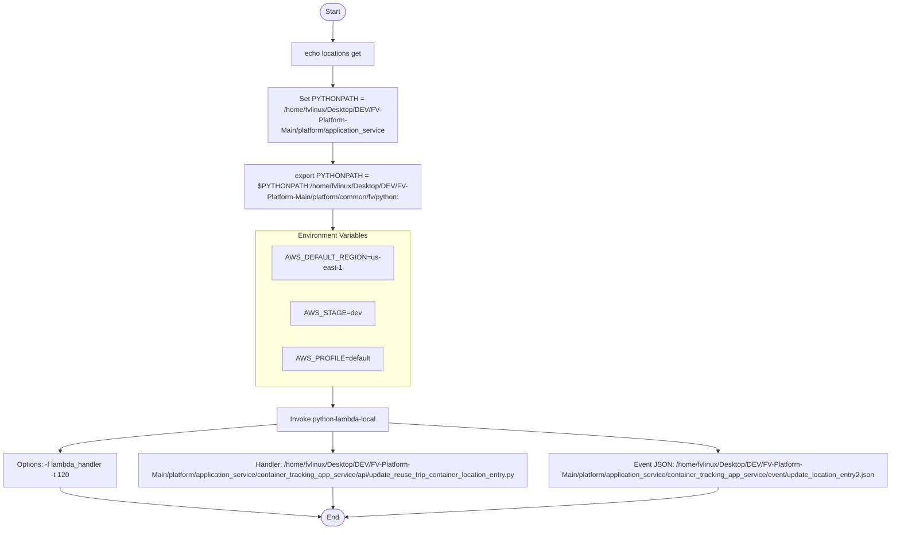

# Diagram: application_service/container_tracking_app_service/event/update_location_entry.sh

> Auto-generated by Obscura crawlers

## Mermaid

### SVG

<svg id="container" width="2120.203125" xmlns="http://www.w3.org/2000/svg" class="flowchart" height="1238" viewBox="0 0 2120.203125 1238" role="graphics-document document" aria-roledescription="flowchart-v2"><g><marker id="container_flowchart-v2-pointEnd" class="marker flowchart-v2" viewBox="0 0 10 10" refX="5" refY="5" markerUnits="userSpaceOnUse" markerWidth="8" markerHeight="8" orient="auto"><path d="M 0 0 L 10 5 L 0 10 z" class="arrowMarkerPath" style="stroke-width: 1; stroke-dasharray: 1, 0;"></path></marker><marker id="container_flowchart-v2-pointStart" class="marker flowchart-v2" viewBox="0 0 10 10" refX="4.5" refY="5" markerUnits="userSpaceOnUse" markerWidth="8" markerHeight="8" orient="auto"><path d="M 0 5 L 10 10 L 10 0 z" class="arrowMarkerPath" style="stroke-width: 1; stroke-dasharray: 1, 0;"></path></marker><marker id="container_flowchart-v2-circleEnd" class="marker flowchart-v2" viewBox="0 0 10 10" refX="11" refY="5" markerUnits="userSpaceOnUse" markerWidth="11" markerHeight="11" orient="auto"><circle cx="5" cy="5" r="5" class="arrowMarkerPath" style="stroke-width: 1; stroke-dasharray: 1, 0;"></circle></marker><marker id="container_flowchart-v2-circleStart" class="marker flowchart-v2" viewBox="0 0 10 10" refX="-1" refY="5" markerUnits="userSpaceOnUse" markerWidth="11" markerHeight="11" orient="auto"><circle cx="5" cy="5" r="5" class="arrowMarkerPath" style="stroke-width: 1; stroke-dasharray: 1, 0;"></circle></marker><marker id="container_flowchart-v2-crossEnd" class="marker cross flowchart-v2" viewBox="0 0 11 11" refX="12" refY="5.2" markerUnits="userSpaceOnUse" markerWidth="11" markerHeight="11" orient="auto"><path d="M 1,1 l 9,9 M 10,1 l -9,9" class="arrowMarkerPath" style="stroke-width: 2; stroke-dasharray: 1, 0;"></path></marker><marker id="container_flowchart-v2-crossStart" class="marker cross flowchart-v2" viewBox="0 0 11 11" refX="-1" refY="5.2" markerUnits="userSpaceOnUse" markerWidth="11" markerHeight="11" orient="auto"><path d="M 1,1 l 9,9 M 10,1 l -9,9" class="arrowMarkerPath" style="stroke-width: 2; stroke-dasharray: 1, 0;"></path></marker><g class="root"><g class="clusters"></g><g class="edgePaths"><path d="M784.078,47.5L783.995,51.583C783.911,55.667,783.745,63.833,783.661,71.417C783.578,79,783.578,86,783.578,89.5L783.578,93" id="L_Start_Echo_0" class="edge-thickness-normal edge-pattern-solid edge-thickness-normal edge-pattern-solid flowchart-link" style=";" data-edge="true" data-et="edge" data-id="L_Start_Echo_0" data-points="W3sieCI6Nzg0LjA3ODEyNSwieSI6NDcuNX0seyJ4Ijo3ODMuNTc4MTI1LCJ5Ijo3Mn0seyJ4Ijo3ODMuNTc4MTI1LCJ5Ijo5N31d" marker-end="url(#container_flowchart-v2-pointEnd)"></path><path d="M783.578,151L783.578,155.167C783.578,159.333,783.578,167.667,783.578,175.333C783.578,183,783.578,190,783.578,193.5L783.578,197" id="L_Echo_SetPY_0" class="edge-thickness-normal edge-pattern-solid edge-thickness-normal edge-pattern-solid flowchart-link" style=";" data-edge="true" data-et="edge" data-id="L_Echo_SetPY_0" data-points="W3sieCI6NzgzLjU3ODEyNSwieSI6MTUxfSx7IngiOjc4My41NzgxMjUsInkiOjE3Nn0seyJ4Ijo3ODMuNTc4MTI1LCJ5IjoyMDF9XQ==" marker-end="url(#container_flowchart-v2-pointEnd)"></path><path d="M783.578,327L783.578,331.167C783.578,335.333,783.578,343.667,783.578,351.333C783.578,359,783.578,366,783.578,369.5L783.578,373" id="L_SetPY_ExportPY_0" class="edge-thickness-normal edge-pattern-solid edge-thickness-normal edge-pattern-solid flowchart-link" style=";" data-edge="true" data-et="edge" data-id="L_SetPY_ExportPY_0" data-points="W3sieCI6NzgzLjU3ODEyNSwieSI6MzI3fSx7IngiOjc4My41NzgxMjUsInkiOjM1Mn0seyJ4Ijo3ODMuNTc4MTI1LCJ5IjozNzd9XQ==" marker-end="url(#container_flowchart-v2-pointEnd)"></path><path d="M653.578,986.888L567.648,995.406C481.719,1003.925,309.859,1020.963,223.93,1032.981C138,1045,138,1052,138,1055.5L138,1059" id="L_RunCmd_Opts_0" class="edge-thickness-normal edge-pattern-solid edge-thickness-normal edge-pattern-solid flowchart-link" style=";" data-edge="true" data-et="edge" data-id="L_RunCmd_Opts_0" data-points="W3sieCI6NjUzLjU3ODEyNSwieSI6OTg2Ljg4NzY3MzM1NDc5MzR9LHsieCI6MTM4LCJ5IjoxMDM4fSx7IngiOjEzOCwieSI6MTA2M31d" marker-end="url(#container_flowchart-v2-pointEnd)"></path><path d="M783.578,1013L783.578,1017.167C783.578,1021.333,783.578,1029.667,783.578,1037.333C783.578,1045,783.578,1052,783.578,1055.5L783.578,1059" id="L_RunCmd_Script_0" class="edge-thickness-normal edge-pattern-solid edge-thickness-normal edge-pattern-solid flowchart-link" style=";" data-edge="true" data-et="edge" data-id="L_RunCmd_Script_0" data-points="W3sieCI6NzgzLjU3ODEyNSwieSI6MTAxM30seyJ4Ijo3ODMuNTc4MTI1LCJ5IjoxMDM4fSx7IngiOjc4My41NzgxMjUsInkiOjEwNjN9XQ==" marker-end="url(#container_flowchart-v2-pointEnd)"></path><path d="M913.578,983.023L1045.595,992.186C1177.612,1001.349,1441.646,1019.674,1573.663,1032.337C1705.68,1045,1705.68,1052,1705.68,1055.5L1705.68,1059" id="L_RunCmd_Event_0" class="edge-thickness-normal edge-pattern-solid edge-thickness-normal edge-pattern-solid flowchart-link" style=";" data-edge="true" data-et="edge" data-id="L_RunCmd_Event_0" data-points="W3sieCI6OTEzLjU3ODEyNSwieSI6OTgzLjAyMjg2NzI2MTQzNTd9LHsieCI6MTcwNS42Nzk2ODc1LCJ5IjoxMDM4fSx7IngiOjE3MDUuNjc5Njg3NSwieSI6MTA2M31d" marker-end="url(#container_flowchart-v2-pointEnd)"></path><path d="M138,1141L138,1145.167C138,1149.333,138,1157.667,240.686,1168.989C343.373,1180.311,548.745,1194.621,651.432,1201.777L754.118,1208.932" id="L_Opts_End_0" class="edge-thickness-normal edge-pattern-solid edge-thickness-normal edge-pattern-solid flowchart-link" style=";" data-edge="true" data-et="edge" data-id="L_Opts_End_0" data-points="W3sieCI6MTM4LCJ5IjoxMTQxfSx7IngiOjEzOCwieSI6MTE2Nn0seyJ4Ijo3NTguMTA4MjU5MjkxMjI2NSwieSI6MTIwOS4yMDk4ODUwOTQ3ODkzfV0=" marker-end="url(#container_flowchart-v2-pointEnd)"></path><path d="M783.578,1141L783.578,1145.167C783.578,1149.333,783.578,1157.667,783.648,1165.417C783.719,1173.167,783.859,1180.334,783.929,1183.917L784,1187.501" id="L_Script_End_0" class="edge-thickness-normal edge-pattern-solid edge-thickness-normal edge-pattern-solid flowchart-link" style=";" data-edge="true" data-et="edge" data-id="L_Script_End_0" data-points="W3sieCI6NzgzLjU3ODEyNSwieSI6MTE0MX0seyJ4Ijo3ODMuNTc4MTI1LCJ5IjoxMTY2fSx7IngiOjc4NC4wNzgxMjUsInkiOjExOTEuNX1d" marker-end="url(#container_flowchart-v2-pointEnd)"></path><path d="M1705.68,1141L1705.68,1145.167C1705.68,1149.333,1705.68,1157.667,1557.079,1169.092C1408.479,1180.517,1111.278,1195.033,962.678,1202.292L814.078,1209.55" id="L_Event_End_0" class="edge-thickness-normal edge-pattern-solid edge-thickness-normal edge-pattern-solid flowchart-link" style=";" data-edge="true" data-et="edge" data-id="L_Event_End_0" data-points="W3sieCI6MTcwNS42Nzk2ODc1LCJ5IjoxMTQxfSx7IngiOjE3MDUuNjc5Njg3NSwieSI6MTE2Nn0seyJ4Ijo4MTAuMDgyMzUwNzAyOTMwMywieSI6MTIwOS43NDUwNTM1OTE4ODA4fV0=" marker-end="url(#container_flowchart-v2-pointEnd)"></path><path d="M783.578,479L783.578,483.167C783.578,487.333,783.578,495.667,783.578,503.333C783.578,511,783.578,518,783.578,521.5L783.578,525" id="L_ExportPY_ENV_0" class="edge-thickness-normal edge-pattern-solid edge-thickness-normal edge-pattern-solid flowchart-link" style=";" data-edge="true" data-et="edge" data-id="L_ExportPY_ENV_0" data-points="W3sieCI6NzgzLjU3ODEyNSwieSI6NDc5fSx7IngiOjc4My41NzgxMjUsInkiOjUwNH0seyJ4Ijo3ODMuNTc4MTI1LCJ5Ijo1Mjl9XQ==" marker-end="url(#container_flowchart-v2-pointEnd)"></path><path d="M783.578,885L783.578,889.167C783.578,893.333,783.578,901.667,783.578,909.333C783.578,917,783.578,924,783.578,927.5L783.578,931" id="L_ENV_RunCmd_0" class="edge-thickness-normal edge-pattern-solid edge-thickness-normal edge-pattern-solid flowchart-link" style=";" data-edge="true" data-et="edge" data-id="L_ENV_RunCmd_0" data-points="W3sieCI6NzgzLjU3ODEyNSwieSI6ODg1fSx7IngiOjc4My41NzgxMjUsInkiOjkxMH0seyJ4Ijo3ODMuNTc4MTI1LCJ5Ijo5MzV9XQ==" marker-end="url(#container_flowchart-v2-pointEnd)"></path></g><g class="edgeLabels"><g class="edgeLabel"><g class="label" data-id="L_Start_Echo_0" transform="translate(0, 0)"><foreignObject width="0" height="0">

</foreignObject></g></g><g class="edgeLabel"><g class="label" data-id="L_Echo_SetPY_0" transform="translate(0, 0)"><foreignObject width="0" height="0">

</foreignObject></g></g><g class="edgeLabel"><g class="label" data-id="L_SetPY_ExportPY_0" transform="translate(0, 0)"><foreignObject width="0" height="0">

</foreignObject></g></g><g class="edgeLabel"><g class="label" data-id="L_RunCmd_Opts_0" transform="translate(0, 0)"><foreignObject width="0" height="0">

</foreignObject></g></g><g class="edgeLabel"><g class="label" data-id="L_RunCmd_Script_0" transform="translate(0, 0)"><foreignObject width="0" height="0">

</foreignObject></g></g><g class="edgeLabel"><g class="label" data-id="L_RunCmd_Event_0" transform="translate(0, 0)"><foreignObject width="0" height="0">

</foreignObject></g></g><g class="edgeLabel"><g class="label" data-id="L_Opts_End_0" transform="translate(0, 0)"><foreignObject width="0" height="0">

</foreignObject></g></g><g class="edgeLabel"><g class="label" data-id="L_Script_End_0" transform="translate(0, 0)"><foreignObject width="0" height="0">

</foreignObject></g></g><g class="edgeLabel"><g class="label" data-id="L_Event_End_0" transform="translate(0, 0)"><foreignObject width="0" height="0">

</foreignObject></g></g><g class="edgeLabel"><g class="label" data-id="L_ExportPY_ENV_0" transform="translate(0, 0)"><foreignObject width="0" height="0">

</foreignObject></g></g><g class="edgeLabel"><g class="label" data-id="L_ENV_RunCmd_0" transform="translate(0, 0)"><foreignObject width="0" height="0">

</foreignObject></g></g></g><g class="nodes"><g class="root" transform="translate(608.078125, 521)"><g class="clusters"><g class="cluster" id="ENV" data-look="classic"><rect style="" x="8" y="8" width="335" height="356"></rect><g class="cluster-label" transform="translate(94.0234375, 8)"><foreignObject width="162.953125" height="24">

Environment Variables

</foreignObject></g></g></g><g class="edgePaths"></g><g class="edgeLabels"></g><g class="nodes"><g class="node default" id="flowchart-R1-8" transform="translate(175.5, 82)"><rect class="basic label-container" style="" x="-130" y="-39" width="260" height="78"></rect><g class="label" style="" transform="translate(-100, -24)"><rect></rect><foreignObject width="200" height="48">

AWS_DEFAULT_REGION=us-east-1

</foreignObject></g></g><g class="node default" id="flowchart-R2-9" transform="translate(175.5, 198)"><rect class="basic label-container" style="" x="-88.0390625" y="-27" width="176.078125" height="54"></rect><g class="label" style="" transform="translate(-58.0390625, -12)"><rect></rect><foreignObject width="116.078125" height="24">

AWS_STAGE=dev

</foreignObject></g></g><g class="node default" id="flowchart-R3-10" transform="translate(175.5, 302)"><rect class="basic label-container" style="" x="-108.7890625" y="-27" width="217.578125" height="54"></rect><g class="label" style="" transform="translate(-78.7890625, -12)"><rect></rect><foreignObject width="157.578125" height="24">

AWS_PROFILE=default

</foreignObject></g></g></g></g><g class="node default" id="flowchart-Start-0" transform="translate(783.578125, 27.5)"><g class="basic label-container outer-path"><path d="M-10.3984375 -19.5 C-4.545296839200728 -19.5, 1.307843821598544 -19.5, 10.3984375 -19.5 C10.3984375 -19.5, 10.398437499999998 -19.5, 10.398437499999998 -19.5 C10.866124994432264 -19.48500217235204, 11.33381248886453 -19.470004344704083, 11.6478067896239 -19.45993515863156 C11.90778860843931 -19.434855025244318, 12.16777042725472 -19.40977489185708, 12.892042152847864 -19.3399052695533 C13.19268614528203 -19.291299480385526, 13.493330137716196 -19.242693691217752, 14.126030759676757 -19.140403561325776 C14.554505286782899 -19.042607046571394, 14.982979813889038 -18.944810531817012, 15.34470188623539 -18.862249829261074 C15.81946231639278 -18.721343425658713, 16.29422274655017 -18.58043702205635, 16.543047751460602 -18.50658706670804 C16.892635991320073 -18.377935362881487, 17.24222423117955 -18.24928365905494, 17.716144095147794 -18.074876768247425 C18.069850408469193 -17.918301475665032, 18.423556721790593 -17.76172618308264, 18.85917041279238 -17.568892924097174 C19.144174398378222 -17.420206527370805, 19.429178383964064 -17.271520130644436, 19.967429764076783 -16.990714730406097 C20.23300277979336 -16.829722807598433, 20.498575795509936 -16.668730884790772, 21.036368073605697 -16.342718045390892 C21.312309322049007 -16.15023337578096, 21.588250570492313 -15.957748706171031, 22.061592844578712 -15.627565626425154 C22.401851464972808 -15.356218431323022, 22.742110085366903 -15.084871236220891, 23.03889120850187 -14.848196188198123 C23.279312778187894 -14.629851679815426, 23.51973434787392 -14.411507171432728, 23.964247236767985 -14.007812326905688 C24.28745532291802 -13.674073442078402, 24.610663409068056 -13.340334557251118, 24.833858442968648 -13.10986736009568 C25.011000230268515 -12.901786537080019, 25.188142017568378 -12.693705714064357, 25.644151408126582 -12.158051136245305 C25.7996125509309 -11.949747367688984, 25.95507369373522 -11.741443599132662, 26.391796464640635 -11.156274872382312 C26.59989244178442 -10.836583569895437, 26.807988418928204 -10.516892267408561, 27.073721378604247 -10.108655082055241 C27.19898105962462 -9.886243834485464, 27.324240740645 -9.663832586915687, 27.6871239742735 -9.019496659696287 C27.868578338704477 -8.642702789453933, 28.05003270313545 -8.26590891921158, 28.22948364880834 -7.893275190886684 C28.374470854431852 -7.5351539898596895, 28.51945806005536 -7.177032788832694, 28.698571729970325 -6.734618561215508 C28.798817170409052 -6.432695266555967, 28.89906261084778 -6.130771971896427, 29.09246063421488 -5.548287939305138 C29.169331160959253 -5.255147304931805, 29.24620168770363 -4.962006670558472, 29.40953178754556 -4.339158212148133 C29.4576813752934 -4.091920255481948, 29.50583096304124 -3.8446822988157625, 29.648482276581777 -3.1121979531509023 C29.69187069917798 -2.7756859155079128, 29.73525912177418 -2.4391738778649232, 29.808330202509367 -1.872449005199798 C29.833604438396186 -1.4787823802665918, 29.858878674283 -1.0851157553333857, 29.888418715913414 -0.6250057626472757 C29.888418715913414 -0.3585083390739922, 29.888418715913414 -0.09201091550070872, 29.888418715913414 0.625005762647271 C29.864885568674712 0.9915535265046025, 29.84135242143601 1.3581012903619338, 29.808330202509367 1.8724490051997846 C29.758391176024798 2.2597662330379045, 29.70845214954023 2.6470834608760248, 29.648482276581777 3.1121979531508885 C29.554453806243533 3.5950142754135372, 29.46042533590529 4.077830597676186, 29.40953178754556 4.339158212148129 C29.32449381337657 4.663444863345631, 29.23945583920758 4.987731514543134, 29.092460634214884 5.548287939305125 C28.995736221652997 5.8396064589992305, 28.899011809091114 6.130924978693335, 28.69857172997033 6.734618561215495 C28.52321860386584 7.167744172915645, 28.34786547776135 7.600869784615797, 28.229483648808344 7.893275190886679 C28.085619610609875 8.192011944403102, 27.941755572411402 8.490748697919527, 27.687123974273504 9.019496659696284 C27.523337670341988 9.310315827488395, 27.35955136641047 9.601134995280507, 27.07372137860425 10.108655082055236 C26.843596090079966 10.462189322520944, 26.61347080155568 10.815723562986651, 26.39179646464064 11.156274872382301 C26.106738749366723 11.538226241557252, 25.821681034092805 11.920177610732205, 25.644151408126582 12.158051136245302 C25.33103204407528 12.52585895825651, 25.017912680023976 12.89366678026772, 24.83385844296866 13.10986736009567 C24.646351264019117 13.303483916986764, 24.458844085069575 13.49710047387786, 23.96424723676799 14.007812326905684 C23.730527014470248 14.22007084889828, 23.496806792172503 14.432329370890875, 23.038891208501887 14.848196188198111 C22.663507220332715 15.147554929375573, 22.288123232163542 15.446913670553036, 22.061592844578715 15.627565626425152 C21.65781909965067 15.909220711803252, 21.254045354722628 16.190875797181352, 21.036368073605708 16.34271804539089 C20.73843736863497 16.523325389579313, 20.440506663664234 16.703932733767733, 19.967429764076787 16.990714730406093 C19.605380804121694 17.17959544091124, 19.2433318441666 17.368476151416385, 18.859170412792388 17.56889292409717 C18.591550943968333 17.6873601242961, 18.323931475144278 17.805827324495024, 17.716144095147804 18.07487676824742 C17.461458329763623 18.168603484198208, 17.206772564379445 18.26233020014899, 16.543047751460616 18.506587066708033 C16.298344657521536 18.5792136605164, 16.05364156358246 18.651840254324767, 15.344701886235413 18.86224982926107 C14.925701630609451 18.9578839033755, 14.50670137498349 19.053517977489932, 14.126030759676766 19.140403561325773 C13.816437229944402 19.19045624227922, 13.506843700212036 19.240508923232667, 12.892042152847878 19.3399052695533 C12.60691132584879 19.36741149751391, 12.321780498849703 19.39491772547452, 11.6478067896239 19.45993515863156 C11.262628570431296 19.472287074417142, 10.877450351238693 19.48463899020273, 10.398437500000004 19.5 C10.398437500000004 19.5, 10.398437500000002 19.5, 10.3984375 19.5 C4.647204615237401 19.5, -1.1040282695251982 19.5, -10.398437499999996 19.5 C-10.896404236023619 19.484031176009175, -11.394370972047243 19.46806235201835, -11.647806789623893 19.45993515863156 C-12.104258695744251 19.415901792211862, -12.56071060186461 19.371868425792165, -12.892042152847871 19.3399052695533 C-13.264654224587801 19.27966423944416, -13.637266296327732 19.21942320933502, -14.126030759676759 19.140403561325773 C-14.378338878975805 19.082815879560115, -14.63064699827485 19.025228197794455, -15.344701886235388 18.862249829261074 C-15.768285676073768 18.73653238387373, -16.19186946591215 18.61081493848638, -16.54304775146059 18.506587066708043 C-16.884972894786515 18.380755453242728, -17.226898038112434 18.254923839777412, -17.716144095147797 18.074876768247425 C-18.093454752715843 17.907852532665036, -18.470765410283885 17.74082829708265, -18.85917041279238 17.568892924097174 C-19.21381808878616 17.3838734586939, -19.568465764779937 17.198853993290623, -19.96742976407678 16.990714730406097 C-20.243796108510526 16.823179828301445, -20.520162452944273 16.655644926196796, -21.036368073605686 16.3427180453909 C-21.437995226079867 16.06256032998413, -21.839622378554044 15.782402614577357, -22.061592844578712 15.627565626425156 C-22.345885495493153 15.400849802666055, -22.630178146407594 15.174133978906953, -23.03889120850187 14.848196188198125 C-23.283284186511747 14.62624495185341, -23.527677164521627 14.404293715508695, -23.964247236767974 14.007812326905697 C-24.28395317476099 13.677689697582247, -24.603659112754006 13.3475670682588, -24.833858442968655 13.109867360095677 C-25.121389676024762 12.772116812757325, -25.40892090908087 12.434366265418973, -25.64415140812658 12.158051136245307 C-25.86987081612726 11.855607692985494, -26.09559022412794 11.553164249725683, -26.391796464640635 11.156274872382316 C-26.63743448484417 10.778908910305566, -26.883072505047704 10.401542948228816, -27.073721378604244 10.108655082055249 C-27.22193493652894 9.845486901709773, -27.370148494453634 9.582318721364297, -27.6871239742735 9.019496659696289 C-27.866028024113717 8.647998572269636, -28.044932073953934 8.27650048484298, -28.22948364880834 7.893275190886686 C-28.349588167899114 7.596614706669572, -28.469692686989884 7.29995422245246, -28.698571729970325 6.73461856121551 C-28.797971965531342 6.435240888982519, -28.89737220109236 6.135863216749527, -29.09246063421488 5.5482879393051325 C-29.17650908789378 5.227774758597232, -29.260557541572684 4.907261577889333, -29.409531787545557 4.339158212148136 C-29.501651325164374 3.866143855946687, -29.59377086278319 3.393129499745238, -29.648482276581777 3.112197953150904 C-29.690668806554495 2.7850075573551094, -29.732855336527212 2.4578171615593143, -29.808330202509364 1.872449005199809 C-29.83081892381865 1.5221690182385326, -29.85330764512794 1.171889031277256, -29.888418715913414 0.6250057626472781 C-29.888418715913414 0.3462222389299538, -29.888418715913414 0.06743871521262945, -29.888418715913414 -0.6250057626472687 C-29.85932391210323 -1.0781808168938434, -29.830229108293043 -1.5313558711404183, -29.808330202509367 -1.8724490051997822 C-29.766358081435957 -2.1979764879123636, -29.72438596036255 -2.5235039706249456, -29.648482276581777 -3.112197953150895 C-29.570787710586316 -3.511143128785254, -29.493093144590855 -3.9100883044196126, -29.40953178754556 -4.339158212148126 C-29.290570141590678 -4.79281052647759, -29.171608495635798 -5.2464628408070535, -29.092460634214884 -5.548287939305123 C-28.98603011701508 -5.868839699710877, -28.879599599815275 -6.1893914601166315, -28.698571729970332 -6.734618561215485 C-28.601925583863107 -6.973336410626456, -28.505279437755878 -7.212054260037427, -28.229483648808344 -7.893275190886676 C-28.04624468714824 -8.273774815459587, -27.86300572548813 -8.654274440032498, -27.687123974273504 -9.019496659696282 C-27.482968301626226 -9.381995729485084, -27.278812628978947 -9.744494799273886, -27.073721378604247 -10.108655082055243 C-26.869162120085004 -10.422913034992895, -26.664602861565765 -10.737170987930549, -26.39179646464064 -11.156274872382308 C-26.192190493862874 -11.42372868874649, -25.992584523085107 -11.691182505110671, -25.644151408126586 -12.158051136245302 C-25.360367891152546 -12.491399403022571, -25.076584374178505 -12.82474766979984, -24.833858442968662 -13.10986736009567 C-24.618567153271798 -13.332173292451289, -24.403275863574937 -13.554479224806908, -23.964247236767996 -14.007812326905677 C-23.689805941558383 -14.257052649896286, -23.415364646348767 -14.506292972886895, -23.038891208501887 -14.848196188198107 C-22.685285689475936 -15.130187179783254, -22.33168017044999 -15.412178171368401, -22.06159284457872 -15.627565626425149 C-21.67149947845726 -15.899677871761828, -21.281406112335805 -16.171790117098507, -21.03636807360571 -16.342718045390885 C-20.769092754791266 -16.50474191434032, -20.50181743597682 -16.66676578328975, -19.96742976407679 -16.99071473040609 C-19.703769475425435 -17.128266134113026, -19.440109186774084 -17.265817537819963, -18.859170412792388 -17.56889292409717 C-18.486828010242164 -17.733717860561217, -18.11448560769194 -17.898542797025264, -17.716144095147804 -18.07487676824742 C-17.428330677240368 -18.18079476655543, -17.14051725933293 -18.286712764863434, -16.54304775146062 -18.506587066708033 C-16.19864966433387 -18.608802611184803, -15.854251577207124 -18.71101815566157, -15.344701886235413 -18.862249829261067 C-14.943329220583612 -18.95386052099467, -14.541956554931813 -19.045471212728273, -14.126030759676768 -19.140403561325773 C-13.872199196557917 -19.181441079957658, -13.618367633439068 -19.222478598589543, -12.89204215284788 -19.3399052695533 C-12.581428002244817 -19.369869843093806, -12.270813851641751 -19.399834416634313, -11.647806789623903 -19.45993515863156 C-11.340714027589947 -19.46978302579019, -11.03362126555599 -19.479630892948816, -10.398437500000005 -19.5 C-10.398437500000004 -19.5, -10.398437500000002 -19.5, -10.3984375 -19.5" stroke="none" stroke-width="0" fill="#ECECFF" style=""></path><path d="M-10.3984375 -19.5 C-4.342737465263102 -19.5, 1.7129625694737953 -19.5, 10.3984375 -19.5 M-10.3984375 -19.5 C-4.0475182423749 -19.5, 2.3034010152502002 -19.5, 10.3984375 -19.5 M10.3984375 -19.5 C10.3984375 -19.5, 10.398437499999998 -19.5, 10.398437499999998 -19.5 M10.3984375 -19.5 C10.3984375 -19.5, 10.3984375 -19.5, 10.398437499999998 -19.5 M10.398437499999998 -19.5 C10.873661153244742 -19.48476050240717, 11.348884806489485 -19.469521004814336, 11.6478067896239 -19.45993515863156 M10.398437499999998 -19.5 C10.747518354025265 -19.488805656456073, 11.096599208050533 -19.477611312912146, 11.6478067896239 -19.45993515863156 M11.6478067896239 -19.45993515863156 C12.006409044754124 -19.425341230361457, 12.365011299884348 -19.390747302091356, 12.892042152847864 -19.3399052695533 M11.6478067896239 -19.45993515863156 C11.928370296556073 -19.432869534544796, 12.208933803488245 -19.405803910458033, 12.892042152847864 -19.3399052695533 M12.892042152847864 -19.3399052695533 C13.161852860814214 -19.29628436670259, 13.431663568780564 -19.25266346385188, 14.126030759676757 -19.140403561325776 M12.892042152847864 -19.3399052695533 C13.342227141686374 -19.26712285179462, 13.792412130524884 -19.19434043403594, 14.126030759676757 -19.140403561325776 M14.126030759676757 -19.140403561325776 C14.379976443069435 -19.08244211624185, 14.633922126462112 -19.024480671157924, 15.34470188623539 -18.862249829261074 M14.126030759676757 -19.140403561325776 C14.603579637271839 -19.031406146312356, 15.081128514866922 -18.92240873129894, 15.34470188623539 -18.862249829261074 M15.34470188623539 -18.862249829261074 C15.666874091234417 -18.766630809933776, 15.989046296233445 -18.671011790606478, 16.543047751460602 -18.50658706670804 M15.34470188623539 -18.862249829261074 C15.760359902042236 -18.738884712003053, 16.17601791784908 -18.615519594745027, 16.543047751460602 -18.50658706670804 M16.543047751460602 -18.50658706670804 C16.78123780074684 -18.418930926766024, 17.019427850033075 -18.33127478682401, 17.716144095147794 -18.074876768247425 M16.543047751460602 -18.50658706670804 C16.865414812232654 -18.387953008415483, 17.187781873004703 -18.269318950122923, 17.716144095147794 -18.074876768247425 M17.716144095147794 -18.074876768247425 C18.078843350298722 -17.91432056708324, 18.441542605449655 -17.753764365919057, 18.85917041279238 -17.568892924097174 M17.716144095147794 -18.074876768247425 C18.052750684192397 -17.92587101635707, 18.389357273237 -17.77686526446672, 18.85917041279238 -17.568892924097174 M18.85917041279238 -17.568892924097174 C19.144915824189123 -17.419819726000167, 19.430661235585863 -17.270746527903157, 19.967429764076783 -16.990714730406097 M18.85917041279238 -17.568892924097174 C19.18169547977625 -17.400631803238856, 19.504220546760116 -17.232370682380537, 19.967429764076783 -16.990714730406097 M19.967429764076783 -16.990714730406097 C20.305143426861797 -16.785990723400047, 20.64285708964681 -16.581266716394, 21.036368073605697 -16.342718045390892 M19.967429764076783 -16.990714730406097 C20.267651946571906 -16.808718279076174, 20.56787412906703 -16.626721827746252, 21.036368073605697 -16.342718045390892 M21.036368073605697 -16.342718045390892 C21.356854598791553 -16.11916051905931, 21.677341123977413 -15.895602992727728, 22.061592844578712 -15.627565626425154 M21.036368073605697 -16.342718045390892 C21.276359149573505 -16.175310659841987, 21.51635022554131 -16.007903274293085, 22.061592844578712 -15.627565626425154 M22.061592844578712 -15.627565626425154 C22.273253633074418 -15.458771780129961, 22.484914421570124 -15.289977933834768, 23.03889120850187 -14.848196188198123 M22.061592844578712 -15.627565626425154 C22.359779981069316 -15.389769320166852, 22.65796711755992 -15.15197301390855, 23.03889120850187 -14.848196188198123 M23.03889120850187 -14.848196188198123 C23.363401628231713 -14.553484411074685, 23.687912047961554 -14.258772633951246, 23.964247236767985 -14.007812326905688 M23.03889120850187 -14.848196188198123 C23.370565890588008 -14.54697801755869, 23.70224057267415 -14.245759846919256, 23.964247236767985 -14.007812326905688 M23.964247236767985 -14.007812326905688 C24.153850081403657 -13.81203182313631, 24.34345292603933 -13.616251319366935, 24.833858442968648 -13.10986736009568 M23.964247236767985 -14.007812326905688 C24.298437621671003 -13.662733316952451, 24.63262800657402 -13.317654306999216, 24.833858442968648 -13.10986736009568 M24.833858442968648 -13.10986736009568 C25.069037630511293 -12.833612504333225, 25.304216818053934 -12.557357648570768, 25.644151408126582 -12.158051136245305 M24.833858442968648 -13.10986736009568 C25.138587165874426 -12.751915662615014, 25.443315888780205 -12.393963965134347, 25.644151408126582 -12.158051136245305 M25.644151408126582 -12.158051136245305 C25.83561450692729 -11.901508026499487, 26.027077605727996 -11.644964916753668, 26.391796464640635 -11.156274872382312 M25.644151408126582 -12.158051136245305 C25.902481641890077 -11.811912157370664, 26.16081187565357 -11.465773178496022, 26.391796464640635 -11.156274872382312 M26.391796464640635 -11.156274872382312 C26.611871344272814 -10.818180758887552, 26.831946223904993 -10.480086645392792, 27.073721378604247 -10.108655082055241 M26.391796464640635 -11.156274872382312 C26.58069621524814 -10.86607412876374, 26.769595965855647 -10.575873385145169, 27.073721378604247 -10.108655082055241 M27.073721378604247 -10.108655082055241 C27.20867499183147 -9.869031276235129, 27.343628605058694 -9.629407470415018, 27.6871239742735 -9.019496659696287 M27.073721378604247 -10.108655082055241 C27.253264541157094 -9.789858016226004, 27.43280770370994 -9.471060950396765, 27.6871239742735 -9.019496659696287 M27.6871239742735 -9.019496659696287 C27.845366232092392 -8.690903225493445, 28.00360848991128 -8.362309791290604, 28.22948364880834 -7.893275190886684 M27.6871239742735 -9.019496659696287 C27.88751859950206 -8.60337293265109, 28.087913224730617 -8.187249205605895, 28.22948364880834 -7.893275190886684 M28.22948364880834 -7.893275190886684 C28.40381795029265 -7.462666095696011, 28.578152251776963 -7.032057000505338, 28.698571729970325 -6.734618561215508 M28.22948364880834 -7.893275190886684 C28.33132113801606 -7.641734623649699, 28.433158627223786 -7.390194056412713, 28.698571729970325 -6.734618561215508 M28.698571729970325 -6.734618561215508 C28.784795888358946 -6.474925134102971, 28.871020046747567 -6.215231706990434, 29.09246063421488 -5.548287939305138 M28.698571729970325 -6.734618561215508 C28.813198647418083 -6.389380549181946, 28.92782556486584 -6.044142537148384, 29.09246063421488 -5.548287939305138 M29.09246063421488 -5.548287939305138 C29.174689373351434 -5.234714118816483, 29.256918112487988 -4.921140298327828, 29.40953178754556 -4.339158212148133 M29.09246063421488 -5.548287939305138 C29.16500168569834 -5.271657470508121, 29.237542737181798 -4.995027001711104, 29.40953178754556 -4.339158212148133 M29.40953178754556 -4.339158212148133 C29.468704284613423 -4.035319945816339, 29.527876781681286 -3.731481679484545, 29.648482276581777 -3.1121979531509023 M29.40953178754556 -4.339158212148133 C29.485307121110438 -3.9500678894149095, 29.561082454675315 -3.560977566681686, 29.648482276581777 -3.1121979531509023 M29.648482276581777 -3.1121979531509023 C29.691947259074908 -2.775092132065803, 29.735412241568035 -2.437986310980704, 29.808330202509367 -1.872449005199798 M29.648482276581777 -3.1121979531509023 C29.684959731633413 -2.8292860150586767, 29.721437186685044 -2.546374076966451, 29.808330202509367 -1.872449005199798 M29.808330202509367 -1.872449005199798 C29.831223126424877 -1.515873236380115, 29.85411605034039 -1.1592974675604324, 29.888418715913414 -0.6250057626472757 M29.808330202509367 -1.872449005199798 C29.83582784482444 -1.4441510304451355, 29.863325487139512 -1.0158530556904732, 29.888418715913414 -0.6250057626472757 M29.888418715913414 -0.6250057626472757 C29.888418715913414 -0.25891358418231286, 29.888418715913414 0.10717859428264997, 29.888418715913414 0.625005762647271 M29.888418715913414 -0.6250057626472757 C29.888418715913414 -0.20112964956591928, 29.888418715913414 0.22274646351543714, 29.888418715913414 0.625005762647271 M29.888418715913414 0.625005762647271 C29.85770342094521 1.1034212747169025, 29.826988125977007 1.5818367867865342, 29.808330202509367 1.8724490051997846 M29.888418715913414 0.625005762647271 C29.857119604285497 1.1125146904402803, 29.825820492657577 1.6000236182332894, 29.808330202509367 1.8724490051997846 M29.808330202509367 1.8724490051997846 C29.770331362105832 2.167160507649837, 29.732332521702297 2.461872010099889, 29.648482276581777 3.1121979531508885 M29.808330202509367 1.8724490051997846 C29.745735237894447 2.3579231899792434, 29.683140273279527 2.8433973747587022, 29.648482276581777 3.1121979531508885 M29.648482276581777 3.1121979531508885 C29.577484542115293 3.476756314259794, 29.50648680764881 3.8413146753686993, 29.40953178754556 4.339158212148129 M29.648482276581777 3.1121979531508885 C29.590983023827683 3.40744446357179, 29.53348377107359 3.7026909739926914, 29.40953178754556 4.339158212148129 M29.40953178754556 4.339158212148129 C29.30244539756776 4.74752502866849, 29.195359007589957 5.155891845188852, 29.092460634214884 5.548287939305125 M29.40953178754556 4.339158212148129 C29.298735276794563 4.761673327153195, 29.187938766043565 5.184188442158263, 29.092460634214884 5.548287939305125 M29.092460634214884 5.548287939305125 C28.939625391984837 6.008603337913103, 28.786790149754793 6.468918736521079, 28.69857172997033 6.734618561215495 M29.092460634214884 5.548287939305125 C29.012707626345918 5.788491292090285, 28.93295461847695 6.028694644875444, 28.69857172997033 6.734618561215495 M28.69857172997033 6.734618561215495 C28.5743045048093 7.041561009906589, 28.450037279648274 7.348503458597683, 28.229483648808344 7.893275190886679 M28.69857172997033 6.734618561215495 C28.57450075247169 7.0410762743863025, 28.45042977497305 7.34753398755711, 28.229483648808344 7.893275190886679 M28.229483648808344 7.893275190886679 C28.04853970111487 8.269009169852444, 27.867595753421398 8.644743148818208, 27.687123974273504 9.019496659696284 M28.229483648808344 7.893275190886679 C28.059722769480743 8.245787289111377, 27.889961890153142 8.598299387336075, 27.687123974273504 9.019496659696284 M27.687123974273504 9.019496659696284 C27.486631962989605 9.375490527748461, 27.286139951705707 9.73148439580064, 27.07372137860425 10.108655082055236 M27.687123974273504 9.019496659696284 C27.495482149370705 9.35977612565027, 27.303840324467906 9.70005559160426, 27.07372137860425 10.108655082055236 M27.07372137860425 10.108655082055236 C26.883649651887097 10.400656295697878, 26.693577925169944 10.692657509340519, 26.39179646464064 11.156274872382301 M27.07372137860425 10.108655082055236 C26.871461468060108 10.419380619041753, 26.66920155751596 10.73010615602827, 26.39179646464064 11.156274872382301 M26.39179646464064 11.156274872382301 C26.188474374551443 11.428707950078365, 25.985152284462245 11.70114102777443, 25.644151408126582 12.158051136245302 M26.39179646464064 11.156274872382301 C26.23831467669652 11.3619264857489, 26.084832888752395 11.567578099115496, 25.644151408126582 12.158051136245302 M25.644151408126582 12.158051136245302 C25.433043095604194 12.406030972537378, 25.221934783081807 12.654010808829455, 24.83385844296866 13.10986736009567 M25.644151408126582 12.158051136245302 C25.341015824791825 12.514131441333639, 25.03788024145707 12.870211746421976, 24.83385844296866 13.10986736009567 M24.83385844296866 13.10986736009567 C24.534719829700194 13.418752538032258, 24.23558121643173 13.727637715968847, 23.96424723676799 14.007812326905684 M24.83385844296866 13.10986736009567 C24.54802207186272 13.405016880865057, 24.262185700756785 13.700166401634442, 23.96424723676799 14.007812326905684 M23.96424723676799 14.007812326905684 C23.623191295869642 14.317550308583858, 23.2821353549713 14.627288290262031, 23.038891208501887 14.848196188198111 M23.96424723676799 14.007812326905684 C23.624379951990186 14.316470802545298, 23.284512667212383 14.625129278184914, 23.038891208501887 14.848196188198111 M23.038891208501887 14.848196188198111 C22.678828758029407 15.135336410785701, 22.31876630755693 15.422476633373291, 22.061592844578715 15.627565626425152 M23.038891208501887 14.848196188198111 C22.76790525636353 15.06430027378941, 22.496919304225177 15.28040435938071, 22.061592844578715 15.627565626425152 M22.061592844578715 15.627565626425152 C21.74709434468112 15.84694616553308, 21.432595844783528 16.066326704641007, 21.036368073605708 16.34271804539089 M22.061592844578715 15.627565626425152 C21.783214032786383 15.821750634706946, 21.504835220994053 16.01593564298874, 21.036368073605708 16.34271804539089 M21.036368073605708 16.34271804539089 C20.680181252754366 16.558640589377074, 20.32399443190302 16.774563133363255, 19.967429764076787 16.990714730406093 M21.036368073605708 16.34271804539089 C20.63196829140808 16.587867569876, 20.22756850921045 16.83301709436111, 19.967429764076787 16.990714730406093 M19.967429764076787 16.990714730406093 C19.543774371465048 17.211735477367405, 19.120118978853313 17.43275622432872, 18.859170412792388 17.56889292409717 M19.967429764076787 16.990714730406093 C19.64992783922356 17.156355281232333, 19.332425914370337 17.32199583205857, 18.859170412792388 17.56889292409717 M18.859170412792388 17.56889292409717 C18.446526929226266 17.751557953637864, 18.033883445660145 17.934222983178557, 17.716144095147804 18.07487676824742 M18.859170412792388 17.56889292409717 C18.46166348976885 17.74485744729578, 18.064156566745307 17.920821970494384, 17.716144095147804 18.07487676824742 M17.716144095147804 18.07487676824742 C17.250423236457504 18.246266349321875, 16.7847023777672 18.417655930396332, 16.543047751460616 18.506587066708033 M17.716144095147804 18.07487676824742 C17.45913741737093 18.169457601412997, 17.202130739594054 18.264038434578573, 16.543047751460616 18.506587066708033 M16.543047751460616 18.506587066708033 C16.22317681701382 18.601523081015046, 15.90330588256702 18.69645909532206, 15.344701886235413 18.86224982926107 M16.543047751460616 18.506587066708033 C16.081737986627896 18.64350138344602, 15.620428221795175 18.780415700184, 15.344701886235413 18.86224982926107 M15.344701886235413 18.86224982926107 C14.908537576568783 18.961801486704363, 14.472373266902153 19.061353144147656, 14.126030759676766 19.140403561325773 M15.344701886235413 18.86224982926107 C14.940386954382399 18.95453207405502, 14.536072022529387 19.046814318848966, 14.126030759676766 19.140403561325773 M14.126030759676766 19.140403561325773 C13.647446576977398 19.21777734050884, 13.16886239427803 19.295151119691905, 12.892042152847878 19.3399052695533 M14.126030759676766 19.140403561325773 C13.846108401746667 19.185659237325606, 13.566186043816568 19.230914913325435, 12.892042152847878 19.3399052695533 M12.892042152847878 19.3399052695533 C12.480488130543836 19.379607391118842, 12.068934108239795 19.419309512684386, 11.6478067896239 19.45993515863156 M12.892042152847878 19.3399052695533 C12.480627942324515 19.37959390364451, 12.06921373180115 19.419282537735718, 11.6478067896239 19.45993515863156 M11.6478067896239 19.45993515863156 C11.179810705330587 19.474942882155727, 10.711814621037274 19.489950605679898, 10.398437500000004 19.5 M11.6478067896239 19.45993515863156 C11.17419044915044 19.47512311283226, 10.700574108676983 19.490311067032962, 10.398437500000004 19.5 M10.398437500000004 19.5 C10.398437500000004 19.5, 10.398437500000002 19.5, 10.3984375 19.5 M10.398437500000004 19.5 C10.398437500000002 19.5, 10.398437500000002 19.5, 10.3984375 19.5 M10.3984375 19.5 C4.328413605490179 19.5, -1.7416102890196417 19.5, -10.398437499999996 19.5 M10.3984375 19.5 C3.884080290873066 19.5, -2.630276918253868 19.5, -10.398437499999996 19.5 M-10.398437499999996 19.5 C-10.826348351543631 19.48627773186894, -11.254259203087265 19.47255546373788, -11.647806789623893 19.45993515863156 M-10.398437499999996 19.5 C-10.794729954712654 19.487291672313834, -11.19102240942531 19.474583344627668, -11.647806789623893 19.45993515863156 M-11.647806789623893 19.45993515863156 C-12.124037132311832 19.413993790223238, -12.600267474999772 19.368052421814916, -12.892042152847871 19.3399052695533 M-11.647806789623893 19.45993515863156 C-12.012176420864668 19.424784858524358, -12.376546052105443 19.389634558417153, -12.892042152847871 19.3399052695533 M-12.892042152847871 19.3399052695533 C-13.230673835703861 19.285157925197062, -13.569305518559851 19.23041058084083, -14.126030759676759 19.140403561325773 M-12.892042152847871 19.3399052695533 C-13.168928724585745 19.295140395922154, -13.445815296323618 19.250375522291005, -14.126030759676759 19.140403561325773 M-14.126030759676759 19.140403561325773 C-14.513899435969979 19.0518750670415, -14.901768112263198 18.963346572757228, -15.344701886235388 18.862249829261074 M-14.126030759676759 19.140403561325773 C-14.597118485603767 19.032880862017638, -15.068206211530777 18.925358162709504, -15.344701886235388 18.862249829261074 M-15.344701886235388 18.862249829261074 C-15.631765689492084 18.77705079928314, -15.91882949274878 18.691851769305206, -16.54304775146059 18.506587066708043 M-15.344701886235388 18.862249829261074 C-15.762376691725144 18.73828613941151, -16.1800514972149 18.614322449561943, -16.54304775146059 18.506587066708043 M-16.54304775146059 18.506587066708043 C-16.830780225909216 18.400698856341112, -17.11851270035784 18.29481064597418, -17.716144095147797 18.074876768247425 M-16.54304775146059 18.506587066708043 C-16.831524410397723 18.400424989570176, -17.120001069334855 18.29426291243231, -17.716144095147797 18.074876768247425 M-17.716144095147797 18.074876768247425 C-18.017600337142724 17.941431032297963, -18.319056579137655 17.807985296348505, -18.85917041279238 17.568892924097174 M-17.716144095147797 18.074876768247425 C-18.109611208630938 17.90070054889566, -18.503078322114078 17.726524329543896, -18.85917041279238 17.568892924097174 M-18.85917041279238 17.568892924097174 C-19.20484756163558 17.38855337696246, -19.55052471047878 17.20821382982774, -19.96742976407678 16.990714730406097 M-18.85917041279238 17.568892924097174 C-19.165098685279464 17.409290340297073, -19.471026957766544 17.249687756496975, -19.96742976407678 16.990714730406097 M-19.96742976407678 16.990714730406097 C-20.24510482232373 16.822386478297027, -20.522779880570678 16.654058226187956, -21.036368073605686 16.3427180453909 M-19.96742976407678 16.990714730406097 C-20.298490452027966 16.790023795841535, -20.629551139979156 16.589332861276972, -21.036368073605686 16.3427180453909 M-21.036368073605686 16.3427180453909 C-21.409469479468147 16.082458655960796, -21.78257088533061 15.822199266530689, -22.061592844578712 15.627565626425156 M-21.036368073605686 16.3427180453909 C-21.314533653726496 16.14868177829251, -21.59269923384731 15.954645511194121, -22.061592844578712 15.627565626425156 M-22.061592844578712 15.627565626425156 C-22.387692452067693 15.367509867327696, -22.713792059556674 15.107454108230236, -23.03889120850187 14.848196188198125 M-22.061592844578712 15.627565626425156 C-22.304420510207567 15.433917025001708, -22.547248175836426 15.24026842357826, -23.03889120850187 14.848196188198125 M-23.03889120850187 14.848196188198125 C-23.40356388388265 14.517010113127556, -23.768236559263432 14.185824038056987, -23.964247236767974 14.007812326905697 M-23.03889120850187 14.848196188198125 C-23.30268585309441 14.608624871603004, -23.566480497686953 14.36905355500788, -23.964247236767974 14.007812326905697 M-23.964247236767974 14.007812326905697 C-24.220836395208963 13.74286295445369, -24.477425553649947 13.477913582001683, -24.833858442968655 13.109867360095677 M-23.964247236767974 14.007812326905697 C-24.164852857258996 13.800670553720975, -24.365458477750018 13.593528780536252, -24.833858442968655 13.109867360095677 M-24.833858442968655 13.109867360095677 C-25.06533950450586 12.837956533568537, -25.296820566043067 12.566045707041397, -25.64415140812658 12.158051136245307 M-24.833858442968655 13.109867360095677 C-25.067377232364645 12.835562902475608, -25.300896021760636 12.56125844485554, -25.64415140812658 12.158051136245307 M-25.64415140812658 12.158051136245307 C-25.837760894581216 11.89863206258316, -26.031370381035856 11.639212988921013, -26.391796464640635 11.156274872382316 M-25.64415140812658 12.158051136245307 C-25.794953812530203 11.955989652726117, -25.945756216933827 11.753928169206928, -26.391796464640635 11.156274872382316 M-26.391796464640635 11.156274872382316 C-26.616211255546464 10.811513489741877, -26.84062604645229 10.466752107101438, -27.073721378604244 10.108655082055249 M-26.391796464640635 11.156274872382316 C-26.63456086092138 10.783323568327038, -26.877325257202124 10.41037226427176, -27.073721378604244 10.108655082055249 M-27.073721378604244 10.108655082055249 C-27.318323782770346 9.674338744779089, -27.562926186936448 9.240022407502929, -27.6871239742735 9.019496659696289 M-27.073721378604244 10.108655082055249 C-27.260575951155502 9.776875867413287, -27.447430523706764 9.445096652771323, -27.6871239742735 9.019496659696289 M-27.6871239742735 9.019496659696289 C-27.806146760764637 8.772343296867783, -27.925169547255773 8.525189934039277, -28.22948364880834 7.893275190886686 M-27.6871239742735 9.019496659696289 C-27.888785076113706 8.600743066868748, -28.09044617795391 8.18198947404121, -28.22948364880834 7.893275190886686 M-28.22948364880834 7.893275190886686 C-28.362416695917442 7.564927994441584, -28.49534974302654 7.236580797996483, -28.698571729970325 6.73461856121551 M-28.22948364880834 7.893275190886686 C-28.33960610748623 7.621270588879403, -28.44972856616412 7.349265986872119, -28.698571729970325 6.73461856121551 M-28.698571729970325 6.73461856121551 C-28.799307604449623 6.431218157365815, -28.90004347892892 6.127817753516121, -29.09246063421488 5.5482879393051325 M-28.698571729970325 6.73461856121551 C-28.823981944464265 6.356902976563911, -28.949392158958204 5.979187391912314, -29.09246063421488 5.5482879393051325 M-29.09246063421488 5.5482879393051325 C-29.186934073732118 5.188019769378213, -29.281407513249356 4.827751599451294, -29.409531787545557 4.339158212148136 M-29.09246063421488 5.5482879393051325 C-29.17416618481245 5.2367092634669765, -29.255871735410015 4.925130587628821, -29.409531787545557 4.339158212148136 M-29.409531787545557 4.339158212148136 C-29.48109613681371 3.971690403786743, -29.552660486081866 3.6042225954253495, -29.648482276581777 3.112197953150904 M-29.409531787545557 4.339158212148136 C-29.502369499003176 3.862456185070539, -29.595207210460792 3.385754157992942, -29.648482276581777 3.112197953150904 M-29.648482276581777 3.112197953150904 C-29.706971773376818 2.6585649660661015, -29.76546127017186 2.204931978981299, -29.808330202509364 1.872449005199809 M-29.648482276581777 3.112197953150904 C-29.69194108342045 2.775140029222247, -29.73539989025912 2.4380821052935895, -29.808330202509364 1.872449005199809 M-29.808330202509364 1.872449005199809 C-29.83645252392021 1.434421149296606, -29.864574845331056 0.9963932933934029, -29.888418715913414 0.6250057626472781 M-29.808330202509364 1.872449005199809 C-29.833749192508805 1.4765277181190692, -29.85916818250825 1.0806064310383294, -29.888418715913414 0.6250057626472781 M-29.888418715913414 0.6250057626472781 C-29.888418715913414 0.14882313726227525, -29.888418715913414 -0.32735948812272764, -29.888418715913414 -0.6250057626472687 M-29.888418715913414 0.6250057626472781 C-29.888418715913414 0.18833323770129579, -29.888418715913414 -0.24833928724468657, -29.888418715913414 -0.6250057626472687 M-29.888418715913414 -0.6250057626472687 C-29.858551087232467 -1.0902181880689608, -29.82868345855152 -1.5554306134906528, -29.808330202509367 -1.8724490051997822 M-29.888418715913414 -0.6250057626472687 C-29.862930902285896 -1.0219990332887383, -29.83744308865838 -1.418992303930208, -29.808330202509367 -1.8724490051997822 M-29.808330202509367 -1.8724490051997822 C-29.768807635750758 -2.1789782283659855, -29.729285068992148 -2.4855074515321887, -29.648482276581777 -3.112197953150895 M-29.808330202509367 -1.8724490051997822 C-29.774062376622346 -2.138223495831904, -29.739794550735326 -2.403997986464026, -29.648482276581777 -3.112197953150895 M-29.648482276581777 -3.112197953150895 C-29.58230278154846 -3.4520156731057607, -29.51612328651514 -3.791833393060626, -29.40953178754556 -4.339158212148126 M-29.648482276581777 -3.112197953150895 C-29.56175233354076 -3.557537880286568, -29.475022390499742 -4.002877807422241, -29.40953178754556 -4.339158212148126 M-29.40953178754556 -4.339158212148126 C-29.325270480177526 -4.66048309622407, -29.241009172809488 -4.9818079803000135, -29.092460634214884 -5.548287939305123 M-29.40953178754556 -4.339158212148126 C-29.306502604639782 -4.732053139698191, -29.203473421734003 -5.1249480672482575, -29.092460634214884 -5.548287939305123 M-29.092460634214884 -5.548287939305123 C-28.97528972484022 -5.901188049692459, -28.858118815465552 -6.254088160079796, -28.698571729970332 -6.734618561215485 M-29.092460634214884 -5.548287939305123 C-28.941886395213206 -6.001793556431202, -28.79131215621153 -6.455299173557281, -28.698571729970332 -6.734618561215485 M-28.698571729970332 -6.734618561215485 C-28.60464157127676 -6.966627869204689, -28.510711412583184 -7.198637177193892, -28.229483648808344 -7.893275190886676 M-28.698571729970332 -6.734618561215485 C-28.5731347777579 -7.0444502583386805, -28.447697825545468 -7.354281955461875, -28.229483648808344 -7.893275190886676 M-28.229483648808344 -7.893275190886676 C-28.074177433649623 -8.21577186968443, -27.918871218490903 -8.538268548482181, -27.687123974273504 -9.019496659696282 M-28.229483648808344 -7.893275190886676 C-28.10350716405826 -8.154868056935191, -27.97753067930818 -8.416460922983706, -27.687123974273504 -9.019496659696282 M-27.687123974273504 -9.019496659696282 C-27.517215423452278 -9.321186496785797, -27.34730687263105 -9.622876333875315, -27.073721378604247 -10.108655082055243 M-27.687123974273504 -9.019496659696282 C-27.48240052058686 -9.383003882214544, -27.277677066900214 -9.746511104732805, -27.073721378604247 -10.108655082055243 M-27.073721378604247 -10.108655082055243 C-26.93602394131244 -10.320195322674637, -26.798326504020626 -10.531735563294031, -26.39179646464064 -11.156274872382308 M-27.073721378604247 -10.108655082055243 C-26.885613662321 -10.39763904826076, -26.697505946037754 -10.686623014466276, -26.39179646464064 -11.156274872382308 M-26.39179646464064 -11.156274872382308 C-26.17206342204312 -11.450697131370996, -25.9523303794456 -11.745119390359685, -25.644151408126586 -12.158051136245302 M-26.39179646464064 -11.156274872382308 C-26.186166176313844 -11.43180072543557, -25.98053588798705 -11.70732657848883, -25.644151408126586 -12.158051136245302 M-25.644151408126586 -12.158051136245302 C-25.454747524554183 -12.380535715275734, -25.265343640981776 -12.603020294306166, -24.833858442968662 -13.10986736009567 M-25.644151408126586 -12.158051136245302 C-25.37091599730784 -12.47900899732832, -25.09768058648909 -12.79996685841134, -24.833858442968662 -13.10986736009567 M-24.833858442968662 -13.10986736009567 C-24.645527345160772 -13.304334680853003, -24.457196247352886 -13.498802001610336, -23.964247236767996 -14.007812326905677 M-24.833858442968662 -13.10986736009567 C-24.503003393371017 -13.451502362509984, -24.172148343773376 -13.793137364924299, -23.964247236767996 -14.007812326905677 M-23.964247236767996 -14.007812326905677 C-23.675502158300425 -14.270042967393794, -23.386757079832858 -14.532273607881912, -23.038891208501887 -14.848196188198107 M-23.964247236767996 -14.007812326905677 C-23.757693535162584 -14.195398933592248, -23.55113983355717 -14.382985540278819, -23.038891208501887 -14.848196188198107 M-23.038891208501887 -14.848196188198107 C-22.827007870838436 -15.017167511532296, -22.615124533174985 -15.186138834866483, -22.06159284457872 -15.627565626425149 M-23.038891208501887 -14.848196188198107 C-22.751158569240957 -15.0776553111216, -22.46342592998003 -15.307114434045092, -22.06159284457872 -15.627565626425149 M-22.06159284457872 -15.627565626425149 C-21.66952802139487 -15.90105307486555, -21.277463198211024 -16.17454052330595, -21.03636807360571 -16.342718045390885 M-22.06159284457872 -15.627565626425149 C-21.820949762173647 -15.795427823439786, -21.580306679768576 -15.963290020454423, -21.03636807360571 -16.342718045390885 M-21.03636807360571 -16.342718045390885 C-20.673101818674414 -16.56293218391971, -20.309835563743114 -16.783146322448534, -19.96742976407679 -16.99071473040609 M-21.03636807360571 -16.342718045390885 C-20.619366008109576 -16.595507148070787, -20.20236394261344 -16.848296250750693, -19.96742976407679 -16.99071473040609 M-19.96742976407679 -16.99071473040609 C-19.705270933349045 -17.12748282447601, -19.4431121026213 -17.26425091854593, -18.859170412792388 -17.56889292409717 M-19.96742976407679 -16.99071473040609 C-19.722687716792457 -17.118396499709565, -19.477945669508127 -17.246078269013037, -18.859170412792388 -17.56889292409717 M-18.859170412792388 -17.56889292409717 C-18.55471506001529 -17.703666277424436, -18.250259707238193 -17.8384396307517, -17.716144095147804 -18.07487676824742 M-18.859170412792388 -17.56889292409717 C-18.47453949303703 -17.73915762260202, -18.089908573281676 -17.909422321106867, -17.716144095147804 -18.07487676824742 M-17.716144095147804 -18.07487676824742 C-17.39610751604775 -18.19265318774195, -17.076070936947694 -18.310429607236475, -16.54304775146062 -18.506587066708033 M-17.716144095147804 -18.07487676824742 C-17.324335165352394 -18.219066076254176, -16.93252623555698 -18.36325538426093, -16.54304775146062 -18.506587066708033 M-16.54304775146062 -18.506587066708033 C-16.21475436711839 -18.604022819933668, -15.886460982776155 -18.701458573159304, -15.344701886235413 -18.862249829261067 M-16.54304775146062 -18.506587066708033 C-16.260624970947887 -18.590408665496785, -15.978202190435153 -18.674230264285537, -15.344701886235413 -18.862249829261067 M-15.344701886235413 -18.862249829261067 C-15.022243271882894 -18.93584890374792, -14.699784657530376 -19.00944797823477, -14.126030759676768 -19.140403561325773 M-15.344701886235413 -18.862249829261067 C-14.929375197714528 -18.95704543565603, -14.514048509193643 -19.051841042050995, -14.126030759676768 -19.140403561325773 M-14.126030759676768 -19.140403561325773 C-13.875980979811644 -19.180829670569363, -13.62593119994652 -19.22125577981295, -12.89204215284788 -19.3399052695533 M-14.126030759676768 -19.140403561325773 C-13.697845864830743 -19.209629174501025, -13.269660969984718 -19.278854787676277, -12.89204215284788 -19.3399052695533 M-12.89204215284788 -19.3399052695533 C-12.642327321175777 -19.36399495903868, -12.392612489503675 -19.388084648524067, -11.647806789623903 -19.45993515863156 M-12.89204215284788 -19.3399052695533 C-12.614512559632425 -19.366678215632625, -12.33698296641697 -19.39345116171195, -11.647806789623903 -19.45993515863156 M-11.647806789623903 -19.45993515863156 C-11.341874885598294 -19.469745799333335, -11.035942981572685 -19.479556440035108, -10.398437500000005 -19.5 M-11.647806789623903 -19.45993515863156 C-11.370016055597558 -19.46884336678492, -11.092225321571215 -19.477751574938285, -10.398437500000005 -19.5 M-10.398437500000005 -19.5 C-10.398437500000004 -19.5, -10.398437500000002 -19.5, -10.3984375 -19.5 M-10.398437500000005 -19.5 C-10.398437500000004 -19.5, -10.398437500000004 -19.5, -10.3984375 -19.5" stroke="#9370DB" stroke-width="1.3" fill="none" stroke-dasharray="0 0" style=""></path></g><g class="label" style="" transform="translate(-17.5234375, -12)"><rect></rect><foreignObject width="35.046875" height="24">

Start

</foreignObject></g></g><g class="node default" id="flowchart-Echo-1" transform="translate(783.578125, 124)"><rect class="basic label-container" style="" x="-96.3828125" y="-27" width="192.765625" height="54"></rect><g class="label" style="" transform="translate(-66.3828125, -12)"><rect></rect><foreignObject width="132.765625" height="24">

echo locations get

</foreignObject></g></g><g class="node default" id="flowchart-SetPY-3" transform="translate(783.578125, 264)"><rect class="basic label-container" style="" x="-157.328125" y="-63" width="314.65625" height="126"></rect><g class="label" style="" transform="translate(-127.328125, -48)"><rect></rect><foreignObject width="254.65625" height="96">

Set PYTHONPATH = /home/fvlinux/Desktop/DEV/FV-Platform-Main/platform/application_service

</foreignObject></g></g><g class="node default" id="flowchart-ExportPY-5" transform="translate(783.578125, 428)"><rect class="basic label-container" style="" x="-203.578125" y="-51" width="407.15625" height="102"></rect><g class="label" style="" transform="translate(-173.578125, -36)"><rect></rect><foreignObject width="347.15625" height="72">

export PYTHONPATH = $PYTHONPATH:/home/fvlinux/Desktop/DEV/FV-Platform-Main/platform/common/fv/python:

</foreignObject></g></g><g class="node default" id="flowchart-RunCmd-12" transform="translate(783.578125, 974)"><rect class="basic label-container" style="" x="-130" y="-39" width="260" height="78"></rect><g class="label" style="" transform="translate(-100, -24)"><rect></rect><foreignObject width="200" height="48">

Invoke python-lambda-local

</foreignObject></g></g><g class="node default" id="flowchart-Opts-14" transform="translate(138, 1102)"><rect class="basic label-container" style="" x="-130" y="-39" width="260" height="78"></rect><g class="label" style="" transform="translate(-100, -24)"><rect></rect><foreignObject width="200" height="48">

Options: -f lambda_handler -t 120

</foreignObject></g></g><g class="node default" id="flowchart-Script-16" transform="translate(783.578125, 1102)"><rect class="basic label-container" style="" x="-465.578125" y="-39" width="931.15625" height="78"></rect><g class="label" style="" transform="translate(-435.578125, -24)"><rect></rect><foreignObject width="871.15625" height="48">

Handler: /home/fvlinux/Desktop/DEV/FV-Platform-Main/platform/application_service/container_tracking_app_service/api/update_reuse_trip_container_location_entry.py

</foreignObject></g></g><g class="node default" id="flowchart-Event-18" transform="translate(1705.6796875, 1102)"><rect class="basic label-container" style="" x="-406.5234375" y="-39" width="813.046875" height="78"></rect><g class="label" style="" transform="translate(-376.5234375, -24)"><rect></rect><foreignObject width="753.046875" height="48">

Event JSON: /home/fvlinux/Desktop/DEV/FV-Platform-Main/platform/application_service/container_tracking_app_service/event/update_location_entry2.json

</foreignObject></g></g><g class="node default" id="flowchart-End-20" transform="translate(783.578125, 1210.5)"><g class="basic label-container outer-path"><path d="M-6.5546875 -19.5 C-1.837515062125549 -19.5, 2.879657375748902 -19.5, 6.5546875 -19.5 C6.5546875 -19.5, 6.554687499999999 -19.5, 6.554687499999999 -19.5 C6.973139923440817 -19.486581045248485, 7.391592346881636 -19.47316209049697, 7.8040567896239 -19.45993515863156 C8.29279350276881 -19.412787315706364, 8.781530215913717 -19.36563947278117, 9.048292152847864 -19.3399052695533 C9.4718720898805 -19.271424150245334, 9.895452026913137 -19.20294303093737, 10.282280759676757 -19.140403561325776 C10.731929716820286 -19.037774121091427, 11.181578673963815 -18.935144680857082, 11.50095188623539 -18.862249829261074 C11.935635406139596 -18.733238042253863, 12.370318926043803 -18.60422625524665, 12.699297751460602 -18.50658706670804 C13.031290219559786 -18.384410769542807, 13.36328268765897 -18.262234472377575, 13.872394095147794 -18.074876768247425 C14.172941937712284 -17.941833153779108, 14.473489780276775 -17.808789539310794, 15.015420412792382 -17.568892924097174 C15.343391418303822 -17.397790660597312, 15.67136242381526 -17.226688397097448, 16.123679764076783 -16.990714730406097 C16.471279048519634 -16.779998001456704, 16.818878332962488 -16.569281272507315, 17.192618073605697 -16.342718045390892 C17.415171769441002 -16.1874742213704, 17.637725465276308 -16.03223039734991, 18.217842844578712 -15.627565626425154 C18.58871467307717 -15.331805212511473, 18.959586501575632 -15.036044798597793, 19.19514120850187 -14.848196188198123 C19.48208145633142 -14.587604647142252, 19.769021704160973 -14.32701310608638, 20.120497236767985 -14.007812326905688 C20.35616168011537 -13.764469440738884, 20.591826123462752 -13.521126554572078, 20.990108442968648 -13.10986736009568 C21.21790953289528 -12.842279237618639, 21.44571062282191 -12.574691115141599, 21.800401408126582 -12.158051136245305 C22.06819136178772 -11.799236994506035, 22.335981315448855 -11.440422852766766, 22.548046464640635 -11.156274872382312 C22.70470787225109 -10.915600880814427, 22.861369279861545 -10.674926889246542, 23.229971378604247 -10.108655082055241 C23.430978490612794 -9.751746600506845, 23.63198560262134 -9.394838118958448, 23.8433739742735 -9.019496659696287 C23.96900992916316 -8.758610911189114, 24.094645884052817 -8.497725162681942, 24.38573364880834 -7.893275190886684 C24.55836726613591 -7.466866818443655, 24.73100088346348 -7.040458446000625, 24.854821729970325 -6.734618561215508 C25.001035150876874 -6.294247033389952, 25.147248571783425 -5.853875505564394, 25.24871063421488 -5.548287939305138 C25.338606650782257 -5.205475466953692, 25.428502667349637 -4.862662994602245, 25.56578178754556 -4.339158212148133 C25.648432987481804 -3.9147617688128222, 25.731084187418045 -3.4903653254775113, 25.804732276581777 -3.1121979531509023 C25.84425306377445 -2.8056825319467054, 25.883773850967117 -2.4991671107425084, 25.964580202509367 -1.872449005199798 C25.991336530607434 -1.455697597753057, 26.018092858705504 -1.0389461903063162, 26.044668715913414 -0.6250057626472757 C26.044668715913414 -0.2955118653897286, 26.044668715913414 0.03398203186781845, 26.044668715913414 0.625005762647271 C26.02112147223723 0.9917730898968383, 25.997574228561046 1.3585404171464055, 25.964580202509367 1.8724490051997846 C25.926003628047027 2.171641298923431, 25.887427053584688 2.4708335926470775, 25.804732276581777 3.1121979531508885 C25.727689325705203 3.507797222868664, 25.65064637482863 3.903396492586439, 25.56578178754556 4.339158212148129 C25.46464724015636 4.724828073333261, 25.363512692767156 5.110497934518393, 25.248710634214884 5.548287939305125 C25.1445304227915 5.862062137249832, 25.04035021136812 6.175836335194537, 24.85482172997033 6.734618561215495 C24.73759923921454 7.024160379724975, 24.620376748458753 7.313702198234455, 24.385733648808344 7.893275190886679 C24.24079547999607 8.194242399605377, 24.0958573111838 8.495209608324076, 23.843373974273504 9.019496659696284 C23.652908144224558 9.357688027704862, 23.462442314175615 9.695879395713439, 23.22997137860425 10.108655082055236 C23.0891251497464 10.325032712088992, 22.94827892088855 10.541410342122747, 22.54804646464064 11.156274872382301 C22.324193429516598 11.456217546017491, 22.10034039439255 11.756160219652681, 21.800401408126582 12.158051136245302 C21.47971982194769 12.534741974670208, 21.159038235768794 12.911432813095113, 20.99010844296866 13.10986736009567 C20.727154089080898 13.381389319438735, 20.46419973519314 13.652911278781803, 20.12049723676799 14.007812326905684 C19.916061811034794 14.193475171491615, 19.7116263853016 14.379138016077546, 19.195141208501887 14.848196188198111 C18.912402027933705 15.073673160695654, 18.629662847365523 15.299150133193196, 18.217842844578715 15.627565626425152 C17.879402795700464 15.863646753689034, 17.540962746822213 16.099727880952916, 17.192618073605708 16.34271804539089 C16.803828039410515 16.578404848903862, 16.415038005215322 16.814091652416835, 16.123679764076787 16.990714730406093 C15.695713371229482 17.213984523428973, 15.267746978382178 17.437254316451856, 15.015420412792386 17.56889292409717 C14.765744772963437 17.679416923484737, 14.51606913313449 17.789940922872308, 13.872394095147804 18.07487676824742 C13.580008462500201 18.182477383844898, 13.287622829852598 18.290077999442374, 12.699297751460616 18.506587066708033 C12.364043606459425 18.60608873715947, 12.028789461458235 18.705590407610906, 11.500951886235413 18.86224982926107 C11.050157720712285 18.965140655834876, 10.599363555189157 19.068031482408685, 10.282280759676766 19.140403561325773 C9.912781098872852 19.200141400971884, 9.543281438068938 19.259879240617995, 9.048292152847878 19.3399052695533 C8.64174011784345 19.379124855419818, 8.23518808283902 19.418344441286337, 7.804056789623901 19.45993515863156 C7.357258693900579 19.474263103921672, 6.9104605981772576 19.48859104921178, 6.5546875000000036 19.5 C6.554687500000002 19.5, 6.554687500000001 19.5, 6.5546875 19.5 C2.117357828014671 19.5, -2.3199718439706576 19.5, -6.5546874999999964 19.5 C-7.0008872939850475 19.48569124108211, -7.447087087970098 19.471382482164223, -7.8040567896238935 19.45993515863156 C-8.06227549955084 19.435025110238342, -8.320494209477786 19.410115061845122, -9.048292152847871 19.3399052695533 C-9.35953024710727 19.289586708160908, -9.670768341366667 19.239268146768516, -10.282280759676759 19.140403561325773 C-10.623161539073866 19.062599747883354, -10.964042318470975 18.984795934440935, -11.500951886235388 18.862249829261074 C-11.862715721873965 18.75488022178067, -12.22447955751254 18.647510614300263, -12.699297751460593 18.506587066708043 C-13.151180371669065 18.340290085314173, -13.603062991877538 18.173993103920306, -13.872394095147797 18.074876768247425 C-14.21926557197606 17.921327055032325, -14.566137048804322 17.767777341817222, -15.01542041279238 17.568892924097174 C-15.269003712654376 17.436598678987025, -15.522587012516372 17.30430443387688, -16.12367976407678 16.990714730406097 C-16.520211759430076 16.75033470454227, -16.91674375478337 16.50995467867844, -17.192618073605686 16.3427180453909 C-17.531770274706723 16.106140151564976, -17.870922475807763 15.869562257739052, -18.217842844578712 15.627565626425156 C-18.579123571005734 15.339453861183502, -18.940404297432757 15.051342095941846, -19.19514120850187 14.848196188198125 C-19.447429392668845 14.619074734517243, -19.69971757683582 14.38995328083636, -20.120497236767974 14.007812326905697 C-20.341410887763814 13.779700844904436, -20.562324538759658 13.551589362903176, -20.990108442968655 13.109867360095677 C-21.270033702349625 12.781051222228303, -21.549958961730596 12.45223508436093, -21.80040140812658 12.158051136245307 C-21.996209889411432 11.895685609843222, -22.192018370696285 11.633320083441136, -22.548046464640635 11.156274872382316 C-22.746174972300956 10.85189627966236, -22.944303479961274 10.547517686942406, -23.229971378604244 10.108655082055249 C-23.36890233420614 9.861969102099314, -23.507833289808037 9.61528312214338, -23.8433739742735 9.019496659696289 C-24.016449001802215 8.660102661820568, -24.18952402933093 8.300708663944848, -24.38573364880834 7.893275190886686 C-24.500452332816263 7.609917823452246, -24.615171016824185 7.326560456017807, -24.854821729970325 6.73461856121551 C-24.93970375833219 6.478967415904176, -25.024585786694058 6.223316270592843, -25.24871063421488 5.5482879393051325 C-25.34344254701326 5.187034098734181, -25.438174459811645 4.82578025816323, -25.565781787545557 4.339158212148136 C-25.655517932443026 3.8783820738405828, -25.745254077340494 3.4176059355330297, -25.804732276581777 3.112197953150904 C-25.86072507603614 2.6779288576117404, -25.916717875490505 2.2436597620725767, -25.964580202509364 1.872449005199809 C-25.993320415322195 1.4247969919577048, -26.02206062813503 0.9771449787156005, -26.044668715913414 0.6250057626472781 C-26.044668715913414 0.36400013365046, -26.044668715913414 0.1029945046536419, -26.044668715913414 -0.6250057626472687 C-26.025200569161065 -0.928237862720334, -26.005732422408716 -1.2314699627933994, -25.964580202509367 -1.8724490051997822 C-25.919603786191033 -2.2212772085668195, -25.874627369872695 -2.5701054119338567, -25.804732276581777 -3.112197953150895 C-25.74979471885411 -3.394290701025545, -25.694857161126436 -3.676383448900195, -25.56578178754556 -4.339158212148126 C-25.47586124094491 -4.682064228147828, -25.38594069434426 -5.02497024414753, -25.248710634214884 -5.548287939305123 C-25.11667708182934 -5.945951962400649, -24.984643529443797 -6.343615985496174, -24.854821729970332 -6.734618561215485 C-24.7258177427363 -7.053260903805965, -24.596813755502268 -7.371903246396445, -24.385733648808344 -7.893275190886676 C-24.194721384389084 -8.289916244961, -24.003709119969827 -8.686557299035325, -23.843373974273504 -9.019496659696282 C-23.640772183247687 -9.379236655318605, -23.438170392221867 -9.738976650940929, -23.229971378604247 -10.108655082055243 C-22.959318601709096 -10.524450427813017, -22.688665824813942 -10.94024577357079, -22.54804646464064 -11.156274872382308 C-22.384955144611443 -11.374802383296524, -22.221863824582243 -11.59332989421074, -21.800401408126586 -12.158051136245302 C-21.625487499446585 -12.363514966264185, -21.450573590766588 -12.56897879628307, -20.990108442968662 -13.10986736009567 C-20.64624625303206 -13.464933302816041, -20.302384063095456 -13.819999245536414, -20.120497236767996 -14.007812326905677 C-19.85565775181375 -14.248332539872337, -19.590818266859507 -14.488852752838994, -19.195141208501887 -14.848196188198107 C-18.981624832375108 -15.018469816249823, -18.768108456248324 -15.188743444301537, -18.21784284457872 -15.627565626425149 C-17.830344871515454 -15.897867437917187, -17.44284689845219 -16.168169249409225, -17.19261807360571 -16.342718045390885 C-16.93068438716029 -16.501503785407298, -16.668750700714874 -16.660289525423714, -16.12367976407679 -16.99071473040609 C-15.812422572976365 -17.153097407633435, -15.50116538187594 -17.315480084860784, -15.01542041279239 -17.56889292409717 C-14.572280386318887 -17.76505786853516, -14.129140359845385 -17.961222812973144, -13.872394095147806 -18.07487676824742 C-13.408276839163431 -18.245676208702555, -12.944159583179058 -18.416475649157686, -12.699297751460618 -18.506587066708033 C-12.301661895389612 -18.624603301556707, -11.904026039318607 -18.74261953640538, -11.500951886235413 -18.862249829261067 C-11.039646832035992 -18.96753969758528, -10.578341777836568 -19.072829565909494, -10.282280759676768 -19.140403561325773 C-9.93635929520871 -19.196329461039944, -9.590437830740653 -19.25225536075412, -9.04829215284788 -19.3399052695533 C-8.69279040040237 -19.374200096058306, -8.33728864795686 -19.408494922563314, -7.804056789623903 -19.45993515863156 C-7.480854651659886 -19.470299622121267, -7.157652513695869 -19.480664085610975, -6.554687500000006 -19.5 C-6.554687500000004 -19.5, -6.554687500000002 -19.5, -6.5546875 -19.5" stroke="none" stroke-width="0" fill="#ECECFF" style=""></path><path d="M-6.5546875 -19.5 C-3.086374681476629 -19.5, 0.38193813704674184 -19.5, 6.5546875 -19.5 M-6.5546875 -19.5 C-3.3211230910050227 -19.5, -0.08755868201004535 -19.5, 6.5546875 -19.5 M6.5546875 -19.5 C6.5546875 -19.5, 6.554687499999999 -19.5, 6.554687499999999 -19.5 M6.5546875 -19.5 C6.5546875 -19.5, 6.5546875 -19.5, 6.554687499999999 -19.5 M6.554687499999999 -19.5 C6.852040346933075 -19.49046447296106, 7.149393193866151 -19.480928945922123, 7.8040567896239 -19.45993515863156 M6.554687499999999 -19.5 C6.888308022386555 -19.489301439200016, 7.221928544773112 -19.478602878400032, 7.8040567896239 -19.45993515863156 M7.8040567896239 -19.45993515863156 C8.061890899534665 -19.435062212139353, 8.319725009445431 -19.410189265647144, 9.048292152847864 -19.3399052695533 M7.8040567896239 -19.45993515863156 C8.197703114204886 -19.421960571128203, 8.591349438785873 -19.383985983624843, 9.048292152847864 -19.3399052695533 M9.048292152847864 -19.3399052695533 C9.490492438362441 -19.268413756705733, 9.93269272387702 -19.196922243858168, 10.282280759676757 -19.140403561325776 M9.048292152847864 -19.3399052695533 C9.361271507802286 -19.289305194635418, 9.67425086275671 -19.238705119717533, 10.282280759676757 -19.140403561325776 M10.282280759676757 -19.140403561325776 C10.5997613969676 -19.067940677618914, 10.91724203425844 -18.995477793912055, 11.50095188623539 -18.862249829261074 M10.282280759676757 -19.140403561325776 C10.71944142591864 -19.040624491996017, 11.156602092160524 -18.940845422666253, 11.50095188623539 -18.862249829261074 M11.50095188623539 -18.862249829261074 C11.909193919822169 -18.74108573659868, 12.317435953408946 -18.61992164393629, 12.699297751460602 -18.50658706670804 M11.50095188623539 -18.862249829261074 C11.78921630976405 -18.776694461488606, 12.07748073329271 -18.691139093716135, 12.699297751460602 -18.50658706670804 M12.699297751460602 -18.50658706670804 C12.944732894760172 -18.416264665196202, 13.190168038059742 -18.325942263684368, 13.872394095147794 -18.074876768247425 M12.699297751460602 -18.50658706670804 C13.076296243108697 -18.367848136845687, 13.453294734756792 -18.22910920698333, 13.872394095147794 -18.074876768247425 M13.872394095147794 -18.074876768247425 C14.27402608660869 -17.89708619961741, 14.675658078069585 -17.719295630987393, 15.015420412792382 -17.568892924097174 M13.872394095147794 -18.074876768247425 C14.244993373655857 -17.909938120416797, 14.617592652163923 -17.74499947258617, 15.015420412792382 -17.568892924097174 M15.015420412792382 -17.568892924097174 C15.414014126857657 -17.36094683878078, 15.81260784092293 -17.153000753464386, 16.123679764076783 -16.990714730406097 M15.015420412792382 -17.568892924097174 C15.238544265353374 -17.452489353133753, 15.461668117914364 -17.336085782170333, 16.123679764076783 -16.990714730406097 M16.123679764076783 -16.990714730406097 C16.49588127233003 -16.76508398880413, 16.86808278058328 -16.53945324720216, 17.192618073605697 -16.342718045390892 M16.123679764076783 -16.990714730406097 C16.436258660280497 -16.801227566609917, 16.74883755648421 -16.611740402813734, 17.192618073605697 -16.342718045390892 M17.192618073605697 -16.342718045390892 C17.52305874081355 -16.11221694049263, 17.8534994080214 -15.881715835594369, 18.217842844578712 -15.627565626425154 M17.192618073605697 -16.342718045390892 C17.59380198574278 -16.062869515255713, 17.994985897879864 -15.783020985120535, 18.217842844578712 -15.627565626425154 M18.217842844578712 -15.627565626425154 C18.60405450171351 -15.319572107383978, 18.990266158848307 -15.0115785883428, 19.19514120850187 -14.848196188198123 M18.217842844578712 -15.627565626425154 C18.45868141441493 -15.435503275964273, 18.69951998425115 -15.243440925503393, 19.19514120850187 -14.848196188198123 M19.19514120850187 -14.848196188198123 C19.463645700045436 -14.604347513217801, 19.732150191589003 -14.360498838237481, 20.120497236767985 -14.007812326905688 M19.19514120850187 -14.848196188198123 C19.40032292130015 -14.661855585445359, 19.605504634098427 -14.475514982692594, 20.120497236767985 -14.007812326905688 M20.120497236767985 -14.007812326905688 C20.350916901180508 -13.769885105593486, 20.58133656559303 -13.531957884281285, 20.990108442968648 -13.10986736009568 M20.120497236767985 -14.007812326905688 C20.465698103761884 -13.651364090216225, 20.810898970755787 -13.294915853526762, 20.990108442968648 -13.10986736009568 M20.990108442968648 -13.10986736009568 C21.195586154674267 -12.868501547913244, 21.40106386637989 -12.627135735730807, 21.800401408126582 -12.158051136245305 M20.990108442968648 -13.10986736009568 C21.262482981394086 -12.789920728710872, 21.534857519819525 -12.469974097326064, 21.800401408126582 -12.158051136245305 M21.800401408126582 -12.158051136245305 C22.08331375953906 -11.778974359198017, 22.366226110951537 -11.399897582150727, 22.548046464640635 -11.156274872382312 M21.800401408126582 -12.158051136245305 C21.966274483823625 -11.93579632615933, 22.13214755952067 -11.713541516073356, 22.548046464640635 -11.156274872382312 M22.548046464640635 -11.156274872382312 C22.713700807300253 -10.901785317637728, 22.879355149959874 -10.647295762893144, 23.229971378604247 -10.108655082055241 M22.548046464640635 -11.156274872382312 C22.728761195414222 -10.878648517214211, 22.90947592618781 -10.60102216204611, 23.229971378604247 -10.108655082055241 M23.229971378604247 -10.108655082055241 C23.359449081495278 -9.87875430953309, 23.488926784386305 -9.648853537010938, 23.8433739742735 -9.019496659696287 M23.229971378604247 -10.108655082055241 C23.353804763107796 -9.888776368379276, 23.477638147611344 -9.66889765470331, 23.8433739742735 -9.019496659696287 M23.8433739742735 -9.019496659696287 C23.98940220947751 -8.716265904791463, 24.13543044468152 -8.41303514988664, 24.38573364880834 -7.893275190886684 M23.8433739742735 -9.019496659696287 C23.972055891529553 -8.752285905162147, 24.100737808785603 -8.485075150628006, 24.38573364880834 -7.893275190886684 M24.38573364880834 -7.893275190886684 C24.48870385313175 -7.6389367954143985, 24.591674057455158 -7.384598399942113, 24.854821729970325 -6.734618561215508 M24.38573364880834 -7.893275190886684 C24.550283851866002 -7.486833007972507, 24.714834054923667 -7.0803908250583305, 24.854821729970325 -6.734618561215508 M24.854821729970325 -6.734618561215508 C25.003880042083622 -6.285678674347087, 25.152938354196916 -5.836738787478668, 25.24871063421488 -5.548287939305138 M24.854821729970325 -6.734618561215508 C24.980058212657717 -6.357426229084836, 25.105294695345105 -5.980233896954164, 25.24871063421488 -5.548287939305138 M25.24871063421488 -5.548287939305138 C25.33729747451504 -5.210467923461172, 25.425884314815203 -4.872647907617205, 25.56578178754556 -4.339158212148133 M25.24871063421488 -5.548287939305138 C25.363059676028808 -5.112225483680421, 25.47740871784273 -4.676163028055703, 25.56578178754556 -4.339158212148133 M25.56578178754556 -4.339158212148133 C25.63956630052364 -3.9602903323680296, 25.713350813501723 -3.5814224525879257, 25.804732276581777 -3.1121979531509023 M25.56578178754556 -4.339158212148133 C25.632416082865802 -3.9970051888419955, 25.699050378186044 -3.6548521655358575, 25.804732276581777 -3.1121979531509023 M25.804732276581777 -3.1121979531509023 C25.843142280858178 -2.814297544896406, 25.881552285134575 -2.51639713664191, 25.964580202509367 -1.872449005199798 M25.804732276581777 -3.1121979531509023 C25.866996100326837 -2.6292920315669295, 25.929259924071896 -2.1463861099829566, 25.964580202509367 -1.872449005199798 M25.964580202509367 -1.872449005199798 C25.986702244569454 -1.5278803435229733, 26.00882428662954 -1.1833116818461484, 26.044668715913414 -0.6250057626472757 M25.964580202509367 -1.872449005199798 C25.982749757954355 -1.5894435129429227, 26.000919313399343 -1.3064380206860475, 26.044668715913414 -0.6250057626472757 M26.044668715913414 -0.6250057626472757 C26.044668715913414 -0.2639390123387371, 26.044668715913414 0.09712773796980145, 26.044668715913414 0.625005762647271 M26.044668715913414 -0.6250057626472757 C26.044668715913414 -0.22384397937612388, 26.044668715913414 0.17731780389502794, 26.044668715913414 0.625005762647271 M26.044668715913414 0.625005762647271 C26.020391650451295 1.003140653314293, 25.99611458498918 1.3812755439813151, 25.964580202509367 1.8724490051997846 M26.044668715913414 0.625005762647271 C26.019215239806808 1.021464198683773, 25.993761763700203 1.4179226347202745, 25.964580202509367 1.8724490051997846 M25.964580202509367 1.8724490051997846 C25.92433576812844 2.1845768910958148, 25.88409133374751 2.496704776991845, 25.804732276581777 3.1121979531508885 M25.964580202509367 1.8724490051997846 C25.928642707607544 2.1511731189972743, 25.89270521270572 2.4298972327947643, 25.804732276581777 3.1121979531508885 M25.804732276581777 3.1121979531508885 C25.75296585439872 3.3780075902236875, 25.701199432215663 3.6438172272964864, 25.56578178754556 4.339158212148129 M25.804732276581777 3.1121979531508885 C25.743429234338862 3.426976118665698, 25.682126192095946 3.7417542841805074, 25.56578178754556 4.339158212148129 M25.56578178754556 4.339158212148129 C25.491930731557595 4.6207842958803775, 25.41807967556963 4.9024103796126255, 25.248710634214884 5.548287939305125 M25.56578178754556 4.339158212148129 C25.47338654285324 4.691501324512298, 25.38099129816092 5.0438444368764666, 25.248710634214884 5.548287939305125 M25.248710634214884 5.548287939305125 C25.113451123430508 5.955668035111263, 24.978191612646132 6.363048130917402, 24.85482172997033 6.734618561215495 M25.248710634214884 5.548287939305125 C25.145773620834806 5.858317822820115, 25.042836607454724 6.168347706335104, 24.85482172997033 6.734618561215495 M24.85482172997033 6.734618561215495 C24.72833169811809 7.047051385408922, 24.60184166626585 7.35948420960235, 24.385733648808344 7.893275190886679 M24.85482172997033 6.734618561215495 C24.731327148822093 7.039652564256942, 24.607832567673853 7.344686567298389, 24.385733648808344 7.893275190886679 M24.385733648808344 7.893275190886679 C24.252195893395356 8.17056919725199, 24.118658137982372 8.4478632036173, 23.843373974273504 9.019496659696284 M24.385733648808344 7.893275190886679 C24.185279775934315 8.30952194693539, 23.984825903060287 8.725768702984103, 23.843373974273504 9.019496659696284 M23.843373974273504 9.019496659696284 C23.718771965068974 9.240740144360537, 23.59416995586444 9.46198362902479, 23.22997137860425 10.108655082055236 M23.843373974273504 9.019496659696284 C23.661928477649056 9.34167151230186, 23.48048298102461 9.663846364907435, 23.22997137860425 10.108655082055236 M23.22997137860425 10.108655082055236 C23.025238946742057 10.423179075751214, 22.820506514879863 10.737703069447194, 22.54804646464064 11.156274872382301 M23.22997137860425 10.108655082055236 C22.966690617628398 10.513125031697511, 22.703409856652545 10.917594981339786, 22.54804646464064 11.156274872382301 M22.54804646464064 11.156274872382301 C22.294677799102033 11.495765801843758, 22.041309133563423 11.835256731305215, 21.800401408126582 12.158051136245302 M22.54804646464064 11.156274872382301 C22.352902775652634 11.41774963767044, 22.157759086664626 11.679224402958576, 21.800401408126582 12.158051136245302 M21.800401408126582 12.158051136245302 C21.553872254587493 12.447638307898547, 21.307343101048403 12.737225479551793, 20.99010844296866 13.10986736009567 M21.800401408126582 12.158051136245302 C21.58261698434461 12.413873112704378, 21.364832560562636 12.669695089163454, 20.99010844296866 13.10986736009567 M20.99010844296866 13.10986736009567 C20.748843339566093 13.358993387592191, 20.50757823616353 13.608119415088714, 20.12049723676799 14.007812326905684 M20.99010844296866 13.10986736009567 C20.814638211618576 13.291054780338545, 20.639167980268496 13.47224220058142, 20.12049723676799 14.007812326905684 M20.12049723676799 14.007812326905684 C19.81585396620795 14.28448128480907, 19.51121069564791 14.561150242712456, 19.195141208501887 14.848196188198111 M20.12049723676799 14.007812326905684 C19.866500755332115 14.238485210967113, 19.61250427389624 14.469158095028542, 19.195141208501887 14.848196188198111 M19.195141208501887 14.848196188198111 C18.963507759738363 15.032917699562079, 18.731874310974835 15.217639210926047, 18.217842844578715 15.627565626425152 M19.195141208501887 14.848196188198111 C18.890946942458356 15.09078302041844, 18.586752676414825 15.333369852638771, 18.217842844578715 15.627565626425152 M18.217842844578715 15.627565626425152 C17.823480248213848 15.902655901967634, 17.429117651848983 16.177746177510116, 17.192618073605708 16.34271804539089 M18.217842844578715 15.627565626425152 C17.9850532932712 15.789949540120016, 17.752263741963684 15.95233345381488, 17.192618073605708 16.34271804539089 M17.192618073605708 16.34271804539089 C16.913994843139125 16.511621085071578, 16.635371612672547 16.680524124752267, 16.123679764076787 16.990714730406093 M17.192618073605708 16.34271804539089 C16.88096403567492 16.53164455466695, 16.569309997744135 16.720571063943012, 16.123679764076787 16.990714730406093 M16.123679764076787 16.990714730406093 C15.68243954763866 17.220909468694018, 15.241199331200534 17.451104206981938, 15.015420412792386 17.56889292409717 M16.123679764076787 16.990714730406093 C15.880489809210541 17.11758677408921, 15.637299854344295 17.244458817772333, 15.015420412792386 17.56889292409717 M15.015420412792386 17.56889292409717 C14.653486083109037 17.729110515447566, 14.291551753425686 17.889328106797958, 13.872394095147804 18.07487676824742 M15.015420412792386 17.56889292409717 C14.571930001261642 17.765212973606197, 14.128439589730897 17.96153302311522, 13.872394095147804 18.07487676824742 M13.872394095147804 18.07487676824742 C13.531685846477304 18.20026055323069, 13.190977597806805 18.32564433821396, 12.699297751460616 18.506587066708033 M13.872394095147804 18.07487676824742 C13.60036349727467 18.174986542888014, 13.328332899401534 18.27509631752861, 12.699297751460616 18.506587066708033 M12.699297751460616 18.506587066708033 C12.312853453306637 18.62128170591262, 11.926409155152657 18.73597634511721, 11.500951886235413 18.86224982926107 M12.699297751460616 18.506587066708033 C12.324313323189124 18.61788047668558, 11.949328894917631 18.729173886663133, 11.500951886235413 18.86224982926107 M11.500951886235413 18.86224982926107 C11.072982322939774 18.959931089320904, 10.645012759644134 19.057612349380733, 10.282280759676766 19.140403561325773 M11.500951886235413 18.86224982926107 C11.203773281964315 18.93007890641432, 10.906594677693217 18.997907983567572, 10.282280759676766 19.140403561325773 M10.282280759676766 19.140403561325773 C9.928334871147616 19.197626787691807, 9.574388982618466 19.254850014057837, 9.048292152847878 19.3399052695533 M10.282280759676766 19.140403561325773 C9.94282101175247 19.19528478082051, 9.603361263828171 19.25016600031525, 9.048292152847878 19.3399052695533 M9.048292152847878 19.3399052695533 C8.700847470426242 19.373422840203148, 8.353402788004603 19.406940410852997, 7.804056789623901 19.45993515863156 M9.048292152847878 19.3399052695533 C8.634880312090983 19.379786612630635, 8.221468471334086 19.419667955707972, 7.804056789623901 19.45993515863156 M7.804056789623901 19.45993515863156 C7.345357252120529 19.474644759994806, 6.886657714617158 19.489354361358053, 6.5546875000000036 19.5 M7.804056789623901 19.45993515863156 C7.396598187647632 19.473001562926882, 6.989139585671363 19.486067967222205, 6.5546875000000036 19.5 M6.5546875000000036 19.5 C6.554687500000003 19.5, 6.554687500000001 19.5, 6.5546875 19.5 M6.5546875000000036 19.5 C6.554687500000003 19.5, 6.554687500000002 19.5, 6.5546875 19.5 M6.5546875 19.5 C3.372423464872194 19.5, 0.19015942974438804 19.5, -6.5546874999999964 19.5 M6.5546875 19.5 C2.333535960554835 19.5, -1.8876155788903297 19.5, -6.5546874999999964 19.5 M-6.5546874999999964 19.5 C-6.9332927497351315 19.487858866551406, -7.311897999470266 19.475717733102815, -7.8040567896238935 19.45993515863156 M-6.5546874999999964 19.5 C-6.89392208684391 19.48912140707998, -7.233156673687822 19.478242814159966, -7.8040567896238935 19.45993515863156 M-7.8040567896238935 19.45993515863156 C-8.10106304871193 19.431283322019624, -8.398069307799968 19.40263148540769, -9.048292152847871 19.3399052695533 M-7.8040567896238935 19.45993515863156 C-8.160026991946928 19.42559514133026, -8.515997194269962 19.391255124028962, -9.048292152847871 19.3399052695533 M-9.048292152847871 19.3399052695533 C-9.422356165873406 19.279429500837075, -9.79642017889894 19.218953732120852, -10.282280759676759 19.140403561325773 M-9.048292152847871 19.3399052695533 C-9.35926270552684 19.289629962208817, -9.67023325820581 19.239354654864332, -10.282280759676759 19.140403561325773 M-10.282280759676759 19.140403561325773 C-10.720801564775641 19.04031404917764, -11.159322369874523 18.940224537029504, -11.500951886235388 18.862249829261074 M-10.282280759676759 19.140403561325773 C-10.735862515933238 19.03687648535781, -11.189444272189718 18.933349409389844, -11.500951886235388 18.862249829261074 M-11.500951886235388 18.862249829261074 C-11.924643798263254 18.736500293775435, -12.34833571029112 18.610750758289793, -12.699297751460593 18.506587066708043 M-11.500951886235388 18.862249829261074 C-11.829209503182511 18.76482469161056, -12.157467120129636 18.66739955396005, -12.699297751460593 18.506587066708043 M-12.699297751460593 18.506587066708043 C-13.060668410287422 18.373599323786017, -13.42203906911425 18.240611580863995, -13.872394095147797 18.074876768247425 M-12.699297751460593 18.506587066708043 C-13.135585729179509 18.34602905790563, -13.571873706898423 18.18547104910321, -13.872394095147797 18.074876768247425 M-13.872394095147797 18.074876768247425 C-14.247400023843126 17.908872767769637, -14.622405952538452 17.742868767291846, -15.01542041279238 17.568892924097174 M-13.872394095147797 18.074876768247425 C-14.248974828062225 17.908175648656748, -14.625555560976652 17.74147452906607, -15.01542041279238 17.568892924097174 M-15.01542041279238 17.568892924097174 C-15.266499611990744 17.43790506669929, -15.517578811189107 17.306917209301407, -16.12367976407678 16.990714730406097 M-15.01542041279238 17.568892924097174 C-15.358010091090772 17.390164108368065, -15.700599769389164 17.211435292638956, -16.12367976407678 16.990714730406097 M-16.12367976407678 16.990714730406097 C-16.514063262952376 16.754061959239625, -16.904446761827973 16.517409188073152, -17.192618073605686 16.3427180453909 M-16.12367976407678 16.990714730406097 C-16.4425927140148 16.79738782601315, -16.76150566395282 16.6040609216202, -17.192618073605686 16.3427180453909 M-17.192618073605686 16.3427180453909 C-17.548248172200143 16.094645883590253, -17.9038782707946 15.846573721789605, -18.217842844578712 15.627565626425156 M-17.192618073605686 16.3427180453909 C-17.41856943410494 16.18510415758337, -17.64452079460419 16.027490269775843, -18.217842844578712 15.627565626425156 M-18.217842844578712 15.627565626425156 C-18.579375350849727 15.339253073458062, -18.940907857120738 15.050940520490967, -19.19514120850187 14.848196188198125 M-18.217842844578712 15.627565626425156 C-18.474852443703966 15.422607310435433, -18.731862042829217 15.217648994445709, -19.19514120850187 14.848196188198125 M-19.19514120850187 14.848196188198125 C-19.547782489076738 14.527936707557023, -19.900423769651606 14.207677226915923, -20.120497236767974 14.007812326905697 M-19.19514120850187 14.848196188198125 C-19.458156554560667 14.60933260991224, -19.721171900619463 14.370469031626355, -20.120497236767974 14.007812326905697 M-20.120497236767974 14.007812326905697 C-20.429715024712895 13.68851957360004, -20.738932812657815 13.369226820294383, -20.990108442968655 13.109867360095677 M-20.120497236767974 14.007812326905697 C-20.398051274066592 13.72121499578462, -20.675605311365214 13.434617664663543, -20.990108442968655 13.109867360095677 M-20.990108442968655 13.109867360095677 C-21.279405809583494 12.770042211783393, -21.568703176198333 12.43021706347111, -21.80040140812658 12.158051136245307 M-20.990108442968655 13.109867360095677 C-21.231349692254067 12.826491661669076, -21.47259094153948 12.543115963242476, -21.80040140812658 12.158051136245307 M-21.80040140812658 12.158051136245307 C-22.01527582039796 11.87013899926332, -22.23015023266934 11.582226862281335, -22.548046464640635 11.156274872382316 M-21.80040140812658 12.158051136245307 C-22.0530356596553 11.819544254650605, -22.305669911184026 11.481037373055903, -22.548046464640635 11.156274872382316 M-22.548046464640635 11.156274872382316 C-22.693265390612055 10.933179605348531, -22.83848431658348 10.710084338314745, -23.229971378604244 10.108655082055249 M-22.548046464640635 11.156274872382316 C-22.7267797975484 10.881692476415944, -22.90551313045616 10.607110080449573, -23.229971378604244 10.108655082055249 M-23.229971378604244 10.108655082055249 C-23.452886947914166 9.712845916096391, -23.675802517224092 9.317036750137536, -23.8433739742735 9.019496659696289 M-23.229971378604244 10.108655082055249 C-23.38829142526363 9.827541807568368, -23.546611471923022 9.546428533081489, -23.8433739742735 9.019496659696289 M-23.8433739742735 9.019496659696289 C-23.999136458878507 8.696052527630723, -24.154898943483516 8.372608395565157, -24.38573364880834 7.893275190886686 M-23.8433739742735 9.019496659696289 C-23.98218263936622 8.73125749660162, -24.120991304458933 8.44301833350695, -24.38573364880834 7.893275190886686 M-24.38573364880834 7.893275190886686 C-24.539790609473172 7.512751519555842, -24.693847570138004 7.132227848224997, -24.854821729970325 6.73461856121551 M-24.38573364880834 7.893275190886686 C-24.559534174246018 7.463984532851057, -24.733334699683695 7.034693874815427, -24.854821729970325 6.73461856121551 M-24.854821729970325 6.73461856121551 C-24.965295999858267 6.401887661997574, -25.07577026974621 6.069156762779639, -25.24871063421488 5.5482879393051325 M-24.854821729970325 6.73461856121551 C-25.00896356558518 6.270367911509868, -25.163105401200035 5.806117261804225, -25.24871063421488 5.5482879393051325 M-25.24871063421488 5.5482879393051325 C-25.344169441328862 5.184262135670808, -25.439628248442844 4.820236332036484, -25.565781787545557 4.339158212148136 M-25.24871063421488 5.5482879393051325 C-25.37465836804573 5.067994644114965, -25.50060610187658 4.587701348924796, -25.565781787545557 4.339158212148136 M-25.565781787545557 4.339158212148136 C-25.625919864006526 4.030361899708025, -25.686057940467496 3.721565587267913, -25.804732276581777 3.112197953150904 M-25.565781787545557 4.339158212148136 C-25.61581198116097 4.082263741818162, -25.665842174776383 3.8253692714881877, -25.804732276581777 3.112197953150904 M-25.804732276581777 3.112197953150904 C-25.8475446138354 2.7801539196640426, -25.89035695108902 2.448109886177181, -25.964580202509364 1.872449005199809 M-25.804732276581777 3.112197953150904 C-25.84366823310912 2.8102183630991022, -25.882604189636464 2.5082387730473004, -25.964580202509364 1.872449005199809 M-25.964580202509364 1.872449005199809 C-25.99381109727457 1.4171542244781679, -26.023041992039772 0.9618594437565267, -26.044668715913414 0.6250057626472781 M-25.964580202509364 1.872449005199809 C-25.992266852462727 1.4412070839145943, -26.019953502416087 1.0099651626293795, -26.044668715913414 0.6250057626472781 M-26.044668715913414 0.6250057626472781 C-26.044668715913414 0.2902338668658425, -26.044668715913414 -0.04453802891559311, -26.044668715913414 -0.6250057626472687 M-26.044668715913414 0.6250057626472781 C-26.044668715913414 0.1293525070544979, -26.044668715913414 -0.3663007485382823, -26.044668715913414 -0.6250057626472687 M-26.044668715913414 -0.6250057626472687 C-26.020296676105755 -1.0046199554080064, -25.995924636298096 -1.3842341481687441, -25.964580202509367 -1.8724490051997822 M-26.044668715913414 -0.6250057626472687 C-26.02558588389513 -0.9222362747168106, -26.006503051876845 -1.2194667867863525, -25.964580202509367 -1.8724490051997822 M-25.964580202509367 -1.8724490051997822 C-25.930833469809265 -2.1341819999756457, -25.897086737109163 -2.395914994751509, -25.804732276581777 -3.112197953150895 M-25.964580202509367 -1.8724490051997822 C-25.928986192329525 -2.1485091193223083, -25.893392182149686 -2.4245692334448345, -25.804732276581777 -3.112197953150895 M-25.804732276581777 -3.112197953150895 C-25.743465498220313 -3.4267899112988127, -25.682198719858853 -3.7413818694467302, -25.56578178754556 -4.339158212148126 M-25.804732276581777 -3.112197953150895 C-25.745076216435102 -3.418519213691288, -25.68542015628843 -3.724840474231681, -25.56578178754556 -4.339158212148126 M-25.56578178754556 -4.339158212148126 C-25.498290785774604 -4.59653065268599, -25.430799784003643 -4.853903093223854, -25.248710634214884 -5.548287939305123 M-25.56578178754556 -4.339158212148126 C-25.50185197545135 -4.582950293019184, -25.437922163357136 -4.826742373890243, -25.248710634214884 -5.548287939305123 M-25.248710634214884 -5.548287939305123 C-25.097701892113374 -6.003102210539224, -24.946693150011868 -6.457916481773326, -24.854821729970332 -6.734618561215485 M-25.248710634214884 -5.548287939305123 C-25.127298754023258 -5.913961178086212, -25.00588687383163 -6.279634416867301, -24.854821729970332 -6.734618561215485 M-24.854821729970332 -6.734618561215485 C-24.739240842789165 -7.020105587157399, -24.623659955608 -7.305592613099313, -24.385733648808344 -7.893275190886676 M-24.854821729970332 -6.734618561215485 C-24.722110748377307 -7.06241725154254, -24.58939976678428 -7.390215941869594, -24.385733648808344 -7.893275190886676 M-24.385733648808344 -7.893275190886676 C-24.217476274199 -8.242665229394063, -24.049218899589658 -8.59205526790145, -23.843373974273504 -9.019496659696282 M-24.385733648808344 -7.893275190886676 C-24.21331562734425 -8.251304901611537, -24.040897605880154 -8.609334612336397, -23.843373974273504 -9.019496659696282 M-23.843373974273504 -9.019496659696282 C-23.599055984683833 -9.453307990091888, -23.354737995094162 -9.887119320487495, -23.229971378604247 -10.108655082055243 M-23.843373974273504 -9.019496659696282 C-23.70735195018095 -9.261017537196125, -23.571329926088392 -9.50253841469597, -23.229971378604247 -10.108655082055243 M-23.229971378604247 -10.108655082055243 C-22.96882125730317 -10.509851797000206, -22.707671136002087 -10.911048511945166, -22.54804646464064 -11.156274872382308 M-23.229971378604247 -10.108655082055243 C-23.061434498409344 -10.367572988523731, -22.892897618214445 -10.626490894992221, -22.54804646464064 -11.156274872382308 M-22.54804646464064 -11.156274872382308 C-22.27785673067305 -11.518304501107739, -22.007666996705463 -11.88033412983317, -21.800401408126586 -12.158051136245302 M-22.54804646464064 -11.156274872382308 C-22.31791237242205 -11.464633590308114, -22.08777828020346 -11.772992308233922, -21.800401408126586 -12.158051136245302 M-21.800401408126586 -12.158051136245302 C-21.626737610056104 -12.362046515208936, -21.45307381198562 -12.566041894172573, -20.990108442968662 -13.10986736009567 M-21.800401408126586 -12.158051136245302 C-21.628593096005133 -12.359866955833066, -21.45678478388368 -12.561682775420831, -20.990108442968662 -13.10986736009567 M-20.990108442968662 -13.10986736009567 C-20.678299609745295 -13.431835580380099, -20.366490776521925 -13.75380380066453, -20.120497236767996 -14.007812326905677 M-20.990108442968662 -13.10986736009567 C-20.76553685247146 -13.341755964954505, -20.540965261974257 -13.57364456981334, -20.120497236767996 -14.007812326905677 M-20.120497236767996 -14.007812326905677 C-19.827486860884534 -14.273916597653322, -19.534476485001072 -14.540020868400969, -19.195141208501887 -14.848196188198107 M-20.120497236767996 -14.007812326905677 C-19.789737039248944 -14.308199986857217, -19.458976841729893 -14.608587646808756, -19.195141208501887 -14.848196188198107 M-19.195141208501887 -14.848196188198107 C-18.830068944678686 -15.139331603616169, -18.46499668085548 -15.43046701903423, -18.21784284457872 -15.627565626425149 M-19.195141208501887 -14.848196188198107 C-18.997962146445563 -15.005441243032818, -18.80078308438924 -15.162686297867529, -18.21784284457872 -15.627565626425149 M-18.21784284457872 -15.627565626425149 C-17.928720708400327 -15.829244712727641, -17.639598572221935 -16.030923799030134, -17.19261807360571 -16.342718045390885 M-18.21784284457872 -15.627565626425149 C-17.852306624577473 -15.882547869690091, -17.486770404576223 -16.137530112955034, -17.19261807360571 -16.342718045390885 M-17.19261807360571 -16.342718045390885 C-16.94785648780253 -16.49109395708351, -16.703094901999346 -16.639469868776136, -16.12367976407679 -16.99071473040609 M-17.19261807360571 -16.342718045390885 C-16.791234610109374 -16.586039059753418, -16.389851146613037 -16.82936007411595, -16.12367976407679 -16.99071473040609 M-16.12367976407679 -16.99071473040609 C-15.689189207690104 -17.21738817536854, -15.254698651303418 -17.44406162033099, -15.01542041279239 -17.56889292409717 M-16.12367976407679 -16.99071473040609 C-15.885008778258273 -17.11522923083155, -15.646337792439754 -17.239743731257008, -15.01542041279239 -17.56889292409717 M-15.01542041279239 -17.56889292409717 C-14.635628989914789 -17.73701532089281, -14.255837567037188 -17.90513771768845, -13.872394095147806 -18.07487676824742 M-15.01542041279239 -17.56889292409717 C-14.712171952467779 -17.703132021936913, -14.408923492143169 -17.837371119776655, -13.872394095147806 -18.07487676824742 M-13.872394095147806 -18.07487676824742 C-13.435537892354345 -18.235643889129886, -12.998681689560883 -18.39641101001235, -12.699297751460618 -18.506587066708033 M-13.872394095147806 -18.07487676824742 C-13.456207299889517 -18.228037356091033, -13.040020504631226 -18.381197943934644, -12.699297751460618 -18.506587066708033 M-12.699297751460618 -18.506587066708033 C-12.412184337560394 -18.591800820864556, -12.12507092366017 -18.67701457502108, -11.500951886235413 -18.862249829261067 M-12.699297751460618 -18.506587066708033 C-12.355907740868801 -18.608503419360737, -12.012517730276985 -18.71041977201344, -11.500951886235413 -18.862249829261067 M-11.500951886235413 -18.862249829261067 C-11.250875685065678 -18.919328090278338, -11.000799483895943 -18.97640635129561, -10.282280759676768 -19.140403561325773 M-11.500951886235413 -18.862249829261067 C-11.250557849609766 -18.91940063414708, -11.00016381298412 -18.97655143903309, -10.282280759676768 -19.140403561325773 M-10.282280759676768 -19.140403561325773 C-9.837807778522258 -19.212262505979385, -9.393334797367748 -19.284121450633, -9.04829215284788 -19.3399052695533 M-10.282280759676768 -19.140403561325773 C-9.847786318256276 -19.21064925305992, -9.413291876835785 -19.280894944794067, -9.04829215284788 -19.3399052695533 M-9.04829215284788 -19.3399052695533 C-8.661250348171928 -19.377242726964514, -8.274208543495977 -19.41458018437573, -7.804056789623903 -19.45993515863156 M-9.04829215284788 -19.3399052695533 C-8.634322589046814 -19.379840415501945, -8.220353025245748 -19.419775561450592, -7.804056789623903 -19.45993515863156 M-7.804056789623903 -19.45993515863156 C-7.5336213216361285 -19.468607497719223, -7.263185853648355 -19.477279836806883, -6.554687500000006 -19.5 M-7.804056789623903 -19.45993515863156 C-7.478956956823621 -19.47036047750103, -7.153857124023339 -19.480785796370494, -6.554687500000006 -19.5 M-6.554687500000006 -19.5 C-6.5546875000000036 -19.5, -6.554687500000001 -19.5, -6.5546875 -19.5 M-6.554687500000006 -19.5 C-6.554687500000004 -19.5, -6.554687500000003 -19.5, -6.5546875 -19.5" stroke="#9370DB" stroke-width="1.3" fill="none" stroke-dasharray="0 0" style=""></path></g><g class="label" style="" transform="translate(-13.6796875, -12)"><rect></rect><foreignObject width="27.359375" height="24">

End

</foreignObject></g></g></g></g></g></svg>
