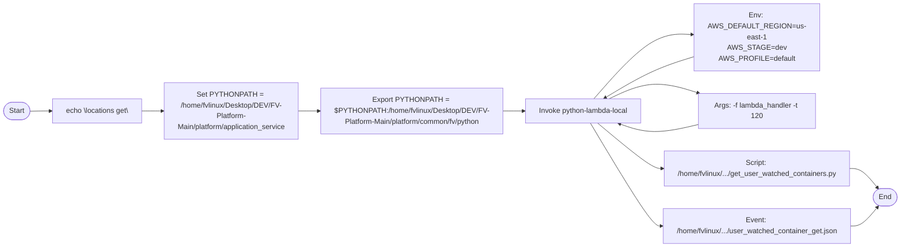
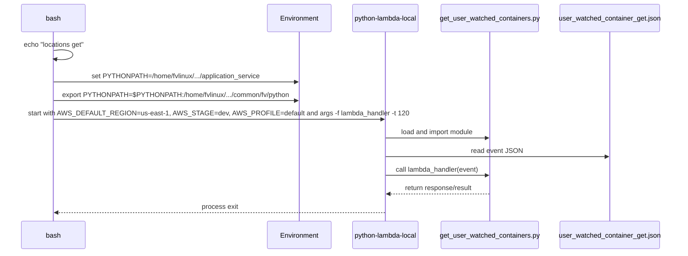

# Diagram: application_service/container_tracking_app_service/event/user_watched_container_get.sh

> Auto-generated by Obscura crawlers

## Diagram 1

### SVG

<svg id="container" width="2050.8193359375" xmlns="http://www.w3.org/2000/svg" class="flowchart" height="478" viewBox="0.0000019073486328125 0 2050.8193359375 478" role="graphics-document document" aria-roledescription="flowchart-v2"><g><marker id="container_flowchart-v2-pointEnd" class="marker flowchart-v2" viewBox="0 0 10 10" refX="5" refY="5" markerUnits="userSpaceOnUse" markerWidth="8" markerHeight="8" orient="auto"><path d="M 0 0 L 10 5 L 0 10 z" class="arrowMarkerPath" style="stroke-width: 1; stroke-dasharray: 1, 0;"></path></marker><marker id="container_flowchart-v2-pointStart" class="marker flowchart-v2" viewBox="0 0 10 10" refX="4.5" refY="5" markerUnits="userSpaceOnUse" markerWidth="8" markerHeight="8" orient="auto"><path d="M 0 5 L 10 10 L 10 0 z" class="arrowMarkerPath" style="stroke-width: 1; stroke-dasharray: 1, 0;"></path></marker><marker id="container_flowchart-v2-circleEnd" class="marker flowchart-v2" viewBox="0 0 10 10" refX="11" refY="5" markerUnits="userSpaceOnUse" markerWidth="11" markerHeight="11" orient="auto"><circle cx="5" cy="5" r="5" class="arrowMarkerPath" style="stroke-width: 1; stroke-dasharray: 1, 0;"></circle></marker><marker id="container_flowchart-v2-circleStart" class="marker flowchart-v2" viewBox="0 0 10 10" refX="-1" refY="5" markerUnits="userSpaceOnUse" markerWidth="11" markerHeight="11" orient="auto"><circle cx="5" cy="5" r="5" class="arrowMarkerPath" style="stroke-width: 1; stroke-dasharray: 1, 0;"></circle></marker><marker id="container_flowchart-v2-crossEnd" class="marker cross flowchart-v2" viewBox="0 0 11 11" refX="12" refY="5.2" markerUnits="userSpaceOnUse" markerWidth="11" markerHeight="11" orient="auto"><path d="M 1,1 l 9,9 M 10,1 l -9,9" class="arrowMarkerPath" style="stroke-width: 2; stroke-dasharray: 1, 0;"></path></marker><marker id="container_flowchart-v2-crossStart" class="marker cross flowchart-v2" viewBox="0 0 11 11" refX="-1" refY="5.2" markerUnits="userSpaceOnUse" markerWidth="11" markerHeight="11" orient="auto"><path d="M 1,1 l 9,9 M 10,1 l -9,9" class="arrowMarkerPath" style="stroke-width: 2; stroke-dasharray: 1, 0;"></path></marker><g class="root"><g class="clusters"></g><g class="edgePaths"><path d="M68.277,175.5L72.36,175.417C76.444,175.333,84.61,175.167,92.194,175.083C99.777,175,106.777,175,110.277,175L113.777,175" id="L_Start_Echo_0" class="edge-thickness-normal edge-pattern-solid edge-thickness-normal edge-pattern-solid flowchart-link" style=";" data-edge="true" data-et="edge" data-id="L_Start_Echo_0" data-points="W3sieCI6NjguMjc2ODM3NDMxODI1ODMsInkiOjE3NS41MDAwMDAwMDAwMDAwM30seyJ4Ijo5Mi43NzY4MzYzOTUyNjM2NywieSI6MTc1fSx7IngiOjExNy43NzY4MzYzOTUyNjM2NywieSI6MTc1fV0=" marker-end="url(#container_flowchart-v2-pointEnd)"></path><path d="M326.542,175L330.709,175C334.876,175,343.209,175,350.876,175C358.542,175,365.542,175,369.042,175L372.542,175" id="L_Echo_SetPY_0" class="edge-thickness-normal edge-pattern-solid edge-thickness-normal edge-pattern-solid flowchart-link" style=";" data-edge="true" data-et="edge" data-id="L_Echo_SetPY_0" data-points="W3sieCI6MzI2LjU0MjQ2MTM5NTI2MzcsInkiOjE3NX0seyJ4IjozNTEuNTQyNDYxMzk1MjYzNywieSI6MTc1fSx7IngiOjM3Ni41NDI0NjEzOTUyNjM3LCJ5IjoxNzV9XQ==" marker-end="url(#container_flowchart-v2-pointEnd)"></path><path d="M691.199,175L695.365,175C699.532,175,707.865,175,715.532,175C723.199,175,730.199,175,733.699,175L737.199,175" id="L_SetPY_ExportPY_0" class="edge-thickness-normal edge-pattern-solid edge-thickness-normal edge-pattern-solid flowchart-link" style=";" data-edge="true" data-et="edge" data-id="L_SetPY_ExportPY_0" data-points="W3sieCI6NjkxLjE5ODcxMTM5NTI2MzcsInkiOjE3NX0seyJ4Ijo3MTYuMTk4NzExMzk1MjYzNywieSI6MTc1fSx7IngiOjc0MS4xOTg3MTEzOTUyNjM3LCJ5IjoxNzV9XQ==" marker-end="url(#container_flowchart-v2-pointEnd)"></path><path d="M1148.355,175L1152.522,175C1156.688,175,1165.022,175,1172.688,175C1180.355,175,1187.355,175,1190.855,175L1194.355,175" id="L_ExportPY_Invoke_0" class="edge-thickness-normal edge-pattern-solid edge-thickness-normal edge-pattern-solid flowchart-link" style=";" data-edge="true" data-et="edge" data-id="L_ExportPY_Invoke_0" data-points="W3sieCI6MTE0OC4zNTQ5NjEzOTUyNjM3LCJ5IjoxNzV9LHsieCI6MTE3My4zNTQ5NjEzOTUyNjM3LCJ5IjoxNzV9LHsieCI6MTE5OC4zNTQ5NjEzOTUyNjM3LCJ5IjoxNzV9XQ==" marker-end="url(#container_flowchart-v2-pointEnd)"></path><path d="M1372.159,136L1390.692,119.5C1409.225,103,1446.29,70,1473.052,53.841C1499.814,37.682,1516.274,38.365,1524.504,38.706L1532.733,39.047" id="L_Invoke_Env_0" class="edge-thickness-normal edge-pattern-solid edge-thickness-normal edge-pattern-solid flowchart-link" style=";" data-edge="true" data-et="edge" data-id="L_Invoke_Env_0" data-points="W3sieCI6MTM3Mi4xNTkzMDkyMjEzNTA3LCJ5IjoxMzZ9LHsieCI6MTQ4My4zNTQ5NjEzOTUyNjM3LCJ5IjozN30seyJ4IjoxNTM2LjcyOTk2MTM5NTI2MzcsInkiOjM5LjIxMzAwODU1MTQzODE5fV0=" marker-end="url(#container_flowchart-v2-pointEnd)"></path><path d="M1440.299,136L1447.475,133.5C1454.651,131,1469.003,126,1494.06,127.503C1519.116,129.007,1554.878,137.013,1572.758,141.017L1590.639,145.02" id="L_Invoke_CmdArgs_0" class="edge-thickness-normal edge-pattern-solid edge-thickness-normal edge-pattern-solid flowchart-link" style=";" data-edge="true" data-et="edge" data-id="L_Invoke_CmdArgs_0" data-points="W3sieCI6MTQ0MC4yOTk0MDU4Mzk3MDgsInkiOjEzNn0seyJ4IjoxNDgzLjM1NDk2MTM5NTI2MzcsInkiOjEyMX0seyJ4IjoxNTk0LjU0MjQ2MTM5NTI2MzcsInkiOjE0NS44OTQwMTM5OTMyNjI1fV0=" marker-end="url(#container_flowchart-v2-pointEnd)"></path><path d="M1375.582,214L1393.544,228.833C1411.506,243.667,1447.43,273.333,1469.339,288.167C1491.248,303,1499.141,303,1503.088,303L1507.035,303" id="L_Invoke_Script_0" class="edge-thickness-normal edge-pattern-solid edge-thickness-normal edge-pattern-solid flowchart-link" style=";" data-edge="true" data-et="edge" data-id="L_Invoke_Script_0" data-points="W3sieCI6MTM3NS41ODE1MjM4OTUyNjM3LCJ5IjoyMTR9LHsieCI6MTQ4My4zNTQ5NjEzOTUyNjM3LCJ5IjozMDN9LHsieCI6MTUxMS4wMzQ2NDg4OTUyNjM3LCJ5IjozMDN9XQ==" marker-end="url(#container_flowchart-v2-pointEnd)"></path><path d="M1351.968,214L1373.866,250.167C1395.764,286.333,1439.559,358.667,1464.957,394.833C1490.355,431,1497.355,431,1500.855,431L1504.355,431" id="L_Invoke_Event_0" class="edge-thickness-normal edge-pattern-solid edge-thickness-normal edge-pattern-solid flowchart-link" style=";" data-edge="true" data-et="edge" data-id="L_Invoke_Event_0" data-points="W3sieCI6MTM1MS45NjgyNDI2NDUyNjM3LCJ5IjoyMTR9LHsieCI6MTQ4My4zNTQ5NjEzOTUyNjM3LCJ5Ijo0MzF9LHsieCI6MTUwOC4zNTQ5NjEzOTUyNjM3LCJ5Ijo0MzF9XQ==" marker-end="url(#container_flowchart-v2-pointEnd)"></path><path d="M1938.05,303L1942.664,303C1947.277,303,1956.503,303,1966.912,310.247C1977.321,317.493,1988.911,331.986,1994.707,339.233L2000.502,346.479" id="L_Script_End_0" class="edge-thickness-normal edge-pattern-solid edge-thickness-normal edge-pattern-solid flowchart-link" style=";" data-edge="true" data-et="edge" data-id="L_Script_End_0" data-points="W3sieCI6MTkzOC4wNTAyNzM4OTUyNjM3LCJ5IjozMDN9LHsieCI6MTk2NS43Mjk5NjEzOTUyNjM3LCJ5IjozMDN9LHsieCI6MjAwMy4wMDA0NTE3MDM0OTcsInkiOjM0OS42MDI5ODEyMjg0MzEzNn1d" marker-end="url(#container_flowchart-v2-pointEnd)"></path><path d="M1940.73,431L1944.897,431C1949.063,431,1957.397,431,1967.353,423.916C1977.31,416.831,1988.889,402.663,1994.679,395.579L2000.469,388.494" id="L_Event_End_0" class="edge-thickness-normal edge-pattern-solid edge-thickness-normal edge-pattern-solid flowchart-link" style=";" data-edge="true" data-et="edge" data-id="L_Event_End_0" data-points="W3sieCI6MTk0MC43Mjk5NjEzOTUyNjM3LCJ5Ijo0MzF9LHsieCI6MTk2NS43Mjk5NjEzOTUyNjM3LCJ5Ijo0MzF9LHsieCI6MjAwMy4wMDA0NTE3MDM0ODIyLCJ5IjozODUuMzk3MDE4NzcxNTg3M31d" marker-end="url(#container_flowchart-v2-pointEnd)"></path><path d="M1550.351,86L1539.185,88.5C1528.019,91,1505.687,96,1482.904,104.046C1460.121,112.092,1436.888,123.184,1425.271,128.731L1413.654,134.277" id="L_Env_Invoke_0" class="edge-thickness-normal edge-pattern-solid edge-thickness-normal edge-pattern-solid flowchart-link" style=";" data-edge="true" data-et="edge" data-id="L_Env_Invoke_0" data-points="W3sieCI6MTU1MC4zNTE0ODkxNzMwNDE1LCJ5Ijo4Nn0seyJ4IjoxNDgzLjM1NDk2MTM5NTI2MzcsInkiOjEwMX0seyJ4IjoxNDEwLjA0NDE1MDU4NDQ1MjgsInkiOjEzNn1d" marker-end="url(#container_flowchart-v2-pointEnd)"></path><path d="M1594.542,204.106L1576.011,208.255C1557.48,212.404,1520.417,220.702,1495.34,222.57C1470.262,224.439,1457.169,219.877,1450.623,217.597L1444.077,215.316" id="L_CmdArgs_Invoke_0" class="edge-thickness-normal edge-pattern-solid edge-thickness-normal edge-pattern-solid flowchart-link" style=";" data-edge="true" data-et="edge" data-id="L_CmdArgs_Invoke_0" data-points="W3sieCI6MTU5NC41NDI0NjEzOTUyNjM3LCJ5IjoyMDQuMTA1OTg2MDA2NzM3NX0seyJ4IjoxNDgzLjM1NDk2MTM5NTI2MzcsInkiOjIyOX0seyJ4IjoxNDQwLjI5OTQwNTgzOTcwOCwieSI6MjE0fV0=" marker-end="url(#container_flowchart-v2-pointEnd)"></path></g><g class="edgeLabels"><g class="edgeLabel"><g class="label" data-id="L_Start_Echo_0" transform="translate(0, 0)"><foreignObject width="0" height="0">

</foreignObject></g></g><g class="edgeLabel"><g class="label" data-id="L_Echo_SetPY_0" transform="translate(0, 0)"><foreignObject width="0" height="0">

</foreignObject></g></g><g class="edgeLabel"><g class="label" data-id="L_SetPY_ExportPY_0" transform="translate(0, 0)"><foreignObject width="0" height="0">

</foreignObject></g></g><g class="edgeLabel"><g class="label" data-id="L_ExportPY_Invoke_0" transform="translate(0, 0)"><foreignObject width="0" height="0">

</foreignObject></g></g><g class="edgeLabel"><g class="label" data-id="L_Invoke_Env_0" transform="translate(0, 0)"><foreignObject width="0" height="0">

</foreignObject></g></g><g class="edgeLabel"><g class="label" data-id="L_Invoke_CmdArgs_0" transform="translate(0, 0)"><foreignObject width="0" height="0">

</foreignObject></g></g><g class="edgeLabel"><g class="label" data-id="L_Invoke_Script_0" transform="translate(0, 0)"><foreignObject width="0" height="0">

</foreignObject></g></g><g class="edgeLabel"><g class="label" data-id="L_Invoke_Event_0" transform="translate(0, 0)"><foreignObject width="0" height="0">

</foreignObject></g></g><g class="edgeLabel"><g class="label" data-id="L_Script_End_0" transform="translate(0, 0)"><foreignObject width="0" height="0">

</foreignObject></g></g><g class="edgeLabel"><g class="label" data-id="L_Event_End_0" transform="translate(0, 0)"><foreignObject width="0" height="0">

</foreignObject></g></g><g class="edgeLabel"><g class="label" data-id="L_Env_Invoke_0" transform="translate(0, 0)"><foreignObject width="0" height="0">

</foreignObject></g></g><g class="edgeLabel"><g class="label" data-id="L_CmdArgs_Invoke_0" transform="translate(0, 0)"><foreignObject width="0" height="0">

</foreignObject></g></g></g><g class="nodes"><g class="node default" id="flowchart-Start-0" transform="translate(37.888418197631836, 175)"><g class="basic label-container outer-path"><path d="M-10.3984375 -19.5 C-2.307003348919684 -19.5, 5.784430802160632 -19.5, 10.3984375 -19.5 C10.3984375 -19.5, 10.3984375 -19.5, 10.398437499999998 -19.5 C10.749565679160323 -19.48874000272387, 11.100693858320648 -19.477480005447735, 11.6478067896239 -19.45993515863156 C12.130236270580697 -19.413395766809995, 12.612665751537495 -19.36685637498843, 12.892042152847864 -19.3399052695533 C13.143425517744591 -19.299263556623906, 13.394808882641318 -19.258621843694517, 14.126030759676757 -19.140403561325776 C14.530547105831971 -19.0480753450317, 14.935063451987187 -18.955747128737627, 15.34470188623539 -18.862249829261074 C15.61596513654514 -18.781740320458997, 15.887228386854893 -18.70123081165692, 16.543047751460602 -18.50658706670804 C16.98311045654009 -18.344639923343735, 17.423173161619573 -18.182692779979433, 17.716144095147794 -18.074876768247425 C18.162453893933453 -17.877308659634803, 18.608763692719112 -17.679740551022178, 18.85917041279238 -17.568892924097174 C19.132728810496268 -17.426177683237572, 19.406287208200155 -17.283462442377974, 19.967429764076783 -16.990714730406097 C20.379837027336688 -16.74071102384385, 20.792244290596592 -16.490707317281604, 21.036368073605697 -16.342718045390892 C21.43361443233434 -16.0656161820595, 21.830860791062985 -15.78851431872811, 22.061592844578712 -15.627565626425154 C22.296869090230878 -15.439939081481391, 22.532145335883047 -15.252312536537628, 23.03889120850187 -14.848196188198123 C23.27020410067599 -14.63812393972934, 23.501516992850107 -14.428051691260555, 23.964247236767985 -14.007812326905688 C24.257817067466824 -13.704677374177791, 24.55138689816566 -13.401542421449895, 24.833858442968648 -13.10986736009568 C25.131903991314005 -12.759766099737089, 25.429949539659365 -12.409664839378499, 25.644151408126582 -12.158051136245305 C25.8193268559123 -11.92333199502404, 25.994502303698017 -11.688612853802773, 26.391796464640635 -11.156274872382312 C26.65264874411127 -10.75553572247064, 26.913501023581908 -10.35479657255897, 27.073721378604247 -10.108655082055241 C27.288499733468832 -9.727294364326397, 27.503278088333417 -9.345933646597553, 27.6871239742735 -9.019496659696287 C27.865404374062912 -8.649293594944103, 28.043684773852327 -8.279090530191919, 28.22948364880834 -7.893275190886684 C28.35450086369485 -7.584480253073593, 28.479518078581354 -7.275685315260503, 28.698571729970325 -6.734618561215508 C28.78440003930797 -6.47611736837452, 28.87022834864562 -6.21761617553353, 29.09246063421488 -5.548287939305138 C29.17300499039731 -5.24113740103675, 29.25354934657974 -4.933986862768362, 29.40953178754556 -4.339158212148133 C29.503051811985248 -3.858952652114505, 29.596571836424935 -3.3787470920808764, 29.648482276581777 -3.1121979531509023 C29.689743704379723 -2.7921824671405475, 29.73100513217767 -2.4721669811301927, 29.808330202509367 -1.872449005199798 C29.831078741614867 -1.5181221463413523, 29.853827280720367 -1.1637952874829067, 29.888418715913414 -0.6250057626472757 C29.888418715913414 -0.18148930805907354, 29.888418715913414 0.2620271465291286, 29.888418715913414 0.625005762647271 C29.862827280679305 1.023613023453256, 29.837235845445193 1.4222202842592413, 29.808330202509367 1.8724490051997846 C29.75739086811633 2.267524423642835, 29.706451533723296 2.6625998420858847, 29.648482276581777 3.1121979531508885 C29.555428785304688 3.5900079639964075, 29.462375294027595 4.067817974841926, 29.40953178754556 4.339158212148129 C29.344167345907632 4.5884211572417595, 29.278802904269703 4.83768410233539, 29.092460634214884 5.548287939305125 C28.96044801499723 5.945888915034209, 28.82843539577958 6.343489890763294, 28.69857172997033 6.734618561215495 C28.512413617610267 7.194432697867102, 28.32625550525021 7.654246834518708, 28.229483648808344 7.893275190886679 C28.11979372372084 8.121048667319302, 28.01010379863333 8.348822143751924, 27.687123974273504 9.019496659696284 C27.447220599394576 9.44546939464475, 27.207317224515652 9.871442129593216, 27.07372137860425 10.108655082055236 C26.841263041032402 10.46577351236939, 26.608804703460553 10.822891942683544, 26.39179646464064 11.156274872382301 C26.1924853570539 11.423333598933095, 25.993174249467163 11.690392325483888, 25.644151408126582 12.158051136245302 C25.339470385660334 12.515946802075467, 25.034789363194086 12.87384246790563, 24.83385844296866 13.10986736009567 C24.54216531865929 13.411064459395982, 24.250472194349918 13.712261558696293, 23.96424723676799 14.007812326905684 C23.613687180932292 14.326181694304859, 23.263127125096595 14.644551061704032, 23.038891208501887 14.848196188198111 C22.654029567637906 15.155113105188752, 22.269167926773928 15.462030022179393, 22.061592844578715 15.627565626425152 C21.75751971095789 15.839673881325238, 21.453446577337065 16.051782136225324, 21.036368073605708 16.34271804539089 C20.661290682096993 16.570092164322887, 20.28621329058828 16.797466283254884, 19.967429764076787 16.990714730406093 C19.54804311504337 17.209508476576858, 19.128656466009954 17.42830222274762, 18.859170412792388 17.56889292409717 C18.60462917754486 17.681570778243785, 18.350087942297332 17.7942486323904, 17.716144095147804 18.07487676824742 C17.28464783426642 18.233671380959482, 16.85315157338503 18.392465993671543, 16.543047751460616 18.506587066708033 C16.07145289011057 18.646553946104785, 15.599858028760526 18.78652082550154, 15.344701886235413 18.86224982926107 C14.992033628494163 18.942744057715053, 14.639365370752913 19.023238286169036, 14.126030759676766 19.140403561325773 C13.67215961303897 19.21378192849086, 13.218288466401175 19.28716029565595, 12.892042152847878 19.3399052695533 C12.44870180369414 19.38267377984138, 12.005361454540402 19.425442290129464, 11.6478067896239 19.45993515863156 C11.303481246721779 19.47097700860342, 10.959155703819658 19.482018858575277, 10.398437500000004 19.5 C10.398437500000002 19.5, 10.398437500000002 19.5, 10.3984375 19.5 C2.935076529341786 19.5, -4.528284441316428 19.5, -10.398437499999996 19.5 C-10.68103477214179 19.490937655524633, -10.963632044283584 19.48187531104927, -11.647806789623893 19.45993515863156 C-11.918397693221584 19.433831579594663, -12.188988596819275 19.407728000557768, -12.892042152847871 19.3399052695533 C-13.334738683097022 19.268333527705483, -13.777435213346173 19.196761785857664, -14.126030759676759 19.140403561325773 C-14.538933196012161 19.04616127467242, -14.951835632347564 18.951918988019074, -15.344701886235388 18.862249829261074 C-15.608170551183685 18.784053712479665, -15.871639216131982 18.705857595698255, -16.54304775146059 18.506587066708043 C-16.898313457195528 18.375846002957402, -17.253579162930464 18.245104939206765, -17.716144095147797 18.074876768247425 C-18.1523525894867 17.88178020746883, -18.588561083825606 17.688683646690233, -18.85917041279238 17.568892924097174 C-19.2201385042861 17.380576101975997, -19.58110659577982 17.192259279854824, -19.96742976407678 16.990714730406097 C-20.205005579403693 16.846694875004463, -20.442581394730606 16.702675019602825, -21.036368073605686 16.3427180453909 C-21.42185365331826 16.073819992385204, -21.80733923303083 15.804921939379504, -22.061592844578712 15.627565626425156 C-22.28457318053543 15.449744742255616, -22.507553516492145 15.271923858086074, -23.03889120850187 14.848196188198125 C-23.29516578719084 14.615454396486586, -23.55144036587981 14.382712604775046, -23.964247236767974 14.007812326905697 C-24.140736450362045 13.825572723835906, -24.317225663956116 13.643333120766115, -24.833858442968655 13.109867360095677 C-25.088155001000455 12.81115615314746, -25.342451559032252 12.512444946199242, -25.64415140812658 12.158051136245307 C-25.830273401628343 11.908664621015372, -26.016395395130104 11.659278105785436, -26.391796464640635 11.156274872382316 C-26.631975310308185 10.78729566838646, -26.872154155975732 10.418316464390605, -27.073721378604244 10.108655082055249 C-27.238931284229533 9.815308165300538, -27.404141189854823 9.521961248545827, -27.6871239742735 9.019496659696289 C-27.817921401094402 8.747893004286079, -27.948718827915307 8.47628934887587, -28.22948364880834 7.893275190886686 C-28.3596952622753 7.571649988153014, -28.489906875742257 7.250024785419344, -28.698571729970325 6.73461856121551 C-28.78830510377329 6.46435593639251, -28.878038477576258 6.1940933115695085, -29.09246063421488 5.5482879393051325 C-29.163783261499972 5.2763038500448785, -29.235105888785064 5.004319760784624, -29.409531787545557 4.339158212148136 C-29.48547704470252 3.9491953676829237, -29.561422301859483 3.5592325232177116, -29.648482276581777 3.112197953150904 C-29.708983594010174 2.6429616825127127, -29.76948491143857 2.173725411874521, -29.808330202509364 1.872449005199809 C-29.8320961699115 1.50227487936791, -29.85586213731364 1.1321007535360106, -29.888418715913414 0.6250057626472781 C-29.888418715913414 0.21449077965848728, -29.888418715913414 -0.19602420333030357, -29.888418715913414 -0.6250057626472687 C-29.86075138095589 -1.0559468372815535, -29.833084045998362 -1.486887911915838, -29.808330202509367 -1.8724490051997822 C-29.7564740846036 -2.274634815528186, -29.704617966697835 -2.67682062585659, -29.648482276581777 -3.112197953150895 C-29.590721369283035 -3.4087880043578678, -29.53296046198429 -3.7053780555648403, -29.40953178754556 -4.339158212148126 C-29.299964875394995 -4.7569843347783465, -29.19039796324443 -5.174810457408566, -29.092460634214884 -5.548287939305123 C-28.943399020612176 -5.997237769733631, -28.79433740700947 -6.446187600162139, -28.698571729970332 -6.734618561215485 C-28.51424107927511 -7.189918832223377, -28.329910428579886 -7.645219103231269, -28.229483648808344 -7.893275190886676 C-28.042548227405415 -8.281450593207126, -27.855612806002487 -8.669625995527575, -27.687123974273504 -9.019496659696282 C-27.509187721252538 -9.335440494934431, -27.33125146823157 -9.651384330172583, -27.073721378604247 -10.108655082055243 C-26.928423522862623 -10.331871606411674, -26.783125667120995 -10.555088130768105, -26.39179646464064 -11.156274872382308 C-26.213035575019894 -11.395798179022044, -26.034274685399144 -11.635321485661779, -25.644151408126586 -12.158051136245302 C-25.372092683768948 -12.477626794455746, -25.100033959411306 -12.797202452666191, -24.833858442968662 -13.10986736009567 C-24.552616928724127 -13.400272313910895, -24.27137541447959 -13.690677267726118, -23.964247236767996 -14.007812326905677 C-23.607425854561242 -14.331868065249427, -23.25060447235449 -14.655923803593177, -23.038891208501887 -14.848196188198107 C-22.750370222420848 -15.078283996731848, -22.46184923633981 -15.308371805265589, -22.06159284457872 -15.627565626425149 C-21.67198805982923 -15.899337058547088, -21.28238327507974 -16.171108490669027, -21.03636807360571 -16.342718045390885 C-20.643872388030413 -16.580651236547304, -20.25137670245512 -16.81858442770372, -19.96742976407679 -16.99071473040609 C-19.5383909792606 -17.21454398963224, -19.109352194444416 -17.438373248858387, -18.859170412792388 -17.56889292409717 C-18.608593780899007 -17.67981576594468, -18.358017149005626 -17.790738607792196, -17.716144095147804 -18.07487676824742 C-17.380485431995304 -18.19840225908221, -17.044826768842803 -18.321927749917, -16.54304775146062 -18.506587066708033 C-16.071746406033206 -18.646466832119643, -15.600445060605796 -18.786346597531253, -15.344701886235413 -18.862249829261067 C-15.047031942144036 -18.930191051522005, -14.749361998052658 -18.998132273782943, -14.126030759676768 -19.140403561325773 C-13.846975605188119 -19.185519034598453, -13.567920450699468 -19.230634507871134, -12.89204215284788 -19.3399052695533 C-12.504180389306901 -19.37732182741008, -12.11631862576592 -19.41473838526686, -11.647806789623903 -19.45993515863156 C-11.223364721356925 -19.47354618963451, -10.798922653089946 -19.487157220637467, -10.398437500000005 -19.5 C-10.398437500000004 -19.5, -10.398437500000004 -19.5, -10.3984375 -19.5" stroke="none" stroke-width="0" fill="#ECECFF" style=""></path><path d="M-10.3984375 -19.5 C-5.179228990609782 -19.5, 0.03997951878043615 -19.5, 10.3984375 -19.5 M-10.3984375 -19.5 C-2.877617197220781 -19.5, 4.643203105558438 -19.5, 10.3984375 -19.5 M10.3984375 -19.5 C10.3984375 -19.5, 10.398437499999998 -19.5, 10.398437499999998 -19.5 M10.3984375 -19.5 C10.3984375 -19.5, 10.398437499999998 -19.5, 10.398437499999998 -19.5 M10.398437499999998 -19.5 C10.728313721958749 -19.489421511626897, 11.058189943917501 -19.478843023253795, 11.6478067896239 -19.45993515863156 M10.398437499999998 -19.5 C10.832640052499132 -19.48607596926535, 11.266842604998265 -19.4721519385307, 11.6478067896239 -19.45993515863156 M11.6478067896239 -19.45993515863156 C11.94556115997537 -19.431211152625774, 12.24331553032684 -19.40248714661999, 12.892042152847864 -19.3399052695533 M11.6478067896239 -19.45993515863156 C12.087976003302563 -19.417472563968907, 12.528145216981228 -19.37500996930626, 12.892042152847864 -19.3399052695533 M12.892042152847864 -19.3399052695533 C13.226387632367638 -19.28585088531246, 13.560733111887412 -19.231796501071624, 14.126030759676757 -19.140403561325776 M12.892042152847864 -19.3399052695533 C13.311898608777504 -19.27202613379404, 13.731755064707144 -19.20414699803478, 14.126030759676757 -19.140403561325776 M14.126030759676757 -19.140403561325776 C14.405498293270735 -19.07661692047904, 14.684965826864712 -19.012830279632304, 15.34470188623539 -18.862249829261074 M14.126030759676757 -19.140403561325776 C14.539200834262358 -19.04610018798832, 14.952370908847959 -18.951796814650866, 15.34470188623539 -18.862249829261074 M15.34470188623539 -18.862249829261074 C15.772606503715892 -18.735249984910034, 16.200511121196396 -18.608250140558994, 16.543047751460602 -18.50658706670804 M15.34470188623539 -18.862249829261074 C15.768591712596308 -18.736441553840258, 16.192481538957225 -18.610633278419442, 16.543047751460602 -18.50658706670804 M16.543047751460602 -18.50658706670804 C16.857656854072566 -18.390808008732172, 17.17226595668453 -18.275028950756305, 17.716144095147794 -18.074876768247425 M16.543047751460602 -18.50658706670804 C16.787525490502603 -18.416616998813137, 17.032003229544607 -18.326646930918233, 17.716144095147794 -18.074876768247425 M17.716144095147794 -18.074876768247425 C18.001567639982184 -17.94852823173787, 18.286991184816575 -17.82217969522832, 18.85917041279238 -17.568892924097174 M17.716144095147794 -18.074876768247425 C17.97191277367245 -17.961655561372837, 18.227681452197107 -17.84843435449825, 18.85917041279238 -17.568892924097174 M18.85917041279238 -17.568892924097174 C19.214131796930904 -17.383709797355724, 19.569093181069427 -17.198526670614278, 19.967429764076783 -16.990714730406097 M18.85917041279238 -17.568892924097174 C19.20502416979998 -17.388461240596214, 19.55087792680758 -17.208029557095255, 19.967429764076783 -16.990714730406097 M19.967429764076783 -16.990714730406097 C20.337271174333594 -16.766514694079042, 20.707112584590405 -16.54231465775199, 21.036368073605697 -16.342718045390892 M19.967429764076783 -16.990714730406097 C20.389856301266036 -16.73463728110809, 20.81228283845529 -16.478559831810085, 21.036368073605697 -16.342718045390892 M21.036368073605697 -16.342718045390892 C21.3223944061618 -16.143198457680132, 21.608420738717903 -15.94367886996937, 22.061592844578712 -15.627565626425154 M21.036368073605697 -16.342718045390892 C21.369428276313876 -16.110389665925467, 21.70248847902205 -15.878061286460042, 22.061592844578712 -15.627565626425154 M22.061592844578712 -15.627565626425154 C22.296717356381574 -15.440060085188403, 22.53184186818444 -15.252554543951653, 23.03889120850187 -14.848196188198123 M22.061592844578712 -15.627565626425154 C22.312444297816487 -15.427518267905548, 22.563295751054266 -15.227470909385943, 23.03889120850187 -14.848196188198123 M23.03889120850187 -14.848196188198123 C23.36625555166012 -14.550892553327682, 23.69361989481837 -14.253588918457238, 23.964247236767985 -14.007812326905688 M23.03889120850187 -14.848196188198123 C23.401314497320342 -14.519052946487937, 23.763737786138815 -14.189909704777753, 23.964247236767985 -14.007812326905688 M23.964247236767985 -14.007812326905688 C24.31012965400032 -13.650660333638726, 24.656012071232656 -13.293508340371762, 24.833858442968648 -13.10986736009568 M23.964247236767985 -14.007812326905688 C24.180019389406485 -13.785009864083246, 24.395791542044982 -13.562207401260807, 24.833858442968648 -13.10986736009568 M24.833858442968648 -13.10986736009568 C25.02305060676658 -12.887631479159541, 25.21224277056451 -12.665395598223402, 25.644151408126582 -12.158051136245305 M24.833858442968648 -13.10986736009568 C25.08404396018809 -12.815985215610509, 25.334229477407533 -12.522103071125336, 25.644151408126582 -12.158051136245305 M25.644151408126582 -12.158051136245305 C25.83009118367239 -11.908908776475949, 26.0160309592182 -11.659766416706594, 26.391796464640635 -11.156274872382312 M25.644151408126582 -12.158051136245305 C25.83087688480822 -11.907856008532784, 26.01760236148986 -11.657660880820263, 26.391796464640635 -11.156274872382312 M26.391796464640635 -11.156274872382312 C26.559886961930626 -10.898042729926363, 26.727977459220615 -10.639810587470413, 27.073721378604247 -10.108655082055241 M26.391796464640635 -11.156274872382312 C26.555050131954395 -10.905473399640558, 26.718303799268156 -10.654671926898803, 27.073721378604247 -10.108655082055241 M27.073721378604247 -10.108655082055241 C27.211654492053125 -9.863740871884465, 27.349587605502006 -9.618826661713687, 27.6871239742735 -9.019496659696287 M27.073721378604247 -10.108655082055241 C27.267856069338055 -9.76394928038826, 27.461990760071863 -9.41924347872128, 27.6871239742735 -9.019496659696287 M27.6871239742735 -9.019496659696287 C27.81105581917139 -8.76214953204914, 27.934987664069276 -8.50480240440199, 28.22948364880834 -7.893275190886684 M27.6871239742735 -9.019496659696287 C27.877954576349183 -8.623232831365351, 28.068785178424868 -8.226969003034414, 28.22948364880834 -7.893275190886684 M28.22948364880834 -7.893275190886684 C28.381061457702497 -7.51887507236055, 28.532639266596654 -7.144474953834415, 28.698571729970325 -6.734618561215508 M28.22948364880834 -7.893275190886684 C28.40480848397013 -7.460219458361974, 28.58013331913192 -7.027163725837264, 28.698571729970325 -6.734618561215508 M28.698571729970325 -6.734618561215508 C28.84741776437657 -6.286318020978868, 28.996263798782813 -5.838017480742228, 29.09246063421488 -5.548287939305138 M28.698571729970325 -6.734618561215508 C28.814563951880434 -6.385268469673075, 28.930556173790542 -6.03591837813064, 29.09246063421488 -5.548287939305138 M29.09246063421488 -5.548287939305138 C29.18275835060766 -5.203943611421622, 29.273056067000443 -4.859599283538107, 29.40953178754556 -4.339158212148133 M29.09246063421488 -5.548287939305138 C29.172189845821524 -5.244245900590117, 29.251919057428164 -4.940203861875097, 29.40953178754556 -4.339158212148133 M29.40953178754556 -4.339158212148133 C29.47336477374118 -4.011389319140028, 29.537197759936802 -3.6836204261319216, 29.648482276581777 -3.1121979531509023 M29.40953178754556 -4.339158212148133 C29.499937439906876 -3.8749442945141683, 29.590343092268192 -3.4107303768802035, 29.648482276581777 -3.1121979531509023 M29.648482276581777 -3.1121979531509023 C29.695893075260177 -2.7444891609223836, 29.743303873938576 -2.3767803686938653, 29.808330202509367 -1.872449005199798 M29.648482276581777 -3.1121979531509023 C29.6905991544179 -2.785547765572189, 29.732716032254018 -2.458897577993476, 29.808330202509367 -1.872449005199798 M29.808330202509367 -1.872449005199798 C29.83558312514526 -1.447962736982533, 29.862836047781155 -1.023476468765268, 29.888418715913414 -0.6250057626472757 M29.808330202509367 -1.872449005199798 C29.83848024424114 -1.402837768551767, 29.868630285972912 -0.9332265319037358, 29.888418715913414 -0.6250057626472757 M29.888418715913414 -0.6250057626472757 C29.888418715913414 -0.2928079507401065, 29.888418715913414 0.03938986116706267, 29.888418715913414 0.625005762647271 M29.888418715913414 -0.6250057626472757 C29.888418715913414 -0.37429049306204654, 29.888418715913414 -0.12357522347681738, 29.888418715913414 0.625005762647271 M29.888418715913414 0.625005762647271 C29.87008977132938 0.9104938694013842, 29.851760826745345 1.1959819761554973, 29.808330202509367 1.8724490051997846 M29.888418715913414 0.625005762647271 C29.8669413325875 0.9595333441801712, 29.845463949261585 1.2940609257130715, 29.808330202509367 1.8724490051997846 M29.808330202509367 1.8724490051997846 C29.762814794996924 2.2254575178324534, 29.717299387484484 2.5784660304651217, 29.648482276581777 3.1121979531508885 M29.808330202509367 1.8724490051997846 C29.748261462094465 2.338330293943293, 29.688192721679563 2.8042115826868006, 29.648482276581777 3.1121979531508885 M29.648482276581777 3.1121979531508885 C29.565821092855618 3.536645661137348, 29.483159909129462 3.9610933691238075, 29.40953178754556 4.339158212148129 M29.648482276581777 3.1121979531508885 C29.59865772573769 3.3680364913127145, 29.54883317489361 3.623875029474541, 29.40953178754556 4.339158212148129 M29.40953178754556 4.339158212148129 C29.286000221214124 4.810237613489418, 29.162468654882687 5.281317014830709, 29.092460634214884 5.548287939305125 M29.40953178754556 4.339158212148129 C29.31889599442533 4.684791773116797, 29.228260201305098 5.030425334085465, 29.092460634214884 5.548287939305125 M29.092460634214884 5.548287939305125 C28.968111276304622 5.922808392951229, 28.843761918394357 6.297328846597331, 28.69857172997033 6.734618561215495 M29.092460634214884 5.548287939305125 C28.999339303349874 5.828754551001344, 28.906217972484868 6.109221162697563, 28.69857172997033 6.734618561215495 M28.69857172997033 6.734618561215495 C28.572976151204664 7.044842068992012, 28.447380572439 7.35506557676853, 28.229483648808344 7.893275190886679 M28.69857172997033 6.734618561215495 C28.52280892270632 7.1687560933003, 28.347046115442314 7.6028936253851045, 28.229483648808344 7.893275190886679 M28.229483648808344 7.893275190886679 C28.033789840942703 8.2996375700964, 27.83809603307706 8.70599994930612, 27.687123974273504 9.019496659696284 M28.229483648808344 7.893275190886679 C28.114881890268876 8.131248194578697, 28.00028013172941 8.369221198270717, 27.687123974273504 9.019496659696284 M27.687123974273504 9.019496659696284 C27.447485898200505 9.444998329750408, 27.207847822127505 9.870499999804535, 27.07372137860425 10.108655082055236 M27.687123974273504 9.019496659696284 C27.467540102735597 9.409390058889938, 27.247956231197694 9.799283458083591, 27.07372137860425 10.108655082055236 M27.07372137860425 10.108655082055236 C26.84874722424968 10.45427579716306, 26.62377306989511 10.799896512270884, 26.39179646464064 11.156274872382301 M27.07372137860425 10.108655082055236 C26.85288226842893 10.447923258888897, 26.63204315825361 10.787191435722558, 26.39179646464064 11.156274872382301 M26.39179646464064 11.156274872382301 C26.239850081262233 11.359869183509076, 26.08790369788382 11.563463494635851, 25.644151408126582 12.158051136245302 M26.39179646464064 11.156274872382301 C26.15243216557678 11.477001226591629, 25.91306786651292 11.797727580800954, 25.644151408126582 12.158051136245302 M25.644151408126582 12.158051136245302 C25.442148092389186 12.395335725224733, 25.24014477665179 12.632620314204166, 24.83385844296866 13.10986736009567 M25.644151408126582 12.158051136245302 C25.44000113158123 12.39785766755529, 25.235850855035878 12.637664198865275, 24.83385844296866 13.10986736009567 M24.83385844296866 13.10986736009567 C24.592911577526557 13.358664780770189, 24.35196471208446 13.607462201444706, 23.96424723676799 14.007812326905684 M24.83385844296866 13.10986736009567 C24.601485437143218 13.349811566789022, 24.369112431317777 13.589755773482375, 23.96424723676799 14.007812326905684 M23.96424723676799 14.007812326905684 C23.67128609294557 14.273871886398098, 23.378324949123158 14.53993144589051, 23.038891208501887 14.848196188198111 M23.96424723676799 14.007812326905684 C23.68079272802619 14.26523821194966, 23.397338219284396 14.522664096993635, 23.038891208501887 14.848196188198111 M23.038891208501887 14.848196188198111 C22.76154149297212 15.069375205747203, 22.48419177744236 15.290554223296297, 22.061592844578715 15.627565626425152 M23.038891208501887 14.848196188198111 C22.772227918230147 15.060853065981648, 22.505564627958407 15.273509943765186, 22.061592844578715 15.627565626425152 M22.061592844578715 15.627565626425152 C21.8226594202837 15.794235239952123, 21.583725995988683 15.960904853479093, 21.036368073605708 16.34271804539089 M22.061592844578715 15.627565626425152 C21.693721177068227 15.884176976772649, 21.325849509557735 16.140788327120145, 21.036368073605708 16.34271804539089 M21.036368073605708 16.34271804539089 C20.714107680177463 16.538074189699373, 20.39184728674922 16.733430334007856, 19.967429764076787 16.990714730406093 M21.036368073605708 16.34271804539089 C20.74145586819073 16.52149555740994, 20.446543662775753 16.700273069428988, 19.967429764076787 16.990714730406093 M19.967429764076787 16.990714730406093 C19.65970890691568 17.15125250448243, 19.35198804975457 17.31179027855876, 18.859170412792388 17.56889292409717 M19.967429764076787 16.990714730406093 C19.600347736722185 17.18222118894973, 19.23326570936758 17.373727647493364, 18.859170412792388 17.56889292409717 M18.859170412792388 17.56889292409717 C18.626704231616618 17.67179880663943, 18.394238050440848 17.77470468918169, 17.716144095147804 18.07487676824742 M18.859170412792388 17.56889292409717 C18.469959321058514 17.741185128870935, 18.080748229324637 17.913477333644696, 17.716144095147804 18.07487676824742 M17.716144095147804 18.07487676824742 C17.404611707884122 18.189523566534277, 17.093079320620436 18.30417036482113, 16.543047751460616 18.506587066708033 M17.716144095147804 18.07487676824742 C17.29743060844305 18.22896720189981, 16.878717121738298 18.383057635552202, 16.543047751460616 18.506587066708033 M16.543047751460616 18.506587066708033 C16.189843460160056 18.611416246358882, 15.836639168859492 18.71624542600973, 15.344701886235413 18.86224982926107 M16.543047751460616 18.506587066708033 C16.091995234231714 18.640457086198595, 15.640942717002815 18.774327105689157, 15.344701886235413 18.86224982926107 M15.344701886235413 18.86224982926107 C15.062143118635515 18.92674202409747, 14.779584351035616 18.99123421893387, 14.126030759676766 19.140403561325773 M15.344701886235413 18.86224982926107 C14.909234192254294 18.96164248871999, 14.473766498273175 19.061035148178902, 14.126030759676766 19.140403561325773 M14.126030759676766 19.140403561325773 C13.862905027230973 19.182943689177076, 13.599779294785181 19.225483817028383, 12.892042152847878 19.3399052695533 M14.126030759676766 19.140403561325773 C13.675876717370693 19.213180975889085, 13.225722675064619 19.285958390452393, 12.892042152847878 19.3399052695533 M12.892042152847878 19.3399052695533 C12.608276867580459 19.367279765345362, 12.32451158231304 19.394654261137422, 11.6478067896239 19.45993515863156 M12.892042152847878 19.3399052695533 C12.626880768511201 19.365485069397035, 12.361719384174524 19.391064869240772, 11.6478067896239 19.45993515863156 M11.6478067896239 19.45993515863156 C11.191224084099588 19.4745768773134, 10.734641378575276 19.489218595995244, 10.398437500000004 19.5 M11.6478067896239 19.45993515863156 C11.214351902507289 19.473835213192633, 10.78089701539068 19.487735267753706, 10.398437500000004 19.5 M10.398437500000004 19.5 C10.398437500000002 19.5, 10.3984375 19.5, 10.3984375 19.5 M10.398437500000004 19.5 C10.398437500000002 19.5, 10.398437500000002 19.5, 10.3984375 19.5 M10.3984375 19.5 C4.370403877206896 19.5, -1.657629745586208 19.5, -10.398437499999996 19.5 M10.3984375 19.5 C2.9328576782433435 19.5, -4.532722143513313 19.5, -10.398437499999996 19.5 M-10.398437499999996 19.5 C-10.829510068599522 19.486176341756867, -11.260582637199047 19.472352683513733, -11.647806789623893 19.45993515863156 M-10.398437499999996 19.5 C-10.867252341300023 19.48496602053224, -11.336067182600052 19.469932041064478, -11.647806789623893 19.45993515863156 M-11.647806789623893 19.45993515863156 C-12.10166934011253 19.416151584235497, -12.555531890601168 19.372368009839438, -12.892042152847871 19.3399052695533 M-11.647806789623893 19.45993515863156 C-12.092453783014893 19.417040597945377, -12.537100776405891 19.374146037259198, -12.892042152847871 19.3399052695533 M-12.892042152847871 19.3399052695533 C-13.260348885407543 19.28036029329442, -13.628655617967214 19.22081531703554, -14.126030759676759 19.140403561325773 M-12.892042152847871 19.3399052695533 C-13.26722269453196 19.27924898914237, -13.642403236216046 19.218592708731443, -14.126030759676759 19.140403561325773 M-14.126030759676759 19.140403561325773 C-14.40558337263019 19.076597501670438, -14.685135985583619 19.0127914420151, -15.344701886235388 18.862249829261074 M-14.126030759676759 19.140403561325773 C-14.579043780385446 19.037006295535246, -15.032056801094132 18.93360902974472, -15.344701886235388 18.862249829261074 M-15.344701886235388 18.862249829261074 C-15.717746981040278 18.751532003276644, -16.09079207584517 18.640814177292214, -16.54304775146059 18.506587066708043 M-15.344701886235388 18.862249829261074 C-15.6294012275048 18.77775255918965, -15.914100568774213 18.693255289118227, -16.54304775146059 18.506587066708043 M-16.54304775146059 18.506587066708043 C-16.84034701669293 18.39717818889826, -17.13764628192527 18.28776931108848, -17.716144095147797 18.074876768247425 M-16.54304775146059 18.506587066708043 C-16.94358230971207 18.35918664677063, -17.344116867963553 18.211786226833215, -17.716144095147797 18.074876768247425 M-17.716144095147797 18.074876768247425 C-18.017797067778233 17.94134394548143, -18.319450040408668 17.807811122715442, -18.85917041279238 17.568892924097174 M-17.716144095147797 18.074876768247425 C-18.13271558362025 17.890472927454823, -18.549287072092703 17.706069086662225, -18.85917041279238 17.568892924097174 M-18.85917041279238 17.568892924097174 C-19.300643089466455 17.338576911453053, -19.74211576614053 17.108260898808936, -19.96742976407678 16.990714730406097 M-18.85917041279238 17.568892924097174 C-19.268522245579348 17.355334335134575, -19.67787407836631 17.14177574617198, -19.96742976407678 16.990714730406097 M-19.96742976407678 16.990714730406097 C-20.376405272850775 16.742791373580438, -20.785380781624767 16.49486801675478, -21.036368073605686 16.3427180453909 M-19.96742976407678 16.990714730406097 C-20.24212394575881 16.824193503188255, -20.51681812744084 16.657672275970416, -21.036368073605686 16.3427180453909 M-21.036368073605686 16.3427180453909 C-21.248204251804015 16.1949502977201, -21.46004043000234 16.047182550049307, -22.061592844578712 15.627565626425156 M-21.036368073605686 16.3427180453909 C-21.388497213742546 16.09708800065622, -21.740626353879406 15.851457955921546, -22.061592844578712 15.627565626425156 M-22.061592844578712 15.627565626425156 C-22.335698701390715 15.408973499880773, -22.60980455820272 15.19038137333639, -23.03889120850187 14.848196188198125 M-22.061592844578712 15.627565626425156 C-22.383306129271194 15.371007843032952, -22.705019413963672 15.11445005964075, -23.03889120850187 14.848196188198125 M-23.03889120850187 14.848196188198125 C-23.314927816856265 14.5975070440191, -23.59096442521066 14.346817899840072, -23.964247236767974 14.007812326905697 M-23.03889120850187 14.848196188198125 C-23.284938328368703 14.624742703985119, -23.530985448235537 14.401289219772112, -23.964247236767974 14.007812326905697 M-23.964247236767974 14.007812326905697 C-24.28121539337261 13.680516681641782, -24.598183549977243 13.35322103637787, -24.833858442968655 13.109867360095677 M-23.964247236767974 14.007812326905697 C-24.17831385499802 13.786770968386966, -24.392380473228066 13.565729609868233, -24.833858442968655 13.109867360095677 M-24.833858442968655 13.109867360095677 C-25.090553160391583 12.808339138667504, -25.347247877814514 12.50681091723933, -25.64415140812658 12.158051136245307 M-24.833858442968655 13.109867360095677 C-25.07258069373996 12.829450620658827, -25.31130294451126 12.549033881221975, -25.64415140812658 12.158051136245307 M-25.64415140812658 12.158051136245307 C-25.843034186931988 11.891566331239941, -26.0419169657374 11.625081526234577, -26.391796464640635 11.156274872382316 M-25.64415140812658 12.158051136245307 C-25.860970433929857 11.867533394288516, -26.077789459733133 11.577015652331726, -26.391796464640635 11.156274872382316 M-26.391796464640635 11.156274872382316 C-26.60989308407752 10.821219897784768, -26.827989703514405 10.48616492318722, -27.073721378604244 10.108655082055249 M-26.391796464640635 11.156274872382316 C-26.53833962600605 10.931145224176362, -26.684882787371468 10.706015575970408, -27.073721378604244 10.108655082055249 M-27.073721378604244 10.108655082055249 C-27.26238783006295 9.773658692940481, -27.451054281521653 9.438662303825716, -27.6871239742735 9.019496659696289 M-27.073721378604244 10.108655082055249 C-27.271591354504157 9.75731690333721, -27.46946133040407 9.405978724619173, -27.6871239742735 9.019496659696289 M-27.6871239742735 9.019496659696289 C-27.90159144914554 8.574150359255661, -28.116058924017576 8.128804058815035, -28.22948364880834 7.893275190886686 M-27.6871239742735 9.019496659696289 C-27.81545536342323 8.753013784275023, -27.94378675257296 8.486530908853757, -28.22948364880834 7.893275190886686 M-28.22948364880834 7.893275190886686 C-28.34206570425271 7.615195337313122, -28.45464775969708 7.337115483739559, -28.698571729970325 6.73461856121551 M-28.22948364880834 7.893275190886686 C-28.33245135038563 7.638942977245708, -28.435419051962914 7.384610763604729, -28.698571729970325 6.73461856121551 M-28.698571729970325 6.73461856121551 C-28.784446671315653 6.475976920197191, -28.87032161266098 6.217335279178872, -29.09246063421488 5.5482879393051325 M-28.698571729970325 6.73461856121551 C-28.831859692948637 6.333176453277749, -28.965147655926952 5.9317343453399864, -29.09246063421488 5.5482879393051325 M-29.09246063421488 5.5482879393051325 C-29.1930069442695 5.164861282020441, -29.293553254324117 4.781434624735749, -29.409531787545557 4.339158212148136 M-29.09246063421488 5.5482879393051325 C-29.204744916131563 5.120099308041203, -29.317029198048246 4.6919106767772725, -29.409531787545557 4.339158212148136 M-29.409531787545557 4.339158212148136 C-29.49991115500229 3.875079261943897, -29.59029052245902 3.411000311739658, -29.648482276581777 3.112197953150904 M-29.409531787545557 4.339158212148136 C-29.457704195775115 4.0918030771314475, -29.505876604004673 3.8444479421147597, -29.648482276581777 3.112197953150904 M-29.648482276581777 3.112197953150904 C-29.695139985633503 2.7503299753524857, -29.741797694685232 2.3884619975540677, -29.808330202509364 1.872449005199809 M-29.648482276581777 3.112197953150904 C-29.697382433551393 2.732937992122761, -29.746282590521012 2.3536780310946184, -29.808330202509364 1.872449005199809 M-29.808330202509364 1.872449005199809 C-29.83824775304736 1.4064590065584073, -29.868165303585354 0.9404690079170055, -29.888418715913414 0.6250057626472781 M-29.808330202509364 1.872449005199809 C-29.828182539626535 1.5632328300817815, -29.848034876743704 1.254016654963754, -29.888418715913414 0.6250057626472781 M-29.888418715913414 0.6250057626472781 C-29.888418715913414 0.37435772589747357, -29.888418715913414 0.123709689147669, -29.888418715913414 -0.6250057626472687 M-29.888418715913414 0.6250057626472781 C-29.888418715913414 0.289827804302033, -29.888418715913414 -0.04535015404321219, -29.888418715913414 -0.6250057626472687 M-29.888418715913414 -0.6250057626472687 C-29.869718180342495 -0.9162816989649695, -29.851017644771574 -1.2075576352826702, -29.808330202509367 -1.8724490051997822 M-29.888418715913414 -0.6250057626472687 C-29.864734993689634 -0.9938988534391464, -29.841051271465854 -1.3627919442310241, -29.808330202509367 -1.8724490051997822 M-29.808330202509367 -1.8724490051997822 C-29.74463837342249 -2.3664302542233697, -29.680946544335608 -2.8604115032469575, -29.648482276581777 -3.112197953150895 M-29.808330202509367 -1.8724490051997822 C-29.751629732756278 -2.312206651830561, -29.694929263003186 -2.7519642984613393, -29.648482276581777 -3.112197953150895 M-29.648482276581777 -3.112197953150895 C-29.58367288099843 -3.4449805020007647, -29.51886348541509 -3.777763050850634, -29.40953178754556 -4.339158212148126 M-29.648482276581777 -3.112197953150895 C-29.575774836898642 -3.4855352892009774, -29.503067397215506 -3.8588726252510597, -29.40953178754556 -4.339158212148126 M-29.40953178754556 -4.339158212148126 C-29.31978600600156 -4.6813977732431695, -29.230040224457557 -5.023637334338212, -29.092460634214884 -5.548287939305123 M-29.40953178754556 -4.339158212148126 C-29.294803247067428 -4.77666786065522, -29.1800747065893 -5.2141775091623135, -29.092460634214884 -5.548287939305123 M-29.092460634214884 -5.548287939305123 C-28.95867989631736 -5.951214206786527, -28.824899158419836 -6.354140474267932, -28.698571729970332 -6.734618561215485 M-29.092460634214884 -5.548287939305123 C-28.961869556446988 -5.941607458679417, -28.83127847867909 -6.334926978053711, -28.698571729970332 -6.734618561215485 M-28.698571729970332 -6.734618561215485 C-28.517861590694313 -7.180976099020112, -28.337151451418297 -7.62733363682474, -28.229483648808344 -7.893275190886676 M-28.698571729970332 -6.734618561215485 C-28.592303573785365 -6.997102961547381, -28.4860354176004 -7.2595873618792774, -28.229483648808344 -7.893275190886676 M-28.229483648808344 -7.893275190886676 C-28.096040120485366 -8.170373532683447, -27.962596592162388 -8.44747187448022, -27.687123974273504 -9.019496659696282 M-28.229483648808344 -7.893275190886676 C-28.065092183489018 -8.234637586036138, -27.90070071816969 -8.575999981185598, -27.687123974273504 -9.019496659696282 M-27.687123974273504 -9.019496659696282 C-27.44487810592474 -9.449628729003633, -27.202632237575973 -9.879760798310983, -27.073721378604247 -10.108655082055243 M-27.687123974273504 -9.019496659696282 C-27.49258813828614 -9.364914735381314, -27.298052302298778 -9.710332811066344, -27.073721378604247 -10.108655082055243 M-27.073721378604247 -10.108655082055243 C-26.820628378124773 -10.497473895778343, -26.567535377645296 -10.886292709501442, -26.39179646464064 -11.156274872382308 M-27.073721378604247 -10.108655082055243 C-26.807010292820493 -10.518394931773646, -26.540299207036735 -10.928134781492048, -26.39179646464064 -11.156274872382308 M-26.39179646464064 -11.156274872382308 C-26.21795054230508 -11.389212570622623, -26.04410461996952 -11.622150268862939, -25.644151408126586 -12.158051136245302 M-26.39179646464064 -11.156274872382308 C-26.189400351912568 -11.427467224772741, -25.98700423918449 -11.698659577163173, -25.644151408126586 -12.158051136245302 M-25.644151408126586 -12.158051136245302 C-25.446342034623193 -12.3904092820346, -25.248532661119796 -12.622767427823899, -24.833858442968662 -13.10986736009567 M-25.644151408126586 -12.158051136245302 C-25.359796248996965 -12.492070886425875, -25.075441089867347 -12.826090636606446, -24.833858442968662 -13.10986736009567 M-24.833858442968662 -13.10986736009567 C-24.543798916036952 -13.409377635982707, -24.25373938910524 -13.708887911869747, -23.964247236767996 -14.007812326905677 M-24.833858442968662 -13.10986736009567 C-24.524484738990502 -13.429321109506592, -24.21511103501234 -13.748774858917514, -23.964247236767996 -14.007812326905677 M-23.964247236767996 -14.007812326905677 C-23.61596510360879 -14.324112945200595, -23.26768297044958 -14.64041356349551, -23.038891208501887 -14.848196188198107 M-23.964247236767996 -14.007812326905677 C-23.696099163291375 -14.251337312427903, -23.42795108981475 -14.494862297950132, -23.038891208501887 -14.848196188198107 M-23.038891208501887 -14.848196188198107 C-22.755767009863867 -15.073980202360586, -22.472642811225846 -15.299764216523064, -22.06159284457872 -15.627565626425149 M-23.038891208501887 -14.848196188198107 C-22.82085095789158 -15.022077485765081, -22.602810707281268 -15.195958783332053, -22.06159284457872 -15.627565626425149 M-22.06159284457872 -15.627565626425149 C-21.670914333545493 -15.900086043521762, -21.280235822512267 -16.172606460618375, -21.03636807360571 -16.342718045390885 M-22.06159284457872 -15.627565626425149 C-21.696090979183975 -15.882523905403781, -21.330589113789227 -16.137482184382414, -21.03636807360571 -16.342718045390885 M-21.03636807360571 -16.342718045390885 C-20.75408200757112 -16.513841517518113, -20.47179594153653 -16.68496498964534, -19.96742976407679 -16.99071473040609 M-21.03636807360571 -16.342718045390885 C-20.63978493554557 -16.58312907426415, -20.243201797485433 -16.823540103137418, -19.96742976407679 -16.99071473040609 M-19.96742976407679 -16.99071473040609 C-19.711382570475767 -17.12429438730169, -19.455335376874746 -17.257874044197287, -18.859170412792388 -17.56889292409717 M-19.96742976407679 -16.99071473040609 C-19.59330679104201 -17.185894445801136, -19.219183818007227 -17.381074161196178, -18.859170412792388 -17.56889292409717 M-18.859170412792388 -17.56889292409717 C-18.487760891029197 -17.733304901909722, -18.116351369266006 -17.897716879722278, -17.716144095147804 -18.07487676824742 M-18.859170412792388 -17.56889292409717 C-18.43948744489718 -17.754674124531466, -18.01980447700197 -17.940455324965765, -17.716144095147804 -18.07487676824742 M-17.716144095147804 -18.07487676824742 C-17.292793804021596 -18.230673588789056, -16.869443512895387 -18.386470409330695, -16.54304775146062 -18.506587066708033 M-17.716144095147804 -18.07487676824742 C-17.35204806780456 -18.208867471976518, -16.987952040461316 -18.34285817570561, -16.54304775146062 -18.506587066708033 M-16.54304775146062 -18.506587066708033 C-16.07830681085505 -18.64451973840479, -15.61356587024948 -18.782452410101545, -15.344701886235413 -18.862249829261067 M-16.54304775146062 -18.506587066708033 C-16.09423239473196 -18.639793108705216, -15.645417038003302 -18.7729991507024, -15.344701886235413 -18.862249829261067 M-15.344701886235413 -18.862249829261067 C-15.04726946633864 -18.930136838174576, -14.749837046441868 -18.99802384708809, -14.126030759676768 -19.140403561325773 M-15.344701886235413 -18.862249829261067 C-14.949816364910292 -18.95237987263468, -14.554930843585172 -19.042509916008292, -14.126030759676768 -19.140403561325773 M-14.126030759676768 -19.140403561325773 C-13.846005347313014 -19.18567589836724, -13.56597993494926 -19.230948235408704, -12.89204215284788 -19.3399052695533 M-14.126030759676768 -19.140403561325773 C-13.810780477066613 -19.191370782215728, -13.49553019445646 -19.242338003105683, -12.89204215284788 -19.3399052695533 M-12.89204215284788 -19.3399052695533 C-12.602071940163523 -19.367878347230757, -12.312101727479163 -19.395851424908212, -11.647806789623903 -19.45993515863156 M-12.89204215284788 -19.3399052695533 C-12.42567484605242 -19.38489516275111, -11.959307539256958 -19.42988505594892, -11.647806789623903 -19.45993515863156 M-11.647806789623903 -19.45993515863156 C-11.27172060726198 -19.47199551049256, -10.895634424900058 -19.48405586235356, -10.398437500000005 -19.5 M-11.647806789623903 -19.45993515863156 C-11.263862819141622 -19.472247494463325, -10.879918848659342 -19.484559830295087, -10.398437500000005 -19.5 M-10.398437500000005 -19.5 C-10.398437500000004 -19.5, -10.398437500000002 -19.5, -10.3984375 -19.5 M-10.398437500000005 -19.5 C-10.398437500000004 -19.5, -10.398437500000002 -19.5, -10.3984375 -19.5" stroke="#9370DB" stroke-width="1.3" fill="none" stroke-dasharray="0 0" style=""></path></g><g class="label" style="" transform="translate(-17.5234375, -12)"><rect></rect><foreignObject width="35.046875" height="24">

Start

</foreignObject></g></g><g class="node default" id="flowchart-Echo-1" transform="translate(222.15964889526367, 175)"><rect class="basic label-container" style="" x="-104.3828125" y="-27" width="208.765625" height="54"></rect><g class="label" style="" transform="translate(-74.3828125, -12)"><rect></rect><foreignObject width="148.765625" height="24">

echo \locations get\

</foreignObject></g></g><g class="node default" id="flowchart-SetPY-3" transform="translate(533.8705863952637, 175)"><rect class="basic label-container" style="" x="-157.328125" y="-63" width="314.65625" height="126"></rect><g class="label" style="" transform="translate(-127.328125, -48)"><rect></rect><foreignObject width="254.65625" height="96">

Set PYTHONPATH = /home/fvlinux/Desktop/DEV/FV-Platform-Main/platform/application_service

</foreignObject></g></g><g class="node default" id="flowchart-ExportPY-5" transform="translate(944.7768363952637, 175)"><rect class="basic label-container" style="" x="-203.578125" y="-51" width="407.15625" height="102"></rect><g class="label" style="" transform="translate(-173.578125, -36)"><rect></rect><foreignObject width="347.15625" height="72">

Export PYTHONPATH = $PYTHONPATH:/home/fvlinux/Desktop/DEV/FV-Platform-Main/platform/common/fv/python

</foreignObject></g></g><g class="node default" id="flowchart-Invoke-7" transform="translate(1328.3549613952637, 175)"><rect class="basic label-container" style="" x="-130" y="-39" width="260" height="78"></rect><g class="label" style="" transform="translate(-100, -24)"><rect></rect><foreignObject width="200" height="48">

Invoke python-lambda-local

</foreignObject></g></g><g class="node default" id="flowchart-Env-9" transform="translate(1724.5424613952637, 47)"><rect class="basic label-container" style="" x="-187.8125" y="-39" width="375.625" height="78"></rect><g class="label" style="" transform="translate(-157.8125, -24)"><rect></rect><foreignObject width="315.625" height="48">

Env: AWS_DEFAULT_REGION=us-east-1\nAWS_STAGE=dev\nAWS_PROFILE=default

</foreignObject></g></g><g class="node default" id="flowchart-CmdArgs-11" transform="translate(1724.5424613952637, 175)"><rect class="basic label-container" style="" x="-130" y="-39" width="260" height="78"></rect><g class="label" style="" transform="translate(-100, -24)"><rect></rect><foreignObject width="200" height="48">

Args: -f lambda_handler -t 120

</foreignObject></g></g><g class="node default" id="flowchart-Script-13" transform="translate(1724.5424613952637, 303)"><rect class="basic label-container" style="" x="-213.5078125" y="-39" width="427.015625" height="78"></rect><g class="label" style="" transform="translate(-183.5078125, -24)"><rect></rect><foreignObject width="367.015625" height="48">

Script: /home/fvlinux/.../get_user_watched_containers.py

</foreignObject></g></g><g class="node default" id="flowchart-Event-15" transform="translate(1724.5424613952637, 431)"><rect class="basic label-container" style="" x="-216.1875" y="-39" width="432.375" height="78"></rect><g class="label" style="" transform="translate(-186.1875, -24)"><rect></rect><foreignObject width="372.375" height="48">

Event: /home/fvlinux/.../user_watched_container_get.json

</foreignObject></g></g><g class="node default" id="flowchart-End-17" transform="translate(2016.7746295928955, 367)"><g class="basic label-container outer-path"><path d="M-6.5546875 -19.5 C-2.0360706987789623 -19.5, 2.4825461024420754 -19.5, 6.5546875 -19.5 C6.5546875 -19.5, 6.554687499999999 -19.5, 6.554687499999999 -19.5 C7.043423566158564 -19.48432718562534, 7.53215963231713 -19.468654371250675, 7.8040567896239 -19.45993515863156 C8.093719811731622 -19.431991715259578, 8.383382833839343 -19.4040482718876, 9.048292152847864 -19.3399052695533 C9.380333535130719 -19.286223393885184, 9.712374917413571 -19.232541518217072, 10.282280759676757 -19.140403561325776 C10.735947033978873 -19.036857194665426, 11.189613308280988 -18.933310828005077, 11.50095188623539 -18.862249829261074 C11.777690000870823 -18.780115409465285, 12.054428115506257 -18.697980989669496, 12.699297751460602 -18.50658706670804 C12.997866271837674 -18.39671109127213, 13.296434792214745 -18.28683511583622, 13.872394095147794 -18.074876768247425 C14.303439861300054 -17.884065594090167, 14.734485627452317 -17.69325441993291, 15.015420412792382 -17.568892924097174 C15.372401859736001 -17.38265593188422, 15.729383306679619 -17.19641893967126, 16.123679764076783 -16.990714730406097 C16.49873593379773 -16.763353476246557, 16.873792103518674 -16.535992222087017, 17.192618073605697 -16.342718045390892 C17.54430430006598 -16.097396958063573, 17.895990526526262 -15.85207587073625, 18.217842844578712 -15.627565626425154 C18.53519271211379 -15.374487552100572, 18.852542579648873 -15.12140947777599, 19.19514120850187 -14.848196188198123 C19.40768043510306 -14.6551736860787, 19.620219661704255 -14.462151183959275, 20.120497236767985 -14.007812326905688 C20.394301180546794 -13.725087275232218, 20.668105124325603 -13.442362223558748, 20.990108442968648 -13.10986736009568 C21.255294270946266 -12.798364997052095, 21.520480098923883 -12.486862634008508, 21.800401408126582 -12.158051136245305 C22.03652464522652 -11.841667509800812, 22.272647882326464 -11.52528388335632, 22.548046464640635 -11.156274872382312 C22.726023207672803 -10.882854801637686, 22.903999950704968 -10.609434730893062, 23.229971378604247 -10.108655082055241 C23.37263200185259 -9.85534669952324, 23.515292625100933 -9.602038316991239, 23.8433739742735 -9.019496659696287 C24.029202221294387 -8.633620328669886, 24.215030468315273 -8.247743997643488, 24.38573364880834 -7.893275190886684 C24.533881163537636 -7.5273479652679836, 24.682028678266928 -7.161420739649284, 24.854821729970325 -6.734618561215508 C24.948159346893064 -6.453500530373914, 25.0414969638158 -6.172382499532319, 25.24871063421488 -5.548287939305138 C25.349656493808467 -5.163337626462497, 25.450602353402054 -4.778387313619856, 25.56578178754556 -4.339158212148133 C25.646151709707954 -3.926475648033305, 25.726521631870348 -3.5137930839184772, 25.804732276581777 -3.1121979531509023 C25.856429781462012 -2.71124231412684, 25.908127286342246 -2.3102866751027773, 25.964580202509367 -1.872449005199798 C25.991403740963097 -1.4546507422124082, 26.018227279416827 -1.0368524792250184, 26.044668715913414 -0.6250057626472757 C26.044668715913414 -0.3484662789588525, 26.044668715913414 -0.07192679527042933, 26.044668715913414 0.625005762647271 C26.0172123161502 1.0526613513662981, 25.98975591638699 1.4803169400853253, 25.964580202509367 1.8724490051997846 C25.923074025846233 2.1943627150774123, 25.881567849183096 2.5162764249550404, 25.804732276581777 3.1121979531508885 C25.719587486168646 3.5493984565645027, 25.63444269575551 3.986598959978117, 25.56578178754556 4.339158212148129 C25.50083001117695 4.586847485719583, 25.435878234808342 4.834536759291038, 25.248710634214884 5.548287939305125 C25.158748469230872 5.819239646712512, 25.06878630424686 6.090191354119897, 24.85482172997033 6.734618561215495 C24.710759115186246 7.090456004993359, 24.566696500402163 7.446293448771224, 24.385733648808344 7.893275190886679 C24.19372696626296 8.291981175477039, 24.001720283717578 8.690687160067398, 23.843373974273504 9.019496659696284 C23.712193133728267 9.25242152558487, 23.58101229318303 9.485346391473454, 23.22997137860425 10.108655082055236 C23.0568866199142 10.374559751168643, 22.88380186122415 10.64046442028205, 22.54804646464064 11.156274872382301 C22.382616733566152 11.37793564106358, 22.21718700249166 11.599596409744859, 21.800401408126582 12.158051136245302 C21.493323172323528 12.51876270526618, 21.186244936520477 12.879474274287059, 20.99010844296866 13.10986736009567 C20.67381990643966 13.436461241833642, 20.357531369910667 13.763055123571615, 20.12049723676799 14.007812326905684 C19.868502209878578 14.236667542903602, 19.616507182989164 14.465522758901518, 19.195141208501887 14.848196188198111 C18.89946792428079 15.083987764167903, 18.603794640059686 15.319779340137693, 18.217842844578715 15.627565626425152 C17.820824165151485 15.904508670531955, 17.42380548572426 16.181451714638758, 17.192618073605708 16.34271804539089 C16.899014658770838 16.52070216086897, 16.605411243935965 16.69868627634705, 16.123679764076787 16.990714730406093 C15.857890015214457 17.12937707214111, 15.592100266352126 17.26803941387613, 15.015420412792386 17.56889292409717 C14.683797994961132 17.71569233124156, 14.35217557712988 17.86249173838595, 13.872394095147804 18.07487676824742 C13.476304732567161 18.22064131508703, 13.080215369986519 18.366405861926633, 12.699297751460616 18.506587066708033 C12.324229697854065 18.61790529624607, 11.949161644247512 18.729223525784107, 11.500951886235413 18.86224982926107 C11.183981275779685 18.934596302671054, 10.867010665323955 19.006942776081033, 10.282280759676766 19.140403561325773 C9.956814406146174 19.19302243733533, 9.63134805261558 19.24564131334489, 9.048292152847878 19.3399052695533 C8.770790447715742 19.366675525302767, 8.493288742583603 19.393445781052236, 7.804056789623901 19.45993515863156 C7.414742655827711 19.47241970514841, 7.025428522031521 19.484904251665263, 6.5546875000000036 19.5 C6.554687500000003 19.5, 6.554687500000002 19.5, 6.5546875 19.5 C3.8413858579071176 19.5, 1.1280842158142352 19.5, -6.5546874999999964 19.5 C-6.815965395593559 19.49162132643489, -7.077243291187122 19.483242652869773, -7.8040567896238935 19.45993515863156 C-8.115748926042873 19.42986659309586, -8.42744106246185 19.39979802756016, -9.048292152847871 19.3399052695533 C-9.351102053702395 19.290949313108992, -9.653911954556916 19.241993356664686, -10.282280759676759 19.140403561325773 C-10.549558525428049 19.07939915544346, -10.816836291179337 19.01839474956115, -11.500951886235388 18.862249829261074 C-11.78910526818053 18.776727418047724, -12.077258650125671 18.691205006834373, -12.699297751460593 18.506587066708043 C-13.144834279315821 18.342625505962804, -13.59037080717105 18.178663945217565, -13.872394095147797 18.074876768247425 C-14.29066397833016 17.889721098497837, -14.708933861512524 17.704565428748246, -15.01542041279238 17.568892924097174 C-15.387312443274162 17.374877090003043, -15.759204473755943 17.180861255908912, -16.12367976407678 16.990714730406097 C-16.520279108828504 16.75029387694115, -16.916878453580225 16.509873023476207, -17.192618073605686 16.3427180453909 C-17.49504438614275 16.13175854158911, -17.797470698679817 15.920799037787322, -18.217842844578712 15.627565626425156 C-18.57386475217627 15.343647629256953, -18.92988665977383 15.05972963208875, -19.19514120850187 14.848196188198125 C-19.418815864254356 14.645060783950807, -19.64249052000684 14.441925379703488, -20.120497236767974 14.007812326905697 C-20.45671699119451 13.660637826305091, -20.792936745621052 13.313463325704486, -20.990108442968655 13.109867360095677 C-21.26706966777863 12.784532945893737, -21.54403089258861 12.459198531691797, -21.80040140812658 12.158051136245307 C-22.004112062164797 11.88509741825646, -22.207822716203015 11.612143700267616, -22.548046464640635 11.156274872382316 C-22.813110031790043 10.74906605370697, -23.07817359893945 10.341857235031624, -23.229971378604244 10.108655082055249 C-23.42082744130627 9.769770816455782, -23.611683504008298 9.430886550856318, -23.8433739742735 9.019496659696289 C-23.984983735420673 8.725440960710683, -24.12659349656785 8.43138526172508, -24.38573364880834 7.893275190886686 C-24.530415652056178 7.535907845628294, -24.67509765530401 7.178540500369904, -24.854821729970325 6.73461856121551 C-24.98260475128289 6.349756460481647, -25.11038777259545 5.964894359747784, -25.24871063421488 5.5482879393051325 C-25.37189821893585 5.0785202889271215, -25.495085803656824 4.60875263854911, -25.565781787545557 4.339158212148136 C-25.653149113299627 3.8905454594918414, -25.740516439053692 3.4419327068355474, -25.804732276581777 3.112197953150904 C-25.85271756977633 2.7400334949018723, -25.90070286297088 2.3678690366528405, -25.964580202509364 1.872449005199809 C-25.985000158710704 1.5543917046719624, -26.005420114912045 1.2363344041441156, -26.044668715913414 0.6250057626472781 C-26.044668715913414 0.15897777312487094, -26.044668715913414 -0.30705021639753627, -26.044668715913414 -0.6250057626472687 C-26.025525356273924 -0.923179041274079, -26.00638199663444 -1.2213523199008893, -25.964580202509367 -1.8724490051997822 C-25.912455356584587 -2.276719016977298, -25.86033051065981 -2.6809890287548144, -25.804732276581777 -3.112197953150895 C-25.755380950428357 -3.3656065825422274, -25.70602962427494 -3.6190152119335597, -25.56578178754556 -4.339158212148126 C-25.47476487222631 -4.686245157241064, -25.383747956907055 -5.033332102334003, -25.248710634214884 -5.548287939305123 C-25.132846983020084 -5.89725079633801, -25.016983331825283 -6.246213653370898, -24.854821729970332 -6.734618561215485 C-24.729893068162035 -7.0431947712133445, -24.604964406353737 -7.351770981211205, -24.385733648808344 -7.893275190886676 C-24.259816299727753 -8.15474526045219, -24.133898950647165 -8.416215330017703, -23.843373974273504 -9.019496659696282 C-23.669503450927326 -9.32822138019707, -23.495632927581152 -9.636946100697855, -23.229971378604247 -10.108655082055243 C-23.01381259133508 -10.44073302606238, -22.79765380406591 -10.77281097006952, -22.54804646464064 -11.156274872382308 C-22.284822766076665 -11.508970648285779, -22.02159906751269 -11.861666424189249, -21.800401408126586 -12.158051136245302 C-21.55679535915858 -12.444204662939987, -21.313189310190577 -12.730358189634671, -20.990108442968662 -13.10986736009567 C-20.779535179012722 -13.327301543516668, -20.568961915056782 -13.544735726937667, -20.120497236767996 -14.007812326905677 C-19.872732456284325 -14.232825745044085, -19.624967675800654 -14.457839163182493, -19.195141208501887 -14.848196188198107 C-18.9057617439954 -15.078968610431073, -18.616382279488914 -15.309741032664036, -18.21784284457872 -15.627565626425149 C-17.849135709807385 -15.884759762567016, -17.480428575036047 -16.141953898708884, -17.19261807360571 -16.342718045390885 C-16.841001069924758 -16.555870339353152, -16.489384066243804 -16.76902263331542, -16.12367976407679 -16.99071473040609 C-15.883984178872149 -17.115763763675, -15.644288593667506 -17.240812796943914, -15.01542041279239 -17.56889292409717 C-14.5976582232575 -17.75382385292922, -14.17989603372261 -17.93875478176127, -13.872394095147806 -18.07487676824742 C-13.403872213212559 -18.24729715176839, -12.935350331277313 -18.41971753528936, -12.699297751460618 -18.506587066708033 C-12.268690402317324 -18.634389067629662, -11.83808305317403 -18.762191068551292, -11.500951886235413 -18.862249829261067 C-11.077981066731546 -18.95879015867028, -10.655010247227679 -19.05533048807949, -10.282280759676768 -19.140403561325773 C-9.894126523913625 -19.203157327982904, -9.505972288150485 -19.265911094640032, -9.04829215284788 -19.3399052695533 C-8.564909047036695 -19.386536656417665, -8.081525941225511 -19.43316804328203, -7.804056789623903 -19.45993515863156 C-7.499404039412957 -19.46970477936022, -7.194751289202009 -19.47947440008888, -6.554687500000006 -19.5 C-6.5546875000000036 -19.5, -6.554687500000002 -19.5, -6.5546875 -19.5" stroke="none" stroke-width="0" fill="#ECECFF" style=""></path><path d="M-6.5546875 -19.5 C-1.6237578200395486 -19.5, 3.307171859920903 -19.5, 6.5546875 -19.5 M-6.5546875 -19.5 C-3.467679820285532 -19.5, -0.3806721405710638 -19.5, 6.5546875 -19.5 M6.5546875 -19.5 C6.5546875 -19.5, 6.554687499999999 -19.5, 6.554687499999999 -19.5 M6.5546875 -19.5 C6.5546875 -19.5, 6.5546875 -19.5, 6.554687499999999 -19.5 M6.554687499999999 -19.5 C6.936936026878492 -19.487742033744627, 7.319184553756984 -19.47548406748926, 7.8040567896239 -19.45993515863156 M6.554687499999999 -19.5 C6.940995496241927 -19.48761185446342, 7.327303492483854 -19.47522370892684, 7.8040567896239 -19.45993515863156 M7.8040567896239 -19.45993515863156 C8.071757604615867 -19.43411038296662, 8.339458419607833 -19.408285607301675, 9.048292152847864 -19.3399052695533 M7.8040567896239 -19.45993515863156 C8.248511114619479 -19.417059184433764, 8.692965439615058 -19.374183210235973, 9.048292152847864 -19.3399052695533 M9.048292152847864 -19.3399052695533 C9.40926295350152 -19.281546309873985, 9.770233754155175 -19.22318735019467, 10.282280759676757 -19.140403561325776 M9.048292152847864 -19.3399052695533 C9.426038007642013 -19.278834249213038, 9.80378386243616 -19.217763228872776, 10.282280759676757 -19.140403561325776 M10.282280759676757 -19.140403561325776 C10.686494986868032 -19.04814430171371, 11.090709214059308 -18.95588504210164, 11.50095188623539 -18.862249829261074 M10.282280759676757 -19.140403561325776 C10.534513212066845 -19.082833150038315, 10.786745664456934 -19.02526273875085, 11.50095188623539 -18.862249829261074 M11.50095188623539 -18.862249829261074 C11.781494708652097 -18.77898619216712, 12.062037531068805 -18.695722555073168, 12.699297751460602 -18.50658706670804 M11.50095188623539 -18.862249829261074 C11.912272098417244 -18.740172149349352, 12.323592310599096 -18.618094469437633, 12.699297751460602 -18.50658706670804 M12.699297751460602 -18.50658706670804 C13.15997054700649 -18.337055219534513, 13.620643342552377 -18.167523372360986, 13.872394095147794 -18.074876768247425 M12.699297751460602 -18.50658706670804 C13.033305032052475 -18.383669299920776, 13.367312312644348 -18.260751533133508, 13.872394095147794 -18.074876768247425 M13.872394095147794 -18.074876768247425 C14.130857434634938 -17.96046271489902, 14.389320774122085 -17.84604866155062, 15.015420412792382 -17.568892924097174 M13.872394095147794 -18.074876768247425 C14.253951174247163 -17.90597276781874, 14.635508253346533 -17.737068767390053, 15.015420412792382 -17.568892924097174 M15.015420412792382 -17.568892924097174 C15.320547926609636 -17.409708095582214, 15.62567544042689 -17.25052326706725, 16.123679764076783 -16.990714730406097 M15.015420412792382 -17.568892924097174 C15.33173316860633 -17.403872761997025, 15.648045924420279 -17.23885259989688, 16.123679764076783 -16.990714730406097 M16.123679764076783 -16.990714730406097 C16.382537770187298 -16.833793485883405, 16.641395776297816 -16.676872241360712, 17.192618073605697 -16.342718045390892 M16.123679764076783 -16.990714730406097 C16.347213914995617 -16.855207014486616, 16.570748065914447 -16.71969929856714, 17.192618073605697 -16.342718045390892 M17.192618073605697 -16.342718045390892 C17.461330823309527 -16.155275663584955, 17.730043573013358 -15.967833281779017, 18.217842844578712 -15.627565626425154 M17.192618073605697 -16.342718045390892 C17.423856848837573 -16.18141588595438, 17.65509562406945 -16.02011372651787, 18.217842844578712 -15.627565626425154 M18.217842844578712 -15.627565626425154 C18.512657362313963 -15.39245889387509, 18.807471880049217 -15.157352161325027, 19.19514120850187 -14.848196188198123 M18.217842844578712 -15.627565626425154 C18.43467397151582 -15.454648572811427, 18.65150509845293 -15.2817315191977, 19.19514120850187 -14.848196188198123 M19.19514120850187 -14.848196188198123 C19.468036695785017 -14.600359727066497, 19.740932183068164 -14.35252326593487, 20.120497236767985 -14.007812326905688 M19.19514120850187 -14.848196188198123 C19.558549523387132 -14.51815837187644, 19.921957838272398 -14.188120555554756, 20.120497236767985 -14.007812326905688 M20.120497236767985 -14.007812326905688 C20.3961771196 -13.72315021414232, 20.671857002432017 -13.438488101378955, 20.990108442968648 -13.10986736009568 M20.120497236767985 -14.007812326905688 C20.31651589574981 -13.805406968075754, 20.512534554731634 -13.603001609245823, 20.990108442968648 -13.10986736009568 M20.990108442968648 -13.10986736009568 C21.185919661923748 -12.879856360337024, 21.381730880878848 -12.64984536057837, 21.800401408126582 -12.158051136245305 M20.990108442968648 -13.10986736009568 C21.175860429569134 -12.891672507047288, 21.361612416169624 -12.673477653998896, 21.800401408126582 -12.158051136245305 M21.800401408126582 -12.158051136245305 C21.95410031028373 -11.952108609612765, 22.10779921244088 -11.746166082980222, 22.548046464640635 -11.156274872382312 M21.800401408126582 -12.158051136245305 C22.010474246723625 -11.876572670554571, 22.220547085320664 -11.595094204863836, 22.548046464640635 -11.156274872382312 M22.548046464640635 -11.156274872382312 C22.691209189794552 -10.936338481971443, 22.83437191494847 -10.716402091560576, 23.229971378604247 -10.108655082055241 M22.548046464640635 -11.156274872382312 C22.716654392924646 -10.897247816969868, 22.88526232120866 -10.638220761557422, 23.229971378604247 -10.108655082055241 M23.229971378604247 -10.108655082055241 C23.432812523829465 -9.748490088814643, 23.635653669054683 -9.388325095574045, 23.8433739742735 -9.019496659696287 M23.229971378604247 -10.108655082055241 C23.371474513366234 -9.857401937539185, 23.51297764812822 -9.606148793023129, 23.8433739742735 -9.019496659696287 M23.8433739742735 -9.019496659696287 C23.99710227209261 -8.70027656001626, 24.150830569911722 -8.381056460336232, 24.38573364880834 -7.893275190886684 M23.8433739742735 -9.019496659696287 C24.00093222776353 -8.69232357511767, 24.158490481253562 -8.365150490539056, 24.38573364880834 -7.893275190886684 M24.38573364880834 -7.893275190886684 C24.485181709358958 -7.6476365586292046, 24.58462976990958 -7.401997926371725, 24.854821729970325 -6.734618561215508 M24.38573364880834 -7.893275190886684 C24.485010590604993 -7.648059225259858, 24.584287532401646 -7.4028432596330305, 24.854821729970325 -6.734618561215508 M24.854821729970325 -6.734618561215508 C25.001877574894117 -6.291709786472063, 25.148933419817904 -5.848801011728617, 25.24871063421488 -5.548287939305138 M24.854821729970325 -6.734618561215508 C25.005385739476797 -6.28114375369914, 25.15594974898327 -5.827668946182771, 25.24871063421488 -5.548287939305138 M25.24871063421488 -5.548287939305138 C25.344506381836016 -5.182977235486101, 25.44030212945715 -4.817666531667064, 25.56578178754556 -4.339158212148133 M25.24871063421488 -5.548287939305138 C25.32219488517463 -5.268060642119796, 25.395679136134376 -4.987833344934453, 25.56578178754556 -4.339158212148133 M25.56578178754556 -4.339158212148133 C25.641524474819526 -3.950235521218943, 25.717267162093492 -3.561312830289752, 25.804732276581777 -3.1121979531509023 M25.56578178754556 -4.339158212148133 C25.619268738868303 -4.064514021577013, 25.672755690191046 -3.789869831005893, 25.804732276581777 -3.1121979531509023 M25.804732276581777 -3.1121979531509023 C25.84781708116362 -2.7780407168711334, 25.89090188574546 -2.4438834805913645, 25.964580202509367 -1.872449005199798 M25.804732276581777 -3.1121979531509023 C25.858924456689607 -2.6918941056909564, 25.913116636797437 -2.2715902582310106, 25.964580202509367 -1.872449005199798 M25.964580202509367 -1.872449005199798 C25.9938851085886 -1.4160014385213167, 26.02319001466783 -0.9595538718428356, 26.044668715913414 -0.6250057626472757 M25.964580202509367 -1.872449005199798 C25.980747319051442 -1.620633115195385, 25.996914435593517 -1.3688172251909718, 26.044668715913414 -0.6250057626472757 M26.044668715913414 -0.6250057626472757 C26.044668715913414 -0.18144767466336237, 26.044668715913414 0.26211041332055096, 26.044668715913414 0.625005762647271 M26.044668715913414 -0.6250057626472757 C26.044668715913414 -0.24936027302095592, 26.044668715913414 0.12628521660536385, 26.044668715913414 0.625005762647271 M26.044668715913414 0.625005762647271 C26.022228930887277 0.9745235274977936, 25.999789145861143 1.324041292348316, 25.964580202509367 1.8724490051997846 M26.044668715913414 0.625005762647271 C26.018412025100375 1.0339749160797165, 25.992155334287336 1.442944069512162, 25.964580202509367 1.8724490051997846 M25.964580202509367 1.8724490051997846 C25.923451330810618 2.1914364122809316, 25.88232245911187 2.510423819362078, 25.804732276581777 3.1121979531508885 M25.964580202509367 1.8724490051997846 C25.913896095524915 2.265544930262204, 25.863211988540463 2.658640855324623, 25.804732276581777 3.1121979531508885 M25.804732276581777 3.1121979531508885 C25.729551425040217 3.4982357363382035, 25.654370573498657 3.8842735195255185, 25.56578178754556 4.339158212148129 M25.804732276581777 3.1121979531508885 C25.721665307974753 3.5387292807379294, 25.63859833936773 3.9652606083249697, 25.56578178754556 4.339158212148129 M25.56578178754556 4.339158212148129 C25.453911092973613 4.7657696556166895, 25.342040398401668 5.19238109908525, 25.248710634214884 5.548287939305125 M25.56578178754556 4.339158212148129 C25.44549006989883 4.797882666295321, 25.325198352252105 5.256607120442513, 25.248710634214884 5.548287939305125 M25.248710634214884 5.548287939305125 C25.168038450570545 5.791259703074928, 25.08736626692621 6.034231466844731, 24.85482172997033 6.734618561215495 M25.248710634214884 5.548287939305125 C25.158671482155086 5.819471519518556, 25.068632330095287 6.090655099731987, 24.85482172997033 6.734618561215495 M24.85482172997033 6.734618561215495 C24.68079788966483 7.164460811292142, 24.506774049359333 7.59430306136879, 24.385733648808344 7.893275190886679 M24.85482172997033 6.734618561215495 C24.686053977541825 7.151478172616418, 24.517286225113324 7.568337784017341, 24.385733648808344 7.893275190886679 M24.385733648808344 7.893275190886679 C24.189050059278642 8.301692872899757, 23.99236646974894 8.710110554912834, 23.843373974273504 9.019496659696284 M24.385733648808344 7.893275190886679 C24.238369047504307 8.199280938591864, 24.09100444620027 8.505286686297048, 23.843373974273504 9.019496659696284 M23.843373974273504 9.019496659696284 C23.69496923155393 9.283004308004625, 23.546564488834356 9.546511956312965, 23.22997137860425 10.108655082055236 M23.843373974273504 9.019496659696284 C23.71816184165009 9.241823480272458, 23.592949709026676 9.464150300848633, 23.22997137860425 10.108655082055236 M23.22997137860425 10.108655082055236 C23.000297778542436 10.461495407747256, 22.770624178480617 10.814335733439277, 22.54804646464064 11.156274872382301 M23.22997137860425 10.108655082055236 C23.079892597704436 10.339216391312807, 22.92981381680462 10.569777700570375, 22.54804646464064 11.156274872382301 M22.54804646464064 11.156274872382301 C22.393248275207455 11.3636903438176, 22.23845008577427 11.571105815252897, 21.800401408126582 12.158051136245302 M22.54804646464064 11.156274872382301 C22.362240164714137 11.405238386981669, 22.17643386478763 11.654201901581038, 21.800401408126582 12.158051136245302 M21.800401408126582 12.158051136245302 C21.597275328960883 12.396654587034668, 21.39414924979518 12.635258037824034, 20.99010844296866 13.10986736009567 M21.800401408126582 12.158051136245302 C21.517432934491808 12.49044200673899, 21.234464460857033 12.822832877232678, 20.99010844296866 13.10986736009567 M20.99010844296866 13.10986736009567 C20.662817093604936 13.447822549433232, 20.335525744241213 13.785777738770792, 20.12049723676799 14.007812326905684 M20.99010844296866 13.10986736009567 C20.799006367894226 13.307195942382176, 20.607904292819793 13.504524524668682, 20.12049723676799 14.007812326905684 M20.12049723676799 14.007812326905684 C19.867262677738637 14.23779325319687, 19.61402811870929 14.467774179488055, 19.195141208501887 14.848196188198111 M20.12049723676799 14.007812326905684 C19.75359015697752 14.34102762894203, 19.386683077187055 14.674242930978375, 19.195141208501887 14.848196188198111 M19.195141208501887 14.848196188198111 C18.957923120274074 15.037371300921349, 18.720705032046265 15.226546413644586, 18.217842844578715 15.627565626425152 M19.195141208501887 14.848196188198111 C18.867220154143947 15.10970450270283, 18.539299099786007 15.371212817207546, 18.217842844578715 15.627565626425152 M18.217842844578715 15.627565626425152 C17.922402803202583 15.833651809895882, 17.626962761826448 16.03973799336661, 17.192618073605708 16.34271804539089 M18.217842844578715 15.627565626425152 C18.006993123739047 15.7746452641456, 17.796143402899382 15.921724901866046, 17.192618073605708 16.34271804539089 M17.192618073605708 16.34271804539089 C16.83120689517228 16.561807625645066, 16.469795716738854 16.78089720589924, 16.123679764076787 16.990714730406093 M17.192618073605708 16.34271804539089 C16.941999043222896 16.49464477440985, 16.69138001284008 16.646571503428813, 16.123679764076787 16.990714730406093 M16.123679764076787 16.990714730406093 C15.751095870799592 17.18509150887743, 15.378511977522397 17.37946828734877, 15.015420412792386 17.56889292409717 M16.123679764076787 16.990714730406093 C15.794485482261098 17.162455176370337, 15.465291200445412 17.33419562233458, 15.015420412792386 17.56889292409717 M15.015420412792386 17.56889292409717 C14.716595921538946 17.701173662061485, 14.417771430285507 17.8334544000258, 13.872394095147804 18.07487676824742 M15.015420412792386 17.56889292409717 C14.78327551821826 17.67165658259151, 14.551130623644132 17.774420241085853, 13.872394095147804 18.07487676824742 M13.872394095147804 18.07487676824742 C13.404686519883196 18.246997479386227, 12.936978944618588 18.419118190525033, 12.699297751460616 18.506587066708033 M13.872394095147804 18.07487676824742 C13.601018801043763 18.174745385043426, 13.329643506939723 18.27461400183943, 12.699297751460616 18.506587066708033 M12.699297751460616 18.506587066708033 C12.368402284566487 18.60479510437646, 12.037506817672359 18.703003142044892, 11.500951886235413 18.86224982926107 M12.699297751460616 18.506587066708033 C12.236882034908408 18.643829624111103, 11.774466318356199 18.781072181514173, 11.500951886235413 18.86224982926107 M11.500951886235413 18.86224982926107 C11.089734559752879 18.95610750058687, 10.678517233270345 19.049965171912675, 10.282280759676766 19.140403561325773 M11.500951886235413 18.86224982926107 C11.093528838036661 18.955241481328578, 10.686105789837912 19.048233133396085, 10.282280759676766 19.140403561325773 M10.282280759676766 19.140403561325773 C9.820886360944064 19.214998229545873, 9.359491962211361 19.289592897765974, 9.048292152847878 19.3399052695533 M10.282280759676766 19.140403561325773 C9.951267064552887 19.193919288503857, 9.62025336942901 19.24743501568194, 9.048292152847878 19.3399052695533 M9.048292152847878 19.3399052695533 C8.600755799327139 19.38307856333623, 8.153219445806402 19.426251857119166, 7.804056789623901 19.45993515863156 M9.048292152847878 19.3399052695533 C8.688563526836017 19.374607857467694, 8.328834900824154 19.409310445382086, 7.804056789623901 19.45993515863156 M7.804056789623901 19.45993515863156 C7.433530701684312 19.471817209086502, 7.063004613744724 19.483699259541446, 6.5546875000000036 19.5 M7.804056789623901 19.45993515863156 C7.3669660176443825 19.473951808943365, 6.9298752456648645 19.48796845925517, 6.5546875000000036 19.5 M6.5546875000000036 19.5 C6.554687500000003 19.5, 6.554687500000001 19.5, 6.5546875 19.5 M6.5546875000000036 19.5 C6.554687500000003 19.5, 6.554687500000001 19.5, 6.5546875 19.5 M6.5546875 19.5 C3.556461708606779 19.5, 0.5582359172135583 19.5, -6.5546874999999964 19.5 M6.5546875 19.5 C1.5639435103764985 19.5, -3.426800479247003 19.5, -6.5546874999999964 19.5 M-6.5546874999999964 19.5 C-6.834322173104795 19.4910326603094, -7.113956846209592 19.4820653206188, -7.8040567896238935 19.45993515863156 M-6.5546874999999964 19.5 C-6.887933186829146 19.48931345944677, -7.221178873658295 19.47862691889354, -7.8040567896238935 19.45993515863156 M-7.8040567896238935 19.45993515863156 C-8.191898687485907 19.422520517192936, -8.57974058534792 19.385105875754313, -9.048292152847871 19.3399052695533 M-7.8040567896238935 19.45993515863156 C-8.10152466777304 19.431238790183976, -8.398992545922187 19.402542421736392, -9.048292152847871 19.3399052695533 M-9.048292152847871 19.3399052695533 C-9.297854964264701 19.299557889591934, -9.54741777568153 19.259210509630567, -10.282280759676759 19.140403561325773 M-9.048292152847871 19.3399052695533 C-9.506885894352278 19.265763389874447, -9.965479635856685 19.191621510195596, -10.282280759676759 19.140403561325773 M-10.282280759676759 19.140403561325773 C-10.534457945644192 19.082845764238634, -10.786635131611623 19.0252879671515, -11.500951886235388 18.862249829261074 M-10.282280759676759 19.140403561325773 C-10.729302973623266 19.038373658085046, -11.176325187569773 18.93634375484432, -11.500951886235388 18.862249829261074 M-11.500951886235388 18.862249829261074 C-11.77680603112447 18.780377767045948, -12.052660176013555 18.698505704830826, -12.699297751460593 18.506587066708043 M-11.500951886235388 18.862249829261074 C-11.891978268796107 18.74619525145642, -12.283004651356826 18.630140673651766, -12.699297751460593 18.506587066708043 M-12.699297751460593 18.506587066708043 C-13.044288238488143 18.3796273784248, -13.389278725515693 18.25266769014156, -13.872394095147797 18.074876768247425 M-12.699297751460593 18.506587066708043 C-13.121151547837801 18.351340970067483, -13.54300534421501 18.196094873426926, -13.872394095147797 18.074876768247425 M-13.872394095147797 18.074876768247425 C-14.252931425894465 17.90642418016472, -14.633468756641133 17.737971592082015, -15.01542041279238 17.568892924097174 M-13.872394095147797 18.074876768247425 C-14.270076705304072 17.89883447356673, -14.667759315460348 17.722792178886035, -15.01542041279238 17.568892924097174 M-15.01542041279238 17.568892924097174 C-15.32338362457269 17.408228713771237, -15.631346836352998 17.247564503445304, -16.12367976407678 16.990714730406097 M-15.01542041279238 17.568892924097174 C-15.344004555815514 17.397470787150194, -15.672588698838648 17.22604865020321, -16.12367976407678 16.990714730406097 M-16.12367976407678 16.990714730406097 C-16.430215168286058 16.804891166972446, -16.736750572495332 16.619067603538795, -17.192618073605686 16.3427180453909 M-16.12367976407678 16.990714730406097 C-16.432322388592237 16.80361375763944, -16.74096501310769 16.616512784872782, -17.192618073605686 16.3427180453909 M-17.192618073605686 16.3427180453909 C-17.460529940688637 16.155834324631638, -17.728441807771585 15.968950603872377, -18.217842844578712 15.627565626425156 M-17.192618073605686 16.3427180453909 C-17.58495017385437 16.06904415604031, -17.97728227410305 15.79537026668972, -18.217842844578712 15.627565626425156 M-18.217842844578712 15.627565626425156 C-18.54095633399327 15.369891217028107, -18.864069823407835 15.112216807631057, -19.19514120850187 14.848196188198125 M-18.217842844578712 15.627565626425156 C-18.43214807198323 15.45666291047166, -18.646453299387748 15.285760194518165, -19.19514120850187 14.848196188198125 M-19.19514120850187 14.848196188198125 C-19.394702283522204 14.666960099961363, -19.594263358542538 14.4857240117246, -20.120497236767974 14.007812326905697 M-19.19514120850187 14.848196188198125 C-19.491784004036536 14.578793050031813, -19.788426799571205 14.3093899118655, -20.120497236767974 14.007812326905697 M-20.120497236767974 14.007812326905697 C-20.395679779064153 13.723663759077999, -20.670862321360335 13.439515191250301, -20.990108442968655 13.109867360095677 M-20.120497236767974 14.007812326905697 C-20.351699573051377 13.76907693262826, -20.582901909334776 13.530341538350822, -20.990108442968655 13.109867360095677 M-20.990108442968655 13.109867360095677 C-21.186277806874934 12.879435662898342, -21.38244717078121 12.649003965701006, -21.80040140812658 12.158051136245307 M-20.990108442968655 13.109867360095677 C-21.17912241604356 12.887840792122145, -21.368136389118465 12.66581422414861, -21.80040140812658 12.158051136245307 M-21.80040140812658 12.158051136245307 C-22.092059333368997 11.767256087004066, -22.383717258611412 11.376461037762827, -22.548046464640635 11.156274872382316 M-21.80040140812658 12.158051136245307 C-22.042954895290567 11.833051560522824, -22.285508382454555 11.50805198480034, -22.548046464640635 11.156274872382316 M-22.548046464640635 11.156274872382316 C-22.817007540984083 10.743078432957166, -23.08596861732753 10.329881993532016, -23.229971378604244 10.108655082055249 M-22.548046464640635 11.156274872382316 C-22.76871172865336 10.817273769938627, -22.98937699266609 10.478272667494938, -23.229971378604244 10.108655082055249 M-23.229971378604244 10.108655082055249 C-23.355131866339626 9.886419962207386, -23.480292354075008 9.664184842359525, -23.8433739742735 9.019496659696289 M-23.229971378604244 10.108655082055249 C-23.397074327189056 9.811946875834522, -23.564177275773865 9.515238669613794, -23.8433739742735 9.019496659696289 M-23.8433739742735 9.019496659696289 C-23.954612665660218 8.78850713690506, -24.065851357046938 8.557517614113832, -24.38573364880834 7.893275190886686 M-23.8433739742735 9.019496659696289 C-24.03557351897735 8.62039019270728, -24.227773063681205 8.221283725718271, -24.38573364880834 7.893275190886686 M-24.38573364880834 7.893275190886686 C-24.56349497727837 7.454201272784229, -24.7412563057484 7.015127354681773, -24.854821729970325 6.73461856121551 M-24.38573364880834 7.893275190886686 C-24.548770415398383 7.490571225307837, -24.711807181988423 7.08786725972899, -24.854821729970325 6.73461856121551 M-24.854821729970325 6.73461856121551 C-24.963090036910565 6.408531670923588, -25.071358343850807 6.082444780631666, -25.24871063421488 5.5482879393051325 M-24.854821729970325 6.73461856121551 C-24.99868890097813 6.30131356426081, -25.142556071985936 5.868008567306109, -25.24871063421488 5.5482879393051325 M-25.24871063421488 5.5482879393051325 C-25.3376061553466 5.209290789667324, -25.426501676478313 4.870293640029515, -25.565781787545557 4.339158212148136 M-25.24871063421488 5.5482879393051325 C-25.349012027073435 5.165795257436818, -25.44931341993199 4.783302575568503, -25.565781787545557 4.339158212148136 M-25.565781787545557 4.339158212148136 C-25.626895304928443 4.025353216733505, -25.688008822311325 3.711548221318874, -25.804732276581777 3.112197953150904 M-25.565781787545557 4.339158212148136 C-25.649611827440022 3.908708674775272, -25.733441867334488 3.478259137402408, -25.804732276581777 3.112197953150904 M-25.804732276581777 3.112197953150904 C-25.850565461523406 2.756724821529713, -25.896398646465034 2.4012516899085217, -25.964580202509364 1.872449005199809 M-25.804732276581777 3.112197953150904 C-25.85562021315083 2.717521166081026, -25.90650814971988 2.3228443790111473, -25.964580202509364 1.872449005199809 M-25.964580202509364 1.872449005199809 C-25.991104975907426 1.4593042491132913, -26.017629749305485 1.0461594930267732, -26.044668715913414 0.6250057626472781 M-25.964580202509364 1.872449005199809 C-25.991574390739878 1.451992734193023, -26.018568578970388 1.031536463186237, -26.044668715913414 0.6250057626472781 M-26.044668715913414 0.6250057626472781 C-26.044668715913414 0.36071518274668607, -26.044668715913414 0.096424602846094, -26.044668715913414 -0.6250057626472687 M-26.044668715913414 0.6250057626472781 C-26.044668715913414 0.2782350106547254, -26.044668715913414 -0.06853574133782736, -26.044668715913414 -0.6250057626472687 M-26.044668715913414 -0.6250057626472687 C-26.01990211914491 -1.0107654985538415, -25.9951355223764 -1.3965252344604142, -25.964580202509367 -1.8724490051997822 M-26.044668715913414 -0.6250057626472687 C-26.020732523461238 -0.9978312810367334, -25.996796331009058 -1.370656799426198, -25.964580202509367 -1.8724490051997822 M-25.964580202509367 -1.8724490051997822 C-25.901791200662412 -2.359428104433909, -25.83900219881546 -2.8464072036680355, -25.804732276581777 -3.112197953150895 M-25.964580202509367 -1.8724490051997822 C-25.928270381173082 -2.154060809298797, -25.891960559836793 -2.435672613397812, -25.804732276581777 -3.112197953150895 M-25.804732276581777 -3.112197953150895 C-25.728830784812743 -3.5019360715989287, -25.652929293043705 -3.8916741900469622, -25.56578178754556 -4.339158212148126 M-25.804732276581777 -3.112197953150895 C-25.745041658991802 -3.4186966588589156, -25.68535104140183 -3.7251953645669365, -25.56578178754556 -4.339158212148126 M-25.56578178754556 -4.339158212148126 C-25.447033661144378 -4.791996283879381, -25.32828553474319 -5.244834355610636, -25.248710634214884 -5.548287939305123 M-25.56578178754556 -4.339158212148126 C-25.449880493763477 -4.781140077277694, -25.33397919998139 -5.223121942407262, -25.248710634214884 -5.548287939305123 M-25.248710634214884 -5.548287939305123 C-25.12185768506175 -5.930348810881654, -24.995004735908623 -6.312409682458184, -24.854821729970332 -6.734618561215485 M-25.248710634214884 -5.548287939305123 C-25.152411011182107 -5.83832706061858, -25.056111388149326 -6.128366181932037, -24.854821729970332 -6.734618561215485 M-24.854821729970332 -6.734618561215485 C-24.74082558005965 -7.0161912554605, -24.626829430148963 -7.297763949705515, -24.385733648808344 -7.893275190886676 M-24.854821729970332 -6.734618561215485 C-24.697070415327975 -7.124267358296293, -24.539319100685617 -7.5139161553771014, -24.385733648808344 -7.893275190886676 M-24.385733648808344 -7.893275190886676 C-24.272353879343562 -8.128710708118732, -24.158974109878784 -8.364146225350789, -23.843373974273504 -9.019496659696282 M-24.385733648808344 -7.893275190886676 C-24.245520943120177 -8.18442987431946, -24.105308237432006 -8.475584557752242, -23.843373974273504 -9.019496659696282 M-23.843373974273504 -9.019496659696282 C-23.65315913253641 -9.357242372541846, -23.462944290799317 -9.69498808538741, -23.229971378604247 -10.108655082055243 M-23.843373974273504 -9.019496659696282 C-23.705966216599464 -9.263478047490791, -23.568558458925423 -9.5074594352853, -23.229971378604247 -10.108655082055243 M-23.229971378604247 -10.108655082055243 C-23.008736694558316 -10.448530966580623, -22.787502010512384 -10.788406851106004, -22.54804646464064 -11.156274872382308 M-23.229971378604247 -10.108655082055243 C-22.975898908334766 -10.498978624400257, -22.721826438065285 -10.889302166745273, -22.54804646464064 -11.156274872382308 M-22.54804646464064 -11.156274872382308 C-22.25552395742548 -11.548228382701987, -21.96300145021032 -11.940181893021666, -21.800401408126586 -12.158051136245302 M-22.54804646464064 -11.156274872382308 C-22.261483280710753 -11.540243432405244, -21.974920096780863 -11.924211992428182, -21.800401408126586 -12.158051136245302 M-21.800401408126586 -12.158051136245302 C-21.54063381917667 -12.463188927420417, -21.280866230226756 -12.768326718595532, -20.990108442968662 -13.10986736009567 M-21.800401408126586 -12.158051136245302 C-21.63167921405127 -12.356241825970981, -21.462957019975956 -12.554432515696659, -20.990108442968662 -13.10986736009567 M-20.990108442968662 -13.10986736009567 C-20.709157774556232 -13.399971991710359, -20.428207106143798 -13.69007662332505, -20.120497236767996 -14.007812326905677 M-20.990108442968662 -13.10986736009567 C-20.681306179209454 -13.42873105056441, -20.372503915450245 -13.74759474103315, -20.120497236767996 -14.007812326905677 M-20.120497236767996 -14.007812326905677 C-19.905936679359584 -14.202670548182736, -19.69137612195117 -14.397528769459797, -19.195141208501887 -14.848196188198107 M-20.120497236767996 -14.007812326905677 C-19.8200185622439 -14.280699108878395, -19.519539887719798 -14.553585890851112, -19.195141208501887 -14.848196188198107 M-19.195141208501887 -14.848196188198107 C-18.99875860291582 -15.004806090192384, -18.802375997329754 -15.161415992186662, -18.21784284457872 -15.627565626425149 M-19.195141208501887 -14.848196188198107 C-18.899021911217933 -15.08434344771662, -18.602902613933978 -15.320490707235132, -18.21784284457872 -15.627565626425149 M-18.21784284457872 -15.627565626425149 C-17.97881103743998 -15.794303867564976, -17.73977923030124 -15.961042108704802, -17.19261807360571 -16.342718045390885 M-18.21784284457872 -15.627565626425149 C-17.955168025812565 -15.810796208986782, -17.69249320704641 -15.994026791548414, -17.19261807360571 -16.342718045390885 M-17.19261807360571 -16.342718045390885 C-16.88290918950171 -16.530465390986155, -16.573200305397712 -16.718212736581425, -16.12367976407679 -16.99071473040609 M-17.19261807360571 -16.342718045390885 C-16.890035113537515 -16.526145613959073, -16.587452153469314 -16.709573182527265, -16.12367976407679 -16.99071473040609 M-16.12367976407679 -16.99071473040609 C-15.884887481729406 -17.115292511152965, -15.646095199382021 -17.239870291899837, -15.01542041279239 -17.56889292409717 M-16.12367976407679 -16.99071473040609 C-15.722438450566568 -17.200042066657048, -15.321197137056345 -17.409369402908005, -15.01542041279239 -17.56889292409717 M-15.01542041279239 -17.56889292409717 C-14.603999287145582 -17.75101685204694, -14.192578161498776 -17.933140779996712, -13.872394095147806 -18.07487676824742 M-15.01542041279239 -17.56889292409717 C-14.636723508779816 -17.736530809859012, -14.258026604767245 -17.90416869562085, -13.872394095147806 -18.07487676824742 M-13.872394095147806 -18.07487676824742 C-13.604364372241095 -18.173514183916687, -13.336334649334383 -18.272151599585957, -12.699297751460618 -18.506587066708033 M-13.872394095147806 -18.07487676824742 C-13.476984092900555 -18.2203913042044, -13.081574090653303 -18.365905840161382, -12.699297751460618 -18.506587066708033 M-12.699297751460618 -18.506587066708033 C-12.239761462370593 -18.642975025154747, -11.780225173280568 -18.779362983601462, -11.500951886235413 -18.862249829261067 M-12.699297751460618 -18.506587066708033 C-12.290670911671132 -18.6278653678315, -11.882044071881648 -18.749143668954968, -11.500951886235413 -18.862249829261067 M-11.500951886235413 -18.862249829261067 C-11.245948831110258 -18.920452612542935, -10.990945775985102 -18.978655395824806, -10.282280759676768 -19.140403561325773 M-11.500951886235413 -18.862249829261067 C-11.119934729728534 -18.949214508864454, -10.738917573221656 -19.03617918846784, -10.282280759676768 -19.140403561325773 M-10.282280759676768 -19.140403561325773 C-10.00984492993274 -19.184448873507375, -9.737409100188714 -19.228494185688973, -9.04829215284788 -19.3399052695533 M-10.282280759676768 -19.140403561325773 C-9.904959612635771 -19.201405918210163, -9.527638465594775 -19.262408275094554, -9.04829215284788 -19.3399052695533 M-9.04829215284788 -19.3399052695533 C-8.65513186607032 -19.377832969574307, -8.261971579292762 -19.41576066959531, -7.804056789623903 -19.45993515863156 M-9.04829215284788 -19.3399052695533 C-8.797903298518596 -19.36405998119379, -8.54751444418931 -19.388214692834282, -7.804056789623903 -19.45993515863156 M-7.804056789623903 -19.45993515863156 C-7.456204171216087 -19.47109011504985, -7.10835155280827 -19.482245071468142, -6.554687500000006 -19.5 M-7.804056789623903 -19.45993515863156 C-7.325964336557896 -19.47526665305088, -6.847871883491888 -19.490598147470198, -6.554687500000006 -19.5 M-6.554687500000006 -19.5 C-6.554687500000004 -19.5, -6.554687500000002 -19.5, -6.5546875 -19.5 M-6.554687500000006 -19.5 C-6.554687500000004 -19.5, -6.554687500000002 -19.5, -6.5546875 -19.5" stroke="#9370DB" stroke-width="1.3" fill="none" stroke-dasharray="0 0" style=""></path></g><g class="label" style="" transform="translate(-13.6796875, -12)"><rect></rect><foreignObject width="27.359375" height="24">

End

</foreignObject></g></g></g></g></g></svg>

## Diagram 2

### SVG

<svg id="container" width="1701" xmlns="http://www.w3.org/2000/svg" height="633" viewBox="-50 -10 1701 633" role="graphics-document document" aria-roledescription="sequence"><g><rect x="1340" y="547" fill="#eaeaea" stroke="#666" width="261" height="65" name="Event" rx="3" ry="3" class="actor actor-bottom"></rect><text x="1470.5" y="579.5" dominant-baseline="central" alignment-baseline="central" class="actor actor-box" style="text-anchor: middle; font-size: 16px; font-weight: 400;"><tspan x="1470.5" dy="0">user_watched_container_get.json</tspan></text></g><g><rect x="1034" y="547" fill="#eaeaea" stroke="#666" width="256" height="65" name="Script" rx="3" ry="3" class="actor actor-bottom"></rect><text x="1162" y="579.5" dominant-baseline="central" alignment-baseline="central" class="actor actor-box" style="text-anchor: middle; font-size: 16px; font-weight: 400;"><tspan x="1162" dy="0">get_user_watched_containers.py</tspan></text></g><g><rect x="805" y="547" fill="#eaeaea" stroke="#666" width="174" height="65" name="Runner" rx="3" ry="3" class="actor actor-bottom"></rect><text x="892" y="579.5" dominant-baseline="central" alignment-baseline="central" class="actor actor-box" style="text-anchor: middle; font-size: 16px; font-weight: 400;"><tspan x="892" dy="0">python-lambda-local</tspan></text></g><g><rect x="605" y="547" fill="#eaeaea" stroke="#666" width="150" height="65" name="Env" rx="3" ry="3" class="actor actor-bottom"></rect><text x="680" y="579.5" dominant-baseline="central" alignment-baseline="central" class="actor actor-box" style="text-anchor: middle; font-size: 16px; font-weight: 400;"><tspan x="680" dy="0">Environment</tspan></text></g><g><rect x="0" y="547" fill="#eaeaea" stroke="#666" width="150" height="65" name="Bash" rx="3" ry="3" class="actor actor-bottom"></rect><text x="75" y="579.5" dominant-baseline="central" alignment-baseline="central" class="actor actor-box" style="text-anchor: middle; font-size: 16px; font-weight: 400;"><tspan x="75" dy="0">bash</tspan></text></g><g><line id="actor4" x1="1470.5" y1="65" x2="1470.5" y2="547" class="actor-line 200" stroke-width="0.5px" stroke="#999" name="Event"></line><g id="root-4"><rect x="1340" y="0" fill="#eaeaea" stroke="#666" width="261" height="65" name="Event" rx="3" ry="3" class="actor actor-top"></rect><text x="1470.5" y="32.5" dominant-baseline="central" alignment-baseline="central" class="actor actor-box" style="text-anchor: middle; font-size: 16px; font-weight: 400;"><tspan x="1470.5" dy="0">user_watched_container_get.json</tspan></text></g></g><g><line id="actor3" x1="1162" y1="65" x2="1162" y2="547" class="actor-line 200" stroke-width="0.5px" stroke="#999" name="Script"></line><g id="root-3"><rect x="1034" y="0" fill="#eaeaea" stroke="#666" width="256" height="65" name="Script" rx="3" ry="3" class="actor actor-top"></rect><text x="1162" y="32.5" dominant-baseline="central" alignment-baseline="central" class="actor actor-box" style="text-anchor: middle; font-size: 16px; font-weight: 400;"><tspan x="1162" dy="0">get_user_watched_containers.py</tspan></text></g></g><g><line id="actor2" x1="892" y1="65" x2="892" y2="547" class="actor-line 200" stroke-width="0.5px" stroke="#999" name="Runner"></line><g id="root-2"><rect x="805" y="0" fill="#eaeaea" stroke="#666" width="174" height="65" name="Runner" rx="3" ry="3" class="actor actor-top"></rect><text x="892" y="32.5" dominant-baseline="central" alignment-baseline="central" class="actor actor-box" style="text-anchor: middle; font-size: 16px; font-weight: 400;"><tspan x="892" dy="0">python-lambda-local</tspan></text></g></g><g><line id="actor1" x1="680" y1="65" x2="680" y2="547" class="actor-line 200" stroke-width="0.5px" stroke="#999" name="Env"></line><g id="root-1"><rect x="605" y="0" fill="#eaeaea" stroke="#666" width="150" height="65" name="Env" rx="3" ry="3" class="actor actor-top"></rect><text x="680" y="32.5" dominant-baseline="central" alignment-baseline="central" class="actor actor-box" style="text-anchor: middle; font-size: 16px; font-weight: 400;"><tspan x="680" dy="0">Environment</tspan></text></g></g><g><line id="actor0" x1="75" y1="65" x2="75" y2="547" class="actor-line 200" stroke-width="0.5px" stroke="#999" name="Bash"></line><g id="root-0"><rect x="0" y="0" fill="#eaeaea" stroke="#666" width="150" height="65" name="Bash" rx="3" ry="3" class="actor actor-top"></rect><text x="75" y="32.5" dominant-baseline="central" alignment-baseline="central" class="actor actor-box" style="text-anchor: middle; font-size: 16px; font-weight: 400;"><tspan x="75" dy="0">bash</tspan></text></g></g><g></g><defs><symbol id="computer" width="24" height="24"><path transform="scale(.5)" d="M2 2v13h20v-13h-20zm18 11h-16v-9h16v9zm-10.228 6l.466-1h3.524l.467 1h-4.457zm14.228 3h-24l2-6h2.104l-1.33 4h18.45l-1.297-4h2.073l2 6zm-5-10h-14v-7h14v7z"></path></symbol></defs><defs><symbol id="database" fill-rule="evenodd" clip-rule="evenodd"><path transform="scale(.5)" d="M12.258.001l.256.004.255.005.253.008.251.01.249.012.247.015.246.016.242.019.241.02.239.023.236.024.233.027.231.028.229.031.225.032.223.034.22.036.217.038.214.04.211.041.208.043.205.045.201.046.198.048.194.05.191.051.187.053.183.054.18.056.175.057.172.059.168.06.163.061.16.063.155.064.15.066.074.033.073.033.071.034.07.034.069.035.068.035.067.035.066.035.064.036.064.036.062.036.06.036.06.037.058.037.058.037.055.038.055.038.053.038.052.038.051.039.05.039.048.039.047.039.045.04.044.04.043.04.041.04.04.041.039.041.037.041.036.041.034.041.033.042.032.042.03.042.029.042.027.042.026.043.024.043.023.043.021.043.02.043.018.044.017.043.015.044.013.044.012.044.011.045.009.044.007.045.006.045.004.045.002.045.001.045v17l-.001.045-.002.045-.004.045-.006.045-.007.045-.009.044-.011.045-.012.044-.013.044-.015.044-.017.043-.018.044-.02.043-.021.043-.023.043-.024.043-.026.043-.027.042-.029.042-.03.042-.032.042-.033.042-.034.041-.036.041-.037.041-.039.041-.04.041-.041.04-.043.04-.044.04-.045.04-.047.039-.048.039-.05.039-.051.039-.052.038-.053.038-.055.038-.055.038-.058.037-.058.037-.06.037-.06.036-.062.036-.064.036-.064.036-.066.035-.067.035-.068.035-.069.035-.07.034-.071.034-.073.033-.074.033-.15.066-.155.064-.16.063-.163.061-.168.06-.172.059-.175.057-.18.056-.183.054-.187.053-.191.051-.194.05-.198.048-.201.046-.205.045-.208.043-.211.041-.214.04-.217.038-.22.036-.223.034-.225.032-.229.031-.231.028-.233.027-.236.024-.239.023-.241.02-.242.019-.246.016-.247.015-.249.012-.251.01-.253.008-.255.005-.256.004-.258.001-.258-.001-.256-.004-.255-.005-.253-.008-.251-.01-.249-.012-.247-.015-.245-.016-.243-.019-.241-.02-.238-.023-.236-.024-.234-.027-.231-.028-.228-.031-.226-.032-.223-.034-.22-.036-.217-.038-.214-.04-.211-.041-.208-.043-.204-.045-.201-.046-.198-.048-.195-.05-.19-.051-.187-.053-.184-.054-.179-.056-.176-.057-.172-.059-.167-.06-.164-.061-.159-.063-.155-.064-.151-.066-.074-.033-.072-.033-.072-.034-.07-.034-.069-.035-.068-.035-.067-.035-.066-.035-.064-.036-.063-.036-.062-.036-.061-.036-.06-.037-.058-.037-.057-.037-.056-.038-.055-.038-.053-.038-.052-.038-.051-.039-.049-.039-.049-.039-.046-.039-.046-.04-.044-.04-.043-.04-.041-.04-.04-.041-.039-.041-.037-.041-.036-.041-.034-.041-.033-.042-.032-.042-.03-.042-.029-.042-.027-.042-.026-.043-.024-.043-.023-.043-.021-.043-.02-.043-.018-.044-.017-.043-.015-.044-.013-.044-.012-.044-.011-.045-.009-.044-.007-.045-.006-.045-.004-.045-.002-.045-.001-.045v-17l.001-.045.002-.045.004-.045.006-.045.007-.045.009-.044.011-.045.012-.044.013-.044.015-.044.017-.043.018-.044.02-.043.021-.043.023-.043.024-.043.026-.043.027-.042.029-.042.03-.042.032-.042.033-.042.034-.041.036-.041.037-.041.039-.041.04-.041.041-.04.043-.04.044-.04.046-.04.046-.039.049-.039.049-.039.051-.039.052-.038.053-.038.055-.038.056-.038.057-.037.058-.037.06-.037.061-.036.062-.036.063-.036.064-.036.066-.035.067-.035.068-.035.069-.035.07-.034.072-.034.072-.033.074-.033.151-.066.155-.064.159-.063.164-.061.167-.06.172-.059.176-.057.179-.056.184-.054.187-.053.19-.051.195-.05.198-.048.201-.046.204-.045.208-.043.211-.041.214-.04.217-.038.22-.036.223-.034.226-.032.228-.031.231-.028.234-.027.236-.024.238-.023.241-.02.243-.019.245-.016.247-.015.249-.012.251-.01.253-.008.255-.005.256-.004.258-.001.258.001zm-9.258 20.499v.01l.001.021.003.021.004.022.005.021.006.022.007.022.009.023.01.022.011.023.012.023.013.023.015.023.016.024.017.023.018.024.019.024.021.024.022.025.023.024.024.025.052.049.056.05.061.051.066.051.07.051.075.051.079.052.084.052.088.052.092.052.097.052.102.051.105.052.11.052.114.051.119.051.123.051.127.05.131.05.135.05.139.048.144.049.147.047.152.047.155.047.16.045.163.045.167.043.171.043.176.041.178.041.183.039.187.039.19.037.194.035.197.035.202.033.204.031.209.03.212.029.216.027.219.025.222.024.226.021.23.02.233.018.236.016.24.015.243.012.246.01.249.008.253.005.256.004.259.001.26-.001.257-.004.254-.005.25-.008.247-.011.244-.012.241-.014.237-.016.233-.018.231-.021.226-.021.224-.024.22-.026.216-.027.212-.028.21-.031.205-.031.202-.034.198-.034.194-.036.191-.037.187-.039.183-.04.179-.04.175-.042.172-.043.168-.044.163-.045.16-.046.155-.046.152-.047.148-.048.143-.049.139-.049.136-.05.131-.05.126-.05.123-.051.118-.052.114-.051.11-.052.106-.052.101-.052.096-.052.092-.052.088-.053.083-.051.079-.052.074-.052.07-.051.065-.051.06-.051.056-.05.051-.05.023-.024.023-.025.021-.024.02-.024.019-.024.018-.024.017-.024.015-.023.014-.024.013-.023.012-.023.01-.023.01-.022.008-.022.006-.022.006-.022.004-.022.004-.021.001-.021.001-.021v-4.127l-.077.055-.08.053-.083.054-.085.053-.087.052-.09.052-.093.051-.095.05-.097.05-.1.049-.102.049-.105.048-.106.047-.109.047-.111.046-.114.045-.115.045-.118.044-.12.043-.122.042-.124.042-.126.041-.128.04-.13.04-.132.038-.134.038-.135.037-.138.037-.139.035-.142.035-.143.034-.144.033-.147.032-.148.031-.15.03-.151.03-.153.029-.154.027-.156.027-.158.026-.159.025-.161.024-.162.023-.163.022-.165.021-.166.02-.167.019-.169.018-.169.017-.171.016-.173.015-.173.014-.175.013-.175.012-.177.011-.178.01-.179.008-.179.008-.181.006-.182.005-.182.004-.184.003-.184.002h-.37l-.184-.002-.184-.003-.182-.004-.182-.005-.181-.006-.179-.008-.179-.008-.178-.01-.176-.011-.176-.012-.175-.013-.173-.014-.172-.015-.171-.016-.17-.017-.169-.018-.167-.019-.166-.02-.165-.021-.163-.022-.162-.023-.161-.024-.159-.025-.157-.026-.156-.027-.155-.027-.153-.029-.151-.03-.15-.03-.148-.031-.146-.032-.145-.033-.143-.034-.141-.035-.14-.035-.137-.037-.136-.037-.134-.038-.132-.038-.13-.04-.128-.04-.126-.041-.124-.042-.122-.042-.12-.044-.117-.043-.116-.045-.113-.045-.112-.046-.109-.047-.106-.047-.105-.048-.102-.049-.1-.049-.097-.05-.095-.05-.093-.052-.09-.051-.087-.052-.085-.053-.083-.054-.08-.054-.077-.054v4.127zm0-5.654v.011l.001.021.003.021.004.021.005.022.006.022.007.022.009.022.01.022.011.023.012.023.013.023.015.024.016.023.017.024.018.024.019.024.021.024.022.024.023.025.024.024.052.05.056.05.061.05.066.051.07.051.075.052.079.051.084.052.088.052.092.052.097.052.102.052.105.052.11.051.114.051.119.052.123.05.127.051.131.05.135.049.139.049.144.048.147.048.152.047.155.046.16.045.163.045.167.044.171.042.176.042.178.04.183.04.187.038.19.037.194.036.197.034.202.033.204.032.209.03.212.028.216.027.219.025.222.024.226.022.23.02.233.018.236.016.24.014.243.012.246.01.249.008.253.006.256.003.259.001.26-.001.257-.003.254-.006.25-.008.247-.01.244-.012.241-.015.237-.016.233-.018.231-.02.226-.022.224-.024.22-.025.216-.027.212-.029.21-.03.205-.032.202-.033.198-.035.194-.036.191-.037.187-.039.183-.039.179-.041.175-.042.172-.043.168-.044.163-.045.16-.045.155-.047.152-.047.148-.048.143-.048.139-.05.136-.049.131-.05.126-.051.123-.051.118-.051.114-.052.11-.052.106-.052.101-.052.096-.052.092-.052.088-.052.083-.052.079-.052.074-.051.07-.052.065-.051.06-.05.056-.051.051-.049.023-.025.023-.024.021-.025.02-.024.019-.024.018-.024.017-.024.015-.023.014-.023.013-.024.012-.022.01-.023.01-.023.008-.022.006-.022.006-.022.004-.021.004-.022.001-.021.001-.021v-4.139l-.077.054-.08.054-.083.054-.085.052-.087.053-.09.051-.093.051-.095.051-.097.05-.1.049-.102.049-.105.048-.106.047-.109.047-.111.046-.114.045-.115.044-.118.044-.12.044-.122.042-.124.042-.126.041-.128.04-.13.039-.132.039-.134.038-.135.037-.138.036-.139.036-.142.035-.143.033-.144.033-.147.033-.148.031-.15.03-.151.03-.153.028-.154.028-.156.027-.158.026-.159.025-.161.024-.162.023-.163.022-.165.021-.166.02-.167.019-.169.018-.169.017-.171.016-.173.015-.173.014-.175.013-.175.012-.177.011-.178.009-.179.009-.179.007-.181.007-.182.005-.182.004-.184.003-.184.002h-.37l-.184-.002-.184-.003-.182-.004-.182-.005-.181-.007-.179-.007-.179-.009-.178-.009-.176-.011-.176-.012-.175-.013-.173-.014-.172-.015-.171-.016-.17-.017-.169-.018-.167-.019-.166-.02-.165-.021-.163-.022-.162-.023-.161-.024-.159-.025-.157-.026-.156-.027-.155-.028-.153-.028-.151-.03-.15-.03-.148-.031-.146-.033-.145-.033-.143-.033-.141-.035-.14-.036-.137-.036-.136-.037-.134-.038-.132-.039-.13-.039-.128-.04-.126-.041-.124-.042-.122-.043-.12-.043-.117-.044-.116-.044-.113-.046-.112-.046-.109-.046-.106-.047-.105-.048-.102-.049-.1-.049-.097-.05-.095-.051-.093-.051-.09-.051-.087-.053-.085-.052-.083-.054-.08-.054-.077-.054v4.139zm0-5.666v.011l.001.02.003.022.004.021.005.022.006.021.007.022.009.023.01.022.011.023.012.023.013.023.015.023.016.024.017.024.018.023.019.024.021.025.022.024.023.024.024.025.052.05.056.05.061.05.066.051.07.051.075.052.079.051.084.052.088.052.092.052.097.052.102.052.105.051.11.052.114.051.119.051.123.051.127.05.131.05.135.05.139.049.144.048.147.048.152.047.155.046.16.045.163.045.167.043.171.043.176.042.178.04.183.04.187.038.19.037.194.036.197.034.202.033.204.032.209.03.212.028.216.027.219.025.222.024.226.021.23.02.233.018.236.017.24.014.243.012.246.01.249.008.253.006.256.003.259.001.26-.001.257-.003.254-.006.25-.008.247-.01.244-.013.241-.014.237-.016.233-.018.231-.02.226-.022.224-.024.22-.025.216-.027.212-.029.21-.03.205-.032.202-.033.198-.035.194-.036.191-.037.187-.039.183-.039.179-.041.175-.042.172-.043.168-.044.163-.045.16-.045.155-.047.152-.047.148-.048.143-.049.139-.049.136-.049.131-.051.126-.05.123-.051.118-.052.114-.051.11-.052.106-.052.101-.052.096-.052.092-.052.088-.052.083-.052.079-.052.074-.052.07-.051.065-.051.06-.051.056-.05.051-.049.023-.025.023-.025.021-.024.02-.024.019-.024.018-.024.017-.024.015-.023.014-.024.013-.023.012-.023.01-.022.01-.023.008-.022.006-.022.006-.022.004-.022.004-.021.001-.021.001-.021v-4.153l-.077.054-.08.054-.083.053-.085.053-.087.053-.09.051-.093.051-.095.051-.097.05-.1.049-.102.048-.105.048-.106.048-.109.046-.111.046-.114.046-.115.044-.118.044-.12.043-.122.043-.124.042-.126.041-.128.04-.13.039-.132.039-.134.038-.135.037-.138.036-.139.036-.142.034-.143.034-.144.033-.147.032-.148.032-.15.03-.151.03-.153.028-.154.028-.156.027-.158.026-.159.024-.161.024-.162.023-.163.023-.165.021-.166.02-.167.019-.169.018-.169.017-.171.016-.173.015-.173.014-.175.013-.175.012-.177.01-.178.01-.179.009-.179.007-.181.006-.182.006-.182.004-.184.003-.184.001-.185.001-.185-.001-.184-.001-.184-.003-.182-.004-.182-.006-.181-.006-.179-.007-.179-.009-.178-.01-.176-.01-.176-.012-.175-.013-.173-.014-.172-.015-.171-.016-.17-.017-.169-.018-.167-.019-.166-.02-.165-.021-.163-.023-.162-.023-.161-.024-.159-.024-.157-.026-.156-.027-.155-.028-.153-.028-.151-.03-.15-.03-.148-.032-.146-.032-.145-.033-.143-.034-.141-.034-.14-.036-.137-.036-.136-.037-.134-.038-.132-.039-.13-.039-.128-.041-.126-.041-.124-.041-.122-.043-.12-.043-.117-.044-.116-.044-.113-.046-.112-.046-.109-.046-.106-.048-.105-.048-.102-.048-.1-.05-.097-.049-.095-.051-.093-.051-.09-.052-.087-.052-.085-.053-.083-.053-.08-.054-.077-.054v4.153zm8.74-8.179l-.257.004-.254.005-.25.008-.247.011-.244.012-.241.014-.237.016-.233.018-.231.021-.226.022-.224.023-.22.026-.216.027-.212.028-.21.031-.205.032-.202.033-.198.034-.194.036-.191.038-.187.038-.183.04-.179.041-.175.042-.172.043-.168.043-.163.045-.16.046-.155.046-.152.048-.148.048-.143.048-.139.049-.136.05-.131.05-.126.051-.123.051-.118.051-.114.052-.11.052-.106.052-.101.052-.096.052-.092.052-.088.052-.083.052-.079.052-.074.051-.07.052-.065.051-.06.05-.056.05-.051.05-.023.025-.023.024-.021.024-.02.025-.019.024-.018.024-.017.023-.015.024-.014.023-.013.023-.012.023-.01.023-.01.022-.008.022-.006.023-.006.021-.004.022-.004.021-.001.021-.001.021.001.021.001.021.004.021.004.022.006.021.006.023.008.022.01.022.01.023.012.023.013.023.014.023.015.024.017.023.018.024.019.024.02.025.021.024.023.024.023.025.051.05.056.05.06.05.065.051.07.052.074.051.079.052.083.052.088.052.092.052.096.052.101.052.106.052.11.052.114.052.118.051.123.051.126.051.131.05.136.05.139.049.143.048.148.048.152.048.155.046.16.046.163.045.168.043.172.043.175.042.179.041.183.04.187.038.191.038.194.036.198.034.202.033.205.032.21.031.212.028.216.027.22.026.224.023.226.022.231.021.233.018.237.016.241.014.244.012.247.011.25.008.254.005.257.004.26.001.26-.001.257-.004.254-.005.25-.008.247-.011.244-.012.241-.014.237-.016.233-.018.231-.021.226-.022.224-.023.22-.026.216-.027.212-.028.21-.031.205-.032.202-.033.198-.034.194-.036.191-.038.187-.038.183-.04.179-.041.175-.042.172-.043.168-.043.163-.045.16-.046.155-.046.152-.048.148-.048.143-.048.139-.049.136-.05.131-.05.126-.051.123-.051.118-.051.114-.052.11-.052.106-.052.101-.052.096-.052.092-.052.088-.052.083-.052.079-.052.074-.051.07-.052.065-.051.06-.05.056-.05.051-.05.023-.025.023-.024.021-.024.02-.025.019-.024.018-.024.017-.023.015-.024.014-.023.013-.023.012-.023.01-.023.01-.022.008-.022.006-.023.006-.021.004-.022.004-.021.001-.021.001-.021-.001-.021-.001-.021-.004-.021-.004-.022-.006-.021-.006-.023-.008-.022-.01-.022-.01-.023-.012-.023-.013-.023-.014-.023-.015-.024-.017-.023-.018-.024-.019-.024-.02-.025-.021-.024-.023-.024-.023-.025-.051-.05-.056-.05-.06-.05-.065-.051-.07-.052-.074-.051-.079-.052-.083-.052-.088-.052-.092-.052-.096-.052-.101-.052-.106-.052-.11-.052-.114-.052-.118-.051-.123-.051-.126-.051-.131-.05-.136-.05-.139-.049-.143-.048-.148-.048-.152-.048-.155-.046-.16-.046-.163-.045-.168-.043-.172-.043-.175-.042-.179-.041-.183-.04-.187-.038-.191-.038-.194-.036-.198-.034-.202-.033-.205-.032-.21-.031-.212-.028-.216-.027-.22-.026-.224-.023-.226-.022-.231-.021-.233-.018-.237-.016-.241-.014-.244-.012-.247-.011-.25-.008-.254-.005-.257-.004-.26-.001-.26.001z"></path></symbol></defs><defs><symbol id="clock" width="24" height="24"><path transform="scale(.5)" d="M12 2c5.514 0 10 4.486 10 10s-4.486 10-10 10-10-4.486-10-10 4.486-10 10-10zm0-2c-6.627 0-12 5.373-12 12s5.373 12 12 12 12-5.373 12-12-5.373-12-12-12zm5.848 12.459c.202.038.202.333.001.372-1.907.361-6.045 1.111-6.547 1.111-.719 0-1.301-.582-1.301-1.301 0-.512.77-5.447 1.125-7.445.034-.192.312-.181.343.014l.985 6.238 5.394 1.011z"></path></symbol></defs><defs><marker id="arrowhead" refX="7.9" refY="5" markerUnits="userSpaceOnUse" markerWidth="12" markerHeight="12" orient="auto-start-reverse"><path d="M -1 0 L 10 5 L 0 10 z"></path></marker></defs><defs><marker id="crosshead" markerWidth="15" markerHeight="8" orient="auto" refX="4" refY="4.5"><path fill="none" stroke="#000000" stroke-width="1pt" d="M 1,2 L 6,7 M 6,2 L 1,7" style="stroke-dasharray: 0, 0;"></path></marker></defs><defs><marker id="filled-head" refX="15.5" refY="7" markerWidth="20" markerHeight="28" orient="auto"><path d="M 18,7 L9,13 L14,7 L9,1 Z"></path></marker></defs><defs><marker id="sequencenumber" refX="15" refY="15" markerWidth="60" markerHeight="40" orient="auto"><circle cx="15" cy="15" r="6"></circle></marker></defs><text x="76" y="80" text-anchor="middle" dominant-baseline="middle" alignment-baseline="middle" class="messageText" dy="1em" style="font-size: 16px; font-weight: 400;">echo "locations get"</text><path d="M 76,113 C 136,103 136,143 76,133" class="messageLine0" stroke-width="2" stroke="none" marker-end="url(#arrowhead)" style="fill: none;"></path><text x="376" y="158" text-anchor="middle" dominant-baseline="middle" alignment-baseline="middle" class="messageText" dy="1em" style="font-size: 16px; font-weight: 400;">set PYTHONPATH=/home/fvlinux/.../application_service</text><line x1="76" y1="191" x2="676" y2="191" class="messageLine0" stroke-width="2" stroke="none" marker-end="url(#arrowhead)" style="fill: none;"></line><text x="376" y="206" text-anchor="middle" dominant-baseline="middle" alignment-baseline="middle" class="messageText" dy="1em" style="font-size: 16px; font-weight: 400;">export PYTHONPATH=$PYTHONPATH:/home/fvlinux/.../common/fv/python</text><line x1="76" y1="239" x2="676" y2="239" class="messageLine0" stroke-width="2" stroke="none" marker-end="url(#arrowhead)" style="fill: none;"></line><text x="482" y="254" text-anchor="middle" dominant-baseline="middle" alignment-baseline="middle" class="messageText" dy="1em" style="font-size: 16px; font-weight: 400;">start with AWS_DEFAULT_REGION=us-east-1, AWS_STAGE=dev, AWS_PROFILE=default and args -f lambda_handler -t 120</text><line x1="76" y1="287" x2="888" y2="287" class="messageLine0" stroke-width="2" stroke="none" marker-end="url(#arrowhead)" style="fill: none;"></line><text x="1026" y="302" text-anchor="middle" dominant-baseline="middle" alignment-baseline="middle" class="messageText" dy="1em" style="font-size: 16px; font-weight: 400;">load and import module</text><line x1="893" y1="335" x2="1158" y2="335" class="messageLine0" stroke-width="2" stroke="none" marker-end="url(#arrowhead)" style="fill: none;"></line><text x="1180" y="350" text-anchor="middle" dominant-baseline="middle" alignment-baseline="middle" class="messageText" dy="1em" style="font-size: 16px; font-weight: 400;">read event JSON</text><line x1="893" y1="383" x2="1466.5" y2="383" class="messageLine0" stroke-width="2" stroke="none" marker-end="url(#arrowhead)" style="fill: none;"></line><text x="1026" y="398" text-anchor="middle" dominant-baseline="middle" alignment-baseline="middle" class="messageText" dy="1em" style="font-size: 16px; font-weight: 400;">call lambda_handler(event)</text><line x1="893" y1="431" x2="1158" y2="431" class="messageLine0" stroke-width="2" stroke="none" marker-end="url(#arrowhead)" style="fill: none;"></line><text x="1029" y="446" text-anchor="middle" dominant-baseline="middle" alignment-baseline="middle" class="messageText" dy="1em" style="font-size: 16px; font-weight: 400;">return response/result</text><line x1="1161" y1="479" x2="896" y2="479" class="messageLine1" stroke-width="2" stroke="none" marker-end="url(#arrowhead)" style="stroke-dasharray: 3, 3; fill: none;"></line><text x="485" y="494" text-anchor="middle" dominant-baseline="middle" alignment-baseline="middle" class="messageText" dy="1em" style="font-size: 16px; font-weight: 400;">process exit</text><line x1="891" y1="527" x2="79" y2="527" class="messageLine1" stroke-width="2" stroke="none" marker-end="url(#arrowhead)" style="stroke-dasharray: 3, 3; fill: none;"></line></svg>
