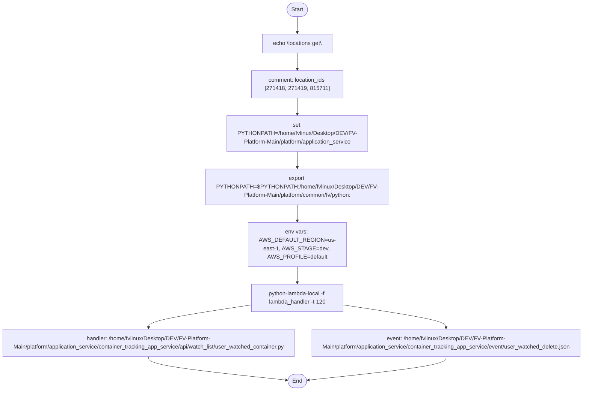

# Diagram: application_service/container_tracking_app_service/event/user_watched_delete.sh

> Auto-generated by Obscura crawlers

## Mermaid

### SVG

<svg id="container" width="1726.3125" xmlns="http://www.w3.org/2000/svg" class="flowchart" height="1112" viewBox="0 0 1726.3125 1112" role="graphics-document document" aria-roledescription="flowchart-v2"><g><marker id="container_flowchart-v2-pointEnd" class="marker flowchart-v2" viewBox="0 0 10 10" refX="5" refY="5" markerUnits="userSpaceOnUse" markerWidth="8" markerHeight="8" orient="auto"><path d="M 0 0 L 10 5 L 0 10 z" class="arrowMarkerPath" style="stroke-width: 1; stroke-dasharray: 1, 0;"></path></marker><marker id="container_flowchart-v2-pointStart" class="marker flowchart-v2" viewBox="0 0 10 10" refX="4.5" refY="5" markerUnits="userSpaceOnUse" markerWidth="8" markerHeight="8" orient="auto"><path d="M 0 5 L 10 10 L 10 0 z" class="arrowMarkerPath" style="stroke-width: 1; stroke-dasharray: 1, 0;"></path></marker><marker id="container_flowchart-v2-circleEnd" class="marker flowchart-v2" viewBox="0 0 10 10" refX="11" refY="5" markerUnits="userSpaceOnUse" markerWidth="11" markerHeight="11" orient="auto"><circle cx="5" cy="5" r="5" class="arrowMarkerPath" style="stroke-width: 1; stroke-dasharray: 1, 0;"></circle></marker><marker id="container_flowchart-v2-circleStart" class="marker flowchart-v2" viewBox="0 0 10 10" refX="-1" refY="5" markerUnits="userSpaceOnUse" markerWidth="11" markerHeight="11" orient="auto"><circle cx="5" cy="5" r="5" class="arrowMarkerPath" style="stroke-width: 1; stroke-dasharray: 1, 0;"></circle></marker><marker id="container_flowchart-v2-crossEnd" class="marker cross flowchart-v2" viewBox="0 0 11 11" refX="12" refY="5.2" markerUnits="userSpaceOnUse" markerWidth="11" markerHeight="11" orient="auto"><path d="M 1,1 l 9,9 M 10,1 l -9,9" class="arrowMarkerPath" style="stroke-width: 2; stroke-dasharray: 1, 0;"></path></marker><marker id="container_flowchart-v2-crossStart" class="marker cross flowchart-v2" viewBox="0 0 11 11" refX="-1" refY="5.2" markerUnits="userSpaceOnUse" markerWidth="11" markerHeight="11" orient="auto"><path d="M 1,1 l 9,9 M 10,1 l -9,9" class="arrowMarkerPath" style="stroke-width: 2; stroke-dasharray: 1, 0;"></path></marker><g class="root"><g class="clusters"></g><g class="edgePaths"><path d="M881.75,47.5L881.667,51.583C881.583,55.667,881.417,63.833,881.333,71.417C881.25,79,881.25,86,881.25,89.5L881.25,93" id="L_A_B_0" class="edge-thickness-normal edge-pattern-solid edge-thickness-normal edge-pattern-solid flowchart-link" style=";" data-edge="true" data-et="edge" data-id="L_A_B_0" data-points="W3sieCI6ODgxLjc1LCJ5Ijo0Ny41fSx7IngiOjg4MS4yNSwieSI6NzJ9LHsieCI6ODgxLjI1LCJ5Ijo5N31d" marker-end="url(#container_flowchart-v2-pointEnd)"></path><path d="M881.25,151L881.25,155.167C881.25,159.333,881.25,167.667,881.25,175.333C881.25,183,881.25,190,881.25,193.5L881.25,197" id="L_B_C_0" class="edge-thickness-normal edge-pattern-solid edge-thickness-normal edge-pattern-solid flowchart-link" style=";" data-edge="true" data-et="edge" data-id="L_B_C_0" data-points="W3sieCI6ODgxLjI1LCJ5IjoxNTF9LHsieCI6ODgxLjI1LCJ5IjoxNzZ9LHsieCI6ODgxLjI1LCJ5IjoyMDF9XQ==" marker-end="url(#container_flowchart-v2-pointEnd)"></path><path d="M881.25,279L881.25,283.167C881.25,287.333,881.25,295.667,881.25,303.333C881.25,311,881.25,318,881.25,321.5L881.25,325" id="L_C_D_0" class="edge-thickness-normal edge-pattern-solid edge-thickness-normal edge-pattern-solid flowchart-link" style=";" data-edge="true" data-et="edge" data-id="L_C_D_0" data-points="W3sieCI6ODgxLjI1LCJ5IjoyNzl9LHsieCI6ODgxLjI1LCJ5IjozMDR9LHsieCI6ODgxLjI1LCJ5IjozMjl9XQ==" marker-end="url(#container_flowchart-v2-pointEnd)"></path><path d="M881.25,431L881.25,435.167C881.25,439.333,881.25,447.667,881.25,455.333C881.25,463,881.25,470,881.25,473.5L881.25,477" id="L_D_E_0" class="edge-thickness-normal edge-pattern-solid edge-thickness-normal edge-pattern-solid flowchart-link" style=";" data-edge="true" data-et="edge" data-id="L_D_E_0" data-points="W3sieCI6ODgxLjI1LCJ5Ijo0MzF9LHsieCI6ODgxLjI1LCJ5Ijo0NTZ9LHsieCI6ODgxLjI1LCJ5Ijo0ODF9XQ==" marker-end="url(#container_flowchart-v2-pointEnd)"></path><path d="M881.25,583L881.25,587.167C881.25,591.333,881.25,599.667,881.25,607.333C881.25,615,881.25,622,881.25,625.5L881.25,629" id="L_E_F_0" class="edge-thickness-normal edge-pattern-solid edge-thickness-normal edge-pattern-solid flowchart-link" style=";" data-edge="true" data-et="edge" data-id="L_E_F_0" data-points="W3sieCI6ODgxLjI1LCJ5Ijo1ODN9LHsieCI6ODgxLjI1LCJ5Ijo2MDh9LHsieCI6ODgxLjI1LCJ5Ijo2MzN9XQ==" marker-end="url(#container_flowchart-v2-pointEnd)"></path><path d="M881.25,759L881.25,763.167C881.25,767.333,881.25,775.667,881.25,783.333C881.25,791,881.25,798,881.25,801.5L881.25,805" id="L_F_G_0" class="edge-thickness-normal edge-pattern-solid edge-thickness-normal edge-pattern-solid flowchart-link" style=";" data-edge="true" data-et="edge" data-id="L_F_G_0" data-points="W3sieCI6ODgxLjI1LCJ5Ijo3NTl9LHsieCI6ODgxLjI1LCJ5Ijo3ODR9LHsieCI6ODgxLjI1LCJ5Ijo4MDl9XQ==" marker-end="url(#container_flowchart-v2-pointEnd)"></path><path d="M751.25,866.906L699.57,874.421C647.891,881.937,544.531,896.969,492.852,907.984C441.172,919,441.172,926,441.172,929.5L441.172,933" id="L_G_H_0" class="edge-thickness-normal edge-pattern-solid edge-thickness-normal edge-pattern-solid flowchart-link" style=";" data-edge="true" data-et="edge" data-id="L_G_H_0" data-points="W3sieCI6NzUxLjI1LCJ5Ijo4NjYuOTA1NzM0MDY3MTA0NX0seyJ4Ijo0NDEuMTcxODc1LCJ5Ijo5MTJ9LHsieCI6NDQxLjE3MTg3NSwieSI6OTM3fV0=" marker-end="url(#container_flowchart-v2-pointEnd)"></path><path d="M1011.25,866.906L1062.93,874.421C1114.609,881.937,1217.969,896.969,1269.648,907.984C1321.328,919,1321.328,926,1321.328,929.5L1321.328,933" id="L_G_I_0" class="edge-thickness-normal edge-pattern-solid edge-thickness-normal edge-pattern-solid flowchart-link" style=";" data-edge="true" data-et="edge" data-id="L_G_I_0" data-points="W3sieCI6MTAxMS4yNSwieSI6ODY2LjkwNTczNDA2NzEwNDV9LHsieCI6MTMyMS4zMjgxMjUsInkiOjkxMn0seyJ4IjoxMzIxLjMyODEyNSwieSI6OTM3fV0=" marker-end="url(#container_flowchart-v2-pointEnd)"></path><path d="M441.172,1015L441.172,1019.167C441.172,1023.333,441.172,1031.667,509.627,1042.83C578.082,1053.993,714.992,1067.985,783.447,1074.981L851.902,1081.978" id="L_H_J_0" class="edge-thickness-normal edge-pattern-solid edge-thickness-normal edge-pattern-solid flowchart-link" style=";" data-edge="true" data-et="edge" data-id="L_H_J_0" data-points="W3sieCI6NDQxLjE3MTg3NSwieSI6MTAxNX0seyJ4Ijo0NDEuMTcxODc1LCJ5IjoxMDQwfSx7IngiOjg1NS44ODEyNjU0OTQ2Mzg2LCJ5IjoxMDgyLjM4NDE5NDcxNDMxN31d" marker-end="url(#container_flowchart-v2-pointEnd)"></path><path d="M1321.328,1015L1321.328,1019.167C1321.328,1023.333,1321.328,1031.667,1253.04,1042.829C1184.751,1053.992,1048.175,1067.984,979.886,1074.98L911.598,1081.977" id="L_I_J_0" class="edge-thickness-normal edge-pattern-solid edge-thickness-normal edge-pattern-solid flowchart-link" style=";" data-edge="true" data-et="edge" data-id="L_I_J_0" data-points="W3sieCI6MTMyMS4zMjgxMjUsInkiOjEwMTV9LHsieCI6MTMyMS4zMjgxMjUsInkiOjEwNDB9LHsieCI6OTA3LjYxODczNTUyODU5MSwieSI6MTA4Mi4zODQxOTQ2MTA4NDk0fV0=" marker-end="url(#container_flowchart-v2-pointEnd)"></path></g><g class="edgeLabels"><g class="edgeLabel"><g class="label" data-id="L_A_B_0" transform="translate(0, 0)"><foreignObject width="0" height="0">

</foreignObject></g></g><g class="edgeLabel"><g class="label" data-id="L_B_C_0" transform="translate(0, 0)"><foreignObject width="0" height="0">

</foreignObject></g></g><g class="edgeLabel"><g class="label" data-id="L_C_D_0" transform="translate(0, 0)"><foreignObject width="0" height="0">

</foreignObject></g></g><g class="edgeLabel"><g class="label" data-id="L_D_E_0" transform="translate(0, 0)"><foreignObject width="0" height="0">

</foreignObject></g></g><g class="edgeLabel"><g class="label" data-id="L_E_F_0" transform="translate(0, 0)"><foreignObject width="0" height="0">

</foreignObject></g></g><g class="edgeLabel"><g class="label" data-id="L_F_G_0" transform="translate(0, 0)"><foreignObject width="0" height="0">

</foreignObject></g></g><g class="edgeLabel"><g class="label" data-id="L_G_H_0" transform="translate(0, 0)"><foreignObject width="0" height="0">

</foreignObject></g></g><g class="edgeLabel"><g class="label" data-id="L_G_I_0" transform="translate(0, 0)"><foreignObject width="0" height="0">

</foreignObject></g></g><g class="edgeLabel"><g class="label" data-id="L_H_J_0" transform="translate(0, 0)"><foreignObject width="0" height="0">

</foreignObject></g></g><g class="edgeLabel"><g class="label" data-id="L_I_J_0" transform="translate(0, 0)"><foreignObject width="0" height="0">

</foreignObject></g></g></g><g class="nodes"><g class="node default" id="flowchart-A-0" transform="translate(881.25, 27.5)"><g class="basic label-container outer-path"><path d="M-10.3984375 -19.5 C-4.898518896056166 -19.5, 0.6013997078876674 -19.5, 10.3984375 -19.5 C10.3984375 -19.5, 10.398437499999998 -19.5, 10.398437499999998 -19.5 C10.758791209299613 -19.488444157928708, 11.119144918599225 -19.476888315857412, 11.6478067896239 -19.45993515863156 C11.900751559561252 -19.435533880886297, 12.153696329498603 -19.411132603141034, 12.892042152847864 -19.3399052695533 C13.38400707339649 -19.260368196443938, 13.875971993945114 -19.180831123334578, 14.126030759676757 -19.140403561325776 C14.606876752212587 -19.030653601342816, 15.087722744748417 -18.92090364135986, 15.34470188623539 -18.862249829261074 C15.683234170745239 -18.761775224210773, 16.02176645525509 -18.661300619160475, 16.543047751460602 -18.50658706670804 C16.89759529043647 -18.376110294963397, 17.25214282941234 -18.245633523218753, 17.716144095147794 -18.074876768247425 C18.142542015187125 -17.886123057690906, 18.568939935226453 -17.697369347134384, 18.85917041279238 -17.568892924097174 C19.237919942027958 -17.371299537295627, 19.616669471263535 -17.173706150494077, 19.967429764076783 -16.990714730406097 C20.277126430637914 -16.802974791157112, 20.586823097199048 -16.615234851908124, 21.036368073605697 -16.342718045390892 C21.33948161793639 -16.131279158439654, 21.642595162267085 -15.919840271488413, 22.061592844578712 -15.627565626425154 C22.433627966276145 -15.330877517141824, 22.805663087973578 -15.034189407858493, 23.03889120850187 -14.848196188198123 C23.23658264884737 -14.668658052705222, 23.43427408919287 -14.48911991721232, 23.964247236767985 -14.007812326905688 C24.180173536414554 -13.784850694641712, 24.396099836061122 -13.561889062377734, 24.833858442968648 -13.10986736009568 C25.01019332028539 -12.902734379460675, 25.186528197602133 -12.695601398825668, 25.644151408126582 -12.158051136245305 C25.935403090732105 -11.767800415128034, 26.22665477333763 -11.377549694010764, 26.391796464640635 -11.156274872382312 C26.567477111300665 -10.886382222253495, 26.743157757960695 -10.616489572124678, 27.073721378604247 -10.108655082055241 C27.258338607862253 -9.780848496986026, 27.44295583712026 -9.453041911916811, 27.6871239742735 -9.019496659696287 C27.896546253761407 -8.584626815420695, 28.105968533249317 -8.149756971145102, 28.22948364880834 -7.893275190886684 C28.400588420475035 -7.4706430967842365, 28.57169319214173 -7.04801100268179, 28.698571729970325 -6.734618561215508 C28.823938021526576 -6.357035265454065, 28.949304313082827 -5.9794519696926205, 29.09246063421488 -5.548287939305138 C29.159804669279566 -5.29147594651407, 29.227148704344252 -5.034663953723003, 29.40953178754556 -4.339158212148133 C29.50398813245209 -3.8541448444086734, 29.59844447735862 -3.369131476669214, 29.648482276581777 -3.1121979531509023 C29.701832315458443 -2.698425586780273, 29.75518235433511 -2.284653220409644, 29.808330202509367 -1.872449005199798 C29.825663915658964 -1.6024624313734062, 29.84299762880856 -1.3324758575470144, 29.888418715913414 -0.6250057626472757 C29.888418715913414 -0.16860323341740002, 29.888418715913414 0.28779929581247565, 29.888418715913414 0.625005762647271 C29.859352020095965 1.077743012218585, 29.83028532427852 1.530480261789899, 29.808330202509367 1.8724490051997846 C29.761398362066966 2.236443091930901, 29.714466521624566 2.600437178662018, 29.648482276581777 3.1121979531508885 C29.59774578826691 3.3727190974871277, 29.547009299952045 3.6332402418233674, 29.40953178754556 4.339158212148129 C29.326048612601454 4.657515740046908, 29.242565437657344 4.975873267945687, 29.092460634214884 5.548287939305125 C28.950652307431266 5.975392025488843, 28.80884398064765 6.402496111672561, 28.69857172997033 6.734618561215495 C28.56914219600479 7.054312012460178, 28.439712662039256 7.374005463704862, 28.229483648808344 7.893275190886679 C28.015765535515293 8.337065425974771, 27.80204742222224 8.780855661062862, 27.687123974273504 9.019496659696284 C27.549730604120988 9.26345250098943, 27.412337233968476 9.507408342282577, 27.07372137860425 10.108655082055236 C26.93724956135645 10.31831244116197, 26.800777744108643 10.527969800268705, 26.39179646464064 11.156274872382301 C26.172360614946395 11.450298919955431, 25.95292476525215 11.744322967528563, 25.644151408126582 12.158051136245302 C25.42081881120363 12.420390312575766, 25.197486214280683 12.682729488906228, 24.83385844296866 13.10986736009567 C24.57028388815208 13.382029727817185, 24.3067093333355 13.654192095538699, 23.96424723676799 14.007812326905684 C23.710653760083076 14.238119212715208, 23.457060283398167 14.468426098524734, 23.038891208501887 14.848196188198111 C22.822665059000467 15.020630788406002, 22.606438909499047 15.193065388613892, 22.061592844578715 15.627565626425152 C21.76678201561995 15.833212898551693, 21.471971186661182 16.038860170678234, 21.036368073605708 16.34271804539089 C20.69870905760776 16.547408925193476, 20.36105004160982 16.752099804996064, 19.967429764076787 16.990714730406093 C19.58731194126635 17.189021955089213, 19.20719411845591 17.387329179772333, 18.859170412792388 17.56889292409717 C18.426705378336397 17.760332366231392, 17.99424034388041 17.951771808365613, 17.716144095147804 18.07487676824742 C17.32117396763584 18.220229426235658, 16.926203840123875 18.365582084223895, 16.543047751460616 18.506587066708033 C16.137564637292904 18.626932326568713, 15.73208152312519 18.74727758642939, 15.344701886235413 18.86224982926107 C15.055987553346645 18.928146991705837, 14.767273220457877 18.994044154150604, 14.126030759676766 19.140403561325773 C13.7995683247854 19.193183476045014, 13.47310588989403 19.245963390764256, 12.892042152847878 19.3399052695533 C12.432568341617836 19.384230155524556, 11.973094530387794 19.428555041495812, 11.6478067896239 19.45993515863156 C11.154049990686554 19.475768978134173, 10.660293191749208 19.491602797636787, 10.398437500000004 19.5 C10.398437500000004 19.5, 10.398437500000002 19.5, 10.3984375 19.5 C4.08142205763474 19.5, -2.235593384730519 19.5, -10.398437499999996 19.5 C-10.746367826277611 19.488842551641575, -11.094298152555226 19.477685103283147, -11.647806789623893 19.45993515863156 C-12.054998936709177 19.420653821922446, -12.462191083794462 19.381372485213333, -12.892042152847871 19.3399052695533 C-13.382687581915047 19.26058152159385, -13.873333010982222 19.181257773634396, -14.126030759676759 19.140403561325773 C-14.397905661841476 19.078349889056216, -14.669780564006194 19.01629621678666, -15.344701886235388 18.862249829261074 C-15.741048678552971 18.744616181767984, -16.137395470870555 18.626982534274894, -16.54304775146059 18.506587066708043 C-16.940579752860124 18.360291615447476, -17.338111754259657 18.213996164186913, -17.716144095147797 18.074876768247425 C-17.961562825267734 17.966237176511296, -18.206981555387674 17.857597584775164, -18.85917041279238 17.568892924097174 C-19.23476759162096 17.37294411648378, -19.610364770449543 17.17699530887038, -19.96742976407678 16.990714730406097 C-20.34214537871201 16.76355992274084, -20.716860993347247 16.536405115075585, -21.036368073605686 16.3427180453909 C-21.249799056210346 16.193837831204217, -21.463230038815006 16.04495761701753, -22.061592844578712 15.627565626425156 C-22.39677872822754 15.36026380388618, -22.73196461187637 15.092961981347205, -23.03889120850187 14.848196188198125 C-23.31712090044379 14.595515343530723, -23.595350592385707 14.34283449886332, -23.964247236767974 14.007812326905697 C-24.200998444001073 13.76334726780192, -24.437749651234167 13.518882208698146, -24.833858442968655 13.109867360095677 C-25.020704938797525 12.890386834228286, -25.207551434626396 12.670906308360895, -25.64415140812658 12.158051136245307 C-25.90928091485411 11.802801751025367, -26.174410421581644 11.447552365805427, -26.391796464640635 11.156274872382316 C-26.6026617514842 10.832329166532801, -26.813527038327763 10.508383460683286, -27.073721378604244 10.108655082055249 C-27.29272824614259 9.719786211890797, -27.511735113680942 9.330917341726348, -27.6871239742735 9.019496659696289 C-27.880391373774035 8.618172769373531, -28.073658773274573 8.216848879050776, -28.22948364880834 7.893275190886686 C-28.356940855698287 7.578453425651064, -28.484398062588234 7.2636316604154425, -28.698571729970325 6.73461856121551 C-28.77848436639026 6.4939344326681985, -28.85839700281019 6.253250304120886, -29.09246063421488 5.5482879393051325 C-29.19329556259494 5.163760655257557, -29.294130490975 4.779233371209981, -29.409531787545557 4.339158212148136 C-29.468489765705623 4.036421455069303, -29.527447743865686 3.73368469799047, -29.648482276581777 3.112197953150904 C-29.710547672681855 2.630830997197437, -29.77261306878193 2.1494640412439705, -29.808330202509364 1.872449005199809 C-29.83556026863475 1.4483187455831221, -29.86279033476014 1.0241884859664352, -29.888418715913414 0.6250057626472781 C-29.888418715913414 0.32829161033016085, -29.888418715913414 0.03157745801304357, -29.888418715913414 -0.6250057626472687 C-29.871060470923585 -0.895374439687034, -29.853702225933755 -1.1657431167267993, -29.808330202509367 -1.8724490051997822 C-29.7444265104567 -2.3680734215489236, -29.68052281840404 -2.863697837898065, -29.648482276581777 -3.112197953150895 C-29.59400783309732 -3.3919127072658872, -29.53953338961286 -3.6716274613808793, -29.40953178754556 -4.339158212148126 C-29.303301940687124 -4.744258658526208, -29.197072093828687 -5.149359104904289, -29.092460634214884 -5.548287939305123 C-28.999566566618018 -5.828070070247177, -28.906672499021155 -6.107852201189232, -28.698571729970332 -6.734618561215485 C-28.587273287292238 -7.009527866439385, -28.47597484461414 -7.284437171663286, -28.229483648808344 -7.893275190886676 C-28.072648114360256 -8.218947533910987, -27.91581257991217 -8.544619876935299, -27.687123974273504 -9.019496659696282 C-27.462779178179076 -9.41784356253593, -27.238434382084648 -9.816190465375577, -27.073721378604247 -10.108655082055243 C-26.864830034420212 -10.4295682819019, -26.655938690236177 -10.750481481748558, -26.39179646464064 -11.156274872382308 C-26.098473022405095 -11.549301562662622, -25.805149580169548 -11.942328252942938, -25.644151408126586 -12.158051136245302 C-25.46916918598007 -12.3635952111491, -25.294186963833557 -12.569139286052899, -24.833858442968662 -13.10986736009567 C-24.489345252607468 -13.465605514202561, -24.144832062246273 -13.821343668309455, -23.964247236767996 -14.007812326905677 C-23.606023138797795 -14.333141974591966, -23.24779904082759 -14.658471622278254, -23.038891208501887 -14.848196188198107 C-22.818476303669975 -15.023971209314606, -22.598061398838063 -15.199746230431105, -22.06159284457872 -15.627565626425149 C-21.673777509150735 -15.898088816164417, -21.285962173722755 -16.16861200590369, -21.03636807360571 -16.342718045390885 C-20.81082797971868 -16.479441775725913, -20.585287885831647 -16.616165506060945, -19.96742976407679 -16.99071473040609 C-19.586453208385716 -17.189469955482995, -19.205476652694642 -17.388225180559896, -18.859170412792388 -17.56889292409717 C-18.45235990429232 -17.74897586860518, -18.04554939579225 -17.929058813113187, -17.716144095147804 -18.07487676824742 C-17.38048125949193 -18.198403794602022, -17.04481842383606 -18.32193082095662, -16.54304775146062 -18.506587066708033 C-16.1590224629535 -18.62056375654707, -15.774997174446387 -18.73454044638611, -15.344701886235413 -18.862249829261067 C-14.937244994515993 -18.95524920589132, -14.529788102796573 -19.048248582521573, -14.126030759676768 -19.140403561325773 C-13.73271199699782 -19.203992288643146, -13.339393234318871 -19.26758101596052, -12.89204215284788 -19.3399052695533 C-12.461541373122756 -19.381435162020445, -12.031040593397632 -19.42296505448759, -11.647806789623903 -19.45993515863156 C-11.166572637446935 -19.47536740122642, -10.685338485269964 -19.490799643821283, -10.398437500000005 -19.5 C-10.398437500000004 -19.5, -10.398437500000002 -19.5, -10.3984375 -19.5" stroke="none" stroke-width="0" fill="#ECECFF" style=""></path><path d="M-10.3984375 -19.5 C-5.68427428514172 -19.5, -0.9701110702834406 -19.5, 10.3984375 -19.5 M-10.3984375 -19.5 C-2.858096582673644 -19.5, 4.682244334652712 -19.5, 10.3984375 -19.5 M10.3984375 -19.5 C10.3984375 -19.5, 10.398437499999998 -19.5, 10.398437499999998 -19.5 M10.3984375 -19.5 C10.3984375 -19.5, 10.398437499999998 -19.5, 10.398437499999998 -19.5 M10.398437499999998 -19.5 C10.889497629383062 -19.484252657441242, 11.380557758766125 -19.468505314882485, 11.6478067896239 -19.45993515863156 M10.398437499999998 -19.5 C10.741712628192184 -19.48899183478338, 11.08498775638437 -19.47798366956676, 11.6478067896239 -19.45993515863156 M11.6478067896239 -19.45993515863156 C12.019987483762762 -19.424031334680755, 12.392168177901622 -19.38812751072995, 12.892042152847864 -19.3399052695533 M11.6478067896239 -19.45993515863156 C12.109674448059513 -19.415379341099403, 12.571542106495126 -19.370823523567246, 12.892042152847864 -19.3399052695533 M12.892042152847864 -19.3399052695533 C13.28096300331121 -19.277027562576627, 13.669883853774557 -19.214149855599956, 14.126030759676757 -19.140403561325776 M12.892042152847864 -19.3399052695533 C13.1412149004632 -19.299620952082368, 13.390387648078539 -19.25933663461144, 14.126030759676757 -19.140403561325776 M14.126030759676757 -19.140403561325776 C14.512507596839663 -19.052192745240397, 14.898984434002568 -18.96398192915502, 15.34470188623539 -18.862249829261074 M14.126030759676757 -19.140403561325776 C14.414634727200283 -19.074531589055425, 14.70323869472381 -19.00865961678507, 15.34470188623539 -18.862249829261074 M15.34470188623539 -18.862249829261074 C15.700151357167373 -18.75675429208081, 16.055600828099355 -18.651258754900542, 16.543047751460602 -18.50658706670804 M15.34470188623539 -18.862249829261074 C15.699642107014117 -18.756905434853188, 16.054582327792847 -18.651561040445298, 16.543047751460602 -18.50658706670804 M16.543047751460602 -18.50658706670804 C16.929662916552672 -18.364309112122747, 17.316278081644747 -18.222031157537455, 17.716144095147794 -18.074876768247425 M16.543047751460602 -18.50658706670804 C16.994878583423485 -18.340309143867273, 17.446709415386373 -18.174031221026503, 17.716144095147794 -18.074876768247425 M17.716144095147794 -18.074876768247425 C17.99455880127874 -17.951630836722074, 18.272973507409688 -17.828384905196724, 18.85917041279238 -17.568892924097174 M17.716144095147794 -18.074876768247425 C18.03539681754831 -17.933553058336244, 18.354649539948827 -17.792229348425067, 18.85917041279238 -17.568892924097174 M18.85917041279238 -17.568892924097174 C19.1863377198578 -17.398209949561807, 19.513505026923223 -17.22752697502644, 19.967429764076783 -16.990714730406097 M18.85917041279238 -17.568892924097174 C19.172057757394985 -17.405659796831905, 19.48494510199759 -17.242426669566637, 19.967429764076783 -16.990714730406097 M19.967429764076783 -16.990714730406097 C20.36281410602265 -16.751030418782207, 20.75819844796852 -16.51134610715832, 21.036368073605697 -16.342718045390892 M19.967429764076783 -16.990714730406097 C20.21258201459636 -16.842101995466592, 20.457734265115942 -16.693489260527084, 21.036368073605697 -16.342718045390892 M21.036368073605697 -16.342718045390892 C21.33400845929147 -16.13509699698113, 21.63164884497725 -15.927475948571365, 22.061592844578712 -15.627565626425154 M21.036368073605697 -16.342718045390892 C21.376339861027567 -16.105568443626876, 21.716311648449437 -15.868418841862859, 22.061592844578712 -15.627565626425154 M22.061592844578712 -15.627565626425154 C22.399436887246644 -15.358143992805028, 22.737280929914572 -15.088722359184901, 23.03889120850187 -14.848196188198123 M22.061592844578712 -15.627565626425154 C22.313297442861863 -15.426837907435006, 22.56500204114501 -15.226110188444858, 23.03889120850187 -14.848196188198123 M23.03889120850187 -14.848196188198123 C23.372443157582 -14.54527313334451, 23.70599510666213 -14.242350078490897, 23.964247236767985 -14.007812326905688 M23.03889120850187 -14.848196188198123 C23.276275532175553 -14.632610026282709, 23.513659855849237 -14.417023864367295, 23.964247236767985 -14.007812326905688 M23.964247236767985 -14.007812326905688 C24.295708967982783 -13.665550875912174, 24.62717069919758 -13.32328942491866, 24.833858442968648 -13.10986736009568 M23.964247236767985 -14.007812326905688 C24.21197461853163 -13.752013466438429, 24.45970200029528 -13.49621460597117, 24.833858442968648 -13.10986736009568 M24.833858442968648 -13.10986736009568 C25.15568876262781 -12.731827153960063, 25.477519082286978 -12.353786947824448, 25.644151408126582 -12.158051136245305 M24.833858442968648 -13.10986736009568 C25.11103375223137 -12.784281470113797, 25.388209061494095 -12.458695580131911, 25.644151408126582 -12.158051136245305 M25.644151408126582 -12.158051136245305 C25.90882100165293 -11.803417992815994, 26.17349059517928 -11.448784849386682, 26.391796464640635 -11.156274872382312 M25.644151408126582 -12.158051136245305 C25.8412936440898 -11.893898500081761, 26.038435880053015 -11.629745863918219, 26.391796464640635 -11.156274872382312 M26.391796464640635 -11.156274872382312 C26.59971706142221 -10.836853001228011, 26.807637658203785 -10.51743113007371, 27.073721378604247 -10.108655082055241 M26.391796464640635 -11.156274872382312 C26.54074153335352 -10.927455249488217, 26.689686602066402 -10.69863562659412, 27.073721378604247 -10.108655082055241 M27.073721378604247 -10.108655082055241 C27.21624721146185 -9.855586033511004, 27.358773044319456 -9.602516984966767, 27.6871239742735 -9.019496659696287 M27.073721378604247 -10.108655082055241 C27.23489923517195 -9.822467476691514, 27.396077091739656 -9.536279871327787, 27.6871239742735 -9.019496659696287 M27.6871239742735 -9.019496659696287 C27.819080483277574 -8.745486145332341, 27.951036992281644 -8.471475630968396, 28.22948364880834 -7.893275190886684 M27.6871239742735 -9.019496659696287 C27.803895794212337 -8.777017477076601, 27.920667614151174 -8.534538294456917, 28.22948364880834 -7.893275190886684 M28.22948364880834 -7.893275190886684 C28.35353277937858 -7.586871440051411, 28.47758190994882 -7.280467689216136, 28.698571729970325 -6.734618561215508 M28.22948364880834 -7.893275190886684 C28.392142831103545 -7.491503865816183, 28.554802013398746 -7.089732540745681, 28.698571729970325 -6.734618561215508 M28.698571729970325 -6.734618561215508 C28.825230284110596 -6.3531431764450765, 28.951888838250866 -5.971667791674645, 29.09246063421488 -5.548287939305138 M28.698571729970325 -6.734618561215508 C28.846738537025296 -6.288363745540719, 28.99490534408027 -5.842108929865931, 29.09246063421488 -5.548287939305138 M29.09246063421488 -5.548287939305138 C29.20946899818971 -5.102084335723385, 29.32647736216454 -4.655880732141632, 29.40953178754556 -4.339158212148133 M29.09246063421488 -5.548287939305138 C29.216467125897644 -5.075397441765293, 29.340473617580408 -4.602506944225448, 29.40953178754556 -4.339158212148133 M29.40953178754556 -4.339158212148133 C29.473281151103 -4.011818703713446, 29.537030514660437 -3.6844791952787586, 29.648482276581777 -3.1121979531509023 M29.40953178754556 -4.339158212148133 C29.484719115136073 -3.9530871758181663, 29.559906442726586 -3.567016139488199, 29.648482276581777 -3.1121979531509023 M29.648482276581777 -3.1121979531509023 C29.687130815032067 -2.8124475209476154, 29.725779353482356 -2.5126970887443285, 29.808330202509367 -1.872449005199798 M29.648482276581777 -3.1121979531509023 C29.68347586982212 -2.8407945542453774, 29.718469463062466 -2.5693911553398525, 29.808330202509367 -1.872449005199798 M29.808330202509367 -1.872449005199798 C29.829577583608714 -1.5415038940001407, 29.85082496470806 -1.2105587828004836, 29.888418715913414 -0.6250057626472757 M29.808330202509367 -1.872449005199798 C29.833244104630655 -1.4843948695209073, 29.858158006751943 -1.0963407338420166, 29.888418715913414 -0.6250057626472757 M29.888418715913414 -0.6250057626472757 C29.888418715913414 -0.29909006473065497, 29.888418715913414 0.026825633185965758, 29.888418715913414 0.625005762647271 M29.888418715913414 -0.6250057626472757 C29.888418715913414 -0.26742182383338725, 29.888418715913414 0.0901621149805012, 29.888418715913414 0.625005762647271 M29.888418715913414 0.625005762647271 C29.858759632812863 1.0869699223193412, 29.82910054971231 1.548934081991411, 29.808330202509367 1.8724490051997846 M29.888418715913414 0.625005762647271 C29.8576672077088 1.1039853251047727, 29.826915699504188 1.5829648875622744, 29.808330202509367 1.8724490051997846 M29.808330202509367 1.8724490051997846 C29.768799274169066 2.179043079142408, 29.729268345828764 2.4856371530850305, 29.648482276581777 3.1121979531508885 M29.808330202509367 1.8724490051997846 C29.75884313957635 2.2562608929823718, 29.70935607664333 2.640072780764959, 29.648482276581777 3.1121979531508885 M29.648482276581777 3.1121979531508885 C29.595980623911316 3.3817828433854893, 29.543478971240855 3.6513677336200905, 29.40953178754556 4.339158212148129 M29.648482276581777 3.1121979531508885 C29.596955076367518 3.3767792359734985, 29.545427876153255 3.6413605187961084, 29.40953178754556 4.339158212148129 M29.40953178754556 4.339158212148129 C29.284635862660586 4.8154405039707875, 29.159739937775615 5.291722795793447, 29.092460634214884 5.548287939305125 M29.40953178754556 4.339158212148129 C29.3181747635838 4.6875421388989595, 29.226817739622046 5.03592606564979, 29.092460634214884 5.548287939305125 M29.092460634214884 5.548287939305125 C28.99024195391648 5.856154318028932, 28.88802327361808 6.16402069675274, 28.69857172997033 6.734618561215495 M29.092460634214884 5.548287939305125 C28.95163069084928 5.972445290518008, 28.810800747483682 6.396602641730891, 28.69857172997033 6.734618561215495 M28.69857172997033 6.734618561215495 C28.597628116347583 6.983951238475686, 28.496684502724833 7.233283915735877, 28.229483648808344 7.893275190886679 M28.69857172997033 6.734618561215495 C28.51936616052321 7.177259782453867, 28.34016059107609 7.619901003692241, 28.229483648808344 7.893275190886679 M28.229483648808344 7.893275190886679 C28.043089519648557 8.280326588282442, 27.856695390488774 8.667377985678204, 27.687123974273504 9.019496659696284 M28.229483648808344 7.893275190886679 C28.106091502704007 8.149501622441317, 27.982699356599667 8.405728053995954, 27.687123974273504 9.019496659696284 M27.687123974273504 9.019496659696284 C27.464725780161118 9.414387173601993, 27.24232758604873 9.809277687507702, 27.07372137860425 10.108655082055236 M27.687123974273504 9.019496659696284 C27.477590956450832 9.391543750359242, 27.26805793862816 9.763590841022198, 27.07372137860425 10.108655082055236 M27.07372137860425 10.108655082055236 C26.87337758037152 10.416436955983222, 26.67303378213879 10.72421882991121, 26.39179646464064 11.156274872382301 M27.07372137860425 10.108655082055236 C26.869905690300914 10.4217707114647, 26.666090001997574 10.73488634087416, 26.39179646464064 11.156274872382301 M26.39179646464064 11.156274872382301 C26.166586028256873 11.458036340043721, 25.941375591873104 11.75979780770514, 25.644151408126582 12.158051136245302 M26.39179646464064 11.156274872382301 C26.17339273476458 11.448915973427116, 25.954989004888514 11.741557074471931, 25.644151408126582 12.158051136245302 M25.644151408126582 12.158051136245302 C25.435056526038206 12.40366588258215, 25.22596164394983 12.649280628918996, 24.83385844296866 13.10986736009567 M25.644151408126582 12.158051136245302 C25.47422684137404 12.357654201334594, 25.304302274621502 12.557257266423887, 24.83385844296866 13.10986736009567 M24.83385844296866 13.10986736009567 C24.59196592139294 13.359641248367963, 24.35007339981722 13.609415136640255, 23.96424723676799 14.007812326905684 M24.83385844296866 13.10986736009567 C24.584294843414288 13.367562266188136, 24.334731243859917 13.625257172280602, 23.96424723676799 14.007812326905684 M23.96424723676799 14.007812326905684 C23.768899346866196 14.185222111892557, 23.573551456964406 14.36263189687943, 23.038891208501887 14.848196188198111 M23.96424723676799 14.007812326905684 C23.744984049243524 14.206941352429366, 23.525720861719062 14.40607037795305, 23.038891208501887 14.848196188198111 M23.038891208501887 14.848196188198111 C22.803791593747746 15.035681874701043, 22.568691978993606 15.223167561203976, 22.061592844578715 15.627565626425152 M23.038891208501887 14.848196188198111 C22.829302842504863 15.015337332700085, 22.619714476507834 15.182478477202059, 22.061592844578715 15.627565626425152 M22.061592844578715 15.627565626425152 C21.838468143003695 15.783207759331232, 21.61534344142867 15.938849892237311, 21.036368073605708 16.34271804539089 M22.061592844578715 15.627565626425152 C21.744408206881683 15.848819898980937, 21.42722356918465 16.07007417153672, 21.036368073605708 16.34271804539089 M21.036368073605708 16.34271804539089 C20.721381947188178 16.53366448628914, 20.406395820770648 16.72461092718739, 19.967429764076787 16.990714730406093 M21.036368073605708 16.34271804539089 C20.619130616952756 16.595649843573366, 20.201893160299804 16.848581641755842, 19.967429764076787 16.990714730406093 M19.967429764076787 16.990714730406093 C19.548488438861895 17.209276151425975, 19.129547113647003 17.42783757244586, 18.859170412792388 17.56889292409717 M19.967429764076787 16.990714730406093 C19.69273529777881 17.134022657523545, 19.418040831480837 17.277330584640993, 18.859170412792388 17.56889292409717 M18.859170412792388 17.56889292409717 C18.504060653914664 17.726089480395615, 18.14895089503694 17.88328603669406, 17.716144095147804 18.07487676824742 M18.859170412792388 17.56889292409717 C18.60886263621182 17.67969675167301, 18.35855485963125 17.79050057924885, 17.716144095147804 18.07487676824742 M17.716144095147804 18.07487676824742 C17.384164117562655 18.197048468788026, 17.052184139977506 18.319220169328634, 16.543047751460616 18.506587066708033 M17.716144095147804 18.07487676824742 C17.431214983024773 18.179733315364537, 17.146285870901742 18.28458986248165, 16.543047751460616 18.506587066708033 M16.543047751460616 18.506587066708033 C16.14310130576741 18.625289072428043, 15.743154860074204 18.743991078148056, 15.344701886235413 18.86224982926107 M16.543047751460616 18.506587066708033 C16.076286097035293 18.64511947565955, 15.609524442609974 18.783651884611064, 15.344701886235413 18.86224982926107 M15.344701886235413 18.86224982926107 C15.095549051046632 18.919117338018715, 14.846396215857851 18.975984846776356, 14.126030759676766 19.140403561325773 M15.344701886235413 18.86224982926107 C15.07476850945226 18.923860361031924, 14.804835132669108 18.985470892802773, 14.126030759676766 19.140403561325773 M14.126030759676766 19.140403561325773 C13.759239778889398 19.199703482592938, 13.392448798102029 19.2590034038601, 12.892042152847878 19.3399052695533 M14.126030759676766 19.140403561325773 C13.729401716824647 19.204527469069937, 13.332772673972528 19.268651376814102, 12.892042152847878 19.3399052695533 M12.892042152847878 19.3399052695533 C12.612350020180116 19.366886833212753, 12.332657887512356 19.39386839687221, 11.6478067896239 19.45993515863156 M12.892042152847878 19.3399052695533 C12.568429085264961 19.371123832981368, 12.244816017682044 19.402342396409434, 11.6478067896239 19.45993515863156 M11.6478067896239 19.45993515863156 C11.280450184393805 19.471715569945033, 10.91309357916371 19.483495981258507, 10.398437500000004 19.5 M11.6478067896239 19.45993515863156 C11.284897039205205 19.47157296796651, 10.921987288786509 19.48321077730146, 10.398437500000004 19.5 M10.398437500000004 19.5 C10.398437500000004 19.5, 10.398437500000002 19.5, 10.3984375 19.5 M10.398437500000004 19.5 C10.398437500000002 19.5, 10.398437500000002 19.5, 10.3984375 19.5 M10.3984375 19.5 C2.695102731714334 19.5, -5.008232036571332 19.5, -10.398437499999996 19.5 M10.3984375 19.5 C5.544883555505465 19.5, 0.6913296110109304 19.5, -10.398437499999996 19.5 M-10.398437499999996 19.5 C-10.888919777432017 19.484271188028593, -11.379402054864038 19.468542376057183, -11.647806789623893 19.45993515863156 M-10.398437499999996 19.5 C-10.769611291846001 19.488097178941455, -11.140785083692004 19.476194357882914, -11.647806789623893 19.45993515863156 M-11.647806789623893 19.45993515863156 C-12.009744082992844 19.425019503233536, -12.371681376361796 19.390103847835515, -12.892042152847871 19.3399052695533 M-11.647806789623893 19.45993515863156 C-12.08027494536468 19.4182154757663, -12.512743101105468 19.37649579290104, -12.892042152847871 19.3399052695533 M-12.892042152847871 19.3399052695533 C-13.161763827536161 19.296298760912524, -13.431485502224453 19.252692252271746, -14.126030759676759 19.140403561325773 M-12.892042152847871 19.3399052695533 C-13.1544461487293 19.29748182647257, -13.416850144610729 19.25505838339184, -14.126030759676759 19.140403561325773 M-14.126030759676759 19.140403561325773 C-14.540731096155955 19.045750915696996, -14.95543143263515 18.951098270068222, -15.344701886235388 18.862249829261074 M-14.126030759676759 19.140403561325773 C-14.508595185539114 19.053085727588876, -14.891159611401468 18.96576789385198, -15.344701886235388 18.862249829261074 M-15.344701886235388 18.862249829261074 C-15.6767616131499 18.76369624532992, -16.00882134006441 18.66514266139877, -16.54304775146059 18.506587066708043 M-15.344701886235388 18.862249829261074 C-15.677714228439351 18.763413514112393, -16.010726570643314 18.664577198963713, -16.54304775146059 18.506587066708043 M-16.54304775146059 18.506587066708043 C-16.986903937972016 18.34324388711023, -17.43076012448344 18.179900707512413, -17.716144095147797 18.074876768247425 M-16.54304775146059 18.506587066708043 C-16.872447966514958 18.38536474262583, -17.201848181569325 18.26414241854361, -17.716144095147797 18.074876768247425 M-17.716144095147797 18.074876768247425 C-18.030125861220814 17.935886354345065, -18.344107627293834 17.796895940442706, -18.85917041279238 17.568892924097174 M-17.716144095147797 18.074876768247425 C-17.95861738440369 17.96754103580841, -18.201090673659586 17.86020530336939, -18.85917041279238 17.568892924097174 M-18.85917041279238 17.568892924097174 C-19.14472369003862 17.419919962263414, -19.430276967284865 17.270947000429654, -19.96742976407678 16.990714730406097 M-18.85917041279238 17.568892924097174 C-19.266505558513543 17.356386439485057, -19.67384070423471 17.143879954872936, -19.96742976407678 16.990714730406097 M-19.96742976407678 16.990714730406097 C-20.26638200426383 16.80948812556634, -20.565334244450877 16.62826152072658, -21.036368073605686 16.3427180453909 M-19.96742976407678 16.990714730406097 C-20.39109253803458 16.733887867114063, -20.814755311992386 16.477061003822026, -21.036368073605686 16.3427180453909 M-21.036368073605686 16.3427180453909 C-21.35440468598118 16.12086947218081, -21.672441298356674 15.899020898970722, -22.061592844578712 15.627565626425156 M-21.036368073605686 16.3427180453909 C-21.331828052238013 16.136617954553323, -21.62728803087034 15.930517863715746, -22.061592844578712 15.627565626425156 M-22.061592844578712 15.627565626425156 C-22.384338780739657 15.370184330966861, -22.707084716900606 15.112803035508566, -23.03889120850187 14.848196188198125 M-22.061592844578712 15.627565626425156 C-22.29731746456872 15.439581514878705, -22.533042084558733 15.251597403332255, -23.03889120850187 14.848196188198125 M-23.03889120850187 14.848196188198125 C-23.400910577732887 14.519419775570139, -23.7629299469639 14.190643362942154, -23.964247236767974 14.007812326905697 M-23.03889120850187 14.848196188198125 C-23.23631631345025 14.66889993146604, -23.43374141839863 14.489603674733956, -23.964247236767974 14.007812326905697 M-23.964247236767974 14.007812326905697 C-24.221832617533938 13.741834273111778, -24.479417998299905 13.475856219317857, -24.833858442968655 13.109867360095677 M-23.964247236767974 14.007812326905697 C-24.145796019316705 13.820348303491881, -24.32734480186544 13.632884280078065, -24.833858442968655 13.109867360095677 M-24.833858442968655 13.109867360095677 C-25.03297799286911 12.875970206559241, -25.232097542769566 12.642073053022806, -25.64415140812658 12.158051136245307 M-24.833858442968655 13.109867360095677 C-25.14339444159409 12.746268763012962, -25.452930440219525 12.382670165930246, -25.64415140812658 12.158051136245307 M-25.64415140812658 12.158051136245307 C-25.816476882860954 11.927150699274954, -25.988802357595333 11.6962502623046, -26.391796464640635 11.156274872382316 M-25.64415140812658 12.158051136245307 C-25.876670168878494 11.84649717973262, -26.10918892963041 11.534943223219932, -26.391796464640635 11.156274872382316 M-26.391796464640635 11.156274872382316 C-26.575984921533582 10.873311941068806, -26.76017337842653 10.590349009755299, -27.073721378604244 10.108655082055249 M-26.391796464640635 11.156274872382316 C-26.650699769096722 10.758529871466063, -26.90960307355281 10.360784870549809, -27.073721378604244 10.108655082055249 M-27.073721378604244 10.108655082055249 C-27.312658628800886 9.684397799310911, -27.551595878997528 9.260140516566574, -27.6871239742735 9.019496659696289 M-27.073721378604244 10.108655082055249 C-27.26866019407781 9.762521475486363, -27.46359900955138 9.416387868917477, -27.6871239742735 9.019496659696289 M-27.6871239742735 9.019496659696289 C-27.796393677593368 8.792595782755471, -27.905663380913236 8.565694905814656, -28.22948364880834 7.893275190886686 M-27.6871239742735 9.019496659696289 C-27.84947632292301 8.682368533941812, -28.01182867157252 8.345240408187335, -28.22948364880834 7.893275190886686 M-28.22948364880834 7.893275190886686 C-28.341308759353456 7.61706500584882, -28.45313386989857 7.340854820810954, -28.698571729970325 6.73461856121551 M-28.22948364880834 7.893275190886686 C-28.359555584541734 7.571994994855402, -28.489627520275132 7.250714798824118, -28.698571729970325 6.73461856121551 M-28.698571729970325 6.73461856121551 C-28.855207145274992 6.262857646782129, -29.011842560579655 5.791096732348748, -29.09246063421488 5.5482879393051325 M-28.698571729970325 6.73461856121551 C-28.793619878974965 6.448348680279494, -28.88866802797961 6.162078799343479, -29.09246063421488 5.5482879393051325 M-29.09246063421488 5.5482879393051325 C-29.16707590226947 5.263747583751239, -29.241691170324064 4.979207228197344, -29.409531787545557 4.339158212148136 M-29.09246063421488 5.5482879393051325 C-29.206288779541943 5.114211887742797, -29.320116924869 4.68013583618046, -29.409531787545557 4.339158212148136 M-29.409531787545557 4.339158212148136 C-29.458940470854316 4.085455065886574, -29.508349154163078 3.8317519196250123, -29.648482276581777 3.112197953150904 M-29.409531787545557 4.339158212148136 C-29.466445316241714 4.046919270971932, -29.523358844937867 3.754680329795729, -29.648482276581777 3.112197953150904 M-29.648482276581777 3.112197953150904 C-29.695029621586134 2.751185937110052, -29.74157696659049 2.3901739210692003, -29.808330202509364 1.872449005199809 M-29.648482276581777 3.112197953150904 C-29.6845024749973 2.832832407232839, -29.720522673412816 2.5534668613147735, -29.808330202509364 1.872449005199809 M-29.808330202509364 1.872449005199809 C-29.825035581469546 1.6122492435557596, -29.841740960429732 1.3520494819117101, -29.888418715913414 0.6250057626472781 M-29.808330202509364 1.872449005199809 C-29.829281133242375 1.5461213477462528, -29.850232063975387 1.2197936902926965, -29.888418715913414 0.6250057626472781 M-29.888418715913414 0.6250057626472781 C-29.888418715913414 0.16109534979405699, -29.888418715913414 -0.30281506305916417, -29.888418715913414 -0.6250057626472687 M-29.888418715913414 0.6250057626472781 C-29.888418715913414 0.35775488464536626, -29.888418715913414 0.09050400664345437, -29.888418715913414 -0.6250057626472687 M-29.888418715913414 -0.6250057626472687 C-29.8685881514569 -0.9338828110010027, -29.848757587000385 -1.2427598593547367, -29.808330202509367 -1.8724490051997822 M-29.888418715913414 -0.6250057626472687 C-29.870643525374483 -0.9018687031666786, -29.852868334835552 -1.1787316436860884, -29.808330202509367 -1.8724490051997822 M-29.808330202509367 -1.8724490051997822 C-29.757770688906074 -2.2645786086016937, -29.707211175302778 -2.656708212003605, -29.648482276581777 -3.112197953150895 M-29.808330202509367 -1.8724490051997822 C-29.750259372945013 -2.322834891918557, -29.692188543380663 -2.7732207786373326, -29.648482276581777 -3.112197953150895 M-29.648482276581777 -3.112197953150895 C-29.581284389802065 -3.4572448994863194, -29.51408650302235 -3.8022918458217436, -29.40953178754556 -4.339158212148126 M-29.648482276581777 -3.112197953150895 C-29.558499893822905 -3.574238470834383, -29.46851751106403 -4.0362789885178705, -29.40953178754556 -4.339158212148126 M-29.40953178754556 -4.339158212148126 C-29.314918202517017 -4.699960817649101, -29.220304617488477 -5.0607634231500755, -29.092460634214884 -5.548287939305123 M-29.40953178754556 -4.339158212148126 C-29.287039894255393 -4.806272889585906, -29.164548000965226 -5.273387567023686, -29.092460634214884 -5.548287939305123 M-29.092460634214884 -5.548287939305123 C-28.97267649689916 -5.909058675889597, -28.85289235958344 -6.26982941247407, -28.698571729970332 -6.734618561215485 M-29.092460634214884 -5.548287939305123 C-28.94917766475734 -5.979833414270313, -28.80589469529979 -6.411378889235504, -28.698571729970332 -6.734618561215485 M-28.698571729970332 -6.734618561215485 C-28.535242844719654 -7.138044065533834, -28.37191395946898 -7.541469569852183, -28.229483648808344 -7.893275190886676 M-28.698571729970332 -6.734618561215485 C-28.573782861087594 -7.042849479984505, -28.44899399220485 -7.351080398753525, -28.229483648808344 -7.893275190886676 M-28.229483648808344 -7.893275190886676 C-28.078693899995088 -8.206393330681175, -27.927904151181828 -8.519511470475674, -27.687123974273504 -9.019496659696282 M-28.229483648808344 -7.893275190886676 C-28.109742980769536 -8.14191925010913, -27.990002312730727 -8.390563309331583, -27.687123974273504 -9.019496659696282 M-27.687123974273504 -9.019496659696282 C-27.494112842187544 -9.362207469211361, -27.301101710101584 -9.70491827872644, -27.073721378604247 -10.108655082055243 M-27.687123974273504 -9.019496659696282 C-27.527916285283176 -9.302186033025277, -27.368708596292848 -9.584875406354275, -27.073721378604247 -10.108655082055243 M-27.073721378604247 -10.108655082055243 C-26.93327744797821 -10.324414673972734, -26.79283351735217 -10.540174265890228, -26.39179646464064 -11.156274872382308 M-27.073721378604247 -10.108655082055243 C-26.906551363356627 -10.365473116910078, -26.739381348109003 -10.622291151764912, -26.39179646464064 -11.156274872382308 M-26.39179646464064 -11.156274872382308 C-26.167120868439326 -11.457319702924185, -25.94244527223801 -11.75836453346606, -25.644151408126586 -12.158051136245302 M-26.39179646464064 -11.156274872382308 C-26.234975782995267 -11.366400299129108, -26.078155101349893 -11.576525725875909, -25.644151408126586 -12.158051136245302 M-25.644151408126586 -12.158051136245302 C-25.380655226194317 -12.46756874490044, -25.11715904426205 -12.777086353555578, -24.833858442968662 -13.10986736009567 M-25.644151408126586 -12.158051136245302 C-25.3926819130895 -12.453441514135488, -25.14121241805241 -12.748831892025674, -24.833858442968662 -13.10986736009567 M-24.833858442968662 -13.10986736009567 C-24.53085962067329 -13.422738520781595, -24.227860798377918 -13.735609681467519, -23.964247236767996 -14.007812326905677 M-24.833858442968662 -13.10986736009567 C-24.57447390396523 -13.377703192483414, -24.3150893649618 -13.645539024871159, -23.964247236767996 -14.007812326905677 M-23.964247236767996 -14.007812326905677 C-23.660374668055233 -14.28378135378302, -23.35650209934247 -14.559750380660363, -23.038891208501887 -14.848196188198107 M-23.964247236767996 -14.007812326905677 C-23.625151136059248 -14.315770433578187, -23.2860550353505 -14.623728540250696, -23.038891208501887 -14.848196188198107 M-23.038891208501887 -14.848196188198107 C-22.798689218480785 -15.039750883196534, -22.558487228459683 -15.231305578194961, -22.06159284457872 -15.627565626425149 M-23.038891208501887 -14.848196188198107 C-22.79285676293239 -15.044402111288218, -22.546822317362896 -15.240608034378328, -22.06159284457872 -15.627565626425149 M-22.06159284457872 -15.627565626425149 C-21.738118564773192 -15.853207281041602, -21.41464428496766 -16.078848935658055, -21.03636807360571 -16.342718045390885 M-22.06159284457872 -15.627565626425149 C-21.74328051415726 -15.849606528608462, -21.4249681837358 -16.071647430791774, -21.03636807360571 -16.342718045390885 M-21.03636807360571 -16.342718045390885 C-20.750442467252324 -16.51604782824768, -20.46451686089894 -16.689377611104476, -19.96742976407679 -16.99071473040609 M-21.03636807360571 -16.342718045390885 C-20.681923887031363 -16.5575841942375, -20.32747970045702 -16.77245034308411, -19.96742976407679 -16.99071473040609 M-19.96742976407679 -16.99071473040609 C-19.683693665225395 -17.138739671435218, -19.399957566374002 -17.286764612464346, -18.859170412792388 -17.56889292409717 M-19.96742976407679 -16.99071473040609 C-19.62578534121159 -17.168950406981168, -19.284140918346388 -17.34718608355625, -18.859170412792388 -17.56889292409717 M-18.859170412792388 -17.56889292409717 C-18.446657129805416 -17.751500317703737, -18.03414384681844 -17.934107711310304, -17.716144095147804 -18.07487676824742 M-18.859170412792388 -17.56889292409717 C-18.485102079498088 -17.734481878903704, -18.111033746203784 -17.900070833710238, -17.716144095147804 -18.07487676824742 M-17.716144095147804 -18.07487676824742 C-17.372931143895446 -18.20118230693403, -17.029718192643088 -18.32748784562064, -16.54304775146062 -18.506587066708033 M-17.716144095147804 -18.07487676824742 C-17.454595873599136 -18.171128931502587, -17.193047652050467 -18.267381094757756, -16.54304775146062 -18.506587066708033 M-16.54304775146062 -18.506587066708033 C-16.27408089210072 -18.586415018730197, -16.00511403274082 -18.66624297075236, -15.344701886235413 -18.862249829261067 M-16.54304775146062 -18.506587066708033 C-16.148041853788175 -18.623822743708946, -15.753035956115728 -18.741058420709862, -15.344701886235413 -18.862249829261067 M-15.344701886235413 -18.862249829261067 C-15.049543687511836 -18.929617762032475, -14.754385488788259 -18.996985694803882, -14.126030759676768 -19.140403561325773 M-15.344701886235413 -18.862249829261067 C-15.049505914658123 -18.929626383439846, -14.754309943080834 -18.99700293761862, -14.126030759676768 -19.140403561325773 M-14.126030759676768 -19.140403561325773 C-13.741529461553226 -19.202566749354286, -13.357028163429685 -19.2647299373828, -12.89204215284788 -19.3399052695533 M-14.126030759676768 -19.140403561325773 C-13.688558696652308 -19.21113065182905, -13.251086633627848 -19.281857742332328, -12.89204215284788 -19.3399052695533 M-12.89204215284788 -19.3399052695533 C-12.58590843911069 -19.36943762073787, -12.279774725373503 -19.398969971922437, -11.647806789623903 -19.45993515863156 M-12.89204215284788 -19.3399052695533 C-12.569998423145075 -19.370972440843477, -12.247954693442269 -19.402039612133656, -11.647806789623903 -19.45993515863156 M-11.647806789623903 -19.45993515863156 C-11.173364745412938 -19.47514959154399, -10.698922701201973 -19.490364024456415, -10.398437500000005 -19.5 M-11.647806789623903 -19.45993515863156 C-11.362467813685265 -19.469085424211286, -11.07712883774663 -19.478235689791017, -10.398437500000005 -19.5 M-10.398437500000005 -19.5 C-10.398437500000004 -19.5, -10.398437500000002 -19.5, -10.3984375 -19.5 M-10.398437500000005 -19.5 C-10.398437500000004 -19.5, -10.398437500000004 -19.5, -10.3984375 -19.5" stroke="#9370DB" stroke-width="1.3" fill="none" stroke-dasharray="0 0" style=""></path></g><g class="label" style="" transform="translate(-17.5234375, -12)"><rect></rect><foreignObject width="35.046875" height="24">

Start

</foreignObject></g></g><g class="node default" id="flowchart-B-1" transform="translate(881.25, 124)"><rect class="basic label-container" style="" x="-104.3828125" y="-27" width="208.765625" height="54"></rect><g class="label" style="" transform="translate(-74.3828125, -12)"><rect></rect><foreignObject width="148.765625" height="24">

echo \locations get\

</foreignObject></g></g><g class="node default" id="flowchart-C-3" transform="translate(881.25, 240)"><rect class="basic label-container" style="" x="-130" y="-39" width="260" height="78"></rect><g class="label" style="" transform="translate(-100, -24)"><rect></rect><foreignObject width="200" height="48">

comment: location_ids [271418, 271419, 815711]

</foreignObject></g></g><g class="node default" id="flowchart-D-5" transform="translate(881.25, 380)"><rect class="basic label-container" style="" x="-201.40625" y="-51" width="402.8125" height="102"></rect><g class="label" style="" transform="translate(-171.40625, -36)"><rect></rect><foreignObject width="342.8125" height="72">

set PYTHONPATH=/home/fvlinux/Desktop/DEV/FV-Platform-Main/platform/application_service

</foreignObject></g></g><g class="node default" id="flowchart-E-7" transform="translate(881.25, 532)"><rect class="basic label-container" style="" x="-254.828125" y="-51" width="509.65625" height="102"></rect><g class="label" style="" transform="translate(-224.828125, -36)"><rect></rect><foreignObject width="449.65625" height="72">

export PYTHONPATH=$PYTHONPATH:/home/fvlinux/Desktop/DEV/FV-Platform-Main/platform/common/fv/python:

</foreignObject></g></g><g class="node default" id="flowchart-F-9" transform="translate(881.25, 696)"><rect class="basic label-container" style="" x="-130" y="-63" width="260" height="126"></rect><g class="label" style="" transform="translate(-100, -48)"><rect></rect><foreignObject width="200" height="96">

env vars: AWS_DEFAULT_REGION=us-east-1, AWS_STAGE=dev, AWS_PROFILE=default

</foreignObject></g></g><g class="node default" id="flowchart-G-11" transform="translate(881.25, 848)"><rect class="basic label-container" style="" x="-130" y="-39" width="260" height="78"></rect><g class="label" style="" transform="translate(-100, -24)"><rect></rect><foreignObject width="200" height="48">

python-lambda-local -f lambda_handler -t 120

</foreignObject></g></g><g class="node default" id="flowchart-H-13" transform="translate(441.171875, 976)"><rect class="basic label-container" style="" x="-433.171875" y="-39" width="866.34375" height="78"></rect><g class="label" style="" transform="translate(-403.171875, -24)"><rect></rect><foreignObject width="806.34375" height="48">

handler: /home/fvlinux/Desktop/DEV/FV-Platform-Main/platform/application_service/container_tracking_app_service/api/watch_list/user_watched_container.py

</foreignObject></g></g><g class="node default" id="flowchart-I-15" transform="translate(1321.328125, 976)"><rect class="basic label-container" style="" x="-396.984375" y="-39" width="793.96875" height="78"></rect><g class="label" style="" transform="translate(-366.984375, -24)"><rect></rect><foreignObject width="733.96875" height="48">

event: /home/fvlinux/Desktop/DEV/FV-Platform-Main/platform/application_service/container_tracking_app_service/event/user_watched_delete.json

</foreignObject></g></g><g class="node default" id="flowchart-J-17" transform="translate(881.25, 1084.5)"><g class="basic label-container outer-path"><path d="M-6.5546875 -19.5 C-3.7895422713570945 -19.5, -1.024397042714189 -19.5, 6.5546875 -19.5 C6.5546875 -19.5, 6.5546875 -19.5, 6.554687499999999 -19.5 C7.02786124761518 -19.484826238890808, 7.50103499523036 -19.46965247778162, 7.8040567896239 -19.45993515863156 C8.222082426975675 -19.419608728145615, 8.640108064327448 -19.379282297659675, 9.048292152847864 -19.3399052695533 C9.38816227622076 -19.28495770373854, 9.728032399593657 -19.230010137923784, 10.282280759676757 -19.140403561325776 C10.581192211929602 -19.07217897292858, 10.880103664182448 -19.003954384531387, 11.50095188623539 -18.862249829261074 C11.947339025387965 -18.729764469494498, 12.393726164540539 -18.59727910972792, 12.699297751460602 -18.50658706670804 C13.017204027430992 -18.389594618457537, 13.335110303401382 -18.27260217020703, 13.872394095147794 -18.074876768247425 C14.274695770082253 -17.896789750609116, 14.676997445016713 -17.718702732970808, 15.015420412792382 -17.568892924097174 C15.331745449720636 -17.40386635494756, 15.64807048664889 -17.238839785797946, 16.123679764076783 -16.990714730406097 C16.537682933437253 -16.739743576187102, 16.95168610279772 -16.488772421968108, 17.192618073605697 -16.342718045390892 C17.486042199044803 -16.13803807761024, 17.77946632448391 -15.933358109829587, 18.217842844578712 -15.627565626425154 C18.49347882284675 -15.407753268737824, 18.76911480111479 -15.187940911050493, 19.19514120850187 -14.848196188198123 C19.542325470134834 -14.532892627775253, 19.8895097317678 -14.217589067352382, 20.120497236767985 -14.007812326905688 C20.31810530710428 -13.803765770359165, 20.515713377440573 -13.599719213812643, 20.990108442968648 -13.10986736009568 C21.245908837001704 -12.809389661809698, 21.50170923103476 -12.508911963523714, 21.800401408126582 -12.158051136245305 C22.072895457958687 -11.792933934188918, 22.345389507790788 -11.427816732132529, 22.548046464640635 -11.156274872382312 C22.753661022895873 -10.840395695662512, 22.95927558115111 -10.524516518942713, 23.229971378604247 -10.108655082055241 C23.365755504488423 -9.867556616914184, 23.501539630372598 -9.626458151773129, 23.8433739742735 -9.019496659696287 C23.9612654223047 -8.774692545386609, 24.079156870335897 -8.52988843107693, 24.38573364880834 -7.893275190886684 C24.552709568835763 -7.4808414401591525, 24.71968548886319 -7.06840768943162, 24.854821729970325 -6.734618561215508 C24.941542057114592 -6.473430752864722, 25.028262384258856 -6.212242944513937, 25.24871063421488 -5.548287939305138 C25.361877419444024 -5.116733940431447, 25.475044204673164 -4.685179941557756, 25.56578178754556 -4.339158212148133 C25.643819465971713 -3.9384512266990117, 25.721857144397866 -3.5377442412498903, 25.804732276581777 -3.1121979531509023 C25.836954596179293 -2.8622880053692716, 25.869176915776812 -2.612378057587641, 25.964580202509367 -1.872449005199798 C25.981447167582218 -1.6097324094209793, 25.998314132655068 -1.3470158136421606, 26.044668715913414 -0.6250057626472757 C26.044668715913414 -0.18067041333092515, 26.044668715913414 0.2636649359854254, 26.044668715913414 0.625005762647271 C26.027986689988204 0.8848417819214096, 26.01130466406299 1.144677801195548, 25.964580202509367 1.8724490051997846 C25.91210660013114 2.2794239031605033, 25.85963299775291 2.686398801121222, 25.804732276581777 3.1121979531508885 C25.737025633190143 3.4598572571627932, 25.669318989798505 3.807516561174698, 25.56578178754556 4.339158212148129 C25.443940554506916 4.803791640048919, 25.32209932146827 5.268425067949709, 25.248710634214884 5.548287939305125 C25.12117042641303 5.932418724431812, 24.993630218611177 6.316549509558498, 24.85482172997033 6.734618561215495 C24.721325152818075 7.064357687762304, 24.587828575665817 7.394096814309114, 24.385733648808344 7.893275190886679 C24.223625419373214 8.229896397869181, 24.061517189938087 8.566517604851684, 23.843373974273504 9.019496659696284 C23.683456411804894 9.303446485268452, 23.523538849336287 9.58739631084062, 23.22997137860425 10.108655082055236 C22.969413229507595 10.508942368727405, 22.70885508041094 10.909229655399576, 22.54804646464064 11.156274872382301 C22.373399452120047 11.390285958489743, 22.198752439599456 11.624297044597183, 21.800401408126582 12.158051136245302 C21.52724185027206 12.478919896120386, 21.25408229241754 12.799788655995469, 20.99010844296866 13.10986736009567 C20.650840862809492 13.460188990996361, 20.311573282650325 13.810510621897052, 20.12049723676799 14.007812326905684 C19.79204195893905 14.3061067197795, 19.463586681110108 14.604401112653315, 19.195141208501887 14.848196188198111 C18.955123972895862 15.039603546467033, 18.71510673728984 15.231010904735955, 18.217842844578715 15.627565626425152 C17.872637516948235 15.868365919282391, 17.527432189317757 16.10916621213963, 17.192618073605708 16.34271804539089 C16.958712256628136 16.48451312622585, 16.724806439650568 16.62630820706081, 16.123679764076787 16.990714730406093 C15.809494964438601 17.154624739132366, 15.495310164800415 17.31853474785864, 15.015420412792386 17.56889292409717 C14.682444986366166 17.716291268010977, 14.349469559939946 17.863689611924784, 13.872394095147804 18.07487676824742 C13.610354872860748 18.171309624313075, 13.34831565057369 18.26774248037873, 12.699297751460616 18.506587066708033 C12.28764116502467 18.628764580732707, 11.875984578588723 18.75094209475738, 11.500951886235413 18.86224982926107 C11.19707476034628 18.9316078002617, 10.893197634457149 19.000965771262326, 10.282280759676766 19.140403561325773 C9.969698758742192 19.190939395127252, 9.657116757807618 19.241475228928735, 9.048292152847878 19.3399052695533 C8.764590230396077 19.36727365281074, 8.480888307944275 19.394642036068188, 7.804056789623901 19.45993515863156 C7.5450070440181465 19.468242379763396, 7.285957298412392 19.47654960089523, 6.5546875000000036 19.5 C6.554687500000002 19.5, 6.554687500000001 19.5, 6.5546875 19.5 C1.9719457008685168 19.5, -2.6107960982629663 19.5, -6.5546874999999964 19.5 C-6.922381201551186 19.488208778663626, -7.290074903102376 19.476417557327252, -7.8040567896238935 19.45993515863156 C-8.269099406301361 19.415073056696258, -8.73414202297883 19.370210954760957, -9.048292152847871 19.3399052695533 C-9.400191670966358 19.283012884485423, -9.752091189084844 19.226120499417547, -10.282280759676759 19.140403561325773 C-10.70281908135489 19.044418433671755, -11.12335740303302 18.948433306017733, -11.500951886235388 18.862249829261074 C-11.977651736069191 18.720767816078975, -12.454351585902993 18.579285802896877, -12.699297751460593 18.506587066708043 C-13.053035729563577 18.37640822084812, -13.406773707666563 18.246229374988197, -13.872394095147797 18.074876768247425 C-14.277067795188893 17.895739725458032, -14.681741495229987 17.71660268266864, -15.01542041279238 17.568892924097174 C-15.293821952712143 17.42365101904573, -15.572223492631906 17.278409113994286, -16.12367976407678 16.990714730406097 C-16.46934281483712 16.781171757693617, -16.815005865597463 16.571628784981137, -17.192618073605686 16.3427180453909 C-17.399971252512834 16.19807744395972, -17.607324431419983 16.053436842528537, -18.217842844578712 15.627565626425156 C-18.595071125766413 15.326736110644115, -18.972299406954114 15.025906594863073, -19.19514120850187 14.848196188198125 C-19.483794204485648 14.586049174585417, -19.77244720046943 14.323902160972708, -20.120497236767974 14.007812326905697 C-20.370348342429757 13.749820547152638, -20.620199448091544 13.491828767399578, -20.990108442968655 13.109867360095677 C-21.190561190709236 12.874404156515123, -21.391013938449817 12.638940952934568, -21.80040140812658 12.158051136245307 C-21.980036940565864 11.917355887910334, -22.15967247300515 11.67666063957536, -22.548046464640635 11.156274872382316 C-22.803043271706425 10.764531300498989, -23.058040078772212 10.372787728615664, -23.229971378604244 10.108655082055249 C-23.416727019113974 9.777051531270978, -23.6034826596237 9.445447980486707, -23.8433739742735 9.019496659696289 C-23.988683323567813 8.717758686764649, -24.133992672862124 8.416020713833008, -24.38573364880834 7.893275190886686 C-24.52527852083721 7.548596659058809, -24.664823392866086 7.203918127230931, -24.854821729970325 6.73461856121551 C-24.96813006589264 6.393351906649148, -25.081438401814953 6.052085252082785, -25.24871063421488 5.5482879393051325 C-25.332831622331135 5.227498153350985, -25.41695261044739 4.9067083673968375, -25.565781787545557 4.339158212148136 C-25.630231121243487 4.008224504980766, -25.69468045494142 3.677290797813395, -25.804732276581777 3.112197953150904 C-25.867215101920372 2.6275934984542233, -25.929697927258964 2.142989043757542, -25.964580202509364 1.872449005199809 C-25.993006830710826 1.4296813254007525, -26.021433458912288 0.9869136456016958, -26.044668715913414 0.6250057626472781 C-26.044668715913414 0.1957192701346555, -26.044668715913414 -0.23356722237796712, -26.044668715913414 -0.6250057626472687 C-26.021924891277777 -0.9792591898321404, -25.99918106664214 -1.3335126170170122, -25.964580202509367 -1.8724490051997822 C-25.928448749615935 -2.152677418878838, -25.892317296722506 -2.4329058325578936, -25.804732276581777 -3.112197953150895 C-25.72432505486911 -3.5250720425731217, -25.64391783315644 -3.937946131995348, -25.56578178754556 -4.339158212148126 C-25.460313973893022 -4.741352695644835, -25.354846160240488 -5.143547179141543, -25.248710634214884 -5.548287939305123 C-25.106506945002735 -5.9765827941311365, -24.964303255790583 -6.40487764895715, -24.854821729970332 -6.734618561215485 C-24.711154211328207 -7.089480109884051, -24.567486692686078 -7.4443416585526165, -24.385733648808344 -7.893275190886676 C-24.231799264976065 -8.212923232582583, -24.077864881143785 -8.532571274278487, -23.843373974273504 -9.019496659696282 C-23.65765779437081 -9.349254542915961, -23.471941614468115 -9.67901242613564, -23.229971378604247 -10.108655082055243 C-23.004028151752546 -10.455764552751063, -22.778084924900845 -10.802874023446885, -22.54804646464064 -11.156274872382308 C-22.298204772871095 -11.491039978307143, -22.04836308110155 -11.825805084231977, -21.800401408126586 -12.158051136245302 C-21.594565135342094 -12.399838134673685, -21.388728862557603 -12.641625133102067, -20.990108442968662 -13.10986736009567 C-20.700101327427035 -13.409323516919391, -20.410094211885408 -13.708779673743113, -20.120497236767996 -14.007812326905677 C-19.850824753217093 -14.252721741323686, -19.581152269666187 -14.497631155741695, -19.195141208501887 -14.848196188198107 C-18.84876247051516 -15.124424014217192, -18.50238373252844 -15.400651840236275, -18.21784284457872 -15.627565626425149 C-17.91118395803825 -15.841477590626537, -17.604525071497783 -16.055389554827926, -17.19261807360571 -16.342718045390885 C-16.844084889922904 -16.55400090954774, -16.495551706240096 -16.76528377370459, -16.12367976407679 -16.99071473040609 C-15.882420491877632 -17.116579538178453, -15.641161219678473 -17.242444345950815, -15.01542041279239 -17.56889292409717 C-14.62757167679354 -17.740582054399887, -14.23972294079469 -17.9122711847026, -13.872394095147806 -18.07487676824742 C-13.482594415602353 -18.218326653588885, -13.092794736056899 -18.36177653893035, -12.699297751460618 -18.506587066708033 C-12.276512580772222 -18.632067486123702, -11.853727410083826 -18.75754790553937, -11.500951886235413 -18.862249829261067 C-11.19268474495111 -18.932609792628117, -10.884417603666806 -19.002969755995164, -10.282280759676768 -19.140403561325773 C-9.980710903775769 -19.189159036918685, -9.67914104787477 -19.237914512511598, -9.04829215284788 -19.3399052695533 C-8.76279930418497 -19.367446421308426, -8.47730645552206 -19.39498757306355, -7.804056789623903 -19.45993515863156 C-7.367573832909288 -19.47393231749086, -6.9310908761946735 -19.487929476350164, -6.554687500000006 -19.5 C-6.554687500000004 -19.5, -6.554687500000002 -19.5, -6.5546875 -19.5" stroke="none" stroke-width="0" fill="#ECECFF" style=""></path><path d="M-6.5546875 -19.5 C-2.716729154543785 -19.5, 1.1212291909124303 -19.5, 6.5546875 -19.5 M-6.5546875 -19.5 C-3.6051372394726022 -19.5, -0.6555869789452045 -19.5, 6.5546875 -19.5 M6.5546875 -19.5 C6.5546875 -19.5, 6.554687499999999 -19.5, 6.554687499999999 -19.5 M6.5546875 -19.5 C6.5546875 -19.5, 6.554687499999999 -19.5, 6.554687499999999 -19.5 M6.554687499999999 -19.5 C7.037738655784023 -19.484509489636043, 7.520789811568046 -19.469018979272086, 7.8040567896239 -19.45993515863156 M6.554687499999999 -19.5 C6.947308294865241 -19.48740941529869, 7.339929089730482 -19.47481883059738, 7.8040567896239 -19.45993515863156 M7.8040567896239 -19.45993515863156 C8.131019482142754 -19.428393460914435, 8.457982174661609 -19.396851763197308, 9.048292152847864 -19.3399052695533 M7.8040567896239 -19.45993515863156 C8.21781070340385 -19.42002081618109, 8.6315646171838 -19.380106473730624, 9.048292152847864 -19.3399052695533 M9.048292152847864 -19.3399052695533 C9.4461425399608 -19.275583904340714, 9.843992927073733 -19.211262539128125, 10.282280759676757 -19.140403561325776 M9.048292152847864 -19.3399052695533 C9.402922369420997 -19.28257140633616, 9.757552585994132 -19.225237543119018, 10.282280759676757 -19.140403561325776 M10.282280759676757 -19.140403561325776 C10.596225829263757 -19.068747647875583, 10.910170898850756 -18.997091734425386, 11.50095188623539 -18.862249829261074 M10.282280759676757 -19.140403561325776 C10.57026858725403 -19.07467221897747, 10.858256414831306 -19.008940876629158, 11.50095188623539 -18.862249829261074 M11.50095188623539 -18.862249829261074 C11.8197104897931 -18.7676439489232, 12.138469093350809 -18.673038068585328, 12.699297751460602 -18.50658706670804 M11.50095188623539 -18.862249829261074 C11.97579351206193 -18.721319327210313, 12.450635137888472 -18.580388825159552, 12.699297751460602 -18.50658706670804 M12.699297751460602 -18.50658706670804 C13.16791821152132 -18.33413040552565, 13.636538671582038 -18.161673744343258, 13.872394095147794 -18.074876768247425 M12.699297751460602 -18.50658706670804 C12.939520648412081 -18.418182820033778, 13.179743545363559 -18.329778573359516, 13.872394095147794 -18.074876768247425 M13.872394095147794 -18.074876768247425 C14.328731734245617 -17.87286963219392, 14.78506937334344 -17.670862496140415, 15.015420412792382 -17.568892924097174 M13.872394095147794 -18.074876768247425 C14.111900016958188 -17.968854601352703, 14.351405938768583 -17.86283243445798, 15.015420412792382 -17.568892924097174 M15.015420412792382 -17.568892924097174 C15.290375629737749 -17.425448963534, 15.565330846683116 -17.282005002970823, 16.123679764076783 -16.990714730406097 M15.015420412792382 -17.568892924097174 C15.383367448332837 -17.376935191337044, 15.751314483873292 -17.184977458576913, 16.123679764076783 -16.990714730406097 M16.123679764076783 -16.990714730406097 C16.52731037701883 -16.746031480843858, 16.930940989960877 -16.501348231281618, 17.192618073605697 -16.342718045390892 M16.123679764076783 -16.990714730406097 C16.510175399114868 -16.756418805145547, 16.89667103415295 -16.522122879885, 17.192618073605697 -16.342718045390892 M17.192618073605697 -16.342718045390892 C17.527649405991156 -16.109014691191422, 17.862680738376618 -15.875311336991954, 18.217842844578712 -15.627565626425154 M17.192618073605697 -16.342718045390892 C17.444676680348092 -16.16689287276862, 17.696735287090487 -15.991067700146353, 18.217842844578712 -15.627565626425154 M18.217842844578712 -15.627565626425154 C18.554311985266708 -15.359240440546348, 18.890781125954703 -15.09091525466754, 19.19514120850187 -14.848196188198123 M18.217842844578712 -15.627565626425154 C18.4803091728213 -15.418255714174014, 18.742775501063893 -15.208945801922875, 19.19514120850187 -14.848196188198123 M19.19514120850187 -14.848196188198123 C19.446983273434714 -14.61947988820201, 19.698825338367563 -14.390763588205894, 20.120497236767985 -14.007812326905688 M19.19514120850187 -14.848196188198123 C19.559663197615155 -14.517146962408756, 19.92418518672844 -14.186097736619388, 20.120497236767985 -14.007812326905688 M20.120497236767985 -14.007812326905688 C20.395873871519967 -13.723463342682084, 20.671250506271953 -13.43911435845848, 20.990108442968648 -13.10986736009568 M20.120497236767985 -14.007812326905688 C20.372263150026328 -13.747843351100554, 20.62402906328467 -13.48787437529542, 20.990108442968648 -13.10986736009568 M20.990108442968648 -13.10986736009568 C21.203446798368397 -12.859267988546822, 21.41678515376815 -12.608668616997962, 21.800401408126582 -12.158051136245305 M20.990108442968648 -13.10986736009568 C21.163670162477388 -12.905991888419102, 21.337231881986128 -12.702116416742525, 21.800401408126582 -12.158051136245305 M21.800401408126582 -12.158051136245305 C22.031710801103273 -11.848117622375744, 22.263020194079964 -11.538184108506185, 22.548046464640635 -11.156274872382312 M21.800401408126582 -12.158051136245305 C22.05764481292059 -11.813368409177622, 22.314888217714596 -11.468685682109937, 22.548046464640635 -11.156274872382312 M22.548046464640635 -11.156274872382312 C22.76575883869046 -10.821810201883622, 22.983471212740287 -10.487345531384932, 23.229971378604247 -10.108655082055241 M22.548046464640635 -11.156274872382312 C22.787852335935355 -10.787868657180766, 23.027658207230072 -10.41946244197922, 23.229971378604247 -10.108655082055241 M23.229971378604247 -10.108655082055241 C23.44148025644468 -9.733099651853227, 23.652989134285114 -9.35754422165121, 23.8433739742735 -9.019496659696287 M23.229971378604247 -10.108655082055241 C23.375687928196626 -9.849920592853307, 23.521404477789005 -9.591186103651372, 23.8433739742735 -9.019496659696287 M23.8433739742735 -9.019496659696287 C23.97467606707258 -8.746845054584277, 24.105978159871654 -8.474193449472265, 24.38573364880834 -7.893275190886684 M23.8433739742735 -9.019496659696287 C23.987885336909336 -8.719415723135153, 24.13239669954517 -8.419334786574018, 24.38573364880834 -7.893275190886684 M24.38573364880834 -7.893275190886684 C24.522713740326893 -7.55493171650596, 24.65969383184544 -7.216588242125236, 24.854821729970325 -6.734618561215508 M24.38573364880834 -7.893275190886684 C24.551367420438062 -7.484156572650149, 24.717001192067784 -7.075037954413614, 24.854821729970325 -6.734618561215508 M24.854821729970325 -6.734618561215508 C25.00955173765408 -6.268596430950843, 25.16428174533783 -5.802574300686177, 25.24871063421488 -5.548287939305138 M24.854821729970325 -6.734618561215508 C24.977210811421987 -6.366002147935074, 25.09959989287365 -5.99738573465464, 25.24871063421488 -5.548287939305138 M25.24871063421488 -5.548287939305138 C25.340682483109223 -5.197559418619554, 25.432654332003565 -4.846830897933971, 25.56578178754556 -4.339158212148133 M25.24871063421488 -5.548287939305138 C25.37388507570034 -5.07094354297497, 25.4990595171858 -4.5935991466448005, 25.56578178754556 -4.339158212148133 M25.56578178754556 -4.339158212148133 C25.62526190661384 -4.0337403718601355, 25.68474202568212 -3.7283225315721378, 25.804732276581777 -3.1121979531509023 M25.56578178754556 -4.339158212148133 C25.63874381766257 -3.964513608027824, 25.711705847779577 -3.5898690039075145, 25.804732276581777 -3.1121979531509023 M25.804732276581777 -3.1121979531509023 C25.83792380903923 -2.8547709818203395, 25.871115341496683 -2.5973440104897767, 25.964580202509367 -1.872449005199798 M25.804732276581777 -3.1121979531509023 C25.854443890590037 -2.726644491571372, 25.904155504598297 -2.3410910299918415, 25.964580202509367 -1.872449005199798 M25.964580202509367 -1.872449005199798 C25.9824247942554 -1.5945050848601134, 26.000269386001435 -1.316561164520429, 26.044668715913414 -0.6250057626472757 M25.964580202509367 -1.872449005199798 C25.996208667928922 -1.3798101262524587, 26.027837133348473 -0.8871712473051192, 26.044668715913414 -0.6250057626472757 M26.044668715913414 -0.6250057626472757 C26.044668715913414 -0.2627049924130194, 26.044668715913414 0.09959577782123685, 26.044668715913414 0.625005762647271 M26.044668715913414 -0.6250057626472757 C26.044668715913414 -0.18935696965883952, 26.044668715913414 0.24629182332959665, 26.044668715913414 0.625005762647271 M26.044668715913414 0.625005762647271 C26.025917594681335 0.9170696114695245, 26.007166473449256 1.209133460291778, 25.964580202509367 1.8724490051997846 M26.044668715913414 0.625005762647271 C26.01366382360339 1.1079319870745308, 25.982658931293365 1.5908582115017906, 25.964580202509367 1.8724490051997846 M25.964580202509367 1.8724490051997846 C25.905341251587362 2.331894610496853, 25.846102300665358 2.7913402157939218, 25.804732276581777 3.1121979531508885 M25.964580202509367 1.8724490051997846 C25.911163027182404 2.286742068621341, 25.85774585185544 2.701035132042897, 25.804732276581777 3.1121979531508885 M25.804732276581777 3.1121979531508885 C25.73201528074582 3.4855843580260193, 25.659298284909863 3.8589707629011496, 25.56578178754556 4.339158212148129 M25.804732276581777 3.1121979531508885 C25.728842335754575 3.5018767599539014, 25.65295239492737 3.891555566756914, 25.56578178754556 4.339158212148129 M25.56578178754556 4.339158212148129 C25.479471483279795 4.668296809435989, 25.39316117901403 4.9974354067238504, 25.248710634214884 5.548287939305125 M25.56578178754556 4.339158212148129 C25.473809266855877 4.689889294680503, 25.381836746166197 5.0406203772128775, 25.248710634214884 5.548287939305125 M25.248710634214884 5.548287939305125 C25.144024269868765 5.8635865892086, 25.039337905522647 6.178885239112075, 24.85482172997033 6.734618561215495 M25.248710634214884 5.548287939305125 C25.09566550918826 6.009235471456108, 24.94262038416164 6.470183003607091, 24.85482172997033 6.734618561215495 M24.85482172997033 6.734618561215495 C24.67883530287668 7.1693084386029025, 24.502848875783037 7.60399831599031, 24.385733648808344 7.893275190886679 M24.85482172997033 6.734618561215495 C24.71492707961974 7.080161052260511, 24.575032429269157 7.425703543305526, 24.385733648808344 7.893275190886679 M24.385733648808344 7.893275190886679 C24.227898905271715 8.221022412962999, 24.070064161735083 8.548769635039319, 23.843373974273504 9.019496659696284 M24.385733648808344 7.893275190886679 C24.27670969527958 8.119665763128072, 24.16768574175081 8.346056335369465, 23.843373974273504 9.019496659696284 M23.843373974273504 9.019496659696284 C23.631689452060318 9.39536396426804, 23.420004929847135 9.771231268839797, 23.22997137860425 10.108655082055236 M23.843373974273504 9.019496659696284 C23.60832865356084 9.436843427541223, 23.373283332848175 9.854190195386163, 23.22997137860425 10.108655082055236 M23.22997137860425 10.108655082055236 C23.055939484312095 10.376014805794997, 22.88190759001994 10.643374529534759, 22.54804646464064 11.156274872382301 M23.22997137860425 10.108655082055236 C22.96717306382007 10.512383864792163, 22.704374749035885 10.916112647529088, 22.54804646464064 11.156274872382301 M22.54804646464064 11.156274872382301 C22.358012638962297 11.410902886353613, 22.167978813283955 11.665530900324923, 21.800401408126582 12.158051136245302 M22.54804646464064 11.156274872382301 C22.36158442224478 11.406117022151241, 22.175122379848915 11.65595917192018, 21.800401408126582 12.158051136245302 M21.800401408126582 12.158051136245302 C21.521114304801976 12.486117659696761, 21.241827201477367 12.814184183148223, 20.99010844296866 13.10986736009567 M21.800401408126582 12.158051136245302 C21.527025474017933 12.479174063980643, 21.25364953990928 12.800296991715985, 20.99010844296866 13.10986736009567 M20.99010844296866 13.10986736009567 C20.713993516174018 13.394978691468223, 20.437878589379373 13.680090022840774, 20.12049723676799 14.007812326905684 M20.99010844296866 13.10986736009567 C20.73979232617288 13.368339302022704, 20.4894762093771 13.62681124394974, 20.12049723676799 14.007812326905684 M20.12049723676799 14.007812326905684 C19.860391810580758 14.244033192956474, 19.600286384393527 14.480254059007263, 19.195141208501887 14.848196188198111 M20.12049723676799 14.007812326905684 C19.866008678945015 14.238932101722249, 19.61152012112204 14.470051876538813, 19.195141208501887 14.848196188198111 M19.195141208501887 14.848196188198111 C18.99033042342308 15.011527339054574, 18.785519638344272 15.174858489911035, 18.217842844578715 15.627565626425152 M19.195141208501887 14.848196188198111 C18.812701102406987 15.153181995650158, 18.430260996312082 15.458167803102207, 18.217842844578715 15.627565626425152 M18.217842844578715 15.627565626425152 C17.87640817508141 15.865735671397852, 17.5349735055841 16.10390571637055, 17.192618073605708 16.34271804539089 M18.217842844578715 15.627565626425152 C17.905207569192598 15.845646460771562, 17.59257229380648 16.06372729511797, 17.192618073605708 16.34271804539089 M17.192618073605708 16.34271804539089 C16.76865206197175 16.599728733144232, 16.344686050337792 16.856739420897572, 16.123679764076787 16.990714730406093 M17.192618073605708 16.34271804539089 C16.915330543441154 16.510811375699042, 16.6380430132766 16.678904706007195, 16.123679764076787 16.990714730406093 M16.123679764076787 16.990714730406093 C15.841536655148413 17.13790860961274, 15.55939354622004 17.285102488819383, 15.015420412792386 17.56889292409717 M16.123679764076787 16.990714730406093 C15.832172967603935 17.142793639406964, 15.540666171131084 17.294872548407838, 15.015420412792386 17.56889292409717 M15.015420412792386 17.56889292409717 C14.567996037604727 17.766954422620227, 14.120571662417069 17.96501592114328, 13.872394095147804 18.07487676824742 M15.015420412792386 17.56889292409717 C14.70726247558177 17.70530530171989, 14.399104538371153 17.841717679342608, 13.872394095147804 18.07487676824742 M13.872394095147804 18.07487676824742 C13.586558919355117 18.18006675517053, 13.300723743562429 18.28525674209364, 12.699297751460616 18.506587066708033 M13.872394095147804 18.07487676824742 C13.47533650515879 18.220997631723506, 13.078278915169776 18.367118495199588, 12.699297751460616 18.506587066708033 M12.699297751460616 18.506587066708033 C12.3194257960107 18.619331069096987, 11.939553840560786 18.732075071485937, 11.500951886235413 18.86224982926107 M12.699297751460616 18.506587066708033 C12.391607679982858 18.59790786482449, 12.0839176085051 18.689228662940945, 11.500951886235413 18.86224982926107 M11.500951886235413 18.86224982926107 C11.230848063833001 18.923899264132256, 10.960744241430591 18.98554869900344, 10.282280759676766 19.140403561325773 M11.500951886235413 18.86224982926107 C11.087906336491338 18.956524780616046, 10.674860786747262 19.050799731971026, 10.282280759676766 19.140403561325773 M10.282280759676766 19.140403561325773 C9.833640209338341 19.21293628624506, 9.384999658999918 19.285469011164345, 9.048292152847878 19.3399052695533 M10.282280759676766 19.140403561325773 C9.890669099669005 19.203716297522046, 9.499057439661243 19.267029033718323, 9.048292152847878 19.3399052695533 M9.048292152847878 19.3399052695533 C8.761719050396824 19.367550632092172, 8.475145947945768 19.395195994631045, 7.804056789623901 19.45993515863156 M9.048292152847878 19.3399052695533 C8.552661923142884 19.38771812173038, 8.057031693437889 19.435530973907458, 7.804056789623901 19.45993515863156 M7.804056789623901 19.45993515863156 C7.522363625323818 19.46896851012818, 7.240670461023736 19.4780018616248, 6.5546875000000036 19.5 M7.804056789623901 19.45993515863156 C7.350268286621681 19.474487272677102, 6.896479783619461 19.489039386722645, 6.5546875000000036 19.5 M6.5546875000000036 19.5 C6.554687500000003 19.5, 6.554687500000001 19.5, 6.5546875 19.5 M6.5546875000000036 19.5 C6.554687500000003 19.5, 6.554687500000002 19.5, 6.5546875 19.5 M6.5546875 19.5 C1.3493514972217069 19.5, -3.8559845055565862 19.5, -6.5546874999999964 19.5 M6.5546875 19.5 C2.916585083122684 19.5, -0.7215173337546323 19.5, -6.5546874999999964 19.5 M-6.5546874999999964 19.5 C-6.983342635303211 19.48625386413743, -7.411997770606425 19.472507728274863, -7.8040567896238935 19.45993515863156 M-6.5546874999999964 19.5 C-6.868456477640058 19.48993803960135, -7.18222545528012 19.479876079202697, -7.8040567896238935 19.45993515863156 M-7.8040567896238935 19.45993515863156 C-8.17711475424188 19.423946705452707, -8.550172718859864 19.387958252273854, -9.048292152847871 19.3399052695533 M-7.8040567896238935 19.45993515863156 C-8.257558411888501 19.41618640254719, -8.71106003415311 19.37243764646282, -9.048292152847871 19.3399052695533 M-9.048292152847871 19.3399052695533 C-9.40371025810619 19.282444026603706, -9.75912836336451 19.224982783654113, -10.282280759676759 19.140403561325773 M-9.048292152847871 19.3399052695533 C-9.486771799868057 19.269015280683522, -9.925251446888243 19.198125291813746, -10.282280759676759 19.140403561325773 M-10.282280759676759 19.140403561325773 C-10.675055052045932 19.0507553921843, -11.067829344415104 18.961107223042827, -11.500951886235388 18.862249829261074 M-10.282280759676759 19.140403561325773 C-10.648676408621656 19.056776145409156, -11.015072057566552 18.97314872949254, -11.500951886235388 18.862249829261074 M-11.500951886235388 18.862249829261074 C-11.821393179542268 18.767144535438266, -12.141834472849148 18.672039241615458, -12.699297751460593 18.506587066708043 M-11.500951886235388 18.862249829261074 C-11.7650730643764 18.783860049989176, -12.029194242517415 18.70547027071728, -12.699297751460593 18.506587066708043 M-12.699297751460593 18.506587066708043 C-13.148608937043141 18.341236397026595, -13.597920122625691 18.175885727345147, -13.872394095147797 18.074876768247425 M-12.699297751460593 18.506587066708043 C-12.99702094386923 18.39702217977864, -13.29474413627787 18.287457292849243, -13.872394095147797 18.074876768247425 M-13.872394095147797 18.074876768247425 C-14.228220141375628 17.917363132787, -14.584046187603459 17.75984949732657, -15.01542041279238 17.568892924097174 M-13.872394095147797 18.074876768247425 C-14.25065774504582 17.90743067123007, -14.628921394943841 17.739984574212713, -15.01542041279238 17.568892924097174 M-15.01542041279238 17.568892924097174 C-15.304575487527698 17.418040906820423, -15.593730562263016 17.267188889543675, -16.12367976407678 16.990714730406097 M-15.01542041279238 17.568892924097174 C-15.255335856953193 17.443729190551654, -15.495251301114006 17.318565457006134, -16.12367976407678 16.990714730406097 M-16.12367976407678 16.990714730406097 C-16.488299995859506 16.769679803153085, -16.852920227642237 16.54864487590007, -17.192618073605686 16.3427180453909 M-16.12367976407678 16.990714730406097 C-16.359086627580602 16.848009706345795, -16.594493491084425 16.70530468228549, -17.192618073605686 16.3427180453909 M-17.192618073605686 16.3427180453909 C-17.498187135317163 16.12956629581246, -17.80375619702864 15.916414546234021, -18.217842844578712 15.627565626425156 M-17.192618073605686 16.3427180453909 C-17.493821065877928 16.13261187684917, -17.79502405815017 15.922505708307442, -18.217842844578712 15.627565626425156 M-18.217842844578712 15.627565626425156 C-18.544040629242488 15.3674315736434, -18.870238413906268 15.107297520861644, -19.19514120850187 14.848196188198125 M-18.217842844578712 15.627565626425156 C-18.418977950316627 15.46716573202912, -18.620113056054542 15.306765837633083, -19.19514120850187 14.848196188198125 M-19.19514120850187 14.848196188198125 C-19.562189064018995 14.514853037371552, -19.92923691953612 14.18150988654498, -20.120497236767974 14.007812326905697 M-19.19514120850187 14.848196188198125 C-19.45845554781719 14.609061072147593, -19.721769887132513 14.369925956097061, -20.120497236767974 14.007812326905697 M-20.120497236767974 14.007812326905697 C-20.451846103846606 13.665667417399094, -20.78319497092524 13.32352250789249, -20.990108442968655 13.109867360095677 M-20.120497236767974 14.007812326905697 C-20.35771211763002 13.762868486711719, -20.594926998492063 13.517924646517743, -20.990108442968655 13.109867360095677 M-20.990108442968655 13.109867360095677 C-21.251708473514583 12.802577078753005, -21.513308504060507 12.495286797410335, -21.80040140812658 12.158051136245307 M-20.990108442968655 13.109867360095677 C-21.1927413366332 12.871843233059018, -21.395374230297747 12.633819106022358, -21.80040140812658 12.158051136245307 M-21.80040140812658 12.158051136245307 C-21.998424078298736 11.89271879845099, -22.196446748470898 11.627386460656671, -22.548046464640635 11.156274872382316 M-21.80040140812658 12.158051136245307 C-22.057938192745947 11.81297530693909, -22.31547497736532 11.467899477632876, -22.548046464640635 11.156274872382316 M-22.548046464640635 11.156274872382316 C-22.720023508970808 10.892071949988635, -22.89200055330098 10.627869027594954, -23.229971378604244 10.108655082055249 M-22.548046464640635 11.156274872382316 C-22.774816327194806 10.807895467264734, -23.00158618974898 10.459516062147152, -23.229971378604244 10.108655082055249 M-23.229971378604244 10.108655082055249 C-23.370539862748565 9.859061504354496, -23.511108346892883 9.609467926653744, -23.8433739742735 9.019496659696289 M-23.229971378604244 10.108655082055249 C-23.435090871507175 9.74444465180515, -23.64021036441011 9.380234221555051, -23.8433739742735 9.019496659696289 M-23.8433739742735 9.019496659696289 C-23.956833710677753 8.7838950894034, -24.07029344708201 8.54829351911051, -24.38573364880834 7.893275190886686 M-23.8433739742735 9.019496659696289 C-23.973024023527667 8.750275558353355, -24.102674072781834 8.481054457010423, -24.38573364880834 7.893275190886686 M-24.38573364880834 7.893275190886686 C-24.56538400603163 7.449535335241798, -24.745034363254916 7.00579547959691, -24.854821729970325 6.73461856121551 M-24.38573364880834 7.893275190886686 C-24.544899624006504 7.500132154882434, -24.70406559920467 7.1069891188781815, -24.854821729970325 6.73461856121551 M-24.854821729970325 6.73461856121551 C-24.979736532797848 6.358395077570031, -25.10465133562537 5.9821715939245514, -25.24871063421488 5.5482879393051325 M-24.854821729970325 6.73461856121551 C-24.952215871284473 6.441282925226373, -25.04961001259862 6.147947289237236, -25.24871063421488 5.5482879393051325 M-25.24871063421488 5.5482879393051325 C-25.349265052653564 5.164830361237808, -25.449819471092244 4.781372783170484, -25.565781787545557 4.339158212148136 M-25.24871063421488 5.5482879393051325 C-25.352289079848102 5.153298434923355, -25.455867525481324 4.758308930541577, -25.565781787545557 4.339158212148136 M-25.565781787545557 4.339158212148136 C-25.643174163539644 3.9417647183029656, -25.72056653953373 3.544371224457796, -25.804732276581777 3.112197953150904 M-25.565781787545557 4.339158212148136 C-25.651415923050756 3.899445025109894, -25.737050058555955 3.4597318380716526, -25.804732276581777 3.112197953150904 M-25.804732276581777 3.112197953150904 C-25.845504892628252 2.7959735945581636, -25.886277508674727 2.4797492359654236, -25.964580202509364 1.872449005199809 M-25.804732276581777 3.112197953150904 C-25.86616577564793 2.635731865810385, -25.927599274714076 2.159265778469866, -25.964580202509364 1.872449005199809 M-25.964580202509364 1.872449005199809 C-25.995223557375535 1.395154018288323, -26.02586691224171 0.9178590313768371, -26.044668715913414 0.6250057626472781 M-25.964580202509364 1.872449005199809 C-25.991951119903778 1.4461248733749739, -26.01932203729819 1.0198007415501387, -26.044668715913414 0.6250057626472781 M-26.044668715913414 0.6250057626472781 C-26.044668715913414 0.2835604928279906, -26.044668715913414 -0.057884776991296905, -26.044668715913414 -0.6250057626472687 M-26.044668715913414 0.6250057626472781 C-26.044668715913414 0.3372865928446074, -26.044668715913414 0.04956742304193662, -26.044668715913414 -0.6250057626472687 M-26.044668715913414 -0.6250057626472687 C-26.021690495765203 -0.9829100891411288, -25.99871227561699 -1.3408144156349888, -25.964580202509367 -1.8724490051997822 M-26.044668715913414 -0.6250057626472687 C-26.022993423524774 -0.9626159375814471, -26.001318131136134 -1.3002261125156256, -25.964580202509367 -1.8724490051997822 M-25.964580202509367 -1.8724490051997822 C-25.907259814115516 -2.317014618391526, -25.84993942572166 -2.76158023158327, -25.804732276581777 -3.112197953150895 M-25.964580202509367 -1.8724490051997822 C-25.92281817147564 -2.1963470710515507, -25.881056140441917 -2.520245136903319, -25.804732276581777 -3.112197953150895 M-25.804732276581777 -3.112197953150895 C-25.740110663380822 -3.444016279155015, -25.675489050179866 -3.7758346051591354, -25.56578178754556 -4.339158212148126 M-25.804732276581777 -3.112197953150895 C-25.735018014919802 -3.470165952670711, -25.66530375325783 -3.828133952190527, -25.56578178754556 -4.339158212148126 M-25.56578178754556 -4.339158212148126 C-25.48253703974082 -4.656606514029525, -25.399292291936078 -4.9740548159109235, -25.248710634214884 -5.548287939305123 M-25.56578178754556 -4.339158212148126 C-25.45039943335892 -4.779161135690419, -25.335017079172278 -5.219164059232713, -25.248710634214884 -5.548287939305123 M-25.248710634214884 -5.548287939305123 C-25.152778397051858 -5.837220552913874, -25.05684615988883 -6.126153166522626, -24.854821729970332 -6.734618561215485 M-25.248710634214884 -5.548287939305123 C-25.141646280734417 -5.870748713600136, -25.034581927253953 -6.19320948789515, -24.854821729970332 -6.734618561215485 M-24.854821729970332 -6.734618561215485 C-24.685677685503144 -7.15240762122707, -24.51653364103596 -7.570196681238655, -24.385733648808344 -7.893275190886676 M-24.854821729970332 -6.734618561215485 C-24.69379159905358 -7.132366097885652, -24.532761468136826 -7.530113634555819, -24.385733648808344 -7.893275190886676 M-24.385733648808344 -7.893275190886676 C-24.17413590386591 -8.3326624357261, -23.962538158923472 -8.772049680565523, -23.843373974273504 -9.019496659696282 M-24.385733648808344 -7.893275190886676 C-24.18257933631191 -8.315129467591463, -23.979425023815477 -8.736983744296252, -23.843373974273504 -9.019496659696282 M-23.843373974273504 -9.019496659696282 C-23.67754090909503 -9.313950059339422, -23.511707843916554 -9.608403458982561, -23.229971378604247 -10.108655082055243 M-23.843373974273504 -9.019496659696282 C-23.605610017152397 -9.441670641776204, -23.367846060031287 -9.863844623856126, -23.229971378604247 -10.108655082055243 M-23.229971378604247 -10.108655082055243 C-23.04302537720194 -10.395854342239515, -22.85607937579963 -10.683053602423785, -22.54804646464064 -11.156274872382308 M-23.229971378604247 -10.108655082055243 C-23.047814908373237 -10.388496336191197, -22.86565843814223 -10.668337590327152, -22.54804646464064 -11.156274872382308 M-22.54804646464064 -11.156274872382308 C-22.338692356873203 -11.436790304239098, -22.129338249105764 -11.717305736095888, -21.800401408126586 -12.158051136245302 M-22.54804646464064 -11.156274872382308 C-22.27571244421606 -11.521177649611591, -22.00337842379148 -11.886080426840874, -21.800401408126586 -12.158051136245302 M-21.800401408126586 -12.158051136245302 C-21.608121646180205 -12.383913885655922, -21.41584188423382 -12.609776635066543, -20.990108442968662 -13.10986736009567 M-21.800401408126586 -12.158051136245302 C-21.61497318577551 -12.375865677383624, -21.42954496342444 -12.593680218521948, -20.990108442968662 -13.10986736009567 M-20.990108442968662 -13.10986736009567 C-20.734035754740194 -13.374283434650259, -20.477963066511727 -13.638699509204848, -20.120497236767996 -14.007812326905677 M-20.990108442968662 -13.10986736009567 C-20.65083313694581 -13.460196968584922, -20.311557830922958 -13.810526577074175, -20.120497236767996 -14.007812326905677 M-20.120497236767996 -14.007812326905677 C-19.767914434573004 -14.328018699029425, -19.415331632378013 -14.648225071153174, -19.195141208501887 -14.848196188198107 M-20.120497236767996 -14.007812326905677 C-19.8211781584184 -14.279645994313942, -19.52185908006881 -14.551479661722206, -19.195141208501887 -14.848196188198107 M-19.195141208501887 -14.848196188198107 C-18.86770276491066 -15.109319633459185, -18.54026432131943 -15.370443078720262, -18.21784284457872 -15.627565626425149 M-19.195141208501887 -14.848196188198107 C-18.858576022693228 -15.116597967504777, -18.522010836884565 -15.384999746811447, -18.21784284457872 -15.627565626425149 M-18.21784284457872 -15.627565626425149 C-17.900467322885405 -15.848953051393503, -17.583091801192094 -16.070340476361856, -17.19261807360571 -16.342718045390885 M-18.21784284457872 -15.627565626425149 C-17.99815422287558 -15.780810898758103, -17.778465601172442 -15.934056171091056, -17.19261807360571 -16.342718045390885 M-17.19261807360571 -16.342718045390885 C-16.858282986653766 -16.54539393987221, -16.523947899701824 -16.748069834353537, -16.12367976407679 -16.99071473040609 M-17.19261807360571 -16.342718045390885 C-16.923042832458282 -16.50613614077442, -16.65346759131085 -16.66955423615795, -16.12367976407679 -16.99071473040609 M-16.12367976407679 -16.99071473040609 C-15.890310122204585 -17.11246352309043, -15.65694048033238 -17.23421231577477, -15.01542041279239 -17.56889292409717 M-16.12367976407679 -16.99071473040609 C-15.734587787538493 -17.193703765340814, -15.345495811000195 -17.39669280027554, -15.01542041279239 -17.56889292409717 M-15.01542041279239 -17.56889292409717 C-14.710881643200137 -17.703703203574033, -14.406342873607887 -17.838513483050896, -13.872394095147806 -18.07487676824742 M-15.01542041279239 -17.56889292409717 C-14.738800113604723 -17.69134452489792, -14.462179814417059 -17.813796125698673, -13.872394095147806 -18.07487676824742 M-13.872394095147806 -18.07487676824742 C-13.426937777733727 -18.23880881080886, -12.981481460319648 -18.4027408533703, -12.699297751460618 -18.506587066708033 M-13.872394095147806 -18.07487676824742 C-13.421214631719332 -18.240914981446338, -12.970035168290858 -18.406953194645258, -12.699297751460618 -18.506587066708033 M-12.699297751460618 -18.506587066708033 C-12.393893292847954 -18.597229506923554, -12.088488834235292 -18.687871947139076, -11.500951886235413 -18.862249829261067 M-12.699297751460618 -18.506587066708033 C-12.399040874684896 -18.595701731654557, -12.098783997909175 -18.684816396601086, -11.500951886235413 -18.862249829261067 M-11.500951886235413 -18.862249829261067 C-11.192390159031417 -18.932677029941935, -10.88382843182742 -19.0031042306228, -10.282280759676768 -19.140403561325773 M-11.500951886235413 -18.862249829261067 C-11.16792737459493 -18.938260500854973, -10.834902862954449 -19.014271172448883, -10.282280759676768 -19.140403561325773 M-10.282280759676768 -19.140403561325773 C-9.904754657377513 -19.201439053786867, -9.52722855507826 -19.26247454624796, -9.04829215284788 -19.3399052695533 M-10.282280759676768 -19.140403561325773 C-9.8044114222344 -19.217661769871395, -9.326542084792031 -19.294919978417017, -9.04829215284788 -19.3399052695533 M-9.04829215284788 -19.3399052695533 C-8.680054526594454 -19.375428710487427, -8.311816900341029 -19.410952151421554, -7.804056789623903 -19.45993515863156 M-9.04829215284788 -19.3399052695533 C-8.79338889900932 -19.36449547988509, -8.538485645170761 -19.38908569021688, -7.804056789623903 -19.45993515863156 M-7.804056789623903 -19.45993515863156 C-7.544680135964898 -19.468252863068376, -7.285303482305893 -19.47657056750519, -6.554687500000006 -19.5 M-7.804056789623903 -19.45993515863156 C-7.368353592037785 -19.47390731213332, -6.9326503944516675 -19.48787946563508, -6.554687500000006 -19.5 M-6.554687500000006 -19.5 C-6.554687500000004 -19.5, -6.554687500000003 -19.5, -6.5546875 -19.5 M-6.554687500000006 -19.5 C-6.554687500000005 -19.5, -6.5546875000000036 -19.5, -6.5546875 -19.5" stroke="#9370DB" stroke-width="1.3" fill="none" stroke-dasharray="0 0" style=""></path></g><g class="label" style="" transform="translate(-13.6796875, -12)"><rect></rect><foreignObject width="27.359375" height="24">

End

</foreignObject></g></g></g></g></g></svg>
