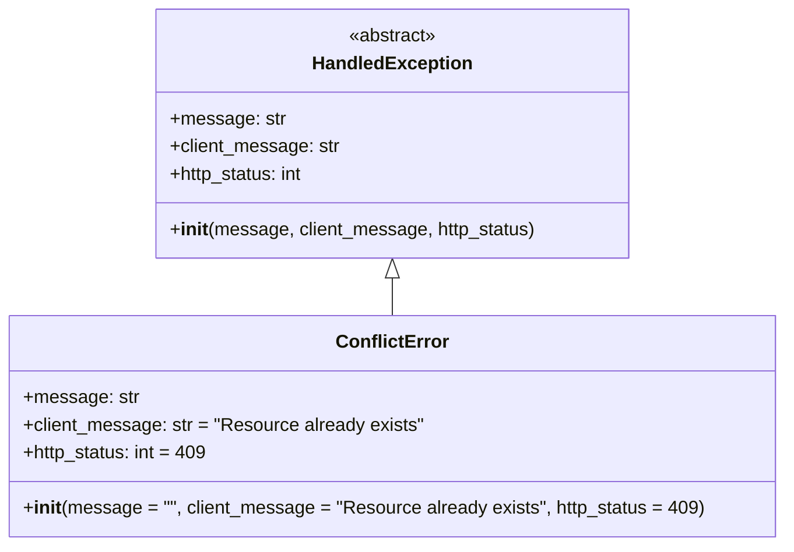

# Diagram: application_service/container_tracking_app_service/exception/ConflictError.py

> Auto-generated by Obscura crawlers

## Mermaid

### SVG

<svg id="container" width="668.671875" xmlns="http://www.w3.org/2000/svg" class="classDiagram" height="474" viewBox="0 0 668.671875 474" role="graphics-document document" aria-roledescription="class"><g><defs><marker id="container_class-aggregationStart" class="marker aggregation class" refX="18" refY="7" markerWidth="190" markerHeight="240" orient="auto"><path d="M 18,7 L9,13 L1,7 L9,1 Z"></path></marker></defs><defs><marker id="container_class-aggregationEnd" class="marker aggregation class" refX="1" refY="7" markerWidth="20" markerHeight="28" orient="auto"><path d="M 18,7 L9,13 L1,7 L9,1 Z"></path></marker></defs><defs><marker id="container_class-extensionStart" class="marker extension class" refX="18" refY="7" markerWidth="190" markerHeight="240" orient="auto"><path d="M 1,7 L18,13 V 1 Z"></path></marker></defs><defs><marker id="container_class-extensionEnd" class="marker extension class" refX="1" refY="7" markerWidth="20" markerHeight="28" orient="auto"><path d="M 1,1 V 13 L18,7 Z"></path></marker></defs><defs><marker id="container_class-compositionStart" class="marker composition class" refX="18" refY="7" markerWidth="190" markerHeight="240" orient="auto"><path d="M 18,7 L9,13 L1,7 L9,1 Z"></path></marker></defs><defs><marker id="container_class-compositionEnd" class="marker composition class" refX="1" refY="7" markerWidth="20" markerHeight="28" orient="auto"><path d="M 18,7 L9,13 L1,7 L9,1 Z"></path></marker></defs><defs><marker id="container_class-dependencyStart" class="marker dependency class" refX="6" refY="7" markerWidth="190" markerHeight="240" orient="auto"><path d="M 5,7 L9,13 L1,7 L9,1 Z"></path></marker></defs><defs><marker id="container_class-dependencyEnd" class="marker dependency class" refX="13" refY="7" markerWidth="20" markerHeight="28" orient="auto"><path d="M 18,7 L9,13 L14,7 L9,1 Z"></path></marker></defs><defs><marker id="container_class-lollipopStart" class="marker lollipop class" refX="13" refY="7" markerWidth="190" markerHeight="240" orient="auto"><circle stroke="black" fill="transparent" cx="7" cy="7" r="6"></circle></marker></defs><defs><marker id="container_class-lollipopEnd" class="marker lollipop class" refX="1" refY="7" markerWidth="190" markerHeight="240" orient="auto"><circle stroke="black" fill="transparent" cx="7" cy="7" r="6"></circle></marker></defs><g class="root"><g class="clusters"></g><g class="edgePaths"><path d="M334.336,241.25L334.336,242.542C334.336,243.833,334.336,246.417,334.336,251.875C334.336,257.333,334.336,265.667,334.336,269.833L334.336,274" id="id_HandledException_ConflictError_1" class="edge-thickness-normal edge-pattern-solid relation" style=";;;" data-edge="true" data-et="edge" data-id="id_HandledException_ConflictError_1" data-points="W3sieCI6MzM0LjMzNTkzNzUsInkiOjIyNH0seyJ4IjozMzQuMzM1OTM3NSwieSI6MjQ5fSx7IngiOjMzNC4zMzU5Mzc1LCJ5IjoyNzR9XQ==" marker-start="url(#container_class-extensionStart)"></path></g><g class="edgeLabels"><g class="edgeLabel"><g class="label" data-id="id_HandledException_ConflictError_1" transform="translate(0, 0)"><foreignObject width="0" height="0">

</foreignObject></g></g></g><g class="nodes"><g class="node default" id="classId-HandledException-0" transform="translate(334.3359375, 116)"><g class="basic label-container"><path d="M-202.83203125 -108 L202.83203125 -108 L202.83203125 108 L-202.83203125 108" stroke="none" stroke-width="0" fill="#ECECFF" style=""></path><path d="M-202.83203125 -108 C-119.6099217346992 -108, -36.3878122193984 -108, 202.83203125 -108 M-202.83203125 -108 C-108.53895042403538 -108, -14.245869598070755 -108, 202.83203125 -108 M202.83203125 -108 C202.83203125 -43.13200795796733, 202.83203125 21.735984084065336, 202.83203125 108 M202.83203125 -108 C202.83203125 -46.10781737486767, 202.83203125 15.784365250264656, 202.83203125 108 M202.83203125 108 C78.18654448473818 108, -46.458942280523644 108, -202.83203125 108 M202.83203125 108 C83.84471554985402 108, -35.14260015029197 108, -202.83203125 108 M-202.83203125 108 C-202.83203125 61.42721740606469, -202.83203125 14.854434812129384, -202.83203125 -108 M-202.83203125 108 C-202.83203125 43.07011597059075, -202.83203125 -21.859768058818503, -202.83203125 -108" stroke="#9370DB" stroke-width="1.3" fill="none" stroke-dasharray="0 0" style=""></path></g><g class="annotation-group text" transform="translate(-38.609375, -84)"><g class="label" style="" transform="translate(0,-12)"><foreignObject width="77.21875" height="24">

«abstract»

</foreignObject></g></g><g class="label-group text" transform="translate(-66.3828125, -60)"><g class="label" style="font-weight: bolder" transform="translate(0,-12)"><foreignObject width="132.765625" height="24">

HandledException

</foreignObject></g></g><g class="members-group text" transform="translate(-190.83203125, -12)"><g class="label" style="" transform="translate(0,-12)"><foreignObject width="97.875" height="24">

+message: str

</foreignObject></g><g class="label" style="" transform="translate(0,12)"><foreignObject width="146.921875" height="24">

+client_message: str

</foreignObject></g><g class="label" style="" transform="translate(0,36)"><foreignObject width="118.5625" height="24">

+http_status: int

</foreignObject></g></g><g class="methods-group text" transform="translate(-190.83203125, 84)"><g class="label" style="" transform="translate(0,-12)"><foreignObject width="315.28125" height="24">

+<strong>init</strong>(message, client_message, http_status)

</foreignObject></g></g><g class="divider" style=""><path d="M-202.83203125 -36 C-113.48380466490822 -36, -24.13557807981644 -36, 202.83203125 -36 M-202.83203125 -36 C-57.992721739945495 -36, 86.84658777010901 -36, 202.83203125 -36" stroke="#9370DB" stroke-width="1.3" fill="none" stroke-dasharray="0 0" style=""></path></g><g class="divider" style=""><path d="M-202.83203125 60 C-73.8057871218987 60, 55.220457006202594 60, 202.83203125 60 M-202.83203125 60 C-80.77862987232534 60, 41.27477150534932 60, 202.83203125 60" stroke="#9370DB" stroke-width="1.3" fill="none" stroke-dasharray="0 0" style=""></path></g></g><g class="node default" id="classId-ConflictError-1" transform="translate(334.3359375, 370)"><g class="basic label-container"><path d="M-326.3359375 -96 L326.3359375 -96 L326.3359375 96 L-326.3359375 96" stroke="none" stroke-width="0" fill="#ECECFF" style=""></path><path d="M-326.3359375 -96 C-76.81451592479209 -96, 172.70690565041582 -96, 326.3359375 -96 M-326.3359375 -96 C-66.87524854028095 -96, 192.5854404194381 -96, 326.3359375 -96 M326.3359375 -96 C326.3359375 -37.08055171628245, 326.3359375 21.8388965674351, 326.3359375 96 M326.3359375 -96 C326.3359375 -48.32137908326848, 326.3359375 -0.6427581665369644, 326.3359375 96 M326.3359375 96 C161.52683294820326 96, -3.282271603593472 96, -326.3359375 96 M326.3359375 96 C157.12904229114295 96, -12.077852917714097 96, -326.3359375 96 M-326.3359375 96 C-326.3359375 29.500946678897733, -326.3359375 -36.99810664220453, -326.3359375 -96 M-326.3359375 96 C-326.3359375 26.026619216883773, -326.3359375 -43.94676156623245, -326.3359375 -96" stroke="#9370DB" stroke-width="1.3" fill="none" stroke-dasharray="0 0" style=""></path></g><g class="annotation-group text" transform="translate(0, -72)"></g><g class="label-group text" transform="translate(-46.140625, -72)"><g class="label" style="font-weight: bolder" transform="translate(0,-12)"><foreignObject width="92.28125" height="24">

ConflictError

</foreignObject></g></g><g class="members-group text" transform="translate(-314.3359375, -24)"><g class="label" style="" transform="translate(0,-12)"><foreignObject width="97.875" height="24">

+message: str

</foreignObject></g><g class="label" style="" transform="translate(0,12)"><foreignObject width="345.640625" height="24">

+client_message: str = "Resource already exists"

</foreignObject></g><g class="label" style="" transform="translate(0,36)"><foreignObject width="160.734375" height="24">

+http_status: int = 409

</foreignObject></g></g><g class="methods-group text" transform="translate(-314.3359375, 72)"><g class="label" style="" transform="translate(0,-12)"><foreignObject width="582.53125" height="24">

+<strong>init</strong>(message = "", client_message = "Resource already exists", http_status = 409)

</foreignObject></g></g><g class="divider" style=""><path d="M-326.3359375 -48 C-179.47418764868254 -48, -32.61243779736509 -48, 326.3359375 -48 M-326.3359375 -48 C-164.40574982807527 -48, -2.475562156150545 -48, 326.3359375 -48" stroke="#9370DB" stroke-width="1.3" fill="none" stroke-dasharray="0 0" style=""></path></g><g class="divider" style=""><path d="M-326.3359375 48 C-175.09142476224628 48, -23.846912024492553 48, 326.3359375 48 M-326.3359375 48 C-178.80541043190016 48, -31.274883363800313 48, 326.3359375 48" stroke="#9370DB" stroke-width="1.3" fill="none" stroke-dasharray="0 0" style=""></path></g></g></g></g></g></svg>
