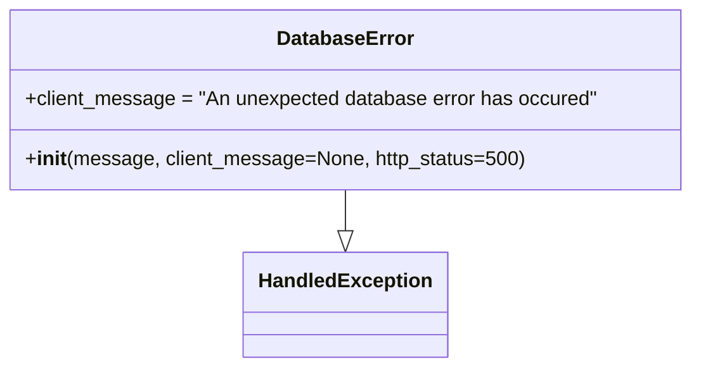

# Diagram: application_service/container_tracking_app_service/exception/DatabaseError.py

> Auto-generated by Obscura crawlers

## Mermaid

### SVG

<svg id="container" width="550.6875" xmlns="http://www.w3.org/2000/svg" class="classDiagram" height="294" viewBox="0 0 550.6875 294" role="graphics-document document" aria-roledescription="class"><g><defs><marker id="container_class-aggregationStart" class="marker aggregation class" refX="18" refY="7" markerWidth="190" markerHeight="240" orient="auto"><path d="M 18,7 L9,13 L1,7 L9,1 Z"></path></marker></defs><defs><marker id="container_class-aggregationEnd" class="marker aggregation class" refX="1" refY="7" markerWidth="20" markerHeight="28" orient="auto"><path d="M 18,7 L9,13 L1,7 L9,1 Z"></path></marker></defs><defs><marker id="container_class-extensionStart" class="marker extension class" refX="18" refY="7" markerWidth="190" markerHeight="240" orient="auto"><path d="M 1,7 L18,13 V 1 Z"></path></marker></defs><defs><marker id="container_class-extensionEnd" class="marker extension class" refX="1" refY="7" markerWidth="20" markerHeight="28" orient="auto"><path d="M 1,1 V 13 L18,7 Z"></path></marker></defs><defs><marker id="container_class-compositionStart" class="marker composition class" refX="18" refY="7" markerWidth="190" markerHeight="240" orient="auto"><path d="M 18,7 L9,13 L1,7 L9,1 Z"></path></marker></defs><defs><marker id="container_class-compositionEnd" class="marker composition class" refX="1" refY="7" markerWidth="20" markerHeight="28" orient="auto"><path d="M 18,7 L9,13 L1,7 L9,1 Z"></path></marker></defs><defs><marker id="container_class-dependencyStart" class="marker dependency class" refX="6" refY="7" markerWidth="190" markerHeight="240" orient="auto"><path d="M 5,7 L9,13 L1,7 L9,1 Z"></path></marker></defs><defs><marker id="container_class-dependencyEnd" class="marker dependency class" refX="13" refY="7" markerWidth="20" markerHeight="28" orient="auto"><path d="M 18,7 L9,13 L14,7 L9,1 Z"></path></marker></defs><defs><marker id="container_class-lollipopStart" class="marker lollipop class" refX="13" refY="7" markerWidth="190" markerHeight="240" orient="auto"><circle stroke="black" fill="transparent" cx="7" cy="7" r="6"></circle></marker></defs><defs><marker id="container_class-lollipopEnd" class="marker lollipop class" refX="1" refY="7" markerWidth="190" markerHeight="240" orient="auto"><circle stroke="black" fill="transparent" cx="7" cy="7" r="6"></circle></marker></defs><g class="root"><g class="clusters"></g><g class="edgePaths"><path d="M275.344,152L275.344,156.167C275.344,160.333,275.344,168.667,275.344,174.125C275.344,179.583,275.344,182.167,275.344,183.458L275.344,184.75" id="id_DatabaseError_HandledException_1" class="edge-thickness-normal edge-pattern-solid relation" style=";;;" data-edge="true" data-et="edge" data-id="id_DatabaseError_HandledException_1" data-points="W3sieCI6Mjc1LjM0Mzc1LCJ5IjoxNTJ9LHsieCI6Mjc1LjM0Mzc1LCJ5IjoxNzd9LHsieCI6Mjc1LjM0Mzc1LCJ5IjoyMDJ9XQ==" marker-end="url(#container_class-extensionEnd)"></path></g><g class="edgeLabels"><g class="edgeLabel"><g class="label" data-id="id_DatabaseError_HandledException_1" transform="translate(0, 0)"><foreignObject width="0" height="0">

</foreignObject></g></g></g><g class="nodes"><g class="node default" id="classId-HandledException-0" transform="translate(275.34375, 244)"><g class="basic label-container"><path d="M-78.3828125 -42 L78.3828125 -42 L78.3828125 42 L-78.3828125 42" stroke="none" stroke-width="0" fill="#ECECFF" style=""></path><path d="M-78.3828125 -42 C-24.362224235577642 -42, 29.658364028844716 -42, 78.3828125 -42 M-78.3828125 -42 C-35.69401717007134 -42, 6.994778159857319 -42, 78.3828125 -42 M78.3828125 -42 C78.3828125 -10.394780314977211, 78.3828125 21.210439370045577, 78.3828125 42 M78.3828125 -42 C78.3828125 -12.064274556293825, 78.3828125 17.87145088741235, 78.3828125 42 M78.3828125 42 C17.73995396093197 42, -42.90290457813606 42, -78.3828125 42 M78.3828125 42 C24.98274975881779 42, -28.41731298236442 42, -78.3828125 42 M-78.3828125 42 C-78.3828125 13.718168124107645, -78.3828125 -14.56366375178471, -78.3828125 -42 M-78.3828125 42 C-78.3828125 22.480860083513505, -78.3828125 2.9617201670270106, -78.3828125 -42" stroke="#9370DB" stroke-width="1.3" fill="none" stroke-dasharray="0 0" style=""></path></g><g class="annotation-group text" transform="translate(0, -18)"></g><g class="label-group text" transform="translate(-66.3828125, -18)"><g class="label" style="font-weight: bolder" transform="translate(0,-12)"><foreignObject width="132.765625" height="24">

HandledException

</foreignObject></g></g><g class="members-group text" transform="translate(-66.3828125, 30)"></g><g class="methods-group text" transform="translate(-66.3828125, 60)"></g><g class="divider" style=""><path d="M-78.3828125 6 C-20.08520651249942 6, 38.21239947500116 6, 78.3828125 6 M-78.3828125 6 C-32.52143420200417 6, 13.339944095991655 6, 78.3828125 6" stroke="#9370DB" stroke-width="1.3" fill="none" stroke-dasharray="0 0" style=""></path></g><g class="divider" style=""><path d="M-78.3828125 24 C-16.666610768719963 24, 45.049590962560075 24, 78.3828125 24 M-78.3828125 24 C-20.594631272574496 24, 37.19354995485101 24, 78.3828125 24" stroke="#9370DB" stroke-width="1.3" fill="none" stroke-dasharray="0 0" style=""></path></g></g><g class="node default" id="classId-DatabaseError-1" transform="translate(275.34375, 80)"><g class="basic label-container"><path d="M-267.34375 -72 L267.34375 -72 L267.34375 72 L-267.34375 72" stroke="none" stroke-width="0" fill="#ECECFF" style=""></path><path d="M-267.34375 -72 C-60.43396686715556 -72, 146.47581626568888 -72, 267.34375 -72 M-267.34375 -72 C-120.1911106114961 -72, 26.9615287770078 -72, 267.34375 -72 M267.34375 -72 C267.34375 -22.710515428398374, 267.34375 26.578969143203253, 267.34375 72 M267.34375 -72 C267.34375 -15.671882988799126, 267.34375 40.65623402240175, 267.34375 72 M267.34375 72 C79.64156723816447 72, -108.06061552367106 72, -267.34375 72 M267.34375 72 C145.02073088195186 72, 22.697711763903698 72, -267.34375 72 M-267.34375 72 C-267.34375 42.63645399672934, -267.34375 13.272907993458674, -267.34375 -72 M-267.34375 72 C-267.34375 38.251070859049975, -267.34375 4.502141718099949, -267.34375 -72" stroke="#9370DB" stroke-width="1.3" fill="none" stroke-dasharray="0 0" style=""></path></g><g class="annotation-group text" transform="translate(0, -48)"></g><g class="label-group text" transform="translate(-52.359375, -48)"><g class="label" style="font-weight: bolder" transform="translate(0,-12)"><foreignObject width="104.71875" height="24">

DatabaseError

</foreignObject></g></g><g class="members-group text" transform="translate(-255.34375, 0)"><g class="label" style="" transform="translate(0,-12)"><foreignObject width="458.328125" height="24">

+client_message = "An unexpected database error has occured"

</foreignObject></g></g><g class="methods-group text" transform="translate(-255.34375, 48)"><g class="label" style="" transform="translate(0,-12)"><foreignObject width="395.515625" height="24">

+<strong>init</strong>(message, client_message=None, http_status=500)

</foreignObject></g></g><g class="divider" style=""><path d="M-267.34375 -24 C-132.33458497750274 -24, 2.6745800449945136 -24, 267.34375 -24 M-267.34375 -24 C-112.41841349636073 -24, 42.506923007278544 -24, 267.34375 -24" stroke="#9370DB" stroke-width="1.3" fill="none" stroke-dasharray="0 0" style=""></path></g><g class="divider" style=""><path d="M-267.34375 24 C-140.1469912494196 24, -12.950232498839256 24, 267.34375 24 M-267.34375 24 C-91.38101813278232 24, 84.58171373443537 24, 267.34375 24" stroke="#9370DB" stroke-width="1.3" fill="none" stroke-dasharray="0 0" style=""></path></g></g></g></g></g></svg>
