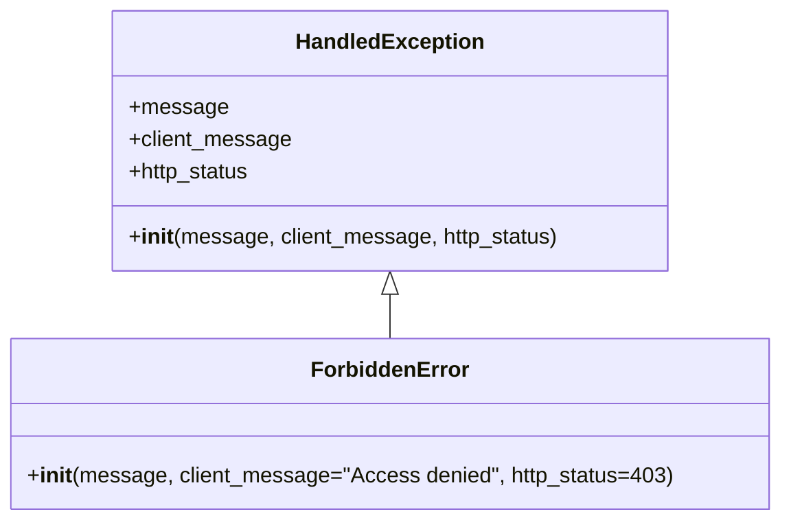

# Diagram: application_service/container_tracking_app_service/exception/ForbiddenError.py

> Auto-generated by Obscura crawlers

## Mermaid

### SVG

<svg id="container" width="564.7734375" xmlns="http://www.w3.org/2000/svg" class="classDiagram" height="384" viewBox="0 0 564.7734375 384" role="graphics-document document" aria-roledescription="class"><g><defs><marker id="container_class-aggregationStart" class="marker aggregation class" refX="18" refY="7" markerWidth="190" markerHeight="240" orient="auto"><path d="M 18,7 L9,13 L1,7 L9,1 Z"></path></marker></defs><defs><marker id="container_class-aggregationEnd" class="marker aggregation class" refX="1" refY="7" markerWidth="20" markerHeight="28" orient="auto"><path d="M 18,7 L9,13 L1,7 L9,1 Z"></path></marker></defs><defs><marker id="container_class-extensionStart" class="marker extension class" refX="18" refY="7" markerWidth="190" markerHeight="240" orient="auto"><path d="M 1,7 L18,13 V 1 Z"></path></marker></defs><defs><marker id="container_class-extensionEnd" class="marker extension class" refX="1" refY="7" markerWidth="20" markerHeight="28" orient="auto"><path d="M 1,1 V 13 L18,7 Z"></path></marker></defs><defs><marker id="container_class-compositionStart" class="marker composition class" refX="18" refY="7" markerWidth="190" markerHeight="240" orient="auto"><path d="M 18,7 L9,13 L1,7 L9,1 Z"></path></marker></defs><defs><marker id="container_class-compositionEnd" class="marker composition class" refX="1" refY="7" markerWidth="20" markerHeight="28" orient="auto"><path d="M 18,7 L9,13 L1,7 L9,1 Z"></path></marker></defs><defs><marker id="container_class-dependencyStart" class="marker dependency class" refX="6" refY="7" markerWidth="190" markerHeight="240" orient="auto"><path d="M 5,7 L9,13 L1,7 L9,1 Z"></path></marker></defs><defs><marker id="container_class-dependencyEnd" class="marker dependency class" refX="13" refY="7" markerWidth="20" markerHeight="28" orient="auto"><path d="M 18,7 L9,13 L14,7 L9,1 Z"></path></marker></defs><defs><marker id="container_class-lollipopStart" class="marker lollipop class" refX="13" refY="7" markerWidth="190" markerHeight="240" orient="auto"><circle stroke="black" fill="transparent" cx="7" cy="7" r="6"></circle></marker></defs><defs><marker id="container_class-lollipopEnd" class="marker lollipop class" refX="1" refY="7" markerWidth="190" markerHeight="240" orient="auto"><circle stroke="black" fill="transparent" cx="7" cy="7" r="6"></circle></marker></defs><g class="root"><g class="clusters"></g><g class="edgePaths"><path d="M282.387,217.25L282.387,218.542C282.387,219.833,282.387,222.417,282.387,227.875C282.387,233.333,282.387,241.667,282.387,245.833L282.387,250" id="id_HandledException_ForbiddenError_1" class="edge-thickness-normal edge-pattern-solid relation" style=";;;" data-edge="true" data-et="edge" data-id="id_HandledException_ForbiddenError_1" data-points="W3sieCI6MjgyLjM4NjcxODc1LCJ5IjoyMDB9LHsieCI6MjgyLjM4NjcxODc1LCJ5IjoyMjV9LHsieCI6MjgyLjM4NjcxODc1LCJ5IjoyNTB9XQ==" marker-start="url(#container_class-extensionStart)"></path></g><g class="edgeLabels"><g class="edgeLabel"><g class="label" data-id="id_HandledException_ForbiddenError_1" transform="translate(0, 0)"><foreignObject width="0" height="0">

</foreignObject></g></g></g><g class="nodes"><g class="node default" id="classId-HandledException-0" transform="translate(282.38671875, 104)"><g class="basic label-container"><path d="M-202.83203125 -96 L202.83203125 -96 L202.83203125 96 L-202.83203125 96" stroke="none" stroke-width="0" fill="#ECECFF" style=""></path><path d="M-202.83203125 -96 C-47.47187028903804 -96, 107.88829067192393 -96, 202.83203125 -96 M-202.83203125 -96 C-64.44064857845643 -96, 73.95073409308714 -96, 202.83203125 -96 M202.83203125 -96 C202.83203125 -49.48366622946607, 202.83203125 -2.967332458932134, 202.83203125 96 M202.83203125 -96 C202.83203125 -25.171598314308625, 202.83203125 45.65680337138275, 202.83203125 96 M202.83203125 96 C82.20349068090701 96, -38.42504988818598 96, -202.83203125 96 M202.83203125 96 C89.9330895353098 96, -22.96585217938039 96, -202.83203125 96 M-202.83203125 96 C-202.83203125 41.40520031095673, -202.83203125 -13.189599378086541, -202.83203125 -96 M-202.83203125 96 C-202.83203125 33.001482163312346, -202.83203125 -29.997035673375308, -202.83203125 -96" stroke="#9370DB" stroke-width="1.3" fill="none" stroke-dasharray="0 0" style=""></path></g><g class="annotation-group text" transform="translate(0, -72)"></g><g class="label-group text" transform="translate(-66.3828125, -72)"><g class="label" style="font-weight: bolder" transform="translate(0,-12)"><foreignObject width="132.765625" height="24">

HandledException

</foreignObject></g></g><g class="members-group text" transform="translate(-190.83203125, -24)"><g class="label" style="" transform="translate(0,-12)"><foreignObject width="70.375" height="24">

+message

</foreignObject></g><g class="label" style="" transform="translate(0,12)"><foreignObject width="119.421875" height="24">

+client_message

</foreignObject></g><g class="label" style="" transform="translate(0,36)"><foreignObject width="90.828125" height="24">

+http_status

</foreignObject></g></g><g class="methods-group text" transform="translate(-190.83203125, 72)"><g class="label" style="" transform="translate(0,-12)"><foreignObject width="315.28125" height="24">

+<strong>init</strong>(message, client_message, http_status)

</foreignObject></g></g><g class="divider" style=""><path d="M-202.83203125 -48 C-79.49879815245214 -48, 43.83443494509572 -48, 202.83203125 -48 M-202.83203125 -48 C-56.82831972652144 -48, 89.17539179695711 -48, 202.83203125 -48" stroke="#9370DB" stroke-width="1.3" fill="none" stroke-dasharray="0 0" style=""></path></g><g class="divider" style=""><path d="M-202.83203125 48 C-45.88344580953472 48, 111.06513963093056 48, 202.83203125 48 M-202.83203125 48 C-111.68713987654631 48, -20.542248503092623 48, 202.83203125 48" stroke="#9370DB" stroke-width="1.3" fill="none" stroke-dasharray="0 0" style=""></path></g></g><g class="node default" id="classId-ForbiddenError-1" transform="translate(282.38671875, 313)"><g class="basic label-container"><path d="M-274.38671875 -63 L274.38671875 -63 L274.38671875 63 L-274.38671875 63" stroke="none" stroke-width="0" fill="#ECECFF" style=""></path><path d="M-274.38671875 -63 C-154.65349736511385 -63, -34.9202759802277 -63, 274.38671875 -63 M-274.38671875 -63 C-97.2085313097306 -63, 79.9696561305388 -63, 274.38671875 -63 M274.38671875 -63 C274.38671875 -31.517903425971966, 274.38671875 -0.035806851943931406, 274.38671875 63 M274.38671875 -63 C274.38671875 -22.656956999955035, 274.38671875 17.68608600008993, 274.38671875 63 M274.38671875 63 C89.28484655867885 63, -95.8170256326423 63, -274.38671875 63 M274.38671875 63 C136.61703526970535 63, -1.152648210589291 63, -274.38671875 63 M-274.38671875 63 C-274.38671875 22.997450175481447, -274.38671875 -17.005099649037106, -274.38671875 -63 M-274.38671875 63 C-274.38671875 13.29621503329961, -274.38671875 -36.40756993340078, -274.38671875 -63" stroke="#9370DB" stroke-width="1.3" fill="none" stroke-dasharray="0 0" style=""></path></g><g class="annotation-group text" transform="translate(0, -39)"></g><g class="label-group text" transform="translate(-55.3515625, -39)"><g class="label" style="font-weight: bolder" transform="translate(0,-12)"><foreignObject width="110.703125" height="24">

ForbiddenError

</foreignObject></g></g><g class="members-group text" transform="translate(-262.38671875, 9)"></g><g class="methods-group text" transform="translate(-262.38671875, 39)"><g class="label" style="" transform="translate(0,-12)"><foreignObject width="469.421875" height="24">

+<strong>init</strong>(message, client_message="Access denied", http_status=403)

</foreignObject></g></g><g class="divider" style=""><path d="M-274.38671875 -15 C-148.80324308764193 -15, -23.219767425283834 -15, 274.38671875 -15 M-274.38671875 -15 C-140.5217357580801 -15, -6.656752766160196 -15, 274.38671875 -15" stroke="#9370DB" stroke-width="1.3" fill="none" stroke-dasharray="0 0" style=""></path></g><g class="divider" style=""><path d="M-274.38671875 9 C-67.95285261598406 9, 138.4810135180319 9, 274.38671875 9 M-274.38671875 9 C-125.57513304833313 9, 23.236452653333743 9, 274.38671875 9" stroke="#9370DB" stroke-width="1.3" fill="none" stroke-dasharray="0 0" style=""></path></g></g></g></g></g></svg>
