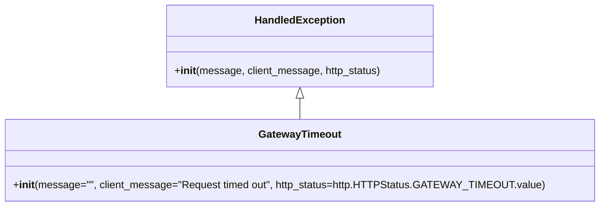

# Diagram: application_service/container_tracking_app_service/exception/GatewayTimeout.py

> Auto-generated by Obscura crawlers

## Mermaid

### SVG

<svg id="container" width="893.671875" xmlns="http://www.w3.org/2000/svg" class="classDiagram" height="318" viewBox="0 0 893.671875 318" role="graphics-document document" aria-roledescription="class"><g><defs><marker id="container_class-aggregationStart" class="marker aggregation class" refX="18" refY="7" markerWidth="190" markerHeight="240" orient="auto"><path d="M 18,7 L9,13 L1,7 L9,1 Z"></path></marker></defs><defs><marker id="container_class-aggregationEnd" class="marker aggregation class" refX="1" refY="7" markerWidth="20" markerHeight="28" orient="auto"><path d="M 18,7 L9,13 L1,7 L9,1 Z"></path></marker></defs><defs><marker id="container_class-extensionStart" class="marker extension class" refX="18" refY="7" markerWidth="190" markerHeight="240" orient="auto"><path d="M 1,7 L18,13 V 1 Z"></path></marker></defs><defs><marker id="container_class-extensionEnd" class="marker extension class" refX="1" refY="7" markerWidth="20" markerHeight="28" orient="auto"><path d="M 1,1 V 13 L18,7 Z"></path></marker></defs><defs><marker id="container_class-compositionStart" class="marker composition class" refX="18" refY="7" markerWidth="190" markerHeight="240" orient="auto"><path d="M 18,7 L9,13 L1,7 L9,1 Z"></path></marker></defs><defs><marker id="container_class-compositionEnd" class="marker composition class" refX="1" refY="7" markerWidth="20" markerHeight="28" orient="auto"><path d="M 18,7 L9,13 L1,7 L9,1 Z"></path></marker></defs><defs><marker id="container_class-dependencyStart" class="marker dependency class" refX="6" refY="7" markerWidth="190" markerHeight="240" orient="auto"><path d="M 5,7 L9,13 L1,7 L9,1 Z"></path></marker></defs><defs><marker id="container_class-dependencyEnd" class="marker dependency class" refX="13" refY="7" markerWidth="20" markerHeight="28" orient="auto"><path d="M 18,7 L9,13 L14,7 L9,1 Z"></path></marker></defs><defs><marker id="container_class-lollipopStart" class="marker lollipop class" refX="13" refY="7" markerWidth="190" markerHeight="240" orient="auto"><circle stroke="black" fill="transparent" cx="7" cy="7" r="6"></circle></marker></defs><defs><marker id="container_class-lollipopEnd" class="marker lollipop class" refX="1" refY="7" markerWidth="190" markerHeight="240" orient="auto"><circle stroke="black" fill="transparent" cx="7" cy="7" r="6"></circle></marker></defs><g class="root"><g class="clusters"></g><g class="edgePaths"><path d="M446.836,151.25L446.836,152.542C446.836,153.833,446.836,156.417,446.836,161.875C446.836,167.333,446.836,175.667,446.836,179.833L446.836,184" id="id_HandledException_GatewayTimeout_1" class="edge-thickness-normal edge-pattern-solid relation" style=";;;" data-edge="true" data-et="edge" data-id="id_HandledException_GatewayTimeout_1" data-points="W3sieCI6NDQ2LjgzNTkzNzUsInkiOjEzNH0seyJ4Ijo0NDYuODM1OTM3NSwieSI6MTU5fSx7IngiOjQ0Ni44MzU5Mzc1LCJ5IjoxODR9XQ==" marker-start="url(#container_class-extensionStart)"></path></g><g class="edgeLabels"><g class="edgeLabel"><g class="label" data-id="id_HandledException_GatewayTimeout_1" transform="translate(0, 0)"><foreignObject width="0" height="0">

</foreignObject></g></g></g><g class="nodes"><g class="node default" id="classId-HandledException-0" transform="translate(446.8359375, 71)"><g class="basic label-container"><path d="M-202.83203125 -63 L202.83203125 -63 L202.83203125 63 L-202.83203125 63" stroke="none" stroke-width="0" fill="#ECECFF" style=""></path><path d="M-202.83203125 -63 C-48.92100542498221 -63, 104.99002040003558 -63, 202.83203125 -63 M-202.83203125 -63 C-120.31429866013907 -63, -37.796566070278146 -63, 202.83203125 -63 M202.83203125 -63 C202.83203125 -21.795787622016825, 202.83203125 19.40842475596635, 202.83203125 63 M202.83203125 -63 C202.83203125 -16.250907471122787, 202.83203125 30.498185057754426, 202.83203125 63 M202.83203125 63 C69.3552276168052 63, -64.12157601638961 63, -202.83203125 63 M202.83203125 63 C87.18726288307589 63, -28.457505483848223 63, -202.83203125 63 M-202.83203125 63 C-202.83203125 20.339590081591624, -202.83203125 -22.320819836816753, -202.83203125 -63 M-202.83203125 63 C-202.83203125 28.16106954792098, -202.83203125 -6.677860904158038, -202.83203125 -63" stroke="#9370DB" stroke-width="1.3" fill="none" stroke-dasharray="0 0" style=""></path></g><g class="annotation-group text" transform="translate(0, -39)"></g><g class="label-group text" transform="translate(-66.3828125, -39)"><g class="label" style="font-weight: bolder" transform="translate(0,-12)"><foreignObject width="132.765625" height="24">

HandledException

</foreignObject></g></g><g class="members-group text" transform="translate(-190.83203125, 9)"></g><g class="methods-group text" transform="translate(-190.83203125, 39)"><g class="label" style="" transform="translate(0,-12)"><foreignObject width="315.28125" height="24">

+<strong>init</strong>(message, client_message, http_status)

</foreignObject></g></g><g class="divider" style=""><path d="M-202.83203125 -15 C-41.12394217854052 -15, 120.58414689291897 -15, 202.83203125 -15 M-202.83203125 -15 C-73.41137930773809 -15, 56.009272634523825 -15, 202.83203125 -15" stroke="#9370DB" stroke-width="1.3" fill="none" stroke-dasharray="0 0" style=""></path></g><g class="divider" style=""><path d="M-202.83203125 9 C-75.45116246835819 9, 51.92970631328362 9, 202.83203125 9 M-202.83203125 9 C-93.98843181420874 9, 14.855167621582524 9, 202.83203125 9" stroke="#9370DB" stroke-width="1.3" fill="none" stroke-dasharray="0 0" style=""></path></g></g><g class="node default" id="classId-GatewayTimeout-1" transform="translate(446.8359375, 247)"><g class="basic label-container"><path d="M-438.8359375 -63 L438.8359375 -63 L438.8359375 63 L-438.8359375 63" stroke="none" stroke-width="0" fill="#ECECFF" style=""></path><path d="M-438.8359375 -63 C-245.31895337280622 -63, -51.80196924561244 -63, 438.8359375 -63 M-438.8359375 -63 C-225.90253508264638 -63, -12.969132665292761 -63, 438.8359375 -63 M438.8359375 -63 C438.8359375 -19.69604519704305, 438.8359375 23.607909605913903, 438.8359375 63 M438.8359375 -63 C438.8359375 -25.66556159634691, 438.8359375 11.668876807306177, 438.8359375 63 M438.8359375 63 C221.80715351794424 63, 4.778369535888487 63, -438.8359375 63 M438.8359375 63 C237.5005894476149 63, 36.16524139522983 63, -438.8359375 63 M-438.8359375 63 C-438.8359375 20.49052907318294, -438.8359375 -22.018941853634118, -438.8359375 -63 M-438.8359375 63 C-438.8359375 17.870001297853648, -438.8359375 -27.259997404292704, -438.8359375 -63" stroke="#9370DB" stroke-width="1.3" fill="none" stroke-dasharray="0 0" style=""></path></g><g class="annotation-group text" transform="translate(0, -39)"></g><g class="label-group text" transform="translate(-61.28125, -39)"><g class="label" style="font-weight: bolder" transform="translate(0,-12)"><foreignObject width="122.5625" height="24">

GatewayTimeout

</foreignObject></g></g><g class="members-group text" transform="translate(-426.8359375, 9)"></g><g class="methods-group text" transform="translate(-426.8359375, 39)"><g class="label" style="" transform="translate(0,-12)"><foreignObject width="792.390625" height="24">

+<strong>init</strong>(message="", client_message="Request timed out", http_status=http.HTTPStatus.GATEWAY_TIMEOUT.value)

</foreignObject></g></g><g class="divider" style=""><path d="M-438.8359375 -15 C-199.65423988654626 -15, 39.52745772690747 -15, 438.8359375 -15 M-438.8359375 -15 C-139.89986797633247 -15, 159.03620154733505 -15, 438.8359375 -15" stroke="#9370DB" stroke-width="1.3" fill="none" stroke-dasharray="0 0" style=""></path></g><g class="divider" style=""><path d="M-438.8359375 9 C-134.2371625494922 9, 170.36161240101558 9, 438.8359375 9 M-438.8359375 9 C-253.7806006971387 9, -68.72526389427742 9, 438.8359375 9" stroke="#9370DB" stroke-width="1.3" fill="none" stroke-dasharray="0 0" style=""></path></g></g></g></g></g></svg>
