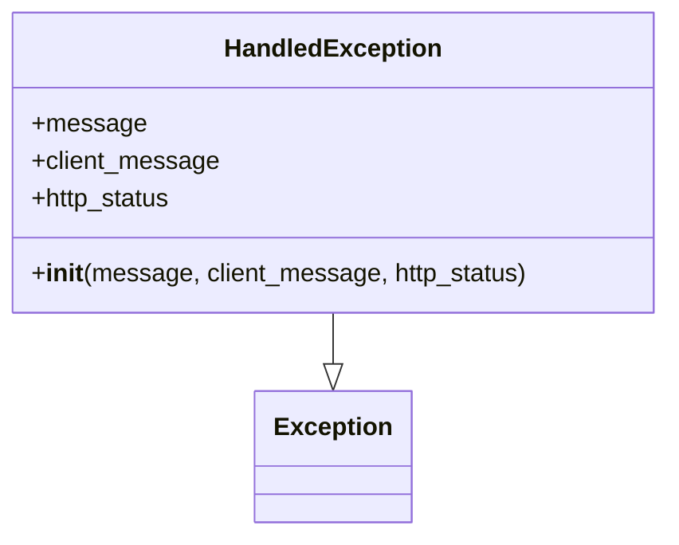

# Diagram: application_service/container_tracking_app_service/exception/HandledException.py

> Auto-generated by Obscura crawlers

## Mermaid

### SVG

<svg id="container" width="421.6640625" xmlns="http://www.w3.org/2000/svg" class="classDiagram" height="342" viewBox="0 0 421.6640625 342" role="graphics-document document" aria-roledescription="class"><g><defs><marker id="container_class-aggregationStart" class="marker aggregation class" refX="18" refY="7" markerWidth="190" markerHeight="240" orient="auto"><path d="M 18,7 L9,13 L1,7 L9,1 Z"></path></marker></defs><defs><marker id="container_class-aggregationEnd" class="marker aggregation class" refX="1" refY="7" markerWidth="20" markerHeight="28" orient="auto"><path d="M 18,7 L9,13 L1,7 L9,1 Z"></path></marker></defs><defs><marker id="container_class-extensionStart" class="marker extension class" refX="18" refY="7" markerWidth="190" markerHeight="240" orient="auto"><path d="M 1,7 L18,13 V 1 Z"></path></marker></defs><defs><marker id="container_class-extensionEnd" class="marker extension class" refX="1" refY="7" markerWidth="20" markerHeight="28" orient="auto"><path d="M 1,1 V 13 L18,7 Z"></path></marker></defs><defs><marker id="container_class-compositionStart" class="marker composition class" refX="18" refY="7" markerWidth="190" markerHeight="240" orient="auto"><path d="M 18,7 L9,13 L1,7 L9,1 Z"></path></marker></defs><defs><marker id="container_class-compositionEnd" class="marker composition class" refX="1" refY="7" markerWidth="20" markerHeight="28" orient="auto"><path d="M 18,7 L9,13 L1,7 L9,1 Z"></path></marker></defs><defs><marker id="container_class-dependencyStart" class="marker dependency class" refX="6" refY="7" markerWidth="190" markerHeight="240" orient="auto"><path d="M 5,7 L9,13 L1,7 L9,1 Z"></path></marker></defs><defs><marker id="container_class-dependencyEnd" class="marker dependency class" refX="13" refY="7" markerWidth="20" markerHeight="28" orient="auto"><path d="M 18,7 L9,13 L14,7 L9,1 Z"></path></marker></defs><defs><marker id="container_class-lollipopStart" class="marker lollipop class" refX="13" refY="7" markerWidth="190" markerHeight="240" orient="auto"><circle stroke="black" fill="transparent" cx="7" cy="7" r="6"></circle></marker></defs><defs><marker id="container_class-lollipopEnd" class="marker lollipop class" refX="1" refY="7" markerWidth="190" markerHeight="240" orient="auto"><circle stroke="black" fill="transparent" cx="7" cy="7" r="6"></circle></marker></defs><g class="root"><g class="clusters"></g><g class="edgePaths"><path d="M210.832,200L210.832,204.167C210.832,208.333,210.832,216.667,210.832,222.125C210.832,227.583,210.832,230.167,210.832,231.458L210.832,232.75" id="id_HandledException_Exception_1" class="edge-thickness-normal edge-pattern-solid relation" style=";;;" data-edge="true" data-et="edge" data-id="id_HandledException_Exception_1" data-points="W3sieCI6MjEwLjgzMjAzMTI1LCJ5IjoyMDB9LHsieCI6MjEwLjgzMjAzMTI1LCJ5IjoyMjV9LHsieCI6MjEwLjgzMjAzMTI1LCJ5IjoyNTB9XQ==" marker-end="url(#container_class-extensionEnd)"></path></g><g class="edgeLabels"><g class="edgeLabel"><g class="label" data-id="id_HandledException_Exception_1" transform="translate(0, 0)"><foreignObject width="0" height="0">

</foreignObject></g></g></g><g class="nodes"><g class="node default" id="classId-Exception-0" transform="translate(210.83203125, 292)"><g class="basic label-container"><path d="M-47.703125 -42 L47.703125 -42 L47.703125 42 L-47.703125 42" stroke="none" stroke-width="0" fill="#ECECFF" style=""></path><path d="M-47.703125 -42 C-17.244285217748377 -42, 13.214554564503246 -42, 47.703125 -42 M-47.703125 -42 C-26.45537087686677 -42, -5.207616753733539 -42, 47.703125 -42 M47.703125 -42 C47.703125 -19.455751092584663, 47.703125 3.0884978148306743, 47.703125 42 M47.703125 -42 C47.703125 -12.522470215689005, 47.703125 16.95505956862199, 47.703125 42 M47.703125 42 C10.000762587850403 42, -27.701599824299194 42, -47.703125 42 M47.703125 42 C14.863461148212863 42, -17.976202703574273 42, -47.703125 42 M-47.703125 42 C-47.703125 19.84612210831368, -47.703125 -2.3077557833726416, -47.703125 -42 M-47.703125 42 C-47.703125 24.180558485387305, -47.703125 6.36111697077461, -47.703125 -42" stroke="#9370DB" stroke-width="1.3" fill="none" stroke-dasharray="0 0" style=""></path></g><g class="annotation-group text" transform="translate(0, -18)"></g><g class="label-group text" transform="translate(-35.703125, -18)"><g class="label" style="font-weight: bolder" transform="translate(0,-12)"><foreignObject width="71.40625" height="24">

Exception

</foreignObject></g></g><g class="members-group text" transform="translate(-35.703125, 30)"></g><g class="methods-group text" transform="translate(-35.703125, 60)"></g><g class="divider" style=""><path d="M-47.703125 6 C-12.205918333203016 6, 23.291288333593968 6, 47.703125 6 M-47.703125 6 C-10.680890030763074 6, 26.341344938473853 6, 47.703125 6" stroke="#9370DB" stroke-width="1.3" fill="none" stroke-dasharray="0 0" style=""></path></g><g class="divider" style=""><path d="M-47.703125 24 C-11.430234141258985 24, 24.84265671748203 24, 47.703125 24 M-47.703125 24 C-26.603431024282298 24, -5.503737048564595 24, 47.703125 24" stroke="#9370DB" stroke-width="1.3" fill="none" stroke-dasharray="0 0" style=""></path></g></g><g class="node default" id="classId-HandledException-1" transform="translate(210.83203125, 104)"><g class="basic label-container"><path d="M-202.83203125 -96 L202.83203125 -96 L202.83203125 96 L-202.83203125 96" stroke="none" stroke-width="0" fill="#ECECFF" style=""></path><path d="M-202.83203125 -96 C-103.76803180172034 -96, -4.704032353440681 -96, 202.83203125 -96 M-202.83203125 -96 C-74.28029600745629 -96, 54.27143923508743 -96, 202.83203125 -96 M202.83203125 -96 C202.83203125 -20.90676743208195, 202.83203125 54.1864651358361, 202.83203125 96 M202.83203125 -96 C202.83203125 -46.01437981811819, 202.83203125 3.971240363763627, 202.83203125 96 M202.83203125 96 C85.75084945452801 96, -31.330332340943983 96, -202.83203125 96 M202.83203125 96 C50.07426298527113 96, -102.68350527945773 96, -202.83203125 96 M-202.83203125 96 C-202.83203125 23.313600544803393, -202.83203125 -49.372798910393215, -202.83203125 -96 M-202.83203125 96 C-202.83203125 45.53953205947268, -202.83203125 -4.920935881054646, -202.83203125 -96" stroke="#9370DB" stroke-width="1.3" fill="none" stroke-dasharray="0 0" style=""></path></g><g class="annotation-group text" transform="translate(0, -72)"></g><g class="label-group text" transform="translate(-66.3828125, -72)"><g class="label" style="font-weight: bolder" transform="translate(0,-12)"><foreignObject width="132.765625" height="24">

HandledException

</foreignObject></g></g><g class="members-group text" transform="translate(-190.83203125, -24)"><g class="label" style="" transform="translate(0,-12)"><foreignObject width="70.375" height="24">

+message

</foreignObject></g><g class="label" style="" transform="translate(0,12)"><foreignObject width="119.421875" height="24">

+client_message

</foreignObject></g><g class="label" style="" transform="translate(0,36)"><foreignObject width="90.828125" height="24">

+http_status

</foreignObject></g></g><g class="methods-group text" transform="translate(-190.83203125, 72)"><g class="label" style="" transform="translate(0,-12)"><foreignObject width="315.28125" height="24">

+<strong>init</strong>(message, client_message, http_status)

</foreignObject></g></g><g class="divider" style=""><path d="M-202.83203125 -48 C-73.26740509410507 -48, 56.297221061789855 -48, 202.83203125 -48 M-202.83203125 -48 C-108.64550323649249 -48, -14.458975222984975 -48, 202.83203125 -48" stroke="#9370DB" stroke-width="1.3" fill="none" stroke-dasharray="0 0" style=""></path></g><g class="divider" style=""><path d="M-202.83203125 48 C-119.08217435473186 48, -35.332317459463724 48, 202.83203125 48 M-202.83203125 48 C-92.5502349539187 48, 17.731561342162593 48, 202.83203125 48" stroke="#9370DB" stroke-width="1.3" fill="none" stroke-dasharray="0 0" style=""></path></g></g></g></g></g></svg>
