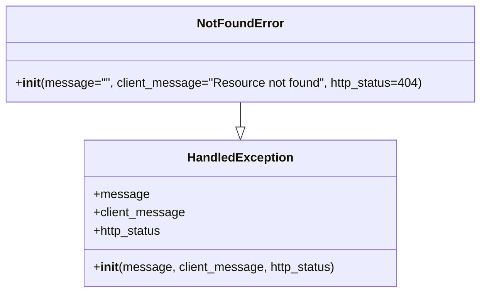

# Diagram: application_service/container_tracking_app_service/exception/NotFoundError.py

> Auto-generated by Obscura crawlers

## Mermaid

### SVG

<svg id="container" width="623.21875" xmlns="http://www.w3.org/2000/svg" class="classDiagram" height="384" viewBox="0 0 623.21875 384" role="graphics-document document" aria-roledescription="class"><g><defs><marker id="container_class-aggregationStart" class="marker aggregation class" refX="18" refY="7" markerWidth="190" markerHeight="240" orient="auto"><path d="M 18,7 L9,13 L1,7 L9,1 Z"></path></marker></defs><defs><marker id="container_class-aggregationEnd" class="marker aggregation class" refX="1" refY="7" markerWidth="20" markerHeight="28" orient="auto"><path d="M 18,7 L9,13 L1,7 L9,1 Z"></path></marker></defs><defs><marker id="container_class-extensionStart" class="marker extension class" refX="18" refY="7" markerWidth="190" markerHeight="240" orient="auto"><path d="M 1,7 L18,13 V 1 Z"></path></marker></defs><defs><marker id="container_class-extensionEnd" class="marker extension class" refX="1" refY="7" markerWidth="20" markerHeight="28" orient="auto"><path d="M 1,1 V 13 L18,7 Z"></path></marker></defs><defs><marker id="container_class-compositionStart" class="marker composition class" refX="18" refY="7" markerWidth="190" markerHeight="240" orient="auto"><path d="M 18,7 L9,13 L1,7 L9,1 Z"></path></marker></defs><defs><marker id="container_class-compositionEnd" class="marker composition class" refX="1" refY="7" markerWidth="20" markerHeight="28" orient="auto"><path d="M 18,7 L9,13 L1,7 L9,1 Z"></path></marker></defs><defs><marker id="container_class-dependencyStart" class="marker dependency class" refX="6" refY="7" markerWidth="190" markerHeight="240" orient="auto"><path d="M 5,7 L9,13 L1,7 L9,1 Z"></path></marker></defs><defs><marker id="container_class-dependencyEnd" class="marker dependency class" refX="13" refY="7" markerWidth="20" markerHeight="28" orient="auto"><path d="M 18,7 L9,13 L14,7 L9,1 Z"></path></marker></defs><defs><marker id="container_class-lollipopStart" class="marker lollipop class" refX="13" refY="7" markerWidth="190" markerHeight="240" orient="auto"><circle stroke="black" fill="transparent" cx="7" cy="7" r="6"></circle></marker></defs><defs><marker id="container_class-lollipopEnd" class="marker lollipop class" refX="1" refY="7" markerWidth="190" markerHeight="240" orient="auto"><circle stroke="black" fill="transparent" cx="7" cy="7" r="6"></circle></marker></defs><g class="root"><g class="clusters"></g><g class="edgePaths"><path d="M311.609,134L311.609,138.167C311.609,142.333,311.609,150.667,311.609,156.125C311.609,161.583,311.609,164.167,311.609,165.458L311.609,166.75" id="id_NotFoundError_HandledException_1" class="edge-thickness-normal edge-pattern-solid relation" style=";;;" data-edge="true" data-et="edge" data-id="id_NotFoundError_HandledException_1" data-points="W3sieCI6MzExLjYwOTM3NSwieSI6MTM0fSx7IngiOjMxMS42MDkzNzUsInkiOjE1OX0seyJ4IjozMTEuNjA5Mzc1LCJ5IjoxODR9XQ==" marker-end="url(#container_class-extensionEnd)"></path></g><g class="edgeLabels"><g class="edgeLabel"><g class="label" data-id="id_NotFoundError_HandledException_1" transform="translate(0, 0)"><foreignObject width="0" height="0">

</foreignObject></g></g></g><g class="nodes"><g class="node default" id="classId-HandledException-0" transform="translate(311.609375, 280)"><g class="basic label-container"><path d="M-202.83203125 -96 L202.83203125 -96 L202.83203125 96 L-202.83203125 96" stroke="none" stroke-width="0" fill="#ECECFF" style=""></path><path d="M-202.83203125 -96 C-120.9013952224766 -96, -38.97075919495319 -96, 202.83203125 -96 M-202.83203125 -96 C-78.78199400032892 -96, 45.268043249342156 -96, 202.83203125 -96 M202.83203125 -96 C202.83203125 -21.789547067096137, 202.83203125 52.420905865807725, 202.83203125 96 M202.83203125 -96 C202.83203125 -40.93367620994002, 202.83203125 14.132647580119965, 202.83203125 96 M202.83203125 96 C43.93282636591417 96, -114.96637851817167 96, -202.83203125 96 M202.83203125 96 C65.88671942326135 96, -71.05859240347729 96, -202.83203125 96 M-202.83203125 96 C-202.83203125 33.998791873567235, -202.83203125 -28.00241625286553, -202.83203125 -96 M-202.83203125 96 C-202.83203125 37.59758393474458, -202.83203125 -20.804832130510846, -202.83203125 -96" stroke="#9370DB" stroke-width="1.3" fill="none" stroke-dasharray="0 0" style=""></path></g><g class="annotation-group text" transform="translate(0, -72)"></g><g class="label-group text" transform="translate(-66.3828125, -72)"><g class="label" style="font-weight: bolder" transform="translate(0,-12)"><foreignObject width="132.765625" height="24">

HandledException

</foreignObject></g></g><g class="members-group text" transform="translate(-190.83203125, -24)"><g class="label" style="" transform="translate(0,-12)"><foreignObject width="70.375" height="24">

+message

</foreignObject></g><g class="label" style="" transform="translate(0,12)"><foreignObject width="119.421875" height="24">

+client_message

</foreignObject></g><g class="label" style="" transform="translate(0,36)"><foreignObject width="90.828125" height="24">

+http_status

</foreignObject></g></g><g class="methods-group text" transform="translate(-190.83203125, 72)"><g class="label" style="" transform="translate(0,-12)"><foreignObject width="315.28125" height="24">

+<strong>init</strong>(message, client_message, http_status)

</foreignObject></g></g><g class="divider" style=""><path d="M-202.83203125 -48 C-76.38857433800112 -48, 50.05488257399776 -48, 202.83203125 -48 M-202.83203125 -48 C-72.95633304138232 -48, 56.919365167235355 -48, 202.83203125 -48" stroke="#9370DB" stroke-width="1.3" fill="none" stroke-dasharray="0 0" style=""></path></g><g class="divider" style=""><path d="M-202.83203125 48 C-79.30751627466793 48, 44.216998700664135 48, 202.83203125 48 M-202.83203125 48 C-51.198002031298245 48, 100.43602718740351 48, 202.83203125 48" stroke="#9370DB" stroke-width="1.3" fill="none" stroke-dasharray="0 0" style=""></path></g></g><g class="node default" id="classId-NotFoundError-1" transform="translate(311.609375, 71)"><g class="basic label-container"><path d="M-303.609375 -63 L303.609375 -63 L303.609375 63 L-303.609375 63" stroke="none" stroke-width="0" fill="#ECECFF" style=""></path><path d="M-303.609375 -63 C-83.3942291413149 -63, 136.8209167173702 -63, 303.609375 -63 M-303.609375 -63 C-142.27874088136352 -63, 19.051893237272964 -63, 303.609375 -63 M303.609375 -63 C303.609375 -34.31907035774382, 303.609375 -5.638140715487637, 303.609375 63 M303.609375 -63 C303.609375 -19.212355866289656, 303.609375 24.57528826742069, 303.609375 63 M303.609375 63 C119.65498434606673 63, -64.29940630786655 63, -303.609375 63 M303.609375 63 C87.57338467863295 63, -128.4626056427341 63, -303.609375 63 M-303.609375 63 C-303.609375 17.642891442638735, -303.609375 -27.71421711472253, -303.609375 -63 M-303.609375 63 C-303.609375 31.888619358786784, -303.609375 0.7772387175735673, -303.609375 -63" stroke="#9370DB" stroke-width="1.3" fill="none" stroke-dasharray="0 0" style=""></path></g><g class="annotation-group text" transform="translate(0, -39)"></g><g class="label-group text" transform="translate(-53.53125, -39)"><g class="label" style="font-weight: bolder" transform="translate(0,-12)"><foreignObject width="107.0625" height="24">

NotFoundError

</foreignObject></g></g><g class="members-group text" transform="translate(-291.609375, 9)"></g><g class="methods-group text" transform="translate(-291.609375, 39)"><g class="label" style="" transform="translate(0,-12)"><foreignObject width="529.6875" height="24">

+<strong>init</strong>(message="", client_message="Resource not found", http_status=404)

</foreignObject></g></g><g class="divider" style=""><path d="M-303.609375 -15 C-92.3465583073239 -15, 118.9162583853522 -15, 303.609375 -15 M-303.609375 -15 C-108.47521858221245 -15, 86.6589378355751 -15, 303.609375 -15" stroke="#9370DB" stroke-width="1.3" fill="none" stroke-dasharray="0 0" style=""></path></g><g class="divider" style=""><path d="M-303.609375 9 C-102.85897046255224 9, 97.89143407489553 9, 303.609375 9 M-303.609375 9 C-166.29843120999575 9, -28.98748741999151 9, 303.609375 9" stroke="#9370DB" stroke-width="1.3" fill="none" stroke-dasharray="0 0" style=""></path></g></g></g></g></g></svg>
