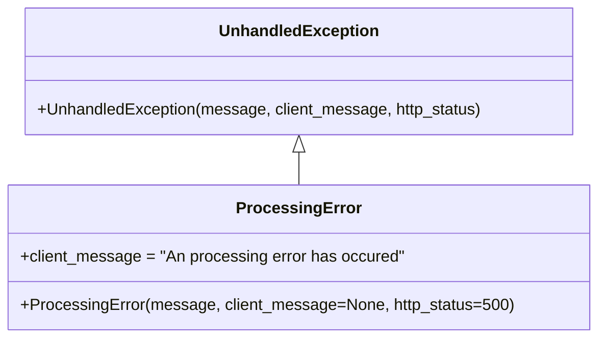

# Diagram: application_service/container_tracking_app_service/exception/ProcessingError.py

> Auto-generated by Obscura crawlers

## Mermaid

### SVG

<svg id="container" width="581.4296875" xmlns="http://www.w3.org/2000/svg" class="classDiagram" height="336" viewBox="0 0 581.4296875 336" role="graphics-document document" aria-roledescription="class"><g><defs><marker id="container_class-aggregationStart" class="marker aggregation class" refX="18" refY="7" markerWidth="190" markerHeight="240" orient="auto"><path d="M 18,7 L9,13 L1,7 L9,1 Z"></path></marker></defs><defs><marker id="container_class-aggregationEnd" class="marker aggregation class" refX="1" refY="7" markerWidth="20" markerHeight="28" orient="auto"><path d="M 18,7 L9,13 L1,7 L9,1 Z"></path></marker></defs><defs><marker id="container_class-extensionStart" class="marker extension class" refX="18" refY="7" markerWidth="190" markerHeight="240" orient="auto"><path d="M 1,7 L18,13 V 1 Z"></path></marker></defs><defs><marker id="container_class-extensionEnd" class="marker extension class" refX="1" refY="7" markerWidth="20" markerHeight="28" orient="auto"><path d="M 1,1 V 13 L18,7 Z"></path></marker></defs><defs><marker id="container_class-compositionStart" class="marker composition class" refX="18" refY="7" markerWidth="190" markerHeight="240" orient="auto"><path d="M 18,7 L9,13 L1,7 L9,1 Z"></path></marker></defs><defs><marker id="container_class-compositionEnd" class="marker composition class" refX="1" refY="7" markerWidth="20" markerHeight="28" orient="auto"><path d="M 18,7 L9,13 L1,7 L9,1 Z"></path></marker></defs><defs><marker id="container_class-dependencyStart" class="marker dependency class" refX="6" refY="7" markerWidth="190" markerHeight="240" orient="auto"><path d="M 5,7 L9,13 L1,7 L9,1 Z"></path></marker></defs><defs><marker id="container_class-dependencyEnd" class="marker dependency class" refX="13" refY="7" markerWidth="20" markerHeight="28" orient="auto"><path d="M 18,7 L9,13 L14,7 L9,1 Z"></path></marker></defs><defs><marker id="container_class-lollipopStart" class="marker lollipop class" refX="13" refY="7" markerWidth="190" markerHeight="240" orient="auto"><circle stroke="black" fill="transparent" cx="7" cy="7" r="6"></circle></marker></defs><defs><marker id="container_class-lollipopEnd" class="marker lollipop class" refX="1" refY="7" markerWidth="190" markerHeight="240" orient="auto"><circle stroke="black" fill="transparent" cx="7" cy="7" r="6"></circle></marker></defs><g class="root"><g class="clusters"></g><g class="edgePaths"><path d="M290.715,151.25L290.715,152.542C290.715,153.833,290.715,156.417,290.715,161.875C290.715,167.333,290.715,175.667,290.715,179.833L290.715,184" id="id_UnhandledException_ProcessingError_1" class="edge-thickness-normal edge-pattern-solid relation" style=";;;" data-edge="true" data-et="edge" data-id="id_UnhandledException_ProcessingError_1" data-points="W3sieCI6MjkwLjcxNDg0Mzc1LCJ5IjoxMzR9LHsieCI6MjkwLjcxNDg0Mzc1LCJ5IjoxNTl9LHsieCI6MjkwLjcxNDg0Mzc1LCJ5IjoxODR9XQ==" marker-start="url(#container_class-extensionStart)"></path></g><g class="edgeLabels"><g class="edgeLabel"><g class="label" data-id="id_UnhandledException_ProcessingError_1" transform="translate(0, 0)"><foreignObject width="0" height="0">

</foreignObject></g></g></g><g class="nodes"><g class="node default" id="classId-UnhandledException-0" transform="translate(290.71484375, 71)"><g class="basic label-container"><path d="M-270.48046875 -63 L270.48046875 -63 L270.48046875 63 L-270.48046875 63" stroke="none" stroke-width="0" fill="#ECECFF" style=""></path><path d="M-270.48046875 -63 C-122.32735500673508 -63, 25.82575873652985 -63, 270.48046875 -63 M-270.48046875 -63 C-155.41989538504527 -63, -40.35932202009056 -63, 270.48046875 -63 M270.48046875 -63 C270.48046875 -29.992296007364388, 270.48046875 3.0154079852712243, 270.48046875 63 M270.48046875 -63 C270.48046875 -27.95806911497977, 270.48046875 7.083861770040457, 270.48046875 63 M270.48046875 63 C63.97972451836529 63, -142.52101971326942 63, -270.48046875 63 M270.48046875 63 C69.94280208212592 63, -130.59486458574816 63, -270.48046875 63 M-270.48046875 63 C-270.48046875 36.37365994777737, -270.48046875 9.747319895554739, -270.48046875 -63 M-270.48046875 63 C-270.48046875 32.212395521043234, -270.48046875 1.4247910420864756, -270.48046875 -63" stroke="#9370DB" stroke-width="1.3" fill="none" stroke-dasharray="0 0" style=""></path></g><g class="annotation-group text" transform="translate(0, -39)"></g><g class="label-group text" transform="translate(-75.4921875, -39)"><g class="label" style="font-weight: bolder" transform="translate(0,-12)"><foreignObject width="150.984375" height="24">

UnhandledException

</foreignObject></g></g><g class="members-group text" transform="translate(-258.48046875, 9)"></g><g class="methods-group text" transform="translate(-258.48046875, 39)"><g class="label" style="" transform="translate(0,-12)"><foreignObject width="441.46875" height="24">

+UnhandledException(message, client_message, http_status)

</foreignObject></g></g><g class="divider" style=""><path d="M-270.48046875 -15 C-125.46539558761214 -15, 19.54967757477573 -15, 270.48046875 -15 M-270.48046875 -15 C-88.82861917157754 -15, 92.82323040684491 -15, 270.48046875 -15" stroke="#9370DB" stroke-width="1.3" fill="none" stroke-dasharray="0 0" style=""></path></g><g class="divider" style=""><path d="M-270.48046875 9 C-90.75828394150881 9, 88.96390086698239 9, 270.48046875 9 M-270.48046875 9 C-118.41996423359527 9, 33.64054028280947 9, 270.48046875 9" stroke="#9370DB" stroke-width="1.3" fill="none" stroke-dasharray="0 0" style=""></path></g></g><g class="node default" id="classId-ProcessingError-1" transform="translate(290.71484375, 256)"><g class="basic label-container"><path d="M-282.71484375 -72 L282.71484375 -72 L282.71484375 72 L-282.71484375 72" stroke="none" stroke-width="0" fill="#ECECFF" style=""></path><path d="M-282.71484375 -72 C-57.18151247925087 -72, 168.35181879149826 -72, 282.71484375 -72 M-282.71484375 -72 C-61.00948447029708 -72, 160.69587480940584 -72, 282.71484375 -72 M282.71484375 -72 C282.71484375 -26.444489567401547, 282.71484375 19.111020865196906, 282.71484375 72 M282.71484375 -72 C282.71484375 -41.22162606580754, 282.71484375 -10.443252131615083, 282.71484375 72 M282.71484375 72 C160.58712556382864 72, 38.45940737765724 72, -282.71484375 72 M282.71484375 72 C92.07024806992257 72, -98.57434761015486 72, -282.71484375 72 M-282.71484375 72 C-282.71484375 18.957980539406798, -282.71484375 -34.084038921186405, -282.71484375 -72 M-282.71484375 72 C-282.71484375 34.6871506060896, -282.71484375 -2.625698787820795, -282.71484375 -72" stroke="#9370DB" stroke-width="1.3" fill="none" stroke-dasharray="0 0" style=""></path></g><g class="annotation-group text" transform="translate(0, -48)"></g><g class="label-group text" transform="translate(-57.5078125, -48)"><g class="label" style="font-weight: bolder" transform="translate(0,-12)"><foreignObject width="115.015625" height="24">

ProcessingError

</foreignObject></g></g><g class="members-group text" transform="translate(-270.71484375, 0)"><g class="label" style="" transform="translate(0,-12)"><foreignObject width="380.234375" height="24">

+client_message = "An processing error has occured"

</foreignObject></g></g><g class="methods-group text" transform="translate(-270.71484375, 48)"><g class="label" style="" transform="translate(0,-12)"><foreignObject width="483.921875" height="24">

+ProcessingError(message, client_message=None, http_status=500)

</foreignObject></g></g><g class="divider" style=""><path d="M-282.71484375 -24 C-147.3830631891144 -24, -12.051282628228819 -24, 282.71484375 -24 M-282.71484375 -24 C-114.86944677347944 -24, 52.97595020304112 -24, 282.71484375 -24" stroke="#9370DB" stroke-width="1.3" fill="none" stroke-dasharray="0 0" style=""></path></g><g class="divider" style=""><path d="M-282.71484375 24 C-72.27565590589975 24, 138.1635319382005 24, 282.71484375 24 M-282.71484375 24 C-113.33444285074714 24, 56.045958048505724 24, 282.71484375 24" stroke="#9370DB" stroke-width="1.3" fill="none" stroke-dasharray="0 0" style=""></path></g></g></g></g></g></svg>
