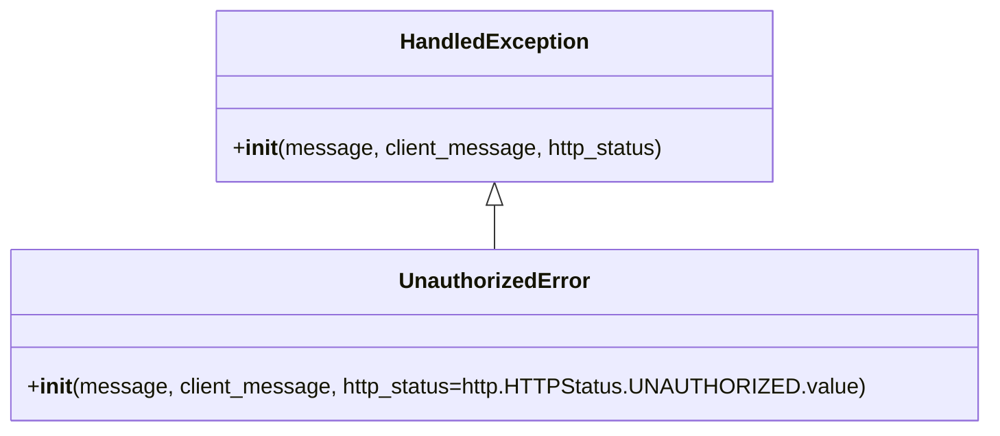

# Diagram: application_service/container_tracking_app_service/exception/UnauthorizedError.py

> Auto-generated by Obscura crawlers

## Mermaid

### SVG

<svg id="container" width="705.46875" xmlns="http://www.w3.org/2000/svg" class="classDiagram" height="318" viewBox="0 0 705.46875 318" role="graphics-document document" aria-roledescription="class"><g><defs><marker id="container_class-aggregationStart" class="marker aggregation class" refX="18" refY="7" markerWidth="190" markerHeight="240" orient="auto"><path d="M 18,7 L9,13 L1,7 L9,1 Z"></path></marker></defs><defs><marker id="container_class-aggregationEnd" class="marker aggregation class" refX="1" refY="7" markerWidth="20" markerHeight="28" orient="auto"><path d="M 18,7 L9,13 L1,7 L9,1 Z"></path></marker></defs><defs><marker id="container_class-extensionStart" class="marker extension class" refX="18" refY="7" markerWidth="190" markerHeight="240" orient="auto"><path d="M 1,7 L18,13 V 1 Z"></path></marker></defs><defs><marker id="container_class-extensionEnd" class="marker extension class" refX="1" refY="7" markerWidth="20" markerHeight="28" orient="auto"><path d="M 1,1 V 13 L18,7 Z"></path></marker></defs><defs><marker id="container_class-compositionStart" class="marker composition class" refX="18" refY="7" markerWidth="190" markerHeight="240" orient="auto"><path d="M 18,7 L9,13 L1,7 L9,1 Z"></path></marker></defs><defs><marker id="container_class-compositionEnd" class="marker composition class" refX="1" refY="7" markerWidth="20" markerHeight="28" orient="auto"><path d="M 18,7 L9,13 L1,7 L9,1 Z"></path></marker></defs><defs><marker id="container_class-dependencyStart" class="marker dependency class" refX="6" refY="7" markerWidth="190" markerHeight="240" orient="auto"><path d="M 5,7 L9,13 L1,7 L9,1 Z"></path></marker></defs><defs><marker id="container_class-dependencyEnd" class="marker dependency class" refX="13" refY="7" markerWidth="20" markerHeight="28" orient="auto"><path d="M 18,7 L9,13 L14,7 L9,1 Z"></path></marker></defs><defs><marker id="container_class-lollipopStart" class="marker lollipop class" refX="13" refY="7" markerWidth="190" markerHeight="240" orient="auto"><circle stroke="black" fill="transparent" cx="7" cy="7" r="6"></circle></marker></defs><defs><marker id="container_class-lollipopEnd" class="marker lollipop class" refX="1" refY="7" markerWidth="190" markerHeight="240" orient="auto"><circle stroke="black" fill="transparent" cx="7" cy="7" r="6"></circle></marker></defs><g class="root"><g class="clusters"></g><g class="edgePaths"><path d="M352.734,151.25L352.734,152.542C352.734,153.833,352.734,156.417,352.734,161.875C352.734,167.333,352.734,175.667,352.734,179.833L352.734,184" id="id_HandledException_UnauthorizedError_1" class="edge-thickness-normal edge-pattern-solid relation" style=";;;" data-edge="true" data-et="edge" data-id="id_HandledException_UnauthorizedError_1" data-points="W3sieCI6MzUyLjczNDM3NSwieSI6MTM0fSx7IngiOjM1Mi43MzQzNzUsInkiOjE1OX0seyJ4IjozNTIuNzM0Mzc1LCJ5IjoxODR9XQ==" marker-start="url(#container_class-extensionStart)"></path></g><g class="edgeLabels"><g class="edgeLabel"><g class="label" data-id="id_HandledException_UnauthorizedError_1" transform="translate(0, 0)"><foreignObject width="0" height="0">

</foreignObject></g></g></g><g class="nodes"><g class="node default" id="classId-HandledException-0" transform="translate(352.734375, 71)"><g class="basic label-container"><path d="M-202.83203125 -63 L202.83203125 -63 L202.83203125 63 L-202.83203125 63" stroke="none" stroke-width="0" fill="#ECECFF" style=""></path><path d="M-202.83203125 -63 C-54.64125058393404 -63, 93.54953008213192 -63, 202.83203125 -63 M-202.83203125 -63 C-109.47678862289297 -63, -16.121545995785937 -63, 202.83203125 -63 M202.83203125 -63 C202.83203125 -12.643322073246438, 202.83203125 37.713355853507124, 202.83203125 63 M202.83203125 -63 C202.83203125 -23.168683892130765, 202.83203125 16.66263221573847, 202.83203125 63 M202.83203125 63 C119.62140180652315 63, 36.410772363046306 63, -202.83203125 63 M202.83203125 63 C83.73891309470774 63, -35.35420506058452 63, -202.83203125 63 M-202.83203125 63 C-202.83203125 23.911300844248352, -202.83203125 -15.177398311503296, -202.83203125 -63 M-202.83203125 63 C-202.83203125 18.184840770222813, -202.83203125 -26.630318459554374, -202.83203125 -63" stroke="#9370DB" stroke-width="1.3" fill="none" stroke-dasharray="0 0" style=""></path></g><g class="annotation-group text" transform="translate(0, -39)"></g><g class="label-group text" transform="translate(-66.3828125, -39)"><g class="label" style="font-weight: bolder" transform="translate(0,-12)"><foreignObject width="132.765625" height="24">

HandledException

</foreignObject></g></g><g class="members-group text" transform="translate(-190.83203125, 9)"></g><g class="methods-group text" transform="translate(-190.83203125, 39)"><g class="label" style="" transform="translate(0,-12)"><foreignObject width="315.28125" height="24">

+<strong>init</strong>(message, client_message, http_status)

</foreignObject></g></g><g class="divider" style=""><path d="M-202.83203125 -15 C-95.01237916163191 -15, 12.807272926736175 -15, 202.83203125 -15 M-202.83203125 -15 C-114.04553089341935 -15, -25.259030536838708 -15, 202.83203125 -15" stroke="#9370DB" stroke-width="1.3" fill="none" stroke-dasharray="0 0" style=""></path></g><g class="divider" style=""><path d="M-202.83203125 9 C-89.18118250017301 9, 24.469666249653983 9, 202.83203125 9 M-202.83203125 9 C-64.2783480334918 9, 74.27533518301641 9, 202.83203125 9" stroke="#9370DB" stroke-width="1.3" fill="none" stroke-dasharray="0 0" style=""></path></g></g><g class="node default" id="classId-UnauthorizedError-1" transform="translate(352.734375, 247)"><g class="basic label-container"><path d="M-344.734375 -63 L344.734375 -63 L344.734375 63 L-344.734375 63" stroke="none" stroke-width="0" fill="#ECECFF" style=""></path><path d="M-344.734375 -63 C-156.49815989608825 -63, 31.738055207823493 -63, 344.734375 -63 M-344.734375 -63 C-94.38268520855272 -63, 155.96900458289457 -63, 344.734375 -63 M344.734375 -63 C344.734375 -25.48124943679369, 344.734375 12.037501126412621, 344.734375 63 M344.734375 -63 C344.734375 -20.673597442072307, 344.734375 21.652805115855386, 344.734375 63 M344.734375 63 C116.0950839306395 63, -112.54420713872099 63, -344.734375 63 M344.734375 63 C96.09820708571783 63, -152.53796082856434 63, -344.734375 63 M-344.734375 63 C-344.734375 23.575198584175446, -344.734375 -15.849602831649108, -344.734375 -63 M-344.734375 63 C-344.734375 22.481946338327184, -344.734375 -18.036107323345632, -344.734375 -63" stroke="#9370DB" stroke-width="1.3" fill="none" stroke-dasharray="0 0" style=""></path></g><g class="annotation-group text" transform="translate(0, -39)"></g><g class="label-group text" transform="translate(-67.625, -39)"><g class="label" style="font-weight: bolder" transform="translate(0,-12)"><foreignObject width="135.25" height="24">

UnauthorizedError

</foreignObject></g></g><g class="members-group text" transform="translate(-332.734375, 9)"></g><g class="methods-group text" transform="translate(-332.734375, 39)"><g class="label" style="" transform="translate(0,-12)"><foreignObject width="597.84375" height="24">

+<strong>init</strong>(message, client_message, http_status=http.HTTPStatus.UNAUTHORIZED.value)

</foreignObject></g></g><g class="divider" style=""><path d="M-344.734375 -15 C-124.2161922645121 -15, 96.3019904709758 -15, 344.734375 -15 M-344.734375 -15 C-156.99850599916206 -15, 30.737363001675874 -15, 344.734375 -15" stroke="#9370DB" stroke-width="1.3" fill="none" stroke-dasharray="0 0" style=""></path></g><g class="divider" style=""><path d="M-344.734375 9 C-182.9681432013994 9, -21.201911402798828 9, 344.734375 9 M-344.734375 9 C-144.6895346131979 9, 55.35530577360419 9, 344.734375 9" stroke="#9370DB" stroke-width="1.3" fill="none" stroke-dasharray="0 0" style=""></path></g></g></g></g></g></svg>
