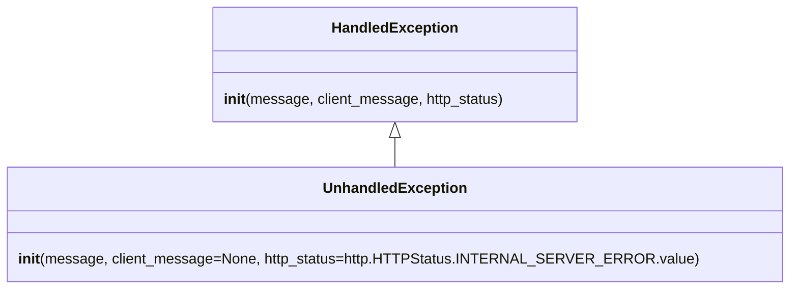

# Diagram: application_service/container_tracking_app_service/exception/UnhandledException.py


> Auto-generated by Obscura crawlers

## Diagram 1



### SVG

<svg id="container" width="828.2890625" xmlns="http://www.w3.org/2000/svg" class="classDiagram" height="318" viewBox="0 0 828.2890625 318" role="graphics-document document" aria-roledescription="class"><style>#container{font-family:"trebuchet ms",verdana,arial,sans-serif;font-size:16px;fill:#333;}@keyframes edge-animation-frame{from{stroke-dashoffset:0;}}@keyframes dash{to{stroke-dashoffset:0;}}#container .edge-animation-slow{stroke-dasharray:9,5!important;stroke-dashoffset:900;animation:dash 50s linear infinite;stroke-linecap:round;}#container .edge-animation-fast{stroke-dasharray:9,5!important;stroke-dashoffset:900;animation:dash 20s linear infinite;stroke-linecap:round;}#container .error-icon{fill:#552222;}#container .error-text{fill:#552222;stroke:#552222;}#container .edge-thickness-normal{stroke-width:1px;}#container .edge-thickness-thick{stroke-width:3.5px;}#container .edge-pattern-solid{stroke-dasharray:0;}#container .edge-thickness-invisible{stroke-width:0;fill:none;}#container .edge-pattern-dashed{stroke-dasharray:3;}#container .edge-pattern-dotted{stroke-dasharray:2;}#container .marker{fill:#333333;stroke:#333333;}#container .marker.cross{stroke:#333333;}#container svg{font-family:"trebuchet ms",verdana,arial,sans-serif;font-size:16px;}#container p{margin:0;}#container g.classGroup text{fill:#9370DB;stroke:none;font-family:"trebuchet ms",verdana,arial,sans-serif;font-size:10px;}#container g.classGroup text .title{font-weight:bolder;}#container .nodeLabel,#container .edgeLabel{color:#131300;}#container .edgeLabel .label rect{fill:#ECECFF;}#container .label text{fill:#131300;}#container .labelBkg{background:#ECECFF;}#container .edgeLabel .label span{background:#ECECFF;}#container .classTitle{font-weight:bolder;}#container .node rect,#container .node circle,#container .node ellipse,#container .node polygon,#container .node path{fill:#ECECFF;stroke:#9370DB;stroke-width:1px;}#container .divider{stroke:#9370DB;stroke-width:1;}#container g.clickable{cursor:pointer;}#container g.classGroup rect{fill:#ECECFF;stroke:#9370DB;}#container g.classGroup line{stroke:#9370DB;stroke-width:1;}#container .classLabel .box{stroke:none;stroke-width:0;fill:#ECECFF;opacity:0.5;}#container .classLabel .label{fill:#9370DB;font-size:10px;}#container .relation{stroke:#333333;stroke-width:1;fill:none;}#container .dashed-line{stroke-dasharray:3;}#container .dotted-line{stroke-dasharray:1 2;}#container #compositionStart,#container .composition{fill:#333333!important;stroke:#333333!important;stroke-width:1;}#container #compositionEnd,#container .composition{fill:#333333!important;stroke:#333333!important;stroke-width:1;}#container #dependencyStart,#container .dependency{fill:#333333!important;stroke:#333333!important;stroke-width:1;}#container #dependencyStart,#container .dependency{fill:#333333!important;stroke:#333333!important;stroke-width:1;}#container #extensionStart,#container .extension{fill:transparent!important;stroke:#333333!important;stroke-width:1;}#container #extensionEnd,#container .extension{fill:transparent!important;stroke:#333333!important;stroke-width:1;}#container #aggregationStart,#container .aggregation{fill:transparent!important;stroke:#333333!important;stroke-width:1;}#container #aggregationEnd,#container .aggregation{fill:transparent!important;stroke:#333333!important;stroke-width:1;}#container #lollipopStart,#container .lollipop{fill:#ECECFF!important;stroke:#333333!important;stroke-width:1;}#container #lollipopEnd,#container .lollipop{fill:#ECECFF!important;stroke:#333333!important;stroke-width:1;}#container .edgeTerminals{font-size:11px;line-height:initial;}#container .classTitleText{text-anchor:middle;font-size:18px;fill:#333;}#container .label-icon{display:inline-block;height:1em;overflow:visible;vertical-align:-0.125em;}#container .node .label-icon path{fill:currentColor;stroke:revert;stroke-width:revert;}#container :root{--mermaid-font-family:"trebuchet ms",verdana,arial,sans-serif;}</style><g><defs><marker id="container_class-aggregationStart" class="marker aggregation class" refX="18" refY="7" markerWidth="190" markerHeight="240" orient="auto"><path d="M 18,7 L9,13 L1,7 L9,1 Z"></path></marker></defs><defs><marker id="container_class-aggregationEnd" class="marker aggregation class" refX="1" refY="7" markerWidth="20" markerHeight="28" orient="auto"><path d="M 18,7 L9,13 L1,7 L9,1 Z"></path></marker></defs><defs><marker id="container_class-extensionStart" class="marker extension class" refX="18" refY="7" markerWidth="190" markerHeight="240" orient="auto"><path d="M 1,7 L18,13 V 1 Z"></path></marker></defs><defs><marker id="container_class-extensionEnd" class="marker extension class" refX="1" refY="7" markerWidth="20" markerHeight="28" orient="auto"><path d="M 1,1 V 13 L18,7 Z"></path></marker></defs><defs><marker id="container_class-compositionStart" class="marker composition class" refX="18" refY="7" markerWidth="190" markerHeight="240" orient="auto"><path d="M 18,7 L9,13 L1,7 L9,1 Z"></path></marker></defs><defs><marker id="container_class-compositionEnd" class="marker composition class" refX="1" refY="7" markerWidth="20" markerHeight="28" orient="auto"><path d="M 18,7 L9,13 L1,7 L9,1 Z"></path></marker></defs><defs><marker id="container_class-dependencyStart" class="marker dependency class" refX="6" refY="7" markerWidth="190" markerHeight="240" orient="auto"><path d="M 5,7 L9,13 L1,7 L9,1 Z"></path></marker></defs><defs><marker id="container_class-dependencyEnd" class="marker dependency class" refX="13" refY="7" markerWidth="20" markerHeight="28" orient="auto"><path d="M 18,7 L9,13 L14,7 L9,1 Z"></path></marker></defs><defs><marker id="container_class-lollipopStart" class="marker lollipop class" refX="13" refY="7" markerWidth="190" markerHeight="240" orient="auto"><circle stroke="black" fill="transparent" cx="7" cy="7" r="6"></circle></marker></defs><defs><marker id="container_class-lollipopEnd" class="marker lollipop class" refX="1" refY="7" markerWidth="190" markerHeight="240" orient="auto"><circle stroke="black" fill="transparent" cx="7" cy="7" r="6"></circle></marker></defs><g class="root"><g class="clusters"></g><g class="edgePaths"><path d="M414.145,151.25L414.145,152.542C414.145,153.833,414.145,156.417,414.145,161.875C414.145,167.333,414.145,175.667,414.145,179.833L414.145,184" id="id_HandledException_UnhandledException_1" class="edge-thickness-normal edge-pattern-solid relation" style=";;;" data-edge="true" data-et="edge" data-id="id_HandledException_UnhandledException_1" data-points="W3sieCI6NDE0LjE0NDUzMTI1LCJ5IjoxMzR9LHsieCI6NDE0LjE0NDUzMTI1LCJ5IjoxNTl9LHsieCI6NDE0LjE0NDUzMTI1LCJ5IjoxODR9XQ==" marker-start="url(#container_class-extensionStart)"></path></g><g class="edgeLabels"><g class="edgeLabel"><g class="label" data-id="id_HandledException_UnhandledException_1" transform="translate(0, 0)"><foreignObject width="0" height="0"><div xmlns="http://www.w3.org/1999/xhtml" class="labelBkg" style="display: table-cell; white-space: nowrap; line-height: 1.5; max-width: 200px; text-align: center;"><span class="edgeLabel"></span></div></foreignObject></g></g></g><g class="nodes"><g class="node default" id="classId-HandledException-0" transform="translate(414.14453125, 71)"><g class="basic label-container"><path d="M-198.83984375 -63 L198.83984375 -63 L198.83984375 63 L-198.83984375 63" stroke="none" stroke-width="0" fill="#ECECFF" style=""></path><path d="M-198.83984375 -63 C-109.77098345227215 -63, -20.702123154544296 -63, 198.83984375 -63 M-198.83984375 -63 C-77.48071542900749 -63, 43.87841289198502 -63, 198.83984375 -63 M198.83984375 -63 C198.83984375 -32.264326101973964, 198.83984375 -1.528652203947921, 198.83984375 63 M198.83984375 -63 C198.83984375 -37.763444979366334, 198.83984375 -12.526889958732667, 198.83984375 63 M198.83984375 63 C104.02638534504483 63, 9.212926940089659 63, -198.83984375 63 M198.83984375 63 C42.29747382053861 63, -114.24489610892277 63, -198.83984375 63 M-198.83984375 63 C-198.83984375 17.091653039128047, -198.83984375 -28.816693921743905, -198.83984375 -63 M-198.83984375 63 C-198.83984375 14.292277717184227, -198.83984375 -34.415444565631546, -198.83984375 -63" stroke="#9370DB" stroke-width="1.3" fill="none" stroke-dasharray="0 0" style=""></path></g><g class="annotation-group text" transform="translate(0, -39)"></g><g class="label-group text" transform="translate(-66.3828125, -39)"><g class="label" style="font-weight: bolder" transform="translate(0,-12)"><foreignObject width="132.765625" height="24"><div xmlns="http://www.w3.org/1999/xhtml" style="display: table-cell; white-space: nowrap; line-height: 1.5; max-width: 182px; text-align: center;"><span class="nodeLabel markdown-node-label" style=""><p>HandledException</p></span></div></foreignObject></g></g><g class="members-group text" transform="translate(-186.83984375, 9)"></g><g class="methods-group text" transform="translate(-186.83984375, 39)"><g class="label" style="" transform="translate(0,-12)"><foreignObject width="307.296875" height="24"><div xmlns="http://www.w3.org/1999/xhtml" style="display: table-cell; white-space: nowrap; line-height: 1.5; max-width: 390px; text-align: center;"><span class="nodeLabel markdown-node-label" style=""><p><strong>init</strong>(message, client_message, http_status)</p></span></div></foreignObject></g></g><g class="divider" style=""><path d="M-198.83984375 -15 C-85.45187434018254 -15, 27.936095069634916 -15, 198.83984375 -15 M-198.83984375 -15 C-116.84151956426875 -15, -34.8431953785375 -15, 198.83984375 -15" stroke="#9370DB" stroke-width="1.3" fill="none" stroke-dasharray="0 0" style=""></path></g><g class="divider" style=""><path d="M-198.83984375 9 C-97.66142237301638 9, 3.5169990039672427 9, 198.83984375 9 M-198.83984375 9 C-82.28333358495242 9, 34.27317658009517 9, 198.83984375 9" stroke="#9370DB" stroke-width="1.3" fill="none" stroke-dasharray="0 0" style=""></path></g></g><g class="node default" id="classId-UnhandledException-1" transform="translate(414.14453125, 247)"><g class="basic label-container"><path d="M-406.14453125 -63 L406.14453125 -63 L406.14453125 63 L-406.14453125 63" stroke="none" stroke-width="0" fill="#ECECFF" style=""></path><path d="M-406.14453125 -63 C-179.3008082790803 -63, 47.54291469183943 -63, 406.14453125 -63 M-406.14453125 -63 C-197.58748085336072 -63, 10.969569543278567 -63, 406.14453125 -63 M406.14453125 -63 C406.14453125 -28.07032274464595, 406.14453125 6.859354510708101, 406.14453125 63 M406.14453125 -63 C406.14453125 -33.15639387039374, 406.14453125 -3.3127877407874777, 406.14453125 63 M406.14453125 63 C129.5791131549363 63, -146.9863049401274 63, -406.14453125 63 M406.14453125 63 C206.16132412424446 63, 6.1781169984889175 63, -406.14453125 63 M-406.14453125 63 C-406.14453125 36.06425375486071, -406.14453125 9.128507509721416, -406.14453125 -63 M-406.14453125 63 C-406.14453125 25.483540372405784, -406.14453125 -12.032919255188432, -406.14453125 -63" stroke="#9370DB" stroke-width="1.3" fill="none" stroke-dasharray="0 0" style=""></path></g><g class="annotation-group text" transform="translate(0, -39)"></g><g class="label-group text" transform="translate(-75.4921875, -39)"><g class="label" style="font-weight: bolder" transform="translate(0,-12)"><foreignObject width="150.984375" height="24"><div xmlns="http://www.w3.org/1999/xhtml" style="display: table-cell; white-space: nowrap; line-height: 1.5; max-width: 201px; text-align: center;"><span class="nodeLabel markdown-node-label" style=""><p>UnhandledException</p></span></div></foreignObject></g></g><g class="members-group text" transform="translate(-394.14453125, 9)"></g><g class="methods-group text" transform="translate(-394.14453125, 39)"><g class="label" style="" transform="translate(0,-12)"><foreignObject width="712.796875" height="24"><div xmlns="http://www.w3.org/1999/xhtml" style="display: table-cell; white-space: nowrap; line-height: 1.5; max-width: 796px; text-align: center;"><span class="nodeLabel markdown-node-label" style=""><p><strong>init</strong>(message, client_message=None, http_status=http.HTTPStatus.INTERNAL_SERVER_ERROR.value)</p></span></div></foreignObject></g></g><g class="divider" style=""><path d="M-406.14453125 -15 C-84.31228415916917 -15, 237.51996293166167 -15, 406.14453125 -15 M-406.14453125 -15 C-129.2259084050604 -15, 147.69271443987918 -15, 406.14453125 -15" stroke="#9370DB" stroke-width="1.3" fill="none" stroke-dasharray="0 0" style=""></path></g><g class="divider" style=""><path d="M-406.14453125 9 C-167.70958305353633 9, 70.72536514292733 9, 406.14453125 9 M-406.14453125 9 C-181.64783391399627 9, 42.84886342200747 9, 406.14453125 9" stroke="#9370DB" stroke-width="1.3" fill="none" stroke-dasharray="0 0" style=""></path></g></g></g></g></g></svg>

## Diagram 2

```mermaid
flowchart TD
Start([Create UnhandledException]) --> Check{client_message provided?}
Check -- "yes" --> UseProvided[Use provided client_message]
Check -- "no" --> SetDefault[client_message = "An unexpected error has occured"]
UseProvided --> CallSuper[call HandledException.__init__(message, client_message, http_status)]
SetDefault --> CallSuper
CallSuper --> End([UnhandledException instance initialized])
```

> SVG rendering failed for this diagram.
