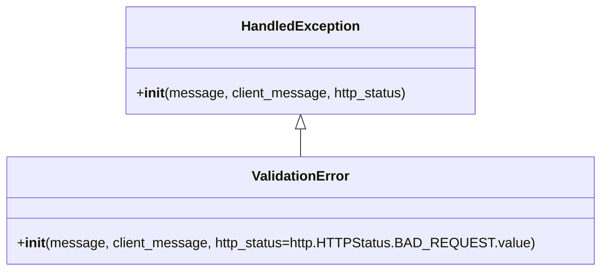

# Diagram: application_service/container_tracking_app_service/exception/ValidationError.py

> Auto-generated by Obscura crawlers

## Mermaid

### SVG

<svg id="container" width="681.1171875" xmlns="http://www.w3.org/2000/svg" class="classDiagram" height="318" viewBox="0 0 681.1171875 318" role="graphics-document document" aria-roledescription="class"><g><defs><marker id="container_class-aggregationStart" class="marker aggregation class" refX="18" refY="7" markerWidth="190" markerHeight="240" orient="auto"><path d="M 18,7 L9,13 L1,7 L9,1 Z"></path></marker></defs><defs><marker id="container_class-aggregationEnd" class="marker aggregation class" refX="1" refY="7" markerWidth="20" markerHeight="28" orient="auto"><path d="M 18,7 L9,13 L1,7 L9,1 Z"></path></marker></defs><defs><marker id="container_class-extensionStart" class="marker extension class" refX="18" refY="7" markerWidth="190" markerHeight="240" orient="auto"><path d="M 1,7 L18,13 V 1 Z"></path></marker></defs><defs><marker id="container_class-extensionEnd" class="marker extension class" refX="1" refY="7" markerWidth="20" markerHeight="28" orient="auto"><path d="M 1,1 V 13 L18,7 Z"></path></marker></defs><defs><marker id="container_class-compositionStart" class="marker composition class" refX="18" refY="7" markerWidth="190" markerHeight="240" orient="auto"><path d="M 18,7 L9,13 L1,7 L9,1 Z"></path></marker></defs><defs><marker id="container_class-compositionEnd" class="marker composition class" refX="1" refY="7" markerWidth="20" markerHeight="28" orient="auto"><path d="M 18,7 L9,13 L1,7 L9,1 Z"></path></marker></defs><defs><marker id="container_class-dependencyStart" class="marker dependency class" refX="6" refY="7" markerWidth="190" markerHeight="240" orient="auto"><path d="M 5,7 L9,13 L1,7 L9,1 Z"></path></marker></defs><defs><marker id="container_class-dependencyEnd" class="marker dependency class" refX="13" refY="7" markerWidth="20" markerHeight="28" orient="auto"><path d="M 18,7 L9,13 L14,7 L9,1 Z"></path></marker></defs><defs><marker id="container_class-lollipopStart" class="marker lollipop class" refX="13" refY="7" markerWidth="190" markerHeight="240" orient="auto"><circle stroke="black" fill="transparent" cx="7" cy="7" r="6"></circle></marker></defs><defs><marker id="container_class-lollipopEnd" class="marker lollipop class" refX="1" refY="7" markerWidth="190" markerHeight="240" orient="auto"><circle stroke="black" fill="transparent" cx="7" cy="7" r="6"></circle></marker></defs><g class="root"><g class="clusters"></g><g class="edgePaths"><path d="M340.559,151.25L340.559,152.542C340.559,153.833,340.559,156.417,340.559,161.875C340.559,167.333,340.559,175.667,340.559,179.833L340.559,184" id="id_HandledException_ValidationError_1" class="edge-thickness-normal edge-pattern-solid relation" style=";;;" data-edge="true" data-et="edge" data-id="id_HandledException_ValidationError_1" data-points="W3sieCI6MzQwLjU1ODU5Mzc1LCJ5IjoxMzR9LHsieCI6MzQwLjU1ODU5Mzc1LCJ5IjoxNTl9LHsieCI6MzQwLjU1ODU5Mzc1LCJ5IjoxODR9XQ==" marker-start="url(#container_class-extensionStart)"></path></g><g class="edgeLabels"><g class="edgeLabel"><g class="label" data-id="id_HandledException_ValidationError_1" transform="translate(0, 0)"><foreignObject width="0" height="0">

</foreignObject></g></g></g><g class="nodes"><g class="node default" id="classId-HandledException-0" transform="translate(340.55859375, 71)"><g class="basic label-container"><path d="M-202.83203125 -63 L202.83203125 -63 L202.83203125 63 L-202.83203125 63" stroke="none" stroke-width="0" fill="#ECECFF" style=""></path><path d="M-202.83203125 -63 C-81.4108085193735 -63, 40.01041421125299 -63, 202.83203125 -63 M-202.83203125 -63 C-93.63484635907501 -63, 15.562338531849974 -63, 202.83203125 -63 M202.83203125 -63 C202.83203125 -32.37071670948231, 202.83203125 -1.7414334189646183, 202.83203125 63 M202.83203125 -63 C202.83203125 -12.822939023448598, 202.83203125 37.354121953102805, 202.83203125 63 M202.83203125 63 C118.53801867656504 63, 34.24400610313009 63, -202.83203125 63 M202.83203125 63 C67.30851962906189 63, -68.21499199187622 63, -202.83203125 63 M-202.83203125 63 C-202.83203125 34.53363152154342, -202.83203125 6.0672630430868395, -202.83203125 -63 M-202.83203125 63 C-202.83203125 13.373798976788919, -202.83203125 -36.25240204642216, -202.83203125 -63" stroke="#9370DB" stroke-width="1.3" fill="none" stroke-dasharray="0 0" style=""></path></g><g class="annotation-group text" transform="translate(0, -39)"></g><g class="label-group text" transform="translate(-66.3828125, -39)"><g class="label" style="font-weight: bolder" transform="translate(0,-12)"><foreignObject width="132.765625" height="24">

HandledException

</foreignObject></g></g><g class="members-group text" transform="translate(-190.83203125, 9)"></g><g class="methods-group text" transform="translate(-190.83203125, 39)"><g class="label" style="" transform="translate(0,-12)"><foreignObject width="315.28125" height="24">

+<strong>init</strong>(message, client_message, http_status)

</foreignObject></g></g><g class="divider" style=""><path d="M-202.83203125 -15 C-100.86742412905869 -15, 1.0971829918826188 -15, 202.83203125 -15 M-202.83203125 -15 C-62.16400107518575 -15, 78.5040290996285 -15, 202.83203125 -15" stroke="#9370DB" stroke-width="1.3" fill="none" stroke-dasharray="0 0" style=""></path></g><g class="divider" style=""><path d="M-202.83203125 9 C-107.40592000728097 9, -11.979808764561938 9, 202.83203125 9 M-202.83203125 9 C-47.060961706813 9, 108.710107836374 9, 202.83203125 9" stroke="#9370DB" stroke-width="1.3" fill="none" stroke-dasharray="0 0" style=""></path></g></g><g class="node default" id="classId-ValidationError-1" transform="translate(340.55859375, 247)"><g class="basic label-container"><path d="M-332.55859375 -63 L332.55859375 -63 L332.55859375 63 L-332.55859375 63" stroke="none" stroke-width="0" fill="#ECECFF" style=""></path><path d="M-332.55859375 -63 C-157.46277454516672 -63, 17.633044659666552 -63, 332.55859375 -63 M-332.55859375 -63 C-76.51174764989418 -63, 179.53509845021165 -63, 332.55859375 -63 M332.55859375 -63 C332.55859375 -36.752321487683844, 332.55859375 -10.504642975367695, 332.55859375 63 M332.55859375 -63 C332.55859375 -34.48691503444436, 332.55859375 -5.9738300688887165, 332.55859375 63 M332.55859375 63 C139.64219138153106 63, -53.274210986937874 63, -332.55859375 63 M332.55859375 63 C142.79553088023107 63, -46.96753198953786 63, -332.55859375 63 M-332.55859375 63 C-332.55859375 26.7007867817456, -332.55859375 -9.598426436508802, -332.55859375 -63 M-332.55859375 63 C-332.55859375 16.388139697861007, -332.55859375 -30.223720604277986, -332.55859375 -63" stroke="#9370DB" stroke-width="1.3" fill="none" stroke-dasharray="0 0" style=""></path></g><g class="annotation-group text" transform="translate(0, -39)"></g><g class="label-group text" transform="translate(-55.1796875, -39)"><g class="label" style="font-weight: bolder" transform="translate(0,-12)"><foreignObject width="110.359375" height="24">

ValidationError

</foreignObject></g></g><g class="members-group text" transform="translate(-320.55859375, 9)"></g><g class="methods-group text" transform="translate(-320.55859375, 39)"><g class="label" style="" transform="translate(0,-12)"><foreignObject width="585.9375" height="24">

+<strong>init</strong>(message, client_message, http_status=http.HTTPStatus.BAD_REQUEST.value)

</foreignObject></g></g><g class="divider" style=""><path d="M-332.55859375 -15 C-172.2545435707801 -15, -11.950493391560201 -15, 332.55859375 -15 M-332.55859375 -15 C-134.62544329178206 -15, 63.307707166435875 -15, 332.55859375 -15" stroke="#9370DB" stroke-width="1.3" fill="none" stroke-dasharray="0 0" style=""></path></g><g class="divider" style=""><path d="M-332.55859375 9 C-75.26395842658968 9, 182.03067689682064 9, 332.55859375 9 M-332.55859375 9 C-106.67386560445149 9, 119.21086254109701 9, 332.55859375 9" stroke="#9370DB" stroke-width="1.3" fill="none" stroke-dasharray="0 0" style=""></path></g></g></g></g></g></svg>
