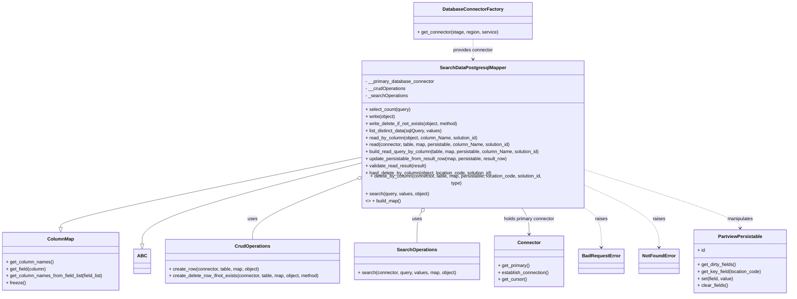
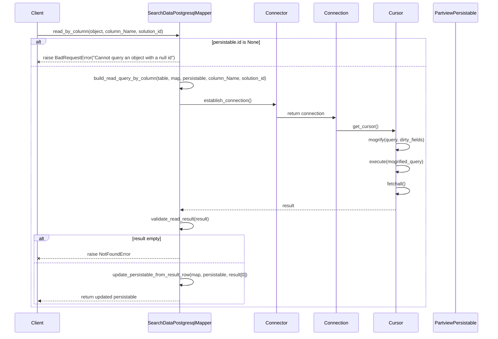

# Diagram: application_service/container_tracking_app_service/persistance_adapter/SearchDataPostgresqlMapper.py

> Auto-generated by Obscura crawlers

## Diagram 1

### SVG

<svg id="container" width="2690.5234375" xmlns="http://www.w3.org/2000/svg" class="classDiagram" height="986" viewBox="0 0 2690.5234375 986" role="graphics-document document" aria-roledescription="class"><g><defs><marker id="container_class-aggregationStart" class="marker aggregation class" refX="18" refY="7" markerWidth="190" markerHeight="240" orient="auto"><path d="M 18,7 L9,13 L1,7 L9,1 Z"></path></marker></defs><defs><marker id="container_class-aggregationEnd" class="marker aggregation class" refX="1" refY="7" markerWidth="20" markerHeight="28" orient="auto"><path d="M 18,7 L9,13 L1,7 L9,1 Z"></path></marker></defs><defs><marker id="container_class-extensionStart" class="marker extension class" refX="18" refY="7" markerWidth="190" markerHeight="240" orient="auto"><path d="M 1,7 L18,13 V 1 Z"></path></marker></defs><defs><marker id="container_class-extensionEnd" class="marker extension class" refX="1" refY="7" markerWidth="20" markerHeight="28" orient="auto"><path d="M 1,1 V 13 L18,7 Z"></path></marker></defs><defs><marker id="container_class-compositionStart" class="marker composition class" refX="18" refY="7" markerWidth="190" markerHeight="240" orient="auto"><path d="M 18,7 L9,13 L1,7 L9,1 Z"></path></marker></defs><defs><marker id="container_class-compositionEnd" class="marker composition class" refX="1" refY="7" markerWidth="20" markerHeight="28" orient="auto"><path d="M 18,7 L9,13 L1,7 L9,1 Z"></path></marker></defs><defs><marker id="container_class-dependencyStart" class="marker dependency class" refX="6" refY="7" markerWidth="190" markerHeight="240" orient="auto"><path d="M 5,7 L9,13 L1,7 L9,1 Z"></path></marker></defs><defs><marker id="container_class-dependencyEnd" class="marker dependency class" refX="13" refY="7" markerWidth="20" markerHeight="28" orient="auto"><path d="M 18,7 L9,13 L14,7 L9,1 Z"></path></marker></defs><defs><marker id="container_class-lollipopStart" class="marker lollipop class" refX="13" refY="7" markerWidth="190" markerHeight="240" orient="auto"><circle stroke="black" fill="transparent" cx="7" cy="7" r="6"></circle></marker></defs><defs><marker id="container_class-lollipopEnd" class="marker lollipop class" refX="1" refY="7" markerWidth="190" markerHeight="240" orient="auto"><circle stroke="black" fill="transparent" cx="7" cy="7" r="6"></circle></marker></defs><g class="root"><g class="clusters"></g><g class="edgePaths"><path d="M1238.756,523.674L1067.406,557.229C896.056,590.783,553.356,657.891,382.006,696.237C210.656,734.583,210.656,744.167,210.656,748.958L210.656,753.75" id="id_SearchDataPostgresqlMapper_ColumnMap_1" class="edge-thickness-normal edge-pattern-solid relation" style=";;;" data-edge="true" data-et="edge" data-id="id_SearchDataPostgresqlMapper_ColumnMap_1" data-points="W3sieCI6MTIzOC43NTU4NTkzNzUsInkiOjUyMy42NzQyMDY5MzI3MzY5fSx7IngiOjIxMC42NTYyNSwieSI6NzI1fSx7IngiOjIxMC42NTYyNSwieSI6NzcxfV0=" marker-end="url(#container_class-extensionEnd)"></path><path d="M1238.756,542.26L1113.892,572.717C989.027,603.173,739.299,664.087,614.435,708.835C489.57,753.583,489.57,782.167,489.57,796.458L489.57,810.75" id="id_SearchDataPostgresqlMapper_ABC_2" class="edge-thickness-normal edge-pattern-solid relation" style=";;;" data-edge="true" data-et="edge" data-id="id_SearchDataPostgresqlMapper_ABC_2" data-points="W3sieCI6MTIzOC43NTU4NTkzNzUsInkiOjU0Mi4yNjAwNjQyMTk3NTc1fSx7IngiOjQ4OS41NzAzMTI1LCJ5Ijo3MjV9LHsieCI6NDg5LjU3MDMxMjUsInkiOjgyOH1d" marker-end="url(#container_class-extensionEnd)"></path><path d="M1222.555,595.243L1163.418,616.869C1104.28,638.495,986.005,681.748,926.868,715.041C867.73,748.333,867.73,771.667,867.73,783.333L867.73,795" id="id_SearchDataPostgresqlMapper_CrudOperations_3" class="edge-thickness-normal edge-pattern-solid relation" style=";;;" data-edge="true" data-et="edge" data-id="id_SearchDataPostgresqlMapper_CrudOperations_3" data-points="W3sieCI6MTIzOC43NTU4NTkzNzUsInkiOjU4OS4zMTg3NjEzOTM3Mjg2fSx7IngiOjg2Ny43MzA0Njg3NSwieSI6NzI1fSx7IngiOjg2Ny43MzA0Njg3NSwieSI6Nzk1fV0=" marker-start="url(#container_class-aggregationStart)"></path><path d="M1449.307,702.185L1446.676,705.988C1444.045,709.79,1438.782,717.395,1436.151,734.864C1433.52,752.333,1433.52,779.667,1433.52,793.333L1433.52,807" id="id_SearchDataPostgresqlMapper_SearchOperations_4" class="edge-thickness-normal edge-pattern-solid relation" style=";;;" data-edge="true" data-et="edge" data-id="id_SearchDataPostgresqlMapper_SearchOperations_4" data-points="W3sieCI6MTQ1OS4xMjI2OTQzMjUzNjEsInkiOjY4OH0seyJ4IjoxNDMzLjUxOTUzMTI1LCJ5Ijo3MjV9LHsieCI6MTQzMy41MTk1MzEyNSwieSI6ODA3fV0=" marker-start="url(#container_class-aggregationStart)"></path><path d="M1791.272,688L1795.539,694.167C1799.806,700.333,1808.341,712.667,1812.608,727.5C1816.875,742.333,1816.875,759.667,1816.875,768.333L1816.875,777" id="id_SearchDataPostgresqlMapper_Connector_5" class="edge-thickness-normal edge-pattern-solid relation" style=";;;" data-edge="true" data-et="edge" data-id="id_SearchDataPostgresqlMapper_Connector_5" data-points="W3sieCI6MTc5MS4yNzE4MzY5MjQ2MzksInkiOjY4OH0seyJ4IjoxODE2Ljg3NSwieSI6NzI1fSx7IngiOjE4MTYuODc1LCJ5Ijo3ODN9XQ==" marker-end="url(#container_class-dependencyEnd)"></path><path d="M1625.197,134L1625.197,140.167C1625.197,146.333,1625.197,158.667,1625.197,170C1625.197,181.333,1625.197,191.667,1625.197,196.833L1625.197,202" id="id_DatabaseConnectorFactory_SearchDataPostgresqlMapper_6" class="edge-thickness-normal edge-pattern-dashed relation" style=";;;" data-edge="true" data-et="edge" data-id="id_DatabaseConnectorFactory_SearchDataPostgresqlMapper_6" data-points="W3sieCI6MTYyNS4xOTcyNjU2MjUsInkiOjEzNH0seyJ4IjoxNjI1LjE5NzI2NTYyNSwieSI6MTcxfSx7IngiOjE2MjUuMTk3MjY1NjI1LCJ5IjoyMDh9XQ==" marker-end="url(#container_class-dependencyEnd)"></path><path d="M2002.463,688L2012.157,694.167C2021.85,700.333,2041.238,712.667,2050.931,735C2060.625,757.333,2060.625,789.667,2060.625,805.833L2060.625,822" id="id_SearchDataPostgresqlMapper_BadRequestError_7" class="edge-thickness-normal edge-pattern-dashed relation" style=";;;" data-edge="true" data-et="edge" data-id="id_SearchDataPostgresqlMapper_BadRequestError_7" data-points="W3sieCI6MjAwMi40NjMxNzI2NjQ3MTEyLCJ5Ijo2ODh9LHsieCI6MjA2MC42MjUsInkiOjcyNX0seyJ4IjoyMDYwLjYyNSwieSI6ODI4fV0=" marker-end="url(#container_class-dependencyEnd)"></path><path d="M2011.639,619.205L2051.438,636.838C2091.238,654.47,2170.838,689.735,2210.638,723.534C2250.438,757.333,2250.438,789.667,2250.438,805.833L2250.438,822" id="id_SearchDataPostgresqlMapper_NotFoundError_8" class="edge-thickness-normal edge-pattern-dashed relation" style=";;;" data-edge="true" data-et="edge" data-id="id_SearchDataPostgresqlMapper_NotFoundError_8" data-points="W3sieCI6MjAxMS42Mzg2NzE4NzUsInkiOjYxOS4yMDUwMjQzMTg3Nzc1fSx7IngiOjIyNTAuNDM3NSwieSI6NzI1fSx7IngiOjIyNTAuNDM3NSwieSI6ODI4fV0=" marker-end="url(#container_class-dependencyEnd)"></path><path d="M2011.639,567.064L2097.073,593.387C2182.508,619.709,2353.377,672.355,2438.812,703.844C2524.246,735.333,2524.246,745.667,2524.246,750.833L2524.246,756" id="id_SearchDataPostgresqlMapper_PartviewPersistable_9" class="edge-thickness-normal edge-pattern-dashed relation" style=";;;" data-edge="true" data-et="edge" data-id="id_SearchDataPostgresqlMapper_PartviewPersistable_9" data-points="W3sieCI6MjAxMS42Mzg2NzE4NzUsInkiOjU2Ny4wNjM5MTA4NjA2NTM2fSx7IngiOjI1MjQuMjQ2MDkzNzUsInkiOjcyNX0seyJ4IjoyNTI0LjI0NjA5Mzc1LCJ5Ijo3NjJ9XQ==" marker-end="url(#container_class-dependencyEnd)"></path></g><g class="edgeLabels"><g class="edgeLabel"><g class="label" data-id="id_SearchDataPostgresqlMapper_ColumnMap_1" transform="translate(0, 0)"><foreignObject width="0" height="0">

</foreignObject></g></g><g class="edgeLabel"><g class="label" data-id="id_SearchDataPostgresqlMapper_ABC_2" transform="translate(0, 0)"><foreignObject width="0" height="0">

</foreignObject></g></g><g class="edgeLabel" transform="translate(867.73046875, 725)"><g class="label" data-id="id_SearchDataPostgresqlMapper_CrudOperations_3" transform="translate(-16.4921875, -12)"><foreignObject width="32.984375" height="24">

uses

</foreignObject></g></g><g class="edgeLabel" transform="translate(1433.51953125, 725)"><g class="label" data-id="id_SearchDataPostgresqlMapper_SearchOperations_4" transform="translate(-16.4921875, -12)"><foreignObject width="32.984375" height="24">

uses

</foreignObject></g></g><g class="edgeLabel" transform="translate(1816.875, 725)"><g class="label" data-id="id_SearchDataPostgresqlMapper_Connector_5" transform="translate(-89.1796875, -12)"><foreignObject width="178.359375" height="24">

holds primary connector

</foreignObject></g></g><g class="edgeLabel" transform="translate(1625.197265625, 171)"><g class="label" data-id="id_DatabaseConnectorFactory_SearchDataPostgresqlMapper_6" transform="translate(-69.859375, -12)"><foreignObject width="139.71875" height="24">

provides connector

</foreignObject></g></g><g class="edgeLabel" transform="translate(2060.625, 725)"><g class="label" data-id="id_SearchDataPostgresqlMapper_BadRequestError_7" transform="translate(-21.25, -12)"><foreignObject width="42.5" height="24">

raises

</foreignObject></g></g><g class="edgeLabel" transform="translate(2250.4375, 725)"><g class="label" data-id="id_SearchDataPostgresqlMapper_NotFoundError_8" transform="translate(-21.25, -12)"><foreignObject width="42.5" height="24">

raises

</foreignObject></g></g><g class="edgeLabel" transform="translate(2524.24609375, 725)"><g class="label" data-id="id_SearchDataPostgresqlMapper_PartviewPersistable_9" transform="translate(-45.0859375, -12)"><foreignObject width="90.171875" height="24">

manipulates

</foreignObject></g></g></g><g class="nodes"><g class="node default" id="classId-SearchDataPostgresqlMapper-0" transform="translate(1625.197265625, 448)"><g class="basic label-container"><path d="M-386.44140625 -240 L386.44140625 -240 L386.44140625 240 L-386.44140625 240" stroke="none" stroke-width="0" fill="#ECECFF" style=""></path><path d="M-386.44140625 -240 C-203.08545521949543 -240, -19.72950418899086 -240, 386.44140625 -240 M-386.44140625 -240 C-106.33262260143431 -240, 173.77616104713138 -240, 386.44140625 -240 M386.44140625 -240 C386.44140625 -90.03586346055283, 386.44140625 59.928273078894335, 386.44140625 240 M386.44140625 -240 C386.44140625 -85.23261836369466, 386.44140625 69.53476327261069, 386.44140625 240 M386.44140625 240 C168.24397153839817 240, -49.95346317320366 240, -386.44140625 240 M386.44140625 240 C175.37851702481623 240, -35.684372200367534 240, -386.44140625 240 M-386.44140625 240 C-386.44140625 126.53215776153091, -386.44140625 13.064315523061822, -386.44140625 -240 M-386.44140625 240 C-386.44140625 80.95313005847717, -386.44140625 -78.09373988304566, -386.44140625 -240" stroke="#9370DB" stroke-width="1.3" fill="none" stroke-dasharray="0 0" style=""></path></g><g class="annotation-group text" transform="translate(0, -216)"></g><g class="label-group text" transform="translate(-108.3515625, -216)"><g class="label" style="font-weight: bolder" transform="translate(0,-12)"><foreignObject width="216.703125" height="24">

SearchDataPostgresqlMapper

</foreignObject></g></g><g class="members-group text" transform="translate(-374.44140625, -168)"><g class="label" style="" transform="translate(0,-12)"><foreignObject width="238.59375" height="24">

- __primary_database_connector

</foreignObject></g><g class="label" style="" transform="translate(0,12)"><foreignObject width="139.65625" height="24">

- __crudOperations

</foreignObject></g><g class="label" style="" transform="translate(0,36)"><foreignObject width="146.5625" height="24">

- _searchOperations

</foreignObject></g></g><g class="methods-group text" transform="translate(-374.44140625, -72)"><g class="label" style="" transform="translate(0,-12)"><foreignObject width="156.328125" height="24">

+ select_count(query)

</foreignObject></g><g class="label" style="" transform="translate(0,12)"><foreignObject width="104.484375" height="24">

+ write(object)

</foreignObject></g><g class="label" style="" transform="translate(0,36)"><foreignObject width="322.453125" height="24">

+ write_delete_if_not_exists(object, method)

</foreignObject></g><g class="label" style="" transform="translate(0,60)"><foreignObject width="266.984375" height="24">

+ list_distinct_data(sqlQuery, values)

</foreignObject></g><g class="label" style="" transform="translate(0,84)"><foreignObject width="389.9375" height="24">

+ read_by_column(object, column_Name, solution_id)

</foreignObject></g><g class="label" style="" transform="translate(0,108)"><foreignObject width="502.765625" height="24">

+ read(connector, table, map, persistable, column_Name, solution_id)

</foreignObject></g><g class="label" style="" transform="translate(0,132)"><foreignObject width="605.015625" height="24">

+ build_read_query_by_column(table, map, persistable, column_Name, solution_id)

</foreignObject></g><g class="label" style="" transform="translate(0,156)"><foreignObject width="494.4375" height="24">

+ update_persistable_from_result_row(map, persistable, result_row)

</foreignObject></g><g class="label" style="" transform="translate(0,180)"><foreignObject width="212.671875" height="24">

+ validate_read_result(result)

</foreignObject></g><g class="label" style="" transform="translate(0,204)"><foreignObject width="442.28125" height="24">

+ hard_delete_by_column(object, location_code, solution_id)

</foreignObject></g><g class="label" style="" transform="translate(0,228)"><foreignObject width="640.53125" height="24">

+ delete_by_column(connector, table, map, persistable, location_code, solution_id, type)

</foreignObject></g><g class="label" style="" transform="translate(0,252)"><foreignObject width="219.046875" height="24">

+ search(query, values, object)

</foreignObject></g><g class="label" style="" transform="translate(0,276)"><foreignObject width="120.578125" height="24">

&lt;&gt; + build_map()

</foreignObject></g></g><g class="divider" style=""><path d="M-386.44140625 -192 C-117.99642436292197 -192, 150.44855752415606 -192, 386.44140625 -192 M-386.44140625 -192 C-109.83868372507561 -192, 166.76403879984878 -192, 386.44140625 -192" stroke="#9370DB" stroke-width="1.3" fill="none" stroke-dasharray="0 0" style=""></path></g><g class="divider" style=""><path d="M-386.44140625 -96 C-124.79157722285015 -96, 136.8582518042997 -96, 386.44140625 -96 M-386.44140625 -96 C-207.56476478266157 -96, -28.68812331532314 -96, 386.44140625 -96" stroke="#9370DB" stroke-width="1.3" fill="none" stroke-dasharray="0 0" style=""></path></g></g><g class="node default" id="classId-ColumnMap-1" transform="translate(210.65625, 870)"><g class="basic label-container"><path d="M-202.65625 -99 L202.65625 -99 L202.65625 99 L-202.65625 99" stroke="none" stroke-width="0" fill="#ECECFF" style=""></path><path d="M-202.65625 -99 C-73.61245786063742 -99, 55.43133427872516 -99, 202.65625 -99 M-202.65625 -99 C-112.82869602825245 -99, -23.001142056504904 -99, 202.65625 -99 M202.65625 -99 C202.65625 -33.105814418575605, 202.65625 32.78837116284879, 202.65625 99 M202.65625 -99 C202.65625 -58.28241238797251, 202.65625 -17.564824775945013, 202.65625 99 M202.65625 99 C69.26570290526595 99, -64.12484418946809 99, -202.65625 99 M202.65625 99 C104.69775122961231 99, 6.739252459224616 99, -202.65625 99 M-202.65625 99 C-202.65625 55.58601063148825, -202.65625 12.1720212629765, -202.65625 -99 M-202.65625 99 C-202.65625 51.88235288681137, -202.65625 4.764705773622737, -202.65625 -99" stroke="#9370DB" stroke-width="1.3" fill="none" stroke-dasharray="0 0" style=""></path></g><g class="annotation-group text" transform="translate(0, -75)"></g><g class="label-group text" transform="translate(-42.890625, -75)"><g class="label" style="font-weight: bolder" transform="translate(0,-12)"><foreignObject width="85.78125" height="24">

ColumnMap

</foreignObject></g></g><g class="members-group text" transform="translate(-190.65625, -27)"></g><g class="methods-group text" transform="translate(-190.65625, 3)"><g class="label" style="" transform="translate(0,-12)"><foreignObject width="163.21875" height="24">

+ get_column_names()

</foreignObject></g><g class="label" style="" transform="translate(0,12)"><foreignObject width="139.015625" height="24">

+ get_field(column)

</foreignObject></g><g class="label" style="" transform="translate(0,36)"><foreignObject width="338.421875" height="24">

+ get_column_names_from_field_list(field_list)

</foreignObject></g><g class="label" style="" transform="translate(0,60)"><foreignObject width="66.578125" height="24">

+ freeze()

</foreignObject></g></g><g class="divider" style=""><path d="M-202.65625 -51 C-45.83089428517107 -51, 110.99446142965786 -51, 202.65625 -51 M-202.65625 -51 C-114.36422351823475 -51, -26.072197036469504 -51, 202.65625 -51" stroke="#9370DB" stroke-width="1.3" fill="none" stroke-dasharray="0 0" style=""></path></g><g class="divider" style=""><path d="M-202.65625 -27 C-42.163296842935694 -27, 118.32965631412861 -27, 202.65625 -27 M-202.65625 -27 C-69.27104942450649 -27, 64.11415115098703 -27, 202.65625 -27" stroke="#9370DB" stroke-width="1.3" fill="none" stroke-dasharray="0 0" style=""></path></g></g><g class="node default" id="classId-ABC-2" transform="translate(489.5703125, 870)"><g class="basic label-container"><path d="M-26.2578125 -42 L26.2578125 -42 L26.2578125 42 L-26.2578125 42" stroke="none" stroke-width="0" fill="#ECECFF" style=""></path><path d="M-26.2578125 -42 C-5.750328287450834 -42, 14.757155925098331 -42, 26.2578125 -42 M-26.2578125 -42 C-15.715684242687477 -42, -5.1735559853749535 -42, 26.2578125 -42 M26.2578125 -42 C26.2578125 -14.162940507916115, 26.2578125 13.67411898416777, 26.2578125 42 M26.2578125 -42 C26.2578125 -24.113556412614226, 26.2578125 -6.227112825228453, 26.2578125 42 M26.2578125 42 C7.079690847283743 42, -12.098430805432514 42, -26.2578125 42 M26.2578125 42 C14.85171970891167 42, 3.44562691782334 42, -26.2578125 42 M-26.2578125 42 C-26.2578125 15.649573522178539, -26.2578125 -10.700852955642922, -26.2578125 -42 M-26.2578125 42 C-26.2578125 23.776971312299217, -26.2578125 5.5539426245984345, -26.2578125 -42" stroke="#9370DB" stroke-width="1.3" fill="none" stroke-dasharray="0 0" style=""></path></g><g class="annotation-group text" transform="translate(0, -18)"></g><g class="label-group text" transform="translate(-14.2578125, -18)"><g class="label" style="font-weight: bolder" transform="translate(0,-12)"><foreignObject width="28.515625" height="24">

ABC

</foreignObject></g></g><g class="members-group text" transform="translate(-14.2578125, 30)"></g><g class="methods-group text" transform="translate(-14.2578125, 60)"></g><g class="divider" style=""><path d="M-26.2578125 6 C-10.886071194353708 6, 4.485670111292585 6, 26.2578125 6 M-26.2578125 6 C-13.06968422963863 6, 0.11844404072273917 6, 26.2578125 6" stroke="#9370DB" stroke-width="1.3" fill="none" stroke-dasharray="0 0" style=""></path></g><g class="divider" style=""><path d="M-26.2578125 24 C-5.948509204916732 24, 14.360794090166536 24, 26.2578125 24 M-26.2578125 24 C-9.192248866708226 24, 7.8733147665835475 24, 26.2578125 24" stroke="#9370DB" stroke-width="1.3" fill="none" stroke-dasharray="0 0" style=""></path></g></g><g class="node default" id="classId-DatabaseConnectorFactory-3" transform="translate(1625.197265625, 71)"><g class="basic label-container"><path d="M-199.7109375 -63 L199.7109375 -63 L199.7109375 63 L-199.7109375 63" stroke="none" stroke-width="0" fill="#ECECFF" style=""></path><path d="M-199.7109375 -63 C-92.87098774582962 -63, 13.968962008340753 -63, 199.7109375 -63 M-199.7109375 -63 C-40.567697832791055 -63, 118.57554183441789 -63, 199.7109375 -63 M199.7109375 -63 C199.7109375 -37.69487735804914, 199.7109375 -12.389754716098281, 199.7109375 63 M199.7109375 -63 C199.7109375 -25.349769272639875, 199.7109375 12.30046145472025, 199.7109375 63 M199.7109375 63 C80.31315921958056 63, -39.08461906083889 63, -199.7109375 63 M199.7109375 63 C106.77520384481807 63, 13.839470189636131 63, -199.7109375 63 M-199.7109375 63 C-199.7109375 27.06572126990723, -199.7109375 -8.868557460185542, -199.7109375 -63 M-199.7109375 63 C-199.7109375 17.1224350397355, -199.7109375 -28.755129920529, -199.7109375 -63" stroke="#9370DB" stroke-width="1.3" fill="none" stroke-dasharray="0 0" style=""></path></g><g class="annotation-group text" transform="translate(0, -39)"></g><g class="label-group text" transform="translate(-98.1875, -39)"><g class="label" style="font-weight: bolder" transform="translate(0,-12)"><foreignObject width="196.375" height="24">

DatabaseConnectorFactory

</foreignObject></g></g><g class="members-group text" transform="translate(-187.7109375, 9)"></g><g class="methods-group text" transform="translate(-187.7109375, 39)"><g class="label" style="" transform="translate(0,-12)"><foreignObject width="277.234375" height="24">

+ get_connector(stage, region, service)

</foreignObject></g></g><g class="divider" style=""><path d="M-199.7109375 -15 C-117.64866054195777 -15, -35.586383583915534 -15, 199.7109375 -15 M-199.7109375 -15 C-45.24824927168012 -15, 109.21443895663975 -15, 199.7109375 -15" stroke="#9370DB" stroke-width="1.3" fill="none" stroke-dasharray="0 0" style=""></path></g><g class="divider" style=""><path d="M-199.7109375 9 C-112.62569399069207 9, -25.54045048138414 9, 199.7109375 9 M-199.7109375 9 C-53.727137445733916 9, 92.25666260853217 9, 199.7109375 9" stroke="#9370DB" stroke-width="1.3" fill="none" stroke-dasharray="0 0" style=""></path></g></g><g class="node default" id="classId-Connector-4" transform="translate(1816.875, 870)"><g class="basic label-container"><path d="M-119.46875 -87 L119.46875 -87 L119.46875 87 L-119.46875 87" stroke="none" stroke-width="0" fill="#ECECFF" style=""></path><path d="M-119.46875 -87 C-49.47361467038431 -87, 20.521520659231385 -87, 119.46875 -87 M-119.46875 -87 C-69.84431313852424 -87, -20.219876277048485 -87, 119.46875 -87 M119.46875 -87 C119.46875 -21.20296913937247, 119.46875 44.59406172125506, 119.46875 87 M119.46875 -87 C119.46875 -25.098053237287253, 119.46875 36.803893525425494, 119.46875 87 M119.46875 87 C64.49198517084668 87, 9.515220341693336 87, -119.46875 87 M119.46875 87 C41.61185993204124 87, -36.24503013591752 87, -119.46875 87 M-119.46875 87 C-119.46875 35.63236314676436, -119.46875 -15.735273706471276, -119.46875 -87 M-119.46875 87 C-119.46875 24.896823919925446, -119.46875 -37.20635216014911, -119.46875 -87" stroke="#9370DB" stroke-width="1.3" fill="none" stroke-dasharray="0 0" style=""></path></g><g class="annotation-group text" transform="translate(0, -63)"></g><g class="label-group text" transform="translate(-37.421875, -63)"><g class="label" style="font-weight: bolder" transform="translate(0,-12)"><foreignObject width="74.84375" height="24">

Connector

</foreignObject></g></g><g class="members-group text" transform="translate(-107.46875, -15)"></g><g class="methods-group text" transform="translate(-107.46875, 15)"><g class="label" style="" transform="translate(0,-12)"><foreignObject width="110.140625" height="24">

+ get_primary()

</foreignObject></g><g class="label" style="" transform="translate(0,12)"><foreignObject width="177.515625" height="24">

+ establish_connection()

</foreignObject></g><g class="label" style="" transform="translate(0,36)"><foreignObject width="98.890625" height="24">

+ get_cursor()

</foreignObject></g></g><g class="divider" style=""><path d="M-119.46875 -39 C-36.21034097714217 -39, 47.04806804571567 -39, 119.46875 -39 M-119.46875 -39 C-26.901704214512776 -39, 65.66534157097445 -39, 119.46875 -39" stroke="#9370DB" stroke-width="1.3" fill="none" stroke-dasharray="0 0" style=""></path></g><g class="divider" style=""><path d="M-119.46875 -15 C-29.74427006552358 -15, 59.98020986895284 -15, 119.46875 -15 M-119.46875 -15 C-55.39404847874559 -15, 8.680653042508823 -15, 119.46875 -15" stroke="#9370DB" stroke-width="1.3" fill="none" stroke-dasharray="0 0" style=""></path></g></g><g class="node default" id="classId-CrudOperations-5" transform="translate(867.73046875, 870)"><g class="basic label-container"><path d="M-301.90234375 -75 L301.90234375 -75 L301.90234375 75 L-301.90234375 75" stroke="none" stroke-width="0" fill="#ECECFF" style=""></path><path d="M-301.90234375 -75 C-65.32947208590679 -75, 171.24339957818643 -75, 301.90234375 -75 M-301.90234375 -75 C-111.01077596165015 -75, 79.88079182669969 -75, 301.90234375 -75 M301.90234375 -75 C301.90234375 -22.670056969867588, 301.90234375 29.659886060264824, 301.90234375 75 M301.90234375 -75 C301.90234375 -24.397511339252212, 301.90234375 26.204977321495576, 301.90234375 75 M301.90234375 75 C85.73836280196028 75, -130.42561814607944 75, -301.90234375 75 M301.90234375 75 C76.88196389433256 75, -148.13841596133489 75, -301.90234375 75 M-301.90234375 75 C-301.90234375 42.99644256077539, -301.90234375 10.992885121550785, -301.90234375 -75 M-301.90234375 75 C-301.90234375 34.10143997400416, -301.90234375 -6.7971200519916835, -301.90234375 -75" stroke="#9370DB" stroke-width="1.3" fill="none" stroke-dasharray="0 0" style=""></path></g><g class="annotation-group text" transform="translate(0, -51)"></g><g class="label-group text" transform="translate(-57.6171875, -51)"><g class="label" style="font-weight: bolder" transform="translate(0,-12)"><foreignObject width="115.234375" height="24">

CrudOperations

</foreignObject></g></g><g class="members-group text" transform="translate(-289.90234375, -3)"></g><g class="methods-group text" transform="translate(-289.90234375, 27)"><g class="label" style="" transform="translate(0,-12)"><foreignObject width="312.0625" height="24">

+ create_row(connector, table, map, object)

</foreignObject></g><g class="label" style="" transform="translate(0,12)"><foreignObject width="522.1875" height="24">

+ create_delete_row_ifnot_exists(connector, table, map, object, method)

</foreignObject></g></g><g class="divider" style=""><path d="M-301.90234375 -27 C-154.45162883127728 -27, -7.000913912554552 -27, 301.90234375 -27 M-301.90234375 -27 C-133.3911894261682 -27, 35.11996489766358 -27, 301.90234375 -27" stroke="#9370DB" stroke-width="1.3" fill="none" stroke-dasharray="0 0" style=""></path></g><g class="divider" style=""><path d="M-301.90234375 -3 C-68.08540167579795 -3, 165.7315403984041 -3, 301.90234375 -3 M-301.90234375 -3 C-132.74285897845812 -3, 36.41662579308377 -3, 301.90234375 -3" stroke="#9370DB" stroke-width="1.3" fill="none" stroke-dasharray="0 0" style=""></path></g></g><g class="node default" id="classId-SearchOperations-6" transform="translate(1433.51953125, 870)"><g class="basic label-container"><path d="M-213.88671875 -63 L213.88671875 -63 L213.88671875 63 L-213.88671875 63" stroke="none" stroke-width="0" fill="#ECECFF" style=""></path><path d="M-213.88671875 -63 C-77.23476049973613 -63, 59.41719775052775 -63, 213.88671875 -63 M-213.88671875 -63 C-119.52641339407698 -63, -25.166108038153965 -63, 213.88671875 -63 M213.88671875 -63 C213.88671875 -24.947580887361454, 213.88671875 13.104838225277092, 213.88671875 63 M213.88671875 -63 C213.88671875 -29.347507713225568, 213.88671875 4.3049845735488645, 213.88671875 63 M213.88671875 63 C117.48492809688595 63, 21.083137443771903 63, -213.88671875 63 M213.88671875 63 C57.659057667264904 63, -98.56860341547019 63, -213.88671875 63 M-213.88671875 63 C-213.88671875 25.017167241259266, -213.88671875 -12.965665517481469, -213.88671875 -63 M-213.88671875 63 C-213.88671875 20.335800479794905, -213.88671875 -22.32839904041019, -213.88671875 -63" stroke="#9370DB" stroke-width="1.3" fill="none" stroke-dasharray="0 0" style=""></path></g><g class="annotation-group text" transform="translate(0, -39)"></g><g class="label-group text" transform="translate(-65.2421875, -39)"><g class="label" style="font-weight: bolder" transform="translate(0,-12)"><foreignObject width="130.484375" height="24">

SearchOperations

</foreignObject></g></g><g class="members-group text" transform="translate(-201.88671875, 9)"></g><g class="methods-group text" transform="translate(-201.88671875, 39)"><g class="label" style="" transform="translate(0,-12)"><foreignObject width="338.53125" height="24">

+ search(connector, query, values, map, object)

</foreignObject></g></g><g class="divider" style=""><path d="M-213.88671875 -15 C-77.46642902234794 -15, 58.95386070530412 -15, 213.88671875 -15 M-213.88671875 -15 C-114.1965994629289 -15, -14.506480175857803 -15, 213.88671875 -15" stroke="#9370DB" stroke-width="1.3" fill="none" stroke-dasharray="0 0" style=""></path></g><g class="divider" style=""><path d="M-213.88671875 9 C-109.95323393463406 9, -6.019749119268113 9, 213.88671875 9 M-213.88671875 9 C-89.59127197904581 9, 34.70417479190837 9, 213.88671875 9" stroke="#9370DB" stroke-width="1.3" fill="none" stroke-dasharray="0 0" style=""></path></g></g><g class="node default" id="classId-PartviewPersistable-7" transform="translate(2524.24609375, 870)"><g class="basic label-container"><path d="M-158.27734375 -108 L158.27734375 -108 L158.27734375 108 L-158.27734375 108" stroke="none" stroke-width="0" fill="#ECECFF" style=""></path><path d="M-158.27734375 -108 C-52.17716458126492 -108, 53.92301458747016 -108, 158.27734375 -108 M-158.27734375 -108 C-66.19600345681837 -108, 25.88533683636325 -108, 158.27734375 -108 M158.27734375 -108 C158.27734375 -64.47199344836652, 158.27734375 -20.943986896733037, 158.27734375 108 M158.27734375 -108 C158.27734375 -28.00557516715992, 158.27734375 51.98884966568016, 158.27734375 108 M158.27734375 108 C80.40549667900581 108, 2.533649608011615 108, -158.27734375 108 M158.27734375 108 C66.93601978062897 108, -24.405304188742065 108, -158.27734375 108 M-158.27734375 108 C-158.27734375 51.32369735302917, -158.27734375 -5.352605293941664, -158.27734375 -108 M-158.27734375 108 C-158.27734375 59.433680951344435, -158.27734375 10.86736190268887, -158.27734375 -108" stroke="#9370DB" stroke-width="1.3" fill="none" stroke-dasharray="0 0" style=""></path></g><g class="annotation-group text" transform="translate(0, -84)"></g><g class="label-group text" transform="translate(-72.7734375, -84)"><g class="label" style="font-weight: bolder" transform="translate(0,-12)"><foreignObject width="145.546875" height="24">

PartviewPersistable

</foreignObject></g></g><g class="members-group text" transform="translate(-146.27734375, -36)"><g class="label" style="" transform="translate(0,-12)"><foreignObject width="26.3125" height="24">

+ id

</foreignObject></g></g><g class="methods-group text" transform="translate(-146.27734375, 12)"><g class="label" style="" transform="translate(0,-12)"><foreignObject width="134.078125" height="24">

+ get_dirty_fields()

</foreignObject></g><g class="label" style="" transform="translate(0,12)"><foreignObject width="219.78125" height="24">

+ get_key_field(location_code)

</foreignObject></g><g class="label" style="" transform="translate(0,36)"><foreignObject width="123.625" height="24">

+ set(field, value)

</foreignObject></g><g class="label" style="" transform="translate(0,60)"><foreignObject width="104.578125" height="24">

+ clear_fields()

</foreignObject></g></g><g class="divider" style=""><path d="M-158.27734375 -60 C-35.220206571127136 -60, 87.83693060774573 -60, 158.27734375 -60 M-158.27734375 -60 C-42.4854380500028 -60, 73.3064676499944 -60, 158.27734375 -60" stroke="#9370DB" stroke-width="1.3" fill="none" stroke-dasharray="0 0" style=""></path></g><g class="divider" style=""><path d="M-158.27734375 -12 C-74.25477895113774 -12, 9.767785847724525 -12, 158.27734375 -12 M-158.27734375 -12 C-81.7435158814727 -12, -5.209688012945406 -12, 158.27734375 -12" stroke="#9370DB" stroke-width="1.3" fill="none" stroke-dasharray="0 0" style=""></path></g></g><g class="node default" id="classId-BadRequestError-8" transform="translate(2060.625, 870)"><g class="basic label-container"><path d="M-74.28125 -42 L74.28125 -42 L74.28125 42 L-74.28125 42" stroke="none" stroke-width="0" fill="#ECECFF" style=""></path><path d="M-74.28125 -42 C-26.94092521392256 -42, 20.399399572154877 -42, 74.28125 -42 M-74.28125 -42 C-30.09925382810387 -42, 14.082742343792262 -42, 74.28125 -42 M74.28125 -42 C74.28125 -14.989711568253298, 74.28125 12.020576863493403, 74.28125 42 M74.28125 -42 C74.28125 -11.54038338689898, 74.28125 18.91923322620204, 74.28125 42 M74.28125 42 C29.725408817210152 42, -14.830432365579696 42, -74.28125 42 M74.28125 42 C29.169767570194786 42, -15.941714859610428 42, -74.28125 42 M-74.28125 42 C-74.28125 22.486812056201405, -74.28125 2.9736241124028098, -74.28125 -42 M-74.28125 42 C-74.28125 20.63400514921633, -74.28125 -0.7319897015673433, -74.28125 -42" stroke="#9370DB" stroke-width="1.3" fill="none" stroke-dasharray="0 0" style=""></path></g><g class="annotation-group text" transform="translate(0, -18)"></g><g class="label-group text" transform="translate(-62.28125, -18)"><g class="label" style="font-weight: bolder" transform="translate(0,-12)"><foreignObject width="124.5625" height="24">

BadRequestError

</foreignObject></g></g><g class="members-group text" transform="translate(-62.28125, 30)"></g><g class="methods-group text" transform="translate(-62.28125, 60)"></g><g class="divider" style=""><path d="M-74.28125 6 C-38.23211680526945 6, -2.182983610538898 6, 74.28125 6 M-74.28125 6 C-22.571515921912038 6, 29.138218156175924 6, 74.28125 6" stroke="#9370DB" stroke-width="1.3" fill="none" stroke-dasharray="0 0" style=""></path></g><g class="divider" style=""><path d="M-74.28125 24 C-42.79927908030179 24, -11.317308160603567 24, 74.28125 24 M-74.28125 24 C-24.898110287028572 24, 24.485029425942855 24, 74.28125 24" stroke="#9370DB" stroke-width="1.3" fill="none" stroke-dasharray="0 0" style=""></path></g></g><g class="node default" id="classId-NotFoundError-9" transform="translate(2250.4375, 870)"><g class="basic label-container"><path d="M-65.53125 -42 L65.53125 -42 L65.53125 42 L-65.53125 42" stroke="none" stroke-width="0" fill="#ECECFF" style=""></path><path d="M-65.53125 -42 C-32.60561772192103 -42, 0.3200145561579433 -42, 65.53125 -42 M-65.53125 -42 C-16.525435747177056 -42, 32.48037850564589 -42, 65.53125 -42 M65.53125 -42 C65.53125 -12.59004626685693, 65.53125 16.81990746628614, 65.53125 42 M65.53125 -42 C65.53125 -12.681727802373697, 65.53125 16.636544395252606, 65.53125 42 M65.53125 42 C24.63886730852021 42, -16.253515382959577 42, -65.53125 42 M65.53125 42 C20.7736043226776 42, -23.984041354644802 42, -65.53125 42 M-65.53125 42 C-65.53125 19.609224480497833, -65.53125 -2.7815510390043343, -65.53125 -42 M-65.53125 42 C-65.53125 19.30737269830299, -65.53125 -3.385254603394017, -65.53125 -42" stroke="#9370DB" stroke-width="1.3" fill="none" stroke-dasharray="0 0" style=""></path></g><g class="annotation-group text" transform="translate(0, -18)"></g><g class="label-group text" transform="translate(-53.53125, -18)"><g class="label" style="font-weight: bolder" transform="translate(0,-12)"><foreignObject width="107.0625" height="24">

NotFoundError

</foreignObject></g></g><g class="members-group text" transform="translate(-53.53125, 30)"></g><g class="methods-group text" transform="translate(-53.53125, 60)"></g><g class="divider" style=""><path d="M-65.53125 6 C-14.026364690864249 6, 37.4785206182715 6, 65.53125 6 M-65.53125 6 C-28.057795067473535 6, 9.41565986505293 6, 65.53125 6" stroke="#9370DB" stroke-width="1.3" fill="none" stroke-dasharray="0 0" style=""></path></g><g class="divider" style=""><path d="M-65.53125 24 C-24.110633202832588 24, 17.309983594334824 24, 65.53125 24 M-65.53125 24 C-21.4123911547208 24, 22.706467690558398 24, 65.53125 24" stroke="#9370DB" stroke-width="1.3" fill="none" stroke-dasharray="0 0" style=""></path></g></g></g></g></g></svg>

## Diagram 2

### SVG

<svg id="container" width="1741.5" xmlns="http://www.w3.org/2000/svg" height="1183" viewBox="-50 -10 1741.5 1183" role="graphics-document document" aria-roledescription="sequence"><g><rect x="1479.5" y="1097" fill="#eaeaea" stroke="#666" width="162" height="65" name="Persistable" rx="3" ry="3" class="actor actor-bottom"></rect><text x="1560.5" y="1129.5" dominant-baseline="central" alignment-baseline="central" class="actor actor-box" style="text-anchor: middle; font-size: 16px; font-weight: 400;"><tspan x="1560.5" dy="0">PartviewPersistable</tspan></text></g><g><rect x="1279.5" y="1097" fill="#eaeaea" stroke="#666" width="150" height="65" name="Cursor" rx="3" ry="3" class="actor actor-bottom"></rect><text x="1354.5" y="1129.5" dominant-baseline="central" alignment-baseline="central" class="actor actor-box" style="text-anchor: middle; font-size: 16px; font-weight: 400;"><tspan x="1354.5" dy="0">Cursor</tspan></text></g><g><rect x="1079.5" y="1097" fill="#eaeaea" stroke="#666" width="150" height="65" name="Connection" rx="3" ry="3" class="actor actor-bottom"></rect><text x="1154.5" y="1129.5" dominant-baseline="central" alignment-baseline="central" class="actor actor-box" style="text-anchor: middle; font-size: 16px; font-weight: 400;"><tspan x="1154.5" dy="0">Connection</tspan></text></g><g><rect x="879.5" y="1097" fill="#eaeaea" stroke="#666" width="150" height="65" name="Connector" rx="3" ry="3" class="actor actor-bottom"></rect><text x="954.5" y="1129.5" dominant-baseline="central" alignment-baseline="central" class="actor actor-box" style="text-anchor: middle; font-size: 16px; font-weight: 400;"><tspan x="954.5" dy="0">Connector</tspan></text></g><g><rect x="481.5" y="1097" fill="#eaeaea" stroke="#666" width="233" height="65" name="Mapper" rx="3" ry="3" class="actor actor-bottom"></rect><text x="598" y="1129.5" dominant-baseline="central" alignment-baseline="central" class="actor actor-box" style="text-anchor: middle; font-size: 16px; font-weight: 400;"><tspan x="598" dy="0">SearchDataPostgresqlMapper</tspan></text></g><g><rect x="0" y="1097" fill="#eaeaea" stroke="#666" width="150" height="65" name="Client" rx="3" ry="3" class="actor actor-bottom"></rect><text x="75" y="1129.5" dominant-baseline="central" alignment-baseline="central" class="actor actor-box" style="text-anchor: middle; font-size: 16px; font-weight: 400;"><tspan x="75" dy="0">Client</tspan></text></g><g><line id="actor5" x1="1560.5" y1="65" x2="1560.5" y2="1097" class="actor-line 200" stroke-width="0.5px" stroke="#999" name="Persistable"></line><g id="root-5"><rect x="1479.5" y="0" fill="#eaeaea" stroke="#666" width="162" height="65" name="Persistable" rx="3" ry="3" class="actor actor-top"></rect><text x="1560.5" y="32.5" dominant-baseline="central" alignment-baseline="central" class="actor actor-box" style="text-anchor: middle; font-size: 16px; font-weight: 400;"><tspan x="1560.5" dy="0">PartviewPersistable</tspan></text></g></g><g><line id="actor4" x1="1354.5" y1="65" x2="1354.5" y2="1097" class="actor-line 200" stroke-width="0.5px" stroke="#999" name="Cursor"></line><g id="root-4"><rect x="1279.5" y="0" fill="#eaeaea" stroke="#666" width="150" height="65" name="Cursor" rx="3" ry="3" class="actor actor-top"></rect><text x="1354.5" y="32.5" dominant-baseline="central" alignment-baseline="central" class="actor actor-box" style="text-anchor: middle; font-size: 16px; font-weight: 400;"><tspan x="1354.5" dy="0">Cursor</tspan></text></g></g><g><line id="actor3" x1="1154.5" y1="65" x2="1154.5" y2="1097" class="actor-line 200" stroke-width="0.5px" stroke="#999" name="Connection"></line><g id="root-3"><rect x="1079.5" y="0" fill="#eaeaea" stroke="#666" width="150" height="65" name="Connection" rx="3" ry="3" class="actor actor-top"></rect><text x="1154.5" y="32.5" dominant-baseline="central" alignment-baseline="central" class="actor actor-box" style="text-anchor: middle; font-size: 16px; font-weight: 400;"><tspan x="1154.5" dy="0">Connection</tspan></text></g></g><g><line id="actor2" x1="954.5" y1="65" x2="954.5" y2="1097" class="actor-line 200" stroke-width="0.5px" stroke="#999" name="Connector"></line><g id="root-2"><rect x="879.5" y="0" fill="#eaeaea" stroke="#666" width="150" height="65" name="Connector" rx="3" ry="3" class="actor actor-top"></rect><text x="954.5" y="32.5" dominant-baseline="central" alignment-baseline="central" class="actor actor-box" style="text-anchor: middle; font-size: 16px; font-weight: 400;"><tspan x="954.5" dy="0">Connector</tspan></text></g></g><g><line id="actor1" x1="598" y1="65" x2="598" y2="1097" class="actor-line 200" stroke-width="0.5px" stroke="#999" name="Mapper"></line><g id="root-1"><rect x="481.5" y="0" fill="#eaeaea" stroke="#666" width="233" height="65" name="Mapper" rx="3" ry="3" class="actor actor-top"></rect><text x="598" y="32.5" dominant-baseline="central" alignment-baseline="central" class="actor actor-box" style="text-anchor: middle; font-size: 16px; font-weight: 400;"><tspan x="598" dy="0">SearchDataPostgresqlMapper</tspan></text></g></g><g><line id="actor0" x1="75" y1="65" x2="75" y2="1097" class="actor-line 200" stroke-width="0.5px" stroke="#999" name="Client"></line><g id="root-0"><rect x="0" y="0" fill="#eaeaea" stroke="#666" width="150" height="65" name="Client" rx="3" ry="3" class="actor actor-top"></rect><text x="75" y="32.5" dominant-baseline="central" alignment-baseline="central" class="actor actor-box" style="text-anchor: middle; font-size: 16px; font-weight: 400;"><tspan x="75" dy="0">Client</tspan></text></g></g><g></g><defs><symbol id="computer" width="24" height="24"><path transform="scale(.5)" d="M2 2v13h20v-13h-20zm18 11h-16v-9h16v9zm-10.228 6l.466-1h3.524l.467 1h-4.457zm14.228 3h-24l2-6h2.104l-1.33 4h18.45l-1.297-4h2.073l2 6zm-5-10h-14v-7h14v7z"></path></symbol></defs><defs><symbol id="database" fill-rule="evenodd" clip-rule="evenodd"><path transform="scale(.5)" d="M12.258.001l.256.004.255.005.253.008.251.01.249.012.247.015.246.016.242.019.241.02.239.023.236.024.233.027.231.028.229.031.225.032.223.034.22.036.217.038.214.04.211.041.208.043.205.045.201.046.198.048.194.05.191.051.187.053.183.054.18.056.175.057.172.059.168.06.163.061.16.063.155.064.15.066.074.033.073.033.071.034.07.034.069.035.068.035.067.035.066.035.064.036.064.036.062.036.06.036.06.037.058.037.058.037.055.038.055.038.053.038.052.038.051.039.05.039.048.039.047.039.045.04.044.04.043.04.041.04.04.041.039.041.037.041.036.041.034.041.033.042.032.042.03.042.029.042.027.042.026.043.024.043.023.043.021.043.02.043.018.044.017.043.015.044.013.044.012.044.011.045.009.044.007.045.006.045.004.045.002.045.001.045v17l-.001.045-.002.045-.004.045-.006.045-.007.045-.009.044-.011.045-.012.044-.013.044-.015.044-.017.043-.018.044-.02.043-.021.043-.023.043-.024.043-.026.043-.027.042-.029.042-.03.042-.032.042-.033.042-.034.041-.036.041-.037.041-.039.041-.04.041-.041.04-.043.04-.044.04-.045.04-.047.039-.048.039-.05.039-.051.039-.052.038-.053.038-.055.038-.055.038-.058.037-.058.037-.06.037-.06.036-.062.036-.064.036-.064.036-.066.035-.067.035-.068.035-.069.035-.07.034-.071.034-.073.033-.074.033-.15.066-.155.064-.16.063-.163.061-.168.06-.172.059-.175.057-.18.056-.183.054-.187.053-.191.051-.194.05-.198.048-.201.046-.205.045-.208.043-.211.041-.214.04-.217.038-.22.036-.223.034-.225.032-.229.031-.231.028-.233.027-.236.024-.239.023-.241.02-.242.019-.246.016-.247.015-.249.012-.251.01-.253.008-.255.005-.256.004-.258.001-.258-.001-.256-.004-.255-.005-.253-.008-.251-.01-.249-.012-.247-.015-.245-.016-.243-.019-.241-.02-.238-.023-.236-.024-.234-.027-.231-.028-.228-.031-.226-.032-.223-.034-.22-.036-.217-.038-.214-.04-.211-.041-.208-.043-.204-.045-.201-.046-.198-.048-.195-.05-.19-.051-.187-.053-.184-.054-.179-.056-.176-.057-.172-.059-.167-.06-.164-.061-.159-.063-.155-.064-.151-.066-.074-.033-.072-.033-.072-.034-.07-.034-.069-.035-.068-.035-.067-.035-.066-.035-.064-.036-.063-.036-.062-.036-.061-.036-.06-.037-.058-.037-.057-.037-.056-.038-.055-.038-.053-.038-.052-.038-.051-.039-.049-.039-.049-.039-.046-.039-.046-.04-.044-.04-.043-.04-.041-.04-.04-.041-.039-.041-.037-.041-.036-.041-.034-.041-.033-.042-.032-.042-.03-.042-.029-.042-.027-.042-.026-.043-.024-.043-.023-.043-.021-.043-.02-.043-.018-.044-.017-.043-.015-.044-.013-.044-.012-.044-.011-.045-.009-.044-.007-.045-.006-.045-.004-.045-.002-.045-.001-.045v-17l.001-.045.002-.045.004-.045.006-.045.007-.045.009-.044.011-.045.012-.044.013-.044.015-.044.017-.043.018-.044.02-.043.021-.043.023-.043.024-.043.026-.043.027-.042.029-.042.03-.042.032-.042.033-.042.034-.041.036-.041.037-.041.039-.041.04-.041.041-.04.043-.04.044-.04.046-.04.046-.039.049-.039.049-.039.051-.039.052-.038.053-.038.055-.038.056-.038.057-.037.058-.037.06-.037.061-.036.062-.036.063-.036.064-.036.066-.035.067-.035.068-.035.069-.035.07-.034.072-.034.072-.033.074-.033.151-.066.155-.064.159-.063.164-.061.167-.06.172-.059.176-.057.179-.056.184-.054.187-.053.19-.051.195-.05.198-.048.201-.046.204-.045.208-.043.211-.041.214-.04.217-.038.22-.036.223-.034.226-.032.228-.031.231-.028.234-.027.236-.024.238-.023.241-.02.243-.019.245-.016.247-.015.249-.012.251-.01.253-.008.255-.005.256-.004.258-.001.258.001zm-9.258 20.499v.01l.001.021.003.021.004.022.005.021.006.022.007.022.009.023.01.022.011.023.012.023.013.023.015.023.016.024.017.023.018.024.019.024.021.024.022.025.023.024.024.025.052.049.056.05.061.051.066.051.07.051.075.051.079.052.084.052.088.052.092.052.097.052.102.051.105.052.11.052.114.051.119.051.123.051.127.05.131.05.135.05.139.048.144.049.147.047.152.047.155.047.16.045.163.045.167.043.171.043.176.041.178.041.183.039.187.039.19.037.194.035.197.035.202.033.204.031.209.03.212.029.216.027.219.025.222.024.226.021.23.02.233.018.236.016.24.015.243.012.246.01.249.008.253.005.256.004.259.001.26-.001.257-.004.254-.005.25-.008.247-.011.244-.012.241-.014.237-.016.233-.018.231-.021.226-.021.224-.024.22-.026.216-.027.212-.028.21-.031.205-.031.202-.034.198-.034.194-.036.191-.037.187-.039.183-.04.179-.04.175-.042.172-.043.168-.044.163-.045.16-.046.155-.046.152-.047.148-.048.143-.049.139-.049.136-.05.131-.05.126-.05.123-.051.118-.052.114-.051.11-.052.106-.052.101-.052.096-.052.092-.052.088-.053.083-.051.079-.052.074-.052.07-.051.065-.051.06-.051.056-.05.051-.05.023-.024.023-.025.021-.024.02-.024.019-.024.018-.024.017-.024.015-.023.014-.024.013-.023.012-.023.01-.023.01-.022.008-.022.006-.022.006-.022.004-.022.004-.021.001-.021.001-.021v-4.127l-.077.055-.08.053-.083.054-.085.053-.087.052-.09.052-.093.051-.095.05-.097.05-.1.049-.102.049-.105.048-.106.047-.109.047-.111.046-.114.045-.115.045-.118.044-.12.043-.122.042-.124.042-.126.041-.128.04-.13.04-.132.038-.134.038-.135.037-.138.037-.139.035-.142.035-.143.034-.144.033-.147.032-.148.031-.15.03-.151.03-.153.029-.154.027-.156.027-.158.026-.159.025-.161.024-.162.023-.163.022-.165.021-.166.02-.167.019-.169.018-.169.017-.171.016-.173.015-.173.014-.175.013-.175.012-.177.011-.178.01-.179.008-.179.008-.181.006-.182.005-.182.004-.184.003-.184.002h-.37l-.184-.002-.184-.003-.182-.004-.182-.005-.181-.006-.179-.008-.179-.008-.178-.01-.176-.011-.176-.012-.175-.013-.173-.014-.172-.015-.171-.016-.17-.017-.169-.018-.167-.019-.166-.02-.165-.021-.163-.022-.162-.023-.161-.024-.159-.025-.157-.026-.156-.027-.155-.027-.153-.029-.151-.03-.15-.03-.148-.031-.146-.032-.145-.033-.143-.034-.141-.035-.14-.035-.137-.037-.136-.037-.134-.038-.132-.038-.13-.04-.128-.04-.126-.041-.124-.042-.122-.042-.12-.044-.117-.043-.116-.045-.113-.045-.112-.046-.109-.047-.106-.047-.105-.048-.102-.049-.1-.049-.097-.05-.095-.05-.093-.052-.09-.051-.087-.052-.085-.053-.083-.054-.08-.054-.077-.054v4.127zm0-5.654v.011l.001.021.003.021.004.021.005.022.006.022.007.022.009.022.01.022.011.023.012.023.013.023.015.024.016.023.017.024.018.024.019.024.021.024.022.024.023.025.024.024.052.05.056.05.061.05.066.051.07.051.075.052.079.051.084.052.088.052.092.052.097.052.102.052.105.052.11.051.114.051.119.052.123.05.127.051.131.05.135.049.139.049.144.048.147.048.152.047.155.046.16.045.163.045.167.044.171.042.176.042.178.04.183.04.187.038.19.037.194.036.197.034.202.033.204.032.209.03.212.028.216.027.219.025.222.024.226.022.23.02.233.018.236.016.24.014.243.012.246.01.249.008.253.006.256.003.259.001.26-.001.257-.003.254-.006.25-.008.247-.01.244-.012.241-.015.237-.016.233-.018.231-.02.226-.022.224-.024.22-.025.216-.027.212-.029.21-.03.205-.032.202-.033.198-.035.194-.036.191-.037.187-.039.183-.039.179-.041.175-.042.172-.043.168-.044.163-.045.16-.045.155-.047.152-.047.148-.048.143-.048.139-.05.136-.049.131-.05.126-.051.123-.051.118-.051.114-.052.11-.052.106-.052.101-.052.096-.052.092-.052.088-.052.083-.052.079-.052.074-.051.07-.052.065-.051.06-.05.056-.051.051-.049.023-.025.023-.024.021-.025.02-.024.019-.024.018-.024.017-.024.015-.023.014-.023.013-.024.012-.022.01-.023.01-.023.008-.022.006-.022.006-.022.004-.021.004-.022.001-.021.001-.021v-4.139l-.077.054-.08.054-.083.054-.085.052-.087.053-.09.051-.093.051-.095.051-.097.05-.1.049-.102.049-.105.048-.106.047-.109.047-.111.046-.114.045-.115.044-.118.044-.12.044-.122.042-.124.042-.126.041-.128.04-.13.039-.132.039-.134.038-.135.037-.138.036-.139.036-.142.035-.143.033-.144.033-.147.033-.148.031-.15.03-.151.03-.153.028-.154.028-.156.027-.158.026-.159.025-.161.024-.162.023-.163.022-.165.021-.166.02-.167.019-.169.018-.169.017-.171.016-.173.015-.173.014-.175.013-.175.012-.177.011-.178.009-.179.009-.179.007-.181.007-.182.005-.182.004-.184.003-.184.002h-.37l-.184-.002-.184-.003-.182-.004-.182-.005-.181-.007-.179-.007-.179-.009-.178-.009-.176-.011-.176-.012-.175-.013-.173-.014-.172-.015-.171-.016-.17-.017-.169-.018-.167-.019-.166-.02-.165-.021-.163-.022-.162-.023-.161-.024-.159-.025-.157-.026-.156-.027-.155-.028-.153-.028-.151-.03-.15-.03-.148-.031-.146-.033-.145-.033-.143-.033-.141-.035-.14-.036-.137-.036-.136-.037-.134-.038-.132-.039-.13-.039-.128-.04-.126-.041-.124-.042-.122-.043-.12-.043-.117-.044-.116-.044-.113-.046-.112-.046-.109-.046-.106-.047-.105-.048-.102-.049-.1-.049-.097-.05-.095-.051-.093-.051-.09-.051-.087-.053-.085-.052-.083-.054-.08-.054-.077-.054v4.139zm0-5.666v.011l.001.02.003.022.004.021.005.022.006.021.007.022.009.023.01.022.011.023.012.023.013.023.015.023.016.024.017.024.018.023.019.024.021.025.022.024.023.024.024.025.052.05.056.05.061.05.066.051.07.051.075.052.079.051.084.052.088.052.092.052.097.052.102.052.105.051.11.052.114.051.119.051.123.051.127.05.131.05.135.05.139.049.144.048.147.048.152.047.155.046.16.045.163.045.167.043.171.043.176.042.178.04.183.04.187.038.19.037.194.036.197.034.202.033.204.032.209.03.212.028.216.027.219.025.222.024.226.021.23.02.233.018.236.017.24.014.243.012.246.01.249.008.253.006.256.003.259.001.26-.001.257-.003.254-.006.25-.008.247-.01.244-.013.241-.014.237-.016.233-.018.231-.02.226-.022.224-.024.22-.025.216-.027.212-.029.21-.03.205-.032.202-.033.198-.035.194-.036.191-.037.187-.039.183-.039.179-.041.175-.042.172-.043.168-.044.163-.045.16-.045.155-.047.152-.047.148-.048.143-.049.139-.049.136-.049.131-.051.126-.05.123-.051.118-.052.114-.051.11-.052.106-.052.101-.052.096-.052.092-.052.088-.052.083-.052.079-.052.074-.052.07-.051.065-.051.06-.051.056-.05.051-.049.023-.025.023-.025.021-.024.02-.024.019-.024.018-.024.017-.024.015-.023.014-.024.013-.023.012-.023.01-.022.01-.023.008-.022.006-.022.006-.022.004-.022.004-.021.001-.021.001-.021v-4.153l-.077.054-.08.054-.083.053-.085.053-.087.053-.09.051-.093.051-.095.051-.097.05-.1.049-.102.048-.105.048-.106.048-.109.046-.111.046-.114.046-.115.044-.118.044-.12.043-.122.043-.124.042-.126.041-.128.04-.13.039-.132.039-.134.038-.135.037-.138.036-.139.036-.142.034-.143.034-.144.033-.147.032-.148.032-.15.03-.151.03-.153.028-.154.028-.156.027-.158.026-.159.024-.161.024-.162.023-.163.023-.165.021-.166.02-.167.019-.169.018-.169.017-.171.016-.173.015-.173.014-.175.013-.175.012-.177.01-.178.01-.179.009-.179.007-.181.006-.182.006-.182.004-.184.003-.184.001-.185.001-.185-.001-.184-.001-.184-.003-.182-.004-.182-.006-.181-.006-.179-.007-.179-.009-.178-.01-.176-.01-.176-.012-.175-.013-.173-.014-.172-.015-.171-.016-.17-.017-.169-.018-.167-.019-.166-.02-.165-.021-.163-.023-.162-.023-.161-.024-.159-.024-.157-.026-.156-.027-.155-.028-.153-.028-.151-.03-.15-.03-.148-.032-.146-.032-.145-.033-.143-.034-.141-.034-.14-.036-.137-.036-.136-.037-.134-.038-.132-.039-.13-.039-.128-.041-.126-.041-.124-.041-.122-.043-.12-.043-.117-.044-.116-.044-.113-.046-.112-.046-.109-.046-.106-.048-.105-.048-.102-.048-.1-.05-.097-.049-.095-.051-.093-.051-.09-.052-.087-.052-.085-.053-.083-.053-.08-.054-.077-.054v4.153zm8.74-8.179l-.257.004-.254.005-.25.008-.247.011-.244.012-.241.014-.237.016-.233.018-.231.021-.226.022-.224.023-.22.026-.216.027-.212.028-.21.031-.205.032-.202.033-.198.034-.194.036-.191.038-.187.038-.183.04-.179.041-.175.042-.172.043-.168.043-.163.045-.16.046-.155.046-.152.048-.148.048-.143.048-.139.049-.136.05-.131.05-.126.051-.123.051-.118.051-.114.052-.11.052-.106.052-.101.052-.096.052-.092.052-.088.052-.083.052-.079.052-.074.051-.07.052-.065.051-.06.05-.056.05-.051.05-.023.025-.023.024-.021.024-.02.025-.019.024-.018.024-.017.023-.015.024-.014.023-.013.023-.012.023-.01.023-.01.022-.008.022-.006.023-.006.021-.004.022-.004.021-.001.021-.001.021.001.021.001.021.004.021.004.022.006.021.006.023.008.022.01.022.01.023.012.023.013.023.014.023.015.024.017.023.018.024.019.024.02.025.021.024.023.024.023.025.051.05.056.05.06.05.065.051.07.052.074.051.079.052.083.052.088.052.092.052.096.052.101.052.106.052.11.052.114.052.118.051.123.051.126.051.131.05.136.05.139.049.143.048.148.048.152.048.155.046.16.046.163.045.168.043.172.043.175.042.179.041.183.04.187.038.191.038.194.036.198.034.202.033.205.032.21.031.212.028.216.027.22.026.224.023.226.022.231.021.233.018.237.016.241.014.244.012.247.011.25.008.254.005.257.004.26.001.26-.001.257-.004.254-.005.25-.008.247-.011.244-.012.241-.014.237-.016.233-.018.231-.021.226-.022.224-.023.22-.026.216-.027.212-.028.21-.031.205-.032.202-.033.198-.034.194-.036.191-.038.187-.038.183-.04.179-.041.175-.042.172-.043.168-.043.163-.045.16-.046.155-.046.152-.048.148-.048.143-.048.139-.049.136-.05.131-.05.126-.051.123-.051.118-.051.114-.052.11-.052.106-.052.101-.052.096-.052.092-.052.088-.052.083-.052.079-.052.074-.051.07-.052.065-.051.06-.05.056-.05.051-.05.023-.025.023-.024.021-.024.02-.025.019-.024.018-.024.017-.023.015-.024.014-.023.013-.023.012-.023.01-.023.01-.022.008-.022.006-.023.006-.021.004-.022.004-.021.001-.021.001-.021-.001-.021-.001-.021-.004-.021-.004-.022-.006-.021-.006-.023-.008-.022-.01-.022-.01-.023-.012-.023-.013-.023-.014-.023-.015-.024-.017-.023-.018-.024-.019-.024-.02-.025-.021-.024-.023-.024-.023-.025-.051-.05-.056-.05-.06-.05-.065-.051-.07-.052-.074-.051-.079-.052-.083-.052-.088-.052-.092-.052-.096-.052-.101-.052-.106-.052-.11-.052-.114-.052-.118-.051-.123-.051-.126-.051-.131-.05-.136-.05-.139-.049-.143-.048-.148-.048-.152-.048-.155-.046-.16-.046-.163-.045-.168-.043-.172-.043-.175-.042-.179-.041-.183-.04-.187-.038-.191-.038-.194-.036-.198-.034-.202-.033-.205-.032-.21-.031-.212-.028-.216-.027-.22-.026-.224-.023-.226-.022-.231-.021-.233-.018-.237-.016-.241-.014-.244-.012-.247-.011-.25-.008-.254-.005-.257-.004-.26-.001-.26.001z"></path></symbol></defs><defs><symbol id="clock" width="24" height="24"><path transform="scale(.5)" d="M12 2c5.514 0 10 4.486 10 10s-4.486 10-10 10-10-4.486-10-10 4.486-10 10-10zm0-2c-6.627 0-12 5.373-12 12s5.373 12 12 12 12-5.373 12-12-5.373-12-12-12zm5.848 12.459c.202.038.202.333.001.372-1.907.361-6.045 1.111-6.547 1.111-.719 0-1.301-.582-1.301-1.301 0-.512.77-5.447 1.125-7.445.034-.192.312-.181.343.014l.985 6.238 5.394 1.011z"></path></symbol></defs><defs><marker id="arrowhead" refX="7.9" refY="5" markerUnits="userSpaceOnUse" markerWidth="12" markerHeight="12" orient="auto-start-reverse"><path d="M -1 0 L 10 5 L 0 10 z"></path></marker></defs><defs><marker id="crosshead" markerWidth="15" markerHeight="8" orient="auto" refX="4" refY="4.5"><path fill="none" stroke="#000000" stroke-width="1pt" d="M 1,2 L 6,7 M 6,2 L 1,7" style="stroke-dasharray: 0, 0;"></path></marker></defs><defs><marker id="filled-head" refX="15.5" refY="7" markerWidth="20" markerHeight="28" orient="auto"><path d="M 18,7 L9,13 L14,7 L9,1 Z"></path></marker></defs><defs><marker id="sequencenumber" refX="15" refY="15" markerWidth="60" markerHeight="40" orient="auto"><circle cx="15" cy="15" r="6"></circle></marker></defs><g><line x1="64" y1="823" x2="842.5" y2="823" class="loopLine"></line><line x1="842.5" y1="823" x2="842.5" y2="1067" class="loopLine"></line><line x1="64" y1="1067" x2="842.5" y2="1067" class="loopLine"></line><line x1="64" y1="823" x2="64" y2="1067" class="loopLine"></line><line x1="64" y1="921" x2="842.5" y2="921" class="loopLine" style="stroke-dasharray: 3, 3;"></line><polygon points="64,823 114,823 114,836 105.6,843 64,843" class="labelBox"></polygon><text x="89" y="836" text-anchor="middle" dominant-baseline="middle" alignment-baseline="middle" class="labelText" style="font-size: 16px; font-weight: 400;">alt</text><text x="478.25" y="841" text-anchor="middle" class="loopText" style="font-size: 16px; font-weight: 400;"><tspan x="478.25">[result empty]</tspan></text></g><g><line x1="54" y1="123" x2="1463.5" y2="123" class="loopLine"></line><line x1="1463.5" y1="123" x2="1463.5" y2="1077" class="loopLine"></line><line x1="54" y1="1077" x2="1463.5" y2="1077" class="loopLine"></line><line x1="54" y1="123" x2="54" y2="1077" class="loopLine"></line><line x1="54" y1="221" x2="1463.5" y2="221" class="loopLine" style="stroke-dasharray: 3, 3;"></line><polygon points="54,123 104,123 104,136 95.6,143 54,143" class="labelBox"></polygon><text x="79" y="136" text-anchor="middle" dominant-baseline="middle" alignment-baseline="middle" class="labelText" style="font-size: 16px; font-weight: 400;">alt</text><text x="783.75" y="141" text-anchor="middle" class="loopText" style="font-size: 16px; font-weight: 400;"><tspan x="783.75">[persistable.id is None]</tspan></text></g><text x="335" y="80" text-anchor="middle" dominant-baseline="middle" alignment-baseline="middle" class="messageText" dy="1em" style="font-size: 16px; font-weight: 400;">read_by_column(object, column_Name, solution_id)</text><line x1="76" y1="113" x2="594" y2="113" class="messageLine0" stroke-width="2" stroke="none" marker-end="url(#arrowhead)" style="fill: none;"></line><text x="338" y="173" text-anchor="middle" dominant-baseline="middle" alignment-baseline="middle" class="messageText" dy="1em" style="font-size: 16px; font-weight: 400;">raise BadRequestError("Cannot query an object with a null id")</text><line x1="597" y1="206" x2="79" y2="206" class="messageLine1" stroke-width="2" stroke="none" marker-end="url(#crosshead)" style="stroke-dasharray: 3, 3; fill: none;"></line><text x="599" y="246" text-anchor="middle" dominant-baseline="middle" alignment-baseline="middle" class="messageText" dy="1em" style="font-size: 16px; font-weight: 400;">build_read_query_by_column(table, map, persistable, column_Name, solution_id)</text><path d="M 599,279 C 659,269 659,309 599,299" class="messageLine0" stroke-width="2" stroke="none" marker-end="url(#arrowhead)" style="fill: none;"></path><text x="775" y="324" text-anchor="middle" dominant-baseline="middle" alignment-baseline="middle" class="messageText" dy="1em" style="font-size: 16px; font-weight: 400;">establish_connection()</text><line x1="599" y1="357" x2="950.5" y2="357" class="messageLine0" stroke-width="2" stroke="none" marker-end="url(#arrowhead)" style="fill: none;"></line><text x="1053" y="372" text-anchor="middle" dominant-baseline="middle" alignment-baseline="middle" class="messageText" dy="1em" style="font-size: 16px; font-weight: 400;">return connection</text><line x1="955.5" y1="405" x2="1150.5" y2="405" class="messageLine0" stroke-width="2" stroke="none" marker-end="url(#arrowhead)" style="fill: none;"></line><text x="1253" y="420" text-anchor="middle" dominant-baseline="middle" alignment-baseline="middle" class="messageText" dy="1em" style="font-size: 16px; font-weight: 400;">get_cursor()</text><line x1="1155.5" y1="453" x2="1350.5" y2="453" class="messageLine0" stroke-width="2" stroke="none" marker-end="url(#arrowhead)" style="fill: none;"></line><text x="1356" y="468" text-anchor="middle" dominant-baseline="middle" alignment-baseline="middle" class="messageText" dy="1em" style="font-size: 16px; font-weight: 400;">mogrify(query, dirty_fields)</text><path d="M 1355.5,501 C 1415.5,491 1415.5,531 1355.5,521" class="messageLine0" stroke-width="2" stroke="none" marker-end="url(#arrowhead)" style="fill: none;"></path><text x="1356" y="546" text-anchor="middle" dominant-baseline="middle" alignment-baseline="middle" class="messageText" dy="1em" style="font-size: 16px; font-weight: 400;">execute(mogrified_query)</text><path d="M 1355.5,579 C 1415.5,569 1415.5,609 1355.5,599" class="messageLine0" stroke-width="2" stroke="none" marker-end="url(#arrowhead)" style="fill: none;"></path><text x="1356" y="624" text-anchor="middle" dominant-baseline="middle" alignment-baseline="middle" class="messageText" dy="1em" style="font-size: 16px; font-weight: 400;">fetchall()</text><path d="M 1355.5,657 C 1415.5,647 1415.5,687 1355.5,677" class="messageLine0" stroke-width="2" stroke="none" marker-end="url(#arrowhead)" style="fill: none;"></path><text x="978" y="702" text-anchor="middle" dominant-baseline="middle" alignment-baseline="middle" class="messageText" dy="1em" style="font-size: 16px; font-weight: 400;">result</text><line x1="1353.5" y1="735" x2="602" y2="735" class="messageLine1" stroke-width="2" stroke="none" marker-end="url(#arrowhead)" style="stroke-dasharray: 3, 3; fill: none;"></line><text x="599" y="750" text-anchor="middle" dominant-baseline="middle" alignment-baseline="middle" class="messageText" dy="1em" style="font-size: 16px; font-weight: 400;">validate_read_result(result)</text><path d="M 599,783 C 659,773 659,813 599,803" class="messageLine0" stroke-width="2" stroke="none" marker-end="url(#arrowhead)" style="fill: none;"></path><text x="338" y="873" text-anchor="middle" dominant-baseline="middle" alignment-baseline="middle" class="messageText" dy="1em" style="font-size: 16px; font-weight: 400;">raise NotFoundError</text><line x1="597" y1="906" x2="79" y2="906" class="messageLine1" stroke-width="2" stroke="none" marker-end="url(#crosshead)" style="stroke-dasharray: 3, 3; fill: none;"></line><text x="599" y="946" text-anchor="middle" dominant-baseline="middle" alignment-baseline="middle" class="messageText" dy="1em" style="font-size: 16px; font-weight: 400;">update_persistable_from_result_row(map, persistable, result[0])</text><path d="M 599,979 C 659,969 659,1009 599,999" class="messageLine0" stroke-width="2" stroke="none" marker-end="url(#arrowhead)" style="fill: none;"></path><text x="338" y="1024" text-anchor="middle" dominant-baseline="middle" alignment-baseline="middle" class="messageText" dy="1em" style="font-size: 16px; font-weight: 400;">return updated persistable</text><line x1="597" y1="1057" x2="79" y2="1057" class="messageLine1" stroke-width="2" stroke="none" marker-end="url(#arrowhead)" style="stroke-dasharray: 3, 3; fill: none;"></line></svg>
