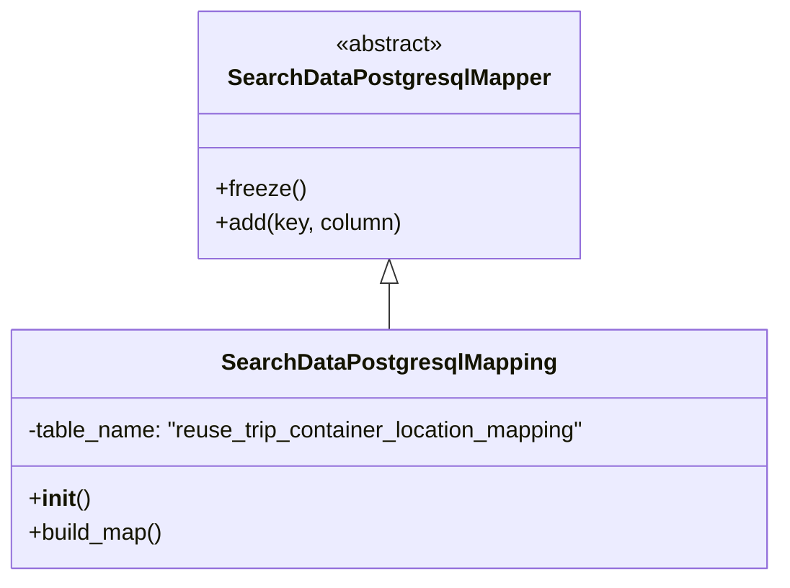

# Diagram: application_service/container_tracking_app_service/persistance_adapter/SearchDataPostgresqlMapping.py


> Auto-generated by Obscura crawlers

## Diagram 1



### SVG

<svg id="container" width="553.3828125" xmlns="http://www.w3.org/2000/svg" class="classDiagram" height="408" viewBox="0 0 553.3828125 408" role="graphics-document document" aria-roledescription="class"><style>#container{font-family:"trebuchet ms",verdana,arial,sans-serif;font-size:16px;fill:#333;}@keyframes edge-animation-frame{from{stroke-dashoffset:0;}}@keyframes dash{to{stroke-dashoffset:0;}}#container .edge-animation-slow{stroke-dasharray:9,5!important;stroke-dashoffset:900;animation:dash 50s linear infinite;stroke-linecap:round;}#container .edge-animation-fast{stroke-dasharray:9,5!important;stroke-dashoffset:900;animation:dash 20s linear infinite;stroke-linecap:round;}#container .error-icon{fill:#552222;}#container .error-text{fill:#552222;stroke:#552222;}#container .edge-thickness-normal{stroke-width:1px;}#container .edge-thickness-thick{stroke-width:3.5px;}#container .edge-pattern-solid{stroke-dasharray:0;}#container .edge-thickness-invisible{stroke-width:0;fill:none;}#container .edge-pattern-dashed{stroke-dasharray:3;}#container .edge-pattern-dotted{stroke-dasharray:2;}#container .marker{fill:#333333;stroke:#333333;}#container .marker.cross{stroke:#333333;}#container svg{font-family:"trebuchet ms",verdana,arial,sans-serif;font-size:16px;}#container p{margin:0;}#container g.classGroup text{fill:#9370DB;stroke:none;font-family:"trebuchet ms",verdana,arial,sans-serif;font-size:10px;}#container g.classGroup text .title{font-weight:bolder;}#container .nodeLabel,#container .edgeLabel{color:#131300;}#container .edgeLabel .label rect{fill:#ECECFF;}#container .label text{fill:#131300;}#container .labelBkg{background:#ECECFF;}#container .edgeLabel .label span{background:#ECECFF;}#container .classTitle{font-weight:bolder;}#container .node rect,#container .node circle,#container .node ellipse,#container .node polygon,#container .node path{fill:#ECECFF;stroke:#9370DB;stroke-width:1px;}#container .divider{stroke:#9370DB;stroke-width:1;}#container g.clickable{cursor:pointer;}#container g.classGroup rect{fill:#ECECFF;stroke:#9370DB;}#container g.classGroup line{stroke:#9370DB;stroke-width:1;}#container .classLabel .box{stroke:none;stroke-width:0;fill:#ECECFF;opacity:0.5;}#container .classLabel .label{fill:#9370DB;font-size:10px;}#container .relation{stroke:#333333;stroke-width:1;fill:none;}#container .dashed-line{stroke-dasharray:3;}#container .dotted-line{stroke-dasharray:1 2;}#container #compositionStart,#container .composition{fill:#333333!important;stroke:#333333!important;stroke-width:1;}#container #compositionEnd,#container .composition{fill:#333333!important;stroke:#333333!important;stroke-width:1;}#container #dependencyStart,#container .dependency{fill:#333333!important;stroke:#333333!important;stroke-width:1;}#container #dependencyStart,#container .dependency{fill:#333333!important;stroke:#333333!important;stroke-width:1;}#container #extensionStart,#container .extension{fill:transparent!important;stroke:#333333!important;stroke-width:1;}#container #extensionEnd,#container .extension{fill:transparent!important;stroke:#333333!important;stroke-width:1;}#container #aggregationStart,#container .aggregation{fill:transparent!important;stroke:#333333!important;stroke-width:1;}#container #aggregationEnd,#container .aggregation{fill:transparent!important;stroke:#333333!important;stroke-width:1;}#container #lollipopStart,#container .lollipop{fill:#ECECFF!important;stroke:#333333!important;stroke-width:1;}#container #lollipopEnd,#container .lollipop{fill:#ECECFF!important;stroke:#333333!important;stroke-width:1;}#container .edgeTerminals{font-size:11px;line-height:initial;}#container .classTitleText{text-anchor:middle;font-size:18px;fill:#333;}#container .label-icon{display:inline-block;height:1em;overflow:visible;vertical-align:-0.125em;}#container .node .label-icon path{fill:currentColor;stroke:revert;stroke-width:revert;}#container :root{--mermaid-font-family:"trebuchet ms",verdana,arial,sans-serif;}</style><g><defs><marker id="container_class-aggregationStart" class="marker aggregation class" refX="18" refY="7" markerWidth="190" markerHeight="240" orient="auto"><path d="M 18,7 L9,13 L1,7 L9,1 Z"></path></marker></defs><defs><marker id="container_class-aggregationEnd" class="marker aggregation class" refX="1" refY="7" markerWidth="20" markerHeight="28" orient="auto"><path d="M 18,7 L9,13 L1,7 L9,1 Z"></path></marker></defs><defs><marker id="container_class-extensionStart" class="marker extension class" refX="18" refY="7" markerWidth="190" markerHeight="240" orient="auto"><path d="M 1,7 L18,13 V 1 Z"></path></marker></defs><defs><marker id="container_class-extensionEnd" class="marker extension class" refX="1" refY="7" markerWidth="20" markerHeight="28" orient="auto"><path d="M 1,1 V 13 L18,7 Z"></path></marker></defs><defs><marker id="container_class-compositionStart" class="marker composition class" refX="18" refY="7" markerWidth="190" markerHeight="240" orient="auto"><path d="M 18,7 L9,13 L1,7 L9,1 Z"></path></marker></defs><defs><marker id="container_class-compositionEnd" class="marker composition class" refX="1" refY="7" markerWidth="20" markerHeight="28" orient="auto"><path d="M 18,7 L9,13 L1,7 L9,1 Z"></path></marker></defs><defs><marker id="container_class-dependencyStart" class="marker dependency class" refX="6" refY="7" markerWidth="190" markerHeight="240" orient="auto"><path d="M 5,7 L9,13 L1,7 L9,1 Z"></path></marker></defs><defs><marker id="container_class-dependencyEnd" class="marker dependency class" refX="13" refY="7" markerWidth="20" markerHeight="28" orient="auto"><path d="M 18,7 L9,13 L14,7 L9,1 Z"></path></marker></defs><defs><marker id="container_class-lollipopStart" class="marker lollipop class" refX="13" refY="7" markerWidth="190" markerHeight="240" orient="auto"><circle stroke="black" fill="transparent" cx="7" cy="7" r="6"></circle></marker></defs><defs><marker id="container_class-lollipopEnd" class="marker lollipop class" refX="1" refY="7" markerWidth="190" markerHeight="240" orient="auto"><circle stroke="black" fill="transparent" cx="7" cy="7" r="6"></circle></marker></defs><g class="root"><g class="clusters"></g><g class="edgePaths"><path d="M276.691,199.25L276.691,200.542C276.691,201.833,276.691,204.417,276.691,209.875C276.691,215.333,276.691,223.667,276.691,227.833L276.691,232" id="id_SearchDataPostgresqlMapper_SearchDataPostgresqlMapping_1" class="edge-thickness-normal edge-pattern-solid relation" style=";;;" data-edge="true" data-et="edge" data-id="id_SearchDataPostgresqlMapper_SearchDataPostgresqlMapping_1" data-points="W3sieCI6Mjc2LjY5MTQwNjI1LCJ5IjoxODJ9LHsieCI6Mjc2LjY5MTQwNjI1LCJ5IjoyMDd9LHsieCI6Mjc2LjY5MTQwNjI1LCJ5IjoyMzJ9XQ==" marker-start="url(#container_class-extensionStart)"></path></g><g class="edgeLabels"><g class="edgeLabel"><g class="label" data-id="id_SearchDataPostgresqlMapper_SearchDataPostgresqlMapping_1" transform="translate(0, 0)"><foreignObject width="0" height="0"><div xmlns="http://www.w3.org/1999/xhtml" class="labelBkg" style="display: table-cell; white-space: nowrap; line-height: 1.5; max-width: 200px; text-align: center;"><span class="edgeLabel"></span></div></foreignObject></g></g></g><g class="nodes"><g class="node default" id="classId-SearchDataPostgresqlMapper-0" transform="translate(276.69140625, 95)"><g class="basic label-container"><path d="M-132.04296875 -87 L132.04296875 -87 L132.04296875 87 L-132.04296875 87" stroke="none" stroke-width="0" fill="#ECECFF" style=""></path><path d="M-132.04296875 -87 C-40.421886709639196 -87, 51.19919533072161 -87, 132.04296875 -87 M-132.04296875 -87 C-65.74041909382943 -87, 0.5621305623411388 -87, 132.04296875 -87 M132.04296875 -87 C132.04296875 -17.842248814551525, 132.04296875 51.31550237089695, 132.04296875 87 M132.04296875 -87 C132.04296875 -27.414855816043783, 132.04296875 32.170288367912434, 132.04296875 87 M132.04296875 87 C64.92682462300407 87, -2.189319503991868 87, -132.04296875 87 M132.04296875 87 C27.755283134121854 87, -76.5324024817563 87, -132.04296875 87 M-132.04296875 87 C-132.04296875 19.958233594055955, -132.04296875 -47.08353281188809, -132.04296875 -87 M-132.04296875 87 C-132.04296875 36.40723602697797, -132.04296875 -14.185527946044061, -132.04296875 -87" stroke="#9370DB" stroke-width="1.3" fill="none" stroke-dasharray="0 0" style=""></path></g><g class="annotation-group text" transform="translate(-38.609375, -63)"><g class="label" style="" transform="translate(0,-12)"><foreignObject width="77.21875" height="24"><div xmlns="http://www.w3.org/1999/xhtml" style="display: table-cell; white-space: nowrap; line-height: 1.5; max-width: 127px; text-align: center;"><span class="nodeLabel markdown-node-label" style=""><p>«abstract»</p></span></div></foreignObject></g></g><g class="label-group text" transform="translate(-108.3515625, -39)"><g class="label" style="font-weight: bolder" transform="translate(0,-12)"><foreignObject width="216.703125" height="24"><div xmlns="http://www.w3.org/1999/xhtml" style="display: table-cell; white-space: nowrap; line-height: 1.5; max-width: 263px; text-align: center;"><span class="nodeLabel markdown-node-label" style=""><p>SearchDataPostgresqlMapper</p></span></div></foreignObject></g></g><g class="members-group text" transform="translate(-120.04296875, 9)"></g><g class="methods-group text" transform="translate(-120.04296875, 39)"><g class="label" style="" transform="translate(0,-12)"><foreignObject width="62.109375" height="24"><div xmlns="http://www.w3.org/1999/xhtml" style="display: table-cell; white-space: nowrap; line-height: 1.5; max-width: 119px; text-align: center;"><span class="nodeLabel markdown-node-label" style=""><p>+freeze()</p></span></div></foreignObject></g><g class="label" style="" transform="translate(0,12)"><foreignObject width="131.734375" height="24"><div xmlns="http://www.w3.org/1999/xhtml" style="display: table-cell; white-space: nowrap; line-height: 1.5; max-width: 189px; text-align: center;"><span class="nodeLabel markdown-node-label" style=""><p>+add(key, column)</p></span></div></foreignObject></g></g><g class="divider" style=""><path d="M-132.04296875 -15 C-43.3634234843292 -15, 45.31612178134159 -15, 132.04296875 -15 M-132.04296875 -15 C-37.0223958441764 -15, 57.9981770616472 -15, 132.04296875 -15" stroke="#9370DB" stroke-width="1.3" fill="none" stroke-dasharray="0 0" style=""></path></g><g class="divider" style=""><path d="M-132.04296875 9 C-61.951879876080596 9, 8.139208997838807 9, 132.04296875 9 M-132.04296875 9 C-69.03992381499225 9, -6.036878879984499 9, 132.04296875 9" stroke="#9370DB" stroke-width="1.3" fill="none" stroke-dasharray="0 0" style=""></path></g></g><g class="node default" id="classId-SearchDataPostgresqlMapping-1" transform="translate(276.69140625, 316)"><g class="basic label-container"><path d="M-268.69140625 -84 L268.69140625 -84 L268.69140625 84 L-268.69140625 84" stroke="none" stroke-width="0" fill="#ECECFF" style=""></path><path d="M-268.69140625 -84 C-88.3172969063821 -84, 92.0568124372358 -84, 268.69140625 -84 M-268.69140625 -84 C-159.05330652184904 -84, -49.41520679369805 -84, 268.69140625 -84 M268.69140625 -84 C268.69140625 -43.849797921206786, 268.69140625 -3.699595842413572, 268.69140625 84 M268.69140625 -84 C268.69140625 -32.441554775723596, 268.69140625 19.11689044855281, 268.69140625 84 M268.69140625 84 C76.8904773115145 84, -114.910451626971 84, -268.69140625 84 M268.69140625 84 C117.48789257279975 84, -33.7156211044005 84, -268.69140625 84 M-268.69140625 84 C-268.69140625 22.425283328007374, -268.69140625 -39.14943334398525, -268.69140625 -84 M-268.69140625 84 C-268.69140625 33.50597547781014, -268.69140625 -16.98804904437972, -268.69140625 -84" stroke="#9370DB" stroke-width="1.3" fill="none" stroke-dasharray="0 0" style=""></path></g><g class="annotation-group text" transform="translate(0, -60)"></g><g class="label-group text" transform="translate(-112.0078125, -60)"><g class="label" style="font-weight: bolder" transform="translate(0,-12)"><foreignObject width="224.015625" height="24"><div xmlns="http://www.w3.org/1999/xhtml" style="display: table-cell; white-space: nowrap; line-height: 1.5; max-width: 271px; text-align: center;"><span class="nodeLabel markdown-node-label" style=""><p>SearchDataPostgresqlMapping</p></span></div></foreignObject></g></g><g class="members-group text" transform="translate(-256.69140625, -12)"><g class="label" style="" transform="translate(0,-12)"><foreignObject width="401.375" height="24"><div xmlns="http://www.w3.org/1999/xhtml" style="display: table-cell; white-space: nowrap; line-height: 1.5; max-width: 459px; text-align: center;"><span class="nodeLabel markdown-node-label" style=""><p>-table_name: "reuse_trip_container_location_mapping"</p></span></div></foreignObject></g></g><g class="methods-group text" transform="translate(-256.69140625, 36)"><g class="label" style="" transform="translate(0,-12)"><foreignObject width="42.796875" height="24"><div xmlns="http://www.w3.org/1999/xhtml" style="display: table-cell; white-space: nowrap; line-height: 1.5; max-width: 132px; text-align: center;"><span class="nodeLabel markdown-node-label" style=""><p>+<strong>init</strong>()</p></span></div></foreignObject></g><g class="label" style="" transform="translate(0,12)"><foreignObject width="96.109375" height="24"><div xmlns="http://www.w3.org/1999/xhtml" style="display: table-cell; white-space: nowrap; line-height: 1.5; max-width: 153px; text-align: center;"><span class="nodeLabel markdown-node-label" style=""><p>+build_map()</p></span></div></foreignObject></g></g><g class="divider" style=""><path d="M-268.69140625 -36 C-63.17601360944991 -36, 142.33937903110018 -36, 268.69140625 -36 M-268.69140625 -36 C-107.42296057320945 -36, 53.8454851035811 -36, 268.69140625 -36" stroke="#9370DB" stroke-width="1.3" fill="none" stroke-dasharray="0 0" style=""></path></g><g class="divider" style=""><path d="M-268.69140625 12 C-147.96050274588885 12, -27.22959924177769 12, 268.69140625 12 M-268.69140625 12 C-106.74144874249984 12, 55.20850876500032 12, 268.69140625 12" stroke="#9370DB" stroke-width="1.3" fill="none" stroke-dasharray="0 0" style=""></path></g></g></g></g></g></svg>

## Diagram 2

```mermaid
flowchart TD
    Start([construct SearchDataPostgresqlMapping]) --> InitCall[call super().__init__("reuse_trip_container_location_mapping")]
    InitCall --> FreezeCall[call super().freeze()]
    FreezeCall --> Build[call build_map()]
    Build --> A[add("location_id","location_id")]
    A --> B[add("location_code","location_code")]
    B --> C[add("location_name","location_name")]
    C --> D[add("solution_id","solution_id")]
    D --> E[add("tag_identifier","tag_identifier")]
    E --> F[add("alternate_location_code","alternate_location_code")]
    F --> G[add("event_ts","event_ts")]
    G --> H[add("count","count")]
    H --> End([mapping complete])
```

> SVG rendering failed for this diagram.
