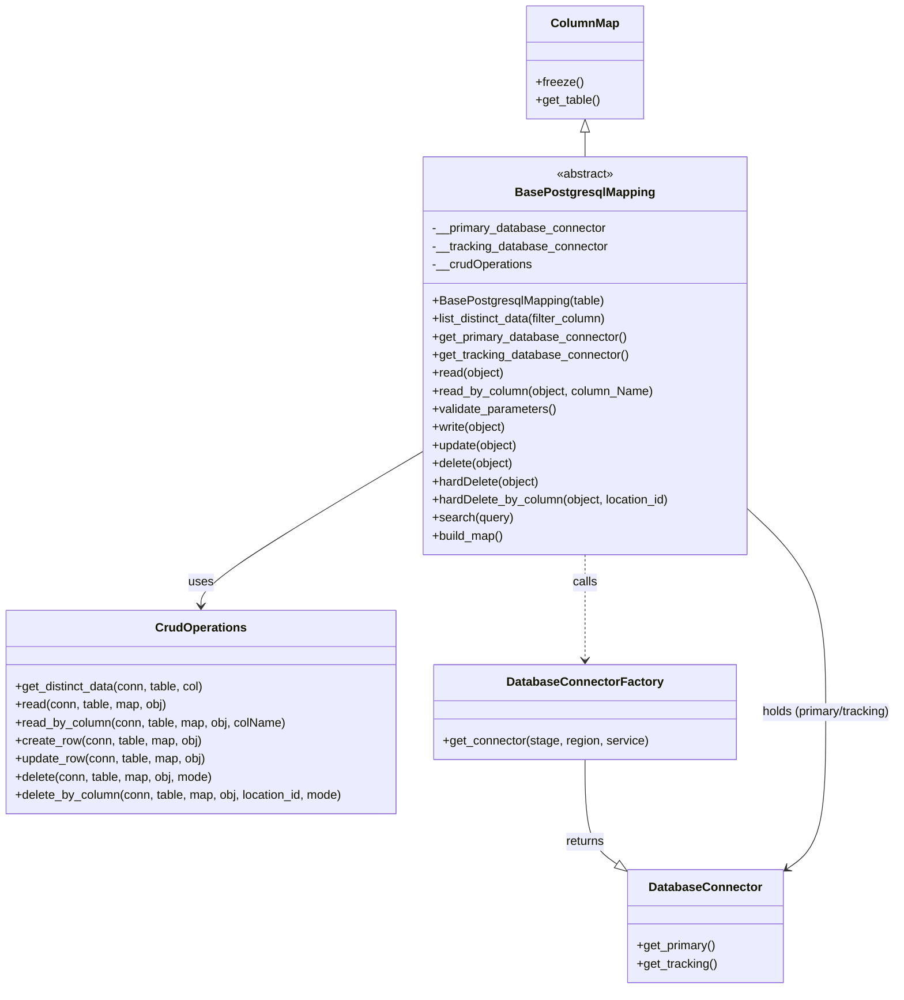
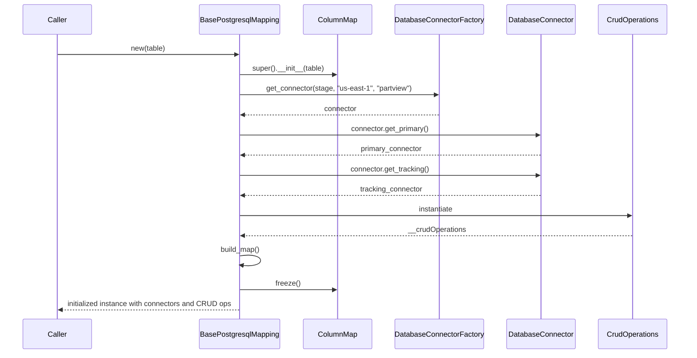

# Diagram: application_service/container_tracking_app_service/persistance_adapter/postgresql/BasePostgresqlMapping.py

> Auto-generated by Obscura crawlers

## Diagram 1

### SVG

<svg id="container" width="1197.1015625" xmlns="http://www.w3.org/2000/svg" class="classDiagram" height="1312" viewBox="0 0 1197.1015625 1312" role="graphics-document document" aria-roledescription="class"><g><defs><marker id="container_class-aggregationStart" class="marker aggregation class" refX="18" refY="7" markerWidth="190" markerHeight="240" orient="auto"><path d="M 18,7 L9,13 L1,7 L9,1 Z"></path></marker></defs><defs><marker id="container_class-aggregationEnd" class="marker aggregation class" refX="1" refY="7" markerWidth="20" markerHeight="28" orient="auto"><path d="M 18,7 L9,13 L1,7 L9,1 Z"></path></marker></defs><defs><marker id="container_class-extensionStart" class="marker extension class" refX="18" refY="7" markerWidth="190" markerHeight="240" orient="auto"><path d="M 1,7 L18,13 V 1 Z"></path></marker></defs><defs><marker id="container_class-extensionEnd" class="marker extension class" refX="1" refY="7" markerWidth="20" markerHeight="28" orient="auto"><path d="M 1,1 V 13 L18,7 Z"></path></marker></defs><defs><marker id="container_class-compositionStart" class="marker composition class" refX="18" refY="7" markerWidth="190" markerHeight="240" orient="auto"><path d="M 18,7 L9,13 L1,7 L9,1 Z"></path></marker></defs><defs><marker id="container_class-compositionEnd" class="marker composition class" refX="1" refY="7" markerWidth="20" markerHeight="28" orient="auto"><path d="M 18,7 L9,13 L1,7 L9,1 Z"></path></marker></defs><defs><marker id="container_class-dependencyStart" class="marker dependency class" refX="6" refY="7" markerWidth="190" markerHeight="240" orient="auto"><path d="M 5,7 L9,13 L1,7 L9,1 Z"></path></marker></defs><defs><marker id="container_class-dependencyEnd" class="marker dependency class" refX="13" refY="7" markerWidth="20" markerHeight="28" orient="auto"><path d="M 18,7 L9,13 L14,7 L9,1 Z"></path></marker></defs><defs><marker id="container_class-lollipopStart" class="marker lollipop class" refX="13" refY="7" markerWidth="190" markerHeight="240" orient="auto"><circle stroke="black" fill="transparent" cx="7" cy="7" r="6"></circle></marker></defs><defs><marker id="container_class-lollipopEnd" class="marker lollipop class" refX="1" refY="7" markerWidth="190" markerHeight="240" orient="auto"><circle stroke="black" fill="transparent" cx="7" cy="7" r="6"></circle></marker></defs><g class="root"><g class="clusters"></g><g class="edgePaths"><path d="M778.883,175.25L778.883,176.542C778.883,177.833,778.883,180.417,778.883,185.875C778.883,191.333,778.883,199.667,778.883,203.833L778.883,208" id="id_ColumnMap_BasePostgresqlMapping_1" class="edge-thickness-normal edge-pattern-solid relation" style=";;;" data-edge="true" data-et="edge" data-id="id_ColumnMap_BasePostgresqlMapping_1" data-points="W3sieCI6Nzc4Ljg4MjgxMjUsInkiOjE1OH0seyJ4Ijo3NzguODgyODEyNSwieSI6MTgzfSx7IngiOjc3OC44ODI4MTI1LCJ5IjoyMDh9XQ==" marker-start="url(#container_class-extensionStart)"></path><path d="M562.883,599.673L514.01,628.561C465.137,657.449,367.391,715.224,318.518,749.279C269.645,783.333,269.645,793.667,269.645,798.833L269.645,804" id="id_BasePostgresqlMapping_CrudOperations_2" class="edge-thickness-normal edge-pattern-solid relation" style=";;;" data-edge="true" data-et="edge" data-id="id_BasePostgresqlMapping_CrudOperations_2" data-points="W3sieCI6NTYyLjg4MjgxMjUsInkiOjU5OS42NzMwNDEwNzY5NzYyfSx7IngiOjI2OS42NDQ1MzEyNSwieSI6NzczfSx7IngiOjI2OS42NDQ1MzEyNSwieSI6ODEwfV0=" marker-end="url(#container_class-dependencyEnd)"></path><path d="M778.883,736L778.883,742.167C778.883,748.333,778.883,760.667,778.883,784C778.883,807.333,778.883,841.667,778.883,858.833L778.883,876" id="id_BasePostgresqlMapping_DatabaseConnectorFactory_3" class="edge-thickness-normal edge-pattern-dashed relation" style=";;;" data-edge="true" data-et="edge" data-id="id_BasePostgresqlMapping_DatabaseConnectorFactory_3" data-points="W3sieCI6Nzc4Ljg4MjgxMjUsInkiOjczNn0seyJ4Ijo3NzguODgyODEyNSwieSI6NzczfSx7IngiOjc3OC44ODI4MTI1LCJ5Ijo4ODJ9XQ==" marker-end="url(#container_class-dependencyEnd)"></path><path d="M778.883,1008L778.883,1026.167C778.883,1044.333,778.883,1080.667,786.421,1104.087C793.958,1127.507,809.034,1138.014,816.572,1143.267L824.11,1148.52" id="id_DatabaseConnectorFactory_DatabaseConnector_4" class="edge-thickness-normal edge-pattern-solid relation" style=";;;" data-edge="true" data-et="edge" data-id="id_DatabaseConnectorFactory_DatabaseConnector_4" data-points="W3sieCI6Nzc4Ljg4MjgxMjUsInkiOjEwMDh9LHsieCI6Nzc4Ljg4MjgxMjUsInkiOjExMTd9LHsieCI6ODM4LjI2MTcxODc1LCJ5IjoxMTU4LjM4MzM3Mzg0NTQwNn1d" marker-end="url(#container_class-extensionEnd)"></path><path d="M994.883,674.286L1012.451,690.738C1030.018,707.191,1065.154,740.095,1082.721,785.214C1100.289,830.333,1100.289,887.667,1100.289,945C1100.289,1002.333,1100.289,1059.667,1091.213,1094.659C1082.137,1129.651,1063.985,1142.302,1054.909,1148.627L1045.833,1154.953" id="id_BasePostgresqlMapping_DatabaseConnector_5" class="edge-thickness-normal edge-pattern-solid relation" style=";;;" data-edge="true" data-et="edge" data-id="id_BasePostgresqlMapping_DatabaseConnector_5" data-points="W3sieCI6OTk0Ljg4MjgxMjUsInkiOjY3NC4yODYwNDc2NDIxOTc0fSx7IngiOjExMDAuMjg5MDYyNSwieSI6NzczfSx7IngiOjExMDAuMjg5MDYyNSwieSI6OTQ1fSx7IngiOjExMDAuMjg5MDYyNSwieSI6MTExN30seyJ4IjoxMDQwLjkxMDE1NjI1LCJ5IjoxMTU4LjM4MzM3Mzg0NTQwNn1d" marker-end="url(#container_class-dependencyEnd)"></path></g><g class="edgeLabels"><g class="edgeLabel"><g class="label" data-id="id_ColumnMap_BasePostgresqlMapping_1" transform="translate(0, 0)"><foreignObject width="0" height="0">

</foreignObject></g></g><g class="edgeLabel" transform="translate(269.64453125, 773)"><g class="label" data-id="id_BasePostgresqlMapping_CrudOperations_2" transform="translate(-16.4921875, -12)"><foreignObject width="32.984375" height="24">

uses

</foreignObject></g></g><g class="edgeLabel" transform="translate(778.8828125, 773)"><g class="label" data-id="id_BasePostgresqlMapping_DatabaseConnectorFactory_3" transform="translate(-16.4453125, -12)"><foreignObject width="32.890625" height="24">

calls

</foreignObject></g></g><g class="edgeLabel" transform="translate(778.8828125, 1117)"><g class="label" data-id="id_DatabaseConnectorFactory_DatabaseConnector_4" transform="translate(-26.265625, -12)"><foreignObject width="52.53125" height="24">

returns

</foreignObject></g></g><g class="edgeLabel" transform="translate(1100.2890625, 945)"><g class="label" data-id="id_BasePostgresqlMapping_DatabaseConnector_5" transform="translate(-88.8125, -12)"><foreignObject width="177.625" height="24">

holds (primary/tracking)

</foreignObject></g></g></g><g class="nodes"><g class="node default" id="classId-BasePostgresqlMapping-0" transform="translate(778.8828125, 472)"><g class="basic label-container"><path d="M-216 -264 L216 -264 L216 264 L-216 264" stroke="none" stroke-width="0" fill="#ECECFF" style=""></path><path d="M-216 -264 C-113.2561246930317 -264, -10.512249386063388 -264, 216 -264 M-216 -264 C-97.98763279407297 -264, 20.02473441185407 -264, 216 -264 M216 -264 C216 -90.03924345576533, 216 83.92151308846934, 216 264 M216 -264 C216 -137.5814728083783, 216 -11.162945616756616, 216 264 M216 264 C49.26947010803477 264, -117.46105978393047 264, -216 264 M216 264 C80.97257590374971 264, -54.05484819250057 264, -216 264 M-216 264 C-216 66.20450979649667, -216 -131.59098040700667, -216 -264 M-216 264 C-216 102.59638098674301, -216 -58.80723802651397, -216 -264" stroke="#9370DB" stroke-width="1.3" fill="none" stroke-dasharray="0 0" style=""></path></g><g class="annotation-group text" transform="translate(-38.609375, -240)"><g class="label" style="" transform="translate(0,-12)"><foreignObject width="77.21875" height="24">

«abstract»

</foreignObject></g></g><g class="label-group text" transform="translate(-87.921875, -216)"><g class="label" style="font-weight: bolder" transform="translate(0,-12)"><foreignObject width="175.84375" height="24">

BasePostgresqlMapping

</foreignObject></g></g><g class="members-group text" transform="translate(-204, -168)"><g class="label" style="" transform="translate(0,-12)"><foreignObject width="233.078125" height="24">

-__primary_database_connector

</foreignObject></g><g class="label" style="" transform="translate(0,12)"><foreignObject width="234.796875" height="24">

-__tracking_database_connector

</foreignObject></g><g class="label" style="" transform="translate(0,36)"><foreignObject width="134.140625" height="24">

-__crudOperations

</foreignObject></g></g><g class="methods-group text" transform="translate(-204, -72)"><g class="label" style="" transform="translate(0,-12)"><foreignObject width="228.03125" height="24">

+BasePostgresqlMapping(table)

</foreignObject></g><g class="label" style="" transform="translate(0,12)"><foreignObject width="238.890625" height="24">

+list_distinct_data(filter_column)

</foreignObject></g><g class="label" style="" transform="translate(0,36)"><foreignObject width="260.671875" height="24">

+get_primary_database_connector()

</foreignObject></g><g class="label" style="" transform="translate(0,60)"><foreignObject width="262.375" height="24">

+get_tracking_database_connector()

</foreignObject></g><g class="label" style="" transform="translate(0,84)"><foreignObject width="96.359375" height="24">

+read(object)

</foreignObject></g><g class="label" style="" transform="translate(0,108)"><foreignObject width="295.5625" height="24">

+read_by_column(object, column_Name)

</foreignObject></g><g class="label" style="" transform="translate(0,132)"><foreignObject width="166.546875" height="24">

+validate_parameters()

</foreignObject></g><g class="label" style="" transform="translate(0,156)"><foreignObject width="100.25" height="24">

+write(object)

</foreignObject></g><g class="label" style="" transform="translate(0,180)"><foreignObject width="115.171875" height="24">

+update(object)

</foreignObject></g><g class="label" style="" transform="translate(0,204)"><foreignObject width="109.703125" height="24">

+delete(object)

</foreignObject></g><g class="label" style="" transform="translate(0,228)"><foreignObject width="143.78125" height="24">

+hardDelete(object)

</foreignObject></g><g class="label" style="" transform="translate(0,252)"><foreignObject width="320.078125" height="24">

+hardDelete_by_column(object, location_id)

</foreignObject></g><g class="label" style="" transform="translate(0,276)"><foreignObject width="107.46875" height="24">

+search(query)

</foreignObject></g><g class="label" style="" transform="translate(0,300)"><foreignObject width="96.109375" height="24">

+build_map()

</foreignObject></g></g><g class="divider" style=""><path d="M-216 -192 C-78.37473927508267 -192, 59.25052144983465 -192, 216 -192 M-216 -192 C-45.97998159911535 -192, 124.0400368017693 -192, 216 -192" stroke="#9370DB" stroke-width="1.3" fill="none" stroke-dasharray="0 0" style=""></path></g><g class="divider" style=""><path d="M-216 -96 C-125.3761395914742 -96, -34.7522791829484 -96, 216 -96 M-216 -96 C-121.65009437585714 -96, -27.300188751714273 -96, 216 -96" stroke="#9370DB" stroke-width="1.3" fill="none" stroke-dasharray="0 0" style=""></path></g></g><g class="node default" id="classId-ColumnMap-1" transform="translate(778.8828125, 83)"><g class="basic label-container"><path d="M-76.5078125 -75 L76.5078125 -75 L76.5078125 75 L-76.5078125 75" stroke="none" stroke-width="0" fill="#ECECFF" style=""></path><path d="M-76.5078125 -75 C-17.330938959146344 -75, 41.84593458170731 -75, 76.5078125 -75 M-76.5078125 -75 C-17.57883893915899 -75, 41.35013462168202 -75, 76.5078125 -75 M76.5078125 -75 C76.5078125 -31.450306859762797, 76.5078125 12.099386280474405, 76.5078125 75 M76.5078125 -75 C76.5078125 -42.43462779310798, 76.5078125 -9.869255586215957, 76.5078125 75 M76.5078125 75 C33.37141236795047 75, -9.764987764099061 75, -76.5078125 75 M76.5078125 75 C39.28748072050163 75, 2.0671489410032535 75, -76.5078125 75 M-76.5078125 75 C-76.5078125 28.422435738083976, -76.5078125 -18.155128523832047, -76.5078125 -75 M-76.5078125 75 C-76.5078125 22.97408914560519, -76.5078125 -29.051821708789618, -76.5078125 -75" stroke="#9370DB" stroke-width="1.3" fill="none" stroke-dasharray="0 0" style=""></path></g><g class="annotation-group text" transform="translate(0, -51)"></g><g class="label-group text" transform="translate(-42.890625, -51)"><g class="label" style="font-weight: bolder" transform="translate(0,-12)"><foreignObject width="85.78125" height="24">

ColumnMap

</foreignObject></g></g><g class="members-group text" transform="translate(-64.5078125, -3)"></g><g class="methods-group text" transform="translate(-64.5078125, 27)"><g class="label" style="" transform="translate(0,-12)"><foreignObject width="62.109375" height="24">

+freeze()

</foreignObject></g><g class="label" style="" transform="translate(0,12)"><foreignObject width="86.125" height="24">

+get_table()

</foreignObject></g></g><g class="divider" style=""><path d="M-76.5078125 -27 C-39.299837096155386 -27, -2.091861692310772 -27, 76.5078125 -27 M-76.5078125 -27 C-19.87998479117639 -27, 36.74784291764722 -27, 76.5078125 -27" stroke="#9370DB" stroke-width="1.3" fill="none" stroke-dasharray="0 0" style=""></path></g><g class="divider" style=""><path d="M-76.5078125 -3 C-41.31558854387429 -3, -6.123364587748583 -3, 76.5078125 -3 M-76.5078125 -3 C-17.845809617481812 -3, 40.816193265036375 -3, 76.5078125 -3" stroke="#9370DB" stroke-width="1.3" fill="none" stroke-dasharray="0 0" style=""></path></g></g><g class="node default" id="classId-CrudOperations-2" transform="translate(269.64453125, 945)"><g class="basic label-container"><path d="M-261.64453125 -135 L261.64453125 -135 L261.64453125 135 L-261.64453125 135" stroke="none" stroke-width="0" fill="#ECECFF" style=""></path><path d="M-261.64453125 -135 C-113.63689985983285 -135, 34.3707315303343 -135, 261.64453125 -135 M-261.64453125 -135 C-146.1804617110738 -135, -30.716392172147636 -135, 261.64453125 -135 M261.64453125 -135 C261.64453125 -74.43257903867212, 261.64453125 -13.86515807734422, 261.64453125 135 M261.64453125 -135 C261.64453125 -35.65016369005029, 261.64453125 63.69967261989942, 261.64453125 135 M261.64453125 135 C128.2868917184625 135, -5.070747813075002 135, -261.64453125 135 M261.64453125 135 C154.36674249887847 135, 47.08895374775693 135, -261.64453125 135 M-261.64453125 135 C-261.64453125 53.562618308415026, -261.64453125 -27.87476338316995, -261.64453125 -135 M-261.64453125 135 C-261.64453125 46.7371228956745, -261.64453125 -41.525754208650994, -261.64453125 -135" stroke="#9370DB" stroke-width="1.3" fill="none" stroke-dasharray="0 0" style=""></path></g><g class="annotation-group text" transform="translate(0, -111)"></g><g class="label-group text" transform="translate(-57.6171875, -111)"><g class="label" style="font-weight: bolder" transform="translate(0,-12)"><foreignObject width="115.234375" height="24">

CrudOperations

</foreignObject></g></g><g class="members-group text" transform="translate(-249.64453125, -63)"></g><g class="methods-group text" transform="translate(-249.64453125, -33)"><g class="label" style="" transform="translate(0,-12)"><foreignObject width="254.1875" height="24">

+get_distinct_data(conn, table, col)

</foreignObject></g><g class="label" style="" transform="translate(0,12)"><foreignObject width="202.6875" height="24">

+read(conn, table, map, obj)

</foreignObject></g><g class="label" style="" transform="translate(0,36)"><foreignObject width="361.09375" height="24">

+read_by_column(conn, table, map, obj, colName)

</foreignObject></g><g class="label" style="" transform="translate(0,60)"><foreignObject width="249.53125" height="24">

+create_row(conn, table, map, obj)

</foreignObject></g><g class="label" style="" transform="translate(0,84)"><foreignObject width="256.015625" height="24">

+update_row(conn, table, map, obj)

</foreignObject></g><g class="label" style="" transform="translate(0,108)"><foreignObject width="265.453125" height="24">

+delete(conn, table, map, obj, mode)

</foreignObject></g><g class="label" style="" transform="translate(0,132)"><foreignObject width="441.671875" height="24">

+delete_by_column(conn, table, map, obj, location_id, mode)

</foreignObject></g></g><g class="divider" style=""><path d="M-261.64453125 -87 C-152.31611070332374 -87, -42.98769015664749 -87, 261.64453125 -87 M-261.64453125 -87 C-145.7200857058128 -87, -29.795640161625613 -87, 261.64453125 -87" stroke="#9370DB" stroke-width="1.3" fill="none" stroke-dasharray="0 0" style=""></path></g><g class="divider" style=""><path d="M-261.64453125 -63 C-146.95973429903233 -63, -32.2749373480647 -63, 261.64453125 -63 M-261.64453125 -63 C-110.64178786147787 -63, 40.36095552704427 -63, 261.64453125 -63" stroke="#9370DB" stroke-width="1.3" fill="none" stroke-dasharray="0 0" style=""></path></g></g><g class="node default" id="classId-DatabaseConnectorFactory-3" transform="translate(778.8828125, 945)"><g class="basic label-container"><path d="M-197.59375 -63 L197.59375 -63 L197.59375 63 L-197.59375 63" stroke="none" stroke-width="0" fill="#ECECFF" style=""></path><path d="M-197.59375 -63 C-65.94528949022794 -63, 65.70317101954413 -63, 197.59375 -63 M-197.59375 -63 C-48.57404349549785 -63, 100.4456630090043 -63, 197.59375 -63 M197.59375 -63 C197.59375 -17.699758785773028, 197.59375 27.600482428453944, 197.59375 63 M197.59375 -63 C197.59375 -20.668180263525073, 197.59375 21.663639472949853, 197.59375 63 M197.59375 63 C98.3692693730855 63, -0.8552112538289975 63, -197.59375 63 M197.59375 63 C84.56489943704564 63, -28.46395112590872 63, -197.59375 63 M-197.59375 63 C-197.59375 22.99939421989219, -197.59375 -17.001211560215623, -197.59375 -63 M-197.59375 63 C-197.59375 24.871354863265154, -197.59375 -13.257290273469692, -197.59375 -63" stroke="#9370DB" stroke-width="1.3" fill="none" stroke-dasharray="0 0" style=""></path></g><g class="annotation-group text" transform="translate(0, -39)"></g><g class="label-group text" transform="translate(-98.1875, -39)"><g class="label" style="font-weight: bolder" transform="translate(0,-12)"><foreignObject width="196.375" height="24">

DatabaseConnectorFactory

</foreignObject></g></g><g class="members-group text" transform="translate(-185.59375, 9)"></g><g class="methods-group text" transform="translate(-185.59375, 39)"><g class="label" style="" transform="translate(0,-12)"><foreignObject width="273" height="24">

+get_connector(stage, region, service)

</foreignObject></g></g><g class="divider" style=""><path d="M-197.59375 -15 C-108.89729415539702 -15, -20.20083831079404 -15, 197.59375 -15 M-197.59375 -15 C-111.24798489348385 -15, -24.90221978696769 -15, 197.59375 -15" stroke="#9370DB" stroke-width="1.3" fill="none" stroke-dasharray="0 0" style=""></path></g><g class="divider" style=""><path d="M-197.59375 9 C-90.15001075999781 9, 17.293728480004376 9, 197.59375 9 M-197.59375 9 C-40.60630281839016 9, 116.38114436321968 9, 197.59375 9" stroke="#9370DB" stroke-width="1.3" fill="none" stroke-dasharray="0 0" style=""></path></g></g><g class="node default" id="classId-DatabaseConnector-4" transform="translate(939.5859375, 1229)"><g class="basic label-container"><path d="M-101.32421875 -75 L101.32421875 -75 L101.32421875 75 L-101.32421875 75" stroke="none" stroke-width="0" fill="#ECECFF" style=""></path><path d="M-101.32421875 -75 C-49.56734124946909 -75, 2.189536251061824 -75, 101.32421875 -75 M-101.32421875 -75 C-44.012218452214825 -75, 13.299781845570351 -75, 101.32421875 -75 M101.32421875 -75 C101.32421875 -39.57092081200217, 101.32421875 -4.141841624004343, 101.32421875 75 M101.32421875 -75 C101.32421875 -40.71266824522036, 101.32421875 -6.4253364904407135, 101.32421875 75 M101.32421875 75 C55.23423354028714 75, 9.144248330574285 75, -101.32421875 75 M101.32421875 75 C46.484337831117735 75, -8.35554308776453 75, -101.32421875 75 M-101.32421875 75 C-101.32421875 17.793680919315875, -101.32421875 -39.41263816136825, -101.32421875 -75 M-101.32421875 75 C-101.32421875 29.491091029857685, -101.32421875 -16.01781794028463, -101.32421875 -75" stroke="#9370DB" stroke-width="1.3" fill="none" stroke-dasharray="0 0" style=""></path></g><g class="annotation-group text" transform="translate(0, -51)"></g><g class="label-group text" transform="translate(-71.5859375, -51)"><g class="label" style="font-weight: bolder" transform="translate(0,-12)"><foreignObject width="143.171875" height="24">

DatabaseConnector

</foreignObject></g></g><g class="members-group text" transform="translate(-89.32421875, -3)"></g><g class="methods-group text" transform="translate(-89.32421875, 27)"><g class="label" style="" transform="translate(0,-12)"><foreignObject width="105.890625" height="24">

+get_primary()

</foreignObject></g><g class="label" style="" transform="translate(0,12)"><foreignObject width="107.0625" height="24">

+get_tracking()

</foreignObject></g></g><g class="divider" style=""><path d="M-101.32421875 -27 C-51.821664640925626 -27, -2.3191105318512513 -27, 101.32421875 -27 M-101.32421875 -27 C-32.763982937629095 -27, 35.79625287474181 -27, 101.32421875 -27" stroke="#9370DB" stroke-width="1.3" fill="none" stroke-dasharray="0 0" style=""></path></g><g class="divider" style=""><path d="M-101.32421875 -3 C-33.46578706572922 -3, 34.39264461854157 -3, 101.32421875 -3 M-101.32421875 -3 C-47.64060048379761 -3, 6.043017782404775 -3, 101.32421875 -3" stroke="#9370DB" stroke-width="1.3" fill="none" stroke-dasharray="0 0" style=""></path></g></g></g></g></g></svg>

## Diagram 2

### SVG

<svg id="container" width="1589" xmlns="http://www.w3.org/2000/svg" height="825" viewBox="-50 -10 1589 825" role="graphics-document document" aria-roledescription="sequence"><g><rect x="1339" y="739" fill="#eaeaea" stroke="#666" width="150" height="65" name="CrudOperations" rx="3" ry="3" class="actor actor-bottom"></rect><text x="1414" y="771.5" dominant-baseline="central" alignment-baseline="central" class="actor actor-box" style="text-anchor: middle; font-size: 16px; font-weight: 400;"><tspan x="1414" dy="0">CrudOperations</tspan></text></g><g><rect x="1127" y="739" fill="#eaeaea" stroke="#666" width="162" height="65" name="DatabaseConnector" rx="3" ry="3" class="actor actor-bottom"></rect><text x="1208" y="771.5" dominant-baseline="central" alignment-baseline="central" class="actor actor-box" style="text-anchor: middle; font-size: 16px; font-weight: 400;"><tspan x="1208" dy="0">DatabaseConnector</tspan></text></g><g><rect x="863" y="739" fill="#eaeaea" stroke="#666" width="214" height="65" name="DatabaseConnectorFactory" rx="3" ry="3" class="actor actor-bottom"></rect><text x="970" y="771.5" dominant-baseline="central" alignment-baseline="central" class="actor actor-box" style="text-anchor: middle; font-size: 16px; font-weight: 400;"><tspan x="970" dy="0">DatabaseConnectorFactory</tspan></text></g><g><rect x="663" y="739" fill="#eaeaea" stroke="#666" width="150" height="65" name="ColumnMap" rx="3" ry="3" class="actor actor-bottom"></rect><text x="738" y="771.5" dominant-baseline="central" alignment-baseline="central" class="actor actor-box" style="text-anchor: middle; font-size: 16px; font-weight: 400;"><tspan x="738" dy="0">ColumnMap</tspan></text></g><g><rect x="411.5" y="739" fill="#eaeaea" stroke="#666" width="193" height="65" name="BasePostgresqlMapping" rx="3" ry="3" class="actor actor-bottom"></rect><text x="508" y="771.5" dominant-baseline="central" alignment-baseline="central" class="actor actor-box" style="text-anchor: middle; font-size: 16px; font-weight: 400;"><tspan x="508" dy="0">BasePostgresqlMapping</tspan></text></g><g><rect x="0" y="739" fill="#eaeaea" stroke="#666" width="150" height="65" name="Caller" rx="3" ry="3" class="actor actor-bottom"></rect><text x="75" y="771.5" dominant-baseline="central" alignment-baseline="central" class="actor actor-box" style="text-anchor: middle; font-size: 16px; font-weight: 400;"><tspan x="75" dy="0">Caller</tspan></text></g><g><line id="actor5" x1="1414" y1="65" x2="1414" y2="739" class="actor-line 200" stroke-width="0.5px" stroke="#999" name="CrudOperations"></line><g id="root-5"><rect x="1339" y="0" fill="#eaeaea" stroke="#666" width="150" height="65" name="CrudOperations" rx="3" ry="3" class="actor actor-top"></rect><text x="1414" y="32.5" dominant-baseline="central" alignment-baseline="central" class="actor actor-box" style="text-anchor: middle; font-size: 16px; font-weight: 400;"><tspan x="1414" dy="0">CrudOperations</tspan></text></g></g><g><line id="actor4" x1="1208" y1="65" x2="1208" y2="739" class="actor-line 200" stroke-width="0.5px" stroke="#999" name="DatabaseConnector"></line><g id="root-4"><rect x="1127" y="0" fill="#eaeaea" stroke="#666" width="162" height="65" name="DatabaseConnector" rx="3" ry="3" class="actor actor-top"></rect><text x="1208" y="32.5" dominant-baseline="central" alignment-baseline="central" class="actor actor-box" style="text-anchor: middle; font-size: 16px; font-weight: 400;"><tspan x="1208" dy="0">DatabaseConnector</tspan></text></g></g><g><line id="actor3" x1="970" y1="65" x2="970" y2="739" class="actor-line 200" stroke-width="0.5px" stroke="#999" name="DatabaseConnectorFactory"></line><g id="root-3"><rect x="863" y="0" fill="#eaeaea" stroke="#666" width="214" height="65" name="DatabaseConnectorFactory" rx="3" ry="3" class="actor actor-top"></rect><text x="970" y="32.5" dominant-baseline="central" alignment-baseline="central" class="actor actor-box" style="text-anchor: middle; font-size: 16px; font-weight: 400;"><tspan x="970" dy="0">DatabaseConnectorFactory</tspan></text></g></g><g><line id="actor2" x1="738" y1="65" x2="738" y2="739" class="actor-line 200" stroke-width="0.5px" stroke="#999" name="ColumnMap"></line><g id="root-2"><rect x="663" y="0" fill="#eaeaea" stroke="#666" width="150" height="65" name="ColumnMap" rx="3" ry="3" class="actor actor-top"></rect><text x="738" y="32.5" dominant-baseline="central" alignment-baseline="central" class="actor actor-box" style="text-anchor: middle; font-size: 16px; font-weight: 400;"><tspan x="738" dy="0">ColumnMap</tspan></text></g></g><g><line id="actor1" x1="508" y1="65" x2="508" y2="739" class="actor-line 200" stroke-width="0.5px" stroke="#999" name="BasePostgresqlMapping"></line><g id="root-1"><rect x="411.5" y="0" fill="#eaeaea" stroke="#666" width="193" height="65" name="BasePostgresqlMapping" rx="3" ry="3" class="actor actor-top"></rect><text x="508" y="32.5" dominant-baseline="central" alignment-baseline="central" class="actor actor-box" style="text-anchor: middle; font-size: 16px; font-weight: 400;"><tspan x="508" dy="0">BasePostgresqlMapping</tspan></text></g></g><g><line id="actor0" x1="75" y1="65" x2="75" y2="739" class="actor-line 200" stroke-width="0.5px" stroke="#999" name="Caller"></line><g id="root-0"><rect x="0" y="0" fill="#eaeaea" stroke="#666" width="150" height="65" name="Caller" rx="3" ry="3" class="actor actor-top"></rect><text x="75" y="32.5" dominant-baseline="central" alignment-baseline="central" class="actor actor-box" style="text-anchor: middle; font-size: 16px; font-weight: 400;"><tspan x="75" dy="0">Caller</tspan></text></g></g><g></g><defs><symbol id="computer" width="24" height="24"><path transform="scale(.5)" d="M2 2v13h20v-13h-20zm18 11h-16v-9h16v9zm-10.228 6l.466-1h3.524l.467 1h-4.457zm14.228 3h-24l2-6h2.104l-1.33 4h18.45l-1.297-4h2.073l2 6zm-5-10h-14v-7h14v7z"></path></symbol></defs><defs><symbol id="database" fill-rule="evenodd" clip-rule="evenodd"><path transform="scale(.5)" d="M12.258.001l.256.004.255.005.253.008.251.01.249.012.247.015.246.016.242.019.241.02.239.023.236.024.233.027.231.028.229.031.225.032.223.034.22.036.217.038.214.04.211.041.208.043.205.045.201.046.198.048.194.05.191.051.187.053.183.054.18.056.175.057.172.059.168.06.163.061.16.063.155.064.15.066.074.033.073.033.071.034.07.034.069.035.068.035.067.035.066.035.064.036.064.036.062.036.06.036.06.037.058.037.058.037.055.038.055.038.053.038.052.038.051.039.05.039.048.039.047.039.045.04.044.04.043.04.041.04.04.041.039.041.037.041.036.041.034.041.033.042.032.042.03.042.029.042.027.042.026.043.024.043.023.043.021.043.02.043.018.044.017.043.015.044.013.044.012.044.011.045.009.044.007.045.006.045.004.045.002.045.001.045v17l-.001.045-.002.045-.004.045-.006.045-.007.045-.009.044-.011.045-.012.044-.013.044-.015.044-.017.043-.018.044-.02.043-.021.043-.023.043-.024.043-.026.043-.027.042-.029.042-.03.042-.032.042-.033.042-.034.041-.036.041-.037.041-.039.041-.04.041-.041.04-.043.04-.044.04-.045.04-.047.039-.048.039-.05.039-.051.039-.052.038-.053.038-.055.038-.055.038-.058.037-.058.037-.06.037-.06.036-.062.036-.064.036-.064.036-.066.035-.067.035-.068.035-.069.035-.07.034-.071.034-.073.033-.074.033-.15.066-.155.064-.16.063-.163.061-.168.06-.172.059-.175.057-.18.056-.183.054-.187.053-.191.051-.194.05-.198.048-.201.046-.205.045-.208.043-.211.041-.214.04-.217.038-.22.036-.223.034-.225.032-.229.031-.231.028-.233.027-.236.024-.239.023-.241.02-.242.019-.246.016-.247.015-.249.012-.251.01-.253.008-.255.005-.256.004-.258.001-.258-.001-.256-.004-.255-.005-.253-.008-.251-.01-.249-.012-.247-.015-.245-.016-.243-.019-.241-.02-.238-.023-.236-.024-.234-.027-.231-.028-.228-.031-.226-.032-.223-.034-.22-.036-.217-.038-.214-.04-.211-.041-.208-.043-.204-.045-.201-.046-.198-.048-.195-.05-.19-.051-.187-.053-.184-.054-.179-.056-.176-.057-.172-.059-.167-.06-.164-.061-.159-.063-.155-.064-.151-.066-.074-.033-.072-.033-.072-.034-.07-.034-.069-.035-.068-.035-.067-.035-.066-.035-.064-.036-.063-.036-.062-.036-.061-.036-.06-.037-.058-.037-.057-.037-.056-.038-.055-.038-.053-.038-.052-.038-.051-.039-.049-.039-.049-.039-.046-.039-.046-.04-.044-.04-.043-.04-.041-.04-.04-.041-.039-.041-.037-.041-.036-.041-.034-.041-.033-.042-.032-.042-.03-.042-.029-.042-.027-.042-.026-.043-.024-.043-.023-.043-.021-.043-.02-.043-.018-.044-.017-.043-.015-.044-.013-.044-.012-.044-.011-.045-.009-.044-.007-.045-.006-.045-.004-.045-.002-.045-.001-.045v-17l.001-.045.002-.045.004-.045.006-.045.007-.045.009-.044.011-.045.012-.044.013-.044.015-.044.017-.043.018-.044.02-.043.021-.043.023-.043.024-.043.026-.043.027-.042.029-.042.03-.042.032-.042.033-.042.034-.041.036-.041.037-.041.039-.041.04-.041.041-.04.043-.04.044-.04.046-.04.046-.039.049-.039.049-.039.051-.039.052-.038.053-.038.055-.038.056-.038.057-.037.058-.037.06-.037.061-.036.062-.036.063-.036.064-.036.066-.035.067-.035.068-.035.069-.035.07-.034.072-.034.072-.033.074-.033.151-.066.155-.064.159-.063.164-.061.167-.06.172-.059.176-.057.179-.056.184-.054.187-.053.19-.051.195-.05.198-.048.201-.046.204-.045.208-.043.211-.041.214-.04.217-.038.22-.036.223-.034.226-.032.228-.031.231-.028.234-.027.236-.024.238-.023.241-.02.243-.019.245-.016.247-.015.249-.012.251-.01.253-.008.255-.005.256-.004.258-.001.258.001zm-9.258 20.499v.01l.001.021.003.021.004.022.005.021.006.022.007.022.009.023.01.022.011.023.012.023.013.023.015.023.016.024.017.023.018.024.019.024.021.024.022.025.023.024.024.025.052.049.056.05.061.051.066.051.07.051.075.051.079.052.084.052.088.052.092.052.097.052.102.051.105.052.11.052.114.051.119.051.123.051.127.05.131.05.135.05.139.048.144.049.147.047.152.047.155.047.16.045.163.045.167.043.171.043.176.041.178.041.183.039.187.039.19.037.194.035.197.035.202.033.204.031.209.03.212.029.216.027.219.025.222.024.226.021.23.02.233.018.236.016.24.015.243.012.246.01.249.008.253.005.256.004.259.001.26-.001.257-.004.254-.005.25-.008.247-.011.244-.012.241-.014.237-.016.233-.018.231-.021.226-.021.224-.024.22-.026.216-.027.212-.028.21-.031.205-.031.202-.034.198-.034.194-.036.191-.037.187-.039.183-.04.179-.04.175-.042.172-.043.168-.044.163-.045.16-.046.155-.046.152-.047.148-.048.143-.049.139-.049.136-.05.131-.05.126-.05.123-.051.118-.052.114-.051.11-.052.106-.052.101-.052.096-.052.092-.052.088-.053.083-.051.079-.052.074-.052.07-.051.065-.051.06-.051.056-.05.051-.05.023-.024.023-.025.021-.024.02-.024.019-.024.018-.024.017-.024.015-.023.014-.024.013-.023.012-.023.01-.023.01-.022.008-.022.006-.022.006-.022.004-.022.004-.021.001-.021.001-.021v-4.127l-.077.055-.08.053-.083.054-.085.053-.087.052-.09.052-.093.051-.095.05-.097.05-.1.049-.102.049-.105.048-.106.047-.109.047-.111.046-.114.045-.115.045-.118.044-.12.043-.122.042-.124.042-.126.041-.128.04-.13.04-.132.038-.134.038-.135.037-.138.037-.139.035-.142.035-.143.034-.144.033-.147.032-.148.031-.15.03-.151.03-.153.029-.154.027-.156.027-.158.026-.159.025-.161.024-.162.023-.163.022-.165.021-.166.02-.167.019-.169.018-.169.017-.171.016-.173.015-.173.014-.175.013-.175.012-.177.011-.178.01-.179.008-.179.008-.181.006-.182.005-.182.004-.184.003-.184.002h-.37l-.184-.002-.184-.003-.182-.004-.182-.005-.181-.006-.179-.008-.179-.008-.178-.01-.176-.011-.176-.012-.175-.013-.173-.014-.172-.015-.171-.016-.17-.017-.169-.018-.167-.019-.166-.02-.165-.021-.163-.022-.162-.023-.161-.024-.159-.025-.157-.026-.156-.027-.155-.027-.153-.029-.151-.03-.15-.03-.148-.031-.146-.032-.145-.033-.143-.034-.141-.035-.14-.035-.137-.037-.136-.037-.134-.038-.132-.038-.13-.04-.128-.04-.126-.041-.124-.042-.122-.042-.12-.044-.117-.043-.116-.045-.113-.045-.112-.046-.109-.047-.106-.047-.105-.048-.102-.049-.1-.049-.097-.05-.095-.05-.093-.052-.09-.051-.087-.052-.085-.053-.083-.054-.08-.054-.077-.054v4.127zm0-5.654v.011l.001.021.003.021.004.021.005.022.006.022.007.022.009.022.01.022.011.023.012.023.013.023.015.024.016.023.017.024.018.024.019.024.021.024.022.024.023.025.024.024.052.05.056.05.061.05.066.051.07.051.075.052.079.051.084.052.088.052.092.052.097.052.102.052.105.052.11.051.114.051.119.052.123.05.127.051.131.05.135.049.139.049.144.048.147.048.152.047.155.046.16.045.163.045.167.044.171.042.176.042.178.04.183.04.187.038.19.037.194.036.197.034.202.033.204.032.209.03.212.028.216.027.219.025.222.024.226.022.23.02.233.018.236.016.24.014.243.012.246.01.249.008.253.006.256.003.259.001.26-.001.257-.003.254-.006.25-.008.247-.01.244-.012.241-.015.237-.016.233-.018.231-.02.226-.022.224-.024.22-.025.216-.027.212-.029.21-.03.205-.032.202-.033.198-.035.194-.036.191-.037.187-.039.183-.039.179-.041.175-.042.172-.043.168-.044.163-.045.16-.045.155-.047.152-.047.148-.048.143-.048.139-.05.136-.049.131-.05.126-.051.123-.051.118-.051.114-.052.11-.052.106-.052.101-.052.096-.052.092-.052.088-.052.083-.052.079-.052.074-.051.07-.052.065-.051.06-.05.056-.051.051-.049.023-.025.023-.024.021-.025.02-.024.019-.024.018-.024.017-.024.015-.023.014-.023.013-.024.012-.022.01-.023.01-.023.008-.022.006-.022.006-.022.004-.021.004-.022.001-.021.001-.021v-4.139l-.077.054-.08.054-.083.054-.085.052-.087.053-.09.051-.093.051-.095.051-.097.05-.1.049-.102.049-.105.048-.106.047-.109.047-.111.046-.114.045-.115.044-.118.044-.12.044-.122.042-.124.042-.126.041-.128.04-.13.039-.132.039-.134.038-.135.037-.138.036-.139.036-.142.035-.143.033-.144.033-.147.033-.148.031-.15.03-.151.03-.153.028-.154.028-.156.027-.158.026-.159.025-.161.024-.162.023-.163.022-.165.021-.166.02-.167.019-.169.018-.169.017-.171.016-.173.015-.173.014-.175.013-.175.012-.177.011-.178.009-.179.009-.179.007-.181.007-.182.005-.182.004-.184.003-.184.002h-.37l-.184-.002-.184-.003-.182-.004-.182-.005-.181-.007-.179-.007-.179-.009-.178-.009-.176-.011-.176-.012-.175-.013-.173-.014-.172-.015-.171-.016-.17-.017-.169-.018-.167-.019-.166-.02-.165-.021-.163-.022-.162-.023-.161-.024-.159-.025-.157-.026-.156-.027-.155-.028-.153-.028-.151-.03-.15-.03-.148-.031-.146-.033-.145-.033-.143-.033-.141-.035-.14-.036-.137-.036-.136-.037-.134-.038-.132-.039-.13-.039-.128-.04-.126-.041-.124-.042-.122-.043-.12-.043-.117-.044-.116-.044-.113-.046-.112-.046-.109-.046-.106-.047-.105-.048-.102-.049-.1-.049-.097-.05-.095-.051-.093-.051-.09-.051-.087-.053-.085-.052-.083-.054-.08-.054-.077-.054v4.139zm0-5.666v.011l.001.02.003.022.004.021.005.022.006.021.007.022.009.023.01.022.011.023.012.023.013.023.015.023.016.024.017.024.018.023.019.024.021.025.022.024.023.024.024.025.052.05.056.05.061.05.066.051.07.051.075.052.079.051.084.052.088.052.092.052.097.052.102.052.105.051.11.052.114.051.119.051.123.051.127.05.131.05.135.05.139.049.144.048.147.048.152.047.155.046.16.045.163.045.167.043.171.043.176.042.178.04.183.04.187.038.19.037.194.036.197.034.202.033.204.032.209.03.212.028.216.027.219.025.222.024.226.021.23.02.233.018.236.017.24.014.243.012.246.01.249.008.253.006.256.003.259.001.26-.001.257-.003.254-.006.25-.008.247-.01.244-.013.241-.014.237-.016.233-.018.231-.02.226-.022.224-.024.22-.025.216-.027.212-.029.21-.03.205-.032.202-.033.198-.035.194-.036.191-.037.187-.039.183-.039.179-.041.175-.042.172-.043.168-.044.163-.045.16-.045.155-.047.152-.047.148-.048.143-.049.139-.049.136-.049.131-.051.126-.05.123-.051.118-.052.114-.051.11-.052.106-.052.101-.052.096-.052.092-.052.088-.052.083-.052.079-.052.074-.052.07-.051.065-.051.06-.051.056-.05.051-.049.023-.025.023-.025.021-.024.02-.024.019-.024.018-.024.017-.024.015-.023.014-.024.013-.023.012-.023.01-.022.01-.023.008-.022.006-.022.006-.022.004-.022.004-.021.001-.021.001-.021v-4.153l-.077.054-.08.054-.083.053-.085.053-.087.053-.09.051-.093.051-.095.051-.097.05-.1.049-.102.048-.105.048-.106.048-.109.046-.111.046-.114.046-.115.044-.118.044-.12.043-.122.043-.124.042-.126.041-.128.04-.13.039-.132.039-.134.038-.135.037-.138.036-.139.036-.142.034-.143.034-.144.033-.147.032-.148.032-.15.03-.151.03-.153.028-.154.028-.156.027-.158.026-.159.024-.161.024-.162.023-.163.023-.165.021-.166.02-.167.019-.169.018-.169.017-.171.016-.173.015-.173.014-.175.013-.175.012-.177.01-.178.01-.179.009-.179.007-.181.006-.182.006-.182.004-.184.003-.184.001-.185.001-.185-.001-.184-.001-.184-.003-.182-.004-.182-.006-.181-.006-.179-.007-.179-.009-.178-.01-.176-.01-.176-.012-.175-.013-.173-.014-.172-.015-.171-.016-.17-.017-.169-.018-.167-.019-.166-.02-.165-.021-.163-.023-.162-.023-.161-.024-.159-.024-.157-.026-.156-.027-.155-.028-.153-.028-.151-.03-.15-.03-.148-.032-.146-.032-.145-.033-.143-.034-.141-.034-.14-.036-.137-.036-.136-.037-.134-.038-.132-.039-.13-.039-.128-.041-.126-.041-.124-.041-.122-.043-.12-.043-.117-.044-.116-.044-.113-.046-.112-.046-.109-.046-.106-.048-.105-.048-.102-.048-.1-.05-.097-.049-.095-.051-.093-.051-.09-.052-.087-.052-.085-.053-.083-.053-.08-.054-.077-.054v4.153zm8.74-8.179l-.257.004-.254.005-.25.008-.247.011-.244.012-.241.014-.237.016-.233.018-.231.021-.226.022-.224.023-.22.026-.216.027-.212.028-.21.031-.205.032-.202.033-.198.034-.194.036-.191.038-.187.038-.183.04-.179.041-.175.042-.172.043-.168.043-.163.045-.16.046-.155.046-.152.048-.148.048-.143.048-.139.049-.136.05-.131.05-.126.051-.123.051-.118.051-.114.052-.11.052-.106.052-.101.052-.096.052-.092.052-.088.052-.083.052-.079.052-.074.051-.07.052-.065.051-.06.05-.056.05-.051.05-.023.025-.023.024-.021.024-.02.025-.019.024-.018.024-.017.023-.015.024-.014.023-.013.023-.012.023-.01.023-.01.022-.008.022-.006.023-.006.021-.004.022-.004.021-.001.021-.001.021.001.021.001.021.004.021.004.022.006.021.006.023.008.022.01.022.01.023.012.023.013.023.014.023.015.024.017.023.018.024.019.024.02.025.021.024.023.024.023.025.051.05.056.05.06.05.065.051.07.052.074.051.079.052.083.052.088.052.092.052.096.052.101.052.106.052.11.052.114.052.118.051.123.051.126.051.131.05.136.05.139.049.143.048.148.048.152.048.155.046.16.046.163.045.168.043.172.043.175.042.179.041.183.04.187.038.191.038.194.036.198.034.202.033.205.032.21.031.212.028.216.027.22.026.224.023.226.022.231.021.233.018.237.016.241.014.244.012.247.011.25.008.254.005.257.004.26.001.26-.001.257-.004.254-.005.25-.008.247-.011.244-.012.241-.014.237-.016.233-.018.231-.021.226-.022.224-.023.22-.026.216-.027.212-.028.21-.031.205-.032.202-.033.198-.034.194-.036.191-.038.187-.038.183-.04.179-.041.175-.042.172-.043.168-.043.163-.045.16-.046.155-.046.152-.048.148-.048.143-.048.139-.049.136-.05.131-.05.126-.051.123-.051.118-.051.114-.052.11-.052.106-.052.101-.052.096-.052.092-.052.088-.052.083-.052.079-.052.074-.051.07-.052.065-.051.06-.05.056-.05.051-.05.023-.025.023-.024.021-.024.02-.025.019-.024.018-.024.017-.023.015-.024.014-.023.013-.023.012-.023.01-.023.01-.022.008-.022.006-.023.006-.021.004-.022.004-.021.001-.021.001-.021-.001-.021-.001-.021-.004-.021-.004-.022-.006-.021-.006-.023-.008-.022-.01-.022-.01-.023-.012-.023-.013-.023-.014-.023-.015-.024-.017-.023-.018-.024-.019-.024-.02-.025-.021-.024-.023-.024-.023-.025-.051-.05-.056-.05-.06-.05-.065-.051-.07-.052-.074-.051-.079-.052-.083-.052-.088-.052-.092-.052-.096-.052-.101-.052-.106-.052-.11-.052-.114-.052-.118-.051-.123-.051-.126-.051-.131-.05-.136-.05-.139-.049-.143-.048-.148-.048-.152-.048-.155-.046-.16-.046-.163-.045-.168-.043-.172-.043-.175-.042-.179-.041-.183-.04-.187-.038-.191-.038-.194-.036-.198-.034-.202-.033-.205-.032-.21-.031-.212-.028-.216-.027-.22-.026-.224-.023-.226-.022-.231-.021-.233-.018-.237-.016-.241-.014-.244-.012-.247-.011-.25-.008-.254-.005-.257-.004-.26-.001-.26.001z"></path></symbol></defs><defs><symbol id="clock" width="24" height="24"><path transform="scale(.5)" d="M12 2c5.514 0 10 4.486 10 10s-4.486 10-10 10-10-4.486-10-10 4.486-10 10-10zm0-2c-6.627 0-12 5.373-12 12s5.373 12 12 12 12-5.373 12-12-5.373-12-12-12zm5.848 12.459c.202.038.202.333.001.372-1.907.361-6.045 1.111-6.547 1.111-.719 0-1.301-.582-1.301-1.301 0-.512.77-5.447 1.125-7.445.034-.192.312-.181.343.014l.985 6.238 5.394 1.011z"></path></symbol></defs><defs><marker id="arrowhead" refX="7.9" refY="5" markerUnits="userSpaceOnUse" markerWidth="12" markerHeight="12" orient="auto-start-reverse"><path d="M -1 0 L 10 5 L 0 10 z"></path></marker></defs><defs><marker id="crosshead" markerWidth="15" markerHeight="8" orient="auto" refX="4" refY="4.5"><path fill="none" stroke="#000000" stroke-width="1pt" d="M 1,2 L 6,7 M 6,2 L 1,7" style="stroke-dasharray: 0, 0;"></path></marker></defs><defs><marker id="filled-head" refX="15.5" refY="7" markerWidth="20" markerHeight="28" orient="auto"><path d="M 18,7 L9,13 L14,7 L9,1 Z"></path></marker></defs><defs><marker id="sequencenumber" refX="15" refY="15" markerWidth="60" markerHeight="40" orient="auto"><circle cx="15" cy="15" r="6"></circle></marker></defs><text x="290" y="80" text-anchor="middle" dominant-baseline="middle" alignment-baseline="middle" class="messageText" dy="1em" style="font-size: 16px; font-weight: 400;">new(table)</text><line x1="76" y1="113" x2="504" y2="113" class="messageLine0" stroke-width="2" stroke="none" marker-end="url(#arrowhead)" style="fill: none;"></line><text x="622" y="128" text-anchor="middle" dominant-baseline="middle" alignment-baseline="middle" class="messageText" dy="1em" style="font-size: 16px; font-weight: 400;">super().__init__(table)</text><line x1="509" y1="161" x2="734" y2="161" class="messageLine0" stroke-width="2" stroke="none" marker-end="url(#arrowhead)" style="fill: none;"></line><text x="738" y="176" text-anchor="middle" dominant-baseline="middle" alignment-baseline="middle" class="messageText" dy="1em" style="font-size: 16px; font-weight: 400;">get_connector(stage, "us-east-1", "partview")</text><line x1="509" y1="209" x2="966" y2="209" class="messageLine0" stroke-width="2" stroke="none" marker-end="url(#arrowhead)" style="fill: none;"></line><text x="741" y="224" text-anchor="middle" dominant-baseline="middle" alignment-baseline="middle" class="messageText" dy="1em" style="font-size: 16px; font-weight: 400;">connector</text><line x1="969" y1="257" x2="512" y2="257" class="messageLine1" stroke-width="2" stroke="none" marker-end="url(#arrowhead)" style="stroke-dasharray: 3, 3; fill: none;"></line><text x="857" y="272" text-anchor="middle" dominant-baseline="middle" alignment-baseline="middle" class="messageText" dy="1em" style="font-size: 16px; font-weight: 400;">connector.get_primary()</text><line x1="509" y1="305" x2="1204" y2="305" class="messageLine0" stroke-width="2" stroke="none" marker-end="url(#arrowhead)" style="fill: none;"></line><text x="860" y="320" text-anchor="middle" dominant-baseline="middle" alignment-baseline="middle" class="messageText" dy="1em" style="font-size: 16px; font-weight: 400;">primary_connector</text><line x1="1207" y1="353" x2="512" y2="353" class="messageLine1" stroke-width="2" stroke="none" marker-end="url(#arrowhead)" style="stroke-dasharray: 3, 3; fill: none;"></line><text x="857" y="368" text-anchor="middle" dominant-baseline="middle" alignment-baseline="middle" class="messageText" dy="1em" style="font-size: 16px; font-weight: 400;">connector.get_tracking()</text><line x1="509" y1="401" x2="1204" y2="401" class="messageLine0" stroke-width="2" stroke="none" marker-end="url(#arrowhead)" style="fill: none;"></line><text x="860" y="416" text-anchor="middle" dominant-baseline="middle" alignment-baseline="middle" class="messageText" dy="1em" style="font-size: 16px; font-weight: 400;">tracking_connector</text><line x1="1207" y1="449" x2="512" y2="449" class="messageLine1" stroke-width="2" stroke="none" marker-end="url(#arrowhead)" style="stroke-dasharray: 3, 3; fill: none;"></line><text x="960" y="464" text-anchor="middle" dominant-baseline="middle" alignment-baseline="middle" class="messageText" dy="1em" style="font-size: 16px; font-weight: 400;">instantiate</text><line x1="509" y1="497" x2="1410" y2="497" class="messageLine0" stroke-width="2" stroke="none" marker-end="url(#arrowhead)" style="fill: none;"></line><text x="963" y="512" text-anchor="middle" dominant-baseline="middle" alignment-baseline="middle" class="messageText" dy="1em" style="font-size: 16px; font-weight: 400;">__crudOperations</text><line x1="1413" y1="545" x2="512" y2="545" class="messageLine1" stroke-width="2" stroke="none" marker-end="url(#arrowhead)" style="stroke-dasharray: 3, 3; fill: none;"></line><text x="509" y="560" text-anchor="middle" dominant-baseline="middle" alignment-baseline="middle" class="messageText" dy="1em" style="font-size: 16px; font-weight: 400;">build_map()</text><path d="M 509,593 C 569,583 569,623 509,613" class="messageLine0" stroke-width="2" stroke="none" marker-end="url(#arrowhead)" style="fill: none;"></path><text x="622" y="638" text-anchor="middle" dominant-baseline="middle" alignment-baseline="middle" class="messageText" dy="1em" style="font-size: 16px; font-weight: 400;">freeze()</text><line x1="509" y1="671" x2="734" y2="671" class="messageLine0" stroke-width="2" stroke="none" marker-end="url(#arrowhead)" style="fill: none;"></line><text x="293" y="686" text-anchor="middle" dominant-baseline="middle" alignment-baseline="middle" class="messageText" dy="1em" style="font-size: 16px; font-weight: 400;">initialized instance with connectors and CRUD ops</text><line x1="507" y1="719" x2="79" y2="719" class="messageLine1" stroke-width="2" stroke="none" marker-end="url(#arrowhead)" style="stroke-dasharray: 3, 3; fill: none;"></line></svg>
